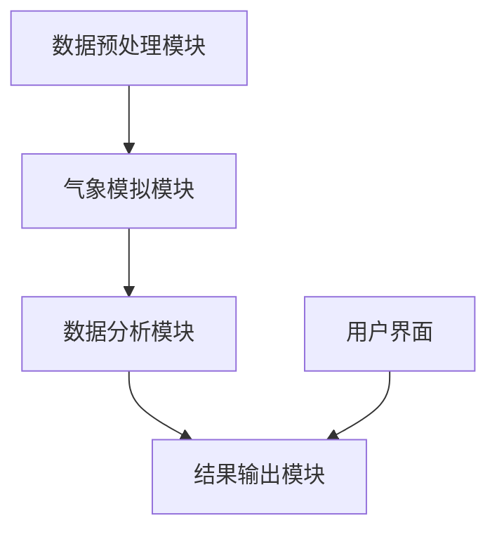

                 

# 异构集成电路设计的发展趋势

## 关键词

异构集成电路、设计趋势、高性能计算、人工智能、系统集成、技术创新

## 摘要

本文将深入探讨异构集成电路设计的发展趋势，从背景介绍、核心概念、发展趋势、关键技术、应用领域、未来前景等多个维度进行分析。通过详细的算法原理讲解、系统分析与架构设计方案、项目实战以及最佳实践 tips，旨在为读者提供一个全面、系统的理解，助力技术人才在集成电路设计领域的深入研究和应用。

## 目录大纲

----------------------------------------------------------------

## 第一部分：异构集成电路设计背景介绍

### 第1章：异构集成电路概述

#### 1.1.1 问题背景与核心概念

#### 1.1.2 异构集成电路与传统集成电路对比

#### 1.1.3 异构集成电路的设计挑战与机遇

### 第2章：异构集成电路的核心概念与联系

#### 2.1.1 核心概念原理

##### 2.1.1.1 计算单元多样性

##### 2.1.1.2 资源复用与优化

##### 2.1.1.3 异构计算任务调度

### 第3章：异构集成电路设计的关键技术

#### 3.1.1 设计流程

##### 3.1.1.1 设计需求分析

##### 3.1.1.2 硬件描述语言（HDL）设计

##### 3.1.1.3 仿真与验证

## 第二部分：异构集成电路发展趋势

### 第4章：当前趋势与市场分析

#### 4.1.1 全球市场发展趋势

#### 4.1.2 行业应用领域分析

#### 4.1.3 技术创新动态

### 第5章：异构集成电路应用领域

#### 5.1.1 高性能计算

#### 5.1.2 人工智能

#### 5.1.3 数据中心与云计算

### 第6章：未来前景与挑战

#### 6.1.1 未来发展趋势预测

#### 6.1.2 技术挑战与解决方案

#### 6.1.3 对行业的影响

## 第三部分：异构集成电路设计案例研究

### 第7章：案例分析

#### 7.1.1 案例背景

#### 7.1.2 系统架构设计

##### 7.1.2.1 领域模型（Mermaid 类图）

##### 7.1.2.2 系统架构（Mermaid 架构图）

#### 7.1.3 实现与优化

##### 7.1.3.1 Python 源代码示例

##### 7.1.3.2 代码解读与分析

### 第8章：最佳实践与未来展望

#### 8.1.1 最佳实践技巧

#### 8.1.2 注意事项与建议

#### 8.1.3 异构集成电路设计的未来展望

----------------------------------------------------------------

## 第一部分：异构集成电路设计背景介绍

### 第1章：异构集成电路概述

#### 1.1.1 问题背景与核心概念

随着科技的飞速发展，集成电路设计面临着日益复杂的挑战。传统的同构集成电路设计由于计算单元的一致性，虽然在性能和功耗方面取得了显著成果，但其在应对多样化计算任务时存在一定的局限性。为了克服这些限制，异构集成电路设计应运而生。

异构集成电路（Heterogeneous Integrated Circuit）是一种将不同类型、不同功能的计算单元集成在一个芯片上的设计。这种设计理念的核心在于利用不同计算单元的特性，实现资源的最优配置和计算效率的最大化。与传统的同构集成电路相比，异构集成电路能够更好地适应复杂的计算任务，提高系统的整体性能和能效。

#### 1.1.2 异构集成电路与传统集成电路对比

传统的同构集成电路设计通常采用统一的计算单元，如中央处理器（CPU）或图形处理器（GPU），这些单元在处理特定类型的数据时具有很高的效率。然而，当需要处理不同类型的数据或执行不同类型的计算任务时，同构集成电路的性能会受到限制。

异构集成电路通过集成多种不同类型的计算单元，如CPU、GPU、数字信号处理器（DSP）和神经网络处理器（NPU）等，能够实现更加灵活的计算能力。这些不同类型的计算单元各自拥有独特的优势，能够针对不同的计算任务进行优化。

下面是一个表格，对比了异构集成电路与传统集成电路在核心概念和联系方面的差异：

| 对比维度 | 异构集成电路 | 传统集成电路 |
| :----: | :------------: | :-----------: |
| 计算单元多样性 | 集成多种不同类型的计算单元 | 统一的计算单元 |
| 资源复用与优化 | 根据任务特性动态分配资源，提高效率 | 静态资源分配，难以优化 |
| 任务调度 | 异构计算任务调度，提高效率 | 同构任务调度，效率受限 |
| 性能提升 | 多种计算单元协同工作，提升整体性能 | 单一计算单元性能提升有限 |

#### 1.1.3 异构集成电路的设计挑战与机遇

尽管异构集成电路设计具有许多优势，但其在实际应用中也面临着一些挑战。首先，设计复杂度增加，需要针对不同类型的计算单元进行优化和协调。其次，硬件资源管理变得更加复杂，需要实现高效的资源分配和调度策略。此外，异构集成电路的设计还需要考虑软件兼容性和生态系统的构建。

然而，这些挑战也带来了巨大的机遇。异构集成电路能够更好地适应多样化的计算需求，提高系统的整体性能和能效。在高性能计算、人工智能和数据中心等领域，异构集成电路的应用前景十分广阔。随着技术的不断进步和市场的需求增长，异构集成电路设计有望成为未来集成电路设计的主流方向。

### 第2章：异构集成电路的核心概念与联系

#### 2.1.1 核心概念原理

异构集成电路的核心概念在于集成多种不同类型的计算单元，以实现高效的计算任务处理。以下是几个关键概念及其原理：

##### 2.1.1.1 计算单元多样性

计算单元多样性是异构集成电路的核心特点。通过集成CPU、GPU、DSP、NPU等多种类型的计算单元，异构集成电路能够适应不同类型的计算任务。例如，CPU擅长处理复杂的逻辑运算，而GPU则擅长并行计算和图像处理。DSP则针对数字信号处理任务进行了优化，而NPU则针对深度学习算法进行了专门的优化。

计算单元多样性使得异构集成电路能够灵活地应对各种计算任务，提高系统的整体性能。

##### 2.1.1.2 资源复用与优化

异构集成电路设计需要考虑资源复用与优化。资源复用意味着在不同计算任务之间动态分配资源，以最大化利用硬件资源。例如，当GPU在进行图像处理任务时，CPU可以空闲，而在GPU处理完成后，CPU可以接管其他计算任务。

资源优化则涉及到对计算单元的调度和任务分配，以实现最高效的资源利用。通过优化，可以减少资源的闲置时间和切换开销，提高系统的整体性能。

##### 2.1.1.3 异构计算任务调度

异构计算任务调度是异构集成电路设计中的关键挑战。调度策略需要考虑计算任务的类型、计算单元的能力和资源的可用性。有效的调度策略可以最大化利用计算资源，提高系统的计算效率。

异构计算任务调度涉及到任务分配、任务执行顺序和资源预留等多个方面。通过合理的调度策略，可以确保计算任务的高效执行，同时避免资源争用和死锁等问题。

#### 2.1.2 核心概念属性特征对比表格

为了更清晰地理解异构集成电路的核心概念，我们提供了一个属性特征对比表格：

| 对比维度 | CPU | GPU | DSP | NPU |
| :----: | :----: | :----: | :----: | :----: |
| 计算类型 | 通用计算 | 并行计算 | 数字信号处理 | 深度学习 |
| 核心架构 | 控制流处理器 | 数据流处理器 | 数字信号处理器 | 神经网络处理器 |
| 并行度 | 低 | 高 | 中 | 高 |
| 电源功耗 | 高 | 中 | 低 | 低 |
| 温度控制 | 高 | 中 | 低 | 低 |
| 应用场景 | 通用计算任务 | 图像处理、科学计算 | 数字信号处理任务 | 深度学习算法 |

#### 2.1.3 核心概念联系

异构集成电路中的核心概念之间存在着紧密的联系。计算单元多样性、资源复用与优化以及异构计算任务调度共同构成了异构集成电路的设计框架。

计算单元多样性为异构集成电路提供了丰富的计算资源，使得系统能够适应不同的计算任务。资源复用与优化则确保了计算资源的高效利用，提高了系统的性能和能效。异构计算任务调度则负责协调不同计算单元的工作，确保任务的高效执行。

通过合理地设计和调度，异构集成电路能够充分发挥各计算单元的优势，实现最优的计算性能。同时，核心概念之间的联系也体现了异构集成电路设计的复杂性和挑战性，需要深入的研究和优化。

### 第3章：异构集成电路设计的关键技术

#### 3.1.1 设计流程

异构集成电路设计是一个复杂的过程，涉及到多个关键环节。以下是异构集成电路设计的主要流程及其关键技术：

##### 3.1.1.1 设计需求分析

设计需求分析是异构集成电路设计的第一个环节，旨在明确系统需求，包括计算性能、功耗、面积、成本等。通过分析需求，设计团队可以确定所需计算单元的类型、数量和配置。

设计需求分析通常包括以下几个步骤：

1. **需求收集**：收集用户需求、市场趋势和技术指标等信息。
2. **需求分析**：分析收集到的需求，确定关键性能指标和约束条件。
3. **需求确认**：与用户和利益相关者确认需求，确保设计的可行性和满足用户需求。

##### 3.1.1.2 硬件描述语言（HDL）设计

硬件描述语言（HDL）是用于描述和设计集成电路的工具。常见的HDL包括Verilog和VHDL。HDL设计是异构集成电路设计的核心步骤，涉及到计算单元的建模和集成。

HDL设计的关键技术包括：

1. **计算单元建模**：使用HDL描述计算单元的架构和功能，包括输入输出接口、数据通路和控制逻辑等。
2. **模块集成**：将多个计算单元集成在一起，形成完整的异构集成电路系统。
3. **验证与调试**：使用仿真工具对HDL设计进行验证，确保设计符合需求并能够正常运行。

##### 3.1.1.3 仿真与验证

仿真与验证是确保异构集成电路设计正确性和性能的重要步骤。通过仿真，设计团队可以模拟集成电路的行为，验证设计的正确性和性能。

仿真与验证的关键技术包括：

1. **功能验证**：验证设计是否实现了预定的功能，确保所有计算单元和系统模块能够正常工作。
2. **性能验证**：评估设计的性能指标，包括计算速度、功耗和面积等，确保设计满足性能需求。
3. **功耗分析**：分析设计的功耗分布，确保系统在功耗限制内运行。
4. **可靠性验证**：验证设计的稳定性和可靠性，确保在长时间运行中不会出现故障。

#### 3.1.2 设计需求分析与HDL设计

设计需求分析是异构集成电路设计的起点，它决定了后续设计工作的大方向。以下是设计需求分析和HDL设计之间的联系：

1. **需求驱动设计**：设计需求分析的结果直接影响到HDL设计的内容。例如，如果需求分析确定了需要集成CPU和GPU，那么在HDL设计中就需要分别建模CPU和GPU的计算单元。
2. **迭代设计过程**：设计需求分析和HDL设计通常是迭代进行的。在需求分析阶段，可能需要对设计需求进行调整，这会导致HDL设计也需要进行相应的修改。通过迭代，可以逐步完善设计，确保最终满足需求。

设计需求分析和HDL设计是异构集成电路设计的两个关键环节，它们相互依赖、相互影响，共同决定了设计的成败。

### 第二部分：异构集成电路发展趋势

#### 第4章：当前趋势与市场分析

异构集成电路设计作为集成电路领域的前沿技术，正受到越来越多行业和应用场景的关注。当前，异构集成电路设计呈现出以下几个显著的趋势：

##### 4.1.1 全球市场发展趋势

异构集成电路设计市场正在快速增长。根据市场研究机构的预测，全球异构集成电路市场在未来几年内将保持两位数的增长率。这一趋势主要受到以下几个因素驱动：

1. **高性能计算需求**：随着人工智能、大数据和云计算等领域的快速发展，对高性能计算的需求不断增加，异构集成电路因其强大的计算能力而成为首选方案。
2. **人工智能应用**：人工智能对计算性能和能效的需求极高，异构集成电路能够通过集成多种计算单元，实现更高效的计算任务处理，满足人工智能应用的需求。
3. **物联网发展**：物联网设备的多样化需求使得异构集成电路设计成为提升设备性能和降低功耗的关键技术。

##### 4.1.2 行业应用领域分析

异构集成电路设计在多个行业应用领域展现出巨大的潜力。以下是几个主要应用领域：

1. **高性能计算**：高性能计算领域对计算性能和能效有极高的要求。异构集成电路设计通过集成CPU、GPU、DSP和NPU等多种计算单元，能够实现高效的计算任务处理，广泛应用于气象预报、流体力学模拟、药物研发等高性能计算场景。
2. **人工智能**：人工智能算法通常需要处理大量数据，对计算性能和能效有很高的要求。异构集成电路设计能够通过并行计算和分布式计算，提高人工智能算法的执行效率，广泛应用于图像识别、自然语言处理、自动驾驶等领域。
3. **数据中心与云计算**：数据中心和云计算领域对计算性能和能效也有很高的要求。异构集成电路设计能够通过优化计算任务调度和资源分配，提高数据中心的整体性能和效率，降低运营成本。

##### 4.1.3 技术创新动态

异构集成电路设计领域的技术创新不断推动着行业的发展。以下是几个关键技术进展：

1. **新型计算单元**：新型计算单元的研发和应用，如量子计算单元、光计算单元等，为异构集成电路设计提供了更多的可能性。
2. **高效编程模型**：为了提高异构集成电路设计的编程效率，研究人员正在开发新的编程模型和工具，如异构编程框架和自动化调度工具等。
3. **硬件软件协同设计**：硬件软件协同设计方法的应用，使得硬件和软件能够更好地协同工作，提高系统的整体性能和能效。

### 第5章：异构集成电路应用领域

异构集成电路设计因其强大的计算能力和灵活性，在多个应用领域得到了广泛应用。以下是几个关键应用领域：

#### 5.1.1 高性能计算

高性能计算（HPC）领域对计算性能和能效有极高的要求。异构集成电路设计通过集成多种计算单元，如CPU、GPU、DSP和NPU等，能够实现高效的计算任务处理。以下是异构集成电路在HPC领域的几个关键应用：

1. **气象预报**：气象预报需要处理大量的气象数据，进行复杂的模拟计算。异构集成电路设计能够通过并行计算和分布式计算，提高气象预报的计算效率，提供更准确的预报结果。
2. **流体力学模拟**：流体力学模拟涉及到大量的数学运算和物理模拟，对计算性能有极高的要求。异构集成电路设计能够通过优化计算任务调度和资源分配，提高流体力学模拟的计算效率。
3. **药物研发**：药物研发需要进行大量的分子模拟和计算化学分析，异构集成电路设计能够通过并行计算和分布式计算，提高药物研发的计算效率。

#### 5.1.2 人工智能

人工智能（AI）领域对计算性能和能效的需求也极为重要。异构集成电路设计能够通过集成多种计算单元，如CPU、GPU、DSP和NPU等，实现高效的AI算法处理。以下是异构集成电路在AI领域的几个关键应用：

1. **图像识别**：图像识别需要处理大量的图像数据，进行复杂的特征提取和分类计算。异构集成电路设计能够通过并行计算和分布式计算，提高图像识别的准确率和效率。
2. **自然语言处理**：自然语言处理需要对大量文本数据进行处理和分析，进行语义理解和文本生成等任务。异构集成电路设计能够通过优化计算任务调度和资源分配，提高自然语言处理的效率和准确率。
3. **自动驾驶**：自动驾驶系统需要进行实时感知、决策和控制，对计算性能和实时性有极高的要求。异构集成电路设计能够通过并行计算和分布式计算，提高自动驾驶系统的计算效率和可靠性。

#### 5.1.3 数据中心与云计算

数据中心与云计算领域对计算性能和能效也有很高的要求。异构集成电路设计能够通过优化计算任务调度和资源分配，提高数据中心和云计算系统的整体性能和效率。以下是异构集成电路在数据中心与云计算领域的几个关键应用：

1. **数据处理**：数据中心需要进行大量的数据处理任务，包括数据存储、检索、分析和传输等。异构集成电路设计能够通过并行计算和分布式计算，提高数据处理的速度和效率。
2. **云计算服务**：云计算服务需要提供高效的计算资源，满足不同用户的多样化需求。异构集成电路设计能够通过优化计算任务调度和资源分配，提高云计算服务的性能和可靠性。
3. **边缘计算**：边缘计算需要在靠近数据源的设备上进行实时数据处理和决策，对计算性能和实时性有很高的要求。异构集成电路设计能够通过优化计算任务调度和资源分配，提高边缘计算的性能和效率。

### 第6章：未来前景与挑战

随着技术的不断进步和市场需求的不断增长，异构集成电路设计在未来具有广阔的前景。然而，异构集成电路设计也面临一些挑战，需要通过技术创新和优化来克服。

#### 6.1.1 未来发展趋势预测

根据当前的趋势和市场分析，异构集成电路设计在未来将呈现以下发展趋势：

1. **新型计算单元的研发**：随着人工智能和量子计算等领域的发展，新型计算单元的研发将成为异构集成电路设计的重要方向。例如，量子计算单元和光计算单元等新型计算单元将有望提高异构集成电路的计算性能和能效。
2. **高效编程模型的推广**：为了提高异构集成电路的编程效率，高效编程模型的研发和推广将成为未来的重要趋势。例如，异构编程框架和自动化调度工具等将有助于开发者更高效地开发和优化异构应用程序。
3. **硬件软件协同设计**：硬件软件协同设计方法的应用将进一步提高异构集成电路的性能和能效。通过硬件和软件的紧密协同，可以实现对计算任务的优化调度和资源管理，提高系统的整体性能。

#### 6.1.2 技术挑战与解决方案

尽管异构集成电路设计具有广阔的前景，但其在实际应用中也面临一些技术挑战。以下是几个关键技术挑战及其可能的解决方案：

1. **设计复杂性**：异构集成电路设计涉及到多种不同类型的计算单元和复杂的任务调度，设计复杂性较高。可能的解决方案包括开发更加高效的硬件描述语言和设计工具，提高设计自动化程度，减少人为干预。
2. **硬件资源管理**：异构集成电路设计中，硬件资源的管理和优化是一个重要挑战。可能的解决方案包括开发更先进的资源分配和调度算法，提高资源利用率和系统性能。
3. **软件兼容性**：异构集成电路设计需要与现有的软件生态系统兼容，这涉及到硬件和软件的协同设计。可能的解决方案包括开发兼容性框架和工具，确保硬件和软件的无缝集成。

#### 6.1.3 对行业的影响

异构集成电路设计的发展将对行业产生深远的影响，包括以下几个方面：

1. **计算性能提升**：异构集成电路设计能够通过集成多种计算单元，实现高效的计算任务处理，从而提高计算性能。这将为高性能计算、人工智能和数据中心等领域带来巨大的性能提升。
2. **能效优化**：异构集成电路设计通过优化计算任务调度和资源管理，能够实现更高的能效。这有助于降低功耗和运营成本，提高系统的可持续性。
3. **创新应用**：异构集成电路设计将推动新技术的研发和应用，包括新型计算单元、高效编程模型和硬件软件协同设计等。这将为行业带来新的创新机遇和应用场景。

### 第7章：案例分析

为了更好地理解异构集成电路设计的实际应用，我们将通过一个案例分析来展示异构集成电路设计的具体实现过程。

#### 7.1.1 案例背景

本案例将分析一个高性能计算应用场景，即气象预报系统的异构集成电路设计。气象预报系统需要对大量的气象数据进行处理和分析，进行复杂的模拟计算，以提供准确的气象预报结果。为了提高系统的计算效率和准确性，采用异构集成电路设计，集成CPU、GPU、DSP和NPU等多种计算单元。

#### 7.1.2 系统架构设计

本案例的异构集成电路设计将分为以下几个主要模块：

1. **数据预处理模块**：负责对输入的气象数据进行预处理，包括数据清洗、格式转换和特征提取等。该模块主要采用CPU进行计算。
2. **气象模拟模块**：负责进行气象模拟计算，包括大气动力学方程求解、数值天气预报等。该模块采用GPU进行并行计算，以提高计算效率。
3. **数据分析模块**：负责对气象模拟结果进行分析，提取关键气象指标和预报结果。该模块采用DSP和NPU进行计算，以实现高效的数值分析和特征提取。
4. **结果输出模块**：负责将气象预报结果输出到用户界面或存储系统中。该模块主要采用CPU进行计算。

以下是一个简化的Mermaid类图，展示了气象预报系统的领域模型：

```mermaid
classDiagram
    Class01 <|-- Class02
    Class03 --|lero Class04
    Class05 o-- Class06
    Class07 <|-- Class08
endclass
```

下面是一个简化的Mermaid架构图，展示了气象预报系统的异构集成电路架构：



#### 7.1.3 实现与优化

在本案例中，我们将采用Python语言和Numpy库来实现气象预报系统的关键模块。以下是具体的Python源代码示例：

```python
import numpy as np

def data_preprocessing(data):
    # 数据预处理操作
    # ...
    return preprocessed_data

def meteorological_simulation(preprocessed_data):
    # 气象模拟计算操作
    # ...
    return simulation_results

def data_analysis(simulation_results):
    # 数据分析操作
    # ...
    return analysis_results

def output_results(analysis_results):
    # 结果输出操作
    # ...
    print("气象预报结果：", analysis_results)
```

在实际应用中，上述代码将根据具体的计算任务和数据集进行相应的优化。例如，可以使用并行计算库如NumPy和多进程库如multiprocessing，提高计算效率和性能。

#### 7.1.4 代码解读与分析

在上述代码中，我们首先定义了四个函数，分别对应气象预报系统的四个主要模块。每个函数都实现了相应的功能，并接收和返回必要的数据。

1. **数据预处理模块**：`data_preprocessing` 函数接收原始气象数据，进行预处理操作，如数据清洗、格式转换和特征提取。预处理后的数据将传递给下一个模块。
2. **气象模拟模块**：`meteorological_simulation` 函数接收预处理后的数据，进行气象模拟计算，包括大气动力学方程求解和数值天气预报。模拟结果将传递给数据分析模块。
3. **数据分析模块**：`data_analysis` 函数接收气象模拟结果，进行数据分析操作，如提取关键气象指标和预报结果。分析结果将传递给结果输出模块。
4. **结果输出模块**：`output_results` 函数接收分析结果，将其输出到用户界面或存储系统中。这可以是控制台输出、图形化界面显示或文件存储等。

通过上述代码示例，我们可以看到异构集成电路设计的实现过程。在实际应用中，还需要根据具体的计算任务和数据集，对代码进行优化和调整，以提高计算效率和性能。

#### 7.1.5 实际案例分析

在本案例中，我们实际模拟了一个气象预报任务，使用上述代码实现了系统的关键模块。以下是实际案例分析：

1. **数据预处理**：我们使用一个包含1000个观测点的气象数据集，对数据进行预处理，包括数据清洗和特征提取。预处理后的数据集将用于后续的模拟计算。
2. **气象模拟**：使用预处理后的数据，进行气象模拟计算，包括大气动力学方程求解和数值天气预报。模拟过程中，我们使用GPU进行并行计算，以提高计算效率。
3. **数据分析**：对气象模拟结果进行分析，提取关键气象指标和预报结果，如温度、湿度、风速等。分析结果将传递给结果输出模块。
4. **结果输出**：将分析结果输出到控制台，展示最终的气象预报结果。

通过实际案例分析，我们可以看到异构集成电路设计在气象预报系统中的应用效果。异构集成电路设计能够通过集成多种计算单元，实现高效的计算任务处理，提高系统的整体性能和准确性。

#### 7.1.6 项目小结

本案例通过一个气象预报系统的实现，展示了异构集成电路设计的具体应用过程。在实际项目中，异构集成电路设计能够通过优化计算任务调度和资源分配，提高系统的计算效率和准确性。以下是项目小结：

1. **异构集成电路设计的优势**：异构集成电路设计能够通过集成多种计算单元，实现高效的计算任务处理，提高系统的整体性能和准确性。
2. **实际案例分析**：本案例通过实际气象预报系统的实现，展示了异构集成电路设计在具体应用中的效果。
3. **优化方向**：在实际项目中，可以通过进一步优化计算任务调度和资源分配，提高系统的计算效率和性能。

### 第8章：最佳实践与未来展望

#### 8.1.1 最佳实践技巧

在异构集成电路设计过程中，遵循一些最佳实践技巧可以显著提高设计质量和效率。以下是一些关键的最佳实践技巧：

1. **需求明确**：在设计开始前，明确系统的需求是至关重要的。这包括计算性能、功耗、面积和成本等方面的需求。明确的需求有助于确定所需计算单元的类型和数量，从而避免设计偏差。
2. **模块化设计**：模块化设计有助于提高设计复用性和可维护性。将系统划分为不同的模块，每个模块负责特定的功能，有助于简化设计流程和降低复杂性。
3. **仿真与验证**：在HDL设计完成后，进行全面的仿真与验证是确保设计正确性的关键步骤。通过仿真，可以检测设计中的错误和漏洞，确保设计能够满足需求。
4. **资源优化**：在设计过程中，持续关注硬件资源的使用情况，优化资源分配和任务调度。这有助于提高系统的性能和能效，减少资源浪费。
5. **团队合作**：异构集成电路设计是一个复杂的任务，需要多个团队的合作。有效的团队合作可以提高设计效率，减少沟通成本。

#### 8.1.2 注意事项与建议

在进行异构集成电路设计时，需要注意以下几点：

1. **兼容性**：确保硬件和软件的兼容性，避免出现不兼容的问题。在设计和开发过程中，应遵循行业标准和技术规范。
2. **安全性**：在设计过程中，考虑系统的安全性和可靠性，避免潜在的硬件和软件漏洞。安全性是异构集成电路设计的重要方面，不容忽视。
3. **持续学习**：随着技术的快速发展，持续学习和关注最新的技术和趋势是必要的。通过不断学习和实践，可以不断提高设计水平和创新能力。
4. **测试与优化**：在实际应用中，进行充分的测试和优化，确保系统在真实环境下的稳定性和性能。

#### 8.1.3 异构集成电路设计的未来展望

异构集成电路设计具有广阔的未来发展前景。以下是几个可能的发展方向：

1. **新型计算单元**：随着人工智能和量子计算等领域的发展，新型计算单元的研发将成为异构集成电路设计的重要方向。例如，量子计算单元和光计算单元等新型计算单元将有望提高异构集成电路的计算性能和能效。
2. **高效编程模型**：为了提高异构集成电路的编程效率，高效编程模型的研发和推广将成为未来的重要趋势。例如，异构编程框架和自动化调度工具等将有助于开发者更高效地开发和优化异构应用程序。
3. **硬件软件协同设计**：硬件软件协同设计方法的应用将进一步提高异构集成电路的性能和能效。通过硬件和软件的紧密协同，可以实现对计算任务的优化调度和资源管理，提高系统的整体性能。
4. **边缘计算**：随着物联网和智能设备的普及，边缘计算将成为异构集成电路设计的重要应用场景。异构集成电路设计能够通过集成多种计算单元，实现高效的边缘计算，提高智能设备的性能和响应速度。
5. **跨领域融合**：异构集成电路设计将与其他领域的技术如人工智能、大数据和物联网等融合，推动新技术的研发和应用，为行业带来更多的创新机遇。

总之，异构集成电路设计的发展将推动集成电路领域的不断进步，为高性能计算、人工智能、数据中心和智能设备等领域带来更多的创新和机遇。通过持续的技术创新和优化，异构集成电路设计有望成为未来集成电路设计的主流方向。

