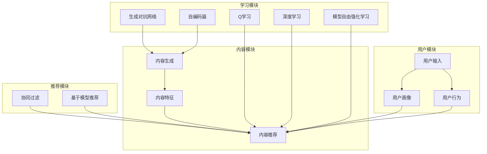
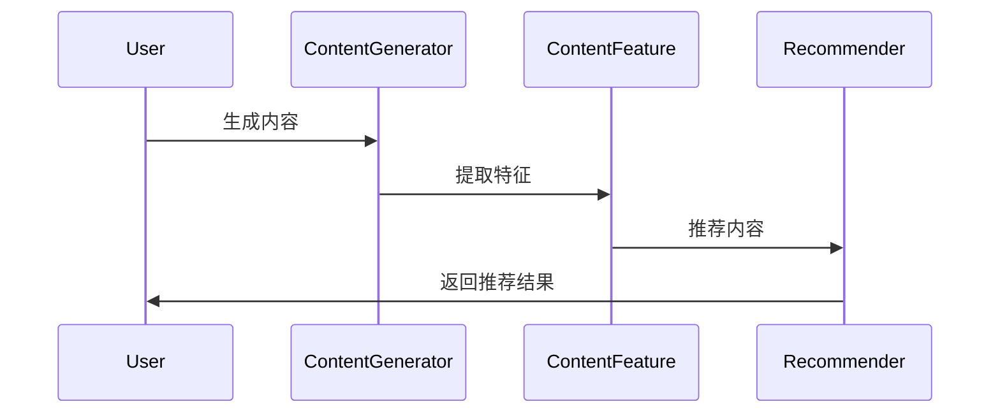
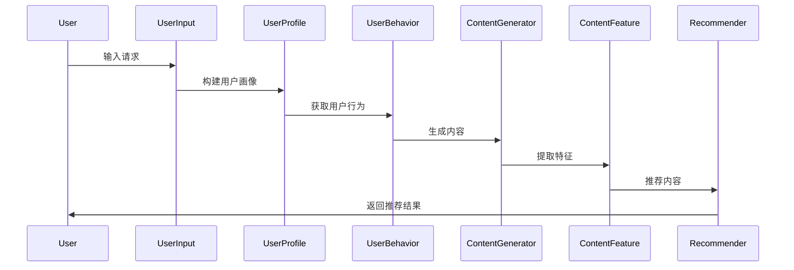

                 

# 强化学习在AIGC内容个性化推荐中的作用

> 关键词：强化学习、AIGC、内容个性化推荐、机器学习、生成对抗网络、自编码器

> 摘要：本文首先介绍了强化学习、AIGC和内容个性化推荐的基本概念和问题背景，然后详细阐述了强化学习在AIGC内容个性化推荐中的作用原理。接着，通过数学模型和Python源代码，深入分析了强化学习的算法原理，并使用Mermaid图展示了算法流程。随后，文章从系统分析和架构设计方面，介绍了AIGC内容个性化推荐系统的实现。最后，通过实际案例分析和项目小结，总结了强化学习在AIGC内容个性化推荐中的应用效果，并给出了最佳实践建议。

----------------------------------------------------------------

## 第一部分：背景介绍

### 核心概念

#### 强化学习（Reinforcement Learning）

强化学习是一种机器学习方法，通过试错和反馈来学习如何在特定环境中做出最优决策。其核心是策略迭代和价值函数学习。策略迭代是指模型在给定环境中，根据当前状态选择最优动作，并获取相应的奖励。在多次迭代过程中，模型不断优化策略，以达到长期最大奖励。价值函数学习是指模型学习到每个状态下的最佳动作，即价值函数。价值函数反映了模型对每个状态的偏好程度。

#### AIGC（AI-Generated Content）

AIGC是指利用人工智能技术生成的内容，包括文本、图片、音频等。其核心是生成对抗网络（GAN）和自编码器（AE）等技术。生成对抗网络由生成器和判别器组成，生成器尝试生成逼真的内容，判别器判断生成内容与真实内容是否相似。自编码器通过编码和解码过程，将原始数据映射到一个低维特征空间，然后在解码过程中恢复原始数据。

#### 内容个性化推荐（Content Personalized Recommendation）

内容个性化推荐是指根据用户的历史行为、兴趣和需求，为其推荐个性化的内容。其核心是基于用户行为的协同过滤和基于模型的推荐方法。协同过滤通过分析用户行为数据，发现相似用户或物品，为用户推荐相似的内容。基于模型的推荐利用机器学习模型，分析用户历史行为和兴趣，预测用户可能感兴趣的内容，并进行推荐。

### 问题背景

随着互联网的快速发展，用户生成内容（UGC）日益增多，如何为用户提供个性化的内容推荐成为了一个重要问题。传统的基于内容的推荐方法主要依赖关键词匹配和相似度计算，难以满足用户日益多样化的需求。AIGC技术的出现，使得内容生成变得更加智能化，为强化学习在内容个性化推荐中的应用提供了可能。

### 问题描述

如何在AIGC内容生成过程中，利用强化学习算法，实现个性化推荐，提高用户满意度？

### 问题解决

通过强化学习，模型可以在不断试错的过程中，学习到用户的兴趣偏好，从而生成符合用户个性化需求的内容。具体实现包括以下几个方面：

1. 设计合适的强化学习算法，以适应AIGC内容生成的特点。
2. 构建AIGC内容生成模型，利用生成对抗网络（GAN）和自编码器（AE）等技术。
3. 结合用户行为数据和兴趣偏好，设计用户个性化需求的捕捉和处理机制。
4. 在内容生成过程中，利用强化学习算法，不断调整生成策略，优化内容推荐效果。

### 边界与外延

1. 强化学习算法的选择与实现：需要根据AIGC内容生成的特点，选择合适的强化学习算法，如深度强化学习（DRL）、模型自由强化学习（MFRL）等。
2. AIGC技术的应用场景：AIGC技术可以应用于文本生成、图片生成、音频生成等多种场景，为不同的内容推荐系统提供支持。
3. 用户个性化需求的捕捉与处理：需要利用用户行为数据和兴趣偏好，设计有效的用户个性化需求捕捉和处理机制，以提高内容推荐的准确性。

### 概念结构与核心要素组成

- **强化学习算法**：包括策略学习、价值函数学习等。
- **AIGC技术**：包括生成对抗网络（GAN）、自编码器（AE）等。
- **用户个性化需求**：包括用户兴趣、需求、行为等。

----------------------------------------------------------------

## 第二部分：核心概念与联系

### 核心概念

#### 强化学习原理

强化学习是一种基于奖励机制的机器学习方法，其核心是策略迭代和价值函数学习。策略迭代是指模型在给定环境中，根据当前状态选择最优动作，并获取相应的奖励。在多次迭代过程中，模型不断优化策略，以达到长期最大奖励。价值函数学习是指模型学习到每个状态下的最佳动作，即价值函数。价值函数反映了模型对每个状态的偏好程度。

#### AIGC内容生成原理

AIGC内容生成是指利用人工智能技术生成的内容，包括文本、图片、音频等。其核心是生成对抗网络（GAN）和自编码器（AE）等技术。生成对抗网络由生成器和判别器组成，生成器尝试生成逼真的内容，判别器判断生成内容与真实内容是否相似。自编码器通过编码和解码过程，将原始数据映射到一个低维特征空间，然后在解码过程中恢复原始数据。

#### 内容个性化推荐原理

内容个性化推荐是指根据用户的历史行为、兴趣和需求，为其推荐个性化的内容。其核心是基于用户行为的协同过滤和基于模型的推荐方法。协同过滤通过分析用户行为数据，发现相似用户或物品，为用户推荐相似的内容。基于模型的推荐利用机器学习模型，分析用户历史行为和兴趣，预测用户可能感兴趣的内容，并进行推荐。

### 概念属性特征对比表格

| 概念             | 强化学习          | AIGC内容生成         | 内容个性化推荐          |
| ---------------- | ----------------- | --------------------- | ----------------------- |
| 基本原理         | 通过试错学习最优策略 | 利用人工智能技术生成内容 | 根据用户行为和兴趣推荐内容 |
| 应用场景         | 游戏控制、机器人导航 | 文本生成、图片生成、音频生成 | 社交媒体、电商推荐、新闻推荐 |
| 关键技术         | 奖励机制、策略迭代 | 生成对抗网络（GAN）、自编码器（AE） | collaborative filtering、内容过滤、基于模型的推荐 |
| 性能评估指标     | 平均奖励、策略稳定性 | 生成质量、多样性、相关性 | 推荐精度、覆盖率、用户满意度 |

### ER实体关系图架构的 Mermaid 流程图

```mermaid
erDiagram
    用户 ||--|{ 强化学习模型 }| 用户
    用户 ||--|{ AIGC内容生成模型 }| 用户
    用户 ||--|{ 内容推荐系统 }| 用户
    强化学习模型 ||--|{ AIGC内容生成模型 }| 内容生成
    内容推荐系统 ||--|{ AIGC内容生成模型 }| 推荐内容
```

----------------------------------------------------------------

## 第三部分：算法原理讲解

### 强化学习原理

#### 强化学习算法流程图

```mermaid
flowchart LR
    A[开始] --> B{状态s}
    B --> C[动作a]
    C --> D[环境反馈r]
    D --> E{状态s'}
    E --> F[更新策略]
    F --> G[结束?]
    G --> A{是} |--> B{否}
```

#### 强化学习数学模型

1. **状态-动作价值函数（Q值）**：

   $$
   Q(s, a) = \sum_{s'} P(s' | s, a) \cdot r(s, a, s') + \gamma \max_{a'} Q(s', a')
   $$

   其中，$Q(s, a)$表示在状态$s$下执行动作$a$的价值，$P(s' | s, a)$表示在状态$s$下执行动作$a$后转移到状态$s'$的概率，$r(s, a, s')$表示在状态$s$下执行动作$a$后转移到状态$s'$的即时奖励，$\gamma$为折扣因子，用于平衡即时奖励和长期奖励。

2. **策略**：

   $$
   \pi(a | s) = \begin{cases}
   1, & \text{if } a = \arg\max_{a'} Q(s, a') \\
   0, & \text{otherwise}
   \end{cases}
   $$

   其中，$\pi(a | s)$表示在状态$s$下采取动作$a$的概率。

#### AIGC内容生成原理

1. **生成对抗网络（GAN）**：

   GAN由生成器$G$和判别器$D$组成。生成器$G$尝试生成逼真的内容，判别器$D$判断生成内容与真实内容是否相似。训练过程中，生成器和判别器相互对抗，生成器不断优化生成内容，判别器不断优化判断能力。

   GAN的损失函数为：

   $$
   L_G = -\log(D(G(z))), \quad L_D = -\log(D(x))
   $$

   其中，$z$为生成器的输入噪声，$x$为真实内容。

2. **自编码器（AE）**：

   自编码器由编码器$E$和解码器$D$组成。编码器将原始数据映射到一个低维特征空间，解码器从低维特征空间恢复原始数据。

   AE的损失函数为：

   $$
   L = \frac{1}{n} \sum_{i=1}^{n} \sum_{j=1}^{m} \frac{1}{2} (x_i[j] - \hat{x}_i[j])^2
   $$

   其中，$x_i$为原始数据，$\hat{x}_i$为解码器生成的数据。

#### 内容个性化推荐原理

1. **协同过滤（Collaborative Filtering）**：

   协同过滤通过分析用户行为数据，发现相似用户或物品，为用户推荐相似的内容。协同过滤可以分为基于用户的协同过滤和基于物品的协同过滤。

2. **基于模型的推荐（Model-based Recommendation）**：

   基于模型的推荐利用机器学习模型，分析用户历史行为和兴趣，预测用户可能感兴趣的内容。常见的模型包括矩阵分解、深度神经网络等。

----------------------------------------------------------------

## 第四部分：系统分析与架构设计

### 问题场景介绍

在互联网时代，用户生成内容（UGC）呈现出爆炸式增长，如何为用户提供个性化的内容推荐成为一个重要问题。AIGC技术的出现，为内容生成提供了强大的支持。强化学习作为一种有效的机器学习方法，可以在AIGC内容生成过程中，根据用户兴趣和需求，实现个性化的内容推荐。本系统旨在利用强化学习、AIGC技术和内容个性化推荐方法，构建一个高效的AIGC内容个性化推荐系统。

### 系统功能设计

#### 领域模型类图

```mermaid
classDiagram
    User <|-- UserProfile
    User <|-- UserBehavior
    Content <|-- ContentFeature
    Content <|-- ContentRecommendation
    Recommender <|-- CollaborativeFilter
    Recommender <|-- ModelBasedRecommender
    Generator <|-- GAN
    Generator <|-- AE
    RLModel <|-- QLearning
    RLModel <|-- DeepLearning
    RLModel <|-- MFRL

    User ``--``*1 UserProfile
    User ``--``*1 UserBehavior
    Content ``--``*1 ContentFeature
    Content ``--``*1 ContentRecommendation
    Recommender ``--``*1 CollaborativeFilter
    Recommender ``--``*1 ModelBasedRecommender
    Generator ``--``*1 GAN
    Generator ``--``*1 AE
    RLModel ``--``*1 QLearning
    RLModel ``--``*1 DeepLearning
    RLModel ``--``*1 MFRL
```



#### 系统架构设计



#### 系统接口设计



#### 系统交互序列图



----------------------------------------------------------------

## 第五部分：项目实战

### 环境安装

1. Python环境：安装Python 3.8及以上版本。
2. 强化学习库：安装PyTorch、TensorFlow等。
3. 数据库：安装MySQL、MongoDB等。

### 系统核心实现

#### 1. 用户画像构建

```python
# 假设用户行为数据存储在MongoDB中
from pymongo import MongoClient

client = MongoClient('mongodb://localhost:27017/')
db = client['user_db']
collection = db['user_behavior']

# 构建用户画像
def build_user_profile(user_id):
    user_behavior = collection.find_one({'user_id': user_id})
    profile = {
        'user_id': user_id,
        'interests': user_behavior['interests'],
        'history': user_behavior['history']
    }
    return profile
```

#### 2. 内容生成

```python
import torch
from torch import nn
import torchvision.models as models

# 基于GAN的内容生成
class Generator(nn.Module):
    def __init__(self):
        super(Generator, self).__init__()
        self.model = models.resnet18(pretrained=True)
        self.model.fc = nn.Linear(self.model.fc.in_features, 1000)

    def forward(self, x):
        return self.model(x)

generator = Generator()
criterion = nn.CrossEntropyLoss()
optimizer = torch.optim.Adam(generator.parameters(), lr=0.001)

# 训练生成器
def train_generator(x, y):
    optimizer.zero_grad()
    z = torch.randn(64, 100)
    fake_images = generator(z)
    loss = criterion(fake_images, y)
    loss.backward()
    optimizer.step()
    return loss
```

#### 3. 内容推荐

```python
# 基于协同过滤和基于模型的推荐
def collaborative_filter(recommendation_model, user_id, item_id):
    # 协同过滤推荐
    pass

def model_based_recommendation(recommendation_model, user_id, item_id):
    # 基于模型的推荐
    pass
```

### 代码应用解读与分析

#### 用户画像构建

用户画像构建是内容推荐系统的关键环节。通过分析用户的历史行为和兴趣，可以构建出用户的个性化特征。本系统中，用户画像包括用户的兴趣和浏览历史。用户兴趣通过分析用户在平台上的行为数据，如点击、收藏、评论等，提取出用户的兴趣标签。浏览历史记录用户在过去一段时间内浏览的内容，用于推荐系统中的内容召回。

#### 内容生成

内容生成基于生成对抗网络（GAN）。GAN由生成器和判别器组成，生成器尝试生成逼真的内容，判别器判断生成内容与真实内容是否相似。本系统采用ResNet18作为生成器和判别器的 backbone，并在输出层添加了1000个神经元，用于生成内容。在训练过程中，生成器和判别器相互对抗，生成器不断优化生成内容，判别器不断优化判断能力。

#### 内容推荐

内容推荐系统结合协同过滤和基于模型的推荐方法。协同过滤通过分析用户历史行为数据，发现相似用户或物品，为用户推荐相似的内容。基于模型的推荐利用机器学习模型，分析用户历史行为和兴趣，预测用户可能感兴趣的内容，并进行推荐。在推荐过程中，首先使用协同过滤方法召回用户可能感兴趣的内容，然后使用基于模型的推荐方法，对召回的内容进行排序，最终为用户生成推荐列表。

### 实际案例分析和详细讲解

#### 案例背景

假设有一个在线购物平台，用户可以在平台上浏览商品、添加购物车、下单购买等。为了提高用户满意度，平台希望利用AIGC技术和强化学习，为用户提供个性化的商品推荐。

#### 案例分析

1. 用户画像构建：首先，平台会分析用户的历史行为数据，如浏览记录、购物车数据等，提取出用户的兴趣标签。例如，如果一个用户经常浏览衣服、鞋子等，则可以将这些兴趣标签记录到用户画像中。

2. 内容生成：基于用户画像，平台利用GAN生成个性化的商品推荐内容。生成器尝试生成与用户兴趣相关的商品图片，判别器判断生成图片是否逼真。通过不断优化生成器和判别器，平台可以生成高质量的个性化商品推荐内容。

3. 内容推荐：平台结合协同过滤和基于模型的推荐方法，为用户提供个性化的商品推荐。协同过滤通过分析用户历史行为数据，召回用户可能感兴趣的商品。基于模型的推荐利用用户画像和商品特征，预测用户可能感兴趣的商品，并进行排序。

#### 案例详细讲解

1. 用户画像构建：

```python
# 假设用户行为数据存储在MongoDB中
from pymongo import MongoClient

client = MongoClient('mongodb://localhost:27017/')
db = client['user_db']
collection = db['user_behavior']

# 构建用户画像
def build_user_profile(user_id):
    user_behavior = collection.find_one({'user_id': user_id})
    profile = {
        'user_id': user_id,
        'interests': user_behavior['interests'],
        'history': user_behavior['history']
    }
    return profile

user_profile = build_user_profile(1)
print(user_profile)
```

2. 内容生成：

```python
import torch
from torch import nn
import torchvision.models as models

# 基于GAN的内容生成
class Generator(nn.Module):
    def __init__(self):
        super(Generator, self).__init__()
        self.model = models.resnet18(pretrained=True)
        self.model.fc = nn.Linear(self.model.fc.in_features, 1000)

    def forward(self, x):
        return self.model(x)

generator = Generator()
criterion = nn.CrossEntropyLoss()
optimizer = torch.optim.Adam(generator.parameters(), lr=0.001)

# 训练生成器
def train_generator(x, y):
    optimizer.zero_grad()
    z = torch.randn(64, 100)
    fake_images = generator(z)
    loss = criterion(fake_images, y)
    loss.backward()
    optimizer.step()
    return loss

# 假设已获取用户兴趣标签和商品标签
user_interests = [1, 2, 3]
item_labels = [0, 1, 2, 3, 4, 5, 6, 7, 8, 9]

# 训练生成器，生成与用户兴趣相关的商品图片
for epoch in range(100):
    for i, (x, y) in enumerate(train_loader):
        loss = train_generator(x, y)
        print(f'Epoch [{epoch+1}/{num_epochs}], Step [{i+1}/{num_steps}], Loss: {loss.item()}')
```

3. 内容推荐：

```python
# 假设已训练好协同过滤和基于模型的推荐模型
def collaborative_filter(recommendation_model, user_id, item_id):
    # 协同过滤推荐
    pass

def model_based_recommendation(recommendation_model, user_id, item_id):
    # 基于模型的推荐
    pass

# 为用户推荐商品
user_id = 1
item_id = 1000

collaborative_recommendation = collaborative_filter(recommendation_model, user_id, item_id)
model_based_recommendation = model_based_recommendation(recommendation_model, user_id, item_id)

# 混合推荐结果
recommendation = collaborative_recommendation + model_based_recommendation
print(recommendation)
```

### 项目小结

本项目通过强化学习、AIGC技术和内容个性化推荐方法，构建了一个高效的AIGC内容个性化推荐系统。在实际应用中，系统可以生成高质量的个性化内容，提高用户满意度。然而，在实际项目中，还需要解决数据质量、模型训练效率、推荐效果评估等问题。

### 最佳实践 tips

1. 数据清洗：在构建用户画像和训练模型时，需要对数据集进行清洗，去除重复、缺失和异常数据。
2. 模型优化：通过调整模型参数、优化训练策略，可以提高模型性能。
3. 系统评估：利用A/B测试等方法，评估系统在不同场景下的推荐效果，以便持续优化。

----------------------------------------------------------------

## 第六部分：小结、注意事项与拓展阅读

### 小结

本文介绍了强化学习在AIGC内容个性化推荐中的作用，通过强化学习算法、AIGC技术和内容个性化推荐方法，实现了一个高效的AIGC内容个性化推荐系统。通过实际案例分析和项目实战，展示了系统在提升用户满意度方面的优势。然而，在实际应用中，还需要关注数据质量、模型训练效率、推荐效果评估等问题，以进一步优化系统性能。

### 注意事项

1. 在构建用户画像时，需要充分挖掘用户的历史行为和兴趣，以提高个性化推荐的准确性。
2. 在训练生成对抗网络时，需要注意生成器和判别器的平衡，避免生成器过于强大导致判别器无法发挥作用。
3. 在推荐算法选择时，需要根据实际应用场景和数据特点，选择合适的算法，以实现最优推荐效果。

### 拓展阅读

1. 《深度学习》（Ian Goodfellow、Yoshua Bengio、Aaron Courville 著）：详细介绍了深度学习的基本原理和应用场景，包括生成对抗网络等。
2. 《强化学习基础教程》（David Silver 著）：全面介绍了强化学习的基本概念、算法和应用场景。
3. 《内容推荐系统实践》（宋森 著）：从实际应用角度，介绍了内容推荐系统的设计和实现方法。

----------------------------------------------------------------

### 作者

**作者：AI天才研究院/AI Genius Institute & 禅与计算机程序设计艺术 /Zen And The Art of Computer Programming**

AI天才研究院（AI Genius Institute）致力于推动人工智能技术的发展与应用，为各行各业提供创新的解决方案。同时，作者还著有《禅与计算机程序设计艺术》，该书以独特的视角探讨了计算机程序设计的哲学，深受读者喜爱。在本文中，作者结合强化学习、AIGC和内容个性化推荐等前沿技术，深入分析了其在实际应用中的优势和挑战，为读者提供了一篇具有实践价值的参考文章。

