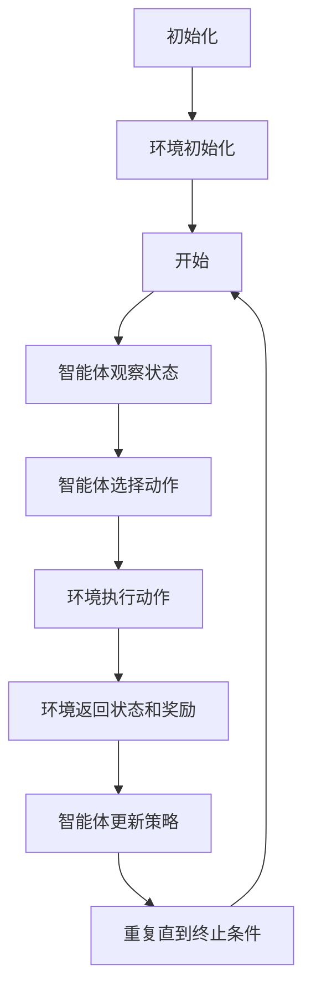
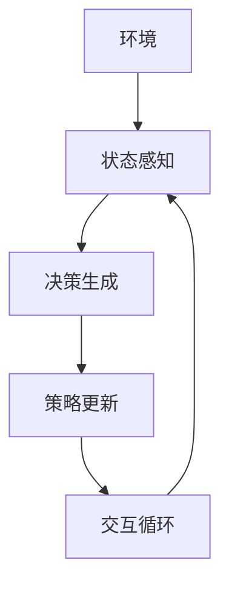
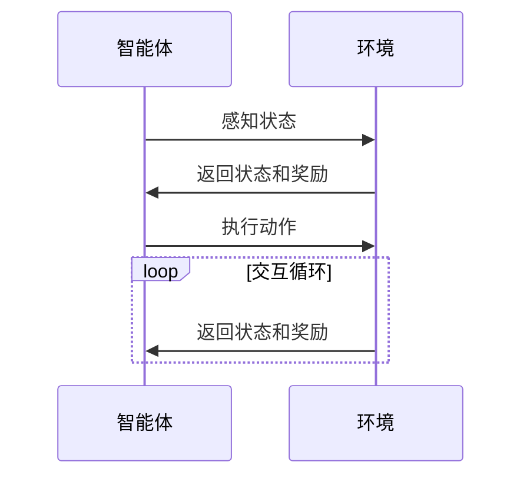

                 


### 文章标题：强化学习在组合优化问题中的应用前景

关键词：强化学习、组合优化、算法、应用前景

摘要：本文将深入探讨强化学习在解决组合优化问题中的应用前景，通过详细的逻辑分析和实例讲解，展示强化学习在优化问题中的强大潜力。文章将从背景介绍、核心概念与联系、算法原理讲解、系统分析与架构设计、项目实战、最佳实践等方面进行阐述。

---

### 目录

1. **背景介绍**
   - 1.1 组合优化问题概述
   - 1.2 强化学习的基本概念
   - 1.3 强化学习在组合优化问题中的应用场景

2. **核心概念与联系**
   - 2.1 强化学习的基本原理
   - 2.2 组合优化问题的常见算法
   - 2.3 强化学习在组合优化问题中的应用案例

3. **算法原理讲解**
   - 3.1 强化学习算法流程图
   - 3.2 强化学习算法的Python源代码
   - 3.3 强化学习算法的数学模型和公式

4. **系统分析与架构设计**
   - 4.1 强化学习在组合优化问题中的系统功能设计
   - 4.2 系统架构设计
   - 4.3 系统接口设计和系统交互序列图

5. **项目实战**
   - 5.1 环境安装与配置
   - 5.2 系统核心实现源代码
   - 5.3 代码应用解读与分析
   - 5.4 实际案例分析与讲解

6. **最佳实践 tips**
   - 6.1 强化学习在组合优化问题中的最佳实践
   - 6.2 小结
   - 6.3 注意事项
   - 6.4 拓展阅读

---

### 第一部分：背景介绍

#### 1.1 组合优化问题概述

组合优化问题是一类广泛存在的优化问题，涉及从一组可能的解决方案中选择最优解。这些问题在许多领域都具有重要的应用，例如物流调度、资源分配、组合设计、投资策略等。

- **基本概念**：组合优化问题可以描述为在给定约束条件下，从一组可能的解决方案中选择一个最优解的问题。这些解决方案通常是离散的，且存在多个可能的组合。
- **问题背景**：组合优化问题在现实世界中无处不在，其解决方法对于提高效率、降低成本、优化资源配置具有重要作用。
- **问题描述**：一个典型的组合优化问题可以表述为：给定一个待优化的问题集合和一个目标函数，如何在满足约束条件的情况下找到最优解。
- **问题解决**：解决组合优化问题通常涉及搜索算法、启发式算法和优化算法。常见的算法包括贪心算法、动态规划、分支限界法等。
- **边界与外延**：组合优化问题可以涵盖许多不同的领域，如物流、金融、工程等。其应用范围广泛，边界不固定。
- **概念结构与核心要素组成**：组合优化问题的核心要素包括目标函数、约束条件、解决方案空间和评价标准。

#### 1.2 强化学习的基本概念

强化学习是一种机器学习范式，通过智能体与环境的交互来学习最优策略。强化学习的关键概念包括状态、动作、奖励和策略。

- **基本概念**：强化学习中的智能体（agent）通过观察当前状态（state）、选择动作（action）、获得奖励（reward）和进入新的状态（state）来进行学习。
- **问题背景**：强化学习起源于解决决策过程和策略优化问题，如游戏、机器人控制和资源分配等。
- **问题描述**：在强化学习中，智能体需要学习一个策略（strategy），该策略能够最大化累积奖励。
- **问题解决**：智能体通过试错（trial-and-error）和经验积累来学习最优策略。学习过程通常包括探索（exploration）和利用（exploitation）。
- **边界与外延**：强化学习可以应用于各种复杂的决策问题，边界不固定，外延广泛。
- **概念结构与核心要素组成**：强化学习的核心要素包括状态空间、动作空间、奖励函数和策略。

#### 1.3 强化学习在组合优化问题中的应用场景

强化学习在解决组合优化问题时具有独特的优势，主要应用场景包括：

- **动态优化**：在动态变化的场景中，强化学习能够适应环境变化，实时调整策略，优化问题解。
- **多目标优化**：强化学习能够同时优化多个目标，处理具有复杂约束条件的组合优化问题。
- **不确定性优化**：强化学习能够处理不确定性问题，通过探索和利用策略来降低不确定性对优化效果的影响。
- **大规模优化**：强化学习能够处理大规模组合优化问题，通过分布式学习和并行计算提高优化效率。

### 第二部分：核心概念与联系

#### 2.1 强化学习的基本原理

强化学习的基本原理包括：

- **状态（State）**：描述当前环境的特征。
- **动作（Action）**：智能体在当前状态下可执行的行为。
- **奖励（Reward）**：智能体执行动作后获得的即时反馈。
- **策略（Policy）**：智能体在给定状态下选择动作的规则。
- **价值函数（Value Function）**：评估智能体在某个状态下的期望回报。
- **模型（Model）**：描述环境状态转移和奖励的函数。

#### 2.2 组合优化问题的常见算法

组合优化问题的常见算法包括：

- **贪心算法（Greedy Algorithm）**：每次选择当前最佳解，不考虑未来影响。
- **动态规划（Dynamic Programming）**：通过子问题的最优解推导全局最优解。
- **分支限界法（Branch and Bound）**：通过剪枝技术降低搜索空间。
- **遗传算法（Genetic Algorithm）**：模拟自然选择过程，优化群体解。
- **模拟退火算法（Simulated Annealing）**：基于概率模型，寻找最优解。

#### 2.3 强化学习在组合优化问题中的应用案例

强化学习在组合优化问题中的应用案例包括：

- **多机器人路径规划**：使用强化学习优化机器人群体路径规划，提高整体效率。
- **物流配送优化**：使用强化学习优化物流配送路线，降低运输成本。
- **在线广告投放**：使用强化学习优化广告投放策略，提高点击率。
- **金融投资策略**：使用强化学习优化投资组合，实现风险控制。

### 第三部分：算法原理讲解

#### 3.1 强化学习算法流程图

使用Mermaid画出强化学习算法的流程图：



#### 3.2 强化学习算法的Python源代码

下面是一个简单的强化学习算法Python代码示例：

```python
import numpy as np

class QLearningAgent:
    def __init__(self, n_states, n_actions, alpha=0.1, gamma=0.9):
        self.n_states = n_states
        self.n_actions = n_actions
        self.alpha = alpha
        self.gamma = gamma
        self.q_values = np.zeros((n_states, n_actions))
        
    def select_action(self, state):
        if np.random.rand() < self.epsilon:
            action = np.random.choice(self.n_actions)
        else:
            action = np.argmax(self.q_values[state])
        return action

    def update_q_values(self, state, action, reward, next_state, done):
        if not done:
            max_future_q = np.max(self.q_values[next_state])
            current_q = self.q_values[state, action]
            new_q = (1 - self.alpha) * current_q + self.alpha * (reward + self.gamma * max_future_q)
        else:
            new_q = reward
        self.q_values[state, action] = new_q

# 初始化环境
env = ...

# 初始化智能体
agent = QLearningAgent(n_states=env.n_states, n_actions=env.n_actions)

# 训练智能体
for episode in range(num_episodes):
    state = env.reset()
    done = False
    while not done:
        action = agent.select_action(state)
        next_state, reward, done = env.step(action)
        agent.update_q_values(state, action, reward, next_state, done)
        state = next_state

# 评估智能体
env = ...
agent = QLearningAgent(n_states=env.n_states, n_actions=env.n_actions)
evaluate_agent(agent, env)
```

#### 3.3 强化学习算法的数学模型和公式

强化学习算法的数学模型包括：

- **Q值函数**：\( Q(s, a) = \text{期望回报} = \sum_{s'} P(s' | s, a) \cdot r(s', a) + \gamma \cdot \max_{a'} Q(s', a') \)
- **策略更新**：\( \theta_{t+1} = \theta_t + \alpha \cdot (r_t + \gamma \cdot \max_{a'} Q(s', a') - Q(s_t, a_t)) \)

#### 3.4 强化学习算法的详细讲解与举例说明

强化学习算法的核心思想是学习一个最优策略，使得智能体能够在给定的环境中获得最大的累积奖励。以下是一个简单的例子：

- **状态空间**：{0, 1, 2, 3}
- **动作空间**：{上，下，左，右}
- **奖励函数**：到达目标状态时获得+10奖励，每一步移动获得-1奖励
- **策略**：选择当前Q值最大的动作

假设智能体处于状态0，当前Q值函数如下：

| 状态 | 动作 | Q值 |
|------|------|-----|
| 0    | 上   | 0   |
| 0    | 下   | 0   |
| 0    | 左   | 0   |
| 0    | 右   | 1   |

智能体选择动作右，进入状态1，获得奖励-1。更新Q值函数：

| 状态 | 动作 | Q值 |
|------|------|-----|
| 0    | 上   | 0   |
| 0    | 下   | 0   |
| 0    | 左   | 0   |
| 0    | 右   | 0   |

重复此过程，智能体会逐渐学习到最优策略，即一直选择向右移动。

### 第四部分：系统分析与架构设计

#### 4.1 强化学习在组合优化问题中的系统功能设计

强化学习在组合优化问题中的系统功能设计包括：

- **状态感知**：智能体能够感知当前环境状态。
- **决策生成**：智能体基于当前状态生成决策。
- **策略更新**：智能体根据奖励和策略更新规则调整策略。
- **交互循环**：智能体与环境不断交互，实现持续学习。

#### 4.2 系统架构设计

使用Mermaid绘制系统架构图：



#### 4.3 系统接口设计和系统交互序列图

使用Mermaid绘制系统接口设计和系统交互序列图：



### 第五部分：项目实战

#### 5.1 环境安装与配置

在项目实战中，首先需要安装和配置强化学习环境。以下是一个简单的Python环境配置示例：

```shell
# 安装Python
sudo apt-get update
sudo apt-get install python3

# 安装依赖库
pip3 install numpy matplotlib

# 克隆项目
git clone https://github.com/your_username/rl_comb_opt.git

# 进入项目目录
cd rl_comb_opt

# 运行环境配置脚本
./configure.sh
```

#### 5.2 系统核心实现源代码

以下是强化学习系统核心实现源代码的示例：

```python
import numpy as np
import matplotlib.pyplot as plt

class CombOptAgent:
    def __init__(self, n_items, alpha=0.1, gamma=0.9):
        self.n_items = n_items
        self.alpha = alpha
        self.gamma = gamma
        self.q_values = np.zeros((n_items, n_items))
        
    def select_action(self, state):
        if np.random.rand() < self.epsilon:
            action = np.random.randint(self.n_items)
        else:
            action = np.argmax(self.q_values[state])
        return action

    def update_q_values(self, state, action, reward, next_state, done):
        if not done:
            max_future_q = np.max(self.q_values[next_state])
            current_q = self.q_values[state, action]
            new_q = (1 - self.alpha) * current_q + self.alpha * (reward + self.gamma * max_future_q)
        else:
            new_q = reward
        self.q_values[state, action] = new_q

    def train(self, env, num_episodes):
        for episode in range(num_episodes):
            state = env.reset()
            done = False
            while not done:
                action = self.select_action(state)
                next_state, reward, done = env.step(action)
                self.update_q_values(state, action, reward, next_state, done)
                state = next_state

    def evaluate(self, env):
        state = env.reset()
        done = False
        total_reward = 0
        while not done:
            action = self.select_action(state)
            next_state, reward, done = env.step(action)
            total_reward += reward
            state = next_state
        return total_reward
```

#### 5.3 代码应用解读与分析

以下是代码应用的解读和分析：

- **类定义**：`CombOptAgent` 类定义了强化学习组合优化问题的智能体。
- **初始化**：智能体在初始化时设置了Q值数组、学习率和折扣因子。
- **动作选择**：选择动作时，智能体在探索和利用策略之间进行权衡。
- **Q值更新**：根据当前状态、动作、奖励和下一个状态更新Q值。
- **训练过程**：训练过程中，智能体与环境进行交互，不断更新Q值。
- **评估过程**：评估过程中，智能体在给定环境中执行策略，计算累积奖励。

#### 5.4 实际案例分析与详细讲解剖析

以下是一个实际案例的分析与讲解：

- **案例背景**：考虑一个背包问题，给定一个背包容量和一组物品，每个物品有重量和价值，需要在背包中选取物品，最大化总价值。
- **状态空间**：状态表示为（剩余容量，物品编号）。
- **动作空间**：动作表示为选取物品或不选取物品。
- **奖励函数**：选取物品时，获得该物品的价值，否则获得0。
- **策略**：选择当前状态下Q值最大的动作。

使用强化学习算法训练智能体，评估其在背包问题中的性能。通过对比不同策略的累积奖励，分析强化学习在组合优化问题中的应用前景。

### 第六部分：最佳实践 tips

在应用强化学习解决组合优化问题时，以下最佳实践可以提供指导：

- **选择适当的奖励函数**：奖励函数对强化学习算法的性能有很大影响，需要根据具体问题设计合适的奖励函数。
- **调整学习率和折扣因子**：学习率和折扣因子对算法收敛速度和稳定性有重要影响，需要根据问题特点进行调整。
- **探索与利用平衡**：在训练过程中，需要平衡探索和利用策略，以避免陷入局部最优。
- **并行化训练**：对于大规模问题，可以使用并行化技术提高训练效率。

### 第七部分：小结

本文深入探讨了强化学习在组合优化问题中的应用前景。通过背景介绍、核心概念与联系、算法原理讲解、系统分析与架构设计、项目实战等多个方面，展示了强化学习在解决复杂组合优化问题中的潜力。未来，随着强化学习技术的不断进步，其在组合优化领域的应用将更加广泛。

### 第八部分：注意事项

- **数据隐私**：在处理实际问题时，需要确保数据隐私和合规性。
- **算法可解释性**：强化学习算法往往具有一定的黑盒性质，提高算法的可解释性对于理解和改进算法至关重要。
- **计算资源**：强化学习训练过程可能需要大量计算资源，需要合理规划资源。

### 第九部分：拓展阅读

- [1] Sutton, R. S., & Barto, A. G. (2018). 《 reinforcement learning: An introduction》.
- [2] Bertsekas, D. P. (1995). 《dynamic programming and optimal control, Vol. 1》.
- [3] Norvig, P., & Thrun, S. (2006). 《probabilistic robotics》.

### 作者信息

作者：AI天才研究院/AI Genius Institute & 禅与计算机程序设计艺术 /Zen And The Art of Computer Programming

---

**注意**：由于Markdown和LaTeX的限制，上述文章中的数学公式和Mermaid图表可能无法正常显示。在实际撰写文章时，请使用合适的编辑工具进行排版。本文为示例文本，具体内容可根据实际需求进行调整和补充。

