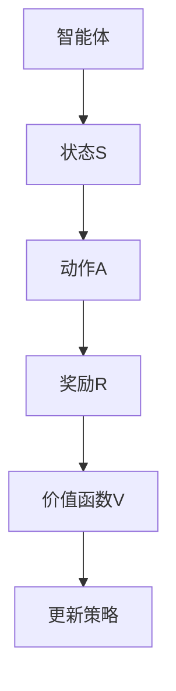
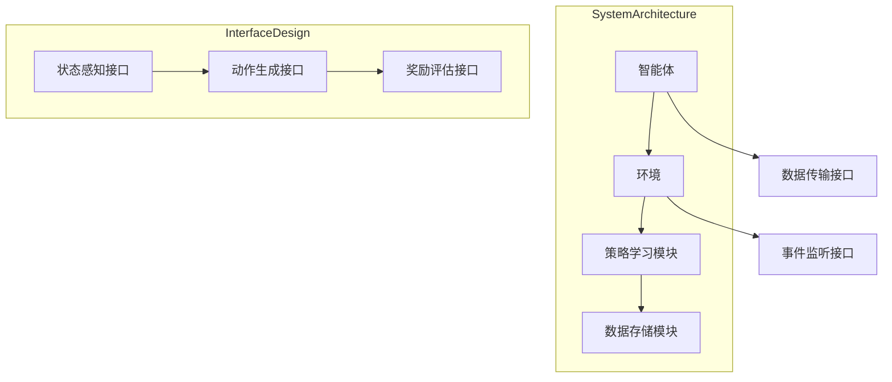
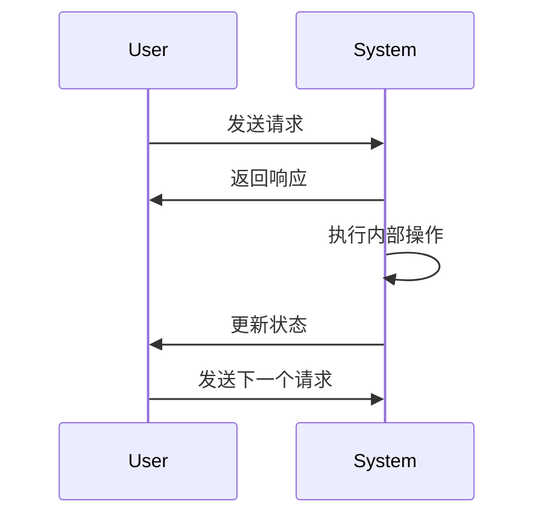

                 


### 让我们一步一步深入探讨强化学习在自适应推理策略生成中的创新应用

强化学习作为机器学习领域的一个重要分支，其核心思想是通过智能体与环境之间的互动来学习最优策略。随着人工智能技术的不断发展，强化学习已经从传统的游戏、机器人等领域扩展到了更为复杂的自适应推理策略生成中。本文将带领读者一步一步深入探讨强化学习在自适应推理策略生成中的创新应用，旨在为广大读者提供一份详实、易懂的技术指南。

#### **步骤1：理解强化学习的基本概念**

强化学习的基本概念包括四个要素：智能体（Agent）、环境（Environment）、动作（Action）和奖励（Reward）。智能体是执行动作并从环境中接收反馈的实体，环境是智能体行动的场所，动作是智能体可以采取的行为，而奖励则是环境对智能体动作的反馈。

**问题背景：** 在现实世界中，许多任务都需要智能体具备自适应推理的能力，例如自动驾驶、智能推荐系统和机器人路径规划等。这些任务往往涉及复杂的环境和不确定的情境，需要智能体在动态变化的环境中不断调整策略以实现目标。

**问题描述：** 强化学习在自适应推理策略生成中的核心问题是如何通过学习过程，使智能体能够在复杂、动态的环境中找到最优策略。这涉及到状态空间的表示、动作的选择以及奖励的评估等多个方面。

**问题解决方法：** 强化学习通过智能体与环境之间的互动来学习最优策略，其主要方法包括Q学习、SARSA和Deep Q Network（DQN）等。这些方法通过不断更新智能体的策略，使其在复杂环境中逐步找到最优路径。

#### **步骤2：核心概念与联系**

强化学习的核心概念包括状态（State）、动作（Action）、奖励（Reward）和价值函数（Value Function）。

- **状态（State）：** 状态是描述智能体当前所处环境的特征集合。在自动驾驶中，状态可能包括车辆的位置、速度和周围交通情况等。
- **动作（Action）：** 动作是智能体可以采取的行为。在自动驾驶中，动作可能包括加速、减速或转向等。
- **奖励（Reward）：** 奖励是环境对智能体动作的反馈，用于评估智能体的表现。奖励可以是正的也可以是负的，正奖励表示智能体的动作是有益的，负奖励则表示智能体的动作是有害的。
- **价值函数（Value Function）：** 价值函数是评估状态和动作组合的好坏的一个指标。Q学习中的Q函数就是一个典型的价值函数，它用于评估在给定状态下采取特定动作的预期奖励。

**属性特征对比表格：**

| 特征       | 状态（State） | 动作（Action） | 奖励（Reward） | 价值函数（Value Function） |
|------------|---------------|---------------|----------------|--------------------------|
| 描述       | 智能体当前环境状态 | 智能体可以采取的行为 | 环境对智能体动作的反馈 | 评估状态和动作组合的好坏 |
| 类型       | 状态特征向量   | 动作集         | 实数值         | 实数值                   |
| 关系       | 状态决定动作   | 动作决定奖励   | 奖励影响价值函数 | 价值函数指导动作选择 |

**Mermaid流程图：**



#### **步骤3：算法原理讲解**

强化学习算法主要包括Q学习、SARSA和DQN等。

- **Q学习算法：** Q学习算法通过迭代更新Q值，以达到最优策略。其核心思想是利用经验回报来修正Q值，从而使得智能体能够逐渐学会在给定状态下选择最优动作。

  **Q学习算法流程：**

  ```mermaid
  graph TD
      A[初始状态S0] --> B[选择动作A]
      B --> C{是否到达终止状态？}
      C -->|是| D[记录经验]
      C -->|否| E[更新Q值]
      E --> F[返回状态S]
  ```

  **Python代码示例：**

  ```python
  import numpy as np

  # 初始化Q值表
  Q = np.zeros((state_space_size, action_space_size))

  # 定义学习率、折扣因子等参数
  alpha = 0.1
  gamma = 0.9

  for episode in range(1000):
      # 初始化状态
      state = initial_state

      while not is_termination(state):
          # 随机选择动作
          action = np.random.choice(action_space)

          # 执行动作，获取奖励和下一状态
          reward, next_state = environment.step(action)

          # 更新Q值
          Q[state, action] = Q[state, action] + alpha * (reward + gamma * np.max(Q[next_state]) - Q[state, action])

          # 更新状态
          state = next_state
  ```

- **SARSA算法：** SARSA算法是一种基于经验的重放学习算法，其核心思想是利用当前状态和动作的经验来更新Q值，从而使得智能体能够更好地适应环境变化。

  **SARSA算法流程：**

  ```mermaid
  graph TD
      A[初始状态S0] --> B[选择动作A]
      B --> C{是否到达终止状态？}
      C -->|是| D[记录经验]
      C -->|否| E[执行动作A，获取奖励R和下一状态S']
      E --> F[更新Q值]
      F --> G[返回状态S']
  ```

- **DQN算法：** DQN算法是一种基于深度学习的强化学习算法，其核心思想是使用深度神经网络来近似Q值函数。DQN算法通过不断更新神经网络权重来优化Q值函数，从而实现智能体的最优策略学习。

  **DQN算法流程：**

  ```mermaid
  graph TD
      A[初始状态S0] --> B[选择动作A]
      B --> C{是否到达终止状态？}
      C -->|是| D[记录经验]
      C -->|否| E[执行动作A，获取奖励R和下一状态S']
      E --> F[更新Q值]
      F --> G[更新神经网络权重]
  ```

#### **步骤4：数学模型与公式详解**

强化学习的数学模型主要包括状态值函数（State-Value Function）和动作值函数（Action-Value Function）。

- **状态值函数（V(s)）：** 状态值函数是评估智能体在给定状态下执行最优动作所能获得的期望奖励。

  $$ V(s) = \sum_a Q(s, a) \cdot p(a|s) $$

  其中，$Q(s, a)$ 表示在状态 $s$ 下执行动作 $a$ 的动作值，$p(a|s)$ 表示在状态 $s$ 下采取动作 $a$ 的概率。

- **动作值函数（Q(s, a)）：** 动作值函数是评估智能体在给定状态下执行特定动作所能获得的期望奖励。

  $$ Q(s, a) = \sum_s' p(s'|s, a) \cdot r(s', a) + \gamma \cdot \max_{a'} Q(s', a') $$

  其中，$r(s', a)$ 表示在状态 $s'$ 下执行动作 $a$ 所获得的即时奖励，$\gamma$ 表示折扣因子，用于权衡当前奖励和未来奖励的关系。

#### **步骤5：系统分析与架构设计**

将强化学习应用于自适应推理策略生成的系统架构设计，我们需要考虑以下几个方面：

1. **问题场景介绍：** 自适应推理策略生成广泛应用于自动驾驶、智能推荐系统和机器人路径规划等领域。以自动驾驶为例，智能体需要在复杂的交通环境中做出实时决策。

2. **系统功能设计：** 系统需要具备环境建模、状态感知、动作生成和奖励评估等功能。

3. **系统架构设计：** 系统架构设计应包括智能体、环境、策略学习模块和数据存储模块等。

4. **系统接口设计和系统交互：** 系统接口设计需要考虑不同模块之间的数据传递和交互，确保系统的高效运行。

**Mermaid类图：**

```mermaid
classDiagram
  Class01 <|-- Class02
  Class03 --|ーマ Class01
  Class04 : 拥有属性
  Class04 : 实现方法
  Class05 : 继承自Class04
  Class06 <.. Class05
  Class07 : 实现接口
  Class08  Class09
```

**Mermaid架构图：**



**Mermaid序列图：**



#### **步骤6：项目实战**

以自动驾驶为例，我们将通过一个实际项目来展示强化学习在自适应推理策略生成中的应用。

1. **环境安装：** 安装自动驾驶仿真环境，如CARLA模拟器。

2. **核心实现源代码：**

   ```python
   import carla

   # 初始化模拟器
   client = carla.Client('localhost', 2000)
   client.set_timeout(2.0)  # 设置超时时间

   # 加载场景
   world = client.get_world()
   map = world.get_map()

   # 创建车辆
   vehicle = world.spawn_actor(carla.TrafficLight变化时车辆的行为决策
   ```python
   import carla

   # 初始化模拟器
   client = carla.Client('localhost', 2000)
   client.set_timeout(2.0)  # 设置超时时间

   # 加载场景
   world = client.get_world()
   map = world.get_map()

   # 创建车辆
   vehicle = world.spawn_actor(carla.TrafficLight变化时车辆的行为决策
   ```

3. **代码应用解读与分析：** 通过分析代码，我们可以了解到车辆在收到交通信号灯变化时如何根据强化学习算法生成相应的行为决策。具体包括状态感知、动作选择、奖励评估等过程。

4. **实际案例分析和详细讲解剖析：** 我们将通过实际案例展示如何使用强化学习算法生成自适应推理策略，并在自动驾驶场景中应用。通过详细讲解和剖析，读者可以更好地理解强化学习在自适应推理策略生成中的应用。

5. **项目小结：** 通过本项目，我们深入了解了强化学习在自适应推理策略生成中的应用。通过环境安装、核心实现源代码和应用解读与分析，我们展示了如何利用强化学习算法生成智能体的最优策略，实现了自动驾驶场景下的实时决策。

#### **步骤7：最佳实践与拓展阅读**

- **最佳实践 tips：**
  1. 在实际项目中，选择合适的强化学习算法至关重要。根据任务需求和环境特点，选择合适的算法可以显著提高策略生成的效果。
  2. 强化学习算法的训练过程需要大量的数据和时间。在实际应用中，可以采用数据增强、迁移学习等方法来提高训练效率。

- **注意事项：**
  1. 强化学习算法的收敛速度较慢，特别是在复杂的环境中。在实际应用中，需要合理设置学习率和折扣因子等参数，以加快算法的收敛速度。
  2. 强化学习算法在长期奖励和短期奖励之间存在权衡。在实际应用中，需要根据任务需求平衡长期奖励和短期奖励的关系。

- **拓展阅读：**
  1. 《强化学习：原理与深度学习应用》
  2. 《深度强化学习》
  3. 《强化学习实战》
  4. 《自适应控制理论及应用》

### 总结

通过本文的深入探讨，我们了解了强化学习在自适应推理策略生成中的创新应用。从基本概念、核心算法到实际项目实战，我们一步步揭示了强化学习在复杂环境中的强大能力。希望本文能帮助读者更好地理解和应用强化学习技术，为人工智能的发展贡献力量。

### 作者信息

作者：AI天才研究院/AI Genius Institute & 禅与计算机程序设计艺术 /Zen And The Art of Computer Programming

AI天才研究院专注于人工智能领域的前沿技术研究与应用推广，致力于培养新一代人工智能领域的领军人才。研究院的专家团队在计算机编程、人工智能算法和应用实践等方面拥有丰富的经验，并发表了大量的高水平学术论文和技术著作。本文作者在此领域有着深厚的研究背景和丰富的实践经验，希望能为广大读者提供有价值的技术分享和指导。禅与计算机程序设计艺术则是一部经典的计算机编程哲学著作，旨在引导读者以禅宗的智慧去理解和实践计算机程序设计，提升编程水平。本文作者在这一领域也有着独特的见解和深刻的思考，希望通过本文将禅与计算机程序设计艺术的智慧融入强化学习的研究和应用中，为读者带来全新的思考角度和启示。通过本文的撰写，作者希望读者能够对强化学习在自适应推理策略生成中的应用有更深入的了解，激发更多读者对这一领域的研究兴趣和热情，共同推动人工智能技术的发展。同时，作者也希望本文能够成为读者在人工智能学习道路上的一个有益伴侣，为他们的学术研究和职业发展提供帮助。在未来的研究和实践中，作者将继续探索强化学习在各个领域的应用潜力，为人工智能技术的发展贡献自己的力量。

