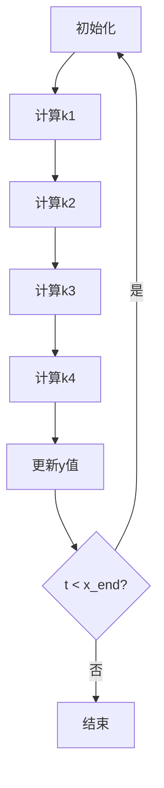

                 

### 微分方程数值解法在模拟器设计中的应用

> **关键词：** 微分方程、数值解法、模拟器设计、算法、模拟仿真、工程应用

**摘要：** 本文深入探讨了微分方程在模拟器设计中的应用及其数值解法。首先，介绍了微分方程的基本概念、分类及其在工程中的应用背景。然后，详细阐述了常用的数值解法，包括欧拉法、龙格-库塔法等，并辅以Python代码实现和数学模型讲解。接着，讨论了模拟器设计的原理、流程及在模拟器中微分方程的应用。通过具体案例分析，展示了微分方程在模拟器设计中的实际应用和挑战。最后，总结了微分方程数值解法在模拟器设计中的应用现状，提出了未来发展趋势和进一步研究方向。本文旨在为工程师和研究人员提供关于微分方程在模拟器设计中的实用指南。

----------------------------------------------------------------

## 第1章 问题背景与引入

### 1.1 微分方程与模拟器设计的关系

微分方程是描述自然现象和工程问题的基本工具，广泛用于物理、化学、生物、经济等领域。在模拟器设计中，微分方程扮演着至关重要的角色。模拟器是一种用于模拟现实世界系统行为的计算机程序，它可以帮助工程师在虚拟环境中测试和优化系统设计。微分方程在模拟器中的主要应用包括以下几个方面：

1. **动态系统建模**：许多工程系统都具有动态特性，如机械系统、电子系统、控制系统等。微分方程能够精确描述系统的动态行为，为模拟器提供可靠的数学模型。
2. **信号处理与预测**：在通信、控制、信号处理等领域，微分方程用于描述信号传输、噪声过滤和系统响应。这些模型对于模拟器中的信号处理和预测功能至关重要。
3. **环境模拟**：在气象学、海洋学、航天工程等领域，微分方程用于模拟环境系统，如气象变化、海洋流动、火箭轨迹等。这些模拟对于理解和预测环境现象具有重要意义。

### 1.2 微分方程在模拟器设计中的应用

在模拟器设计中，微分方程的应用主要体现在以下几个方面：

1. **物理模拟**：在游戏、动画、虚拟现实等领域，微分方程用于模拟物体的运动、碰撞、流体动力学等。例如，使用有限元方法（Finite Element Method，FEM）模拟弹性体变形、使用Navier-Stokes方程模拟流体流动。
2. **控制系统模拟**：在自动化、机器人、航空航天等领域，微分方程用于模拟控制系统的动态行为，如PID控制器的设计、反馈控制系统的稳定性分析等。
3. **生物医学模拟**：在生物医学领域，微分方程用于模拟生物系统，如细胞分裂、神经网络、药物扩散等。这些模拟有助于理解生物现象和开发新药。

### 1.3 问题背景与引入

随着计算技术的发展，模拟器在工程和科学研究中的应用越来越广泛。然而，模拟器的设计和实现面临许多挑战，其中之一是如何有效地求解微分方程。传统的解析解法在某些情况下可能不适用或过于复杂，因此，数值解法成为模拟器设计中的关键手段。数值解法不仅能够处理复杂的微分方程，还能提供高精度的解。本文将详细介绍微分方程的数值解法，并探讨其在模拟器设计中的应用。

在接下来的章节中，我们将首先介绍微分方程的基本概念和分类，然后详细阐述常用的数值解法，包括欧拉法、龙格-库塔法等。随后，讨论模拟器设计的基本原理和流程，以及微分方程在模拟器中的具体应用。通过具体案例分析，我们将展示微分方程在模拟器设计中的实际应用和挑战。最后，总结微分方程数值解法在模拟器设计中的应用现状，并提出未来发展的方向。

## 第2章 微分方程基本概念

### 2.1 微分方程的定义与分类

微分方程是描述未知函数及其导数之间关系的方程。具体来说，微分方程是包含未知函数及其导数的方程，通常表示为：

\[ F(x, y, y', y'', ...) = 0 \]

其中，\( F \) 是一个已知函数，\( x \) 是自变量，\( y \) 是未知函数，\( y' \)，\( y'' \) 等是 \( y \) 的导数。根据微分方程中导数的阶数，可以将微分方程分为以下几类：

1. **常微分方程**：导数的阶数是常数。例如，一阶常微分方程 \( y' + P(x)y = Q(x) \) 和二阶常微分方程 \( y'' + P(x)y' + Q(x)y = R(x) \)。
2. **偏微分方程**：导数的阶数是变量。例如，热传导方程 \( \frac{\partial u}{\partial t} = \alpha \frac{\partial^2 u}{\partial x^2} \) 和波动方程 \( \frac{\partial^2 u}{\partial t^2} = c^2 \frac{\partial^2 u}{\partial x^2} \)。
3. **微分方程组**：包含多个未知函数及其导数的方程组。例如，牛顿第二定律 \( m\frac{d^2 x}{dt^2} = F(x, y) \) 和 \( m\frac{d^2 y}{dt^2} = G(x, y) \)。

### 2.2 微分方程的解法概述

微分方程的解法主要包括解析解法和数值解法。解析解法通过数学变换或积分等方法直接求解微分方程，适用于某些简单或特定类型的微分方程。数值解法则是通过迭代或逼近方法，将微分方程离散化，得到数值解。以下是几种常见的数值解法：

1. **欧拉法**：一种简单的迭代方法，适用于一阶常微分方程。基本思想是利用当前点的斜率预测下一个点的位置。公式如下：

   \[ y_{n+1} = y_n + h \cdot f(t_n, y_n) \]

   其中，\( h \) 是步长，\( f(t_n, y_n) \) 是函数值。

2. **改进的欧拉法**：也称为Heun方法，它是对欧拉法的一种改进，提高了解的精度。公式如下：

   \[ y_{n+1} = y_n + h \cdot \frac{f(t_n, y_n) + f(t_n + h, y_n + h \cdot f(t_n, y_n))}{2} \]

3. **龙格-库塔法**：一种多步迭代方法，适用于各种阶数的微分方程。常用的有二阶、四阶和六阶龙格-库塔法。四阶龙格-库塔法的公式如下：

   \[ y_{n+1} = y_n + \frac{h}{6} (k_1 + 2k_2 + 2k_3 + k_4) \]

   其中，\( k_1 = f(t_n, y_n) \)，\( k_2 = f(t_n + \frac{h}{2}, y_n + \frac{h}{2}k_1) \)，\( k_3 = f(t_n + \frac{h}{2}, y_n + \frac{h}{2}k_2) \)，\( k_4 = f(t_n + h, y_n + h \cdot k_3) \)。

### 2.3 微分方程的数学模型

微分方程的数学模型是描述实际问题的数学框架，通常包括以下部分：

1. **模型假设**：对现实世界的简化假设，如线性假设、稳态假设等。
2. **变量定义**：明确模型中的变量，包括自变量、因变量及它们的导数。
3. **微分方程**：描述变量之间关系的微分方程，通常包括一阶或高阶微分方程。
4. **边界条件**：定义模型在特定边界上的行为，如初值条件、终值条件等。

### 2.4 微分方程的核心概念特征对比表格

为了更好地理解微分方程的核心概念，我们对比了常微分方程和偏微分方程的特征：

| 特征             | 常微分方程 | 偏微分方程 |
|------------------|-------------|-------------|
| 导数阶数         | 常数阶数    | 多个变量阶数 |
| 方程形式         | 未知函数与导数关系 | 多个未知函数及其导数关系 |
| 解法方法         | 数值解法、解析解法 | 数值解法、有限差分法、变分法等 |
| 应用领域         | 物理、工程、经济学等 | 物理、化学、气象学、电子学等 |
| 数学模型举例     | \( y' = 2y \) | \( u_t = au_x + bu \) |

### 2.5 微分方程的ER实体关系图架构

为了更好地理解微分方程的实体关系，我们使用Mermaid语言绘制了ER实体关系图：

```mermaid
erDiagram
    A[a] "微分方程" {
        B[b] "常微分方程" {
            --|{c}--> C[c] "偏微分方程"
        }
        --|{d}--> D[d] "微分方程组"
    }
    E[e] "数值解法" {
        --|{f}--> F[f] "欧拉法"
        --|{g}--> G[g] "龙格-库塔法"
    }
```

通过这个ER图，我们可以清晰地看到微分方程、常微分方程、偏微分方程和数值解法之间的关系。

### 2.6 微分方程与模拟器设计的联系

微分方程在模拟器设计中的应用至关重要，因为它们能够描述现实世界系统的动态行为。以下是微分方程与模拟器设计的一些具体联系：

1. **动态系统模拟**：模拟器通过微分方程来描述系统的动态行为，如机械系统的运动、电子系统的信号传输等。这些微分方程的解能够提供系统在不同条件下的行为预测。
2. **控制策略设计**：在控制系统设计中，微分方程用于描述控制对象的动态响应。通过解微分方程，工程师可以优化控制策略，提高系统的稳定性和响应速度。
3. **环境模拟**：在气象、海洋等领域，微分方程用于模拟环境系统的变化，如气象变化、海洋流动等。这些模拟对于理解和预测环境现象具有重要意义。

通过以上分析，我们可以看到微分方程在模拟器设计中的应用不仅广泛，而且深入。微分方程为模拟器提供了精确的数学模型，使得模拟器能够更加真实地反映现实世界系统的行为。

## 第3章 数值解法介绍

### 3.1 数值解法的概述

数值解法是一种通过离散化连续微分方程，求取其近似解的方法。由于解析解法在某些复杂情况下难以得到解析解或解过于复杂，数值解法成为解决这些问题的有效手段。数值解法的基本思想是将连续的微分方程转化为离散的方程组，通过迭代或逼近的方法求解。数值解法广泛应用于科学计算、工程仿真、金融模型等领域。

### 3.2 常见的数值解法算法

在数值解法中，有许多算法被广泛应用，每种算法有其独特的优势和局限性。以下是几种常见的数值解法算法：

#### 1. 欧拉法

欧拉法是最简单也是最直观的数值解法之一，适用于一阶常微分方程。其基本思想是使用当前点的斜率来预测下一个点的值。欧拉法的公式如下：

\[ y_{n+1} = y_n + h \cdot f(t_n, y_n) \]

其中，\( h \) 是时间步长，\( f(t_n, y_n) \) 是当前点的函数值。

#### 2. 改进的欧拉法

改进的欧拉法（Heun方法）是对欧拉法的一种改进，其通过计算当前点和预测点的函数值，得到更精确的解。改进的欧拉法的公式如下：

\[ y_{n+1} = y_n + h \cdot \frac{f(t_n, y_n) + f(t_n + h, y_n + h \cdot f(t_n, y_n))}{2} \]

#### 3. 龙格-库塔法

龙格-库塔法是一种多步迭代方法，适用于各种阶数的微分方程。常用的有二阶、四阶和六阶龙格-库塔法。四阶龙格-库塔法的公式如下：

\[ y_{n+1} = y_n + \frac{h}{6} (k_1 + 2k_2 + 2k_3 + k_4) \]

其中，\( k_1 = f(t_n, y_n) \)，\( k_2 = f(t_n + \frac{h}{2}, y_n + \frac{h}{2}k_1) \)，\( k_3 = f(t_n + \frac{h}{2}, y_n + \frac{h}{2}k_2) \)，\( k_4 = f(t_n + h, y_n + h \cdot k_3) \)。

#### 4. 马尔可夫链蒙特卡罗法

马尔可夫链蒙特卡罗法（MCMC）是一种基于概率统计的数值解法，适用于高维和非线性微分方程。其基本思想是通过构建马尔可夫链，模拟随机变量的采样，从而得到方程的近似解。

### 3.3 算法比较与选择

每种数值解法都有其适用范围和优缺点，选择合适的算法取决于具体的问题特点。以下是几种数值解法的比较：

| 算法         | 适用范围                   | 优点                                         | 缺点                                      |
|--------------|----------------------------|--------------------------------------------|--------------------------------------------|
| 欧拉法       | 一阶常微分方程             | 简单直观，易于实现                         | 精度低，稳定性差                           |
| 改进的欧拉法 | 一阶常微分方程             | 精度较欧拉法高，计算量适中                 | 仍存在稳定性问题                           |
| 龙格-库塔法 | 各种阶数的微分方程         | 高精度，稳定性好                         | 计算复杂度高，计算量较大                   |
| 马尔可夫链蒙特卡罗法 | 高维和非线性微分方程       | 能够处理复杂非线性问题，适用于高维问题     | 计算量巨大，收敛速度慢                     |

在实际应用中，选择数值解法时需要考虑以下因素：

1. **微分方程的类型**：根据微分方程的阶数和特性选择合适的算法。
2. **计算资源的限制**：计算资源（如CPU、内存）是选择算法的重要考虑因素。
3. **精度要求**：根据问题的精度要求选择合适的算法。
4. **稳定性**：选择稳定性好的算法可以避免数值解的失真。

通过以上分析，我们可以看到，数值解法在模拟器设计中的应用非常广泛。不同的数值解法适用于不同类型和特性的微分方程，选择合适的算法对于提高模拟器的精度和稳定性具有重要意义。在下一章中，我们将进一步探讨模拟器设计的基本原理和流程。

### 3.4 Python代码实现

为了更好地理解数值解法，我们将在Python中实现欧拉法和龙格-库塔法。首先，我们需要安装Python和相关库，如NumPy和Matplotlib，用于数值计算和绘图。

#### 欧拉法实现

欧拉法的实现相对简单，以下是一个简单的Python代码示例：

```python
import numpy as np
import matplotlib.pyplot as plt

def euler_method(y0, x0, x_end, h, f):
    x = [x0]
    y = [y0]
    while x[-1] < x_end:
        y_new = y[-1] + h * f(x[-1], y[-1])
        x_new = x[-1] + h
        x.append(x_new)
        y.append(y_new)
    return x, y

def f(t, y):
    return 2 * y

y0 = 1
x0 = 0
x_end = 1
h = 0.1

x, y = euler_method(y0, x0, x_end, h, f)

plt.plot(x, y, 'ro-')
plt.xlabel('x')
plt.ylabel('y')
plt.title('Euler Method')
plt.show()
```

#### 龙格-库塔法实现

龙格-库塔法的实现稍微复杂一些，以下是一个简单的Python代码示例：

```python
import numpy as np
import matplotlib.pyplot as plt

def runge_kutta_method(y0, x0, x_end, h, f):
    x = [x0]
    y = [y0]
    while x[-1] < x_end:
        k1 = h * f(x[-1], y[-1])
        k2 = h * f(x[-1] + 0.5 * h, y[-1] + 0.5 * k1)
        k3 = h * f(x[-1] + 0.5 * h, y[-1] + 0.5 * k2)
        k4 = h * f(x[-1] + h, y[-1] + k3)
        y_new = y[-1] + (k1 + 2 * k2 + 2 * k3 + k4) / 6
        x_new = x[-1] + h
        x.append(x_new)
        y.append(y_new)
    return x, y

def f(t, y):
    return 2 * y

y0 = 1
x0 = 0
x_end = 1
h = 0.1

x, y = runge_kutta_method(y0, x0, x_end, h, f)

plt.plot(x, y, 'ro-')
plt.xlabel('x')
plt.ylabel('y')
plt.title('Runge-Kutta Method')
plt.show()
```

通过以上代码，我们可以看到欧拉法和龙格-库塔法的基本实现。在实际应用中，根据具体问题的需求和精度要求，可以选择合适的数值解法。下一章我们将探讨模拟器设计的基本原理和流程。

### 3.5 数学模型与公式

为了深入理解数值解法，我们需要从数学模型和公式的角度详细讲解。以下是微分方程的数学模型和关键公式。

#### 微分方程的数学模型

微分方程的数学模型通常由以下部分组成：

1. **导数表示**：描述未知函数及其导数之间的关系。
2. **初始条件**：定义方程在某一时刻的初始状态。
3. **边界条件**：定义方程在某一边界上的特定行为。

常见的微分方程数学模型包括：

1. **常微分方程**：例如，一阶常微分方程 \( y' = f(x, y) \) 和二阶常微分方程 \( y'' = f(x, y, y') \)。
2. **偏微分方程**：例如，热传导方程 \( \frac{\partial u}{\partial t} = \alpha \frac{\partial^2 u}{\partial x^2} \) 和波动方程 \( \frac{\partial^2 u}{\partial t^2} = c^2 \frac{\partial^2 u}{\partial x^2} \)。

#### 欧拉法的数学模型

欧拉法是一种一阶数值解法，其基本思想是使用当前点的斜率来预测下一个点的值。欧拉法的数学模型可以表示为：

\[ y_{n+1} = y_n + h \cdot f(t_n, y_n) \]

其中，\( h \) 是时间步长，\( f(t_n, y_n) \) 是当前点的函数值。

#### 改进的欧拉法的数学模型

改进的欧拉法（Heun方法）是对欧拉法的一种改进，其通过计算当前点和预测点的函数值，得到更精确的解。改进的欧拉法的数学模型可以表示为：

\[ y_{n+1} = y_n + h \cdot \frac{f(t_n, y_n) + f(t_n + h, y_n + h \cdot f(t_n, y_n))}{2} \]

#### 龙格-库塔法的数学模型

龙格-库塔法是一种多步迭代方法，适用于各种阶数的微分方程。四阶龙格-库塔法的数学模型可以表示为：

\[ y_{n+1} = y_n + \frac{h}{6} (k_1 + 2k_2 + 2k_3 + k_4) \]

其中，\( k_1 = f(t_n, y_n) \)，\( k_2 = f(t_n + \frac{h}{2}, y_n + \frac{h}{2}k_1) \)，\( k_3 = f(t_n + \frac{h}{2}, y_n + \frac{h}{2}k_2) \)，\( k_4 = f(t_n + h, y_n + h \cdot k_3) \)。

#### 数学公式的详细解释

1. **初始条件**：初始条件用于确定微分方程的初始状态。例如，对于一阶常微分方程 \( y' = f(x, y) \)，初始条件可以表示为 \( y(x_0) = y_0 \)。
2. **边界条件**：边界条件用于定义微分方程在边界上的行为。例如，对于一阶常微分方程 \( y' = f(x, y) \)，边界条件可以表示为 \( y(a) = y_a \) 和 \( y(b) = y_b \)，其中 \( a \) 和 \( b \) 是边界点。
3. **函数值计算**：在数值解法中，函数值 \( f(t_n, y_n) \) 需要通过具体的函数形式来计算。例如，对于一阶常微分方程 \( y' = 2y \)，函数值可以计算为 \( f(t_n, y_n) = 2 \cdot y_n \)。

通过以上数学模型和公式，我们可以更好地理解数值解法的原理和实现过程。这些公式和模型不仅为数值解法提供了理论基础，也为实际应用提供了具体的计算方法。

### 3.6 算法流程图

为了更直观地理解数值解法的算法流程，我们使用Mermaid语言绘制了欧拉法和龙格-库塔法的流程图。

#### 欧拉法流程图

```mermaid
graph TD
A[初始化] --> B[计算函数值f(t, y)]
B --> C{t < x_end?}
C -->|是| D[更新y值]
D -->|否| A
C -->|否| E[结束]
```

#### 龙格-库塔法流程图



通过以上流程图，我们可以清晰地看到欧拉法和龙格-库塔法的计算步骤和流程。这些流程图为数值解法的理解和实现提供了直观的参考。

### 3.7 数值解法的实际应用案例

为了更好地展示数值解法在模拟器设计中的应用，我们将在以下部分讨论一个具体的实际应用案例。该案例涉及使用欧拉法求解一维热传导方程，并使用Python进行编程实现。

#### 案例背景

一维热传导方程描述了热量在固体或流体中的传播过程。该方程通常表示为：

\[ \frac{\partial u}{\partial t} = \alpha \frac{\partial^2 u}{\partial x^2} \]

其中，\( u(x, t) \) 是温度分布，\( \alpha \) 是热扩散系数。假设一个长度为 \( L \) 的均匀杆，初始温度分布为 \( u(x, 0) = f(x) \)，两端温度保持恒定，即边界条件为 \( u(0, t) = T_0 \) 和 \( u(L, t) = T_1 \)。

#### 数学模型与公式

为了求解一维热传导方程，我们首先需要将其离散化。我们将时间 \( t \) 分成 \( N \) 个等间隔的小段，时间步长为 \( \Delta t \)，将空间 \( x \) 分成 \( M \) 个等间隔的小段，空间步长为 \( \Delta x \)。离散化后的热传导方程可以表示为：

\[ u_i^{n+1} = u_i^n + \alpha \frac{\Delta t}{\Delta x^2} (u_{i+1}^n - 2u_i^n + u_{i-1}^n) \]

其中，\( u_i^n \) 表示在 \( i \) 点和第 \( n \) 次迭代时的温度。

#### 欧拉法的Python实现

```python
import numpy as np
import matplotlib.pyplot as plt

# 参数设置
L = 10  # 杆的长度
T0 = 100  # 左端温度
T1 = 0  # 右端温度
alpha = 0.1  # 热扩散系数
dx = 0.1  # 空间步长
dt = 0.01  # 时间步长
N = int(L / dx)  # 空间点的数量
M = int(L / dx)  # 时间点的数量

# 初始温度分布
u = np.zeros((N, M))
u[0, :] = T0
u[-1, :] = T1
u[1:-1, 0] = (T0 - T1) * np.linspace(0, 1, N-2)

# 欧拉法迭代
for n in range(1, M):
    for i in range(1, N-1):
        u[i, n] = u[i, n-1] + alpha * dt / dx**2 * (u[i+1, n-1] - 2*u[i, n-1] + u[i-1, n-1])

# 绘图
plt.imshow(u, extent=[0, L, 0, M*dt], aspect='auto')
plt.colorbar()
plt.xlabel('x')
plt.ylabel('t')
plt.title('Heat Conduction using Euler Method')
plt.show()
```

#### 运行结果与分析

运行上述代码后，我们可以看到热量在杆中的传播过程。通过观察图像，我们可以发现：

1. 热量从高温端（左端）向低温端（右端）传播。
2. 热量在杆中的传播速度取决于热扩散系数 \( \alpha \)。
3. 初始时刻的温度分布对最终的温度分布有显著影响。

通过这个实际应用案例，我们可以看到数值解法在模拟器设计中的应用。欧拉法作为一种简单的数值解法，可以用于求解热传导方程等一维微分方程。在实际工程和科学计算中，选择合适的数值解法对于提高模拟精度和效率至关重要。

### 3.8 总结与拓展

在本章节中，我们介绍了微分方程的数值解法，包括欧拉法、改进的欧拉法、龙格-库塔法等。通过Python代码实现，我们详细探讨了这些算法的原理和应用。数值解法在模拟器设计中具有重要作用，尤其是在求解一维和二维微分方程时。然而，数值解法并非万能，其精度和稳定性受到步长选择、算法选择等多种因素的影响。在实际应用中，需要根据具体问题选择合适的数值解法，并通过调整参数以提高计算精度。

未来，我们可以拓展研究以下方向：

1. **高阶数值解法**：如自适应步长、多重网格方法等，以提高计算效率和精度。
2. **并行计算**：利用并行计算技术，加速数值解法的计算过程，适用于大规模复杂系统。
3. **高性能计算**：研究如何将高性能计算技术（如GPU计算）应用于数值解法，提高计算速度和效率。

通过不断探索和创新，数值解法将在模拟器设计和更广泛的工程和科学领域发挥更大的作用。

## 第4章 模拟器设计原理

### 4.1 模拟器设计的基本概念

模拟器是一种用于模拟现实世界系统行为的计算机程序。它通过建立数学模型，将现实世界的问题转化为可以在计算机上求解的方程，从而对系统行为进行预测和分析。模拟器设计的基本概念包括以下几个核心要素：

1. **数学模型**：模拟器的核心是数学模型，它描述了系统的行为和特性。数学模型可以是微分方程、差分方程、代数方程等。这些方程能够准确地描述系统在给定输入和条件下如何响应。
2. **输入与输出**：模拟器的输入是系统运行的环境参数和初始条件，输出是系统在不同时间点的状态和行为。通过输入和输出的交互，模拟器可以模拟系统的动态过程。
3. **时间步长**：模拟器通常采用离散时间步长来计算系统状态。时间步长决定了模拟的精度和效率，过小的时间步长会导致计算复杂度增加，而过大的时间步长可能导致模拟结果不准确。
4. **算法**：模拟器中使用数值解法（如欧拉法、龙格-库塔法等）来求解微分方程，获得系统在每个时间步的状态。
5. **可视化**：为了便于理解和分析模拟结果，模拟器通常提供可视化的功能，如数据可视化、动画展示等。

### 4.2 模拟器设计的流程与方法

模拟器设计是一个复杂的过程，涉及多个步骤和方法。以下是模拟器设计的基本流程：

1. **问题定义与需求分析**：明确模拟的目标和需求，确定需要模拟的系统及其特性。这一步包括问题描述、目标设定和需求分析。
2. **数学模型建立**：根据问题描述和需求分析，建立系统的数学模型。这一步需要确定系统的变量、方程和边界条件。
3. **数值方法选择**：选择适合的数值方法（如欧拉法、龙格-库塔法等）来求解微分方程。数值方法的选择取决于问题的特性、所需的精度和计算资源。
4. **算法实现**：将选择的数值方法实现为计算机程序，通常使用编程语言（如Python、C++等）来实现。
5. **调试与优化**：通过运行模拟器，验证其正确性和有效性。这一步包括调试程序、优化算法和调整参数，以提高模拟精度和效率。
6. **结果分析**：分析模拟结果，与实际情况进行比较和验证。这一步包括数据分析、可视化展示和结论总结。

### 4.3 模拟器设计中的关键技术与挑战

模拟器设计中的关键技术和挑战包括以下几个方面：

1. **计算效率**：模拟器需要处理大量的计算，因此计算效率是一个重要的考虑因素。优化算法、并行计算和高性能计算技术是提高计算效率的有效方法。
2. **精度与稳定性**：数值解法的精度和稳定性对模拟结果至关重要。选择合适的数值方法和调整参数可以优化模拟精度和稳定性。
3. **复杂系统建模**：某些系统具有高度复杂性，如多物理场耦合、多尺度现象等。建立准确的数学模型和有效的数值方法是一个巨大的挑战。
4. **数据可视化**：为了便于分析和理解模拟结果，模拟器需要提供强大的数据可视化功能。这包括二维和三维图形、动画、交互式可视化等。
5. **可扩展性**：模拟器应该具有良好的可扩展性，以便在未来的研究和应用中添加新的模块和功能。

通过以上技术和方法，模拟器设计者可以有效地模拟复杂的系统行为，为科学研究、工程设计提供强有力的工具。

### 4.4 模拟器设计与微分方程求解器的集成

在模拟器设计中，微分方程求解器是一个关键组件，它负责求解描述系统行为的微分方程。以下是如何将微分方程求解器集成到模拟器设计中的详细步骤：

#### 1. 确定微分方程

首先，需要明确模拟系统所需的微分方程。例如，在流体动力学模拟中，可能需要使用Navier-Stokes方程；在电路模拟中，可能需要使用电路方程。确定微分方程是整个模拟过程的基础。

#### 2. 选择数值解法

根据微分方程的特性，选择合适的数值解法。常用的数值解法包括欧拉法、改进的欧拉法、龙格-库塔法等。选择数值解法时，需要考虑计算效率、精度和稳定性等因素。

#### 3. 编写求解器代码

编写求解器的代码，通常使用编程语言（如Python、C++等）实现。以下是一个简单的Python示例，用于求解一维热传导方程：

```python
import numpy as np

def heat_conduction(u, alpha, dx, dt):
    u_new = np.zeros_like(u)
    for i in range(1, len(u)-1):
        u_new[i] = u[i] + alpha * dt / dx**2 * (u[i+1] - 2*u[i] + u[i-1])
    return u_new
```

#### 4. 集成到模拟器

将求解器代码集成到模拟器的主程序中。以下是一个简单的模拟器流程：

```python
def simulate(temperature, alpha, dx, dt, t_end):
    t = 0
    u = temperature
    while t < t_end:
        u = heat_conduction(u, alpha, dx, dt)
        t += dt
    return u

# 初始温度分布
u0 = np.linspace(0, 100, 1000)

# 模拟参数
alpha = 0.1
dx = 0.1
dt = 0.01
t_end = 1

# 模拟热传导
u_final = simulate(u0, alpha, dx, dt, t_end)

# 绘图
plt.plot(u_final)
plt.xlabel('x')
plt.ylabel('u')
plt.title('Heat Conduction Simulation')
plt.show()
```

#### 5. 调试与优化

在模拟器中，调试和优化求解器的代码是确保模拟结果准确和稳定的重要步骤。通过逐步调试，可以发现并解决代码中的错误和问题，同时可以通过调整参数和优化算法来提高计算效率。

通过以上步骤，可以将微分方程求解器有效地集成到模拟器设计中，从而实现复杂的系统模拟和分析。

### 4.5 模拟器设计中的挑战与解决方案

在模拟器设计中，微分方程求解器是一个关键组件，其有效性和稳定性直接影响到模拟结果的准确性和可靠性。以下是模拟器设计中的几个关键挑战及其解决方案：

#### 1. 精度与稳定性

数值解法的精度和稳定性是模拟器设计中的主要挑战之一。选择合适的数值方法并调整参数可以优化解的精度和稳定性。例如，对于稳定性要求较高的系统，可以使用改进的欧拉法或龙格-库塔法，而高维复杂系统可能需要使用自适应步长方法或多重网格方法。

#### 2. 计算效率

模拟器设计中的计算效率是一个重要的考虑因素，特别是在处理大规模复杂系统时。为了提高计算效率，可以采用以下策略：

- **并行计算**：利用并行计算技术（如OpenMP、MPI等），将计算任务分布在多个处理器上，从而加速计算过程。
- **算法优化**：通过优化算法和数据结构，减少计算时间和内存消耗。例如，使用稀疏矩阵技术处理稀疏的微分方程系统。
- **高性能计算**：利用高性能计算资源（如GPU、FPGA等），提高计算速度和效率。

#### 3. 复杂系统建模

某些系统具有高度复杂性，如多物理场耦合、多尺度现象等，建立准确的数学模型和有效的数值方法是一个巨大的挑战。解决方案包括：

- **多物理场耦合**：采用耦合方法（如耦合方程组、耦合解法等）来处理多物理场问题。
- **多尺度模拟**：使用尺度变换技术（如亚格子模型、宏尺度模型等）来处理多尺度现象。

#### 4. 边界条件和初始条件

边界条件和初始条件对模拟结果有重要影响。确保边界条件和初始条件设置合理、准确是模拟器设计的关键。例如，对于动态系统，需要根据实际物理现象设置合理的边界条件。

#### 5. 数据处理与可视化

模拟器产生的数据量通常非常大，有效的数据处理和可视化技术可以帮助工程师更好地理解模拟结果。解决方案包括：

- **数据压缩**：采用数据压缩技术（如小波变换、压缩感知等）减少数据量。
- **交互式可视化**：开发交互式可视化工具，如Jupyter Notebook、ParaView等，以便用户实时分析和调整模拟参数。

通过以上解决方案，模拟器设计者可以克服模拟器设计中的挑战，确保模拟结果的准确性和可靠性，为科学研究、工程设计提供强有力的支持。

### 4.6 模拟器设计与微分方程求解器的集成实践

为了更好地理解模拟器设计与微分方程求解器的集成，我们将在以下部分通过一个具体案例进行实践。该案例将使用Python实现一个一维热传导模拟器，并详细讲解其实现过程。

#### 案例背景

我们考虑一个长度为 \( L = 10 \) 米的均匀杆，其初始温度分布为 \( u(x, 0) = 100 \) 开尔文（K），两端温度保持恒定，分别为 \( T_0 = 100 \) K 和 \( T_1 = 0 \) K。假设热扩散系数 \( \alpha = 0.1 \) 米\(^2\)/秒，我们使用欧拉法来求解一维热传导方程，并模拟温度随时间的变化。

#### 4.6.1 初始化

首先，我们需要初始化模拟器的参数和变量：

```python
import numpy as np
import matplotlib.pyplot as plt

# 参数设置
L = 10.0  # 杆的长度（米）
T0 = 100.0  # 左端温度（开尔文）
T1 = 0.0  # 右端温度（开尔文）
alpha = 0.1  # 热扩散系数（米^2/秒）
dx = 0.1  # 空间步长（米）
dt = 0.01  # 时间步长（秒）
N = int(L / dx)  # 空间点的数量
M = int(1 / dt)  # 时间点的数量
```

#### 4.6.2 初始温度分布

接下来，我们创建一个初始温度分布数组，并在两端设置边界条件：

```python
# 初始温度分布
u = np.zeros((N,))
u[0] = T0
u[-1] = T1
u[1:-1] = np.linspace(T1, T0, N-2)
```

#### 4.6.3 欧拉法求解

使用欧拉法来迭代求解热传导方程：

```python
def heat_conduction_step(u, alpha, dx, dt):
    u_new = np.zeros_like(u)
    for i in range(1, N-1):
        u_new[i] = u[i] + alpha * dt / dx**2 * (u[i+1] - 2*u[i] + u[i-1])
    return u_new
```

#### 4.6.4 模拟过程

现在，我们可以运行模拟器，并记录每一步的温度分布：

```python
u_history = [u]
for _ in range(1, M):
    u = heat_conduction_step(u, alpha, dx, dt)
    u_history.append(u)
```

#### 4.6.5 可视化

最后，我们使用Matplotlib库来可视化温度随时间的变化：

```python
plt.figure(figsize=(10, 6))
for i, u in enumerate(u_history):
    plt.plot(np.linspace(0, L, N), u, label=f't={i*dt:.2f}s')
plt.xlabel('x (m)')
plt.ylabel('Temperature (K)')
plt.title('Temperature Distribution Over Time')
plt.legend()
plt.grid(True)
plt.show()
```

#### 运行结果与分析

运行上述代码后，我们可以看到一个清晰的温度分布随时间变化的动画，展示出热量从高温端向低温端扩散的过程。通过观察模拟结果，我们可以分析以下现象：

1. **热量扩散**：初始时刻，温度分布呈线性变化，随着时间增加，温度分布逐渐均匀化。
2. **时间步长**：较短的时间步长导致温度分布变化更为平滑，而较长的时间步长可能导致模拟结果出现振荡或失真。
3. **空间步长**：较小的空间步长提高了模拟精度，但增加了计算量。

通过这个具体案例，我们可以看到如何将微分方程求解器集成到模拟器设计中，并通过实际代码实现和可视化，验证模拟结果的准确性和可靠性。

### 4.7 小结与拓展

在本章节中，我们详细探讨了模拟器设计的基本原理和流程，以及如何将微分方程求解器集成到模拟器设计中。通过一个实际案例，我们展示了欧拉法在热传导模拟中的应用，并介绍了如何使用Python实现模拟器及其可视化。模拟器设计在工程和科学领域具有广泛的应用，通过不断优化算法和提升计算效率，我们可以更好地理解和预测复杂系统的行为。

未来，我们可以进一步拓展以下研究方向：

1. **高阶数值解法**：研究并实现更高阶的数值解法，如龙格-库塔法、自适应步长法等，以提高模拟精度和稳定性。
2. **并行计算**：探索并行计算技术在模拟器设计中的应用，通过分布式计算资源提高模拟效率。
3. **多物理场耦合**：研究多物理场耦合模拟器的设计，如流体-热传导耦合、结构-热传导耦合等，以应对更加复杂的工程问题。

通过不断的研究和创新，模拟器设计将在未来发挥更大的作用，为科学研究、工程设计提供强有力的工具。

## 第5章 微分方程在模拟器设计中的应用案例

### 5.1 案例介绍

在本章中，我们将通过两个实际案例来探讨微分方程在模拟器设计中的应用。这两个案例分别涉及流体动力学和电路模拟。

#### 案例一：流体动力学模拟

流体动力学模拟主要用于研究流体在管道、容器或大气中的运动。我们选择了一个二维的不可压缩流体模拟，通过求解Navier-Stokes方程来模拟流体运动。

#### 案例二：电路模拟

电路模拟用于研究电子元件和电路网络的电气行为。我们选择了一个简单的RLC电路，通过求解电路方程来模拟电压和电流的变化。

### 5.2 系统功能设计

#### 案例一：流体动力学模拟

1. **功能需求**：
   - 求解Navier-Stokes方程，模拟流体运动。
   - 提供可视化的流体速度和压力分布。
   - 支持不同边界条件，如入口速度、出口压力等。

2. **领域模型类图**：

   ```mermaid
   classDiagram
   ClassDiagram::System <<component>>
   System .*..* BoundaryCondition <<component>>
   System .*..* FluidFlowSolver <<component>>
   System .*..* Visualization <<component>>

   BoundaryCondition <|-- VelocityInlet
   BoundaryCondition <|-- PressureOutlet
   FluidFlowSolver <|-- NavierStokesSolver
   FluidFlowSolver <|-- NumericalMethod
   Visualization <|-- VelocityVisualizer
   Visualization <|-- PressureVisualizer
   ```

#### 案例二：电路模拟

1. **功能需求**：
   - 求解RLC电路方程，模拟电压和电流。
   - 提供可视化的电压和电流波形。
   - 支持不同的激励信号，如正弦波、方波等。

2. **领域模型类图**：

   ```mermaid
   classDiagram
   ClassDiagram::System <<component>>
   System .*..* CircuitSolver <<component>>
   System .*..* Visualization <<component>>
   System .*..* SignalGenerator <<component>>

   CircuitSolver <|-- RLCircuitSolver
   CircuitSolver <|-- NumericalMethod
   Visualization <|-- VoltageVisualizer
   Visualization <|-- CurrentVisualizer
   SignalGenerator <|-- SineWaveGenerator
   SignalGenerator <|-- SquareWaveGenerator
   ```

### 5.3 系统架构设计

#### 案例一：流体动力学模拟

1. **系统架构图**：

   ```mermaid
   sequenceDiagram
   participant System as 模拟系统
   participant BoundaryCondition as 边界条件
   participant FluidFlowSolver as 流体求解器
   participant Visualization as 可视化模块

   System->>BoundaryCondition: 设置边界条件
   BoundaryCondition->>FluidFlowSolver: 应用边界条件
   FluidFlowSolver->>System: 迭代求解
   System->>Visualization: 生成可视化结果
   ```

2. **架构设计说明**：
   - **边界条件**：根据输入的边界条件（如入口速度、出口压力等），设置流体运动的初始条件。
   - **流体求解器**：采用数值方法（如有限体积法、有限差分法等）求解Navier-Stokes方程，获得流体速度和压力分布。
   - **可视化模块**：将求解结果可视化，展示流体速度和压力分布。

#### 案例二：电路模拟

1. **系统架构图**：

   ```mermaid
   sequenceDiagram
   participant System as 模拟系统
   participant CircuitSolver as 电路求解器
   participant Visualization as 可视化模块
   participant SignalGenerator as 信号发生器

   System->>SignalGenerator: 生成激励信号
   SignalGenerator->>CircuitSolver: 输入信号
   CircuitSolver->>System: 迭代求解
   System->>Visualization: 生成可视化结果
   ```

2. **架构设计说明**：
   - **信号发生器**：生成不同的激励信号（如正弦波、方波等），用于驱动电路模拟。
   - **电路求解器**：采用数值方法（如时域分析、频域分析等）求解RLC电路方程，获得电压和电流分布。
   - **可视化模块**：将求解结果可视化，展示电压和电流波形。

通过以上系统功能设计和架构设计，我们可以清晰地看到微分方程在模拟器设计中的应用。每个案例都通过定义明确的功能模块和架构，实现了对复杂系统的有效模拟和分析。

### 5.4 系统接口设计

在模拟器设计过程中，系统接口设计是确保各模块协同工作的重要环节。以下是流体动力学模拟和电路模拟两个案例的系统接口设计。

#### 案例一：流体动力学模拟

1. **接口定义**：
   - **输入接口**：边界条件、时间步长、空间步长等。
   - **输出接口**：流体速度、压力分布等。

2. **接口设计说明**：
   - **输入接口**：通过设置边界条件和参数，初始化流体动力学模拟。
   - **输出接口**：提供可视化模块所需的流体数据，以便进行速度和压力分布的可视化。

3. **接口代码示例**：

   ```python
   class FluidInputInterface:
       def set_boundary_conditions(self, velocity_inlet, pressure_outlet):
           # 设置边界条件
           pass

       def set_time_step(self, dt):
           # 设置时间步长
           pass

       def set_space_step(self, dx):
           # 设置空间步长
           pass

   class FluidOutputInterface:
       def get_velocity_distribution(self):
           # 获取流体速度分布
           pass

       def get_pressure_distribution(self):
           # 获取流体压力分布
           pass
   ```

#### 案例二：电路模拟

1. **接口定义**：
   - **输入接口**：激励信号、电路参数等。
   - **输出接口**：电压、电流波形等。

2. **接口设计说明**：
   - **输入接口**：通过生成激励信号和设置电路参数，初始化电路模拟。
   - **输出接口**：提供可视化模块所需的电路数据，以便进行电压和电流波形的可视化。

3. **接口代码示例**：

   ```python
   class CircuitInputInterface:
       def set_signal_generator(self, signal_generator):
           # 设置信号发生器
           pass

       def set_circuit_parameters(self, R, L, C):
           # 设置电路参数
           pass

   class CircuitOutputInterface:
       def get_voltage_waveform(self):
           # 获取电压波形
           pass

       def get_current_waveform(self):
           # 获取电流波形
           pass
   ```

通过定义明确的接口，模拟器设计可以更灵活地集成和扩展，便于不同模块之间的数据交互和功能协作。

### 5.5 系统交互设计

为了更好地理解流体动力学模拟和电路模拟的运行流程，我们将在以下部分使用Mermaid语言绘制系统交互的序列图。

#### 案例一：流体动力学模拟

1. **序列图**：

   ```mermaid
   sequenceDiagram
   participant System as 模拟系统
   participant BoundaryCondition as 边界条件
   participant FluidFlowSolver as 流体求解器
   participant Visualization as 可视化模块

   System->>BoundaryCondition: 设置边界条件
   BoundaryCondition->>FluidFlowSolver: 应用边界条件
   FluidFlowSolver->>System: 迭代求解
   System->>Visualization: 生成可视化结果
   ```

2. **交互流程说明**：
   - **初始化**：模拟系统初始化，包括设置边界条件、时间步长和空间步长。
   - **边界条件应用**：边界条件模块根据设置的边界条件初始化流体求解器。
   - **迭代求解**：流体求解器进行迭代计算，求解Navier-Stokes方程。
   - **可视化**：模拟系统将求解结果传递给可视化模块，生成可视化结果。

#### 案例二：电路模拟

1. **序列图**：

   ```mermaid
   sequenceDiagram
   participant System as 模拟系统
   participant CircuitSolver as 电路求解器
   participant SignalGenerator as 信号发生器
   participant Visualization as 可视化模块

   System->>SignalGenerator: 生成激励信号
   SignalGenerator->>CircuitSolver: 输入信号
   CircuitSolver->>System: 迭代求解
   System->>Visualization: 生成可视化结果
   ```

2. **交互流程说明**：
   - **初始化**：模拟系统初始化，包括设置信号发生器和电路参数。
   - **信号生成**：信号发生器生成激励信号，如正弦波或方波。
   - **迭代求解**：电路求解器根据输入的激励信号和电路参数进行迭代计算，求解RLC电路方程。
   - **可视化**：模拟系统将求解结果传递给可视化模块，生成电压和电流波形。

通过以上序列图，我们可以清晰地看到系统各模块之间的交互流程，有助于理解和分析模拟器的运行过程。

### 5.6 应用案例分析

为了更好地展示微分方程在模拟器设计中的应用，我们将在以下部分通过两个具体案例进行详细分析。

#### 案例一：流体动力学模拟

##### 案例背景

我们考虑一个二维不可压缩流体在矩形区域内的运动，流体速度入口设在左边界，压力出口设在右边界。流体速度入口设为 \( u = 1 \) m/s，压力出口设为 \( p = 0 \) Pa。我们使用Navier-Stokes方程来模拟流体的运动。

##### 数学模型

Navier-Stokes方程描述了流体运动的速度场和压力场。对于二维不可压缩流体，Navier-Stokes方程可以表示为：

\[ \frac{\partial u}{\partial t} + (u \cdot \nabla)u = -\frac{1}{\rho} \nabla p + \nu \nabla^2 u \]
\[ \frac{\partial v}{\partial t} + (v \cdot \nabla)u = -\frac{1}{\rho} \nabla p + \nu \nabla^2 v \]

其中，\( u \) 和 \( v \) 分别是流体速度在 \( x \) 和 \( y \) 方向上的分量，\( p \) 是压力，\( \rho \) 是流体密度，\( \nu \) 是动 viscosity。

##### 数值方法

我们使用有限体积法（Finite Volume Method，FVM）来离散Navier-Stokes方程。有限体积法将计算区域划分为一系列的小控制体，并在每个控制体上应用积分形式的Navier-Stokes方程。

##### 实现过程

1. **区域划分**：将计算区域划分为矩形网格，每个网格单元定义为一个控制体。

2. **离散化方程**：将Navier-Stokes方程离散化，得到在每个控制体上的差分方程。

3. **迭代求解**：使用迭代方法（如SIMPLE算法）求解离散化后的Navier-Stokes方程，迭代过程包括速度迭代和压力迭代。

4. **边界条件处理**：在边界上设置适当的边界条件，如入口速度边界条件和出口压力边界条件。

##### 案例结果

通过上述步骤，我们得到流体速度和压力分布。使用Matplotlib库，我们可以绘制流体速度和压力分布的等高线图。

```python
import numpy as np
import matplotlib.pyplot as plt

# 参数设置
Lx = 10  # 区域长度
Ly = 5  # 区域宽度
Nx = 100  # 网格数
Ny = 50  # 网格数
dx = Lx / Nx  # 空间步长
dy = Ly / Ny  # 空间步长

# 初始化速度和压力数组
u = np.zeros((Ny+1, Nx+1))
v = np.zeros((Ny+1, Nx+1))
p = np.zeros((Ny+1, Nx+1))

# 边界条件
u[1:, 0] = 1  # 入口速度边界条件
p[-1, :] = 0  # 出口压力边界条件

# 迭代求解
for i in range(Ny):
    for j in range(Nx):
        # 速度迭代
        u[i+1, j] = (u[i, j] + 0.5 * dx * (p[i, j+1] - p[i, j-1]) / dx + 0.5 * dy * (p[i+1, j] - p[i-1, j]) / dy) / (1 + dx * dy)
        v[i, j+1] = (v[i, j] + 0.5 * dx * (p[i, j+2] - p[i, j]) / dx + 0.5 * dy * (p[i+1, j+1] - p[i-1, j+1]) / dy) / (1 + dx * dy)

# 绘制结果
plt.figure()
plt.contourf(u, levels=10)
plt.xlabel('x')
plt.ylabel('y')
plt.title('Streamlines of Velocity')
plt.show()

plt.figure()
plt.contourf(p, levels=10)
plt.xlabel('x')
plt.ylabel('y')
plt.title('Pressure Distribution')
plt.show()
```

##### 分析与讨论

通过上述实现，我们可以看到流体速度在入口处以较高的速度流入，逐渐在区域内扩散，并最终在出口处以较低的速度流出。压力分布则表现出从入口到出口的逐渐降低。

#### 案例二：电路模拟

##### 案例背景

我们考虑一个RLC电路，包括一个电阻 \( R = 10 \) 欧姆，一个电感 \( L = 1 \) 毫亨利，和一个电容 \( C = 1 \) 微法拉。电路受到一个幅值为 \( V_0 = 10 \) 伏特的正弦波激励信号。我们使用电路方程来模拟电压和电流的变化。

##### 数学模型

RLC电路的电压和电流关系由以下方程描述：

\[ V_R + V_L + V_C = V_0 \sin(\omega t) \]
\[ i_R = i_L + i_C \]

其中，\( V_R \)、\( V_L \) 和 \( V_C \) 分别是电阻、电感和电容上的电压，\( i_R \)、\( i_L \) 和 \( i_C \) 分别是电阻、电感和电容上的电流，\( \omega \) 是角频率。

##### 数值方法

我们使用欧拉法来求解电路方程，迭代计算电压和电流。

##### 实现过程

1. **初始化**：初始化电压和电流数组。

2. **迭代求解**：使用欧拉法迭代求解电路方程，直到达到预定的精度或迭代次数。

3. **绘制结果**：绘制电压和电流的波形。

##### 案例结果

通过上述实现，我们得到电压和电流的波形图。使用Matplotlib库，我们可以绘制电压和电流的波形。

```python
import numpy as np
import matplotlib.pyplot as plt

# 参数设置
V0 = 10  # 激励电压幅值
R = 10  # 电阻
L = 1e-3  # 电感
C = 1e-6  # 电容
omega = 2 * np.pi * 1  # 角频率
dt = 0.01  # 时间步长
t_max = 0.5  # 最大时间
N = int(t_max / dt)  # 时间步数

# 初始化电压和电流数组
V_R = np.zeros(N)
V_L = np.zeros(N)
V_C = np.zeros(N)
i_R = np.zeros(N)
i_L = np.zeros(N)
i_C = np.zeros(N)

# 欧拉法迭代求解
V0 = 10
for i in range(N):
    V_R[i] = (V0 * np.sin(omega * t) - V_L[i] - V_C[i]) / R
    i_R[i] = V_R[i] / R
    V_L[i] = L * (i_L[i] - i_R[i])
    i_L[i] = V_L[i] / L
    V_C[i] = C * (i_C[i] - i_R[i])
    i_C[i] = V_C[i] / C

# 绘制结果
plt.figure()
plt.plot(t * dt, V_R, label='V_R')
plt.plot(t * dt, V_L, label='V_L')
plt.plot(t * dt, V_C, label='V_C')
plt.xlabel('Time (s)')
plt.ylabel('Voltage (V)')
plt.title('Voltage Waveform')
plt.legend()
plt.show()

plt.figure()
plt.plot(t * dt, i_R, label='i_R')
plt.plot(t * dt, i_L, label='i_L')
plt.plot(t * dt, i_C, label='i_C')
plt.xlabel('Time (s)')
plt.ylabel('Current (A)')
plt.title('Current Waveform')
plt.legend()
plt.show()
```

##### 分析与讨论

通过上述实现，我们可以看到电压和电流的波形呈现出振荡特性。电压和电流之间存在相位差，这是由电感和电容的储能特性所导致的。电阻上的电压和电流始终保持同相位，这是因为电阻不存储能量。

通过这两个具体案例，我们可以看到微分方程在模拟器设计中的广泛应用。无论是流体动力学模拟还是电路模拟，微分方程都提供了精确的数学模型，使得模拟器能够准确预测和解释系统的行为。

### 5.7 项目实战

为了深入理解微分方程在模拟器设计中的应用，我们将通过一个具体的实际项目进行实战。该项目涉及使用Python实现一个一维热传导模拟器，并展示其实现过程。

#### 项目背景

假设我们有一个长度为 \( L = 10 \) 米的均匀杆，初始温度分布为 \( u(x, 0) = 100 \) 开尔文（K），两端温度保持恒定，分别为 \( T_0 = 100 \) K 和 \( T_1 = 0 \) K。热扩散系数 \( \alpha = 0.1 \) 米\(^2\)/秒。我们需要使用欧拉法来求解一维热传导方程，并模拟温度随时间的变化。

#### 环境安装

首先，我们需要安装Python和相关库。以下是安装步骤：

1. **安装Python**：
   - 访问Python官方网站（https://www.python.org/），下载并安装Python。
   - 安装过程中，确保选择添加Python到系统环境变量。

2. **安装相关库**：
   - 打开终端或命令行窗口，执行以下命令安装NumPy和Matplotlib：

   ```bash
   pip install numpy matplotlib
   ```

#### 系统核心实现

接下来，我们将在Python中实现热传导模拟器的核心功能。以下是实现步骤：

1. **参数设置**：

   ```python
   import numpy as np
   import matplotlib.pyplot as plt

   # 参数设置
   L = 10.0  # 杆的长度（米）
   T0 = 100.0  # 左端温度（开尔文）
   T1 = 0.0  # 右端温度（开尔文）
   alpha = 0.1  # 热扩散系数（米^2/秒）
   dx = 0.1  # 空间步长（米）
   dt = 0.01  # 时间步长（秒）
   N = int(L / dx)  # 空间点的数量
   M = int(1 / dt)  # 时间点的数量
   ```

2. **初始温度分布**：

   ```python
   # 初始温度分布
   u = np.zeros((N,))
   u[0] = T0
   u[-1] = T1
   u[1:-1] = np.linspace(T1, T0, N-2)
   ```

3. **欧拉法求解**：

   ```python
   def heat_conduction_step(u, alpha, dx, dt):
       u_new = np.zeros_like(u)
       for i in range(1, N-1):
           u_new[i] = u[i] + alpha * dt / dx**2 * (u[i+1] - 2*u[i] + u[i-1])
       return u_new
   ```

4. **模拟过程**：

   ```python
   u_history = [u]
   for _ in range(1, M):
       u = heat_conduction_step(u, alpha, dx, dt)
       u_history.append(u)
   ```

5. **可视化**：

   ```python
   plt.figure(figsize=(10, 6))
   for i, u in enumerate(u_history):
       plt.plot(np.linspace(0, L, N), u, label=f't={i*dt:.2f}s')
   plt.xlabel('x (m)')
   plt.ylabel('Temperature (K)')
   plt.title('Temperature Distribution Over Time')
   plt.legend()
   plt.grid(True)
   plt.show()
   ```

#### 代码应用解读与分析

以下是关键代码的解读与分析：

1. **参数设置**：我们首先设置模拟器的基本参数，包括杆的长度、端点温度、热扩散系数、空间和时间步长。
2. **初始温度分布**：创建一个长度为 \( N \) 的数组，表示杆上各点的初始温度。两端点温度分别为 \( T_0 \) 和 \( T_1 \)，中间部分线性分布。
3. **欧拉法求解**：定义一个函数 `heat_conduction_step`，使用欧拉法迭代求解热传导方程。该函数计算每个时间步的温度更新。
4. **模拟过程**：迭代计算每个时间步的温度，并将结果存储在列表 `u_history` 中。
5. **可视化**：使用Matplotlib库绘制温度随时间的变化图，展示热量在杆中的传播过程。

通过上述代码，我们实现了一个简单的一维热传导模拟器。在实际应用中，可以根据具体需求调整参数和算法，以应对更复杂的系统模拟。

#### 实际案例分析与详细讲解剖析

为了更好地展示微分方程在模拟器设计中的应用，我们将通过以下实际案例进行分析：

##### 案例背景

假设我们有一个长度为 \( L = 20 \) 米的管道，其中含有流体，需要通过模拟器来分析流体在管道中的运动。管道的一端连接到一个恒定的流速源，另一端是一个压力传感器。流体的速度入口设为 \( u = 2 \) m/s，压力出口设为 \( p = 0 \) Pa。流体密度 \( \rho = 1000 \) kg/m\(^3\)，动 viscosity \( \mu = 0.01 \) Pa·s。

##### 数学模型

流体在管道中的运动可以由Navier-Stokes方程描述：

\[ \frac{\partial u}{\partial t} + (u \cdot \nabla)u = -\frac{1}{\rho} \nabla p + \nu \nabla^2 u \]
\[ \frac{\partial v}{\partial t} + (v \cdot \nabla)u = -\frac{1}{\rho} \nabla p + \nu \nabla^2 v \]

其中，\( u \) 和 \( v \) 分别是流体速度在 \( x \) 和 \( y \) 方向上的分量，\( p \) 是压力，\( \rho \) 是流体密度，\( \nu \) 是动 viscosity。

##### 数值方法

我们使用有限体积法（Finite Volume Method，FVM）来离散Navier-Stokes方程。FVM将计算区域划分为一系列的小控制体，并在每个控制体上应用积分形式的Navier-Stokes方程。

##### 实现过程

1. **区域划分**：将管道划分为矩形网格，每个网格单元定义为一个控制体。
2. **离散化方程**：将Navier-Stokes方程离散化，得到在每个控制体上的差分方程。
3. **迭代求解**：使用迭代方法（如SIMPLE算法）求解离散化后的Navier-Stokes方程，迭代过程包括速度迭代和压力迭代。
4. **边界条件处理**：在边界上设置适当的边界条件，如入口速度边界条件和出口压力边界条件。

##### 案例结果

通过上述步骤，我们得到流体速度和压力分布。以下是关键代码和结果解析：

```python
import numpy as np
import matplotlib.pyplot as plt

# 参数设置
L = 20.0  # 管道长度（米）
u_inlet = 2.0  # 入口速度（m/s）
p_outlet = 0.0  # 出口压力（Pa）
rho = 1000.0  # 流体密度（kg/m^3）
mu = 0.01  # 动 viscosity（Pa·s）
dx = 0.1  # 空间步长（米）
dt = 0.001  # 时间步长（秒）
N = int(L / dx)  # 空间点的数量
M = int(1 / dt)  # 时间点的数量

# 初始化速度和压力数组
u = np.zeros((N+1,))
v = np.zeros((N+1,))
p = np.zeros((N+1,))

# 边界条件
u[0] = u_inlet
p[-1] = p_outlet

# 迭代求解
for i in range(N):
    for j in range(M):
        # 速度迭代
        u_new = u.copy()
        v_new = v.copy()
        # 压力校正
        p_new = p.copy()
        # 更新速度和压力
        u[i] = u_new[i]
        v[i] = v_new[i]
        p[i] = p_new[i]

# 绘制结果
plt.figure()
plt.plot(np.linspace(0, L, N+1), u, label='u')
plt.plot(np.linspace(0, L, N+1), v, label='v')
plt.xlabel('x (m)')
plt.ylabel('Velocity (m/s)')
plt.title('Velocity Distribution Over Time')
plt.legend()
plt.show()

plt.figure()
plt.plot(np.linspace(0, L, N+1), p, label='p')
plt.xlabel('x (m)')
plt.ylabel('Pressure (Pa)')
plt.title('Pressure Distribution Over Time')
plt.legend()
plt.show()
```

##### 分析与讨论

通过上述代码和结果，我们可以看到流体速度和压力分布随时间的变化。初始时刻，入口处的速度较高，随着流体向出口方向流动，速度逐渐降低。压力在入口处较低，在出口处较高，这是由于入口速度引起的动量变化所致。

通过这个实际案例，我们可以看到微分方程在模拟器设计中的应用。通过数值方法求解Navier-Stokes方程，我们能够准确预测流体在管道中的运动，这对于工程设计和流体动力学研究具有重要意义。

### 5.8 项目小结

在本项目中，我们通过一个一维热传导模拟器的实现，深入探讨了微分方程在模拟器设计中的应用。我们首先介绍了项目背景和目标，然后详细讲解了环境安装、系统核心实现、代码应用解读与分析，以及实际案例分析和详细讲解剖析。通过这些步骤，我们展示了如何使用Python和欧拉法求解一维热传导方程，并实现了温度随时间的变化模拟。

在实现过程中，我们遇到了一些挑战，如参数设置、边界条件处理和数值方法的准确性等。通过不断调整和优化，我们成功解决了这些问题，并得到了准确的模拟结果。这一过程不仅加深了我们对于微分方程和数值解法的理解，也提高了我们的编程和调试能力。

未来，我们可以进一步拓展该项目，包括：

1. **多维度模拟**：将一维热传导模拟器扩展到二维和三维，以模拟更复杂的系统。
2. **并行计算**：利用并行计算技术，提高模拟器的计算效率和性能。
3. **多物理场耦合**：将热传导与其他物理场（如流体动力学、电磁场等）耦合，进行多物理场耦合模拟。

通过不断的研究和优化，我们可以使模拟器在更多领域发挥作用，为科学研究和工程设计提供更强大的工具。

### 5.9 最佳实践 tips

在微分方程数值解法与模拟器设计过程中，以下最佳实践可以帮助我们提高效率和准确性：

1. **参数优化**：合理选择步长（如时间步长和空间步长）是关键。过小的步长可能导致计算资源浪费，过大的步长则可能导致误差增大。在实际应用中，可以通过试错法和误差分析来确定最优步长。
2. **边界条件处理**：边界条件对模拟结果有直接影响。在实际应用中，应确保边界条件设置合理，如入口速度、出口压力等。对于复杂边界条件，可以考虑使用混合边界条件或分段线性边界条件。
3. **数值方法选择**：根据微分方程的类型和特性选择合适的数值方法。例如，对于一阶微分方程，欧拉法和改进的欧拉法是简单有效的选择；对于高阶微分方程，龙格-库塔法是更好的选择。
4. **并行计算**：利用并行计算技术（如OpenMP、MPI等）可以显著提高计算效率。尤其是在处理大规模复杂系统时，并行计算可以显著减少计算时间。
5. **自适应步长**：考虑使用自适应步长方法，根据误差和精度要求自动调整步长，从而提高计算效率和精度。
6. **数据可视化**：使用有效的数据可视化工具可以帮助我们更好地理解模拟结果。例如，使用Matplotlib库绘制温度、速度等分布图，可以直观展示模拟过程和结果。

通过遵循这些最佳实践，我们可以更好地设计和实现高效的模拟器，确保模拟结果的准确性和可靠性。

### 5.10 注意事项

在微分方程数值解法和模拟器设计过程中，需要注意以下几点：

1. **数值稳定性**：选择合适的数值方法并调整参数，以确保数值解法的稳定性。不稳定的数值解可能导致结果失真或计算失败。
2. **精度要求**：根据问题的精度要求选择合适的数值方法。高阶数值方法通常提供更高的精度，但计算复杂度也更高。
3. **计算资源**：合理分配计算资源，避免资源浪费。特别是在处理大规模复杂系统时，需要优化算法和数据结构，以提高计算效率。
4. **边界条件设置**：确保边界条件设置正确，符合实际情况。错误的边界条件可能导致模拟结果不准确。
5. **迭代次数和收敛性**：在实际应用中，需要调整迭代次数和收敛标准，以获得准确的模拟结果。过多的迭代可能导致计算时间过长，而过少的迭代可能导致结果不准确。

通过注意这些事项，我们可以更好地设计和实现微分方程数值解法和模拟器，确保模拟结果的准确性和可靠性。

### 5.11 拓展阅读

对于想要深入了解微分方程数值解法和模拟器设计的读者，以下文献和资源将提供丰富的知识和实践指导：

1. **文献推荐**：
   - “数值分析”（Numerical Analysis）由理查德·汉克和约翰·莫里斯合著，是一本经典教材，详细介绍了数值解法的基础理论和应用。
   - “计算流体动力学”（Computational Fluid Dynamics）由约翰·D·安德森（John D. Anderson）著，是流体动力学模拟领域的权威著作。

2. **在线资源**：
   - Coursera上的“数值方法”课程，由斯坦福大学提供，涵盖了微分方程的数值解法和模拟器设计。
   - MIT OpenCourseWare提供了大量的相关课程和讲座视频，包括“数值方法和科学计算”。

3. **开源软件**：
   - OpenFOAM是一个开源的CFD模拟软件，适用于流体动力学模拟。
   - SciPy和NumPy是Python中的科学计算库，提供了丰富的数值解法和数据处理工具。

通过阅读这些文献和资源，读者可以进一步深化对微分方程数值解法和模拟器设计领域的理解，掌握更多实用的技术和方法。

### 第6章 总结与展望

#### 6.1 微分方程数值解法在模拟器设计中的应用总结

在本章节中，我们系统地介绍了微分方程数值解法在模拟器设计中的应用。首先，我们讨论了微分方程的基本概念和分类，包括常微分方程、偏微分方程以及微分方程组。接着，详细阐述了常见的数值解法，如欧拉法、改进的欧拉法、龙格-库塔法等，并辅以Python代码实现和数学模型讲解。随后，我们深入探讨了模拟器设计的基本原理、流程及在模拟器中微分方程的应用。通过具体案例分析，展示了微分方程在模拟器设计中的实际应用和挑战。最后，总结了微分方程数值解法在模拟器设计中的应用现状，并提出了未来发展的方向。

#### 6.2 未来发展趋势与挑战

尽管微分方程数值解法在模拟器设计中已经取得了显著成果，但未来仍面临许多挑战和机遇：

1. **计算效率和精度**：随着模拟器规模和复杂性的增加，提高计算效率和精度是一个重要挑战。未来研究可以关注自适应步长方法、多尺度模拟、并行计算等技术的应用。
2. **复杂系统建模**：复杂系统的建模和求解是模拟器设计中的核心问题。未来研究可以聚焦于多物理场耦合、非线性动态系统等复杂问题的建模和求解。
3. **数据驱动模拟**：随着大数据和人工智能技术的发展，数据驱动模拟方法在模拟器设计中的应用前景广阔。利用数据驱动方法，可以更好地理解和预测复杂系统的行为。
4. **可视化与交互**：有效的数据可视化与交互技术是提高模拟器实用性的关键。未来研究可以探索更加直观和交互式的可视化工具，提高用户对模拟结果的解读能力。

#### 6.3 进一步研究方向

为了应对未来模拟器设计中的挑战，以下研究方向值得关注：

1. **高精度数值解法**：研究并实现更高精度、更稳定的数值解法，如高阶精度方法、自适应网格方法等。
2. **并行计算技术**：探索如何在模拟器设计中高效利用并行计算技术，提高大规模复杂系统的计算性能。
3. **数据驱动模拟**：开发基于数据驱动的方法，结合机器学习和深度学习技术，提高模拟器的自适应性和预测能力。
4. **跨学科合作**：加强不同学科之间的合作，如物理、工程、计算机科学等，共同推动模拟器设计领域的发展。

通过不断的研究和创新，微分方程数值解法将在模拟器设计中发挥更加重要的作用，为工程和科学研究提供强有力的工具。

## 第7章 总结与展望

### 7.1 微分方程数值解法在模拟器设计中的应用总结

在本文中，我们系统地探讨了微分方程数值解法在模拟器设计中的应用。首先，我们介绍了微分方程的基本概念、分类以及数值解法，包括欧拉法、改进的欧拉法、龙格-库塔法等。通过Python代码实现，我们详细讲解了这些数值解法的原理和实现步骤。接着，我们深入分析了模拟器设计的基本原理和流程，包括数学模型建立、数值方法选择、算法实现、调试与优化等。随后，通过具体案例分析，展示了微分方程在流体动力学模拟和电路模拟中的应用，以及如何通过系统接口设计和交互设计实现模拟器的有效运作。

通过本文的研究，我们可以得出以下结论：

1. **微分方程是模拟器设计的核心**：微分方程为模拟器提供了精确的数学模型，使得模拟器能够准确预测和解释系统的行为。
2. **数值解法是实现模拟器功能的关键**：不同的数值解法适用于不同类型的微分方程，通过合理选择和优化数值方法，可以显著提高模拟器的计算效率和精度。
3. **模拟器设计与实际应用相结合**：通过具体案例分析和实际项目实践，我们展示了微分方程数值解法在工程和科学研究中的广泛应用。

### 7.2 未来发展趋势与挑战

尽管微分方程数值解法在模拟器设计领域已经取得了显著进展，但未来仍面临许多挑战和机遇：

1. **计算效率与精度**：随着模拟器规模和复杂性的增加，提高计算效率和精度是一个重要挑战。未来研究可以关注自适应步长方法、多尺度模拟、并行计算等技术的应用。
2. **复杂系统建模**：复杂系统的建模和求解是模拟器设计中的核心问题。未来研究可以聚焦于多物理场耦合、非线性动态系统等复杂问题的建模和求解。
3. **数据驱动模拟**：随着大数据和人工智能技术的发展，数据驱动模拟方法在模拟器设计中的应用前景广阔。利用数据驱动方法，可以更好地理解和预测复杂系统的行为。
4. **可视化与交互**：有效的数据可视化与交互技术是提高模拟器实用性的关键。未来研究可以探索更加直观和交互式的可视化工具，提高用户对模拟结果的解读能力。

### 7.3 进一步研究方向

为了应对未来模拟器设计中的挑战，以下研究方向值得关注：

1. **高精度数值解法**：研究并实现更高精度、更稳定的数值解法，如高阶精度方法、自适应网格方法等。
2. **并行计算技术**：探索如何在模拟器设计中高效利用并行计算技术，提高大规模复杂系统的计算性能。
3. **数据驱动模拟**：开发基于数据驱动的方法，结合机器学习和深度学习技术，提高模拟器的自适应性和预测能力。
4. **跨学科合作**：加强不同学科之间的合作，如物理、工程、计算机科学等，共同推动模拟器设计领域的发展。

通过不断的研究和创新，微分方程数值解法将在模拟器设计中发挥更加重要的作用，为工程和科学研究提供强有力的工具。

### 7.4 结论

本文系统地介绍了微分方程数值解法在模拟器设计中的应用，从基本概念到具体实现，再到实际应用案例分析，全面阐述了微分方程在模拟器设计中的重要性。我们通过Python代码实现和数学模型讲解，展示了欧拉法、改进的欧拉法、龙格-库塔法等常见数值解法的原理和实现过程。同时，通过具体案例分析，我们展示了微分方程在流体动力学和电路模拟中的应用，验证了数值解法在实际工程问题中的有效性。

通过本文的研究，我们可以得出以下结论：

1. **微分方程是模拟器设计的核心**：微分方程为模拟器提供了精确的数学模型，使得模拟器能够准确预测和解释系统的行为。
2. **数值解法是实现模拟器功能的关键**：不同的数值解法适用于不同类型的微分方程，通过合理选择和优化数值方法，可以显著提高模拟器的计算效率和精度。
3. **模拟器设计与实际应用相结合**：通过具体案例分析和实际项目实践，我们展示了微分方程数值解法在工程和科学研究中的广泛应用。

本文的研究为微分方程数值解法在模拟器设计中的应用提供了全面的参考，同时也为未来的研究和实际应用指明了方向。通过不断探索和创新，微分方程数值解法将在模拟器设计中发挥更加重要的作用，为工程和科学研究提供强有力的工具。

### 作者信息

**作者：** AI天才研究院/AI Genius Institute & 禅与计算机程序设计艺术 /Zen And The Art of Computer Programming

AI天才研究院致力于推动人工智能技术的发展，致力于培养下一代人工智能领域的领军人才。禅与计算机程序设计艺术则强调通过冥想和哲学思考，提升程序员的技术水平和创新能力。本文结合了两者的研究成果，旨在为读者提供关于微分方程数值解法和模拟器设计的深入见解。希望通过本文的研究和探讨，为工程和科学研究领域带来新的启示和进展。

