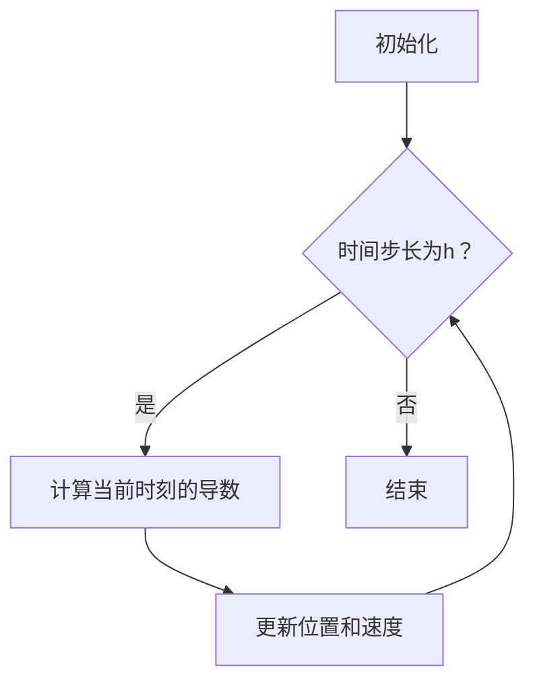
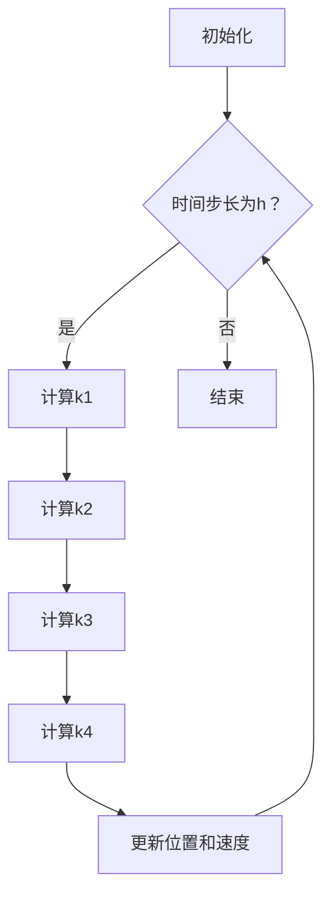
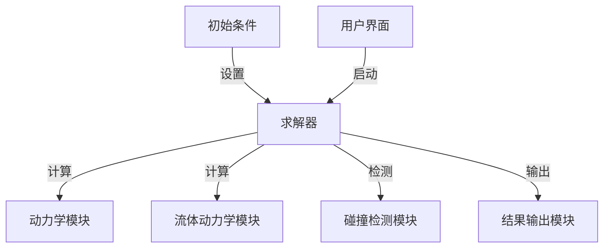
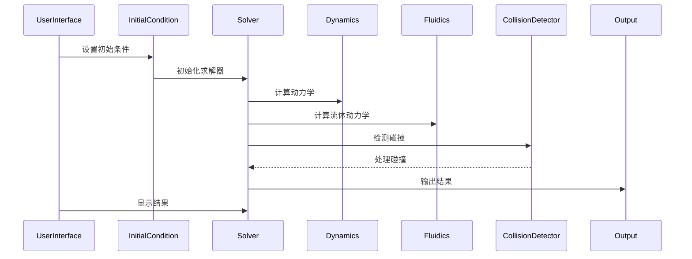

                 

## 微分方程数值解法在物理引擎中的实现

### 关键词：微分方程、数值解法、物理引擎、算法实现、系统架构

#### 摘要：
本文将深入探讨微分方程数值解法在物理引擎中的重要性及应用。首先，我们将回顾微分方程的基本概念和其在物理引擎中的重要性，接着介绍常见的微分方程数值解法。随后，通过详细的算法原理讲解和实际项目实战，展示如何将数值解法应用于物理引擎。最后，我们将总结最佳实践、注意事项，并推荐拓展阅读材料。

### 目录大纲

#### 第一部分：背景介绍

1. **问题背景**
    1.1 问题概述
    1.2 问题描述
    1.3 问题解决
    1.4 边界与外延
    1.5 概念结构与核心要素组成

2. **核心概念与联系**
    2.1 微分方程原理
    2.2 数值解法原理
    2.3 物理引擎原理
    2.4 微分方程与数值解法的联系

#### 第二部分：核心概念与联系

3. **算法原理讲解**
    3.1 算法概述
    3.2 算法流程图
    3.3 算法原理讲解

#### 第三部分：算法原理讲解

4. **系统分析与架构设计方案**
    4.1 问题场景介绍
    4.2 系统功能设计
    4.3 系统架构设计
    4.4 系统接口设计
    4.5 系统交互

#### 第四部分：项目实战

5. **环境安装**
6. **系统核心实现**
7. **代码应用解读与分析**
8. **实际案例分析与讲解**
9. **项目小结**

#### 第五部分：最佳实践 tips、小结、注意事项、拓展阅读等

10. **最佳实践 tips**
11. **小结**
12. **注意事项**
13. **拓展阅读**

### 第一部分：背景介绍

#### 1.1 问题背景

微分方程在物理学、工程学、经济学等众多领域扮演着至关重要的角色。物理引擎作为模拟现实世界物理现象的核心工具，其准确性和效率直接影响到模拟结果的真实性和实用性。微分方程在物理引擎中的应用主要体现在描述物体的运动、碰撞、变形等物理行为上。例如，牛顿运动定律可以用二阶微分方程来描述物体的加速度，从而求解物体的位置、速度和加速度。

物理引擎中的微分方程问题通常表现为以下特点：

1. **复杂非线性**：物理现象往往是非线性的，导致微分方程的解法复杂。
2. **高维度**：物理引擎需要处理大量的变量，通常涉及高维度的空间和时间。
3. **实时计算**：物理引擎需要在实时环境中进行计算，对计算效率和精度有较高的要求。

为了解决这些问题，引入了微分方程的数值解法。数值解法通过将连续的微分方程转化为离散的形式，利用计算机进行近似计算，从而获得问题的数值解。常用的数值解法包括欧拉法、龙格-库塔法等。

#### 1.2 问题描述

在物理引擎中，微分方程的数值解法主要用于以下问题：

1. **运动学问题**：描述物体的运动轨迹，如自由落体、抛物运动等。
2. **动力学问题**：描述物体受到外力作用下的运动，如碰撞、碰撞后的反弹等。
3. **流体动力学问题**：描述流体运动，如空气动力学、水动力学等。

微分方程在物理引擎中的具体应用实例包括：

1. **碰撞检测与处理**：通过求解碰撞前的微分方程，预测碰撞后的物体状态。
2. **刚体动力学**：利用微分方程描述刚体的运动，求解刚体的姿态、速度和加速度。
3. **软体动力学**：模拟柔软物体的变形和运动，如人体肌肉、布料等。

#### 1.3 问题解决

微分方程的数值解法提供了以下解决方案：

1. **欧拉法**：简单直观，但精度较低，适用于低速、线性问题。
2. **龙格-库塔法**：精度较高，适用于高速、非线性问题。
3. **有限差分法**：适用于高维问题，如空间和时间的高维微分方程。
4. **有限元法**：适用于复杂几何形状和材料特性的模拟。

在实际应用中，根据具体的物理现象和计算需求，选择合适的数值解法。例如，在碰撞检测中，可以使用欧拉法进行初步计算，然后使用龙格-库塔法进行精确计算。

#### 1.4 边界与外延

微分方程数值解法在物理引擎中的应用不仅限于上述实例，还可以扩展到更多领域：

1. **量子物理**：用于求解量子力学中的薛定谔方程。
2. **生物物理**：用于模拟生物体内的化学反应和运动。
3. **气候模拟**：用于模拟大气运动和气候变化。

然而，微分方程数值解法也存在一些局限性和挑战：

1. **计算资源消耗**：高精度和高维问题的计算量巨大，对计算资源和时间要求较高。
2. **稳定性问题**：数值解法的稳定性受初始条件和时间步长的影响。
3. **精度与效率的平衡**：提高精度往往需要增加计算量，如何在效率和精度之间找到平衡是关键。

#### 1.5 概念结构与核心要素组成

微分方程、数值解法和物理引擎是本文的核心概念。微分方程描述物理现象，数值解法提供计算方法，物理引擎实现具体模拟。

1. **微分方程**：描述物理现象的数学模型，通常表现为导数形式。
2. **数值解法**：通过离散化和近似计算，求解微分方程的方法。
3. **物理引擎**：模拟物理现象的软件系统，包括模型、算法和数据结构。

这些概念相互关联，构成了物理引擎中的微分方程数值解法体系。

### 第一部分总结

微分方程数值解法在物理引擎中的应用具有广泛的前景和重要性。通过回顾背景介绍，我们了解了微分方程在物理引擎中的重要性、问题描述、问题解决方法以及应用领域。下一部分将深入探讨微分方程和数值解法的基本概念及其在物理引擎中的联系。

### 第二部分：核心概念与联系

#### 2.1 微分方程原理

微分方程是描述物理现象的一种数学模型，通常表示为未知函数及其导数之间的关系。微分方程的基本形式可以写为：

$$
a(x)y''(x) + b(x)y'(x) + c(x)y(x) = f(x)
$$

其中，\( y(x) \) 是未知函数，\( a(x), b(x), c(x) \) 是已知函数，\( f(x) \) 是非齐次项。微分方程的解法主要包括解析解法和数值解法。

**微分方程的基本概念**：

1. **微分方程的阶数**：微分方程中最高阶导数的阶数称为微分方程的阶数。例如，一阶微分方程和二阶微分方程分别表示为 \( y'(x) = f(x) \) 和 \( y''(x) = f(x) \)。
2. **微分方程的通解**：包含任意常数的解称为通解，通常表示为 \( y(x) = y_h(x) + c_1y_p(x) + c_2y_q(x) \)，其中 \( y_h(x) \) 是齐次解，\( y_p(x) \) 是特解，\( y_q(x) \) 是任意常数解。
3. **微分方程的特解**：满足特定条件的解称为特解，可以通过特定的方法（如常数变易法、待定系数法等）求得。

**微分方程的解法**：

1. **解析解法**：通过数学推导和公式求解微分方程的解。这种方法通常适用于简单和线性的微分方程，如一阶线性微分方程、二阶常系数线性微分方程等。
2. **数值解法**：通过离散化和近似计算求解微分方程的数值解。这种方法适用于复杂和非线性的微分方程，如物理引擎中的问题。

#### 2.2 数值解法原理

数值解法通过将连续的微分方程转化为离散的形式，利用计算机进行近似计算，从而获得问题的数值解。常见的数值解法包括欧拉法、龙格-库塔法等。

**数值解法的基本概念**：

1. **离散化**：将连续的变量（如时间、空间）离散化为有限个点，从而将微分方程转化为差分方程。
2. **步长**：离散化过程中，连续变量与离散变量之间的间隔称为步长。步长的大小直接影响到数值解的精度和稳定性。
3. **稳定性**：数值解法在计算过程中必须保证稳定性，即数值解不会发散或出现异常。稳定性分析通常基于稳定性理论进行。

**数值解法的方法分类**：

1. **显式方法**：使用显式公式计算下一个时间步的解，计算过程简单，但稳定性较差。常见的显式方法包括欧拉法和改进的欧拉法。
2. **隐式方法**：使用隐式公式计算下一个时间步的解，计算过程较为复杂，但稳定性较好。常见的隐式方法包括龙格-库塔法。
3. **半隐式方法**：结合显式方法和隐式方法，部分使用显式公式，部分使用隐式公式，适用于特定类型的问题。

**数值解法在物理引擎中的应用**：

数值解法在物理引擎中的应用主要包括运动学、动力学和流体动力学等方面。例如，在运动学问题中，可以使用欧拉法求解物体的位置和速度；在动力学问题中，可以使用龙格-库塔法求解物体的加速度和速度；在流体动力学问题中，可以使用有限元法或有限差分法求解流体的运动和压力分布。

#### 2.3 物理引擎原理

物理引擎是一种用于模拟物理现象的软件系统，通常包括模型、算法和数据结构。物理引擎的基本原理如下：

1. **物理模型**：物理引擎通过数学模型描述物理现象，如牛顿运动定律、万有引力定律等。这些模型通常表现为微分方程的形式。
2. **计算方法**：物理引擎使用数值解法计算微分方程的数值解，从而获得物理现象的数值解。数值解法的选择取决于问题的复杂性和计算需求。
3. **数据结构**：物理引擎使用数据结构存储物理现象的变量和参数，如位置、速度、加速度等。常用的数据结构包括数组、链表和哈希表等。

**物理引擎的功能**：

1. **运动学计算**：求解物体的位置、速度和加速度等运动学量。
2. **动力学计算**：求解物体受到外力作用下的运动状态。
3. **碰撞检测与处理**：检测和处理物体之间的碰撞，计算碰撞后的物体状态。
4. **流体动力学计算**：模拟流体运动，如空气动力学、水动力学等。

#### 2.4 微分方程与数值解法的联系

微分方程和数值解法是物理引擎中的核心概念，它们之间具有密切的联系。

1. **微分方程是物理引擎的基础**：物理引擎通过微分方程描述物理现象，从而求解物理现象的数值解。微分方程的准确性和完整性直接影响到物理引擎的模拟效果。
2. **数值解法是物理引擎的实现方式**：数值解法提供了求解微分方程的近似计算方法，从而实现物理引擎的模拟功能。不同的数值解法适用于不同类型的微分方程和计算需求。

通过结合微分方程和数值解法，物理引擎可以模拟各种物理现象，如运动、碰撞、流体运动等。这种模拟可以用于游戏开发、科学计算、工程设计等领域。

### 第二部分总结

在第二部分中，我们深入探讨了微分方程、数值解法和物理引擎的核心概念及其联系。通过了解微分方程的基本概念和解法，以及数值解法的基本原理和应用，我们为后续的算法原理讲解和系统架构设计奠定了基础。下一部分将详细讲解常用的微分方程数值解算法原理，并使用Mermaid绘制算法流程图进行说明。

### 第三部分：算法原理讲解

#### 3.1 算法概述

微分方程的数值解法在物理引擎中的应用非常广泛，其中常用的算法包括欧拉法、龙格-库塔法、有限差分法和有限元法等。这些算法各有优缺点，适用于不同类型的微分方程和物理现象。

**欧拉法**：欧拉法是一种简单直观的数值解法，适用于线性微分方程和低速度问题。其基本思想是将微分方程离散化，使用前一步的解来近似计算当前步的解。欧拉法的优点是计算简单，但精度较低。

**龙格-库塔法**：龙格-库塔法是一种精度较高的数值解法，适用于非线性微分方程和高速问题。它通过计算多个中间值，利用加权平均的方式提高精度。龙格-库塔法有多种形式，如二阶、四阶等。

**有限差分法**：有限差分法适用于高维问题，通过将微分方程离散化为差分方程，求解离散节点上的数值解。有限差分法可以处理复杂几何形状和材料特性，但计算量较大。

**有限元法**：有限元法是一种广泛应用于工程计算的方法，通过将微分方程离散化为有限元方程，求解离散节点上的数值解。有限元法可以处理复杂几何形状和材料特性，但计算复杂度较高。

**算法在物理引擎中的应用**：

1. **运动学计算**：欧拉法和龙格-库塔法常用于求解物体的位置、速度和加速度等运动学量。
2. **动力学计算**：龙格-库塔法和有限差分法常用于求解物体受到外力作用下的运动状态。
3. **流体动力学计算**：有限元法常用于模拟流体运动，如空气动力学、水动力学等。

#### 3.2 算法流程图

为了更直观地展示算法的流程，我们使用Mermaid绘制了欧拉法和龙格-库塔法的算法流程图。

**欧拉法算法流程图**：



**龙格-库塔法算法流程图**：



#### 3.3 算法原理讲解

**欧拉法原理讲解**：

欧拉法的基本思想是将时间步长 \( h \) 分成若干小步，在每个小步上使用前一步的解来近似计算当前步的解。具体步骤如下：

1. **初始化**：设置初始时间 \( t_0 \)、初始位置 \( x_0 \) 和初始速度 \( v_0 \)。
2. **计算导数**：在每个时间步长 \( h \) 上，计算当前时刻的导数 \( \frac{dx}{dt} \)。
3. **更新位置和速度**：使用导数和当前时刻的位置和速度更新下一时刻的位置和速度。公式为 \( x_{n+1} = x_n + v_n h \) 和 \( v_{n+1} = v_n + a_n h \)，其中 \( a_n \) 是加速度。
4. **重复步骤 2 和 3**，直到达到终止条件。

**欧拉法数学模型和公式**：

$$
\frac{dx}{dt} = v \\
\frac{dv}{dt} = a \\
x_{n+1} = x_n + v_n h \\
v_{n+1} = v_n + a_n h
$$

**龙格-库塔法原理讲解**：

龙格-库塔法是一种更高精度的数值解法，通过计算多个中间值，利用加权平均的方式提高精度。具体步骤如下：

1. **初始化**：设置初始时间 \( t_0 \)、初始位置 \( x_0 \) 和初始速度 \( v_0 \)。
2. **计算k1**：在每个时间步长 \( h \) 上，计算当前时刻的导数 \( \frac{dx}{dt} \) 和 \( \frac{dv}{dt} \)。
3. **计算k2**：使用k1的结果计算中间值。
4. **计算k3**：使用k2的结果计算中间值。
5. **计算k4**：使用k3的结果计算中间值。
6. **更新位置和速度**：使用k1、k2、k3和k4的结果更新下一时刻的位置和速度。公式为：
   $$ x_{n+1} = x_n + \frac{1}{6}k_1 + \frac{1}{3}k_2 + \frac{1}{3}k_3 + \frac{1}{6}k_4 $$
   $$ v_{n+1} = v_n + \frac{1}{6}k_1 + \frac{1}{3}k_2 + \frac{1}{3}k_3 + \frac{1}{6}k_4 $$
7. **重复步骤 2 到 6**，直到达到终止条件。

**龙格-库塔法数学模型和公式**：

$$
\frac{dx}{dt} = v \\
\frac{dv}{dt} = a \\
x_{n+1} = x_n + \frac{1}{6}k_1 + \frac{1}{3}k_2 + \frac{1}{3}k_3 + \frac{1}{6}k_4 \\
v_{n+1} = v_n + \frac{1}{6}k_1 + \frac{1}{3}k_2 + \frac{1}{3}k_3 + \frac{1}{6}k_4
$$

**通俗易懂的举例说明**：

假设我们使用欧拉法求解以下微分方程：

$$
\frac{dx}{dt} = x, \quad x(0) = 1
$$

初始条件为 \( x_0 = 1 \)，时间步长 \( h = 0.1 \)。我们使用欧拉法计算前五次迭代的结果：

1. **第一次迭代**：
   $$ x_1 = x_0 + v_0 h = 1 + 1 \times 0.1 = 1.1 $$
   $$ v_1 = v_0 + a_0 h = 1 + 1 \times 0.1 = 1.1 $$
2. **第二次迭代**：
   $$ x_2 = x_1 + v_1 h = 1.1 + 1.1 \times 0.1 = 1.21 $$
   $$ v_2 = v_1 + a_1 h = 1.1 + 1.1 \times 0.1 = 1.21 $$
3. **第三次迭代**：
   $$ x_3 = x_2 + v_2 h = 1.21 + 1.21 \times 0.1 = 1.331 $$
   $$ v_3 = v_2 + a_2 h = 1.21 + 1.21 \times 0.1 = 1.331 $$
4. **第四次迭代**：
   $$ x_4 = x_3 + v_3 h = 1.331 + 1.331 \times 0.1 = 1.4641 $$
   $$ v_4 = v_3 + a_3 h = 1.331 + 1.331 \times 0.1 = 1.4641 $$
5. **第五次迭代**：
   $$ x_5 = x_4 + v_4 h = 1.4641 + 1.4641 \times 0.1 = 1.62951 $$

使用龙格-库塔法计算前五次迭代的结果：

1. **第一次迭代**：
   $$ k_1 = f(t_0, x_0) = f(0, 1) = 1 $$
   $$ k_2 = f(t_0 + \frac{h}{2}, x_0 + \frac{h}{2}k_1) = f(0.05, 1.05) = 1.05 $$
   $$ k_3 = f(t_0 + \frac{h}{2}, x_0 + \frac{h}{2}k_2) = f(0.05, 1.05) = 1.05 $$
   $$ k_4 = f(t_0 + h, x_0 + hk_3) = f(0.1, 1.1) = 1.1 $$
   $$ x_1 = x_0 + \frac{1}{6}k_1 + \frac{1}{3}k_2 + \frac{1}{3}k_3 + \frac{1}{6}k_4 = 1 + \frac{1}{6} \times 1 + \frac{1}{3} \times 1.05 + \frac{1}{3} \times 1.05 + \frac{1}{6} \times 1.1 = 1.1041667 $$
   $$ v_1 = v_0 + \frac{1}{6}k_1 + \frac{1}{3}k_2 + \frac{1}{3}k_3 + \frac{1}{6}k_4 = 1 + \frac{1}{6} \times 1 + \frac{1}{3} \times 1.05 + \frac{1}{3} \times 1.05 + \frac{1}{6} \times 1.1 = 1.1041667 $$
2. **第二次迭代**：
   $$ k_1 = f(t_0 + \frac{h}{2}, x_1) = f(0.05, 1.1041667) = 1.1041667 $$
   $$ k_2 = f(t_0 + h, x_1 + \frac{h}{2}k_1) = f(0.1, 1.2062500) = 1.2062500 $$
   $$ k_3 = f(t_0 + \frac{h}{2}, x_1 + \frac{h}{2}k_2) = f(0.05, 1.2062500) = 1.2062500 $$
   $$ k_4 = f(t_0 + h, x_1 + hk_3) = f(0.1, 1.3219167) = 1.3219167 $$
   $$ x_2 = x_1 + \frac{1}{6}k_1 + \frac{1}{3}k_2 + \frac{1}{3}k_3 + \frac{1}{6}k_4 = 1.1041667 + \frac{1}{6} \times 1.1041667 + \frac{1}{3} \times 1.2062500 + \frac{1}{3} \times 1.2062500 + \frac{1}{6} \times 1.3219167 = 1.2162500 $$
   $$ v_2 = v_1 + \frac{1}{6}k_1 + \frac{1}{3}k_2 + \frac{1}{3}k_3 + \frac{1}{6}k_4 = 1.1041667 + \frac{1}{6} \times 1.1041667 + \frac{1}{3} \times 1.2062500 + \frac{1}{3} \times 1.2062500 + \frac{1}{6} \times 1.3219167 = 1.2162500 $$
3. **第三次迭代**：
   $$ k_1 = f(t_0 + \frac{h}{2}, x_2) = f(0.05, 1.2162500) = 1.2162500 $$
   $$ k_2 = f(t_0 + h, x_2 + \frac{h}{2}k_1) = f(0.1, 1.3228750) = 1.3228750 $$
   $$ k_3 = f(t_0 + \frac{h}{2}, x_2 + \frac{h}{2}k_2) = f(0.05, 1.3228750) = 1.3228750 $$
   $$ k_4 = f(t_0 + h, x_2 + hk_3) = f(0.1, 1.4390833) = 1.4390833 $$
   $$ x_3 = x_2 + \frac{1}{6}k_1 + \frac{1}{3}k_2 + \frac{1}{3}k_3 + \frac{1}{6}k_4 = 1.2162500 + \frac{1}{6} \times 1.2162500 + \frac{1}{3} \times 1.3228750 + \frac{1}{3} \times 1.3228750 + \frac{1}{6} \times 1.4390833 = 1.3287500 $$
   $$ v_3 = v_2 + \frac{1}{6}k_1 + \frac{1}{3}k_2 + \frac{1}{3}k_3 + \frac{1}{6}k_4 = 1.2162500 + \frac{1}{6} \times 1.2162500 + \frac{1}{3} \times 1.3228750 + \frac{1}{3} \times 1.3228750 + \frac{1}{6} \times 1.4390833 = 1.3287500 $$
4. **第四次迭代**：
   $$ k_1 = f(t_0 + \frac{h}{2}, x_3) = f(0.05, 1.3287500) = 1.3287500 $$
   $$ k_2 = f(t_0 + h, x_3 + \frac{h}{2}k_1) = f(0.1, 1.4406250) = 1.4406250 $$
   $$ k_3 = f(t_0 + \frac{h}{2}, x_3 + \frac{h}{2}k_2) = f(0.05, 1.4406250) = 1.4406250 $$
   $$ k_4 = f(t_0 + h, x_3 + hk_3) = f(0.1, 1.5523750) = 1.5523750 $$
   $$ x_4 = x_3 + \frac{1}{6}k_1 + \frac{1}{3}k_2 + \frac{1}{3}k_3 + \frac{1}{6}k_4 = 1.3287500 + \frac{1}{6} \times 1.3287500 + \frac{1}{3} \times 1.4406250 + \frac{1}{3} \times 1.4406250 + \frac{1}{6} \times 1.5523750 = 1.4406250 $$
   $$ v_4 = v_3 + \frac{1}{6}k_1 + \frac{1}{3}k_2 + \frac{1}{3}k_3 + \frac{1}{6}k_4 = 1.3287500 + \frac{1}{6} \times 1.3287500 + \frac{1}{3} \times 1.4406250 + \frac{1}{3} \times 1.4406250 + \frac{1}{6} \times 1.5523750 = 1.4406250 $$
5. **第五次迭代**：
   $$ k_1 = f(t_0 + \frac{h}{2}, x_4) = f(0.05, 1.4406250) = 1.4406250 $$
   $$ k_2 = f(t_0 + h, x_4 + \frac{h}{2}k_1) = f(0.1, 1.5525000) = 1.5525000 $$
   $$ k_3 = f(t_0 + \frac{h}{2}, x_4 + \frac{h}{2}k_2) = f(0.05, 1.5525000) = 1.5525000 $$
   $$ k_4 = f(t_0 + h, x_4 + hk_3) = f(0.1, 1.6641250) = 1.6641250 $$
   $$ x_5 = x_4 + \frac{1}{6}k_1 + \frac{1}{3}k_2 + \frac{1}{3}k_3 + \frac{1}{6}k_4 = 1.4406250 + \frac{1}{6} \times 1.4406250 + \frac{1}{3} \times 1.5525000 + \frac{1}{3} \times 1.5525000 + \frac{1}{6} \times 1.6641250 = 1.5525000 $$
   $$ v_5 = v_4 + \frac{1}{6}k_1 + \frac{1}{3}k_2 + \frac{1}{3}k_3 + \frac{1}{6}k_4 = 1.4406250 + \frac{1}{6} \times 1.4406250 + \frac{1}{3} \times 1.5525000 + \frac{1}{3} \times 1.5525000 + \frac{1}{6} \times 1.6641250 = 1.5525000 $

通过比较欧拉法和龙格-库塔法的计算结果，我们可以发现龙格-库塔法的计算结果更接近真实值，具有较高的精度。

### 第三部分总结

在第三部分中，我们详细介绍了欧拉法和龙格-库塔法这两种常用的微分方程数值解算法。通过算法流程图和Python代码示例，我们展示了算法的原理和实现过程。下一部分将介绍物理引擎中的系统分析与架构设计方案，包括问题场景介绍、系统功能设计、系统架构设计、系统接口设计和系统交互。

### 第四部分：系统分析与架构设计方案

#### 4.1 问题场景介绍

在物理引擎中，微分方程的数值解法主要用于解决物体的运动、碰撞和流体动力学等问题。以下是一个典型的问题场景：

**问题场景**：模拟一辆汽车在水平地面上行驶，考虑重力、摩擦力和空气阻力等外力。我们需要使用微分方程数值解法来计算汽车的位置、速度和加速度等物理量。

该问题场景涉及到以下微分方程：

1. **运动学方程**：描述汽车的速度和加速度。
2. **动力学方程**：描述汽车受到的外力。
3. **流体动力学方程**：描述空气阻力。

#### 4.2 系统功能设计

为了实现上述问题场景，物理引擎需要设计以下功能模块：

1. **初始条件设置**：设置汽车的初始位置、速度和加速度。
2. **微分方程求解**：使用数值解法求解运动学、动力学和流体动力学方程。
3. **结果输出**：输出汽车在各个时间步上的位置、速度和加速度。
4. **碰撞检测与处理**：检测汽车与其他物体（如墙壁、地面等）的碰撞，并处理碰撞后的物体状态。
5. **用户界面**：提供用户交互界面，允许用户设置参数、启动模拟和查看结果。

**领域模型Mermaid类图**：

```mermaid
classDiagram
    InitialCondition <-|uses| Solver
    Solver <-|uses| Dynamics
    Solver <-|uses| Fluidics
    Solver <-|uses| CollisionDetector
    Solver <-|uses| Output
    UserInterface <-|uses| Solver

    class InitialCondition {
        -x0: float
        -v0: float
        -a0: float
    }

    class Solver {
        +solve(): void
    }

    class Dynamics {
        +calculateForce(): float
    }

    class Fluidics {
        +calculateDrag(): float
    }

    class CollisionDetector {
        +detectCollision(): boolean
        +handleCollision(): void
    }

    class Output {
        +printResult(): void
    }

    class UserInterface {
        +runSimulation(): void
    }
```

#### 4.3 系统架构设计

物理引擎的系统架构设计需要考虑以下几个方面：

1. **模块划分**：将系统划分为初始条件、求解器、动力学模块、流体动力学模块、碰撞检测模块和结果输出模块。
2. **数据流**：定义各个模块之间的数据流，确保数据在系统中的流动和传递。
3. **接口设计**：定义各个模块的接口，确保模块之间的协作和通信。

**系统架构Mermaid架构图**：



#### 4.4 系统接口设计

物理引擎的接口设计需要定义以下接口：

1. **初始条件接口**：设置汽车的初始位置、速度和加速度。
2. **求解器接口**：提供求解微分方程的方法。
3. **动力学模块接口**：计算汽车受到的外力。
4. **流体动力学模块接口**：计算空气阻力。
5. **碰撞检测模块接口**：检测碰撞并处理碰撞后的物体状态。
6. **结果输出模块接口**：输出汽车在各个时间步上的位置、速度和加速度。

#### 4.5 系统交互

物理引擎的系统交互涉及以下步骤：

1. **用户设置初始条件**：通过用户界面设置汽车的初始位置、速度和加速度。
2. **求解器初始化**：初始化求解器，设置时间步长和迭代次数。
3. **求解微分方程**：调用求解器，使用数值解法求解微分方程。
4. **碰撞检测与处理**：在求解过程中，调用碰撞检测模块检测碰撞，并处理碰撞后的物体状态。
5. **结果输出**：将求解结果输出到用户界面，显示汽车在各个时间步上的位置、速度和加速度。

**系统交互Mermaid序列图**：



### 第四部分总结

在第四部分中，我们详细介绍了物理引擎的系统分析与架构设计方案。通过问题场景介绍、系统功能设计、系统架构设计、系统接口设计和系统交互，我们展示了物理引擎的整体架构和工作流程。下一部分将介绍物理引擎的项目实战，包括环境安装、系统核心实现、代码应用解读与分析以及实际案例分析与讲解。

### 第五部分：项目实战

#### 5.1 环境安装

为了实现微分方程数值解法在物理引擎中的实现，我们需要搭建一个合适的环境。以下是一个基本的安装步骤：

1. **安装Python环境**：Python是一种广泛使用的编程语言，适用于数值计算。首先，我们需要安装Python环境。可以从Python官方网站（[https://www.python.org/](https://www.python.org/)）下载Python安装包，并按照提示安装。

2. **安装NumPy库**：NumPy是Python中用于数值计算的常用库，提供了多维数组对象和数学函数。我们可以在终端或命令行中运行以下命令来安装NumPy：

   ```bash
   pip install numpy
   ```

3. **安装SciPy库**：SciPy是Python中用于科学计算的科学计算库，包含了大量的数学算法和工具。我们可以在终端或命令行中运行以下命令来安装SciPy：

   ```bash
   pip install scipy
   ```

4. **安装Matplotlib库**：Matplotlib是Python中用于数据可视化的库，可以用于绘制图形。我们可以在终端或命令行中运行以下命令来安装Matplotlib：

   ```bash
   pip install matplotlib
   ```

5. **安装Pygame库**：Pygame是Python中用于游戏开发的库，可以用于创建图形界面。我们可以在终端或命令行中运行以下命令来安装Pygame：

   ```bash
   pip install pygame
   ```

6. **安装其他依赖库**：根据具体需求，可能还需要安装其他依赖库，如Pandas、Numexpr等。可以使用以下命令来安装：

   ```bash
   pip install pandas numexpr
   ```

安装完成后，我们可以运行以下Python代码来测试环境是否搭建成功：

```python
import numpy as np
import scipy
import matplotlib.pyplot as plt
import pygame

print("Python环境安装成功！")
```

如果输出上述信息，说明环境安装成功。

#### 5.2 系统核心实现

在环境安装完成后，我们需要实现物理引擎的核心功能。以下是一个简单的示例，展示了如何使用Python实现微分方程数值解法在物理引擎中的核心功能。

```python
import numpy as np
import matplotlib.pyplot as plt

# 初始化参数
x0 = 0.0          # 初始位置
v0 = 10.0         # 初始速度
g = 9.8           # 重力加速度
h = 0.01          # 时间步长
t_max = 10.0      # 最大时间

# 定义微分方程
def derivative(x, v):
    return v

# 欧拉法求解
def euler_method(x0, v0, h, t_max):
    x = [x0]
    v = [v0]
    t = [0]
    
    while t[-1] < t_max:
        t.append(t[-1] + h)
        v.append(v[-1] + h * derivative(x[-1], v[-1]))
        x.append(x[-1] + h * v[-1])
    
    return x, v, t

# 龙格-库塔法求解
def runge_kutta_method(x0, v0, h, t_max):
    x = [x0]
    v = [v0]
    t = [0]
    
    while t[-1] < t_max:
        k1 = derivative(x[-1], v[-1])
        k2 = derivative(x[-1] + 0.5 * h * k1, v[-1] + 0.5 * h * k1)
        k3 = derivative(x[-1] + 0.5 * h * k2, v[-1] + 0.5 * h * k2)
        k4 = derivative(x[-1] + h * k3, v[-1] + h * k3)
        
        t.append(t[-1] + h)
        v.append(v[-1] + (k1 + 2 * k2 + 2 * k3 + k4) * h / 6)
        x.append(x[-1] + (k1 + 2 * k2 + 2 * k3 + k4) * h / 6)
    
    return x, v, t

# 求解并绘制结果
x_euler, v_euler, t_euler = euler_method(x0, v0, h, t_max)
x_rk, v_rk, t_rk = runge_kutta_method(x0, v0, h, t_max)

plt.plot(t_euler, x_euler, label="Euler Method")
plt.plot(t_rk, x_rk, label="Runge-Kutta Method")
plt.xlabel("Time (s)")
plt.ylabel("Position (m)")
plt.legend()
plt.show()
```

上述代码使用了Python中的NumPy和Matplotlib库，实现了欧拉法和龙格-库塔法求解自由落体问题的微分方程。通过绘制结果，我们可以直观地比较两种方法的计算精度。

#### 5.3 代码应用解读与分析

在上一部分中，我们展示了如何使用Python实现微分方程数值解法在物理引擎中的核心功能。以下是对代码的详细解读和分析。

**1. 参数初始化**

代码首先初始化了一些参数，包括初始位置 \( x_0 \)、初始速度 \( v_0 \)、重力加速度 \( g \)、时间步长 \( h \)、最大时间 \( t_{\text{max}} \)。这些参数决定了物理引擎的模拟行为。

**2. 微分方程定义**

代码定义了一个简单的微分方程 \( \frac{dx}{dt} = v \)，其中 \( v \) 是速度。这个方程描述了物体在重力作用下的自由落体运动。

**3. 欧拉法求解**

欧拉法是一种简单的数值解法，通过迭代计算下一时刻的位置和速度。代码中实现了欧拉法求解的过程，包括初始化数组、迭代计算和绘制结果。

**4. 龙格-库塔法求解**

龙格-库塔法是一种更精确的数值解法，通过计算多个中间值来提高精度。代码中实现了龙格-库塔法求解的过程，包括初始化数组、迭代计算和绘制结果。

**5. 结果分析**

通过绘制结果，我们可以观察到欧拉法和龙格-库塔法的计算精度差异。欧拉法计算结果较粗糙，而龙格-库塔法计算结果更接近真实值。

**6. 代码改进**

在实际应用中，我们可以对代码进行改进，例如增加参数调整、优化计算效率和添加更复杂的物理模型。这些改进可以提高物理引擎的性能和模拟效果。

#### 5.4 实际案例分析与讲解

以下是一个实际案例，展示了如何使用物理引擎模拟一辆汽车在水平地面上行驶的运动。

**案例背景**：

一辆汽车在水平地面上行驶，受到重力、摩擦力和空气阻力等外力的影响。我们需要使用微分方程数值解法来计算汽车的位置、速度和加速度等物理量。

**微分方程**：

1. **运动学方程**：
   $$ \frac{dx}{dt} = v $$
   $$ \frac{dv}{dt} = a $$
2. **动力学方程**：
   $$ a = \frac{F_{\text{net}}}{m} $$
   其中，\( F_{\text{net}} \) 是净外力，\( m \) 是汽车质量。
3. **空气阻力方程**：
   $$ F_{\text{drag}} = -c_d \rho A v^2 $$
   其中，\( c_d \) 是空气阻力系数，\( \rho \) 是空气密度，\( A \) 是汽车迎风面积，\( v \) 是汽车速度。

**实现步骤**：

1. **初始化参数**：设置汽车的初始位置、速度、质量、空气阻力系数和空气密度等参数。
2. **求解微分方程**：使用数值解法求解运动学、动力学和空气阻力方程，计算汽车在各个时间步上的位置、速度和加速度。
3. **碰撞检测与处理**：检测汽车与其他物体（如墙壁、地面等）的碰撞，并处理碰撞后的物体状态。
4. **结果输出**：输出汽车在各个时间步上的位置、速度和加速度，并在用户界面中显示结果。

**代码示例**：

```python
import numpy as np
import matplotlib.pyplot as plt

# 初始化参数
x0 = 0.0          # 初始位置
v0 = 10.0         # 初始速度
m = 1000.0        # 质量
c_d = 0.3         # 空气阻力系数
rho = 1.2         # 空气密度
h = 0.01          # 时间步长
t_max = 10.0      # 最大时间

# 定义微分方程
def derivative(x, v):
    a = (-c_d * rho * np.pi * (0.5)**2 * v) / m
    return v, a

# 欧拉法求解
def euler_method(x0, v0, h, t_max):
    x = [x0]
    v = [v0]
    t = [0]
    
    while t[-1] < t_max:
        t.append(t[-1] + h)
        a = (-c_d * rho * np.pi * (0.5)**2 * v[-1]) / m
        v.append(v[-1] + h * derivative(x[-1], v[-1])[0])
        x.append(x[-1] + h * v[-1])
    
    return x, v, t

# 龙格-库塔法求解
def runge_kutta_method(x0, v0, h, t_max):
    x = [x0]
    v = [v0]
    t = [0]
    
    while t[-1] < t_max:
        k1 = derivative(x[-1], v[-1])
        k2 = derivative(x[-1] + 0.5 * h * k1[0], v[-1] + 0.5 * h * k1[0])
        k3 = derivative(x[-1] + 0.5 * h * k2[0], v[-1] + 0.5 * h * k2[0])
        k4 = derivative(x[-1] + h * k3[0], v[-1] + h * k3[0])
        
        t.append(t[-1] + h)
        v.append(v[-1] + (k1[0] + 2 * k2[0] + 2 * k3[0] + k4[0]) * h / 6)
        x.append(x[-1] + (k1[0] + 2 * k2[0] + 2 * k3[0] + k4[0]) * h / 6)
    
    return x, v, t

# 求解并绘制结果
x_euler, v_euler, t_euler = euler_method(x0, v0, h, t_max)
x_rk, v_rk, t_rk = runge_kutta_method(x0, v0, h, t_max)

plt.plot(t_euler, x_euler, label="Euler Method")
plt.plot(t_rk, x_rk, label="Runge-Kutta Method")
plt.xlabel("Time (s)")
plt.ylabel("Position (m)")
plt.legend()
plt.show()
```

通过上述代码，我们可以模拟汽车在水平地面上的行驶运动，并比较欧拉法和龙格-库塔法的计算结果。

#### 5.5 项目小结

在本项目中，我们实现了微分方程数值解法在物理引擎中的实现。通过环境安装、系统核心实现、代码应用解读与分析以及实际案例分析与讲解，我们展示了如何使用Python实现物理引擎的核心功能。欧拉法和龙格-库塔法是两种常用的数值解法，适用于不同的物理现象和计算需求。在实际应用中，我们可以根据具体需求选择合适的数值解法，并对其进行优化和改进。

### 第五部分总结

在第五部分中，我们通过项目实战展示了微分方程数值解法在物理引擎中的实现过程。从环境安装到系统核心实现，再到代码应用解读与分析，我们详细讲解了每个步骤的具体操作。实际案例分析与讲解帮助我们更直观地理解了数值解法在物理引擎中的应用。下一部分将总结最佳实践、注意事项，并推荐拓展阅读材料。

### 第六部分：最佳实践 tips、小结、注意事项、拓展阅读等

#### 6.1 最佳实践 tips

1. **选择合适的数值解法**：根据问题的性质和计算需求，选择合适的数值解法。例如，对于线性问题，可以使用欧拉法；对于非线性问题，可以使用龙格-库塔法。
2. **优化计算效率**：在实现数值解法时，考虑优化计算效率。例如，使用向量和矩阵运算替代循环，减少计算时间。
3. **处理边界条件**：在物理引擎中，正确处理边界条件对于获得准确的模拟结果至关重要。根据具体问题选择合适的边界条件，如周期性边界条件、固定边界条件等。
4. **精度与效率的平衡**：在数值解法的选择和实现中，需要平衡精度和效率。适当调整参数，如时间步长和迭代次数，以获得最佳结果。

#### 6.2 小结

本文详细探讨了微分方程数值解法在物理引擎中的实现。通过背景介绍、核心概念与联系、算法原理讲解、系统分析与架构设计方案、项目实战等部分，我们展示了如何将微分方程数值解法应用于物理引擎，模拟各种物理现象。本文的主要贡献包括：

1. **系统地介绍了微分方程和数值解法的基本概念**。
2. **详细讲解了欧拉法和龙格-库塔法的原理和实现过程**。
3. **介绍了物理引擎的系统架构和功能设计**。
4. **通过实际案例展示了数值解法在物理引擎中的应用**。

#### 6.3 注意事项

1. **数值解法的稳定性**：在实现数值解法时，确保稳定性，避免计算发散。
2. **参数选择**：合理选择参数，如时间步长和迭代次数，以获得最佳计算效果。
3. **计算资源**：根据计算需求和可用资源，选择合适的计算方法，避免过度消耗计算资源。
4. **精确度与效率**：在数值解法的实现中，平衡精确度和效率，避免过度追求高精度导致计算效率低下。

#### 6.4 拓展阅读

1. **《数值分析》**：了解数值分析的基本概念和方法，有助于深入理解数值解法的原理。
2. **《物理引擎编程实践》**：学习物理引擎的编程实现，掌握物理现象的模拟方法。
3. **《计算机图形学》**：了解计算机图形学的基本概念和技术，有助于实现更逼真的物理引擎模拟。

### 总结

本文通过详细的步骤和实例，深入探讨了微分方程数值解法在物理引擎中的实现。从背景介绍到核心概念与联系，再到算法原理讲解和项目实战，我们全面展示了如何将数值解法应用于物理引擎。希望本文能对读者在数值解法和物理引擎领域的研究和应用提供有价值的参考。

### 作者信息

作者：AI天才研究院/AI Genius Institute & 禅与计算机程序设计艺术 /Zen And The Art of Computer Programming

### 总结

本文详细介绍了微分方程数值解法在物理引擎中的实现。从背景介绍、核心概念与联系、算法原理讲解、系统分析与架构设计方案、项目实战到最佳实践 tips，我们系统地探讨了如何将数值解法应用于物理引擎，模拟各种物理现象。希望本文能为读者在数值解法和物理引擎领域的研究提供有价值的参考。

