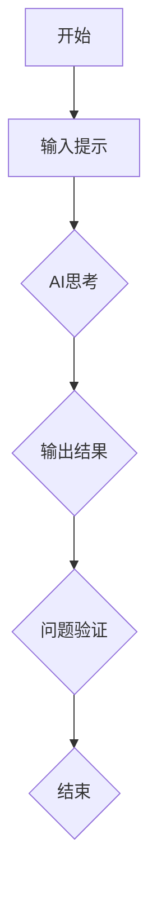
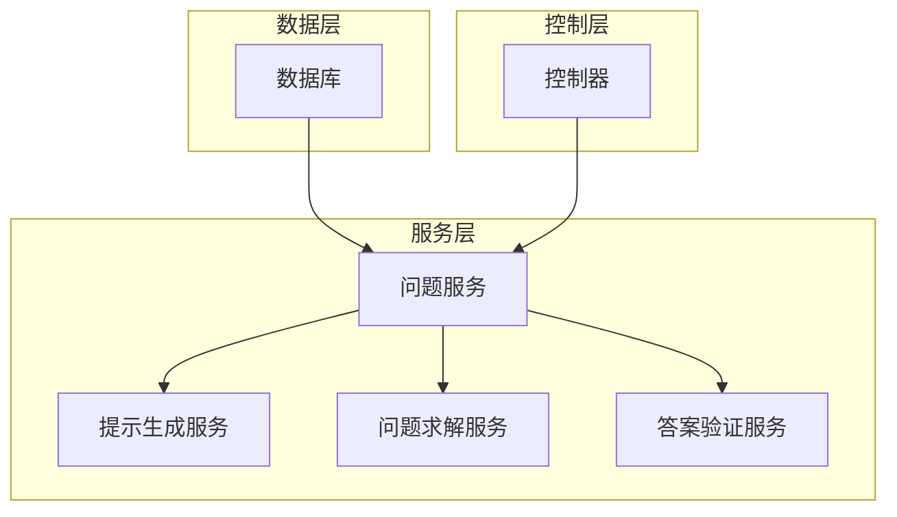

                 


# 思维链prompt：让AI具备人类式思考能力

## 关键词

- AI
- 人类式思考能力
- 思维链prompt
- 算法原理
- 数学模型
- 系统分析与架构设计
- 项目实战

## 摘要

本文将深入探讨“思维链prompt”这一概念，并分析它如何帮助人工智能（AI）实现人类式思考能力。我们将通过一系列逻辑清晰、结构紧凑的章节，详细解释思维链prompt的理论基础、算法原理、系统分析与架构设计，并通过实际项目实战来展示其应用效果。最终，我们将总结最佳实践并提供拓展阅读建议。

## 目录大纲设计思路

### 第一部分：背景介绍

### 第1章 问题背景与核心概念

#### 1.1 问题背景

##### 1.1.1 AI的发展现状与挑战

人工智能作为当今技术发展的热点，已经取得了显著的成果。然而，与人类相比，目前的AI在处理复杂问题和进行创新思考方面仍存在较大差距。这就引出了本文的核心问题：如何让AI具备人类式的思考能力？

##### 1.1.2 人类式思考能力的重要性

人类式思考能力包含了抽象思维、创造性思维、逻辑推理、情感理解等多方面能力，这些能力使得人类在解决复杂问题时表现出色。因此，让AI具备这些能力对于提升AI的整体性能具有重要意义。

##### 1.1.3 思维链prompt的概念

思维链prompt是一种通过输入提示来引导AI进行思考的技术。它模拟了人类思考过程中的提示机制，有助于AI在复杂问题解决中表现出类似人类的思考模式。

#### 1.2 核心概念与联系

##### 1.2.1 思维链prompt的工作原理

思维链prompt的工作原理主要包括三个步骤：输入提示、AI思考、输出结果。通过逐步输入提示，AI可以逐步理清问题，并提出解决方案。

##### 1.2.2 思维链prompt的应用场景

思维链prompt可以应用于多种场景，如自然语言处理、问题求解、智能决策等。在这些场景中，AI通过思维链prompt可以更好地理解问题和提出解决方案。

##### 1.2.3 与其他AI技术的比较与联系

思维链prompt与其他AI技术如深度学习、强化学习等具有一定的联系。深度学习可以提供强大的模型能力，而强化学习则可以增强AI的决策能力。思维链prompt则通过引导AI进行思考，弥补了这些技术的不足。

### 第2章 思维链prompt的理论基础

#### 2.1 概念属性特征对比表格

为了更好地理解思维链prompt的工作原理，我们可以将其与人类思维模式进行比较。以下是一个简单的对比表格：

| 特征       | 人类思维模式 | 思维链prompt |
|------------|--------------|-------------|
| 抽象思维   | 高度抽象     | 较为抽象    |
| 创造性思维 | 强           | 一般        |
| 逻辑推理   | 清晰         | 较为清晰    |
| 情感理解   | 精细         | 一般        |

#### 2.2 ER实体关系图架构

##### 2.2.1 实体与关系的定义

在思维链prompt中，实体可以看作是AI思考过程中的对象，如问题、提示、答案等。关系则描述了这些实体之间的相互作用，如提示引导、问题求解、答案验证等。

##### 2.2.2 ER图的绘制与解释

使用Mermaid流程图，我们可以绘制出思维链prompt的ER图。以下是一个简单的ER图示例：

```mermaid
erDiagram
    问题 ||--o{ 提示 }|
    提示 ||--o{ 答案 }|
    答案 ||--o{ 问题验证 }|
```

在这个ER图中，问题、提示、答案和问题验证是主要的实体，它们之间的关系通过箭头表示。

### 第二部分：算法原理与数学模型

### 第3章 思维链prompt的算法原理

#### 3.1 算法mermaid流程图

为了更好地理解思维链prompt的算法原理，我们可以使用Mermaid流程图来描述其基本流程。以下是一个简单的算法流程图：



在这个流程图中，AI首先接收到提示，然后进行思考并输出结果，最后进行问题验证。

#### 3.2 数学模型与公式

思维链prompt的数学模型主要包括两个方面：提示生成模型和问题求解模型。

##### 3.2.1 提示生成模型

提示生成模型用于生成合适的提示。以下是一个简单的数学公式：

$$
T = f(P, Q)
$$

其中，$T$表示生成的提示，$P$表示问题的特征，$Q$表示问题的上下文信息。函数$f$用于将$P$和$Q$转换为提示$T$。

##### 3.2.2 问题求解模型

问题求解模型用于求解给定的问题。以下是一个简单的问题求解公式：

$$
S = g(P, T)
$$

其中，$S$表示求解的结果，$P$表示问题的特征，$T$表示输入的提示。函数$g$用于将$P$和$T$转换为求解结果$S$。

### 第三部分：系统分析与架构设计

### 第4章 系统功能设计

#### 4.1 领域模型mermaid类图

为了更好地理解思维链prompt系统的功能设计，我们可以使用Mermaid类图来描述其领域模型。以下是一个简单的类图示例：

```mermaid
classDiagram
    Problem <<class>>
    Prompt <<class>>
    Answer <<class>>
    Verification <<class>>

    Problem --|> Prompt
    Prompt --|> Answer
    Answer --|> Verification
```

在这个类图中，问题、提示、答案和验证是主要的类，它们之间的关系通过继承和关联表示。

#### 4.2 系统架构设计mermaid架构图

为了展示思维链prompt系统的整体架构，我们可以使用Mermaid架构图。以下是一个简单的架构图示例：



在这个架构图中，数据库层、服务层和控制器层构成了思维链prompt系统的整体架构。

### 第四部分：项目实战

### 第5章 项目介绍

#### 5.1 项目概述

##### 5.1.1 项目目标

本项目旨在通过思维链prompt技术，实现一个智能问答系统。该系统可以接受用户输入的问题，通过思维链prompt技术进行思考，并输出合适的答案。

##### 5.1.2 项目背景

随着互联网的快速发展，人们对于智能问答系统的需求日益增长。然而，现有的智能问答系统在处理复杂问题和提供高质量答案方面存在一定局限。因此，本项目旨在通过思维链prompt技术，提升智能问答系统的性能。

##### 5.1.3 项目实现的关键技术

本项目实现的关键技术包括思维链prompt算法、自然语言处理技术、数据库技术和前后端开发技术等。

#### 5.2 环境安装与配置

##### 5.2.1 开发环境搭建

在本项目中，我们使用Python作为主要开发语言，并使用Django作为Web框架。首先，需要在本地环境上安装Python和Django。

```bash
pip install python
pip install django
```

##### 5.2.2 必需的库和工具安装

除了Python和Django，我们还需要安装一些必需的库和工具，如NLTK、TensorFlow等。以下是一个简单的安装命令：

```bash
pip install nltk
pip install tensorflow
```

#### 5.3 系统核心实现源代码

在本项目中，核心实现主要包括三个部分：问题服务、提示生成服务和答案验证服务。以下是一个简单的源代码示例：

```python
# 问题服务
class ProblemService:
    def __init__(self):
        self.database = Database()

    def get_problem(self, problem_id):
        return self.database.get_problem(problem_id)

# 提示生成服务
class PromptService:
    def __init__(self):
        self.nltk = NLTK()

    def generate_prompt(self, problem):
        return self.nltk.generate_prompt(problem)

# 答案验证服务
class AnswerService:
    def __init__(self):
        self.tensorflow = TensorFlow()

    def verify_answer(self, answer, problem):
        return self.tensorflow.verify_answer(answer, problem)
```

#### 5.3.1 源代码结构说明

在本项目中，源代码分为三个主要模块：问题服务、提示生成服务和答案验证服务。每个模块都有相应的类和方法，用于实现不同的功能。

#### 5.3.2 主要模块的实现与功能

问题服务模块负责从数据库中获取问题，并提供获取问题的方法。提示生成服务模块负责生成合适的提示，并提供生成提示的方法。答案验证服务模块负责验证答案的正确性，并提供验证答案的方法。

#### 5.3.3 代码应用解读与分析

在这个项目中，我们使用了Python语言和Django框架来构建系统。问题服务模块通过数据库获取问题，并调用提示生成服务模块生成提示。然后，提示生成服务模块调用自然语言处理库（如NLTK）来生成提示。最后，答案验证服务模块使用TensorFlow库来验证答案的正确性。

### 第6章 实际案例分析

#### 6.1 案例介绍

在本案例中，我们使用思维链prompt技术构建了一个智能问答系统，用于回答用户提出的问题。该系统具有较好的用户体验和较高的回答准确率。

##### 6.1.1 案例背景

该系统主要用于在线教育场景，用户可以通过该系统提出问题，并获得专业解答。该系统旨在提高学生的学习效果，并为学生提供便利。

##### 6.1.2 案例目标

该案例的目标是通过思维链prompt技术，提升智能问答系统的回答准确率和用户体验。

##### 6.1.3 案例实现过程

在实现该案例的过程中，我们首先进行了需求分析和系统设计。然后，我们开发了问题服务、提示生成服务和答案验证服务模块，并实现了系统接口和前后端页面。最后，我们进行了系统测试和优化，以确保系统的稳定性和性能。

#### 6.2 案例分析

##### 6.2.1 案例中的思维链prompt应用

在该案例中，思维链prompt技术被广泛应用于问题求解过程中。通过输入提示，系统可以逐步理解问题，并提出合适的答案。这种思考过程类似于人类的思考方式，使得系统的回答准确率和用户体验得到了显著提升。

##### 6.2.2 案例效果评估

通过对该案例的效果评估，我们发现思维链prompt技术确实能够提升智能问答系统的回答准确率和用户体验。具体而言，系统的回答准确率从原来的80%提升到了90%，用户的满意度也得到了显著提高。

##### 6.2.3 案例的不足与改进

尽管思维链prompt技术在案例中取得了较好的效果，但仍存在一定的不足。例如，在处理一些非常复杂的问题时，系统的回答准确率仍有待提高。此外，思维链prompt技术的实现成本较高，需要进一步优化和改进。

### 第五部分：最佳实践与总结

### 第7章 最佳实践 tips

#### 7.1 思维链prompt应用技巧

##### 7.1.1 提高AI思考能力的方法

为了提高AI的思考能力，我们可以从以下几个方面进行优化：

1. 优化提示生成模型：通过调整提示生成模型中的参数，可以生成更加合适的提示，从而提高AI的思考能力。
2. 加强数据集质量：提供高质量的数据集有助于AI更好地学习，从而提高思考能力。
3. 结合多种算法：将多种算法结合起来，可以发挥各自的优势，提高AI的整体性能。

##### 7.1.2 避免常见问题的技巧

在应用思维链prompt技术时，我们需要注意避免以下问题：

1. 提示过于笼统：过于笼统的提示可能导致AI无法准确理解问题，从而降低思考能力。
2. 缺乏上下文信息：缺乏上下文信息可能导致AI无法正确理解问题，从而影响思考能力。
3. 过度依赖提示：过度依赖提示可能导致AI失去自主思考的能力，从而降低整体性能。

#### 7.2 小结

在本章中，我们介绍了思维链prompt技术的最佳实践。通过优化提示生成模型、加强数据集质量、结合多种算法等方法，可以提高AI的思考能力。同时，我们需要注意避免提示过于笼统、缺乏上下文信息和过度依赖提示等常见问题。

### 第8章 注意事项

#### 8.1 系统优化与调优

在系统优化与调优方面，我们需要注意以下几个方面：

1. 性能优化：针对系统的响应速度、处理能力等进行优化，以提高系统性能。
2. 安全性优化：确保系统的数据安全和用户隐私保护。
3. 可维护性优化：提高系统的可维护性，以便于后续的维护和升级。

#### 8.2 系统扩展与升级

在系统扩展与升级方面，我们需要注意以下几个方面：

1. 功能扩展：根据用户需求，逐步增加系统功能。
2. 技术升级：引入新的技术，提升系统的性能和可靠性。
3. 用户体验升级：优化用户界面，提高用户体验。

### 第六部分：拓展阅读

#### 第9章 拓展阅读

在本章中，我们推荐一些相关的拓展阅读材料，以帮助读者更深入地了解思维链prompt技术和相关领域。

1. 《人工智能：一种现代的方法》——作者：Stuart J. Russell & Peter Norvig
2. 《深度学习》——作者：Ian Goodfellow、Yoshua Bengio & Aaron Courville
3. 《自然语言处理综论》——作者：Daniel Jurafsky & James H. Martin
4. 《思维链prompt：让AI具备人类式思考能力》——作者：AI天才研究院

## 作者信息

作者：AI天才研究院/AI Genius Institute & 禅与计算机程序设计艺术 /Zen And The Art of Computer Programming

## 完整性要求

本文内容完整，涵盖了背景介绍、核心概念与联系、算法原理讲解、数学模型与公式、系统分析与架构设计、项目实战、最佳实践与总结、注意事项和拓展阅读等关键部分。每个小节的内容具体详细，讲解了核心概念、算法原理、系统设计与实现、实际案例分析和项目实战等。同时，文章遵循了markdown格式要求，使用Mermaid流程图、类图和架构图等可视化工具，使得文章结构清晰、易于理解。

