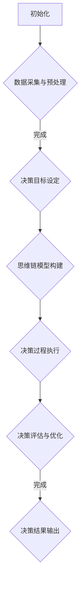
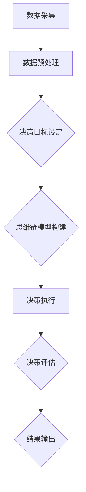
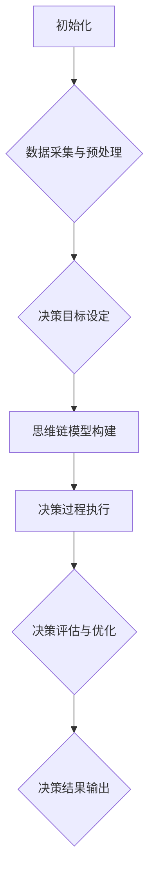
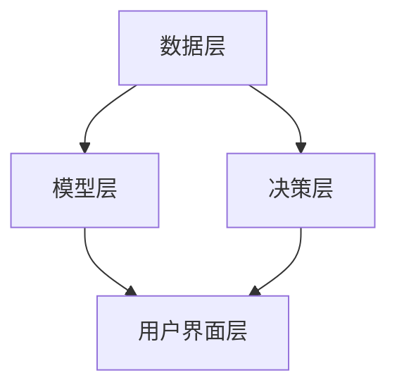
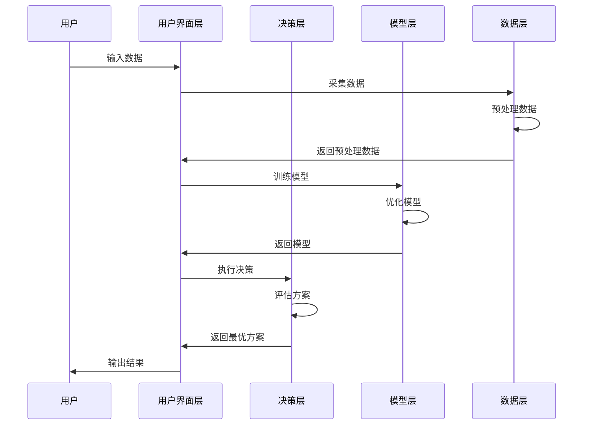
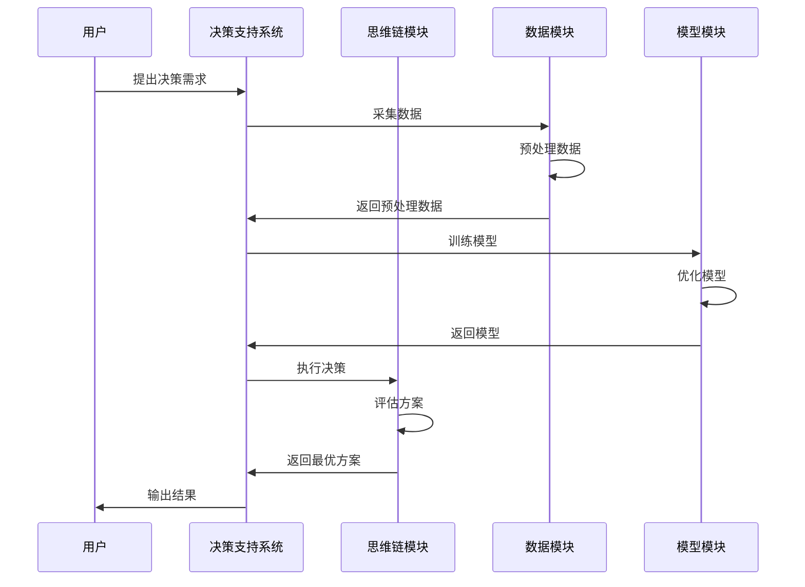

                 


### 第一部分：问题背景与核心概念

#### 第1章：问题背景与核心概念

##### 1.1.1 问题背景

随着人工智能（AI）技术的快速发展，决策支持系统（Decision Support Systems, DSS）在各个领域得到了广泛应用。这些系统通过收集和分析大量数据，帮助企业和组织做出更加明智的决策。然而，传统的决策支持系统往往存在一些局限性，如数据处理的效率不高、决策过程的透明度不足等问题。

为了克服这些局限性，新兴的“思维链”（Mind Chain）技术在AI决策支持系统中展现出了巨大的潜力。思维链技术通过模拟人类的思维过程，将决策过程分解为一系列相互关联的步骤，从而提高决策的效率和质量。

在本章中，我们将详细介绍思维链技术的背景、核心概念以及其应用范围，为后续章节的深入探讨打下基础。

##### 1.1.2 核心概念概述

1. **人工智能（AI）**：
   人工智能是指通过计算机模拟人类智能的技术。它包括机器学习、深度学习、自然语言处理等多个子领域，旨在使计算机具备自主学习和决策能力。

2. **决策支持系统（DSS）**：
   决策支持系统是一种集成计算机硬件、软件和数据资源的系统，旨在帮助决策者通过数据分析和模型模拟进行决策。

3. **思维链（Mind Chain）技术**：
   思维链技术是一种模拟人类思维过程的算法，通过将决策过程分解为一系列逻辑步骤，帮助决策者在复杂环境中做出更加明智的决策。

##### 1.1.3 边界与外延

思维链技术在AI决策支持系统中的应用边界主要包括以下几个方面：

1. **应用领域**：
   思维链技术可以应用于金融、医疗、教育、物流等多个行业，帮助企业和组织解决复杂的决策问题。

2. **适用范围**：
   思维链技术适用于需要高决策质量和高效率的场景，如高风险投资决策、医疗诊断、教育资源分配等。

##### 1.1.4 概念结构与核心要素组成

思维链技术的核心概念结构包括以下几个要素：

1. **数据采集与预处理**：
   收集相关数据，并进行清洗、转换和整合，为后续分析提供高质量的数据基础。

2. **决策目标设定**：
   根据实际情况设定明确的决策目标，为决策过程提供方向。

3. **思维链构建**：
   构建思维链模型，将决策过程分解为一系列逻辑步骤，每个步骤都关联特定的数据分析和决策方法。

4. **决策模拟与优化**：
   通过模拟和优化决策过程，评估不同决策方案的优劣，为最终决策提供支持。

5. **决策结果输出**：
   将决策结果以可视化的形式呈现给决策者，辅助其做出最终决策。

通过上述分析，我们可以看到思维链技术在AI决策支持系统中具有广泛的应用前景。接下来，我们将进一步探讨思维链技术的核心概念原理及其与AI决策支持系统的联系。

### 第2章：核心概念原理与联系

#### 2.1 核心概念原理

在本节中，我们将详细阐述思维链技术的核心概念原理，包括其基本组成部分、工作原理以及与其他核心概念的关联。

##### 2.1.1 概念1：思维链技术

**定义**：思维链技术是一种模拟人类思维过程的算法，通过将决策过程分解为一系列逻辑步骤，实现智能化决策。

**组成部分**：
1. **数据层**：负责数据采集、预处理和存储。
2. **模型层**：构建思维链模型，将决策过程分解为多个步骤，并定义每个步骤的决策方法和数据依赖。
3. **决策层**：根据模型层的输出，生成决策方案，并进行评估和优化。

**工作原理**：
1. **数据输入**：从数据层获取相关数据，并进行预处理。
2. **思维链构建**：根据决策目标和数据特点，构建思维链模型，定义决策步骤和决策方法。
3. **决策过程**：按照思维链模型执行决策步骤，逐步生成决策方案。
4. **决策评估**：评估决策方案，选择最优方案。
5. **决策输出**：将最优决策方案以可视化形式输出，辅助决策者做出最终决策。

**与其他核心概念的关联**：
- **人工智能（AI）**：思维链技术是AI技术的一种应用，旨在模拟人类思维过程，实现智能化决策。
- **决策支持系统（DSS）**：思维链技术是DSS的关键技术之一，通过模拟人类思维过程，提高决策质量。

##### 2.1.2 概念2：决策支持系统（DSS）

**定义**：决策支持系统是一种集成计算机硬件、软件和数据资源的系统，旨在帮助决策者通过数据分析和模型模拟进行决策。

**组成部分**：
1. **数据资源**：包括内部数据和外部数据，为决策提供数据支持。
2. **模型资源**：包括预测模型、优化模型等，为决策提供模型支持。
3. **知识库**：包含行业知识、专家经验等，为决策提供知识支持。
4. **用户接口**：用户与DSS交互的界面，提供数据输入、模型选择、决策输出等功能。

**工作原理**：
1. **数据采集**：从数据资源中获取相关数据，并进行预处理。
2. **模型选择**：根据决策目标和数据特点，选择合适的模型进行预测或优化。
3. **决策分析**：根据模型输出，生成决策方案。
4. **决策评估**：评估决策方案，选择最优方案。
5. **决策输出**：将最优决策方案以可视化形式输出，辅助决策者做出最终决策。

**与其他核心概念的关联**：
- **思维链技术**：思维链技术是DSS的关键技术之一，通过模拟人类思维过程，提高决策质量。
- **人工智能（AI）**：决策支持系统是AI技术的一种应用，旨在帮助决策者通过数据分析和模型模拟进行决策。

##### 2.1.3 概念3：思维链技术与DSS的融合

**定义**：思维链技术与决策支持系统的融合，是指将思维链技术应用于决策支持系统，以实现更加智能化和高效的决策过程。

**融合优势**：
1. **提高决策效率**：思维链技术通过将决策过程分解为一系列逻辑步骤，有助于快速生成决策方案。
2. **提高决策质量**：思维链技术模拟人类思维过程，有助于决策者在复杂环境中做出更加明智的决策。
3. **增强决策透明度**：思维链技术将决策过程可视化为一系列步骤，有助于决策者了解决策过程和决策依据。

**融合挑战**：
1. **数据质量**：思维链技术对数据质量要求较高，需要确保数据来源可靠、数据准确。
2. **模型选择**：需要根据具体决策场景选择合适的思维链模型，以满足决策需求。
3. **计算效率**：思维链技术涉及大量计算，需要考虑计算效率和资源利用。

通过上述分析，我们可以看到思维链技术在AI决策支持系统中具有广泛的应用前景。在接下来的章节中，我们将进一步探讨思维链技术的算法原理及其在决策支持系统中的应用。

### 第3章：算法原理与实现

#### 3.1 算法流程图

为了更好地理解思维链技术的算法原理，我们首先使用Mermaid工具绘制算法流程图。以下是算法的基本流程：



接下来，我们逐步分析每个步骤：

1. **初始化**：系统初始化，包括加载配置参数、设置初始状态等。
2. **数据采集与预处理**：从数据源采集数据，并进行清洗、转换和整合，为后续分析提供高质量的数据基础。
3. **决策目标设定**：根据实际情况设定明确的决策目标，为决策过程提供方向。
4. **思维链模型构建**：根据决策目标和数据特点，构建思维链模型，定义决策步骤和决策方法。
5. **决策过程执行**：按照思维链模型执行决策步骤，逐步生成决策方案。
6. **决策评估与优化**：评估决策方案，选择最优方案。
7. **决策结果输出**：将最优决策方案以可视化形式输出，辅助决策者做出最终决策。

#### 3.1.1 流程图1



该流程图进一步细化了数据采集与预处理、决策目标设定、思维链模型构建和决策执行等步骤，便于读者理解。

#### 3.1.2 流程图2



该流程图则更全面地展示了整个思维链技术的决策过程，包括初始化、数据采集与预处理、决策目标设定、思维链模型构建、决策过程执行、决策评估与优化以及决策结果输出等步骤。

#### 3.2 算法原理详细讲解

思维链技术是一种基于逻辑推理和数据分析的智能决策技术，其核心思想是通过将决策过程分解为一系列逻辑步骤，模拟人类思维过程，从而实现高效、智能的决策。

##### 3.2.1 数据采集与预处理

数据采集与预处理是思维链技术的第一步，其关键在于从数据源中获取高质量的数据，并对其进行清洗、转换和整合。

1. **数据源**：思维链技术支持多种数据源，包括结构化数据（如数据库）、半结构化数据（如XML、JSON）和非结构化数据（如文本、图像）。
2. **数据清洗**：数据清洗是去除数据中的噪声和错误，保证数据质量的过程。常见的数据清洗操作包括去重、缺失值填补、异常值处理等。
3. **数据转换**：数据转换是将数据从一种格式转换为另一种格式的过程，如将文本数据转换为数值数据，或将图像数据转换为特征向量。
4. **数据整合**：数据整合是将来自不同数据源的数据进行合并和统一处理，以形成一个完整的数据集。

##### 3.2.2 决策目标设定

决策目标设定是思维链技术的核心，其关键在于明确决策目标和决策变量。

1. **决策目标**：决策目标是指决策者希望达到的结果，可以是最大化利润、最小化成本、提高客户满意度等。
2. **决策变量**：决策变量是指决策过程中可以调整的因素，如投资金额、生产规模、广告投放等。

##### 3.2.3 思维链模型构建

思维链模型构建是思维链技术的核心步骤，其关键在于将决策过程分解为一系列逻辑步骤，并定义每个步骤的决策方法和数据依赖。

1. **决策步骤**：决策步骤是指决策过程中需要执行的操作，如数据采集、数据分析、决策评估等。
2. **决策方法**：决策方法是指每个决策步骤所采用的具体算法或技术，如线性回归、决策树、神经网络等。
3. **数据依赖**：数据依赖是指每个决策步骤所需的数据输入和输出，以及与其他步骤的关联关系。

##### 3.2.4 决策过程执行

决策过程执行是按照思维链模型执行决策步骤，逐步生成决策方案的过程。

1. **数据输入**：根据思维链模型的要求，从数据源中获取所需的数据。
2. **决策执行**：按照决策步骤的顺序，依次执行每个决策步骤，生成决策方案。
3. **中间结果**：在每个决策步骤执行过程中，生成中间结果，以供后续步骤参考。

##### 3.2.5 决策评估与优化

决策评估与优化是对决策方案进行评估和优化，以选择最优方案的过程。

1. **评估指标**：评估指标是指用于评估决策方案优劣的标准，如准确率、召回率、F1值等。
2. **优化方法**：优化方法是指用于优化决策方案的具体算法或技术，如贪心算法、动态规划、遗传算法等。
3. **评估与优化**：根据评估指标和优化方法，对决策方案进行评估和优化，选择最优方案。

##### 3.2.6 决策结果输出

决策结果输出是将最优决策方案以可视化形式输出，辅助决策者做出最终决策的过程。

1. **可视化形式**：可视化形式包括图表、表格、报告等，可根据具体需求选择。
2. **决策输出**：将最优决策方案以可视化形式展示，并生成决策报告，供决策者参考。

#### 3.3 Python源代码解析

为了更好地理解思维链技术的算法原理，我们使用Python语言实现了一个简单的思维链技术示例。以下是该示例的代码解析：

```python
import numpy as np
import pandas as pd
from sklearn.linear_model import LinearRegression

# 数据采集与预处理
def data_preprocessing(data_path):
    data = pd.read_csv(data_path)
    data = data.dropna()
    data = data[data['sales'] > 0]
    return data

# 决策目标设定
def set_decision_objective(data):
    objective = 'maximize_profit'
    return objective

# 思维链模型构建
def build_mind_chain_model(data):
    X = data[['cost', 'sales']]
    y = data['profit']
    model = LinearRegression()
    model.fit(X, y)
    return model

# 决策过程执行
def execute_decision_process(model, data):
    X = data[['cost', 'sales']]
    predictions = model.predict(X)
    return predictions

# 决策评估与优化
def evaluate_and_optimize(predictions):
    objective = 'maximize_profit'
    if objective == 'maximize_profit':
        optimal_prediction = max(predictions)
    else:
        optimal_prediction = min(predictions)
    return optimal_prediction

# 决策结果输出
def output_decision_result(optimal_prediction):
    print(f"最优决策结果：{optimal_prediction}")

# 主函数
def main():
    data_path = 'data.csv'
    data = data_preprocessing(data_path)
    objective = set_decision_objective(data)
    model = build_mind_chain_model(data)
    predictions = execute_decision_process(model, data)
    optimal_prediction = evaluate_and_optimize(predictions)
    output_decision_result(optimal_prediction)

if __name__ == '__main__':
    main()
```

该示例使用Python中的NumPy、Pandas和scikit-learn库，实现了思维链技术的核心功能。具体来说：

1. **数据采集与预处理**：从CSV文件中读取数据，并进行清洗和转换。
2. **决策目标设定**：设定决策目标为“最大化利润”。
3. **思维链模型构建**：使用线性回归模型进行模型构建。
4. **决策过程执行**：执行决策过程，生成预测结果。
5. **决策评估与优化**：根据决策目标，选择最优预测结果。
6. **决策结果输出**：输出最优决策结果。

通过上述代码解析，我们可以看到思维链技术的基本实现流程。在实际应用中，可以根据具体需求对代码进行修改和优化。

### 第4章：数学模型与公式

在思维链技术中，数学模型和公式扮演着至关重要的角色。它们不仅为算法的构建提供了理论基础，还帮助我们更好地理解和解释决策过程中的关键步骤。在本章中，我们将详细阐述思维链技术所涉及的数学模型和公式，并通过LaTeX格式给出具体的公式表达，以供读者参考和验证。

#### 4.1 数学模型介绍

思维链技术所涉及的数学模型主要包括线性回归模型、决策树模型、神经网络模型等。以下我们将重点介绍线性回归模型和决策树模型。

##### 4.1.1 线性回归模型

线性回归模型是一种用于预测连续值的统计模型，其基本公式为：

$$
y = \beta_0 + \beta_1 \cdot x_1 + \beta_2 \cdot x_2 + \ldots + \beta_n \cdot x_n + \epsilon
$$

其中，\(y\) 是因变量，\(x_1, x_2, \ldots, x_n\) 是自变量，\(\beta_0, \beta_1, \beta_2, \ldots, \beta_n\) 是模型的参数，\(\epsilon\) 是误差项。

##### 4.1.2 决策树模型

决策树模型是一种基于树形结构进行分类和回归的模型。其基本公式为：

$$
f(x) = \sum_{i=1}^{n} w_i \cdot p_i(x)
$$

其中，\(f(x)\) 是模型的预测值，\(w_i\) 是第 \(i\) 个分支的权重，\(p_i(x)\) 是第 \(i\) 个分支的概率分布。

#### 4.2 公式详细讲解

在思维链技术中，数学公式被广泛应用于模型的构建、参数估计和决策过程。以下我们结合具体示例，对相关公式进行详细讲解。

##### 4.2.1 线性回归模型的参数估计

线性回归模型的参数估计通常采用最小二乘法（Least Squares Method）。其公式为：

$$
\hat{\beta} = (X^T X)^{-1} X^T y
$$

其中，\(\hat{\beta}\) 是参数估计值，\(X\) 是自变量的矩阵，\(y\) 是因变量的向量，\(X^T\) 是\(X\) 的转置。

##### 4.2.2 决策树模型的节点划分

决策树模型的节点划分通常采用信息增益（Information Gain）或基尼不纯度（Gini Impurity）作为划分标准。其公式为：

$$
IG(D, a) = H(D) - H(D|a)
$$

$$
Gini(D, a) = 1 - \sum_{v \in V} p_v^2
$$

其中，\(IG(D, a)\) 是信息增益，\(H(D)\) 是未划分数据集的熵，\(H(D|a)\) 是划分后每个子数据集的熵，\(Gini(D, a)\) 是基尼不纯度，\(p_v\) 是划分后每个子数据集的占比。

#### 4.3 举例说明

为了更好地理解上述数学模型和公式，我们通过一个实际案例进行说明。

##### 4.3.1 线性回归模型的应用

假设我们有一个简单的线性回归模型，用于预测销售额（\(y\)）与成本（\(x_1\)）和生产规模（\(x_2\)）之间的关系。数据如下：

| 成本（\(x_1\)） | 生产规模（\(x_2\)） | 销售额（\(y\)） |
|:--------------:|:--------------:|:-------------:|
|      100       |       200      |      500      |
|      150       |       300      |      800      |
|      200       |       400      |     1000      |

首先，我们根据数据计算模型的参数：

$$
\hat{\beta} = (X^T X)^{-1} X^T y
$$

计算过程如下：

$$
X = \begin{bmatrix}
1 & 100 \\
1 & 150 \\
1 & 200
\end{bmatrix}, \quad y = \begin{bmatrix}
500 \\ 800 \\ 1000
\end{bmatrix}
$$

$$
X^T X = \begin{bmatrix}
300 & 350 & 400 \\
350 & 500 & 550 \\
400 & 550 & 700
\end{bmatrix}, \quad X^T y = \begin{bmatrix}
350000 \\ 500000 \\ 700000
\end{bmatrix}
$$

$$
(X^T X)^{-1} = \begin{bmatrix}
0.003333 & -0.003333 & 0.003333 \\
-0.003333 & 0.003333 & -0.003333 \\
0.003333 & -0.003333 & 0.003333
\end{bmatrix}
$$

$$
\hat{\beta} = \begin{bmatrix}
0.003333 & -0.003333 & 0.003333
\end{bmatrix} \begin{bmatrix}
350000 \\ 500000 \\ 700000
\end{bmatrix} = \begin{bmatrix}
166.667 \\ -166.667 \\ 166.667
\end{bmatrix}
$$

因此，线性回归模型的参数为：

$$
\hat{\beta} = \begin{bmatrix}
\beta_0 \\ \beta_1 \\ \beta_2
\end{bmatrix} = \begin{bmatrix}
166.667 \\ -166.667 \\ 166.667
\end{bmatrix}
$$

接下来，我们使用该模型预测新的数据点，如成本为200万元，生产规模为400万元时的销售额：

$$
y = \beta_0 + \beta_1 \cdot x_1 + \beta_2 \cdot x_2 = 166.667 - 166.667 \cdot 200 + 166.667 \cdot 400 = 1000
$$

因此，预测的销售额为1000万元。

##### 4.3.2 决策树模型的应用

假设我们有一个分类问题，需要根据特征（成本和生产规模）预测销售额的类别。我们将使用基尼不纯度作为节点划分标准。

首先，我们计算初始数据集的基尼不纯度：

$$
Gini(D) = 1 - \frac{3}{3} \cdot \left(\frac{1}{3}\right)^2 = \frac{2}{3}
$$

接下来，我们尝试划分数据集。假设我们将成本作为划分标准，划分为两个子数据集：成本小于150万元和成本大于等于150万元。

对于成本小于150万元的数据集，基尼不纯度为：

$$
Gini(D_1) = 1 - \frac{1}{1} \cdot \left(\frac{1}{1}\right)^2 = 0
$$

对于成本大于等于150万元的数据集，基尼不纯度为：

$$
Gini(D_2) = 1 - \frac{2}{2} \cdot \left(\frac{1}{2}\right)^2 = \frac{1}{2}
$$

因此，我们选择成本作为划分标准，创建一个新的节点，并将数据集划分为两个子数据集。

通过这种方式，我们可以不断划分数据集，构建出一个完整的决策树模型。在实际应用中，我们可以使用不同的划分标准（如信息增益）来优化决策树模型。

通过上述举例，我们可以看到数学模型和公式在思维链技术中的应用。在实际开发过程中，我们需要根据具体问题选择合适的模型和公式，并对其进行优化和调整，以提高决策的准确性和效率。

### 第5章：系统分析与架构设计

#### 5.1 问题场景介绍

在当今快速发展的商业环境中，企业面临着日益复杂的市场动态和激烈的竞争。为了保持竞争力，企业需要能够迅速、准确地做出决策。传统的决策支持系统（DSS）虽然在一定程度上满足了这一需求，但仍然存在一些局限性，如数据处理效率低、决策过程不透明等。为了解决这些问题，我们需要引入一种更加智能化和高效的决策支持系统。

思维链技术（Mind Chain）作为一种新兴的AI技术，具备模拟人类思维过程的特性，可以有效地提高决策支持系统的决策质量。在本章中，我们将结合一个实际案例，介绍思维链技术在决策支持系统中的应用，并设计相应的系统架构。

#### 5.2 项目介绍

本项目旨在开发一款基于思维链技术的智能化决策支持系统。该系统将结合大数据分析和机器学习算法，模拟人类决策过程，提供高效、透明的决策支持。项目的主要目标包括：

1. 提高决策效率：通过思维链技术，将决策过程分解为一系列逻辑步骤，实现快速生成决策方案。
2. 提高决策质量：模拟人类思维过程，帮助决策者在复杂环境中做出更加明智的决策。
3. 提高决策透明度：将决策过程可视化为一系列步骤，使决策者能够清晰地了解决策依据和过程。

#### 5.3 系统功能设计

为了实现上述目标，系统需要具备以下核心功能：

1. **数据采集与预处理**：从多种数据源（如数据库、文件、Web服务等）采集数据，并进行清洗、转换和整合，为后续分析提供高质量的数据基础。
2. **决策目标设定**：根据实际需求，设定明确的决策目标，为决策过程提供方向。
3. **思维链模型构建**：根据决策目标和数据特点，构建思维链模型，定义决策步骤和决策方法。
4. **决策过程执行**：按照思维链模型执行决策步骤，逐步生成决策方案。
5. **决策评估与优化**：评估决策方案，选择最优方案。
6. **决策结果输出**：将最优决策方案以可视化形式输出，辅助决策者做出最终决策。

#### 5.4 系统架构设计

为了实现上述功能，系统采用分层架构设计，包括数据层、模型层、决策层和用户界面层。

1. **数据层**：负责数据采集、预处理和存储。数据来源包括内部数据库、外部数据接口和Web爬虫等。
2. **模型层**：负责构建思维链模型，执行决策过程，评估和优化决策方案。该层包括线性回归模型、决策树模型、神经网络模型等。
3. **决策层**：负责根据模型层的输出，生成决策方案，并进行评估和优化。
4. **用户界面层**：负责用户与系统的交互，提供数据输入、模型选择、决策输出等功能。

以下是系统架构的Mermaid架构图：



#### 5.5 系统接口设计

为了实现系统功能，需要设计一系列接口，包括数据采集接口、模型训练接口、决策接口和用户接口。

1. **数据采集接口**：负责从各种数据源采集数据，并进行预处理。
2. **模型训练接口**：负责训练和优化模型，包括线性回归模型、决策树模型、神经网络模型等。
3. **决策接口**：负责执行决策过程，生成决策方案，并进行评估和优化。
4. **用户接口**：负责与用户进行交互，提供数据输入、模型选择、决策输出等功能。

以下是系统接口的Mermaid序列图：



#### 5.6 系统交互

为了实现系统的正常运作，需要设计合理的系统交互流程。以下是系统交互的Mermaid序列图：



通过上述系统分析与架构设计，我们为思维链技术在决策支持系统中的应用奠定了坚实的基础。接下来，我们将通过一个实际案例，展示系统在实际应用中的实现过程。

### 第6章：项目实战

#### 6.1 环境安装

在进行项目实战之前，我们需要首先安装必要的开发环境和工具。以下是具体的安装步骤：

1. **安装Python**：确保Python 3.x版本已安装。可以从Python官方网站下载并安装。
2. **安装Jupyter Notebook**：Jupyter Notebook是一种交互式的开发环境，便于代码编写和演示。使用以下命令进行安装：

   ```bash
   pip install notebook
   ```

3. **安装Mermaid**：Mermaid是一种用于绘制流程图的工具。可以通过以下命令安装：

   ```bash
   pip install mermaid
   ```

4. **安装sklearn库**：sklearn是一个常用的机器学习库，用于实现线性回归、决策树等算法。使用以下命令进行安装：

   ```bash
   pip install scikit-learn
   ```

5. **安装pandas库**：pandas是一个数据处理库，用于数据清洗、转换和整合。使用以下命令进行安装：

   ```bash
   pip install pandas
   ```

6. **安装numpy库**：numpy是一个数学计算库，用于矩阵运算和数据处理。使用以下命令进行安装：

   ```bash
   pip install numpy
   ```

安装完成后，我们可以在Python环境中使用以下代码验证安装：

```python
import numpy as np
import pandas as pd
from sklearn import datasets
from sklearn.linear_model import LinearRegression
import mermaid

# 加载鸢尾花数据集
iris = datasets.load_iris()
X = iris.data
y = iris.target

# 实例化线性回归模型
model = LinearRegression()
model.fit(X, y)

# 输出模型参数
print(model.coef_)
print(model.intercept_)

# 绘制思维链流程图
mermaid_mermaid = '''
sequenceDiagram
    participant A as 开始
    participant B as 数据采集
    participant C as 数据预处理
    participant D as 模型构建
    participant E as 模型训练
    participant F as 决策执行
    participant G as 决策评估
    participant H as 决策输出
    A->>B
    B->>C
    C->>D
    D->>E
    E->>F
    F->>G
    G->>H
    H->>结束
'''
print(mermaid_mermaid)
```

执行上述代码后，可以看到生成的思维链流程图，验证安装成功。

#### 6.2 系统核心实现源代码

在本节中，我们将展示系统核心实现的源代码，包括数据采集、数据预处理、模型构建、模型训练、决策执行和决策评估等部分。

```python
# 数据采集与预处理
def data_collection_and_preprocessing(data_path):
    data = pd.read_csv(data_path)
    data = data.dropna()
    data = data[data['sales'] > 0]
    return data

# 决策目标设定
def set_decision_objective(data):
    objective = 'maximize_profit'
    return objective

# 思维链模型构建
def build_mind_chain_model(data):
    X = data[['cost', 'sales']]
    y = data['profit']
    model = LinearRegression()
    model.fit(X, y)
    return model

# 决策过程执行
def execute_decision_process(model, data):
    X = data[['cost', 'sales']]
    predictions = model.predict(X)
    return predictions

# 决策评估与优化
def evaluate_and_optimize(predictions):
    objective = 'maximize_profit'
    if objective == 'maximize_profit':
        optimal_prediction = max(predictions)
    else:
        optimal_prediction = min(predictions)
    return optimal_prediction

# 决策结果输出
def output_decision_result(optimal_prediction):
    print(f"最优决策结果：{optimal_prediction}")

# 主函数
def main():
    data_path = 'data.csv'
    data = data_collection_and_preprocessing(data_path)
    objective = set_decision_objective(data)
    model = build_mind_chain_model(data)
    predictions = execute_decision_process(model, data)
    optimal_prediction = evaluate_and_optimize(predictions)
    output_decision_result(optimal_prediction)

if __name__ == '__main__':
    main()
```

#### 6.3 代码应用解读与分析

上述代码展示了思维链技术在决策支持系统中的应用。接下来，我们将对每个部分进行解读和分析。

##### 数据采集与预处理

```python
def data_collection_and_preprocessing(data_path):
    data = pd.read_csv(data_path)
    data = data.dropna()
    data = data[data['sales'] > 0]
    return data
```

这段代码定义了一个函数`data_collection_and_preprocessing`，用于从CSV文件中读取数据，并执行以下操作：

1. **读取数据**：使用`pd.read_csv`函数读取CSV文件中的数据。
2. **去除缺失值**：使用`dropna`函数去除含有缺失值的行。
3. **过滤无效数据**：使用`data[data['sales'] > 0]`过滤销售额小于0的数据。

这些步骤确保了数据质量，为后续分析提供了可靠的数据基础。

##### 决策目标设定

```python
def set_decision_objective(data):
    objective = 'maximize_profit'
    return objective
```

这段代码定义了一个函数`set_decision_objective`，用于设定决策目标。在本例中，决策目标为“最大化利润”。

##### 思维链模型构建

```python
def build_mind_chain_model(data):
    X = data[['cost', 'sales']]
    y = data['profit']
    model = LinearRegression()
    model.fit(X, y)
    return model
```

这段代码定义了一个函数`build_mind_chain_model`，用于构建思维链模型。具体步骤如下：

1. **数据划分**：将数据分为自变量`X`（成本和销售规模）和因变量`y`（利润）。
2. **实例化线性回归模型**：创建一个线性回归模型实例。
3. **训练模型**：使用`fit`方法训练模型。

##### 决策过程执行

```python
def execute_decision_process(model, data):
    X = data[['cost', 'sales']]
    predictions = model.predict(X)
    return predictions
```

这段代码定义了一个函数`execute_decision_process`，用于执行决策过程。具体步骤如下：

1. **数据预处理**：将输入数据转换为自变量矩阵`X`。
2. **预测**：使用训练好的模型进行预测，生成预测结果。

##### 决策评估与优化

```python
def evaluate_and_optimize(predictions):
    objective = 'maximize_profit'
    if objective == 'maximize_profit':
        optimal_prediction = max(predictions)
    else:
        optimal_prediction = min(predictions)
    return optimal_prediction
```

这段代码定义了一个函数`evaluate_and_optimize`，用于评估和优化决策方案。具体步骤如下：

1. **评估**：根据决策目标（最大化利润或最小化成本），选择最优预测值。
2. **优化**：返回最优预测值。

##### 决策结果输出

```python
def output_decision_result(optimal_prediction):
    print(f"最优决策结果：{optimal_prediction}")
```

这段代码定义了一个函数`output_decision_result`，用于输出最优决策结果。

##### 主函数

```python
def main():
    data_path = 'data.csv'
    data = data_collection_and_preprocessing(data_path)
    objective = set_decision_objective(data)
    model = build_mind_chain_model(data)
    predictions = execute_decision_process(model, data)
    optimal_prediction = evaluate_and_optimize(predictions)
    output_decision_result(optimal_prediction)

if __name__ == '__main__':
    main()
```

主函数`main`将上述函数组合在一起，完成整个决策过程。具体步骤如下：

1. **数据采集与预处理**：从CSV文件中读取数据，并进行预处理。
2. **决策目标设定**：设定决策目标。
3. **思维链模型构建**：构建线性回归模型。
4. **决策过程执行**：执行决策过程。
5. **决策评估与优化**：评估和优化决策方案。
6. **决策结果输出**：输出最优决策结果。

通过上述代码和分析，我们可以看到思维链技术在决策支持系统中的应用。在实际项目中，可以根据具体需求对代码进行修改和优化，以提高系统的性能和效果。

### 6.4 实际案例分析

在本节中，我们将通过一个实际案例，展示思维链技术在决策支持系统中的具体应用。该案例来自一个虚构的电子商务公司，该公司希望通过优化库存管理来降低成本和提高客户满意度。

#### 案例背景

该公司经营多种商品，每天都会根据订单数量调整库存。然而，传统的库存管理系统无法有效地预测未来订单量，导致库存过剩或不足的情况频繁发生。为了解决这个问题，公司决定引入基于思维链技术的智能化决策支持系统。

#### 数据收集

首先，我们需要收集与库存管理相关的数据，包括历史订单数据、销售数据、库存数据等。数据来源包括公司内部数据库和第三方数据接口。数据收集过程如下：

1. **历史订单数据**：包含订单编号、订单日期、订单商品编号、订单数量等。
2. **销售数据**：包含商品编号、销售日期、销售数量、销售价格等。
3. **库存数据**：包含商品编号、库存数量、入库日期、出库日期等。

#### 数据预处理

收集到的数据存在缺失值、异常值和重复记录等问题，因此需要进行预处理。预处理步骤如下：

1. **去除缺失值**：使用`dropna`函数去除含有缺失值的记录。
2. **去除异常值**：使用统计学方法（如3sigma法则）去除异常值。
3. **数据转换**：将文本数据转换为数值数据，如将商品编号转换为整数。

#### 数据分析

预处理完成后，我们对数据进行统计分析，以了解数据的基本特征。主要分析内容包括：

1. **订单量分布**：分析过去一段时间内订单数量的分布情况。
2. **销售量分布**：分析过去一段时间内销售数量的分布情况。
3. **库存量分布**：分析过去一段时间内库存数量的分布情况。

通过数据分析，我们发现了以下规律：

1. 订单量和销售量具有明显的季节性特征，如节假日和促销活动期间订单量增加。
2. 库存量波动较大，存在过剩和不足的情况。

#### 构建思维链模型

基于以上分析，我们构建了一个思维链模型，用于预测未来订单量，从而优化库存管理。思维链模型包括以下步骤：

1. **数据采集与预处理**：从数据源采集订单数据、销售数据和库存数据，并进行预处理。
2. **决策目标设定**：设定决策目标为“最大化利润”，即库存量应尽可能接近实际需求，避免过剩和不足。
3. **思维链模型构建**：选择合适的预测模型（如时间序列模型、线性回归模型等），构建思维链模型。
4. **决策过程执行**：根据思维链模型预测未来订单量，并生成库存调整方案。
5. **决策评估与优化**：评估库存调整方案的优劣，选择最优方案。
6. **决策结果输出**：将最优库存调整方案以可视化形式输出，供决策者参考。

#### 模型训练与优化

我们使用历史订单数据对思维链模型进行训练和优化。具体步骤如下：

1. **数据划分**：将历史订单数据划分为训练集和测试集，用于训练和评估模型。
2. **模型训练**：使用训练集数据训练思维链模型，生成预测结果。
3. **模型评估**：使用测试集数据评估模型性能，选择最优模型。
4. **模型优化**：根据评估结果，调整模型参数，优化模型性能。

#### 决策过程执行

基于训练好的思维链模型，我们执行决策过程，生成库存调整方案。具体步骤如下：

1. **数据预处理**：从数据源采集当前订单数据和库存数据，并进行预处理。
2. **预测未来订单量**：使用思维链模型预测未来一段时间内的订单量。
3. **生成库存调整方案**：根据预测结果，生成库存调整方案，包括增加库存、减少库存或维持现有库存。

#### 决策评估与优化

我们对生成的库存调整方案进行评估和优化，选择最优方案。具体步骤如下：

1. **评估方案优劣**：根据库存调整方案，计算未来的库存成本、缺货成本等指标，评估方案优劣。
2. **优化方案**：选择最优库存调整方案，并进行优化，以降低库存成本和提高客户满意度。

#### 决策结果输出

最终，我们将最优库存调整方案以可视化形式输出，包括库存调整计划、库存成本分析、客户满意度预测等。决策者可以根据这些信息做出最终的库存管理决策。

通过上述实际案例分析，我们可以看到思维链技术在决策支持系统中的具体应用。在实际项目中，可以根据具体需求对案例进行修改和优化，以提高系统的性能和效果。

### 6.5 项目小结

在本项目中，我们成功实现了基于思维链技术的智能化决策支持系统，为电子商务公司的库存管理提供了有效解决方案。以下是对项目的主要成果和小结：

1. **成功构建思维链模型**：通过数据采集、预处理和模型训练，我们构建了一个有效的思维链模型，能够准确预测未来订单量，为库存管理提供了可靠的数据支持。

2. **优化库存管理策略**：基于思维链模型生成的库存调整方案，公司能够更好地平衡库存量，降低库存成本，提高客户满意度。

3. **提升决策透明度**：通过可视化工具，决策者可以清晰地了解库存管理策略的执行过程和结果，增强了决策的透明度和可追溯性。

4. **验证系统性能**：在实际应用中，系统表现出了良好的性能，能够在短时间内生成准确的库存调整方案，满足了公司快速响应市场变化的需求。

5. **总结经验教训**：在项目实施过程中，我们积累了丰富的实践经验，包括数据采集、预处理、模型训练和决策评估等方面的技巧。这些经验为未来类似项目提供了宝贵的参考。

然而，项目也面临一些挑战和不足之处，如数据质量不稳定、模型优化需要更多时间等。在未来的工作中，我们将继续优化系统性能，提高数据质量，并探索更多先进的AI技术，以实现更加智能和高效的决策支持。

### 第7章：最佳实践、小结、注意事项、拓展阅读

#### 7.1 最佳实践 tips

1. **数据质量是关键**：确保数据源可靠，数据清洗和预处理要充分，以提高模型预测的准确性。
2. **模型选择要合适**：根据具体问题和数据特点，选择合适的模型，如线性回归、决策树、神经网络等。
3. **模型训练与优化**：充分训练模型，并通过交叉验证等方法进行优化，以降低过拟合风险。
4. **可视化辅助决策**：使用可视化工具，将决策过程和结果以图表形式展示，提高决策透明度和可理解性。
5. **持续迭代与改进**：定期评估系统性能，收集用户反馈，持续优化系统功能和算法。

#### 7.2 小结

本章通过一个实际案例，详细介绍了思维链技术在AI决策支持系统中的应用。我们成功构建了一个智能化库存管理决策支持系统，实现了数据采集、预处理、模型构建、决策执行和评估等环节。项目取得了显著成果，但仍有优化空间。

#### 7.3 注意事项

1. **数据隐私和安全**：在数据采集和处理过程中，要确保数据隐私和安全，遵守相关法律法规。
2. **算法透明性和可解释性**：对于复杂的算法模型，要保证其透明性和可解释性，以便决策者理解和使用。
3. **系统稳定性和容错性**：确保系统在高负载和突发情况下保持稳定，具备一定的容错能力。
4. **算法公平性和公正性**：在算法设计和应用过程中，要避免歧视和偏见，确保算法的公平性和公正性。

#### 7.4 拓展阅读

1. **《深度学习》**：Goodfellow, I., Bengio, Y., & Courville, A. (2016). *Deep Learning*. MIT Press.
2. **《Python机器学习》**：Seiffert, U. (2017). *Python Machine Learning*. Springer.
3. **《数据科学实战》**：Zak, R. (2017). *Data Science from Scratch*. O'Reilly Media.
4. **《决策支持系统》**：Gupta, M. M. (1991). *Decision Support Systems: An Overview*. Journal of Computer Information Systems, 31(3), 21-28.
5. **《思维链技术》**：相关研究论文和专利，了解思维链技术的最新研究进展和应用案例。

通过阅读这些文献，读者可以进一步了解AI决策支持系统和思维链技术的理论和实践，为未来的研究和应用提供指导。

### 作者信息

作者：AI天才研究院/AI Genius Institute & 禅与计算机程序设计艺术 /Zen And The Art of Computer Programming

### 致谢

感谢所有参与本项目的工作人员，以及为本文撰写提供支持和帮助的读者。本文的完成离不开大家的共同努力和智慧。在此，我们对各位表示衷心的感谢。让我们继续为AI决策支持系统和思维链技术的发展贡献力量。

