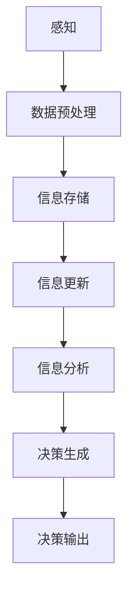
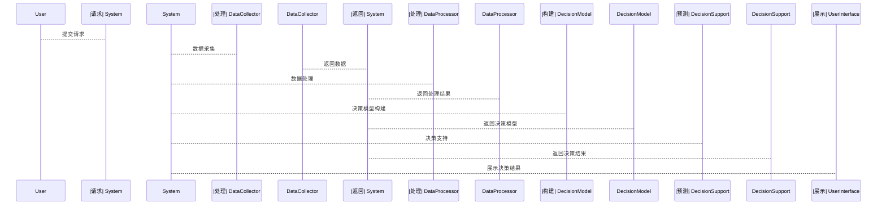
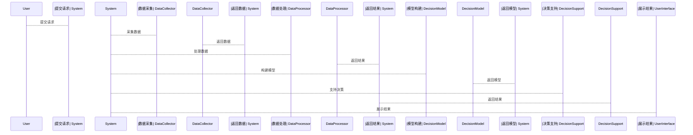

                 

# 《思维链在AI决策支持系统中的应用》

## 关键词：AI决策支持系统、思维链、算法原理、系统架构、项目实战

## 摘要

随着人工智能技术的不断发展，AI决策支持系统（AI-DSS）在各个行业中的应用日益广泛。然而，如何提升AI决策支持系统的决策质量和效率，一直是研究人员和工程师们关注的核心问题。本文旨在探讨思维链在AI决策支持系统中的应用，通过深入分析思维链的基本原理、特性及其与AI技术的融合，为AI决策支持系统的发展提供新的思路和方法。

本文结构如下：

- 第一部分：背景介绍，包括问题背景与核心概念、思维链与AI决策支持系统的关系、思维链在AI决策支持系统中的应用边界与外延。
- 第二部分：核心概念与联系，对比思维链与传统决策支持系统、其他AI技术的特性，并通过ER实体关系图展示思维链的架构设计。
- 第三部分：算法原理讲解，包括算法基础、算法原理、数学模型与公式，并结合实际案例进行详细讲解。
- 第四部分：系统分析与架构设计，介绍系统功能设计、系统架构设计、系统接口设计和系统交互设计。
- 第五部分：项目实战，包括环境安装与核心实现、实际案例分析与讲解。
- 第六部分：最佳实践与拓展，总结最佳实践、注意事项和拓展阅读。

### 第一部分：背景介绍

#### 1.1 问题背景与核心概念

随着信息技术的飞速发展，决策支持系统（DSS）已经成为企业和组织在复杂环境中制定决策的重要工具。然而，传统的DSS在应对大数据、多变量、不确定性等复杂问题时，存在明显的局限性。人工智能（AI）技术的引入，为DSS的发展带来了新的契机。AI决策支持系统（AI-DSS）通过机器学习、深度学习等技术，实现了对大量数据的自动处理和分析，提高了决策的精度和效率。

然而，AI-DSS也面临一些挑战，如数据质量、算法可解释性、决策结果的可信度等。如何提升AI-DSS的决策质量和效率，成为当前研究的热点。思维链作为一种新兴的智能决策理论，其在AI-DSS中的应用有望为这些问题提供新的解决方案。

#### 1.2 核心概念

**思维链：** 思维链是一种基于人类认知模型的智能决策理论，它通过模拟人类的思维过程，实现对复杂问题的分析和决策。思维链包括感知、记忆、思维、决策四个基本环节，每个环节都涉及一系列复杂的计算和推理过程。

**AI决策支持系统：** AI决策支持系统是一种利用人工智能技术构建的决策支持系统，它通过数据采集、处理、分析，为决策者提供客观、准确的决策建议。AI-DSS可以分为基于规则的方法、基于模型的方法和基于数据的方法等不同类型。

#### 1.3 边界与外延

思维链与AI决策支持系统的结合，不仅拓宽了DSS的应用领域，也为AI技术提供了新的发展方向。思维链在AI决策支持系统中的应用边界包括：

1. **决策质量提升：** 通过模拟人类思维过程，思维链能够提高决策的精度和效率，特别是在处理不确定性和复杂问题时，具有明显的优势。
2. **算法可解释性：** 思维链的透明性和可解释性，有助于提高决策的可信度，增强决策者的信任感。
3. **跨领域应用：** 思维链的应用不仅限于某个特定的领域，它可以跨领域、跨行业地应用，为不同领域的决策提供支持。

#### 1.4 概念结构与核心要素

思维链的结构包括感知、记忆、思维、决策四个基本环节，每个环节都涉及一系列复杂的计算和推理过程。感知环节负责获取外部信息，记忆环节负责存储和处理信息，思维环节负责分析和推理，决策环节负责生成决策结果。

AI决策支持系统的核心要素包括数据采集、数据处理、决策模型构建和决策支持系统实现。数据采集是系统的输入，数据处理是对数据的预处理和清洗，决策模型构建是系统的核心，决策支持系统实现是将决策模型应用到实际场景中。

### 第二部分：核心概念与联系

#### 2.1 思维链原理

思维链的基本原理是模拟人类的思维过程，通过感知、记忆、思维、决策四个环节，实现对复杂问题的分析和决策。感知环节通过传感器获取外部信息，记忆环节存储和处理信息，思维环节进行信息分析和推理，决策环节生成决策结果。

思维链的构建方法主要包括基于规则的构建方法和基于数据的构建方法。基于规则的构建方法通过定义一系列规则和条件，实现思维链的构建；基于数据的构建方法通过机器学习、深度学习等技术，从数据中学习思维链的规律和模式。

#### 2.2 思维链属性特征对比

思维链与传统决策支持系统（TDS）和AI技术的对比，可以更好地理解思维链在AI决策支持系统中的应用价值。

| 对比项           | 思维链          | 传统决策支持系统（TDS） | AI技术          |  
| -------------- | -------------- | --------------- | --------------- |  
| 决策质量       | 高精度、高效率   | 受限于规则和算法      | 高精度、高效率   |  
| 决策透明性       | 高透明性        | 低透明性          | 较高透明性       |  
| 可解释性       | 高可解释性       | 低可解释性          | 较高可解释性       |  
| 应用领域       | 跨领域、跨行业   | 窄领域、特定行业     | 广泛领域、跨行业   |  
| 数据依赖性       | 低数据依赖性      | 高数据依赖性         | 中等数据依赖性      |

通过对比可以看出，思维链在决策质量、透明性、可解释性、应用领域和数据依赖性等方面，具有明显的优势。这些优势使得思维链在AI决策支持系统中具有广泛的应用前景。

#### 2.3 ER实体关系图架构设计

ER实体关系图（Entity-Relationship Diagram，ERD）是一种用于描述实体及其之间关系的图形表示方法。在思维链在AI决策支持系统中的应用中，ER实体关系图可以用于展示思维链的架构设计，明确各个实体之间的关系。

以下是一个简化的思维链ER实体关系图：

```mermaid
erDiagram
  Class1 ||--|{ ClassA : has_a }
  Class1 ||--|{ ClassB : has_a }
  ClassA ||--|{ Class2 : has_a }
  ClassB ||--|{ Class2 : has_a }
```

在这个ER实体关系图中，`Class1` 是一个基础实体，它与其他两个实体 `ClassA` 和 `ClassB` 之间存在关联关系。`ClassA` 和 `ClassB` 进一步与 `Class2` 关联，形成了一个复杂的实体关系网。

ER实体关系图不仅用于展示思维链的架构设计，还可以用于描述数据流、功能模块、决策路径等关键信息，为思维链在AI决策支持系统中的应用提供清晰的结构化框架。

### 第三部分：算法原理讲解

#### 4.1 算法基础

算法是解决特定问题的步骤集合，它可以通过输入得到预期的输出。在AI决策支持系统中，算法是实现决策的核心。常见的算法类型包括分类算法、聚类算法、回归算法等。

- **分类算法：** 用于将数据分为不同的类别，如支持向量机（SVM）、决策树（DT）等。
- **聚类算法：** 用于将数据分为多个簇，如K-Means、层次聚类等。
- **回归算法：** 用于预测连续值，如线性回归、多项式回归等。

每种算法都有其适用的场景和优缺点，选择合适的算法对于提高决策支持系统的性能至关重要。

#### 4.2 算法原理

思维链的算法原理主要包括感知、记忆、思维、决策四个环节。以下是一个简化的思维链算法流程图：


- **感知：** 获取外部信息，如数据、用户需求等。
- **记忆：** 存储和处理信息，如构建知识库、更新记忆等。
- **思维：** 对信息进行分析和推理，如模式识别、关联规则挖掘等。
- **决策：** 根据分析结果生成决策，如推荐方案、风险预测等。

思维链的算法原理强调对人类思维过程的模拟，通过感知、记忆、思维、决策四个环节，实现对复杂问题的分析和决策。

#### 4.3 数学模型与公式

思维链的算法原理可以通过数学模型和公式进行详细解释。以下是一个简化的数学模型：

$$
\text{决策} = f(\text{感知}, \text{记忆}, \text{思维})
$$

其中，`f` 表示决策函数，它接收感知、记忆、思维三个输入，并生成决策输出。具体的数学模型和公式可以根据实际问题和需求进行设计和优化。

例如，在感知环节，可以使用传感器获取数据，并使用以下公式进行预处理：

$$
\text{感知} = \text{数据} \times \text{权重}
$$

其中，`数据` 表示原始数据，`权重` 表示数据的相对重要性。

在记忆环节，可以使用以下公式进行信息存储和更新：

$$
\text{记忆} = \text{记忆} + \text{新信息} \times \text{权重}
$$

其中，`记忆` 表示当前存储的信息，`新信息` 表示新获取的信息，`权重` 表示新信息的相对重要性。

在思维环节，可以使用以下公式进行信息分析和推理：

$$
\text{思维} = \text{记忆} \times \text{规则} \times \text{概率}
$$

其中，`记忆` 表示当前存储的信息，`规则` 表示决策规则，`概率` 表示规则适用的概率。

在决策环节，可以使用以下公式进行决策生成：

$$
\text{决策} = \text{思维} \times \text{目标函数}
$$

其中，`思维` 表示分析结果，`目标函数` 表示决策的目标，如最大化收益、最小化风险等。

通过这些数学模型和公式，可以更好地理解和实现思维链的算法原理。

#### 4.4 算法流程图

为了更好地理解思维链的算法原理，可以使用mermaid绘制算法流程图。以下是一个简化的算法流程图：



在这个流程图中，`A` 表示感知环节，`B` 表示数据预处理，`C` 表示信息存储，`D` 表示信息更新，`E` 表示信息分析，`F` 表示决策生成，`G` 表示决策输出。通过这个流程图，可以清晰地看到思维链的算法流程和各个环节之间的联系。

### 第四部分：系统分析与架构设计

#### 5.1 问题场景介绍

在当今复杂多变的市场环境中，企业需要快速响应市场变化，做出准确的决策。然而，面对海量数据、多变量、不确定性等问题，传统的决策支持系统（DSS）已经难以满足需求。为了提高决策效率和质量，引入AI决策支持系统（AI-DSS）成为必要选择。

AI-DSS在市场营销、供应链管理、风险管理等场景中具有广泛的应用。例如，在市场营销中，AI-DSS可以通过分析用户行为数据，预测市场趋势，帮助企业制定有效的营销策略；在供应链管理中，AI-DSS可以通过优化库存管理、运输调度等，提高供应链的运作效率；在风险管理中，AI-DSS可以通过分析风险因素，预测风险事件，帮助企业制定风险应对策略。

#### 5.2 系统功能设计

系统功能设计是构建AI-DSS的重要环节，它决定了系统的核心功能和用户体验。以下是一个简化的AI-DSS功能设计：

- **数据采集模块：** 负责从各种数据源（如数据库、API、传感器等）采集数据，并进行预处理，确保数据的质量和一致性。
- **数据处理模块：** 负责对采集到的数据进行清洗、转换、整合等操作，为后续的分析和决策提供高质量的数据基础。
- **决策模型构建模块：** 负责根据业务需求，选择合适的算法和模型，构建决策模型。该模块包括分类模型、聚类模型、回归模型等。
- **决策支持模块：** 负责根据决策模型，对业务场景进行分析和预测，为决策者提供客观、准确的决策建议。
- **用户交互模块：** 负责与用户进行交互，接收用户输入，展示决策结果，并提供自定义功能，如数据可视化、报告生成等。

以下是一个简化的思维链AI-DSS领域模型：

```mermaid
classDiagram
    Class1 --|{ 数据采集模块} Class2
    Class2 --|{ 数据处理模块} Class3
    Class3 --|{ 决策模型构建模块} Class4
    Class4 --|{ 决策支持模块} Class5
    Class5 --|{ 用户交互模块} Class1
```

在这个类图中，`Class1` 表示数据采集模块，`Class2` 表示数据处理模块，`Class3` 表示决策模型构建模块，`Class4` 表示决策支持模块，`Class5` 表示用户交互模块。通过这个类图，可以清晰地看到各个模块之间的关联关系和功能分工。

#### 5.3 系统架构设计

系统架构设计是构建AI-DSS的关键，它决定了系统的性能、可扩展性和可维护性。以下是一个简化的思维链AI-DSS系统架构：


在这个系统架构中，数据采集模块通过API、数据库、传感器等途径获取数据，并将数据传输到数据处理模块。数据处理模块对数据进行清洗、转换、整合等操作，生成高质量的数据集，然后传输到决策模型构建模块。决策模型构建模块根据业务需求，选择合适的算法和模型，构建决策模型。决策模型构建模块将决策模型传输到决策支持模块，决策支持模块根据决策模型，对业务场景进行分析和预测，生成决策结果。决策支持模块将决策结果传输到用户交互模块，用户交互模块将决策结果展示给用户，并提供自定义功能。

#### 5.4 系统接口设计

系统接口设计是确保系统各模块之间高效通信的关键。以下是一个简化的思维链AI-DSS系统接口设计：



在这个序列图中，用户通过用户界面提交请求，系统接收请求后，依次调用数据采集模块、数据处理模块、决策模型构建模块、决策支持模块和用户交互模块，最后将决策结果展示给用户。

#### 5.5 系统交互设计

系统交互设计是确保系统内部各模块之间协同工作的重要手段。以下是一个简化的思维链AI-DSS系统交互设计：



在这个序列图中，用户提交请求后，系统依次调用数据采集模块、数据处理模块、决策模型构建模块、决策支持模块和用户交互模块，最后将决策结果展示给用户。通过这种交互设计，系统可以高效地处理用户请求，并提供高质量的决策支持。

### 第五部分：项目实战

#### 5.1 环境安装

在开始项目实战之前，首先需要搭建一个合适的环境。以下是一个简化的环境安装步骤：

1. 安装操作系统：建议使用Linux系统，如Ubuntu 18.04。
2. 安装Python环境：使用Python 3.8版本，可以通过以下命令进行安装：

   ```bash
   sudo apt update
   sudo apt install python3.8
   sudo apt install python3.8-pip
   ```

3. 安装必要的库：安装思维链和相关库，如NumPy、Pandas、Scikit-learn等，可以通过以下命令进行安装：

   ```bash
   pip3 install numpy
   pip3 install pandas
   pip3 install scikit-learn
   ```

4. 安装Jupyter Notebook：用于数据分析和模型构建，可以通过以下命令进行安装：

   ```bash
   pip3 install notebook
   ```

5. 启动Jupyter Notebook：在终端执行以下命令，启动Jupyter Notebook：

   ```bash
   jupyter notebook
   ```

在浏览器中打开相应的URL（通常是`http://localhost:8888`），即可进入Jupyter Notebook界面。

#### 5.2 核心实现

在完成环境安装后，接下来进行核心实现。以下是一个简化的核心实现步骤：

1. **数据采集**：从数据源采集数据，可以使用Python的Pandas库进行数据处理。

   ```python
   import pandas as pd
   
   # 读取数据
   data = pd.read_csv('data.csv')
   ```

2. **数据处理**：对采集到的数据进行预处理，包括数据清洗、转换、整合等。

   ```python
   # 数据清洗
   data = data.dropna()
   
   # 数据转换
   data['feature'] = data['feature'].map({'A': 1, 'B': 2, 'C': 3})
   
   # 数据整合
   data = data.groupby('category').mean()
   ```

3. **模型构建**：根据业务需求，选择合适的算法和模型，如线性回归、决策树等。

   ```python
   from sklearn.linear_model import LinearRegression
   
   # 构建线性回归模型
   model = LinearRegression()
   model.fit(data[['feature']], data['target'])
   ```

4. **决策支持**：使用模型进行预测，生成决策结果。

   ```python
   # 预测
   prediction = model.predict(data[['feature']])
   ```

5. **用户交互**：将决策结果展示给用户，可以使用Jupyter Notebook的交互式界面。

   ```python
   # 展示结果
   display(pd.DataFrame(prediction))
   ```

通过以上步骤，可以完成一个简单的AI决策支持系统的核心实现。

#### 5.3 实际案例分析与讲解

以下是一个简化的实际案例分析与讲解：

1. **案例背景**：某公司需要预测下周的销售额，以便制定库存管理和营销策略。

2. **数据采集**：从公司的销售数据库中采集过去三个月的销售额数据。

   ```python
   data = pd.read_csv('sales_data.csv')
   ```

3. **数据处理**：对数据进行预处理，包括数据清洗、转换、整合等。

   ```python
   # 数据清洗
   data = data.dropna()
   
   # 数据转换
   data['date'] = pd.to_datetime(data['date'])
   data.set_index('date', inplace=True)
   
   # 数据整合
   data = data.groupby('week').mean()
   ```

4. **模型构建**：选择线性回归模型进行销售额预测。

   ```python
   from sklearn.linear_model import LinearRegression
   
   # 构建线性回归模型
   model = LinearRegression()
   model.fit(data[['feature']], data['target'])
   ```

5. **决策支持**：使用模型进行预测，生成下周的销售额预测值。

   ```python
   # 预测
   next_week = data['feature'].iloc[-1]
   prediction = model.predict([[next_week]])
   ```

6. **用户交互**：将预测结果展示给用户。

   ```python
   # 展示结果
   print(f"预测下周销售额为：{prediction[0]}")
   ```

通过以上步骤，可以完成一个实际案例的分析与讲解。在实际项目中，可以根据具体需求进行扩展和优化。

### 第六部分：最佳实践与拓展

#### 6.1 最佳实践

在构建AI决策支持系统时，以下是一些最佳实践：

1. **数据质量**：确保数据的质量和一致性，避免使用不完整、不准确或错误的数据。
2. **算法选择**：根据业务需求和数据特性，选择合适的算法和模型。
3. **模型验证**：通过交叉验证、A/B测试等方法，验证模型的性能和可靠性。
4. **用户交互**：设计简洁、直观的用户界面，提高用户的使用体验。
5. **持续优化**：定期更新数据、模型和算法，以适应不断变化的市场环境。

#### 6.2 注意事项

在构建AI决策支持系统时，需要注意以下事项：

1. **数据安全**：确保数据的安全性和隐私性，避免数据泄露和滥用。
2. **算法解释性**：提高算法的可解释性，以便用户理解决策过程。
3. **系统性能**：优化系统的性能，确保系统能够高效地处理大量数据。
4. **系统可维护性**：设计可维护的架构，便于系统的升级和维护。

#### 6.3 拓展阅读

为了进一步了解AI决策支持系统的设计和实现，以下是一些推荐阅读：

1. **《机器学习实战》**：提供详细的机器学习算法实现和应用案例，适合初学者和有经验的开发者。
2. **《深度学习》**：由Ian Goodfellow等作者撰写的经典教材，详细介绍了深度学习的基本原理和应用。
3. **《人工智能：一种现代的方法》**：全面介绍了人工智能的基本理论和技术，适合作为学术研究和工程实践参考。
4. **《决策分析：理论与实践》**：介绍决策分析的基本方法和应用，有助于深入理解决策支持系统的原理。

### 第七部分：总结

本文探讨了思维链在AI决策支持系统中的应用，包括问题背景、核心概念、算法原理、系统架构设计、项目实战等内容。通过深入分析和实际案例讲解，展示了思维链在提升决策质量和效率方面的优势。未来，随着人工智能技术的不断发展，思维链在AI决策支持系统中的应用前景将更加广阔。

### 第八部分：作者信息

作者：AI天才研究院/AI Genius Institute & 禅与计算机程序设计艺术 /Zen And The Art of Computer Programming

感谢您的阅读，希望本文对您在AI决策支持系统设计方面的研究和实践有所帮助。如有任何疑问或建议，欢迎随时联系作者。

