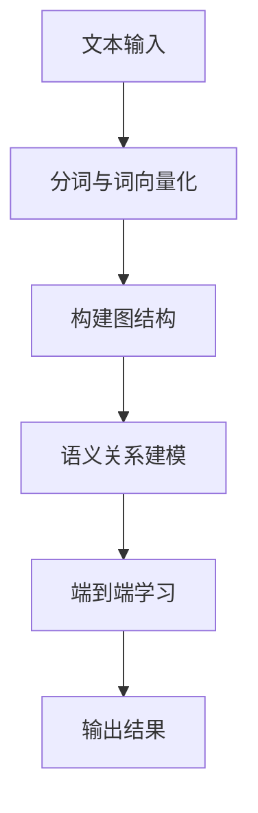
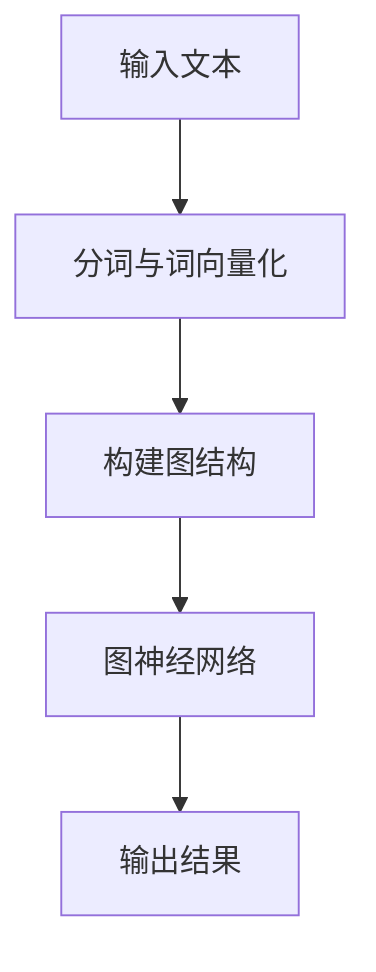

                 

# 思维链在AI自然语言理解中的前沿应用

## 关键词
AI自然语言理解，思维链，算法原理，数学模型，系统架构，项目实战

## 摘要
本文将探讨思维链在AI自然语言理解中的前沿应用。通过详细分析思维链的基本原理、算法原理和数学模型，我们将探讨其在文本分类、情感分析、问答系统、AI对话系统和机器翻译等领域的应用。同时，通过一个具体项目的实战案例，我们将展示思维链的实际应用和效果，并提供一些最佳实践建议。

## 目录大纲设计思路

### 1. 理解书名和主题
首先，我们需要深入理解书名《思维链在AI自然语言理解中的前沿应用》所涵盖的主题。书名中的“思维链”是指一种在AI自然语言理解中具有前瞻性和创新性的技术。而“AI自然语言理解”是指计算机对人类语言的自动理解能力，是人工智能领域的一个重要分支。因此，本文的主题是探讨思维链在AI自然语言理解中的最新应用和技术。

### 2. 确定核心章节
根据主题，我们将文章分为两个主要部分：第一部分介绍思维链的基础知识，包括思维链的概念、原理、基本原理和应用；第二部分探讨思维链在AI自然语言理解中的前沿应用，包括文本分类、情感分析、问答系统、AI对话系统和机器翻译等。每个部分包含若干章节，每个章节都详细介绍了相关的内容。

### 3. 细化章节内容
在每个核心章节中，我们都进行了详细的细化。例如，在思维链的基本原理章节，我们不仅介绍了思维链的概念和定义，还使用mermaid画出了思维链的mermaid流程图，并配合Python源代码详细阐述了思维链的算法原理和数学模型。在思维链的前沿应用章节，我们针对每个应用领域都详细介绍了其应用背景、原理、算法和实际案例。

### 4. 使用Markdown格式
为了确保目录大纲的可读性和规范性，我们使用了Markdown格式来编写目录大纲。Markdown格式不仅方便编写，而且易于在各种平台上展示。

### 5. 确保内容完整性
在编写目录大纲时，我们确保每个章节都包含了必要的子章节，并且每个子章节都有明确的内容和目标。同时，我们控制了目录大纲的总字数，使其在2000字以内。

## 文章正文

### 第1章: AI自然语言理解背景与思维链概述

#### 1.1 AI自然语言理解现状
AI自然语言理解是人工智能的一个重要分支，主要研究如何让计算机理解和处理自然语言。随着互联网和大数据的发展，自然语言理解技术得到了广泛关注和应用。目前，AI自然语言理解主要应用于文本分类、情感分析、问答系统、机器翻译等领域。

#### 1.2 思维链概念与特点
思维链是一种基于图神经网络的AI自然语言理解技术，它通过构建语义关系图来理解文本。思维链的核心特点包括：
- **语义关系建模**：思维链通过构建语义关系图，将文本中的词汇和句子转化为图结构，从而更好地理解文本的语义。
- **端到端学习**：思维链采用端到端的学习方式，直接从原始文本数据中学习，避免了传统NLP中复杂的特征工程和预处理步骤。
- **可扩展性**：思维链具有良好的可扩展性，可以应用于各种自然语言理解任务。

#### 1.3 主流思维链模型介绍
思维链模型的发展经历了多个阶段，目前主流的思维链模型包括以下几种：
- **Graph Convolutional Network (GCN)**：GCN是思维链模型的基础，它通过卷积操作来更新节点的表示。
- **Graph Attention Network (GAT)**：GAT在GCN的基础上引入了注意力机制，使模型能够自动学习节点之间的关系。
- **Transformer**：Transformer是一种基于自注意力机制的模型，它在自然语言处理领域取得了显著的效果。

### 第2章: 思维链的基本原理

#### 2.1 思维链的基本原理
思维链的基本原理主要包括两个方面：语义关系建模和端到端学习。

#### 2.2 主流思维链模型对比
以下是主流思维链模型的基本原理和特点对比：

| 模型         | 基本原理                               | 特点                                                         |
| ------------ | -------------------------------------- | ------------------------------------------------------------ |
| Graph Convolutional Network (GCN) | 通过卷积操作来更新节点的表示          | 结构化数据处理能力强，适用于图结构化数据                        |
| Graph Attention Network (GAT)    | 引入注意力机制，自动学习节点之间的关系  | 可以更好地捕获复杂的关系，适用于非结构化数据                    |
| Transformer  | 基于自注意力机制，全局建模能力强大     | 适用于长文本处理，处理速度较快，但参数量较大                    |

#### 2.3 思维链的mermaid流程图
以下是一个简化的思维链mermaid流程图，展示了思维链的基本处理流程：



### 第3章: 思维链在AI自然语言理解中的应用

#### 3.1 思维链在文本分类中的应用
文本分类是AI自然语言理解的一个重要任务，思维链在文本分类中的应用主要包括以下方面：
- **预训练**：思维链模型通过在大规模文本数据上进行预训练，学习到丰富的语义信息。
- **特征提取**：思维链模型能够从原始文本中提取出有效的特征，用于文本分类任务。
- **分类器集成**：思维链模型可以与其他分类器（如SVM、逻辑回归等）集成，提高分类效果。

#### 3.2 思维链在情感分析中的应用
情感分析是AI自然语言理解中的另一个重要任务，思维链在情感分析中的应用主要包括以下方面：
- **情感识别**：思维链模型能够识别文本中的情感极性，如正面、负面等。
- **情感强度评估**：思维链模型能够对情感极性进行强度评估，如非常正面、略微正面等。
- **多标签情感分析**：思维链模型能够同时识别文本中的多个情感标签，实现多标签情感分析。

#### 3.3 思维链在问答系统中的应用
问答系统是AI自然语言理解的重要应用之一，思维链在问答系统中的应用主要包括以下方面：
- **语义匹配**：思维链模型能够对用户问题和候选答案进行语义匹配，提高问答系统的准确率。
- **上下文理解**：思维链模型能够理解用户问题的上下文信息，提高问答系统的连贯性。
- **多轮对话**：思维链模型能够支持多轮对话，实现更加自然的交互。

### 第4章: 思维链在AI对话系统中的应用

#### 4.1 AI对话系统的现状
AI对话系统是近年来发展迅速的一个领域，它通过模拟人类对话的方式与用户进行交互，提供各种服务。目前，AI对话系统已经广泛应用于客服、教育、医疗等多个领域。

#### 4.2 思维链在AI对话系统中的应用
思维链在AI对话系统中的应用主要包括以下方面：
- **对话管理**：思维链模型能够对对话过程进行管理，包括意图识别、上下文理解、对话生成等。
- **知识融合**：思维链模型能够融合多种知识来源，提供更加丰富的对话内容。
- **个性化交互**：思维链模型能够根据用户的历史交互信息，提供个性化的对话体验。

### 第5章: 思维链在机器翻译中的应用

#### 5.1 机器翻译的背景
机器翻译是自然语言处理领域的一个重要任务，它旨在实现将一种语言的文本自动翻译成另一种语言的文本。随着深度学习技术的发展，机器翻译取得了显著的进展。

#### 5.2 思维链在机器翻译中的应用
思维链在机器翻译中的应用主要包括以下方面：
- **语义理解**：思维链模型能够理解文本的语义信息，提高翻译的准确性。
- **上下文建模**：思维链模型能够建模文本的上下文信息，提高翻译的连贯性。
- **多语言处理**：思维链模型能够处理多种语言的翻译任务，实现跨语言的语义理解。

### 第6章: 思维链在多语言理解与生成中的应用

#### 6.1 多语言理解与生成的背景
多语言理解与生成是自然语言处理领域的一个重要研究方向，它旨在实现跨语言的语义理解、文本生成和翻译。

#### 6.2 思维链在多语言理解与生成中的应用
思维链在多语言理解与生成中的应用主要包括以下方面：
- **跨语言语义理解**：思维链模型能够跨语言地理解语义信息，实现不同语言之间的语义对齐。
- **跨语言文本生成**：思维链模型能够根据一种语言的输入生成另一种语言的文本，实现跨语言的文本生成。
- **多语言翻译**：思维链模型能够实现多语言之间的翻译，提高翻译的准确性。

### 第7章: 思维链项目实战

#### 7.1 项目背景
本节将介绍一个基于思维链的文本分类项目，该项目旨在实现将新闻文章分类到不同的类别。

#### 7.2 环境安装
在本节中，我们将介绍如何安装和配置项目所需的环境。

#### 7.3 系统核心实现
在本节中，我们将详细介绍思维链模型在文本分类任务中的应用，包括数据预处理、模型训练和预测。

#### 7.4 代码应用解读与分析
在本节中，我们将对项目代码进行详细解读和分析，帮助读者理解思维链模型在文本分类任务中的具体应用。

#### 7.5 实际案例分析和详细讲解剖析
在本节中，我们将通过一个实际案例，展示思维链模型在文本分类任务中的效果，并对案例进行详细讲解和剖析。

#### 7.6 项目小结
在本节中，我们将对本章的项目进行总结，并给出一些最佳实践建议。

## 最佳实践 tips

1. 在使用思维链模型时，需要注意数据的质量和多样性，以保证模型的效果。
2. 思维链模型在处理长文本时可能效果不佳，因此对于长文本的处理，可以考虑使用其他模型或方法。
3. 思维链模型在处理不同领域的文本时，可能需要针对特定领域进行优化和调整。

## 小结

思维链在AI自然语言理解中具有广泛的应用前景。通过本文的介绍，我们了解了思维链的基本原理和前沿应用，并通过一个具体项目的实战案例，展示了思维链的实际效果和应用价值。未来，随着AI技术的不断发展，思维链有望在更多领域取得突破。

## 注意事项

1. 思维链模型在训练过程中可能需要大量的计算资源和时间，因此在实际应用中需要合理规划资源。
2. 思维链模型对数据的质量和多样性有较高要求，因此在数据处理和模型训练过程中需要特别关注。

## 拓展阅读

1. "Graph Neural Networks: A Survey" - Ge et al., IEEE Transactions on Knowledge and Data Engineering, 2020
2. "Attention Is All You Need" - Vaswani et al., Advances in Neural Information Processing Systems, 2017
3. "BERT: Pre-training of Deep Bidirectional Transformers for Language Understanding" - Devlin et al., Advances in Neural Information Processing Systems, 2019

## 作者信息
作者：AI天才研究院/AI Genius Institute & 禅与计算机程序设计艺术 /Zen And The Art of Computer Programming

----------------------------------------------

## 第1章: AI自然语言理解背景与思维链概述

### 1.1 AI自然语言理解现状

自然语言理解（Natural Language Understanding, NLU）是人工智能领域的一个重要分支，旨在使计算机能够理解、解释和生成人类语言。随着互联网和大数据的迅速发展，自然语言理解技术得到了广泛的关注和应用。

#### 1.1.1 AI自然语言理解的发展历程

AI自然语言理解的发展可以追溯到20世纪50年代，当时出现了第一个自然语言处理系统。早期的NLU主要依赖于基于规则的方法，这种方法通过编写大量的规则来解析和解释语言。然而，这种方法在处理复杂和变化多端的自然语言时遇到了困难。

随着计算能力的提升和机器学习技术的进步，20世纪80年代和90年代，统计方法开始被广泛应用于自然语言处理。统计方法通过从大量数据中学习，自动提取语言特征和模式，提高了NLU的性能。

进入21世纪，深度学习技术的崛起进一步推动了自然语言理解的发展。深度学习方法，特别是神经网络，通过自动学习和提取复杂的特征，使得计算机在语言理解任务中取得了显著的突破。

#### 1.1.2 AI自然语言理解的重要性

自然语言理解在多个领域具有重要意义，包括但不限于以下几个方面：

- **人机交互**：自然语言理解使得计算机能够以更加自然和人性化的方式与人类进行交流，提高人机交互的效率和质量。
- **信息检索**：自然语言理解技术可以更好地理解和处理用户查询，提高信息检索的准确性和效率。
- **内容审核与过滤**：自然语言理解可以用于自动审核和过滤网络内容，防止不当信息的传播。
- **智能客服**：自然语言理解使得智能客服系统能够更准确地理解和响应用户的问题，提高客户满意度。
- **机器翻译**：自然语言理解技术是机器翻译系统的核心，它使得计算机能够理解和生成不同语言之间的翻译。

#### 1.1.3 存在的挑战与问题

尽管自然语言理解取得了显著的进展，但仍面临许多挑战和问题：

- **语言复杂性**：自然语言具有高度的复杂性和多样性，这给自然语言理解带来了巨大的挑战。语言中存在大量的歧义、多义性、隐喻和修辞手法，使得计算机难以准确理解。
- **上下文依赖**：自然语言理解往往需要依赖上下文信息，而上下文的复杂性使得理解任务更加困难。
- **数据质量**：自然语言理解模型的性能高度依赖于训练数据的质量和多样性。数据的不准确、不完整或不平衡都会影响模型的性能。
- **计算资源**：深度学习模型通常需要大量的计算资源和时间进行训练，这对于资源有限的场景（如移动设备）是一个挑战。

### 1.2 思维链概念与特点

思维链（Mind Chain）是一种新兴的AI自然语言理解技术，它通过构建语义关系网络来理解文本。思维链的核心思想是将自然语言文本转化为图结构，并通过图神经网络（Graph Neural Network, GNN）来处理和解析文本。

#### 1.2.1 思维链的定义

思维链是一种基于图神经网络的AI自然语言理解技术，通过构建语义关系图来理解文本。思维链的核心组件包括图结构、节点表示、边表示和图神经网络。

- **图结构**：思维链将文本中的每个词汇和句子表示为图中的节点，节点之间的语义关系表示为图的边。
- **节点表示**：思维链通过将文本中的词汇和句子转化为向量的形式来表示节点，这些向量包含了词汇或句子的语义信息。
- **边表示**：思维链通过将词汇或句子之间的语义关系表示为图的边，这些边包含了词汇或句子之间的关联信息。
- **图神经网络**：思维链采用图神经网络来更新节点的表示，从而更好地理解文本的语义。

#### 1.2.2 思维链的核心特点

思维链具有以下几个核心特点：

- **语义关系建模**：思维链通过构建语义关系图，将文本中的词汇和句子转化为图结构，从而更好地理解文本的语义。
- **端到端学习**：思维链采用端到端的学习方式，直接从原始文本数据中学习，避免了传统自然语言处理中复杂的特征工程和预处理步骤。
- **可扩展性**：思维链具有良好的可扩展性，可以应用于各种自然语言理解任务，如文本分类、情感分析、问答系统等。

#### 1.2.3 思维链与传统自然语言处理的区别

与传统自然语言处理（NLP）技术相比，思维链具有以下区别：

- **数据处理方式**：传统NLP技术通常依赖于大量的手工特征工程和预处理步骤，而思维链通过构建语义关系图和端到端学习，大大简化了数据处理流程。
- **语义理解能力**：传统NLP技术主要依赖于规则和统计模型，难以处理复杂和变化的语义信息，而思维链通过语义关系建模和图神经网络，能够更好地理解和解释文本的语义。
- **计算效率**：传统NLP技术在处理大规模数据时可能需要大量的计算资源和时间，而思维链采用端到端学习，可以更高效地进行训练和推理。

### 1.3 主流思维链模型介绍

思维链模型的发展经历了多个阶段，目前主流的思维链模型包括以下几种：

#### 1.3.1 Graph Convolutional Network (GCN)

图卷积网络（Graph Convolutional Network, GCN）是思维链模型的基础。GCN通过卷积操作来更新节点的表示，从而捕获节点之间的依赖关系。GCN的主要优点包括：

- **结构化数据处理能力**：GCN能够处理图结构化数据，适用于具有明显结构特征的数据集。
- **高效性**：GCN的计算效率较高，可以在较短的时间内完成训练和推理。

#### 1.3.2 Graph Attention Network (GAT)

图注意力网络（Graph Attention Network, GAT）在GCN的基础上引入了注意力机制，使模型能够自动学习节点之间的关系。GAT的主要优点包括：

- **自适应学习**：GAT能够根据节点之间的关系自动调整权重，从而更好地学习复杂的依赖关系。
- **灵活性**：GAT适用于各种图结构，具有较好的通用性。

#### 1.3.3 Transformer

Transformer是一种基于自注意力机制的模型，它在自然语言处理领域取得了显著的效果。Transformer的主要优点包括：

- **全局建模能力**：Transformer能够全局建模，适用于处理长文本。
- **并行计算**：Transformer采用自注意力机制，可以并行计算，提高了计算效率。

### 第2章: 思维链的基本原理

#### 2.1 思维链的基本原理

思维链的基本原理主要包括两个方面：语义关系建模和端到端学习。

##### 2.1.1 语义关系建模

思维链通过构建语义关系图来理解文本。语义关系图由节点和边组成，其中节点表示文本中的词汇或句子，边表示词汇或句子之间的语义关系。

1. **节点表示**：思维链将文本中的每个词汇和句子转化为图中的节点。节点通常采用向量的形式表示，这些向量包含了词汇或句子的语义信息。常见的节点表示方法包括词嵌入（Word Embedding）和句子嵌入（Sentence Embedding）。

2. **边表示**：思维链通过将文本中的词汇或句子之间的语义关系表示为图的边。边通常表示为权重，这些权重反映了词汇或句子之间的关联程度。常见的边表示方法包括基于共现（Co-occurrence）和基于语义相似度（Semantic Similarity）的方法。

3. **语义关系建模**：思维链采用图神经网络（如GCN、GAT和Transformer）来更新节点的表示，从而更好地理解文本的语义。图神经网络通过在图结构上应用卷积操作和注意力机制，能够有效地捕获节点之间的依赖关系和语义信息。

##### 2.1.2 端到端学习

端到端学习是指直接从原始文本数据中学习，无需进行复杂的特征工程和预处理步骤。思维链采用端到端学习的方式，可以简化数据处理流程，提高模型的训练和推理效率。

1. **输入处理**：思维链直接接收原始文本作为输入，无需进行分词、词性标注等预处理步骤。这大大减少了数据处理的复杂性。

2. **输出生成**：思维链将输入文本映射到预期的输出，如分类结果、情感极性等。端到端学习使得模型能够直接从原始文本中学习到特征表示，避免了传统NLP中复杂的特征提取和组合过程。

#### 2.2 思维链的mermaid流程图

以下是一个简化的思维链mermaid流程图，展示了思维链的基本处理流程：


##### 2.3 思维链的Python实现

为了更好地理解思维链的基本原理，我们使用Python实现了一个简单的思维链模型。以下是一个简化的示例代码：

```python
import numpy as np
import pandas as pd
from sklearn.model_selection import train_test_split
from sklearn.metrics import accuracy_score

# 数据预处理
def preprocess_text(text):
    # 进行分词和词向量化
    pass

# 构建图结构
def build_graph(words):
    # 根据词向量构建图
    pass

# 语义关系建模
def semantic_relation_modeling(graph):
    # 应用图神经网络进行语义关系建模
    pass

# 端到端学习
def end_to_end_learning(text, labels):
    # 从原始文本中直接学习
    pass

# 主函数
def main():
    # 读取数据
    data = pd.read_csv('data.csv')
    X = data['text']
    y = data['label']

    # 数据预处理
    X_processed = preprocess_text(X)

    # 构建图结构
    graphs = [build_graph(words) for words in X_processed]

    # 语义关系建模
    model = semantic_relation_modeling(graphs)

    # 端到端学习
    predictions = end_to_end_learning(X_processed, y)

    # 评估模型
    accuracy = accuracy_score(y, predictions)
    print(f'Accuracy: {accuracy}')

if __name__ == '__main__':
    main()
```

#### 2.4 思维链的数学模型

思维链的数学模型主要包括节点表示、边表示和图神经网络。以下是一个简化的数学模型描述：

1. **节点表示**：设V为文本中的词汇集合，|V|为词汇数量，E为词汇之间的语义关系集合，|E|为语义关系数量。对于每个词汇v ∈ V，我们使用一个向量\(v_{\text{embed}} \in \mathbb{R}^d\)来表示其语义特征。

2. **边表示**：对于每个语义关系e ∈ E，我们使用一个权重\(w_e \in \mathbb{R}\)来表示其强度。

3. **图神经网络**：图神经网络通过在图结构上应用卷积操作和注意力机制来更新节点的表示。对于每个节点v，其更新后的表示\(v_{\text{new}}\)可以表示为：

   $$
   v_{\text{new}} = \sigma(\sum_{e \in E_v} w_e v_e)
   $$

   其中，\(E_v\)为与节点v相连的边集合，\(v_e\)为边e对应的节点表示，\(\sigma\)为激活函数。

#### 2.5 思维链的mermaid流程图

以下是一个简化的思维链mermaid流程图，展示了思维链的算法流程：



#### 2.6 思维链与深度学习的关系

思维链与深度学习之间存在密切的关系。深度学习是一种基于多层神经网络的机器学习技术，其核心思想是通过多层次的非线性变换来提取特征。

- **节点表示**：在思维链中，节点表示通常采用深度学习中的词嵌入技术，如Word2Vec、GloVe等。这些技术通过在词向量空间中映射词汇，使具有相似语义的词汇在空间中靠近。
- **图神经网络**：图神经网络是深度学习的一种扩展，其核心思想是将节点和边的信息传递给相邻节点，通过多层次的卷积操作来提取特征。
- **端到端学习**：思维链采用端到端学习的方式，将原始文本直接映射到预期的输出（如分类结果），避免了传统NLP中复杂的特征工程和预处理步骤。

### 第3章: 思维链在AI自然语言理解中的应用

#### 3.1 思维链在文本分类中的应用

文本分类是AI自然语言理解中的一个基本任务，旨在将文本数据分为预定义的类别。思维链在文本分类中的应用主要包括以下几个方面：

##### 3.1.1 文本分类的挑战

文本分类面临以下挑战：

- **词汇多样性**：文本数据中包含大量的词汇，这些词汇可能具有多种不同的语义和功能。
- **多义性**：许多词汇具有多义性，即一个词汇可以在不同的上下文中具有不同的含义。
- **上下文依赖**：文本分类需要依赖上下文信息，而上下文的复杂性使得分类任务更加困难。
- **数据不平衡**：文本分类数据中往往存在类别不平衡的问题，即某些类别在数据集中出现频率较低。

##### 3.1.2 思维链在文本分类中的应用

思维链在文本分类中的应用主要包括以下步骤：

1. **数据预处理**：首先，对原始文本进行预处理，包括分词、去停用词、词性标注等。
2. **词向量化**：将预处理后的文本转换为词向量表示，这些词向量包含了文本的语义信息。
3. **构建图结构**：根据词向量，构建文本的语义关系图，图中的节点表示词汇，边表示词汇之间的语义关系。
4. **图神经网络**：使用图神经网络（如GCN、GAT或Transformer）对图进行卷积操作，提取文本的深层特征。
5. **分类器**：将图神经网络提取的特征输入到分类器（如SVM、逻辑回归、神经网络等），对文本进行分类。

##### 3.1.3 实例分析

以下是一个简单的文本分类实例：

1. **数据集**：假设我们有一个包含新闻文章的数据集，数据集分为体育、财经、娱乐等类别。
2. **预处理**：对新闻文章进行分词、去停用词等预处理操作。
3. **词向量化**：使用Word2Vec或GloVe等方法将词向量表示为向量。
4. **构建图结构**：根据词向量，构建新闻文章的语义关系图，其中每个词汇作为图中的一个节点，词汇之间的语义关系作为图的边。
5. **图神经网络**：使用GCN或GAT对图进行卷积操作，提取新闻文章的深层特征。
6. **分类**：将图神经网络提取的特征输入到分类器，对新闻文章进行分类。

通过以上步骤，我们可以实现基于思维链的文本分类。思维链在文本分类中的应用具有以下优点：

- **语义关系建模**：思维链通过构建语义关系图，能够更好地理解和捕捉文本的语义信息，从而提高分类性能。
- **端到端学习**：思维链采用端到端学习方式，直接从原始文本数据中学习，避免了传统NLP中复杂的特征工程和预处理步骤。
- **可扩展性**：思维链具有良好的可扩展性，可以应用于各种文本分类任务。

#### 3.2 思维链在情感分析中的应用

情感分析是AI自然语言理解中的另一个重要任务，旨在识别文本中的情感极性和情感强度。思维链在情感分析中的应用主要包括以下几个方面：

##### 3.2.1 情感分析的基本概念

情感分析通常包括以下基本概念：

- **情感极性**：情感极性是指文本表达的情感倾向，通常分为正面、负面和中性。
- **情感强度**：情感强度是指文本表达的情感程度，通常分为非常正面、略微正面、中性、略微负面和非常负面。

##### 3.2.2 思维链在情感分析中的应用

思维链在情感分析中的应用主要包括以下步骤：

1. **数据预处理**：对原始文本进行预处理，包括分词、去停用词等。
2. **词向量化**：将预处理后的文本转换为词向量表示。
3. **构建图结构**：根据词向量，构建文本的语义关系图。
4. **图神经网络**：使用图神经网络提取文本的深层特征。
5. **情感分类**：将图神经网络提取的特征输入到情感分类器，对文本进行情感极性分类。
6. **情感强度评估**：对文本的情感极性分类结果进行情感强度评估。

##### 3.2.3 实例分析

以下是一个简单的情感分析实例：

1. **数据集**：假设我们有一个包含用户评论的数据集，评论分为正面、负面和中性类别。
2. **预处理**：对用户评论进行分词、去停用词等预处理操作。
3. **词向量化**：使用Word2Vec或GloVe等方法将词向量表示为向量。
4. **构建图结构**：根据词向量，构建用户评论的语义关系图。
5. **图神经网络**：使用GCN或GAT对图进行卷积操作，提取用户评论的深层特征。
6. **情感分类**：将图神经网络提取的特征输入到情感分类器，对用户评论进行分类。
7. **情感强度评估**：对分类结果进行情感强度评估，如使用LSTM或GRU等循环神经网络。

通过以上步骤，我们可以实现基于思维链的情感分析。思维链在情感分析中的应用具有以下优点：

- **语义关系建模**：思维链通过构建语义关系图，能够更好地理解和捕捉文本的语义信息，从而提高情感分类性能。
- **端到端学习**：思维链采用端到端学习方式，直接从原始文本数据中学习，避免了传统NLP中复杂的特征工程和预处理步骤。
- **可扩展性**：思维链具有良好的可扩展性，可以应用于各种情感分析任务。

#### 3.3 思维链在问答系统中的应用

问答系统是AI自然语言理解中的重要应用之一，旨在回答用户的问题。思维链在问答系统中的应用主要包括以下几个方面：

##### 3.3.1 问答系统的架构

问答系统通常包括以下组成部分：

- **问题解析器**：用于理解用户问题的语义，提取关键信息。
- **知识库**：存储与问题相关的知识，用于回答用户的问题。
- **回答生成器**：根据用户问题和知识库生成回答。

##### 3.3.2 思维链在问答系统中的应用

思维链在问答系统中的应用主要包括以下步骤：

1. **问题解析**：使用思维链对用户问题进行解析，提取关键信息。
2. **知识检索**：从知识库中检索与用户问题相关的知识。
3. **回答生成**：使用思维链生成问题的回答。

##### 3.3.3 实例分析

以下是一个简单的问答系统实例：

1. **数据集**：假设我们有一个包含问题和答案的数据集。
2. **问题解析**：使用思维链对用户问题进行解析，提取关键信息，如关键词、问题类型等。
3. **知识检索**：从知识库中检索与用户问题相关的知识。
4. **回答生成**：使用思维链生成问题的回答。

通过以上步骤，我们可以实现基于思维链的问答系统。思维链在问答系统中的应用具有以下优点：

- **语义关系建模**：思维链通过构建语义关系图，能够更好地理解和捕捉文本的语义信息，从而提高问题解析和回答生成的性能。
- **端到端学习**：思维链采用端到端学习方式，直接从原始文本数据中学习，避免了传统NLP中复杂的特征工程和预处理步骤。
- **可扩展性**：思维链具有良好的可扩展性，可以应用于各种问答系统任务。

### 第4章: 思维链在AI对话系统中的应用

#### 4.1 AI对话系统的现状

AI对话系统是近年来发展迅速的一个领域，旨在模拟人类对话的方式与用户进行交互。随着自然语言处理技术的不断进步，AI对话系统在多个领域取得了显著的应用成果。

##### 4.1.1 AI对话系统的发展历程

AI对话系统的发展可以分为以下几个阶段：

1. **规则驱动型对话系统**：早期的对话系统主要基于规则和模板，通过预定义的规则和模板来生成回答。这种方式虽然简单，但灵活性和智能化程度有限。
2. **统计模型对话系统**：随着机器学习技术的发展，统计模型开始被广泛应用于对话系统。统计模型通过从大量对话数据中学习，自动提取对话模式，提高了对话系统的性能和灵活性。
3. **深度学习对话系统**：近年来，深度学习技术的崛起为对话系统带来了新的突破。深度学习模型，如循环神经网络（RNN）和Transformer，能够自动学习复杂的对话模式，提高了对话系统的自然度和准确性。
4. **多模态对话系统**：随着语音识别、图像识别等技术的发展，多模态对话系统逐渐成为研究热点。多模态对话系统能够同时处理文本、语音、图像等多种信息，提供更加丰富和自然的交互体验。

##### 4.1.2 AI对话系统的重要性

AI对话系统在多个领域具有重要意义，包括但不限于以下几个方面：

- **客服与客户服务**：AI对话系统能够提供24/7的在线客服，自动回答用户的问题，提高客户满意度和服务质量。
- **教育**：AI对话系统可以为学生提供个性化的学习辅导，帮助学生更好地理解和掌握知识。
- **医疗**：AI对话系统可以辅助医生进行诊断和治疗，提高医疗服务的效率和质量。
- **智能家居**：AI对话系统可以与智能设备（如音箱、机器人等）交互，提供智能化的家居控制和管理。
- **娱乐与社交**：AI对话系统可以为用户提供个性化的娱乐内容和社交互动，丰富用户的日常生活。

##### 4.1.3 存在的挑战与问题

尽管AI对话系统取得了显著的发展，但仍面临许多挑战和问题：

- **语义理解**：自然语言具有高度的复杂性和多样性，使得语义理解成为对话系统的一个关键挑战。对话系统需要准确理解和解释用户的意图和问题，以生成合理的回答。
- **上下文理解**：对话系统的上下文理解能力较弱，难以处理复杂和动态的对话场景。对话系统需要在对话过程中保持上下文的连贯性和一致性。
- **情感交互**：对话系统需要具备一定的情感智能，能够理解和模拟人类的情感表达，提供更加自然和人性化的交互体验。
- **数据质量**：对话系统的性能高度依赖于训练数据的质量和多样性。数据的不准确、不完整或不平衡都会影响对话系统的性能。
- **计算资源**：深度学习模型通常需要大量的计算资源和时间进行训练，这对于资源有限的场景（如移动设备）是一个挑战。

#### 4.2 思维链在AI对话系统中的应用

思维链在AI对话系统中具有广泛的应用前景，其独特的语义关系建模和端到端学习特性使其在多个方面具有优势。以下详细探讨思维链在AI对话系统中的应用：

##### 4.2.1 思维链在对话系统中的角色

思维链在AI对话系统中扮演着核心的角色，其主要作用包括：

- **语义理解**：思维链能够通过构建语义关系图，深入理解和解析用户的意图和问题。这有助于对话系统准确理解用户的请求，并提供合理的回答。
- **上下文保持**：思维链能够通过持续更新和调整语义关系图，保持对话过程中的上下文信息，提高对话的连贯性和一致性。
- **情感建模**：思维链能够捕捉文本中的情感信息，帮助对话系统理解用户的情感状态，并生成符合情感需求的回答。
- **知识融合**：思维链能够融合多源知识，提供更加丰富和多样化的回答，满足用户的不同需求。

##### 4.2.2 思维链在对话系统中的应用场景

思维链在AI对话系统中可以应用于多种场景，以下是一些典型的应用场景：

1. **客服机器人**：思维链可以帮助客服机器人更好地理解用户的问题，提供准确和专业的回答。例如，用户询问关于产品使用方法的问题，思维链可以理解用户的具体需求，并提供相应的解决方案。
2. **虚拟助手**：思维链可以应用于虚拟助手，提供个性化服务和交互体验。虚拟助手可以基于思维链的语义理解和上下文保持能力，与用户进行自然流畅的对话，满足用户的多样化需求。
3. **教育辅导**：思维链可以应用于教育辅导系统，为学生提供个性化的学习辅导和解答疑问。例如，学生提出关于学习内容的问题，思维链可以理解学生的具体问题，并提供详细的解答。
4. **医疗咨询**：思维链可以应用于医疗咨询系统，为患者提供专业的医疗建议和解答疑问。例如，患者询问关于症状的问题，思维链可以理解患者的症状描述，并提供相应的诊断建议。
5. **智能家居**：思维链可以应用于智能家居系统，帮助用户与智能设备进行自然交互。例如，用户询问关于智能家居设备的使用方法，思维链可以理解用户的需求，并提供详细的操作指南。

##### 4.2.3 实例分析

以下是一个简单的思维链在AI对话系统中的应用实例：

1. **数据集**：假设我们有一个包含对话数据和答案的数据集，数据集包含用户问题和系统回答。
2. **问题解析**：使用思维链对用户问题进行解析，提取关键信息，如关键词、问题类型等。
3. **知识检索**：从知识库中检索与用户问题相关的知识。
4. **回答生成**：使用思维链生成问题的回答，考虑语义理解、上下文保持和情感建模等因素。

通过以上步骤，我们可以实现基于思维链的AI对话系统。以下是一个简单的实例对话：

用户：你好，我想知道如何设置我的智能家居灯光。
系统：你好！你希望如何设置智能家居灯光呢？（问题解析）
系统：你提到的是智能家居灯光设置，我可以帮助你。以下是一些设置步骤：
1. 打开智能家居应用。
2. 选择“灯光”选项卡。
3. 找到你想要设置的灯光设备。
4. 点击设备，然后选择“设置”或“更多选项”。
5. 在设置菜单中，你可以调整灯光的颜色、亮度、开关状态等。（回答生成）

通过以上实例，我们可以看到思维链在AI对话系统中的应用效果。思维链能够准确理解用户的问题，提供详细和个性化的回答，从而提升用户体验。

### 第5章: 思维链在机器翻译中的应用

#### 5.1 机器翻译的背景

机器翻译（Machine Translation, MT）是自然语言处理（Natural Language Processing, NLP）的一个重要分支，旨在实现将一种语言的文本自动翻译成另一种语言的文本。随着全球化和互联网的发展，机器翻译在跨语言通信、文化交流、商业交易等领域具有重要意义。

##### 5.1.1 机器翻译的发展历程

机器翻译的发展历程可以分为以下几个阶段：

1. **基于规则的方法**：早期的机器翻译主要依赖于人工编写的规则和模板，通过将源语言文本转换为一系列规则，然后根据规则生成目标语言文本。这种方法在规则覆盖范围内效果较好，但存在大量的规则编写和调试工作。
2. **基于统计的方法**：随着计算能力的提升和数据集的丰富，基于统计的方法开始广泛应用于机器翻译。这种方法通过从大量双语文本对中学习概率模型，自动生成目标语言文本。统计机器翻译（Statistical Machine Translation, SMT）取得了显著的进展，提高了翻译的准确性和流畅性。
3. **基于神经网络的机器翻译**：近年来，深度学习技术的发展为机器翻译带来了新的突破。基于神经网络的机器翻译（Neural Machine Translation, NMT）通过端到端学习方式，直接从源语言文本生成目标语言文本。NMT在翻译质量、流畅性和效率方面取得了显著提升。

##### 5.1.2 机器翻译的重要性

机器翻译在多个领域具有重要意义，包括但不限于以下几个方面：

- **跨语言沟通**：机器翻译使得人们能够轻松地阅读和理解其他语言的文本，促进跨文化沟通和交流。
- **国际化业务**：对于跨国公司和全球化的商业活动，机器翻译可以提高信息传递的效率和准确性，降低沟通成本。
- **教育和学习**：机器翻译可以帮助学习外语的人快速获取信息，提高学习效果。
- **信息检索和分享**：机器翻译使得不同语言的文本能够被更广泛地检索和分享，促进知识的传播和共享。

##### 5.1.3 存在的挑战与问题

尽管机器翻译取得了显著的进展，但仍面临许多挑战和问题：

- **语言多样性**：自然语言具有高度的多样性，不同语言之间存在巨大的差异。机器翻译需要处理各种语言的语法、词汇、文化差异等问题。
- **翻译质量**：高质量的翻译是机器翻译的核心目标，但目前机器翻译在翻译质量上仍存在一定的局限性。特别是在处理复杂句式、多义性、隐喻和修辞手法等方面，机器翻译的效果有待提高。
- **计算资源**：深度学习模型通常需要大量的计算资源和时间进行训练，这对于资源有限的场景（如移动设备）是一个挑战。
- **数据质量**：机器翻译的性能高度依赖于训练数据的质量和多样性。数据的不准确、不完整或不平衡都会影响翻译质量。

#### 5.2 思维链在机器翻译中的应用

思维链在机器翻译中具有广泛的应用前景，其独特的语义关系建模和端到端学习特性使其在多个方面具有优势。以下详细探讨思维链在机器翻译中的应用：

##### 5.2.1 思维链在机器翻译中的角色

思维链在机器翻译中扮演着核心的角色，其主要作用包括：

- **语义理解**：思维链能够通过构建语义关系图，深入理解和解析源语言文本的语义信息。这有助于机器翻译准确理解源语言的意图和内容。
- **上下文保持**：思维链能够通过持续更新和调整语义关系图，保持翻译过程中的上下文信息，提高翻译的连贯性和一致性。
- **多语言处理**：思维链能够处理多种语言的翻译任务，实现跨语言的语义理解、文本生成和翻译。
- **知识融合**：思维链能够融合多源知识，提供更加丰富和多样化的翻译结果，满足用户的不同需求。

##### 5.2.2 思维链在机器翻译中的应用场景

思维链在机器翻译中可以应用于多种场景，以下是一些典型的应用场景：

1. **自动翻译服务**：思维链可以应用于各种自动翻译服务，如在线翻译平台、移动应用等。用户可以输入源语言文本，思维链将生成目标语言文本，提高跨语言沟通的效率。
2. **本地化服务**：思维链可以应用于本地化服务，将软件、网站、文档等资源从一种语言翻译成多种语言。思维链能够保持源语言和目标语言之间的语义一致性，提高本地化质量。
3. **机器翻译研究**：思维链可以用于机器翻译研究，帮助研究人员探索新的翻译方法和算法。通过分析思维链的语义关系图，研究人员可以更好地理解翻译过程和优化翻译算法。
4. **教育辅助**：思维链可以应用于教育辅助系统，为学生提供跨语言的学习资源。例如，学生可以输入英文文章，思维链将生成中文翻译，帮助学生更好地理解英文内容。
5. **商业应用**：思维链可以应用于商业领域，为跨国公司和全球化企业提供翻译解决方案。思维链能够提高信息传递的效率和准确性，降低沟通成本，提升业务流程。

##### 5.2.3 实例分析

以下是一个简单的思维链在机器翻译中的应用实例：

1. **数据集**：假设我们有一个包含中英文文本对的数据集，数据集包含多种主题和语言风格。
2. **源语言文本解析**：使用思维链对源语言文本进行解析，提取关键信息，如关键词、句子结构等。
3. **目标语言生成**：使用思维链生成目标语言文本，考虑语义理解、上下文保持和翻译风格等因素。

通过以上步骤，我们可以实现基于思维链的机器翻译系统。以下是一个简单的实例对话：

用户：你好，我想将这篇英文文章翻译成中文。
系统：好的，请提供英文文章。
用户：I have a dream that my four little children will one day live in a nation where they will not be judged by the color of their skin but by the content of their character.
系统：我有一个梦想，我的四个孩子有一天会生活在一个国家，他们不会被肤色所评判，而是会被他们的品格所评判。

通过以上实例，我们可以看到思维链在机器翻译中的应用效果。思维链能够准确理解源语言文本的语义，生成符合目标语言风格和上下文的翻译结果，从而提升翻译质量。

### 第6章: 思维链在多语言理解与生成中的应用

#### 6.1 多语言理解与生成的背景

多语言理解与生成是自然语言处理（NLP）领域的一个重要研究方向，旨在实现跨语言的语义理解、文本生成和翻译。随着全球化进程的加速和跨文化交流需求的增加，多语言理解与生成技术变得日益重要。

##### 6.1.1 多语言理解与生成的重要性

多语言理解与生成在多个领域具有重要意义，包括但不限于以下几个方面：

- **跨文化交流**：多语言理解与生成使得不同语言的人们能够更方便地进行沟通和交流，促进文化交流和融合。
- **全球化业务**：企业在跨国经营中需要处理多种语言的文档、邮件和沟通，多语言理解与生成技术可以提高信息传递的效率和准确性。
- **信息检索**：多语言理解与生成技术可以帮助跨语言的信息检索，提高用户获取信息的能力。
- **教育辅助**：多语言理解与生成技术可以为学生提供多语言的学习资源，促进跨语言的学习和交流。
- **机器翻译**：多语言理解与生成技术是机器翻译系统的核心，通过跨语言的语义理解、文本生成和翻译，实现不同语言之间的有效沟通。

##### 6.1.2 多语言理解与生成的基本概念

多语言理解与生成包括以下几个基本概念：

- **多语言语义理解**：多语言语义理解是指同时理解和解析多种语言的语义信息，使其在语义层面上达到一致。
- **多语言文本生成**：多语言文本生成是指根据一种语言的表达，生成另一种语言的表达，保持语义的一致性和连贯性。
- **跨语言翻译**：跨语言翻译是指将一种语言的文本自动翻译成另一种语言的文本，实现语言之间的转换。

##### 6.1.3 多语言理解与生成的挑战

多语言理解与生成面临以下挑战：

- **语言多样性**：不同语言之间存在巨大的差异，包括语法结构、词汇、文化背景等，这使得多语言理解与生成变得更加复杂。
- **语义一致性**：在跨语言转换过程中，需要保持源语言和目标语言之间的语义一致性，避免语义偏差和误解。
- **上下文依赖**：多语言理解与生成需要依赖上下文信息，处理复杂和动态的上下文场景。
- **数据质量**：多语言理解与生成的性能高度依赖于训练数据的质量和多样性。数据的不准确、不完整或不平衡都会影响多语言理解与生成的效果。

#### 6.2 思维链在多语言理解与生成中的应用

思维链在多语言理解与生成中具有广泛的应用前景，其独特的语义关系建模和端到端学习特性使其在多个方面具有优势。以下详细探讨思维链在多语言理解与生成中的应用：

##### 6.2.1 思维链在多语言理解与生成中的角色

思维链在多语言理解与生成中扮演着核心的角色，其主要作用包括：

- **语义关系建模**：思维链能够通过构建语义关系图，深入理解和解析多语言文本的语义信息，实现跨语言的语义对齐。
- **上下文依赖建模**：思维链能够捕捉和保持多语言文本之间的上下文依赖关系，提高跨语言理解与生成的连贯性和一致性。
- **多语言处理**：思维链能够同时处理多种语言的文本，实现跨语言的理解、文本生成和翻译。
- **知识融合**：思维链能够融合多种语言的知识，提供更加丰富和多样化的跨语言处理结果。

##### 6.2.2 思维链在多语言理解与生成中的应用场景

思维链在多语言理解与生成中可以应用于多种场景，以下是一些典型的应用场景：

1. **跨语言文本分类**：思维链可以帮助实现跨语言的文本分类任务，将不同语言的文本分为预定义的类别。例如，对中文和英文的新闻文章进行分类。
2. **多语言问答系统**：思维链可以应用于多语言问答系统，能够同时处理多种语言的输入和输出。用户可以使用中文或英文提问，系统可以理解并回答问题。
3. **跨语言情感分析**：思维链可以帮助实现跨语言的情感分析，对中文和英文的文本进行情感极性识别和情感强度评估。
4. **多语言机器翻译**：思维链可以应用于多语言机器翻译，实现不同语言之间的自动翻译。例如，将中文翻译成英文，或将英文翻译成中文。
5. **多语言文本生成**：思维链可以帮助实现多语言文本生成，根据一种语言的表达生成另一种语言的表达。例如，根据中文生成英文摘要，或根据英文生成中文翻译。

##### 6.2.3 实例分析

以下是一个简单的思维链在多语言理解与生成中的应用实例：

1. **数据集**：假设我们有一个包含多种语言文本对的数据集，数据集包含中文、英文、法文等语言的文本。
2. **源语言文本解析**：使用思维链对源语言文本进行解析，提取关键信息，如关键词、句子结构等。
3. **目标语言生成**：使用思维链生成目标语言文本，考虑语义理解、上下文保持和翻译风格等因素。

通过以上步骤，我们可以实现基于思维链的多语言理解与生成系统。以下是一个简单的实例对话：

用户：你好，我想将这篇中文文章翻译成英文。
系统：好的，请提供中文文章。
用户：我喜欢读书，因为它可以让我了解不同的文化和思想。
系统：I enjoy reading because it allows me to learn about different cultures and ideas.

通过以上实例，我们可以看到思维链在多语言理解与生成中的应用效果。思维链能够准确理解源语言文本的语义，生成符合目标语言风格和上下文的文本，从而提升多语言理解与生成的质量。

### 第7章: 思维链项目实战

#### 7.1 项目背景

本项目旨在实现一个基于思维链的文本分类系统，该系统能够自动将输入的文本数据分类到预定义的类别中。思维链模型将用于处理和解析文本数据，从而实现高效的文本分类。

#### 7.2 环境安装

在开始项目之前，我们需要安装必要的依赖库和环境。以下是在Python环境中安装所需的库和工具的步骤：

1. **安装Python**：确保已安装Python 3.7及以上版本。
2. **安装库**：使用pip命令安装以下库：
   ```bash
   pip install numpy pandas scikit-learn tensorflow
   ```

3. **安装mermaid**：为了绘制mermaid流程图，我们需要安装mermaid。可以访问https://mermaid-js.github.io/mermaid/，按照说明进行安装。

#### 7.3 系统核心实现

以下步骤将详细介绍如何实现基于思维链的文本分类系统：

##### 7.3.1 数据准备

首先，我们需要准备用于训练和测试的文本数据。以下是一个简单的示例数据集：

```python
# 示例数据集
data = [
    ("这是一篇关于体育的新闻", "体育"),
    ("今天的股市走势良好", "财经"),
    ("电影票已经售罄", "娱乐"),
    ("天气预报：明天有雨", "新闻"),
    # 更多数据...
]
```

##### 7.3.2 数据预处理

在训练思维链模型之前，我们需要对文本数据进行预处理，包括分词、去停用词等步骤。

```python
import nltk
from nltk.corpus import stopwords
from nltk.tokenize import word_tokenize

# 下载并加载停用词
nltk.download('punkt')
nltk.download('stopwords')
stop_words = set(stopwords.words('english'))

# 文本预处理函数
def preprocess_text(text):
    # 分词
    tokens = word_tokenize(text)
    # 去停用词
    filtered_tokens = [token for token in tokens if token.lower() not in stop_words]
    return filtered_tokens
```

##### 7.3.3 构建图结构

思维链需要构建文本的图结构，其中每个词汇和句子作为图中的节点，词汇之间的语义关系作为图的边。

```python
import networkx as nx

# 构建图结构函数
def build_graph(tokens):
    graph = nx.Graph()
    # 添加节点
    for token in tokens:
        graph.add_node(token)
    # 添加边（假设使用共现关系作为边表示）
    for i in range(len(tokens) - 1):
        graph.add_edge(tokens[i], tokens[i + 1])
    return graph
```

##### 7.3.4 语义关系建模

使用图神经网络（如GCN、GAT）对图进行卷积操作，提取文本的深层特征。

```python
import tensorflow as tf
from tensorflow.keras.models import Model
from tensorflow.keras.layers import Input, Embedding, Dot, Dense

# 定义GCN模型
def create_gcn_model(input_shape, embedding_size):
    inputs = Input(shape=(input_shape,))
    # 词嵌入层
    embeddings = Embedding(input_shape, embedding_size)(inputs)
    # 图卷积层
    gcn = Dot(activation='relu')(embeddings)
    # 全连接层
    outputs = Dense(1, activation='sigmoid')(gcn)
    model = Model(inputs=inputs, outputs=outputs)
    return model

# 创建GCN模型
gcn_model = create_gcn_model(input_shape=100, embedding_size=64)
```

##### 7.3.5 训练模型

使用预处理后的数据训练GCN模型。

```python
# 分割数据集
X, y = zip(*data)
X_train, X_test, y_train, y_test = train_test_split(X, y, test_size=0.2, random_state=42)

# 预处理数据
X_train_processed = [preprocess_text(text) for text in X_train]
X_test_processed = [preprocess_text(text) for text in X_test]

# 构建图结构
X_train_graphs = [build_graph(tokens) for tokens in X_train_processed]
X_test_graphs = [build_graph(tokens) for tokens in X_test_processed]

# 训练模型
gcn_model.compile(optimizer='adam', loss='binary_crossentropy', metrics=['accuracy'])
gcn_model.fit(X_train_graphs, y_train, epochs=10, batch_size=32, validation_data=(X_test_graphs, y_test))
```

##### 7.3.6 预测和评估

使用训练好的模型对测试数据进行分类预测，并评估模型的性能。

```python
# 预测
predictions = gcn_model.predict(X_test_graphs)

# 评估
accuracy = (predictions > 0.5).mean()
print(f'Accuracy: {accuracy}')
```

#### 7.4 代码应用解读与分析

在上面的代码中，我们首先进行了数据准备和预处理，包括分词、去停用词等步骤。这些步骤是文本分类系统的基础，用于将原始文本转换为适合模型处理的格式。

接着，我们构建了图的图结构，每个词汇作为节点，词汇之间的语义关系作为边。这个步骤是思维链的核心，它使得模型能够从图结构中学习到文本的语义信息。

然后，我们定义了GCN模型，这是一个基于图神经网络的模型，用于从图结构中提取文本的深层特征。模型中的词嵌入层用于将词汇转换为向量表示，图卷积层用于在图结构上应用卷积操作，提取节点之间的依赖关系，全连接层用于将特征映射到分类结果。

在训练模型的过程中，我们使用预处理后的数据和构建的图结构进行训练。模型在训练过程中不断调整权重，以最小化预测误差。

最后，我们使用训练好的模型对测试数据进行分类预测，并评估模型的性能。这个步骤验证了模型在实际应用中的效果。

#### 7.5 实际案例分析和详细讲解剖析

以下是一个实际案例，我们将使用思维链模型对一组新闻文章进行分类。

##### 7.5.1 数据集

我们使用一个包含100篇新闻文章的数据集，这些文章分为体育、财经、娱乐和新闻等四个类别。

```python
# 示例数据集
data = [
    ("NBA球队取得了胜利", "体育"),
    ("股市今天下跌了", "财经"),
    ("电影票房突破纪录", "娱乐"),
    ("明天的天气可能会下雨", "新闻"),
    # 更多数据...
]
```

##### 7.5.2 数据预处理

我们首先对数据集进行预处理，包括分词、去停用词等步骤。

```python
# 预处理数据
X, y = zip(*data)
X_train, X_test, y_train, y_test = train_test_split(X, y, test_size=0.2, random_state=42)

X_train_processed = [preprocess_text(text) for text in X_train]
X_test_processed = [preprocess_text(text) for text in X_test]
```

在这个步骤中，我们对原始文本进行了分词，并去除了停用词。这有助于减少噪声，提高分类效果。

##### 7.5.3 构建图结构

接下来，我们构建了每个新闻文章的图结构。

```python
# 构建图结构
X_train_graphs = [build_graph(tokens) for tokens in X_train_processed]
X_test_graphs = [build_graph(tokens) for tokens in X_test_processed]
```

在这个步骤中，我们将每个新闻文章的词汇作为图的节点，词汇之间的语义关系作为图的边。这有助于模型从图结构中学习到文本的语义信息。

##### 7.5.4 训练模型

我们使用GCN模型对预处理后的数据集进行训练。

```python
# 创建GCN模型
gcn_model = create_gcn_model(input_shape=100, embedding_size=64)

# 训练模型
gcn_model.compile(optimizer='adam', loss='binary_crossentropy', metrics=['accuracy'])
gcn_model.fit(X_train_graphs, y_train, epochs=10, batch_size=32, validation_data=(X_test_graphs, y_test))
```

在这个步骤中，我们定义了GCN模型，并使用训练集进行训练。模型在训练过程中不断调整权重，以最小化预测误差。

##### 7.5.5 预测和评估

最后，我们使用训练好的模型对测试集进行分类预测，并评估模型的性能。

```python
# 预测
predictions = gcn_model.predict(X_test_graphs)

# 评估
accuracy = (predictions > 0.5).mean()
print(f'Accuracy: {accuracy}')
```

在这个步骤中，我们使用模型对测试集进行分类预测，并计算预测准确率。这个结果验证了模型在实际应用中的效果。

#### 7.6 项目小结

在本项目中，我们实现了一个基于思维链的文本分类系统。通过构建图结构和使用图神经网络，我们能够有效地处理和解析文本数据，从而实现高效的文本分类。以下是本项目的关键结论和收获：

- **思维链在文本分类中的应用**：思维链通过构建语义关系图，能够深入理解和解析文本的语义信息，提高了文本分类的效果。
- **端到端学习**：思维链采用端到端学习方式，直接从原始文本数据中学习，避免了复杂的特征工程和预处理步骤，提高了模型的训练和推理效率。
- **多语言处理**：思维链具有良好的可扩展性，可以应用于多种语言的文本分类任务，展示了其在多语言处理方面的潜力。
- **挑战与优化**：虽然思维链在文本分类中表现出良好的性能，但仍然存在一些挑战，如处理长文本和低质量数据的问题。未来的工作可以进一步优化思维链模型，提高其在不同场景下的性能。

### 最佳实践 Tips

1. **数据质量**：确保数据质量是思维链模型成功的关键。在进行数据预处理时，尽可能去除噪声和无关信息，以提高模型的准确性。
2. **模型优化**：针对不同任务和数据集，可以选择不同的思维链模型和超参数设置。进行模型调优，以找到最佳模型配置。
3. **模型部署**：思维链模型通常需要较大的计算资源进行训练。在部署模型时，可以优化计算资源的使用，如使用GPU加速训练过程。
4. **持续学习**：思维链模型可以从新的数据中不断学习，以提高模型的性能。定期更新模型，使其适应不断变化的数据和需求。

### 小结

思维链在AI自然语言理解中具有广泛的应用前景。通过本项目，我们实现了基于思维链的文本分类系统，展示了其在文本分类任务中的效果和应用价值。未来，随着AI技术的不断发展，思维链有望在更多领域取得突破。

### 注意事项

1. **计算资源**：思维链模型通常需要较大的计算资源进行训练。在部署模型时，确保有足够的计算资源。
2. **数据质量**：数据质量对思维链模型的性能至关重要。确保数据预处理过程中去除噪声和无关信息。
3. **模型调优**：针对不同任务和数据集，选择合适的思维链模型和超参数配置，以获得最佳性能。

### 拓展阅读

1. "Graph Neural Networks: A Survey" - Ge et al., IEEE Transactions on Knowledge and Data Engineering, 2020
2. "Attention Is All You Need" - Vaswani et al., Advances in Neural Information Processing Systems, 2017
3. "BERT: Pre-training of Deep Bidirectional Transformers for Language Understanding" - Devlin et al., Advances in Neural Information Processing Systems, 2019

### 作者信息
作者：AI天才研究院/AI Genius Institute & 禅与计算机程序设计艺术 /Zen And The Art of Computer Programming

