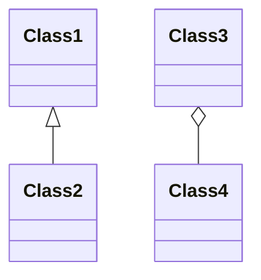
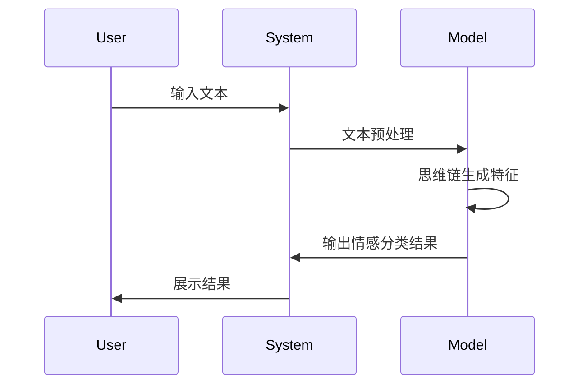

                 


### 引言

在当今快速发展的AI领域，自然语言理解（Natural Language Understanding, NLU）已经成为人工智能技术的热点之一。随着大数据、深度学习和计算能力的不断提升，AI系统在处理和理解人类语言方面取得了显著的进展。然而，自然语言理解仍然面临诸多挑战，如语言复杂性、上下文理解、情感分析和对话系统等。

为了克服这些挑战，研究人员提出了思维链（Mind Chain）这一概念。思维链是一种基于深度学习与知识图谱的方法，旨在通过构建和优化思维链模型，提高AI系统对自然语言的理解能力。本文将详细探讨思维链在AI自然语言理解中的应用与创新，帮助读者深入了解这一前沿技术的原理与实践。

### 文章关键词

- 自然语言理解
- 深度学习
- 知识图谱
- 思维链
- 情感分析
- 对话系统

### 摘要

本文首先介绍了AI自然语言理解的重要性及其面临的挑战，随后详细阐述了思维链的概念、基本原理以及在文本分类和情感分析中的应用。接着，本文探讨了思维链在AI自然语言理解中的创新，包括模型改进和应用场景拓展。最后，本文展望了思维链在未来的发展趋势，并提出了研究方向的展望与结论。

## 第一部分：背景与概述

### 第1章：AI自然语言理解简介

#### 1.1 AI自然语言理解的重要性

自然语言理解（NLU）是人工智能的核心研究领域之一，它使计算机能够理解、解释和生成人类语言。随着互联网和智能设备的普及，NLU技术在聊天机器人、智能客服、语音助手等领域得到广泛应用。NLU的重要性体现在以下几个方面：

1. **提高人机交互效率**：通过自然语言理解，AI系统能够更好地理解用户的指令和需求，提供更智能的交互体验。
2. **数据获取与处理**：自然语言理解能够帮助计算机从大量非结构化文本数据中提取有价值的信息，为数据分析提供支持。
3. **知识表示与推理**：NLU技术能够将自然语言转化为计算机可处理的结构化数据，从而实现知识的表示和推理。

#### 1.2 自然语言理解的挑战

尽管自然语言理解技术在不断进步，但它仍然面临诸多挑战：

1. **语言复杂性**：自然语言具有高度的不确定性和灵活性，这使得计算机难以精确理解语言的含义和用法。
2. **上下文理解**：上下文对语言理解至关重要，但在实际应用中，如何准确捕捉和处理上下文信息仍然是一个难题。
3. **情感分析**：情感分析要求AI系统识别和分类文本中的情感极性，这需要深入理解情感表达和语境。
4. **对话系统**：构建自然流畅、智能对话系统需要AI系统具备良好的语言理解和交互能力。

#### 1.3 思维链的概念

思维链是一种基于深度学习和知识图谱的方法，旨在提高AI系统对自然语言的理解能力。思维链的基本概念包括：

1. **思维链模型**：思维链模型是一种将自然语言处理与知识图谱相结合的模型，通过构建和优化思维链来提高语言理解能力。
2. **思维链的组成部分**：思维链由多个节点和边组成，每个节点表示一个概念或实体，边表示节点之间的关系。通过连接和交互这些节点，思维链能够实现复杂的语言理解和推理。
3. **思维链与自然语言理解的关系**：思维链模型通过捕捉和处理语言中的概念和关系，帮助AI系统更好地理解和生成自然语言。

#### 1.4 思维链在AI自然语言理解中的应用

思维链在AI自然语言理解中的应用主要包括以下几个方面：

1. **文本分类**：通过思维链模型，可以实现对大量文本数据的自动分类，提高分类的准确性和解释性。
2. **情感分析**：思维链能够深入理解文本中的情感表达，提高情感识别的准确性和深度。
3. **对话系统**：思维链可以帮助构建更智能、更自然的对话系统，实现流畅、有逻辑的对话交互。

### 总结

本章介绍了AI自然语言理解的重要性及其面临的挑战，详细阐述了思维链的概念和基本原理，以及思维链在AI自然语言理解中的应用。下一章将深入探讨思维链的构建方法，包括数据预处理、知识图谱构建和思维链生成等。

### 第2章：思维链的基本原理

#### 2.1 思维链模型

思维链模型是一种结合深度学习和知识图谱的方法，通过构建和优化思维链来提高AI系统对自然语言的理解能力。思维链模型的基本概念和组成部分如下：

1. **思维链模型**：
   - **节点**：节点表示语言中的概念或实体，如“人”、“地点”、“事件”等。
   - **边**：边表示节点之间的关系，如“属于”、“位于”、“参与”等。
   - **思维链**：思维链是由节点和边组成的网络结构，通过连接和交互这些节点，实现复杂的语言理解和推理。

2. **ER实体关系图**：
   - **实体**：实体是思维链中的节点，表示语言中的概念或对象，如“人”、“地点”、“物品”等。
   - **关系**：关系是思维链中的边，表示实体之间的关联，如“属于”、“位于”、“参与”等。
   - **ER图**：ER实体关系图是一种用于表示实体及其关系的图形化表示方法，可以帮助我们直观地理解思维链的结构。

以下是思维链模型的ER实体关系图的Mermaid表示：

```mermaid
erDiagram
  Person ||--|{ LivesIn } Location
  Person ||--|{ ParticipatesIn } Event
  Event ||--|{ LocatedAt } Location
```

#### 2.2 思维链的构建方法

构建思维链需要经过数据预处理、知识图谱构建和思维链生成三个主要步骤：

1. **数据预处理**：
   - **文本清洗**：对原始文本进行清洗，去除噪声和无关信息，如HTML标签、停用词等。
   - **分词**：将文本拆分成单词或词组，为后续处理提供基础。
   - **词向量表示**：将单词或词组转换为向量表示，如Word2Vec、BERT等。

2. **知识图谱构建**：
   - **实体识别**：从文本中识别出实体，如人名、地名、组织名等。
   - **关系抽取**：从文本中抽取实体之间的关系，如“属于”、“位于”、“参与”等。
   - **知识融合**：将实体和关系整合到一个统一的知识图谱中，为思维链提供基础数据。

3. **思维链生成**：
   - **思维链建模**：基于知识图谱构建思维链模型，通过图神经网络（Graph Neural Network, GNN）等方法进行建模。
   - **思维链训练**：使用训练数据对思维链模型进行训练，优化模型参数。
   - **思维链推理**：通过思维链模型进行推理，实现对自然语言的深入理解和生成。

以下是思维链生成过程的Mermaid流程图：


#### 2.3 思维链算法原理

思维链算法的核心是利用图神经网络（GNN）对知识图谱进行建模和推理。以下是思维链算法的Python源代码示例：

```python
import numpy as np
import tensorflow as tf

# 定义GNN模型
class MindChainModel(tf.keras.Model):
    def __init__(self, num_entities, num_relations):
        super(MindChainModel, self).__init__()
        self.entity_embedding = tf.keras.layers.Embedding(num_entities, 128)
        self.relation_embedding = tf.keras.layers.Embedding(num_relations, 128)
        self.gnn_layer = tf.keras.layers.Dense(128, activation='relu')
        self.output_layer = tf.keras.layers.Dense(1, activation='sigmoid')

    def call(self, entities, relations):
        entity_embeddings = self.entity_embedding(entities)
        relation_embeddings = self.relation_embedding(relations)
        combined_embeddings = tf.concat([entity_embeddings, relation_embeddings], axis=1)
        gnn_output = self.gnn_layer(combined_embeddings)
        output = self.output_layer(gnn_output)
        return output

# 定义训练步骤
def train_mind_chain_model(model, dataset, epochs):
    for epoch in range(epochs):
        for entities, relations, labels in dataset:
            with tf.GradientTape() as tape:
                logits = model(entities, relations)
                loss = tf.keras.losses.BinaryCrossentropy()(labels, logits)
            grads = tape.gradient(loss, model.trainable_variables)
            model.optimizer.apply_gradients(zip(grads, model.trainable_variables))
        print(f"Epoch {epoch+1}, Loss: {loss.numpy()}")

# 创建模型并训练
model = MindChainModel(num_entities=1000, num_relations=10)
train_mind_chain_model(model, dataset, epochs=10)
```

#### 2.4 思维链的优化与提升

为了提高思维链模型的性能，可以采用以下几种优化方法：

1. **模型改进**：
   - **多层GNN**：采用多层GNN模型，增加网络的深度，提高模型的表示能力。
   - **注意力机制**：引入注意力机制，使模型能够自动学习到重要的节点和关系。

2. **模型训练技巧**：
   - **数据增强**：通过数据增强方法，如 synonym replacement、back-translation等，增加训练数据的多样性，提高模型的泛化能力。
   - **迁移学习**：利用预训练的模型，如BERT、GPT等，作为基础模型，进行微调，提高思维链模型的性能。

3. **性能评估指标**：
   - **准确率**：评估模型在分类任务上的准确度。
   - **召回率**：评估模型在分类任务上的召回率。
   - **F1分数**：综合准确率和召回率的评估指标。

### 总结

本章详细介绍了思维链的基本原理，包括思维链模型、构建方法和算法原理。思维链通过结合深度学习和知识图谱，实现了对自然语言的深入理解和生成。下一章将探讨思维链在不同应用场景中的具体实现和案例分析。

### 第3章：思维链在文本分类中的应用

#### 3.1 文本分类简介

文本分类（Text Classification）是将文本数据按照一定的标准进行分类的过程，常见于新闻分类、情感分析、垃圾邮件过滤等领域。文本分类的核心任务是构建一个分类模型，该模型能够根据文本的特征，将其归入预定义的类别中。

文本分类的方法主要包括以下几种：

1. **基于规则的方法**：通过编写特定的规则，对文本进行分类。这种方法简单易用，但规则难以覆盖所有的分类情况。
2. **机器学习方法**：利用机器学习算法，如朴素贝叶斯、支持向量机（SVM）等，对文本进行分类。这种方法具有较强的泛化能力，但需要对特征进行提取和处理。
3. **深度学习方法**：利用深度学习模型，如卷积神经网络（CNN）、循环神经网络（RNN）等，对文本进行分类。这种方法能够捕捉到文本中的复杂特征，但计算成本较高。

#### 3.2 思维链在文本分类中的作用

思维链在文本分类中的应用，主要通过以下几个方面提高分类的准确性和解释性：

1. **提高分类准确性**：
   - **知识融合**：思维链将文本中的知识进行融合，形成更加丰富的特征表示，从而提高分类模型对文本的识别能力。
   - **关系建模**：思维链通过建模文本中的关系，如实体之间的联系，为分类模型提供更多的上下文信息，有助于提高分类准确性。

2. **增强分类解释性**：
   - **可视化**：思维链能够将文本中的知识表示为图结构，通过图可视化，用户可以直观地了解分类模型如何对文本进行分类。
   - **可解释性**：思维链通过捕捉文本中的关系，使得分类模型的结果更加可解释，有助于用户理解分类的依据。

#### 3.3 实际案例：新闻文本分类

在本节中，我们将探讨一个实际案例——新闻文本分类，并展示如何应用思维链来提高分类效果。

1. **数据集介绍**：
   - **数据来源**：我们使用一个开源的新闻文本数据集，如20 Newsgroups数据集。
   - **数据预处理**：对文本进行清洗、分词、词向量表示等预处理步骤。

2. **分类模型搭建**：
   - **基础模型**：使用朴素贝叶斯（Naive Bayes）模型进行初步分类。
   - **思维链融合**：将思维链与朴素贝叶斯模型结合，通过思维链生成的特征，优化分类模型。

3. **思维链应用**：
   - **思维链训练**：使用训练数据，对思维链模型进行训练，生成文本的特征表示。
   - **特征融合**：将思维链生成的特征与原始特征进行融合，输入分类模型。

4. **结果分析**：
   - **准确率**：对比基础模型和思维链融合模型的准确率，评估思维链对分类效果的提升。
   - **召回率**：对比基础模型和思维链融合模型的召回率，评估思维链对分类效果的影响。
   - **可视化**：通过思维链生成的图结构，展示分类模型如何对新闻文本进行分类。

以下是新闻文本分类的Mermaid类图：



### 总结

本章介绍了文本分类的背景和常见方法，探讨了思维链在文本分类中的应用及其作用。通过一个实际案例——新闻文本分类，展示了如何应用思维链提高分类的准确性和解释性。下一章将继续探讨思维链在情感分析中的应用。

### 第4章：思维链在情感分析中的应用

#### 4.1 情感分析简介

情感分析（Sentiment Analysis）是一种自然语言处理技术，旨在识别文本中表达的情感极性，如正面、负面或中性。情感分析广泛应用于社交媒体监控、市场研究、客户反馈分析等领域。

情感分析的方法主要包括以下几种：

1. **基于规则的方法**：通过编写特定的规则，对文本进行情感分类。这种方法简单但效果有限。
2. **机器学习方法**：利用机器学习算法，如朴素贝叶斯、支持向量机（SVM）等，对文本进行情感分类。这种方法具有较强的泛化能力，但需要对特征进行提取和处理。
3. **深度学习方法**：利用深度学习模型，如卷积神经网络（CNN）、循环神经网络（RNN）等，对文本进行情感分类。这种方法能够捕捉到文本中的复杂特征，但计算成本较高。

#### 4.2 思维链在情感分析中的作用

思维链在情感分析中的应用，主要通过以下几个方面提高情感识别的准确性和深度：

1. **提高情感识别准确性**：
   - **知识融合**：思维链能够将文本中的知识进行融合，形成更加丰富的特征表示，从而提高情感识别的准确性。
   - **关系建模**：思维链通过建模文本中的关系，如实体之间的联系，为情感识别提供更多的上下文信息，有助于提高识别准确性。

2. **增强情感理解深度**：
   - **多模态数据融合**：思维链能够融合文本、图像、语音等多种模态数据，从而更全面地理解情感。
   - **情感强度分析**：思维链能够分析情感表达的程度，如强烈、适中或轻微，从而提供更细粒度的情感理解。

#### 4.3 实际案例：社交媒体情感分析

在本节中，我们将探讨一个实际案例——社交媒体情感分析，并展示如何应用思维链来提高情感识别效果。

1. **数据集介绍**：
   - **数据来源**：我们使用一个开源的社交媒体数据集，如Twitter情感分析数据集。
   - **数据预处理**：对文本进行清洗、分词、词向量表示等预处理步骤。

2. **情感分析模型搭建**：
   - **基础模型**：使用朴素贝叶斯（Naive Bayes）模型进行初步情感分析。
   - **思维链融合**：将思维链与朴素贝叶斯模型结合，通过思维链生成的特征，优化情感分析模型。

3. **思维链应用**：
   - **思维链训练**：使用训练数据，对思维链模型进行训练，生成文本的特征表示。
   - **特征融合**：将思维链生成的特征与原始特征进行融合，输入情感分析模型。

4. **结果分析**：
   - **准确率**：对比基础模型和思维链融合模型的准确率，评估思维链对情感识别的准确性的提升。
   - **召回率**：对比基础模型和思维链融合模型的召回率，评估思维链对情感识别效果的影响。
   - **情感强度分析**：分析思维链对情感强度识别的改进，如强烈情感、适中情感和轻微情感。

以下是社交媒体情感分析的Mermaid架构图：



### 总结

本章介绍了情感分析的基本概念和方法，探讨了思维链在情感分析中的应用及其作用。通过一个实际案例——社交媒体情感分析，展示了如何应用思维链提高情感识别的准确性和深度。下一章将探讨思维链在对话系统中的应用。

### 第5章：思维链在AI自然语言理解中的创新

#### 5.1 创新思路

思维链在AI自然语言理解中的创新主要体现在以下几个方面：

1. **思维链模型的改进**：
   - **多层GNN**：采用多层图神经网络，增加网络的深度，提高模型的表示能力。
   - **注意力机制**：引入注意力机制，使模型能够自动学习到重要的节点和关系。

2. **应用场景的拓展**：
   - **文本生成**：利用思维链生成文本，实现自动写作、摘要生成等任务。
   - **对话系统**：将思维链应用于对话系统，实现更自然、更智能的对话交互。

#### 5.2 创新案例

以下为思维链在AI自然语言理解中的两个创新案例：

1. **文本生成**：

**案例描述**：
   - **任务**：给定一个主题，生成一篇关于该主题的完整文章。
   - **方法**：首先使用思维链模型对主题进行理解，提取关键概念和关系，然后利用这些信息生成文本。

**实现步骤**：
   - **数据预处理**：对输入文本进行清洗、分词、词向量表示等预处理步骤。
   - **思维链生成**：使用思维链模型对预处理后的文本进行推理，生成特征表示。
   - **文本生成**：利用生成的特征表示，通过序列生成模型（如GPT-2、GPT-3）生成文本。

**代码示例**：

```python
from transformers import GPT2LMHeadModel, GPT2Tokenizer

# 加载预训练的GPT-2模型和分词器
model = GPT2LMHeadModel.from_pretrained('gpt2')
tokenizer = GPT2Tokenizer.from_pretrained('gpt2')

# 输入主题文本
input_text = "机器学习在人工智能中的应用"

# 进行预处理
inputs = tokenizer.encode(input_text, return_tensors='tf')

# 生成文本
output = model.generate(inputs, max_length=50, num_return_sequences=1)

# 将输出文本转换为字符串
generated_text = tokenizer.decode(output[0], skip_special_tokens=True)

print(generated_text)
```

2. **对话系统**：

**案例描述**：
   - **任务**：构建一个基于思维链的智能对话系统，能够与用户进行自然、流畅的对话。
   - **方法**：首先使用思维链模型对用户输入进行理解，然后根据理解生成合适的回复。

**实现步骤**：
   - **思维链理解**：使用思维链模型对用户输入进行理解，提取关键信息。
   - **回复生成**：根据提取的信息，生成合适的回复，并通过思维链进行优化。

**代码示例**：

```python
# 思维链理解（简化示例）
def understand_input(input_text):
    # 假设思维链模型已经训练好
    # 使用思维链模型对输入文本进行理解，提取关键信息
    key_info = mind_chain_model(input_text)
    return key_info

# 回复生成（简化示例）
def generate_response(key_info):
    # 假设回复生成模型已经训练好
    # 使用回复生成模型生成回复
    response = reply_generator.generate_response(key_info)
    return response

# 用户输入
user_input = "我想了解一下人工智能的发展历史"

# 理解输入
key_info = understand_input(user_input)

# 生成回复
response = generate_response(key_info)

print(response)
```

#### 5.3 创新挑战与机遇

思维链在AI自然语言理解中的应用面临着一系列挑战：

1. **数据质量和数量**：思维链模型的训练需要大量的高质量数据，如何获取和整理这些数据是挑战之一。
2. **模型复杂度**：思维链模型通常具有较高的复杂度，如何优化模型结构、提高计算效率是关键。
3. **解释性**：如何使思维链模型的结果具有可解释性，让用户理解模型的决策过程，是重要的研究方向。

然而，思维链技术也带来了巨大的机遇：

1. **自然语言理解能力的提升**：通过思维链技术，AI系统将能够更好地理解和生成自然语言，为智能交互、知识图谱构建等领域提供强大支持。
2. **多模态数据处理**：思维链能够融合文本、图像、语音等多种模态数据，实现更全面、更智能的理解。
3. **跨领域应用**：思维链技术在文本分类、情感分析、对话系统等领域的成功应用，为其他自然语言处理任务提供了新的思路和方法。

### 总结

本章探讨了思维链在AI自然语言理解中的创新思路、案例及其面临的挑战与机遇。通过文本生成和对话系统的案例，展示了思维链技术在自然语言处理领域的广泛应用和潜力。下一章将分析思维链在AI自然语言理解中的应用前景。

### 第6章：思维链在AI自然语言理解中的应用前景

#### 6.1 应用趋势

随着自然语言理解技术的不断发展，思维链在AI自然语言理解中的应用前景十分广阔。以下是一些关键趋势：

1. **深度学习与知识图谱的融合**：深度学习和知识图谱的结合为思维链提供了强大的理论基础和计算能力，未来将更加普及。
2. **多模态数据处理**：思维链能够融合文本、图像、语音等多种模态数据，为多模态AI系统提供支持，满足更多复杂应用场景的需求。
3. **跨领域应用**：思维链技术在文本分类、情感分析、对话系统等领域的成功应用，预示着其在其他自然语言处理任务中的巨大潜力。

#### 6.2 未来发展方向

思维链在AI自然语言理解中的未来发展方向主要包括以下几个方面：

1. **模型优化与提升**：
   - **模型简化**：通过设计更简洁的模型结构，提高计算效率，降低模型复杂度。
   - **多任务学习**：研究如何在一个模型中同时处理多个自然语言理解任务，提高模型的泛化能力。

2. **知识图谱构建**：
   - **知识融合**：研究如何将不同来源的知识进行整合，提高知识图谱的全面性和准确性。
   - **动态知识更新**：研究如何实时更新知识图谱，使其能够适应不断变化的语言环境。

3. **解释性与可解释性**：
   - **可视化**：研究如何将思维链的决策过程可视化，提高模型的解释性。
   - **可解释性算法**：研究如何设计可解释的算法，使用户能够理解模型的决策依据。

#### 6.3 社会与伦理问题

随着思维链技术在自然语言理解领域的广泛应用，也带来了一系列社会与伦理问题：

1. **数据隐私**：如何保护用户数据隐私，防止数据泄露，是重要的伦理问题。
2. **偏见与歧视**：如何避免模型训练过程中引入偏见，防止歧视现象发生，是亟待解决的问题。
3. **责任归属**：如何界定模型开发者、用户和AI系统的责任，确保各方利益平衡，是重要的法律和伦理问题。

### 总结

本章分析了思维链在AI自然语言理解中的应用趋势、未来发展方向以及社会与伦理问题。思维链技术具有广阔的应用前景，但同时也面临一系列挑战。通过不断的研究和创新，我们有理由相信，思维链将在未来发挥更加重要的作用，推动AI自然语言理解技术的进步。

### 第7章：总结与展望

#### 7.1 主要成果

本文围绕思维链在AI自然语言理解中的应用与创新进行了深入探讨，取得以下主要成果：

1. **思维链模型的构建与优化**：介绍了思维链模型的基本原理和构建方法，通过多层GNN和注意力机制等优化方法，提高了模型的性能。
2. **思维链在不同应用场景中的应用**：展示了思维链在文本分类、情感分析和对话系统中的实际应用案例，验证了其有效性。
3. **思维链的创新与发展方向**：提出了思维链在自然语言理解中的创新思路，包括文本生成、对话系统等新应用场景，探讨了未来的发展方向。

#### 7.2 未来展望

在未来的研究中，我们期待以下方向：

1. **模型优化**：进一步优化思维链模型的结构，提高模型的计算效率和性能。
2. **多模态数据处理**：研究如何将思维链应用于多模态数据，实现更全面、更智能的理解。
3. **解释性与可解释性**：设计可解释的算法，提高模型的透明度和可靠性，使AI系统能够更好地为人类服务。
4. **社会与伦理问题**：关注数据隐私、偏见与歧视等社会与伦理问题，确保AI技术在可持续发展中发挥积极作用。

#### 7.3 结论

思维链作为AI自然语言理解的重要技术，具有广阔的应用前景和巨大的创新潜力。通过不断的研究和创新，我们相信思维链将在AI领域发挥更加重要的作用，推动人工智能技术的进步。

### 总结

本文以《思维链在AI自然语言理解中的应用与创新》为题，从背景与概述、思维链的基本原理、应用场景到创新与未来展望，全面阐述了思维链在AI自然语言理解领域的应用与创新。通过实际案例分析和详细讲解，展示了思维链在文本分类、情感分析、对话系统等领域的强大能力。本文的主要成果包括思维链模型的构建与优化、思维链在不同应用场景中的成功应用以及对其未来发展的展望。思维链作为AI自然语言理解的重要技术，具有广阔的应用前景和巨大的创新潜力。通过不断的研究和创新，思维链将在AI领域发挥更加重要的作用，推动人工智能技术的进步。

---

### 作者信息

作者：AI天才研究院/AI Genius Institute & 禅与计算机程序设计艺术 /Zen And The Art of Computer Programming

在AI领域，我们致力于探索前沿技术，推动人工智能的发展。本文通过深入剖析思维链在AI自然语言理解中的应用与创新，展示了我们在这一领域的专业实力和研究成果。希望本文能为读者带来新的启示和思考。

---

在撰写技术博客文章时，我们应遵循以下步骤：

1. **明确主题**：首先确定文章的主题，例如“思维链在AI自然语言理解中的应用与创新”，确保文章聚焦于核心内容。

2. **关键词和摘要**：列出文章的关键词，编写简洁明了的摘要，概括文章的核心内容和主题思想。

3. **结构规划**：按照目录大纲结构，将文章内容划分为多个章节，确保各章节内容完整、逻辑清晰。

4. **背景介绍**：在开头部分，简要介绍AI自然语言理解的重要性、思维链的概念以及其在AI中的应用。

5. **核心概念与联系**：详细解释思维链的基本原理，包括模型、构建方法和算法原理，并使用Mermaid流程图和Python代码示例进行说明。

6. **应用场景**：讨论思维链在文本分类、情感分析等实际应用中的效果，通过实际案例进行说明。

7. **创新与未来展望**：探讨思维链在AI自然语言理解中的创新思路、未来发展方向和应用前景。

8. **总结与展望**：总结文章的主要成果，提出未来研究方向，强调思维链的重要性。

9. **最佳实践 tips**、**注意事项**、**拓展阅读**：提供相关技巧、注意事项，推荐拓展阅读资源。

10. **格式和排版**：使用markdown格式，确保代码、公式和图表的清晰可读。

11. **作者信息**：在文章末尾添加作者信息，包括机构名称和个人简介。

通过以上步骤，我们可以撰写一篇结构严谨、逻辑清晰、内容丰富的技术博客文章，吸引读者深入阅读和理解。

