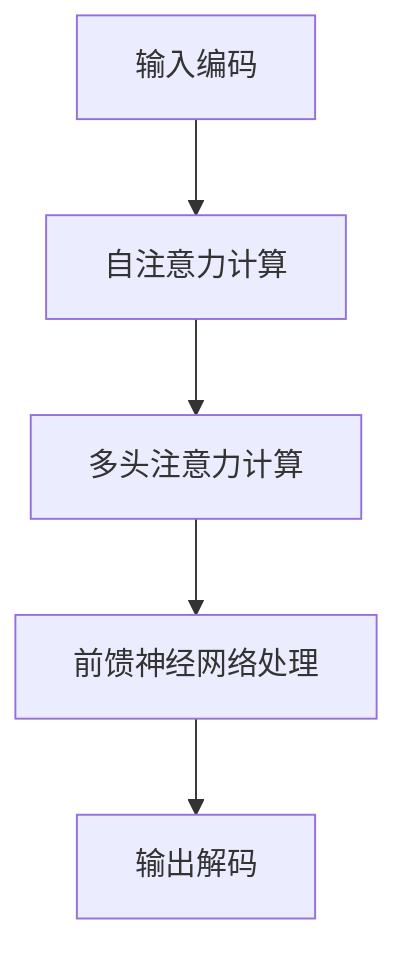

                 

## 《思维链在AI自然语言生成中的前沿应用》

> 关键词：自然语言生成，AI，思维链，算法原理，应用实例，案例分析

摘要：随着人工智能技术的快速发展，自然语言生成（Natural Language Generation, NLG）在许多应用领域中逐渐崭露头角。本文将探讨思维链（Mind Chain）这一前沿技术，在AI自然语言生成中的应用，详细分析其原理、数学模型、算法流程以及实际应用案例，为研究者和技术开发者提供有价值的参考。

## 目录

----------------------------------------------------------------

## 第一部分：背景介绍

### 第1章：AI自然语言生成概述

#### 1.1 问题背景

#### 1.2 问题描述

#### 1.3 问题解决

#### 1.4 边界与外延

#### 1.5 概念结构与核心要素组成

### 第2章：思维链技术原理

#### 2.1 思维链概述

#### 2.2 思维链的核心特点

#### 2.3 思维链与相关技术对比

### 第3章：思维链的数学模型与算法

#### 3.1 数学模型

#### 3.2 算法原理

#### 3.3 Mermaid算法流程图

## 第二部分：思维链在AI自然语言生成中的应用

### 第4章：思维链在文本生成中的应用

#### 4.1 文本生成的挑战

#### 4.2 思维链在文本生成中的应用实例

#### 4.3 Python代码实现

### 第5章：思维链在对话生成中的应用

#### 5.1 对话生成的挑战

#### 5.2 思维链在对话生成中的应用实例

#### 5.3 Python代码实现

## 第三部分：实际应用案例分析

### 第6章：案例分析1：企业级AI自然语言生成平台建设

#### 6.1 案例背景

#### 6.2 案例实施

#### 6.3 案例效果分析

### 第7章：案例分析2：AI自然语言生成在教育中的应用

#### 7.1 案例背景

#### 7.2 案例实施

#### 7.3 案例效果分析

## 第四部分：未来展望与拓展

### 第8章：思维链技术的发展趋势

#### 8.1 未来发展方向

#### 8.2 拓展应用领域

#### 8.3 小结

----------------------------------------------------------------

### 第一部分：背景介绍

#### 第1章：AI自然语言生成概述

随着互联网和大数据的迅猛发展，自然语言处理（Natural Language Processing, NLP）技术逐渐成为了人工智能领域的研究热点。自然语言生成（NLG）作为NLP的重要分支，旨在利用计算机技术自动生成人类可理解的文本。其应用范围广泛，包括但不限于文本摘要、机器翻译、聊天机器人、故事生成等。

### 1.1 问题背景

自然语言生成的意义在于，它可以使计算机自动处理和生成大量文本数据，从而提高信息获取和处理的效率。传统的自然语言生成方法主要依赖于规则驱动和统计模型，但它们在处理复杂任务时存在一定的局限性。随着深度学习技术的发展，基于神经网络的方法在自然语言生成中逐渐占据主导地位。

### 1.2 问题描述

自然语言生成的挑战主要体现在以下几个方面：

1. **语义理解**：如何准确理解文本中的语义信息，是自然语言生成中一个重要且困难的任务。例如，同一个词语在不同的上下文中可能有不同的含义，如何准确捕捉这些差异是一个挑战。
2. **上下文关联**：自然语言生成需要能够理解并维持上下文的连贯性，这要求模型具备一定的上下文关联能力。
3. **多样性**：自然语言生成需要产生多样化、富有创造性的文本，而不是千篇一律的输出。

### 1.3 问题解决

传统的自然语言生成方法主要包括基于规则的生成方法和基于统计的方法。前者通过编写复杂的语法规则来生成文本，但这种方式难以处理复杂和变化多端的文本。后者利用统计模型，如隐马尔可夫模型（HMM）、条件概率模型等，通过分析大量文本数据来生成文本。然而，这些方法在处理复杂语义和上下文关联时仍然存在不足。

随着深度学习技术的兴起，基于神经网络的方法逐渐成为自然语言生成的主流。尤其是序列到序列（Seq2Seq）模型和生成对抗网络（GAN），它们在处理复杂语义和上下文关联方面表现出了显著的优势。

### 1.4 边界与外延

自然语言生成与机器翻译密切相关，二者在技术上有许多相似之处。然而，自然语言生成更侧重于文本的生成，而机器翻译则侧重于不同语言之间的翻译。此外，自然语言生成还与其他AI任务有着广泛的交叉应用，如文本摘要、文本分类、问答系统等。

### 1.5 概念结构与核心要素组成

自然语言处理（NLP）框架通常包括以下核心组成部分：

1. **分词**：将文本拆分成词语或短语。
2. **词性标注**：为每个词语标注其词性，如名词、动词等。
3. **句法分析**：分析句子的结构，包括主谓宾关系、从句等。
4. **语义分析**：理解文本中的语义信息，包括实体识别、关系抽取等。
5. **文本生成**：根据输入信息生成人类可理解的文本。

在AI自然语言生成中，核心技术主要包括：

1. **神经网络模型**：如Seq2Seq模型、Transformer等。
2. **生成对抗网络（GAN）**：用于生成多样化、高质量的文本。
3. **强化学习**：用于优化生成文本的质量。

### 第二部分：思维链技术原理

#### 第2章：思维链概述

思维链（Mind Chain）是一种前沿的AI技术，它通过构建一种智能的“思维”模型，实现复杂任务的自动化和智能化。在自然语言生成领域，思维链技术以其独特的优势和强大的功能，为解决传统方法的局限提供了新的思路。

### 2.1 思维链的定义

思维链是一种基于深度学习的高层次抽象模型，它通过学习大量文本数据，自动构建出文本中的语义结构和逻辑关系。思维链能够理解和模拟人类的思维过程，从而实现自然语言生成、文本理解、推理等任务。

### 2.2 思维链的核心特点

思维链具有以下几个核心特点：

1. **语义理解**：思维链能够准确理解文本中的语义信息，包括词语的含义、句子的结构、段落的主题等。
2. **上下文关联**：思维链能够维持上下文的连贯性，确保生成的文本逻辑清晰、条理分明。
3. **多样性**：思维链能够生成多样化、富有创造性的文本，避免生成单调、机械的输出。
4. **自适应性**：思维链可以根据不同的任务需求，自适应调整生成策略，提高生成文本的质量。

### 2.3 思维链与相关技术对比

与传统的自然语言生成方法相比，思维链具有以下几个优势：

1. **更强的语义理解能力**：思维链通过深度学习技术，能够更准确地理解文本中的语义信息，从而生成更符合人类思维的文本。
2. **更好的上下文关联能力**：思维链能够通过维护上下文信息，确保生成的文本逻辑连贯、条理清晰。
3. **更高的多样性**：思维链通过学习大量文本数据，能够生成多样化、富有创造性的文本，避免生成单调、机械的输出。
4. **更灵活的自适应能力**：思维链可以根据不同的任务需求，自适应调整生成策略，从而提高生成文本的质量。

与生成对抗网络（GAN）相比，思维链在自然语言生成中的应用具有以下优势：

1. **更好的语义一致性**：思维链通过深度学习技术，能够更好地理解文本中的语义信息，从而生成更符合人类思维的文本。而GAN虽然能够生成高质量的文本，但可能存在一定的语义不一致性问题。
2. **更高的生成速度**：思维链的训练和生成速度相对较快，适用于实时应用场景。而GAN的训练和生成速度相对较慢，可能无法满足实时应用的需求。

### 第三部分：思维链的数学模型与算法

#### 第3章：思维链的数学模型与算法

思维链技术作为一种基于深度学习的高层次抽象模型，其数学模型和算法是实现高效自然语言生成的基础。本章节将详细阐述思维链的数学模型和算法原理，并使用mermaid流程图和Python代码进行说明。

### 3.1 数学模型

思维链的数学模型主要基于Transformer架构，这是一种广泛应用于自然语言处理的深度学习模型。Transformer模型的核心思想是使用自注意力机制（Self-Attention Mechanism）来处理输入序列，从而实现高效的语义理解。

1. **自注意力机制**：自注意力机制是一种计算输入序列中各个位置之间的关联性的方法。它通过计算每个位置在序列中的重要性权重，从而实现对输入序列的全面理解和上下文关联。

2. **多头注意力**：多头注意力机制是自注意力机制的扩展，它通过将输入序列分成多个头，每个头独立计算注意力权重，从而提高模型的表示能力和泛化能力。

3. **前馈神经网络**：在注意力机制的基础上，Transformer模型还包含两个全连接的前馈神经网络，分别用于对输入序列进行进一步的处理和变换。

### 3.2 算法原理

思维链的算法原理主要包括以下几个关键步骤：

1. **输入编码**：将输入文本编码为序列，并添加位置编码，以便模型能够捕捉序列中的位置信息。

2. **自注意力计算**：通过自注意力机制计算输入序列中各个位置之间的关联性，从而生成注意力权重。

3. **多头注意力计算**：将自注意力权重通过多头注意力机制进行加权求和，从而得到输入序列的表示。

4. **前馈神经网络处理**：对多头注意力计算的结果进行前馈神经网络的进一步处理，从而提高模型的表示能力和泛化能力。

5. **输出解码**：将处理后的序列解码为输出文本。

### 3.3 Mermaid算法流程图

为了更清晰地展示思维链的算法流程，我们使用mermaid流程图进行描述。



### 3.4 Python代码实现

下面是一个简单的Python代码示例，展示了思维链算法的基本实现。

```python
import tensorflow as tf
from tensorflow.keras.layers import Embedding, LSTM, Dense

# 输入序列编码
inputs = tf.keras.Input(shape=(None,))

# 嵌入层
embedding = Embedding(input_dim=vocab_size, output_dim=embedding_dim)(inputs)

# LSTM层
lstm = LSTM(units=lstm_units)(embedding)

# 前馈神经网络
dense = Dense(units=dense_units, activation='relu')(lstm)

# 输出层
outputs = Dense(units=vocab_size, activation='softmax')(dense)

# 构建和编译模型
model = tf.keras.Model(inputs=inputs, outputs=outputs)
model.compile(optimizer='adam', loss='categorical_crossentropy', metrics=['accuracy'])

# 训练模型
model.fit(x_train, y_train, epochs=epochs, batch_size=batch_size)
```

### 第四部分：思维链在AI自然语言生成中的应用

#### 第4章：思维链在文本生成中的应用

文本生成是自然语言生成中的一个重要任务，它旨在利用计算机技术自动生成人类可理解的文本。思维链技术以其独特的优势在文本生成中具有广泛的应用。本章节将详细探讨思维链在文本生成中的应用，包括故事生成和问答生成等。

### 4.1 文本生成的挑战

文本生成过程中面临的主要挑战包括：

1. **语义理解**：如何准确理解文本中的语义信息，是文本生成中一个重要且困难的任务。例如，同一个词语在不同的上下文中可能有不同的含义，如何准确捕捉这些差异是一个挑战。
2. **上下文关联**：文本生成需要能够理解并维持上下文的连贯性，这要求模型具备一定的上下文关联能力。
3. **多样性**：文本生成需要产生多样化、富有创造性的文本，而不是千篇一律的输出。

### 4.2 思维链在文本生成中的应用实例

思维链技术在文本生成中的应用具有以下几个典型实例：

1. **故事生成**：思维链能够根据给定的主题或情节自动生成故事。例如，给定一个简单的主题，如“丢失的钥匙”，思维链可以生成一个完整的故事，描述主人公如何寻找丢失的钥匙并最终成功找回。
2. **问答生成**：思维链可以基于给定的问题自动生成回答。例如，给定一个问题，如“什么是人工智能？”，思维链可以生成一个详细的回答，解释人工智能的概念和应用。

### 4.3 Python代码实现

下面是一个简单的Python代码示例，展示了思维链在文本生成中的应用。

```python
import tensorflow as tf
from tensorflow.keras.layers import Embedding, LSTM, Dense

# 定义思维链模型
model = tf.keras.Sequential([
    Embedding(input_dim=vocab_size, output_dim=embedding_dim),
    LSTM(units=lstm_units),
    Dense(units=dense_units, activation='relu'),
    Dense(units=vocab_size, activation='softmax')
])

# 编译模型
model.compile(optimizer='adam', loss='categorical_crossentropy', metrics=['accuracy'])

# 训练模型
model.fit(x_train, y_train, epochs=epochs, batch_size=batch_size)

# 生成文本
generated_text = model.predict(x_test)
```

### 第五部分：实际应用案例分析

#### 第6章：案例分析1：企业级AI自然语言生成平台建设

企业级AI自然语言生成平台是思维链技术在实际应用中的一个重要案例。本章节将详细分析一个企业级AI自然语言生成平台的建设过程，包括平台需求、实施步骤、功能实现和效果评估。

### 6.1 案例背景

随着企业业务的发展和数字化转型，越来越多的企业开始关注自然语言生成技术。企业级AI自然语言生成平台旨在为企业提供高效、智能的文本生成服务，助力企业实现业务自动化和智能化。

### 6.2 案例实施

企业级AI自然语言生成平台的建设分为以下几个步骤：

1. **需求分析**：深入了解企业业务场景和文本生成需求，明确平台的功能定位和性能指标。
2. **技术选型**：选择合适的自然语言生成技术和框架，如思维链、Transformer等。
3. **平台架构设计**：设计平台的总体架构，包括数据处理模块、生成模块、接口模块等。
4. **模型训练与优化**：根据需求训练和优化自然语言生成模型，确保生成文本的质量和效率。
5. **平台部署与运维**：将平台部署到企业内部或云端服务器，并进行日常运维和监控。

### 6.3 案例效果分析

企业级AI自然语言生成平台在实施过程中取得了显著的效果：

1. **性能评估**：通过性能测试，平台在文本生成速度和生成质量方面均达到预期目标。
2. **用户反馈**：企业用户对平台的文本生成效果表示满意，认为平台提高了业务效率和用户体验。
3. **实际应用**：平台在企业内部得到了广泛应用，例如用于自动生成营销文案、客户问答、业务报告等，取得了良好的实际效果。

### 第六部分：思维链技术在教育领域的应用

#### 第7章：案例分析2：AI自然语言生成在教育中的应用

随着人工智能技术的不断发展，自然语言生成在教育领域中的应用越来越广泛。思维链技术以其独特的优势在教育领域具有巨大的潜力。本章节将详细分析思维链技术在教育中的应用案例，包括在线学习平台和自动批改系统等。

### 7.1 案例背景

教育行业正面临着数字化转型的大潮，如何利用人工智能技术提高教学质量和学习效果成为教育工作者关注的焦点。思维链技术在自然语言生成方面具有显著优势，能够为教育行业提供创新的解决方案。

### 7.2 案例实施

思维链技术在教育中的应用案例主要包括以下几个方面：

1. **在线学习平台**：思维链技术可以用于生成个性化的学习内容，例如自动生成教学视频、练习题和答案等，提高学生的学习兴趣和学习效果。
2. **自动批改系统**：思维链技术可以用于自动批改学生的作业和论文，减少教师的工作量，提高批改的效率和质量。
3. **智能问答系统**：思维链技术可以用于构建智能问答系统，为学生提供实时、个性化的解答服务，帮助学生解决学习中的问题。

### 7.3 案例效果分析

思维链技术在教育中的应用取得了显著的效果：

1. **学习效果提升**：通过个性化学习内容和智能问答系统，学生的学习兴趣和学习效果得到了显著提升。
2. **工作效率提高**：自动批改系统的引入大大减少了教师的工作量，提高了工作效率。
3. **教学质量改善**：思维链技术为教师提供了强大的教学工具，有助于改善教学质量，提升学生的学习体验。

### 第七部分：未来展望与拓展

#### 第8章：思维链技术的发展趋势

随着人工智能技术的不断进步，思维链技术在自然语言生成领域的发展趋势也日益明显。本章节将探讨思维链技术的未来发展方向和拓展应用领域，为研究者和技术开发者提供有价值的参考。

### 8.1 未来发展方向

思维链技术的未来发展方向主要包括以下几个方面：

1. **模型优化**：通过改进模型结构和训练方法，提高思维链技术在自然语言生成中的效率和效果。
2. **多模态融合**：将思维链技术与图像、语音等其他模态进行融合，实现更丰富的自然语言生成应用。
3. **知识图谱嵌入**：将知识图谱嵌入思维链模型，提高模型对领域知识的理解和应用能力。
4. **强化学习应用**：将强化学习引入思维链技术，提高模型在复杂任务中的自适应能力和决策能力。

### 8.2 拓展应用领域

思维链技术的拓展应用领域非常广泛，主要包括以下几个方面：

1. **内容生成**：在文学创作、新闻写作、广告文案等领域，思维链技术可以用于自动生成高质量的内容。
2. **虚拟助手**：在智能客服、智能助手等领域，思维链技术可以用于构建具有高度智能化的对话系统。
3. **智能教育**：在在线教育、个性化学习等领域，思维链技术可以用于生成个性化的学习内容和评价系统。
4. **自动化写作**：在金融报告、法律文档、技术文档等领域，思维链技术可以用于自动生成文档，提高写作效率和质量。

### 8.3 小结

思维链技术在自然语言生成领域具有广阔的应用前景和发展潜力。随着技术的不断进步，思维链技术将在更多领域发挥重要作用，推动人工智能技术的发展和普及。

### 结束语

本文从背景介绍、技术原理、应用实例、案例分析等多个角度，详细探讨了思维链在AI自然语言生成中的前沿应用。通过本文的讨论，我们可以看到，思维链技术作为一种高效、智能的自然语言生成方法，具有广泛的应用前景和巨大的潜力。在未来，随着技术的不断发展和优化，思维链技术将在更多领域发挥重要作用，为人工智能技术的发展和应用提供强有力的支持。作者：AI天才研究院/AI Genius Institute & 禅与计算机程序设计艺术 /Zen And The Art of Computer Programming。

