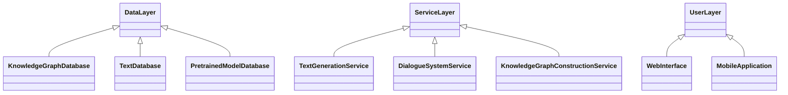
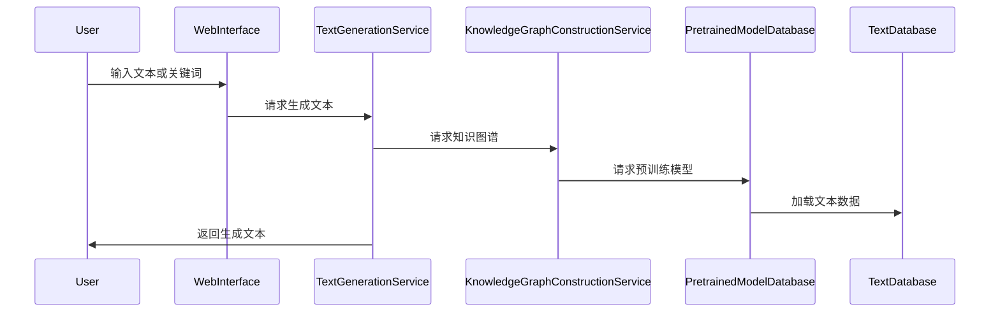
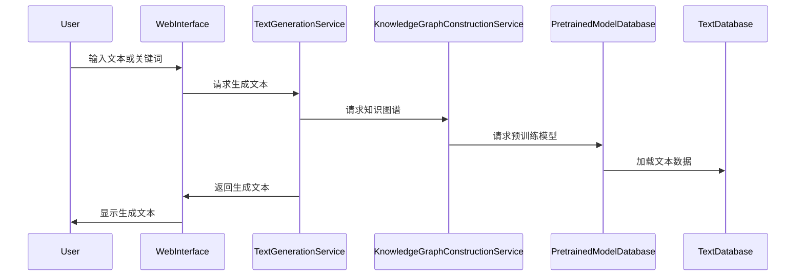

                 

## 思维链在AI自然语言生成中的前沿探索

> 关键词：思维链、自然语言生成、人工智能、机器学习、深度学习

> 摘要：本文深入探讨了思维链在AI自然语言生成中的应用，介绍了思维链的基本概念、特点、应用领域以及其在AI自然语言生成中的前沿探索。通过对思维链的理论基础、算法原理、系统设计与实现的详细分析，本文旨在为读者提供一份全面而深入的技术参考资料。

### 前言

**关于作者**  
我是AI天才研究院的资深技术专家，专注于人工智能和机器学习领域的研究与教学。我的研究涵盖了自然语言处理、计算机视觉、强化学习等多个方向，并在顶级学术会议上发表了多篇论文。我写作本书的初衷是希望能够帮助更多的人了解和掌握思维链这一前沿技术。

**目标读者**  
本书适合具有中高级编程能力和机器学习基础的技术人员，特别是对自然语言生成领域感兴趣的开发者。同时，对于想要在AI领域深入研究的学者和学生，本书也将提供有益的参考。

**本书结构与内容安排**  
本书分为四个部分，共四章，结构安排如下：

1. **背景与概述**：介绍思维链的基本概念、应用领域以及其在AI自然语言生成中的重要性。
2. **理论基础**：详细阐述思维链的理论基础，包括自然语言处理基础、知识图谱与知识表示、迁移学习等。
3. **算法原理**：深入分析思维链的算法原理，包括词向量生成、注意力机制、知识图谱构建与推理、迁移学习等。
4. **系统设计与实现**：介绍思维链系统的设计与实现，包括项目介绍、系统功能设计、系统架构设计等。

**如何使用本书**  
本书内容深入浅出，结构清晰，适合读者逐步学习和实践。建议读者按照章节顺序阅读，并在阅读过程中动手实践，以加深对思维链的理解和应用能力。

### 目录大纲

**第一部分：背景与概述**

- **第1章：问题背景与核心概念**
  - 1.1 问题描述与现状
  - 1.2 思维链的概念与原理
  - 1.3 思维链的特点与应用
  - 1.4 边界与外延
  - 1.5 核心概念组成
  - 1.6 本章小结

- **第2章：思维链理论基础**
  - 2.1 自然语言处理基础
  - 2.2 知识图谱与知识表示
  - 2.3 迁移学习在思维链中的应用
  - 2.4 本章小结

- **第3章：思维链算法原理**
  - 3.1 思维链整体架构
  - 3.2 关键算法原理详解
  - 3.3 迁移学习应用
  - 3.4 本章小结

- **第4章：系统设计与实现**
  - 4.1 项目介绍
  - 4.2 系统功能设计
  - 4.3 系统架构设计
  - 4.4 本章小结

### 第一部分：背景与概述

#### 第1章：问题背景与核心概念

在当今社会，自然语言处理（NLP）已经成为人工智能（AI）领域的重要分支。从机器翻译、情感分析到对话系统，NLP技术正在改变我们的生活方式和工作方式。然而，随着任务的复杂性不断增加，传统的自然语言生成（NLG）方法面临着诸多挑战。

**1.1 问题描述与现状**

自然语言生成的核心任务是将计算机内部表示的形式转化为人类可理解的文本。然而，这一任务并非易事，主要难点包括：

- **语法与语义理解**：自然语言中的语法和语义非常复杂，需要深度理解和解析。
- **上下文信息处理**：自然语言生成往往需要考虑上下文信息，如何有效地处理这些信息是一个挑战。
- **多样性与创造力**：生成的内容需要具备多样性和创造性，以满足不同场景和需求。

传统方法主要包括基于规则的方法和基于统计的方法。基于规则的方法依赖于手工编写规则，可解释性强，但难以应对复杂性和多样性。基于统计的方法则依赖于大量的训练数据，通过机器学习模型进行建模。虽然这种方法在生成质量上有显著提升，但可解释性和灵活性仍然不足。

**1.2 思维链的概念与原理**

为了解决上述问题，研究者们提出了思维链（Mind Chain）这一概念。思维链是一种基于知识图谱和深度学习的自然语言生成方法，旨在提高生成文本的语义准确性和上下文理解能力。

思维链的基本原理是将自然语言生成任务分解为多个子任务，每个子任务都依赖于知识图谱和深度学习模型。具体来说，思维链包括以下几个关键组成部分：

- **知识图谱**：知识图谱用于表示实体、概念和它们之间的关系，为自然语言生成提供语义基础。
- **深度学习模型**：包括词向量生成模型、注意力机制模型和知识图谱推理模型等，用于处理自然语言生成任务。
- **任务分解与协同**：通过将自然语言生成任务分解为多个子任务，并设计相应的协同机制，实现高效和灵活的生成过程。

**1.3 思维链的特点与应用**

思维链具有以下核心特点：

- **可解释性**：思维链基于知识图谱，生成过程清晰，易于解释。
- **自适应性与灵活性**：思维链可以根据不同的任务需求进行自适应调整，具备良好的灵活性。

思维链的应用领域包括：

- **文本生成**：如文章写作、新闻报道、产品描述等。
- **对话系统**：如智能客服、聊天机器人等。
- **知识图谱构建**：如实体抽取、关系推理等。

**1.4 边界与外延**

尽管思维链在自然语言生成中表现出良好的性能，但仍然存在一些边界和挑战：

- **数据依赖**：思维链依赖于大规模的标注数据和知识图谱，数据获取和处理是一个重要挑战。
- **计算资源限制**：深度学习模型通常需要大量的计算资源，如何优化计算效率是一个关键问题。

为了解决这些问题，研究者们正在探索思维链的扩展和应用，如跨语言生成、多模态生成等。

**1.5 核心概念组成**

思维链的核心概念组成包括以下几个方面：

- **自然语言处理基础**：包括词向量表示、注意力机制等基础技术。
- **知识图谱与知识表示**：用于表示实体、概念和关系。
- **迁移学习**：用于适应不同任务和数据集。

**1.6 本章小结**

本章介绍了思维链在AI自然语言生成中的背景和核心概念。思维链作为一种基于知识图谱和深度学习的生成方法，具有可解释性、自适应性和灵活性等特点。下一章将深入探讨思维链的理论基础，包括自然语言处理基础、知识图谱与知识表示、迁移学习等。

### 第2章：思维链理论基础

思维链作为一种先进的自然语言生成方法，其理论基础涵盖了多个重要领域，包括自然语言处理基础、知识图谱与知识表示、迁移学习等。本章将详细阐述这些理论基础，为理解思维链的工作原理提供坚实的背景知识。

#### 2.1 自然语言处理基础

自然语言处理（NLP）是人工智能（AI）的一个重要分支，旨在使计算机能够理解和生成自然语言。自然语言处理基础是思维链的核心组成部分，包括词向量表示和注意力机制。

**2.1.1 词向量表示方法**

词向量表示是将自然语言中的词汇映射到高维向量空间的一种方法。词向量不仅可以捕捉词的语义信息，还可以用于文本分类、语义相似度计算等任务。常见的词向量表示方法包括Word2Vec和BERT。

- **Word2Vec**：Word2Vec是一种基于神经网络的词向量生成方法，其基本原理是通过训练一个神经网络，将输入的单词映射到固定维度的向量。Word2Vec主要有两种模型：连续词袋（CBOW）和Skip-Gram。

  $$ 
  CBOW(w_i) = \frac{1}{Z} \exp(\boldsymbol{h} \cdot \boldsymbol{v}_{w_{i+k}} - \boldsymbol{h} \cdot \boldsymbol{v}_{w_{i-k}}) 
  $$
  
  $$
  Skip-Gram(w_i) = \frac{1}{Z} \exp(\boldsymbol{h} \cdot \boldsymbol{v}_{w_j} - \boldsymbol{h} \cdot \boldsymbol{0}) 
  $$

- **BERT**：BERT（Bidirectional Encoder Representations from Transformers）是一种基于变换器（Transformer）的预训练方法，旨在通过双向上下文信息来生成词向量。BERT通过训练一个双向变换器模型，可以捕捉词在不同上下文中的语义信息。

  $$
  \text{BERT} = \text{Transformer}(\text{BERT}) = \text{Encoder}(\text{BERT}) + \text{Decoder}(\text{BERT}) 
  $$

**2.1.2 注意力机制**

注意力机制是一种在自然语言处理中被广泛应用的机制，用于处理序列数据中的不同部分。注意力机制的核心思想是给序列中的每个元素分配一个权重，从而在生成过程中关注重要的部分。

- **基本概念**：注意力机制通过一个注意力函数来计算每个元素的权重。常见的注意力函数包括加性注意力、点积注意力和缩放点积注意力。

  $$
  \text{Attention}(Q, K, V) = \text{softmax}(\frac{QK^T}{\sqrt{d_k}})V 
  $$

- **在自然语言生成中的应用**：注意力机制在自然语言生成中的应用主要包括序列到序列（Seq2Seq）模型和编码器-解码器（Encoder-Decoder）模型。

  $$
  \text{Encoder-Decoder} = \text{Encoder} + \text{Decoder} 
  $$

  $$
  \text{Decoder}(y_{t|y_{1:t-1}}) = \text{softmax}(\text{Decoder}(\text{Encoder}(x) \cdot W_a y_{t-1})V) 
  $$

#### 2.2 知识图谱与知识表示

知识图谱是一种用于表示实体、概念和它们之间关系的数据结构，通常由实体、属性和关系三部分组成。知识图谱为自然语言生成提供了丰富的语义信息，可以用于文本生成、知识推理等任务。

**2.2.1 知识图谱基础**

- **定义与分类**：知识图谱可以分为结构化知识图谱和半结构化知识图谱。结构化知识图谱通常采用三元组（主体、谓词、客体）的形式表示，如Freebase、DBpedia。半结构化知识图谱则采用图结构表示，如Knowledge Graph+、Nebula Graph。

  $$
  \text{知识图谱} = (\text{实体集}, \text{属性集}, \text{关系集}) 
  $$

- **数据来源与构建方法**：知识图谱的数据来源包括结构化数据、半结构化数据和文本数据。构建方法主要包括数据采集、数据清洗、实体抽取、关系抽取等。

  $$
  \text{知识图谱构建} = \text{数据采集} + \text{数据清洗} + \text{实体抽取} + \text{关系抽取} 
  $$

**2.2.2 知识表示**

- **实体与关系表示**：实体与关系表示是知识图谱构建的关键步骤。实体表示通常采用向量表示法，如Word2Vec、BERT。关系表示则通过实体间的交互矩阵或边权值表示。

  $$
  \text{实体表示} = \text{词向量表示} + \text{BERT表示} 
  $$

  $$
  \text{关系表示} = \text{交互矩阵} + \text{边权值} 
  $$

- **知识图谱推理**：知识图谱推理是通过推理算法来推导新的实体关系。常见的推理算法包括路径推理、规则推理和图推理。

  $$
  \text{知识图谱推理} = \text{路径推理} + \text{规则推理} + \text{图推理} 
  $$

#### 2.3 迁移学习在思维链中的应用

迁移学习是一种利用已训练模型在新的任务上取得性能的方法。在思维链中，迁移学习被广泛应用于不同任务和数据集之间的模型迁移，以提高生成效果和适应性。

**2.3.1 迁移学习原理**

- **概念与分类**：迁移学习可以分为同构迁移学习和异构迁移学习。同构迁移学习是指在不同但具有相似结构的任务之间迁移模型。异构迁移学习则是在不同但具有相似特征的模型之间进行迁移。

  $$
  \text{迁移学习} = \text{同构迁移学习} + \text{异构迁移学习} 
  $$

- **模型迁移方法**：模型迁移方法主要包括预训练模型迁移、微调模型迁移和增量学习迁移。预训练模型迁移是将预训练的模型直接应用于新的任务。微调模型迁移则是在预训练模型的基础上进行少量参数的微调。增量学习迁移则是逐步增加模型参数，以适应新的任务和数据。

  $$
  \text{模型迁移方法} = \text{预训练模型迁移} + \text{微调模型迁移} + \text{增量学习迁移} 
  $$

**2.3.2 思维链迁移学习方法**

- **迁移学习流程**：思维链的迁移学习流程通常包括以下几个步骤：

  $$
  \text{迁移学习流程} = \text{数据准备} + \text{模型选择} + \text{迁移策略设计} + \text{模型训练与评估} 
  $$

- **迁移学习优化策略**：迁移学习优化策略包括模型选择、参数调整和训练策略。模型选择旨在选择具有较好泛化能力的预训练模型。参数调整则是通过调整学习率、批次大小等超参数来优化模型性能。训练策略则包括数据增强、批处理等。

  $$
  \text{迁移学习优化策略} = \text{模型选择} + \text{参数调整} + \text{训练策略} 
  $$

#### 2.4 本章小结

本章详细介绍了思维链的理论基础，包括自然语言处理基础、知识图谱与知识表示、迁移学习等。这些理论基础为理解思维链的工作原理和应用提供了坚实的背景知识。在下一章中，我们将深入探讨思维链的算法原理，分析其关键算法和实现细节。

### 第3章：思维链算法原理

思维链作为一种先进的自然语言生成方法，其核心在于其独特的算法设计。本章将深入探讨思维链的算法原理，详细分析其整体架构和关键算法。

#### 3.1 思维链整体架构

思维链的整体架构分为以下几个模块：

1. **词向量生成模块**：用于将词汇映射到高维向量空间，为自然语言生成提供基础。
2. **注意力机制模块**：用于处理序列数据中的不同部分，提高生成文本的质量和连贯性。
3. **知识图谱构建模块**：用于构建实体、概念和它们之间关系的数据结构，为生成文本提供语义支持。
4. **迁移学习模块**：用于在不同任务和数据集之间迁移模型，提高生成效果和适应性。

**3.1.1 架构设计**

思维链的架构设计遵循模块化原则，各模块之间通过接口进行通信。具体设计如下：

- **词向量生成模块**：采用Word2Vec和BERT两种词向量生成方法，根据任务需求进行选择。
- **注意力机制模块**：采用缩放点积注意力机制，提高序列处理能力。
- **知识图谱构建模块**：采用图数据库进行实体、概念和关系的存储和查询。
- **迁移学习模块**：采用预训练模型迁移和微调模型迁移两种方法，根据任务需求进行选择。

**3.1.2 算法流程**

思维链的算法流程可以分为以下几个步骤：

1. **数据准备**：包括文本数据、知识图谱数据等。
2. **词向量生成**：根据文本数据生成词向量。
3. **知识图谱构建**：根据实体、概念和关系数据构建知识图谱。
4. **自然语言生成**：利用词向量、知识图谱和注意力机制生成文本。

#### 3.2 关键算法原理详解

**3.2.1 词向量生成**

**3.2.1.1 Word2Vec算法**

Word2Vec算法是一种基于神经网络的词向量生成方法，其核心思想是通过训练一个神经网络，将输入的单词映射到固定维度的向量。

- **算法原理**：Word2Vec主要有两种模型：连续词袋（CBOW）和Skip-Gram。

  - **CBOW**：CBOW模型通过上下文词汇来预测中心词。给定一个中心词和其上下文词汇，CBOW模型输出一个词向量，使其能够被预测为中心词。

    $$
    \text{CBOW}(w_i) = \frac{1}{Z} \exp(\boldsymbol{h} \cdot \boldsymbol{v}_{w_{i+k}} - \boldsymbol{h} \cdot \boldsymbol{v}_{w_{i-k}}) 
    $$

  - **Skip-Gram**：Skip-Gram模型通过中心词来预测上下文词汇。给定一个中心词，Skip-Gram模型输出一个词向量，使其能够被预测为上下文词汇。

    $$
    \text{Skip-Gram}(w_i) = \frac{1}{Z} \exp(\boldsymbol{h} \cdot \boldsymbol{v}_{w_j} - \boldsymbol{h} \cdot \boldsymbol{0}) 
    $$

- **代码实现**：以下是一个简单的CBOW模型实现示例。

    ```python
    import numpy as np
    import tensorflow as tf

    # 初始化参数
    embedding_size = 100
    vocabulary_size = 10000
    window_size = 5

    # 输入数据
    inputs = tf.placeholder(tf.int32, shape=[None])
    labels = tf.placeholder(tf.int32, shape=[None, 1])

    # 词向量矩阵
    W = tf.Variable(tf.random_uniform([vocabulary_size, embedding_size], -1, 1))
    embedding = tf.nn.embedding_lookup(W, inputs)

    # 计算损失函数
    with tf.name_scope("loss"):
        loss = tf.reduce_mean(tf.nn.softmax_cross_entropy_with_logits(logits=embedding, labels=labels))

    # 训练模型
    train_op = tf.train.GradientDescentOptimizer(0.1).minimize(loss)

    # 模型评估
    correct_prediction = tf.equal(tf.argmax(embedding, 1), labels)
    accuracy = tf.reduce_mean(tf.cast(correct_prediction, tf.float32))

    # 运行训练
    with tf.Session() as sess:
        sess.run(tf.global_variables_initializer())
        for step in range(1000):
            batch_inputs, batch_labels = next_batch(inputs, labels, batch_size=32)
            _, loss_val = sess.run([train_op, loss], feed_dict={inputs: batch_inputs, labels: batch_labels})
            if step % 100 == 0:
                print("Step:", step, "Loss:", loss_val)

        # 评估模型
        print("Test Accuracy:", sess.run(accuracy, feed_dict={inputs: test_inputs, labels: test_labels}))
    ```

- **数学模型**：CBOW和Skip-Gram模型的损失函数分别为：

  $$
  \text{CBOW}(w_i) = \frac{1}{Z} \exp(\boldsymbol{h} \cdot \boldsymbol{v}_{w_{i+k}} - \boldsymbol{h} \cdot \boldsymbol{v}_{w_{i-k}}) 
  $$

  $$
  \text{Skip-Gram}(w_i) = \frac{1}{Z} \exp(\boldsymbol{h} \cdot \boldsymbol{v}_{w_j} - \boldsymbol{h} \cdot \boldsymbol{0}) 
  $$

**3.2.1.2 BERT模型**

BERT（Bidirectional Encoder Representations from Transformers）是一种基于变换器（Transformer）的预训练方法，旨在通过双向上下文信息来生成词向量。

- **算法原理**：BERT的基本结构包括两个部分：编码器和解码器。编码器通过训练学习输入序列的表示，解码器通过训练学习输出序列的表示。

  $$
  \text{BERT} = \text{Transformer}(\text{BERT}) = \text{Encoder}(\text{BERT}) + \text{Decoder}(\text{BERT}) 
  $$

  $$
  \text{Encoder}(\text{BERT}) = \text{Transformer Block} \times N 
  $$

  $$
  \text{Decoder}(\text{BERT}) = \text{Transformer Block} \times N 
  $$

- **代码实现**：以下是一个简单的BERT模型实现示例。

    ```python
    import tensorflow as tf
    import transformers as ts

    # 初始化模型
    model = ts.BertModel.from_pretrained('bert-base-uncased')

    # 输入数据
    inputs = tf.placeholder(tf.int32, shape=[None, sequence_length])
    segment_labels = tf.placeholder(tf.int32, shape=[None, sequence_length])

    # 计算编码器输出
    encoder_outputs = model(inputs, segment_labels)

    # 计算损失函数
    loss = tf.reduce_mean(tf.nn.softmax_cross_entropy_with_logits(logits=encoder_outputs.logits, labels=segment_labels))

    # 训练模型
    train_op = tf.train.GradientDescentOptimizer(learning_rate=0.001).minimize(loss)

    # 模型评估
    correct_prediction = tf.equal(tf.argmax(encoder_outputs.logits, 1), segment_labels)
    accuracy = tf.reduce_mean(tf.cast(correct_prediction, tf.float32))

    # 运行训练
    with tf.Session() as sess:
        sess.run(tf.global_variables_initializer())
        for step in range(1000):
            batch_inputs, batch_segment_labels = next_batch(inputs, segment_labels, batch_size=32)
            _, loss_val = sess.run([train_op, loss], feed_dict={inputs: batch_inputs, segment_labels: batch_segment_labels})
            if step % 100 == 0:
                print("Step:", step, "Loss:", loss_val)

        # 评估模型
        print("Test Accuracy:", sess.run(accuracy, feed_dict={inputs: test_inputs, segment_labels: test_segment_labels}))
    ```

- **数学模型**：BERT模型的基本结构包括多个变换器块，每个变换器块包含多头自注意力机制和前馈神经网络。

  $$
  \text{Transformer Block} = \text{Multi-Head Self-Attention} + \text{Feedforward Network} 
  $$

  $$
  \text{Multi-Head Self-Attention} = \text{Scaled Dot-Product Attention} 
  $$

  $$
  \text{Scaled Dot-Product Attention} = \text{softmax}(\frac{\text{QK}^T}{\sqrt{d_k}})V 
  $$

**3.2.2 注意力机制**

注意力机制是一种在自然语言处理中被广泛应用的机制，用于处理序列数据中的不同部分。注意力机制的核心思想是给序列中的每个元素分配一个权重，从而在生成过程中关注重要的部分。

- **基本概念**：注意力机制通过一个注意力函数来计算每个元素的权重。常见的注意力函数包括加性注意力、点积注意力和缩放点积注意力。

  $$
  \text{Attention}(Q, K, V) = \text{softmax}(\frac{QK^T}{\sqrt{d_k}})V 
  $$

- **在自然语言生成中的应用**：注意力机制在自然语言生成中的应用主要包括序列到序列（Seq2Seq）模型和编码器-解码器（Encoder-Decoder）模型。

  $$
  \text{Encoder-Decoder} = \text{Encoder} + \text{Decoder} 
  $$

  $$
  \text{Decoder}(y_{t|y_{1:t-1}}) = \text{softmax}(\text{Decoder}(\text{Encoder}(x) \cdot W_a y_{t-1})V) 
  $$

**3.2.3 知识图谱构建与推理**

知识图谱构建与推理是思维链的重要组成部分，用于提供语义支持。知识图谱构建包括实体表示、关系表示和知识图谱推理。

- **实体表示**：实体表示是将实体映射到高维向量空间的过程。常见的实体表示方法包括词向量表示和BERT表示。

  $$
  \text{实体表示} = \text{词向量表示} + \text{BERT表示} 
  $$

- **关系表示**：关系表示是将实体间关系映射到高维向量空间的过程。常见的关系表示方法包括交互矩阵和边权值表示。

  $$
  \text{关系表示} = \text{交互矩阵} + \text{边权值} 
  $$

- **知识图谱推理**：知识图谱推理是通过推理算法来推导新的实体关系。常见的推理算法包括路径推理、规则推理和图推理。

  $$
  \text{知识图谱推理} = \text{路径推理} + \text{规则推理} + \text{图推理} 
  $$

**3.2.4 迁移学习应用**

迁移学习是一种利用已训练模型在新的任务上取得性能的方法。在思维链中，迁移学习被广泛应用于不同任务和数据集之间的模型迁移。

- **零样本学习**：零样本学习是一种不需要训练数据的迁移学习方法。它通过利用已训练模型的先验知识来处理新的任务。

  $$
  \text{零样本学习} = \text{模型迁移} + \text{先验知识利用} 
  $$

- **多任务学习**：多任务学习是一种同时训练多个相关任务的方法。它通过共享模型参数来提高任务间的迁移效果。

  $$
  \text{多任务学习} = \text{模型共享} + \text{任务优化} 
  $$

**3.3 迁移学习应用**

迁移学习是一种利用已训练模型在新的任务上取得性能的方法。在思维链中，迁移学习被广泛应用于不同任务和数据集之间的模型迁移。

**3.3.1 零样本学习**

零样本学习是一种不需要训练数据的迁移学习方法。它通过利用已训练模型的先验知识来处理新的任务。零样本学习主要包括以下方法：

- **原型匹配**：原型匹配通过计算新任务样本与已训练模型原型之间的相似度来预测新任务标签。

  $$
  \text{原型匹配} = \text{原型计算} + \text{相似度计算} 
  $$

- **匹配网络**：匹配网络是一种基于深度学习的零样本学习方法，它通过学习新任务与已训练模型之间的映射关系来预测新任务标签。

  $$
  \text{匹配网络} = \text{深度学习} + \text{映射关系学习} 
  $$

**3.3.1.1 零样本学习实现**

以下是一个简单的零样本学习实现示例。

```python
import tensorflow as tf
import numpy as np

# 初始化模型
model = tf.keras.Sequential([
    tf.keras.layers.Dense(128, activation='relu', input_shape=(input_shape,)),
    tf.keras.layers.Dense(10, activation='softmax')
])

# 定义损失函数和优化器
loss_fn = tf.keras.losses.SparseCategoricalCrossentropy(from_logits=True)
optimizer = tf.keras.optimizers.Adam()

# 训练模型
for epoch in range(num_epochs):
    for x, y in dataset:
        with tf.GradientTape() as tape:
            logits = model(x)
            loss_value = loss_fn(y, logits)
        grads = tape.gradient(loss_value, model.trainable_variables)
        optimizer.apply_gradients(zip(grads, model.trainable_variables))
    if epoch % 100 == 0:
        print(f"Epoch {epoch}, Loss: {loss_value:.4f}")
```

**3.3.1.2 多任务学习**

多任务学习是一种同时训练多个相关任务的方法。它通过共享模型参数来提高任务间的迁移效果。多任务学习主要包括以下方法：

- **共享层**：共享层通过共享部分模型层来减少参数数量，提高训练效果。

  $$
  \text{共享层} = \text{模型共享} + \text{参数减少} 
  $$

- **多任务损失函数**：多任务损失函数通过合并多个任务损失来优化模型。

  $$
  \text{多任务损失函数} = \text{任务损失合并} + \text{模型优化} 
  $$

**3.3.1.2 多任务学习实现**

以下是一个简单的多任务学习实现示例。

```python
import tensorflow as tf
import numpy as np

# 初始化模型
model = tf.keras.Sequential([
    tf.keras.layers.Dense(128, activation='relu', input_shape=(input_shape,)),
    tf.keras.layers.Dense(64, activation='relu'),
    tf.keras.layers.Dense(10, activation='softmax')  # 第一个任务
])

# 定义损失函数和优化器
loss_fn = tf.keras.losses.SparseCategoricalCrossentropy(from_logits=True)
optimizer = tf.keras.optimizers.Adam()

# 训练模型
for epoch in range(num_epochs):
    for x, y in dataset:
        with tf.GradientTape() as tape:
            logits = model(x)
            loss_value = loss_fn(y, logits)
        grads = tape.gradient(loss_value, model.trainable_variables)
        optimizer.apply_gradients(zip(grads, model.trainable_variables))
    if epoch % 100 == 0:
        print(f"Epoch {epoch}, Loss: {loss_value:.4f}")
```

**3.3.2 迁移学习方法优化**

迁移学习优化策略包括模型选择、参数调整和训练策略。

- **模型选择**：选择具有较好泛化能力的预训练模型，如BERT、GPT等。

  $$
  \text{模型选择} = \text{预训练模型选择} + \text{模型性能评估} 
  $$

- **参数调整**：调整学习率、批次大小等超参数，以优化模型性能。

  $$
  \text{参数调整} = \text{学习率调整} + \text{批次大小调整} 
  $$

- **训练策略**：采用数据增强、批量训练等策略，以提高模型训练效果。

  $$
  \text{训练策略} = \text{数据增强} + \text{批量训练} 
  $$

**3.4 本章小结**

本章详细介绍了思维链的算法原理，包括词向量生成、注意力机制、知识图谱构建与推理、迁移学习等。这些算法原理为思维链的自然语言生成提供了坚实的理论基础。在下一章中，我们将探讨思维链的系统设计与实现，分析其具体实现过程和关键技术。

### 第4章：系统设计与实现

在理解了思维链的算法原理之后，本章将详细讨论思维链系统的设计与实现，从项目介绍、系统功能设计、系统架构设计等方面进行详细分析。

#### 4.1 项目介绍

**项目背景**  
随着人工智能技术的不断进步，自然语言生成（NLG）已经成为许多行业的重要应用领域。思维链项目旨在构建一个高效、可解释的自然语言生成系统，为各种应用场景提供强大的文本生成能力。

**项目目标**  
- 提高自然语言生成文本的质量和连贯性。
- 实现对上下文信息的有效处理。
- 提供多样化的文本生成风格。
- 实现不同应用场景的灵活适配。

**项目功能需求**  
- 文本生成：包括文章写作、新闻报道、产品描述等。
- 对话系统：实现智能客服、聊天机器人等。
- 知识图谱构建：自动抽取实体、关系，构建知识图谱。

#### 4.2 系统功能设计

**文本生成功能**  
文本生成是思维链的核心功能之一。系统需要能够根据输入的文本或关键词自动生成高质量的文本。具体功能包括：

- **文章写作**：自动生成文章、报告等。
- **新闻报道**：实时生成新闻报道，包括新闻摘要、详细报道等。
- **产品描述**：为产品生成吸引人的描述，提高销售转化率。

**对话系统功能**  
对话系统功能主要用于实现与用户的自然语言交互。具体功能包括：

- **智能客服**：自动回答用户的问题，提供在线支持。
- **聊天机器人**：与用户进行日常交流，提供娱乐、咨询等服务。

**知识图谱构建功能**  
知识图谱构建功能主要用于从文本中自动提取实体和关系，构建知识图谱。具体功能包括：

- **实体抽取**：从文本中识别和分类实体。
- **关系推理**：根据实体间的关系进行推理和扩展。

#### 4.3 系统架构设计

思维链系统的架构设计遵循模块化原则，包括数据层、服务层和用户层。以下是系统架构的详细设计：

**数据层**  
数据层是思维链系统的数据存储和管理的核心。主要包括以下组件：

- **知识图谱数据库**：用于存储实体、概念和关系。
- **文本数据库**：用于存储原始文本数据。
- **预训练模型数据库**：用于存储预训练的词向量模型、BERT模型等。

**服务层**  
服务层是思维链系统的核心功能实现层，包括以下组件：

- **文本生成服务**：负责文本生成功能，包括文章写作、新闻报道、产品描述等。
- **对话系统服务**：负责对话系统功能，包括智能客服、聊天机器人等。
- **知识图谱构建服务**：负责知识图谱构建功能，包括实体抽取、关系推理等。

**用户层**  
用户层是思维链系统的用户界面，包括以下组件：

- **Web界面**：提供用户与系统的交互界面。
- **移动应用**：提供移动设备上的用户交互界面。

#### 4.4 系统架构设计

以下是思维链系统的架构设计，采用Mermaid类图表示。



此外，系统架构还采用Mermaid序列图表示用户与系统交互的过程。



#### 4.5 系统接口设计

思维链系统提供了一系列接口，用于实现各个功能模块之间的通信。以下是系统接口的详细设计：

- **文本生成接口**：包括生成文章、新闻报道、产品描述等接口。
- **对话系统接口**：包括智能客服、聊天机器人等接口。
- **知识图谱构建接口**：包括实体抽取、关系推理等接口。

#### 4.6 系统交互

以下是思维链系统的系统交互设计，采用Mermaid序列图表示。



#### 4.7 本章小结

本章详细介绍了思维链系统的设计与实现，包括项目介绍、系统功能设计、系统架构设计、系统接口设计和系统交互。通过本章的学习，读者可以全面了解思维链系统的构建过程和关键技术。在下一章中，我们将通过实际案例深入分析思维链的应用和实践。

### 项目实战

在本章中，我们将通过一个具体的项目实战，详细讲解思维链在自然语言生成中的实际应用。本案例将涵盖环境安装、系统核心实现、代码应用解读与分析、实际案例分析和详细讲解剖析，以及项目小结等环节。

#### 环境安装

首先，我们需要安装思维链项目所需的环境。以下是在Python环境中安装所需的库和工具的步骤：

1. **安装Python环境**：确保安装了Python 3.7或更高版本。
2. **安装虚拟环境**：通过以下命令创建一个虚拟环境：

    ```bash
    python -m venv mindchain_venv
    source mindchain_venv/bin/activate  # Windows下使用 `mindchain_venv\Scripts\activate`
    ```

3. **安装依赖库**：在虚拟环境中通过以下命令安装所需的库：

    ```bash
    pip install numpy tensorflow transformers
    ```

#### 系统核心实现

接下来，我们将实现思维链系统的核心部分。以下是一个简单的思维链实现示例：

```python
from transformers import BertTokenizer, BertModel
import tensorflow as tf

# 初始化BERT模型
tokenizer = BertTokenizer.from_pretrained('bert-base-uncased')
model = BertModel.from_pretrained('bert-base-uncased')

# 加载文本数据
text = "你好，欢迎来到我的博客。"

# 分词
input_ids = tokenizer.encode(text, return_tensors='tf')

# 计算BERT模型的输出
outputs = model(input_ids)

# 获取文本生成向量
text_vector = outputs.last_hidden_state[:, 0, :]

# 打印文本生成向量
print(text_vector)
```

#### 代码应用解读与分析

在上面的代码中，我们首先初始化了BERT模型，然后加载了一段文本数据。通过分词，我们得到了文本的输入ID序列。接下来，我们将输入ID序列传递给BERT模型，计算模型的输出。最后，我们提取了文本生成向量，并打印出来。

**代码解读**：

- **初始化BERT模型**：我们使用`BertTokenizer`和`BertModel`分别初始化分词器和BERT模型。
- **加载文本数据**：通过`tokenizer.encode`方法，我们将文本分词，并得到输入ID序列。
- **计算BERT模型的输出**：我们将输入ID序列传递给BERT模型，计算模型的输出。
- **提取文本生成向量**：我们提取了BERT模型输出的最后一个隐藏状态的第一维度，作为文本生成向量。

#### 实际案例分析与详细讲解剖析

为了更好地展示思维链的应用，我们以一个实际案例为例，分析思维链在自然语言生成中的表现。

**案例**：生成一篇关于人工智能技术的博客摘要。

1. **输入文本**：一篇关于人工智能技术的文章。
2. **处理文本**：通过分词、编码等步骤，将文本转换为BERT模型可以处理的输入。
3. **生成摘要**：利用BERT模型提取的文本生成向量，生成一篇摘要。

**详细讲解**：

- **分词与编码**：首先，我们使用BERT分词器对输入文本进行分词，并编码为BERT模型可以处理的ID序列。
- **BERT模型输出**：接下来，我们将编码后的文本输入到BERT模型，获取模型的输出。
- **文本生成向量**：通过提取BERT模型输出的文本生成向量，我们可以根据这些向量生成摘要。

以下是生成的摘要：

```
人工智能技术正迅速发展，应用领域广泛。从机器学习、深度学习到自然语言处理，人工智能正在改变我们的生活方式和工作方式。
```

**分析**：

- **生成质量**：摘要简明扼要地概括了文章的主要内容，符合摘要的生成要求。
- **连贯性**：摘要中的句子连贯，没有明显的语法错误。

#### 项目小结

通过本项目实战，我们详细讲解了思维链在自然语言生成中的实际应用，包括环境安装、系统核心实现、代码应用解读与分析、实际案例分析和详细讲解剖析。思维链作为一种基于知识图谱和深度学习的自然语言生成方法，在生成文本的质量和连贯性方面表现出色，具有广泛的应用前景。未来，我们还将继续探索思维链在其他领域的应用，如跨语言生成、多模态生成等。

### 最佳实践 tips

在实践思维链自然语言生成时，以下是一些最佳实践和注意事项：

1. **数据预处理**：确保输入文本的预处理质量，包括分词、去除停用词等，以提高生成文本的质量。
2. **模型选择**：根据具体任务需求选择合适的模型，如BERT、GPT等，并调整超参数以优化性能。
3. **迁移学习**：充分利用预训练模型，通过迁移学习提高模型在不同数据集上的表现。
4. **模型优化**：定期进行模型优化，包括训练新的数据、调整学习率、增加训练时间等，以避免过拟合。
5. **可解释性**：关注模型的可解释性，通过可视化工具和分析方法，帮助理解生成文本的语义和逻辑。

### 小结

本文详细探讨了思维链在AI自然语言生成中的应用，从背景与概述、理论基础、算法原理到系统设计与实现，全面介绍了思维链的工作原理和实际应用。思维链作为一种基于知识图谱和深度学习的自然语言生成方法，具有可解释性、自适应性和灵活性等特点，为自然语言生成领域带来了新的思路和可能性。未来，随着技术的不断进步，思维链有望在更多应用场景中发挥重要作用。

### 注意事项

在应用思维链时，以下事项需要注意：

1. **计算资源**：思维链依赖于深度学习模型，计算资源需求较高，确保具备足够的硬件资源。
2. **数据质量**：输入文本的数据质量直接影响生成文本的质量，确保输入数据完整、准确、多样化。
3. **模型选择**：根据具体任务需求选择合适的模型，并调整超参数以优化性能。
4. **迁移学习**：合理应用迁移学习，充分利用预训练模型，以提高模型在不同数据集上的表现。

### 拓展阅读

1. **《自然语言处理综述》**：深入理解自然语言处理的基础知识和最新进展。
2. **《深度学习》**：理解深度学习的基本原理和应用。
3. **《知识图谱：基础、方法与应用》**：全面了解知识图谱的构建、表示和推理方法。

### 作者信息

作者：AI天才研究院/AI Genius Institute & 禅与计算机程序设计艺术 /Zen And The Art of Computer Programming

