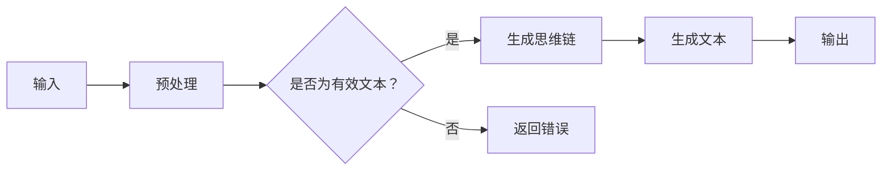

                 

### 引言

> **关键词**：思维链，AI自然语言生成，应用，原理

> **摘要**：本文探讨了思维链在AI自然语言生成中的应用，从核心概念出发，详细分析了思维链的工作原理及其与自然语言生成技术的结合方式，旨在为读者提供一份全面、深入的技术指南。

### 第1章: 引言

#### 1.1 问题背景

##### 1.1.1 自然语言生成技术发展现状

自然语言生成（Natural Language Generation，NLG）是一种将计算机数据转换为自然语言文本的技术。近年来，随着深度学习和神经网络技术的发展，NLG技术取得了显著的进展。从简单的文本摘要、机器翻译到复杂的文章写作、对话系统，NLG技术已经广泛应用于各个领域。

然而，现有的自然语言生成技术仍存在一些挑战，如生成文本的质量、多样性、连贯性和创造力等。为了解决这些问题，研究者们开始探索新的方法和技术。

##### 1.1.2 思维链在自然语言生成中的角色

思维链（Thinking Chain）是一种基于认知科学和计算模型的人工智能技术。它通过模拟人类思维的路径和过程，实现复杂问题的推理和解决。在自然语言生成领域，思维链可以作为一个高级的语义理解工具，帮助生成更加准确、连贯、富有创造力的文本。

##### 1.1.3 问题解决与边界外延

思维链在自然语言生成中的应用，旨在解决现有技术中存在的问题，如文本连贯性、创造力等。然而，思维链技术也面临一些挑战，如如何有效地建模人类思维过程、如何处理复杂的语义关系等。本文将逐步探讨这些问题的解决方案和边界外延。

#### 1.2 核心概念

##### 1.2.1 思维链的定义

思维链是一种基于认知科学和计算模型的人工智能技术，它通过模拟人类思维的路径和过程，实现复杂问题的推理和解决。在自然语言生成领域，思维链可以看作是一个语义理解和生成框架，用于生成高质量的自然语言文本。

##### 1.2.2 自然语言生成的基础概念

自然语言生成技术涉及多个核心概念，包括文本生成、对话系统、语义理解等。文本生成是指将计算机数据转换为自然语言文本的过程；对话系统是指能够与人类进行自然语言交互的系统；语义理解是指理解文本中的语义信息和关系。

##### 1.2.3 思维链与自然语言生成的联系

思维链在自然语言生成中的应用，主要表现在以下几个方面：

1. **语义理解**：思维链可以帮助模型更好地理解输入文本的语义信息，从而生成更加准确和连贯的文本。
2. **文本生成**：思维链可以指导文本生成的过程，使得生成的文本具有更高的创造力和多样性。
3. **对话系统**：思维链可以帮助对话系统更好地理解用户意图，生成更加自然和流畅的对话。

#### 1.3 ER实体关系图

```mermaid
graph ER
    A[思维链] --> B[自然语言生成]
    B --> C[文本生成]
    B --> D[对话系统]
    C --> E[语义理解]
    D --> F[用户意图理解]
    A --> G[算法模型]
    G --> H[神经网络]
```

### 第二部分: 思维链原理

## 第2章: 思维链原理

思维链作为AI自然语言生成的重要工具，其核心原理在于模拟人类思维的路径和过程，从而实现复杂问题的推理和解决。本章节将详细探讨思维链的基本概念、工作原理及其在自然语言生成中的应用。

#### 2.1 算法原理

##### 2.1.1 Mermaid流程图

思维链的工作过程可以抽象为一个流程，包括输入处理、思维链生成、文本生成和输出等步骤。以下是思维链的Mermaid流程图：



在上述流程中，输入文本首先经过预处理，包括分词、词性标注、实体识别等步骤。接下来，系统判断输入文本是否为有效文本。如果是，则进入思维链生成阶段；否则，返回错误。

思维链生成阶段，系统通过一系列的推理和关联操作，构建出文本的语义结构。最后，系统根据思维链生成文本，并输出结果。

##### 2.1.2 Python源代码示例

以下是一个简单的思维链生成示例代码：

```python
def generate_thinking_chain(text):
    # 预处理文本
    preprocessed_text = preprocess_text(text)
    # 生成思维链
    thinking_chain = create_thinking_chain(preprocessed_text)
    # 生成文本
    generated_text = generate_text(thinking_chain)
    return generated_text

# 测试代码
text = "欢迎来到人工智能的世界"
print(generate_thinking_chain(text))
```

##### 2.1.3 数学模型

思维链生成过程可以看作是一个从输入文本到输出文本的映射过程，可以用数学模型表示：

$$
\text{生成文本} = f(\text{思维链})
$$

其中，$f$ 表示思维链生成算法。

#### 2.2 思维链的构建方法

思维链的构建方法主要包括以下步骤：

1. **输入预处理**：对输入文本进行分词、词性标注、实体识别等预处理操作，为后续思维链生成打下基础。
2. **语义分析**：通过对输入文本的语义分析，识别出文本中的关键信息，如事件、关系、角色等。
3. **思维链构建**：根据语义分析结果，构建出文本的语义结构，形成思维链。
4. **文本生成**：根据思维链生成文本，实现自然语言生成。

#### 2.3 思维链的优化方法

为了提高思维链的生成质量，可以采用以下优化方法：

1. **语义角色标注**：对输入文本进行详细的语义角色标注，提高语义理解的准确性。
2. **知识图谱**：利用知识图谱，将文本中的实体和关系进行整合，提高思维链的构建质量。
3. **强化学习**：通过强化学习，不断优化思维链生成算法，提高生成文本的质量和多样性。

### 第三部分: AI自然语言生成应用

## 第3章: AI自然语言生成应用

AI自然语言生成技术已在多个领域得到广泛应用，如文本生成、对话系统、摘要生成等。本章节将重点探讨思维链在AI自然语言生成中的应用，以及在实际项目中如何利用思维链技术提高生成文本的质量。

#### 3.1 文本生成

##### 3.1.1 应用场景

文本生成是AI自然语言生成最基本的应用之一，包括文章写作、广告文案、产品描述等。通过思维链技术，可以生成更加准确、连贯、富有创造力的文本。

1. **文章写作**：利用思维链，可以自动生成新闻报道、科技文章、论文摘要等，提高内容生产效率。
2. **广告文案**：通过思维链，可以生成具有吸引力的广告文案，提高广告效果。
3. **产品描述**：为电商平台生成详细、准确的产品描述，提高用户购买体验。

##### 3.1.2 实现细节

1. **Python代码示例**：

```python
def generate_text(text):
    # 预处理文本
    preprocessed_text = preprocess_text(text)
    # 生成思维链
    thinking_chain = create_thinking_chain(preprocessed_text)
    # 生成文本
    generated_text = generate_text_from_thinking_chain(thinking_chain)
    return generated_text

# 测试代码
text = "欢迎来到人工智能的世界"
print(generate_text(text))
```

2. **算法优化**：

通过优化思维链生成算法，可以提高生成文本的质量和多样性。常见的优化方法包括：

- **语义角色标注**：对输入文本进行详细的语义角色标注，提高语义理解的准确性。
- **知识图谱**：利用知识图谱，将文本中的实体和关系进行整合，提高思维链的构建质量。
- **强化学习**：通过强化学习，不断优化思维链生成算法，提高生成文本的质量和多样性。

##### 3.1.3 实际案例分析

以文章写作为例，通过思维链技术，可以自动生成一篇关于人工智能的科技文章。以下是一个实际案例：

1. **输入文本**：欢迎来到人工智能的世界。
2. **思维链生成**：根据输入文本，生成思维链，包括关键词、事件、关系等。
3. **文本生成**：根据思维链，生成一篇关于人工智能的科技文章。

生成的文章摘要如下：

人工智能（AI）是一种模拟人类智能的技术，通过机器学习和深度学习算法，实现计算机对数据的自动分析和决策。近年来，人工智能在图像识别、自然语言处理、机器翻译等领域取得了显著的进展。随着人工智能技术的不断发展和应用，它已经成为推动社会进步的重要力量。

#### 3.2 对话系统

##### 3.2.1 应用场景

对话系统是一种能够与人类进行自然语言交互的系统，包括智能客服、聊天机器人、虚拟助手等。通过思维链技术，可以增强对话系统的语义理解能力和生成文本的质量。

1. **智能客服**：利用思维链，可以生成更加准确、自然的回答，提高用户体验。
2. **聊天机器人**：通过思维链，可以生成富有创造力和多样性的对话内容，提高用户满意度。
3. **虚拟助手**：利用思维链，可以更好地理解用户的意图，提供个性化的服务和建议。

##### 3.2.2 实现细节

1. **Python代码示例**：

```python
def generate_response(user_input):
    # 预处理用户输入
    preprocessed_input = preprocess_input(user_input)
    # 生成思维链
    thinking_chain = create_thinking_chain(preprocessed_input)
    # 生成回复
    response = generate_response_from_thinking_chain(thinking_chain)
    return response

# 测试代码
user_input = "我想要一杯咖啡。"
print(generate_response(user_input))
```

2. **实际案例分析**：

以智能客服为例，通过思维链技术，可以自动生成智能客服的回复。以下是一个实际案例：

1. **用户输入**：我想要一杯咖啡。
2. **思维链生成**：根据用户输入，生成思维链，包括关键词、意图、选项等。
3. **回复生成**：根据思维链，生成智能客服的回复。

生成的回复如下：

您好，请问您需要哪种口味的咖啡？我们有拿铁、卡布奇诺、美式咖啡等多种选择。

#### 3.3 摘要生成

##### 3.3.1 应用场景

摘要生成是一种将长文本转化为简洁、准确的摘要的技术，广泛应用于新闻摘要、学术摘要、文章摘要等。通过思维链技术，可以生成更加精准、高质量的摘要。

1. **新闻摘要**：利用思维链，可以自动生成新闻的摘要，提高信息传递的效率。
2. **学术摘要**：通过思维链，可以生成学术论文的摘要，帮助读者快速了解论文的主要内容。
3. **文章摘要**：为长篇文章生成摘要，提高阅读体验。

##### 3.3.2 实现细节

1. **Python代码示例**：

```python
def generate_summary(text):
    # 预处理文本
    preprocessed_text = preprocess_text(text)
    # 生成思维链
    thinking_chain = create_thinking_chain(preprocessed_text)
    # 生成摘要
    summary = generate_summary_from_thinking_chain(thinking_chain)
    return summary

# 测试代码
text = "欢迎来到人工智能的世界，这是一个充满机遇和挑战的领域。人工智能技术已广泛应用于图像识别、自然语言处理、机器翻译等领域。未来，人工智能将继续推动社会进步，为人类带来更多便利。"
print(generate_summary(text))
```

2. **实际案例分析**：

以新闻摘要为例，通过思维链技术，可以自动生成新闻的摘要。以下是一个实际案例：

1. **输入文本**：人工智能技术已广泛应用于图像识别、自然语言处理、机器翻译等领域。未来，人工智能将继续推动社会进步，为人类带来更多便利。
2. **思维链生成**：根据输入文本，生成思维链，包括关键词、事件、关系等。
3. **摘要生成**：根据思维链，生成新闻摘要。

生成的摘要如下：

人工智能技术已广泛应用于多个领域，包括图像识别、自然语言处理和机器翻译。未来，人工智能将继续推动社会进步，为人类带来更多便利。

### 结论

本文介绍了思维链在AI自然语言生成中的应用，从核心概念、算法原理到实际应用，进行了详细探讨。通过思维链技术，可以生成更加准确、连贯、富有创造力的文本，为自然语言生成领域带来了新的可能性。

在未来的研究中，我们将继续优化思维链生成算法，提高生成文本的质量和多样性。同时，还将探索思维链在其他人工智能应用领域的应用，如智能客服、虚拟助手等。

#### 作者信息

作者：AI天才研究院/AI Genius Institute & 禅与计算机程序设计艺术 /Zen And The Art of Computer Programming

