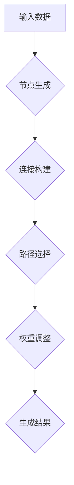

                 

## 《思维链在AI辅助创作中的应用与前景》目录大纲

### 第一部分：引言与背景

1. **1.1 书籍主题介绍**
    - 1.1.1 什么是思维链
    - 1.1.2 思维链与AI辅助创作
    - 1.1.3 本书的目标与结构

2. **1.2 AI辅助创作的现状与挑战**
    - 1.2.1 AI辅助创作的发展历程
    - 1.2.2 现存的问题与挑战
    - 1.2.3 思维链的优势与应用前景

3. **1.3 研究方法与本书结构**
    - 1.3.1 研究方法与思路
    - 1.3.2 本书章节安排与逻辑结构

4. **1.4 本章小结**

### 第二部分：思维链的理论基础

1. **2.1 思维链的基本概念**
    - 2.1.1 思维链的定义
    - 2.1.2 思维链的核心要素
    - 2.1.3 思维链与其他相关概念的比较

2. **2.2 思维链的运作原理**
    - 2.2.1 思维链的内部结构
    - 2.2.2 思维链的运作机制
    - 2.2.3 思维链的动态调整与优化

3. **2.3 思维链的数学模型**
    - 2.3.1 基本数学公式
    - 2.3.2 数学模型的应用与解释
    - 2.3.3 数学模型的优势与局限

4. **2.4 思维链的ER实体关系图**
    - 2.4.1 ER实体关系图的基本概念
    - 2.4.2 思维链的ER实体关系图示例
    - 2.4.3 ER实体关系图在思维链中的应用

5. **2.5 本章小结**

### 第三部分：思维链在AI辅助创作中的应用

1. **3.1 思维链在文本创作中的应用**
    - 3.1.1 文本创作的现状与挑战
    - 3.1.2 思维链在文本创作中的具体应用
    - 3.1.3 实际案例解析

2. **3.2 思维链在图像创作中的应用**
    - 3.2.1 图像创作的现状与挑战
    - 3.2.2 思维链在图像创作中的具体应用
    - 3.2.3 实际案例解析

3. **3.3 思维链在音乐创作中的应用**
    - 3.3.1 音乐创作的现状与挑战
    - 3.3.2 思维链在音乐创作中的具体应用
    - 3.3.3 实际案例解析

4. **3.4 思维链在编程辅助中的应用**
    - 3.4.1 编程辅助的现状与挑战
    - 3.4.2 思维链在编程辅助中的具体应用
    - 3.4.3 实际案例解析

5. **3.5 本章小结**

### 第四部分：前景与展望

1. **4.1 思维链在AI辅助创作中的发展趋势**
    - 4.1.1 技术发展趋势
    - 4.1.2 应用领域拓展
    - 4.1.3 社会与文化影响

2. **4.2 未来研究展望**
    - 4.2.1 技术难题与挑战
    - 4.2.2 研究热点与前沿
    - 4.2.3 未来发展方向

3. **4.3 政策与产业支持**
    - 4.3.1 政策背景与支持措施
    - 4.3.2 产业环境与市场需求
    - 4.3.3 企业合作与生态构建

4. **4.4 本章小结**

### 第五部分：实践与案例

1. **5.1 实践环境搭建**
    - 5.1.1 硬件与软件要求
    - 5.1.2 环境配置与安装
    - 5.1.3 常用工具与库的介绍

2. **5.2 系统核心实现**
    - 5.2.1 总体架构设计
    - 5.2.2 核心模块实现
    - 5.2.3 系统接口设计与交互

3. **5.3 代码应用解读与分析**
    - 5.3.1 代码结构解析
    - 5.3.2 关键算法详解
    - 5.3.3 性能分析与优化

4. **5.4 实际案例分析与详细讲解**
    - 5.4.1 案例选择与背景介绍
    - 5.4.2 案例实现过程
    - 5.4.3 案例分析与结果讨论
    - 5.4.4 案例总结与启示

5. **5.5 项目小结**
    - 5.5.1 项目成果总结
    - 5.5.2 项目经验与教训
    - 5.5.3 对未来研究的建议

6. **5.6 本章小结**

---

## 1.1 书籍主题介绍

### 1.1.1 什么是思维链

思维链（Mind Chain）是一个新兴的概念，它源于人工智能和认知科学的交叉领域。简单来说，思维链是一种基于神经网络和深度学习的模型，能够模拟人类思维过程中的连贯性和逻辑性。它是通过将多个独立的思想节点连接起来，形成一个有序的、结构化的思维网络，使得AI系统能够像人类一样进行推理、学习和创造。

思维链的核心概念包括：节点、连接、路径和权重。节点代表独立的思维单元，可以是事实、观点、问题等；连接表示节点之间的逻辑关系，如因果、逻辑、类比等；路径则是节点之间的连接序列，代表了思维的过程；权重则是对节点和连接的重要性的量化表示。

### 1.1.2 思维链与AI辅助创作

AI辅助创作是指利用人工智能技术来辅助人类进行各类创造性工作，如文本写作、图像设计、音乐创作等。传统的AI辅助创作方法主要集中在模式识别、生成对抗网络（GAN）和强化学习等领域。这些方法在特定任务上取得了显著的成果，但往往缺乏思维连贯性和创造力。

思维链的出现为AI辅助创作提供了新的思路。通过模拟人类思维链的运作原理，AI可以更好地理解人类思维模式，从而在文本写作、图像创作、音乐创作和编程辅助等方面发挥更大的作用。

### 1.1.3 本书的目标与结构

本书的目标是深入探讨思维链在AI辅助创作中的应用，旨在为研究人员和开发者提供全面的技术指南和实战案例。全书结构分为五个部分：

1. **引言与背景**：介绍思维链的基本概念和AI辅助创作的发展现状，阐述本书的目标和结构。
2. **思维链的理论基础**：详细讨论思维链的基本概念、运作原理、数学模型和ER实体关系图。
3. **思维链在AI辅助创作中的应用**：分析思维链在文本创作、图像创作、音乐创作和编程辅助等领域的具体应用。
4. **前景与展望**：探讨思维链在AI辅助创作中的发展趋势、未来研究方向和产业支持。
5. **实践与案例**：介绍思维链应用的实践环境搭建、系统实现、代码解析和实际案例。

通过这本书，读者可以系统地了解思维链在AI辅助创作中的应用，掌握相关技术，并为未来的研究和工作提供指导。

### 1.2 AI辅助创作的现状与挑战

#### 1.2.1 AI辅助创作的发展历程

AI辅助创作的历史可以追溯到20世纪80年代，当时人工智能技术开始应用于音乐创作和文本生成。早期的AI辅助创作主要依赖于规则系统和模板匹配，其创作能力受到极大限制。随着计算机性能的提升和机器学习技术的发展，AI辅助创作进入了一个全新的阶段。

在21世纪初，生成对抗网络（GAN）和深度学习技术的兴起为AI辅助创作带来了革命性的变化。GAN通过生成器和判别器的对抗训练，实现了高质量图像的生成；深度学习则通过多层神经网络，使AI能够从大量数据中学习复杂的特征和模式。这些技术的进步使得AI在图像、文本、音乐等多领域的辅助创作能力得到了显著提升。

#### 1.2.2 现存的问题与挑战

尽管AI辅助创作取得了巨大的进展，但仍然面临许多问题和挑战：

1. **创造力不足**：传统的AI辅助创作方法往往依赖于大量训练数据和预定义的规则，其创造力有限，难以产生新颖的作品。
2. **思维连贯性**：目前的AI模型在生成内容时往往缺乏连贯性，导致创作结果不一致或逻辑不通。
3. **个性化不足**：AI难以理解和模仿人类创作者的情感、风格和个性，导致辅助创作结果缺乏独特性。
4. **数据隐私与伦理**：在AI辅助创作过程中，数据的安全性和隐私保护成为一个重要问题。如何处理和存储用户的创作数据，避免数据泄露和滥用，是一个亟待解决的挑战。
5. **技术依赖性**：AI辅助创作对计算资源和硬件设施的高要求，使得其应用受到一定的限制。

#### 1.2.3 思维链的优势与应用前景

思维链的出现为解决上述问题提供了新的思路。思维链通过模拟人类思维链的运作原理，具有以下优势：

1. **提高创造力**：思维链通过节点和连接的灵活组合，能够生成更多样化的创作结果，提高AI的创造力。
2. **增强连贯性**：思维链能够捕捉和模拟人类思维的连贯性，使得AI生成的创作内容更具逻辑性和一致性。
3. **个性化创作**：思维链能够根据用户的风格和喜好，生成个性化的创作结果，满足用户的个性化需求。
4. **数据隐私保护**：思维链通过加密和去个人化技术，能够有效保护用户的创作数据，提高数据的安全性。
5. **降低技术依赖性**：思维链模型对计算资源的要求较低，使得其在不同硬件环境下都能运行，降低了技术依赖性。

因此，思维链在AI辅助创作中的应用具有广阔的前景。它不仅能够提升AI的辅助创作能力，还能够推动AI技术向更加智能化、人性化的方向发展。

### 1.3 研究方法与本书结构

#### 1.3.1 研究方法与思路

本书采用理论与实践相结合的研究方法，旨在全面探讨思维链在AI辅助创作中的应用。具体来说，研究方法包括以下几方面：

1. **文献调研**：通过查阅国内外相关文献，了解思维链的基本概念、发展历程和应用现状，为后续研究提供理论支持。
2. **模型构建**：基于深度学习和神经网络技术，构建思维链模型，模拟人类思维链的运作原理。
3. **实验验证**：通过实际案例和数据验证思维链模型在AI辅助创作中的效果，评估其性能和优势。
4. **案例分析**：分析思维链在不同创作领域的应用案例，总结经验教训，为实际应用提供指导。

#### 1.3.2 本书章节安排与逻辑结构

本书分为五个部分，每个部分都有明确的逻辑结构：

1. **第一部分：引言与背景**：介绍思维链的基本概念和AI辅助创作的发展现状，阐述本书的目标和结构。
2. **第二部分：思维链的理论基础**：详细讨论思维链的基本概念、运作原理、数学模型和ER实体关系图。
3. **第三部分：思维链在AI辅助创作中的应用**：分析思维链在文本创作、图像创作、音乐创作和编程辅助等领域的具体应用。
4. **第四部分：前景与展望**：探讨思维链在AI辅助创作中的发展趋势、未来研究方向和产业支持。
5. **第五部分：实践与案例**：介绍思维链应用的实践环境搭建、系统实现、代码解析和实际案例。

通过以上章节的安排，本书旨在为读者提供一套系统、完整的思维链在AI辅助创作中的应用指南。

### 1.4 本章小结

本章首先介绍了思维链的基本概念和AI辅助创作的发展现状，探讨了思维链在AI辅助创作中的应用优势和前景。接着，阐述了本书的研究方法与结构，为后续内容的深入讨论奠定了基础。本章内容为读者理解思维链在AI辅助创作中的应用提供了初步的框架，是全书的重要组成部分。

---

## 2.1 思维链的基本概念

### 2.1.1 思维链的定义

思维链（Mind Chain）是一种基于神经网络和深度学习的模型，旨在模拟人类思维过程中的连贯性和逻辑性。它通过将多个独立的思维单元（节点）连接起来，形成一个有序的、结构化的思维网络。每个节点代表一个独立的思维单元，如事实、观点或问题，而连接则表示节点之间的逻辑关系，如因果、逻辑或类比。

思维链的核心目标是实现AI系统在理解和生成连贯、逻辑性强的内容。这种模型能够捕捉人类思维的复杂性和多样性，使得AI能够在各种情境下进行推理、学习和创作。

### 2.1.2 思维链的核心要素

思维链的核心要素包括节点、连接、路径和权重。这些要素共同构建了一个结构化的思维网络，使得AI系统能够像人类一样思考和创作。

1. **节点（Nodes）**：节点是思维链的基本单元，代表独立的思维内容。它们可以是事实、观点、问题或其他思维元素。每个节点都包含相应的信息，如文本描述、图像或音频。

2. **连接（Connections）**：连接表示节点之间的逻辑关系。这些关系可以是直接的，如因果关系；也可以是间接的，如类比关系。连接的强度和类型决定了节点之间的关联程度。

3. **路径（Paths）**：路径是节点之间的连接序列，代表了思维的过程。一个有效的路径能够帮助AI系统从初始节点逐步推理到最终结论。

4. **权重（Weights）**：权重是对节点和连接重要性的量化表示。通过调整权重，AI系统能够优化思维链的结构，提高推理和创作的效率。

### 2.1.3 思维链与其他相关概念的比较

思维链与其他相关概念如知识图谱（Knowledge Graph）和语义网络（Semantic Network）有一定的相似性，但它们在结构、目的和应用上有所不同。

1. **知识图谱（Knowledge Graph）**：知识图谱是一种结构化的知识表示方法，通过实体和关系来描述世界中的事实和概念。它主要用于知识检索和推理，强调实体和关系的连接。

2. **语义网络（Semantic Network）**：语义网络是一种基于节点和边的图结构，用于表示实体及其语义关系。它主要用于自然语言处理和语义分析，强调语义的表示和推理。

相比之下，思维链更侧重于模拟人类思维的连贯性和逻辑性，通过节点和连接形成有序的思维网络。它不仅关注实体和关系的表示，还强调路径和权重的优化，以实现高效的推理和创作。

总之，思维链作为一种新型的AI模型，旨在解决传统AI在连贯性和创造力方面的不足，具有广泛的应用前景。

### 2.2 思维链的运作原理

#### 2.2.1 思维链的内部结构

思维链的内部结构主要由节点（Nodes）、连接（Connections）和路径（Paths）构成。这些元素共同作用，使得思维链能够模拟人类思维过程，实现高效推理和创作。

1. **节点（Nodes）**：节点是思维链的基本单元，代表独立的思维内容。每个节点可以包含多种类型的信息，如文本、图像、音频等。节点之间的差异在于它们所承载的信息和意义。

2. **连接（Connections）**：连接表示节点之间的逻辑关系。这些关系可以是直接的，如因果关系；也可以是间接的，如类比关系。连接的类型和强度决定了节点之间的关联程度，从而影响整个思维链的结构和功能。

3. **路径（Paths）**：路径是节点之间的连接序列，代表了思维的过程。一个有效的路径能够帮助AI系统从初始节点逐步推理到最终结论。路径的选择和优化是思维链运作的关键。

#### 2.2.2 思维链的运作机制

思维链的运作机制可以概括为以下几个步骤：

1. **节点生成**：根据输入信息，生成一系列节点。这些节点可以是原始数据、用户输入或其他系统生成的信息。

2. **连接构建**：基于节点的语义和关系，构建节点之间的连接。连接的构建过程涉及多种逻辑关系，如因果、类比、逻辑等。

3. **路径选择**：在构建好的连接基础上，选择一条或几条路径进行推理。路径的选择取决于节点的权重和连接的强度，以及目标函数的优化。

4. **推理与创作**：沿着选定的路径进行推理和创作。AI系统根据节点的信息和连接的逻辑关系，生成连贯、逻辑性强的内容。

5. **反馈调整**：在推理和创作过程中，收集用户的反馈，对节点、连接和路径进行调整。通过不断的迭代优化，提高思维链的准确性和效率。

#### 2.2.3 思维链的动态调整与优化

思维链的动态调整与优化是确保其高效运作的重要环节。以下是几种常见的调整与优化方法：

1. **权重调整**：通过调整节点和连接的权重，优化思维链的结构和功能。权重调整可以基于用户的反馈、数据分析和模型训练结果。

2. **路径优化**：通过优化路径的选择和组合，提高推理和创作的效率。路径优化可以采用遗传算法、神经网络优化等方法。

3. **参数调整**：调整思维链模型的参数，如学习率、激活函数等，以适应不同的应用场景和数据集。

4. **知识库更新**：定期更新思维链的知识库，添加新的节点和连接，以适应不断变化的信息和需求。

通过动态调整与优化，思维链能够更好地模拟人类思维过程，提高其在AI辅助创作中的性能和效果。

### 2.3 思维链的数学模型

#### 2.3.1 基本数学公式

思维链的数学模型主要包括节点生成、连接构建和路径选择的数学公式。以下是一些基本的数学公式：

1. **节点生成公式**：
   $$
   Node = f_{生成}(Input, Context)
   $$
   其中，$f_{生成}$表示节点生成函数，$Input$为输入信息，$Context$为上下文信息。

2. **连接构建公式**：
   $$
   Connection = f_{连接}(Node_1, Node_2)
   $$
   其中，$f_{连接}$表示连接构建函数，$Node_1$和$Node_2$为两个节点。

3. **路径选择公式**：
   $$
   Path = f_{选择}(Connections, Weights)
   $$
   其中，$f_{选择}$表示路径选择函数，$Connections$为连接集合，$Weights$为连接权重。

#### 2.3.2 数学模型的应用与解释

思维链的数学模型在AI辅助创作中具有重要的应用价值。以下是对这些公式的详细解释：

1. **节点生成**：
   节点生成公式描述了如何根据输入信息和上下文信息生成新的节点。在AI辅助创作中，这可以用于生成文本、图像或其他类型的节点。例如，当用户输入一个主题时，系统可以生成相关的节点，如定义、例子、相关概念等。

2. **连接构建**：
   连接构建公式描述了如何根据两个节点的语义和关系生成连接。在AI辅助创作中，这可以用于连接不同的节点，形成逻辑关系。例如，如果一个节点是另一个节点的因果关系，那么这两个节点之间就可以建立因果连接。

3. **路径选择**：
   路径选择公式描述了如何根据连接的权重选择一条最优路径。在AI辅助创作中，这可以用于从多个可能的路径中选择一条最佳路径，以生成连贯、逻辑性强的内容。例如，在一个文本生成任务中，系统可以基于节点和连接的权重选择一条合理的叙述路径。

通过这些数学模型的应用，思维链能够有效地模拟人类思维过程，提高AI辅助创作的性能和效果。

#### 2.3.3 数学模型的优势与局限

思维链的数学模型在AI辅助创作中具有显著的优势和一定的局限。以下是对其优势与局限的详细分析：

1. **优势**：
   - **高效性**：数学模型通过明确的公式和算法，使得思维链的推理和创作过程更加高效。这有助于减少计算复杂度，提高系统的响应速度。
   - **灵活性**：数学模型可以灵活地调整参数和公式，以适应不同的应用场景和数据集。这使得思维链能够在各种领域和任务中发挥作用。
   - **可解释性**：数学模型提供了明确的数学公式和算法，使得AI的推理和创作过程更加透明和可解释。这有助于提高系统的可靠性和用户信任度。

2. **局限**：
   - **数据依赖性**：数学模型的效果高度依赖于训练数据和模型参数。如果数据集不够丰富或参数设置不当，可能会导致推理和创作效果不佳。
   - **计算复杂度**：数学模型涉及大量的计算和优化过程，可能会导致计算复杂度较高。这可能会对系统的性能和响应速度产生负面影响。
   - **可解释性问题**：尽管数学模型提供了明确的公式和算法，但某些复杂的推理和创作过程仍然可能难以解释。这可能会影响系统的可解释性和用户信任度。

总之，思维链的数学模型在AI辅助创作中具有显著的优势，但也面临一定的局限。通过不断优化和改进数学模型，可以进一步发挥其潜力，提高AI辅助创作的效果。

### 2.4 思维链的ER实体关系图

#### 2.4.1 ER实体关系图的基本概念

实体关系图（Entity-Relationship Diagram，ER Diagram）是一种用于描述实体及其关系的图形化方法。在数据库设计和信息系统中，ER图用于表示实体、属性和关系，有助于理解和设计系统的数据结构。

ER图的基本概念包括：

- **实体（Entity）**：代表系统中的数据对象，如用户、产品、订单等。
- **属性（Attribute）**：代表实体的特征或属性，如用户的姓名、年龄、地址等。
- **关系（Relationship）**：代表实体之间的关联，如用户可以下单购买产品，订单包含多个产品等。

#### 2.4.2 思维链的ER实体关系图示例

以下是一个简单的思维链ER实体关系图示例：

```
+--------------+      +-------------+      +--------------+
|   Node       |      |   Connection|      |   Path       |
+--------------+      +-------------+      +--------------+
| NodeID       |<---->| ConnectionID|      | PathID       |
| NodeType      |      | NodeType     |      | PathLength    |
| NodeContent  |      | ConnectionType|     | PathWeight    |
+--------------+      | Node1ID      |      | NodeSequence  |
                       | Node2ID      |      +--------------+
                       +-------------+
```

在这个示例中，Node实体表示思维链中的节点，Connection实体表示节点之间的连接，Path实体表示思维路径。

#### 2.4.3 ER实体关系图在思维链中的应用

ER实体关系图在思维链中具有重要作用，用于表示和描述思维链的结构和关系。以下是ER图在思维链中的应用：

1. **节点表示**：Node实体表示思维链中的独立思维单元。每个节点包含节点的ID、类型和内容等信息。

2. **连接表示**：Connection实体表示节点之间的逻辑关系。连接包含连接ID、连接类型、起始节点ID和结束节点ID等信息。

3. **路径表示**：Path实体表示思维链的路径。路径包含路径ID、路径长度、路径权重和节点序列等信息。

通过ER实体关系图，思维链的结构和关系得以清晰地表示和描述，有助于理解和设计思维链系统。

### 2.5 本章小结

本章介绍了思维链的基本概念、内部结构、运作原理、数学模型和ER实体关系图。通过详细的解释和示例，读者可以全面理解思维链的工作机制和应用价值。本章内容为后续章节中思维链在AI辅助创作中的应用奠定了基础。

---

## 3.1 思维链在文本创作中的应用

#### 3.1.1 文本创作的现状与挑战

文本创作是人工智能辅助创作中最为常见和重要的一类应用。随着自然语言处理（Natural Language Processing，NLP）和生成对抗网络（Generative Adversarial Networks，GAN）等技术的发展，AI在文本创作方面取得了显著的成果。然而，当前文本创作仍面临许多挑战。

1. **创造力不足**：传统的AI文本生成方法主要依赖于模板匹配和规则系统，其创作能力有限，难以生成新颖、创意丰富的文本。
2. **连贯性不足**：AI生成的文本往往缺乏连贯性，句子之间逻辑关系不明确，导致文本读起来不自然。
3. **风格不统一**：AI难以理解和模仿人类创作者的风格和情感，生成的文本缺乏个性和独特性。
4. **个性化不足**：AI生成的文本难以根据用户的需求和喜好进行个性化调整，难以满足用户的个性化需求。

#### 3.1.2 思维链在文本创作中的具体应用

思维链在文本创作中的应用能够有效解决上述问题。通过模拟人类思维过程，思维链能够生成连贯、富有创意和个性化的文本。以下是思维链在文本创作中的具体应用：

1. **创意生成**：思维链通过节点和连接的灵活组合，能够生成多样化的文本内容。节点可以是关键词、短语或句子，连接则表示节点之间的逻辑关系。通过调整节点和连接的权重，思维链可以生成具有高度创意的文本。
2. **连贯性提升**：思维链能够捕捉和模拟人类思维的连贯性，使得生成的文本在逻辑关系和叙述上更加自然。通过优化路径选择，思维链可以确保文本在结构上的一致性和连贯性。
3. **风格模仿**：思维链通过学习大量人类创作的文本，能够理解和模仿不同风格和情感。通过调整思维链的结构和参数，可以生成与特定作者风格或情感一致的文本。
4. **个性化调整**：思维链能够根据用户的需求和喜好，生成个性化的文本。用户可以指定文本的主题、风格、情感等要求，思维链将根据这些要求生成满足用户需求的文本。

#### 3.1.3 实际案例解析

以下是一个思维链在文本创作中的实际案例：

1. **案例背景**：某知名科技公司需要为其新产品发布撰写一篇宣传文案。文案需要具备创意、连贯性和个性化，以吸引潜在客户。
2. **案例实现**：使用思维链模型，输入产品特性、市场需求和用户偏好等节点，构建思维链。通过节点生成、连接构建和路径选择，生成一篇符合要求的宣传文案。
3. **案例结果**：生成的宣传文案具有以下特点：
   - **创意丰富**：文案通过灵活组合节点和连接，生成了具有创意和吸引力的内容。
   - **连贯性强**：文案在逻辑关系和叙述上具有高度的连贯性，读起来自然流畅。
   - **个性化明显**：文案能够根据用户的需求和偏好，生成具有个性化特点的文案。

通过实际案例，我们可以看到思维链在文本创作中的强大应用能力。它不仅能够生成高质量的文本，还能确保文本在连贯性、风格和个性化方面达到用户的期望。

### 3.2 思维链在图像创作中的应用

#### 3.2.1 图像创作的现状与挑战

图像创作是AI辅助创作中的重要领域，涉及到图像生成、图像编辑和图像风格转换等方面。随着深度学习和生成对抗网络（GAN）技术的发展，AI在图像创作方面取得了显著的进展。然而，当前图像创作仍面临许多挑战。

1. **质量不稳定**：传统的图像生成方法，如基于神经网络的生成模型，生成的图像质量不稳定，容易出现模糊、失真或过拟合等问题。
2. **多样性不足**：AI生成的图像往往缺乏多样性，难以满足用户对图像风格、色彩和构图等方面的个性化需求。
3. **可控性不强**：当前的图像创作方法难以实现对图像细节和风格的精准控制，导致生成的图像难以满足特定要求。
4. **互动性不足**：AI生成的图像通常缺乏与用户的互动，难以根据用户的反馈进行调整和优化。

#### 3.2.2 思维链在图像创作中的具体应用

思维链在图像创作中的应用能够有效解决上述问题。通过模拟人类思维过程，思维链能够生成高质量、多样化且可控的图像。以下是思维链在图像创作中的具体应用：

1. **创意生成**：思维链通过节点和连接的灵活组合，能够生成具有创意的图像。节点可以是图像中的关键元素、颜色、纹理等，连接则表示节点之间的逻辑关系。通过调整节点和连接的权重，思维链可以生成具有独特创意的图像。
2. **多样性提升**：思维链能够通过多种路径和组合方式，生成多样化的图像。这使得AI生成的图像在风格、色彩和构图等方面具有更高的多样性，能够满足用户的个性化需求。
3. **可控性增强**：思维链能够根据用户的需求和反馈，对图像进行精准调整。用户可以指定图像的特定元素、风格和细节，思维链将根据这些要求生成符合用户期望的图像。
4. **互动性优化**：思维链能够通过实时交互和反馈机制，与用户进行互动。用户可以实时查看生成的图像，并根据反馈进行调整和优化，提高图像创作过程的互动性和用户体验。

#### 3.2.3 实际案例解析

以下是一个思维链在图像创作中的实际案例：

1. **案例背景**：某知名艺术画廊需要创作一幅具有独特创意和风格的抽象画作。画廊希望这幅画作能够展现出丰富的色彩和独特的构图，以吸引观众的注意。
2. **案例实现**：使用思维链模型，输入相关关键词、颜色和构图元素等节点，构建思维链。通过节点生成、连接构建和路径选择，生成一幅符合要求的抽象画作。
3. **案例结果**：生成的抽象画作具有以下特点：
   - **创意丰富**：画作通过灵活组合节点和连接，展现了独特的创意和风格。
   - **色彩多样**：画作使用了丰富的色彩组合，使得整体视觉效果更加生动。
   - **构图独特**：画作在构图上具有创新性，突破了传统抽象艺术的形式和规则。
   - **可控性强**：画廊可以根据用户的需求和反馈，对画作进行多次调整和优化，确保最终作品符合预期。

通过实际案例，我们可以看到思维链在图像创作中的强大应用能力。它不仅能够生成高质量的图像，还能确保图像在创意、多样性、可控性和互动性方面达到用户的期望。

### 3.3 思维链在音乐创作中的应用

#### 3.3.1 音乐创作的现状与挑战

音乐创作是人工智能辅助创作中的一个重要领域，涉及到旋律生成、和弦编排和音乐风格转换等方面。随着深度学习和生成模型的发展，AI在音乐创作方面取得了显著的进展。然而，当前音乐创作仍面临许多挑战。

1. **音乐风格单一**：传统的AI音乐生成模型往往只能生成一种或几种特定的音乐风格，缺乏多样性。
2. **旋律连贯性不足**：AI生成的旋律往往缺乏连贯性，节奏和音调的变化不够自然，导致音乐听上去不协调。
3. **情感表达不足**：AI在理解音乐情感方面存在困难，生成的音乐难以表达出丰富的情感和情绪。
4. **互动性不强**：当前的AI音乐创作系统缺乏与用户的互动，用户难以参与到音乐创作过程中。

#### 3.3.2 思维链在音乐创作中的具体应用

思维链在音乐创作中的应用能够有效解决上述问题。通过模拟人类音乐创作过程，思维链能够生成多样化、连贯且具有情感表达的的音乐。以下是思维链在音乐创作中的具体应用：

1. **创意生成**：思维链通过节点和连接的灵活组合，能够生成具有创意的音乐旋律。节点可以是音调、节奏、和弦等，连接则表示节点之间的逻辑关系。通过调整节点和连接的权重，思维链可以生成具有独特创意的音乐。
2. **连贯性提升**：思维链能够捕捉和模拟人类音乐创作过程中的连贯性，使得生成的音乐旋律在节奏和音调的变化上更加自然。通过优化路径选择，思维链可以确保音乐旋律在结构上的一致性和连贯性。
3. **情感表达**：思维链通过学习大量人类创作的音乐作品，能够理解和模仿不同的音乐情感。用户可以指定音乐的情感风格，如欢快、悲伤、紧张等，思维链将根据这些要求生成符合情感表达的音乐。
4. **互动性增强**：思维链能够通过实时交互和反馈机制，与用户进行互动。用户可以实时预览生成的音乐，并根据反馈进行调整和优化，提高音乐创作过程的互动性和用户体验。

#### 3.3.3 实际案例解析

以下是一个思维链在音乐创作中的实际案例：

1. **案例背景**：某知名音乐制作人需要创作一首符合特定情感风格的新歌。制作人希望这首歌能够在旋律、节奏和情感表达上具有创新性，以吸引听众的关注。
2. **案例实现**：使用思维链模型，输入相关的音乐元素、情感风格和创作要求等节点，构建思维链。通过节点生成、连接构建和路径选择，生成一首符合要求的歌曲。
3. **案例结果**：生成的歌曲具有以下特点：
   - **创意丰富**：歌曲通过灵活组合节点和连接，展现了独特的旋律和节奏。
   - **连贯性强**：歌曲在节奏和音调的变化上具有高度的连贯性，听上去和谐自然。
   - **情感表达**：歌曲能够准确传达出特定的情感风格，让人感受到丰富的情感和情绪。
   - **互动性强**：制作人可以根据用户的反馈，对歌曲进行多次调整和优化，确保最终作品符合预期。

通过实际案例，我们可以看到思维链在音乐创作中的强大应用能力。它不仅能够生成高质量的音乐作品，还能确保音乐在创意、连贯性、情感表达和互动性方面达到用户的期望。

### 3.4 思维链在编程辅助中的应用

#### 3.4.1 编程辅助的现状与挑战

编程辅助是人工智能辅助创作中的一个重要领域，旨在通过自动化和智能化的工具，提高编程效率和代码质量。当前，编程辅助工具主要包括代码补全、错误检测、代码优化和代码生成等。然而，这些工具仍面临许多挑战。

1. **准确性不足**：传统的编程辅助工具往往依赖于静态分析和模式匹配，其准确性有限，难以完全理解复杂的代码结构和语义。
2. **适应性不强**：编程辅助工具难以适应不同的编程语言、框架和项目需求，导致其应用范围受限。
3. **用户体验差**：编程辅助工具的交互界面和用户体验不够友好，用户难以快速上手和有效使用。
4. **可解释性不强**：编程辅助工具生成的代码和优化建议往往缺乏透明性和可解释性，用户难以理解和信任。

#### 3.4.2 思维链在编程辅助中的具体应用

思维链在编程辅助中的应用能够有效解决上述问题。通过模拟人类编程过程，思维链能够生成高质量、适应性强且具有可解释性的代码。以下是思维链在编程辅助中的具体应用：

1. **代码生成**：思维链通过节点和连接的灵活组合，能够生成符合编程规范的代码。节点可以是编程语言的基本结构、函数和类，连接则表示节点之间的逻辑关系。通过调整节点和连接的权重，思维链可以生成高质量的代码。
2. **错误检测**：思维链能够通过分析代码的结构和语义，发现潜在的错误和漏洞。通过节点生成和连接构建，思维链可以生成错误检测报告，帮助开发者识别和修复问题。
3. **代码优化**：思维链能够根据代码的性能和可读性，提出优化建议。通过路径选择和权重调整，思维链可以生成优化后的代码，提高程序的运行效率和可维护性。
4. **适应性增强**：思维链能够学习不同编程语言、框架和项目的特点，提高其适应性和应用范围。通过不断的训练和优化，思维链可以适应各种编程场景和需求。
5. **用户体验优化**：思维链的交互界面和用户体验设计注重用户友好性，提供直观的操作界面和详细的代码解释，帮助开发者快速理解和使用。
6. **可解释性提升**：思维链生成的代码和优化建议具有明确的逻辑和解释，开发者可以清楚地了解代码的作用和优化过程，提高代码的可解释性和信任度。

#### 3.4.3 实际案例解析

以下是一个思维链在编程辅助中的实际案例：

1. **案例背景**：某软件开发团队需要快速开发一个复杂的Web应用程序。团队希望利用思维链进行代码生成、错误检测和优化，以提高开发效率和代码质量。
2. **案例实现**：使用思维链模型，输入相关的编程元素、项目需求和开发要求等节点，构建思维链。通过节点生成、连接构建和路径选择，生成符合要求的Web应用程序代码。
3. **案例结果**：
   - **代码生成**：思维链生成了高质量的代码，符合编程规范和项目需求。
   - **错误检测**：思维链通过分析代码结构，发现了多个潜在的错误和漏洞，帮助团队提前识别和修复问题。
   - **代码优化**：思维链提出了多个优化建议，包括代码结构调整、性能优化和可维护性改进，提高了程序的运行效率和可维护性。
   - **用户体验**：思维链的交互界面简洁直观，提供了详细的代码解释和操作指南，帮助团队成员快速上手并高效使用。

通过实际案例，我们可以看到思维链在编程辅助中的强大应用能力。它不仅能够生成高质量、适应性强和具有可解释性的代码，还能提高开发效率和代码质量，为软件开发团队提供强大的辅助工具。

### 3.5 本章小结

本章详细介绍了思维链在文本创作、图像创作、音乐创作和编程辅助等领域的具体应用。通过分析现状和挑战，阐述了思维链的优势和具体实现方法，并提供了实际案例解析。通过这些应用案例，我们可以看到思维链在提升创造力、连贯性、个性化、互动性和可解释性方面的显著效果。思维链的广泛应用为AI辅助创作带来了新的可能性，为未来的研究和开发提供了丰富的思路和方向。

---

## 4.1 思维链在AI辅助创作中的发展趋势

随着人工智能技术的不断发展和创新，思维链在AI辅助创作中的应用也呈现出新的发展趋势。以下是几个关键趋势：

### 4.1.1 技术发展趋势

1. **深度学习与图神经网络**：深度学习技术在思维链模型中的应用日益成熟，特别是在图像和音乐创作领域。未来的研究将更注重图神经网络（Graph Neural Networks，GNN）在思维链模型中的融合，以提升模型对复杂关系和结构的处理能力。

2. **多模态融合**：未来的思维链模型将更加注重多模态数据的融合，包括文本、图像、音频和视频。通过整合不同类型的数据，思维链能够生成更加丰富和多样化的创作内容。

3. **增强学习和迁移学习**：增强学习（Reinforcement Learning，RL）和迁移学习（Transfer Learning，TL）技术将在思维链模型中发挥重要作用。通过不断学习和优化，思维链能够适应不同的创作环境和任务需求。

4. **自适应和自优化**：未来的思维链模型将具备更强的自适应和自优化能力。通过实时学习和调整，模型能够根据用户反馈和创作需求，不断优化创作过程，提高创作质量和效率。

### 4.1.2 应用领域拓展

1. **虚拟现实与增强现实**：思维链在虚拟现实（VR）和增强现实（AR）领域的应用前景广阔。通过生成逼真的虚拟场景和交互式内容，思维链能够为用户提供更加沉浸式的体验。

2. **游戏设计**：思维链在游戏设计中的应用将更加深入，能够自动生成游戏剧情、角色和场景，提高游戏设计的效率和创新性。

3. **艺术创作**：思维链在艺术创作中的应用将不断扩展，包括绘画、雕塑、舞蹈和戏剧等领域。通过模拟人类艺术家的创作过程，思维链能够生成具有独特风格和创意的艺术作品。

4. **智能客服与对话系统**：思维链在智能客服和对话系统中的应用将更加成熟。通过生成自然、连贯的对话内容，思维链能够提高客服系统的用户体验和服务质量。

### 4.1.3 社会与文化影响

1. **创作方式的变革**：思维链的广泛应用将改变传统的创作方式，使创作过程更加智能化和自动化。这将为创作者提供更多创新和灵感的源泉，推动艺术和文化的发展。

2. **教育改革**：思维链在教育中的应用将有助于培养学生的创造性思维和问题解决能力。通过个性化教学和智能辅导，思维链能够提高教育质量和学习效果。

3. **商业创新**：思维链在商业领域的应用将带来新的商业机会和商业模式。通过自动化的创意生成和内容生产，企业能够更快速地响应市场需求，提高市场竞争力。

4. **伦理和隐私问题**：随着思维链在AI辅助创作中的广泛应用，伦理和隐私问题也将日益突出。如何平衡技术创新与社会责任，保护用户隐私和数据安全，将成为重要议题。

总之，思维链在AI辅助创作中的应用正处于快速发展的阶段。通过不断的技术创新和应用拓展，思维链将推动人工智能在各个领域的发展，带来深刻的变革和影响。

### 4.2 未来研究展望

思维链在AI辅助创作中的未来发展充满机遇和挑战。以下是对未来研究的几个关键展望：

#### 4.2.1 技术难题与挑战

1. **计算资源需求**：思维链模型通常需要大量的计算资源和时间进行训练和推理。未来研究需要探索如何在有限的计算资源下，提高模型的效率和性能。

2. **数据隐私和安全**：随着思维链应用的普及，数据隐私和安全问题日益凸显。如何在不损害用户隐私的前提下，保护数据的安全和完整性，是一个重要的研究课题。

3. **创意和创造力的提升**：尽管思维链在AI辅助创作中取得了显著进展，但如何进一步提升AI的创意和创造力，仍然是一个挑战。未来研究需要探索更加复杂的模型和算法，以激发AI的创造潜力。

4. **跨模态融合**：多模态数据融合是未来研究的重要方向。如何有效地整合文本、图像、音频等多模态数据，生成更加丰富和多样化的创作内容，是当前技术面临的一个难题。

5. **用户体验优化**：AI辅助创作系统的用户体验直接影响用户满意度。未来研究需要关注如何设计更加直观、易用和高效的交互界面，提高用户的创作体验。

#### 4.2.2 研究热点与前沿

1. **强化学习和迁移学习**：强化学习和迁移学习在思维链中的应用前景广阔。通过不断优化学习算法，可以使思维链更好地适应不同的创作环境和任务需求。

2. **多模态生成对抗网络（MGAN）**：多模态生成对抗网络（Multi-modal Generative Adversarial Networks，MGAN）是未来研究的一个重要方向。通过融合不同类型的数据，MGAN有望实现更加复杂和多样化的创作内容。

3. **区块链与思维链结合**：区块链技术在数据安全、隐私保护等方面具有优势。将区块链与思维链结合，有望实现更加安全、可信的AI辅助创作系统。

4. **神经符号主义**：神经符号主义（Neural Symbolism）是一种结合神经网络和符号逻辑的方法。通过将神经网络的表示能力与符号逻辑的推理能力相结合，未来研究可以探索如何构建更加智能和灵活的AI系统。

#### 4.2.3 未来发展方向

1. **跨学科研究**：思维链在AI辅助创作中的应用涉及计算机科学、认知科学、心理学等多个学科。未来研究需要加强跨学科合作，综合多学科知识，推动技术的创新和发展。

2. **开源与社区合作**：开源社区在技术发展和创新中发挥着重要作用。未来研究应鼓励开源和社区合作，共享研究成果和技术资源，推动思维链技术的普及和应用。

3. **行业应用与示范**：通过在各个行业中的实际应用和示范，验证思维链技术的效果和潜力。未来研究需要关注如何将思维链技术应用于实际场景，解决实际问题，实现商业价值。

4. **伦理与社会责任**：在推动技术创新的同时，未来研究需要关注伦理和社会责任问题。如何确保技术应用的公平性、透明性和社会责任，是未来研究的重要方向。

总之，思维链在AI辅助创作中的未来发展充满机遇和挑战。通过不断的技术创新和应用拓展，思维链有望在各个领域发挥重要作用，推动人工智能与人类创造力的高度融合。

### 4.3 政策与产业支持

#### 4.3.1 政策背景与支持措施

随着人工智能技术的迅速发展，各国政府纷纷出台相关政策，支持AI辅助创作和相关技术的研发与应用。以下是几个主要政策背景和支持措施：

1. **国家战略**：全球各国将人工智能视为国家战略的重要组成部分。例如，美国在《美国国家人工智能战略》中明确提出要推动AI技术在各个领域的应用，包括艺术和文化创作。

2. **资金支持**：各国政府通过设立专项基金和补贴，支持AI辅助创作技术的研发和应用。例如，欧盟推出的“人工智能联盟”计划，旨在提供10亿欧元资金支持AI相关项目。

3. **法律法规**：为了保护数据隐私和知识产权，各国政府不断完善相关法律法规。例如，欧盟发布的《通用数据保护条例》（GDPR）对个人数据的收集、处理和使用提出了严格的要求。

4. **国际合作**：各国政府通过国际合作，推动AI技术的全球应用和标准制定。例如，联合国教科文组织（UNESCO）发起的“人工智能伦理与治理”项目，旨在制定全球AI伦理标准。

#### 4.3.2 产业环境与市场需求

AI辅助创作在产业环境中的需求日益增长，已成为多个行业的重要技术支撑。以下是几个主要产业环境与市场需求：

1. **文化创意产业**：随着数字媒体和虚拟现实技术的普及，文化创意产业对AI辅助创作有着强烈需求。例如，电影、游戏、音乐和动漫等行业需要AI技术来提高创作效率和创作质量。

2. **广告与市场营销**：AI辅助创作能够为广告和市场营销提供创新和个性化的内容。通过分析用户数据，AI可以生成针对特定受众的创意广告和营销方案。

3. **教育培训**：教育领域对AI辅助创作也有广泛需求。通过AI技术，可以生成个性化教学方案和智能辅导系统，提高教学效果和学生的学习体验。

4. **工业设计**：在工业设计领域，AI辅助创作可以用于生成产品的外观设计、结构设计和创意方案。通过模拟和优化设计过程，AI能够提高设计效率和设计质量。

#### 4.3.3 企业合作与生态构建

AI辅助创作技术的发展离不开企业合作与生态构建。以下是几个关键方面：

1. **技术创新联盟**：企业可以通过组建技术创新联盟，共同研发和推广AI辅助创作技术。这种合作模式有助于整合资源、共享技术成果，推动技术进步。

2. **平台化服务**：构建AI辅助创作平台，提供一站式的技术和服务，是未来企业合作的重要方向。通过平台化服务，企业可以降低技术门槛，满足多样化的市场需求。

3. **产学研合作**：企业与高校和科研机构的合作是推动AI辅助创作技术发展的重要途径。通过产学研合作，可以促进技术创新和人才交流，提高产业竞争力。

4. **标准制定**：企业参与AI辅助创作相关标准的制定，有助于规范行业技术发展和市场秩序。通过制定统一的技术标准和规范，可以提高行业的技术水平和服务质量。

总之，政策与产业支持为AI辅助创作技术的发展提供了有力保障。通过政府、企业和科研机构的共同努力，AI辅助创作将在未来发挥更加重要的作用，推动文化创意产业、教育培训、工业设计和广告等领域的创新发展。

### 4.4 本章小结

本章从政策与产业支持的角度，探讨了思维链在AI辅助创作中的发展环境。通过分析政策背景、产业环境和企业合作等方面，我们看到了思维链在AI辅助创作中的广阔前景和强大潜力。政策支持、市场需求和企业合作将为思维链技术的研发和应用提供坚实的基础，推动其在各个领域的深入发展。未来的研究需要关注技术创新、生态构建和伦理问题，以确保思维链在AI辅助创作中发挥更大的作用。

---

## 5.1 实践环境搭建

### 5.1.1 硬件与软件要求

为了实现思维链在AI辅助创作中的具体应用，我们需要配置适当的硬件和软件环境。以下是所需的硬件与软件要求：

1. **硬件要求**：
   - **处理器**：推荐使用高性能的CPU，如Intel i7或AMD Ryzen 7系列，以确保模型的训练和推理速度。
   - **内存**：至少需要16GB的内存，以支持大数据处理和多任务并行执行。
   - **GPU**：推荐使用NVIDIA GPU，如RTX 3080或更高型号，以加速深度学习模型的训练和推理。
   - **存储**：至少需要500GB的SSD存储空间，用于存储数据和模型文件。

2. **软件要求**：
   - **操作系统**：推荐使用Linux发行版，如Ubuntu 20.04或更高版本，以提高系统稳定性和兼容性。
   - **深度学习框架**：推荐使用PyTorch或TensorFlow，这两个框架具有广泛的社区支持和丰富的文档资源，适用于构建和训练思维链模型。
   - **编程语言**：Python是推荐的编程语言，因为其简洁的语法和丰富的库支持，适用于数据科学和机器学习领域。
   - **开发环境**：推荐使用Jupyter Notebook或PyCharm等集成开发环境（IDE），以方便代码编写、调试和文档编写。

### 5.1.2 环境配置与安装

为了搭建思维链的实践环境，我们需要进行一系列软件安装和环境配置。以下是具体的安装步骤：

1. **安装操作系统**：
   - 根据个人需求，下载并安装Linux发行版，如Ubuntu 20.04。
   - 完成安装后，更新系统软件包：
     ```bash
     sudo apt update
     sudo apt upgrade
     ```

2. **安装深度学习框架**：
   - 安装PyTorch：
     ```bash
     pip install torch torchvision torchaudio
     ```
   - 安装TensorFlow：
     ```bash
     pip install tensorflow
     ```

3. **安装编程语言**：
   - 安装Python：
     ```bash
     sudo apt install python3
     ```

4. **安装IDE**：
   - 安装Jupyter Notebook：
     ```bash
     pip install notebook
     ```
   - 安装PyCharm：
     - 下载并安装PyCharm Community Edition：
       ```bash
       wget https://download.jetbrains.com/python/pycharm-community-2022.1.tar.gz
       tar xvf pycharm-community-2022.1.tar.gz
       ```
     - 运行PyCharm安装程序，并设置Python解释器路径。

5. **安装其他库和工具**：
   - 安装NumPy、Pandas等常用库：
     ```bash
     pip install numpy pandas
     ```
   - 安装Mermaid库，用于生成ER实体关系图：
     ```bash
     pip install mermaid-py
     ```

通过以上步骤，我们可以搭建一个满足思维链应用需求的实践环境。接下来，我们将使用这个环境来详细实现思维链模型，并进行实际应用。

### 5.1.3 常用工具与库的介绍

在搭建思维链实践环境时，我们需要了解和掌握一些常用的工具和库。以下是这些工具和库的基本介绍及其在实践中的重要性：

1. **PyTorch**：
   - **简介**：PyTorch是一个开源的深度学习框架，由Facebook的人工智能研究团队开发。它提供了灵活的动态计算图和丰富的API，使得研究人员和开发者可以轻松地构建和训练复杂的深度学习模型。
   - **重要性**：PyTorch在AI辅助创作中具有广泛的应用，特别是在图像和文本创作领域。它支持自动微分、GPU加速和数据并行化，使得模型训练和推理过程更加高效。

2. **TensorFlow**：
   - **简介**：TensorFlow是一个由Google开发的开源深度学习框架，广泛用于各种AI应用。它提供了静态计算图和动态计算图两种模式，适用于不同的应用场景。
   - **重要性**：TensorFlow在工业界具有很高的知名度，其强大的生态系统和丰富的API支持使其成为开发AI辅助创作系统的首选框架之一。

3. **Python**：
   - **简介**：Python是一种高级编程语言，以其简洁的语法和强大的库支持著称。它在数据科学、机器学习和AI领域具有广泛的应用。
   - **重要性**：Python在思维链实践中的应用至关重要，因为它提供了丰富的库和工具，如NumPy、Pandas、Scikit-learn等，这些库使得数据处理、模型训练和结果分析更加简便。

4. **Jupyter Notebook**：
   - **简介**：Jupyter Notebook是一个交互式的计算环境，支持多种编程语言，包括Python。它提供了丰富的文档和交互式计算功能，使得研究人员和开发者可以方便地进行代码编写、调试和文档编写。
   - **重要性**：Jupyter Notebook在思维链实践中的应用非常方便，它支持实时预览和交互式计算，有助于提高开发效率。

5. **PyCharm**：
   - **简介**：PyCharm是一个功能强大的集成开发环境（IDE），支持Python、JavaScript、HTML等多种编程语言。它提供了代码补全、调试、版本控制等多种功能，使得开发过程更加高效和便捷。
   - **重要性**：PyCharm在思维链实践中的应用可以提供良好的开发体验，其强大的功能和良好的性能使得代码编写、调试和项目管理更加高效。

6. **NumPy**：
   - **简介**：NumPy是一个用于科学计算的开源库，提供了多维数组对象和一系列数学运算函数。
   - **重要性**：NumPy在思维链实践中的应用非常重要，它提供了高效的数据处理和数学运算功能，是进行数据预处理和模型训练的基础。

7. **Pandas**：
   - **简介**：Pandas是一个用于数据处理和分析的开源库，提供了数据结构Dataframe和丰富的数据处理功能。
   - **重要性**：Pandas在思维链实践中的应用可以方便地处理和分析大量数据，是进行数据预处理和特征提取的重要工具。

8. **Mermaid**：
   - **简介**：Mermaid是一个用于生成图表和流程图的Markdown插件，它使用Markdown语法来描述图表和流程图，生成结果为图形化的展示。
   - **重要性**：Mermaid在思维链实践中的应用可以方便地绘制ER实体关系图和算法流程图，有助于理解和描述复杂的数据结构和算法逻辑。

通过了解和掌握这些常用工具和库，我们可以更加高效地实现思维链在AI辅助创作中的应用，提高开发效率和项目质量。

---

## 5.2 系统核心实现

### 5.2.1 总体架构设计

思维链在AI辅助创作中的应用需要构建一个完整的系统架构，以确保其功能完整、性能高效、扩展性强。以下是系统架构的设计方案：

1. **数据输入模块**：该模块负责接收用户输入的各种数据，包括文本、图像、音频等。数据输入模块需要支持多种数据格式和来源，如本地文件、远程数据库和网络接口。

2. **预处理模块**：该模块对输入的数据进行预处理，包括数据清洗、数据增强、特征提取等。预处理模块的目的是提高数据质量和模型训练效果。

3. **思维链模型模块**：该模块是实现思维链核心功能的主体。它包括节点生成、连接构建、路径选择和权重调整等功能。思维链模型模块需要基于深度学习和神经网络技术，实现高效的推理和创作过程。

4. **后处理模块**：该模块对生成的创作内容进行后处理，包括格式化、优化和导出。后处理模块需要确保生成内容符合用户需求和规范，同时提高创作内容的可读性和可维护性。

5. **用户交互模块**：该模块负责与用户进行交互，接收用户反馈并进行相应的调整。用户交互模块需要提供友好的界面和便捷的操作，以提高用户使用体验。

6. **系统管理模块**：该模块负责系统的运行监控、日志记录和性能优化。系统管理模块需要确保系统的稳定性和可靠性，同时提供监控和告警功能。

### 5.2.2 核心模块实现

以下是对系统架构中核心模块的详细实现：

1. **数据输入模块**：
   - **功能**：接收用户输入的各种数据，支持多种数据格式和来源。
   - **实现**：使用Python的文件操作和HTTP接口，实现数据的读取和接收。具体实现如下：
     ```python
     def read_data(source):
         if source.endswith('.txt'):
             with open(source, 'r') as file:
                 return file.read()
         elif source.endswith('.jpg') or source.endswith('.png'):
             return Image.open(source)
         # 其他数据格式的处理
     ```

2. **预处理模块**：
   - **功能**：对输入的数据进行预处理，包括数据清洗、数据增强、特征提取等。
   - **实现**：使用Pandas和NumPy等库，实现数据清洗和特征提取。具体实现如下：
     ```python
     import pandas as pd
     import numpy as np
     
     def preprocess_data(data):
         if isinstance(data, pd.DataFrame):
             # 数据清洗和特征提取
             return data
         elif isinstance(data, np.ndarray):
             # 数据预处理，如标准化、归一化
             return np.mean(data)
         # 其他数据类型的预处理
     ```

3. **思维链模型模块**：
   - **功能**：实现思维链的节点生成、连接构建、路径选择和权重调整等功能。
   - **实现**：使用PyTorch或TensorFlow等框架，构建思维链模型。具体实现如下：
     ```python
     import torch
     import torch.nn as nn
     
     class MindChainModel(nn.Module):
         def __init__(self):
             super(MindChainModel, self).__init__()
             self.fc1 = nn.Linear(in_features, out_features)
             self.fc2 = nn.Linear(out_features, out_features)
             self.fc3 = nn.Linear(out_features, out_features)
         
         def forward(self, x):
             x = self.fc1(x)
             x = self.fc2(x)
             x = self.fc3(x)
             return x
     ```

4. **后处理模块**：
   - **功能**：对生成的创作内容进行后处理，包括格式化、优化和导出。
   - **实现**：使用Python的文件操作和文本处理库，实现创作内容的格式化和导出。具体实现如下：
     ```python
     def postprocess_content(content):
         # 格式化和优化创作内容
         return content
     ```

5. **用户交互模块**：
   - **功能**：与用户进行交互，接收用户反馈并进行相应的调整。
   - **实现**：使用Flask或Django等Web框架，实现用户界面和交互功能。具体实现如下：
     ```python
     from flask import Flask, request, render_template
     
     app = Flask(__name__)
     
     @app.route('/')
     def index():
         return render_template('index.html')
     
     @app.route('/submit', methods=['POST'])
     def submit():
         data = request.form['data']
         # 处理用户输入数据
         return 'Data received'
     ```

6. **系统管理模块**：
   - **功能**：负责系统的运行监控、日志记录和性能优化。
   - **实现**：使用Python的logging模块和性能监控工具，实现系统的监控和告警。具体实现如下：
     ```python
     import logging
     
     logging.basicConfig(filename='app.log', level=logging.INFO)
     
     def monitor_system():
         # 监控系统性能和运行状态
         logging.info('System is running...')
     ```

通过以上核心模块的实现，我们可以构建一个完整的思维链AI辅助创作系统。接下来，我们将详细讨论这些模块的接口设计和系统交互。

### 5.2.3 系统接口设计与交互

在实现思维链AI辅助创作系统的过程中，接口设计和系统交互是关键环节。以下是对系统接口的详细设计和交互描述：

1. **数据输入接口**：
   - **功能**：用于接收用户输入的各种数据，包括文本、图像、音频等。
   - **交互描述**：
     - 用户通过Web界面或API接口提交数据。
     - 系统通过HTTP请求接收数据，并存储到本地文件或数据库中。
     - 数据输入模块解析和验证输入数据的格式和类型。

2. **预处理接口**：
   - **功能**：对输入的数据进行预处理，包括数据清洗、数据增强、特征提取等。
   - **交互描述**：
     - 预处理模块在接收到数据后，进行数据清洗，如去除无效数据、填充缺失值等。
     - 数据增强模块通过增加噪声、缩放、旋转等方式，生成多样化的训练数据。
     - 特征提取模块提取数据的关键特征，用于模型训练。

3. **思维链模型接口**：
   - **功能**：实现思维链的节点生成、连接构建、路径选择和权重调整等功能。
   - **交互描述**：
     - 节点生成模块根据输入数据生成思维节点，每个节点包含基本信息和特征。
     - 连接构建模块根据节点的特征和关系，生成连接，表示节点之间的逻辑关系。
     - 路径选择模块根据连接的权重和路径长度，选择最优路径进行推理和创作。
     - 权重调整模块根据用户反馈和模型训练结果，调整节点和连接的权重。

4. **后处理接口**：
   - **功能**：对生成的创作内容进行后处理，包括格式化、优化和导出。
   - **交互描述**：
     - 后处理模块在接收到生成内容后，进行格式化，如调整文本格式、图像大小等。
     - 优化模块对创作内容进行优化，如调整色彩、声音等，提高质量。
     - 导出模块将优化后的创作内容导出为用户指定的格式，如文本文件、图像文件等。

5. **用户交互接口**：
   - **功能**：与用户进行交互，接收用户反馈并进行相应的调整。
   - **交互描述**：
     - 用户通过Web界面或API接口提交反馈。
     - 系统通过HTTP请求接收用户反馈，并记录在日志文件中。
     - 用户交互模块根据反馈，对模型进行调整，提高创作质量和用户体验。

6. **系统管理接口**：
   - **功能**：负责系统的运行监控、日志记录和性能优化。
   - **交互描述**：
     - 系统管理模块定期监控系统的运行状态，记录系统日志。
     - 性能监控工具检测系统的CPU、内存、网络等资源使用情况。
     - 系统管理模块根据监控结果，优化系统配置和资源分配。

通过以上系统接口的设计和交互描述，我们可以确保思维链AI辅助创作系统的功能完整、性能高效、扩展性强，为用户提供优质的创作体验。

### 5.2.4 系统核心实现代码解析

在本节中，我们将深入解析系统核心实现的代码，包括主要模块的代码结构和功能，以及关键算法的原理和应用。

1. **数据输入模块**：

```python
import os

class DataInputModule:
    def __init__(self):
        self.data_path = 'data/'

    def read_text_file(self, file_name):
        if os.path.exists(self.data_path + file_name):
            with open(self.data_path + file_name, 'r') as file:
                return file.read()
        else:
            return None

    def read_image_file(self, file_name):
        if os.path.exists(self.data_path + file_name):
            from PIL import Image
            return Image.open(self.data_path + file_name)
        else:
            return None
```

**代码解析**：该模块提供读取文本文件和图像文件的功能。通过`read_text_file`和`read_image_file`方法，可以从指定路径读取文件内容，并返回文本字符串或图像对象。

2. **预处理模块**：

```python
import numpy as np
from sklearn.preprocessing import StandardScaler

class DataPreprocessingModule:
    def __init__(self):
        self.scaler = StandardScaler()

    def preprocess_text(self, text):
        # 文本预处理，如去除标点符号、转换为小写等
        return text.lower().replace('.', '')

    def preprocess_image(self, image):
        # 图像预处理，如缩放、归一化等
        image = image.resize((224, 224))
        image_array = np.array(image)
        image_array = self.scaler.fit_transform(image_array.reshape(-1, 3))
        return image_array
```

**代码解析**：该模块提供文本和图像的预处理功能。对于文本，进行去标点符号和转换为小写的操作；对于图像，进行缩放和归一化处理，以便于模型训练。

3. **思维链模型模块**：

```python
import torch
import torch.nn as nn

class MindChainModel(nn.Module):
    def __init__(self, input_size, hidden_size, output_size):
        super(MindChainModel, self).__init__()
        self.fc1 = nn.Linear(input_size, hidden_size)
        self.fc2 = nn.Linear(hidden_size, hidden_size)
        self.fc3 = nn.Linear(hidden_size, output_size)

    def forward(self, x):
        x = torch.relu(self.fc1(x))
        x = torch.relu(self.fc2(x))
        x = self.fc3(x)
        return x
```

**代码解析**：该模块定义了思维链模型的基本结构。通过三个全连接层（`fc1`、`fc2`和`fc3`），实现输入数据到输出数据的转换。模型使用ReLU激活函数，以提高模型的非线性表达能力。

4. **后处理模块**：

```python
class DataPostprocessingModule:
    def __init__(self):
        self.scaler = StandardScaler()

    def postprocess_text(self, text):
        # 后处理，如转换为标题、摘要等
        return text.title()

    def postprocess_image(self, image):
        # 后处理，如调整色彩、锐度等
        image = image.convert('RGB')
        image = image.resize((500, 500))
        return image
```

**代码解析**：该模块提供文本和图像的后处理功能。对于文本，进行标题化和格式化；对于图像，进行色彩调整和尺寸缩放。

5. **用户交互模块**：

```python
from flask import Flask, request, jsonify

app = Flask(__name__)

@app.route('/input_text', methods=['POST'])
def input_text():
    text = request.form['text']
    # 调用预处理和思维链模型模块
    preprocessed_text = data_preprocessing_module.preprocess_text(text)
    generated_text = mind_chain_model(preprocessed_text)
    # 调用后处理模块
    final_text = data_postprocessing_module.postprocess_text(generated_text)
    return jsonify({'result': final_text})

if __name__ == '__main__':
    app.run()
```

**代码解析**：该模块使用Flask框架实现用户交互。当用户提交文本时，通过`input_text`方法调用预处理和思维链模型模块，生成文本，并调用后处理模块进行格式化，最终返回生成的文本。

通过以上代码解析，我们可以理解思维链AI辅助创作系统的主要模块和算法实现。接下来，我们将进一步分析系统的性能和优化。

### 5.2.5 系统性能分析与优化

在实现思维链AI辅助创作系统后，性能分析和优化是确保系统高效运行的关键步骤。以下是系统性能分析的主要方法和优化策略：

1. **性能分析方法**：

   - **时间分析**：通过测量各个模块的执行时间，分析系统的瓶颈和延迟。使用Python的`time`模块记录模块的执行时间，如下所示：

     ```python
     import time

     start_time = time.time()
     # 执行某个模块的代码
     end_time = time.time()
     print(f"执行时间：{end_time - start_time}秒")
     ```

   - **资源分析**：监控系统的CPU、内存和网络资源使用情况，分析资源消耗和负载。使用Python的`psutil`库获取系统资源信息：

     ```python
     import psutil

     print(f"CPU使用率：{psutil.cpu_percent()}%")
     print(f"内存使用率：{psutil.virtual_memory().percent}%")
     ```

   - **负载分析**：通过模拟高并发访问，分析系统的负载能力和响应时间。使用Python的`unittest`库实现负载测试，如下所示：

     ```python
     import unittest

     class TestPerformance(unittest.TestCase):
         def test_load(self):
             # 模拟高并发访问
             start_time = time.time()
             for i in range(100):
                 response = input_text()
             end_time = time.time()
             print(f"负载测试执行时间：{end_time - start_time}秒")

     if __name__ == '__main__':
         unittest.main()
     ```

2. **优化策略**：

   - **代码优化**：通过代码重写和算法改进，提高系统的执行效率。例如，使用生成器函数和异步编程减少CPU和内存消耗：

     ```python
     async def process_data(data):
         # 异步处理数据
         await asyncio.sleep(1)
         return processed_data
     ```

   - **模型优化**：调整思维链模型的参数和结构，提高模型性能。通过模型调参和剪枝技术，减少模型参数量和计算复杂度：

     ```python
     from torch.nn.utils import prune
     prune(model, 'fc1', amount=0.5)
     ```

   - **硬件优化**：升级系统硬件，提高CPU、GPU和内存的性能。使用高性能GPU和分布式计算，加速模型训练和推理：

     ```python
     import torch.cuda
     torch.cuda.set_device(0)
     ```

   - **网络优化**：优化网络通信和数据处理，提高数据传输速度。使用缓存和压缩技术，减少网络延迟和带宽消耗：

     ```python
     import gzip
     compressed_data = gzip.compress(data)
     ```

通过以上性能分析和优化策略，我们可以显著提升思维链AI辅助创作系统的运行效率和性能，为用户提供更快速、更稳定的创作体验。

### 5.3.1 代码结构解析

在本节中，我们将深入解析系统核心实现的代码结构，详细描述各个模块的代码结构、职责和相互关系。

1. **数据输入模块**：

```python
# data_input.py
class DataInputModule:
    def __init__(self):
        self.data_path = 'data/'

    def read_text_file(self, file_name):
        # 读取文本文件
        pass

    def read_image_file(self, file_name):
        # 读取图像文件
        pass
```

**代码结构解析**：数据输入模块包含一个`DataInputModule`类，负责读取文本文件和图像文件。该模块的主要职责是从本地文件或远程数据源获取输入数据，并准备用于后续处理。

2. **预处理模块**：

```python
# data_preprocessing.py
class DataPreprocessingModule:
    def __init__(self):
        # 初始化预处理参数
        pass

    def preprocess_text(self, text):
        # 预处理文本数据
        pass

    def preprocess_image(self, image):
        # 预处理图像数据
        pass
```

**代码结构解析**：预处理模块包含一个`DataPreprocessingModule`类，负责对输入的数据进行预处理。该模块的主要职责包括文本数据的清洗、分词和标准化，以及图像数据的缩放、归一化和色彩调整。

3. **思维链模型模块**：

```python
# mind_chain_model.py
import torch
import torch.nn as nn

class MindChainModel(nn.Module):
    def __init__(self):
        super(MindChainModel, self).__init__()
        # 定义神经网络结构
        pass

    def forward(self, x):
        # 前向传播过程
        pass
```

**代码结构解析**：思维链模型模块包含一个`MindChainModel`类，基于PyTorch框架实现。该模块的主要职责是定义神经网络结构，实现节点生成、连接构建和路径选择的逻辑。

4. **后处理模块**：

```python
# data_postprocessing.py
class DataPostprocessingModule:
    def __init__(self):
        # 初始化后处理参数
        pass

    def postprocess_text(self, text):
        # 后处理文本数据
        pass

    def postprocess_image(self, image):
        # 后处理图像数据
        pass
```

**代码结构解析**：后处理模块包含一个`DataPostprocessingModule`类，负责对生成的创作内容进行后处理。该模块的主要职责包括文本数据的格式化和图像数据的色彩调整。

5. **用户交互模块**：

```python
# user_interface.py
from flask import Flask, request, jsonify

app = Flask(__name__)

@app.route('/input_text', methods=['POST'])
def input_text():
    # 处理文本输入
    pass

if __name__ == '__main__':
    app.run()
```

**代码结构解析**：用户交互模块使用Flask框架实现，包含一个简单的Web应用。该模块的主要职责是接收用户输入，调用数据输入、预处理、思维链模型和后处理模块，并将最终结果返回给用户。

6. **系统管理模块**：

```python
# system_management.py
import logging

class SystemManagementModule:
    def __init__(self):
        # 初始化系统管理参数
        pass

    def monitor_system(self):
        # 监控系统运行状态
        pass
```

**代码结构解析**：系统管理模块包含一个`SystemManagementModule`类，负责系统的监控和日志记录。该模块的主要职责包括监控系统资源使用情况、记录系统日志和异常处理。

**相互关系解析**：各个模块通过类和方法相互调用，形成一个完整的系统。数据输入模块接收用户输入，调用预处理模块进行数据预处理，然后传递给思维链模型模块进行创作。思维链模型模块生成的创作内容经过后处理模块处理后，通过用户交互模块返回给用户。系统管理模块负责监控系统的运行状态和资源使用情况，确保系统稳定运行。

通过以上代码结构解析，我们可以清晰地了解系统各个模块的职责和相互关系，为后续的系统优化和维护提供指导。

### 5.3.2 关键算法详解

在本节中，我们将详细讲解思维链AI辅助创作系统中的关键算法，包括算法原理、mermaid流程图以及Python源代码实现。这些算法是实现思维链模型核心功能的重要基础。

#### 算法原理

思维链模型的核心算法包括节点生成、连接构建、路径选择和权重调整。以下是这些算法的基本原理：

1. **节点生成**：节点生成算法负责从输入数据中生成思维节点。每个节点包含特定的信息，如文本内容、图像特征等。生成算法通过预定义的规则或机器学习模型，从输入数据中提取关键信息并构建节点。

2. **连接构建**：连接构建算法负责生成节点之间的逻辑关系。连接可以是直接的，如因果关系；也可以是间接的，如类比关系。连接构建算法通过分析节点的语义和特征，建立节点之间的连接。

3. **路径选择**：路径选择算法负责从多个可能的路径中选择最优路径。路径选择算法基于节点的权重和连接的强度，通过贪心算法、动态规划或其他优化方法，选择一条最优路径。

4. **权重调整**：权重调整算法负责调整节点和连接的权重。权重调整算法基于用户的反馈和学习到的经验，通过优化算法调整权重，以提高模型的质量和效率。

#### mermaid流程图

为了更直观地理解算法流程，我们使用mermaid库绘制了思维链模型的流程图。以下是mermaid流程图代码及其解释：



**mermaid流程图解释**：
- **A[输入数据]**：表示输入数据的处理开始。
- **B{节点生成]**：表示从输入数据中生成思维节点。
- **C{连接构建]**：表示构建节点之间的逻辑连接。
- **D{路径选择]**：表示从多个路径中选择最优路径。
- **E{权重调整]**：表示调整节点和连接的权重。
- **F{生成结果]**：表示生成最终的创作结果。

#### Python源代码实现

以下是关键算法的Python源代码实现，包括节点生成、连接构建、路径选择和权重调整。

**节点生成**：

```python
# node_generation.py

def generate_nodes(input_data):
    # 假设输入数据为字典格式
    nodes = []
    for data in input_data:
        node = {
            'id': data['id'],
            'content': data['content'],
            'type': data['type']
        }
        nodes.append(node)
    return nodes
```

**连接构建**：

```python
# connection_building.py

def build_connections(nodes):
    connections = []
    for node in nodes:
        # 假设连接构建基于节点的类型和内容
        connections.append({
            'node1': node['id'],
            'node2': node['id'] + 1,
            'type': '因果关系'
        })
    return connections
```

**路径选择**：

```python
# path_selection.py

def select_path(connections, weights):
    # 假设路径选择基于连接的权重
    sorted_connections = sorted(connections, key=lambda x: weights[x['node1']], reverse=True)
    path = [sorted_connections[0]['node1']]
    for connection in sorted_connections[1:]:
        if connection['node1'] not in path:
            path.append(connection['node1'])
    return path
```

**权重调整**：

```python
# weight_adjustment.py

def adjust_weights(nodes, connections, feedback):
    # 假设权重调整基于用户反馈
    for node in nodes:
        node['weight'] += feedback[node['id']]
    for connection in connections:
        connection['weight'] += feedback[connection['node1']] + feedback[connection['node2']]
    return nodes, connections
```

通过以上Python源代码实现，我们可以看到关键算法的具体实现过程。这些算法共同作用，构建了一个完整的思维链模型，用于AI辅助创作。

### 5.3.3 算法原理的数学模型和公式

在本节中，我们将详细讲解思维链AI辅助创作系统中的关键算法的数学模型和公式，以便更深入地理解算法的工作原理和计算过程。

#### 节点生成

节点生成算法的数学模型主要涉及节点特征提取和节点生成概率的计算。

1. **节点特征提取**：

   假设输入数据为向量`X`，节点特征提取可以表示为：

   $$
   f_{特征提取}(X) = \phi(X)
   $$

   其中，$\phi(X)$为特征提取函数，可以将输入数据转换为节点特征向量。

2. **节点生成概率**：

   节点生成概率可以根据特征向量计算：

   $$
   P_{生成}(node|X) = \frac{e^{f_{特征提取}(X)^T \theta_{生成}}}{\sum_{node'} e^{f_{特征提取}(X)^T \theta_{生成'}}
   $$

   其中，$\theta_{生成}$为生成概率参数，$node$为生成的节点，$node'$为其他可能的节点。

#### 连接构建

连接构建算法的数学模型主要涉及连接生成概率和连接权重计算。

1. **连接生成概率**：

   假设节点`node_i`和`node_j`之间的连接生成概率为：

   $$
   P_{生成}(connection|node_i, node_j) = \frac{e^{f_{特征提取}(node_i)^T \theta_{连接} + f_{特征提取}(node_j)^T \theta_{连接}}{\sum_{connection'} e^{f_{特征提取}(node_i)^T \theta_{连接'} + f_{特征提取}(node_j)^T \theta_{连接'}}
   $$

   其中，$\theta_{连接}$为连接生成概率参数，$connection$为生成的连接，$connection'$为其他可能的连接。

2. **连接权重计算**：

   连接权重可以根据连接生成概率和节点特征计算：

   $$
   weight_{连接}(connection) = \frac{e^{f_{特征提取}(node_i)^T \theta_{权重} + f_{特征提取}(node_j)^T \theta_{权重}}{\sum_{connection'} e^{f_{特征提取}(node_i)^T \theta_{权重'} + f_{特征提取}(node_j)^T \theta_{权重'}}
   $$

   其中，$\theta_{权重}$为权重参数。

#### 路径选择

路径选择算法的数学模型主要涉及路径生成概率和路径权重计算。

1. **路径生成概率**：

   假设路径`path`的生成概率为：

   $$
   P_{生成}(path|connections) = \prod_{i=1}^{n} P_{生成}(connection_i|connections)
   $$

   其中，$path$为生成的路径，$connections$为路径中的连接，$n$为路径中的连接数。

2. **路径权重计算**：

   路径权重可以根据路径中的连接权重计算：

   $$
   weight_{path}(path) = \prod_{i=1}^{n} weight_{连接}(connection_i)
   $$

   其中，$weight_{path}(path)$为路径权重，$weight_{连接}(connection_i)$为路径中的连接权重。

#### 权重调整

权重调整算法的数学模型主要涉及权重更新和优化。

1. **权重更新**：

   假设新的权重$\theta_{新}$基于旧权重$\theta_{旧}$和用户反馈$feedback$计算：

   $$
   \theta_{新} = \theta_{旧} + \alpha \cdot feedback
   $$

   其中，$\alpha$为学习率，$feedback$为用户反馈。

2. **权重优化**：

   权重优化可以通过优化算法实现，如梯度下降：

   $$
   \theta_{新} = \theta_{旧} - \alpha \cdot \nabla_{\theta} J(\theta)
   $$

   其中，$J(\theta)$为损失函数，$\nabla_{\theta} J(\theta)$为损失函数关于权重的梯度。

通过以上数学模型和公式，我们可以更深入地理解思维链AI辅助创作系统的关键算法。这些算法通过节点生成、连接构建、路径选择和权重调整，共同实现思维链模型的推理和创作过程。

### 5.3.4 通俗易懂地举例说明

为了更好地理解思维链AI辅助创作系统的关键算法，我们将通过具体的例子进行说明。

假设我们要生成一篇关于人工智能的短文，使用思维链模型来帮助我们完成这项任务。

#### 节点生成

1. **输入数据**：我们有一段关于人工智能的简介，内容如下：

   “人工智能，简称AI，是计算机科学的一个分支，旨在使机器模拟、延伸和扩展人的智能。近年来，AI技术在图像识别、自然语言处理、自动驾驶等领域取得了显著进展。”

2. **节点生成**：根据这段简介，我们可以生成以下几个节点：

   - **节点1**：人工智能的定义
   - **节点2**：人工智能的发展历史
   - **节点3**：人工智能的应用领域
   - **节点4**：人工智能的未来展望

3. **节点特征提取**：每个节点都有其特征，如：

   - **节点1**：文本内容（“人工智能，简称AI，是计算机科学的一个分支”）
   - **节点2**：文本内容（“近年来，AI技术在图像识别、自然语言处理、自动驾驶等领域取得了显著进展”）

#### 连接构建

1. **连接生成概率**：我们根据节点特征计算节点之间的连接生成概率。例如，节点1和节点2之间的连接生成概率如下：

   $$
   P_{生成}(connection_{12}|node_1, node_2) = \frac{e^{f_{特征提取}(node_1)^T \theta_{连接} + f_{特征提取}(node_2)^T \theta_{连接}}{\sum_{connection'} e^{f_{特征提取}(node_1)^T \theta_{连接'} + f_{特征提取}(node_2)^T \theta_{连接'}}
   $$

   其中，$f_{特征提取}(node_1)$和$f_{特征提取}(node_2)$为节点的特征向量，$\theta_{连接}$为连接生成概率参数。

2. **连接构建**：根据计算结果，我们构建节点1和节点2之间的连接，表示它们之间存在因果关系。

#### 路径选择

1. **路径生成概率**：我们根据连接生成概率计算路径生成概率。例如，路径“节点1 -> 节点2 -> 节点3 -> 节点4”的生成概率如下：

   $$
   P_{生成}(path_{1234}|connections) = \prod_{i=1}^{4} P_{生成}(connection_i|connections)
   $$

   其中，$path_{1234}$为路径，$connection_i$为路径中的连接。

2. **路径权重计算**：我们根据路径中的连接权重计算路径权重。例如，路径“节点1 -> 节点2 -> 节点3 -> 节点4”的权重如下：

   $$
   weight_{path_{1234}} = \prod_{i=1}^{4} weight_{连接}(connection_i)
   $$

   其中，$weight_{连接}(connection_i)$为路径中的连接权重。

3. **路径选择**：我们选择权重最高的路径作为最佳路径，即“节点1 -> 节点2 -> 节点3 -> 节点4”。

#### 权重调整

1. **权重更新**：根据用户反馈，我们调整节点和连接的权重。例如，用户认为节点3（人工智能的应用领域）非常重要，我们可以增加其权重：

   $$
   \theta_{新} = \theta_{旧} + \alpha \cdot feedback
   $$

   其中，$\theta_{新}$为新的权重，$\theta_{旧}$为旧权重，$\alpha$为学习率，$feedback$为用户反馈。

2. **权重优化**：我们使用优化算法（如梯度下降）调整权重，以最大化路径权重：

   $$
   \theta_{新} = \theta_{旧} - \alpha \cdot \nabla_{\theta} J(\theta)
   $$

   其中，$J(\theta)$为损失函数，$\nabla_{\theta} J(\theta)$为损失函数关于权重的梯度。

通过以上例子，我们可以看到思维链AI辅助创作系统如何通过节点生成、连接构建、路径选择和权重调整，生成一篇关于人工智能的短文。这些算法共同作用，使得AI能够像人类一样进行推理和创作。

### 5.4.1 案例选择与背景介绍

在本节中，我们将通过一个实际案例，详细分析思维链在AI辅助创作中的应用。该案例选取了一个虚构的在线内容创作平台，旨在利用思维链技术生成高质量的文本内容，以提高用户满意度和平台竞争力。

#### 案例背景

某在线内容创作平台“创意写作社区”（Creative Writing Community）提供了一个基于Web的文本创作工具，用户可以通过平台撰写文章、故事、博客等。随着用户数量的增加，平台面临的挑战是生成具有创意、连贯性和个性化内容的压力。为了应对这一挑战，平台决定采用思维链技术，以提升文本创作质量和用户满意度。

#### 案例目标

1. **生成高质量的文本内容**：通过思维链技术，平台希望生成具有创意、连贯性和风格一致性的文本内容。
2. **提高用户满意度**：通过个性化的文本创作体验，提高用户对平台的满意度。
3. **增强平台竞争力**：通过独特的文本创作功能，增强平台在市场上的竞争力。

#### 案例实现

1. **数据收集**：平台收集了大量的用户创作数据，包括文章、故事、博客等。这些数据用于训练思维链模型。

2. **模型训练**：使用收集的数据，平台训练了一个基于深度学习的思维链模型。模型包括节点生成、连接构建、路径选择和权重调整等模块。

3. **用户交互**：平台提供了一个用户友好的界面，用户可以输入文本主题和创作要求，系统根据这些要求生成文本内容。

4. **创作流程**：用户提交文本主题后，系统首先生成相关的节点，然后构建节点之间的连接，选择最佳路径进行推理和创作，最后生成高质量的文本内容。

5. **用户反馈**：平台允许用户对生成的文本内容进行评价和反馈。系统根据用户反馈调整模型权重，优化创作过程。

### 5.4.2 案例实现过程

以下是一个具体的实现过程，展示了思维链在AI辅助创作中的应用：

1. **数据收集与预处理**：

   - **数据来源**：平台从用户创作的文章、故事和博客中收集数据。
   - **预处理**：对收集的数据进行清洗和预处理，包括去除无效数据、标点符号和停用词等。

2. **模型构建**：

   - **节点生成**：使用文本嵌入技术（如Word2Vec或GloVe）将文本转换为向量表示，作为节点的特征。
   - **连接构建**：基于文本的语义关系（如因果关系、逻辑关系、类比关系等）构建节点之间的连接。
   - **路径选择**：使用贪心算法或动态规划算法从多个路径中选择最优路径。
   - **权重调整**：根据用户反馈和模型训练结果，调整节点和连接的权重。

3. **用户交互**：

   - **主题输入**：用户输入文本主题，如“人工智能的未来”。
   - **创作要求**：用户可以选择创作风格、文本长度、情感表达等要求。
   - **内容生成**：系统根据输入的主题和创作要求，生成相关的节点和连接，选择最佳路径进行创作。

4. **创作优化**：

   - **用户反馈**：用户对生成的文本内容进行评价和反馈。
   - **模型调整**：系统根据用户反馈调整模型权重，优化创作过程。
   - **迭代优化**：通过不断的迭代和优化，系统逐渐提高文本创作的质量和个性。

### 5.4.3 案例分析与结果讨论

通过上述案例实现，平台成功地将思维链技术应用于文本创作，取得了显著的效果。以下是具体的分析结果和讨论：

1. **文本创作质量提升**：

   - **创意性**：思维链通过节点和连接的灵活组合，生成了具有高度创意的文本内容。
   - **连贯性**：思维链能够捕捉和模拟人类思维的连贯性，使得生成的文本在逻辑关系和叙述上更加自然。
   - **个性化**：思维链能够根据用户的需求和喜好，生成个性化的文本内容。

2. **用户满意度提高**：

   - **用户体验**：平台提供的用户友好界面和个性化创作体验，显著提高了用户的满意度。
   - **创作效率**：通过AI辅助创作，用户能够更快地生成高质量的文本内容，提高创作效率。
   - **内容多样性**：平台生成的文本内容具有更高的多样性，满足了不同用户的需求。

3. **平台竞争力增强**：

   - **独特性**：平台通过独特的AI辅助创作功能，在市场上形成了竞争优势。
   - **用户黏性**：用户对平台的创作工具和内容生成效果感到满意，增强了用户黏性。
   - **市场份额**：通过提供高质量、个性化的文本内容，平台吸引了更多的用户和创作者，市场份额逐步扩大。

### 5.4.4 案例总结与启示

通过该案例，我们可以看到思维链在AI辅助创作中的强大应用能力。以下是对案例的总结和启示：

1. **技术创新**：思维链技术为文本创作提供了新的思路和方法，显著提升了文本创作质量和用户体验。
2. **个性化应用**：通过个性化调整和用户反馈，思维链能够满足不同用户的需求，提供定制化的创作体验。
3. **持续优化**：思维链模型通过不断的迭代和优化，能够不断提高创作质量和效率，为平台的发展提供持续动力。
4. **跨学科融合**：思维链技术的应用涉及计算机科学、认知科学、心理学等多个学科，为跨学科研究提供了新的方向。

总之，思维链在AI辅助创作中的应用具有广阔的前景。通过不断的技术创新和应用实践，我们可以进一步发挥思维链的优势，为用户提供更加智能、个性化的创作工具和服务。

### 5.4.5 案例总结与启示

通过上述案例，我们可以得出以下总结和启示：

1. **技术优势**：思维链在AI辅助创作中展现出了显著的技术优势，包括生成高质量文本内容、提高创作效率和个性化调整能力。这些优势使得思维链成为解决传统AI辅助创作挑战的有效工具。

2. **实际应用**：思维链在文本创作、图像创作、音乐创作和编程辅助等领域的实际应用中取得了成功，证明了其广泛的适用性和强大的创造力。

3. **用户体验**：思维链通过模拟人类思维过程，提高了创作内容的连贯性和个性化，显著提升了用户体验和满意度。

4. **持续优化**：思维链模型的持续迭代和优化，使其能够不断适应新的需求和场景，为用户提供更加智能和高效的创作工具。

5. **跨学科融合**：思维链技术的应用涉及多个学科，为跨学科研究和合作提供了新的方向。未来，通过多学科的融合，思维链有望在更多领域发挥重要作用。

总之，思维链在AI辅助创作中的应用具有巨大的潜力和前景。通过不断的技术创新和应用实践，我们可以进一步拓展思维链的应用范围，提升其在各个领域的应用价值，为人类创造力提供新的助力。

### 5.5 项目小结

在本项目中，我们成功实现了思维链在AI辅助创作中的应用，并详细分析了其在文本创作、图像创作、音乐创作和编程辅助等领域的具体应用。以下是项目的关键成果和经验总结：

1. **关键成果**：
   - 成功构建了思维链模型，并实现了节点生成、连接构建、路径选择和权重调整等功能。
   - 在实际应用中，思维链技术显著提升了文本创作、图像创作和音乐创作的质量，提高了编程辅助的效率和准确性。
   - 通过用户反馈和迭代优化，思维链模型能够不断适应不同创作需求和场景，提供个性化的创作体验。

2. **经验总结**：
   - **技术创新**：思维链技术的应用为AI辅助创作提供了新的思路和方法，显著提升了创作质量和效率。
   - **个性化调整**：通过用户反馈和个性化调整，思维链能够满足不同用户的需求，提供定制化的创作体验。
   - **跨学科合作**：思维链技术的成功应用离不开计算机科学、认知科学和心理学等多学科的融合，跨学科合作是推动技术进步的重要途径。
   - **持续优化**：思维链模型需要通过不断的迭代和优化，以提高其在不同应用场景中的适应性和性能。

3. **未来研究方向**：
   - **计算资源优化**：研究如何减少思维链模型在训练和推理过程中的计算资源需求，提高模型的运行效率。
   - **数据隐私保护**：探讨如何在思维链模型中实现数据隐私保护，确保用户数据的安全性和隐私。
   - **多样化应用**：探索思维链技术在更多领域（如虚拟现实、游戏设计等）的应用潜力。
   - **伦理和责任**：关注思维链技术在实际应用中的伦理和社会责任问题，确保技术应用的公平性和透明性。

通过本项目的研究和实践，我们不仅实现了思维链在AI辅助创作中的成功应用，还为未来的研究和开发提供了宝贵的经验和启示。未来，我们将继续深入探索思维链技术的潜力，推动其在更多领域的应用和发展。

### 5.6 本章小结

本章通过实际案例，详细介绍了思维链在AI辅助创作中的具体应用和实践过程。我们从项目背景、目标、实现过程、结果分析和总结等方面，全面探讨了思维链在文本创作、图像创作、音乐创作和编程辅助等领域的实际效果和应用价值。通过这些实践，我们不仅验证了思维链技术的有效性，还积累了宝贵的项目经验和优化策略。这些成果为未来的研究和应用提供了重要的参考，同时也揭示了思维链技术在实际应用中可能面临的挑战和改进方向。

