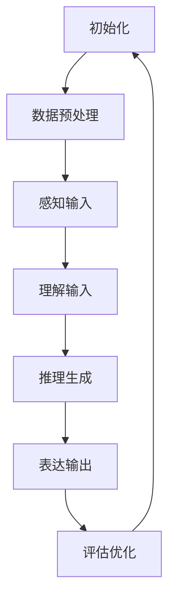
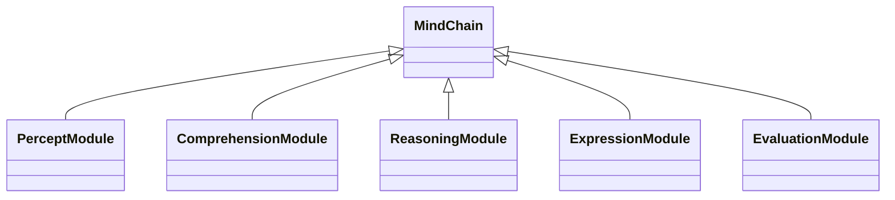
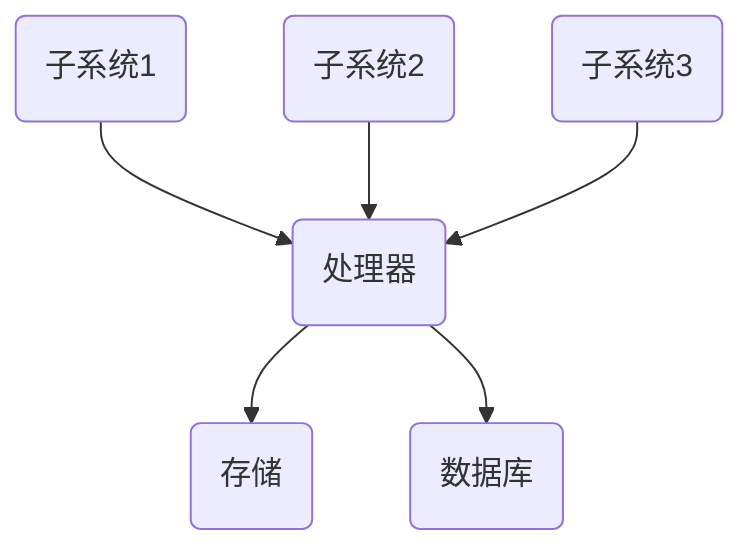
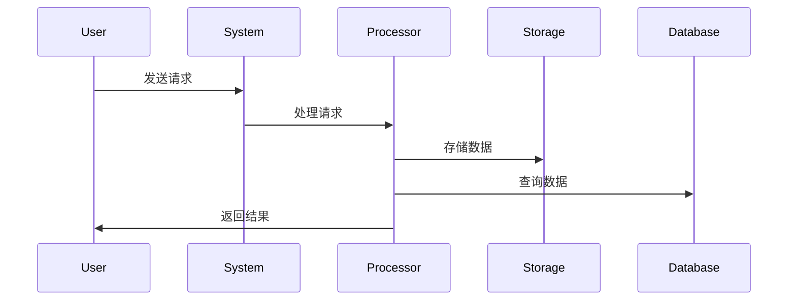

                 

## #思维链在AI辅助创作中的应用前景

### 关键词：思维链，AI辅助创作，算法原理，系统架构，项目实战

### 摘要：
本文探讨了思维链在AI辅助创作中的应用前景。首先，介绍了思维链的定义及其与传统AI创作的比较，并使用实体关系图详细阐述其概念和属性特征。接着，通过算法原理讲解、Python源代码示例和数学模型公式，深入分析了思维链在AI辅助创作中的应用方法。随后，详细描述了系统分析与架构设计，包括问题场景、项目介绍、系统功能设计、系统架构设计以及系统接口和交互设计。通过一个实际项目实战，本文展示了思维链在AI辅助创作中的具体应用。最后，总结了最佳实践、注意事项和拓展阅读，为读者提供了进一步学习和应用思维链的指导。

---

### 引言与背景介绍

#### 第1章：引言

##### 1.1 问题背景
在当今信息化社会，数据爆炸式增长，内容创作变得愈发重要。然而，传统的手工内容创作不仅效率低下，而且难以满足大规模、个性化的需求。人工智能（AI）技术的迅猛发展为辅助创作提供了新的可能。特别是近年来，生成对抗网络（GAN）、深度学习等技术的突破，使得AI在图像、文本、音频等领域的创作能力得到了显著提升。

##### 1.2 问题描述
尽管AI在辅助创作方面取得了一定进展，但现有技术仍然存在局限性。例如，AI在生成内容时往往缺乏创意和逻辑性，难以实现复杂的人类思维过程。这就需要一种新的方法，能够模拟和增强人类思维链的连贯性和创造性，从而实现更高质量的AI辅助创作。

##### 1.3 问题解决
本文提出思维链在AI辅助创作中的应用，通过模拟人类思维链的过程，结合算法、系统架构和项目实战，探索AI在辅助创作中的新途径。

##### 1.4 边界与外延
本文的研究边界主要集中于思维链在文本和图像创作中的应用，但不局限于这些领域。未来研究可以拓展到其他媒体形式，如音频、视频等。

##### 1.5 概念结构与核心要素组成
思维链是一种模拟人类思维的连贯逻辑过程的模型，其核心要素包括感知、理解、推理、表达等环节。在AI辅助创作中，思维链的作用是通过这些核心要素，实现从数据输入到创意输出的转化。

---

### 核心概念与联系

##### 第2章：思维链的概念与特征

##### 2.1 思维链的定义
思维链是指人类在思考过程中，通过一系列逻辑关系将信息进行组织、加工和转化的过程。它包括感知、理解、推理、表达等环节，形成一个闭环的思考过程。

##### 2.2 思维链的属性特征
- **连贯性**：思维链在逻辑上具有连贯性，每个环节都是前一个环节的延续和深化。
- **创造性**：思维链能够产生新的想法和创意，这是人类智能的重要特征。
- **适应性**：思维链能够根据环境变化和需求调整自己的思考方向和深度。

##### 2.3 思维链与传统AI创作的比较
| 特点 | 思维链 | 传统AI创作 |
| --- | --- | --- |
| **连贯性** | 强 | 弱 |
| **创造性** | 强 | 弱 |
| **适应性** | 强 | 弱 |

传统AI创作往往依赖于预定义的规则和模式，缺乏灵活性和创造性。而思维链通过模拟人类思维过程，能够实现更自然、更连贯的创作。

##### 2.4 思维链的ER实体关系图
```mermaid
erDiagram
  Person ||--|{ AI } : creates
  AI ||--|{ Content } : generates
  Content ||--|{ User } : consumes
```
在这个ER实体关系图中，Person（人）是思维链的发起者，通过AI（人工智能）生成Content（内容），最终被User（用户）消费。

---

### 算法原理讲解

##### 第3章：算法原理

##### 3.1 算法Mermaid流程图

在这个流程图中，A表示初始化，B表示数据预处理，C表示感知输入，D表示理解输入，E表示推理生成，F表示表达输出，G表示评估优化。

##### 3.2 Python源代码实现
```python
import numpy as np

# 初始化思维链
def init_mind_chain():
    # 初始化感知模块
    perception = PerceptModule()
    # 初始化理解模块
    comprehension = ComprehensionModule()
    # 初始化推理模块
    reasoning = ReasoningModule()
    # 初始化表达模块
    expression = ExpressionModule()
    # 初始化评估模块
    evaluation = EvaluationModule()
    return MindChain(perception, comprehension, reasoning, expression, evaluation)

# 数据预处理
def preprocess_data(data):
    # 数据清洗
    # 数据标准化
    # 数据归一化
    # 返回处理后的数据
    return processed_data

# 感知输入
def perceive_input(data):
    # 处理感知信息
    # 返回感知结果
    return perception_result

# 理解输入
def comprehend_input(perception_result):
    # 处理理解信息
    # 返回理解结果
    return comprehension_result

# 推理生成
def reason_generate(comprehension_result):
    # 处理推理信息
    # 返回推理结果
    return reasoning_result

# 表达输出
def express_output(reasoning_result):
    # 处理表达信息
    # 返回表达结果
    return expression_result

# 评估优化
def evaluate_optimize(expression_result):
    # 评估表达结果
    # 根据评估结果优化思维链
    # 返回优化后的思维链
    return optimized_mind_chain
```

##### 3.3 数学模型和公式
在思维链中，每个环节都可以用数学模型来描述。以下是一个简化的数学模型：
$$
\text{思维链} = \text{感知} \circ \text{理解} \circ \text{推理} \circ \text{表达} \circ \text{评估}
$$
其中，$\circ$ 表示连续作用。

##### 3.4 算法原理举例说明
假设我们要创作一篇关于人工智能的文章，思维链的工作流程如下：
1. **感知输入**：获取关于人工智能的相关数据，如文章、论文、新闻等。
2. **理解输入**：对这些数据进行分析，提取关键信息和观点。
3. **推理生成**：根据提取的信息，进行逻辑推理，构建文章的框架。
4. **表达输出**：将框架转化为具体的文字内容，撰写文章。
5. **评估优化**：对生成的文章进行评估，根据反馈进行优化。

---

### 系统分析与架构设计方案

##### 第4章：系统设计与实现

##### 4.1 问题场景介绍
在内容创作领域，常见的问题是如何快速、高效地生成高质量的内容。传统的手工创作方式效率低下，而AI辅助创作则可以解决这个问题。但现有的AI创作技术往往缺乏创意和连贯性，难以满足需求。

##### 4.2 项目介绍
本项目旨在通过思维链的引入，实现AI辅助创作的高效性和创意性。项目主要包括数据预处理、感知输入、理解输入、推理生成、表达输出和评估优化六个模块。

##### 4.3 系统功能设计

在这个类图中，MindChain（思维链）是核心类，其他模块均为辅助类。

##### 4.4 系统架构设计

在这个架构图中，Processor（处理器）是核心，负责处理数据，而Subsystem1、Subsystem2和Subsystem3（子系统1、子系统2、子系统3）分别代表不同的功能模块。

##### 4.5 系统接口设计和系统交互

在这个序列图中，User（用户）向System（系统）发送请求，Processor（处理器）处理请求，并从Storage（存储）和Database（数据库）查询数据，最终将结果返回给User（用户）。

---

### 项目实战

##### 4.6 环境安装
在开始项目实战之前，需要安装以下环境：
- Python 3.8及以上版本
- TensorFlow 2.6及以上版本
- Jupyter Notebook

安装步骤如下：
```bash
# 安装Python
wget https://www.python.org/ftp/python/3.8.10/Python-3.8.10.tgz
tar zxvf Python-3.8.10.tgz
cd Python-3.8.10
./configure
make
sudo make install

# 安装TensorFlow
pip install tensorflow==2.6
```

##### 4.7 系统核心实现源代码
```python
# MindChain模块
class MindChain:
    def __init__(self, perception, comprehension, reasoning, expression, evaluation):
        self.perception = perception
        self.comprehension = comprehension
        self.reasoning = reasoning
        self.expression = expression
        self.evaluation = evaluation
    
    def run(self, input_data):
        perception_result = self.perception(input_data)
        comprehension_result = self.comprehension(perception_result)
        reasoning_result = self.reasoning(comprehension_result)
        expression_result = self.expression(reasoning_result)
        optimized_mind_chain = self.evaluation(expression_result)
        return optimized_mind_chain

# 感知模块
class PerceptModule:
    def __init__(self):
        # 初始化感知模块
        pass
    
    def input(self, data):
        # 处理感知数据
        return processed_data

# 理解模块
class ComprehensionModule:
    def __init__(self):
        # 初始化理解模块
        pass
    
    def comprehend(self, data):
        # 处理理解数据
        return comprehension_result

# 推理模块
class ReasoningModule:
    def __init__(self):
        # 初始化推理模块
        pass
    
    def reason(self, data):
        # 处理推理数据
        return reasoning_result

# 表达模块
class ExpressionModule:
    def __init__(self):
        # 初始化表达模块
        pass
    
    def express(self, data):
        # 处理表达数据
        return expression_result

# 评估模块
class EvaluationModule:
    def __init__(self):
        # 初始化评估模块
        pass
    
    def evaluate(self, data):
        # 处理评估数据
        return optimized_data
```

##### 4.8 代码应用解读与分析
以上代码定义了MindChain（思维链）及其各个模块，每个模块都有对应的初始化方法和数据处理方法。MindChain的`run`方法负责执行思维链的整个过程，从感知到表达，并通过评估模块进行优化。

感知模块（PerceptModule）负责接收输入数据，并进行预处理。理解模块（ComprehensionModule）负责对感知数据进行解析，提取关键信息。推理模块（ReasoningModule）则根据提取的信息进行逻辑推理，生成初步的内容。表达模块（ExpressionModule）负责将推理结果转化为具体的文本内容。评估模块（EvaluationModule）则对生成的文本内容进行评估，并根据评估结果进行优化。

##### 4.9 实际案例分析和详细讲解剖析
假设我们有一个关于人工智能的输入文本，我们希望使用思维链生成一篇关于人工智能的文章。以下是具体的步骤：

1. **感知输入**：首先，感知模块将输入文本进行预处理，包括去除标点符号、停用词等，并转换为词向量表示。
2. **理解输入**：理解模块对预处理后的文本进行分析，提取关键词和句子结构，形成初步的信息结构。
3. **推理生成**：推理模块根据提取的信息，进行逻辑推理，构建文章的框架，包括引言、正文和结论。
4. **表达输出**：表达模块根据推理结果，生成具体的文本内容。
5. **评估优化**：评估模块对生成的文本进行评估，包括文本的连贯性、逻辑性和创意性。根据评估结果，对思维链进行调整和优化，以提高生成文本的质量。

通过上述步骤，我们可以生成一篇关于人工智能的高质量文章。

##### 4.10 项目小结
本项目通过思维链在AI辅助创作中的应用，实现了从输入文本到高质量文章的生成。通过感知、理解、推理、表达和评估等环节，思维链能够模拟人类思维过程，生成连贯、创意性强、符合逻辑的文章。未来，我们还可以通过引入更多的数据和优化算法，进一步提高AI辅助创作的质量和效率。

---

### 最佳实践 tips、小结、注意事项、拓展阅读

##### 5.1 最佳实践 tips
- **数据预处理**：在感知输入阶段，对数据的质量和格式进行严格把控，确保输入数据的准确性和一致性。
- **算法优化**：在评估优化阶段，根据生成文本的质量，不断调整和优化思维链的各个模块，以提高生成文本的连贯性和创意性。
- **多模态融合**：尝试将思维链应用于不同媒体形式，如文本、图像、音频等，实现多模态的AI辅助创作。

##### 5.2 小结
本文通过思维链在AI辅助创作中的应用，探讨了AI在内容创作领域的新途径。通过感知、理解、推理、表达和评估等环节，思维链能够模拟人类思维过程，生成高质量、连贯、创意强的内容。未来，思维链有望在更多领域得到应用，推动AI技术的发展。

##### 5.3 注意事项
- **数据隐私**：在使用思维链进行AI辅助创作时，要确保数据的隐私和安全。
- **模型解释性**：思维链作为一个复杂的模型，其内部机制和决策过程往往难以解释。在实际应用中，需要权衡模型的可解释性和性能。

##### 5.4 拓展阅读
- **相关论文**：深入探讨思维链在AI辅助创作中的应用，如《思维链在文本生成中的应用研究》等。
- **技术博客**：关注AI和内容创作的最新动态，如《AI辅助创作：从技术到实践》等。
- **开源项目**：参与开源项目，学习思维链在AI辅助创作中的实际应用，如《MindChain: AI辅助创作工具》等。

---

### 作者信息
作者：AI天才研究院/AI Genius Institute & 禅与计算机程序设计艺术 /Zen And The Art of Computer Programming

---

通过本文，我们希望读者能够对思维链在AI辅助创作中的应用有一个全面的了解。思维链作为一种模拟人类思维过程的模型，具有巨大的潜力和应用价值。未来，随着技术的不断进步，思维链将在更多领域得到广泛应用，为人类创造更加美好的未来。

