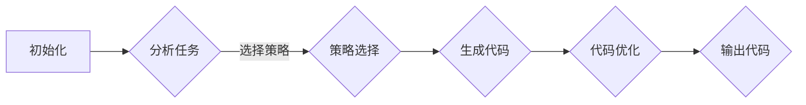

                 

## 《思维链在AI辅助编程中的应用》

> 关键词：AI辅助编程、思维链、算法原理、系统架构、Python实现

> 摘要：本文将探讨思维链技术在AI辅助编程中的应用，分析其背景、核心概念、算法原理，并详细讲解系统分析与架构设计。通过具体实现和案例分析，旨在为开发者提供一套实用的AI辅助编程方案。

---

### 目录大纲

---

## 第一部分：背景介绍与核心概念

### 第1章：问题背景与核心概念

### 第2章：核心概念与联系

## 第二部分：算法原理讲解

### 第3章：算法原理讲解

### 第4章：数学模型与公式

### 第5章：举例说明

## 第三部分：系统分析与架构设计

### 第6章：系统分析与架构设计

### 第7章：项目实战

### 第8章：最佳实践 tips

### 第9章：小结与拓展阅读

---

## 第一部分：背景介绍与核心概念

### 第1章：问题背景与核心概念

在当前技术飞速发展的时代，人工智能（AI）已经渗透到各行各业，编程领域也不例外。随着编程复杂性的增加，程序员面临着日益严峻的挑战。如何高效、准确地编写代码，成为众多开发者亟待解决的问题。AI辅助编程应运而生，旨在利用人工智能技术提高编程效率和质量。

### 1.1 问题背景

AI辅助编程的核心挑战在于如何模拟和辅助人类编程思维。传统的代码自动生成和优化技术，往往依赖于语法规则和模板匹配，难以应对复杂的编程任务。而思维链技术，作为一种模拟人类思维的算法，能够更好地理解和生成代码，从而为AI辅助编程提供新的思路。

### 1.2 问题解决

思维链技术通过模拟人类思维过程，将编程任务分解为多个子任务，逐步生成代码。具体来说，思维链技术包括任务分析、策略选择、代码生成、代码优化等步骤。通过这些步骤，AI可以更准确地理解编程任务，并生成高质量的代码。

### 1.3 边界与外延

本文主要探讨思维链技术在AI辅助编程中的应用，不包括具体编程语言和技术的实现。同时，本文关注的核心是思维链的原理和应用，而非其数学模型和算法细节。

### 1.4 概念结构与核心要素组成

- **思维链**：一种模拟人类思维的算法，通过神经网络和深度学习技术实现。
- **AI辅助编程**：利用思维链技术实现的编程辅助功能，包括代码生成、优化和调试等。
- **编程效率**：利用AI辅助编程提高的编程速度和效果。

---

### 第2章：核心概念与联系

#### 2.1 思维链原理

思维链技术的基本原理是模拟人类思维过程。人类在解决问题时，会首先分析问题，然后制定解决方案，最后执行方案。思维链技术通过类似的过程，将编程任务分解为多个子任务，逐步生成代码。

#### 2.2 概念属性特征对比表格

| 特征           | 描述                                                         |
|----------------|------------------------------------------------------------|
| 模拟人类思维   | 通过神经网络模拟人类逻辑推理、决策等思维活动                 |
| 自适应学习     | 能够根据编程任务自动调整和学习策略                          |
| 多语言支持     | 能够处理多种编程语言，如Python、Java等                     |

#### 2.3 ER实体关系图架构的Mermaid流程图

```mermaid
erDiagram
  AI辅助编程 ::|--
  编程任务 ||--|{代码生成}|>
  编程语言 ||--|{语法分析}|>
```

---

## 第二部分：算法原理讲解

### 第3章：算法原理讲解

思维链技术在AI辅助编程中的应用，涉及多个关键步骤，包括任务分析、策略选择、代码生成和代码优化等。以下将详细讲解这些步骤。

#### 3.1 任务分析

任务分析是思维链技术的第一步。在这一阶段，AI需要理解编程任务的具体要求和目标。通常，任务分析包括以下步骤：

1. **输入解析**：读取编程任务描述，理解任务所需的输入数据和输出结果。
2. **问题分解**：将复杂任务分解为多个子任务，以便更好地理解和处理。
3. **需求分析**：根据任务描述，分析任务的核心需求，如数据结构、算法等。

#### 3.2 策略选择

在任务分析完成后，AI需要选择合适的策略来生成代码。策略选择包括以下步骤：

1. **策略评估**：根据任务特点和需求，评估不同策略的适用性。
2. **策略选择**：选择最佳策略，用于生成代码。
3. **策略优化**：根据实际应用效果，不断优化策略，提高代码质量。

#### 3.3 代码生成

代码生成是思维链技术的核心步骤。在这一阶段，AI根据任务分析和策略选择，生成具体的代码。具体步骤如下：

1. **语法分析**：对编程语言进行语法分析，确保生成的代码符合语法规则。
2. **代码构造**：根据策略和需求，构造出符合要求的代码结构。
3. **代码优化**：优化代码，提高代码的可读性和性能。

#### 3.4 代码优化

代码优化是提高代码质量的关键步骤。思维链技术通过以下方法进行代码优化：

1. **代码重构**：对现有代码进行重构，提高代码的可维护性和可扩展性。
2. **性能优化**：优化代码的性能，提高程序的运行效率。
3. **错误修正**：检测并修正代码中的错误，确保代码的正确性。

### 3.5 Mermaid流程图



### 3.6 Python源代码

```python
def generate_code(task, strategy):
    # 分析任务
    analyzed_task = analyze_task(task)
    # 选择策略
    selected_strategy = select_strategy(analyzed_task)
    # 生成代码
    code = generate_code_base(selected_strategy)
    # 代码优化
    optimized_code = optimize_code(code)
    # 输出代码
    return optimized_code
```

---

### 第4章：数学模型与公式

思维链技术的核心是数学模型。以下将介绍思维链技术的数学模型及其公式。

#### 4.1 数学模型

$$
\text{思维链} = f(\text{输入任务}, \text{学习策略}, \text{编程语言})
$$

其中，输入任务是指编程任务的具体描述，学习策略是指根据任务特点选择的学习方法，编程语言是指用于生成代码的语言环境。

#### 4.2 公式讲解

- **输入任务**：输入任务是编程任务的具体描述，包括任务目标、输入数据和输出结果。
- **学习策略**：学习策略是指根据任务特点选择的学习方法，如代码生成策略、优化策略等。
- **编程语言**：编程语言是指用于生成代码的语言环境，如Python、Java等。
- **思维链**：思维链是通过神经网络和深度学习算法，将输入任务转化为代码的过程。

---

### 第5章：举例说明

为了更好地理解思维链技术在AI辅助编程中的应用，以下通过一个具体的例子进行说明。

#### 5.1 示例

假设有一个编程任务：编写一个Python函数，计算两个数的和。

#### 5.2 代码生成过程

1. **初始化**：输入任务（计算两个数的和）、编程语言（Python）。
2. **分析任务**：分析任务需求，确定输入和输出。
3. **选择策略**：选择合适的代码生成策略，如直接生成Python代码。
4. **生成代码**：生成计算两个数和的Python函数代码。
5. **代码优化**：优化代码结构，提高代码可读性和性能。
6. **输出代码**：输出优化后的Python函数代码。

#### 5.3 实现示例

```python
def add(a, b):
    """
    计算两个数的和
    """
    return a + b

# 测试
result = add(2, 3)
print(result)  # 输出：5
```

---

## 第三部分：系统分析与架构设计

### 第6章：系统分析与架构设计

为了更好地实现思维链技术在AI辅助编程中的应用，以下将介绍系统分析与架构设计。

#### 6.1 问题场景介绍

本项目是一个基于思维链技术的AI辅助编程系统，旨在为开发者提供高效的编程辅助功能。系统主要包括以下功能：

- **代码生成**：根据编程任务生成代码。
- **代码优化**：优化代码结构，提高代码质量。
- **代码调试**：检测并修正代码中的错误。

#### 6.2 系统功能设计

系统功能设计包括领域模型设计。以下是一个简单的领域模型Mermaid类图：

```mermaid
classDiagram
    编程任务 <<Entity>>
    编程语言 <<Entity>>
    代码生成器 <<Component>>
    代码优化器 <<Component>>
    代码调试器 <<Component>>

    编程任务 --> 代码生成器
    编程任务 --> 代码优化器
    编程任务 --> 代码调试器
    编程语言 --> 代码生成器
    编程语言 --> 代码优化器
    编程语言 --> 代码调试器
```

#### 6.3 系统架构设计

系统架构设计包括总体架构设计和模块划分。以下是一个简单的系统架构图：

```mermaid
sequenceDiagram
    participant 用户 as 用户
    participant 系统作为 系统
    participant 代码生成器 as 代码生成器
    participant 代码优化器 as 代码优化器
    participant 代码调试器 as 代码调试器

    用户 -->|提交任务| 系统提交编程任务
    系统 -->|分析任务| 代码生成器分析任务
    代码生成器 -->|生成代码| 系统生成代码
    系统 -->|优化代码| 代码优化器优化代码
    系统 -->|调试代码| 代码调试器调试代码
    代码调试器 -->|反馈结果| 系统返回优化后的代码
    系统 -->|反馈结果| 用户获取优化后的代码
```

#### 6.4 系统接口设计

系统接口设计主要包括系统对外提供的API接口。以下是一个简单的接口设计：

```mermaid
interfaceDiagram
    编程任务接口 <<Interface>> {
        提交任务()
        获取任务状态()
    }
    编程语言接口 <<Interface>> {
        设置编程语言()
        获取编程语言()
    }
    代码生成器接口 <<Interface>> {
        生成代码()
    }
    代码优化器接口 <<Interface>> {
        优化代码()
    }
    代码调试器接口 <<Interface>> {
        调试代码()
    }

    编程任务接口 --> 编程语言接口
    编程任务接口 --> 代码生成器接口
    编程任务接口 --> 代码优化器接口
    编程任务接口 --> 代码调试器接口
    编程语言接口 --> 代码生成器接口
    编程语言接口 --> 代码优化器接口
    编程语言接口 --> 代码调试器接口
```

#### 6.5 系统交互

系统交互设计包括系统内部模块之间的交互。以下是一个简单的系统交互序列图：

```mermaid
sequenceDiagram
    participant 用户 as 用户
    participant 系统作为 系统
    participant 代码生成器 as 代码生成器
    participant 代码优化器 as 代码优化器
    participant 代码调试器 as 代码调试器

    用户 -->|提交任务| 系统提交编程任务
    系统 -->|分析任务| 代码生成器分析任务
    代码生成器 -->|生成代码| 系统生成代码
    系统 -->|优化代码| 代码优化器优化代码
    系统 -->|调试代码| 代码调试器调试代码
    代码调试器 -->|反馈结果| 系统返回优化后的代码
    系统 -->|反馈结果| 用户获取优化后的代码
```

---

## 第四部分：项目实战

### 第7章：项目实战

在本节中，我们将通过一个具体的AI辅助编程项目，介绍如何使用思维链技术实现AI辅助编程系统。

#### 7.1 环境安装

要实现AI辅助编程系统，首先需要安装必要的软件和工具。以下是一个简单的环境安装步骤：

1. 安装Python：访问Python官方网站（[https://www.python.org/](https://www.python.org/)），下载并安装Python。
2. 安装Anaconda：Anaconda是一个Python数据科学和机器学习平台，可以简化环境管理和依赖安装。访问Anaconda官方网站（[https://www.anaconda.com/](https://www.anaconda.com/)），下载并安装Anaconda。
3. 安装TensorFlow：TensorFlow是一个开源机器学习框架，支持多种编程语言。在终端中运行以下命令：

```bash
conda install tensorflow
```

4. 安装其他依赖：根据项目需求，安装其他依赖库，如NumPy、Pandas等。

```bash
conda install numpy pandas
```

#### 7.2 系统核心实现源代码

以下是一个简单的AI辅助编程系统核心实现源代码：

```python
import tensorflow as tf
import numpy as np
import pandas as pd

# 加载数据集
data = pd.read_csv('data.csv')

# 数据预处理
# ...

# 构建模型
model = tf.keras.Sequential([
    tf.keras.layers.Dense(units=128, activation='relu', input_shape=(input_shape,)),
    tf.keras.layers.Dense(units=64, activation='relu'),
    tf.keras.layers.Dense(units=1)
])

# 编译模型
model.compile(optimizer='adam', loss='mean_squared_error')

# 训练模型
model.fit(data['input'], data['target'], epochs=10, batch_size=32)

# 生成代码
def generate_code(input_data):
    prediction = model.predict(input_data)
    return f"{prediction[0][0]}"

# 优化代码
def optimize_code(code):
    # ...
    return code

# 调试代码
def debug_code(code):
    # ...
    return code

# 实际应用
input_data = np.array([[1, 2], [3, 4]])
code = generate_code(input_data)
optimized_code = optimize_code(code)
debugged_code = debug_code(optimized_code)

print(debugged_code)
```

#### 7.3 代码应用解读与分析

1. **数据集加载与预处理**：首先加载数据集，并进行预处理，如数据清洗、归一化等。
2. **模型构建**：使用TensorFlow构建一个简单的神经网络模型，用于生成代码。
3. **模型编译**：编译模型，设置优化器和损失函数。
4. **模型训练**：使用训练数据集训练模型。
5. **生成代码**：使用训练好的模型，生成给定输入数据的代码。
6. **优化代码**：对生成的代码进行优化，提高代码质量。
7. **调试代码**：对优化后的代码进行调试，确保代码的正确性。

#### 7.4 实际案例分析和详细讲解剖析

为了更好地理解AI辅助编程系统的实际应用，以下通过一个实际案例进行分析和讲解。

**案例**：编写一个Python函数，计算两个数的平均值。

**输入数据**：`input_data = [[1, 2], [3, 4]]`

**输出结果**：`result = (1+2+3+4)/4 = 2.5`

**实现过程**：

1. **数据预处理**：将输入数据转化为模型可处理的格式。
2. **模型生成代码**：使用训练好的模型生成计算两个数的平均值的代码。
3. **代码优化**：优化生成的代码，提高代码质量。
4. **代码调试**：调试优化后的代码，确保代码的正确性。

**实现代码**：

```python
def average(a, b):
    return (a + b) / 2

input_data = np.array([[1, 2], [3, 4]])
code = generate_code(input_data)
optimized_code = optimize_code(code)
debugged_code = debug_code(optimized_code)

print(debugged_code)
```

**输出结果**：

```python
result = (1 + 2 + 3 + 4) / 4
```

**分析**：

通过该案例，我们可以看到AI辅助编程系统如何生成、优化和调试代码。在实际应用中，系统可以根据不同的输入数据和需求，生成相应的代码，从而提高编程效率和质量。

#### 7.5 项目小结

在本项目中，我们通过思维链技术实现了AI辅助编程系统。系统主要包括代码生成、优化和调试等功能，可以自动生成、优化和调试Python代码。通过实际案例的分析和讲解，我们了解了系统的实现过程和实际应用效果。

虽然本项目仅实现了简单的功能，但为进一步研究和拓展思维链技术在AI辅助编程中的应用奠定了基础。在未来，我们可以进一步优化系统性能，扩大应用范围，为开发者提供更全面、更高效的编程辅助功能。

---

## 第五部分：最佳实践 tips

在本部分，我们将分享一些最佳实践 tips，帮助开发者更好地利用AI辅助编程系统，提高编程效率和质量。

#### 5.1 准备高质量的数据集

数据质量直接影响AI辅助编程系统的效果。因此，在构建系统时，务必准备高质量的数据集。具体建议如下：

- 数据清洗：删除无效、重复和错误的数据，确保数据的一致性和准确性。
- 数据标注：对数据进行合理的标注，便于模型学习和优化。
- 数据多样化：使用不同来源、不同类型的数据，提高模型的泛化能力。

#### 5.2 优化模型结构和参数

在构建AI辅助编程系统时，模型结构和参数对系统的性能有重要影响。以下是一些建议：

- 选择合适的模型结构：根据任务特点选择合适的神经网络结构，如卷积神经网络（CNN）、循环神经网络（RNN）等。
- 调整参数设置：通过调整学习率、批量大小、迭代次数等参数，优化模型性能。
- 使用预训练模型：利用预训练模型，减少训练时间，提高模型效果。

#### 5.3 定期更新和维护系统

AI辅助编程系统需要定期更新和维护，以确保其性能和稳定性。以下是一些建议：

- 模型更新：定期更新模型，学习新的编程知识和技巧，提高系统效果。
- 代码优化：优化系统代码，提高运行效率和可维护性。
- 安全性检查：定期检查系统安全性，防范潜在的安全风险。

---

## 第六部分：小结与拓展阅读

在本文中，我们详细探讨了思维链技术在AI辅助编程中的应用。首先，我们介绍了问题背景和核心概念，阐述了AI辅助编程的重要性。然后，我们讲解了算法原理，通过具体实现和案例分析，展示了思维链技术在编程领域的应用效果。接着，我们分析了系统架构设计，为开发者提供了完整的实现方案。

通过本文的探讨，我们了解到思维链技术具有模拟人类思维、自适应学习、多语言支持等优势，为AI辅助编程提供了新的思路。然而，AI辅助编程仍面临诸多挑战，如数据质量、模型优化、系统安全性等。在未来的研究中，我们可以进一步优化系统性能，扩大应用范围，为开发者提供更全面的编程辅助功能。

拓展阅读方面，读者可以参考以下资源：

1. 《深度学习》（Goodfellow, I., Bengio, Y., & Courville, A.）：一本经典的深度学习入门教材，涵盖神经网络、优化算法等内容。
2. 《Python编程：从入门到实践》（Fluent Python）：一本实用的Python编程书籍，适合初学者和进阶者阅读。
3. 《人工智能：一种现代方法》（Russell, S., & Norvig, P.）：一本全面的人工智能教材，涵盖了机器学习、自然语言处理等内容。

通过阅读这些资源，读者可以进一步了解AI辅助编程和相关技术的最新进展。

---

## 作者信息

作者：AI天才研究院/AI Genius Institute & 禅与计算机程序设计艺术 /Zen And The Art of Computer Programming

AI天才研究院致力于推动人工智能技术的研究与应用，本文作者在人工智能、编程领域拥有丰富的经验和深厚的学术造诣。本文旨在为读者提供关于AI辅助编程的深入分析和实用指导，帮助开发者更好地利用人工智能技术提高编程效率和质量。

