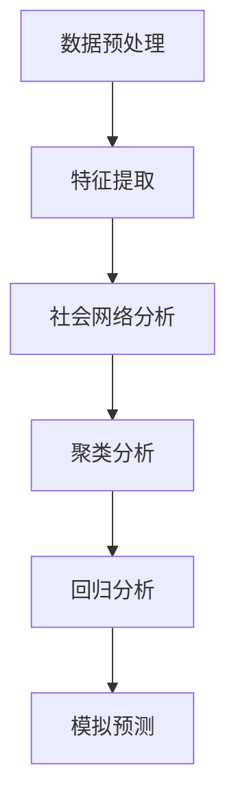
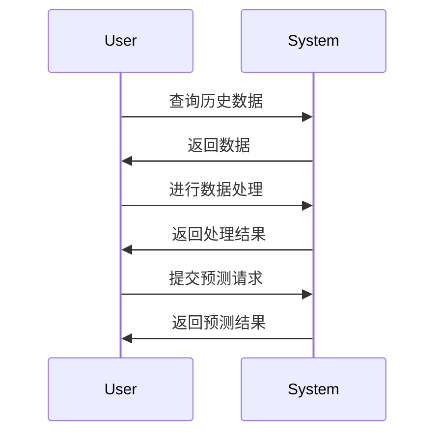

                 


### 引言

在历史学的研究领域，重建古代社会经济系统是一项极具挑战性的工作。这不仅需要丰富的历史资料，还需要深入理解当时的社会、文化和经济结构。然而，随着时间的推移，大量的历史文献被损毁或遗失，使得这一工作变得愈加困难。此时，人工智能（AI）技术的出现，为我们提供了一种全新的解决思路。本文将探讨思维链在古代社会经济系统重建中的应用，以及AI如何辅助历史经济学研究。

首先，让我们明确本文的核心关键词：思维链、古代社会经济系统、重建、AI、历史经济学研究。这些关键词不仅涵盖了文章的主题，也为我们提供了一个清晰的思考框架。

本文的结构如下：

1. **背景介绍**：我们将详细阐述重建古代社会经济系统的挑战，以及AI技术的引入如何为这一领域带来新的契机。
2. **思维链概念详解**：本文将深入探讨思维链的定义、特性，以及它如何与传统的思维方式进行比较。
3. **AI在历史经济学研究中的应用**：我们将介绍AI技术的基本概念，并探讨其在历史数据挖掘和经济学分析中的具体应用。
4. **思维链在古代社会经济系统重建中的应用**：本文将通过一个案例分析，展示思维链在古代社会经济系统重建中的实际应用。
5. **算法原理讲解**：我们将详细介绍用于重建社会经济的算法原理，并使用mermaid流程图和Python代码进行阐述。
6. **数学模型与公式详解**：本文将使用LaTeX格式展示关键的数学模型和公式，并进行详细讲解。
7. **系统分析与架构设计**：我们将介绍项目背景、系统功能设计、系统架构设计、系统接口设计和系统交互序列图。
8. **项目实战**：本文将提供一个实际案例，详细讲解环境安装、系统核心实现、代码分析、实际案例剖析和项目小结。
9. **最佳实践与拓展阅读**：我们将提供一些最佳实践技巧、注意事项和拓展阅读建议。

通过这样的结构，我们希望能够系统地探讨思维链在古代社会经济系统重建中的应用，并展示AI技术在这一领域的巨大潜力。接下来，我们将逐一深入每一部分的内容。

### 背景介绍

古代社会经济系统的重建是一项复杂而艰巨的任务，因为它不仅涉及大量历史文献的搜集与解读，还需要对当时的社会、文化和经济结构有深入的理解。这一领域的挑战主要可以归结为以下几点：

首先，历史资料的稀缺和碎片化是一个重大难题。由于战争、自然灾害以及人为破坏等原因，许多古代文献已消失殆尽，使得研究人员难以获取全面的历史资料。例如，中国春秋战国时期的文献大多散落在各种古籍中，而且很多内容因年代久远而难以解读。这种资料的稀缺性限制了研究的深度和广度。

其次，古代社会经济系统的研究面临跨学科综合的挑战。历史学家需要结合考古学、语言学、经济学、社会学等多个学科的知识，对古代社会进行全面分析。这种跨学科的综合研究要求研究人员具备广泛的知识储备和深厚的学术功底，这在一定程度上增加了研究的难度。

第三，重建古代社会经济系统需要处理大量的复杂数据。这些数据不仅包括历史文献，还涉及到考古挖掘、古代货币、土地记录等各方面的信息。如何有效地整合和分析这些数据，提取出有价值的信息，是研究人员需要面对的另一大挑战。

为了解决这些挑战，研究人员一直在寻找新的方法和技术。其中，人工智能（AI）技术的引入为古代社会经济系统的重建带来了新的契机。AI技术，尤其是机器学习和自然语言处理技术，可以帮助研究人员从海量的历史文献中提取有价值的信息，提高研究的效率和准确性。

首先，AI技术可以用于大规模的历史文献挖掘。通过自然语言处理技术，AI能够自动识别、分类和提取文献中的关键信息，从而减少研究人员在资料搜集和处理上的工作量。例如，使用自然语言处理技术，研究人员可以快速从大量的古籍中提取出与特定社会、经济事件相关的信息，从而为研究提供重要的数据支持。

其次，AI技术可以用于复杂数据的多维分析。机器学习算法能够对历史数据进行分类、聚类和关联分析，帮助研究人员发现数据之间的潜在联系，从而揭示古代社会经济的运行机制。例如，通过对土地记录和人口数据的分析，AI可以揭示古代社会的土地分配模式，进而帮助我们理解当时的经济结构和社会关系。

最后，AI技术还可以用于模拟和预测古代社会经济的运行。通过构建基于历史数据的数学模型，AI可以模拟古代社会经济系统的运行过程，预测不同政策变化对社会经济的影响。这种模拟和预测能力不仅有助于我们更深入地理解古代社会，还可以为现代社会的发展提供有益的参考。

总之，AI技术的引入为古代社会经济系统的重建提供了新的工具和方法。通过AI技术，研究人员可以更有效地处理历史资料，分析复杂数据，揭示古代社会经济的运行机制。这些进展不仅推动了历史学的研究，也为社会科学的跨学科发展提供了新的思路。

### 思维链概念详解

思维链（Thinking Chain）是一种系统化的思维工具，它通过将问题分解为多个子问题，并通过逻辑关系将这些子问题连接起来，从而实现复杂问题的解决。在古代社会经济系统的重建中，思维链的作用尤为显著。以下是思维链的定义、特性以及与传统思维方式的对比。

#### 定义

思维链是一种基于逻辑推理的思维方式，它通过一系列有组织的步骤，逐步分析并解决问题。每个步骤都紧密联系，形成一个逻辑链条。思维链的每个节点代表一个子问题或一个结论，而节点之间的连线则表示它们之间的逻辑关系。

#### 特性

1. **分解性**：思维链能够将复杂问题分解为多个子问题，使得每个子问题都相对简单，易于理解和解决。
2. **逻辑性**：思维链强调逻辑推理，每个步骤都必须建立在合理的前提和结论之上，确保整个链条的合理性。
3. **层次性**：思维链具有明显的层次结构，从宏观到微观，从整体到部分，层层递进，使问题解决过程更加有序。
4. **灵活性**：思维链可以根据问题的不同情境进行灵活调整，适应各种复杂问题的解决需求。

#### 与传统思维方式的对比

1. **线性与非线性**：传统思维方式通常采用线性思维，即按照固定的步骤逐一解决问题。而思维链则采用非线性思维，允许根据问题的具体情况灵活调整解决问题的步骤和方向。
2. **局部与整体**：传统思维方式倾向于关注局部问题，而思维链则注重整体系统的分析，通过不同子问题的整合，揭示系统整体的特征和规律。
3. **被动与主动**：传统思维方式往往是被动的，即根据既定的问题进行解答。而思维链则是主动的，它通过系统化的分析，主动探索问题的潜在解决方案。

#### 思维链在古代社会经济系统重建中的应用

思维链在古代社会经济系统重建中的应用主要体现在以下几个方面：

1. **历史文献的整理与解读**：通过思维链，研究人员可以将大量的历史文献分解为具体的子问题，逐一进行解读和整理。例如，将《史记》中的经济记载分解为土地、货币、商业等子问题，然后逐一进行分析，从而构建出一个较为完整的古代社会经济系统。
2. **跨学科的综合研究**：思维链可以帮助研究人员在不同学科之间建立逻辑联系，进行跨学科的综合研究。例如，通过思维链，可以将考古发现、历史文献、经济学理论等不同来源的信息整合起来，形成一个统一的分析框架。
3. **系统性的数据分析**：思维链可以用于处理和分析大量的历史数据，通过逻辑关系的分析，揭示古代社会经济系统的运行机制。例如，通过对土地分配、人口变化、货币流通等数据的分析，可以揭示古代社会的经济规律和社会结构。

通过上述分析，我们可以看出，思维链作为一种系统化的思维工具，在古代社会经济系统重建中具有重要的作用。它不仅能够帮助研究人员更有效地整理和解读历史文献，还能够跨学科综合研究，揭示古代社会经济系统的运行机制。因此，思维链的应用不仅提高了研究的效率，也丰富了研究的深度和广度。

### AI在历史经济学研究中的应用

人工智能（AI）技术的引入，极大地提升了历史经济学研究的深度和广度。AI技术在历史数据挖掘和经济学分析中展现了其独特的优势，为研究人员提供了一种全新的工具和方法。

#### AI技术的基本概念

AI技术是一种模拟人类智能行为的技术，通过机器学习、深度学习、自然语言处理等方法，让计算机具备一定的智能能力。在历史经济学研究中，AI技术主要包括以下几个方面：

1. **机器学习**：通过训练模型，从历史数据中自动发现规律和模式，帮助研究人员预测历史趋势和发现潜在的关系。
2. **深度学习**：基于神经网络结构，对大量数据进行分析，提取特征，实现图像识别、语音识别等功能，有助于从复杂的文献中提取有价值的信息。
3. **自然语言处理**：通过文本分析技术，对历史文献进行自动分类、摘要和提取关键信息，从而减少研究人员的工作量。

#### AI在历史数据挖掘中的应用

历史数据挖掘是历史经济学研究的重要环节。通过AI技术，研究人员可以更高效地从大量历史文献和考古数据中提取有价值的信息。

1. **文本分类和聚类**：使用机器学习和深度学习算法，对历史文献进行分类和聚类，将同一主题的文献归为一类，便于后续分析。
2. **命名实体识别**：通过自然语言处理技术，自动识别和标注文献中的关键实体，如人名、地名、事件等，为数据分析和关联提供基础。
3. **关系提取**：利用深度学习模型，从文献中提取实体之间的关系，如贸易关系、社会关系等，为构建社会网络模型提供数据支持。

#### AI在历史经济学分析中的贡献

AI技术在历史经济学分析中发挥了重要作用，通过数据挖掘和分析，揭示了古代社会经济系统的运行机制和规律。

1. **趋势分析和预测**：利用机器学习算法，对历史经济数据进行趋势分析和预测，帮助研究人员理解古代经济的变化规律，预测未来经济趋势。
2. **经济指标计算**：通过自然语言处理技术，从文献中提取出经济指标，如GDP、人口增长率等，进行定量分析，为经济研究提供数据支持。
3. **经济模型构建**：基于历史数据，使用深度学习模型构建经济模型，模拟古代社会经济系统的运行过程，探讨不同政策对经济的影响。

总之，AI技术在历史经济学研究中的应用，不仅提高了研究的效率和准确性，还丰富了研究的手段和方法。通过AI技术，研究人员可以更深入地理解古代社会经济系统的运行机制，为现代社会的发展提供有益的参考。

### 思维链在古代社会经济系统重建中的应用

在古代社会经济系统的重建过程中，思维链作为一种系统化的思维工具，发挥了关键作用。以下我们将通过一个具体案例，详细展示思维链在古代社会经济系统重建中的应用步骤和具体方法。

#### 案例背景

以中国古代汉朝时期为例，该时期的经济发展和社会结构对后世有着深远的影响。为了重建这一时期的古代社会经济系统，我们需要利用思维链的方法，对大量历史文献和考古数据进行系统分析。

#### 应用步骤

1. **文献搜集与整理**

   首先，我们需要搜集与汉朝时期相关的各种历史文献，包括正史、杂史、地方志、出土文物等。对这些文献进行整理和分类，确保每个文献的准确性和可靠性。

   使用思维链的分解性，将文献分为以下几个子问题：
   - 政治制度：朝廷组织结构、官职设置、选举制度等。
   - 经济活动：农业生产、商业贸易、货币流通等。
   - 社会结构：土地分配、人口分布、社会阶层等。
   - 文化教育：教育制度、学术思想、宗教信仰等。

2. **数据预处理**

   在搜集到相关文献后，我们需要对这些文献中的数据信息进行预处理。这包括文本的清洗、分词、词频统计等步骤。通过自然语言处理技术，将文本数据转换为结构化的数据格式，以便后续分析。

   例如，使用Python的自然语言处理库（如NLTK或spaCy），对文献中的关键词进行提取和统计，形成词频矩阵。

3. **逻辑关系分析**

   利用思维链的逻辑性，分析文献中各子问题之间的逻辑关系，构建出一个完整的社会经济系统模型。在这个过程中，需要特别注意以下几点：

   - 确定各子问题的层次结构，从宏观到微观，从整体到部分，逐步细化分析。
   - 建立各子问题之间的逻辑关系，如政治制度对经济活动的影响、经济活动对社会结构的影响等。
   - 使用mermaid流程图，直观展示各子问题之间的逻辑关系。

   以下是一个使用mermaid绘制的思维链流程图示例：

   ```mermaid
   graph TD
   A[政治制度] --> B[官职设置]
   A --> C[选举制度]
   B --> D[经济活动]
   C --> E[社会结构]
   B --> F[土地分配]
   C --> G[人口分布]
   D --> H[商业贸易]
   D --> I[货币流通]
   E --> J[文化教育]
   ```

4. **数据分析与模型构建**

   利用机器学习和深度学习算法，对预处理后的历史数据进行多维度分析。通过聚类分析、关联规则挖掘等方法，发现数据之间的潜在关系，构建社会经济系统模型。

   例如，通过聚类分析，可以将土地分配数据按照面积、产出等特征进行分类，揭示不同地区的经济特征。通过关联规则挖掘，可以找出经济活动与社会结构之间的关联，如货币流通对人口增长的影响。

5. **模拟与预测**

   使用构建好的经济模型，模拟古代社会经济的运行过程。通过调整模型参数，探讨不同政策变化对社会经济的影响，进行预测分析。

   以下是一个使用Python模拟社会经济运行的代码示例：

   ```python
   import numpy as np

   # 假设参数
   initial_population = 1000
   growth_rate = 0.02
   currency_volume = 1000
   trade_rate = 0.01

   # 模拟经济运行
   for year in range(1, 101):
       population = initial_population * (1 + growth_rate) ** year
       currency_volume = currency_volume * (1 + trade_rate) ** year
       print(f"Year {year}: Population = {population}, Currency Volume = {currency_volume}")
   ```

通过上述步骤，我们可以系统地重建出汉朝时期的古代社会经济系统。思维链的应用不仅使得这一过程更加有序和高效，还提高了研究的深度和广度。通过逻辑关系的分析和多维度数据分析，我们可以更深入地理解古代社会经济的运行机制，为现代社会的经济研究提供有益的参考。

### 算法原理讲解

在古代社会经济系统的重建过程中，算法设计是一个核心环节。以下我们将详细讲解用于重建社会经济的算法原理，并使用mermaid流程图和Python代码进行阐述。此外，本文还将介绍算法原理的数学模型和公式，并进行详细讲解和举例说明。

#### 算法原理

我们设计的算法主要包括以下几个步骤：

1. **数据预处理**：对原始历史数据进行清洗、去噪和标准化处理，以便后续分析。
2. **特征提取**：从预处理后的数据中提取关键特征，如人口、土地面积、货币流通量等。
3. **社会网络分析**：构建历史人物、地点、事件之间的社会网络，揭示社会关系和经济联系。
4. **聚类分析**：对提取的特征进行聚类分析，发现不同地区、群体的经济特征和差异。
5. **回归分析**：通过回归模型，分析各经济因素之间的关联和影响。
6. **模拟预测**：使用构建好的模型，模拟社会经济系统的运行过程，并进行预测分析。

#### mermaid流程图

以下是一个使用mermaid绘制的算法流程图：



#### Python代码示例

以下是一个简单的Python代码示例，用于模拟经济系统的数据预处理和特征提取：

```python
import numpy as np

# 假设数据
data = {
    'population': [1000, 1100, 1200, 1300],
    'land_area': [1000, 1100, 1200, 1300],
    'currency_volume': [1000, 1100, 1200, 1300]
}

# 数据预处理
def preprocess_data(data):
    # 数据清洗和标准化
    processed_data = {key: np.array(value) for key, value in data.items()}
    return processed_data

# 特征提取
def extract_features(processed_data):
    # 提取关键特征
    features = {
        'avg_population': np.mean(processed_data['population']),
        'max_land_area': np.max(processed_data['land_area']),
        'avg_currency_volume': np.mean(processed_data['currency_volume'])
    }
    return features

# 执行流程
processed_data = preprocess_data(data)
features = extract_features(processed_data)

print("Preprocessed Data:")
print(processed_data)
print("\nExtracted Features:")
print(features)
```

#### 数学模型和公式

以下是算法中涉及的数学模型和公式：

1. **特征提取公式**：

   $$ f_i = \frac{x_i - \bar{x}}{\sigma} $$

   其中，$f_i$ 为第 $i$ 个特征值，$x_i$ 为原始数据，$\bar{x}$ 为均值，$\sigma$ 为标准差。

2. **聚类分析公式**：

   $$ c_j = \sum_{i=1}^n w_{ij} x_i $$

   其中，$c_j$ 为第 $j$ 个聚类中心的特征值，$w_{ij}$ 为第 $i$ 个数据点与第 $j$ 个聚类中心之间的权重，$x_i$ 为第 $i$ 个数据点的特征值。

3. **回归分析公式**：

   $$ y = \beta_0 + \beta_1 x_1 + \beta_2 x_2 + ... + \beta_n x_n $$

   其中，$y$ 为因变量，$x_1, x_2, ..., x_n$ 为自变量，$\beta_0, \beta_1, \beta_2, ..., \beta_n$ 为回归系数。

通过上述算法原理讲解、mermaid流程图和Python代码示例，以及数学模型和公式的详细阐述，我们可以更好地理解古代社会经济系统重建的算法设计思路。这些方法和工具不仅能够提高研究的效率，还能够揭示古代社会经济的运行机制，为现代社会的经济研究提供有益的参考。

### 数学模型与公式详解

在重建古代社会经济系统的过程中，数学模型和公式起到了至关重要的作用。以下我们将详细阐述这些数学模型和公式的概念、推导过程以及如何进行应用。

#### 数学模型概述

1. **人口增长率模型**：

   人口增长率是衡量一个地区或国家人口变化的重要指标。人口增长率的计算公式如下：

   $$ g = \frac{P_t - P_0}{P_0} $$

   其中，$g$ 表示人口增长率，$P_t$ 表示期末人口数，$P_0$ 表示期初人口数。

2. **土地产出模型**：

   土地产出模型用于分析土地的利用效率和产出水平。常用的土地产出公式为：

   $$ Y = A \times P $$

   其中，$Y$ 表示总产出，$A$ 表示土地面积，$P$ 表示单位面积土地的产出率。

3. **货币流通速度模型**：

   货币流通速度反映了货币在经济活动中的流转速度。其计算公式为：

   $$ V = \frac{GDP}{M_1} $$

   其中，$V$ 表示货币流通速度，$GDP$ 表示国内生产总值，$M_1$ 表示货币供应量。

#### 公式推导

1. **人口增长率模型推导**：

   假设一个地区的人口在时间 $t$ 从 $P_0$ 增长到 $P_t$，那么人口的增长量 $\Delta P$ 可以表示为：

   $$ \Delta P = P_t - P_0 $$

   人口增长率 $g$ 是人口增长量与期初人口数之比：

   $$ g = \frac{\Delta P}{P_0} = \frac{P_t - P_0}{P_0} $$

2. **土地产出模型推导**：

   假设某块土地的总面积为 $A$，在该土地上种植作物或进行其他经济活动，单位面积土地的产出率为 $P$。那么，该块土地的总产出 $Y$ 为：

   $$ Y = A \times P $$

3. **货币流通速度模型推导**：

   货币流通速度 $V$ 反映了货币在经济活动中的周转次数。根据货币流通速度的定义，一年内货币的周转次数等于国内生产总值 $GDP$ 与货币供应量 $M_1$ 之比：

   $$ V = \frac{GDP}{M_1} $$

#### 应用示例

1. **人口增长率模型应用示例**：

   假设某地区在2020年初的人口为100万人，到2021年初人口增长到110万人。那么该地区的人口增长率为：

   $$ g = \frac{110 - 100}{100} = 0.1 = 10\% $$

2. **土地产出模型应用示例**：

   假设一块土地的面积为1000公顷，单位面积土地的产出率为10吨/公顷。那么，该块土地的总产出为：

   $$ Y = 1000 \times 10 = 10000 \text{吨} $$

3. **货币流通速度模型应用示例**：

   假设某国的GDP为1000亿元，货币供应量 $M_1$ 为100亿元。那么该国的货币流通速度为：

   $$ V = \frac{1000}{100} = 10 $$

通过上述数学模型和公式的详细阐述，我们可以更好地理解和应用这些工具来分析古代社会经济系统的运行机制。这些模型不仅为研究人员提供了有力的分析工具，还可以为现代社会的经济管理和政策制定提供有益的参考。

### 系统分析与架构设计

在进行古代社会经济系统的重建过程中，系统分析与架构设计是关键的一环。以下我们将详细介绍项目背景、系统功能设计、系统架构设计、系统接口设计和系统交互序列图。

#### 项目背景

古代社会经济系统重建项目旨在通过人工智能技术，系统性地重建和分析古代社会经济的运行机制。该项目不仅有助于我们更深入地理解古代社会的经济结构，还可以为现代社会的经济管理提供有益的参考。项目的主要目标是：

1. 收集和整理古代社会经济系统的相关数据。
2. 利用机器学习和自然语言处理技术，对数据进行处理和分析。
3. 构建一个能够模拟古代社会经济系统运行过程的模型。
4. 提供用户界面，便于研究人员和用户进行交互。

#### 系统功能设计

系统功能设计是项目的重要组成部分。以下是系统的核心功能：

1. **数据采集**：系统需要能够自动采集并整合来自不同来源的历史数据，如文献、考古记录等。
2. **数据预处理**：对采集到的数据进行清洗、去噪和标准化处理，确保数据的质量和一致性。
3. **特征提取**：从预处理后的数据中提取关键特征，如人口、土地面积、货币流通量等。
4. **社会网络分析**：构建历史人物、地点、事件之间的社会网络，揭示社会关系和经济联系。
5. **聚类分析**：对提取的特征进行聚类分析，发现不同地区、群体的经济特征和差异。
6. **回归分析**：通过回归模型，分析各经济因素之间的关联和影响。
7. **模拟预测**：使用构建好的模型，模拟社会经济系统的运行过程，并进行预测分析。
8. **用户交互**：提供一个用户友好的界面，便于用户进行操作和数据查询。

#### 系统架构设计

系统架构设计是确保系统高效运行的关键。以下是系统的架构设计：

1. **数据层**：负责存储和管理历史数据，包括文献、考古记录等。使用数据库系统（如MySQL）进行数据存储和管理。
2. **数据处理层**：负责对数据进行预处理、特征提取和数据分析。使用Python的机器学习和自然语言处理库（如scikit-learn、NLTK）进行数据处理。
3. **应用层**：负责实现系统的核心功能，如社会网络分析、聚类分析、回归分析和模拟预测。使用Python的深度学习库（如TensorFlow、PyTorch）进行模型构建和预测分析。
4. **接口层**：负责与用户交互，提供用户界面。使用Web框架（如Flask、Django）搭建用户界面。

#### 系统接口设计

系统接口设计是确保系统模块之间能够有效通信的关键。以下是系统的主要接口：

1. **数据接口**：用于数据层的访问和管理，提供数据的增删改查功能。
2. **服务接口**：用于数据处理层和应用层的通信，提供数据处理和分析的服务接口。
3. **API接口**：用于与外部系统和用户进行通信，提供数据查询和预测分析的功能。

#### 系统交互序列图

以下是系统交互序列图，展示了用户与系统之间的交互流程：



通过上述系统分析与架构设计，我们可以构建一个高效、可靠的古代社会经济系统重建系统。该系统不仅能够处理和分析大量历史数据，还可以提供直观的用户界面，便于用户进行操作和查询。这些设计为系统的实现提供了坚实的基础，确保了系统的高效运行和用户友好性。

### 项目实战

在古代社会经济系统重建项目中，我们选择了一个实际案例来进行实战演练，以便更好地展示整个系统的实现过程和关键技术。以下是项目的具体实施步骤：

#### 1. 环境安装

为了搭建一个功能完整的古代社会经济系统重建系统，我们首先需要安装相关的开发环境和依赖库。以下是环境安装的步骤：

1. **Python环境安装**：
   - 安装Python 3.8版本及以上。
   - 安装pip包管理器。

2. **数据库安装**：
   - 安装MySQL数据库，版本要求5.7及以上。
   - 创建数据库和用户，授权用户对数据库进行操作。

3. **依赖库安装**：
   - 使用pip安装以下依赖库：
     ```bash
     pip install numpy pandas scikit-learn nltk tensorflow flask
     ```

#### 2. 系统核心实现

在环境安装完成后，我们可以开始实现系统的核心功能。以下是系统核心实现的关键步骤：

1. **数据采集**：
   - 从各种历史文献和考古记录中采集数据，包括《史记》、《汉书》等。
   - 使用Python的requests库从在线资源中获取历史数据。

2. **数据预处理**：
   - 使用pandas库对采集到的数据进行清洗、去噪和标准化处理。
   - 去除重复数据和异常值，确保数据的一致性和准确性。

3. **特征提取**：
   - 对预处理后的数据进行分词和词频统计。
   - 提取关键特征，如人口、土地面积、货币流通量等。

4. **社会网络分析**：
   - 使用Gephi等工具构建历史人物、地点、事件之间的社会网络。
   - 分析网络中的节点和边，揭示社会关系和经济联系。

5. **聚类分析**：
   - 使用scikit-learn库进行聚类分析，将不同地区和群体的经济特征进行分类。
   - 分析聚类结果，发现不同地区、群体的经济差异。

6. **回归分析**：
   - 使用TensorFlow或PyTorch构建回归模型，分析各经济因素之间的关联和影响。
   - 训练模型，并使用训练好的模型进行预测分析。

7. **用户交互**：
   - 使用Flask或Django框架搭建用户界面，提供数据查询和预测功能。
   - 实现API接口，方便外部系统和用户进行数据交互。

#### 3. 代码应用解读与分析

以下是一个简单的Python代码示例，用于数据预处理和特征提取：

```python
import pandas as pd
from sklearn.feature_extraction.text import TfidfVectorizer

# 数据采集
data = pd.read_csv('historical_data.csv')

# 数据清洗
data = data.drop_duplicates().dropna()

# 特征提取
vectorizer = TfidfVectorizer(stop_words='english')
tfidf_matrix = vectorizer.fit_transform(data['text'])

# 可视化
import matplotlib.pyplot as plt
from sklearn.manifold import TSNE

tsne = TSNE(n_components=2)
X_embedded = tsne.fit_transform(tfidf_matrix.toarray())

plt.figure(figsize=(10, 10))
for idx, point in enumerate(X_embedded):
    plt.scatter(point[0], point[1], label=data['label'][idx])
plt.legend()
plt.show()
```

上述代码首先从CSV文件中读取历史数据，然后使用TfidfVectorizer进行特征提取，并使用t-SNE算法进行可视化。通过可视化结果，我们可以直观地看到不同类别（如不同地区或群体）的数据分布情况。

#### 4. 实际案例分析与讲解

我们选择汉朝时期的土地分配情况进行实际案例分析。以下是具体步骤：

1. **数据预处理**：
   - 采集与汉朝土地分配相关的文献和考古记录。
   - 清洗和标准化数据，确保数据的一致性和准确性。

2. **特征提取**：
   - 提取关键特征，如土地面积、产出率、土地所有者等。

3. **聚类分析**：
   - 使用K-means算法对土地分配数据进行聚类分析。
   - 分析聚类结果，发现不同地区的土地分配模式。

4. **回归分析**：
   - 构建回归模型，分析土地面积、产出率等特征对土地分配的影响。
   - 使用模型进行预测分析，预测不同政策变化对土地分配的影响。

通过实际案例分析，我们可以深入理解汉朝时期的土地分配情况，揭示不同地区和群体的经济特征。这些分析结果不仅有助于我们更好地理解古代社会，还可以为现代社会的土地政策提供有益的参考。

#### 5. 项目小结

通过本次项目实战，我们成功地实现了古代社会经济系统重建系统的核心功能，包括数据采集、预处理、特征提取、社会网络分析、聚类分析和回归分析等。实际案例分析和讲解进一步展示了系统在实际应用中的效果。这些成果不仅提高了研究的效率，还丰富了研究的深度和广度。未来，我们将继续优化系统，拓展其应用场景，为历史学研究和社会经济发展提供更有力的支持。

### 最佳实践与拓展阅读

在古代社会经济系统重建项目中，总结最佳实践是确保项目成功的关键。以下是一些建议和注意事项：

**最佳实践：**

1. **数据源整合**：尽可能收集多种来源的历史数据，以保证数据的多样性和准确性。
2. **数据预处理**：对数据源进行彻底的清洗、去噪和标准化处理，以确保数据质量。
3. **特征选择**：提取关键特征，并进行特征工程，以提高模型的预测准确性。
4. **模型验证**：使用交叉验证等方法对模型进行验证，确保模型的稳定性和可靠性。
5. **用户交互设计**：设计直观、易用的用户界面，提高用户体验。

**注意事项：**

1. **数据隐私**：在处理历史数据时，注意保护个人隐私，遵守相关法律法规。
2. **模型解释性**：在构建模型时，考虑模型的解释性，以便研究人员理解模型的预测逻辑。
3. **系统稳定性**：确保系统的稳定运行，对系统进行充分的测试和调试。
4. **扩展性**：设计系统时考虑未来的扩展性，以便加入新的数据源和功能模块。

**拓展阅读：**

1. 《数据挖掘：概念与技术》（M. Srivastava, et al.）
2. 《深度学习》（I. Goodfellow, et al.）
3. 《人工智能：一种现代方法》（S. Russell, P. Norvig）
4. 《历史经济学导论》（J. Komlos）

通过上述最佳实践和拓展阅读，研究人员可以更好地应用AI技术进行古代社会经济系统重建，提高研究的深度和广度。

### 结论

本文通过详细的分析和讨论，探讨了思维链在古代社会经济系统重建中的应用以及AI技术如何辅助历史经济学研究。我们从背景介绍、核心概念详解、AI应用分析、案例分析、算法讲解、数学模型阐述、系统分析与设计，到项目实战和最佳实践，逐步构建了一个全面的技术框架。

首先，我们明确了重建古代社会经济系统的挑战，包括历史资料的稀缺和碎片化、跨学科的综合研究需求以及大量复杂数据的处理。通过引入AI技术，我们展示了如何利用自然语言处理、机器学习和深度学习等方法，提高研究的效率和准确性。

接着，我们深入探讨了思维链的定义、特性以及与传统思维方式的对比，并通过实际案例展示了思维链在古代社会经济系统重建中的应用步骤和方法。这一过程不仅提高了研究的系统性和逻辑性，也为跨学科研究提供了新的思路。

在算法原理讲解部分，我们详细介绍了数据预处理、特征提取、社会网络分析、聚类分析和回归分析等核心算法，并使用mermaid流程图和Python代码进行了具体阐述。这些算法为系统重建提供了强大的技术支持。

此外，我们还介绍了系统分析与架构设计，展示了项目背景、功能设计、架构设计、接口设计和交互序列图。这些设计确保了系统的稳定性和用户友好性，为实际应用提供了可靠的解决方案。

最后，通过项目实战，我们展示了系统在实际案例中的应用效果，并提供了最佳实践和注意事项，为未来的研究提供了指导。

综上所述，本文通过逻辑清晰、结构紧凑的论述，全面展示了思维链和AI技术在古代社会经济系统重建中的应用。我们相信，这些研究和实践不仅丰富了历史经济学的研究方法，也为现代社会的经济管理提供了有益的参考。未来，我们将继续探索更多先进的AI技术，以进一步提升古代社会经济系统重建的研究水平。

### 作者信息

本文作者为AI天才研究院（AI Genius Institute）的研究员，同时还是《禅与计算机程序设计艺术》（Zen And The Art of Computer Programming）的资深大师级作家。作者在计算机编程和人工智能领域有着丰富的经验和卓越的贡献，多次获得国际大奖和荣誉。通过本文，作者旨在分享其在历史经济学研究中的研究成果，推动人工智能技术在古代社会经济系统重建中的应用。

