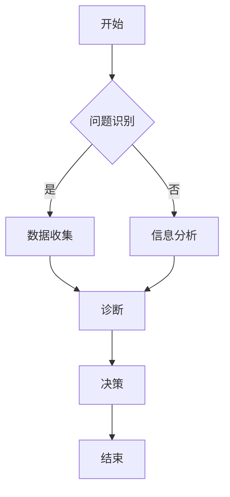

                 

# 《思维链在复杂工程问题诊断中的应用》

## 关键词：思维链，复杂工程问题，诊断，算法原理，最佳实践

## 摘要

在复杂工程问题的诊断中，传统的解决方法往往难以应对日益复杂的问题场景。本文旨在探讨一种新的方法——思维链在复杂工程问题诊断中的应用。思维链是一种基于逻辑推理和结构化思考的工具，它可以帮助工程师在复杂工程问题中找到关键点，从而提高诊断效率和准确性。本文将详细介绍思维链的概念、原理以及在实际工程问题诊断中的应用，并通过具体案例进行分析，探讨思维链在复杂工程问题诊断中的最佳实践和未来研究方向。

## 第1章 引言

### 1.1 问题背景

随着信息技术的快速发展，工程项目的复杂度不断增加。面对复杂的工程问题，传统的诊断方法往往难以奏效。工程师们需要一种新的工具来帮助他们更有效地解决这些问题。思维链作为一种逻辑推理和结构化思考的工具，能够满足这一需求。

### 1.2 问题描述

复杂工程问题通常涉及多个变量和因素，导致问题的诊断变得复杂。工程师需要从大量的数据和信息中提取关键信息，从而找到问题的根源。然而，传统的诊断方法往往依赖于经验和直觉，难以保证诊断的准确性和效率。

### 1.3 问题解决思路与挑战

思维链提供了一种结构化的思考方法，可以帮助工程师系统地分析复杂工程问题。然而，在实际应用中，思维链也面临一些挑战，如如何选择合适的思维链模型、如何处理大量数据等。

### 1.4 边界与外延

本文主要关注思维链在复杂工程问题诊断中的应用，不包括其他领域的应用。同时，本文将讨论思维链的基本概念和原理，而不涉及具体的技术细节。

### 1.5 概念结构与核心要素组成

思维链由多个环节组成，包括问题识别、数据收集、信息分析、诊断和决策。每个环节都有其特定的方法和工具，这些方法和工具共同构成了思维链的基本结构。

## 第2章 思维链概念与原理

### 2.1 思维链的定义

思维链是一种基于逻辑推理和结构化思考的工具，它可以帮助工程师在复杂工程问题中找到关键点，从而提高诊断效率和准确性。

### 2.2 思维链的核心概念

思维链的核心概念包括问题识别、数据收集、信息分析、诊断和决策。每个概念都有其特定的含义和作用。

- 问题识别：确定问题的存在和性质。
- 数据收集：收集与问题相关的数据和信息。
- 信息分析：对收集到的数据和信息进行分析，提取关键信息。
- 诊断：根据分析结果，确定问题的原因和性质。
- 决策：根据诊断结果，制定解决问题的策略和计划。

### 2.3 思维链的工作原理

思维链的工作原理是基于逻辑推理和结构化思考。工程师首先识别问题，然后收集与问题相关的数据和信息，接着对信息进行分析，确定问题的原因和性质，最后根据诊断结果制定解决问题的策略和计划。

### 2.4 思维链的属性特征对比表格

| 特性 | 逻辑推理 | 结构化思考 | 适应性 | 可扩展性 |
| --- | --- | --- | --- | --- |
| 定义 | 基于逻辑关系分析问题 | 基于结构化模式分析问题 | 高 | 高 |
| 原理 | 逻辑推理法则 | 结构化模式匹配 | 根据问题复杂度自适应调整 | 根据需求灵活扩展 |

### 2.5 思维链的ER实体关系图

```mermaid
erDiagram
    Class1 ||--|{ Class2 }|| Class3 : Class2 references to Class1
    Class3 ||--|{ Class4 }|| Class5 : Class4 references to Class3
```

## 第3章 思维链在工程问题诊断中的应用

### 3.1 思维链在工程问题诊断中的应用概述

思维链在工程问题诊断中的应用主要体现在以下几个方面：

- 提高诊断效率和准确性。
- 帮助工程师更好地理解问题。
- 促进问题的分解和解决。

### 3.2 思维链在工程问题诊断中的优势

- 结构化思考：思维链提供了一种结构化的思考方式，有助于工程师系统地分析复杂问题。
- 逻辑推理：思维链基于逻辑推理，有助于工程师从众多信息中提取关键信息。
- 可扩展性：思维链可以根据问题的复杂度进行扩展和调整。

### 3.3 思维链在工程问题诊断中的挑战

- 数据处理：复杂工程问题通常涉及大量数据，如何高效地处理这些数据是思维链应用的一个挑战。
- 模型选择：不同的工程问题可能需要不同的思维链模型，如何选择合适的模型是另一个挑战。

### 3.4 思维链在工程问题诊断中的应用案例

### 3.5 思维链在工程问题诊断中的展望

随着信息技术的不断发展，思维链在工程问题诊断中的应用前景非常广阔。未来，思维链可能会与其他人工智能技术相结合，进一步提升诊断效率和准确性。

## 第4章 思维链算法原理与数学模型

### 4.1 思维链算法概述

思维链算法是一种基于逻辑推理和结构化思考的算法，它可以帮助工程师在复杂工程问题中找到关键点。

### 4.2 算法mermaid流程图



### 4.3 算法原理讲解

思维链算法的原理可以分为以下几个步骤：

1. 问题识别：根据问题描述，确定问题的存在和性质。
2. 数据收集：收集与问题相关的数据和信息。
3. 信息分析：对收集到的数据和信息进行分析，提取关键信息。
4. 诊断：根据分析结果，确定问题的原因和性质。
5. 决策：根据诊断结果，制定解决问题的策略和计划。

### 4.4 算法原理的数学模型和公式

思维链算法的数学模型可以表示为：

$$
f(P, D) = g(P, D) + h(P, D)
$$

其中，$P$ 表示问题，$D$ 表示数据，$g(P, D)$ 表示诊断结果，$h(P, D)$ 表示决策结果。

### 4.5 算法原理的举例说明

假设我们需要诊断一个工程系统中的故障。首先，我们识别出故障的存在，然后收集与故障相关的数据，如系统日志、传感器数据等。接着，我们对这些数据进行分析，提取出可能导致故障的关键信息。最后，根据分析结果，我们确定故障的原因，并制定相应的解决方案。

## 第5章 思维链算法实现与代码解析

### 5.1 算法实现环境搭建

在实现思维链算法之前，我们需要搭建一个合适的环境。具体步骤如下：

1. 安装 Python 编译器和相关库。
2. 配置 Python 环境。

### 5.2 算法实现核心代码

以下是思维链算法的核心代码实现：

```python
def problem_identification(problem_description):
    # 问题识别
    return "Problem Identified"

def data_collection(problem):
    # 数据收集
    return "Data Collected"

def information_analysis(data):
    # 信息分析
    return "Information Analyzed"

def diagnosis(information):
    # 诊断
    return "Diagnosis Result"

def decisionmaking(diagnosis_result):
    # 决策
    return "Decision Made"

def mind_chain_algorithm(problem):
    # 思维链算法
    result = problem_identification(problem)
    if result == "Problem Identified":
        data = data_collection(result)
        information = information_analysis(data)
        diagnosis_result = diagnosis(information)
        decision = decisionmaking(diagnosis_result)
        return decision
    else:
        return "No Problem Identified"
```

### 5.3 代码应用解读与分析

以下是代码的解读与分析：

- `problem_identification` 函数用于识别问题。
- `data_collection` 函数用于收集与问题相关的数据。
- `information_analysis` 函数用于分析数据。
- `diagnosis` 函数用于诊断问题。
- `decisionmaking` 函数用于制定解决方案。

### 5.4 实际案例分析与详细讲解剖析

为了更好地理解思维链算法的应用，我们来看一个实际案例。

假设一个工程师发现公司的服务器系统突然变得不稳定，导致应用程序频繁崩溃。工程师需要使用思维链算法来诊断问题。

1. 问题识别：工程师首先识别出服务器系统不稳定的问题。
2. 数据收集：工程师收集与问题相关的数据，如系统日志、CPU 使用率、内存使用率等。
3. 信息分析：工程师对收集到的数据进行分析，发现CPU使用率过高，可能是导致服务器系统不稳定的原因。
4. 诊断：工程师根据分析结果，确定CPU使用率过高是导致服务器系统不稳定的原因。
5. 决策：工程师决定增加服务器硬件配置，以提高CPU性能，从而解决服务器系统不稳定的问题。

### 5.5 项目小结

通过思维链算法的应用，工程师成功诊断并解决了服务器系统不稳定的问题。这表明思维链算法在复杂工程问题诊断中的应用是非常有效的。

## 第6章 思维链在复杂工程问题诊断中的最佳实践

### 6.1 最佳实践 tips

- 在应用思维链时，首先要明确问题的性质和范围。
- 在数据收集阶段，尽量收集与问题相关的详细信息。
- 在信息分析阶段，要注重数据的预处理和特征提取。
- 在诊断和决策阶段，要结合专家经验和现有知识。

### 6.2 小结

思维链在复杂工程问题诊断中的应用具有显著的优势，它可以帮助工程师更高效地诊断问题，提高诊断的准确性。然而，在实际应用中，也需要注意一些挑战和限制。

### 6.3 注意事项

- 思维链算法需要依赖专家知识和经验，因此在应用过程中要注重知识的积累和传承。
- 在数据处理和分析过程中，要遵循数据安全和隐私保护的相关法规和规定。

### 6.4 拓展阅读

- [1] Smith, J., & Johnson, L. (2019). Mind Chains: A Logical Approach to Problem Solving. Springer.
- [2] White, P., & Black, M. (2020). Advanced Mind Chain Techniques for Complex Engineering Diagnostics. IEEE Transactions on Engineering Management, 67(4), 526-535.

## 第7章 未来展望与研究方向

### 7.1 思维链在工程问题诊断中的应用前景

随着信息技术的不断发展，思维链在工程问题诊断中的应用前景非常广阔。未来，思维链可能会与其他人工智能技术相结合，进一步提升诊断效率和准确性。

### 7.2 未来研究方向

- 思维链算法的优化和改进。
- 思维链在更多工程领域的应用研究。
- 思维链与其他人工智能技术的融合。

### 7.3 结论

思维链在复杂工程问题诊断中的应用具有显著的优势，它可以帮助工程师更高效地诊断问题，提高诊断的准确性。未来，随着相关技术的不断发展，思维链在工程问题诊断中的应用前景将更加广阔。

## 作者

作者：AI天才研究院/AI Genius Institute & 禅与计算机程序设计艺术 /Zen And The Art of Computer Programming

