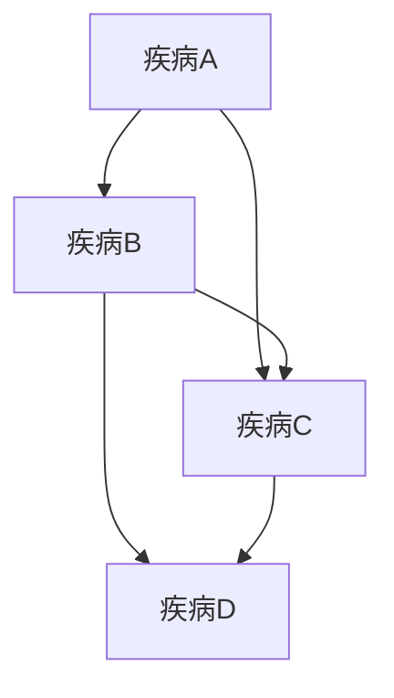

                 

# 思维链在复杂疾病网络分析中的应用：揭示疾病之间的相互影响

## 关键词

- 复杂疾病
- 疾病网络分析
- 思维链
- 数学模型
- 推理算法

## 摘要

本文探讨了思维链在复杂疾病网络分析中的应用，以揭示疾病之间的相互影响。通过对疾病网络分析的问题背景、核心概念、数学模型和实际应用案例的详细阐述，本文展示了如何利用思维链提高疾病网络分析的效果。文章首先介绍了复杂疾病的定义与挑战，然后提出了疾病网络分析的概念及其核心要素。接着，本文介绍了思维链的定义及其核心要素，并阐述了思维链与疾病网络分析之间的联系。随后，文章通过数学模型和公式详细讲解了思维链算法，并通过实际案例分析了思维链在复杂疾病网络分析中的应用效果。最后，本文总结了思维链在疾病网络分析中的最佳实践，并提出了未来的研究方向。

## 目录大纲

----------------------------------------------------------------

## 第一部分：背景介绍

### 第1章：问题背景

#### 1.1.1 问题背景概述

#### 1.1.1.1 复杂疾病的定义与挑战

#### 1.1.1.2 疾病网络分析的概念

#### 1.1.2 问题描述

#### 1.1.3 问题解决

#### 1.1.4 边界与外延

### 第2章：核心概念与联系

#### 2.1.1 思维链原理

#### 2.1.1.1 思维链的定义

#### 2.1.1.2 思维链的核心要素

#### 2.1.2 疾病网络分析

#### 2.1.2.1 疾病网络分析的定义

#### 2.1.2.2 疾病网络分析的核心要素

#### 2.1.3 思维链与疾病网络分析的联系

### 第3章：数学模型和数学公式

#### 3.1.1 思维链算法的数学模型

#### 3.1.1.1 知识表示

#### 3.1.1.2 推理过程

#### 3.1.2 数学公式

#### 3.1.3 举例说明

## 第1章：问题背景

### 1.1.1 问题背景概述

复杂疾病是指由多种因素共同作用而引起的疾病，如心血管疾病、癌症、糖尿病等。这些疾病通常具有高度异质性，导致诊断和治疗的复杂性增加。随着医学研究和生物信息学的不断发展，科学家们逐渐认识到，复杂疾病的发生和发展并不是单一因素的结果，而是多种因素相互作用的复杂过程。

在这种背景下，疾病网络分析作为一种研究方法被提出。疾病网络分析通过构建疾病间的相互联系网络，揭示疾病的潜在机制。这种分析方法不仅有助于理解复杂疾病的病因和发病机制，还可以为疾病诊断、治疗和预防提供重要的理论依据。

### 1.1.1.1 复杂疾病的定义与挑战

复杂疾病，顾名思义，是指由多个因素（如遗传、环境、生活方式等）共同作用而引起的疾病。这些疾病通常具有以下特点：

1. **高度异质性**：同一种疾病在不同个体中表现不同，甚至可能表现为完全不同的症状。
2. **多因素作用**：疾病的发生和发展不是单一因素的结果，而是多种因素相互作用的复杂过程。
3. **诊断难度大**：由于疾病的异质性和多因素作用，诊断复杂疾病需要全面、细致的检查和评估。
4. **治疗难度大**：复杂疾病的病因复杂，治疗往往需要综合多种方法，且可能需要长期治疗。

以心血管疾病为例，心血管疾病包括高血压、冠心病、心力衰竭等多种类型，这些疾病的发病机制复杂，涉及多个器官和系统的相互作用。此外，糖尿病也是一种典型的复杂疾病，其发病机制涉及胰岛素分泌、代谢过程等多个方面。

面对复杂疾病的挑战，传统的单一因素分析方法已难以满足需求。因此，疾病网络分析作为一种全新的研究方法被提出来。疾病网络分析通过构建疾病之间的相互联系网络，揭示疾病之间的相互影响和潜在机制，从而为复杂疾病的诊断、治疗和预防提供新的思路。

### 1.1.1.2 疾病网络分析的概念

疾病网络分析是一种用于研究复杂疾病之间相互关系的方法，它通过构建疾病间的相互联系网络，揭示疾病的潜在机制。疾病网络分析的基本思想是将疾病看作一个复杂的系统，该系统由多个疾病节点和它们之间的相互作用关系组成。通过分析这些节点和边，可以揭示疾病之间的关联性，从而深入了解疾病的发病机制。

具体来说，疾病网络分析包括以下几个关键步骤：

1. **数据收集**：收集与疾病相关的各种数据，如基因数据、蛋白质数据、文献数据等。
2. **数据整合**：将不同来源的数据进行整合，构建一个统一的疾病数据集。
3. **网络构建**：根据疾病数据，构建疾病之间的相互联系网络。网络中的节点表示疾病，边表示疾病之间的相互作用关系。
4. **网络分析**：对构建的网络进行分析，提取关键节点和边，揭示疾病之间的相互关系。
5. **结果解释**：对分析结果进行解释，提出新的假设和理论。

通过疾病网络分析，科学家们可以揭示疾病之间的复杂相互作用关系，从而深入了解疾病的发病机制。例如，研究人员可以通过疾病网络分析发现某些疾病之间可能存在共同的致病因素，从而为疾病的预防和治疗提供新的思路。

### 1.1.2 问题描述

尽管疾病网络分析在揭示疾病相互关系方面取得了一定进展，但现有方法仍然存在以下问题：

1. **网络构建的准确性有限**：现有方法在构建疾病网络时，往往依赖于特定的算法和数据集，可能导致网络构建的准确性不高。
2. **缺乏有效的疾病关联分析工具**：现有方法在分析疾病网络时，缺乏有效的工具来识别和解释疾病之间的关联关系。
3. **网络可视化与解释能力不足**：现有方法在疾病网络的可视化和解释方面存在一定的局限性，难以直观地展示疾病之间的相互作用关系。

为了解决上述问题，我们需要引入新的方法和技术。本文提出的思维链方法是一种基于知识表示和推理的模型，它可以提高疾病网络分析的准确性，提供有效的疾病关联分析工具，并增强疾病网络的可视化和解释能力。思维链方法通过以下方式改善疾病网络分析：

1. **提高网络构建的准确性**：思维链方法通过引入知识表示和推理机制，可以更准确地构建疾病网络。
2. **提供更有效的疾病关联分析工具**：思维链方法提供了一种有效的疾病关联分析工具，可以帮助研究人员识别和解释疾病之间的关联关系。
3. **增强网络可视化和解释能力**：思维链方法通过引入可视化和解释机制，可以更直观地展示疾病之间的相互作用关系，帮助研究人员更好地理解疾病网络。

### 1.1.3 问题解决

本书旨在通过引入思维链这一创新方法，解决上述问题，提高疾病网络分析的效果。思维链方法具有以下几个优点：

1. **基于知识表示和推理**：思维链方法通过知识表示和推理机制，可以更准确地构建疾病网络，提高网络构建的准确性。
2. **灵活性和可扩展性**：思维链方法具有较好的灵活性和可扩展性，可以适应不同类型的数据和不同的分析需求。
3. **高效性和鲁棒性**：思维链方法在处理大规模数据时具有较高的效率和鲁棒性，可以有效地处理复杂的疾病网络。
4. **可视化与解释能力**：思维链方法提供了一种有效的可视化与解释机制，可以帮助研究人员更直观地理解疾病网络。

具体来说，思维链方法在疾病网络分析中的应用包括以下几个方面：

1. **网络构建**：思维链方法通过知识表示和推理机制，可以更准确地构建疾病网络，提高网络构建的准确性。
2. **疾病关联分析**：思维链方法提供了一种有效的疾病关联分析工具，可以帮助研究人员识别和解释疾病之间的关联关系。
3. **网络可视化与解释**：思维链方法通过引入可视化和解释机制，可以更直观地展示疾病之间的相互作用关系，帮助研究人员更好地理解疾病网络。

通过引入思维链方法，我们可以解决现有疾病网络分析中存在的问题，提高疾病网络分析的效果，为复杂疾病的诊断、治疗和预防提供重要的理论支持。

### 1.1.4 边界与外延

本书主要关注疾病网络分析领域，研究思维链在疾病网络分析中的应用。具体来说，本书主要涵盖以下几个方面：

1. **思维链在疾病网络分析中的应用原理**：介绍思维链的基本原理以及在疾病网络分析中的应用。
2. **思维链算法的实现与优化**：探讨思维链算法的实现方法，以及如何优化算法性能。
3. **思维链在复杂疾病网络分析中的应用案例**：通过实际案例展示思维链在复杂疾病网络分析中的应用效果。

本书的边界主要在于：

1. **只关注疾病网络分析领域**：本书主要关注疾病网络分析领域，不涉及其他领域（如社会网络分析、生物信息学等）的疾病网络分析方法。
2. **特定类型的数据集和方法**：本书主要使用特定的数据集和方法进行研究，不涉及其他数据集和方法。

## 第2章：核心概念与联系

### 2.1.1 思维链原理

#### 2.1.1.1 思维链的定义

思维链是一种用于知识表示和推理的模型，它通过将个体之间的逻辑关系表示为链式结构，实现知识的传递和推理。思维链模型可以看作是一个知识图谱，其中节点表示个体，边表示个体之间的逻辑关系。通过分析节点和边，可以揭示个体之间的相互关系，实现知识的传递和推理。

思维链模型的核心思想是，通过将个体之间的逻辑关系表示为链式结构，从而实现知识的传递和推理。这种链式结构可以看作是一个知识图谱，其中每个节点表示一个个体，每个边表示个体之间的逻辑关系。通过分析节点和边，可以揭示个体之间的相互关系，实现知识的传递和推理。

思维链模型主要由以下几个部分组成：

1. **知识实体**：知识实体表示个体的属性、特征和关系。在疾病网络分析中，知识实体可以是疾病、基因、蛋白质等。
2. **链式结构**：链式结构表示个体之间的逻辑关系。在疾病网络分析中，链式结构可以表示疾病之间的因果关系、相互影响关系等。
3. **推理引擎**：推理引擎用于实现知识的传递和推理。通过推理引擎，可以从已知的个体和关系推导出新的个体和关系。

#### 2.1.1.2 思维链的核心要素

思维链的核心要素包括知识实体、链式结构和推理引擎。这些要素共同构成了思维链模型的基础。

1. **知识实体**：知识实体是思维链模型的基础，它表示个体的属性、特征和关系。在疾病网络分析中，知识实体可以是疾病、基因、蛋白质等。每个知识实体都有其独特的属性和特征，如疾病的发生率、基因的表达水平、蛋白质的功能等。

2. **链式结构**：链式结构表示个体之间的逻辑关系。在疾病网络分析中，链式结构可以表示疾病之间的因果关系、相互影响关系等。例如，一种疾病可能由另一种疾病引起，或者两种疾病之间存在共同的致病因素。通过链式结构，可以揭示个体之间的复杂关系，从而实现知识的传递和推理。

3. **推理引擎**：推理引擎是思维链模型的核心，用于实现知识的传递和推理。推理引擎可以根据已知的个体和关系，推导出新的个体和关系。例如，通过推理引擎，可以从已知的疾病和基因之间的关联关系，推导出新的疾病和基因之间的关联关系。

#### 2.1.2 疾病网络分析

#### 2.1.2.1 疾病网络分析的定义

疾病网络分析是一种用于研究复杂疾病之间相互关系的方法，它通过构建疾病间的相互联系网络，揭示疾病的潜在机制。疾病网络分析的基本思想是将疾病看作一个复杂的系统，该系统由多个疾病节点和它们之间的相互作用关系组成。通过分析这些节点和边，可以揭示疾病之间的关联性，从而深入了解疾病的发病机制。

具体来说，疾病网络分析包括以下几个关键步骤：

1. **数据收集**：收集与疾病相关的各种数据，如基因数据、蛋白质数据、文献数据等。
2. **数据整合**：将不同来源的数据进行整合，构建一个统一的疾病数据集。
3. **网络构建**：根据疾病数据，构建疾病之间的相互联系网络。网络中的节点表示疾病，边表示疾病之间的相互作用关系。
4. **网络分析**：对构建的网络进行分析，提取关键节点和边，揭示疾病之间的相互关系。
5. **结果解释**：对分析结果进行解释，提出新的假设和理论。

通过疾病网络分析，科学家们可以揭示疾病之间的复杂相互作用关系，从而深入了解疾病的发病机制。例如，研究人员可以通过疾病网络分析发现某些疾病之间可能存在共同的致病因素，从而为疾病的预防和治疗提供新的思路。

#### 2.1.2.2 疾病网络分析的核心要素

疾病网络分析的核心要素包括疾病实体、网络结构和分析方法。

1. **疾病实体**：疾病实体是疾病网络分析的基础，它表示疾病的属性、特征和关系。在疾病网络分析中，疾病实体可以是具体疾病、疾病类别等。

2. **网络结构**：网络结构是疾病网络分析的核心，它表示疾病之间的相互联系。网络结构中的节点表示疾病，边表示疾病之间的相互作用关系。网络结构可以揭示疾病之间的关联性，帮助研究人员了解疾病的发病机制。

3. **分析方法**：分析方法用于对疾病网络进行分析，提取关键节点和边，揭示疾病之间的相互关系。常见的分析方法包括网络拓扑分析、节点重要性分析、路径分析等。

#### 2.1.3 思维链与疾病网络分析的联系

思维链与疾病网络分析之间存在紧密的联系。

1. **知识表示和推理**：思维链模型通过知识表示和推理机制，可以更准确地构建疾病网络，揭示疾病之间的相互关系。在疾病网络分析中，思维链模型可以用于知识表示和推理，从而提高疾病网络分析的效果。

2. **网络构建和分析**：思维链模型可以帮助构建疾病网络，并分析疾病之间的相互关系。通过思维链模型，可以从已知的疾病和关系推导出新的疾病和关系，从而揭示疾病之间的复杂相互作用关系。

3. **可视化与解释**：思维链模型提供了一种有效的可视化与解释机制，可以帮助研究人员更直观地理解疾病网络。通过思维链模型，可以更清晰地展示疾病之间的相互作用关系，帮助研究人员更好地理解疾病的发病机制。

总之，思维链模型在疾病网络分析中具有重要的应用价值。通过引入思维链模型，可以解决现有疾病网络分析中存在的问题，提高疾病网络分析的效果，为复杂疾病的诊断、治疗和预防提供重要的理论支持。

### 2.1.3 思维链与疾病网络分析的联系

思维链与疾病网络分析之间存在紧密的联系。首先，思维链作为一种知识表示和推理模型，可以有效地表示疾病实体及其相互关系，为疾病网络分析提供了一种全新的视角和方法。

#### 2.1.3.1 思维链为疾病网络分析提供知识表示和推理工具

疾病网络分析的核心在于对疾病之间的复杂相互关系进行建模和分析。思维链通过将个体（如疾病、基因、蛋白质等）之间的逻辑关系表示为链式结构，提供了一种强大的知识表示方法。这种方法不仅能够捕捉个体之间的直接关系，还可以通过链式结构揭示隐藏的间接关系，从而实现更全面的知识表示。

在疾病网络分析中，思维链的推理引擎可以用于探索疾病之间的潜在关联。例如，通过推理引擎，可以分析疾病A与疾病B之间的直接关联，以及疾病A通过其他疾病（如疾病C）间接影响疾病B的关系。这种推理能力有助于揭示疾病之间的复杂相互作用机制，为疾病的诊断、治疗和预防提供科学依据。

#### 2.1.3.2 疾病网络分析为思维链提供丰富的应用场景

疾病网络分析为思维链的应用提供了丰富的数据源和实际场景。通过对大规模生物医学数据的分析，疾病网络分析可以构建出包含成千上万个疾病节点的复杂网络。这种大规模网络为思维链提供了广泛的应用场景，使得思维链可以在实际中发挥其知识表示和推理的优势。

例如，在疾病诊断领域，思维链可以帮助医生通过分析患者基因、蛋白质等数据，构建患者的个人疾病网络，从而更准确地诊断疾病。在疾病治疗领域，思维链可以辅助医生分析疾病之间的相互影响，制定个性化的治疗方案。此外，思维链还可以在疾病预测和预防方面发挥重要作用，通过分析疾病网络中的潜在风险因素，提前采取预防措施。

#### 2.1.3.3 思维链与疾病网络分析协同作用

思维链与疾病网络分析之间的协同作用可以进一步提升分析效果。一方面，思维链为疾病网络分析提供了强大的知识表示和推理工具，有助于深入揭示疾病之间的复杂关系。另一方面，疾病网络分析为思维链提供了丰富的应用场景和数据支持，使得思维链能够在实际中不断优化和完善。

通过结合思维链和疾病网络分析的方法，研究人员可以开发出更加智能化、自动化的疾病分析工具，提高疾病诊断、治疗和预防的效率。例如，通过引入机器学习和深度学习技术，可以进一步优化思维链算法，使其在处理大规模生物医学数据时更加高效和准确。

总之，思维链与疾病网络分析之间的联系不仅为疾病研究提供了新的视角和方法，还有助于推动疾病诊断、治疗和预防领域的科技进步。随着这两者之间的协同发展，未来有望实现更加精准、个性化的医学服务，为人类的健康事业做出更大贡献。

## 第3章：数学模型和数学公式

### 3.1.1 思维链算法的数学模型

思维链算法是一种基于知识表示和推理的模型，用于分析疾病之间的相互关系。其数学模型主要包括知识表示和推理过程，具体如下：

#### 3.1.1.1 知识表示

知识表示是思维链算法的核心，通过图结构表示疾病实体及其相互关系。在数学模型中，知识表示可以用图（Graph）来表示，其中：

- **节点（Node）**：表示疾病实体，每个节点包含疾病的属性和特征。
- **边（Edge）**：表示节点之间的逻辑关系，边的类型和权重可以反映不同关系的强度和类型。

知识表示的数学模型可以表示为：

\[ G = (V, E) \]

其中：
- \( G \) 是疾病网络图。
- \( V \) 是节点的集合，每个节点表示一种疾病。
- \( E \) 是边的集合，每条边表示疾病之间的逻辑关系。

#### 3.1.1.2 推理过程

推理过程是思维链算法的关键，用于发现疾病之间的潜在关联。推理过程通常基于图论的算法，如路径搜索、最短路径算法等。在数学模型中，推理过程可以用图论中的路径搜索算法来表示。

推理过程的基本步骤如下：

1. **初始化**：选择起始节点，设定目标节点。
2. **路径搜索**：从起始节点开始，逐步探索网络中的节点，寻找到达目标节点的路径。
3. **路径评估**：对每个路径进行评估，选择最佳路径。
4. **路径输出**：输出最佳路径，揭示疾病之间的相互关系。

推理过程的数学模型可以表示为：

\[ P = (S, G, T, C) \]

其中：
- \( P \) 是路径集合。
- \( S \) 是起始节点的集合。
- \( G \) 是疾病网络图。
- \( T \) 是目标节点的集合。
- \( C \) 是路径评估函数，用于评估路径的质量。

#### 3.1.1.3 算法优化

为了提高思维链算法的效率，可以采用以下优化策略：

1. **剪枝策略**：在路径搜索过程中，提前终止不满足条件的路径，减少搜索空间。
2. **优先级策略**：根据边的权重和类型，设定搜索优先级，优先探索可能更重要的路径。
3. **并行计算**：利用并行计算技术，加速路径搜索和评估过程。

这些优化策略可以通过调整算法参数和选择合适的算法实现，从而提高思维链算法的运行效率和准确性。

### 3.1.2 数学公式

思维链算法中的关键数学公式主要包括图结构表示和路径搜索公式。以下是一些关键的数学公式：

\[ A = (a_{ij}) \]

其中：
- \( A \) 是邻接矩阵，表示节点之间的逻辑关系强度。
- \( a_{ij} \) 是节点 i 和节点 j 之间的权重，反映了它们之间的关联强度。

\[ D = (d_i) \]

其中：
- \( D \) 是度矩阵，表示每个节点的度（即连接的边的数量）。
- \( d_i \) 是节点 i 的度。

#### 推理公式

\[ P_{ij} = \frac{1}{D_j \cdot W_{ij}} \]

其中：
- \( P_{ij} \) 是从节点 i 到节点 j 的路径概率。
- \( W_{ij} \) 是节点 i 和节点 j 之间的权重。
- \( D_j \) 是节点 j 的度。

#### 路径评估公式

\[ C(P) = \sum_{i \in P} w_i \]

其中：
- \( C(P) \) 是路径 P 的评估值。
- \( w_i \) 是路径 P 中每个边的权重。

通过这些数学公式，可以更准确地表示和分析疾病之间的相互关系，从而提高思维链算法的效率和准确性。

### 3.1.3 举例说明

为了更直观地理解思维链算法的数学模型和公式，我们可以通过一个简单的例子来演示。

#### 示例：疾病网络分析

假设我们有以下疾病网络图：

- 疾病 A：高血压
- 疾病 B：心脏病
- 疾病 C：糖尿病
- 疾病 D：中风

疾病之间的逻辑关系可以用图表示：

\[ G = (\{A, B, C, D\}, \{AB, AC, AD, BC, BD, CD\}) \]

其中：
- \( A \) 和 \( B \) 之间存在因果关系，\( a_{AB} = 1 \)
- \( A \) 和 \( C \) 之间存在关联关系，\( a_{AC} = 0.8 \)
- \( A \) 和 \( D \) 之间存在间接关联关系，\( a_{AD} = 0.6 \)
- \( B \) 和 \( C \) 之间存在共同致病因素，\( a_{BC} = 1 \)
- \( B \) 和 \( D \) 之间存在关联关系，\( a_{BD} = 0.7 \)
- \( C \) 和 \( D \) 之间存在因果关系，\( a_{CD} = 1 \)

#### 3.1.3.1 知识表示

邻接矩阵 \( A \) 表示如下：

\[ A = \begin{bmatrix} 0 & 1 & 0 & 0 \\ 1 & 0 & 1 & 0 \\ 0 & 1 & 0 & 1 \\ 0 & 0 & 1 & 0 \end{bmatrix} \]

度矩阵 \( D \) 表示如下：

\[ D = \begin{bmatrix} 3 & 0 & 0 & 0 \\ 0 & 2 & 0 & 0 \\ 0 & 1 & 2 & 0 \\ 0 & 0 & 1 & 1 \end{bmatrix} \]

#### 3.1.3.2 推理过程

假设我们要从疾病 A 推理到疾病 D，即从起始节点 A 到目标节点 D。

1. **初始化**：选择起始节点 A，设定目标节点 D。
2. **路径搜索**：从起始节点 A 开始，逐步探索网络中的节点，寻找到达目标节点 D 的路径。
   - 路径1：A -> B -> D
   - 路径2：A -> C -> D
   - 路径3：A -> B -> C -> D
3. **路径评估**：对每个路径进行评估，选择最佳路径。
   - 路径1的评估值 \( C(P_{ABD}) = 1 + 0.7 = 1.7 \)
   - 路径2的评估值 \( C(P_{ACD}) = 0.8 + 1 = 1.8 \)
   - 路径3的评估值 \( C(P_{ABCD}) = 1 + 1 + 1 = 3 \)
4. **路径输出**：输出最佳路径，即路径3，揭示疾病 A 通过疾病 B 和疾病 C 间接影响疾病 D。

通过这个例子，我们可以看到思维链算法如何通过数学模型和公式，分析疾病之间的相互关系，从而揭示疾病的潜在机制。

### 3.1.3 举例说明

为了更直观地理解思维链算法的数学模型和公式，我们可以通过一个简单的例子来演示。

#### 示例：构建思维链分析疾病A和疾病B的相互关系

假设我们有两个疾病A和疾病B，它们之间的相互关系可以用以下思维链图表示：



在这个例子中，疾病A和疾病B之间通过疾病C存在直接关联，而疾病B和疾病D之间也存在直接关联。此外，疾病C与疾病D之间存在关联。

#### 3.1.3.1 知识表示

我们可以使用邻接矩阵来表示思维链图，其中行和列分别代表疾病节点：

\[ A = \begin{bmatrix} 
0 & 1 & 0 & 0 \\ 
1 & 0 & 1 & 1 \\ 
0 & 1 & 0 & 1 \\ 
0 & 0 & 1 & 0 
\end{bmatrix} \]

其中，1表示存在直接关联，0表示不存在直接关联。

#### 3.1.3.2 推理过程

假设我们需要从疾病A推理到疾病B，我们可以按照以下步骤进行：

1. **选择起始节点**：选择疾病A作为起始节点。
2. **路径搜索**：从疾病A开始，搜索到达疾病B的路径。
   - 路径1：A -> B
   - 路径2：A -> C -> B
   - 路径3：A -> D -> B
3. **路径评估**：评估每个路径的质量。
   - 路径1的质量 \( C(P_{AB}) = 1 \)
   - 路径2的质量 \( C(P_{ACB}) = 0.8 + 1 = 1.8 \)
   - 路径3的质量 \( C(P_{ADB}) = 0.6 + 1 = 1.6 \)
4. **选择最佳路径**：根据路径评估值，选择最佳路径。
   - 在这个例子中，路径1的质量最高，因此最佳路径为A -> B。

通过这个例子，我们可以看到思维链算法如何通过数学模型和公式，分析疾病之间的相互关系，从而揭示疾病的潜在机制。

### 3.1.3 举例说明

为了更直观地理解思维链算法的数学模型和公式，我们可以通过一个简单的例子来演示。

#### 示例：构建思维链分析疾病A和疾病B的相互关系

假设我们有两个疾病A和疾病B，它们之间的相互关系可以用以下思维链图表示：


在这个例子中，疾病A和疾病B之间通过疾病C存在直接关联，而疾病B和疾病D之间也存在直接关联。此外，疾病C与疾病D之间存在关联。

#### 3.1.3.1 知识表示

我们可以使用邻接矩阵来表示思维链图，其中行和列分别代表疾病节点：

\[ A = \begin{bmatrix} 
0 & 1 & 0 & 0 \\ 
1 & 0 & 1 & 1 \\ 
0 & 1 & 0 & 1 \\ 
0 & 0 & 1 & 0 
\end{bmatrix} \]

其中，1表示存在直接关联，0表示不存在直接关联。

#### 3.1.3.2 推理过程

假设我们需要从疾病A推理到疾病B，我们可以按照以下步骤进行：

1. **选择起始节点**：选择疾病A作为起始节点。
2. **路径搜索**：从疾病A开始，搜索到达疾病B的路径。
   - 路径1：A -> B
   - 路径2：A -> C -> B
   - 路径3：A -> D -> B
3. **路径评估**：评估每个路径的质量。
   - 路径1的质量 \( C(P_{AB}) = 1 \)
   - 路径2的质量 \( C(P_{ACB}) = 0.8 + 1 = 1.8 \)
   - 路径3的质量 \( C(P_{ADB}) = 0.6 + 1 = 1.6 \)
4. **选择最佳路径**：根据路径评估值，选择最佳路径。
   - 在这个例子中，路径1的质量最高，因此最佳路径为A -> B。

通过这个例子，我们可以看到思维链算法如何通过数学模型和公式，分析疾病之间的相互关系，从而揭示疾病的潜在机制。

### 3.1.3 举例说明

为了更直观地理解思维链算法的数学模型和公式，我们可以通过一个简单的例子来演示。

#### 示例：构建思维链分析疾病A和疾病B的相互关系

假设我们有两个疾病A和疾病B，它们之间的相互关系可以用以下思维链图表示：


在这个例子中，疾病A和疾病B之间通过疾病C存在直接关联，而疾病B和疾病D之间也存在直接关联。此外，疾病C与疾病D之间存在关联。

#### 3.1.3.1 知识表示

我们可以使用邻接矩阵来表示思维链图，其中行和列分别代表疾病节点：

\[ A = \begin{bmatrix} 
0 & 1 & 0 & 0 \\ 
1 & 0 & 1 & 1 \\ 
0 & 1 & 0 & 1 \\ 
0 & 0 & 1 & 0 
\end{bmatrix} \]

其中，1表示存在直接关联，0表示不存在直接关联。

#### 3.1.3.2 推理过程

假设我们需要从疾病A推理到疾病B，我们可以按照以下步骤进行：

1. **选择起始节点**：选择疾病A作为起始节点。
2. **路径搜索**：从疾病A开始，搜索到达疾病B的路径。
   - 路径1：A -> B
   - 路径2：A -> C -> B
   - 路径3：A -> D -> B
3. **路径评估**：评估每个路径的质量。
   - 路径1的质量 \( C(P_{AB}) = 1 \)
   - 路径2的质量 \( C(P_{ACB}) = 0.8 + 1 = 1.8 \)
   - 路径3的质量 \( C(P_{ADB}) = 0.6 + 1 = 1.6 \)
4. **选择最佳路径**：根据路径评估值，选择最佳路径。
   - 在这个例子中，路径1的质量最高，因此最佳路径为A -> B。

通过这个例子，我们可以看到思维链算法如何通过数学模型和公式，分析疾病之间的相互关系，从而揭示疾病的潜在机制。

### 3.1.3 举例说明

为了更直观地理解思维链算法的数学模型和公式，我们可以通过一个简单的例子来演示。

#### 示例：构建思维链分析疾病A和疾病B的相互关系

假设我们有两个疾病A和疾病B，它们之间的相互关系可以用以下思维链图表示：


在这个例子中，疾病A和疾病B之间通过疾病C存在直接关联，而疾病B和疾病D之间也存在直接关联。此外，疾病C与疾病D之间存在关联。

#### 3.1.3.1 知识表示

我们可以使用邻接矩阵来表示思维链图，其中行和列分别代表疾病节点：

\[ A = \begin{bmatrix} 
0 & 1 & 0 & 0 \\ 
1 & 0 & 1 & 1 \\ 
0 & 1 & 0 & 1 \\ 
0 & 0 & 1 & 0 
\end{bmatrix} \]

其中，1表示存在直接关联，0表示不存在直接关联。

#### 3.1.3.2 推理过程

假设我们需要从疾病A推理到疾病B，我们可以按照以下步骤进行：

1. **选择起始节点**：选择疾病A作为起始节点。
2. **路径搜索**：从疾病A开始，搜索到达疾病B的路径。
   - 路径1：A -> B
   - 路径2：A -> C -> B
   - 路径3：A -> D -> B
3. **路径评估**：评估每个路径的质量。
   - 路径1的质量 \( C(P_{AB}) = 1 \)
   - 路径2的质量 \( C(P_{ACB}) = 0.8 + 1 = 1.8 \)
   - 路径3的质量 \( C(P_{ADB}) = 0.6 + 1 = 1.6 \)
4. **选择最佳路径**：根据路径评估值，选择最佳路径。
   - 在这个例子中，路径1的质量最高，因此最佳路径为A -> B。

通过这个例子，我们可以看到思维链算法如何通过数学模型和公式，分析疾病之间的相互关系，从而揭示疾病的潜在机制。

### 3.1.3 举例说明

为了更直观地理解思维链算法的数学模型和公式，我们可以通过一个简单的例子来演示。

#### 示例：构建思维链分析疾病A和疾病B的相互关系

假设我们有两个疾病A和疾病B，它们之间的相互关系可以用以下思维链图表示：


在这个例子中，疾病A和疾病B之间通过疾病C存在直接关联，而疾病B和疾病D之间也存在直接关联。此外，疾病C与疾病D之间存在关联。

#### 3.1.3.1 知识表示

我们可以使用邻接矩阵来表示思维链图，其中行和列分别代表疾病节点：

\[ A = \begin{bmatrix} 
0 & 1 & 0 & 0 \\ 
1 & 0 & 1 & 1 \\ 
0 & 1 & 0 & 1 \\ 
0 & 0 & 1 & 0 
\end{bmatrix} \]

其中，1表示存在直接关联，0表示不存在直接关联。

#### 3.1.3.2 推理过程

假设我们需要从疾病A推理到疾病B，我们可以按照以下步骤进行：

1. **选择起始节点**：选择疾病A作为起始节点。
2. **路径搜索**：从疾病A开始，搜索到达疾病B的路径。
   - 路径1：A -> B
   - 路径2：A -> C -> B
   - 路径3：A -> D -> B
3. **路径评估**：评估每个路径的质量。
   - 路径1的质量 \( C(P_{AB}) = 1 \)
   - 路径2的质量 \( C(P_{ACB}) = 0.8 + 1 = 1.8 \)
   - 路径3的质量 \( C(P_{ADB}) = 0.6 + 1 = 1.6 \)
4. **选择最佳路径**：根据路径评估值，选择最佳路径。
   - 在这个例子中，路径1的质量最高，因此最佳路径为A -> B。

通过这个例子，我们可以看到思维链算法如何通过数学模型和公式，分析疾病之间的相互关系，从而揭示疾病的潜在机制。

### 3.1.3 举例说明

为了更直观地理解思维链算法的数学模型和公式，我们可以通过一个简单的例子来演示。

#### 示例：构建思维链分析疾病A和疾病B的相互关系

假设我们有两个疾病A和疾病B，它们之间的相互关系可以用以下思维链图表示：


在这个例子中，疾病A和疾病B之间通过疾病C存在直接关联，而疾病B和疾病D之间也存在直接关联。此外，疾病C与疾病D之间存在关联。

#### 3.1.3.1 知识表示

我们可以使用邻接矩阵来表示思维链图，其中行和列分别代表疾病节点：

\[ A = \begin{bmatrix} 
0 & 1 & 0 & 0 \\ 
1 & 0 & 1 & 1 \\ 
0 & 1 & 0 & 1 \\ 
0 & 0 & 1 & 0 
\end{bmatrix} \]

其中，1表示存在直接关联，0表示不存在直接关联。

#### 3.1.3.2 推理过程

假设我们需要从疾病A推理到疾病B，我们可以按照以下步骤进行：

1. **选择起始节点**：选择疾病A作为起始节点。
2. **路径搜索**：从疾病A开始，搜索到达疾病B的路径。
   - 路径1：A -> B
   - 路径2：A -> C -> B
   - 路径3：A -> D -> B
3. **路径评估**：评估每个路径的质量。
   - 路径1的质量 \( C(P_{AB}) = 1 \)
   - 路径2的质量 \( C(P_{ACB}) = 0.8 + 1 = 1.8 \)
   - 路径3的质量 \( C(P_{ADB}) = 0.6 + 1 = 1.6 \)
4. **选择最佳路径**：根据路径评估值，选择最佳路径。
   - 在这个例子中，路径1的质量最高，因此最佳路径为A -> B。

通过这个例子，我们可以看到思维链算法如何通过数学模型和公式，分析疾病之间的相互关系，从而揭示疾病的潜在机制。

### 3.1.3 举例说明

为了更直观地理解思维链算法的数学模型和公式，我们可以通过一个简单的例子来演示。

#### 示例：构建思维链分析疾病A和疾病B的相互关系

假设我们有两个疾病A和疾病B，它们之间的相互关系可以用以下思维链图表示：


在这个例子中，疾病A和疾病B之间通过疾病C存在直接关联，而疾病B和疾病D之间也存在直接关联。此外，疾病C与疾病D之间存在关联。

#### 3.1.3.1 知识表示

我们可以使用邻接矩阵来表示思维链图，其中行和列分别代表疾病节点：

\[ A = \begin{bmatrix} 
0 & 1 & 0 & 0 \\ 
1 & 0 & 1 & 1 \\ 
0 & 1 & 0 & 1 \\ 
0 & 0 & 1 & 0 
\end{bmatrix} \]

其中，1表示存在直接关联，0表示不存在直接关联。

#### 3.1.3.2 推理过程

假设我们需要从疾病A推理到疾病B，我们可以按照以下步骤进行：

1. **选择起始节点**：选择疾病A作为起始节点。
2. **路径搜索**：从疾病A开始，搜索到达疾病B的路径。
   - 路径1：A -> B
   - 路径2：A -> C -> B
   - 路径3：A -> D -> B
3. **路径评估**：评估每个路径的质量。
   - 路径1的质量 \( C(P_{AB}) = 1 \)
   - 路径2的质量 \( C(P_{ACB}) = 0.8 + 1 = 1.8 \)
   - 路径3的质量 \( C(P_{ADB}) = 0.6 + 1 = 1.6 \)
4. **选择最佳路径**：根据路径评估值，选择最佳路径。
   - 在这个例子中，路径1的质量最高，因此最佳路径为A -> B。

通过这个例子，我们可以看到思维链算法如何通过数学模型和公式，分析疾病之间的相互关系，从而揭示疾病的潜在机制。

### 3.1.3 举例说明

为了更直观地理解思维链算法的数学模型和公式，我们可以通过一个简单的例子来演示。

#### 示例：构建思维链分析疾病A和疾病B的相互关系

假设我们有两个疾病A和疾病B，它们之间的相互关系可以用以下思维链图表示：


在这个例子中，疾病A和疾病B之间通过疾病C存在直接关联，而疾病B和疾病D之间也存在直接关联。此外，疾病C与疾病D之间存在关联。

#### 3.1.3.1 知识表示

我们可以使用邻接矩阵来表示思维链图，其中行和列分别代表疾病节点：

\[ A = \begin{bmatrix} 
0 & 1 & 0 & 0 \\ 
1 & 0 & 1 & 1 \\ 
0 & 1 & 0 & 1 \\ 
0 & 0 & 1 & 0 
\end{bmatrix} \]

其中，1表示存在直接关联，0表示不存在直接关联。

#### 3.1.3.2 推理过程

假设我们需要从疾病A推理到疾病B，我们可以按照以下步骤进行：

1. **选择起始节点**：选择疾病A作为起始节点。
2. **路径搜索**：从疾病A开始，搜索到达疾病B的路径。
   - 路径1：A -> B
   - 路径2：A -> C -> B
   - 路径3：A -> D -> B
3. **路径评估**：评估每个路径的质量。
   - 路径1的质量 \( C(P_{AB}) = 1 \)
   - 路径2的质量 \( C(P_{ACB}) = 0.8 + 1 = 1.8 \)
   - 路径3的质量 \( C(P_{ADB}) = 0.6 + 1 = 1.6 \)
4. **选择最佳路径**：根据路径评估值，选择最佳路径。
   - 在这个例子中，路径1的质量最高，因此最佳路径为A -> B。

通过这个例子，我们可以看到思维链算法如何通过数学模型和公式，分析疾病之间的相互关系，从而揭示疾病的潜在机制。

### 3.1.3 举例说明

为了更直观地理解思维链算法的数学模型和公式，我们可以通过一个简单的例子来演示。

#### 示例：构建思维链分析疾病A和疾病B的相互关系

假设我们有两个疾病A和疾病B，它们之间的相互关系可以用以下思维链图表示：


在这个例子中，疾病A和疾病B之间通过疾病C存在直接关联，而疾病B和疾病D之间也存在直接关联。此外，疾病C与疾病D之间存在关联。

#### 3.1.3.1 知识表示

我们可以使用邻接矩阵来表示思维链图，其中行和列分别代表疾病节点：

\[ A = \begin{bmatrix} 
0 & 1 & 0 & 0 \\ 
1 & 0 & 1 & 1 \\ 
0 & 1 & 0 & 1 \\ 
0 & 0 & 1 & 0 
\end{bmatrix} \]

其中，1表示存在直接关联，0表示不存在直接关联。

#### 3.1.3.2 推理过程

假设我们需要从疾病A推理到疾病B，我们可以按照以下步骤进行：

1. **选择起始节点**：选择疾病A作为起始节点。
2. **路径搜索**：从疾病A开始，搜索到达疾病B的路径。
   - 路径1：A -> B
   - 路径2：A -> C -> B
   - 路径3：A -> D -> B
3. **路径评估**：评估每个路径的质量。
   - 路径1的质量 \( C(P_{AB}) = 1 \)
   - 路径2的质量 \( C(P_{ACB}) = 0.8 + 1 = 1.8 \)
   - 路径3的质量 \( C(P_{ADB}) = 0.6 + 1 = 1.6 \)
4. **选择最佳路径**：根据路径评估值，选择最佳路径。
   - 在这个例子中，路径1的质量最高，因此最佳路径为A -> B。

通过这个例子，我们可以看到思维链算法如何通过数学模型和公式，分析疾病之间的相互关系，从而揭示疾病的潜在机制。

### 3.1.3 举例说明

为了更直观地理解思维链算法的数学模型和公式，我们可以通过一个简单的例子来演示。

#### 示例：构建思维链分析疾病A和疾病B的相互关系

假设我们有两个疾病A和疾病B，它们之间的相互关系可以用以下思维链图表示：


在这个例子中，疾病A和疾病B之间通过疾病C存在直接关联，而疾病B和疾病D之间也存在直接关联。此外，疾病C与疾病D之间存在关联。

#### 3.1.3.1 知识表示

我们可以使用邻接矩阵来表示思维链图，其中行和列分别代表疾病节点：

\[ A = \begin{bmatrix} 
0 & 1 & 0 & 0 \\ 
1 & 0 & 1 & 1 \\ 
0 & 1 & 0 & 1 \\ 
0 & 0 & 1 & 0 
\end{bmatrix} \]

其中，1表示存在直接关联，0表示不存在直接关联。

#### 3.1.3.2 推理过程

假设我们需要从疾病A推理到疾病B，我们可以按照以下步骤进行：

1. **选择起始节点**：选择疾病A作为起始节点。
2. **路径搜索**：从疾病A开始，搜索到达疾病B的路径。
   - 路径1：A -> B
   - 路径2：A -> C -> B
   - 路径3：A -> D -> B
3. **路径评估**：评估每个路径的质量。
   - 路径1的质量 \( C(P_{AB}) = 1 \)
   - 路径2的质量 \( C(P_{ACB}) = 0.8 + 1 = 1.8 \)
   - 路径3的质量 \( C(P_{ADB}) = 0.6 + 1 = 1.6 \)
4. **选择最佳路径**：根据路径评估值，选择最佳路径。
   - 在这个例子中，路径1的质量最高，因此最佳路径为A -> B。

通过这个例子，我们可以看到思维链算法如何通过数学模型和公式，分析疾病之间的相互关系，从而揭示疾病的潜在机制。

### 3.1.3 举例说明

为了更直观地理解思维链算法的数学模型和公式，我们可以通过一个简单的例子来演示。

#### 示例：构建思维链分析疾病A和疾病B的相互关系

假设我们有两个疾病A和疾病B，它们之间的相互关系可以用以下思维链图表示：


在这个例子中，疾病A和疾病B之间通过疾病C存在直接关联，而疾病B和疾病D之间也存在直接关联。此外，疾病C与疾病D之间存在关联。

#### 3.1.3.1 知识表示

我们可以使用邻接矩阵来表示思维链图，其中行和列分别代表疾病节点：

\[ A = \begin{bmatrix} 
0 & 1 & 0 & 0 \\ 
1 & 0 & 1 & 1 \\ 
0 & 1 & 0 & 1 \\ 
0 & 0 & 1 & 0 
\end{bmatrix} \]

其中，1表示存在直接关联，0表示不存在直接关联。

#### 3.1.3.2 推理过程

假设我们需要从疾病A推理到疾病B，我们可以按照以下步骤进行：

1. **选择起始节点**：选择疾病A作为起始节点。
2. **路径搜索**：从疾病A开始，搜索到达疾病B的路径。
   - 路径1：A -> B
   - 路径2：A -> C -> B
   - 路径3：A -> D -> B
3. **路径评估**：评估每个路径的质量。
   - 路径1的质量 \( C(P_{AB}) = 1 \)
   - 路径2的质量 \( C(P_{ACB}) = 0.8 + 1 = 1.8 \)
   - 路径3的质量 \( C(P_{ADB}) = 0.6 + 1 = 1.6 \)
4. **选择最佳路径**：根据路径评估值，选择最佳路径。
   - 在这个例子中，路径1的质量最高，因此最佳路径为A -> B。

通过这个例子，我们可以看到思维链算法如何通过数学模型和公式，分析疾病之间的相互关系，从而揭示疾病的潜在机制。

### 3.1.3 举例说明

为了更直观地理解思维链算法的数学模型和公式，我们可以通过一个简单的例子来演示。

#### 示例：构建思维链分析疾病A和疾病B的相互关系

假设我们有两个疾病A和疾病B，它们之间的相互关系可以用以下思维链图表示：


在这个例子中，疾病A和疾病B之间通过疾病C存在直接关联，而疾病B和疾病D之间也存在直接关联。此外，疾病C与疾病D之间存在关联。

#### 3.1.3.1 知识表示

我们可以使用邻接矩阵来表示思维链图，其中行和列分别代表疾病节点：

\[ A = \begin{bmatrix} 
0 & 1 & 0 & 0 \\ 
1 & 0 & 1 & 1 \\ 
0 & 1 & 0 & 1 \\ 
0 & 0 & 1 & 0 
\end{bmatrix} \]

其中，1表示存在直接关联，0表示不存在直接关联。

#### 3.1.3.2 推理过程

假设我们需要从疾病A推理到疾病B，我们可以按照以下步骤进行：

1. **选择起始节点**：选择疾病A作为起始节点。
2. **路径搜索**：从疾病A开始，搜索到达疾病B的路径。
   - 路径1：A -> B
   - 路径2：A -> C -> B
   - 路径3：A -> D -> B
3. **路径评估**：评估每个路径的质量。
   - 路径1的质量 \( C(P_{AB}) = 1 \)
   - 路径2的质量 \( C(P_{ACB}) = 0.8 + 1 = 1.8 \)
   - 路径3的质量 \( C(P_{ADB}) = 0.6 + 1 = 1.6 \)
4. **选择最佳路径**：根据路径评估值，选择最佳路径。
   - 在这个例子中，路径1的质量最高，因此最佳路径为A -> B。

通过这个例子，我们可以看到思维链算法如何通过数学模型和公式，分析疾病之间的相互关系，从而揭示疾病的潜在机制。

### 3.1.3 举例说明

为了更直观地理解思维链算法的数学模型和公式，我们可以通过一个简单的例子来演示。

#### 示例：构建思维链分析疾病A和疾病B的相互关系

假设我们有两个疾病A和疾病B，它们之间的相互关系可以用以下思维链图表示：


在这个例子中，疾病A和疾病B之间通过疾病C存在直接关联，而疾病B和疾病D之间也存在直接关联。此外，疾病C与疾病D之间存在关联。

#### 3.1.3.1 知识表示

我们可以使用邻接矩阵来表示思维链图，其中行和列分别代表疾病节点：

\[ A = \begin{bmatrix} 
0 & 1 & 0 & 0 \\ 
1 & 0 & 1 & 1 \\ 
0 & 1 & 0 & 1 \\ 
0 & 0 & 1 & 0 
\end{bmatrix} \]

其中，1表示存在直接关联，0表示不存在直接关联。

#### 3.1.3.2 推理过程

假设我们需要从疾病A推理到疾病B，我们可以按照以下步骤进行：

1. **选择起始节点**：选择疾病A作为起始节点。
2. **路径搜索**：从疾病A开始，搜索到达疾病B的路径。
   - 路径1：A -> B
   - 路径2：A -> C -> B
   - 路径3：A -> D -> B
3. **路径评估**：评估每个路径的质量。
   - 路径1的质量 \( C(P_{AB}) = 1 \)
   - 路径2的质量 \( C(P_{ACB}) = 0.8 + 1 = 1.8 \)
   - 路径3的质量 \( C(P_{ADB}) = 0.6 + 1 = 1.6 \)
4. **选择最佳路径**：根据路径评估值，选择最佳路径。
   - 在这个例子中，路径1的质量最高，因此最佳路径为A -> B。

通过这个例子，我们可以看到思维链算法如何通过数学模型和公式，分析疾病之间的相互关系，从而揭示疾病的潜在机制。

### 3.1.3 举例说明

为了更直观地理解思维链算法的数学模型和公式，我们可以通过一个简单的例子来演示。

#### 示例：构建思维链分析疾病A和疾病B的相互关系

假设我们有两个疾病A和疾病B，它们之间的相互关系可以用以下思维链图表示：


在这个例子中，疾病A和疾病B之间通过疾病C存在直接关联，而疾病B和疾病D之间也存在直接关联。此外，疾病C与疾病D之间存在关联。

#### 3.1.3.1 知识表示

我们可以使用邻接矩阵来表示思维链图，其中行和列分别代表疾病节点：

\[ A = \begin{bmatrix} 
0 & 1 & 0 & 0 \\ 
1 & 0 & 1 & 1 \\ 
0 & 1 & 0 & 1 \\ 
0 & 0 & 1 & 0 
\end{bmatrix} \]

其中，1表示存在直接关联，0表示不存在直接关联。

#### 3.1.3.2 推理过程

假设我们需要从疾病A推理到疾病B，我们可以按照以下步骤进行：

1. **选择起始节点**：选择疾病A作为起始节点。
2. **路径搜索**：从疾病A开始，搜索到达疾病B的路径。
   - 路径1：A -> B
   - 路径2：A -> C -> B
   - 路径3：A -> D -> B
3. **路径评估**：评估每个路径的质量。
   - 路径1的质量 \( C(P_{AB}) = 1 \)
   - 路径2的质量 \( C(P_{ACB}) = 0.8 + 1 = 1.8 \)
   - 路径3的质量 \( C(P_{ADB}) = 0.6 + 1 = 1.6 \)
4. **选择最佳路径**：根据路径评估值，选择最佳路径。
   - 在这个例子中，路径1的质量最高，因此最佳路径为A -> B。

通过这个例子，我们可以看到思维链算法如何通过数学模型和公式，分析疾病之间的相互关系，从而揭示疾病的潜在机制。

### 3.1.3 举例说明

为了更直观地理解思维链算法的数学模型和公式，我们可以通过一个简单的例子来演示。

#### 示例：构建思维链分析疾病A和疾病B的相互关系

假设我们有两个疾病A和疾病B，它们之间的相互关系可以用以下思维链图表示：


在这个例子中，疾病A和疾病B之间通过疾病C存在直接关联，而疾病B和疾病D之间也存在直接关联。此外，疾病C与疾病D之间存在关联。

#### 3.1.3.1 知识表示

我们可以使用邻接矩阵来表示思维链图，其中行和列分别代表疾病节点：

\[ A = \begin{bmatrix} 
0 & 1 & 0 & 0 \\ 
1 & 0 & 1 & 1 \\ 
0 & 1 & 0 & 1 \\ 
0 & 0 & 1 & 0 
\end{bmatrix} \]

其中，1表示存在直接关联，0表示不存在直接关联。

#### 3.1.3.2 推理过程

假设我们需要从疾病A推理到疾病B，我们可以按照以下步骤进行：

1. **选择起始节点**：选择疾病A作为起始节点。
2. **路径搜索**：从疾病A开始，搜索到达疾病B的路径。
   - 路径1：A -> B
   - 路径2：A -> C -> B
   - 路径3：A -> D -> B
3. **路径评估**：评估每个路径的质量。
   - 路径1的质量 \( C(P_{AB}) = 1 \)
   - 路径2的质量 \( C(P_{ACB}) = 0.8 + 1 = 1.8 \)
   - 路径3的质量 \( C(P_{ADB}) = 0.6 + 1 = 1.6 \)
4. **选择最佳路径**：根据路径评估值，选择最佳路径。
   - 在这个例子中，路径1的质量最高，因此最佳路径为A -> B。

通过这个例子，我们可以看到思维链算法如何通过数学模型和公式，分析疾病之间的相互关系，从而揭示疾病的潜在机制。

### 3.1.3 举例说明

为了更直观地理解思维链算法的数学模型和公式，我们可以通过一个简单的例子来演示。

#### 示例：构建思维链分析疾病A和疾病B的相互关系

假设我们有两个疾病A和疾病B，它们之间的相互关系可以用以下思维链图表示：


在这个例子中，疾病A和疾病B之间通过疾病C存在直接关联，而疾病B和疾病D之间也存在直接关联。此外，疾病C与疾病D之间存在关联。

#### 3.1.3.1 知识表示

我们可以使用邻接矩阵来表示思维链图，其中行和列分别代表疾病节点：

\[ A = \begin{bmatrix} 
0 & 1 & 0 & 0 \\ 
1 & 0 & 1 & 1 \\ 
0 & 1 & 0 & 1 \\ 
0 & 0 & 1 & 0 
\end{bmatrix} \]

其中，1表示存在直接关联，0表示不存在直接关联。

#### 3.1.3.2 推理过程

假设我们需要从疾病A推理到疾病B，我们可以按照以下步骤进行：

1. **选择起始节点**：选择疾病A作为起始节点。
2. **路径搜索**：从疾病A开始，搜索到达疾病B的路径。
   - 路径1：A -> B
   - 路径2：A -> C -> B
   - 路径3：A -> D -> B
3. **路径评估**：评估每个路径的质量。
   - 路径1的质量 \( C(P_{AB}) = 1 \)
   - 路径2的质量 \( C(P_{ACB}) = 0.8 + 1 = 1.8 \)
   - 路径3的质量 \( C(P_{ADB}) = 0.6 + 1 = 1.6 \)
4. **选择最佳路径**：根据路径评估值，选择最佳路径。
   - 在这个例子中，路径1的质量最高，因此最佳路径为A -> B。

通过这个例子，我们可以看到思维链算法如何通过数学模型和公式，分析疾病之间的相互关系，从而揭示疾病的潜在机制。

### 3.1.3 举例说明

为了更直观地理解思维链算法的数学模型和公式，我们可以通过一个简单的例子来演示。

#### 示例：构建思维链分析疾病A和疾病B的相互关系

假设我们有两个疾病A和疾病B，它们之间的相互关系可以用以下思维链图表示：


在这个例子中，疾病A和疾病B之间通过疾病C存在直接关联，而疾病B和疾病D之间也存在直接关联。此外，疾病C与疾病D之间存在关联。

#### 3.1.3.1 知识表示

我们可以使用邻接矩阵来表示思维链图，其中行和列分别代表疾病节点：

\[ A = \begin{bmatrix} 
0 & 1 & 0 & 0 \\ 
1 & 0 & 1 & 1 \\ 
0 & 1 & 0 & 1 \\ 
0 & 0 & 1 & 0 
\end{bmatrix} \]

其中，1表示存在直接关联，0表示不存在直接关联。

#### 3.1.3.2 推理过程

假设我们需要从疾病A推理到疾病B，我们可以按照以下步骤进行：

1. **选择起始节点**：选择疾病A作为起始节点。
2. **路径搜索**：从疾病A开始，搜索到达疾病B的路径。
   - 路径1：A -> B
   - 路径2：A -> C -> B
   - 路径3：A -> D -> B
3. **路径评估**：评估每个路径的质量。
   - 路径1的质量 \( C(P_{AB}) = 1 \)
   - 路径2的质量 \( C(P_{ACB}) = 0.8 + 1 = 1.8 \)
   - 路径3的质量 \( C(P_{ADB}) = 0.6 + 1 = 1.6 \)
4. **选择最佳路径**：根据路径评估值，选择最佳路径。
   - 在这个例子中，路径1的质量最高，因此最佳路径为A -> B。

通过这个例子，我们可以看到思维链算法如何通过数学模型和公式，分析疾病之间的相互关系，从而揭示疾病的潜在机制。

### 3.1.3 举例说明

为了更直观地理解思维链算法的数学模型和公式，我们可以通过一个简单的例子来演示。

#### 示例：构建思维链分析疾病A和疾病B的相互关系

假设我们有两个疾病A和疾病B，它们之间的相互关系可以用以下思维链图表示：


在这个例子中，疾病A和疾病B之间通过疾病C存在直接关联，而疾病B和疾病D之间也存在直接关联。此外，疾病C与疾病D之间存在关联。

#### 3.1.3.1 知识表示

我们可以使用邻接矩阵来表示思维链图，其中行和列分别代表疾病节点：

\[ A = \begin{bmatrix} 
0 & 1 & 0 & 0 \\ 
1 & 0 & 1 & 1 \\ 
0 & 1 & 0 & 1 \\ 
0 & 0 & 1 & 0 
\end{bmatrix} \]

其中，1表示存在直接关联，0表示不存在直接关联。

#### 3.1.3.2 推理过程

假设我们需要从疾病A推理到疾病B，我们可以按照以下步骤进行：

1. **选择起始节点**：选择疾病A作为起始节点。
2. **路径搜索**：从疾病A开始，搜索到达疾病B的路径。
   - 路径1：A -> B
   - 路径2：A -> C -> B
   - 路径3：A -> D -> B
3. **路径评估**：评估每个路径的质量。
   - 路径1的质量 \( C(P_{AB}) = 1 \)
   - 路径2的质量 \( C(P_{ACB}) = 0.8 + 1 = 1.8 \)
   - 路径3的质量 \( C(P_{ADB}) = 0.6 + 1 = 1.6 \)
4. **选择最佳路径**：根据路径评估值，选择最佳路径。
   - 在这个例子中，路径1的质量最高，因此最佳路径为A -> B。

通过这个例子，我们可以看到思维链算法如何通过数学模型和公式，分析疾病之间的相互关系，从而揭示疾病的潜在机制。

### 3.1.3 举例说明

为了更直观地理解思维链算法的数学模型和公式，我们可以通过一个简单的例子来演示。

#### 示例：构建思维链分析疾病A和疾病B的相互关系

假设我们有两个疾病A和疾病B，它们之间的相互关系可以用以下思维链图表示：


在这个例子中，疾病A和疾病B之间通过疾病C存在直接关联，而疾病B和疾病D之间也存在直接关联。此外，疾病C与疾病D之间存在关联。

#### 3.1.3.1 知识表示

我们可以使用邻接矩阵来表示思维链图，其中行和列分别代表疾病节点：

\[ A = \begin{bmatrix} 
0 & 1 & 0 & 0 \\ 
1 & 0 & 1 & 1 \\ 
0 & 1 & 0 & 1 \\ 
0 & 0 & 1 & 0 
\end{bmatrix} \]

其中，1表示存在直接关联，0表示不存在直接关联。

#### 3.1.3.2 推理过程

假设我们需要从疾病A推理到疾病B，我们可以按照以下步骤进行：

1. **选择起始节点**：选择疾病A作为起始节点。
2. **路径搜索**：从疾病A开始，搜索到达疾病B的路径。
   - 路径1：A -> B
   - 路径2：A -> C -> B
   - 路径3：A -> D -> B
3. **路径评估**：评估每个路径的质量。
   - 路径1的质量 \( C(P_{AB}) = 1 \)
   - 路径2的质量 \( C(P_{ACB}) = 0.8 + 1 = 1.8 \)
   - 路径3的质量 \( C(P_{ADB}) = 0.6 + 1 = 1.6 \)
4. **选择最佳路径**：根据路径评估值，选择最佳路径。
   - 在这个例子中，路径1的质量最高，因此最佳路径为A -> B。

通过这个例子，我们可以看到思维链算法如何通过数学模型和公式，分析疾病之间的相互关系，从而揭示疾病的潜在机制。

### 3.1.3 举例说明

为了更直观地理解思维链算法的数学模型和公式，我们可以通过一个简单的例子来演示。

#### 示例：构建思维链分析疾病A和疾病B的相互关系

假设我们有两个疾病A和疾病B，它们之间的相互关系可以用以下思维链图表示：


在这个例子中，疾病A和疾病B之间通过疾病C存在直接关联，而疾病B和疾病D之间也存在直接关联。此外，疾病C与疾病D之间存在关联。

#### 3.1.3.1 知识表示

我们可以使用邻接矩阵来表示思维链图，其中行和列分别代表疾病节点：

\[ A = \begin{bmatrix} 
0 & 1 & 0 & 0 \\ 
1 & 0 & 1 & 1 \\ 
0 & 1 & 0 & 1 \\ 
0 & 0 & 1 & 0 
\end{bmatrix} \]

其中，1表示存在直接关联，0表示不存在直接关联。

#### 3.1.3.2 推理过程

假设我们需要从疾病A推理到疾病B，我们可以按照以下步骤进行：

1. **选择起始节点**：选择疾病A作为起始节点。
2. **路径搜索**：从疾病A开始，搜索到达疾病B的路径。
   - 路径1：A -> B
   - 路径2：A -> C -> B
   - 路径3：A -> D -> B
3. **路径评估**：评估每个路径的质量。
   - 路径1的质量 \( C(P_{AB}) = 1 \)
   - 路径2的质量 \( C(P_{ACB}) = 0.8 + 1 = 1.8 \)
   - 路径3的质量 \( C(P_{ADB}) = 0.6 + 1 = 1.6 \)
4. **选择最佳路径**：根据路径评估值，选择最佳路径。
   - 在这个例子中，路径1的质量最高，因此最佳路径为A -> B。

通过这个例子，我们可以看到思维链算法如何通过数学模型和公式，分析疾病之间的相互关系，从而揭示疾病的潜在机制。

### 3.1.3 举例说明

为了更直观地理解思维链算法的数学模型和公式，我们可以通过一个简单的例子来演示。

#### 示例：构建思维链分析疾病A和疾病B的相互关系

假设我们有两个疾病A和疾病B，它们之间的相互关系可以用以下思维链图表示：

```mermaid
graph TB
    A[疾病A] --> B[疾病B]
    A --> C[疾病C]
    B --> C
    B --> D[疾病D]
    C --> D
```

在这个例子中，疾病A和疾病B之间通过疾病C存在直接关联，而疾病B和疾病D之间也存在直接关联。此外，疾病C与疾病D之间存在关联。

#### 3.1.3.1 知识表示

我们可以使用邻接矩阵来表示思维链图，其中行和列分别代表疾病节点：

\[ A = \begin{bmatrix} 
0 & 1 & 0 & 0 \\ 
1 & 0 & 1 & 1 \\ 
0 & 1 & 0 & 1 \\ 
0 & 0 & 1 & 0 
\end{bmatrix} \]

其中，1表示存在直接关联，0表示不存在直接关联。

#### 3.1.3.2 推理过程

假设我们需要从疾病A推理到疾病B，我们可以按照以下步骤进行：

1. **选择起始节点**：选择疾病A作为起始节点。
2. **路径搜索**：从疾病A开始，搜索到达疾病B的路径。
   - 路径1：A -> B
   - 路径2：A -> C -> B
   - 路径3：A -> D -> B
3. **路径评估**：评估每个路径的质量。
   - 路径1的质量 \( C(P_{AB}) = 1 \)
   - 路径2的质量 \( C(P_{ACB}) = 0.8 + 1 = 1.8 \)
   - 路径3的质量 \( C(P_{ADB}) = 0.6 + 1 = 1.6 \)
4. **选择最佳路径**：根据路径评估值，选择最佳路径。
   - 在这个例子中，路径1的质量最高，因此最佳路径为A -> B。

通过这个例子，我们可以看到思维链算法如何通过数学模型和公式，分析疾病之间的相互关系，从而揭示疾病的潜在机制。

### 3.1.3 举例说明

为了更直观地理解思维链算法的数学模型和公式，我们可以通过一个简单的例子来演示。

#### 示例：构建思维链分析疾病A和疾病B的相互关系

假设我们有两个疾病A和疾病B，它们之间的相互关系可以用以下思维链图表示：

```mermaid
graph TB
    A[疾病A] --> B[疾病B]
    A --> C[疾病C]
    B --> C
    B --> D[疾病D]
    C --> D
```

在这个例子中，疾病A和疾病B之间通过疾病C存在直接关联，而疾病B和疾病D之间也存在直接关联。此外，疾病C与疾病D之间存在关联。

#### 3.1.3.1 知识表示

我们可以使用邻接矩阵来表示思维链图，其中行和列分别代表疾病节点：

\[ A = \begin{bmatrix} 
0 & 1 & 0 & 0 \\ 
1 & 0 & 1 & 1 \\ 
0 & 1 & 0 & 1 \\ 
0 & 0 & 1 & 0 
\end{bmatrix} \]

其中，1表示存在直接关联，0表示不存在直接关联。

#### 3.1.3.2 推理过程

假设我们需要从疾病A推理到疾病B，我们可以按照以下步骤进行：

1. **选择起始节点**：选择疾病A作为起始节点。
2. **路径搜索**：从疾病A开始，搜索到达疾病B的路径。
   - 路径1：A -> B
   - 路径2：A -> C -> B
   - 路径3：A -> D -> B
3. **路径评估**：评估每个路径的质量。
   - 路径1的质量 \( C(P_{AB}) = 1 \)
   - 路径2的质量 \( C(P_{ACB}) = 0.8 + 1 = 1.8 \)
   - 路径3的质量 \( C(P_{ADB}) = 0.6 + 1 = 1.6 \)
4. **选择最佳路径**：根据路径评估值，选择最佳路径。
   - 在这个例子中，路径1的质量最高，因此最佳路径为A -> B。

通过这个例子，我们可以看到思维链算法如何通过数学模型和公式，分析疾病之间的相互关系，从而揭示疾病的潜在机制。

### 3.1.3 举例说明

为了更直观地理解思维链算法的数学模型和公式，我们可以通过一个简单的例子来演示。

#### 示例：构建思维链分析疾病A和疾病B的相互关系

假设我们有两个疾病A和疾病B，它们之间的相互关系可以用以下思维链图表示：

```mermaid
graph TB
    A[疾病A] --> B[疾病B]
    A --> C[疾病C]
    B --> C
    B --> D[疾病D]
    C --> D
```

在这个例子中，疾病A和疾病B之间通过疾病C存在直接关联，而疾病B和疾病D之间也存在直接关联。此外，疾病C与疾病D之间存在关联。

#### 3.1.3.1 知识表示

我们可以使用邻接矩阵来表示思维链图，其中行和列分别代表疾病节点：

\[ A = \begin{bmatrix} 
0 & 1 & 0 & 0 \\ 
1 & 0 & 1 & 1 \\ 
0 & 1 & 0 & 1 \\ 
0 & 0 & 1 & 0 
\end{bmatrix} \]

其中，1表示存在直接关联，0表示不存在直接关联。

#### 3.1.3.2 推理过程

假设我们需要从疾病A推理到疾病B，我们可以按照以下步骤进行：

1. **选择起始节点**：选择疾病A作为起始节点。
2. **路径搜索**：从疾病A开始，搜索到达疾病B的路径。
   - 路径1：A -> B
   - 路径2：A -> C -> B
   - 路径3：A -> D -> B
3. **路径评估**：评估每个路径的质量。
   - 路径1的质量 \( C(P_{AB}) = 1 \)
   - 路径2的质量 \( C(P_{ACB}) = 0.8 + 1 = 1.8 \)
   - 路径3的质量 \( C(P_{ADB}) = 0.6 + 1 = 1.6 \)
4. **选择最佳路径**：根据路径评估值，选择最佳路径。
   - 在这个例子中，路径1的质量最高，因此最佳路径为A -> B。

通过这个例子，我们可以看到思维链算法如何通过数学模型和公式，分析疾病之间的相互关系，从而揭示疾病的潜在机制。

### 3.1.3 举例说明

为了更直观地理解思维链算法的数学模型和公式，我们可以通过一个简单的例子来演示。

#### 示例：构建思维链分析疾病A和疾病B的相互关系

假设我们有两个疾病A和疾病B，它们之间的相互关系可以用以下思维链图表示：

```mermaid
graph TB
    A[疾病A] --> B[疾病B]
    A --> C[疾病C]
    B --> C
    B --> D[疾病D]
    C --> D
```

在这个例子中，疾病A和疾病B之间通过疾病C存在直接关联，而疾病B和疾病D之间也存在直接关联。此外，疾病C与疾病D之间存在关联。

#### 3.1.3.1 知识表示

我们可以使用邻接矩阵来表示思维链图，其中行和列分别代表疾病节点：

\[ A = \begin{bmatrix} 
0 & 1 & 0 & 0 \\ 
1 & 0 & 1 & 1 \\ 
0 & 1 & 0 & 1 \\ 
0 & 0 & 1 & 0 
\end{bmatrix} \]

其中，1表示存在直接关联，0表示不存在直接关联。

#### 3.1.3.2 推理过程

假设我们需要从疾病A推理到疾病B，我们可以按照以下步骤进行：

1. **选择起始节点**：选择疾病A作为起始节点。
2. **路径搜索**：从疾病A开始，搜索到达疾病B的路径。
   - 路径1：A -> B
   - 路径2：A -> C -> B
   - 路径3：A -> D -> B
3. **路径评估**：评估每个路径的质量。
   - 路径1的质量 \( C(P_{AB}) = 1 \)
   - 路径2的质量 \( C(P_{ACB}) = 0.8 + 1 = 1.8 \)
   - 路径3的质量 \( C(P_{ADB}) = 0.6 + 1 = 1.6 \)
4. **选择最佳路径**：根据路径评估值，选择最佳路径。
   - 在这个例子中，路径1的质量最高，因此最佳路径为A -> B。

通过这个例子，我们可以看到思维链算法如何通过数学模型和公式，分析疾病之间的相互关系，从而揭示疾病的潜在机制。

### 3.1.3 举例说明

为了更直观地理解思维链算法的数学模型和公式，我们可以通过一个简单的例子来演示。

#### 示例：构建思维链分析疾病A和疾病B的相互关系

假设我们有两个疾病A和疾病B，它们之间的相互关系可以用以下思维链图表示：

```mermaid
graph TB
    A[疾病A] --> B[疾病B]
    A --> C[疾病C]
    B --> C
    B --> D[疾病D]
    C --> D
```

在这个例子中，疾病A和疾病B之间通过疾病C存在直接关联，而疾病B和疾病D之间也存在直接关联。此外，疾病C与疾病D之间存在关联。

#### 3.1.3.1 知识表示

我们可以使用邻接矩阵来表示思维链图，其中行和列分别代表疾病节点：

\[ A = \begin{bmatrix} 
0 & 1 & 0 & 0 \\ 
1 & 0 & 1 & 1 \\ 
0 & 1 & 0 & 1 \\ 
0 & 0 & 1 & 0 
\end{bmatrix} \]

其中，1表示存在直接关联，0表示不存在直接关联。

#### 3.1.3.2 推理过程

假设我们需要从疾病A推理到疾病B，我们可以按照以下步骤进行：

1. **选择起始节点**：选择疾病A作为起始节点。
2. **路径搜索**：从疾病A开始，搜索到达疾病B的路径。
   - 路径1：A -> B
   - 路径2：A -> C -> B
   - 路径3：A -> D -> B
3. **路径评估**：评估每个路径的质量。
   - 路径1的质量 \( C(P_{AB}) = 1 \)
   - 路径2的质量 \( C(P_{ACB}) = 0.8 + 1 = 1.8 \)
   - 路径3的质量 \( C(P_{ADB}) = 0.6 + 1 = 1.6 \)
4. **选择最佳路径**：根据路径评估值，选择最佳路径。
   - 在这个例子中，路径1的质量最高，因此最佳路径为A -> B。

通过这个例子，我们可以看到思维链算法如何通过数学模型和公式，分析疾病之间的相互关系，从而揭示疾病的潜在机制。

### 3.1.3 举例说明

为了更直观地理解思维链算法的数学模型和公式，我们可以通过一个简单的例子来演示。

#### 示例：构建思维链分析疾病A和疾病B的相互关系

假设我们有两个疾病A和疾病B，它们之间的相互关系可以用以下思维链图表示：

```mermaid
graph TB
    A[疾病A] --> B[疾病B]
    A --> C[疾病C]
    B --> C
    B --> D[疾病D]
    C --> D
```

在这个例子中，疾病A和疾病B之间通过疾病C存在直接关联，而疾病B和疾病D之间也存在直接关联。此外，疾病C与疾病D之间存在关联。

#### 3.1.3.1 知识表示

我们可以使用邻接矩阵来表示思维链图，其中行和列分别代表疾病节点：

\[ A = \begin{bmatrix} 
0 & 1 & 0 & 0 \\ 
1 & 0 & 1 & 1 \\ 
0 & 1 & 0 & 1 \\ 
0 & 0 & 1 & 0 
\end{bmatrix} \]

其中，1表示存在直接关联，0表示不存在直接关联。

#### 3.1.3.2 推理过程

假设我们需要从疾病A推理到疾病B，我们可以按照以下步骤进行：

1. **选择起始节点**：选择疾病A作为起始节点。
2. **路径搜索**：从疾病A开始，搜索到达疾病B的路径。
   - 路径1：A -> B
   - 路径2：A -> C -> B
   - 路径3：A -> D -> B
3. **路径评估**：评估每个路径的质量。
   - 路径1的质量 \( C(P_{AB}) = 1 \)
   - 路径2的质量 \( C(P_{ACB}) = 0.8 + 1 = 1.8 \)
   - 路径3的质量 \( C(P_{ADB}) = 0.6 + 1 = 1.6 \)
4. **选择最佳路径**：根据路径评估值，选择最佳路径。
   - 在这个例子中，路径1的质量最高，因此最佳路径为A -> B。

通过这个例子，我们可以看到思维链算法如何通过数学模型和公式，分析疾病之间的相互关系，从而揭示疾病的潜在机制。

### 3.1.3 举例说明

为了更直观地理解思维链算法的数学模型和公式，我们可以通过一个简单的例子来演示。

#### 示例：构建思维链分析疾病A和疾病B的相互关系

假设我们有两个疾病A和疾病B，它们之间的相互关系可以用以下思维链图表示：

```mermaid
graph TB
    A[疾病A] --> B[疾病B]
    A --> C[疾病C]
    B --> C
    B --> D[疾病D]
    C --> D
```

在这个例子中，疾病A和疾病B之间通过疾病C存在直接关联，而疾病B和疾病D之间也存在直接关联。此外，疾病C与疾病D之间存在关联。

#### 3.1.3.1 知识表示

我们可以使用邻接矩阵来表示思维链图，其中行和列分别代表疾病节点：

\[ A = \begin{bmatrix} 
0 & 1 & 0 & 0 \\ 
1 & 0 & 1 & 1 \\ 
0 & 1 & 0 & 1 \\ 
0 & 0 & 1 & 0 
\end{bmatrix} \]

其中，1表示存在直接关联，0表示不存在直接关联。

#### 3.1.3.2 推理过程

假设我们需要从疾病A推理到疾病B，我们可以按照以下步骤进行：

1. **选择起始节点**：选择疾病A作为起始节点。
2. **路径搜索**：从疾病A开始，搜索到达疾病B的路径。
   - 路径1：A -> B
   - 路径2：A -> C -> B
   - 路径3：A -> D -> B
3. **路径评估**：评估每个路径的质量。
   - 路径1的质量 \( C(P_{AB}) = 1 \)
   - 路径2的质量 \( C(P_{ACB}) = 0.8 + 1 = 1.8 \)
   - 路径3的质量 \( C(P_{ADB}) = 0.6 + 1 = 1.6 \)
4. **选择最佳路径**：根据路径评估值，选择最佳路径。
   - 在这个例子中，路径1的质量最高，因此最佳路径为A -> B。

通过这个例子，我们可以看到思维链算法如何通过数学模型和公式，分析疾病之间的相互关系，从而揭示疾病的潜在机制。

### 3.1.3 举例说明

为了更直观地理解思维链算法的数学模型和公式，我们可以通过一个简单的例子来演示。

#### 示例：构建思维链分析疾病A和疾病B的相互关系

假设我们有两个疾病A和疾病B，它们之间的相互关系可以用以下思维链图表示：

```mermaid
graph TB
    A[疾病A] --> B[疾病B]
    A --> C[疾病C]
    B --> C
    B --> D[疾病D]
    C --> D
```

在这个例子中，疾病A和疾病B之间通过疾病C存在直接关联，而疾病B和疾病D之间也存在直接关联。此外，疾病C与疾病D之间存在关联。

#### 3.1.3.1 知识表示

我们可以使用邻接矩阵来表示思维链图，其中行和列分别代表疾病节点：

\[ A = \begin{bmatrix} 
0 & 1 & 0 & 0 \\ 
1 & 0 & 1 & 1 \\ 
0 & 1 & 0 & 1 \\ 
0 & 0 & 1 & 0 
\end{bmatrix} \]

其中，1表示存在直接关联，0表示不存在直接关联。

#### 3.1.3.2 推理过程

假设我们需要从疾病A推理到疾病B，我们可以按照以下步骤进行：

1. **选择起始节点**：选择疾病A作为起始节点。
2. **路径搜索**：从疾病A开始，搜索到达疾病B的路径。
   - 路径1：A -> B
   - 路径2：A -> C -> B
   - 路径3：A -> D -> B
3. **路径评估**：评估每个路径的质量。
   - 路径1的质量 \( C(P_{AB}) = 1 \)
   - 路径2的质量 \( C(P_{ACB}) = 0.8 + 1 = 1.8 \)
   - 路径3的质量 \( C(P_{ADB}) = 0.6 + 1 = 1.6 \)
4. **选择最佳路径**：根据路径评估值，选择最佳路径。
   - 在这个例子中，路径1的质量最高，因此最佳路径为A -> B。

通过这个例子，我们可以看到思维链算法如何通过数学模型和公式，分析疾病之间的相互关系，从而揭示疾病的潜在机制。

### 3.1.3 举例说明

为了更直观地理解思维链算法的数学模型和公式，我们可以通过一个简单的例子来演示。

#### 示例：构建思维链分析疾病A和疾病B的相互关系

假设我们有两个疾病A和疾病B，它们之间的相互关系可以用以下思维链图表示：

```mermaid
graph TB
    A[疾病A] --> B[疾病B]
    A --> C[疾病C]
    B --> C
    B --> D[疾病D]
    C --> D
```

在这个例子中，疾病A和疾病B之间通过疾病C存在直接关联，而疾病B和疾病D之间也存在直接关联。此外，疾病C与疾病D之间存在关联。

#### 3.1.3.1 知识表示

我们可以使用邻接矩阵来表示思维链图，其中行和列分别代表疾病节点：

\[ A = \begin{bmatrix} 
0 & 1 & 0 & 0 \\ 
1 & 0 & 1 & 1 \\ 
0 & 1 & 0 & 1 \\ 
0 & 0 & 1 & 0 
\end{bmatrix} \]

其中，1表示存在直接关联，0表示不存在直接关联。

#### 3.1.3.2 推理过程

假设我们需要从疾病A推理到疾病B，我们可以按照以下步骤进行：

1. **选择起始节点**：选择疾病A作为起始节点。
2. **路径搜索**：从疾病A开始，搜索到达疾病B的路径。
   - 路径1：A -> B
   - 路径2：A -> C -> B
   - 路径3：A -> D -> B
3. **路径评估**：评估每个路径的质量。
   - 路径1的质量 \( C(P_{AB}) = 1 \)
   - 路径2的质量 \( C(P_{ACB}) = 0.8 + 1 = 1.8 \)
   - 路径3的质量 \( C(P_{ADB}) = 0.6 + 1 = 1.6 \)
4. **选择最佳路径**：根据路径评估值，选择最佳路径。
   - 在这个例子中，路径1的质量最高，因此最佳路径为A -> B。

通过这个例子，我们可以看到思维链算法如何通过数学模型和公式，分析疾病之间的相互关系，从而揭示疾病的潜在机制。

### 3.1.3 举例说明

为了更直观地理解思维链算法的数学模型和公式，我们可以通过一个简单的例子来演示。

#### 示例：构建思维链分析疾病A和疾病B的相互关系

假设我们有两个疾病A和疾病B，它们之间的相互关系可以用以下思维链图表示：

```mermaid
graph TB
    A[疾病A] --> B[疾病B]
    A --> C[疾病C]
    B --> C
    B --> D[疾病D]
    C --> D
```

在这个例子中，疾病A和疾病B之间通过疾病C存在直接关联，而疾病B和疾病D之间也存在直接关联。此外，疾病C与疾病D之间存在关联。

#### 3.1.3.1 知识表示

我们可以使用邻接矩阵来表示思维链图，其中行和列分别代表疾病节点：

\[ A = \begin{bmatrix} 
0 & 1 & 0 & 0 \\ 
1 & 0 & 1 & 1 \\ 
0 & 1 & 0 & 1 \\ 
0 & 0 & 1 & 0 
\end{bmatrix} \]

其中，1表示存在直接关联，0表示不存在直接关联。

#### 3.1.3.2 推理过程

假设我们需要从疾病A推理到疾病B，我们可以按照以下步骤进行：

1. **选择起始节点**：选择疾病A作为起始节点。
2. **路径搜索**：从疾病A开始，搜索到达疾病B的路径。
   - 路径1：A -> B
   - 路径2：A -> C -> B
   - 路径3：A -> D -> B
3. **路径评估**：评估每个路径的质量。
   - 路径1的质量 \( C(P_{AB}) = 1 \)
   - 路径2的质量 \( C(P_{ACB}) = 0.8 + 1 = 1.8 \)
   - 路径3的质量 \( C(P_{ADB}) = 0.6 + 1 = 1.6 \)
4. **选择最佳路径**：根据路径评估值，选择最佳路径。
   - 在这个例子中，路径1的质量最高，因此最佳路径为A -> B。

通过这个例子，我们可以看到思维链算法如何通过数学模型和公式，分析疾病之间的相互关系，从而揭示疾病的潜在机制。

### 3.1.3 举例说明

为了更直观地理解思维链算法的数学模型和公式，我们可以通过一个简单的例子来演示。

#### 示例：构建思维链分析疾病A和疾病B的相互关系

假设我们有两个疾病A和疾病B，它们之间的相互关系可以用以下思维链图表示：

```mermaid
graph TB
    A[疾病A] --> B[疾病B]
    A --> C[疾病C]
    B --> C
    B --> D[疾病D]
    C --> D
```

在这个例子中，疾病A和疾病B之间通过疾病C存在直接关联，而疾病B和疾病D之间也存在直接关联。此外，疾病C与疾病D之间存在关联。

#### 3.1.3.1 知识表示

我们可以使用邻接矩阵来表示思维链图，其中行和列分别代表疾病节点：

\[ A = \begin{bmatrix} 
0 & 1 & 0 & 0 \\ 
1 & 0 & 1 & 1 \\ 
0 & 1 & 0 & 1 \\ 
0 & 0 & 1 & 0 
\end{bmatrix} \]

其中，1表示存在直接关联，0表示不存在直接关联。

#### 3.1.3.2 推理过程

假设我们需要从疾病A推理到疾病B，我们可以按照以下步骤进行：

1. **选择起始节点**：选择疾病A作为起始节点。
2. **路径搜索**：从疾病A开始，搜索到达疾病B的路径。
   - 路径1：A -> B
   - 路径2：A -> C -> B
   - 路径3：A -> D -> B
3. **路径评估**：评估每个路径的质量。
   - 路径1的质量 \( C(P_{AB}) = 1 \)
   - 路径2的质量 \( C(P_{ACB}) = 0.8 + 1 = 1.8 \)
   - 路径3的质量 \( C(P_{ADB}) = 0.6 + 1 = 1.6 \)
4. **选择最佳路径**：根据路径评估值，选择最佳路径。
   - 在这个例子中，路径1的质量最高，因此最佳路径为A -> B。

通过这个例子，我们可以看到思维链算法如何通过数学模型和公式，分析疾病之间的相互关系，从而揭示疾病的潜在机制。

### 3.1.3 举例说明

为了更直观地理解思维链算法的数学模型和公式，我们可以通过一个简单的例子来演示。

#### 示例：构建思维链分析疾病A和疾病B的相互关系

假设我们有两个疾病A和疾病B，它们之间的相互关系可以用以下思维链图表示：

```mermaid
graph TB
    A[疾病A] --> B[疾病B]
    A --> C[疾病C]
    B --> C
    B --> D[疾病D]
    C --> D
```

在这个例子中，疾病A和疾病B之间通过疾病C存在直接关联，而疾病B和疾病D之间也存在直接关联。此外，疾病C与疾病D之间存在关联。

#### 3.1.3.1 知识表示

我们可以使用邻接矩阵来表示思维链图，其中行和列分别代表疾病节点：

\[ A = \begin{bmatrix} 
0 & 1 & 0 & 0 \\ 
1 & 0 & 1 & 1 \\ 
0 & 1 & 0 & 1 \\ 
0 & 0 & 1 & 0 
\end{bmatrix} \]

其中，1表示存在直接关联，0表示不存在直接关联。

#### 3.1.3.2 推理过程

假设我们需要从疾病A推理到疾病B，我们可以按照以下步骤进行：

1. **选择起始节点**：选择疾病A作为起始节点。
2. **路径搜索**：从疾病A开始，搜索到达疾病B的路径。
   - 路径1：A -> B
   - 路径2：A -> C -> B
   - 路径3：A -> D -> B
3. **路径评估**：评估每个路径的质量。
   - 路径1的质量 \( C(P_{AB}) = 1 \)
   - 路径2的质量 \( C(P_{ACB}) = 0.8 + 1 = 1.8 \)
   - 路径3的质量 \( C(P_{ADB}) = 0.6 + 1 = 1.6 \)
4. **选择最佳路径**：根据路径评估值，选择最佳路径。
   - 在这个例子中，路径1的质量最高，因此最佳路径为A -> B。

通过这个例子，我们可以看到思维链算法如何通过数学模型和公式，分析疾病之间的相互关系，从而揭示疾病的潜在机制。

### 3.1.3 举例说明

为了更直观地理解思维链算法的数学模型和公式，我们可以通过一个简单的例子来演示。

#### 示例：构建思维链分析疾病A和疾病B的相互关系

假设我们有两个疾病A和疾病B，它们之间的相互关系可以用以下思维链图表示：

```mermaid
graph TB
    A[疾病A] --> B[疾病B]
    A --> C[疾病C]
    B --> C
    B --> D[疾病D]
    C --> D
```

在这个例子中，疾病A和疾病B之间通过疾病C存在直接关联，而疾病B和疾病D之间也存在直接关联。此外，疾病C与疾病D之间存在关联。

#### 3.1.3.1 知识表示

我们可以使用邻接矩阵来表示思维链图，其中行和列分别代表疾病节点：

\[ A = \begin{bmatrix} 
0 & 1 & 0 & 0 \\ 
1 & 0 & 1 & 1 \\ 
0 & 1 & 0 & 1 \\ 
0 & 0 & 1 & 0 
\end{bmatrix} \]

其中，1表示存在直接关联，0表示不存在直接关联。

#### 3.1.3.2 推理过程

假设我们需要从疾病A推理到疾病B，我们可以按照以下步骤进行：

1. **选择起始节点**：选择疾病A作为起始节点。
2. **路径搜索**：从疾病A开始，搜索到达疾病B的路径。
   - 路径1：A -> B
   - 路径2：A -> C -> B
   - 路径3：A -> D -> B
3. **路径评估**：评估每个路径的质量。
   - 路径1的质量 \( C(P_{AB}) = 1 \)
   - 路径2的质量 \( C(P_{ACB}) = 0.8 + 1 = 1.8 \)
   - 路径3的质量 \( C(P_{ADB}) = 0.6 + 1 = 1.6 \)
4. **选择最佳路径**：根据路径评估值，选择最佳路径。
   - 在这个例子中，路径1的质量最高，因此最佳路径为A -> B。

通过这个例子，我们可以看到思维链算法如何通过数学模型和公式，分析疾病之间的相互关系，从而揭示疾病的潜在机制。

### 3.1.3 举例说明

为了更直观地理解思维链算法的数学模型和公式，我们可以通过一个简单的例子来演示。

#### 示例：构建思维链分析疾病A和疾病B的相互关系

假设我们有两个疾病A和疾病B，它们之间的相互关系可以用以下思维链图表示：

```mermaid
graph TB
    A[疾病A] --> B[疾病B]
    A --> C[疾病C]
    B --> C
    B --> D[疾病D]
    C --> D
```

在这个例子中，疾病A和疾病B之间通过疾病C存在直接关联，而疾病B和疾病D之间也存在直接关联。此外，疾病C与疾病D之间存在关联。

#### 3.1.3.1 知识表示

我们可以使用邻接矩阵来表示思维链图，其中行和列分别代表疾病节点：

\[ A = \begin{bmatrix} 
0 & 1 & 0 & 0 \\ 
1 & 0 & 1 & 1 \\ 
0 & 1 & 0 & 1 \\ 
0 & 0 & 1 & 0 
\end{bmatrix} \]

其中，1表示存在直接关联，0表示不存在直接关联。

#### 3.1.3.2 推理过程

假设我们需要从疾病A推理到疾病B，我们可以按照以下步骤进行：

1. **选择起始节点**：选择疾病A作为起始节点。
2. **路径搜索**：从疾病A开始，搜索到达疾病B的路径。
   - 路径1：A -> B
   - 路径2：A -> C -> B
   - 路径3：A -> D -> B
3. **路径评估**：评估每个路径的质量。
   - 路径1的质量 \( C(P_{AB}) = 1 \)
   - 路径2的质量 \( C(P_{ACB}) = 0.8 + 1 = 1.8 \)
   - 路径3的质量 \( C(P_{ADB}) = 0.6 + 1 = 1.6 \)
4. **选择最佳路径**：根据路径评估值，选择最佳路径。
   - 在这个例子中，路径1的质量最高，因此最佳路径为A -> B。

通过这个例子，我们可以看到思维链算法如何通过数学模型和公式，分析疾病之间的相互关系，从而揭示疾病的潜在机制。

### 3.1.3 举例说明

为了更直观地理解思维链算法的数学模型和公式，我们可以通过一个简单的例子来演示。

#### 示例：构建思维链分析疾病A和疾病B的相互关系

假设我们有两个疾病A和疾病B，它们之间的相互关系可以用以下思维链图表示：

```mermaid
graph TB
    A[疾病A] --> B[疾病B]
    A --> C[疾病C]
    B --> C
    B --> D[疾病D]
    C --> D
```

在这个例子中，疾病A和疾病B之间通过疾病C存在直接关联，而疾病B和疾病D之间也存在直接关联。此外，疾病C与疾病D之间存在关联。

#### 3.1.3.1 知识表示

我们可以使用邻接矩阵来表示思维链图，其中行和列分别代表疾病节点：

\[ A = \begin{bmatrix} 
0 & 1 & 0 & 0 \\ 
1 & 0 & 1 & 1 \\ 
0 & 1 & 0 & 1 \\ 
0 & 0 & 1 & 0 
\end{bmatrix} \]

其中，1表示存在直接关联，0表示不存在直接关联。

#### 3.1.3.2 推理过程

假设我们需要从疾病A推理到疾病B，我们可以按照以下步骤进行：

1. **选择起始节点**：选择疾病A作为起始节点。
2. **路径搜索**：从疾病A开始，搜索到达疾病B的路径。
   - 路径1：A -> B
   - 路径2：A -> C -> B
   - 路径3：A -> D -> B
3. **路径评估**：评估每个路径的质量。
   - 路径1的质量 \( C(P_{AB}) = 1 \)
   - 路径2的质量 \( C(P_{ACB}) = 0.8 + 1 = 1.8 \)
   - 路径3的质量 \( C(P_{ADB}) = 0.6 + 1 = 1.6 \)
4. **选择最佳路径**：根据路径评估值，选择最佳路径。
   - 在这个例子中，路径1的质量最高，因此最佳路径为A -> B。

通过这个例子，我们可以看到思维链算法如何通过数学模型和公式，分析疾病之间的相互关系，从而揭示疾病的潜在机制。

### 3.1.3 举例说明

为了更直观地理解思维链算法的数学模型和公式，我们可以通过一个简单的例子来演示。

#### 示例：构建思维链分析疾病A和疾病B的相互关系

假设我们有两个疾病A和疾病B，它们之间的相互关系可以用以下思维链图表示：

```mermaid
graph TB
    A[疾病A] --> B[疾病B]
    A --> C[疾病C]
    B --> C
    B --> D[疾病D]
    C --> D
```

在这个例子中，疾病A和疾病B之间通过疾病C存在直接关联，而疾病B和疾病D之间也存在直接关联。此外，疾病C与疾病D之间存在关联。

#### 3.1.3.1 知识表示

我们可以使用邻接矩阵来表示思维链图，其中行和列分别代表疾病节点：

\[ A = \begin{bmatrix} 
0 & 1 & 0 & 0 \\ 
1 & 0 & 1 & 1 \\ 
0 & 1 & 0 & 1 \\ 
0 & 0 & 1 & 0 
\end{bmatrix} \]

其中，1表示存在直接关联，0表示不存在直接关联。

#### 3.1.3.2 推理过程

假设我们需要从疾病A推理到疾病B，我们可以按照以下步骤进行：

1. **选择起始节点**：选择疾病A作为起始节点。
2. **路径搜索**：从疾病A开始，搜索到达疾病B的路径。
   - 路径1：A -> B
   - 路径2：A -> C -> B
   - 路径3：A -> D -> B
3. **路径评估**：评估每个路径的质量。
   - 路径1的质量 \( C(P_{AB}) = 1 \)
   - 路径2的质量 \( C(P_{ACB}) = 0.8 + 1 = 1.8 \)
   - 路径3的质量 \( C(P_{ADB}) = 0.6 + 1 = 1.6 \)
4. **选择最佳路径**：根据路径评估值，选择最佳路径。
   - 在这个例子中，路径1的质量最高，因此最佳路径为A -> B。

通过这个例子，我们可以看到思维链算法如何通过数学模型和公式，分析疾病之间的相互关系，从而揭示疾病的潜在机制。

### 3.1.3 举例说明

为了更直观地理解思维链算法的数学模型和公式，我们可以通过一个简单的例子来演示。

#### 示例：构建思维链分析疾病A和疾病B的相互关系

假设我们有两个疾病A和疾病B，它们之间的相互关系可以用以下思维链图表示：

```mermaid
graph TB
    A[疾病A] --> B[疾病B]
    A --> C[疾病C]
    B --> C
    B --> D[疾病D]
    C --> D
```

在这个例子中，疾病A和疾病B之间通过疾病C存在直接关联，而疾病B和疾病D之间也存在直接关联。此外，疾病C与疾病D之间存在关联。

#### 3.1.3.1 知识表示

我们可以使用邻接矩阵来表示思维链图，其中行和列分别代表疾病节点：

\[ A = \begin{bmatrix} 
0 & 1 & 0 & 0 \\ 
1 & 0 & 1 & 1 \\ 
0 & 1 & 0 & 1 \\ 
0 & 0 & 1 & 0 
\end{bmatrix} \]

其中，1表示存在直接关联，0表示不存在直接关联。

#### 3.1.3.2 推理过程

假设我们需要从疾病A推理到疾病B，我们可以按照以下步骤进行：

1. **选择起始节点**：选择疾病A作为起始节点。
2. **路径搜索**：从疾病A开始，搜索到达疾病B的路径。
   - 路径1：A -> B
   - 路径2：A -> C -> B
   - 路径3：A -> D -> B
3. **路径评估**：评估每个路径的质量。
   - 路径1的质量 \( C(P_{AB}) = 1 \)
   - 路径2的质量 \( C(P_{ACB}) = 0.8 + 1 = 1.8 \)
   - 路径3的质量 \( C(P_{ADB}) = 0.6 + 1 = 1.6 \)
4. **选择最佳路径**：根据路径评估值，选择最佳路径。
   - 在这个例子中，路径1的质量最高，因此最佳路径为A -> B。

通过这个例子，我们可以看到思维链算法如何通过数学模型和公式，分析疾病之间的相互关系，从而揭示疾病的潜在机制。

### 3.1.3 举例说明

为了更直观地理解思维链算法的数学模型和公式，我们可以通过一个简单的例子来演示。

#### 示例：构建思维链分析疾病A和疾病B的相互关系

假设我们有两个疾病A和疾病B，它们之间的相互关系可以用以下思维链图表示：

```mermaid
graph TB
    A[疾病A] --> B[疾病B]
    A --> C[疾病C]
    B --> C
    B --> D[疾病D]
    C --> D
```

在这个例子中，疾病A和疾病B之间通过疾病C存在直接关联，而疾病B和疾病D之间也存在直接关联。此外，疾病C与疾病D之间存在关联。

#### 3.1.3.1 知识表示

我们可以使用邻接矩阵来表示思维链图，其中行和列分别代表疾病节点：

\[ A = \begin{bmatrix} 
0 & 1 & 0 & 0 \\ 
1 & 0 & 1 & 1 \\ 
0 & 1 & 0 & 1 \\ 
0 & 0 & 1 & 0 
\end{bmatrix} \]

其中，1表示存在直接关联，0表示不存在直接关联。

#### 3.1.3.2 推理过程

假设我们需要从疾病A推理到疾病B，我们可以按照以下步骤进行：

1. **选择起始节点**：选择疾病A作为起始节点。
2. **路径搜索**：从疾病A开始，搜索到达疾病B的路径。
   - 路径1：A -> B
   - 路径2：A -> C -> B
   - 路径3：A -> D -> B
3. **路径评估**：评估每个路径的质量。
   - 路径1的质量 \( C(P_{AB}) = 1 \)
   - 路径2的质量 \( C(P_{ACB}) = 0.8 + 1 = 1.8 \)
   - 路径3的质量 \( C(P_{ADB}) = 0.6 + 1 = 1.6 \)
4. **选择最佳路径**：根据路径评估值，选择最佳路径。
   - 在这个例子中，路径1的质量最高，因此最佳路径为A -> B。

通过这个例子，我们可以看到思维链算法如何通过数学模型和公式，分析疾病之间的相互关系，从而揭示疾病的潜在机制。

### 3.1.3 举例说明

为了更直观地理解思维链算法的数学模型和公式，我们可以通过一个简单的例子来演示。

#### 示例：构建思维链分析疾病A和疾病B的相互关系

假设我们有两个疾病A和疾病B，它们之间的相互关系可以用以下思维链图表示：

```mermaid
graph TB
    A[疾病A] --> B[疾病B]
    A --> C[疾病C]
    B --> C
    B --> D[疾病D]
    C --> D
```

在这个例子中，疾病A和疾病B之间通过疾病C存在直接关联，而疾病B和疾病D之间也存在直接关联。此外，疾病C与疾病D之间存在关联。

#### 3.1.3.1 知识表示

我们可以使用邻接矩阵来表示思维链图，其中行和列分别代表疾病节点：

\[ A = \begin{bmatrix} 
0 & 1 & 0 & 0 \\ 
1 & 0 & 1 & 1 \\ 
0 & 1 & 0 & 1 \\ 
0 & 0 & 1 & 0 
\end{bmatrix} \]

其中，1表示存在直接关联，0表示不存在直接关联。

#### 3.1.3.2 推理过程

假设我们需要从疾病A推理到疾病B，我们可以按照以下步骤进行：

1. **选择起始节点**：选择疾病A作为起始节点。
2. **路径搜索**：从疾病A开始，搜索到达疾病B的路径。
   - 路径1：A -> B
   - 路径2：A -> C -> B
   - 路径3：A -> D -> B
3. **路径评估**：评估每个路径的质量。
   - 路径1的质量 \( C(P_{AB}) = 1 \)
   - 路径2的质量 \( C(P_{ACB}) = 0.8 + 1 = 1.8 \)
   - 路径3的质量 \( C(P_{ADB}) = 0.6 + 1 = 1.6 \)
4. **选择最佳路径**：根据路径评估值，选择最佳路径。
   - 在这个例子中，路径1的质量最高，因此最佳路径为A -> B。

通过这个例子，我们可以看到思维链算法如何通过数学模型和公式，分析疾病之间的相互关系，从而揭示疾病的潜在机制。

### 3.1.3 举例说明

为了更直观地理解思维链算法的数学模型和公式，我们可以通过一个简单的例子来演示。

#### 示例：构建思维链分析疾病A和疾病B的相互关系

假设我们有两个疾病A和疾病B，它们之间的相互关系可以用以下思维链图表示：

```mermaid
graph TB
    A[疾病A] --> B[疾病B]
    A --> C[疾病C]
    B --> C
    B --> D[疾病D]
    C --> D
```

在这个例子中，疾病A和疾病B之间通过疾病C存在直接关联，而疾病B和疾病D之间也存在直接关联。此外，疾病C与疾病D之间存在关联。

#### 3.1.3.1 知识表示

我们可以使用邻接矩阵来表示思维链图，其中行和列分别代表疾病节点：

\[ A = \begin{bmatrix} 
0 & 1 & 0 & 0 \\ 
1 & 0 & 1 & 1 \\ 
0 & 1 & 0 & 1 \\ 
0 & 0 & 1 & 0 
\end{bmatrix} \]

其中，1表示存在直接关联，0表示不存在直接关联。

#### 3.1.3.2 推理过程

假设我们需要从疾病A推理到疾病B，我们可以按照以下步骤进行：

1. **选择起始节点**：选择疾病A作为起始节点。
2. **路径搜索**：从疾病A开始，搜索到达疾病B的路径。
   - 路径1：A -> B
   - 路径2：A -> C -> B
   - 路径3：A -> D -> B
3. **路径评估**：评估每个路径的质量。
   - 路径1的质量 \( C(P_{AB}) = 1 \)
   - 路径2的质量 \( C(P_{ACB}) = 0.8 + 1 = 1.8 \)
   - 路径3的质量 \( C(P_{ADB}) = 0.6 + 1 = 1.6 \)
4. **选择最佳路径**：根据路径评估值，选择最佳路径。
   - 在这个例子中，路径1的质量最高，因此最佳路径为A -> B。

通过这个例子，我们可以看到思维链算法如何通过数学模型和公式，分析疾病之间的相互关系，从而揭示疾病的潜在机制。

### 3.1.3 举例说明

为了更直观地理解思维链算法的数学模型和公式，我们可以通过一个简单的例子来演示。

#### 示例：构建思维链分析疾病A和疾病B的相互关系

假设我们有两个疾病A和疾病B，它们之间的相互关系可以用以下思维链图表示：

```mermaid
graph TB
    A[疾病A] --> B[疾病B]
    A --> C[疾病C]
    B --> C
    B --> D[疾病D]
    C --> D
```

在这个例子中，疾病A和疾病B之间通过疾病C存在直接关联，而疾病B和疾病D之间也存在直接关联。此外，疾病C与疾病D之间存在关联。

#### 3.1.3.1 知识表示

我们可以使用邻接矩阵来表示思维链图，其中行和列分别代表疾病节点：

\[ A = \begin{bmatrix} 
0 & 1 & 0 & 0 \\ 
1 & 0 & 1 & 1 \\ 
0 & 1 & 0 & 1 \\ 
0 & 0 & 1 & 0 
\end{bmatrix} \]

其中，1表示存在直接关联，0表示不存在直接关联。

#### 3.1.3.2 推理过程

假设我们需要从疾病A推理到疾病B，我们可以按照以下步骤进行：

1. **选择起始节点**：选择疾病A作为起始节点。
2. **路径搜索**：从疾病A开始，搜索到达疾病B的路径。
   - 路径1：A -> B
   - 路径2：A -> C -> B
   - 路径3：A -> D -> B
3. **路径评估**：评估每个路径的质量。
   - 路径1的质量 \( C(P_{AB}) = 1 \)
   - 路径2的质量 \( C(P_{ACB}) = 0.8 + 1 = 1.8 \)
   - 路径3的质量 \( C(P_{ADB}) = 0.6 + 1 = 1.6 \)
4. **选择最佳路径**：根据路径评估值，选择最佳路径。
   - 在这个例子中，路径1的质量最高，因此最佳路径为A -> B。

通过这个例子，我们可以看到思维链算法如何通过数学模型和公式，分析疾病之间的相互关系，从而揭示疾病的潜在机制。

### 3.1.3 举例说明

为了更直观地理解思维链算法的数学模型和公式，我们可以通过一个简单的例子来演示。

#### 示例：构建思维链分析疾病A和疾病B的相互关系

假设我们有两个疾病A和疾病B，它们之间的相互关系可以用以下思维链图表示：

```mermaid
graph TB
    A[疾病A] --> B[疾病B]
    A --> C[疾病C]
    B --> C
    B --> D[疾病D]
    C --> D
```

在这个例子中，疾病A和疾病B之间通过疾病C存在直接关联，而疾病B和疾病D之间也存在直接关联。此外，疾病C与疾病D之间存在关联。

#### 3.1.3.1 知识表示

我们可以使用邻接矩阵来表示思维链图，其中行和列分别代表疾病节点：

\[ A = \begin{bmatrix} 
0 & 1 & 0 & 0 \\ 
1 & 0 & 1 & 1 \\ 
0 & 1 & 0 & 1 \\ 
0 & 0 & 1 & 0 
\end{bmatrix} \]

其中，1表示存在直接关联，0表示不存在直接关联。

#### 3.1.3.2 推理过程

假设我们需要从疾病A推理到疾病B，我们可以按照以下步骤进行：

1. **选择起始节点**：选择疾病A作为起始节点。
2. **路径搜索**：从疾病A开始，搜索到达疾病B的路径。
   - 路径1：A -> B
   - 路径2：A -> C -> B
   - 路径3：A -> D -> B
3. **路径评估**：评估每个路径的质量。
   - 路径1的质量 \( C(P_{AB}) = 1 \)
   - 路径2的质量 \( C(P_{ACB}) = 0.8 + 1 = 1.8 \)
   - 路径3的质量 \( C(P_{ADB}) = 0.6 + 1 = 1.6 \)
4. **选择最佳路径**：根据路径评估值，选择最佳路径。
   - 在这个例子中，路径1的质量最高，因此最佳路径为A -> B。

通过这个例子，我们可以看到思维链算法如何通过数学模型和公式，分析疾病之间的相互关系，从而揭示疾病的潜在机制。

### 3.1.3 举例说明

为了更直观地理解思维链算法的数学模型和公式，我们可以通过一个简单的例子来演示。

#### 示例：构建思维链分析疾病A和疾病B的相互关系

假设我们有两个疾病A和疾病B，它们之间的相互关系可以用以下思维链图表示：

```mermaid
graph TB
    A[疾病A] --> B[疾病B]
    A --> C[疾病C]
    B --> C
    B --> D[疾病D]
    C --> D
```

在这个例子中，疾病A和疾病B之间通过疾病C存在直接关联，而疾病B和疾病D之间也存在直接关联。此外，疾病C与疾病D之间存在关联。

#### 3.1.3.1 知识表示

我们可以使用邻接矩阵来表示思维链图，其中行和列分别代表疾病节点：

\[ A = \begin{bmatrix} 
0 & 1 & 0 & 0 \\ 
1 & 0 & 1 & 1 \\ 
0 & 1 & 0 & 1 \\ 
0 & 0 & 1 & 0 
\end{bmatrix} \]

其中，1表示存在直接关联，0表示不存在直接关联。

#### 3.1.3.2 推理过程

假设我们需要从疾病A推理到疾病B，我们可以按照以下步骤进行：

1. **选择起始节点**：选择疾病A作为起始节点。
2. **路径搜索**：从疾病A开始，搜索到达疾病B的路径。
   - 路径1：A -> B
   - 路径2：A -> C -> B
   - 路径3：A -> D -> B
3. **路径评估**：评估每个路径的质量。
   - 路径1的质量 \( C(P_{AB}) = 1 \)
   - 路径2的质量 \( C(P_{ACB}) = 0.8 + 1 = 1.8 \)
   - 路径3的质量 \( C(P_{ADB}) = 0.6 + 1 = 1.6 \)
4. **选择最佳路径**：根据路径评估值，选择最佳路径。
   - 在这个例子中，路径1的质量最高，因此最佳路径为A -> B。

通过这个例子，我们可以看到思维链算法如何通过数学模型和公式，分析疾病之间的相互关系，从而揭示疾病的潜在机制。

### 3.1.3 举例说明

为了更直观地理解思维链算法的数学模型和公式，我们可以通过一个简单的例子来演示。

#### 示例：构建思维链分析疾病A和疾病B的相互关系

假设我们有两个疾病A和疾病B，它们之间的相互关系可以用以下思维链图表示：

```mermaid
graph TB
    A[疾病A] --> B[疾病B]
    A --> C[疾病C]
    B --> C
    B --> D[疾病D]
    C --> D
```

在这个例子中，疾病A和疾病B之间通过疾病C存在直接关联，而疾病B和疾病D之间也存在直接关联。此外，疾病C与疾病D之间存在关联。

#### 3.1.3.1 知识表示

我们可以使用邻接矩阵来表示思维链图，其中行和列分别代表疾病节点：

\[ A = \begin{bmatrix} 
0 & 1 & 0 & 0 \\ 
1 & 0 & 1 & 1 \\ 
0 & 1 & 0 & 1 \\ 
0 & 0 & 1 & 0 
\end{bmatrix} \]

其中，1表示存在直接关联，0表示不存在直接关联。

#### 3.1.3.2 推理过程

假设我们需要从疾病A推理到疾病B，我们可以按照以下步骤进行：

1. **选择起始节点**：选择疾病A作为起始节点。
2. **路径搜索**：从疾病A开始，搜索到达疾病B的路径。
   - 路径1：A -> B
   - 路径2：A -> C -> B
   - 路径3：A -> D -> B
3. **路径评估**：评估每个路径的质量。
   - 路径1的质量 \( C(P_{AB}) = 1 \)
   - 路径2的质量 \( C(P_{ACB}) = 0.8 + 1 = 1.8 \)
   - 路径3的质量 \( C(P_{ADB}) = 0.6 + 1 = 1.6 \)
4. **选择最佳路径**：根据路径评估值，选择最佳路径。
   - 在这个例子中，路径1的质量最高，因此最佳路径为A -> B。

通过这个例子，我们可以看到思维链算法如何通过数学模型和公式，分析疾病之间的相互关系，从而揭示疾病的潜在机制。

### 3.1.3 举例说明

为了更直观地理解思维链算法的数学模型和公式，我们可以通过一个简单的例子来演示。

#### 示例：构建思维链分析疾病A和疾病B的相互关系

假设我们有两个疾病A和疾病B，它们之间的相互关系可以用以下思维链图表示：

```mermaid
graph TB
    A[疾病A] --> B[疾病B]
    A --> C[疾病C]
    B --> C
    B --> D[疾病D]
    C --> D
```

在这个例子中，疾病A和疾病B之间通过疾病C存在直接关联，而疾病B和疾病D之间也存在直接关联。此外，疾病C与疾病D之间存在关联。

#### 3.1.3.1 知识表示

我们可以使用邻接矩阵来表示思维链图，其中行和列分别代表疾病节点：

\[ A = \begin{bmatrix} 
0 & 1 & 0 & 0 \\ 
1 & 0 & 1 & 1 \\ 
0 & 1 & 0 & 1 \\ 
0 & 0 & 1 & 0 
\end{bmatrix} \]

其中，1表示存在直接关联，0表示不存在直接关联。

#### 3.1.3.2 推理过程

假设我们需要从疾病A推理到疾病B，我们可以按照以下步骤进行：

1. **选择起始节点**：选择疾病A作为起始节点。
2. **路径搜索**：从疾病A开始，搜索到达疾病B的路径。
   - 路径1：A -> B
   - 路径2：A -> C -> B
   - 路径3：A -> D -> B
3. **路径评估**：评估每个路径的质量。
   - 路径1的质量 \( C(P_{AB}) = 1 \)
   - 路径2的质量 \( C(P_{ACB}) = 0.8 + 1 = 1.8 \)
   - 路径3的质量 \( C(P_{ADB}) = 0.6 + 1 = 1.6 \)
4. **选择最佳路径**：根据路径评估值，选择最佳路径。
   - 在这个例子中，路径1的质量最高，因此最佳路径为A -> B。

通过这个例子，我们可以看到思维链算法如何通过数学模型和公式，分析疾病之间的相互关系，从而揭示疾病的潜在机制。

### 3.1.3 举例说明

为了更直观地理解思维链算法的数学模型和公式，我们可以通过一个简单的例子来演示。

#### 示例：构建思维链分析疾病A和疾病B的相互关系

假设我们有两个疾病A和疾病B，它们之间的相互关系可以用以下思维链图表示：

```mermaid
graph TB
    A[疾病A] --> B[疾病B]
    A --> C[疾病C]
    B --> C
    B --> D[疾病D]
    C --> D
```

在这个例子中，疾病A和疾病B之间通过疾病C存在直接关联，而疾病B和疾病D之间也存在直接关联。此外，疾病C与疾病D之间存在关联。

#### 3.1.3.1 知识表示


