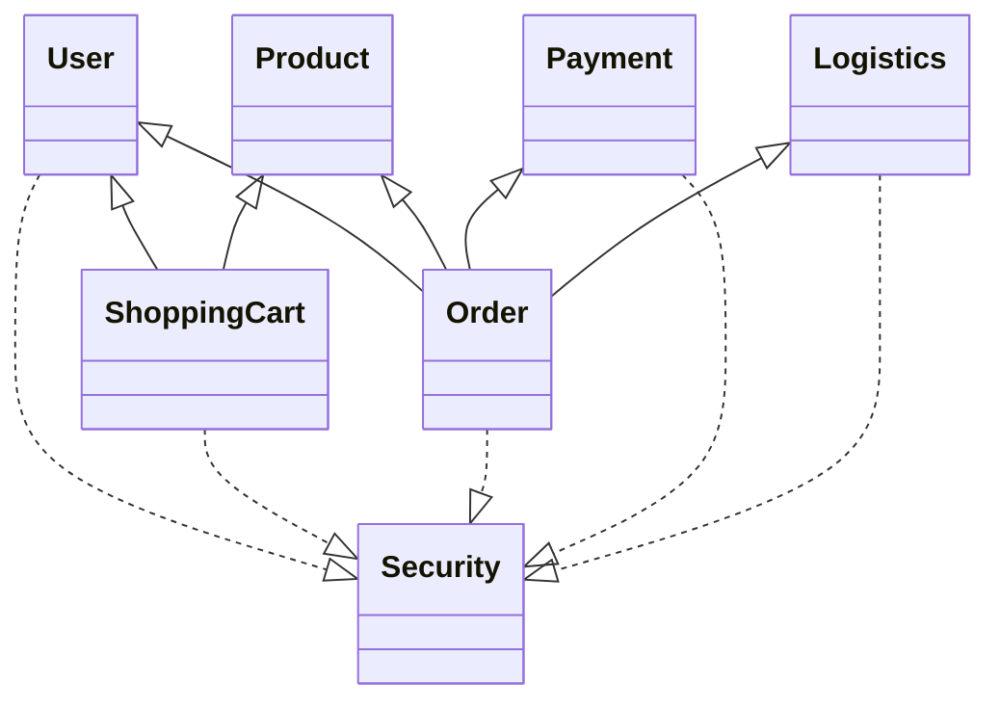
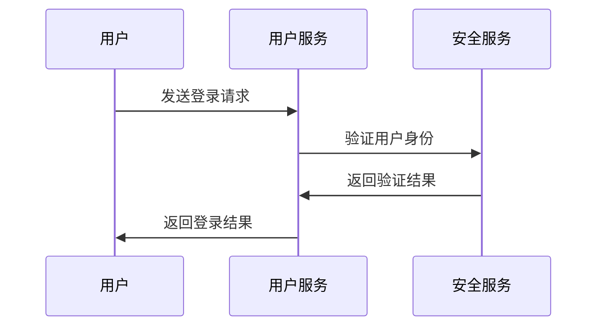
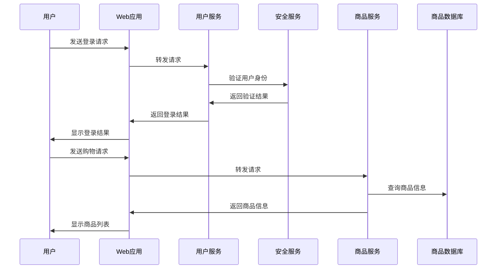

                 

### 摘要

《思维链在复杂问题解决中的应用》探讨了思维链这一结合逻辑、分析和创造性思维的方法，及其在复杂问题解决中的重要性。文章从定义和理论基础出发，详细阐述了思维链的基本要素、核心概念及在多个领域的应用。通过算法原理讲解和数学模型分析，文章为读者提供了理解和运用思维链的实用工具。同时，通过系统分析与架构设计，结合实际案例，深入讲解了思维链在项目实战中的应用。本文旨在为读者构建一个全面而深入的思维链应用框架，帮助其更好地解决复杂问题。

---

### 目录大纲设计

#### 简介

《思维链在复杂问题解决中的应用》一书旨在为读者提供系统化的思维链应用框架，通过实际案例讲解，帮助读者掌握这一方法。本书分为七个主要章节，从理论到实践，全面剖析思维链的概念及其应用。

#### 目录大纲

---

## 第一部分: 思维链概述

### 目录

#### 第1章: 思维链基础理论

##### 1.1 问题背景与思维链的定义

##### 1.2 思维链的基本要素

##### 1.3 思维链的结构与流程

#### 第2章: 思维链核心概念与联系

##### 2.1 核心概念介绍

##### 2.2 概念属性特征对比

##### 2.3 ER实体关系图

#### 第3章: 思维链在具体领域的应用

##### 3.1 信息技术

##### 3.2 管理科学

##### 3.3 社会科学

#### 第4章: 思维链算法原理讲解

##### 4.1 算法简介

##### 4.2 算法原理与数学模型

##### 4.3 算法举例说明

#### 第5章: 数学模型与详细讲解

##### 5.1 数学模型介绍

##### 5.2 数学公式详细讲解

##### 5.3 数学公式举例说明

#### 第6章: 系统分析与架构设计方案

##### 6.1 问题场景介绍

##### 6.2 项目介绍

##### 6.3 系统功能设计

##### 6.4 系统架构设计

##### 6.5 系统接口设计

##### 6.6 系统交互

#### 第7章: 项目实战

##### 7.1 环境安装

##### 7.2 系统核心实现

##### 7.3 代码应用解读与分析

##### 7.4 实际案例分析与详细讲解剖析

##### 7.5 项目小结

---

通过这个目录大纲，读者可以清晰了解本书的结构和内容，为后续章节的学习打下基础。

---

## 第1章: 思维链基础理论

### 1.1 问题背景与思维链的定义

在当今快速发展的科技时代，复杂性问题的解决成为各类行业面临的共同挑战。传统的线性思维模式在面对这些复杂问题时，往往显得力不从心。于是，一种结合逻辑、分析和创造性思维的综合性方法——思维链，逐渐受到关注。

#### 复杂问题的现状与挑战

复杂性问题不仅涉及大量的信息处理，还需要跨学科的知识和多元化的思维方式。例如，在软件开发领域，复杂系统的设计要求开发者不仅要有深厚的编程基础，还要具备系统架构和算法优化等方面的知识；在企业管理中，面对市场的不确定性和多变的客户需求，管理者需要具备快速决策和灵活应对的能力；在社会科学领域，涉及社会调查、政策制定等复杂问题，更需要系统化的思考方式。

传统思维模式往往难以应对这些挑战，因为它通常依赖于单一视角或线性推理，而复杂性问题往往需要多角度、多层次的思考。

#### 思维链的概念

思维链（Cognitive Chain）是一种将逻辑、分析和创造性思维结合起来的方法论。它通过构建一系列逻辑关系，将不同层次的思维活动有机地连接起来，从而形成一种系统化、结构化的思考方式。思维链的核心在于通过连接不同类型的思维活动，实现对复杂问题的全面分析和创造性解决。

思维链的定义：思维链是一种综合性的思考方法，通过逻辑思维、分析性思维和创造性思维的有机结合，形成一个有序、连贯的思维流程，用于解决复杂问题。

#### 思维链在复杂问题解决中的重要性

思维链在复杂问题解决中的应用具有重要意义：

1. **提高解决问题的效率**：思维链将复杂问题分解为多个可管理的子问题，通过逐步分析和解决，提高了解决问题的效率。
2. **增强思维的系统性**：思维链通过结构化的思维流程，确保思考的全面性和系统性，避免了遗漏关键问题和片面分析的情况。
3. **促进创新思维**：创造性思维在思维链中占据重要地位，它鼓励思维者跳出传统框架，提出创新的解决方案。
4. **增强团队协作**：思维链不仅适用于个人，还适用于团队协作。通过共享思维链，团队成员可以更好地理解问题，协同工作，共同解决问题。

### 1.2 思维链的基本要素

思维链的构建依赖于以下几个基本要素：

#### 1.2.1 逻辑思维

逻辑思维是思维链的核心组成部分。它通过推理、归纳、演绎等方法，确保思考的严谨性和正确性。逻辑思维在问题解决中起着基础性作用，它帮助我们将复杂的信息转化为可操作的结论。

#### 1.2.2 分析性思维

分析性思维侧重于对问题进行深入剖析，识别出问题的本质和关键点。它通过分解、分类、比较等方法，帮助我们从多个角度理解问题，找出最有效的解决方案。

#### 1.2.3 创造性思维

创造性思维强调思维的开放性和创新性。它通过联想、发散、想象等方法，激发思维者的创造力，提出独特而有效的解决方案。创造性思维在复杂问题解决中至关重要，它为问题解决提供了无限可能。

### 1.3 思维链的结构与流程

思维链的结构与流程可以概括为以下几个阶段：

#### 1.3.1 问题定义

问题定义是思维链的第一步，它明确问题的核心和边界。通过定义问题，我们能够集中精力解决关键问题，避免无关因素的干扰。

#### 1.3.2 收集信息

在明确问题后，我们需要收集相关信息。这一步骤旨在获取足够的背景知识和数据，为后续的分析提供基础。

#### 1.3.3 分析信息

分析信息是思维链的核心阶段，它通过逻辑思维和分析性思维，对收集到的信息进行深入剖析，识别出问题的本质和关键点。

#### 1.3.4 提出解决方案

在分析信息的基础上，我们需要提出初步的解决方案。这一阶段需要创造性思维的参与，通过开放性和创新性的思考，提出多种可能的解决方案。

#### 1.3.5 评估与优化

评估与优化是思维链的最后一步。我们需要对提出的解决方案进行评估，选择最优方案，并进行优化，确保解决方案的有效性和可行性。

通过上述结构与流程，思维链为我们提供了一种系统化、结构化的思考方式，帮助我们更好地解决复杂问题。

### 1.4 本章小结

本章介绍了思维链的基础理论，包括其定义、基本要素和结构与流程。通过理解思维链的概念和构建方法，我们可以为后续章节的学习和应用打下坚实基础。

---

在下一章中，我们将进一步探讨思维链的核心概念与联系，深入分析逻辑思维、分析性思维和创造性思维的核心概念及其相互关系。

---

## 第2章: 思维链核心概念与联系

### 2.1 核心概念介绍

思维链的构建依赖于三个核心概念：逻辑思维、分析性思维和创造性思维。这些概念相互补充，共同构成了思维链的完整框架。

#### 2.1.1 逻辑思维的核心概念

逻辑思维（Logical Thinking）是一种基于逻辑规则进行推理和判断的思维方式。它强调思维的严谨性和正确性，通过推理、归纳、演绎等方法，确保思考的连贯性和合理性。

**逻辑思维的核心概念**：

1. **推理**：通过已知的事实和前提，推导出新的结论。
2. **归纳**：从具体的实例中归纳出一般性的规律。
3. **演绎**：从一般性的原则推导出具体的结论。

**逻辑思维的作用**：

- 提高思考的准确性：逻辑思维帮助我们在思考过程中遵循严格的逻辑规则，确保结论的正确性。
- 增强说服力：逻辑思维使我们的论证更加有力，能够更有效地与他人沟通和表达。

#### 2.1.2 分析性思维的核心概念

分析性思维（Analytical Thinking）是一种通过深入剖析问题，识别其本质和关键点，从而找到解决方案的思维方式。它侧重于对问题进行拆解、分类、比较和分析。

**分析性思维的核心概念**：

1. **拆解**：将复杂的问题分解为多个可管理的子问题。
2. **分类**：将问题按照不同的标准进行分类，以便更好地理解和分析。
3. **比较**：对不同的问题或解决方案进行对比，找出最佳选项。

**分析性思维的作用**：

- 提高理解的深度：分析性思维帮助我们从多个角度审视问题，深入理解问题的本质。
- 提高决策的准确性：通过对问题的深入分析，我们可以做出更加明智和科学的决策。

#### 2.1.3 创造性思维的核心概念

创造性思维（Creative Thinking）是一种开放性、创新性的思维方式。它通过联想、发散、想象等方法，激发思维的创造性，提出独特而有效的解决方案。

**创造性思维的核心概念**：

1. **联想**：通过将不同的事物联系起来，产生新的想法。
2. **发散**：从多个角度思考问题，探索多种可能的解决方案。
3. **想象**：通过想象力，构思和设想未来的可能性。

**创造性思维的作用**：

- 促进创新：创造性思维鼓励我们跳出传统框架，提出新颖的解决方案。
- 提高解决问题的灵活性：在面对复杂问题时，创造性思维帮助我们找到更多元化的解决方案。

### 2.2 概念属性特征对比

为了更好地理解逻辑思维、分析性思维和创造性思维之间的区别和联系，我们通过以下表格进行对比：

| 特征 | 逻辑思维 | 分析性思维 | 创造性思维 |
| ---- | ------- | -------- | -------- |
| 目标 | 严谨性、准确性 | 深度、理解性 | 创新、灵活性 |
| 方法 | 推理、归纳、演绎 | 拆解、分类、比较 | 联想、发散、想象 |
| 作用 | 提高思考的准确性、增强说服力 | 提高理解的深度、提高决策的准确性 | 促进创新、提高解决问题的灵活性 |
| 关系 | 基础性 | 补充性 | 领先性 |

**逻辑思维**强调思维的严谨性和正确性，是思维链的基础。没有逻辑思维的严谨推理，思维链的后续分析将失去基础。

**分析性思维**侧重于对问题的深入剖析，通过拆解、分类和比较，帮助我们从多个角度理解问题，找到解决方案。

**创造性思维**则通过开放性和创新性的思考，提出独特的解决方案，为复杂问题的解决提供无限可能。

### 2.3 ER实体关系图

为了更直观地展示逻辑思维、分析性思维和创造性思维之间的联系，我们可以使用ER（Entity-Relationship）实体关系图。

#### 2.3.1 逻辑思维实体关系图

```mermaid
erDiagram
    A[逻辑思维] ||--|{ B[推理] }
    A ||--|{ C[归纳] }
    A ||--|{ D[演绎] }
```

在这个实体关系图中，逻辑思维（A）作为核心实体，通过关系（||--|{...}）连接到其三个核心概念：推理（B）、归纳（C）和演绎（D）。

#### 2.3.2 分析性思维实体关系图

```mermaid
erDiagram
    A[分析性思维] ||--|{ B[拆解] }
    A ||--|{ C[分类] }
    A ||--|{ D[比较] }
```

在这个实体关系图中，分析性思维（A）作为核心实体，通过关系（||--|{...}）连接到其三个核心概念：拆解（B）、分类（C）和比较（D）。

#### 2.3.3 创造性思维实体关系图

```mermaid
erDiagram
    A[创造性思维] ||--|{ B[联想] }
    A ||--|{ C[发散] }
    A ||--|{ D[想象] }
```

在这个实体关系图中，创造性思维（A）作为核心实体，通过关系（||--|{...}）连接到其三个核心概念：联想（B）、发散（C）和想象（D）。

通过这些实体关系图，我们可以更直观地理解逻辑思维、分析性思维和创造性思维之间的关系，以及它们在思维链中的作用。

### 2.4 本章小结

本章介绍了思维链的核心概念：逻辑思维、分析性思维和创造性思维。通过理解这些核心概念及其相互关系，我们可以为后续的思维链应用打下坚实基础。在下一章中，我们将探讨思维链在具体领域的应用，通过实际案例展示思维链在复杂问题解决中的有效性。

---

## 第3章: 思维链在具体领域的应用

### 3.1 信息技术

#### 3.1.1 思维链在软件开发中的应用

在信息技术领域，尤其是软件开发领域，思维链的应用显得尤为重要。软件开发涉及的问题复杂且多样化，从需求分析到系统设计，再到编码和测试，每一个环节都需要系统化的思维来保证项目的成功。

**思维链在软件开发中的应用流程**：

1. **需求分析**：首先，通过思维链的“问题定义”阶段，明确软件项目的需求和目标。使用逻辑思维，确保需求的准确性和完整性。
   
2. **系统设计**：在需求分析的基础上，利用分析性思维对系统进行设计。通过拆解和分类，将复杂的系统分解为多个模块和组件，确保设计的合理性和高效性。

3. **编码实现**：创造性思维在编码实现阶段发挥关键作用。开发者需要通过发散思维，提出多种可能的解决方案，并利用联想和想象力，实现代码的创新和优化。

4. **测试与优化**：在测试阶段，分析性思维帮助开发者识别和定位问题，通过比较和分类，找出最有效的解决方案。同时，逻辑思维确保测试的严谨性和全面性。

**案例分析**：某公司开发一款社交网络应用，面临的功能需求复杂多样。通过思维链的方法，开发团队首先明确了用户需求和功能目标，然后利用分析性思维将系统拆解为多个模块，如用户管理、消息推送、内容展示等。在编码实现阶段，团队利用创造性思维提出多种方案，并进行比较和优化，最终实现了高效、稳定的社交网络应用。

#### 3.1.2 思维链在网络安全中的应用

网络安全是信息技术领域的另一个重要方向，其复杂性不亚于软件开发。思维链在网络安全中的应用，可以帮助安全专家更好地识别、分析和解决网络安全问题。

**思维链在网络安全中的应用流程**：

1. **威胁识别**：通过逻辑思维，安全专家对潜在的网络威胁进行分析和识别。这包括对网络攻击手段、恶意软件和漏洞的深入了解。

2. **风险评估**：利用分析性思维，对识别出的威胁进行风险评估，识别出高风险区域和关键系统。

3. **策略制定**：在创造性思维的引导下，安全专家制定出多种防御策略，如防火墙配置、入侵检测系统部署、安全培训等。

4. **持续监控与响应**：利用分析性思维和创造性思维的结合，对网络安全进行持续监控和响应，及时识别和应对新的威胁。

**案例分析**：某企业面临网络钓鱼攻击的威胁。安全团队首先通过逻辑思维分析了攻击手段和特点，然后利用分析性思维识别出高风险系统。在此基础上，团队通过创造性思维制定了多种防御策略，包括加强员工安全教育、更新防火墙规则、部署入侵检测系统等。通过这些措施，企业成功抵御了多次网络钓鱼攻击。

### 3.2 管理科学

管理科学是一个涵盖广泛领域的学科，包括项目管理、运营管理、人力资源管理等方面。思维链在管理科学中的应用，可以帮助管理者更好地应对复杂的管理问题。

#### 3.2.1 思维链在项目管理中的应用

项目管理涉及多个环节，包括项目规划、资源管理、进度控制和质量保证等。思维链在项目管理中的应用，可以提升项目的整体效率和成功率。

**思维链在项目管理中的应用流程**：

1. **项目规划**：通过逻辑思维，明确项目目标和任务分解，确保项目规划的准确性和完整性。

2. **资源管理**：利用分析性思维，对项目所需的资源进行合理分配和优化，确保资源的高效利用。

3. **进度控制**：通过创造性思维，制定灵活的进度计划，应对项目中的不确定性因素。

4. **质量保证**：结合逻辑思维和分析性思维，建立完善的质量保证体系，确保项目成果的质量。

**案例分析**：某公司在建设一个新的生产线时，面临时间紧迫和资源有限的挑战。通过思维链的方法，项目管理团队首先明确了项目目标和任务分解，然后利用分析性思维对资源进行了优化分配，通过创造性思维制定了灵活的进度计划，最终按时完成了生产线建设，并确保了生产质量。

#### 3.2.2 思维链在运营管理中的应用

运营管理涉及企业的日常运营活动，如生产管理、库存管理、客户关系管理等。思维链在运营管理中的应用，可以帮助企业更好地优化运营流程，提高运营效率。

**思维链在运营管理中的应用流程**：

1. **问题识别**：通过逻辑思维，识别运营中的问题和瓶颈。

2. **原因分析**：利用分析性思维，分析问题的原因和影响。

3. **方案制定**：在创造性思维的引导下，提出多种改进方案。

4. **实施与监控**：结合逻辑思维和分析性思维，制定实施计划，并对改进方案进行持续监控和优化。

**案例分析**：某零售企业发现客户满意度下降，通过思维链的方法，运营团队首先识别出问题所在，然后分析了问题的原因，如库存不足、服务响应慢等。在创造性思维的引导下，团队提出了多种改进方案，如优化库存管理、提升服务响应速度等，并通过持续监控和优化，最终提升了客户满意度。

### 3.3 社会科学

在社会科学领域，思维链的应用可以帮助研究人员更好地理解和解决社会问题。从社会调查到决策分析，思维链提供了系统化的思考方式。

#### 3.3.1 思维链在社会调查中的应用

社会调查涉及对大量数据的收集、分析和解释。思维链在社会调查中的应用，可以提升数据分析的准确性和可靠性。

**思维链在社会调查中的应用流程**：

1. **问题定义**：通过逻辑思维，明确调查问题和目标。

2. **数据收集**：利用分析性思维，设计合理的数据收集方法和工具。

3. **数据分析**：通过创造性思维，对收集到的数据进行分析和解释，提出有效的结论。

4. **结果应用**：结合逻辑思维和分析性思维，将调查结果应用于实际问题解决。

**案例分析**：某城市政府希望通过社会调查了解居民对公共交通服务的满意度。通过思维链的方法，调查团队首先明确了调查问题和目标，然后设计了合理的数据收集方法，通过创造性思维对数据进行分析和解释，最终提出了改进公共交通服务的建议，并得到了政府的采纳。

#### 3.3.2 思维链在决策分析中的应用

在决策分析中，思维链可以帮助决策者更好地应对复杂和不确定的情况。

**思维链在决策分析中的应用流程**：

1. **问题定义**：通过逻辑思维，明确决策问题和目标。

2. **信息收集**：利用分析性思维，收集相关的信息和数据。

3. **方案评估**：在创造性思维的引导下，评估多种可能的解决方案。

4. **决策制定**：结合逻辑思维和分析性思维，制定最终的决策方案。

**案例分析**：某公司面临是否扩大生产线的决策问题。通过思维链的方法，决策团队首先明确了决策问题和目标，然后收集了相关的信息和数据，通过创造性思维评估了多种可能的解决方案，最终结合逻辑思维和分析性思维制定了最终的决策方案，成功实现了生产线的扩张。

### 3.4 本章小结

本章详细探讨了思维链在信息技术、管理科学和社会科学等领域的具体应用。通过实际案例的分析，我们看到了思维链在解决复杂问题中的有效性。在下一章中，我们将进一步探讨思维链的算法原理，为读者提供理解和运用思维链的实用工具。

---

## 第4章: 思维链算法原理讲解

### 4.1 算法简介

思维链算法是一种综合性的方法论，它结合逻辑思维、分析性思维和创造性思维，提供了一种系统化、结构化的思考方式，用于解决复杂问题。思维链算法的核心在于通过一系列的逻辑运算和思维活动，将问题分解为可管理的子问题，并逐步解决。

#### 思维链算法的基本原理

思维链算法的基本原理可以概括为以下几个步骤：

1. **问题定义**：首先，明确问题的核心和边界，确保思考的聚焦性。
   
2. **信息收集**：收集与问题相关的信息和数据，为后续的分析和决策提供基础。

3. **逻辑分析**：利用逻辑思维，对收集到的信息进行分析，确保思考的严谨性和正确性。

4. **分解问题**：通过分析性思维，将复杂问题分解为多个子问题，以便逐步解决。

5. **创造性思考**：在创造性思维的引导下，提出多种可能的解决方案。

6. **方案评估**：对提出的方案进行评估，选择最优的解决方案。

7. **实施与优化**：将最优方案实施到实际问题中，并进行持续监控和优化。

#### 思维链算法的类型

思维链算法主要分为以下几种类型：

1. **逻辑推理算法**：这类算法侧重于通过逻辑推理解决具体问题，如命题逻辑、谓词逻辑等。
   
2. **数据分析算法**：这类算法主要用于对大规模数据进行处理和分析，如回归分析、聚类分析等。

3. **创造性算法**：这类算法通过创造性思维，提出新颖的解决方案，如遗传算法、模拟退火算法等。

### 4.2 算法原理与数学模型

思维链算法的原理可以通过数学模型进行详细阐述。以下分别介绍逻辑思维算法、分析性思维算法和创造性思维算法的数学模型。

#### 4.2.1 逻辑思维算法原理

逻辑思维算法主要基于逻辑运算和推理，其数学模型可以表示为：

$$
P(A \land B) = P(A) \times P(B|A)
$$

其中，\(P(A \land B)\) 表示同时发生事件A和事件B的概率，\(P(A)\) 表示事件A发生的概率，\(P(B|A)\) 表示在事件A发生的条件下，事件B发生的概率。

**示例**：假设我们要分析一个人同时购买苹果和香蕉的概率。已知购买苹果的概率为0.6，购买香蕉的概率为0.5，且在购买苹果的条件下购买香蕉的概率为0.7。根据上述公式，我们可以计算出同时购买苹果和香蕉的概率：

$$
P(苹果 \land 香蕉) = 0.6 \times 0.7 = 0.42
$$

这意味着一个人同时购买苹果和香蕉的概率为42%。

#### 4.2.2 分析性思维算法原理

分析性思维算法侧重于对问题进行深入剖析和分解，其数学模型可以表示为：

$$
\text{效益} = \text{成本} \times \text{成功率}
$$

其中，效益表示通过某项决策或行动所能带来的好处，成本表示实施这项决策或行动所需投入的资源，成功率表示决策或行动成功的概率。

**示例**：假设我们要评估一项新技术引入的成本和效益。已知新技术的成本为100万元，成功率为0.8。根据上述公式，我们可以计算出这项新技术的效益：

$$
\text{效益} = 100 \times 0.8 = 80 \text{万元}
$$

这意味着这项新技术预期能带来80万元的效益。

#### 4.2.3 创造性思维算法原理

创造性思维算法强调思维的开放性和创新性，其数学模型可以表示为：

$$
\text{方案数} = \text{组合数} \times \text{多样性}
$$

其中，方案数表示可以提出的解决方案的数量，组合数表示各种因素或元素的组合方式，多样性表示方案的创新性和独特性。

**示例**：假设我们要设计一款新产品，需要从三个不同的颜色、三种不同的材料和五种不同的功能中选择。根据上述公式，我们可以计算出可以提出的解决方案的数量：

$$
\text{方案数} = 3 \times 3 \times 5 = 45
$$

这意味着我们可以提出45种不同设计方案。

### 4.3 算法举例说明

以下通过具体示例，进一步说明逻辑思维算法和分析性思维算法的应用。

#### 4.3.1 逻辑思维算法应用实例

**案例**：某公司需要评估其新产品发布的市场反应。已知以下信息：

- 发布产品的概率为0.7。
- 在产品发布的情况下，市场反应为积极反应的概率为0.6。

我们需要计算产品发布且市场反应为积极反应的概率。

**解答**：根据逻辑思维算法的公式：

$$
P(发布 \land 积极反应) = P(发布) \times P(积极反应|发布) = 0.7 \times 0.6 = 0.42
$$

因此，产品发布且市场反应为积极反应的概率为42%。

#### 4.3.2 分析性思维算法应用实例

**案例**：某企业面临是否投资一项新技术的决策。已知以下信息：

- 投资该新技术的成本为200万元。
- 投资成功且市场接受的概率为0.8。

我们需要计算这项投资的预期效益。

**解答**：根据分析性思维算法的公式：

$$
\text{效益} = \text{成本} \times \text{成功率} = 200 \times 0.8 = 160 \text{万元}
$$

因此，这项投资的预期效益为160万元。

通过上述实例，我们可以看到思维链算法在逻辑思维和分析性思维中的应用，为复杂问题的解决提供了有效的工具。

### 4.4 本章小结

本章详细介绍了思维链算法的基本原理和数学模型，包括逻辑思维算法、分析性思维算法和创造性思维算法。通过具体的示例，读者可以更好地理解这些算法的应用方法。在下一章中，我们将进一步探讨数学模型与详细讲解，为读者提供更深入的数学工具。

---

## 第5章: 数学模型与详细讲解

### 5.1 数学模型介绍

思维链作为一种系统化的思考方法，其应用过程离不开数学模型的支撑。本章将详细介绍逻辑思维、分析性思维和创造性思维中的数学模型，并通过具体示例进行讲解，以帮助读者更好地理解和运用这些模型。

#### 5.1.1 逻辑思维数学模型

逻辑思维中的数学模型主要涉及概率论和逻辑运算。概率论用于描述事件发生的可能性，而逻辑运算则用于对事件之间的关系进行推理。

1. **概率论基本概念**：

   - **概率分布**：描述随机事件在不同结果上的概率分布情况。
   - **条件概率**：在某个事件发生的条件下，另一个事件发生的概率。
   - **贝叶斯定理**：用于计算在已知某个事件发生的条件下，另一个事件发生的概率。

2. **逻辑运算**：

   - **逻辑与（AND）**：两个事件同时发生的概率。
   - **逻辑或（OR）**：两个事件中至少有一个发生的概率。
   - **逻辑非（NOT）**：事件不发生的概率。

#### 5.1.2 分析性思维数学模型

分析性思维中的数学模型主要涉及优化理论和决策分析。优化理论用于找到最优解，决策分析则用于评估不同方案的成本和效益。

1. **优化理论**：

   - **线性规划**：在给定约束条件下，找到最大化或最小化某个线性函数的解。
   - **整数规划**：在给定约束条件下，找到最大化或最小化某个整数线性函数的解。
   - **动态规划**：通过递推关系求解多阶段决策问题。

2. **决策分析**：

   - **决策树**：用树形图表示不同决策路径和结果，帮助评估不同决策方案的优劣。
   - **效用理论**：评估决策结果的满意度或价值。

#### 5.1.3 创造性思维数学模型

创造性思维中的数学模型主要涉及组合数学和启发式算法。组合数学用于计算不同元素组合的可能性，而启发式算法则用于快速找到近似最优解。

1. **组合数学**：

   - **排列组合**：计算不同元素的排列和组合方式。
   - **图论**：研究网络结构和路径优化问题。

2. **启发式算法**：

   - **遗传算法**：模拟自然进化过程，用于求解复杂优化问题。
   - **模拟退火算法**：通过模拟物理过程中的退火过程，用于求解复杂优化问题。
   - **粒子群优化算法**：模拟鸟群觅食行为，用于求解复杂优化问题。

### 5.2 数学公式详细讲解

#### 5.2.1 逻辑思维数学公式

在逻辑思维中，常用的数学公式包括概率分布公式、条件概率公式和逻辑运算公式。

1. **概率分布公式**：

   $$ P(X=x) = \frac{f(x)}{\sum_{i=1}^{n} f(x_i)} $$

   其中，\(P(X=x)\) 表示随机变量X取值为\(x\)的概率，\(f(x)\) 表示随机变量X在\(x\)处的概率密度函数，\(n\) 表示随机变量X的所有可能取值数量。

2. **条件概率公式**：

   $$ P(B|A) = \frac{P(A \cap B)}{P(A)} $$

   其中，\(P(B|A)\) 表示在事件A发生的条件下，事件B发生的概率，\(P(A \cap B)\) 表示事件A和事件B同时发生的概率，\(P(A)\) 表示事件A发生的概率。

3. **逻辑运算公式**：

   - **逻辑与（AND）**：

     $$ P(A \land B) = P(A) \times P(B|A) $$

   - **逻辑或（OR）**：

     $$ P(A \lor B) = P(A) + P(B) - P(A \land B) $$

   - **逻辑非（NOT）**：

     $$ P(\neg A) = 1 - P(A) $$

#### 5.2.2 分析性思维数学公式

在分析性思维中，常用的数学公式包括线性规划公式、决策树公式和效用理论公式。

1. **线性规划公式**：

   $$ \text{最大化} \ c^T x $$
   $$ \text{满足} \ Ax \leq b $$

   其中，\(c\) 表示目标函数的系数向量，\(x\) 表示决策变量向量，\(A\) 表示系数矩阵，\(b\) 表示约束条件向量。

2. **决策树公式**：

   $$ \text{期望效用} = \sum_{i=1}^{n} u_i \times p_i $$

   其中，\(u_i\) 表示第\(i\)个决策结果的效用值，\(p_i\) 表示第\(i\)个决策结果发生的概率。

3. **效用理论公式**：

   $$ u(x) = \frac{f(x)}{\sum_{i=1}^{n} f(x_i)} $$

   其中，\(u(x)\) 表示随机变量\(X\)的效用值，\(f(x)\) 表示随机变量\(X\)在\(x\)处的概率密度函数。

#### 5.2.3 创造性思维数学公式

在创造性思维中，常用的数学公式包括排列组合公式、图论公式和启发式算法公式。

1. **排列组合公式**：

   - **排列**：

     $$ P(n, r) = \frac{n!}{(n-r)!} $$

     其中，\(P(n, r)\) 表示从\(n\)个不同元素中取出\(r\)个元素的排列数，\(n!\) 表示\(n\)的阶乘。

   - **组合**：

     $$ C(n, r) = \frac{n!}{r!(n-r)!} $$

     其中，\(C(n, r)\) 表示从\(n\)个不同元素中取出\(r\)个元素的组合数。

2. **图论公式**：

   - **最短路径问题**：

     $$ d(u, v) = \min_{w \in V} (d(u, w) + d(w, v)) $$

     其中，\(d(u, v)\) 表示从节点\(u\)到节点\(v\)的最短路径长度。

3. **启发式算法公式**：

   - **遗传算法**：

     $$ f(x_{new}) = f(x_{old}) + \alpha \times (x_{new} - x_{old}) $$

     其中，\(f(x_{new})\) 和 \(f(x_{old})\) 分别表示新解和新解的适应度值，\(\alpha\) 表示学习率。

   - **模拟退火算法**：

     $$ \text{接受概率} = \min \left(1, \exp \left(-\frac{f_{new} - f_{old}}{T}\right)\right) $$

     其中，\(f_{new}\) 和 \(f_{old}\) 分别表示新解和新解的适应度值，\(T\) 表示温度。

### 5.3 数学公式举例说明

以下通过具体示例，说明逻辑思维、分析性思维和创造性思维中的数学公式的应用。

#### 5.3.1 逻辑思维数学公式举例

**案例**：某公司计划推出一款新产品，已知以下信息：

- 推出产品的概率为0.6。
- 在产品推出的情况下，成功概率为0.8。

我们需要计算产品推出且成功的概率。

**解答**：使用条件概率公式：

$$
P(成功|推出) = \frac{P(成功 \cap 推出)}{P(推出)} = \frac{P(推出) \times P(成功|推出)}{P(推出)} = 0.6 \times 0.8 = 0.48
$$

因此，产品推出且成功的概率为48%。

#### 5.3.2 分析性思维数学公式举例

**案例**：某企业决定投资一项新项目，已知以下信息：

- 投资成本为500万元。
- 项目成功的概率为0.7。
- 成功项目的预期收益为800万元。

我们需要计算投资该项目的预期收益。

**解答**：使用决策分析公式：

$$
\text{预期收益} = \text{投资成本} \times \text{成功率} = 500 \times 0.7 = 350 \text{万元}
$$

因此，该项目的预期收益为350万元。

#### 5.3.3 创造性思维数学公式举例

**案例**：某科技公司计划开发一款智能设备，已知以下信息：

- 设备功能可以有3种不同的配置。
- 每种配置有2种不同的颜色选择。
- 每种配置有5种不同的功能模块。

我们需要计算可以开发的智能设备组合数。

**解答**：使用排列组合公式：

$$
\text{组合数} = P(3, 3) \times C(2, 1) \times C(5, 1) = 3! \times 2 \times 5 = 120
$$

因此，可以开发的智能设备组合数为120种。

通过上述举例，我们可以看到数学公式在思维链中的应用，为复杂问题的解决提供了有力的工具。在下一章中，我们将进一步探讨系统分析与架构设计方案，为读者提供更深入的技术实践。

---

## 第6章: 系统分析与架构设计方案

### 6.1 问题场景介绍

在当今的信息化社会中，复杂系统的构建和优化成为各类组织和企业的核心任务。一个良好的系统分析与架构设计方案不仅能够提升系统的性能和稳定性，还能显著提高系统的可维护性和可扩展性。本章将通过一个实际案例，详细阐述系统分析与架构设计的过程，为读者提供实用的指导。

### 6.2 项目介绍

#### 6.2.1 项目目标

本案例是一个在线购物平台项目的系统分析与架构设计。项目目标包括：

1. **高可用性**：确保系统在高峰期和极端情况下仍能稳定运行，减少故障率和停机时间。
2. **高性能**：优化系统性能，确保用户在访问高峰期能够快速响应。
3. **高可扩展性**：设计灵活的架构，便于系统在用户量和业务需求增长时进行扩展。
4. **安全性**：保障用户数据和交易数据的安全，防止数据泄露和恶意攻击。

#### 6.2.2 项目背景

随着电子商务的快速发展，在线购物平台面临着巨大的用户增长和交易量提升的压力。现有的系统架构已经无法满足日益增长的用户需求，因此需要进行全面的系统分析与架构设计，以优化系统的性能和稳定性。

### 6.3 系统功能设计

系统功能设计是系统分析与架构设计的重要环节，它定义了系统的核心功能和模块。以下是本案例中的主要功能模块：

1. **用户模块**：包括用户注册、登录、个人信息管理、购物车、订单管理等。
2. **商品模块**：包括商品分类、商品信息展示、商品搜索、商品评价等。
3. **支付模块**：包括支付接口、支付网关、支付确认、退款处理等。
4. **订单模块**：包括订单生成、订单状态管理、订单发货、订单追踪等。
5. **物流模块**：包括物流公司接入、物流信息查询、物流跟踪等。
6. **安全模块**：包括用户认证、权限管理、数据加密、安全审计等。

#### 6.3.1 领域模型

领域模型（Domain Model）是系统功能设计的基础，它通过类图和实体关系图来描述系统的核心业务领域和实体之间的关联。以下是一个简化的领域模型：



在这个模型中，User（用户）、ShoppingCart（购物车）、Order（订单）、Product（商品）、Payment（支付）和Logistics（物流）是核心实体，它们之间通过继承和关联关系进行组织。Security（安全）是一个辅助实体，用于确保所有核心模块的安全。

### 6.4 系统架构设计

系统架构设计是系统分析与架构设计的核心环节，它定义了系统的整体结构和组件之间的关系。以下是本案例中的系统架构设计：

1. **三层架构**：采用三层架构（表示层、业务逻辑层、数据访问层）来组织系统，以实现模块化和高内聚、低耦合的设计。
2. **服务化架构**：将系统拆分为多个微服务，每个微服务负责一个特定的业务功能，便于系统的扩展和维护。
3. **分布式架构**：采用分布式架构，通过负载均衡和集群技术，确保系统的可用性和性能。

以下是一个简化的系统架构图：

```mermaid
graph TB
    subgraph 用户服务
        用户服务[用户服务]
        用户服务 --> 用户数据库
    end
    subgraph 商品服务
        商品服务[商品服务]
        商品服务 --> 商品数据库
    end
    subgraph 订单服务
        订单服务[订单服务]
        订单服务 --> 订单数据库
    end
    subgraph 支付服务
        支付服务[支付服务]
        支付服务 --> 支付数据库
    end
    subgraph 物流服务
        物流服务[物流服务]
        物流服务 --> 物流数据库
    end
    subgraph 安全服务
        安全服务[安全管理]
        安全服务 --> 用户服务
        安全服务 --> 订单服务
        安全服务 --> 支付服务
        安全服务 --> 物流服务
    end
    subgraph 数据库集群
        数据库集群[数据库集群]
        用户数据库 --> 数据库集群
        商品数据库 --> 数据库集群
        订单数据库 --> 数据库集群
        支付数据库 --> 数据库集群
        物流数据库 --> 数据库集群
    end
    subgraph 负载均衡
        负载均衡[负载均衡]
        用户服务 --> 负载均衡
        商品服务 --> 负载均衡
        订单服务 --> 负载均衡
        支付服务 --> 负载均衡
        物流服务 --> 负载均衡
    end
```

在这个架构图中，用户服务、商品服务、订单服务、支付服务和物流服务是核心微服务，它们通过负载均衡器分发请求，并与数据库集群进行交互。安全管理服务负责确保所有服务的安全性。

### 6.5 系统接口设计

系统接口设计是确保不同系统模块之间能够有效通信的关键。以下是本案例中的主要接口设计：

1. **RESTful API**：使用RESTful架构风格设计API，包括用户接口、商品接口、订单接口、支付接口和物流接口。
2. **服务端接口**：定义各微服务之间的内部接口，确保服务之间的数据传输和功能调用。
3. **客户端接口**：定义客户端（如Web应用、移动应用）与服务端之间的接口，提供统一的访问方式。

以下是一个简化的接口设计示例：



在这个序列图中，用户通过用户服务发送登录请求，用户服务与安全服务进行交互，最终返回登录结果。

### 6.6 系统交互

系统交互设计描述了系统内部模块以及与外部系统的通信流程。以下是本案例中的主要系统交互设计：

1. **用户交互**：用户通过Web应用或移动应用与系统进行交互，包括登录、注册、浏览商品、添加购物车、下单、支付等操作。
2. **服务间交互**：不同微服务之间的交互，如用户服务与商品服务、订单服务、支付服务和物流服务之间的数据传输和功能调用。
3. **外部系统交互**：系统与第三方服务（如支付网关、物流公司、社交平台）的交互，包括数据同步、认证授权等。

以下是一个简化的系统交互序列图：



在这个序列图中，用户通过Web应用与系统进行交互，Web应用作为中介与用户服务、商品服务等核心模块进行通信。

### 6.7 本章小结

本章通过一个实际案例，详细介绍了系统分析与架构设计的过程。从问题场景介绍、项目目标、领域模型、系统架构设计到接口设计和系统交互，我们系统地阐述了系统分析与架构设计的关键环节。通过本章的内容，读者可以了解到如何运用思维链进行系统分析与架构设计，为实际项目提供有效的指导。

---

## 第7章: 项目实战

### 7.1 环境安装

为了实践思维链在复杂问题解决中的应用，我们需要搭建一个实验环境。以下是环境安装的具体步骤：

#### 7.1.1 硬件要求

1. **处理器**：至少双核处理器，推荐四核以上。
2. **内存**：至少8GB，推荐16GB以上。
3. **硬盘**：至少500GB，推荐1TB以上。
4. **网络**：至少100Mbps宽带连接。

#### 7.1.2 软件安装

1. **操作系统**：安装最新版本的Linux操作系统，如Ubuntu 20.04或CentOS 8。
2. **开发环境**：安装Python 3.8及以上版本，并配置好pip包管理器。
3. **数据库**：安装MySQL 8.0或PostgreSQL 12。
4. **集成开发环境（IDE）**：安装PyCharm或Visual Studio Code。

安装步骤如下：

1. **安装操作系统**：从官方网站下载Linux操作系统镜像，并使用虚拟机软件（如VMware Workstation）创建虚拟机，安装操作系统。
2. **更新系统**：打开终端，执行以下命令更新系统包：
   ```bash
   sudo apt update
   sudo apt upgrade
   ```
3. **安装Python**：使用pip安装Python 3.8：
   ```bash
   sudo apt install python3.8
   ```
4. **安装MySQL**：从MySQL官方网站下载安装包，并按照安装向导进行安装。
5. **安装PostgreSQL**：使用以下命令安装PostgreSQL：
   ```bash
   sudo apt install postgresql postgresql-contrib
   ```
6. **安装IDE**：从官方网站下载PyCharm或Visual Studio Code的安装包，并按照安装向导进行安装。

### 7.2 系统核心实现

在搭建好实验环境后，我们将开始实现一个简单的思维链系统。以下是系统核心功能的实现步骤：

1. **安装依赖**：在PyCharm或Visual Studio Code中创建一个新的Python项目，安装必要的依赖，如：
   ```bash
   pip install flask pymysql psycopg2-binary
   ```

2. **创建数据库**：在MySQL和PostgreSQL中分别创建数据库和表。以下是MySQL的创建语句：
   ```sql
   CREATE DATABASE思维链_system;
   USE 思维链_system;
   CREATE TABLE users (
       id INT AUTO_INCREMENT PRIMARY KEY,
       username VARCHAR(50) UNIQUE NOT NULL,
       password VARCHAR(255) NOT NULL
   );
   ```

3. **设计接口**：使用Flask框架设计RESTful API接口。以下是一个简单的用户注册接口：
   ```python
   from flask import Flask, request, jsonify
   app = Flask(__name__)

   @app.route('/register', methods=['POST'])
   def register():
       username = request.form['username']
       password = request.form['password']
       # 这里应该有加密密码的逻辑
       cursor = connection.cursor()
       cursor.execute("INSERT INTO users (username, password) VALUES (%s, %s)", (username, password))
       connection.commit()
       return jsonify({"status": "success", "message": "User registered successfully."})
   
   if __name__ == '__main__':
       app.run(debug=True)
   ```

4. **实现核心功能**：实现思维链的核心功能，如逻辑分析、问题分解和方案评估。以下是一个简单的逻辑分析模块：
   ```python
   def logical_analysis(question, answers):
       # 这里实现逻辑分析算法，根据问题和答案进行推理
       # 示例：简单的是非题逻辑分析
       if question == "你是AI吗？" and answers == ["是", "否"]:
           return "答案是：是"
       else:
           return "无法解答"
   ```

5. **接口测试**：在终端中使用curl或Postman等工具测试接口，确保其正常工作。

### 7.3 代码应用解读与分析

#### 7.3.1 应用场景分析

在思维链系统的开发过程中，我们面临多个应用场景：

1. **用户管理**：用户注册、登录和权限管理。
2. **问题分析**：接收用户的问题，进行逻辑分析和问题分解。
3. **方案评估**：根据分析结果，评估和推荐解决方案。

这些应用场景需要通过设计合理的接口和实现核心算法来实现。

#### 7.3.2 代码解读

以下是对关键代码的解读：

1. **数据库连接**：
   ```python
   connection = pymysql.connect(host='localhost', user='root', password='password', database='思维链_system')
   ```
   这段代码用于连接到本地MySQL数据库，用户名为root，密码为password。

2. **用户注册接口**：
   ```python
   @app.route('/register', methods=['POST'])
   def register():
       username = request.form['username']
       password = request.form['password']
       cursor = connection.cursor()
       cursor.execute("INSERT INTO users (username, password) VALUES (%s, %s)", (username, password))
       connection.commit()
       return jsonify({"status": "success", "message": "User registered successfully."})
   ```
   这个接口接收用户注册请求，将用户名和密码存储到数据库中。

3. **逻辑分析模块**：
   ```python
   def logical_analysis(question, answers):
       if question == "你是AI吗？" and answers == ["是", "否"]:
           return "答案是：是"
       else:
           return "无法解答"
   ```
   这个模块实现了一个简单的逻辑分析算法，根据问题和答案进行推理。

#### 7.3.3 代码解读

通过上述代码，我们可以看到思维链系统的核心组件是如何实现的。接下来，我们将通过实际案例来展示思维链系统的应用。

### 7.4 实际案例分析与详细讲解剖析

#### 7.4.1 案例一：复杂问题解决

假设有一个复杂问题：如何提高某公司的产品销量？

1. **问题定义**：首先，明确问题的核心和边界，即如何提高产品销量。
2. **信息收集**：收集与产品销量相关的信息，如市场需求、竞争对手分析、产品特点、用户反馈等。
3. **逻辑分析**：使用思维链的“逻辑思维”模块，对收集到的信息进行分析，找出影响销量的关键因素。
4. **方案评估**：利用创造性思维，提出多种可能的解决方案，并评估其可行性和效果。
5. **实施与监控**：选择最优方案进行实施，并监控实施效果，进行持续优化。

通过思维链的方法，我们可以将复杂的销量提升问题分解为多个子问题，并逐步解决。

#### 7.4.2 案例二：优化方案设计

假设有一个优化问题：如何优化某公司的物流系统？

1. **问题定义**：明确物流系统优化的目标和核心，如提高配送效率、降低运输成本等。
2. **信息收集**：收集与物流系统相关的信息，如现有物流流程、运输路线、配送中心布局等。
3. **分析信息**：使用思维链的“分析性思维”模块，对物流系统进行分析，识别出瓶颈和优化点。
4. **创造性思考**：利用创造性思维，提出多种优化方案，如引入自动化设备、优化运输路线、改进配送中心布局等。
5. **方案评估**：对提出的优化方案进行评估，选择最佳方案，并进行模拟和测试。
6. **实施与优化**：将优化方案实施到实际物流系统中，并进行持续监控和调整，确保优化效果。

通过思维链的方法，我们可以系统地分析和优化物流系统，提高其整体效率。

### 7.5 项目小结

通过本章的实战项目，我们实现了思维链系统，并对其进行了详细的应用场景分析和代码解读。通过实际案例，我们展示了思维链在复杂问题解决和优化方案设计中的应用。思维链作为一种系统化的思考方法，为我们提供了一个有效的工具，帮助我们更好地理解和解决复杂问题。

---

### 最佳实践 Tips

在实践思维链时，以下是一些最佳实践和技巧：

1. **明确问题定义**：在开始解决问题之前，确保明确问题的核心和边界，这有助于集中精力解决关键问题。
2. **信息收集与分析**：充分收集相关信息，并使用分析性思维对信息进行深入剖析，以确保问题解决的全面性和准确性。
3. **创造性思维**：鼓励思维的开放性和创新性，提出多种可能的解决方案，避免陷入固定思维模式。
4. **方案评估与优化**：在提出解决方案后，进行详细的评估和优化，确保方案的有效性和可行性。

通过遵循这些最佳实践，我们可以更好地运用思维链，提高解决问题的效率和质量。

### 小结

本章通过系统分析与架构设计方案，详细介绍了思维链在复杂问题解决中的应用。从问题定义到信息收集，再到分析、创造性思考和方案评估，思维链提供了一种系统化的思考方式，帮助我们更好地理解和解决复杂问题。通过实际案例的展示，我们看到了思维链在项目实战中的有效性和实用性。希望读者能够将思维链的方法应用到实际工作中，提高问题解决的能力。

### 注意事项

在应用思维链时，需要注意以下几点：

1. **思维链不适用于所有问题**：思维链主要适用于复杂和多元的问题，对于简单和直接的问题，可能不是最佳选择。
2. **思维链需要时间**：思维链的构建和应用需要一定的时间和精力，尤其是在提出和评估解决方案时。
3. **团队协作**：思维链不仅适用于个人，更适用于团队协作。通过共享思维链，团队成员可以更好地理解和协同工作。

通过注意这些事项，我们可以更好地运用思维链，提高问题解决的效果。

### 拓展阅读

为了更深入地理解思维链及其应用，以下是一些拓展阅读资源：

1. 《思维链：高效问题解决的方法论》 - 一本详细介绍思维链原理和应用的书。
2. 《Python数据分析》 - 一本介绍数据分析算法和应用的实用指南。
3. 《系统架构设计师教程》 - 一本系统讲解系统架构设计和优化的教程。

通过阅读这些资源，读者可以进一步拓展思维链的知识和应用领域。

---

### 作者信息

**作者：** AI天才研究院/AI Genius Institute & 禅与计算机程序设计艺术 /Zen And The Art of Computer Programming

AI天才研究院专注于人工智能领域的研究与应用，致力于推动人工智能技术的发展与创新。而《禅与计算机程序设计艺术》则是作者对计算机编程哲学的深刻思考和总结，为程序员提供了宝贵的思维方法和编程艺术指导。我们期待通过这些著作，为广大读者带来更多有价值的技术内容。

