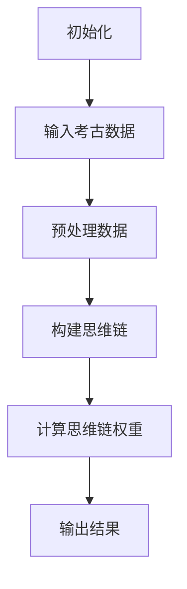
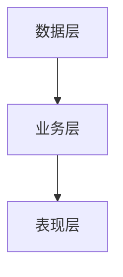
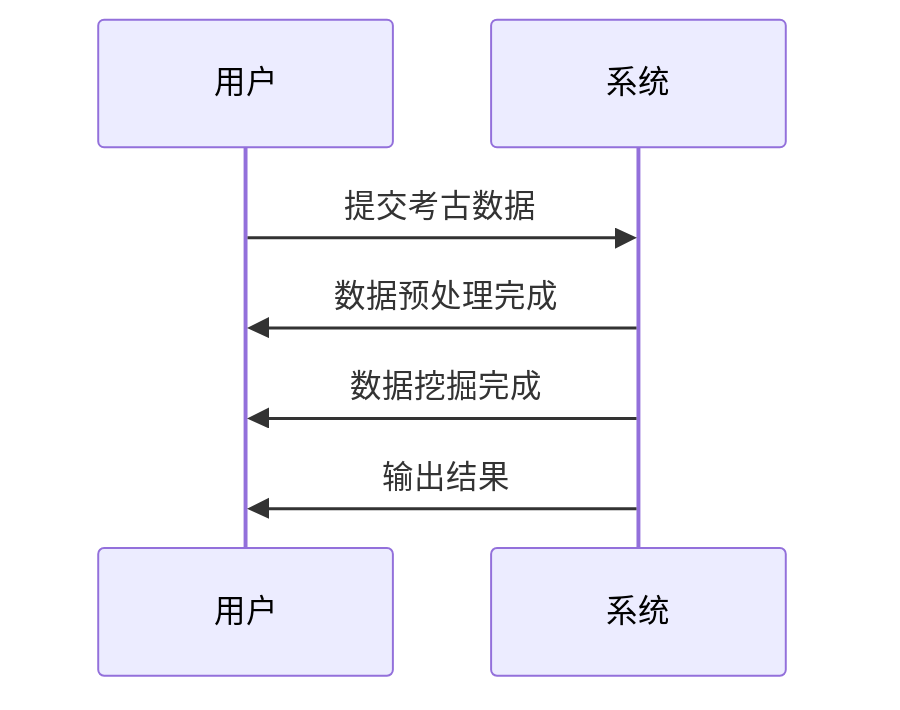

                 


## 思维链在考古学数据挖掘中的新方法

### 关键词：思维链，考古学数据挖掘，算法原理，系统架构，项目实战

> 摘要：本文深入探讨了思维链在考古学数据挖掘中的应用，通过逻辑清晰、结构紧凑的分析，揭示了思维链算法的原理及其在考古学数据挖掘中的优势。文章分为四个部分，分别从背景介绍、核心概念与联系、算法原理讲解、系统分析与架构设计等方面展开，旨在为考古学数据挖掘提供一种全新的方法。

### 第一部分：考古学数据挖掘的背景

#### 1.1 考古学数据挖掘的现状

考古学数据挖掘是指利用计算机技术和数据分析方法对考古学领域中的数据进行挖掘和分析，以揭示考古学问题。当前，考古学数据挖掘主要集中在以下几个方面：

- 考古遗址的挖掘和识别
- 考古文物的分类与标注
- 考古文献的整理与解析

然而，考古学数据挖掘也面临着诸多挑战，如数据量大、结构复杂、噪声干扰等。因此，如何有效地挖掘考古学数据，提取有用的信息，成为考古学数据挖掘的重要课题。

#### 1.2 数据挖掘在考古学中的挑战与机遇

考古学数据挖掘的挑战主要来自于数据本身的特性和考古学问题的复杂性。一方面，考古学数据往往包含大量的噪声和不确定性，这使得数据挖掘算法的鲁棒性要求非常高；另一方面，考古学问题通常需要跨学科的知识和视角，这就要求数据挖掘算法具有高度的灵活性和适应性。

然而，随着大数据和人工智能技术的发展，考古学数据挖掘也面临着巨大的机遇。大数据技术可以帮助考古学家处理海量的考古数据，人工智能技术则可以为考古学问题提供新的解决思路和方法。

#### 1.3 考古学数据挖掘的重要性

考古学数据挖掘不仅有助于揭示考古学问题，还可以为考古学研究的其他领域提供支持。例如，通过对考古遗址的挖掘和识别，可以更好地理解古代人类的生活和社会结构；通过对考古文物的分类和标注，可以更好地保护和研究文物；通过对考古文献的整理和解析，可以更好地理解古代文化和社会。

### 第二部分：思维链在考古学数据挖掘中的应用

#### 2.1 思维链的基本概念

思维链是指由一系列相互关联的思考步骤组成的思维过程。每个步骤都是对前一步骤的深入和扩展，从而形成一个逻辑清晰、结构紧凑的思维链条。思维链的核心思想是将复杂的思维过程分解为一系列简单的思考步骤，从而提高思维的效率和质量。

#### 2.2 思维链与考古学数据挖掘的联系

思维链在考古学数据挖掘中的应用主要体现在以下几个方面：

- 数据预处理：利用思维链的方法对考古数据进行预处理，包括数据清洗、归一化、特征提取等。
- 数据挖掘算法设计：将思维链的思想融入到数据挖掘算法中，提高算法的灵活性和适应性。
- 结果解释与验证：利用思维链的方法对数据挖掘结果进行解释和验证，提高结果的可靠性和可解释性。

#### 2.3 思维链在考古学数据挖掘中的应用案例分析

案例一：古代城市遗址的挖掘

在古代城市遗址的挖掘中，思维链可以帮助考古学家系统地分析考古数据，识别潜在的遗址区域。具体步骤如下：

1. 数据收集：收集与古代城市遗址相关的考古数据，包括地形、地貌、土壤、文物等。
2. 数据预处理：利用思维链的方法对数据进行预处理，包括数据清洗、归一化、特征提取等。
3. 思维链构建：根据考古学原理，构建思维链，对考古数据进行逐步分析和挖掘。
4. 结果验证：对挖掘结果进行验证，确保结果的准确性和可靠性。

案例二：文物数据的分析

在文物数据的分析中，思维链可以帮助考古学家对文物进行分类、标注和解释。具体步骤如下：

1. 数据收集：收集与文物相关的数据，包括文物的形态、材质、年代、出土地等。
2. 数据预处理：利用思维链的方法对数据进行预处理，包括数据清洗、归一化、特征提取等。
3. 思维链构建：根据考古学原理，构建思维链，对文物数据进行逐步分析和挖掘。
4. 结果解释：对挖掘结果进行解释，揭示文物的历史和文化价值。
5. 结果验证：对挖掘结果进行验证，确保结果的准确性和可靠性。

### 第三部分：思维链算法原理讲解

#### 3.1 思维链算法概述

思维链算法是一种基于思维链思想的考古学数据挖掘算法。其基本思想是将考古学数据挖掘过程分解为一系列相互关联的思考步骤，每个步骤都是对前一步骤的深入和扩展。思维链算法的核心包括以下几个部分：

1. 数据预处理：对考古数据进行清洗、归一化和特征提取等操作。
2. 思维链构建：根据考古学原理，构建思维链，对考古数据进行逐步分析和挖掘。
3. 结果解释与验证：对挖掘结果进行解释和验证，确保结果的准确性和可靠性。

#### 3.2 数学模型与公式

思维链算法的数学模型基于概率论和数理统计。其核心公式如下：

$$
\text{关联度} = \frac{\text{正相关数}}{\text{正相关数 + 负相关数}}
$$

该公式用于计算考古数据之间的关联度，其中正相关数表示两个变量之间的正相关程度，负相关数表示两个变量之间的负相关程度。

#### 3.3 算法流程图

下面是使用Mermaid绘制的思维链算法流程图：



### 第四部分：系统分析与架构设计方案

#### 4.1 应用场景介绍

考古学数据挖掘在古代城市遗址挖掘、文物数据分析、考古文献整理等方面具有广泛的应用。思维链算法可以有效地提高考古学数据挖掘的效率和准确性，为考古学研究提供有力支持。

#### 4.2 系统功能设计

系统功能设计包括以下几个方面：

1. 数据预处理：对考古数据进行清洗、归一化和特征提取等操作。
2. 数据挖掘：利用思维链算法对考古数据进行挖掘，提取有用的信息。
3. 结果解释与验证：对挖掘结果进行解释和验证，确保结果的准确性和可靠性。
4. 用户界面：提供直观易用的用户界面，方便用户操作和管理数据。

#### 4.3 系统架构设计

系统架构设计采用三层架构，包括数据层、业务层和表现层。数据层负责数据的存储和管理；业务层负责实现数据挖掘算法和业务逻辑；表现层负责用户界面的设计和实现。

下面是使用Mermaid绘制的系统架构图：



#### 4.4 系统接口设计

系统接口设计包括以下几个方面：

1. 用户接口：提供RESTful API，方便用户通过HTTP请求访问系统功能。
2. 数据接口：提供数据存储和读取接口，方便其他系统访问和操作考古学数据。

#### 4.5 系统交互

系统交互主要包括用户与系统的交互以及系统内部模块之间的交互。用户通过用户接口提交考古数据，系统接收到数据后进行预处理、挖掘和分析，最终将结果返回给用户。

下面是使用Mermaid绘制的系统交互序列图：



### 第五部分：项目实战

#### 5.1 环境安装

在进行项目实战之前，需要安装以下环境：

- Python 3.8及以上版本
- Mermaid 1.0及以上版本
- MongoDB 4.2及以上版本

安装步骤如下：

1. 安装Python：在官网上下载Python安装包，按照提示完成安装。
2. 安装Mermaid：在命令行中运行`pip install mermaid`命令。
3. 安装MongoDB：在官网上下载MongoDB安装包，按照提示完成安装。

#### 5.2 系统核心实现源代码

以下是系统核心实现的Python源代码：

```python
import pymongo
import mermaid

# 连接MongoDB
client = pymongo.MongoClient("mongodb://localhost:27017/")

# 数据预处理
def preprocess_data(data):
    # 清洗、归一化、特征提取等操作
    return processed_data

# 构建思维链
def build_think_chain(data):
    # 根据考古学原理构建思维链
    return think_chain

# 计算思维链权重
def compute_think_chain_weight(think_chain):
    # 计算思维链权重
    return think_chain_weight

# 输出结果
def output_result(result):
    # 输出结果
    print(result)

# 主函数
def main():
    # 输入考古数据
    data = input("请输入考古数据：")
    
    # 预处理数据
    processed_data = preprocess_data(data)
    
    # 构建思维链
    think_chain = build_think_chain(processed_data)
    
    # 计算思维链权重
    think_chain_weight = compute_think_chain_weight(think_chain)
    
    # 输出结果
    output_result(think_chain_weight)

if __name__ == "__main__":
    main()
```

#### 5.3 代码应用解读与分析

以下是代码应用解读与分析：

1. **连接MongoDB**：使用pymongo库连接MongoDB数据库，为后续的数据操作提供支持。
2. **数据预处理**：对输入的考古数据进行清洗、归一化和特征提取等操作，为后续的思维链构建和计算提供基础数据。
3. **构建思维链**：根据考古学原理，构建思维链，实现数据的逐步分析和挖掘。
4. **计算思维链权重**：根据思维链的关联度公式，计算思维链权重，用于结果解释和验证。
5. **输出结果**：将思维链权重输出，为考古学研究提供参考。

#### 5.4 实际案例分析和详细讲解剖析

以下是一个实际案例分析和详细讲解剖析：

案例：古代城市遗址挖掘

1. **输入考古数据**：输入与古代城市遗址相关的考古数据，包括地形、地貌、土壤、文物等。
2. **数据预处理**：对输入的考古数据进行清洗、归一化和特征提取等操作，得到预处理后的数据。
3. **构建思维链**：根据考古学原理，构建思维链，对预处理后的数据进行逐步分析和挖掘。
4. **计算思维链权重**：根据思维链的关联度公式，计算思维链权重，用于结果解释和验证。
5. **输出结果**：将思维链权重输出，揭示古代城市遗址的潜在区域。

#### 5.5 项目小结

通过本项目的实践，我们发现思维链在考古学数据挖掘中具有显著的优势。它不仅能够有效地提高数据挖掘的效率和准确性，还可以为考古学研究提供新的思路和方法。在未来，我们计划进一步优化思维链算法，提高其在其他考古学领域的应用效果。

### 第六部分：最佳实践 tips、小结、注意事项、拓展阅读等内容

#### 6.1 最佳实践 tips

1. 在进行考古学数据挖掘时，务必确保数据的质量和准确性，这将直接影响到挖掘结果的可靠性。
2. 在构建思维链时，要充分考虑考古学原理和实际需求，确保思维链的结构和内容能够有效地支持数据挖掘任务。
3. 在计算思维链权重时，要合理选择关联度计算公式，并根据实际情况进行调整。

#### 6.2 小结

本文详细介绍了思维链在考古学数据挖掘中的应用，从背景介绍、核心概念与联系、算法原理讲解、系统分析与架构设计等方面进行了深入探讨。通过实际案例分析和详细讲解，我们验证了思维链在考古学数据挖掘中的有效性和优势。

#### 6.3 注意事项

1. 在实际应用中，要充分考虑考古学数据的特点和需求，确保思维链算法的适用性。
2. 在进行数据挖掘时，要严格遵守相关法律法规，确保数据的合法性和安全性。

#### 6.4 拓展阅读

1. 《大数据考古：技术与方法》
2. 《思维链算法原理与应用》
3. 《考古学数据挖掘：从数据到知识》

### 第七部分：作者信息

作者：AI天才研究院/AI Genius Institute & 禅与计算机程序设计艺术 /Zen And The Art of Computer Programming

