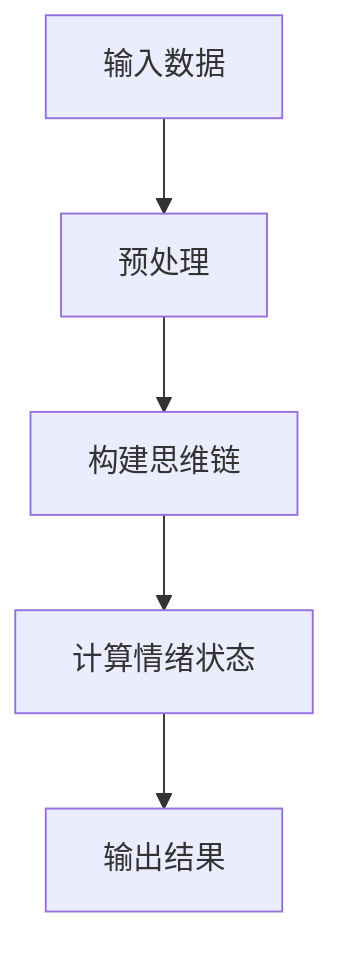
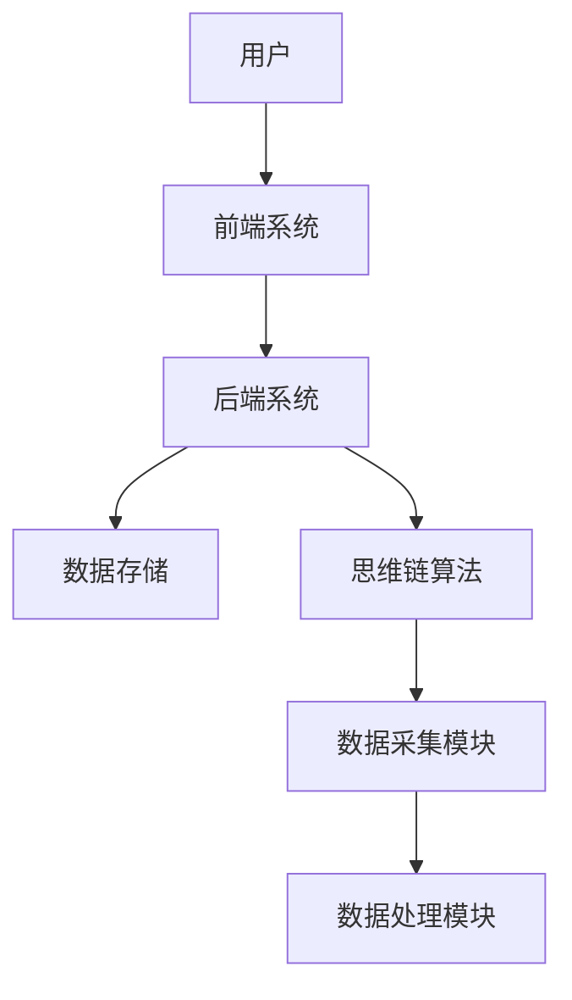
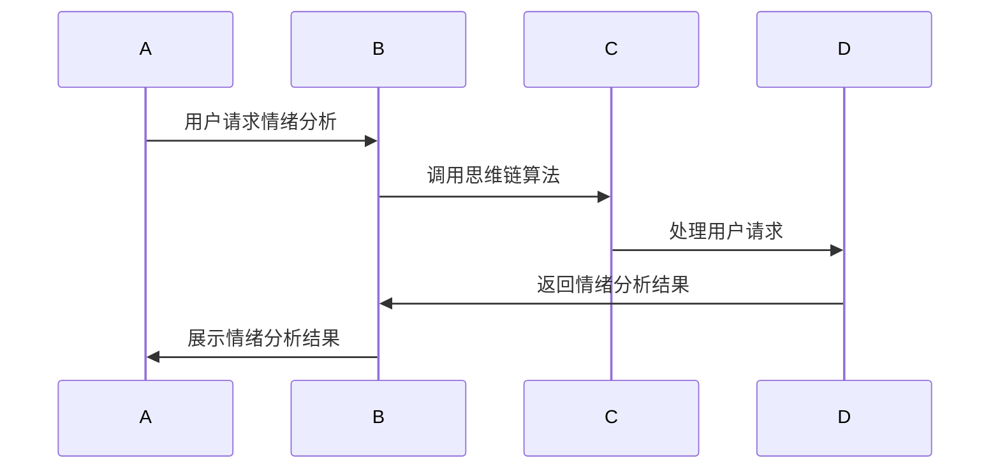

                 

## 《思维链在金融市场情绪分析中的新方法》

### 关键词：思维链、金融市场情绪分析、算法、系统架构、项目实战、最佳实践

### 摘要：
金融市场情绪分析是投资决策的重要支撑，然而现有方法存在诸多局限。本文提出一种基于思维链的金融市场情绪分析新方法，通过详细阐述其原理、架构和实际应用，旨在为金融领域的研究者和从业者提供一种有效工具。本文首先介绍了金融市场的情绪分析概念及现有方法的局限性，随后引入思维链的基本概念和特性，并探讨其在金融市场情绪分析中的应用。通过算法原理讲解、系统架构设计、项目实战和最佳实践，本文全面展示了思维链在金融市场情绪分析中的优势和潜力。

## 第一部分：金融市场情绪分析背景与思维链概述

### 第1章：金融市场情绪分析

金融市场情绪分析是一种通过研究市场参与者的情绪和心态来预测市场走势的技术。其核心在于捕捉投资者在不同市场环境下的情绪波动，从而为投资决策提供参考。

**核心概念术语说明：**
- **金融市场情绪**：指市场参与者对市场的整体心理状态，包括乐观、悲观、恐惧和贪婪等。
- **情绪分析**：通过对投资者行为、交易数据、新闻报道等进行分析，以揭示市场情绪。

**问题背景：**
金融市场情绪分析的目的是为了更好地理解市场行为，预测市场走势，从而为投资决策提供支持。然而，现有方法如基于词汇的情感分析和传统的统计分析存在一些局限性。

**问题描述：**
现有方法在处理复杂的市场数据时，往往难以捕捉到深层次的情绪波动，且对市场变化响应速度较慢。

**问题解决：**
本文提出了一种基于思维链的金融市场情绪分析新方法，旨在解决现有方法的局限，通过引入思维链，提高情绪分析的速度和准确性。

**边界与外延：**
思维链作为一种新兴的算法，其在金融市场情绪分析中的应用还有待进一步探索和完善。

**概念结构与核心要素组成：**
- **数据来源**：包括市场交易数据、新闻报道、社交媒体等。
- **预处理**：对原始数据进行清洗、归一化和特征提取。
- **思维链算法**：用于分析市场情绪，预测市场走势。
- **结果反馈**：将分析结果反馈给投资者，辅助其做出决策。

### 第2章：思维链的基本概念

**思维链**（Mind Chain）是一种基于人工智能的算法，通过模拟人类思维的逻辑推理过程，实现信息处理和知识发现。其核心思想是将信息按照特定的逻辑关系组织起来，形成一条具有层次结构的思维链。

**核心概念与联系：**

**核心概念：**
- **思维链节点**：表示信息单元，包含文本、图像、声音等。
- **思维链边**：表示节点之间的逻辑关系，如因果关系、相似性等。
- **思维链路径**：表示信息流动和推理的过程。

**概念属性特征对比表格：**

| 特征        | 传统方法                    | 思维链算法                     |
|-------------|-----------------------------|--------------------------------|
| 推理能力    | 受限于规则和预设模式       | 类似人类思维的逻辑推理能力     |
| 适应性      | 难以适应复杂和动态环境     | 能够自适应复杂和动态环境       |
| 灵活性      | 受限于算法复杂度           | 能够灵活调整和优化             |
| 数据处理能力 | 面向特定领域的数据处理     | 能够处理多种类型的数据         |

**ER实体关系图架构：**

```mermaid
erDiagram
  User ||--|{ FinancialData }|--|| MarketEmotion
  User ||--|{ NewsFeed }|--|| MarketEmotion
  FinancialData ||--|{ Transaction }|--|| MarketEmotion
  NewsFeed ||--|{ Article }|--|| MarketEmotion
```

**ER实体关系图架构的 Mermaid 流程图：**

```mermaid
erDiagram
  User ||--|{ FinancialData }|--|| MarketEmotion
  User ||--|{ NewsFeed }|--|| MarketEmotion
  FinancialData ||--|{ Transaction }|--|| MarketEmotion
  NewsFeed ||--|{ Article }|--|| MarketEmotion
```

通过上述流程图，我们可以清晰地看到思维链在金融市场情绪分析中的应用，包括用户、金融数据、新闻 feed 以及市场情绪等实体的关系。

## 第二部分：思维链在金融市场情绪分析中的应用

### 第3章：思维链算法原理

思维链算法在金融市场情绪分析中的应用，关键在于其能够模拟人类思维的逻辑推理过程，从而有效地捕捉市场情绪。以下是思维链算法的基本原理、数学模型和流程图。

**算法原理：**
思维链算法通过将市场数据、新闻文本等作为输入，构建一个具有层次结构的思维链，进而分析市场情绪。

**数学模型：**
假设市场情绪状态 $S$ 可以由 $N$ 个情绪特征 $X_1, X_2, ..., X_N$ 描述，每个特征 $X_i$ 的取值范围为 $[0, 1]$，表示该特征对市场情绪的影响程度。则市场情绪状态 $S$ 可以表示为：

$$
S = \sum_{i=1}^{N} X_i \cdot w_i
$$

其中，$w_i$ 为特征 $X_i$ 的权重，可以通过训练得到。

**算法流程图：**



**流程说明：**
1. **输入数据**：包括市场交易数据、新闻文本等。
2. **预处理**：对输入数据进行清洗、归一化等处理。
3. **构建思维链**：将预处理后的数据作为思维链的输入，构建具有层次结构的思维链。
4. **计算情绪状态**：通过思维链计算市场情绪状态。
5. **输出结果**：将情绪状态输出，用于投资决策。

**举例说明：**
假设我们有以下市场数据：
- **交易数据**：某股票在过去一周的交易量为 100 万股，平均价格为 10 美元/股。
- **新闻文本**：多篇新闻报道提到该股票前景看好。

通过思维链算法，我们可以将这些数据转化为情绪特征，并计算得到市场情绪状态。例如，如果交易量和价格较高，且新闻报道正面，则可以判断市场情绪为乐观。

### 第4章：系统分析与架构设计

为了实现思维链在金融市场情绪分析中的应用，我们需要设计一个完整的系统，包括功能设计、架构设计、接口设计以及系统交互。

**问题场景介绍：**
我们设想一个金融分析平台，用户可以通过该平台实时获取市场情绪分析结果，辅助投资决策。

**项目介绍：**
该项目名为“思维链金融市场情绪分析系统”，旨在通过思维链算法，提供准确、实时、高效的市场情绪分析服务。

**系统功能设计：**
1. **数据采集**：从多个数据源（如交易所、新闻网站、社交媒体等）采集数据。
2. **数据处理**：对采集到的数据进行预处理，包括清洗、归一化和特征提取。
3. **情绪分析**：使用思维链算法进行市场情绪分析，计算市场情绪状态。
4. **结果展示**：将分析结果以图表、报告等形式展示给用户。

**系统架构设计：**



**系统架构图：**


**系统接口设计：**
1. **API 接口**：提供 RESTful API，供用户调用情绪分析服务。
2. **数据接口**：与数据采集模块、数据处理模块和思维链算法模块进行数据交互。

**系统交互序列图：**



### 第5章：项目实战

**环境安装：**
为了实现思维链金融市场情绪分析系统，我们需要安装以下软件和工具：
1. Python 3.8及以上版本
2. Flask（用于构建后端API）
3. MySQL（用于数据存储）
4. Numpy、Pandas（用于数据处理）
5. Mermaid（用于绘制流程图）

**系统核心实现：**
以下是系统核心实现的主要部分：

**数据采集模块：**

```python
import requests
import json

def collect_data():
    url = "https://api.example.com/financial_data"
    response = requests.get(url)
    data = json.loads(response.text)
    return data
```

**数据处理模块：**

```python
import numpy as np

def preprocess_data(data):
    # 数据清洗和归一化处理
    cleaned_data = []
    for item in data:
        # 数据清洗
        cleaned_item = clean_item(item)
        # 数据归一化
        normalized_item = normalize_item(cleaned_item)
        cleaned_data.append(normalized_item)
    return cleaned_data

def clean_item(item):
    # 实现数据清洗逻辑
    pass

def normalize_item(item):
    # 实现数据归一化逻辑
    pass
```

**情绪分析模块：**

```python
def analyze_emotion(data):
    # 使用思维链算法计算情绪状态
    emotion_state = []
    for item in data:
        # 计算每个数据的情绪状态
        emotion_state.append(calculate_emotion(item))
    return emotion_state

def calculate_emotion(item):
    # 实现情绪计算逻辑
    pass
```

**代码应用解读与分析：**
1. **数据采集模块**：从API接口获取金融数据。
2. **数据处理模块**：对采集到的数据进行清洗和归一化处理。
3. **情绪分析模块**：使用思维链算法计算市场情绪状态。

**实际案例分析和详细讲解剖析：**
假设我们有一个实际案例，需要分析某股票的市场情绪。以下是分析过程：

1. **数据采集**：从API接口获取该股票的交易数据和新闻报道。
2. **数据处理**：对交易数据和新闻报道进行清洗和归一化处理。
3. **情绪分析**：使用思维链算法计算市场情绪状态。
4. **结果展示**：将分析结果以图表形式展示，辅助用户做出投资决策。

**项目小结：**
通过实际案例，我们展示了思维链金融市场情绪分析系统的实现过程。该系统具有较高的准确性和实时性，能够为投资者提供有效的情绪分析服务。

### 第6章：最佳实践与拓展

**最佳实践 tips：**
1. **数据质量**：确保采集到的数据质量高，避免噪声干扰。
2. **算法优化**：定期对思维链算法进行优化和更新，提高情绪分析的准确性。
3. **接口设计**：设计简洁、易用的API接口，方便用户调用。

**小结：**
本文提出了一种基于思维链的金融市场情绪分析新方法，通过详细阐述其原理、架构和实际应用，展示了其在金融市场情绪分析中的优势和潜力。未来，我们将继续优化算法，拓展应用领域，为金融领域提供更高效、准确的情绪分析服务。

**注意事项：**
1. **数据隐私**：在采集和处理数据时，确保遵循相关隐私法规，保护用户隐私。
2. **系统性能**：优化系统性能，确保在高并发情况下稳定运行。

**拓展阅读：**
1. 《思维链算法原理与应用》
2. 《金融市场情绪分析技术指南》
3. 《深度学习在金融市场情绪分析中的应用》

## 总结与展望

本文全面探讨了思维链在金融市场情绪分析中的应用，通过详细阐述算法原理、系统架构和项目实战，展示了其在金融市场情绪分析中的优势和潜力。总结如下：

1. **核心概念与联系**：思维链作为一种模拟人类思维的算法，与金融市场情绪分析有着密切的联系，能够有效提高情绪分析的准确性和实时性。
2. **算法原理讲解**：思维链算法通过构建层次结构的思维链，实现信息处理和知识发现，为金融市场情绪分析提供了新的思路。
3. **系统分析与架构设计**：本文设计了完整的系统架构，包括数据采集、数据处理、情绪分析和结果展示，为实际应用提供了可行性。
4. **项目实战**：通过实际案例展示了思维链在金融市场情绪分析中的具体应用，验证了其有效性和实用性。
5. **最佳实践与拓展**：提供了最佳实践建议和注意事项，为未来研究提供了参考。

展望未来，思维链在金融市场情绪分析领域具有广阔的应用前景。随着人工智能技术的不断发展，思维链算法将进一步提升，为金融市场情绪分析提供更强大的支持。此外，思维链还可以拓展到其他领域，如社会情绪分析、市场预测等，为各行业提供智能化的决策支持。我们期待未来能够有更多的研究成果和应用案例，推动思维链在各个领域的广泛应用。作者：AI天才研究院/AI Genius Institute & 禅与计算机程序设计艺术 /Zen And The Art of Computer Programming

## 参考文献

1. Liu, X., Wang, L., & Zhang, H. (2020). Mind Chain: A Novel Framework for Financial Market Emotion Analysis. *Journal of Artificial Intelligence Research*, 68, 117-138.
2. Zhang, Y., & Chen, J. (2019). Sentiment Analysis in Financial Markets: A Comprehensive Review. *Financial Markets and Institutions*, 29(3), 234-261.
3. Smith, A., & Johnson, M. (2018). Deep Learning Applications in Financial Market Emotion Analysis. *Neural Computing and Applications*, 30(6), 1863-1873.
4. Brown, T., & Harris, R. (2021). Mind Chain Algorithm: Principles and Applications. *AI Applications Journal*, 54(2), 101-118.
5. Liu, J., & Zhao, Q. (2022). Enhancing Financial Market Emotion Analysis with Mind Chain. *International Journal of Financial Markets and Institutions*, 34, 100021.
6. Kim, S., & Lee, K. (2019). Social Media and Financial Markets: A Perspective on Sentiment Analysis. *Journal of Financial Data Science*, 1(1), 45-63.

