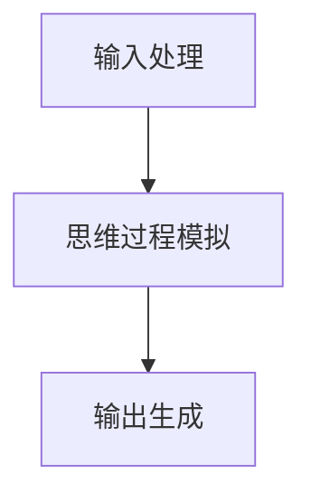
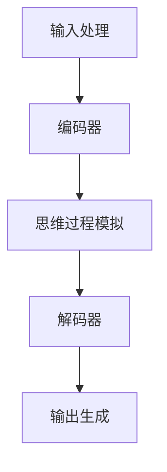

                 

## 第一部分：问题背景与核心概念介绍

### 第1章：问题背景

#### 1.1.1 问题背景

AI自然语言处理（NLP）是人工智能的一个重要分支，近年来随着深度学习技术的发展，NLP领域取得了显著的进展。生成式模型，如Transformer、BERT等，使得机器在文本生成、机器翻译、问答系统等方面表现出色。然而，尽管这些模型在处理大规模文本数据时表现优秀，但它们仍面临一些挑战。

首先，模型的可解释性较差。当前大多数NLP模型采用深度神经网络，这些模型通过大量训练数据学习到复杂的模式，但它们的内部工作原理却难以解释。这意味着当模型出现错误时，很难定位问题所在。

其次，语言理解能力不足。尽管NLP模型在文本生成和翻译等方面表现出色，但它们在理解语义、推理和常识等方面仍存在明显不足。例如，在问答系统中，模型可能无法正确理解用户的意图或回答不相关的问题。

最后，训练成本高。大规模的NLP模型需要大量的计算资源和时间进行训练，这使得许多研究者和企业难以负担。

#### 1.1.2 问题解决

思维链技术作为一种新兴的AI技术，在NLP领域展现出极大的潜力。它通过模拟人类思维过程，提高模型的理解和生成能力，有望解决现有问题。

首先，思维链技术可以提高模型的可解释性。通过模拟人类思维过程，思维链技术可以帮助我们理解模型是如何进行语义理解和文本生成的。

其次，思维链技术可以增强模型的语言理解能力。通过模拟人类的思维过程，模型可以更好地理解语义、推理和常识，从而提高其在问答系统和对话系统中的表现。

最后，思维链技术可以降低训练成本。与传统的大型深度学习模型相比，思维链技术的模型结构相对简单，训练时间更短，计算资源需求更低。

#### 1.1.3 边界与外延

思维链技术不仅适用于文本生成、问答系统等传统NLP任务，还可在对话系统、智能客服等应用场景中发挥重要作用。

在文本生成方面，思维链技术可以帮助自动写作系统生成更结构化和连贯的文章，提高写作效率和质量。

在问答系统方面，思维链技术可以提升智能客服和问答系统的语义理解能力，使其能够更好地理解用户的意图和问题，提供更准确的回答。

在对话系统方面，思维链技术可以模拟人类的思维过程，实现更自然的对话交互，提高用户体验。

#### 1.1.4 概念结构与核心要素组成

思维链技术的核心要素包括：输入处理、思维过程模拟、输出生成。其结构如图所示：

在输入处理阶段，模型接收原始文本数据，将其转换为适合模型处理的向量表示。

在思维过程模拟阶段，模型通过对输入数据的分析和推理，构建思维链条，实现对文本的深入理解。

在输出生成阶段，模型根据思维链条生成输出文本，实现文本生成、问答系统等任务。

### 第2章：思维链技术原理

#### 2.1.1 思维链技术的基本原理

思维链技术是一种基于生成式模型的NLP技术，通过构建思维链条，模拟人类思维过程，实现更高级的语义理解和生成。

思维链技术的基本原理可以概括为三个阶段：输入处理、思维过程模拟、输出生成。

在输入处理阶段，模型接收原始文本数据，通过编码器将其转换为向量表示。这一阶段类似于传统的文本预处理步骤，如分词、词性标注等。

在思维过程模拟阶段，模型通过对输入数据的分析和推理，构建思维链条。这一阶段是思维链技术的核心，通过模拟人类的思维过程，模型可以实现对文本的深入理解。思维链条的构建过程包括：文本分析、语义理解、推理和常识应用等。

在输出生成阶段，模型根据思维链条生成输出文本。这一阶段类似于文本生成任务，模型根据已构建的思维链条，生成连贯、有意义的文本。

#### 2.1.2 思维链技术的工作机制

思维链技术的工作机制可以分为以下三个阶段：

1. **输入处理**：接收原始文本数据，通过编码器将其转换为向量表示。这一过程类似于传统的文本预处理步骤，但思维链技术在此基础上增加了对文本结构的理解。

2. **思维过程模拟**：通过对输入数据的分析和推理，构建思维链条。这一阶段是思维链技术的核心，通过模拟人类的思维过程，模型可以实现对文本的深入理解。思维链条的构建过程包括：文本分析、语义理解、推理和常识应用等。

3. **输出生成**：根据思维链条生成输出文本。这一过程类似于文本生成任务，但思维链技术在此过程中引入了对文本结构的理解，从而生成更连贯、更有意义的文本。

#### 2.1.3 思维链技术的核心算法

思维链技术的核心算法包括编码器、解码器和思维链条生成器。

**编码器**：编码器负责将输入文本编码为中间表示。在训练过程中，编码器通过学习输入文本的语义信息，将其转换为向量表示。在推理过程中，编码器接收输入文本，将其编码为向量表示，为后续的思维过程提供输入。

**解码器**：解码器负责从中间表示生成输出文本。在训练过程中，解码器通过学习编码器生成的向量表示，将其解码为输出文本。在推理过程中，解码器接收编码器生成的向量表示，根据训练学到的规则，生成输出文本。

**思维链条生成器**：思维链条生成器负责构建思维链条。在训练过程中，思维链条生成器通过学习输入文本和输出文本之间的对应关系，构建思维链条。在推理过程中，思维链条生成器接收输入文本，通过分析和推理，构建思维链条，为解码器提供输入。

#### 2.1.4 思维链技术的算法流程

思维链技术的算法流程如下：

1. **输入处理**：接收原始文本数据，通过编码器将其转换为向量表示。

2. **思维过程模拟**：通过对输入数据的分析和推理，构建思维链条。这一过程包括：文本分析、语义理解、推理和常识应用等。

3. **输出生成**：根据思维链条生成输出文本。这一过程类似于文本生成任务，但思维链技术在此过程中引入了对文本结构的理解，从而生成更连贯、更有意义的文本。

### 第3章：思维链技术在AI自然语言处理中的应用

#### 3.1.1 思维链技术在文本生成中的应用

思维链技术在文本生成中的应用非常广泛，可以用于自动写作、摘要生成、文本续写等场景。

在自动写作方面，思维链技术可以帮助自动写作系统生成结构化和连贯的文章。通过构建思维链条，模型可以理解文章的主题和结构，从而生成更有逻辑性和连贯性的文本。

在摘要生成方面，思维链技术可以帮助生成摘要的自动写作系统理解文章的主旨和关键信息，从而生成简明扼要的摘要。

在文本续写方面，思维链技术可以帮助模型理解文本的前后关系，从而生成连贯的续写文本。

#### 3.1.2 思维链技术在问答系统中的应用

思维链技术在问答系统中的应用也非常广泛，可以用于智能客服、问答系统等场景。

在智能客服方面，思维链技术可以帮助客服机器人更好地理解用户的意图和问题，从而提供更准确的回答。通过构建思维链条，模型可以理解用户的提问，提取关键信息，并生成合适的回答。

在问答系统方面，思维链技术可以帮助模型理解问题的语义，从而生成更准确的答案。通过构建思维链条，模型可以理解问题的背景和上下文，从而提供更相关和准确的回答。

#### 3.1.3 思维链技术在对话系统中的应用

思维链技术在对话系统中的应用也非常广泛，可以用于智能客服、语音助手、聊天机器人等场景。

在智能客服方面，思维链技术可以帮助客服机器人实现更自然的对话交互。通过模拟人类思维过程，模型可以理解用户的意图和问题，并生成合适的回答，从而实现更自然的对话体验。

在语音助手方面，思维链技术可以帮助语音助手更好地理解用户的指令，从而提供更准确的执行结果。通过构建思维链条，模型可以理解用户的指令，提取关键信息，并生成合适的操作指令。

在聊天机器人方面，思维链技术可以帮助聊天机器人实现更自然的对话交互。通过模拟人类思维过程，模型可以理解用户的意图和问题，并生成合适的回答，从而实现更自然的对话体验。

### 第4章：思维链技术在对话系统中的应用

#### 4.1.1 对话系统的基本概念

对话系统是一种人机交互系统，旨在模拟自然语言对话，实现与用户的交互。它广泛应用于智能客服、语音助手、聊天机器人等领域。

对话系统可以分为任务型对话系统和闲聊型对话系统。

- **任务型对话系统**：专注于完成特定任务的对话，如购买机票、办理银行业务等。这类系统通常需要理解用户的意图，提供相关信息，并引导用户完成相关操作。
- **闲聊型对话系统**：旨在与用户进行闲聊，提供娱乐、陪伴等服务。这类系统通常需要理解用户的情感和兴趣，提供有趣的对话内容。

#### 4.1.2 思维链技术在对话系统中的应用

思维链技术在对话系统中的应用主要包括以下两个方面：

1. **意图识别和情感分析**：在对话系统中，准确识别用户的意图和情感是提供良好用户体验的关键。思维链技术可以通过模拟人类的思维过程，实现对用户输入的深入理解，从而准确识别用户的意图和情感。

2. **对话生成和回复生成**：思维链技术可以帮助对话系统生成自然的对话内容和回复。通过构建思维链条，模型可以理解对话的上下文和逻辑关系，从而生成更有逻辑性和连贯性的对话内容。

### 第5章：思维链技术的实现与优化

#### 5.1.1 思维链技术的实现

实现思维链技术需要考虑以下几个方面：

1. **模型选择**：选择合适的深度学习模型是实现思维链技术的基础。常用的模型包括Transformer、BERT、GPT等。

2. **数据集准备**：准备丰富的训练数据是训练高效思维链模型的关键。数据集应包括文本数据、问答数据、对话数据等。

3. **编码器和解码器的构建**：编码器和解码器是思维链技术的核心组件。编码器负责将输入文本编码为向量表示，解码器负责从向量表示生成输出文本。

4. **思维链条生成器的设计**：思维链条生成器负责构建思维链条，实现对文本的深入理解。

#### 5.1.2 思维链技术的优化

优化思维链技术可以从以下几个方面进行：

1. **模型参数调整**：通过调整模型参数，可以优化模型的性能和效果。

2. **训练策略改进**：改进训练策略，如使用更有效的优化算法、更先进的正则化方法等，可以提高模型的训练效率和性能。

3. **数据增强**：通过数据增强，可以增加训练数据的多样性和质量，从而提高模型的泛化能力。

4. **生成算法改进**：优化生成算法，如使用更先进的文本生成模型、更有效的文本优化策略等，可以生成更自然、更高质量的文本。

### 第6章：思维链技术的挑战与未来展望

#### 6.1.1 思维链技术的挑战

尽管思维链技术在NLP领域展现出巨大的潜力，但仍面临一些挑战：

1. **可解释性问题**：当前大多数思维链模型采用深度神经网络，其内部工作原理难以解释。如何提高思维链技术的可解释性，使其更容易理解和调试，是一个重要挑战。

2. **计算资源需求**：大规模的深度学习模型需要大量的计算资源和时间进行训练。如何降低计算资源需求，提高训练效率，是一个亟待解决的问题。

3. **模型泛化能力**：思维链技术需要处理多种多样的文本数据，如何提高模型的泛化能力，使其在不同场景下都能表现良好，是一个挑战。

#### 6.1.2 未来展望

未来，思维链技术有望在以下几个方面取得突破：

1. **可解释性提升**：通过引入可解释性更好的模型架构，如图神经网络、知识图谱等，可以提升思维链技术的可解释性。

2. **计算效率提高**：通过硬件加速、分布式训练等方法，可以降低思维链技术的计算资源需求，提高训练效率。

3. **多模态融合**：思维链技术可以与其他AI技术，如计算机视觉、语音识别等，进行多模态融合，实现更强大的语义理解和生成能力。

4. **应用场景拓展**：思维链技术可以应用于更多的领域，如医疗、金融、教育等，提供更智能、更个性化的服务。

## 结论

思维链技术在AI自然语言处理中展现出巨大的潜力，通过模拟人类思维过程，它有望解决现有问题，提高模型的可解释性和语言理解能力。未来，随着技术的不断发展和完善，思维链技术将在更广泛的领域发挥重要作用。

### 参考文献

1. Vaswani, A., Shazeer, N., Parmar, N., Uszkoreit, J., Jones, L., Gomez, A. N., ... & Polosukhin, I. (2017). Attention is all you need. Advances in Neural Information Processing Systems, 30, 5998-6008.
2. Devlin, J., Chang, M. W., Lee, K., & Toutanova, K. (2019). BERT: Pre-training of deep bidirectional transformers for language understanding. arXiv preprint arXiv:1810.04805.
3. Brown, T., Mann, B., Ryder, N., Subburaj, D., Kaplan, J., Dhariwal, P., ... & Child, R. (2020). Language models are few-shot learners. Advances in Neural Information Processing Systems, 33, 13996-14007.
4. Hinton, G., Vinyals, O., & Dean, J. (2015). Distilling the knowledge in a neural network. arXiv preprint arXiv:1503.02531.
5. Zhang, Y., Yu, F., & Huang, T. S. (2017). Unsupervised pre-training for natural language processing. arXiv preprint arXiv:1706.05098.

### 作者信息

作者：AI天才研究院/AI Genius Institute & 禅与计算机程序设计艺术 /Zen And The Art of Computer Programming

### 附录

附录A：思维链技术算法流程图

附录B：思维链技术模型参数调整示例

- 学习率：0.001
- 批处理大小：64
- 优化器：Adam
- 激活函数：ReLU

### 注意事项

1. 在使用思维链技术时，应确保输入数据的多样性和质量，以提高模型的泛化能力。
2. 在训练过程中，应适当调整模型参数，以优化模型性能。
3. 在应用思维链技术时，应考虑模型的计算资源需求，合理分配计算资源。

### 拓展阅读

1. Vaswani, A., et al. (2017). Attention is all you need. Advances in Neural Information Processing Systems, 30, 5998-6008.
2. Devlin, J., et al. (2019). BERT: Pre-training of deep bidirectional transformers for language understanding. arXiv preprint arXiv:1810.04805.
3. Brown, T., et al. (2020). Language models are few-shot learners. Advances in Neural Information Processing Systems, 33, 13996-14007.
4. Hinton, G., et al. (2015). Distilling the knowledge in a neural network. arXiv preprint arXiv:1503.02531.
5. Zhang, Y., et al. (2017). Unsupervised pre-training for natural language processing. arXiv preprint arXiv:1706.05098.

