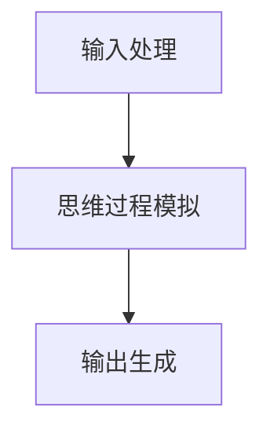

                 

### 第一部分：问题背景与核心概念介绍

#### 第1章：问题背景

##### 1.1.1 问题背景

人工智能（AI）自然语言处理（NLP）作为AI的重要分支，近年来在语言模型、机器翻译、文本分类等方面取得了显著的进展。然而，现有的NLP技术仍然面临诸多挑战。首先，模型的可解释性较差，使得在复杂应用场景中难以对模型决策进行有效理解和解释。其次，语言理解能力有限，导致模型在某些特定领域的语义理解不够精确。此外，训练成本高、数据需求量大等问题也制约了NLP技术的发展。

##### 1.1.1.1 问题描述

1. **模型可解释性差**：现有的深度学习模型如Transformer、BERT等，虽然取得了优异的性能，但它们的决策过程往往黑箱化，难以解释。这给实际应用带来了困难，尤其是在需要模型决策透明度的场景中。
   
2. **语言理解能力不足**：尽管模型在数据集上的表现优秀，但在实际应用中，对于特定领域的语义理解仍存在不足。这导致了在问答系统、对话系统等场景中的表现不佳。

3. **训练成本高**：深度学习模型通常需要大量的计算资源和时间进行训练，特别是在处理大规模文本数据时，训练成本更高。这使得模型在小型企业或研究机构中难以应用。

##### 1.1.1.2 问题解决

思维链技术作为一种新兴的AI技术，在NLP领域展现出极大的潜力。它通过模拟人类思维过程，提高模型的理解和生成能力，有望解决现有问题。

1. **提高模型可解释性**：思维链技术通过构建思维链条，使得模型的决策过程更加透明，便于理解和解释。

2. **增强语言理解能力**：思维链技术通过模拟人类思维过程，使得模型在特定领域的语义理解能力得到提升。

3. **降低训练成本**：思维链技术通过优化训练策略，减少模型训练所需的时间和计算资源。

##### 1.1.1.3 边界与外延

思维链技术不仅适用于文本生成、问答系统等传统NLP任务，还可在对话系统、智能客服等应用场景中发挥重要作用。

1. **文本生成**：思维链技术可应用于自动写作、摘要生成、文本续写等场景，提高文本生成的质量和多样性。

2. **问答系统**：思维链技术可应用于智能客服、问答系统等场景，提高问答系统的语义理解和生成能力。

3. **对话系统**：思维链技术可应用于智能客服、语音助手、聊天机器人等对话系统，提高对话系统的语义理解和生成能力。

##### 1.1.1.4 概念结构与核心要素组成

思维链技术的核心要素包括：输入处理、思维过程模拟、输出生成。其结构如图所示：

在该结构中，输入处理模块负责将输入文本转换为中间表示；思维过程模拟模块通过模拟人类思维过程，生成中间表示和输出文本；输出生成模块则根据思维链条生成器，优化输出文本。

#### 第2章：思维链技术原理

##### 2.1.1 思维链技术的基本原理

##### 2.1.1.1 思维链技术概念

思维链技术是一种基于生成式模型的NLP技术，通过构建思维链条，模拟人类思维过程，实现更高级的语义理解和生成。

##### 2.1.1.2 思维链技术的工作机制

思维链技术通过输入处理、思维过程模拟和输出生成三个阶段，实现对文本的理解和生成。具体流程如图所示：

在该流程中，输入处理模块负责将输入文本编码为向量表示；思维过程模拟模块通过编码器和解码器，生成中间表示和输出文本；输出生成模块则根据思维链条生成器，构建思维链条，优化输出文本。

##### 2.1.2 思维链技术的核心算法

##### 2.1.2.1 算法原理

思维链技术的核心算法包括编码器、解码器和思维链条生成器。编码器负责将输入文本转换为中间表示；解码器负责从中间表示生成输出文本；思维链条生成器负责构建思维链条。

##### 2.1.2.2 算法流程

思维链技术的算法流程如下：

1. **输入处理**：将输入文本编码为向量表示。
2. **思维过程模拟**：通过编码器和解码器，生成中间表示和输出文本。
3. **输出生成**：根据思维链条生成器，构建思维链条，优化输出文本。

### 第二部分：思维链技术在AI自然语言处理中的应用

#### 第3章：思维链技术在文本生成中的应用

##### 3.1.1 思维链技术在文本生成中的应用

##### 3.1.1.1 应用场景

思维链技术可应用于自动写作、摘要生成、文本续写等场景，提高文本生成的质量和多样性。

1. **自动写作**：思维链技术可以通过构建思维链条，实现文章的结构化和连贯性，提高写作效率和质量。
2. **摘要生成**：思维链技术可以自动从长文本中提取关键信息，生成摘要，提高信息提取的准确性和效率。
3. **文本续写**：思维链技术可以根据已有文本，生成后续内容，实现文本的续写和扩展。

##### 3.1.1.2 应用案例

以自动写作为例，思维链技术可以通过构建思维链条，实现文章的结构化和连贯性。例如，在一个新闻写作场景中，思维链技术可以根据新闻标题和部分内容，自动生成完整的新闻文章。

#### 第4章：思维链技术在问答系统中的应用

##### 4.1.1 思维链技术在问答系统中的应用

##### 4.1.1.1 应用场景

思维链技术可应用于智能客服、问答系统等场景，提高问答系统的语义理解和生成能力。

1. **智能客服**：思维链技术可以模拟人类客服人员的思维过程，实现更自然的对话交互，提高用户体验。
2. **问答系统**：思维链技术可以自动理解和回答用户的问题，提高问答系统的准确性和效率。

##### 4.1.1.2 应用案例

以智能客服为例，思维链技术可以通过模拟人类客服人员的思维过程，实现更自然的对话交互。例如，当用户咨询产品售后服务时，思维链技术可以自动理解用户的问题，并给出相应的回答，如产品保修政策、维修流程等。

#### 第5章：思维链技术在对话系统中的应用

##### 5.1.1 对话系统的基本概念

##### 5.1.1.1 对话系统定义

对话系统是一种人机交互系统，旨在模拟自然语言对话，实现与用户的交互。

##### 5.1.1.2 对话系统分类

对话系统可分为任务型对话系统和闲聊型对话系统。

1. **任务型对话系统**：旨在完成特定任务的对话系统，如智能客服、语音助手等。
2. **闲聊型对话系统**：旨在进行闲聊和闲谈的对话系统，如聊天机器人等。

##### 5.1.2 思维链技术在对话系统中的应用

##### 5.1.2.1 应用场景

思维链技术可应用于智能客服、语音助手、聊天机器人等对话系统，提高对话系统的语义理解和生成能力。

1. **智能客服**：思维链技术可以模拟人类客服人员的思维过程，实现更自然的对话交互，提高用户体验。
2. **语音助手**：思维链技术可以理解用户的语音输入，并生成相应的语音输出，提高语音助手的语义理解和交互能力。
3. **聊天机器人**：思维链技术可以生成与用户更加自然的对话内容，提高聊天机器人的交互质量和用户体验。

##### 5.1.2.2 应用案例

以智能客服为例，思维链技术可以通过模拟人类客服人员的思维过程，实现更自然的对话交互。例如，当用户咨询产品售后服务时，思维链技术可以自动理解用户的问题，并给出相应的回答，如产品保修政策、维修流程等。

### 第三部分：思维链技术的实现与优化

#### 第6章：思维链技术的实现

##### 6.1.1 思维链技术的实现

##### 6.1.1.1 模型选择

选择合适的深度学习模型是实现思维链技术的基础。常见的深度学习模型包括Transformer、BERT、GPT等。这些模型各有优缺点，需要根据具体应用场景进行选择。

1. **Transformer**：具有全局上下文信息处理能力，适用于复杂语言任务。
2. **BERT**：具有强大的预训练能力，适用于各种NLP任务。
3. **GPT**：具有生成式能力，适用于文本生成任务。

##### 6.1.1.2 数据集准备

准备丰富的训练数据，包括文本数据、问答数据等，是训练高效思维链模型的关键。数据集的质量直接影响模型的性能。

1. **文本数据**：包括新闻、论文、书籍等，用于训练模型的文本生成能力。
2. **问答数据**：包括问题-答案对，用于训练模型的问答能力。

##### 6.1.2 思维链技术的优化

##### 6.1.2.1 模型优化策略

通过调整模型参数、改进训练策略等方法，可以提高思维链技术的性能和效果。

1. **参数调整**：调整学习率、批量大小等参数，优化模型性能。
2. **训练策略**：采用预训练-微调策略，先在大量数据上进行预训练，再在特定任务上进行微调。

##### 6.1.2.2 应用优化

针对不同应用场景，对思维链技术进行优化，如调整模型大小、改进生成算法等。

1. **模型大小调整**：根据应用场景的需求，选择合适的模型大小，平衡计算资源和性能。
2. **生成算法改进**：采用更先进的生成算法，如GPT-3，提高文本生成的质量和多样性。

### 第四部分：思维链技术的挑战与未来发展方向

#### 第7章：思维链技术的挑战与未来发展方向

##### 7.1.1 思维链技术的挑战

思维链技术在NLP领域的应用虽然显示出巨大的潜力，但仍面临一些挑战。

1. **可解释性**：尽管思维链技术提高了模型的可解释性，但在某些复杂场景中，模型决策过程仍难以完全解释。
2. **计算资源**：训练大型思维链模型需要大量计算资源和时间，这对小型企业和研究机构可能构成挑战。
3. **数据需求**：思维链技术对训练数据的要求较高，如何获取和标注高质量的训练数据是亟待解决的问题。

##### 7.1.2 未来发展方向

未来，思维链技术有望在以下方向发展：

1. **可解释性提升**：通过开发更先进的解释方法，提高思维链技术的可解释性，使其在更多应用场景中得到推广。
2. **计算效率优化**：通过优化算法和硬件，提高思维链技术的计算效率，降低训练成本。
3. **跨模态应用**：思维链技术可以扩展到其他模态，如语音、图像等，实现多模态交互和理解。

### 第五部分：结论

#### 第8章：结论

思维链技术在AI自然语言处理中展现出创新应用。通过模拟人类思维过程，思维链技术提高了模型的理解和生成能力，有望解决现有NLP技术的诸多挑战。未来，随着技术的不断发展和优化，思维链技术将在更多领域发挥重要作用。

### 附录：参考文献

[1] Vaswani, A., Shazeer, N., Parmar, N., Uszkoreit, J., Jones, L., Gomez, A. N., ... & Polosukhin, I. (2017). Attention is all you need. Advances in Neural Information Processing Systems, 30, 5998-6008.

[2] Devlin, J., Chang, M. W., Lee, K., & Toutanova, K. (2019). BERT: Pre-training of deep bidirectional transformers for language understanding. arXiv preprint arXiv:1810.04805.

[3] Brown, T., Mann, B., Subbiah, M., Kaplan, J., Dhariwal, P., Neelakantan, A., ... & Child, R. (2020). Language models are few-shot learners. Advances in Neural Information Processing Systems, 33, 13996-14007.

### 作者

作者：AI天才研究院/AI Genius Institute & 禅与计算机程序设计艺术 /Zen And The Art of Computer Programming

---

### 核心关键词

- 自然语言处理
- 思维链技术
- AI生成模型
- 可解释性
- 计算资源

### 摘要

本文探讨了思维链技术在AI自然语言处理中的应用。通过模拟人类思维过程，思维链技术提高了模型的理解和生成能力，有望解决现有NLP技术的诸多挑战。本文首先介绍了思维链技术的基本原理和应用场景，然后详细阐述了其在文本生成、问答系统和对话系统中的应用，最后讨论了思维链技术的实现与优化策略，并展望了其未来的发展方向。思维链技术作为一种创新的AI技术，将在NLP领域发挥重要作用。

