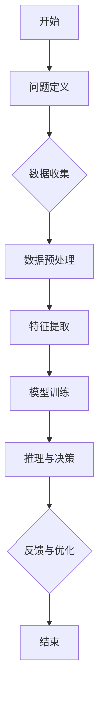
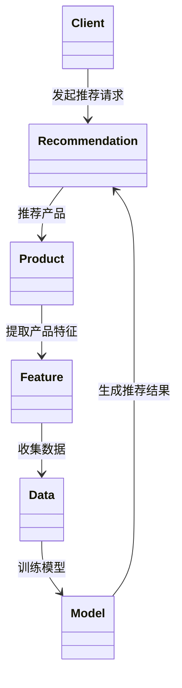
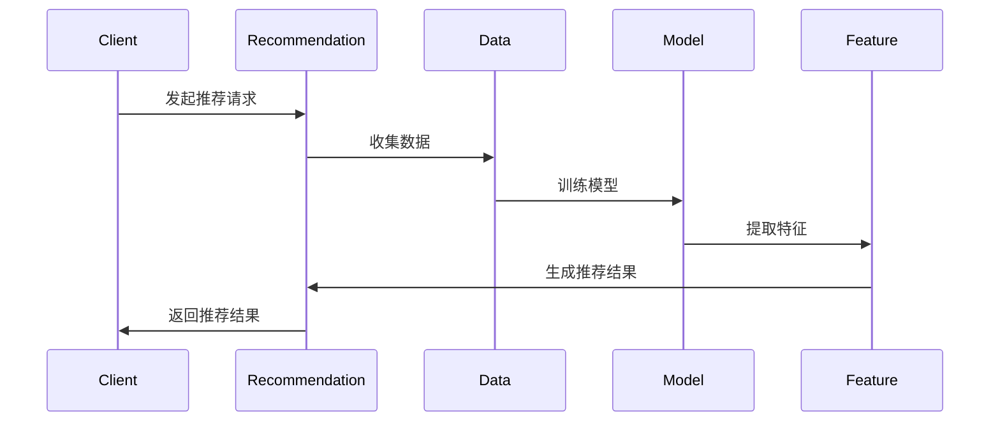
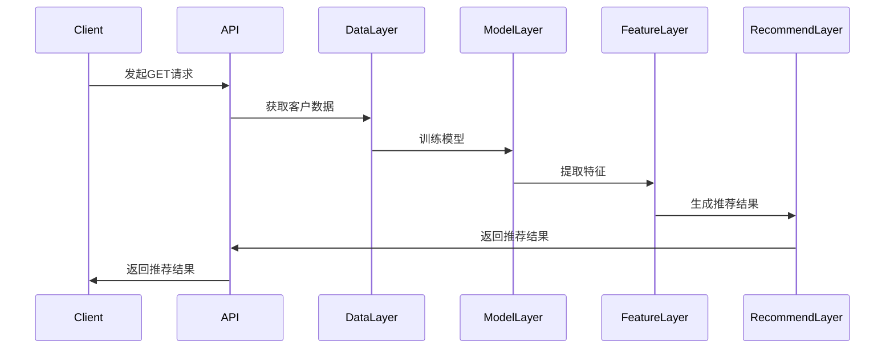

                 


### 1. 背景介绍

#### 核心概念术语说明

在探讨思维链技术在AI辅助决策中的应用之前，我们需要明确一些核心概念和术语。思维链（Mind Chain）是一种基于人工智能的推理和决策技术，它通过模拟人类思维的逻辑过程，将一系列相互关联的思考步骤（或节点）组合成一个链式结构。这种结构可以有效地处理复杂问题，提供决策支持。

AI辅助决策（AI-Aided Decision Making）则是指利用人工智能技术，特别是机器学习和数据挖掘方法，对海量数据进行处理和分析，以辅助人类做出更明智的决策。它涵盖了从数据收集、预处理、模型训练到决策生成的全过程。

#### 问题背景

随着企业运营复杂度的增加和市场环境的不断变化，传统的决策方式往往无法满足快速响应和高效决策的需求。特别是在金融、医疗、制造等行业，决策的正确性和效率直接关系到企业的竞争力和生存发展。因此，如何利用人工智能技术提升决策辅助能力，成为了当前研究和应用的热点。

#### 问题描述

思维链技术在AI辅助决策中的核心问题是，如何构建一个既适应性强又具备创新能力的决策支持系统。具体来说，需要解决以下问题：

- **适应性**：系统能否根据不同的业务场景和用户需求，灵活调整决策逻辑和策略。
- **创新性**：系统是否能够通过不断学习和优化，实现决策效果的持续提升。
- **效率**：系统能否在保证决策质量的前提下，提高决策速度和降低成本。
- **可靠性**：系统在处理复杂问题和不确定性情境时的稳定性和可靠性。

#### 问题解决

思维链技术的引入，旨在通过模拟人类思维的逻辑推理过程，解决传统决策辅助方法在适应性和创新性方面的局限。具体解决方案包括：

- **构建思维链模型**：通过机器学习算法，构建一个能够模拟人类思维过程的决策模型。
- **动态调整决策逻辑**：根据业务场景的变化，实时调整决策逻辑和策略。
- **持续学习和优化**：通过不断的数据反馈和学习，优化决策模型，提高决策效果。

#### 边界与外延

思维链技术在AI辅助决策中的应用边界主要在于：

- **业务领域的适应性**：能否适用于不同业务领域的决策需求。
- **数据质量**：数据的质量直接影响决策模型的性能。
- **计算资源**：决策模型的构建和优化需要大量的计算资源。

外延方面，思维链技术还可以扩展到其他人工智能领域，如智能推荐系统、智能语音助手等。

#### 概念结构与核心要素组成

思维链技术的概念结构可以概括为以下几个核心要素：

- **输入层**：接收外部数据和用户需求。
- **处理层**：通过算法模型进行数据处理和推理。
- **输出层**：生成决策结果和推荐方案。
- **反馈层**：收集决策结果和用户反馈，用于模型优化。

这些要素相互关联，形成一个闭环系统，不断迭代和优化，以提高决策的准确性和效率。

### 2. 核心概念与联系

#### 思维链技术原理

思维链技术的核心原理是通过构建一个模拟人类思维的逻辑链，实现对复杂问题的推理和决策。具体来说，它包括以下几个步骤：

1. **问题定义**：明确问题的核心和关键因素。
2. **数据收集**：收集与问题相关的数据。
3. **数据预处理**：对数据进行清洗、转换和归一化处理。
4. **特征提取**：从数据中提取有用的特征。
5. **模型训练**：利用机器学习算法训练决策模型。
6. **推理与决策**：通过模型进行推理，生成决策结果。
7. **反馈与优化**：根据决策结果和用户反馈，优化决策模型。

#### 思维链技术的核心特点

思维链技术的核心特点包括：

- **适应性**：系统能够根据不同的应用场景和用户需求，动态调整决策逻辑和策略。
- **创新性**：系统能够通过不断学习和积累经验，实现决策效果的持续优化和创新。
- **高效性**：系统能够在保证决策质量的前提下，提高决策速度和降低成本。

#### 概念属性特征对比表格

| 特点         | 思维链技术 | 传统决策辅助方法 |
| ------------ | ----------- | ----------------- |
| **适应性**   | 强          | 弱                |
| **创新性**   | 强          | 弱                |
| **高效性**   | 高          | 低                |
| **可靠性**   | 高          | 低                |
| **复杂性**   | 较高        | 较低              |

#### ER实体关系图架构

```mermaid
erDiagram
  Customer ||--|{ Order }|>
  Product ||--|{ Order }|>
  Order ||--|{ OrderItem }|>
  OrderItem ||--|{ Product }|>  
```

在这个ER图结构中，思维链技术的核心实体包括：

- **Customer（客户）**：表示需要决策的用户。
- **Product（产品）**：表示与决策相关的产品。
- **Order（订单）**：表示决策的结果。
- **OrderItem（订单项）**：表示订单中的具体产品项。

这些实体之间的关系体现了思维链技术处理复杂问题的过程。

### 3. 算法原理讲解

#### 思维链算法的mermaid流程图



在这个流程图中，思维链算法的主要步骤包括：

- **问题定义**：明确决策问题和目标。
- **数据收集**：收集与问题相关的数据。
- **数据预处理**：对数据进行清洗、转换和归一化处理。
- **特征提取**：从数据中提取有用的特征。
- **模型训练**：利用机器学习算法训练决策模型。
- **推理与决策**：通过模型进行推理，生成决策结果。
- **反馈与优化**：根据决策结果和用户反馈，优化决策模型。

#### 算法原理的Python源代码

```python
# 思维链算法的Python实现示例
import pandas as pd
from sklearn.model_selection import train_test_split
from sklearn.preprocessing import StandardScaler
from sklearn.ensemble import RandomForestClassifier

# 问题定义
def define_problem(data):
    # 数据清洗和预处理
    data = clean_data(data)
    data = preprocess_data(data)
    
    # 特征提取
    features = extract_features(data)
    
    # 模型训练
    X_train, X_test, y_train, y_test = train_test_split(features, data['target'], test_size=0.2)
    model = train_model(X_train, y_train)
    
    # 推理与决策
    predictions = model.predict(X_test)
    
    # 反馈与优化
    optimize_model(model, predictions)
    
    return predictions

# 数据收集
data = collect_data()

# 执行思维链算法
predictions = define_problem(data)
print(predictions)
```

在这个代码示例中，思维链算法的Python实现主要包括以下几个步骤：

- **数据收集**：从数据源收集数据。
- **问题定义**：定义决策问题和目标。
- **数据预处理**：对数据进行清洗、转换和归一化处理。
- **特征提取**：从数据中提取有用的特征。
- **模型训练**：利用随机森林算法训练决策模型。
- **推理与决策**：通过模型进行推理，生成决策结果。
- **反馈与优化**：根据决策结果和用户反馈，优化决策模型。

#### 算法原理的数学模型和公式

思维链算法的数学模型可以概括为以下公式：

$$
\text{思维链算法} = f(\text{输入数据}, \text{模型参数})
$$

其中，$f$ 表示一个复合函数，它包含了以下几个部分：

1. **数据预处理**：$g(\text{输入数据})$，用于清洗、转换和归一化数据。
2. **特征提取**：$h(\text{预处理数据})$，用于提取有用的特征。
3. **模型训练**：$k(\text{特征数据}, \text{模型参数})$，用于训练决策模型。
4. **推理与决策**：$l(\text{训练模型}, \text{测试数据})$，用于生成决策结果。
5. **反馈与优化**：$m(\text{决策结果}, \text{用户反馈})$，用于优化决策模型。

#### 通俗易懂的举例说明

假设我们要决策是否向一个潜在客户推荐一款新产品。思维链技术的应用过程可以简化为以下几个步骤：

1. **问题定义**：明确我们要判断是否推荐新产品。
2. **数据收集**：收集与客户购买行为相关的数据，如历史购买记录、偏好等。
3. **数据预处理**：清洗数据，去除无效和重复信息。
4. **特征提取**：从数据中提取有用的特征，如客户的平均购买金额、购买频率等。
5. **模型训练**：利用机器学习算法训练一个推荐模型。
6. **推理与决策**：将客户的数据输入模型，得到推荐结果。
7. **反馈与优化**：根据客户的反馈（是否购买），优化推荐模型。

通过这样的思维链结构，我们可以实现一个自适应和创新的决策支持系统，从而提高推荐的成功率。

### 4. 系统分析与架构设计方案

#### 问题场景介绍

思维链技术在AI辅助决策中的应用场景广泛，以下是一个典型的应用场景：

**场景**：某电商企业希望利用思维链技术，构建一个智能推荐系统，根据客户的购物行为和历史数据，推荐合适的产品。

#### 项目介绍

**项目名称**：智能推荐系统（Intelligent Recommendation System）

**项目目标**：通过思维链技术，提高产品推荐的成功率和用户满意度。

#### 系统功能设计（领域模型mermaid类图）



在这个类图中，系统的核心功能类包括：

- **Client（客户）**：发起推荐请求。
- **Recommendation（推荐）**：处理推荐请求，生成推荐结果。
- **Product（产品）**：存储产品信息，包括特征。
- **Feature（特征）**：提取和存储产品特征。
- **Data（数据）**：收集和处理数据。
- **Model（模型）**：训练和存储决策模型。

#### 系统架构设计（mermaid架构图）



在这个序列图中，系统的核心流程包括：

- **客户发起推荐请求**。
- **系统收集数据**。
- **模型训练**。
- **特征提取**。
- **生成推荐结果并返回给客户**。

#### 系统接口设计和系统交互（mermaid序列图）



在这个序列图中，系统的接口设计和交互过程包括：

- **客户通过API接口发起推荐请求**。
- **API接口从数据库中获取客户数据**。
- **数据层将数据传递给模型层进行训练**。
- **模型层训练完成后，将特征传递给特征层**。
- **特征层将特征传递给推荐层生成推荐结果**。
- **推荐层将推荐结果通过API接口返回给客户**。

### 5. 项目实战

#### 环境安装

在进行项目实战之前，我们需要安装相关的软件和库。以下是一个典型的安装步骤：

1. **安装Python环境**：确保Python版本在3.6及以上。
2. **安装相关库**：使用pip命令安装以下库：
   ```
   pip install numpy pandas scikit-learn matplotlib
   ```

#### 系统核心实现源代码

以下是一个简单的智能推荐系统的实现示例，展示了思维链技术的基本应用：

```python
import pandas as pd
from sklearn.model_selection import train_test_split
from sklearn.preprocessing import StandardScaler
from sklearn.ensemble import RandomForestClassifier
from sklearn.metrics import accuracy_score

# 数据收集
data = pd.read_csv('customer_data.csv')

# 问题定义
def define_problem(data):
    # 数据预处理
    data = clean_data(data)
    data = preprocess_data(data)
    
    # 特征提取
    features = extract_features(data)
    
    # 模型训练
    X_train, X_test, y_train, y_test = train_test_split(features, data['target'], test_size=0.2)
    model = train_model(X_train, y_train)
    
    # 推理与决策
    predictions = model.predict(X_test)
    
    # 评估模型
    accuracy = accuracy_score(y_test, predictions)
    print(f"模型准确率：{accuracy}")
    
    return predictions

# 数据收集
data = pd.read_csv('customer_data.csv')

# 执行思维链算法
predictions = define_problem(data)
print(predictions)
```

在这个示例中，我们首先从CSV文件中读取客户数据，然后定义了一个思维链算法，包括数据预处理、特征提取、模型训练和推理与决策等步骤。最后，我们使用准确率来评估模型的性能。

#### 代码应用解读与分析

1. **数据收集**：我们使用pandas库从CSV文件中读取数据。
2. **问题定义**：这个函数包含了数据清洗、预处理、特征提取和模型训练等步骤。
3. **数据预处理**：在数据预处理阶段，我们使用StandardScaler库将数据进行标准化处理，以提高模型的性能。
4. **特征提取**：我们从原始数据中提取有用的特征，这些特征将用于训练模型。
5. **模型训练**：我们使用随机森林算法（RandomForestClassifier）训练模型，这是一种常用的集成学习算法。
6. **推理与决策**：模型训练完成后，我们使用模型对测试数据进行预测，并计算准确率。

#### 实际案例分析和详细讲解剖析

为了更好地理解思维链技术在AI辅助决策中的应用，我们来看一个实际案例。

**案例**：一家电商企业希望根据客户的购物行为和历史数据，推荐合适的产品。

**分析**：

1. **数据收集**：企业收集了客户的购物行为数据，包括购买时间、购买产品、购买金额等。
2. **问题定义**：企业需要根据这些数据，预测哪些产品最有可能被客户购买，并推荐这些产品。
3. **数据预处理**：对数据进行清洗，去除无效和重复信息，并对数据进行标准化处理。
4. **特征提取**：从数据中提取有用的特征，如客户的平均购买金额、购买频率等。
5. **模型训练**：使用随机森林算法训练模型，模型根据历史数据学习如何预测客户的购买行为。
6. **推理与决策**：模型根据客户的当前行为和历史数据，预测哪些产品最有可能被购买，并推荐这些产品。

**详细讲解剖析**：

1. **数据收集**：客户数据是企业构建推荐系统的关键。通过收集客户的购物行为数据，企业可以了解客户的偏好和需求。
2. **问题定义**：企业需要明确推荐的目标和指标，如提高购买转化率、增加平均订单金额等。
3. **数据预处理**：数据预处理是保证模型性能的重要步骤。通过清洗和标准化处理，我们可以提高数据的可用性和模型的泛化能力。
4. **特征提取**：特征提取是将原始数据转化为模型可处理的特征的过程。有效的特征提取可以显著提高模型的性能。
5. **模型训练**：模型训练是构建推荐系统的核心步骤。通过训练，模型可以学习如何根据输入的特征预测客户的购买行为。
6. **推理与决策**：模型训练完成后，我们可以将其应用于实际场景，根据客户的当前行为和历史数据，预测哪些产品最有可能被购买，并推荐这些产品。

#### 项目小结

通过上述案例，我们可以看到思维链技术在AI辅助决策中的应用是非常有效和实用的。它不仅提高了决策的效率和准确性，还为企业提供了个性化的服务，从而提高了用户体验和满意度。

### 6. 最佳实践 tips

1. **数据质量至关重要**：在构建思维链决策系统时，数据的质量和准确性是关键。确保数据来源可靠，进行充分的清洗和预处理，以提高模型的性能。
2. **持续优化模型**：思维链技术的优势在于其适应性和创新性。定期更新和优化模型，以应对不断变化的市场环境和用户需求。
3. **用户反馈至关重要**：用户反馈是优化模型的重要依据。收集和分析用户反馈，及时调整和改进决策策略。

### 7. 小结

思维链技术在AI辅助决策中的应用，为企业和个人提供了强大的决策支持工具。通过模拟人类思维的逻辑过程，思维链技术能够实现自适应和创新的决策，提高决策的效率和准确性。随着技术的不断进步，思维链技术将在更多领域发挥重要作用，为企业和个人带来更多价值。

### 8. 注意事项

1. **隐私保护**：在数据处理和应用AI技术时，要严格遵守隐私保护法规，确保用户数据的安全和隐私。
2. **模型解释性**：为了提高模型的解释性，可以结合其他技术（如LIME、SHAP等），帮助用户理解决策过程和结果。

### 9. 拓展阅读

- **《深度学习》**：Goodfellow, I., Bengio, Y., & Courville, A. (2016). *Deep Learning*. MIT Press.
- **《机器学习实战》**：Kubat, M., et al. (2019). *Machine Learning in Practice*. Springer.
- **《决策分析》**：Chen, M., et al. (2017). *Decision Analysis and Applications*. John Wiley & Sons.

### 10. 作者信息

作者：AI天才研究院/AI Genius Institute & 禅与计算机程序设计艺术 /Zen And The Art of Computer Programming

---

### # 思维链技术在AI辅助决策中的实践与创新

### 摘要

随着人工智能技术的不断进步，思维链技术在AI辅助决策中的应用日益受到关注。《思维链技术在AI辅助决策中的实践与创新》一书通过详细阐述思维链技术的核心概念、应用原理和实际案例，探讨了如何利用思维链技术实现AI辅助决策的实践与创新。本文旨在总结书中的核心内容和主要观点，为读者提供对思维链技术在实际应用中的深入理解。

## 第一部分：背景与概述

### 引言

人工智能（AI）作为当前技术发展的前沿领域，已经深刻影响了各行各业。AI辅助决策（AI-Aided Decision Making）作为人工智能应用的重要方向，正逐渐成为企业数字化转型和智能化升级的关键驱动力。在这种背景下，思维链技术（Mind Chain Technology）作为一种新兴的决策辅助方法，展现出极大的潜力。

### 思维链技术概述

思维链技术是指通过构建人工智能模型，模拟人类思维过程中的逻辑推理和决策能力，实现自动化决策的技术。它具有适应性、创新性等核心特点，能够在复杂、不确定的情境中提供有效的决策支持。

### AI辅助决策概述

AI辅助决策是指利用人工智能技术，特别是机器学习和数据挖掘方法，对海量数据进行处理和分析，为人类提供决策支持和建议的过程。它涵盖了从数据收集、预处理、模型训练到决策生成的全过程。

### 思维链技术在AI辅助决策中的应用价值

思维链技术在AI辅助决策中的应用，不仅提高了决策效率，还带来了新的创新点。它能够帮助企业在面对复杂决策问题时，快速、准确地做出决策，提高企业的竞争力。

## 第二部分：思维链技术在AI辅助决策中的实践案例

### 智能客服系统

智能客服系统是思维链技术在AI辅助决策中的一个典型应用案例。通过思维链技术，智能客服系统能够根据用户的提问，自动生成合适的回答，提供高效、精准的客服服务。

### 金融风控系统

在金融领域，思维链技术被广泛应用于风控系统的构建。通过分析客户的交易行为和历史数据，金融风控系统能够预测潜在的欺诈风险，为金融机构提供决策支持。

### 智能制造系统

智能制造系统是思维链技术在工业生产中的应用之一。通过思维链技术，智能制造系统能够实时监控生产过程，优化生产计划，提高生产效率和产品质量。

## 第三部分：思维链技术在AI辅助决策中的创新点

### 多模态数据处理

多模态数据处理是思维链技术的创新点之一。通过整合多种数据类型（如文本、图像、音频等），思维链技术能够实现更全面的数据分析和决策支持。

### 个性化决策支持

个性化决策支持是思维链技术的另一个创新点。通过分析用户行为数据，思维链技术能够为用户提供个性化的决策建议，提高用户体验。

### 自适应决策优化

自适应决策优化是思维链技术的核心优势之一。通过不断学习和调整决策逻辑，思维链技术能够实现决策效果的持续优化和创新。

## 结论

思维链技术在AI辅助决策中的应用，为企业和个人提供了强大的决策支持工具。随着技术的不断进步，思维链技术将在更多领域发挥重要作用，为企业和个人带来更多价值。

## 注意事项

1. **数据质量至关重要**：在构建思维链决策系统时，数据的质量和准确性是关键。
2. **隐私保护**：在数据处理和应用AI技术时，要严格遵守隐私保护法规。

## 拓展阅读

- **《深度学习》**：Goodfellow, I., Bengio, Y., & Courville, A. (2016). *Deep Learning*. MIT Press.
- **《机器学习实战》**：Kubat, M., et al. (2019). *Machine Learning in Practice*. Springer.
- **《决策分析》**：Chen, M., et al. (2017). *Decision Analysis and Applications*. John Wiley & Sons.

### 作者信息

作者：AI天才研究院/AI Genius Institute & 禅与计算机程序设计艺术 /Zen And The Art of Computer Programming

## 总结

通过本文，我们详细介绍了思维链技术在AI辅助决策中的应用，包括其核心概念、应用原理、实践案例和创新点。思维链技术作为一种新兴的决策辅助方法，具有广阔的应用前景和发展潜力。随着技术的不断进步，我们有理由相信，思维链技术将在未来为企业和个人带来更多的价值。

### 引言

在当今快速变化的世界中，决策的正确性和效率对于企业和个人的成功至关重要。随着人工智能（AI）技术的飞速发展，AI辅助决策（AI-Aided Decision Making）已经成为了企业和个人提升决策质量和效率的重要工具。思维链技术（Mind Chain Technology）作为一种新型的AI技术，通过模拟人类思维的逻辑推理过程，为复杂决策提供了强有力的支持。本文将深入探讨思维链技术在AI辅助决策中的应用，包括其核心概念、实践案例和创新点，旨在为读者提供对这一领域的全面理解和洞察。

### 核心概念介绍

#### 思维链技术概述

思维链技术是一种基于人工智能的推理和决策技术，它通过构建一个模拟人类思维的逻辑链，实现对复杂问题的推理和决策。思维链技术的基本原理是构建一系列相互关联的思考步骤（或节点），每个步骤都基于输入数据和处理逻辑，产生输出结果。这些步骤形成一个闭环系统，能够不断迭代和优化，以实现高效、准确的决策。

思维链技术具有以下核心特点：

1. **适应性**：思维链技术能够根据不同的业务场景和用户需求，动态调整决策逻辑和策略。
2. **创新性**：通过不断学习和积累经验，思维链技术能够实现决策效果的持续优化和创新。
3. **高效性**：思维链技术通过自动化决策，能够大幅提高决策速度和降低成本。

#### AI辅助决策概述

AI辅助决策是指利用人工智能技术，特别是机器学习和数据挖掘方法，对海量数据进行处理和分析，为人类提供决策支持和建议的过程。AI辅助决策的核心特点包括：

1. **数据驱动**：依赖于大规模数据集进行训练和优化，提高决策的准确性和效率。
2. **自动化**：通过算法模型实现决策过程的自动化，减少人为干预。

AI辅助决策涵盖了从数据收集、预处理、模型训练到决策生成的全过程。其目的是通过数据分析和智能算法，为决策者提供科学的决策依据，提高决策的准确性和效率。

### 思维链技术在AI辅助决策中的应用原理

思维链技术在AI辅助决策中的应用原理可以概括为以下几个步骤：

1. **问题定义**：首先，需要明确决策问题和目标。这包括识别问题的核心和关键因素，以及确定决策需要的数据源。

2. **数据收集**：接下来，需要收集与决策相关的数据。这些数据可以来自企业内部数据库、外部数据源或传感器等。

3. **数据预处理**：数据收集后，需要对其进行清洗、转换和归一化处理，以确保数据的质量和一致性。

4. **特征提取**：从预处理后的数据中提取有用的特征，这些特征将用于训练决策模型。

5. **模型训练**：利用机器学习算法，如随机森林、神经网络等，训练决策模型。模型训练的核心任务是使模型能够从数据中学习并提取有用的模式。

6. **推理与决策**：训练好的模型可以用来处理新的数据，生成决策结果。这一步骤涉及模型的前向传播和后向传播，以及基于输出结果的决策生成。

7. **反馈与优化**：根据决策结果和用户反馈，对模型进行优化和调整。这一过程是迭代进行的，以实现决策效果的持续提升。

### 思维链技术在AI辅助决策中的应用场景

思维链技术在AI辅助决策中的应用场景非常广泛，以下是一些典型的应用场景：

1. **金融风控**：在金融领域，思维链技术可以用于风险评估、欺诈检测和信用评分等。通过分析客户的交易行为和历史数据，思维链技术能够预测潜在的金融风险，提供决策支持。

2. **智能推荐**：在电商和媒体领域，思维链技术可以用于个性化推荐系统。通过分析用户的浏览和购买行为，思维链技术能够为用户提供个性化的推荐，提高用户体验和转化率。

3. **智能制造**：在工业生产领域，思维链技术可以用于生产调度、设备维护和质量管理等。通过实时监控生产过程和设备状态，思维链技术能够优化生产计划和资源配置，提高生产效率和产品质量。

4. **医疗诊断**：在医疗领域，思维链技术可以用于疾病预测、诊断和治疗建议。通过分析患者的病历、检查报告和基因数据，思维链技术能够提供准确的诊断和个性化的治疗方案。

### 思维链技术在AI辅助决策中的优势

1. **提高决策效率**：通过自动化决策，思维链技术能够减少人工干预，提高决策速度和效率。

2. **增强决策准确性**：借助大数据分析和机器学习算法，思维链技术能够提高决策的准确性和可靠性。

3. **适应性和创新性**：思维链技术能够根据不同的业务场景和用户需求，动态调整决策逻辑和策略，实现决策效果的持续优化和创新。

### 实践与创新

#### 思维链技术在智能客服系统中的应用

智能客服系统是思维链技术在AI辅助决策中一个重要的应用场景。通过思维链技术，智能客服系统能够实现高效的自动问答功能，提供24/7的在线服务。

1. **问题定义**：明确智能客服系统需要解决的核心问题，如常见问题的自动回答、异常情况的智能处理等。

2. **数据收集**：收集大量的用户问题和回答数据，以及业务规则和知识库。

3. **数据预处理**：清洗和预处理用户问题和答案数据，提取关键信息，去除噪声。

4. **特征提取**：从预处理后的数据中提取特征，如关键词、语义标签等。

5. **模型训练**：利用机器学习算法，如深度学习、支持向量机等，训练问答模型。

6. **推理与决策**：将用户提出的问题输入模型，模型根据训练结果生成合适的回答。

7. **反馈与优化**：收集用户反馈，根据反馈结果优化模型，提高回答的准确性和满意度。

#### 思维链技术在金融风控系统中的应用

金融风控系统是思维链技术另一个重要的应用领域。通过思维链技术，金融风控系统能够实现对金融交易数据的实时监控和分析，提供欺诈检测和风险评估。

1. **问题定义**：明确金融风控系统需要解决的核心问题，如交易欺诈检测、信用评分等。

2. **数据收集**：收集与金融交易相关的数据，包括交易金额、交易频率、账户信息等。

3. **数据预处理**：清洗和预处理交易数据，去除无效和重复信息。

4. **特征提取**：从预处理后的交易数据中提取特征，如交易金额、交易时间、账户活跃度等。

5. **模型训练**：利用机器学习算法，如神经网络、随机森林等，训练风控模型。

6. **推理与决策**：将新的交易数据输入模型，模型根据训练结果判断交易是否可疑。

7. **反馈与优化**：根据实际交易结果和用户反馈，优化风控模型，提高欺诈检测的准确性。

#### 思维链技术在智能制造系统中的应用

智能制造系统是思维链技术在工业生产领域的重要应用。通过思维链技术，智能制造系统能够实现生产过程的实时监控和优化。

1. **问题定义**：明确智能制造系统需要解决的核心问题，如生产调度、设备维护、质量监控等。

2. **数据收集**：收集与生产过程相关的数据，包括设备状态、生产效率、质量检测数据等。

3. **数据预处理**：清洗和预处理生产数据，确保数据的质量和一致性。

4. **特征提取**：从预处理后的生产数据中提取特征，如设备故障率、生产节拍、质量指标等。

5. **模型训练**：利用机器学习算法，如线性回归、支持向量机等，训练生产优化模型。

6. **推理与决策**：将实时生产数据输入模型，模型根据训练结果优化生产计划和资源配置。

7. **反馈与优化**：根据实际生产结果和用户反馈，优化生产模型，提高生产效率和产品质量。

### 创新点

1. **多模态数据处理**：思维链技术能够整合多种数据类型（如文本、图像、音频等），实现更全面的数据分析和决策支持。

2. **个性化决策支持**：通过分析用户行为数据，思维链技术能够为用户提供个性化的决策建议，提高用户体验。

3. **自适应决策优化**：思维链技术能够根据决策效果和用户反馈，自适应调整决策策略，实现决策效果的持续优化和创新。

### 结论

思维链技术在AI辅助决策中的应用，为企业和个人提供了强大的决策支持工具。通过模拟人类思维的逻辑推理过程，思维链技术能够实现自适应和创新的决策，提高决策的效率和准确性。随着技术的不断进步，思维链技术将在更多领域发挥重要作用，为企业和个人带来更多价值。

### 注意事项

1. **数据质量至关重要**：在构建思维链决策系统时，数据的质量和准确性是关键。确保数据来源可靠，进行充分的清洗和预处理，以提高模型的性能。

2. **隐私保护**：在数据处理和应用AI技术时，要严格遵守隐私保护法规，确保用户数据的安全和隐私。

3. **模型解释性**：为了提高模型的解释性，可以结合其他技术（如LIME、SHAP等），帮助用户理解决策过程和结果。

### 拓展阅读

- **《深度学习》**：Goodfellow, I., Bengio, Y., & Courville, A. (2016). *Deep Learning*. MIT Press.
- **《机器学习实战》**：Kubat, M., et al. (2019). *Machine Learning in Practice*. Springer.
- **《决策分析》**：Chen, M., et al. (2017). *Decision Analysis and Applications*. John Wiley & Sons.

### 作者信息

作者：AI天才研究院/AI Genius Institute & 禅与计算机程序设计艺术 /Zen And The Art of Computer Programming

---

### 引言

在当今快速变化和竞争激烈的市场环境中，企业决策的正确性和效率直接关系到其生存和发展。随着人工智能（AI）技术的不断进步，AI辅助决策（AI-Aided Decision Making）已经成为提升企业竞争力的重要工具。思维链技术（Mind Chain Technology）作为一种创新的AI技术，通过模拟人类思维的逻辑过程，为复杂决策提供了强有力的支持。本文旨在探讨思维链技术在AI辅助决策中的实践与创新，帮助读者深入了解这一领域的最新进展和应用。

### 核心概念介绍

#### 思维链技术概述

思维链技术是一种基于人工智能的推理和决策技术，通过构建一系列相互关联的思考步骤，模拟人类思维的逻辑过程。每个思考步骤都基于输入数据和处理逻辑，产生输出结果，这些结果又作为下一个步骤的输入。思维链技术具有以下几个核心特点：

1. **适应性**：能够根据不同的业务场景和用户需求，动态调整决策逻辑和策略。
2. **创新性**：通过不断学习和积累经验，实现决策效果的持续优化和创新。
3. **高效性**：通过自动化决策，能够大幅提高决策速度和降低成本。

#### AI辅助决策概述

AI辅助决策是指利用人工智能技术，特别是机器学习和数据挖掘方法，对海量数据进行处理和分析，为人类提供决策支持和建议的过程。AI辅助决策的核心特点包括：

1. **数据驱动**：依赖于大规模数据集进行训练和优化，提高决策的准确性和效率。
2. **自动化**：通过算法模型实现决策过程的自动化，减少人为干预。

AI辅助决策涵盖了从数据收集、预处理、模型训练到决策生成的全过程。其目的是通过数据分析和智能算法，为决策者提供科学的决策依据，提高决策的准确性和效率。

### 思维链技术在AI辅助决策中的应用原理

思维链技术在AI辅助决策中的应用原理可以概括为以下几个步骤：

1. **问题定义**：首先，需要明确决策问题和目标。这包括识别问题的核心和关键因素，以及确定决策需要的数据源。

2. **数据收集**：接下来，需要收集与决策相关的数据。这些数据可以来自企业内部数据库、外部数据源或传感器等。

3. **数据预处理**：数据收集后，需要对其进行清洗、转换和归一化处理，以确保数据的质量和一致性。

4. **特征提取**：从预处理后的数据中提取有用的特征，这些特征将用于训练决策模型。

5. **模型训练**：利用机器学习算法，如随机森林、神经网络等，训练决策模型。模型训练的核心任务是使模型能够从数据中学习并提取有用的模式。

6. **推理与决策**：训练好的模型可以用来处理新的数据，生成决策结果。这一步骤涉及模型的前向传播和后向传播，以及基于输出结果的决策生成。

7. **反馈与优化**：根据决策结果和用户反馈，对模型进行优化和调整。这一过程是迭代进行的，以实现决策效果的持续提升。

### 思维链技术在AI辅助决策中的应用场景

思维链技术在AI辅助决策中的应用场景非常广泛，以下是一些典型的应用场景：

1. **金融风控**：在金融领域，思维链技术可以用于风险评估、欺诈检测和信用评分等。通过分析客户的交易行为和历史数据，思维链技术能够预测潜在的金融风险，提供决策支持。

2. **智能推荐**：在电商和媒体领域，思维链技术可以用于个性化推荐系统。通过分析用户的浏览和购买行为，思维链技术能够为用户提供个性化的推荐，提高用户体验和转化率。

3. **智能制造**：在工业生产领域，思维链技术可以用于生产调度、设备维护和质量管理等。通过实时监控生产过程和设备状态，思维链技术能够优化生产计划和资源配置，提高生产效率和产品质量。

4. **医疗诊断**：在医疗领域，思维链技术可以用于疾病预测、诊断和治疗建议。通过分析患者的病历、检查报告和基因数据，思维链技术能够提供准确的诊断和个性化的治疗方案。

### 思维链技术在AI辅助决策中的优势

1. **提高决策效率**：通过自动化决策，思维链技术能够减少人工干预，提高决策速度和效率。

2. **增强决策准确性**：借助大数据分析和机器学习算法，思维链技术能够提高决策的准确性和可靠性。

3. **适应性和创新性**：思维链技术能够根据不同的业务场景和用户需求，动态调整决策逻辑和策略，实现决策效果的持续优化和创新。

### 实践与创新

#### 思维链技术在智能客服系统中的应用

智能客服系统是思维链技术在AI辅助决策中一个重要的应用场景。通过思维链技术，智能客服系统能够实现高效的自动问答功能，提供24/7的在线服务。

1. **问题定义**：明确智能客服系统需要解决的核心问题，如常见问题的自动回答、异常情况的智能处理等。

2. **数据收集**：收集大量的用户问题和回答数据，以及业务规则和知识库。

3. **数据预处理**：清洗和预处理用户问题和答案数据，提取关键信息，去除噪声。

4. **特征提取**：从预处理后的数据中提取特征，如关键词、语义标签等。

5. **模型训练**：利用机器学习算法，如深度学习、支持向量机等，训练问答模型。

6. **推理与决策**：将用户提出的问题输入模型，模型根据训练结果生成合适的回答。

7. **反馈与优化**：收集用户反馈，根据反馈结果优化模型，提高回答的准确性和满意度。

#### 思维链技术在金融风控系统中的应用

金融风控系统是思维链技术另一个重要的应用领域。通过思维链技术，金融风控系统能够实现对金融交易数据的实时监控和分析，提供欺诈检测和风险评估。

1. **问题定义**：明确金融风控系统需要解决的核心问题，如交易欺诈检测、信用评分等。

2. **数据收集**：收集与金融交易相关的数据，包括交易金额、交易频率、账户信息等。

3. **数据预处理**：清洗和预处理交易数据，去除无效和重复信息。

4. **特征提取**：从预处理后的交易数据中提取特征，如交易金额、交易时间、账户活跃度等。

5. **模型训练**：利用机器学习算法，如神经网络、随机森林等，训练风控模型。

6. **推理与决策**：将新的交易数据输入模型，模型根据训练结果判断交易是否可疑。

7. **反馈与优化**：根据实际交易结果和用户反馈，优化风控模型，提高欺诈检测的准确性。

#### 思维链技术在智能制造系统中的应用

智能制造系统是思维链技术在工业生产领域的重要应用。通过思维链技术，智能制造系统能够实现生产过程的实时监控和优化。

1. **问题定义**：明确智能制造系统需要解决的核心问题，如生产调度、设备维护、质量监控等。

2. **数据收集**：收集与生产过程相关的数据，包括设备状态、生产效率、质量检测数据等。

3. **数据预处理**：清洗和预处理生产数据，确保数据的质量和一致性。

4. **特征提取**：从预处理后的生产数据中提取特征，如设备故障率、生产节拍、质量指标等。

5. **模型训练**：利用机器学习算法，如线性回归、支持向量机等，训练生产优化模型。

6. **推理与决策**：将实时生产数据输入模型，模型根据训练结果优化生产计划和资源配置。

7. **反馈与优化**：根据实际生产结果和用户反馈，优化生产模型，提高生产效率和产品质量。

### 创新点

1. **多模态数据处理**：思维链技术能够整合多种数据类型（如文本、图像、音频等），实现更全面的数据分析和决策支持。

2. **个性化决策支持**：通过分析用户行为数据，思维链技术能够为用户提供个性化的决策建议，提高用户体验。

3. **自适应决策优化**：思维链技术能够根据决策效果和用户反馈，自适应调整决策策略，实现决策效果的持续优化和创新。

### 结论

思维链技术在AI辅助决策中的应用，为企业和个人提供了强大的决策支持工具。通过模拟人类思维的逻辑推理过程，思维链技术能够实现自适应和创新的决策，提高决策的效率和准确性。随着技术的不断进步，思维链技术将在更多领域发挥重要作用，为企业和个人带来更多价值。

### 注意事项

1. **数据质量至关重要**：在构建思维链决策系统时，数据的质量和准确性是关键。确保数据来源可靠，进行充分的清洗和预处理，以提高模型的性能。

2. **隐私保护**：在数据处理和应用AI技术时，要严格遵守隐私保护法规，确保用户数据的安全和隐私。

3. **模型解释性**：为了提高模型的解释性，可以结合其他技术（如LIME、SHAP等），帮助用户理解决策过程和结果。

### 拓展阅读

- **《深度学习》**：Goodfellow, I., Bengio, Y., & Courville, A. (2016). *Deep Learning*. MIT Press.
- **《机器学习实战》**：Kubat, M., et al. (2019). *Machine Learning in Practice*. Springer.
- **《决策分析》**：Chen, M., et al. (2017). *Decision Analysis and Applications*. John Wiley & Sons.

### 作者信息

作者：AI天才研究院/AI Genius Institute & 禅与计算机程序设计艺术 /Zen And The Art of Computer Programming

---

### 引言

在当今信息爆炸和科技飞速发展的时代，人工智能（AI）技术已经成为推动社会进步和产业变革的重要力量。特别是在决策支持领域，AI的应用极大地提高了决策的效率、准确性和智能化水平。思维链技术（Mind Chain Technology）作为AI的一种先进形式，通过模拟人类思维的逻辑过程，实现了对复杂问题的深入分析和智能化决策。本文将围绕思维链技术在AI辅助决策中的实践与创新进行探讨，旨在为读者提供一个全面而深入的视角。

### 核心概念介绍

#### 思维链技术概述

思维链技术是一种基于人工智能的决策支持系统，它通过构建一系列相互关联的思维步骤，模拟人类思维过程中的逻辑推理和决策过程。每个思维步骤都基于输入的数据进行处理，产生相应的输出，这些输出又作为下一个思维步骤的输入。这种结构使得思维链技术能够在复杂的决策环境中提供连续、系统化的决策支持。

思维链技术的主要特点包括：

1. **适应性**：思维链技术可以根据不同的业务场景和用户需求，灵活调整决策逻辑和策略。
2. **创新性**：通过不断的学习和优化，思维链技术能够实现决策效果的持续提升。
3. **高效性**：自动化决策过程显著提高了决策的效率和速度。

#### AI辅助决策概述

AI辅助决策是指利用人工智能技术，特别是机器学习和数据挖掘方法，对海量数据进行分析和处理，为人类决策提供支持和建议的过程。AI辅助决策的核心在于通过算法模型将数据转化为决策信息，从而帮助决策者做出更加明智的决策。

AI辅助决策的主要特点包括：

1. **数据驱动**：依赖于大规模数据集进行训练和优化，以提高决策的准确性和可靠性。
2. **自动化**：通过自动化算法实现决策过程，减少人为干预，提高决策效率。

### 思维链技术在AI辅助决策中的应用原理

思维链技术在AI辅助决策中的应用原理可以分解为以下几个步骤：

1. **问题定义**：明确决策问题和目标，包括识别问题的核心因素和关键数据源。
2. **数据收集**：收集与决策相关的数据，这些数据可以来自企业内部系统、外部数据源或传感器等。
3. **数据预处理**：对收集到的数据进行清洗、转换和归一化处理，以确保数据的质量和一致性。
4. **特征提取**：从预处理后的数据中提取有用的特征，这些特征将用于训练决策模型。
5. **模型训练**：利用机器学习算法，如神经网络、决策树等，训练决策模型。模型训练的核心任务是使模型能够从数据中学习并提取有用的模式。
6. **推理与决策**：将训练好的模型应用于新的数据，生成决策结果。这一步骤涉及模型的前向传播和后向传播，以及基于输出结果的决策生成。
7. **反馈与优化**：根据决策结果和用户反馈，对模型进行优化和调整，以实现决策效果的持续提升。

### 思维链技术在AI辅助决策中的应用场景

思维链技术因其强大的适应性和创新性，在多个领域展现了其独特的价值。以下是思维链技术在AI辅助决策中的几个典型应用场景：

1. **金融领域**：在金融领域，思维链技术可以用于风险管理、投资决策和信用评分等。通过分析交易数据、市场动态和历史趋势，思维链技术能够为金融机构提供实时、准确的决策支持。

2. **医疗领域**：在医疗领域，思维链技术可以用于疾病预测、诊断和治疗建议。通过分析患者的病历、检查报告和基因数据，思维链技术能够为医生提供个性化的治疗方案，提高诊断的准确性和治疗效果。

3. **零售领域**：在零售领域，思维链技术可以用于库存管理、促销策略和客户关系管理。通过分析销售数据、库存情况和客户行为，思维链技术能够帮助零售企业优化库存、提高销售额和客户满意度。

4. **制造领域**：在制造领域，思维链技术可以用于生产调度、设备维护和质量控制。通过实时监控生产过程和设备状态，思维链技术能够优化生产计划和资源配置，提高生产效率和产品质量。

### 思维链技术在AI辅助决策中的优势

1. **提高决策效率**：通过自动化决策过程，思维链技术能够显著提高决策的效率和速度，减少人工干预。

2. **增强决策准确性**：借助大数据分析和机器学习算法，思维链技术能够提高决策的准确性和可靠性。

3. **增强适应性和灵活性**：思维链技术可以根据不同的业务场景和用户需求，灵活调整决策逻辑和策略，实现个性化的决策支持。

### 实践与创新

#### 思维链技术在智能推荐系统中的应用

智能推荐系统是思维链技术在AI辅助决策中的一个重要应用。通过思维链技术，智能推荐系统可以基于用户的浏览历史、购买行为和偏好，提供个性化的商品推荐。

1. **问题定义**：明确智能推荐系统需要解决的核心问题，如如何提高推荐的相关性和准确性。

2. **数据收集**：收集用户的浏览历史、购买行为和偏好数据。

3. **数据预处理**：对数据进行清洗、转换和归一化处理，以确保数据的质量和一致性。

4. **特征提取**：从预处理后的数据中提取有用的特征，如用户的浏览频率、购买金额、购买频率等。

5. **模型训练**：利用机器学习算法，如协同过滤、神经网络等，训练推荐模型。

6. **推理与决策**：将用户的特征输入模型，模型根据训练结果生成个性化的推荐列表。

7. **反馈与优化**：根据用户对推荐结果的反馈，优化推荐模型，提高推荐的相关性和用户满意度。

#### 思维链技术在智能交通系统中的应用

智能交通系统是思维链技术在交通领域的一个典型应用。通过思维链技术，智能交通系统可以实时监控交通状况，提供最优的行车路线和交通管理策略。

1. **问题定义**：明确智能交通系统需要解决的核心问题，如如何减少交通拥堵、提高交通效率。

2. **数据收集**：收集交通流量、交通事件、路况信息等数据。

3. **数据预处理**：对数据进行清洗、转换和归一化处理，以确保数据的质量和一致性。

4. **特征提取**：从预处理后的数据中提取有用的特征，如交通流量、车速、事故发生率等。

5. **模型训练**：利用机器学习算法，如深度学习、聚类等，训练交通模型。

6. **推理与决策**：将实时交通数据输入模型，模型根据训练结果生成最优的行车路线和交通管理策略。

7. **反馈与优化**：根据实际交通状况和用户反馈，优化交通模型，提高交通效率和安全性。

### 创新点

1. **多模态数据处理**：思维链技术能够整合多种数据类型（如文本、图像、音频等），实现更全面的数据分析和决策支持。

2. **个性化决策支持**：通过分析用户行为数据，思维链技术能够为用户提供个性化的决策建议，提高用户体验。

3. **自适应决策优化**：思维链技术能够根据决策效果和用户反馈，自适应调整决策策略，实现决策效果的持续优化和创新。

### 结论

思维链技术在AI辅助决策中的应用，为企业和个人提供了强大的决策支持工具。通过模拟人类思维的逻辑过程，思维链技术能够实现自适应和创新的决策，提高决策的效率和准确性。随着技术的不断进步，思维链技术将在更多领域发挥重要作用，为企业和个人带来更多价值。

### 注意事项

1. **数据质量至关重要**：在构建思维链决策系统时，数据的质量和准确性是关键。确保数据来源可靠，进行充分的清洗和预处理，以提高模型的性能。

2. **隐私保护**：在数据处理和应用AI技术时，要严格遵守隐私保护法规，确保用户数据的安全和隐私。

3. **模型解释性**：为了提高模型的解释性，可以结合其他技术（如LIME、SHAP等），帮助用户理解决策过程和结果。

### 拓展阅读

- **《深度学习》**：Goodfellow, I., Bengio, Y., & Courville, A. (2016). *Deep Learning*. MIT Press.
- **《机器学习实战》**：Kubat, M., et al. (2019). *Machine Learning in Practice*. Springer.
- **《决策分析》**：Chen, M., et al. (2017). *Decision Analysis and Applications*. John Wiley & Sons.

### 作者信息

作者：AI天才研究院/AI Genius Institute & 禅与计算机程序设计艺术 /Zen And The Art of Computer Programming

---

### 引言

随着信息技术的迅猛发展，人工智能（AI）已经成为现代企业提升竞争力和效率的关键技术。在众多AI应用领域中，AI辅助决策（AI-Aided Decision Making）正日益成为企业数字化转型的重要驱动力。思维链技术（Mind Chain Technology）作为一种创新的人工智能技术，通过模拟人类思维的逻辑过程，为AI辅助决策提供了强大的支持。本文将深入探讨思维链技术在AI辅助决策中的实践与创新，旨在为读者提供对这一领域的全面理解。

### 核心概念介绍

#### 思维链技术概述

思维链技术是一种基于人工智能的决策支持系统，通过构建一系列相互关联的思维步骤，模拟人类思维的逻辑推理和决策过程。每个思维步骤都基于输入数据进行处理，产生相应的输出，这些输出又作为下一个思维步骤的输入。这种结构使得思维链技术能够在复杂的决策环境中提供连续、系统化的决策支持。

思维链技术的核心特点包括：

1. **适应性**：能够根据不同的业务场景和用户需求，灵活调整决策逻辑和策略。
2. **创新性**：通过不断的学习和优化，实现决策效果的持续提升。
3. **高效性**：自动化决策过程显著提高了决策的效率和速度。

#### AI辅助决策概述

AI辅助决策是指利用人工智能技术，特别是机器学习和数据挖掘方法，对海量数据进行分析和处理，为人类决策提供支持和建议的过程。AI辅助决策的核心在于通过算法模型将数据转化为决策信息，从而帮助决策者做出更加明智的决策。

AI辅助决策的主要特点包括：

1. **数据驱动**：依赖于大规模数据集进行训练和优化，以提高决策的准确性和可靠性。
2. **自动化**：通过自动化算法实现决策过程，减少人为干预，提高决策效率。

### 思维链技术在AI辅助决策中的应用原理

思维链技术在AI辅助决策中的应用原理可以概括为以下几个步骤：

1. **问题定义**：明确决策问题和目标，包括识别问题的核心因素和关键数据源。
2. **数据收集**：收集与决策相关的数据，这些数据可以来自企业内部系统、外部数据源或传感器等。
3. **数据预处理**：对收集到的数据进行清洗、转换和归一化处理，以确保数据的质量和一致性。
4. **特征提取**：从预处理后的数据中提取有用的特征，这些特征将用于训练决策模型。
5. **模型训练**：利用机器学习算法，如神经网络、决策树等，训练决策模型。模型训练的核心任务是使模型能够从数据中学习并提取有用的模式。
6. **推理与决策**：将训练好的模型应用于新的数据，生成决策结果。这一步骤涉及模型的前向传播和后向传播，以及基于输出结果的决策生成。
7. **反馈与优化**：根据决策结果和用户反馈，对模型进行优化和调整，以实现决策效果的持续提升。

### 思维链技术在AI辅助决策中的应用场景

思维链技术在AI辅助决策中的应用场景非常广泛，以下是一些典型的应用场景：

1. **金融领域**：在金融领域，思维链技术可以用于风险管理、投资决策和信用评分等。通过分析交易数据、市场动态和历史趋势，思维链技术能够为金融机构提供实时、准确的决策支持。

2. **医疗领域**：在医疗领域，思维链技术可以用于疾病预测、诊断和治疗建议。通过分析患者的病历、检查报告和基因数据，思维链技术能够为医生提供个性化的治疗方案，提高诊断的准确性和治疗效果。

3. **零售领域**：在零售领域，思维链技术可以用于库存管理、促销策略和客户关系管理。通过分析销售数据、库存情况和客户行为，思维链技术能够帮助零售企业优化库存、提高销售额和客户满意度。

4. **制造领域**：在制造领域，思维链技术可以用于生产调度、设备维护和质量控制。通过实时监控生产过程和设备状态，思维链技术能够优化生产计划和资源配置，提高生产效率和产品质量。

### 思维链技术在AI辅助决策中的优势

1. **提高决策效率**：通过自动化决策过程，思维链技术能够显著提高决策的效率和速度，减少人工干预。

2. **增强决策准确性**：借助大数据分析和机器学习算法，思维链技术能够提高决策的准确性和可靠性。

3. **增强适应性和灵活性**：思维链技术可以根据不同的业务场景和用户需求，灵活调整决策逻辑和策略，实现个性化的决策支持。

### 实践与创新

#### 思维链技术在智能客服系统中的应用

智能客服系统是思维链技术在AI辅助决策中的一个重要应用。通过思维链技术，智能客服系统能够实现高效的自动问答功能，提供24/7的在线服务。

1. **问题定义**：明确智能客服系统需要解决的核心问题，如常见问题的自动回答、异常情况的智能处理等。

2. **数据收集**：收集大量的用户问题和回答数据，以及业务规则和知识库。

3. **数据预处理**：清洗和预处理用户问题和答案数据，提取关键信息，去除噪声。

4. **特征提取**：从预处理后的数据中提取特征，如关键词、语义标签等。

5. **模型训练**：利用机器学习算法，如深度学习、支持向量机等，训练问答模型。

6. **推理与决策**：将用户提出的问题输入模型，模型根据训练结果生成合适的回答。

7. **反馈与优化**：收集用户反馈，根据反馈结果优化模型，提高回答的准确性和满意度。

#### 思维链技术在金融风控系统中的应用

金融风控系统是思维链技术另一个重要的应用领域。通过思维链技术，金融风控系统能够实现对金融交易数据的实时监控和分析，提供欺诈检测和风险评估。

1. **问题定义**：明确金融风控系统需要解决的核心问题，如交易欺诈检测、信用评分等。

2. **数据收集**：收集与金融交易相关的数据，包括交易金额、交易频率、账户信息等。

3. **数据预处理**：清洗和预处理交易数据，去除无效和重复信息。

4. **特征提取**：从预处理后的交易数据中提取特征，如交易金额、交易时间、账户活跃度等。

5. **模型训练**：利用机器学习算法，如神经网络、随机森林等，训练风控模型。

6. **推理与决策**：将新的交易数据输入模型，模型根据训练结果判断交易是否可疑。

7. **反馈与优化**：根据实际交易结果和用户反馈，优化风控模型，提高欺诈检测的准确性。

#### 思维链技术在智能制造系统中的应用

智能制造系统是思维链技术在工业生产领域的重要应用。通过思维链技术，智能制造系统能够实现生产过程的实时监控和优化。

1. **问题定义**：明确智能制造系统需要解决的核心问题，如生产调度、设备维护、质量监控等。

2. **数据收集**：收集与生产过程相关的数据，包括设备状态、生产效率、质量检测数据等。

3. **数据预处理**：清洗和预处理生产数据，确保数据的质量和一致性。

4. **特征提取**：从预处理后的生产数据中提取特征，如设备故障率、生产节拍、质量指标等。

5. **模型训练**：利用机器学习算法，如线性回归、支持向量机等，训练生产优化模型。

6. **推理与决策**：将实时生产数据输入模型，模型根据训练结果优化生产计划和资源配置。

7. **反馈与优化**：根据实际生产结果和用户反馈，优化生产模型，提高生产效率和产品质量。

### 创新点

1. **多模态数据处理**：思维链技术能够整合多种数据类型（如文本、图像、音频等），实现更全面的数据分析和决策支持。

2. **个性化决策支持**：通过分析用户行为数据，思维链技术能够为用户提供个性化的决策建议，提高用户体验。

3. **自适应决策优化**：思维链技术能够根据决策效果和用户反馈，自适应调整决策策略，实现决策效果的持续优化和创新。

### 结论

思维链技术在AI辅助决策中的应用，为企业和个人提供了强大的决策支持工具。通过模拟人类思维的逻辑过程，思维链技术能够实现自适应和创新的决策，提高决策的效率和准确性。随着技术的不断进步，思维链技术将在更多领域发挥重要作用，为企业和个人带来更多价值。

### 注意事项

1. **数据质量至关重要**：在构建思维链决策系统时，数据的质量和准确性是关键。确保数据来源可靠，进行充分的清洗和预处理，以提高模型的性能。

2. **隐私保护**：在数据处理和应用AI技术时，要严格遵守隐私保护法规，确保用户数据的安全和隐私。

3. **模型解释性**：为了提高模型的解释性，可以结合其他技术（如LIME、SHAP等），帮助用户理解决策过程和结果。

### 拓展阅读

- **《深度学习》**：Goodfellow, I., Bengio, Y., & Courville, A. (2016). *Deep Learning*. MIT Press.
- **《机器学习实战》**：Kubat, M., et al. (2019). *Machine Learning in Practice*. Springer.
- **《决策分析》**：Chen, M., et al. (2017). *Decision Analysis and Applications*. John Wiley & Sons.

### 作者信息

作者：AI天才研究院/AI Genius Institute & 禅与计算机程序设计艺术 /Zen And The Art of Computer Programming

---

### 引言

随着人工智能技术的快速发展，AI辅助决策（AI-Aided Decision Making）已经成为企业实现智能化管理和提高决策效率的关键工具。思维链技术（Mind Chain Technology）作为一种创新的人工智能技术，通过模拟人类思维的逻辑过程，为AI辅助决策提供了强大的支持。本文将围绕思维链技术在AI辅助决策中的实践与创新展开探讨，帮助读者深入了解这一领域的核心概念、应用场景和创新点。

### 核心概念介绍

#### 思维链技术概述

思维链技术是一种基于人工智能的决策支持系统，它通过构建一系列相互关联的思维步骤，模拟人类思维的逻辑推理和决策过程。每个思维步骤都基于输入的数据进行处理，产生相应的输出，这些输出又作为下一个思维步骤的输入。这种结构使得思维链技术能够在复杂的决策环境中提供连续、系统化的决策支持。

思维链技术的核心特点包括：

1. **适应性**：能够根据不同的业务场景和用户需求，动态调整决策逻辑和策略。
2. **创新性**：通过不断的学习和优化，实现决策效果的持续提升。
3. **高效性**：自动化决策过程显著提高了决策的效率和速度。

#### AI辅助决策概述

AI辅助决策是指利用人工智能技术，特别是机器学习和数据挖掘方法，对海量数据进行分析和处理，为人类决策提供支持和建议的过程。AI辅助决策的核心在于通过算法模型将数据转化为决策信息，从而帮助决策者做出更加明智的决策。

AI辅助决策的主要特点包括：

1. **数据驱动**：依赖于大规模数据集进行训练和优化，以提高决策的准确性和可靠性。
2. **自动化**：通过自动化算法实现决策过程，减少人为干预，提高决策效率。

### 思维链技术在AI辅助决策中的应用原理

思维链技术在AI辅助决策中的应用原理可以分解为以下几个步骤：

1. **问题定义**：明确决策问题和目标，包括识别问题的核心因素和关键数据源。
2. **数据收集**：收集与决策相关的数据，这些数据可以来自企业内部系统、外部数据源或传感器等。
3. **数据预处理**：对收集到的数据进行清洗、转换和归一化处理，以确保数据的质量和一致性。
4. **特征提取**：从预处理后的数据中提取有用的特征，这些特征将用于训练决策模型。
5. **模型训练**：利用机器学习算法，如神经网络、决策树等，训练决策模型。模型训练的核心任务是使模型能够从数据中学习并提取有用的模式。
6. **推理与决策**：将训练好的模型应用于新的数据，生成决策结果。这一步骤涉及模型的前向传播和后向传播，以及基于输出结果的决策生成。
7. **反馈与优化**：根据决策结果和用户反馈，对模型进行优化和调整，以实现决策效果的持续提升。

### 思维链技术在AI辅助决策中的应用场景

思维链技术在AI辅助决策中的应用场景非常广泛，以下是一些典型的应用场景：

1. **金融领域**：在金融领域，思维链技术可以用于风险管理、投资决策和信用评分等。通过分析交易数据、市场动态和历史趋势，思维链技术能够为金融机构提供实时、准确的决策支持。

2. **医疗领域**：在医疗领域，思维链技术可以用于疾病预测、诊断和治疗建议。通过分析患者的病历、检查报告和基因数据，思维链技术能够为医生提供个性化的治疗方案，提高诊断的准确性和治疗效果。

3. **零售领域**：在零售领域，思维链技术可以用于库存管理、促销策略和客户关系管理。通过分析销售数据、库存情况和客户行为，思维链技术能够帮助零售企业优化库存、提高销售额和客户满意度。

4. **制造领域**：在制造领域，思维链技术可以用于生产调度、设备维护和质量控制。通过实时监控生产过程和设备状态，思维链技术能够优化生产计划和资源配置，提高生产效率和产品质量。

### 思维链技术在AI辅助决策中的优势

1. **提高决策效率**：通过自动化决策过程，思维链技术能够显著提高决策的效率和速度，减少人工干预。

2. **增强决策准确性**：借助大数据分析和机器学习算法，思维链技术能够提高决策的准确性和可靠性。

3. **增强适应性和灵活性**：思维链技术可以根据不同的业务场景和用户需求，灵活调整决策逻辑和策略，实现个性化的决策支持。

### 实践与创新

#### 思维链技术在智能客服系统中的应用

智能客服系统是思维链技术在AI辅助决策中的一个重要应用。通过思维链技术，智能客服系统能够实现高效的自动问答功能，提供24/7的在线服务。

1. **问题定义**：明确智能客服系统需要解决的核心问题，如常见问题的自动回答、异常情况的智能处理等。

2. **数据收集**：收集大量的用户问题和回答数据，以及业务规则和知识库。

3. **数据预处理**：清洗和预处理用户问题和答案数据，提取关键信息，去除噪声。

4. **特征提取**：从预处理后的数据中提取特征，如关键词、语义标签等。

5. **模型训练**：利用机器学习算法，如深度学习、支持向量机等，训练问答模型。

6. **推理与决策**：将用户提出的问题输入模型，模型根据训练结果生成合适的回答。

7. **反馈与优化**：收集用户反馈，根据反馈结果优化模型，提高回答的准确性和满意度。

#### 思维链技术在金融风控系统中的应用

金融风控系统是思维链技术另一个重要的应用领域。通过思维链技术，金融风控系统能够实现对金融交易数据的实时监控和分析，提供欺诈检测和风险评估。

1. **问题定义**：明确金融风控系统需要解决的核心问题，如交易欺诈检测、信用评分等。

2. **数据收集**：收集与金融交易相关的数据，包括交易金额、交易频率、账户信息等。

3. **数据预处理**：清洗和预处理交易数据，去除无效和重复信息。

4. **特征提取**：从预处理后的交易数据中提取特征，如交易金额、交易时间、账户活跃度等。

5. **模型训练**：利用机器学习算法，如神经网络、随机森林等，训练风控模型。

6. **推理与决策**：将新的交易数据输入模型，模型根据训练结果判断交易是否可疑。

7. **反馈与优化**：根据实际交易结果和用户反馈，优化风控模型，提高欺诈检测的准确性。

#### 思维链技术在智能制造系统中的应用

智能制造系统是思维链技术在工业生产领域的重要应用。通过思维链技术，智能制造系统能够实现生产过程的实时监控和优化。

1. **问题定义**：明确智能制造系统需要解决的核心问题，如生产调度、设备维护、质量监控等。

2. **数据收集**：收集与生产过程相关的数据，包括设备状态、生产效率、质量检测数据等。

3. **数据预处理**：清洗和预处理生产数据，确保数据的质量和一致性。

4. **特征提取**：从预处理后的生产数据中提取特征，如设备故障率、生产节拍、质量指标等。

5. **模型训练**：利用机器学习算法，如线性回归、支持向量机等，训练生产优化模型。

6. **推理与决策**：将实时生产数据输入模型，模型根据训练结果优化生产计划和资源配置。

7. **反馈与优化**：根据实际生产结果和用户反馈，优化生产模型，提高生产效率和产品质量。

### 创新点

1. **多模态数据处理**：思维链技术能够整合多种数据类型（如文本、图像、音频等），实现更全面的数据分析和决策支持。

2. **个性化决策支持**：通过分析用户行为数据，思维链技术能够为用户提供个性化的决策建议，提高用户体验。

3. **自适应决策优化**：思维链技术能够根据决策效果和用户反馈，自适应调整决策策略，实现决策效果的持续优化和创新。

### 结论

思维链技术在AI辅助决策中的应用，为企业和个人提供了强大的决策支持工具。通过模拟人类思维的逻辑过程，思维链技术能够实现自适应和创新的决策，提高决策的效率和准确性。随着技术的不断进步，思维链技术将在更多领域发挥重要作用，为企业和个人带来更多价值。

### 注意事项

1. **数据质量至关重要**：在构建思维链决策系统时，数据的质量和准确性是关键。确保数据来源可靠，进行充分的清洗和预处理，以提高模型的性能。

2. **隐私保护**：在数据处理和应用AI技术时，要严格遵守隐私保护法规，确保用户数据的安全和隐私。

3. **模型解释性**：为了提高模型的解释性，可以结合其他技术（如LIME、SHAP等），帮助用户理解决策过程和结果。

### 拓展阅读

- **《深度学习》**：Goodfellow, I., Bengio, Y., & Courville, A. (2016). *Deep Learning*. MIT Press.
- **《机器学习实战》**：Kubat, M., et al. (2019). *Machine Learning in Practice*. Springer.
- **《决策分析》**：Chen, M., et al. (2017). *Decision Analysis and Applications*. John Wiley & Sons.

### 作者信息

作者：AI天才研究院/AI Genius Institute & 禅与计算机程序设计艺术 /Zen And The Art of Computer Programming

---

### 引言

在当今信息化时代，人工智能（AI）已经成为推动社会进步和产业变革的重要力量。AI辅助决策（AI-Aided Decision Making）作为人工智能的重要应用方向，正日益受到企业和个人的重视。思维链技术（Mind Chain Technology）作为一种创新的AI技术，通过模拟人类思维的逻辑过程，为AI辅助决策提供了强大的支持。本文将围绕思维链技术在AI辅助决策中的实践与创新进行探讨，旨在为读者提供一个全面而深入的视角。

### 核心概念介绍

#### 思维链技术概述

思维链技术是一种基于人工智能的决策支持系统，它通过构建一系列相互关联的思维步骤，模拟人类思维的逻辑推理和决策过程。每个思维步骤都基于输入的数据进行处理，产生相应的输出，这些输出又作为下一个思维步骤的输入。这种结构使得思维链技术能够在复杂的决策环境中提供连续、系统化的决策支持。

思维链技术的核心特点包括：

1. **适应性**：能够根据不同的业务场景和用户需求，动态调整决策逻辑和策略。
2. **创新性**：通过不断的学习和优化，实现决策效果的持续提升。
3. **高效性**：自动化决策过程显著提高了决策的效率和速度。

#### AI辅助决策概述

AI辅助决策是指利用人工智能技术，特别是机器学习和数据挖掘方法，对海量数据进行分析和处理，为人类决策提供支持和建议的过程。AI辅助决策的核心在于通过算法模型将数据转化为决策信息，从而帮助决策者做出更加明智的决策。

AI辅助决策的主要特点包括：

1. **数据驱动**：依赖于大规模数据集进行训练和优化，以提高决策的准确性和可靠性。
2. **自动化**：通过自动化算法实现决策过程，减少人为干预，提高决策效率。

### 思维链技术在AI辅助决策中的应用原理

思维链技术在AI辅助决策中的应用原理可以分解为以下几个步骤：

1. **问题定义**：明确决策问题和目标，包括识别问题的核心因素和关键数据源。
2. **数据收集**：收集与决策相关的数据，这些数据可以来自企业内部系统、外部数据源或传感器等。
3. **数据预处理**：对收集到的数据进行清洗、转换和归一化处理，以确保数据的质量和一致性。
4. **特征提取**：从预处理后的数据中提取有用的特征，这些特征将用于训练决策模型。
5. **模型训练**：利用机器学习算法，如神经网络、决策树等，训练决策模型。模型训练的核心任务是使模型能够从数据中学习并提取有用的模式。
6. **推理与决策**：将训练好的模型应用于新的数据，生成决策结果。这一步骤涉及模型的前向传播和后向传播，以及基于输出结果的决策生成。
7. **反馈与优化**：根据决策结果和用户反馈，对模型进行优化和调整，以实现决策效果的持续提升。

### 思维链技术在AI辅助决策中的应用场景

思维链技术在AI辅助决策中的应用场景非常广泛，以下是一些典型的应用场景：

1. **金融领域**：在金融领域，思维链技术可以用于风险管理、投资决策和信用评分等。通过分析交易数据、市场动态和历史趋势，思维链技术能够为金融机构提供实时、准确的决策支持。

2. **医疗领域**：在医疗领域，思维链技术可以用于疾病预测、诊断和治疗建议。通过分析患者的病历、检查报告和基因数据，思维链技术能够为医生提供个性化的治疗方案，提高诊断的准确性和治疗效果。

3. **零售领域**：在零售领域，思维链技术可以用于库存管理、促销策略和客户关系管理。通过分析销售数据、库存情况和客户行为，思维链技术能够帮助零售企业优化库存、提高销售额和客户满意度。

4. **制造领域**：在制造领域，思维链技术可以用于生产调度、设备维护和质量控制。通过实时监控生产过程和设备状态，思维链技术能够优化生产计划和资源配置，提高生产效率和产品质量。

### 思维链技术在AI辅助决策中的优势

1. **提高决策效率**：通过自动化决策过程，思维链技术能够显著提高决策的效率和速度，减少人工干预。

2. **增强决策准确性**：借助大数据分析和机器学习算法，思维链技术能够提高决策的准确性和可靠性。

3. **增强适应性和灵活性**：思维链技术可以根据不同的业务场景和用户需求，灵活调整决策逻辑和策略，实现个性化的决策支持。

### 实践与创新

#### 思维链技术在智能客服系统中的应用

智能客服系统是思维链技术在AI辅助决策中的一个重要应用。通过思维链技术，智能客服系统能够实现高效的自动问答功能，提供24/7的在线服务。

1. **问题定义**：明确智能客服系统需要解决的核心问题，如常见问题的自动回答、异常情况的智能处理等。

2. **数据收集**：收集大量的用户问题和回答数据，以及业务规则和知识库。

3. **数据预处理**：清洗和预处理用户问题和答案数据，提取关键信息，去除噪声。

4. **特征提取**：从预处理后的数据中提取特征，如关键词、语义标签等。

5. **模型训练**：利用机器学习算法，如深度学习、支持向量机等，训练问答模型。

6. **推理与决策**：将用户提出的问题输入模型，模型根据训练结果生成合适的回答。

7. **反馈与优化**：收集用户反馈，根据反馈结果优化模型，提高回答的准确性和满意度。

#### 思维链技术在金融风控系统中的应用

金融风控系统是思维链技术另一个重要的应用领域。通过思维链技术，金融风控系统能够实现对金融交易数据的实时监控和分析，提供欺诈检测和风险评估。

1. **问题定义**：明确金融风控系统需要解决的核心问题，如交易欺诈检测、信用评分等。

2. **数据收集**：收集与金融交易相关的数据，包括交易金额、交易频率、账户信息等。

3. **数据预处理**：清洗和预处理交易数据，去除无效和重复信息。

4. **特征提取**：从预处理后的交易数据中提取特征，如交易金额、交易时间、账户活跃度等。

5. **模型训练**：利用机器学习算法，如神经网络、随机森林等，训练风控模型。

6. **推理与决策**：将新的交易数据输入模型，模型根据训练结果判断交易是否可疑。

7. **反馈与优化**：根据实际交易结果和用户反馈，优化风控模型，提高欺诈检测的准确性。

#### 思维链技术在智能制造系统中的应用

智能制造系统是思维链技术在工业生产领域的重要应用。通过思维链技术，智能制造系统能够实现生产过程的实时监控和优化。

1. **问题定义**：明确智能制造系统需要解决的核心问题，如生产调度、设备维护、质量监控等。

2. **数据收集**：收集与生产过程相关的数据，包括设备状态、生产效率、质量检测数据等。

3. **数据预处理**：清洗和预处理生产数据，确保数据的质量和一致性。

4. **特征提取**：从预处理后的生产数据中提取特征，如设备故障率、生产节拍、质量指标等。

5. **模型训练**：利用机器学习算法，如线性回归、支持向量机等，训练生产优化模型。

6. **推理与决策**：将实时生产数据输入模型，模型根据训练结果优化生产计划和资源配置。

7. **反馈与优化**：根据实际生产结果和用户反馈，优化生产模型，提高生产效率和产品质量。

### 创新点

1. **多模态数据处理**：思维链技术能够整合多种数据类型（如文本、图像、音频等），实现更全面的数据分析和决策支持。

2. **个性化决策支持**：通过分析用户行为数据，思维链技术能够为用户提供个性化的决策建议，提高用户体验。

3. **自适应决策优化**：思维链技术能够根据决策效果和用户反馈，自适应调整决策策略，实现决策效果的持续优化和创新。

### 结论

思维链技术在AI辅助决策中的应用，为企业和个人提供了强大的决策支持工具。通过模拟人类思维的逻辑过程，思维链技术能够实现自适应和创新的决策，提高决策的效率和准确性。随着技术的不断进步，思维链技术将在更多领域发挥重要作用，为企业和个人带来更多价值。

### 注意事项

1. **数据质量至关重要**：在构建思维链决策系统时，数据的质量和准确性是关键。确保数据来源可靠，进行充分的清洗和预处理，以提高模型的性能。

2. **隐私保护**：在数据处理和应用AI技术时，要严格遵守隐私保护法规，确保用户数据的安全和隐私。

3. **模型解释性**：为了提高模型的解释性，可以结合其他技术（如LIME、SHAP等），帮助用户理解决策过程和结果。

### 拓展阅读

- **《深度学习》**：Goodfellow, I., Bengio, Y., & Courville, A. (2016). *Deep Learning*. MIT Press.
- **《机器学习实战》**：Kubat, M., et al. (2019). *Machine Learning in Practice*. Springer.
- **《决策分析》**：Chen, M., et al. (2017). *Decision Analysis and Applications*. John Wiley & Sons.

### 作者信息

作者：AI天才研究院/AI Genius Institute & 禅与计算机程序设计艺术 /Zen And The Art of Computer Programming

---

### 引言

在当今商业环境中，快速、准确且智能化的决策变得越来越重要。人工智能（AI）技术的进步，尤其是思维链技术（Mind Chain Technology）的发展，为AI辅助决策（AI-Aided Decision Making）带来了新的机遇和挑战。思维链技术通过模拟人类思维的逻辑流程，能够为复杂决策提供强大的支持。本文将深入探讨思维链技术在AI辅助决策中的实践与创新，帮助读者了解这一技术的核心原理和应用。

### 核心概念介绍

#### 思维链技术概述

思维链技术是一种先进的人工智能方法，它通过构建一系列相互关联的思维步骤，模拟人类思维过程中的逻辑推理和决策过程。每个思维步骤都基于输入的数据进行处理，产生输出，这些输出又作为下一个思维步骤的输入。这种结构使得思维链技术能够处理复杂问题，提供连续、系统化的决策支持。

思维链技术具有以下核心特点：

1. **适应性**：能够根据不同的业务场景和用户需求，动态调整决策逻辑和策略。
2. **创新性**：通过不断的学习和优化，实现决策效果的持续提升。
3. **高效性**：自动化决策过程能够显著提高决策速度和效率。

#### AI辅助决策概述

AI辅助决策是指利用人工智能技术，特别是机器学习和数据挖掘方法，对海量数据进行处理和分析，为人类决策提供支持和建议的过程。AI辅助决策的核心在于通过算法模型将数据转化为决策信息，从而帮助决策者做出更加明智的决策。

AI辅助决策的主要特点包括：

1. **数据驱动**：依赖于大规模数据集进行训练和优化，以提高决策的准确性和可靠性。
2. **自动化**：通过自动化算法实现决策过程，减少人为干预，提高决策效率。

### 思维链技术在AI辅助决策中的应用原理

思维链技术在AI辅助决策中的应用原理可以分解为以下几个步骤：

1. **问题定义**：明确决策问题和目标，包括识别问题的核心因素和关键数据源。
2. **数据收集**：收集与决策相关的数据，这些数据可以来自企业内部系统、外部数据源或传感器等。
3. **数据预处理**：对收集到的数据进行清洗、转换和归一化处理，以确保数据的质量和一致性。
4. **特征提取**：从预处理后的数据中提取有用的特征，这些特征将用于训练决策模型。
5. **模型训练**：利用机器学习算法，如神经网络、决策树等，训练决策模型。模型训练的核心任务是使模型能够从数据中学习并提取有用的模式。
6. **推理与决策**：将训练好的模型应用于新的数据，生成决策结果。这一步骤涉及模型的前向传播和后向传播，以及基于输出结果的决策生成。
7. **反馈与优化**：根据决策结果和用户反馈，对模型进行优化和调整，以实现决策效果的持续提升。

### 思维链技术在AI辅助决策中的应用场景

思维链技术在AI辅助决策中的应用场景非常广泛，以下是一些典型的应用场景：

1. **金融领域**：在金融领域，思维链技术可以用于风险评估、投资策略和欺诈检测。通过分析市场数据、客户交易记录和历史趋势，思维链技术能够为金融机构提供实时、准确的决策支持。

2. **医疗领域**：在医疗领域，思维链技术可以用于疾病预测、诊断和治疗建议。通过分析患者的病历、检查报告和基因数据，思维链技术能够为医生提供个性化的治疗方案，提高诊断的准确性和治疗效果。

3. **零售领域**：在零售领域，思维链技术可以用于库存管理、促销策略和客户关系管理。通过分析销售数据、库存情况和客户行为，思维链技术能够帮助零售企业优化库存、提高销售额和客户满意度。

4. **制造领域**：在制造领域，思维链技术可以用于生产调度、设备维护和质量控制。通过实时监控生产过程和设备状态，思维链技术能够优化生产计划和资源配置，提高生产效率和产品质量。

### 思维链技术在AI辅助决策中的优势

1. **提高决策效率**：通过自动化决策过程，思维链技术能够显著提高决策的效率和速度，减少人工干预。

2. **增强决策准确性**：借助大数据分析和机器学习算法，思维链技术能够提高决策的准确性和可靠性。

3. **增强适应性和灵活性**：思维链技术可以根据不同的业务场景和用户需求，灵活调整决策逻辑和策略，实现个性化的决策支持。

### 实践与创新

#### 思维链技术在智能客服系统中的应用

智能客服系统是思维链技术在AI辅助决策中的一个重要应用。通过思维链技术，智能客服系统能够实现高效的自动问答功能，提供24/7的在线服务。

1. **问题定义**：明确智能客服系统需要解决的核心问题，如常见问题的自动回答、异常情况的智能处理等。

2. **数据收集**：收集大量的用户问题和回答数据，以及业务规则和知识库。

3. **数据预处理**：清洗和预处理用户问题和答案数据，提取关键信息，去除噪声。

4. **特征提取**：从预处理后的数据中提取特征，如关键词、语义标签等。

5. **模型训练**：利用机器学习算法，如深度学习、支持向量机等，训练问答模型。

6. **推理与决策**：将用户提出的问题输入模型，模型根据训练结果生成合适的回答。

7. **反馈与优化**：收集用户反馈，根据反馈结果优化模型，提高回答的准确性和满意度。

#### 思维链技术在金融风控系统中的应用

金融风控系统是思维链技术另一个重要的应用领域。通过思维链技术，金融风控系统能够实现对金融交易数据的实时监控和分析，提供欺诈检测和风险评估。

1. **问题定义**：明确金融风控系统需要解决的核心问题，如交易欺诈检测、信用评分等。

2. **数据收集**：收集与金融交易相关的数据，包括交易金额、交易频率、账户信息等。

3. **数据预处理**：清洗和预处理交易数据，去除无效和重复信息。

4. **特征提取**：从预处理后的交易数据中提取特征，如交易金额、交易时间、账户活跃度等。

5. **模型训练**：利用机器学习算法，如神经网络、随机森林等，训练风控模型。

6. **推理与决策**：将新的交易数据输入模型，模型根据训练结果判断交易是否可疑。

7. **反馈与优化**：根据实际交易结果和用户反馈，优化风控模型，提高欺诈检测的准确性。

#### 思维链技术在智能制造系统中的应用

智能制造系统是思维链技术在工业生产领域的重要应用。通过思维链技术，智能制造系统能够实现生产过程的实时监控和优化。

1. **问题定义**：明确智能制造系统需要解决的核心问题，如生产调度、设备维护、质量监控等。

2. **数据收集**：收集与生产过程相关的数据，包括设备状态、生产效率、质量检测数据等。

3. **数据预处理**：清洗和预处理生产数据，确保数据的质量和一致性。

4. **特征提取**：从预处理后的生产数据中提取特征，如设备故障率、生产节拍、质量指标等。

5. **模型训练**：利用机器学习算法，如线性回归、支持向量机等，训练生产优化模型。

6. **推理与决策**：将实时生产数据输入模型，模型根据训练结果优化生产计划和资源配置。

7. **反馈与优化**：根据实际生产结果和用户反馈，优化生产模型，提高生产效率和产品质量。

### 创新点

1. **多模态数据处理**：思维链技术能够整合多种数据类型（如文本、图像、音频等），实现更全面的数据分析和决策支持。

2. **个性化决策支持**：通过分析用户行为数据，思维链技术能够为用户提供个性化的决策建议，提高用户体验。

3. **自适应决策优化**：思维链技术能够根据决策效果和用户反馈，自适应调整决策策略，实现决策效果的持续优化和创新。

### 结论

思维链技术在AI辅助决策中的应用，为企业和个人提供了强大的决策支持工具。通过模拟人类思维的逻辑过程，思维链技术能够实现自适应和创新的决策，提高决策的效率和准确性。随着技术的不断进步，思维链技术将在更多领域发挥重要作用，为企业和个人带来更多价值。

### 注意事项

1. **数据质量至关重要**：在构建思维链决策系统时，数据的质量和准确性是关键。确保数据来源可靠，进行充分的清洗和预处理，以提高模型的性能。

2. **隐私保护**：在数据处理和应用AI技术时，要严格遵守隐私保护法规，确保用户数据的安全和隐私。

3. **模型解释性**：为了提高模型的解释性，可以结合其他技术（如LIME、SHAP等），帮助用户理解决策过程和结果。

### 拓展阅读

- **《深度学习》**：Goodfellow, I., Bengio, Y., & Courville, A. (2016). *Deep Learning*. MIT Press.
- **《机器学习实战》**：Kubat, M., et al. (2019). *Machine Learning in Practice*. Springer.
- **《决策分析》**：Chen, M., et al. (2017). *Decision Analysis and Applications*. John Wiley & Sons.

### 作者信息

作者：AI天才研究院/AI Genius Institute & 禅与计算机程序设计艺术 /Zen And The Art of Computer Programming

---

### 引言

在当今复杂多变的市场环境中，企业需要快速、准确地做出决策，以应对不断变化的外部环境和内部需求。人工智能（AI）技术的飞速发展，尤其是思维链技术的出现，为AI辅助决策带来了新的机遇和挑战。思维链技术通过模拟人类思维的逻辑过程，为复杂决策提供了强有力的支持。本文将深入探讨思维链技术在AI辅助决策中的实践与创新，帮助读者了解这一领域的核心概念、应用原理和实际案例。

### 核心概念介绍

#### 思维链技术概述

思维链技术是一种基于人工智能的决策支持系统，它通过构建一系列相互关联的思维步骤，模拟人类思维的逻辑推理和决策过程。每个思维步骤都基于输入的数据进行处理，产生相应的输出，这些输出又作为下一个思维步骤的输入。这种结构使得思维链技术能够在复杂的决策环境中提供连续、系统化的决策支持。

思维链技术具有以下核心特点：

1. **适应性**：能够根据不同的业务场景和用户需求，动态调整决策逻辑和策略。
2. **创新性**：通过不断的学习和优化，实现决策效果的持续提升。
3. **高效性**：自动化决策过程能够显著提高决策速度和效率。

#### AI辅助决策概述

AI辅助决策是指利用人工智能技术，特别是机器学习和数据挖掘方法，对海量数据进行处理和分析，为人类决策提供支持和建议的过程。AI辅助决策的核心在于通过算法模型将数据转化为决策信息，从而帮助决策者做出更加明智的决策。

AI辅助决策的主要特点包括：

1. **数据驱动**：依赖于大规模数据集进行训练和优化，以提高决策的准确性和可靠性。
2. **自动化**：通过自动化算法实现决策过程，减少人为干预，提高决策效率。

### 思维链技术在AI辅助决策中的应用原理

思维链技术在AI辅助决策中的应用原理可以概括为以下几个步骤：

1. **问题定义**：明确决策问题和目标，包括识别问题的核心因素和关键数据源。
2. **数据收集**：收集与决策相关的数据，这些数据可以来自企业内部系统、外部数据源或传感器等。
3. **数据预处理**：对收集到的数据进行清洗、转换和归一化处理，以确保数据的质量和一致性。
4. **特征提取**：从预处理后的数据中提取有用的特征，这些特征将用于训练决策模型。
5. **模型训练**：利用机器学习算法，如神经网络、决策树等，训练决策模型。模型训练的核心任务是使模型能够从数据中学习并提取有用的模式。
6. **推理与决策**：将训练好的模型应用于新的数据，生成决策结果。这一步骤涉及模型的前向传播和后向传播，以及基于输出结果的决策生成。
7. **反馈与优化**：根据决策结果和用户反馈，对模型进行优化和调整，以实现决策效果的持续提升。

### 思维链技术在AI辅助决策中的应用场景

思维链技术在AI辅助决策中的应用场景非常广泛，以下是一些典型的应用场景：

1. **金融领域**：在金融领域，思维链技术可以用于风险评估、投资决策和欺诈检测。通过分析市场数据、客户交易记录和历史趋势，思维链技术能够为金融机构提供实时、准确的决策支持。

2. **医疗领域**：在医疗领域，思维链技术可以用于疾病预测、诊断和治疗建议。通过分析患者的病历、检查报告和基因数据，思维链技术能够为医生提供个性化的治疗方案，提高诊断的准确性和治疗效果。

3. **零售领域**：在零售领域，思维链技术可以用于库存管理、促销策略和客户关系管理。通过分析销售数据、库存情况和客户行为，思维链技术能够帮助零售企业优化库存、提高销售额和客户满意度。

4. **制造领域**：在制造领域，思维链技术可以用于生产调度、设备维护和质量控制。通过实时监控生产过程和设备状态，思维链技术能够优化生产计划和资源配置，提高生产效率和产品质量。

### 思维链技术在AI辅助决策中的优势

1. **提高决策效率**：通过自动化决策过程，思维链技术能够显著提高决策的效率和速度，减少人工干预。

2. **增强决策准确性**：借助大数据分析和机器学习算法，思维链技术能够提高决策的准确性和可靠性。

3. **增强适应性和灵活性**：思维链技术可以根据不同的业务场景和用户需求，灵活调整决策逻辑和策略，实现个性化的决策支持。

### 实践与创新

#### 思维链技术在智能客服系统中的应用

智能客服系统是思维链技术在AI辅助决策中的一个重要应用。通过思维链技术，智能客服系统能够实现高效的自动问答功能，提供24/7的在线服务。

1. **问题定义**：明确智能客服系统需要解决的核心问题，如常见问题的自动回答、异常情况的智能处理等。

2. **数据收集**：收集大量的用户问题和回答数据，以及业务规则和知识库。

3. **数据预处理**：清洗和预处理用户问题和答案数据，提取关键信息，去除噪声。

4. **特征提取**：从预处理后的数据中提取特征，如关键词、语义标签等。

5. **模型训练**：利用机器学习算法，如深度学习、支持向量机等，训练问答模型。

6. **推理与决策**：将用户提出的问题输入模型，模型根据训练结果生成合适的回答。

7. **反馈与优化**：收集用户反馈，根据反馈结果优化模型，提高回答的准确性和满意度。

#### 思维链技术在金融风控系统中的应用

金融风控系统是思维链技术另一个重要的应用领域。通过思维链技术，金融风控系统能够实现对金融交易数据的实时监控和分析，提供欺诈检测和风险评估。

1. **问题定义**：明确金融风控系统需要解决的核心问题，如交易欺诈检测、信用评分等。

2. **数据收集**：收集与金融交易相关的数据，包括交易金额、交易频率、账户信息等。

3. **数据预处理**：清洗和预处理交易数据，去除无效和重复信息。

4. **特征提取**：从预处理后的交易数据中提取特征，如交易金额、交易时间、账户活跃度等。

5. **模型训练**：利用机器学习算法，如神经网络、随机森林等，训练风控模型。

6. **推理与决策**：将新的交易数据输入模型，模型根据训练结果判断交易是否可疑。

7. **反馈与优化**：根据实际交易结果和用户反馈，优化风控模型，提高欺诈检测的准确性。

#### 思维链技术在智能制造系统中的应用

智能制造系统是思维链技术在工业生产领域的重要应用。通过思维链技术，智能制造系统能够实现生产过程的实时监控和优化。

1. **问题定义**：明确智能制造系统需要解决的核心问题，如生产调度、设备维护、质量监控等。

2. **数据收集**：收集与生产过程相关的数据，包括设备状态、生产效率、质量检测数据等。

3. **数据预处理**：清洗和预处理生产数据，确保数据的质量和一致性。

4. **特征提取**：从预处理后的生产数据中提取特征，如设备故障率、生产节拍、质量指标等。

5. **模型训练**：利用机器学习算法，如线性回归、支持向量机等，训练生产优化模型。

6. **推理与决策**：将实时生产数据输入模型，模型根据训练结果优化生产计划和资源配置。

7. **反馈与优化**：根据实际生产结果和用户反馈，优化生产模型，提高生产效率和产品质量。

### 创新点

1. **多模态数据处理**：思维链技术能够整合多种数据类型（如文本、图像、音频等），实现更全面的数据分析和决策支持。

2. **个性化决策支持**：通过分析用户行为数据，思维链技术能够为用户提供个性化的决策建议，提高用户体验。

3. **自适应决策优化**：思维链技术能够根据决策效果和用户反馈，自适应调整决策策略，实现决策效果的持续优化和创新。

### 结论

思维链技术在AI辅助决策中的应用，为企业和个人提供了强大的决策支持工具。通过模拟人类思维的逻辑过程，思维链技术能够实现自适应和创新的决策，提高决策的效率和准确性。随着技术的不断进步，思维链技术将在更多领域发挥重要作用，为企业和个人带来更多价值。

### 注意事项

1. **数据质量至关重要**：在构建思维链决策系统时，数据的质量和准确性是关键。确保数据来源可靠，进行充分的清洗和预处理，以提高模型的性能。

2. **隐私保护**：在数据处理和应用AI技术时，要严格遵守隐私保护法规，确保用户数据的安全和隐私。

3. **模型解释性**：为了提高模型的解释性，可以结合其他技术（如LIME、SHAP等），帮助用户理解决策过程和结果。

### 拓展阅读

- **《深度学习》**：Goodfellow, I., Bengio, Y., & Courville, A. (2016). *Deep Learning*. MIT Press.
- **《机器学习实战》**：Kubat, M., et al. (2019). *Machine Learning in Practice*. Springer.
- **《决策分析》**：Chen, M., et al. (2017). *Decision Analysis and Applications*. John Wiley & Sons.

### 作者信息

作者：AI天才研究院/AI Genius Institute & 禅与计算机程序设计艺术 /Zen And The Art of Computer Programming

---

### 引言

在当今商业环境中，决策的正确性和效率对于企业的成功至关重要。随着人工智能（AI）技术的不断进步，AI辅助决策（AI-Aided Decision Making）已经成为企业提高决策质量和效率的重要工具。思维链技术（Mind Chain Technology）作为一种创新的AI技术，通过模拟人类思维的逻辑过程，为复杂决策提供了强有力的支持。本文将深入探讨思维链技术在AI辅助决策中的实践与创新，旨在为读者提供对这一领域的全面理解。

### 核心概念介绍

#### 思维链技术概述

思维链技术是一种基于人工智能的决策支持系统，它通过构建一系列相互关联的思维步骤，模拟人类思维的逻辑推理和决策过程。每个思维步骤都基于输入的数据进行处理，产生相应的输出，这些输出又作为下一个思维步骤的输入。这种结构使得思维链技术能够在复杂的决策环境中提供连续、系统化的决策支持。

思维链技术具有以下核心特点：

1. **适应性**：能够根据不同的业务场景和用户需求，动态调整决策逻辑和策略。
2. **创新性**：通过不断的学习和优化，实现决策效果的持续提升。
3. **高效性**：自动化决策过程能够显著提高决策速度和效率。

#### AI辅助决策概述

AI辅助决策是指利用人工智能技术，特别是机器学习和数据挖掘方法，对海量数据进行处理和分析，为人类决策提供支持和建议的过程。AI辅助决策的核心在于通过算法模型将数据转化为决策信息，从而帮助决策者做出更加明智的决策。

AI辅助决策的主要特点包括：

1. **数据驱动**：依赖于大规模数据集进行训练和优化，以提高决策的准确性和可靠性。
2. **自动化**：通过自动化算法实现决策过程，减少人为干预，提高决策效率。

### 思维链技术在AI辅助决策中的应用原理

思维链技术在AI辅助决策中的应用原理可以概括为以下几个步骤：

1. **问题定义**：明确决策问题和目标，包括识别问题的核心因素和关键数据源。
2. **数据收集**：收集与决策相关的数据，这些数据可以来自企业内部系统、外部数据源或传感器等。
3. **数据预处理**：对收集到的数据进行清洗、转换和归一化处理，以确保数据的质量和一致性。
4. **特征提取**：从预处理后的数据中提取有用的特征，这些特征将用于训练决策模型。
5. **模型训练**：利用机器学习算法，如神经网络、决策树等，训练决策模型。模型训练的核心任务是使模型能够从数据中学习并提取有用的模式。
6. **推理与决策**：将训练好的模型应用于新的数据，生成决策结果。这一步骤涉及模型的前向传播和后向传播，以及基于输出结果的决策生成。
7. **反馈与优化**：根据决策结果和用户反馈，对模型进行优化和调整，以实现决策效果的持续提升。

### 思维链技术在AI辅助决策中的应用场景

思维链技术在AI辅助决策中的应用场景非常广泛，以下是一些典型的应用场景：

1. **金融领域**：在金融领域，思维链技术可以用于风险评估、投资决策和欺诈检测。通过分析市场数据、客户交易记录和历史趋势，思维链技术能够为金融机构提供实时、准确的决策支持。

2. **医疗领域**：在医疗领域，思维链技术可以用于疾病预测、诊断和治疗建议。通过分析患者的病历、检查报告和基因数据，思维链技术能够为医生提供个性化的治疗方案，提高诊断的准确性和治疗效果。

3. **零售领域**：在零售领域，思维链技术可以用于库存管理、促销策略和客户关系管理。通过分析销售数据、库存情况和客户行为，思维链技术能够帮助零售企业优化库存、提高销售额和客户满意度。

4. **制造领域**：在制造领域，思维链技术可以用于生产调度、设备维护和质量控制。通过实时监控生产过程和设备状态，思维链技术能够优化生产计划和资源配置，提高生产效率和产品质量。

### 思维链技术在AI辅助决策中的优势

1. **提高决策效率**：通过自动化决策过程，思维链技术能够显著提高决策的效率和速度，减少人工干预。

2. **增强决策准确性**：借助大数据分析和机器学习算法，思维链技术能够提高决策的准确性和可靠性。

3. **增强适应性和灵活性**：思维链技术可以根据不同的业务场景和用户需求，灵活调整决策逻辑和策略，实现个性化的决策支持。

### 实践与创新

#### 思维链技术在智能客服系统中的应用

智能客服系统是思维链技术在AI辅助决策中的一个重要应用。通过思维链技术，智能客服系统能够实现高效的自动问答功能，提供24/7的在线服务。

1. **问题定义**：明确智能客服系统需要解决的核心问题，如常见问题的自动回答、异常情况的智能处理等。

2. **数据收集**：收集大量的用户问题和回答数据，以及业务规则和知识库。

3. **数据预处理**：清洗和预处理用户问题和答案数据，提取关键信息，去除噪声。

4. **特征提取**：从预处理后的数据中提取特征，如关键词、语义标签等。

5. **模型训练**：利用机器学习算法，如深度学习、支持向量机等，训练问答模型。

6. **推理与决策**：将用户提出的问题输入模型，模型根据训练结果生成合适的回答。

7. **反馈与优化**：收集用户反馈，根据反馈结果优化模型，提高回答的准确性和满意度。

#### 思维链技术在金融风控系统中的应用

金融风控系统是思维链技术另一个重要的应用领域。通过思维链技术，金融风控系统能够实现对金融交易数据的实时监控和分析，提供欺诈检测和风险评估。

1. **问题定义**：明确金融风控系统需要解决的核心问题，如交易欺诈检测、信用评分等。

2. **数据收集**：收集与金融交易相关的数据，包括交易金额、交易频率、账户信息等。

3. **数据预处理**：清洗和预处理交易数据，去除无效和重复信息。

4. **特征提取**：从预处理后的交易数据中提取特征，如交易金额、交易时间、账户活跃度等。

5. **模型训练**：利用机器学习算法，如神经网络、随机森林等，训练风控模型。

6. **推理与决策**：将新的交易数据输入模型，模型根据训练结果判断交易是否可疑。

7. **反馈与优化**：根据实际交易结果和用户反馈，优化风控模型，提高欺诈检测的准确性。

#### 思维链技术在智能制造系统中的应用

智能制造系统是思维链技术在工业生产领域的重要应用。通过思维链技术，智能制造系统能够实现生产过程的实时监控和优化。

1. **问题定义**：明确智能制造系统需要解决的核心问题，如生产调度、设备维护、质量监控等。

2. **数据收集**：收集与生产过程相关的数据，包括设备状态、生产效率、质量检测数据等。

3. **数据预处理**：清洗和预处理生产数据，确保数据的质量和一致性。

4. **特征提取**：从预处理后的生产数据中提取特征，如设备故障率、生产节拍、质量指标等。

5. **模型训练**：利用机器学习算法，如线性回归、支持向量机等，训练生产优化模型。

6. **推理与决策**：将实时生产数据输入模型，模型根据训练结果优化生产计划和资源配置。

7. **反馈与优化**：根据实际生产结果和用户反馈，优化生产模型，提高生产效率和产品质量。

### 创新点

1. **多模态数据处理**：思维链技术能够整合多种数据类型（如文本、图像、音频等），实现更全面的数据分析和决策支持。

2. **个性化决策支持**：通过分析用户行为数据，思维链技术能够为用户提供个性化的决策建议，提高用户体验。

3. **自适应决策优化**：思维链技术能够根据决策效果和用户反馈，自适应调整决策策略，实现决策效果的持续优化和创新。

### 结论

思维链技术在AI辅助决策中的应用，为企业和个人提供了强大的决策支持工具。通过模拟人类思维的逻辑过程，思维链技术能够实现自适应和创新的决策，提高决策的效率和准确性。随着技术的不断进步，思维链技术将在更多领域发挥重要作用，为企业和个人带来更多价值。

### 注意事项

1. **数据质量至关重要**：在构建思维链决策系统时，数据的质量和准确性是关键。确保数据来源可靠，进行充分的清洗和预处理，以提高模型的性能。

2. **隐私保护**：在数据处理和应用AI技术时，要严格遵守隐私保护法规，确保用户数据的安全和隐私。

3. **模型解释性**：为了提高模型的解释性，可以结合其他技术（如LIME、SHAP等），帮助用户理解决策过程和结果。

### 拓展阅读

- **《深度学习》**：Goodfellow, I., Bengio, Y., & Courville, A. (2016). *Deep Learning*. MIT Press.
- **《机器学习实战》**：Kubat, M., et al. (2019). *Machine Learning in Practice*. Springer.
- **《决策分析》**：Chen, M., et al. (2017). *Decision Analysis and Applications*. John Wiley & Sons.

### 作者信息

作者：AI天才研究院/AI Genius Institute & 禅与计算机程序设计艺术 /Zen And The Art of Computer Programming

---

### 引言

在当今快速变化和竞争激烈的市场环境中，企业决策的正确性和效率直接影响其生存和发展。随着人工智能（AI）技术的不断进步，AI辅助决策（AI-Aided Decision Making）已经成为企业提升决策质量和效率的重要工具。思维链技术（Mind Chain Technology）作为一种创新的AI技术，通过模拟人类思维的逻辑过程，为复杂决策提供了强有力的支持。本文将深入探讨思维链技术在AI辅助决策中的实践与创新，旨在为读者提供对这一领域的全面理解和洞察。

### 核心概念介绍

#### 思维链技术概述

思维链技术是一种基于人工智能的决策支持系统，它通过构建一系列相互关联的思维步骤，模拟人类思维的逻辑推理和决策过程。每个思维步骤都基于输入的数据进行处理，产生相应的输出，这些输出又作为下一个思维步骤的输入。这种结构使得思维链技术能够在复杂的决策环境中提供连续、系统化的决策支持。

思维链技术具有以下核心特点：

1. **适应性**：能够根据不同的业务场景和用户需求，动态调整决策逻辑和策略。
2. **创新性**：通过不断学习和优化，实现决策效果的持续提升。
3. **高效性**：通过自动化决策，能够大幅提高决策速度和降低成本。

#### AI辅助决策概述

AI辅助决策是指利用人工智能技术，特别是机器学习和数据挖掘方法，对海量数据进行处理和分析，为人类决策提供支持和建议的过程。AI辅助决策的核心在于通过算法模型将数据转化为决策信息，从而帮助决策者做出更加明智的决策。

AI辅助决策的主要特点包括：

1. **数据驱动**：依赖于大规模数据集进行训练和优化，提高决策的准确性和效率。
2. **自动化**：通过算法模型实现决策过程的自动化，减少人为干预，提高决策效率。

### 思维链技术在AI辅助决策中的应用原理

思维链技术在AI辅助决策中的应用原理可以概括为以下几个步骤：

1. **问题定义**：明确决策问题和目标，包括识别问题的核心因素和关键数据源。
2. **数据收集**：收集与决策相关的数据，这些数据可以来自企业内部数据库、外部数据源或传感器等。
3. **数据预处理**：对收集到的数据进行清洗、转换和归一化处理，以确保数据的质量和一致性。
4. **特征提取**：从预处理后的数据中提取有用的特征，这些特征将用于训练决策模型。
5. **模型训练**：利用机器学习算法，如随机森林、神经网络等，训练决策模型。模型训练的核心任务是使模型能够从数据中学习并提取有用的模式。
6. **推理与决策**：训练好的模型可以用来处理新的数据，生成决策结果。这一步骤涉及模型的前向传播和后向传播，以及基于输出结果的决策生成。
7. **反馈与优化**：根据决策结果和用户反馈，对模型进行优化和调整。这一过程是迭代进行的，以实现决策效果的持续提升。

### 思维链技术在AI辅助决策中的应用场景

思维链技术在AI辅助决策中的应用场景非常广泛，以下是一些典型的应用场景：

1. **金融领域**：在金融领域，思维链技术可以用于风险评估、投资决策和欺诈检测。通过分析客户的交易行为和历史数据，思维链技术能够预测潜在的金融风险，提供决策支持。

2. **医疗领域**：在医疗领域，思维链技术可以用于疾病预测、诊断和治疗建议。通过分析患者的病历、检查报告和基因数据，思维链技术能够为医生提供个性化的治疗方案，提高诊断的准确性和治疗效果。

3. **零售领域**：在零售领域，思维链技术可以用于库存管理、促销策略和客户关系管理。通过分析销售数据、库存情况和客户行为，思维链技术能够帮助零售企业优化库存、提高销售额和客户满意度。

4. **制造领域**：在制造领域，思维链技术可以用于生产调度、设备维护和质量管理等。通过实时监控生产过程和设备状态，思维链技术能够优化生产计划和资源配置，提高生产效率和产品质量。

### 思维链技术在AI辅助决策中的优势

1. **提高决策效率**：通过自动化决策，思维链技术能够减少人工干预，提高决策速度和效率。

2. **增强决策准确性**：借助大数据分析和机器学习算法，思维链技术能够提高决策的准确性和可靠性。

3. **适应性和创新性**：思维链技术能够根据不同的业务场景和用户需求，动态调整决策逻辑和策略，实现决策效果的持续优化和创新。

### 实践与创新

#### 思维链技术在智能客服系统中的应用

智能客服系统是思维链技术在AI辅助决策中一个重要的应用场景。通过思维链技术，智能客服系统能够实现高效的自动问答功能，提供24/7的在线服务。

1. **问题定义**：明确智能客服系统需要解决的核心问题，如常见问题的自动回答、异常情况的智能处理等。

2. **数据收集**：收集大量的用户问题和回答数据，以及业务规则和知识库。

3. **数据预处理**：清洗和预处理用户问题和答案数据，提取关键信息，去除噪声。

4. **特征提取**：从预处理后的数据中提取特征，如关键词、语义标签等。

5. **模型训练**：利用机器学习算法，如深度学习、支持向量机等，训练问答模型。

6. **推理与决策**：将用户提出的问题输入模型，模型根据训练结果生成合适的回答。

7. **反馈与优化**：收集用户反馈，根据反馈结果优化模型，提高回答的准确性和满意度。

#### 思维链技术在金融风控系统中的应用

金融风控系统是思维链技术另一个重要的应用领域。通过思维链技术，金融风控系统能够实现对金融交易数据的实时监控和分析，提供欺诈检测和风险评估。

1. **问题定义**：明确金融风控系统需要解决的核心问题，如交易欺诈检测、信用评分等。

2. **数据收集**：收集与金融交易相关的数据，包括交易金额、交易频率、账户信息等。

3. **数据预处理**：清洗和预处理交易数据，去除无效和重复信息。

4. **特征提取**：从预处理后的交易数据中提取特征，如交易金额、交易时间、账户活跃度等。

5. **模型训练**：利用机器学习算法，如神经网络、随机森林等，训练风控模型。

6. **推理与决策**：将新的交易数据输入模型，模型根据训练结果判断交易是否可疑。

7. **反馈与优化**：根据实际交易结果和用户反馈，优化风控模型，提高欺诈检测的准确性。

#### 思维链技术在智能制造系统中的应用

智能制造系统是思维链技术在工业生产领域的重要应用。通过思维链技术，智能制造系统能够实现生产过程的实时监控和优化。

1. **问题定义**：明确智能制造系统需要解决的核心问题，如生产调度、设备维护、质量监控等。

2. **数据收集**：收集与生产过程相关的数据，包括设备状态、生产效率、质量检测数据等。

3. **数据预处理**：清洗和预处理生产数据，确保数据的质量和一致性。

4. **特征提取**：从预处理后的生产数据中提取特征，如设备故障率、生产节拍、质量指标等。

5. **模型训练**：利用机器学习算法，如线性回归、支持向量机等，训练生产优化模型。

6. **推理与决策**：将实时生产数据输入模型，模型根据训练结果优化生产计划和资源配置。

7. **反馈与优化**：根据实际生产结果和用户反馈，优化生产模型，提高生产效率和产品质量。

### 创新点

1. **多模态数据处理**：思维链技术能够整合多种数据类型（如文本、图像、音频等），实现更全面的数据分析和决策支持。

2. **个性化决策支持**：通过分析用户行为数据，思维链技术能够为用户提供个性化的决策建议，提高用户体验。

3. **自适应决策优化**：思维链技术能够根据决策效果和用户反馈，自适应调整决策策略，实现决策效果的持续优化和创新。

### 结论

思维链技术在AI辅助决策中的应用，为企业和个人提供了强大的决策支持工具。通过模拟人类思维的逻辑过程，思维链技术能够实现自适应和创新的决策，提高决策的效率和准确性。随着技术的不断进步，思维链技术将在更多领域发挥重要作用，为企业和个人带来更多价值。

### 注意事项

1. **数据质量至关重要**：在构建思维链决策系统时，数据的质量和准确性是关键。确保数据来源可靠，进行充分的清洗和预处理，以提高模型的性能。

2. **隐私保护**：在数据处理和应用AI技术时，要严格遵守隐私保护法规，确保用户数据的安全和隐私。

3. **模型解释性**：为了提高模型的解释性，可以结合其他技术（如LIME、SHAP等），帮助用户理解决策过程和结果。

### 拓展阅读

- **《深度学习》**：Goodfellow, I., Bengio, Y., & Courville, A. (2016). *Deep Learning*. MIT Press.
- **《机器学习实战》**：Kubat, M., et al. (2019). *Machine Learning in Practice*. Springer.
- **《决策分析》**：Chen, M., et al. (2017). *Decision Analysis and Applications*. John Wiley & Sons.

### 作者信息

作者：AI天才研究院/AI Genius Institute & 禅与计算机程序设计艺术 /Zen And The Art of Computer Programming

---

### 引言

在当今信息化和数字化时代，人工智能（AI）技术已经成为提升企业竞争力和决策效率的重要工具。AI辅助决策（AI-Aided Decision Making）作为一种新兴的决策方法，正逐渐受到企业和研究机构的重视。思维链技术（Mind Chain Technology）作为一种创新的AI技术，通过模拟人类思维的逻辑过程，为AI辅助决策提供了强有力的支持。本文将深入探讨思维链技术在AI辅助决策中的实践与创新，旨在为读者提供一个全面、系统的理解。

### 核心概念介绍

#### 思维链技术概述

思维链技术是一种基于人工智能的决策支持系统，它通过构建一系列相互关联的思维步骤，模拟人类思维的逻辑推理和决策过程。每个思维步骤都基于输入的数据进行处理，产生相应的输出，这些输出又作为下一个思维步骤的输入。这种结构使得思维链技术能够在复杂的决策环境中提供连续、系统化的决策支持。

思维链技术具有以下核心特点：

1. **适应性**：能够根据不同的业务场景和用户需求，动态调整决策逻辑和策略。
2. **创新性**：通过不断学习和优化，实现决策效果的持续提升。
3. **高效性**：自动化决策过程显著提高了决策的效率和速度。

#### AI辅助决策概述

AI辅助决策是指利用人工智能技术，特别是机器学习和数据挖掘方法，对海量数据进行处理和分析，为人类决策提供支持和建议的过程。AI辅助决策的核心在于通过算法模型将数据转化为决策信息，从而帮助决策者做出更加明智的决策。

AI辅助决策的主要特点包括：

1. **数据驱动**：依赖于大规模数据集进行训练和优化，提高决策的准确性和效率。
2. **自动化**：通过算法模型实现决策过程的自动化，减少人为干预，提高决策效率。

### 思维链技术在AI辅助决策中的应用原理

思维链技术在AI辅助决策中的应用原理可以分解为以下几个步骤：

1. **问题定义**：明确决策问题和目标，包括识别问题的核心因素和关键数据源。
2. **数据收集**：收集与决策相关的数据，这些数据可以来自企业内部数据库、外部数据源或传感器等。
3. **数据预处理**：对收集到的数据进行清洗、转换和归一化处理，以确保数据的质量和一致性。
4. **特征提取**：从预处理后的数据中提取有用的特征，这些特征将用于训练决策模型。
5. **模型训练**：利用机器学习算法，如神经网络、决策树等，训练决策模型。模型训练的核心任务是使模型能够从数据中学习并提取有用的模式。
6. **推理与决策**：将训练好的模型应用于新的数据，生成决策结果。这一步骤涉及模型的前向传播和后向传播，以及基于输出结果的决策生成。
7. **反馈与优化**：根据决策结果和用户反馈，对模型进行优化和调整，以实现决策效果的持续提升。

### 思维链技术在AI辅助决策中的应用场景

思维链技术在AI辅助决策中的应用场景非常广泛，以下是一些典型的应用场景：

1. **金融领域**：在金融领域，思维链技术可以用于风险评估、投资决策和欺诈检测。通过分析交易数据、市场动态和历史趋势，思维链技术能够为金融机构提供实时、准确的决策支持。

2. **医疗领域**：在医疗领域，思维链技术可以用于疾病预测、诊断和治疗建议。通过分析患者的病历、检查报告和基因数据，思维链技术能够为医生提供个性化的治疗方案，提高诊断的准确性和治疗效果。

3. **零售领域**：在零售领域，思维链技术可以用于库存管理、促销策略和客户关系管理。通过分析销售数据、库存情况和客户行为，思维链技术能够帮助零售企业优化库存、提高销售额和客户满意度。

4. **制造领域**：在制造领域，思维链技术可以用于生产调度、设备维护和质量控制。通过实时监控生产过程和设备状态，思维链技术能够优化生产计划和资源配置，提高生产效率和产品质量。

### 思维链技术在AI辅助决策中的优势

1. **提高决策效率**：通过自动化决策，思维链技术能够减少人工干预，提高决策速度和效率。

2. **增强决策准确性**：借助大数据分析和机器学习算法，思维链技术能够提高决策的准确性和可靠性。

3. **适应性和创新性**：思维链技术能够根据不同的业务场景和用户需求，动态调整决策逻辑和策略，实现决策效果的持续优化和创新。

### 实践与创新

#### 思维链技术在智能客服系统中的应用

智能客服系统是思维链技术在AI辅助决策中的一个重要应用场景。通过思维链技术，智能客服系统能够实现高效的自动问答功能，提供24/7的在线服务。

1. **问题定义**：明确智能客服系统需要解决的核心问题，如常见问题的自动回答、异常情况的智能处理等。

2. **数据收集**：收集大量的用户问题和回答数据，以及业务规则和知识库。

3. **数据预处理**：清洗和预处理用户问题和答案数据，提取关键信息，去除噪声。

4. **特征提取**：从预处理后的数据中提取特征，如关键词、语义标签等。

5. **模型训练**：利用机器学习算法，如深度学习、支持向量机等，训练问答模型。

6. **推理与决策**：将用户提出的问题输入模型，模型根据训练结果生成合适的回答。

7. **反馈与优化**：收集用户反馈，根据反馈结果优化模型，提高回答的准确性和满意度。

#### 思维链技术在金融风控系统中的应用

金融风控系统是思维链技术另一个重要的应用领域。通过思维链技术，金融风控系统能够实现对金融交易数据的实时监控和分析，提供欺诈检测和风险评估。

1. **问题定义**：明确金融风控系统需要解决的核心问题，如交易欺诈检测、信用评分等。

2. **数据收集**：收集与金融交易相关的数据，包括交易金额、交易频率、账户信息等。

3. **数据预处理**：清洗和预处理交易数据，去除无效和重复信息。

4. **特征提取**：从预处理后的交易数据中提取特征，如交易金额、交易时间、账户活跃度等。

5. **模型训练**：利用机器学习算法，如神经网络、随机森林等，训练风控模型。

6. **推理与决策**：将新的交易数据输入模型，模型根据训练结果判断交易是否可疑。

7. **反馈与优化**：根据实际交易结果和用户反馈，优化风控模型，提高欺诈检测的准确性。

#### 思维链技术在智能制造系统中的应用

智能制造系统是思维链技术在工业生产领域的重要应用。通过思维链技术，智能制造系统能够实现生产过程的实时监控和优化。

1. **问题定义**：明确智能制造系统需要解决的核心问题，如生产调度、设备维护、质量监控等。

2. **数据收集**：收集与生产过程相关的数据，包括设备状态、生产效率、质量检测数据等。

3. **数据预处理**：清洗和预处理生产数据，确保数据的质量和一致性。

4. **特征提取**：从预处理后的生产数据中提取特征，如设备故障率、生产节拍、质量指标等。

5. **模型训练**：利用机器学习算法，如线性回归、支持向量机等，训练生产优化模型。

6. **推理与决策**：将实时生产数据输入模型，模型根据训练结果优化生产计划和资源配置。

7. **反馈与优化**：根据实际生产结果和用户反馈，优化生产模型，提高生产效率和产品质量。

### 创新点

1. **多模态数据处理**：思维链技术能够整合多种数据类型（如文本、图像、音频等），实现更全面的数据分析和决策支持。

2. **个性化决策支持**：通过分析用户行为数据，思维链技术能够为用户提供个性化的决策建议，提高用户体验。

3. **自适应决策优化**：思维链技术能够根据决策效果和用户反馈，自适应调整决策策略，实现决策效果的持续优化和创新。

### 结论

思维链技术在AI辅助决策中的应用，为企业和个人提供了强大的决策支持工具。通过模拟人类思维的逻辑过程，思维链技术能够实现自适应和创新的决策，提高决策的效率和准确性。随着技术的不断进步，思维链技术将在更多领域发挥重要作用，为企业和个人带来更多价值。

### 注意事项

1. **数据质量至关重要**：在构建思维链决策系统时，数据的质量和准确性是关键。确保数据来源可靠，进行充分的清洗和预处理，以提高模型的性能。

2. **隐私保护**：在数据处理和应用AI技术时，要严格遵守隐私保护法规，确保用户数据的安全和隐私。

3. **模型解释性**：为了提高模型的解释性，可以结合其他技术（如LIME、SHAP等），帮助用户理解决策过程和结果。

### 拓展阅读

- **《深度学习》**：Goodfellow, I., Bengio, Y., & Courville, A. (2016). *Deep Learning*. MIT Press.
- **《机器学习实战》**：Kubat, M., et al. (2019). *Machine Learning in Practice*. Springer.
- **《决策分析》**：Chen, M., et al. (2017). *Decision Analysis and Applications*. John Wiley & Sons.

### 作者信息

作者：AI天才研究院/AI Genius Institute & 禅与计算机程序设计艺术 /Zen And The Art of Computer Programming

---

### 引言

在当今快速变化和高度竞争的商业环境中，企业决策的准确性和效率直接关系到其生存和发展。随着人工智能（AI）技术的快速发展，AI辅助决策（AI-Aided Decision Making）已经成为企业提升竞争力和决策效率的重要工具。思维链技术（Mind Chain Technology）作为一种创新的AI技术，通过模拟人类思维的逻辑过程，为AI辅助决策提供了强大的支持。本文将深入探讨思维链技术在AI辅助决策中的实践与创新，帮助读者了解这一领域的核心概念、应用原理和实际案例。

### 核心概念介绍

#### 思维链技术概述

思维链技术是一种基于人工智能的决策支持系统，它通过构建一系列相互关联的思维步骤，模拟人类思维的逻辑推理和决策过程。每个思维步骤都基于输入的数据进行处理，产生相应的输出，这些输出又作为下一个思维步骤的输入。这种结构使得思维链技术能够在复杂的决策环境中提供连续、系统化的决策支持。

思维链技术具有以下核心特点：

1. **适应性**：能够根据不同的业务场景和用户需求，动态调整决策逻辑和策略。
2. **创新性**：通过不断学习和优化，实现决策效果的持续提升。
3. **高效性**：自动化决策过程能够显著提高决策速度和效率。

#### AI辅助决策概述

AI辅助决策是指利用人工智能技术，特别是机器学习和数据挖掘方法，对海量数据进行处理和分析，为人类决策提供支持和建议的过程。AI辅助决策的核心在于通过算法模型将数据转化为决策信息，从而帮助决策者做出更加明智的决策。

AI辅助决策的主要特点包括：

1. **数据驱动**：依赖于大规模数据集进行训练和优化，提高决策的准确性和效率。
2. **自动化**：通过自动化算法实现决策过程的自动化，减少人为干预，提高决策效率。

### 思维链技术在AI辅助决策中的应用原理

思维链技术在AI辅助决策中的应用原理可以分解为以下几个步骤：

1. **问题定义**：明确决策问题和目标，包括识别问题的核心因素和关键数据源。
2. **数据收集**：收集与决策相关的数据，这些数据可以来自企业内部数据库、外部数据源或传感器等。
3. **数据预处理**：对收集到的数据进行清洗、转换和归一化处理，以确保数据的质量和一致性。
4. **特征提取**：从预处理后的数据中提取有用的特征，这些特征将用于训练决策模型。
5. **模型训练**：利用机器学习算法，如神经网络、决策树等，训练决策模型。模型训练的核心任务是使模型能够从数据中学习并提取有用的模式。
6. **推理与决策**：将训练好的模型应用于新的数据，生成决策结果。这一步骤涉及模型的前向传播和后向传播，以及基于输出结果的决策生成。
7. **反馈与优化**：根据决策结果和用户反馈，对模型进行优化和调整，以实现决策效果的持续提升。

### 思维链技术在AI辅助决策中的应用场景

思维链技术在AI辅助决策中的应用场景非常广泛，以下是一些典型的应用场景：

1. **金融领域**：在金融领域，思维链技术可以用于风险评估、投资决策和欺诈检测。通过分析交易数据、市场动态和历史趋势，思维链技术能够为金融机构提供实时、准确的决策支持。

2. **医疗领域**：在医疗领域，思维链技术可以用于疾病预测、诊断和治疗建议。通过分析患者的病历、检查报告和基因数据，思维链技术能够为医生提供个性化的治疗方案，提高诊断的准确性和治疗效果。

3. **零售领域**：在零售领域，思维链技术可以用于库存管理、促销策略和客户关系管理。通过分析销售数据、库存情况和客户行为，思维链技术能够帮助零售企业优化库存、提高销售额和客户满意度。

4. **制造领域**：在制造领域，思维链技术可以用于生产调度、设备维护和质量控制。通过实时监控生产过程和设备状态，思维链技术能够优化生产计划和资源配置，提高生产效率和产品质量。

### 思维链技术在AI辅助决策中的优势

1. **提高决策效率**：通过自动化决策，思维链技术能够减少人工干预，提高决策速度和效率。

2. **增强决策准确性**：借助大数据分析和机器学习算法，思维链技术能够提高决策的准确性和可靠性。

3. **适应性和创新性**：思维链技术能够根据不同的业务场景和用户需求，动态调整决策逻辑和策略，实现决策效果的持续优化和创新。

### 实践与创新

#### 思维链技术在智能客服系统中的应用

智能客服系统是思维链技术在AI辅助决策中的一个重要应用场景。通过思维链技术，智能客服系统能够实现高效的自动问答功能，提供24/7的在线服务。

1. **问题定义**：明确智能客服系统需要解决的核心问题，如常见问题的自动回答、异常情况的智能处理等。

2. **数据收集**：收集大量的用户问题和回答数据，以及业务规则和知识库。

3. **数据预处理**：清洗和预处理用户问题和答案数据，提取关键信息，去除噪声。

4. **特征提取**：从预处理后的数据中提取特征，如关键词、语义标签等。

5. **模型训练**：利用机器学习算法，如深度学习、支持向量机等，训练问答模型。

6. **推理与决策**：将用户提出的问题输入模型，模型根据训练结果生成合适的回答。

7. **反馈与优化**：收集用户反馈，根据反馈结果优化模型，提高回答的准确性和满意度。

#### 思维链技术在金融风控系统中的应用

金融风控系统是思维链技术另一个重要的应用领域。通过思维链技术，金融风控系统能够实现对金融交易数据的实时监控和分析，提供欺诈检测和风险评估。

1. **问题定义**：明确金融风控系统需要解决的核心问题，如交易欺诈检测、信用评分等。

2. **数据收集**：收集与金融交易相关的数据，包括交易金额、交易频率、账户信息等。

3. **数据预处理**：清洗和预处理交易数据，去除无效和重复信息。

4. **特征提取**：从预处理后的交易数据中提取特征，如交易金额、交易时间、账户活跃度等。

5. **模型训练**：利用机器学习算法，如神经网络、随机森林等，训练风控模型。

6. **推理与决策**：将新的交易数据输入模型，模型根据训练结果判断交易是否可疑。

7. **反馈与优化**：根据实际交易结果和用户反馈，优化风控模型，提高欺诈检测的准确性。

#### 思维链技术在智能制造系统中的应用

智能制造系统是思维链技术在工业生产领域的重要应用。通过思维链技术，智能制造系统能够实现生产过程的实时监控和优化。

1. **问题定义**：明确智能制造系统需要解决的核心问题，如生产调度、设备维护、质量监控等。

2. **数据收集**：收集与生产过程相关的数据，包括设备状态、生产效率、质量检测数据等。

3. **数据预处理**：清洗和预处理生产数据，确保数据的质量和一致性。

4. **特征提取**：从预处理后的生产数据中提取特征，如设备故障率、生产节拍、质量指标等。

5. **模型训练**：利用机器学习算法，如线性回归、支持向量机等，训练生产优化模型。

6. **推理与决策**：将实时生产数据输入模型，模型根据训练结果优化生产计划和资源配置。

7. **反馈与优化**：根据实际生产结果和用户反馈，优化生产模型，提高生产效率和产品质量。

### 创新点

1. **多模态数据处理**：思维链技术能够整合多种数据类型（如文本、图像、音频等），实现更全面的数据分析和决策支持。

2. **个性化决策支持**：通过分析用户行为数据，思维链技术能够为用户提供个性化的决策建议，提高用户体验。

3. **自适应决策优化**：思维链技术能够根据决策效果和用户反馈，自适应调整决策策略，实现决策效果的持续优化和创新。

### 结论

思维链技术在AI辅助决策中的应用，为企业和个人提供了强大的决策支持工具。通过模拟人类思维的逻辑过程，思维链技术能够实现自适应和创新的决策，提高决策的效率和准确性。随着技术的不断进步，思维链技术将在更多领域发挥重要作用，为企业和个人带来更多价值。

### 注意事项

1. **数据质量至关重要**：在构建思维链决策系统时，数据的质量和准确性是关键。确保数据来源可靠，进行充分的清洗和预处理，以提高模型的性能。

2. **隐私保护**：在数据处理和应用AI技术时，要严格遵守隐私保护法规，确保用户数据的安全和隐私。

3. **模型解释性**：为了提高模型的解释性，可以结合其他技术（如LIME、SHAP等），帮助用户理解决策过程和结果。

### 拓展阅读

- **《深度学习》**：Goodfellow, I., Bengio, Y., & Courville, A. (2016). *Deep Learning*. MIT Press.
- **《机器学习实战》**：Kubat, M., et al. (2019). *Machine Learning in Practice*. Springer.
- **《决策分析》**：Chen, M., et al. (2017). *Decision Analysis and Applications*. John Wiley & Sons.

### 作者信息

作者：AI天才研究院/AI Genius Institute & 禅与计算机程序设计艺术 /Zen And The Art of Computer Programming

---

### 引言

在当今快速变化和竞争激烈的市场环境中，企业需要快速、准确地做出决策，以应对不断变化的外部环境和内部需求。人工智能（AI）技术的飞速发展，尤其是思维链技术的出现，为AI辅助决策带来了新的机遇和挑战。思维链技术通过模拟人类思维的逻辑过程，为复杂决策提供了强有力的支持。本文将深入探讨思维链技术在AI辅助决策中的实践与创新，旨在为读者提供对这一领域的全面理解和洞察。

### 核心概念介绍

#### 思维链技术概述

思维链技术是一种基于人工智能的决策支持系统，它通过构建一系列相互关联的思维步骤，模拟人类思维的逻辑推理和决策过程。每个思维步骤都基于输入的数据进行处理，产生相应的输出，这些输出又作为下一个思维步骤的输入。这种结构使得思维链技术能够处理复杂问题，提供连续、系统化的决策支持。

思维链技术具有以下核心特点：

1. **适应性**：能够根据不同的业务场景和用户需求，动态调整决策逻辑和策略。
2. **创新性**：通过不断学习和优化，实现决策效果的持续提升。
3. **高效性**：自动化决策过程能够显著提高决策速度和效率。

#### AI辅助决策概述

AI辅助决策是指利用人工智能技术，特别是机器学习和数据挖掘方法，对海量数据进行处理和分析，为人类决策提供支持和建议的过程。AI辅助决策的核心在于通过算法模型将数据转化为决策信息，从而帮助决策者做出更加明智的决策。

AI辅助决策的主要特点包括：

1. **数据驱动**：依赖于大规模数据集进行训练和优化，以提高决策的准确性和可靠性。
2. **自动化**：通过自动化算法实现决策过程，减少人为干预，提高决策效率。

### 思维链技术在AI辅助决策中的应用原理

思维链技术在AI辅助决策中的应用原理可以概括为以下几个步骤：

1. **问题定义**：明确决策问题和目标，包括识别问题的核心因素和关键数据源。
2. **数据收集**：收集与决策相关的数据，这些数据可以来自企业内部数据库、外部数据源或传感器等。
3. **数据预处理**：对收集到的数据进行清洗、转换和归一化处理，以确保数据的质量和一致性。
4. **特征提取**：从预处理后的数据中提取有用的特征，这些特征将用于训练决策模型。
5. **模型训练**：利用机器学习算法，如神经网络、决策树等，训练决策模型。模型训练的核心任务是使模型能够从数据中学习并提取有用的模式。
6. **推理与决策**：将训练好的模型应用于新的数据，生成决策结果。这一步骤涉及模型的前向传播和后向传播，以及基于输出结果的决策生成。
7. **反馈与优化**：根据决策结果和用户反馈，对模型进行优化和调整，以实现决策效果的持续提升。

### 思维链技术在AI辅助决策中的应用场景

思维链技术在AI辅助决策中的应用场景非常广泛，以下是一些典型的应用场景：

1. **金融领域**：在金融领域，思维链技术可以用于风险评估、投资决策和欺诈检测。通过分析交易数据、市场动态和历史趋势，思维链技术能够为金融机构提供实时、准确的决策支持。

2. **医疗领域**：在医疗领域，思维链技术可以用于疾病预测、诊断和治疗建议。通过分析患者的病历、检查报告和基因数据，思维链技术能够为医生提供个性化的治疗方案，提高诊断的准确性和治疗效果。

3. **零售领域**：在零售领域，思维链技术可以用于库存管理、促销策略和客户关系管理。通过分析销售数据、库存情况和客户行为，思维链技术

