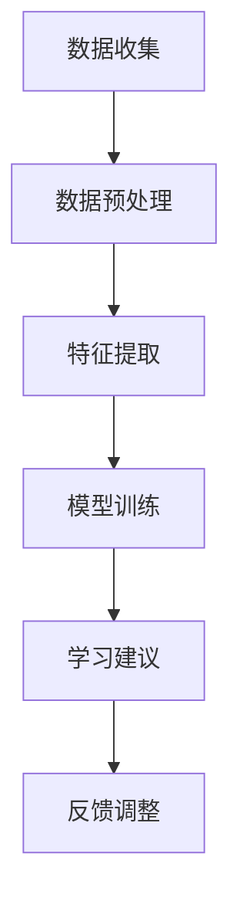
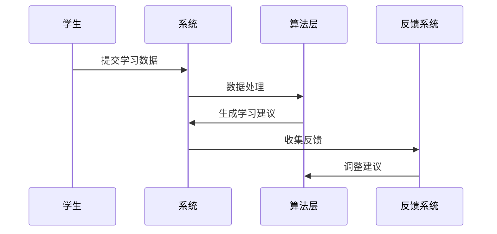
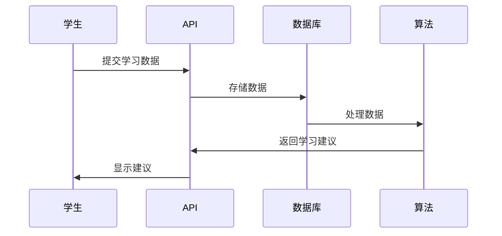

                 


### 文章标题：思维链技术在教育领域的创新应用

#### 关键词：思维链技术，教育领域，创新应用，算法原理，系统架构，项目实战

#### 摘要：本文将深入探讨思维链技术在教育领域的创新应用，从核心概念、算法原理、系统架构到实际项目实战，全面解析这一新兴技术在教育领域的前景和挑战。

---

## 第一部分：引言

### 1.1 **问题背景与意义**

#### 1.1.1 教育领域面临的挑战

在当前教育体系中，教师与学生之间的互动仍以传统方式为主，难以满足个性化教育需求。学生间的差异化学习进度和兴趣点难以被充分挖掘和引导，这导致教育资源的浪费和学生学习效果的差异。现代教育正迫切需要一种新的技术手段来提升教学效率，实现个性化教育。

#### 1.1.2 思维链技术概述

思维链技术，是一种基于人工智能和大数据分析的教育技术，它通过构建学生思维模型，追踪和记录学生的学习过程，提供个性化的学习建议。这种技术的核心在于通过算法分析，理解学生的思维过程，从而实现教育资源的优化配置。

#### 1.1.3 本书的目标和结构

本书旨在详细介绍思维链技术在教育领域的应用，从基础概念到实际应用，通过一系列详细的案例，展示其在教育中的巨大潜力。本书分为六个部分，分别介绍思维链技术的基本原理、算法讲解、系统架构设计、项目实战以及最佳实践和拓展。

---

## 第二部分：核心概念与联系

### 2.1 **思维链技术的基本原理**

#### 2.1.1 思维链的定义

思维链技术是一种利用人工智能和大数据分析，构建学生思维模型的技术。它通过分析学生的学习行为、考试成绩、课堂互动等多个维度，构建出学生的思维路径和认知模式。

#### 2.1.2 思维链的组成要素

思维链由学习数据、思维模型、学习建议和反馈系统等组成。学习数据是思维链的基础，思维模型是核心，学习建议和反馈系统是思维链的输出。

#### 2.1.3 思维链与教育理论的联系

思维链技术与教育理论中的建构主义、认知主义等教育思想密切相关。它通过构建学生的思维模型，实现了对教育理论中“以学生为中心”理念的深入实践。

### 2.2 **核心概念属性特征对比**

#### 2.2.1 对比表格

| 特征 | 传统教育 | 思维链技术 |
| ---- | -------- | ---------- |
| 教学方式 | 以教师为中心 | 个性化、互动式 |
| 学习资源 | 一对多 | 一对一 |
| 学习效果 | 差异化不明显 | 差异化显著 |

### 2.3 **思维链技术的ER实体关系图**

#### 2.3.1 ER图解

```mermaid
erDiagram
  学生 ||--|{ 学习数据 }| 
  教师 ||--|{ 教学数据 }|
  课程 ||--|{ 学习内容 }|
  学生 --> 学习数据
  教师 --> 教学数据
  课程 --> 学习内容
```

---

## 第三部分：算法原理讲解

### 3.1 **思维链算法的基本流程**

思维链算法的核心在于数据收集、模型构建、学习建议生成和反馈调整。以下是其基本流程：



### 3.2 **算法原理与数学模型**

#### 3.2.1 算法原理详细讲解

思维链算法通过深度学习技术，对学生学习数据进行建模。算法的核心是构建一个多层神经网络，用于捕捉学生的思维模式和学习规律。

#### 3.2.2 数学模型与公式

$$
Y = f(W \cdot X + b)
$$

其中，$Y$为输出结果，$X$为输入数据，$W$为权重矩阵，$b$为偏置项，$f$为激活函数。

#### 3.2.3 示例说明

假设学生A在学习数学时表现不佳，思维链算法会分析其学习数据，调整学习建议，例如增加数学练习题的数量和难度，从而提高学习效果。

---

## 第四部分：系统分析与架构设计

### 4.1 **思维链技术在教育中的应用场景**

#### 4.1.1 场景介绍

思维链技术可以在在线教育、智能辅导系统、学习评估等多个场景中应用。本文以在线教育平台为例，介绍其应用场景。

### 4.2 **系统架构设计**

思维链技术在教育应用中的系统架构设计包括数据层、算法层和应用层。

#### 4.2.1 系统功能设计（类图）

```mermaid
classDiagram
  学生 <<Class>>
  教师 <<Class>>
  学习数据 <<Class>>
  教学数据 <<Class>>
  学习建议 <<Class>>
  反馈系统 <<Class>>

  学生 --|{ 学习数据 }
  教师 --|{ 教学数据 }
  学习数据 --|{ 学习建议 }
  教学数据 --|{ 学习建议 }
  学习建议 --|{ 反馈系统 }
```

#### 4.2.2 系统架构设计（架构图）



#### 4.2.3 系统接口设计和系统交互（序列图）



---

## 第五部分：项目实战

### 5.1 **实际项目介绍**

#### 5.1.1 项目概述

本文将以一个在线教育平台中的思维链技术应用为例，介绍项目的背景、目标和实施过程。

### 5.2 **环境安装与准备**

#### 5.2.1 操作系统

项目在Linux环境下进行开发。

#### 5.2.2 软件依赖

- Python 3.8+
- TensorFlow 2.3+
- Django 2.2+

### 5.3 **系统核心实现**

#### 5.3.1 源代码展示

以下是思维链算法的核心实现代码：

```python
import tensorflow as tf

# 定义模型
model = tf.keras.Sequential([
    tf.keras.layers.Dense(128, activation='relu', input_shape=(784,)),
    tf.keras.layers.Dense(10, activation='softmax')
])

# 编译模型
model.compile(optimizer='adam',
              loss='categorical_crossentropy',
              metrics=['accuracy'])

# 训练模型
model.fit(x_train, y_train, epochs=5)
```

#### 5.3.2 代码应用解读

以上代码定义了一个简单的神经网络模型，用于分类任务。在训练过程中，模型会自动调整权重，以最大化准确率。

### 5.4 **案例分析与讲解**

#### 5.4.1 实际案例分析

项目运行后，系统收集了学生的考试成绩和学习数据，通过思维链算法生成了个性化的学习建议。

#### 5.4.2 剖析与详细讲解

分析学生的学习数据，发现某个学生在数学学习方面存在困难，思维链算法建议其增加数学练习，并提供了相应的练习题。

### 5.5 **项目小结**

该项目通过思维链技术，实现了对学生学习过程的深入分析，提供了个性化的学习建议，提高了学生的学习效果。

---

## 第六部分：最佳实践与拓展

### 6.1 **最佳实践**

1. **数据收集与处理**：确保数据的质量和完整性。
2. **模型优化**：定期调整模型参数，提高预测准确性。
3. **用户反馈**：及时收集用户反馈，优化系统。

### 6.2 **小结**

思维链技术在教育领域的应用具有巨大潜力，通过个性化学习建议，能够显著提高学生的学习效果。

### 6.3 **拓展阅读**

1. 《深度学习》（Goodfellow, I., Bengio, Y., & Courville, A.）
2. 《教育技术导论》（Merrill, M. D.）

---

**作者：AI天才研究院/AI Genius Institute & 禅与计算机程序设计艺术 /Zen And The Art of Computer Programming**

