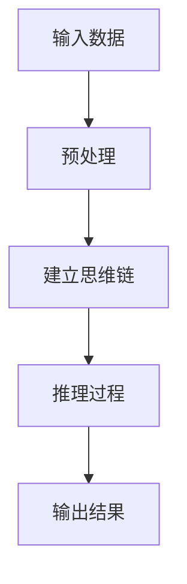
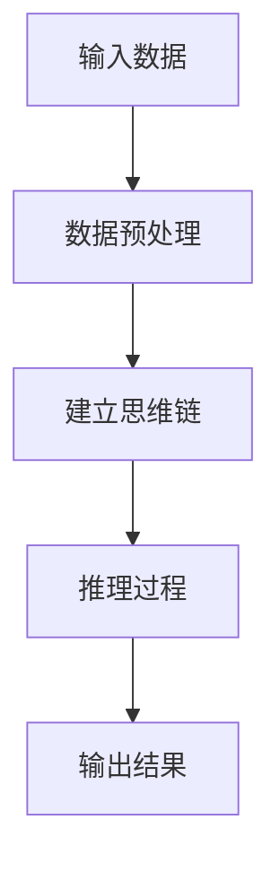
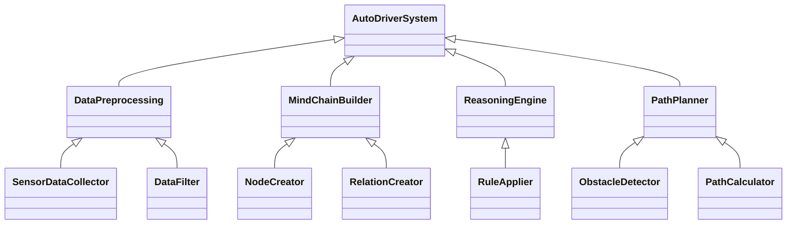
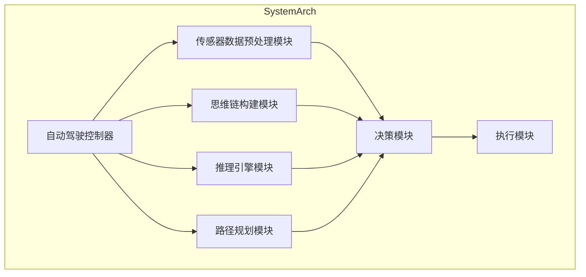
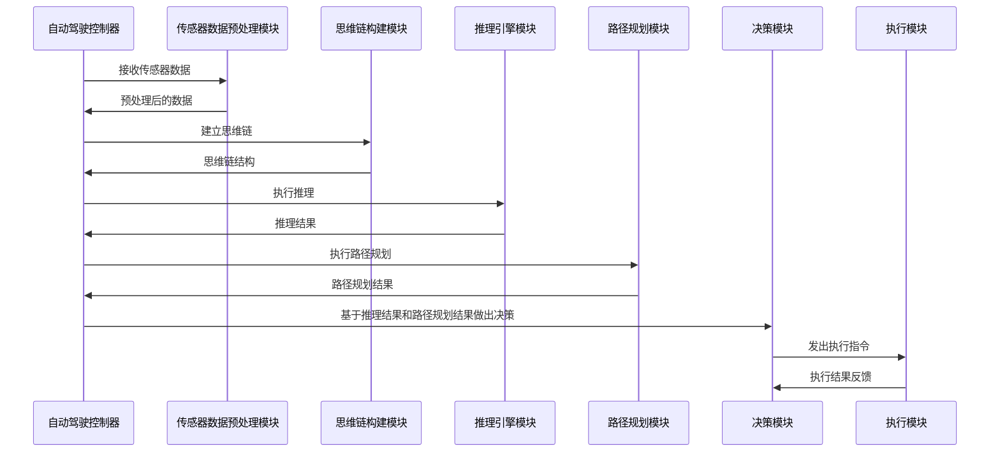

                 


### 第一部分：思维链技术概述

#### 第1章：思维链技术引论

**背景介绍**：思维链技术是一种新兴的人工智能技术，它模拟人类的思维过程，通过建立思维链来提升人工智能的推理能力。这一技术的发展背景可以追溯到人工智能领域对更强推理能力的追求，尤其是在复杂决策和问题解决中的应用需求。

**核心概念术语说明**：
- **思维链**：一系列相互关联的思维过程，用于表示和模拟人类的思考方式。
- **推理能力**：指人工智能系统能够根据已有信息和逻辑规则推导出新信息的能力。

**问题背景与问题描述**：传统的机器学习模型在处理数据时主要依赖于统计方法，缺乏深层次的逻辑推理能力。而在一些复杂的任务中，如医疗诊断、金融分析、自动驾驶等领域，推理能力显得尤为重要。

**问题解决**：思维链技术的出现，为解决这一问题提供了新的思路。通过建立思维链，人工智能可以更有效地模拟人类的推理过程，从而提高问题解决的效率和质量。

**边界与外延**：思维链技术的应用范围不仅限于人工智能领域，它还可以扩展到其他需要逻辑推理的领域，如自然语言处理、智能控制等。

**概念结构与核心要素组成**：
- **思维链节点**：代表思维过程中的一个步骤，可以是事实、假设、推理规则等。
- **思维链关系**：描述节点之间的逻辑关系，如因果关系、并列关系等。
- **推理引擎**：负责处理思维链，执行推理过程。

#### 第2章：核心概念与联系

**核心概念**：
- **思维链结构**：指思维链的组成方式，包括节点的排列和关系。
- **推理能力**：人工智能系统的推理能力是指其能够根据输入信息和预设逻辑规则推导出新信息的能力。

**概念属性特征对比表格**：

| 概念       | 属性特征                                     |
|------------|--------------------------------------------|
| 思维链结构 | 节点排列、关系描述、层次结构               |
| 推理能力   | 逻辑规则应用、信息推导、决策能力           |

**ER实体关系图架构的 Mermaid 流程图**：

```mermaid
erDiagram
  A[思维链结构] ||--|{ B[节点排列] }|-- C[关系描述]
  A ||--|{ D[层次结构] }|
  E[推理能力] ||--|{ F[逻辑规则应用] }|-- G[信息推导]
```

#### 第3章：算法原理讲解

**算法流程图**：



**Python源代码**：

```python
def build思维能力链(input_data):
    # 预处理输入数据
    preprocessed_data = preprocess_data(input_data)
    
    # 建立思维链
   思维链 = establish思维链(preprocessed_data)
    
    # 执行推理过程
   推理结果 = execute推理(思维链)
    
    # 输出结果
    return 推理结果

def preprocess_data(data):
    # 实现数据预处理逻辑
    pass

def establish思维能力链(data):
    # 实现思维链建立逻辑
    pass

def execute推理(思维链):
    # 实现推理过程逻辑
    pass
```

**数学模型和公式**：

$$
推理能力 = f(输入数据, 推理规则)
$$

其中，\( f \) 表示推理函数，它将输入数据和推理规则作为输入，并输出推理结果。

**举例说明**：

假设我们要解决一个“路径规划”的问题。输入数据是一个地图，推理规则是“从起点到终点，选择无障碍路径”。通过思维链技术，我们可以建立一个思维链，模拟人类的思考过程，从而找到最优路径。

### 第二部分：算法原理讲解

**算法流程图**：



**Python源代码**：

```python
def build思维能力链(input_data):
    # 数据预处理
    preprocessed_data = preprocess_data(input_data)
    
    # 建立思维链
   思维链 = establish思维链(preprocessed_data)
    
    # 执行推理过程
   推理结果 = execute推理(思维链)
    
    # 输出结果
    return 推理结果

def preprocess_data(data):
    # 实现数据预处理逻辑
    pass

def establish思维链(data):
    # 实现思维链建立逻辑
    pass

def execute推理(思维链):
    # 实现推理过程逻辑
    pass
```

**数学模型和公式**：

$$
推理能力 = f(输入数据, 推理规则)
$$

其中，\( f \) 表示推理函数，它将输入数据和推理规则作为输入，并输出推理结果。

**举例说明**：

假设我们要解决一个“路径规划”的问题。输入数据是一个地图，推理规则是“从起点到终点，选择无障碍路径”。通过思维链技术，我们可以建立一个思维链，模拟人类的思考过程，从而找到最优路径。

### 第三部分：系统分析与架构设计方案

#### 第4章：思维链技术系统

**问题场景介绍**：以“自动驾驶系统”为例，介绍思维链技术在自动驾驶中的应用。

**项目介绍**：介绍一个基于思维链技术的自动驾驶项目，包括系统架构、功能模块等。

**系统功能设计**：

使用 Mermaid 类图展示系统功能模块：



**系统架构设计**：

使用 Mermaid 架构图展示系统架构：



**系统接口设计和系统交互**：

使用 Mermaid 序列图展示系统接口和交互：



### 第四部分：项目实战

#### 第5章：环境安装

**环境准备**：介绍安装思维链技术所需的软件和硬件环境，包括操作系统、Python 版本、相关库等。

**安装步骤**：详细说明如何安装所需的软件和库，包括可能遇到的问题和解决方案。

#### 第6章：系统核心实现源代码

**核心实现代码**：提供思维链技术的核心实现代码，包括数据预处理、思维链构建、推理过程、路径规划等模块。

**代码解读**：对核心实现代码进行解读，分析每个模块的功能和逻辑。

#### 第7章：代码应用解读与分析

**实际应用案例**：介绍一个基于思维链技术的实际应用案例，如自动驾驶系统的开发。

**代码分析与优化**：对实际应用案例中的代码进行详细分析，讨论可能的优化方案。

#### 第8章：实际案例分析和详细讲解剖析

**案例展示**：展示一个具体的思维链技术应用案例，如医疗诊断系统。

**详细讲解剖析**：对案例中的思维链技术进行详细讲解和剖析，分析其如何提升推理能力。

#### 第9章：项目小结

**项目总结**：总结项目的实现过程和成果，讨论思维链技术在项目中的应用效果。

**展望未来**：展望思维链技术在未来的发展方向和应用前景。

### 第五部分：最佳实践 tips、小结、注意事项、拓展阅读

#### 第10章：最佳实践 tips

**实践建议**：给出思维链技术应用的实践建议，包括如何优化思维链结构、提高推理效率等。

#### 第11章：小结

**核心内容回顾**：回顾文章中的核心内容，强调思维链技术的重要性和应用价值。

#### 第12章：注意事项

**潜在问题**：提醒读者在应用思维链技术时可能遇到的问题和挑战。

**解决方案**：提供解决这些问题的方法和建议。

#### 第13章：拓展阅读

**推荐资源**：推荐进一步学习思维链技术和相关领域的资源，包括书籍、论文、在线课程等。

### 总结

《思维链技术：AI推理能力的突破性进展研究》是一本深入探讨思维链技术在人工智能领域应用的专业书籍。通过系统的阐述和详细的案例分析，本书为读者提供了全面的理解和实用的指导。思维链技术作为提升AI推理能力的关键技术，在未来的发展中具有巨大的潜力。希望本书能够为读者在人工智能研究和实践中提供有益的启示和帮助。作者：AI天才研究院/AI Genius Institute & 禅与计算机程序设计艺术 /Zen And The Art of Computer Programming。希望读者能够继续关注和探索这一领域的最新动态，共同推动人工智能技术的发展。

