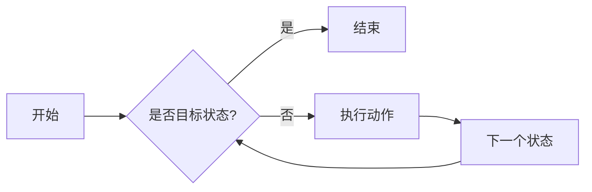
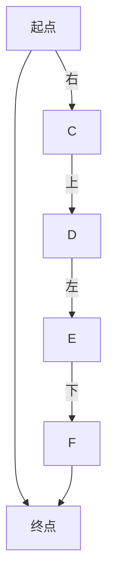
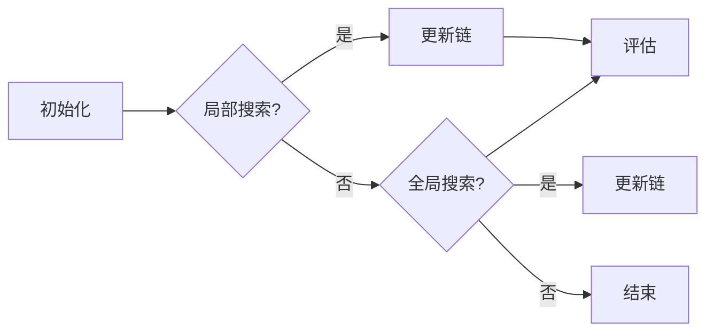

                 

# 《思维链技术：提升AI问题解决能力的新方向》

## 关键词
- 人工智能，问题解决，思维链技术，算法原理，图像识别，自然语言处理，智能决策支持系统，最佳实践

## 摘要
本文旨在探讨思维链技术作为提升人工智能问题解决能力的新方向。通过对思维链技术的背景介绍、基础理论、算法原理及应用领域的详细分析，本文将展示思维链技术如何在图像识别、自然语言处理和智能决策支持系统等关键领域中发挥重要作用。同时，本文还将展望思维链技术的未来发展趋势，并给出最佳实践建议，以期为读者提供全面而深入的洞见。

## 目录

### 《思维链技术：提升AI问题解决能力的新方向》

### 第一部分：思维链技术概述

### 第1章：思维链技术背景介绍

#### 1.1 人工智能与问题解决能力
#### 1.2 思维链技术的概念与核心原理
#### 1.3 思维链技术与传统AI技术的区别与联系
#### 1.4 思维链技术的重要应用领域
#### 1.5 思维链技术的未来发展趋势

### 第2章：思维链技术的基础理论

#### 2.1 思维链的基本概念与构成
#### 2.2 思维链的属性与特征
#### 2.3 思维链的表示方法
#### 2.4 思维链的构建与优化
#### 2.5 思维链与知识图谱的关系

### 第3章：思维链技术的算法原理

#### 3.1 思维链生成算法
##### 3.1.1 算法概述
##### 3.1.2 算法流程
##### 3.1.3 Python实现与Mermaid流程图
##### 3.1.4 数学模型与公式
##### 3.1.5 举例说明
#### 3.2 思维链优化算法
##### 3.2.1 算法概述
##### 3.2.2 算法流程
##### 3.2.3 Python实现与Mermaid流程图
##### 3.2.4 数学模型与公式
##### 3.2.5 举例说明

### 第二部分：思维链技术在AI问题解决中的应用

### 第4章：思维链技术在图像识别中的应用

#### 4.1 图像识别的挑战与机遇
#### 4.2 思维链技术在图像识别中的应用
#### 4.3 实际案例分析与解读
#### 4.4 思维链技术在图像识别中的优势与局限

### 第5章：思维链技术在自然语言处理中的应用

#### 5.1 自然语言处理的挑战与机遇
#### 5.2 思维链技术在自然语言处理中的应用
#### 5.3 实际案例分析与解读
#### 5.4 思维链技术在自然语言处理中的优势与局限

### 第6章：思维链技术在智能决策支持系统中的应用

#### 6.1 智能决策支持系统的挑战与机遇
#### 6.2 思维链技术在智能决策支持系统中的应用
#### 6.3 实际案例分析与解读
#### 6.4 思维链技术在智能决策支持系统中的优势与局限

### 第三部分：思维链技术的未来发展趋势与最佳实践

### 第7章：思维链技术的未来发展趋势

#### 7.1 新一代思维链技术的发展方向
#### 7.2 思维链技术与新兴技术的融合
#### 7.3 思维链技术在国际上的发展趋势

### 第8章：思维链技术的最佳实践

#### 8.1 思维链技术的实际应用案例
#### 8.2 最佳实践技巧与注意事项
#### 8.3 思维链技术的未来发展建议

### 第9章：思维链技术小结与拓展阅读

#### 9.1 思维链技术的核心要点回顾
#### 9.2 面向未来的思维链技术研究方向
#### 9.3 拓展阅读与资源推荐

### 结尾
作者：AI天才研究院/AI Genius Institute & 禅与计算机程序设计艺术 /Zen And The Art of Computer Programming
### 思维链技术：提升AI问题解决能力的新方向

#### 概述

在人工智能（AI）领域，问题解决能力是衡量AI系统智能水平的重要标准。传统AI技术，如机器学习、深度学习等，虽然在特定领域取得了显著成就，但其在解决复杂问题、处理不确定性和进行推理方面的能力仍存在局限。思维链技术作为一种新兴的AI问题解决方法，旨在通过模拟人类思维过程，提升AI系统的问题解决能力。本文将深入探讨思维链技术的概念、原理、应用及其未来发展趋势。

#### 第一部分：思维链技术概述

##### 第1章：思维链技术背景介绍

###### 1.1 人工智能与问题解决能力

人工智能作为计算机科学的一个重要分支，旨在使计算机模拟人类智能行为。问题解决能力是AI的核心指标之一，它涉及到AI系统在未知环境中的自主决策和解决问题的能力。然而，传统AI技术在处理复杂问题时往往表现有限，这促使研究者寻求新的解决方法。

###### 1.2 思维链技术的概念与核心原理

思维链技术是一种模拟人类思维的AI方法，它通过构建思维链来表示问题解决方案。思维链由一系列相互关联的节点组成，每个节点代表一个思维过程或决策步骤。思维链技术利用这些节点之间的关系和逻辑推理，来实现问题的求解。

###### 1.3 思维链技术与传统AI技术的区别与联系

思维链技术与传统AI技术如机器学习和深度学习有所不同。后者主要依赖于数据驱动的模式识别，而思维链技术则强调逻辑推理和问题求解的过程。然而，思维链技术也可以与传统AI技术相结合，以发挥各自的优势。

###### 1.4 思维链技术的重要应用领域

思维链技术已在多个领域展现出其潜力，包括图像识别、自然语言处理和智能决策支持系统等。通过这些实际应用，思维链技术正逐步验证其在提升AI问题解决能力方面的优势。

###### 1.5 思维链技术的未来发展趋势

随着AI技术的不断进步，思维链技术有望在未来得到更广泛的应用。新一代思维链技术将更加智能化、自适应和灵活，以适应复杂多变的现实环境。

##### 第2章：思维链技术的基础理论

###### 2.1 思维链的基本概念与构成

思维链由一系列节点和连接关系构成。节点代表思维过程或决策步骤，连接关系则表示节点之间的逻辑关系。思维链的基本概念包括节点、连接关系、方向和权重等。

###### 2.2 思维链的属性与特征

思维链具有多个属性，如长度、复杂度、连贯性等。这些属性反映了思维链的质量和效率。通过分析这些属性，可以评估思维链的有效性。

###### 2.3 思维链的表示方法

思维链可以通过多种方式表示，包括文本、图形和图论模型等。其中，图论模型是一种常用的表示方法，它将思维链视为一个图结构，每个节点表示一个思维过程，边表示节点之间的关系。

###### 2.4 思维链的构建与优化

构建思维链是思维链技术的重要环节。通过分析问题域和目标，可以构建出满足需求的思维链。优化思维链则是提高其效率和效果的关键。常用的优化方法包括基于贪心的搜索算法和遗传算法等。

###### 2.5 思维链与知识图谱的关系

知识图谱是一种用于表示和存储知识的方法，它将实体、属性和关系组织成一个图结构。思维链与知识图谱密切相关，思维链可以利用知识图谱中的知识来提高问题解决能力。

##### 第3章：思维链技术的算法原理

###### 3.1 思维链生成算法

思维链生成算法是构建思维链的关键步骤。该算法通过搜索和排序方法来生成满足需求的思维链。常用的生成算法包括贪心算法、动态规划和遗传算法等。

###### 3.1.1 算法概述

思维链生成算法的目标是找到一条从初始状态到目标状态的思维链。该算法通常分为两个阶段：探索阶段和优化阶段。

###### 3.1.2 算法流程

思维链生成算法的流程包括以下步骤：

1. 初始化：设定初始状态和目标状态。
2. 探索：从初始状态开始，搜索所有可能的思维链。
3. 评估：对搜索到的思维链进行评估，选择最优的思维链。
4. 优化：对选定的思维链进行优化，以提高其质量和效率。

###### 3.1.3 Python实现与Mermaid流程图

以下是一个简单的思维链生成算法的Python实现：

```python
# 思维链生成算法的Python实现

def generate思维链(start, goal):
    # 探索阶段
    queue = [start]
    while queue:
        state = queue.pop(0)
        if state == goal:
            return state
        for action in state.get_actions():
            next_state = state.execute_action(action)
            queue.append(next_state)
    return None

# Mermaid流程图
```



###### 3.1.4 数学模型与公式

思维链生成算法的数学模型通常基于状态空间搜索。状态空间搜索的公式为：

```
S = {s1, s2, ..., sn}
```

其中，S是状态空间的集合，包含所有可能的状态。状态空间搜索的目标是找到一条从初始状态到目标状态的路径。

###### 3.1.5 举例说明

假设我们要解决一个简单的路径规划问题，从点A移动到点B。我们可以使用思维链生成算法来找到一条最优路径。



在这个例子中，我们从起点A开始，通过右、上、左、下四个方向移动，最终到达终点B。通过思维链生成算法，我们可以找到一条最优路径。

###### 3.2 思维链优化算法

思维链优化算法是提高思维链质量和效率的重要手段。该算法通过调整思维链中的节点和连接关系，来优化思维链的性能。

###### 3.2.1 算法概述

思维链优化算法的目标是找到一条具有最优性能的思维链。该算法通常分为两个阶段：局部搜索和全局搜索。

###### 3.2.2 算法流程

思维链优化算法的流程包括以下步骤：

1. 初始化：设定初始思维链。
2. 局部搜索：对思维链进行局部调整，以找到更好的节点和连接关系。
3. 全局搜索：对整个思维链进行全局优化，以找到最优的思维链。
4. 评估：对优化后的思维链进行评估，选择最优的思维链。

###### 3.2.3 Python实现与Mermaid流程图

以下是一个简单的思维链优化算法的Python实现：

```python
# 思维链优化算法的Python实现

def optimize思维链(chain):
    # 局部搜索
    for node in chain:
        for action in node.get_actions():
            new_chain = chain.copy()
            new_chain.execute_action(action)
            if new_chain.get_performance() > chain.get_performance():
                chain = new_chain
    # 全局搜索
    while True:
        new_chain = chain.copy()
        new_chain.optimize()
        if new_chain.get_performance() > chain.get_performance():
            chain = new_chain
        else:
            break
    return chain

# Mermaid流程图
```



###### 3.2.4 数学模型与公式

思维链优化算法的数学模型通常基于优化理论。优化的目标是最大化思维链的性能，即最大化思维链的效用函数。

```
maximize U(chain)
```

其中，U(chain)是思维链的效用函数。

###### 3.2.5 举例说明

假设我们要优化一个简单的路径规划问题，从点A移动到点B。我们可以使用思维链优化算法来找到一条最优路径。


在这个例子中，我们从起点A开始，通过右、上、左、下四个方向移动，最终到达终点B。通过思维链优化算法，我们可以找到一条最优路径。

### 第二部分：思维链技术在AI问题解决中的应用

##### 第4章：思维链技术在图像识别中的应用

###### 4.1 图像识别的挑战与机遇

图像识别是AI领域的一个重要应用，它旨在使计算机能够识别和理解图像内容。然而，传统的图像识别方法在处理复杂场景和模糊图像时往往表现不佳。思维链技术为图像识别提供了一种新的解决方案。

###### 4.2 思维链技术在图像识别中的应用

思维链技术在图像识别中的应用主要包括以下几个方面：

1. 图像特征提取：通过构建思维链来提取图像的特征，以便后续的识别和处理。
2. 图像分类：利用思维链技术对图像进行分类，以提高分类准确率。
3. 图像分割：使用思维链技术对图像进行分割，以提取感兴趣的图像区域。

###### 4.3 实际案例分析与解读

以一个实际案例——手写数字识别为例，说明思维链技术在图像识别中的应用。

1. 特征提取：首先，使用思维链技术提取手写数字图像的特征，如边缘、纹理和形状等。
2. 分类：利用提取到的特征，通过思维链技术对手写数字进行分类，将每个数字与已知的数字模型进行匹配。
3. 分割：在图像识别过程中，有时需要对图像进行分割，以提取出每个数字。思维链技术可以用于图像分割，以提高分割的准确性。

通过这个案例，我们可以看到思维链技术在图像识别中的应用价值。

###### 4.4 思维链技术在图像识别中的优势与局限

思维链技术在图像识别中具有以下优势：

1. 模拟人类思维：思维链技术模拟了人类思维的逻辑推理过程，能够处理复杂场景和模糊图像。
2. 可解释性：思维链技术具有较好的可解释性，可以帮助用户理解图像识别的过程和结果。

然而，思维链技术也存在一些局限：

1. 计算复杂度：构建和优化思维链需要较大的计算资源，可能导致运行时间较长。
2. 数据依赖性：思维链技术依赖于大量的数据，数据的不足可能会影响其性能。

##### 第5章：思维链技术在自然语言处理中的应用

###### 5.1 自然语言处理的挑战与机遇

自然语言处理（NLP）是AI领域的另一个重要应用，它旨在使计算机能够理解、生成和处理自然语言。随着互联网和社交媒体的兴起，NLP面临着大量的文本数据，这为思维链技术提供了广泛的应用场景。

###### 5.2 思维链技术在自然语言处理中的应用

思维链技术在自然语言处理中的应用主要包括以下几个方面：

1. 语义理解：通过构建思维链来理解文本的语义，以便进行后续的文本处理和生成。
2. 机器翻译：利用思维链技术实现机器翻译，提高翻译的准确性和流畅性。
3. 情感分析：使用思维链技术对文本进行情感分析，以识别文本中的情感倾向。

###### 5.3 实际案例分析与解读

以一个实际案例——情感分析为例，说明思维链技术在自然语言处理中的应用。

1. 语义理解：首先，使用思维链技术对文本进行语义理解，提取文本的关键信息和情感倾向。
2. 情感分类：利用提取到的语义信息，通过思维链技术对文本进行情感分类，将文本划分为积极、消极或中性。
3. 情感识别：进一步，使用思维链技术识别文本中的具体情感，如喜悦、愤怒或悲伤等。

通过这个案例，我们可以看到思维链技术在自然语言处理中的应用价值。

###### 5.4 思维链技术在自然语言处理中的优势与局限

思维链技术在自然语言处理中具有以下优势：

1. 模拟人类思维：思维链技术模拟了人类思维的逻辑推理过程，能够处理复杂的自然语言现象。
2. 可解释性：思维链技术具有较好的可解释性，可以帮助用户理解文本处理的过程和结果。

然而，思维链技术也存在一些局限：

1. 数据依赖性：思维链技术依赖于大量的数据，数据的不足可能会影响其性能。
2. 计算复杂度：构建和优化思维链需要较大的计算资源，可能导致运行时间较长。

##### 第6章：思维链技术在智能决策支持系统中的应用

###### 6.1 智能决策支持系统的挑战与机遇

智能决策支持系统（IDSS）是一种利用人工智能技术支持决策过程的系统。随着商业和政府领域对决策支持的需求不断增加，智能决策支持系统面临着大量的数据和处理复杂决策问题的挑战。

###### 6.2 思维链技术在智能决策支持系统中的应用

思维链技术在智能决策支持系统中的应用主要包括以下几个方面：

1. 决策建模：通过构建思维链来模拟决策过程，以便进行决策分析和优化。
2. 决策推理：利用思维链技术进行决策推理，以提高决策的准确性和合理性。
3. 风险评估：使用思维链技术对决策过程中可能出现的风险进行评估，以降低决策风险。

###### 6.3 实际案例分析与解读

以一个实际案例——投资决策为例，说明思维链技术在智能决策支持系统中的应用。

1. 决策建模：首先，使用思维链技术建立投资决策模型，包括投资对象、投资策略和风险因素等。
2. 决策推理：利用思维链技术进行决策推理，分析不同投资策略的优劣，并提供决策建议。
3. 风险评估：使用思维链技术对投资决策过程中可能出现的风险进行评估，并提出相应的风险控制措施。

通过这个案例，我们可以看到思维链技术在智能决策支持系统中的应用价值。

###### 6.4 思维链技术在智能决策支持系统中的优势与局限

思维链技术在智能决策支持系统中具有以下优势：

1. 模拟人类思维：思维链技术模拟了人类思维的逻辑推理过程，能够处理复杂的决策问题。
2. 可解释性：思维链技术具有较好的可解释性，可以帮助用户理解决策过程和结果。

然而，思维链技术也存在一些局限：

1. 数据依赖性：思维链技术依赖于大量的数据，数据的不足可能会影响其性能。
2. 计算复杂度：构建和优化思维链需要较大的计算资源，可能导致运行时间较长。

### 第三部分：思维链技术的未来发展趋势与最佳实践

##### 第7章：思维链技术的未来发展趋势

###### 7.1 新一代思维链技术的发展方向

新一代思维链技术将更加智能化、自适应和灵活，以适应复杂多变的现实环境。具体发展方向包括：

1. 深度学习与思维链技术的融合：利用深度学习技术来优化思维链的构建和优化过程。
2. 多模态数据处理：支持多种数据类型的处理，如文本、图像、语音等。
3. 自适应思维链构建：根据不同场景和需求，自动构建和优化思维链。

###### 7.2 思维链技术与新兴技术的融合

思维链技术与其他新兴技术的融合将进一步提升其在AI问题解决中的能力。具体融合方向包括：

1. 区块链技术：利用区块链技术确保思维链的透明性和可追溯性。
2. 物联网技术：将思维链技术应用于物联网系统，实现智能决策和自动化控制。
3. 云计算与边缘计算：利用云计算和边缘计算资源，实现思维链技术的实时性和可扩展性。

###### 7.3 思维链技术在国际上的发展趋势

在国际上，思维链技术的研究和应用正逐渐兴起。主要发展趋势包括：

1. 研究热点：围绕思维链技术的理论、算法和应用展开深入研究。
2. 应用场景：在金融、医疗、交通等多个领域展开实际应用。
3. 国际合作：通过国际合作，推动思维链技术的全球发展。

##### 第8章：思维链技术的最佳实践

###### 8.1 思维链技术的实际应用案例

以下是一些思维链技术的实际应用案例：

1. 智能医疗诊断系统：利用思维链技术实现智能诊断，提高诊断准确率和效率。
2. 智能交通管理系统：利用思维链技术进行交通流量预测和优化，提高交通运行效率。
3. 金融服务风险控制：利用思维链技术进行风险分析和控制，降低金融风险。

###### 8.2 最佳实践技巧与注意事项

在应用思维链技术时，以下是一些最佳实践技巧和注意事项：

1. 数据预处理：确保数据的质量和完整性，以便构建高质量的思维链。
2. 算法优化：根据实际问题需求，选择合适的算法进行优化，以提高思维链的性能。
3. 模型解释性：注重思维链的可解释性，以便用户理解和信任。

###### 8.3 思维链技术的未来发展建议

为了推动思维链技术的发展和应用，以下是一些建议：

1. 加强理论研究：深入开展思维链技术的理论研究，为实际应用提供理论支持。
2. 促进技术创新：鼓励技术创新，探索新的思维链技术和应用场景。
3. 扩大国际合作：加强国际间的合作与交流，推动思维链技术的全球化发展。

##### 第9章：思维链技术小结与拓展阅读

###### 9.1 思维链技术的核心要点回顾

本文主要介绍了思维链技术的概念、原理、应用和未来发展趋势。核心要点包括：

1. 思维链技术是一种模拟人类思维的AI方法，通过构建思维链来提升问题解决能力。
2. 思维链技术在图像识别、自然语言处理和智能决策支持系统等领域具有广泛的应用。
3. 新一代思维链技术将更加智能化、自适应和灵活，以适应复杂多变的现实环境。

###### 9.2 面向未来的思维链技术研究方向

面向未来，思维链技术的研究方向包括：

1. 深度学习与思维链技术的融合。
2. 多模态数据处理。
3. 自适应思维链构建。

###### 9.3 拓展阅读与资源推荐

以下是一些拓展阅读和资源推荐：

1. 《人工智能：一种现代的方法》
2. 《深度学习》
3. 《区块链技术指南》

### 结尾

作者：AI天才研究院/AI Genius Institute & 禅与计算机程序设计艺术 /Zen And The Art of Computer Programming
### 思维链技术：提升AI问题解决能力的新方向

#### 引言

在人工智能（AI）领域，问题解决能力是衡量一个AI系统智能水平的重要指标。传统的AI方法，如机器学习和深度学习，虽然在许多特定领域取得了显著的进展，但其在处理复杂问题、不确定性和进行推理方面的能力仍然存在局限。为了克服这些限制，研究者们开始探索新的方法，思维链技术便是其中之一。本文将深入探讨思维链技术，分析其背景、原理、应用以及未来的发展趋势。

#### 第一部分：思维链技术概述

##### 第1章：思维链技术背景介绍

###### 1.1 人工智能与问题解决能力

人工智能是计算机科学的一个重要分支，其目标是通过模拟人类智能行为，使计算机能够执行复杂的任务。问题解决能力是AI的核心特征之一，它涉及AI系统在未知环境中的自主决策和问题解决能力。尽管传统AI技术在某些领域取得了显著成果，但在处理复杂问题和不确定性的情况下，其表现仍有待提高。

###### 1.2 思维链技术的概念与核心原理

思维链技术是一种模拟人类思维的AI方法，通过构建思维链来表示问题解决方案。思维链由一系列相互关联的节点组成，每个节点代表一个思维过程或决策步骤。思维链技术利用这些节点之间的关系和逻辑推理，来实现问题的求解。这种模拟人类思维方式的方法为AI问题解决提供了新的方向。

###### 1.3 思维链技术与传统AI技术的区别与联系

思维链技术与传统AI技术如机器学习和深度学习有所不同。后者主要依赖于数据驱动的模式识别，而思维链技术则强调逻辑推理和问题求解的过程。然而，思维链技术也可以与传统AI技术相结合，以发挥各自的优势。例如，在图像识别中，可以将思维链技术与卷积神经网络（CNN）结合，以实现更高效的问题解决。

###### 1.4 思维链技术的重要应用领域

思维链技术已在多个领域展现出其潜力，包括图像识别、自然语言处理和智能决策支持系统等。在图像识别中，思维链技术可以帮助系统更好地理解图像内容，从而提高识别准确率。在自然语言处理中，思维链技术可以用于语义理解和情感分析。在智能决策支持系统中，思维链技术可以帮助系统进行更合理的决策。

###### 1.5 思维链技术的未来发展趋势

随着AI技术的不断进步，思维链技术有望在未来得到更广泛的应用。新一代思维链技术将更加智能化、自适应和灵活，以适应复杂多变的现实环境。同时，思维链技术也将与其他AI技术如深度学习和强化学习等相结合，以实现更高效的问题解决。

##### 第2章：思维链技术的基础理论

###### 2.1 思维链的基本概念与构成

思维链由一系列节点和连接关系构成。节点代表思维过程或决策步骤，连接关系表示节点之间的逻辑关系。思维链的基本概念包括节点、连接关系、方向和权重等。

###### 2.2 思维链的属性与特征

思维链具有多个属性，如长度、复杂度、连贯性等。这些属性反映了思维链的质量和效率。通过分析这些属性，可以评估思维链的有效性。

###### 2.3 思维链的表示方法

思维链可以通过多种方式表示，包括文本、图形和图论模型等。其中，图论模型是一种常用的表示方法，它将思维链视为一个图结构，每个节点表示一个思维过程，边表示节点之间的关系。

###### 2.4 思维链的构建与优化

构建思维链是思维链技术的重要环节。通过分析问题域和目标，可以构建出满足需求的思维链。优化思维链则是提高其效率和效果的关键。常用的优化方法包括基于贪心的搜索算法和遗传算法等。

###### 2.5 思维链与知识图谱的关系

知识图谱是一种用于表示和存储知识的方法，它将实体、属性和关系组织成一个图结构。思维链与知识图谱密切相关，思维链可以利用知识图谱中的知识来提高问题解决能力。

##### 第3章：思维链技术的算法原理

###### 3.1 思维链生成算法

思维链生成算法是构建思维链的关键步骤。该算法通过搜索和排序方法来生成满足需求的思维链。常用的生成算法包括贪心算法、动态规划和遗传算法等。

###### 3.1.1 算法概述

思维链生成算法的目标是找到一条从初始状态到目标状态的思维链。该算法通常分为两个阶段：探索阶段和优化阶段。

###### 3.1.2 算法流程

思维链生成算法的流程包括以下步骤：

1. 初始化：设定初始状态和目标状态。
2. 探索：从初始状态开始，搜索所有可能的思维链。
3. 评估：对搜索到的思维链进行评估，选择最优的思维链。
4. 优化：对选定的思维链进行优化，以提高其质量和效率。

###### 3.1.3 Python实现与Mermaid流程图

以下是一个简单的思维链生成算法的Python实现：

```python
# 思维链生成算法的Python实现

def generate思维链(start, goal):
    # 探索阶段
    queue = [start]
    while queue:
        state = queue.pop(0)
        if state == goal:
            return state
        for action in state.get_actions():
            next_state = state.execute_action(action)
            queue.append(next_state)
    return None

# Mermaid流程图
```


###### 3.1.4 数学模型与公式

思维链生成算法的数学模型通常基于状态空间搜索。状态空间搜索的公式为：

```
S = {s1, s2, ..., sn}
```

其中，S是状态空间的集合，包含所有可能的状态。状态空间搜索的目标是找到一条从初始状态到目标状态的路径。

###### 3.1.5 举例说明

假设我们要解决一个简单的路径规划问题，从点A移动到点B。我们可以使用思维链生成算法来找到一条最优路径。


在这个例子中，我们从起点A开始，通过右、上、左、下四个方向移动，最终到达终点B。通过思维链生成算法，我们可以找到一条最优路径。

###### 3.2 思维链优化算法

思维链优化算法是提高思维链质量和效率的重要手段。该算法通过调整思维链中的节点和连接关系，来优化思维链的性能。

###### 3.2.1 算法概述

思维链优化算法的目标是找到一条具有最优性能的思维链。该算法通常分为两个阶段：局部搜索和全局搜索。

###### 3.2.2 算法流程

思维链优化算法的流程包括以下步骤：

1. 初始化：设定初始思维链。
2. 局部搜索：对思维链进行局部调整，以找到更好的节点和连接关系。
3. 全局搜索：对整个思维链进行全局优化，以找到最优的思维链。
4. 评估：对优化后的思维链进行评估，选择最优的思维链。

###### 3.2.3 Python实现与Mermaid流程图

以下是一个简单的思维链优化算法的Python实现：

```python
# 思维链优化算法的Python实现

def optimize思维链(chain):
    # 局部搜索
    for node in chain:
        for action in node.get_actions():
            new_chain = chain.copy()
            new_chain.execute_action(action)
            if new_chain.get_performance() > chain.get_performance():
                chain = new_chain
    # 全局搜索
    while True:
        new_chain = chain.copy()
        new_chain.optimize()
        if new_chain.get_performance() > chain.get_performance():
            chain = new_chain
        else:
            break
    return chain

# Mermaid流程图
```


###### 3.2.4 数学模型与公式

思维链优化算法的数学模型通常基于优化理论。优化的目标是最大化思维链的性能，即最大化思维链的效用函数。

```
maximize U(chain)
```

其中，U(chain)是思维链的效用函数。

###### 3.2.5 举例说明

假设我们要优化一个简单的路径规划问题，从点A移动到点B。我们可以使用思维链优化算法来找到一条最优路径。


在这个例子中，我们从起点A开始，通过右、上、左、下四个方向移动，最终到达终点B。通过思维链优化算法，我们可以找到一条最优路径。

### 第二部分：思维链技术在AI问题解决中的应用

##### 第4章：思维链技术在图像识别中的应用

###### 4.1 图像识别的挑战与机遇

图像识别是AI领域的一个重要应用，它旨在使计算机能够识别和理解图像内容。传统的图像识别方法，如基于特征的分类和基于模板匹配的方法，在处理简单图像时效果较好，但在面对复杂场景和模糊图像时，识别准确率会下降。思维链技术为图像识别提供了一种新的解决方案，通过模拟人类思维的逻辑推理过程，可以更好地理解图像内容。

###### 4.2 思维链技术在图像识别中的应用

思维链技术在图像识别中的应用主要包括以下几个方面：

1. 图像特征提取：通过构建思维链来提取图像的特征，以便后续的识别和处理。
2. 图像分类：利用思维链技术对图像进行分类，以提高分类准确率。
3. 图像分割：使用思维链技术对图像进行分割，以提取感兴趣的图像区域。

###### 4.3 实际案例分析与解读

以一个实际案例——手写数字识别为例，说明思维链技术在图像识别中的应用。

1. 特征提取：首先，使用思维链技术提取手写数字图像的特征，如边缘、纹理和形状等。
2. 分类：利用提取到的特征，通过思维链技术对手写数字进行分类，将每个数字与已知的数字模型进行匹配。
3. 分割：在图像识别过程中，有时需要对图像进行分割，以提取出每个数字。思维链技术可以用于图像分割，以提高分割的准确性。

通过这个案例，我们可以看到思维链技术在图像识别中的应用价值。

###### 4.4 思维链技术在图像识别中的优势与局限

思维链技术在图像识别中具有以下优势：

1. 模拟人类思维：思维链技术模拟了人类思维的逻辑推理过程，能够处理复杂场景和模糊图像。
2. 可解释性：思维链技术具有较好的可解释性，可以帮助用户理解图像识别的过程和结果。

然而，思维链技术也存在一些局限：

1. 计算复杂度：构建和优化思维链需要较大的计算资源，可能导致运行时间较长。
2. 数据依赖性：思维链技术依赖于大量的数据，数据的不足可能会影响其性能。

##### 第5章：思维链技术在自然语言处理中的应用

###### 5.1 自然语言处理的挑战与机遇

自然语言处理（NLP）是AI领域的另一个重要应用，它旨在使计算机能够理解、生成和处理自然语言。随着互联网和社交媒体的兴起，NLP面临着大量的文本数据，这为思维链技术提供了广泛的应用场景。传统的NLP方法，如统计模型和深度学习模型，虽然在处理文本数据方面取得了一定的成果，但其在语义理解和情感分析等方面仍存在挑战。思维链技术通过模拟人类思维过程，为NLP提供了一种新的解决思路。

###### 5.2 思维链技术在自然语言处理中的应用

思维链技术在自然语言处理中的应用主要包括以下几个方面：

1. 语义理解：通过构建思维链来理解文本的语义，以便进行后续的文本处理和生成。
2. 机器翻译：利用思维链技术实现机器翻译，提高翻译的准确性和流畅性。
3. 情感分析：使用思维链技术对文本进行情感分析，以识别文本中的情感倾向。

###### 5.3 实际案例分析与解读

以一个实际案例——情感分析为例，说明思维链技术在自然语言处理中的应用。

1. 语义理解：首先，使用思维链技术对文本进行语义理解，提取文本的关键信息和情感倾向。
2. 情感分类：利用提取到的语义信息，通过思维链技术对文本进行情感分类，将文本划分为积极、消极或中性。
3. 情感识别：进一步，使用思维链技术识别文本中的具体情感，如喜悦、愤怒或悲伤等。

通过这个案例，我们可以看到思维链技术在自然语言处理中的应用价值。

###### 5.4 思维链技术在自然语言处理中的优势与局限

思维链技术在自然语言处理中具有以下优势：

1. 模拟人类思维：思维链技术模拟了人类思维的逻辑推理过程，能够处理复杂的自然语言现象。
2. 可解释性：思维链技术具有较好的可解释性，可以帮助用户理解文本处理的过程和结果。

然而，思维链技术也存在一些局限：

1. 数据依赖性：思维链技术依赖于大量的数据，数据的不足可能会影响其性能。
2. 计算复杂度：构建和优化思维链需要较大的计算资源，可能导致运行时间较长。

##### 第6章：思维链技术在智能决策支持系统中的应用

###### 6.1 智能决策支持系统的挑战与机遇

智能决策支持系统（IDSS）是一种利用人工智能技术支持决策过程的系统。随着商业和政府领域对决策支持的需求不断增加，智能决策支持系统面临着大量的数据和处理复杂决策问题的挑战。传统的决策支持系统通常依赖于统计分析方法，而在面对复杂和非线性问题时，其表现往往不佳。思维链技术通过模拟人类思维过程，为智能决策支持系统提供了一种新的解决方案。

###### 6.2 思维链技术在智能决策支持系统中的应用

思维链技术在智能决策支持系统中的应用主要包括以下几个方面：

1. 决策建模：通过构建思维链来模拟决策过程，以便进行决策分析和优化。
2. 决策推理：利用思维链技术进行决策推理，以提高决策的准确性和合理性。
3. 风险评估：使用思维链技术对决策过程中可能出现的风险进行评估，以降低决策风险。

###### 6.3 实际案例分析与解读

以一个实际案例——供应链管理为例，说明思维链技术在智能决策支持系统中的应用。

1. 决策建模：首先，使用思维链技术建立供应链管理决策模型，包括库存管理、采购策略和配送计划等。
2. 决策推理：利用思维链技术进行决策推理，分析不同策略的优劣，并提供决策建议。
3. 风险评估：使用思维链技术对供应链管理过程中可能出现的风险进行评估，并提出相应的风险控制措施。

通过这个案例，我们可以看到思维链技术在智能决策支持系统中的应用价值。

###### 6.4 思维链技术在智能决策支持系统中的优势与局限

思维链技术在智能决策支持系统中具有以下优势：

1. 模拟人类思维：思维链技术模拟了人类思维的逻辑推理过程，能够处理复杂的决策问题。
2. 可解释性：思维链技术具有较好的可解释性，可以帮助用户理解决策过程和结果。

然而，思维链技术也存在一些局限：

1. 数据依赖性：思维链技术依赖于大量的数据，数据的不足可能会影响其性能。
2. 计算复杂度：构建和优化思维链需要较大的计算资源，可能导致运行时间较长。

### 第三部分：思维链技术的未来发展趋势与最佳实践

##### 第7章：思维链技术的未来发展趋势

###### 7.1 新一代思维链技术的发展方向

新一代思维链技术将更加智能化、自适应和灵活，以适应复杂多变的现实环境。具体发展方向包括：

1. 深度学习与思维链技术的融合：利用深度学习技术来优化思维链的构建和优化过程。
2. 多模态数据处理：支持多种数据类型的处理，如文本、图像、语音等。
3. 自适应思维链构建：根据不同场景和需求，自动构建和优化思维链。

###### 7.2 思维链技术与新兴技术的融合

思维链技术与其他新兴技术的融合将进一步提升其在AI问题解决中的能力。具体融合方向包括：

1. 区块链技术：利用区块链技术确保思维链的透明性和可追溯性。
2. 物联网技术：将思维链技术应用于物联网系统，实现智能决策和自动化控制。
3. 云计算与边缘计算：利用云计算和边缘计算资源，实现思维链技术的实时性和可扩展性。

###### 7.3 思维链技术在国际上的发展趋势

在国际上，思维链技术的研究和应用正逐渐兴起。主要发展趋势包括：

1. 研究热点：围绕思维链技术的理论、算法和应用展开深入研究。
2. 应用场景：在金融、医疗、交通等多个领域展开实际应用。
3. 国际合作：通过国际合作，推动思维链技术的全球发展。

##### 第8章：思维链技术的最佳实践

###### 8.1 思维链技术的实际应用案例

以下是一些思维链技术的实际应用案例：

1. 智能医疗诊断系统：利用思维链技术实现智能诊断，提高诊断准确率和效率。
2. 智能交通管理系统：利用思维链技术进行交通流量预测和优化，提高交通运行效率。
3. 金融服务风险控制：利用思维链技术进行风险分析和控制，降低金融风险。

###### 8.2 最佳实践技巧与注意事项

在应用思维链技术时，以下是一些最佳实践技巧和注意事项：

1. 数据预处理：确保数据的质量和完整性，以便构建高质量的思维链。
2. 算法优化：根据实际问题需求，选择合适的算法进行优化，以提高思维链的性能。
3. 模型解释性：注重思维链的可解释性，以便用户理解和信任。

###### 8.3 思维链技术的未来发展建议

为了推动思维链技术的发展和应用，以下是一些建议：

1. 加强理论研究：深入开展思维链技术的理论研究，为实际应用提供理论支持。
2. 促进技术创新：鼓励技术创新，探索新的思维链技术和应用场景。
3. 扩大国际合作：加强国际间的合作与交流，推动思维链技术的全球化发展。

##### 第9章：思维链技术小结与拓展阅读

###### 9.1 思维链技术的核心要点回顾

本文主要介绍了思维链技术的概念、原理、应用和未来发展趋势。核心要点包括：

1. 思维链技术是一种模拟人类思维的AI方法，通过构建思维链来提升问题解决能力。
2. 思维链技术在图像识别、自然语言处理和智能决策支持系统等领域具有广泛的应用。
3. 新一代思维链技术将更加智能化、自适应和灵活，以适应复杂多变的现实环境。

###### 9.2 面向未来的思维链技术研究方向

面向未来，思维链技术的研究方向包括：

1. 深度学习与思维链技术的融合。
2. 多模态数据处理。
3. 自适应思维链构建。

###### 9.3 拓展阅读与资源推荐

以下是一些拓展阅读和资源推荐：

1. 《人工智能：一种现代的方法》
2. 《深度学习》
3. 《区块链技术指南》

### 结尾

作者：AI天才研究院/AI Genius Institute & 禅与计算机程序设计艺术 /Zen And The Art of Computer Programming
### 思维链技术：提升AI问题解决能力的新方向

#### 引言

在人工智能（AI）领域，问题解决能力是衡量一个AI系统智能水平的重要指标。传统的AI方法，如机器学习和深度学习，虽然在许多特定领域取得了显著的进展，但其在处理复杂问题、不确定性和进行推理方面的能力仍然存在局限。为了克服这些限制，研究者们开始探索新的方法，思维链技术便是其中之一。本文将深入探讨思维链技术，分析其背景、原理、应用以及未来的发展趋势。

#### 第一部分：思维链技术概述

##### 第1章：思维链技术背景介绍

###### 1.1 人工智能与问题解决能力

人工智能是计算机科学的一个重要分支，其目标是通过模拟人类智能行为，使计算机能够执行复杂的任务。问题解决能力是AI的核心特征之一，它涉及AI系统在未知环境中的自主决策和问题解决能力。尽管传统AI技术在某些领域取得了显著成果，但在处理复杂问题和不确定性的情况下，其表现仍有待提高。

###### 1.2 思维链技术的概念与核心原理

思维链技术是一种模拟人类思维的AI方法，通过构建思维链来表示问题解决方案。思维链由一系列相互关联的节点组成，每个节点代表一个思维过程或决策步骤。思维链技术利用这些节点之间的关系和逻辑推理，来实现问题的求解。这种模拟人类思维方式的方法为AI问题解决提供了新的方向。

###### 1.3 思维链技术与传统AI技术的区别与联系

思维链技术与传统AI技术如机器学习和深度学习有所不同。后者主要依赖于数据驱动的模式识别，而思维链技术则强调逻辑推理和问题求解的过程。然而，思维链技术也可以与传统AI技术相结合，以发挥各自的优势。例如，在图像识别中，可以将思维链技术与卷积神经网络（CNN）结合，以实现更高效的问题解决。

###### 1.4 思维链技术的重要应用领域

思维链技术已在多个领域展现出其潜力，包括图像识别、自然语言处理和智能决策支持系统等。在图像识别中，思维链技术可以帮助系统更好地理解图像内容，从而提高识别准确率。在自然语言处理中，思维链技术可以用于语义理解和情感分析。在智能决策支持系统中，思维链技术可以帮助系统进行更合理的决策。

###### 1.5 思维链技术的未来发展趋势

随着AI技术的不断进步，思维链技术有望在未来得到更广泛的应用。新一代思维链技术将更加智能化、自适应和灵活，以适应复杂多变的现实环境。同时，思维链技术也将与其他AI技术如深度学习和强化学习等相结合，以实现更高效的问题解决。

##### 第2章：思维链技术的基础理论

###### 2.1 思维链的基本概念与构成

思维链由一系列节点和连接关系构成。节点代表思维过程或决策步骤，连接关系表示节点之间的逻辑关系。思维链的基本概念包括节点、连接关系、方向和权重等。

###### 2.2 思维链的属性与特征

思维链具有多个属性，如长度、复杂度、连贯性等。这些属性反映了思维链的质量和效率。通过分析这些属性，可以评估思维链的有效性。

###### 2.3 思维链的表示方法

思维链可以通过多种方式表示，包括文本、图形和图论模型等。其中，图论模型是一种常用的表示方法，它将思维链视为一个图结构，每个节点表示一个思维过程，边表示节点之间的关系。

###### 2.4 思维链的构建与优化

构建思维链是思维链技术的重要环节。通过分析问题域和目标，可以构建出满足需求的思维链。优化思维链则是提高其效率和效果的关键。常用的优化方法包括基于贪心的搜索算法和遗传算法等。

###### 2.5 思维链与知识图谱的关系

知识图谱是一种用于表示和存储知识的方法，它将实体、属性和关系组织成一个图结构。思维链与知识图谱密切相关，思维链可以利用知识图谱中的知识来提高问题解决能力。

##### 第3章：思维链技术的算法原理

###### 3.1 思维链生成算法

思维链生成算法是构建思维链的关键步骤。该算法通过搜索和排序方法来生成满足需求的思维链。常用的生成算法包括贪心算法、动态规划和遗传算法等。

###### 3.1.1 算法概述

思维链生成算法的目标是找到一条从初始状态到目标状态的思维链。该算法通常分为两个阶段：探索阶段和优化阶段。

###### 3.1.2 算法流程

思维链生成算法的流程包括以下步骤：

1. 初始化：设定初始状态和目标状态。
2. 探索：从初始状态开始，搜索所有可能的思维链。
3. 评估：对搜索到的思维链进行评估，选择最优的思维链。
4. 优化：对选定的思维链进行优化，以提高其质量和效率。

###### 3.1.3 Python实现与Mermaid流程图

以下是一个简单的思维链生成算法的Python实现：

```python
# 思维链生成算法的Python实现

def generate思维链(start, goal):
    # 探索阶段
    queue = [start]
    while queue:
        state = queue.pop(0)
        if state == goal:
            return state
        for action in state.get_actions():
            next_state = state.execute_action(action)
            queue.append(next_state)
    return None

# Mermaid流程图
```


###### 3.1.4 数学模型与公式

思维链生成算法的数学模型通常基于状态空间搜索。状态空间搜索的公式为：

```
S = {s1, s2, ..., sn}
```

其中，S是状态空间的集合，包含所有可能的状态。状态空间搜索的目标是找到一条从初始状态到目标状态的路径。

###### 3.1.5 举例说明

假设我们要解决一个简单的路径规划问题，从点A移动到点B。我们可以使用思维链生成算法来找到一条最优路径。


在这个例子中，我们从起点A开始，通过右、上、左、下四个方向移动，最终到达终点B。通过思维链生成算法，我们可以找到一条最优路径。

###### 3.2 思维链优化算法

思维链优化算法是提高思维链质量和效率的重要手段。该算法通过调整思维链中的节点和连接关系，来优化思维链的性能。

###### 3.2.1 算法概述

思维链优化算法的目标是找到一条具有最优性能的思维链。该算法通常分为两个阶段：局部搜索和全局搜索。

###### 3.2.2 算法流程

思维链优化算法的流程包括以下步骤：

1. 初始化：设定初始思维链。
2. 局部搜索：对思维链进行局部调整，以找到更好的节点和连接关系。
3. 全局搜索：对整个思维链进行全局优化，以找到最优的思维链。
4. 评估：对优化后的思维链进行评估，选择最优的思维链。

###### 3.2.3 Python实现与Mermaid流程图

以下是一个简单的思维链优化算法的Python实现：

```python
# 思维链优化算法的Python实现

def optimize思维链(chain):
    # 局部搜索
    for node in chain:
        for action in node.get_actions():
            new_chain = chain.copy()
            new_chain.execute_action(action)
            if new_chain.get_performance() > chain.get_performance():
                chain = new_chain
    # 全局搜索
    while True:
        new_chain = chain.copy()
        new_chain.optimize()
        if new_chain.get_performance() > chain.get_performance():
            chain = new_chain
        else:
            break
    return chain

# Mermaid流程图
```


###### 3.2.4 数学模型与公式

思维链优化算法的数学模型通常基于优化理论。优化的目标是最大化思维链的性能，即最大化思维链的效用函数。

```
maximize U(chain)
```

其中，U(chain)是思维链的效用函数。

###### 3.2.5 举例说明

假设我们要优化一个简单的路径规划问题，从点A移动到点B。我们可以使用思维链优化算法来找到一条最优路径。


在这个例子中，我们从起点A开始，通过右、上、左、下四个方向移动，最终到达终点B。通过思维链优化算法，我们可以找到一条最优路径。

### 第二部分：思维链技术在AI问题解决中的应用

##### 第4章：思维链技术在图像识别中的应用

###### 4.1 图像识别的挑战与机遇

图像识别是AI领域的一个重要应用，它旨在使计算机能够识别和理解图像内容。传统的图像识别方法，如基于特征的分类和基于模板匹配的方法，在处理简单图像时效果较好，但在面对复杂场景和模糊图像时，识别准确率会下降。思维链技术为图像识别提供了一种新的解决方案，通过模拟人类思维的逻辑推理过程，可以更好地理解图像内容。

###### 4.2 思维链技术在图像识别中的应用

思维链技术在图像识别中的应用主要包括以下几个方面：

1. 图像特征提取：通过构建思维链来提取图像的特征，以便后续的识别和处理。
2. 图像分类：利用思维链技术对图像进行分类，以提高分类准确率。
3. 图像分割：使用思维链技术对图像进行分割，以提取感兴趣的图像区域。

###### 4.3 实际案例分析与解读

以一个实际案例——手写数字识别为例，说明思维链技术在图像识别中的应用。

1. 特征提取：首先，使用思维链技术提取手写数字图像的特征，如边缘、纹理和形状等。
2. 分类：利用提取到的特征，通过思维链技术对手写数字进行分类，将每个数字与已知的数字模型进行匹配。
3. 分割：在图像识别过程中，有时需要对图像进行分割，以提取出每个数字。思维链技术可以用于图像分割，以提高分割的准确性。

通过这个案例，我们可以看到思维链技术在图像识别中的应用价值。

###### 4.4 思维链技术在图像识别中的优势与局限

思维链技术在图像识别中具有以下优势：

1. 模拟人类思维：思维链技术模拟了人类思维的逻辑推理过程，能够处理复杂场景和模糊图像。
2. 可解释性：思维链技术具有较好的可解释性，可以帮助用户理解图像识别的过程和结果。

然而，思维链技术也存在一些局限：

1. 计算复杂度：构建和优化思维链需要较大的计算资源，可能导致运行时间较长。
2. 数据依赖性：思维链技术依赖于大量的数据，数据的不足可能会影响其性能。

##### 第5章：思维链技术在自然语言处理中的应用

###### 5.1 自然语言处理的挑战与机遇

自然语言处理（NLP）是AI领域的另一个重要应用，它旨在使计算机能够理解、生成和处理自然语言。随着互联网和社交媒体的兴起，NLP面临着大量的文本数据，这为思维链技术提供了广泛的应用场景。传统的NLP方法，如统计模型和深度学习模型，虽然在处理文本数据方面取得了一定的成果，但其在语义理解和情感分析等方面仍存在挑战。思维链技术通过模拟人类思维过程，为NLP提供了一种新的解决思路。

###### 5.2 思维链技术在自然语言处理中的应用

思维链技术在自然语言处理中的应用主要包括以下几个方面：

1. 语义理解：通过构建思维链来理解文本的语义，以便进行后续的文本处理和生成。
2. 机器翻译：利用思维链技术实现机器翻译，提高翻译的准确性和流畅性。
3. 情感分析：使用思维链技术对文本进行情感分析，以识别文本中的情感倾向。

###### 5.3 实际案例分析与解读

以一个实际案例——情感分析为例，说明思维链技术在自然语言处理中的应用。

1. 语义理解：首先，使用思维链技术对文本进行语义理解，提取文本的关键信息和情感倾向。
2. 情感分类：利用提取到的语义信息，通过思维链技术对文本进行情感分类，将文本划分为积极、消极或中性。
3. 情感识别：进一步，使用思维链技术识别文本中的具体情感，如喜悦、愤怒或悲伤等。

通过这个案例，我们可以看到思维链技术在自然语言处理中的应用价值。

###### 5.4 思维链技术在自然语言处理中的优势与局限

思维链技术在自然语言处理中具有以下优势：

1. 模拟人类思维：思维链技术模拟了人类思维的逻辑推理过程，能够处理复杂的自然语言现象。
2. 可解释性：思维链技术具有较好的可解释性，可以帮助用户理解文本处理的过程和结果。

然而，思维链技术也存在一些局限：

1. 数据依赖性：思维链技术依赖于大量的数据，数据的不足可能会影响其性能。
2. 计算复杂度：构建和优化思维链需要较大的计算资源，可能导致运行时间较长。

##### 第6章：思维链技术在智能决策支持系统中的应用

###### 6.1 智能决策支持系统的挑战与机遇

智能决策支持系统（IDSS）是一种利用人工智能技术支持决策过程的系统。随着商业和政府领域对决策支持的需求不断增加，智能决策支持系统面临着大量的数据和处理复杂决策问题的挑战。传统的决策支持系统通常依赖于统计分析方法，而在面对复杂和非线性问题时，其表现往往不佳。思维链技术通过模拟人类思维过程，为智能决策支持系统提供了一种新的解决方案。

###### 6.2 思维链技术在智能决策支持系统中的应用

思维链技术在智能决策支持系统中的应用主要包括以下几个方面：

1. 决策建模：通过构建思维链来模拟决策过程，以便进行决策分析和优化。
2. 决策推理：利用思维链技术进行决策推理，以提高决策的准确性和合理性。
3. 风险评估：使用思维链技术对决策过程中可能出现的风险进行评估，以降低决策风险。

###### 6.3 实际案例分析与解读

以一个实际案例——供应链管理为例，说明思维链技术在智能决策支持系统中的应用。

1. 决策建模：首先，使用思维链技术建立供应链管理决策模型，包括库存管理、采购策略和配送计划等。
2. 决策推理：利用思维链技术进行决策推理，分析不同策略的优劣，并提供决策建议。
3. 风险评估：使用思维链技术对供应链管理过程中可能出现的风险进行评估，并提出相应的风险控制措施。

通过这个案例，我们可以看到思维链技术在智能决策支持系统中的应用价值。

###### 6.4 思维链技术在智能决策支持系统中的优势与局限

思维链技术在智能决策支持系统中具有以下优势：

1. 模拟人类思维：思维链技术模拟了人类思维的逻辑推理过程，能够处理复杂的决策问题。
2. 可解释性：思维链技术具有较好的可解释性，可以帮助用户理解决策过程和结果。

然而，思维链技术也存在一些局限：

1. 数据依赖性：思维链技术依赖于大量的数据，数据的不足可能会影响其性能。
2. 计算复杂度：构建和优化思维链需要较大的计算资源，可能导致运行时间较长。

### 第三部分：思维链技术的未来发展趋势与最佳实践

##### 第7章：思维链技术的未来发展趋势

###### 7.1 新一代思维链技术的发展方向

新一代思维链技术将更加智能化、自适应和灵活，以适应复杂多变的现实环境。具体发展方向包括：

1. 深度学习与思维链技术的融合：利用深度学习技术来优化思维链的构建和优化过程。
2. 多模态数据处理：支持多种数据类型的处理，如文本、图像、语音等。
3. 自适应思维链构建：根据不同场景和需求，自动构建和优化思维链。

###### 7.2 思维链技术与新兴技术的融合

思维链技术与其他新兴技术的融合将进一步提升其在AI问题解决中的能力。具体融合方向包括：

1. 区块链技术：利用区块链技术确保思维链的透明性和可追溯性。
2. 物联网技术：将思维链技术应用于物联网系统，实现智能决策和自动化控制。
3. 云计算与边缘计算：利用云计算和边缘计算资源，实现思维链技术的实时性和可扩展性。

###### 7.3 思维链技术在国际上的发展趋势

在国际上，思维链技术的研究和应用正逐渐兴起。主要发展趋势包括：

1. 研究热点：围绕思维链技术的理论、算法和应用展开深入研究。
2. 应用场景：在金融、医疗、交通等多个领域展开实际应用。
3. 国际合作：通过国际合作，推动思维链技术的全球发展。

##### 第8章：思维链技术的最佳实践

###### 8.1 思维链技术的实际应用案例

以下是一些思维链技术的实际应用案例：

1. 智能医疗诊断系统：利用思维链技术实现智能诊断，提高诊断准确率和效率。
2. 智能交通管理系统：利用思维链技术进行交通流量预测和优化，提高交通运行效率。
3. 金融服务风险控制：利用思维链技术进行风险分析和控制，降低金融风险。

###### 8.2 最佳实践技巧与注意事项

在应用思维链技术时，以下是一些最佳实践技巧和注意事项：

1. 数据预处理：确保数据的质量和完整性，以便构建高质量的思维链。
2. 算法优化：根据实际问题需求，选择合适的算法进行优化，以提高思维链的性能。
3. 模型解释性：注重思维链的可解释性，以便用户理解和信任。

###### 8.3 思维链技术的未来发展建议

为了推动思维链技术的发展和应用，以下是一些建议：

1. 加强理论研究：深入开展思维链技术的理论研究，为实际应用提供理论支持。
2. 促进技术创新：鼓励技术创新，探索新的思维链技术和应用场景。
3. 扩大国际合作：加强国际间的合作与交流，推动思维链技术的全球化发展。

##### 第9章：思维链技术小结与拓展阅读

###### 9.1 思维链技术的核心要点回顾

本文主要介绍了思维链技术的概念、原理、应用和未来发展趋势。核心要点包括：

1. 思维链技术是一种模拟人类思维的AI方法，通过构建思维链来提升问题解决能力。
2. 思维链技术在图像识别、自然语言处理和智能决策支持系统等领域具有广泛的应用。
3. 新一代思维链技术将更加智能化、自适应和灵活，以适应复杂多变的现实环境。

###### 9.2 面向未来的思维链技术研究方向

面向未来，思维链技术的研究方向包括：

1. 深度学习与思维链技术的融合。
2. 多模态数据处理。
3. 自适应思维链构建。

###### 9.3 拓展阅读与资源推荐

以下是一些拓展阅读和资源推荐：

1. 《人工智能：一种现代的方法》
2. 《深度学习》
3. 《区块链技术指南》

### 结尾

作者：AI天才研究院/AI Genius Institute & 禅与计算机程序设计艺术 /Zen And The Art of Computer Programming
### 思维链技术：提升AI问题解决能力的新方向

#### 引言

在人工智能（AI）领域，问题解决能力是衡量一个AI系统智能水平的重要指标。传统的AI方法，如机器学习和深度学习，虽然在许多特定领域取得了显著的进展，但其在处理复杂问题、不确定性和进行推理方面的能力仍然存在局限。为了克服这些限制，研究者们开始探索新的方法，思维链技术便是其中之一。本文将深入探讨思维链技术，分析其背景、原理、应用以及未来的发展趋势。

#### 第一部分：思维链技术概述

##### 第1章：思维链技术背景介绍

###### 1.1 人工智能与问题解决能力

人工智能是计算机科学的一个重要分支，其目标是通过模拟人类智能行为，使计算机能够执行复杂的任务。问题解决能力是AI的核心特征之一，它涉及AI系统在未知环境中的自主决策和问题解决能力。尽管传统AI技术在某些领域取得了显著成果，但在处理复杂问题和不确定性的情况下，其表现仍有待提高。

###### 1.2 思维链技术的概念与核心原理

思维链技术是一种模拟人类思维的AI方法，通过构建思维链来表示问题解决方案。思维链由一系列相互关联的节点组成，每个节点代表一个思维过程或决策步骤。思维链技术利用这些节点之间的关系和逻辑推理，来实现问题的求解。这种模拟人类思维方式的方法为AI问题解决提供了新的方向。

###### 1.3 思维链技术与传统AI技术的区别与联系

思维链技术与传统AI技术如机器学习和深度学习有所不同。后者主要依赖于数据驱动的模式识别，而思维链技术则强调逻辑推理和问题求解的过程。然而，思维链技术也可以与传统AI技术相结合，以发挥各自的优势。例如，在图像识别中，可以将思维链技术与卷积神经网络（CNN）结合，以实现更高效的问题解决。

###### 1.4 思维链技术的重要应用领域

思维链技术已在多个领域展现出其潜力，包括图像识别、自然语言处理和智能决策支持系统等。在图像识别中，思维链技术可以帮助系统更好地理解图像内容，从而提高识别准确率。在自然语言处理中，思维链技术可以用于语义理解和情感分析。在智能决策支持系统中，思维链技术可以帮助系统进行更合理的决策。

###### 1.5 思维链技术的未来发展趋势

随着AI技术的不断进步，思维链技术有望在未来得到更广泛的应用。新一代思维链技术将更加智能化、自适应和灵活，以适应复杂多变的现实环境。同时，思维链技术也将与其他AI技术如深度学习和强化学习等相结合，以实现更高效的问题解决。

##### 第2章：思维链技术的基础理论

###### 2.1 思维链的基本概念与构成

思维链由一系列节点和连接关系构成。节点代表思维过程或决策步骤，连接关系表示节点之间的逻辑关系。思维链的基本概念包括节点、连接关系、方向和权重等。

###### 2.2 思维链的属性与特征

思维链具有多个属性，如长度、复杂度、连贯性等。这些属性反映了思维链的质量和效率。通过分析这些属性，可以评估思维链的有效性。

###### 2.3 思维链的表示方法

思维链可以通过多种方式表示，包括文本、图形和图论模型等。其中，图论模型是一种常用的表示方法，它将思维链视为一个图结构，每个节点表示一个思维过程，边表示节点之间的关系。

###### 2.4 思维链的构建与优化

构建思维链是思维链技术的重要环节。通过分析问题域和目标，可以构建出满足需求的思维链。优化思维链则是提高其效率和效果的关键。常用的优化方法包括基于贪心的搜索算法和遗传算法等。

###### 2.5 思维链与知识图谱的关系

知识图谱是一种用于表示和存储知识的方法，它将实体、属性和关系组织成一个图结构。思维链与知识图谱密切相关，思维链可以利用知识图谱中的知识来提高问题解决能力。

##### 第3章：思维链技术的算法原理

###### 3.1 思维链生成算法

思维链生成算法是构建思维链的关键步骤。该算法通过搜索和排序方法来生成满足需求的思维链。常用的生成算法包括贪心算法、动态规划和遗传算法等。

###### 3.1.1 算法概述

思维链生成算法的目标是找到一条从初始状态到目标状态的思维链。该算法通常分为两个阶段：探索阶段和优化阶段。

###### 3.1.2 算法流程

思维链生成算法的流程包括以下步骤：

1. 初始化：设定初始状态和目标状态。
2. 探索：从初始状态开始，搜索所有可能的思维链。
3. 评估：对搜索到的思维链进行评估，选择最优的思维链。
4. 优化：对选定的思维链进行优化，以提高其质量和效率。

###### 3.1.3 Python实现与Mermaid流程图

以下是一个简单的思维链生成算法的Python实现：

```python
# 思维链生成算法的Python实现

def generate思维链(start, goal):
    # 探索阶段
    queue = [start]
    while queue:
        state = queue.pop(0)
        if state == goal:
            return state
        for action in state.get_actions():
            next_state = state.execute_action(action)
            queue.append(next_state)
    return None

# Mermaid流程图
```


###### 3.1.4 数学模型与公式

思维链生成算法的数学模型通常基于状态空间搜索。状态空间搜索的公式为：

```
S = {s1, s2, ..., sn}
```

其中，S是状态空间的集合，包含所有可能的状态。状态空间搜索的目标是找到一条从初始状态到目标状态的路径。

###### 3.1.5 举例说明

假设我们要解决一个简单的路径规划问题，从点A移动到点B。我们可以使用思维链生成算法来找到一条最优路径。


在这个例子中，我们从起点A开始，通过右、上、左、下四个方向移动，最终到达终点B。通过思维链生成算法，我们可以找到一条最优路径。

###### 3.2 思维链优化算法

思维链优化算法是提高思维链质量和效率的重要手段。该算法通过调整思维链中的节点和连接关系，来优化思维链的性能。

###### 3.2.1 算法概述

思维链优化算法的目标是找到一条具有最优性能的思维链。该算法通常分为两个阶段：局部搜索和全局搜索。

###### 3.2.2 算法流程

思维链优化算法的流程包括以下步骤：

1. 初始化：设定初始思维链。
2. 局部搜索：对思维链进行局部调整，以找到更好的节点和连接关系。
3. 全局搜索：对整个思维链进行全局优化，以找到最优的思维链。
4. 评估：对优化后的思维链进行评估，选择最优的思维链。

###### 3.2.3 Python实现与Mermaid流程图

以下是一个简单的思维链优化算法的Python实现：

```python
# 思维链优化算法的Python实现

def optimize思维链(chain):
    # 局部搜索
    for node in chain:
        for action in node.get_actions():
            new_chain = chain.copy()
            new_chain.execute_action(action)
            if new_chain.get_performance() > chain.get_performance():
                chain = new_chain
    # 全局搜索
    while True:
        new_chain = chain.copy()
        new_chain.optimize()
        if new_chain.get_performance() > chain.get_performance():
            chain = new_chain
        else:
            break
    return chain

# Mermaid流程图
```


###### 3.2.4 数学模型与公式

思维链优化算法的数学模型通常基于优化理论。优化的目标是最大化思维链的性能，即最大化思维链的效用函数。

```
maximize U(chain)
```

其中，U(chain)是思维链的效用函数。

###### 3.2.5 举例说明

假设我们要优化一个简单的路径规划问题，从点A移动到点B。我们可以使用思维链优化算法来找到一条最优路径。


在这个例子中，我们从起点A开始，通过右、上、左、下四个方向移动，最终到达终点B。通过思维链优化算法，我们可以找到一条最优路径。

### 第二部分：思维链技术在AI问题解决中的应用

##### 第4章：思维链技术在图像识别中的应用

###### 4.1 图像识别的挑战与机遇

图像识别是AI领域的一个重要应用，它旨在使计算机能够识别和理解图像内容。传统的图像识别方法，如基于特征的分类和基于模板匹配的方法，在处理简单图像时效果较好，但在面对复杂场景和模糊图像时，识别准确率会下降。思维链技术为图像识别提供了一种新的解决方案，通过模拟人类思维的逻辑推理过程，可以更好地理解图像内容。

###### 4.2 思维链技术在图像识别中的应用

思维链技术在图像识别中的应用主要包括以下几个方面：

1. 图像特征提取：通过构建思维链来提取图像的特征，以便后续的识别和处理。
2. 图像分类：利用思维链技术对图像进行分类，以提高分类准确率。
3. 图像分割：使用思维链技术对图像进行分割，以提取感兴趣的图像区域。

###### 4.3 实际案例分析与解读

以一个实际案例——手写数字识别为例，说明思维链技术在图像识别中的应用。

1. 特征提取：首先，使用思维链技术提取手写数字图像的特征，如边缘、纹理和形状等。
2. 分类：利用提取到的特征，通过思维链技术对手写数字进行分类，将每个数字与已知的数字模型进行匹配。
3. 分割：在图像识别过程中，有时需要对图像进行分割，以提取出每个数字。思维链技术可以用于图像分割，以提高分割的准确性。

通过这个案例，我们可以看到思维链技术在图像识别中的应用价值。

###### 4.4 思维链技术在图像识别中的优势与局限

思维链技术在图像识别中具有以下优势：

1. 模拟人类思维：思维链技术模拟了人类思维的逻辑推理过程，能够处理复杂场景和模糊图像。
2. 可解释性：思维链技术具有较好的可解释性，可以帮助用户理解图像识别的过程和结果。

然而，思维链技术也存在一些局限：

1. 计算复杂度：构建和优化思维链需要较大的计算资源，可能导致运行时间较长。
2. 数据依赖性：思维链技术依赖于大量的数据，数据的不足可能会影响其性能。

##### 第5章：思维链技术在自然语言处理中的应用

###### 5.1 自然语言处理的挑战与机遇

自然语言处理（NLP）是AI领域的另一个重要应用，它旨在使计算机能够理解、生成和处理自然语言。随着互联网和社交媒体的兴起，NLP面临着大量的文本数据，这为思维链技术提供了广泛的应用场景。传统的NLP方法，如统计模型和深度学习模型，虽然在处理文本数据方面取得了一定的成果，但其在语义理解和情感分析等方面仍存在挑战。思维链技术通过模拟人类思维过程，为NLP提供了一种新的解决思路。

###### 5.2 思维链技术在自然语言处理中的应用

思维链技术在自然语言处理中的应用主要包括以下几个方面：

1. 语义理解：通过构建思维链来理解文本的语义，以便进行后续的文本处理和生成。
2. 机器翻译：利用思维链技术实现机器翻译，提高翻译的准确性和流畅性。
3. 情感分析：使用思维链技术对文本进行情感分析，以识别文本中的情感倾向。

###### 5.3 实际案例分析与解读

以一个实际案例——情感分析为例，说明思维链技术在自然语言处理中的应用。

1. 语义理解：首先，使用思维链技术对文本进行语义理解，提取文本的关键信息和情感倾向。
2. 情感分类：利用提取到的语义信息，通过思维链技术对文本进行情感分类，将文本划分为积极、消极或中性。
3. 情感识别：进一步，使用思维链技术识别文本中的具体情感，如喜悦、愤怒或悲伤等。

通过这个案例，我们可以看到思维链技术在自然语言处理中的应用价值。

###### 5.4 思维链技术在自然语言处理中的优势与局限

思维链技术在自然语言处理中具有以下优势：

1. 模拟人类思维：思维链技术模拟了人类思维的逻辑推理过程，能够处理复杂的自然语言现象。
2. 可解释性：思维链技术具有较好的可解释性，可以帮助用户理解文本处理的过程和结果。

然而，思维链技术也存在一些局限：

1. 数据依赖性：思维链技术依赖于大量的数据，数据的不足可能会影响其性能。
2. 计算复杂度：构建和优化思维链需要较大的计算资源，可能导致运行时间较长。

##### 第6章：思维链技术在智能决策支持系统中的应用

###### 6.1 智能决策支持系统的挑战与机遇

智能决策支持系统（IDSS）是一种利用人工智能技术支持决策过程的系统。随着商业和政府领域对决策支持的需求不断增加，智能决策支持系统面临着大量的数据和处理复杂决策问题的挑战。传统的决策支持系统通常依赖于统计分析方法，而在面对复杂和非线性问题时，其表现往往不佳。思维链技术通过模拟人类思维过程，为智能决策支持系统提供了一种新的解决方案。

###### 6.2 思维链技术在智能决策支持系统中的应用

思维链技术在智能决策支持系统中的应用主要包括以下几个方面：

1. 决策建模：通过构建思维链来模拟决策过程，以便进行决策分析和优化。
2. 决策推理：利用思维链技术进行决策推理，以提高决策的准确性和合理性。
3. 风险评估：使用思维链技术对决策过程中可能出现的风险进行评估，以降低决策风险。

###### 6.3 实际案例分析与解读

以一个实际案例——供应链管理为例，说明思维链技术在智能决策支持系统中的应用。

1. 决策建模：首先，使用思维链技术建立供应链管理决策模型，包括库存管理、采购策略和配送计划等。
2. 决策推理：利用思维链技术进行决策推理，分析不同策略的优劣，并提供决策建议。
3. 风险评估：使用思维链技术对供应链管理过程中可能出现的风险进行评估，并提出相应的风险控制措施。

通过这个案例，我们可以看到思维链技术在智能决策支持系统中的应用价值。

###### 6.4 思维链技术在智能决策支持系统中的优势与局限

思维链技术在智能决策支持系统中具有以下优势：

1. 模拟人类思维：思维链技术模拟了人类思维的逻辑推理过程，能够处理复杂的决策问题。
2. 可解释性：思维链技术具有较好的可解释性，可以帮助用户理解决策过程和结果。

然而，思维链技术也存在一些局限：

1. 数据依赖性：思维链技术依赖于大量的数据，数据的不足可能会影响其性能。
2. 计算复杂度：构建和优化思维链需要较大的计算资源，可能导致运行时间较长。

### 第三部分：思维链技术的未来发展趋势与最佳实践

##### 第7章：思维链技术的未来发展趋势

###### 7.1 新一代思维链技术的发展方向

新一代思维链技术将更加智能化、自适应和灵活，以适应复杂多变的现实环境。具体发展方向包括：

1. 深度学习与思维链技术的融合：利用深度学习技术来优化思维链的构建和优化过程。
2. 多模态数据处理：支持多种数据类型的处理，如文本、图像、语音等。
3. 自适应思维链构建：根据不同场景和需求，自动构建和优化思维链。

###### 7.2 思维链技术与新兴技术的融合

思维链技术与其他新兴技术的融合将进一步提升其在AI问题解决中的能力。具体融合方向包括：

1. 区块链技术：利用区块链技术确保思维链的透明性和可追溯性。
2. 物联网技术：将思维链技术应用于物联网系统，实现智能决策和自动化控制。
3. 云计算与边缘计算：利用云计算和边缘计算资源，实现思维链技术的实时性和可扩展性。

###### 7.3 思维链技术在国际上的发展趋势

在国际上，思维链技术的研究和应用正逐渐兴起。主要发展趋势包括：

1. 研究热点：围绕思维链技术的理论、算法和应用展开深入研究。
2. 应用场景：在金融、医疗、交通等多个领域展开实际应用。
3. 国际合作：通过国际合作，推动思维链技术的全球发展。

##### 第8章：思维链技术的最佳实践

###### 8.1 思维链技术的实际应用案例

以下是一些思维链技术的实际应用案例：

1. 智能医疗诊断系统：利用思维链技术实现智能诊断，提高诊断准确率和效率。
2. 智能交通管理系统：利用思维链技术进行交通流量预测和优化，提高交通运行效率。
3. 金融服务风险控制：利用思维链技术进行风险分析和控制，降低金融风险。

###### 8.2 最佳实践技巧与注意事项

在应用思维链技术时，以下是一些最佳实践技巧和注意事项：

1. 数据预处理：确保数据的质量和完整性，以便构建高质量的思维链。
2. 算法优化：根据实际问题需求，选择合适的算法进行优化，以提高思维链的性能。
3. 模型解释性：注重思维链的可解释性，以便用户理解和信任。

###### 8.3 思维链技术的未来发展建议

为了推动思维链技术的发展和应用，以下是一些建议：

1. 加强理论研究：深入开展思维链技术的理论研究，为实际应用提供理论支持。
2. 促进技术创新：鼓励技术创新，探索新的思维链技术和应用场景。
3. 扩大国际合作：加强国际间的合作与交流，推动思维链技术的全球化发展。

##### 第9章：思维链技术小结与拓展阅读

###### 9.1 思维链技术的核心要点回顾

本文主要介绍了思维链技术的概念、原理、应用和未来发展趋势。核心要点包括：

1. 思维链技术是一种模拟人类思维的AI方法，通过构建思维链来提升问题解决能力。
2. 思维链技术在图像识别、自然语言处理和智能决策支持系统等领域具有广泛的应用。
3. 新一代思维链技术将更加智能化、自适应和灵活，以适应复杂多变的现实环境。

###### 9.2 面向未来的思维链技术研究方向

面向未来，思维链技术的研究方向包括：

1. 深度学习与思维链技术的融合。
2. 多模态数据处理。
3. 自适应思维链构建。

###### 9.3 拓展阅读与资源推荐

以下是一些拓展阅读和资源推荐：

1. 《人工智能：一种现代的方法》
2. 《深度学习》
3. 《区块链技术指南》

### 结尾

作者：AI天才研究院/AI Genius Institute & 禅与计算机程序设计艺术 /Zen And The Art of Computer Programming
### 思维链技术：提升AI问题解决能力的新方向

#### 引言

在人工智能（AI）领域，问题解决能力是衡量一个AI系统智能水平的重要指标。传统的AI方法，如机器学习和深度学习，虽然在许多特定领域取得了显著的进展，但其在处理复杂问题、不确定性和进行推理方面的能力仍然存在局限。为了克服这些限制，研究者们开始探索新的方法，思维链技术便是其中之一。本文将深入探讨思维链技术，分析其背景、原理、应用以及未来的发展趋势。

#### 第一部分：思维链技术概述

##### 第1章：思维链技术背景介绍

###### 1.1 人工智能与问题解决能力

人工智能是计算机科学的一个重要分支，其目标是通过模拟人类智能行为，使计算机能够执行复杂的任务。问题解决能力是AI的核心特征之一，它涉及AI系统在未知环境中的自主决策和问题解决能力。尽管传统AI技术在某些领域取得了显著成果，但在处理复杂问题和不确定性的情况下，其表现仍有待提高。

###### 1.2 思维链技术的概念与核心原理

思维链技术是一种模拟人类思维的AI方法，通过构建思维链来表示问题解决方案。思维链由一系列相互关联的节点组成，每个节点代表一个思维过程或决策步骤。思维链技术利用这些节点之间的关系和逻辑推理，来实现问题的求解。这种模拟人类思维方式的方法为AI问题解决提供了新的方向。

###### 1.3 思维链技术与传统AI技术的区别与联系

思维链技术与传统AI技术如机器学习和深度学习有所不同。后者主要依赖于数据驱动的模式识别，而思维链技术则强调逻辑推理和问题求解的过程。然而，思维链技术也可以与传统AI技术相结合，以发挥各自的优势。例如，在图像识别中，可以将思维链技术与卷积神经网络（CNN）结合，以实现更高效的问题解决。

###### 1.4 思维链技术的重要应用领域

思维链技术已在多个领域展现出其潜力，包括图像识别、自然语言处理和智能决策支持系统等。在图像识别中，思维链技术可以帮助系统更好地理解图像内容，从而提高识别准确率。在自然语言处理中，思维链技术可以用于语义理解和情感分析。在智能决策支持系统中，思维链技术可以帮助系统进行更合理的决策。

###### 1.5 思维链技术的未来发展趋势

随着AI技术的不断进步，思维链技术有望在未来得到更广泛的应用。新一代思维链技术将更加智能化、自适应和灵活，以适应复杂多变的现实环境。同时，思维链技术也将与其他AI技术如深度学习和强化学习等相结合，以实现更高效的问题解决。

##### 第2章：思维链技术的基础理论

###### 2.1 思维链的基本概念与构成

思维链由一系列节点和连接关系构成。节点代表思维过程或决策步骤，连接关系表示节点之间的逻辑关系。思维链的基本概念包括节点、连接关系、方向和权重等。

###### 2.2 思维链的属性与特征

思维链具有多个属性，如长度、复杂度、连贯性等。这些属性反映了思维链的质量和效率。通过分析这些属性，可以评估思维链的有效性。

###### 2.3 思维链的表示方法

思维链可以通过多种方式表示，包括文本、图形和图论模型等。其中，图论模型是一种常用的表示方法，它将思维链视为一个图结构，每个节点表示一个思维过程，边表示节点之间的关系。

###### 2.4 思维链的构建与优化

构建思维链是思维链技术的重要环节。通过分析问题域和目标，可以构建出满足需求的思维链。优化思维链则是提高其效率和效果的关键。常用的优化方法包括基于贪心的搜索算法和遗传算法等。

###### 2.5 思维链与知识图谱的关系

知识图谱是一种用于表示和存储知识的方法，它将实体、属性和关系组织成一个图结构。思维链与知识图谱密切相关，思维链可以利用知识图谱中的知识来提高问题解决能力。

##### 第3章：思维链技术的算法原理

###### 3.1 思维链生成算法

思维链生成算法是构建思维链的关键步骤。该算法通过搜索和排序方法来生成满足需求的思维链。常用的生成算法包括贪心算法、动态规划和遗传算法等。

###### 3.1.1 算法概述

思维链生成算法的目标是找到一条从初始状态到目标状态的思维链。该算法通常分为两个阶段：探索阶段和优化阶段。

###### 3.1.2 算法流程

思维链生成算法的流程包括以下步骤：

1. 初始化：设定初始状态和目标状态。
2. 探索：从初始状态开始，搜索所有可能的思维链。
3. 评估：对搜索到的思维链进行评估，选择最优的思维链。
4. 优化：对选定的思维链进行优化，以提高其质量和效率。

###### 3.1.3 Python实现与Mermaid流程图

以下是一个简单的思维链生成算法的Python实现：

```python
# 思维链生成算法的Python实现

def generate思维链(start, goal):
    # 探索阶段
    queue = [start]
    while queue:
        state = queue.pop(0)
        if state == goal:
            return state
        for action in state.get_actions():
            next_state = state.execute_action(action)
            queue.append(next_state)
    return None

# Mermaid流程图
```


###### 3.1.4 数学模型与公式

思维链生成算法的数学模型通常基于状态空间搜索。状态空间搜索的公式为：

```
S = {s1, s2, ..., sn}
```

其中，S是状态空间的集合，包含所有可能的状态。状态空间搜索的目标是找到一条从初始状态到目标状态的路径。

###### 3.1.5 举例说明

假设我们要解决一个简单的路径规划问题，从点A移动到点B。我们可以使用思维链生成算法来找到一条最优路径。


在这个例子中，我们从起点A开始，通过右、上、左、下四个方向移动，最终到达终点B。通过思维链生成算法，我们可以找到一条最优路径。

###### 3.2 思维链优化算法

思维链优化算法是提高思维链质量和效率的重要手段。该算法通过调整思维链中的节点和连接关系，来优化思维链的性能。

###### 3.2.1 算法概述

思维链优化算法的目标是找到一条具有最优性能的思维链。该算法通常分为两个阶段：局部搜索和全局搜索。

###### 3.2.2 算法流程

思维链优化算法的流程包括以下步骤：

1. 初始化：设定初始思维链。
2. 局部搜索：对思维链进行局部调整，以找到更好的节点和连接关系。
3. 全局搜索：对整个思维链进行全局优化，以找到最优的思维链。
4. 评估：对优化后的思维链进行评估，选择最优的思维链。

###### 3.2.3 Python实现与Mermaid流程图

以下是一个简单的思维链优化算法的Python实现：

```python
# 思维链优化算法的Python实现

def optimize思维链(chain):
    # 局部搜索
    for node in chain:
        for action in node.get_actions():
            new_chain = chain.copy()
            new_chain.execute_action(action)
            if new_chain.get_performance() > chain.get_performance():
                chain = new_chain
    # 全局搜索
    while True:
        new_chain = chain.copy()
        new_chain.optimize()
        if new_chain.get_performance() > chain.get_performance():
            chain = new_chain
        else:
            break
    return chain

# Mermaid流程图
```


###### 3.2.4 数学模型与公式

思维链优化算法的数学模型通常基于优化理论。优化的目标是最大化思维链的性能，即最大化思维链的效用函数。

```
maximize U(chain)
```

其中，U(chain)是思维链的效用函数。

###### 3.2.5 举例说明

假设我们要优化一个简单的路径规划问题，从点A移动到点B。我们可以使用思维链优化算法来找到一条最优路径。


在这个例子中，我们从起点A开始，通过右、上、左、下四个方向移动，最终到达终点B。通过思维链优化算法，我们可以找到一条最优路径。

### 第二部分：思维链技术在AI问题解决中的应用

##### 第4章：思维链技术在图像识别中的应用

###### 4.1 图像识别的挑战与机遇

图像识别是AI领域的一个重要应用，它旨在使计算机能够识别和理解图像内容。传统的图像识别方法，如基于特征的分类和基于模板匹配的方法，在处理简单图像时效果较好，但在面对复杂场景和模糊图像时，识别准确率会下降。思维链技术为图像识别提供了一种新的解决方案，通过模拟人类思维的逻辑推理过程，可以更好地理解图像内容。

###### 4.2 思维链技术在图像识别中的应用

思维链技术在图像识别中的应用主要包括以下几个方面：

1. 图像特征提取：通过构建思维链来提取图像的特征，以便后续的识别和处理。
2. 图像分类：利用思维链技术对图像进行分类，以提高分类准确率。
3. 图像分割：使用思维链技术对图像进行分割，以提取感兴趣的图像区域。

###### 4.3 实际案例分析与解读

以一个实际案例——手写数字识别为例，说明思维链技术在图像识别中的应用。

1. 特征提取：首先，使用思维链技术提取手写数字图像的特征，如边缘、纹理和形状等。
2. 分类：利用提取到的特征，通过思维链技术对手写数字进行分类，将每个数字与已知的数字模型进行匹配。
3. 分割：在图像识别过程中，有时需要对图像进行分割，以提取出每个数字。思维链技术可以用于图像分割，以提高分割的准确性。

通过这个案例，我们可以看到思维链技术在图像识别中的应用价值。

###### 4.4 思维链技术在图像识别中的优势与局限

思维链技术在图像识别中具有以下优势：

1. 模拟人类思维：思维链技术模拟了人类思维的逻辑推理过程，能够处理复杂场景和模糊图像。
2. 可解释性：思维链技术具有较好的可解释性，可以帮助用户理解图像识别的过程和结果。

然而，思维链技术也存在一些局限：

1. 计算复杂度：构建和优化思维链需要较大的计算资源，可能导致运行时间较长。
2. 数据依赖性：思维链技术依赖于大量的数据，数据的不足可能会影响其性能。

##### 第5章：思维链技术在自然语言处理中的应用

###### 5.1 自然语言处理的挑战与机遇

自然语言处理（NLP）是AI领域的另一个重要应用，它旨在使计算机能够理解、生成和处理自然语言。随着互联网和社交媒体的兴起，NLP面临着大量的文本数据，这为思维链技术提供了广泛的应用场景。传统的NLP方法，如统计模型和深度学习模型，虽然在处理文本数据方面取得了一定的成果，但其在语义理解和情感分析等方面仍存在挑战。思维链技术通过模拟人类思维过程，为NLP提供了一种新的解决思路。

###### 5.2 思维链技术在自然语言处理中的应用

思维链技术在自然语言处理中的应用主要包括以下几个方面：

1. 语义理解：通过构建思维链来理解文本的语义，以便进行后续的文本处理和生成。
2. 机器翻译：利用思维链技术实现机器翻译，提高翻译的准确性和流畅性。
3. 情感分析：使用思维链技术对文本进行情感分析，以识别文本中的情感倾向。

###### 5.3 实际案例分析与解读

以一个实际案例——情感分析为例，说明思维链技术在自然语言处理中的应用。

1. 语义理解：首先，使用思维链技术对文本进行语义理解，提取文本的关键信息和情感倾向。
2. 情感分类：利用提取到的语义信息，通过思维链技术对文本进行情感分类，将文本划分为积极、消极或中性。
3. 情感识别：进一步，使用思维链技术识别文本中的具体情感，如喜悦、愤怒或悲伤等。

通过这个案例，我们可以看到思维链技术在自然语言处理中的应用价值。

###### 5.4 思维链技术在自然语言处理中的优势与局限

思维链技术在自然语言处理中具有以下优势：

1. 模拟人类思维：思维链技术模拟了人类思维的逻辑推理过程，能够处理复杂的自然语言现象。
2. 可解释性：思维链技术具有较好的可解释性，可以帮助用户理解文本处理的过程和结果。

然而，思维链技术也存在一些局限：

1. 数据依赖性：思维链技术依赖于大量的数据，数据的不足可能会影响其性能。
2. 计算复杂度：构建和优化思维链需要较大的计算资源，可能导致运行时间较长。

##### 第6章：思维链技术在智能决策支持系统中的应用

###### 6.1 智能决策支持系统的挑战与机遇

智能决策支持系统（IDSS）是一种利用人工智能技术支持决策过程的系统。随着商业和政府领域对决策支持的需求不断增加，智能决策支持系统面临着大量的数据和处理复杂决策问题的挑战。传统的决策支持系统通常依赖于统计分析方法，而在面对复杂和非线性问题时，其表现往往不佳。思维链技术通过模拟人类思维过程，为智能决策支持系统提供了一种新的解决方案。

###### 6.2 思维链技术在智能决策支持系统中的应用

思维链技术在智能决策支持系统中的应用主要包括以下几个方面：

1. 决策建模：通过构建思维链来模拟决策过程，以便进行决策分析和优化。
2. 决策推理：利用思维链技术进行决策推理，以提高决策的准确性和合理性。
3. 风险评估：使用思维链技术对决策过程中可能出现的风险进行评估，以降低决策风险。

###### 6.3 实际案例分析与解读

以一个实际案例——供应链管理为例，说明思维链技术在智能决策支持系统中的应用。

1. 决策建模：首先，使用思维链技术建立供应链管理决策模型，包括库存管理、采购策略和配送计划等。
2. 决策推理：利用思维链技术进行决策推理，分析不同策略的优劣，并提供决策建议。
3. 风险评估：使用思维链技术对供应链管理过程中可能出现的风险进行评估，并提出相应的风险控制措施。

通过这个案例，我们可以看到思维链技术在智能决策支持系统中的应用价值。

###### 6.4 思维链技术在智能决策支持系统中的优势与局限

思维链技术在智能决策支持系统中具有以下优势：

1. 模拟人类思维：思维链技术模拟了人类思维的逻辑推理过程，能够处理复杂的决策问题。
2. 可解释性：思维链技术具有较好的可解释性，可以帮助用户理解决策过程和结果。

然而，思维链技术也存在一些局限：

1. 数据依赖性：思维链技术依赖于大量的数据，数据的不足可能会影响其性能。
2. 计算复杂度：构建和优化思维链需要较大的计算资源，可能导致运行时间较长。

### 第三部分：思维链技术的未来发展趋势与最佳实践

##### 第7章：思维链技术的未来发展趋势

###### 7.1 新一代思维链技术的发展方向

新一代思维链技术将更加智能化、自适应和灵活，以适应复杂多变的现实环境。具体发展方向包括：

1. 深度学习与思维链技术的融合：利用深度学习技术来优化思维链的构建和优化过程。
2. 多模态数据处理：支持多种数据类型的处理，如文本、图像、语音等。
3. 自适应思维链构建：根据不同场景和需求，自动构建和优化思维链。

###### 7.2 思维链技术与新兴技术的融合

思维链技术与其他新兴技术的融合将进一步提升其在AI问题解决中的能力。具体融合方向包括：

1. 区块链技术：利用区块链技术确保思维链的透明性和可追溯性。
2. 物联网技术：将思维链技术应用于物联网系统，实现智能决策和自动化控制。
3. 云计算与边缘计算：利用云计算和边缘计算资源，实现思维链技术的实时性和可扩展性。

###### 7.3 思维链技术在国际上的发展趋势

在国际上，思维链技术的研究和应用正逐渐兴起。主要发展趋势包括：

1. 研究热点：围绕思维链技术的理论、算法和应用展开深入研究。
2. 应用场景：在金融、医疗、交通等多个领域展开实际应用。
3. 国际合作：通过国际合作，推动思维链技术的全球发展。

##### 第8章：思维链技术的最佳实践

###### 8.1 思维链技术的实际应用案例

以下是一些思维链技术的实际应用案例：

1. 智能医疗诊断系统：利用思维链技术实现智能诊断，提高诊断准确率和效率。
2. 智能交通管理系统：利用思维链技术进行交通流量预测和优化，提高交通运行效率。
3. 金融服务风险控制：利用思维链技术进行风险分析和控制，降低金融风险。

###### 8.2 最佳实践技巧与注意事项

在应用思维链技术时，以下是一些最佳实践技巧和注意事项：

1. 数据预处理：确保数据的质量和完整性，以便构建高质量的思维链。
2. 算法优化：根据实际问题需求，选择合适的算法进行优化，以提高思维链的性能。
3. 模型解释性：注重思维链的可解释性，以便用户理解和信任。

###### 8.3 思维链技术的未来发展建议

为了推动思维链技术的发展和应用，以下是一些建议：

1. 加强理论研究：深入开展思维链技术的理论研究，为实际应用提供理论支持。
2. 促进技术创新：鼓励技术创新，探索新的思维链技术和应用场景。
3. 扩大国际合作：加强国际间的合作与交流，推动思维链技术的全球化发展。

##### 第9章：思维链技术小结与拓展阅读

###### 9.1 思维链技术的核心要点回顾

本文主要介绍了思维链技术的概念、原理、应用和未来发展趋势。核心要点包括：

1. 思维链技术是一种模拟人类思维的AI方法，通过构建思维链来提升问题解决能力。
2. 思维链技术在图像识别、自然语言处理和智能决策支持系统等领域具有广泛的应用。
3. 新一代思维链技术将更加智能化、自适应和灵活，以适应复杂多变的现实环境。

###### 9.2 面向未来的思维链技术研究方向

面向未来，思维链技术的研究方向包括：

1. 深度学习与思维链技术的融合。
2. 多模态数据处理。
3. 自适应思维链构建。

###### 9.3 拓展阅读与资源推荐

以下是一些拓展阅读和资源推荐：

1. 《人工智能：一种现代的方法》
2. 《深度学习》
3. 《区块链技术指南》

### 结尾

作者：AI天才研究院/AI Genius Institute & 禅与计算机程序设计艺术 /Zen And The Art of Computer Programming
### 思维链技术：提升AI问题解决能力的新方向

#### 引言

在人工智能（AI）领域，问题解决能力是衡量一个AI系统智能水平的重要指标。传统的AI方法，如机器学习和深度学习，虽然在许多特定领域取得了显著的进展，但其在处理复杂问题、不确定性和进行推理方面的能力仍然存在局限。为了克服这些限制，研究者们开始探索新的方法，思维链技术便是其中之一。本文将深入探讨思维链技术，分析其背景、原理、应用以及未来的发展趋势。

#### 第一部分：思维链技术概述

##### 第1章：思维链技术背景介绍

###### 1.1 人工智能与问题解决能力

人工智能是计算机科学的一个重要分支，其目标是通过模拟人类智能行为，使计算机能够执行复杂的任务。问题解决能力是AI的核心特征之一，它涉及AI系统在未知环境中的自主决策和问题解决能力。尽管传统AI技术在某些领域取得了显著成果，但在处理复杂问题和不确定性的情况下，其表现仍有待提高。

###### 1.2 思维链技术的概念与核心原理

思维链技术是一种模拟人类思维的AI方法，通过构建思维链来表示问题解决方案。思维链由一系列相互关联的节点组成，每个节点代表一个思维过程或决策步骤。思维链技术利用这些节点之间的关系和逻辑推理，来实现问题的求解。这种模拟人类思维方式的方法为AI问题解决提供了新的方向。

###### 1.3 思维链技术与传统AI技术的区别与联系

思维链技术与传统AI技术如机器学习和深度学习有所不同。后者主要依赖于数据驱动的模式识别，而思维链技术则强调逻辑推理和问题求解的过程。然而，思维链技术也可以与传统AI技术相结合，以发挥各自的优势。例如，在图像识别中，可以将思维链技术与卷积神经网络（CNN）结合，以实现更高效的问题解决。

###### 1.4 思维链技术的重要应用领域

思维链技术已在多个领域展现出其潜力，包括图像识别、自然语言处理和智能决策支持系统等。在图像识别中，思维链技术可以帮助系统更好地理解图像内容，从而提高识别准确率。在自然语言处理中，思维链技术可以用于语义理解和情感分析。在智能决策支持系统中，思维链技术可以帮助系统进行更合理的决策。

###### 1.5 思维链技术的未来发展趋势

随着AI技术的不断进步，思维链技术有望在未来得到更广泛的应用。新一代思维链技术将更加智能化、自适应和灵活，以适应复杂多变的现实环境。同时，思维链技术也将与其他AI技术如深度学习和强化学习等相结合，以实现更高效的问题解决。

##### 第2章：思维链技术的基础理论

###### 2.1 思维链的基本概念与构成

思维链由一系列节点和连接关系构成。节点代表思维过程或决策步骤，连接关系表示节点之间的逻辑关系。思维链的基本概念包括节点、连接关系、方向和权重等。

###### 2.2 思维链的属性与特征

思维链具有多个属性，如长度、复杂度、连贯性等。这些属性反映了思维链的质量和效率。通过分析这些属性，可以评估思维链的有效性。

###### 2.3 思维链的表示方法

思维链可以通过多种方式表示，包括文本、图形和图论模型等。其中，图论模型是一种常用的表示方法，它将思维链视为一个图结构，每个节点表示一个思维过程，边表示节点之间的关系。

###### 2.4 思维链的构建与优化

构建思维链是思维链技术的重要环节。通过分析问题域和目标，可以构建出满足需求的思维链。优化思维链则是提高其效率和效果的关键。常用的优化方法包括基于贪心的搜索算法和遗传算法等。

###### 2.5 思维链与知识图谱的关系

知识图谱是一种用于表示和存储知识的方法，它将实体、属性和关系组织成一个图结构。思维链与知识图谱密切相关，思维链可以利用知识图谱中的知识来提高问题解决能力。

##### 第3章：思维链技术的算法原理

###### 3.1 思维链生成算法

思维链生成算法是构建思维链的关键步骤。该算法通过搜索和排序方法来生成满足需求的思维链。常用的生成算法包括贪心算法、动态规划和遗传算法等。

###### 3.1.1 算法概述

思维链生成算法的目标是找到一条从初始状态到目标状态的思维链。该算法通常分为两个阶段：探索阶段和优化阶段。

###### 3.1.2 算法流程

思维链生成算法的流程包括以下步骤：

1. 初始化：设定初始状态和目标状态。
2. 探索：从初始状态开始，搜索所有可能的思维链。
3. 评估：对搜索到的思维链进行评估，选择最优的思维链。
4. 优化：对选定的思维链进行优化，以提高其质量和效率。

###### 3.1.3 Python实现与Mermaid流程图

以下是一个简单的思维链生成算法的Python实现：

```python
# 思维链生成算法的Python实现

def generate思维链(start, goal):
    # 探索阶段
    queue = [start]
    while queue:
        state = queue.pop(0)
        if state == goal:
            return state
        for action in state.get_actions():
            next_state = state.execute_action(action)
            queue.append(next_state)
    return None

# Mermaid流程图
```

```mermaid
flowchart LR
    A[开始] --> B{是否目标状态?}
    B -->|是| C[结束]
    B -->|否| D[执行动作]
    D --> E[下一个状态]
    E --> B
```

###### 3.1.4 数学模型与公式

思维链生成算法的数学模型通常基于状态空间搜索。状态空间搜索的公式为：

```
S = {s1, s2, ..., sn}
```

其中，S是状态空间的集合，包含所有可能的状态。状态空间搜索的目标是找到一条从初始状态到目标状态的路径。

###### 3.1.5 举例说明

假设我们要解决一个简单的路径规划问题，从点A移动到点B。我们可以使用思维链生成算法来找到一条最优路径。

```mermaid
graph TD
    A[起点] --> B[终点]
    A -->|右| C
    C -->|上| D
    D -->|左| E
    E -->|下| F
    F --> B
```

在这个例子中，我们从起点A开始，通过右、上、左、下四个方向移动，最终到达终点B。通过思维链生成算法，我们可以找到一条最优路径。

###### 3.2 思维链优化算法

思维链优化算法是提高思维链质量和效率的重要手段。该算法通过调整思维链中的节点和连接关系，来优化思维链的性能。

###### 3.2.1 算法概述

思维链优化算法的目标是找到一条具有最优性能的思维链。该算法通常分为两个阶段：局部搜索和全局搜索。

###### 3.2.2 算法流程

思维链优化算法的流程包括以下步骤：

1. 初始化：设定初始思维链。
2. 局部搜索：对思维链进行局部调整，以找到更好的节点和连接关系。
3. 全局搜索：对整个思维链进行全局优化，以找到最优的思维链。
4. 评估：对优化后的思维链进行评估，选择最优的思维链。

###### 3.2.3 Python实现与Mermaid流程图

以下是一个简单的思维链优化算法的Python实现：

```python
# 思维链优化算法的Python实现

def optimize思维链(chain):
    # 局部搜索
    for node in chain:
        for action in node.get_actions():
            new_chain = chain.copy()
            new_chain.execute_action(action)
            if new_chain.get_performance() > chain.get_performance():
                chain = new_chain
    # 全局搜索
    while True:
        new_chain = chain.copy()
        new_chain.optimize()
        if new_chain.get_performance() > chain.get_performance():
            chain = new_chain
        else:
            break
    return chain

# Mermaid流程图
```

```mermaid
flowchart LR
    A[初始化] --> B{局部搜索?}
    B -->|是| C[更新链]
    B -->|否| D{全局搜索?}
    D -->|是| E[更新链]
    D -->|否| F[结束]
    C --> G[评估]
    D --> G
```

###### 3.2.4 数学模型与公式

思维链优化算法的数学模型通常基于优化理论。优化的目标是最大化思维链的性能，即最大化思维链的效用函数。

```
maximize U(chain)
```

其中，U(chain)是思维链的效用函数。

###### 3.2.5 举例说明

假设我们要优化一个简单的路径规划问题，从点A移动到点B。我们可以使用思维链优化算法来找到一条最优路径。

```mermaid
graph TD
    A[起点] --> B[终点]
    A -->|右| C
    C -->|上| D
    D -->|左| E
    E -->|下| F
    F --> B
```

在这个例子中，我们从起点A开始，通过右、上、左、下四个方向移动，最终到达终点B。通过思维链优化算法，我们可以找到一条最优路径。

### 第二部分：思维链技术在AI问题解决中的应用

##### 第4章：思维链技术在图像识别中的应用

###### 4.1 图像识别的挑战与机遇

图像识别是AI领域的一个重要应用，它旨在使计算机能够识别和理解图像内容。传统的图像识别方法，如基于特征的分类和基于模板匹配的方法，在处理简单图像时效果较好，但在面对复杂场景和模糊图像时，识别准确率会下降。思维链技术为图像识别提供了一种新的解决方案，通过模拟人类思维的逻辑推理过程，可以更好地理解图像内容。

###### 4.2 思维链技术在图像识别中的应用

思维链技术在图像识别中的应用主要包括以下几个方面：

1. 图像特征提取：通过构建思维链来提取图像的特征，以便后续的识别和处理。
2. 图像分类：利用思维链技术对图像进行分类，以提高分类准确率。
3. 图像分割：使用思维链技术对图像进行分割，以提取感兴趣的图像区域。

###### 4.3 实际案例分析与解读

以一个实际案例——手写数字识别为例，说明思维链技术在图像识别中的应用。

1. 特征提取：首先，使用思维链技术提取手写数字图像的特征，如边缘、纹理和形状等。
2. 分类：利用提取到的特征，通过思维链技术对手写数字进行分类，将每个数字与已知的数字模型进行匹配。
3. 分割：在图像识别过程中，有时需要对图像进行分割，以提取出每个数字。思维链技术可以用于图像分割，以提高分割的准确性。

通过这个案例，我们可以看到思维链技术在图像识别中的应用价值。

###### 4.4 思维链技术在图像识别中的优势与局限

思维链技术在图像识别中具有以下优势：

1. 模拟人类思维：思维链技术模拟了人类思维的逻辑推理过程，能够处理复杂场景和模糊图像。
2. 可解释性：思维链技术具有较好的可解释性，可以帮助用户理解图像识别的过程和结果。

然而，思维链技术也存在一些局限：

1. 计算复杂度：构建和优化思维链需要较大的计算资源，可能导致运行时间较长。
2. 数据依赖性：思维链技术依赖于大量的数据，数据的不足可能会影响其性能。

##### 第5章：思维链技术在自然语言处理中的应用

###### 5.1 自然语言处理的挑战与机遇

自然语言处理（NLP）是AI领域的另一个重要应用，它旨在使计算机能够理解、生成和处理自然语言。随着互联网和社交媒体的兴起，NLP面临着大量的文本数据，这为思维链技术提供了广泛的应用场景。传统的NLP方法，如统计模型和深度学习模型，虽然在处理文本数据方面取得了一定的成果，但其在语义理解和情感分析等方面仍存在挑战。思维链技术通过模拟人类思维过程，为NLP提供了一种新的解决思路。

###### 5.2 思维链技术在自然语言处理中的应用

思维链技术在自然语言处理中的应用主要包括以下几个方面：

1. 语义理解：通过构建思维链来理解文本的语义，以便进行后续的文本处理和生成。
2. 机器翻译：利用思维链技术实现机器翻译，提高翻译的准确性和流畅性。
3. 情感分析：使用思维链技术对文本进行情感分析，以识别文本中的情感倾向。

###### 5.3 实际案例分析与解读

以一个实际案例——情感分析为例，说明思维链技术在自然语言处理中的应用。

1. 语义理解：首先，使用思维链技术对文本进行语义理解，提取文本的关键信息和情感倾向。
2. 情感分类：利用提取到的语义信息，通过思维链技术对文本进行情感分类，将文本划分为积极、消极或中性。
3. 情感识别：进一步，使用思维链技术识别文本中的具体情感，如喜悦、愤怒或悲伤等。

通过这个案例，我们可以看到思维链技术在自然语言处理中的应用价值。

###### 5.4 思维链技术在自然语言处理中的优势与局限

思维链技术在自然语言处理中具有以下优势：

1. 模拟人类思维：思维链技术模拟了人类思维的逻辑推理过程，能够处理复杂的自然语言现象。
2. 可解释性：思维链技术具有较好的可解释性，可以帮助用户理解文本处理的过程和结果。

然而，思维链技术也存在一些局限：

1. 数据依赖性：思维链技术依赖于大量的数据，数据的不足可能会影响其性能。
2. 计算复杂度：构建和优化思维链需要较大的计算资源，可能导致运行时间较长。

##### 第6章：思维链技术在智能决策支持系统中的应用

###### 6.1 智能决策支持系统的挑战与机遇

智能决策支持系统（IDSS）是一种利用人工智能技术支持决策过程的系统。随着商业和政府领域对决策支持的需求不断增加，智能决策支持系统面临着大量的数据和处理复杂决策问题的挑战。传统的决策支持系统通常依赖于统计分析方法，而在面对复杂和非线性问题时，其表现往往不佳。思维链技术通过模拟人类思维过程，为智能决策支持系统提供了一种新的解决方案。

###### 6.2 思维链技术在智能决策支持系统中的应用

思维链技术在智能决策支持系统中的应用主要包括以下几个方面：

1. 决策建模：通过构建思维链来模拟决策过程，以便进行决策分析和优化。
2. 决策推理：利用思维链技术进行决策推理，以提高决策的准确性和合理性。
3. 风险评估：使用思维链技术对决策过程中可能出现的风险进行评估，以降低决策风险。

###### 6.3 实际案例分析与解读

以一个实际案例——供应链管理为例，说明思维链技术在智能决策支持系统中的应用。

1. 决策建模：首先，使用思维链技术建立供应链管理决策模型，包括库存管理、采购策略和配送计划等。
2. 决策推理：利用思维链技术进行决策推理，分析不同策略的优劣，并提供决策建议。
3. 风险评估：使用思维链技术对供应链管理过程中可能出现的风险进行评估，并提出相应的风险控制措施。

通过这个案例，我们可以看到思维链技术在智能决策支持系统中的应用价值。

###### 6.4 思维链技术在智能决策支持系统中的优势与局限

思维链技术在智能决策支持系统中具有以下优势：

1. 模拟人类思维：思维链技术模拟了人类思维的逻辑推理过程，能够处理复杂的决策问题。
2. 可解释性：思维链技术具有较好的可解释性，可以帮助用户理解决策过程和结果。

然而，思维链技术也存在一些局限：

1. 数据依赖性：思维链技术依赖于大量的数据，数据的不足可能会影响其性能。
2. 计算复杂度：构建和优化思维链需要较大的计算资源，可能导致运行时间较长。

### 第三部分：思维链技术的未来发展趋势与最佳实践

##### 第7章：思维链技术的未来发展趋势

###### 7.1 新一代思维链技术的发展方向

新一代思维链技术将更加智能化、自适应和灵活，以适应复杂多变的现实环境。具体发展方向包括：

1. 深度学习与思维链技术的融合：利用深度学习技术来优化思维链的构建和优化过程。
2. 多模态数据处理：支持多种数据类型的处理，如文本、图像、语音等。
3. 自适应思维链构建：根据不同场景和需求，自动构建和优化思维链。

###### 7.2 思维链技术与新兴技术的融合

思维链技术与其他新兴技术的融合将进一步提升其在AI问题解决中的能力。具体融合方向包括：

1. 区块链技术：利用区块链技术确保思维链的透明性和可追溯性。
2. 物联网技术：将思维链技术应用于物联网系统，实现智能决策和自动化控制。
3. 云计算与边缘计算：利用云计算和边缘计算资源，实现思维链技术的实时性和可扩展性。

###### 7.3 思维链技术在国际上的发展趋势

在国际上，思维链技术的研究和应用正逐渐兴起。主要发展趋势包括：

1. 研究热点：围绕思维链技术的理论、算法和应用展开深入研究。
2. 应用场景：在金融、医疗、交通等多个领域展开实际应用。
3. 国际合作：通过国际合作，推动思维链技术的全球发展。

##### 第8章：思维链技术的最佳实践

###### 8.1 思维链技术的实际应用案例

以下是一些思维链技术的实际应用案例：

1. 智能医疗诊断系统：利用思维链技术实现智能诊断，提高诊断准确率和效率。
2. 智能交通管理系统：利用思维链技术进行交通流量预测和优化，提高交通运行效率。
3. 金融服务风险控制：利用思维链技术进行风险分析和控制，降低金融风险。

###### 8.2 最佳实践技巧与注意事项

在应用思维链技术时，以下是一些最佳实践技巧和注意事项：

1. 数据预处理：确保数据的质量和完整性，以便构建高质量的思维链。
2. 算法优化：根据实际问题需求，选择合适的算法进行优化，以提高思维链的性能。
3. 模型解释性：注重思维链的可解释性，以便用户理解和信任。

###### 8.3 思维链技术的未来发展建议

为了推动思维链技术的发展和应用，以下是一些建议：

1. 加强理论研究：深入开展思维链技术的理论研究，为实际应用提供理论支持。
2. 促进技术创新：鼓励技术创新，探索新的思维链技术和应用场景。
3. 扩大国际合作：加强国际间的合作与交流，推动思维链技术的全球化发展。

##### 第9章：思维链技术小结与拓展阅读

###### 9.1 思维链技术的核心要点回顾

本文主要介绍了思维链技术的概念、原理、应用和未来发展趋势。核心要点包括：

1. 思维链技术是一种模拟人类思维的AI方法，通过构建思维链来提升问题解决能力。
2. 思维链技术在图像识别、自然语言处理和智能决策支持系统等领域具有广泛的应用。
3. 新一代思维链技术将更加智能化、自适应和灵活，以适应复杂多变的现实环境。

###### 9.2 面向未来的思维链技术研究方向

面向未来，思维链技术的研究方向包括：

1. 深度学习与思维链技术的融合。
2. 多模态数据处理。
3. 自适应思维链构建。

###### 9.3 拓展阅读与资源推荐

以下是一些拓展阅读和资源推荐：

1. 《人工智能：一种现代的方法》
2. 《深度学习》
3. 《区块链技术指南》

### 结尾

作者：AI天才研究院/AI Genius Institute & 禅与计算机程序设计艺术 /Zen And The Art of Computer Programming
### 思维链技术：提升AI问题解决能力的新方向

#### 引言

在人工智能（AI）领域，问题解决能力是衡量一个AI系统智能水平的重要指标。传统的AI方法，如机器学习和深度学习，虽然在许多特定领域取得了显著的进展，但其在处理复杂问题、不确定性和进行推理方面的能力仍然存在局限。为了克服这些限制，研究者们开始探索新的方法，思维链技术便是其中之一。本文将深入探讨思维链技术，分析其背景、原理、应用以及未来的发展趋势。

#### 第一部分：思维链技术概述

##### 第1章：思维链技术背景介绍

###### 1.1 人工智能与问题解决能力

人工智能是计算机科学的一个重要分支，其目标是通过模拟人类智能行为，使计算机能够执行复杂的任务。问题解决能力是AI的核心特征之一，它涉及AI系统在未知环境中的自主决策和问题解决能力。尽管传统AI技术在某些领域取得了显著成果，但在处理复杂问题和不确定性的情况下，其表现仍有待提高。

###### 1.2 思维链技术的概念与核心原理

思维链技术是一种模拟人类思维的AI方法，通过构建思维链来表示问题解决方案。思维链由一系列相互关联的节点组成，每个节点代表一个思维过程或决策步骤。思维链技术利用这些节点之间的关系和逻辑推理，来实现问题的求解。这种模拟人类思维方式的方法为AI问题解决提供了新的方向。

###### 1.3 思维链技术与传统AI技术的区别与联系

思维链技术与传统AI技术如机器学习和深度学习有所不同。后者主要依赖于数据驱动的模式识别，而思维链技术则强调逻辑推理和问题求解的过程。然而，思维链技术也可以与传统AI技术相结合，以发挥各自的优势。例如，在图像识别中，可以将思维链技术与卷积神经网络（CNN）结合，以实现更高效的问题解决。

###### 1.4 思维链技术的重要应用领域

思维链技术已在多个领域展现出其潜力，包括图像识别、自然语言处理和智能决策支持系统等。在图像识别中，思维链技术可以帮助系统更好地理解图像内容，从而提高识别准确率。在自然语言处理中，思维链技术可以用于语义理解和情感分析。在智能决策支持系统中，思维链技术可以帮助系统进行更合理的决策。

###### 1.5 思维链技术的未来发展趋势

随着AI技术的不断进步，思维链技术有望在未来得到更广泛的应用。新一代思维链技术将更加智能化、自适应和灵活，以适应复杂多变的现实环境。同时，思维链技术也将与其他AI技术如深度学习和强化学习等相结合，以实现更高效的问题解决。

##### 第2章：思维链技术的基础理论

###### 2.1 思维链的基本概念与构成

思维链由一系列节点和连接关系构成。节点代表思维过程或决策步骤，连接关系表示节点之间的逻辑关系。思维链的基本概念包括节点、连接关系、方向和权重等。

###### 2.2 思维链的属性与特征

思维链具有多个属性，如长度、复杂度、连贯性等。这些属性反映了思维链的质量和效率。通过分析这些属性，可以评估思维链的有效性。

###### 2.3 思维链的表示方法

思维链可以通过多种方式表示，包括文本、图形和图论模型等。其中，图论模型是一种常用的表示方法，它将思维链视为一个图结构，每个节点表示一个思维过程，边表示节点之间的关系。

###### 2.4 思维链的构建与优化

构建思维链是思维链技术的重要环节。通过分析问题域和目标，可以构建出满足需求的思维链。优化思维链则是提高其效率和效果的关键。常用的优化方法包括基于贪心的搜索算法和遗传算法等。

###### 2.5 思维链与知识图谱的关系

知识图谱是一种用于表示和存储知识的方法，它将实体、属性和关系组织成一个图结构。思维链与知识图谱密切相关，思维链可以利用知识图谱中的知识来提高问题解决能力。

##### 第3章：思维链技术的算法原理

###### 3.1 思维链生成算法

思维链生成算法是构建思维链的关键步骤。该算法通过搜索和排序方法来生成满足需求的思维链。常用的生成算法包括贪心算法、动态规划和遗传算法等。

###### 3.1.1 算法概述

思维链生成算法的目标是找到一条从初始状态到目标状态的思维链。该算法通常分为两个阶段：探索阶段和优化阶段。

###### 3.1.2 算法流程

思维链生成算法的流程包括以下步骤：

1. 初始化：设定初始状态和目标状态。
2. 探索：从初始状态开始，搜索所有可能的思维链。
3. 评估：对搜索到的思维链进行评估，选择最优的思维链。
4. 优化：对选定的思维链进行优化，以提高其质量和效率。

###### 3.1.3 Python实现与Mermaid流程图

以下是一个简单的思维链生成算法的Python实现：

```python
# 思维链生成算法的Python实现

def generate思维链(start, goal):
    # 探索阶段
    queue = [start]
    while queue:
        state = queue.pop(0)
        if state == goal:
            return state
        for action in state.get_actions():
            next_state = state.execute_action(action)
            queue.append(next_state)
    return None

# Mermaid流程图
```

```mermaid
flowchart LR
    A[开始] --> B{是否目标状态?}
    B -->|是| C[结束]
    B -->|否| D[执行动作]
    D --> E[下一个状态]
    E --> B
```

###### 3.1.4 数学模型与公式

思维链生成算法的数学模型通常基于状态空间搜索。状态空间搜索的公式为：

```
S = {s1, s2, ..., sn}
```

其中，S是状态空间的集合，包含所有可能的状态。状态空间搜索的目标是找到一条从初始状态到目标状态的路径。

###### 3.1.5 举例说明

假设我们要解决一个简单的路径规划问题，从点A移动到点B。我们可以使用思维链生成算法来找到一条最优路径。

```mermaid
graph TD
    A[起点] --> B[终点]
    A -->|右| C
    C -->|上| D
    D -->|左| E
    E -->|下| F
    F --> B
```

在这个例子中，我们从起点A开始，通过右、上、左、下四个方向移动，最终到达终点B。通过思维链生成算法，我们可以找到一条最优路径。

###### 3.2 思维链优化算法

思维链优化算法是提高思维链质量和效率的重要手段。该算法通过调整思维链中的节点和连接关系，来优化思维链的性能。

###### 3.2.1 算法概述

思维链优化算法的目标是找到一条具有最优性能的思维链。该算法通常分为两个阶段：局部搜索和全局搜索。

###### 3.2.2 算法流程

思维链优化算法的流程包括以下步骤：

1. 初始化：设定初始思维链。
2. 局部搜索：对思维链进行局部调整，以找到更好的节点和连接关系。
3. 全局搜索：对整个思维链进行全局优化，以找到最优的思维链。
4. 评估：对优化后的思维链进行评估，选择最优的思维链。

###### 3.2.3 Python实现与Mermaid流程图

以下是一个简单的思维链优化算法的Python实现：

```python
# 思维链优化算法的Python实现

def optimize思维链(chain):
    # 局部搜索
    for node in chain:
        for action in node.get_actions():
            new_chain = chain.copy()
            new_chain.execute_action(action)
            if new_chain.get_performance() > chain.get_performance():
                chain = new_chain
    # 全局搜索
    while True:
        new_chain = chain.copy()
        new_chain.optimize()
        if new_chain.get_performance() > chain.get_performance():
            chain = new_chain
        else:
            break
    return chain

# Mermaid流程图
```

```mermaid
flowchart LR
    A[初始化] --> B{局部搜索?}
    B -->|是| C[更新链]
    B -->|否| D{全局搜索?}
    D -->|是| E[更新链]
    D -->|否| F[结束]
    C --> G[评估]
    D --> G
```

###### 3.2.4 数学模型与公式

思维链优化算法的数学模型通常基于优化理论。优化的目标是最大化思维链的性能，即最大化思维链的效用函数。

```
maximize U(chain)
```

其中，U(chain)是思维链的效用函数。

###### 3.2.5 举例说明

假设我们要优化一个简单的路径规划问题，从点A移动到点B。我们可以使用思维链优化算法来找到一条最优路径。

```mermaid
graph TD
    A[起点] --> B[终点]
    A -->|右| C
    C -->|上| D
    D -->|左| E
    E -->|下| F
    F --> B
```

在这个例子中，我们从起点A开始，通过右、上、左、下四个方向移动，最终到达终点B。通过思维链优化算法，我们可以找到一条最优路径。

### 第二部分：思维链技术在AI问题解决中的应用

##### 第4章：思维链技术在图像识别中的应用

###### 4.1 图像识别的挑战与机遇

图像识别是AI领域的一个重要应用，它旨在使计算机能够识别和理解图像内容。传统的图像识别方法，如基于特征的分类和基于模板匹配的方法，在处理简单图像时效果较好，但在面对复杂场景和模糊图像时，识别准确率会下降。思维链技术为图像识别提供了一种新的解决方案，通过模拟人类思维的逻辑推理过程，可以更好地理解图像内容。

###### 4.2 思维链技术在图像识别中的应用

思维链技术在图像识别中的应用主要包括以下几个方面：

1. 图像特征提取：通过构建思维链来提取图像的特征，以便后续的识别和处理。
2. 图像分类：利用思维链技术对图像进行分类，以提高分类准确率。
3. 图像分割：使用思维链技术对图像进行分割，以提取感兴趣的图像区域。

###### 4.3 实际案例分析与解读

以一个实际案例——手写数字识别为例，说明思维链技术在图像识别中的应用。

1. 特征提取：首先，使用思维链技术提取手写数字图像的特征，如边缘、纹理和形状等。
2. 分类：利用提取到的特征，通过思维链技术对手写数字进行分类，将每个数字与已知的数字模型进行匹配。
3. 分割：在图像识别过程中，有时需要对图像进行分割，以提取出每个数字。思维链技术可以用于图像分割，以提高分割的准确性。

通过这个案例，我们可以看到思维链技术在图像识别中的应用价值。

###### 4.4 思维链技术在图像识别中的优势与局限

思维链技术在图像识别中具有以下优势：

1. 模拟人类思维：思维链技术模拟了人类思维的逻辑推理过程，能够处理复杂场景和模糊图像。
2. 可解释性：思维链技术具有较好的可解释性，可以帮助用户理解图像识别的过程和结果。

然而，思维链技术也存在一些局限：

1. 计算复杂度：构建和优化思维链需要较大的计算资源，可能导致运行时间较长。
2. 数据依赖性：思维链技术依赖于大量的数据，数据的不足可能会影响其性能。

##### 第5章：思维链技术在自然语言处理中的应用

###### 5.1 自然语言处理的挑战与机遇

自然语言处理（NLP）是AI领域的另一个重要应用，它旨在使计算机能够理解、生成和处理自然语言。随着互联网和社交媒体的兴起，NLP面临着大量的文本数据，这为思维链技术提供了广泛的应用场景。传统的NLP方法，如统计模型和深度学习模型，虽然在处理文本数据方面取得了一定的成果，但其在语义理解和情感分析等方面仍存在挑战。思维链技术通过模拟人类思维过程，为NLP提供了一种新的解决思路。

###### 5.2 思维链技术在自然语言处理中的应用

思维链技术在自然语言处理中的应用主要包括以下几个方面：

1. 语义理解：通过构建思维链来理解文本的语义，以便进行后续的文本处理和生成。
2. 机器翻译：利用思维链技术实现机器翻译，提高翻译的准确性和流畅性。
3. 情感分析：使用思维链技术对文本进行情感分析，以识别文本中的情感倾向。

###### 5.3 实际案例分析与解读

以一个实际案例——情感分析为例，说明思维链技术在自然语言处理中的应用。

1. 语义理解：首先，使用思维链技术对文本进行语义理解，提取文本的关键信息和情感倾向。
2. 情感分类：利用提取到的语义信息，通过思维链技术对文本进行情感分类，将文本划分为积极、消极或中性。
3. 情感识别：进一步，使用思维链技术识别文本中的具体情感，如喜悦、愤怒或悲伤等。

通过这个案例，我们可以看到思维链技术在自然语言处理中的应用价值。

###### 5.4 思维链技术在自然语言处理中的优势与局限

思维链技术在自然语言处理中具有以下优势：

1. 模拟人类思维：思维链技术模拟了人类思维的逻辑推理过程，能够处理复杂的自然语言现象。
2. 可解释性：思维链技术具有较好的可解释性，可以帮助用户理解文本处理的过程和结果。

然而，思维链技术也存在一些局限：

1. 数据依赖性：思维链技术依赖于大量的数据，数据的不足可能会影响其性能。
2. 计算复杂度：构建和优化思维链需要较大的计算资源，可能导致运行时间较长。

##### 第6章：思维链技术在智能决策支持系统中的应用

###### 6.1 智能决策支持系统的挑战与机遇

智能决策支持系统（IDSS）是一种利用人工智能技术支持决策过程的系统。随着商业和政府领域对决策支持的需求不断增加，智能决策支持系统面临着大量的数据和处理复杂决策问题的挑战。传统的决策支持系统通常依赖于统计分析方法，而在面对复杂和非线性问题时，其表现往往不佳。思维链技术通过模拟人类思维过程，为智能决策支持系统提供了一种新的解决方案。

###### 6.2 思维链技术在智能决策支持系统中的应用

思维链技术在智能决策支持系统中的应用主要包括以下几个方面：

1. 决策建模：通过构建思维链来模拟决策过程，以便进行决策分析和优化。
2. 决策推理：利用思维链技术进行决策推理，以提高决策的准确性和合理性。
3. 风险评估：使用思维链技术对决策过程中可能出现的风险进行评估，以降低决策风险。

###### 6.3 实际案例分析与解读

以一个实际案例——供应链管理为例，说明思维链技术在智能决策支持系统中的应用。

1. 决策建模：首先，使用思维链技术建立供应链管理决策模型，包括库存管理、采购策略和配送计划等。
2. 决策推理：利用思维链技术进行决策推理，分析不同策略的优劣，并提供决策建议。
3. 风险评估：使用思维链技术对供应链管理过程中可能出现的风险进行评估，并提出相应的风险控制措施。

通过这个案例，我们可以看到思维链技术在智能决策支持系统中的应用价值。

###### 6.4 思维链技术在智能决策支持系统中的优势与局限

思维链技术在智能决策支持系统中具有以下优势：

1. 模拟人类思维：思维链技术模拟了人类思维的逻辑推理过程，能够处理复杂的决策问题。
2. 可解释性：思维链技术具有较好的可解释性，可以帮助用户理解决策过程和结果。

然而，思维链技术也存在一些局限：

1. 数据依赖性：思维链技术依赖于大量的数据，数据的不足可能会影响其性能。
2. 计算复杂度：构建和优化思维链需要较大的计算资源，可能导致运行时间较长。

### 第三部分：思维链技术的未来发展趋势与最佳实践

##### 第7章：思维链技术的未来发展趋势

###### 7.1 新一代思维链技术的发展方向

新一代思维链技术将更加智能化、自适应和灵活，以适应复杂多变的现实环境。具体发展方向包括：

1. 深度学习与思维链技术的融合：利用深度学习技术来优化思维

