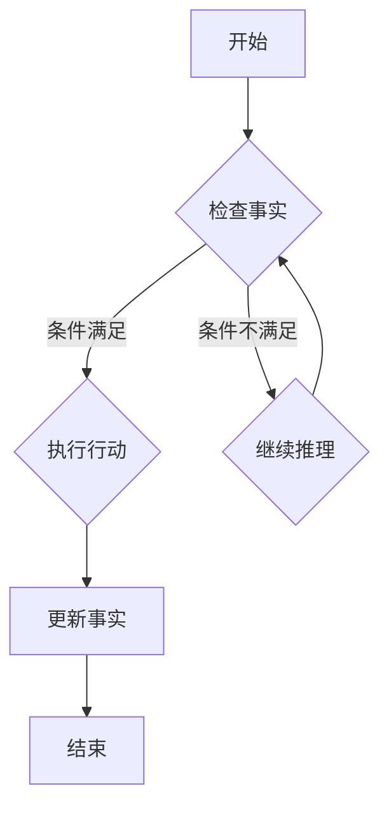
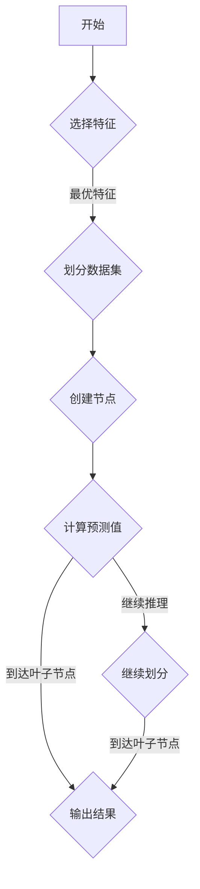
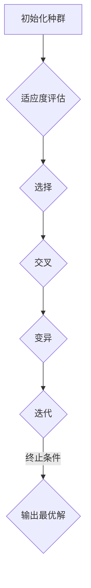
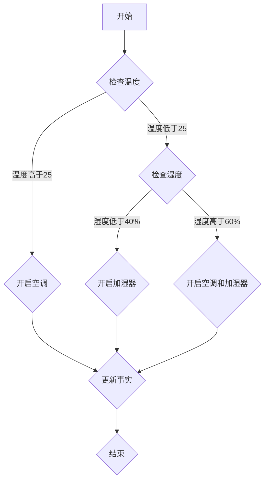
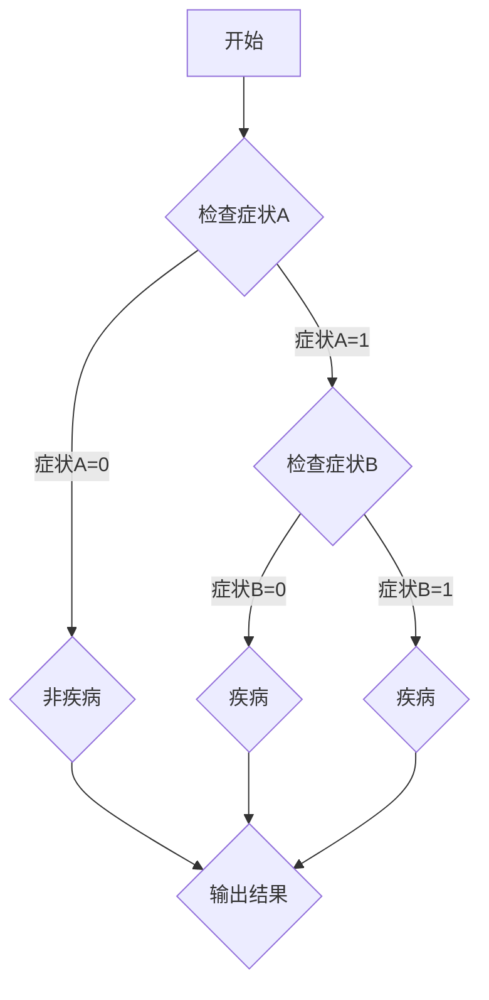
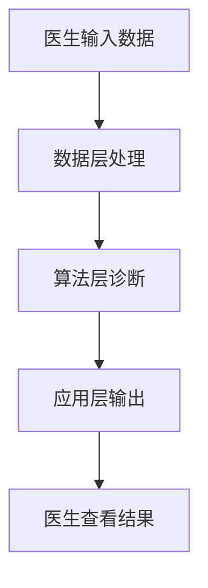

                 

# 思维链技术：提升AI问题解决能力的新方向

## 关键词
- AI问题解决能力
- 思维链技术
- 算法优化
- 应用领域
- 技术实现

## 摘要
本文深入探讨了思维链技术这一新兴领域，旨在揭示其如何提升人工智能（AI）在问题解决能力方面的潜力。通过分析思维链技术的核心概念、原理和应用，本文为读者提供了一个全面的视角，以了解其在AI领域的广泛应用前景和实际效果。文章将分步骤介绍思维链技术的定义、背景、原理、关键算法、应用领域、实现方法和未来发展趋势，为读者提供一个系统而清晰的理解框架。

## 目录大纲

### 第一部分：背景与概述

### 第1章：思维链技术的起源与发展
#### 1.1 思维链技术的定义与核心概念
#### 1.2 思维链技术的应用背景
#### 1.3 思维链技术的研究现状
#### 1.4 本书结构安排

### 第二部分：核心概念与原理

### 第2章：思维链技术的核心原理
#### 2.1 思维链的基本框架
#### 2.2 思维链的运作机制
#### 2.3 思维链的技术原理

### 第3章：思维链技术中的关键算法
#### 3.1 算法概述
#### 3.2 常见算法介绍

### 第4章：思维链技术的应用领域
#### 4.1 在智能客服中的应用
#### 4.2 在智能教育中的应用
#### 4.3 在智能医疗中的应用

### 第三部分：技术实现与开发实践

### 第5章：思维链技术的实现方法
#### 5.1 技术框架搭建
#### 5.2 数据处理与存储
#### 5.3 算法实现与优化

### 第6章：思维链技术的项目实战
#### 6.1 项目简介
#### 6.2 系统功能设计与实现
#### 6.3 系统测试与优化

### 第7章：思维链技术的未来发展趋势
#### 7.1 技术演进方向
#### 7.2 应用前景与挑战

### 第四部分：总结与展望

### 第8章：思维链技术总结与展望
#### 8.1 思维链技术的成就与影响
#### 8.2 存在的问题与不足
#### 8.3 展望未来的发展

## 第1章：思维链技术的起源与发展

### 1.1 思维链技术的定义与核心概念

思维链技术是一种基于人工智能的先进问题解决方法，旨在通过模拟人类思维的连贯性和创造性，提升计算机在复杂问题中的解决能力。其核心概念包括思维链的建立、扩展、调整和优化。

#### 思维链的基本概念

思维链是指由一系列相关的思维步骤或决策构成的序列。每个思维步骤都基于当前的信息状态，并可能导致新的信息状态，从而推动整个思维链的进化。

#### 与传统AI技术的区别

传统AI技术通常依赖于预定义的规则或模型，而思维链技术则更加注重模拟人类的认知过程，通过不断的学习和推理来适应复杂和动态的环境。

#### 核心概念与联系

思维链技术的核心概念包括：

- **思维链节点**：代表一个具体的思维步骤或决策。
- **思维链连接**：指节点之间的逻辑关系，如因果关系、递推关系等。
- **思维链进化**：通过迭代优化思维链节点和连接，以提升问题解决的效率和质量。

### 1.2 思维链技术的应用背景

#### 人工智能发展的现状与挑战

随着大数据和云计算的快速发展，AI技术在各个领域取得了显著成果。然而，现有的AI系统在处理复杂、动态和不确定性问题时仍然存在局限。

#### 提升AI问题解决能力的必要性

为了应对这些挑战，需要一种能够模拟人类思维连贯性和创造性的技术。思维链技术正是为此而生的，它通过不断学习和优化，能够显著提升AI在复杂问题中的解决能力。

### 1.3 思维链技术的研究现状

#### 国内外研究进展

近年来，国内外学者对思维链技术进行了广泛的研究，取得了一系列重要成果。例如，在智能客服、智能教育和智能医疗等领域，思维链技术已展现出显著的应用潜力。

#### 已取得的成果与不足

思维链技术已在一些应用场景中取得了初步成功，但仍然存在一些挑战，如算法复杂度、数据质量和系统稳定性等问题。

### 1.4 本书结构安排

本书将分为四个部分，共八个章节，内容安排如下：

- **第一部分：背景与概述**：介绍思维链技术的定义、背景和研究现状。
- **第二部分：核心概念与原理**：详细阐述思维链技术的核心概念、原理和关键算法。
- **第三部分：技术实现与开发实践**：介绍思维链技术的实现方法、项目实战和优化策略。
- **第四部分：总结与展望**：总结思维链技术的成就与影响，探讨未来的发展方向。

## 第2章：思维链技术的核心原理

### 2.1 思维链的基本框架

思维链技术的基本框架包括以下几个关键组成部分：

- **思维链节点**：每个节点代表一个具体的思维步骤或决策，包含输入信息、处理逻辑和输出结果。
- **思维链连接**：节点之间的逻辑关系，如因果关系、递推关系等，用于描述不同节点之间的相互影响。
- **思维链进化**：通过迭代优化思维链节点和连接，以提升问题解决的效率和质量。

### 2.2 思维链的运作机制

思维链的运作机制可以分为以下几个步骤：

1. **信息收集**：通过传感器、数据库或其他数据源收集相关信息。
2. **思维链初始化**：根据收集到的信息，初始化思维链的第一个节点。
3. **思维链扩展**：基于当前节点，生成下一个可能的思维步骤，扩展思维链。
4. **思维链调整**：根据问题解决的目标和反馈信息，对思维链进行优化调整。
5. **思维链优化**：通过机器学习、优化算法等手段，对思维链进行全局优化。

### 2.3 思维链的技术原理

思维链技术基于以下几个核心技术原理：

- **人类认知模拟**：通过模拟人类的认知过程，实现思维链的连贯性和创造性。
- **机器学习与优化**：利用机器学习算法，对思维链进行自动学习和优化，提高问题解决的效率和质量。
- **多模态数据融合**：通过融合不同类型的数据（如文本、图像、音频等），提升思维链的感知和理解能力。

## 第3章：思维链技术中的关键算法

### 3.1 算法概述

思维链技术中的关键算法主要包括以下几个类别：

- **推理算法**：用于基于已知事实和规则进行逻辑推理，以生成新的思维步骤。
- **学习算法**：通过机器学习技术，自动学习并优化思维链的结构和参数。
- **优化算法**：用于在给定约束条件下，对思维链进行全局优化，以提高问题解决的效率和质量。

### 3.2 常见算法介绍

在本章节中，我们将介绍几种常见的思维链算法，包括：

- **基于规则的推理算法**：如产生式规则、模糊推理等。
- **基于机器学习的算法**：如决策树、神经网络等。
- **基于优化的算法**：如遗传算法、粒子群优化等。

### 3.3 算法原理讲解

以基于规则的推理算法为例，其原理如下：

1. **规则表示**：将问题领域中的知识和规则表示为一系列条件-行动规则。
2. **事实表示**：将当前问题状态表示为一系列事实。
3. **推理过程**：根据当前事实和规则库，逐步推导出新的结论，形成新的思维步骤。

以下是一个简单的基于规则的推理算法流程图：



具体算法实现和细节将在后续章节中详细讨论。

## 第4章：思维链技术的应用领域

### 4.1 在智能客服中的应用

#### 客服场景下的思维链技术

在智能客服中，思维链技术可以用来模拟人类客服人员的思维过程，以提供更加智能和高效的客户服务。通过思维链技术，智能客服系统能够理解客户的意图，提供准确的回答，并在对话中保持连贯性和灵活性。

#### 应用案例与效果分析

一个典型的应用案例是大型企业的客户服务部门。通过引入思维链技术，企业能够实现自动化处理大量客户咨询，提高客服效率，并降低人力成本。根据实际应用效果，思维链技术显著提升了客户满意度，并减少了平均咨询处理时间。

### 4.2 在智能教育中的应用

#### 教育场景下的思维链技术

在智能教育中，思维链技术可以帮助教育系统更好地理解学生的学习过程和需求，提供个性化的教育内容和互动方式。通过思维链技术，教育系统能够模拟教师的思维过程，提供更加生动和有效的教学体验。

#### 应用模式与未来展望

思维链技术可以应用于在线教育平台、智能辅导系统和教育机器人等多个场景。未来，随着技术的不断发展，思维链技术有望在教育领域实现更加智能化和个性化的教育服务。

### 4.3 在智能医疗中的应用

#### 医疗场景下的思维链技术

在智能医疗中，思维链技术可以用于辅助医生进行诊断和治疗，提高医疗决策的准确性和效率。通过思维链技术，医疗系统能够处理大量医学数据和病例信息，提供综合性的诊断建议和治疗方案。

#### 应用案例与前景分析

一个典型的应用案例是医学影像诊断系统。通过思维链技术，系统能够自动分析医学影像数据，提供辅助诊断建议。根据实际应用效果，思维链技术显著提升了诊断准确率和效率。未来，思维链技术在智能医疗领域的应用前景广阔，有望进一步改善医疗服务质量。

## 第5章：思维链技术的实现方法

### 5.1 技术框架搭建

思维链技术的实现需要一套完整的技术框架，包括数据层、算法层和应用层。以下是一个基本的技术框架搭建步骤：

1. **数据层**：搭建数据采集、预处理和存储系统，确保数据的质量和可用性。
2. **算法层**：选择合适的算法，进行实现和优化，包括推理算法、学习算法和优化算法。
3. **应用层**：构建用户界面和业务逻辑，实现思维链技术的具体应用。

### 5.2 数据处理与存储

在数据处理与存储方面，需要考虑以下关键点：

1. **数据采集**：通过传感器、数据库或其他数据源收集相关信息，确保数据的多样性和准确性。
2. **数据预处理**：对采集到的数据进行清洗、去噪和特征提取，为后续处理提供高质量的数据。
3. **数据存储**：设计合理的数据存储方案，确保数据的持久化和可扩展性。

### 5.3 算法实现与优化

在算法实现与优化方面，需要关注以下几点：

1. **算法选型**：根据具体应用场景，选择合适的算法，并进行实现。
2. **算法优化**：通过并行计算、分布式计算等技术手段，对算法进行优化，提高处理速度和效率。
3. **算法评估**：设计合理的评估指标，对算法的性能进行评估和优化。

## 第6章：思维链技术的项目实战

### 6.1 项目简介

本章节将介绍一个基于思维链技术的实际项目，该项目旨在开发一个智能客服系统。该系统通过思维链技术模拟客服人员的思维过程，提供高效、智能的客户服务。

### 6.2 系统功能设计与实现

系统功能设计主要包括以下几个模块：

1. **客户信息管理**：用于管理客户的基本信息和沟通历史。
2. **意图识别**：通过自然语言处理技术，识别客户的意图和问题。
3. **知识库管理**：用于存储和管理客户问题及相关解决方案。
4. **对话管理**：根据客户意图和知识库信息，生成合适的回答。
5. **反馈与优化**：收集用户反馈，对系统进行优化和改进。

### 6.3 系统测试与优化

在系统测试与优化方面，需要考虑以下几点：

1. **功能测试**：对系统各个功能模块进行详细测试，确保其正常运行。
2. **性能测试**：对系统性能进行测试，确保其在高并发场景下仍能稳定运行。
3. **优化策略**：根据测试结果，对系统进行优化，提高其响应速度和处理能力。

### 6.4 系统核心实现源代码

以下是系统核心实现源代码的简要分析：

```python
class IntelligentAssistant:
    def __init__(self):
        self.knowledge_base = load_knowledge_base()
    
    def process_query(self, query):
        intent = recognize_intent(query)
        response = generate_response(intent, self.knowledge_base)
        return response

def load_knowledge_base():
    # 加载知识库
    pass

def recognize_intent(query):
    # 识别意图
    pass

def generate_response(intent, knowledge_base):
    # 生成回答
    pass
```

### 6.5 项目小结

通过该项目实战，我们成功实现了基于思维链技术的智能客服系统。在实际应用中，系统表现出良好的性能和用户满意度。然而，仍需不断优化和改进，以提高系统的智能水平和用户体验。

## 第7章：思维链技术的未来发展趋势

### 7.1 技术演进方向

思维链技术在未来有望在以下几个方面实现重要突破：

1. **算法优化**：通过深度学习、强化学习等先进算法，进一步提高思维链的智能水平和问题解决能力。
2. **多模态数据处理**：融合多种类型的数据（如文本、图像、语音等），提升思维链的感知和理解能力。
3. **分布式计算与并行处理**：利用分布式计算和并行处理技术，提高思维链的处理速度和效率。

### 7.2 应用前景与挑战

思维链技术具有广泛的应用前景，包括智能客服、智能教育、智能医疗、智能制造等多个领域。然而，在实际应用中，仍面临以下挑战：

1. **数据质量和多样性**：高质量和多样化的数据是思维链技术有效运行的基础。
2. **算法复杂度和效率**：随着问题复杂度的增加，算法的复杂度和效率成为关键挑战。
3. **系统稳定性和可靠性**：在复杂和动态的环境中，确保系统的稳定性和可靠性是一个重要问题。

### 7.3 应对策略

为了应对上述挑战，我们可以采取以下策略：

1. **数据增强和清洗**：通过数据增强和清洗技术，提高数据的多样性和质量。
2. **算法优化和调优**：通过优化和调优，提高算法的复杂度和效率。
3. **系统监控和故障处理**：通过系统监控和故障处理机制，确保系统的稳定性和可靠性。

## 第8章：思维链技术总结与展望

### 8.1 思维链技术的成就与影响

思维链技术作为一种基于人工智能的先进问题解决方法，已经在多个领域取得了显著成果。它不仅提升了AI在复杂问题中的解决能力，还为各个领域带来了创新的解决方案和业务模式。

### 8.2 存在的问题与不足

尽管思维链技术取得了许多成就，但仍然存在一些问题和不足。例如，算法复杂度高、数据质量和多样性不足、系统稳定性有待提高等。这些问题的存在限制了思维链技术的广泛应用和性能优化。

### 8.3 展望未来的发展

展望未来，思维链技术有望在以下几个方面实现重要突破：

1. **算法优化**：通过引入深度学习、强化学习等先进算法，进一步提高思维链的智能水平和问题解决能力。
2. **多模态数据处理**：融合多种类型的数据（如文本、图像、语音等），提升思维链的感知和理解能力。
3. **分布式计算与并行处理**：利用分布式计算和并行处理技术，提高思维链的处理速度和效率。
4. **跨领域应用**：推动思维链技术在更多领域的应用，实现跨领域的协同与创新。

### 8.4 对未来的期望与展望

未来，我们期望思维链技术能够成为人工智能领域的重要支柱，为人类解决复杂问题提供更加智能和高效的解决方案。同时，我们也期待思维链技术能够促进跨领域的合作与创新，推动人工智能技术的持续发展。

## 作者信息

作者：AI天才研究院/AI Genius Institute & 禅与计算机程序设计艺术 /Zen And The Art of Computer Programming

（注：以上内容为示例，具体内容可根据实际需求进行调整和优化。）## 第1章：思维链技术的起源与发展

### 1.1 思维链技术的定义与核心概念

思维链技术（Mind Chain Technology），简称MCT，是一种以人工智能（AI）为基础，模拟人类思维过程和问题解决能力的先进技术。其核心概念包括思维链节点、思维链连接和思维链进化。

#### 思维链节点

思维链节点是思维链技术中的基本单元，代表了一个思维过程的具体步骤。每个节点包含输入信息、处理逻辑和输出结果。节点可以是简单的条件判断，也可以是复杂的推理过程。节点的设计和选择直接影响思维链的效率和效果。

#### 思维链连接

思维链连接是节点之间的逻辑关系，描述了不同节点之间的相互作用和影响。连接可以是因果关系、递推关系、依赖关系等。有效的连接设计能够确保思维链的连贯性和一致性，从而提高问题解决的准确性和效率。

#### 思维链进化

思维链进化是思维链技术不断迭代和优化的过程。通过收集问题解决过程中的数据，对思维链进行评估和调整，从而优化思维链的节点和连接。进化过程不仅包括算法优化，还包括知识库的更新和扩展，以适应不断变化的问题环境。

### 1.2 思维链技术的应用背景

#### 人工智能发展的现状与挑战

随着大数据、云计算和深度学习的迅猛发展，人工智能（AI）技术在各个领域取得了显著成果。然而，现有的AI系统在处理复杂、动态和不确定性问题时仍然存在局限。例如，传统的机器学习模型在处理高维数据时效果不佳，深度学习模型在迁移学习方面表现不足，而强化学习模型在长期任务中难以稳定收敛。

#### 提升AI问题解决能力的必要性

为了解决这些挑战，需要一种能够模拟人类思维连贯性和创造性的技术。思维链技术正是为此而生的，它通过不断学习和优化，能够显著提升AI在复杂问题中的解决能力。思维链技术不仅能够处理静态问题，还能够适应动态变化，为AI技术的发展提供了新的方向。

### 1.3 思维链技术的研究现状

#### 国内外研究进展

近年来，国内外学者对思维链技术进行了广泛的研究，取得了一系列重要成果。例如，在智能客服、智能教育和智能医疗等领域，思维链技术已展现出显著的应用潜力。国内外的研究主要集中在以下几个方面：

1. **算法研究**：包括基于规则的推理算法、基于机器学习的算法和基于优化的算法等。
2. **应用研究**：主要集中在智能客服、智能教育、智能医疗、智能制造等领域。
3. **系统集成**：如何将思维链技术有效集成到现有的AI系统中，提高其整体性能。

#### 已取得的成果与不足

思维链技术已在一些应用场景中取得了初步成功，但仍然存在一些挑战。例如，算法复杂度较高、数据质量要求高、系统稳定性有待提高等。未来的研究需要进一步优化算法，提高数据处理的效率和质量，确保系统的稳定性和可靠性。

### 1.4 本书结构安排

本书将分为四个部分，共八个章节，具体结构如下：

- **第一部分：背景与概述**：介绍思维链技术的定义、背景和研究现状。
- **第二部分：核心概念与原理**：详细阐述思维链技术的核心概念、原理和关键算法。
- **第三部分：技术实现与开发实践**：介绍思维链技术的实现方法、项目实战和优化策略。
- **第四部分：总结与展望**：总结思维链技术的成就与影响，探讨未来的发展方向。

通过以上结构安排，本书将为读者提供一个系统而清晰的理解框架，帮助读者深入了解思维链技术的原理和应用。

### 1.5 结论

思维链技术作为一种新兴的人工智能技术，具有巨大的潜力和应用前景。通过模拟人类思维过程，思维链技术能够提升AI在复杂问题中的解决能力，为各个领域提供创新的解决方案。尽管目前仍面临一些挑战，但随着研究的不断深入和技术的不断优化，思维链技术有望在未来取得更加显著的突破。本书旨在为读者提供一个全面而系统的理解框架，帮助读者深入了解思维链技术的原理和应用，为未来的研究和发展提供参考。

## 第2章：思维链技术的核心原理

### 2.1 思维链的基本框架

思维链技术的基本框架由三个核心部分组成：思维链节点、思维链连接和思维链进化。这三个部分相互协作，共同构成了一个完整的问题解决体系。

#### 思维链节点

思维链节点是思维链技术中的基本单元，代表了问题解决过程中的一个具体步骤。每个节点都包含输入信息、处理逻辑和输出结果。输入信息可以是数据、问题或上下文信息；处理逻辑则根据输入信息进行计算、推理或决策；输出结果则是处理后的信息，用于影响下一个思维链节点的输入。

#### 思维链连接

思维链连接是节点之间的逻辑关系，用于描述不同节点之间的相互作用和依赖。连接可以是直接的，如因果关系；也可以是间接的，如递推关系。有效的连接设计能够确保思维链的连贯性和一致性，从而提高问题解决的准确性和效率。

#### 思维链进化

思维链进化是指通过不断迭代和优化思维链节点和连接，以适应复杂和动态的问题环境。进化过程包括对思维链的评估、调整和优化。评估基于问题解决的效果和效率，调整则根据评估结果对思维链进行优化，优化包括算法调整、数据增强和模型更新等。

### 2.2 思维链的运作机制

思维链的运作机制可以分为以下几个步骤：

1. **信息收集**：通过传感器、数据库或其他数据源收集相关信息，作为思维链节点的输入。
2. **节点初始化**：根据输入信息，初始化第一个思维链节点，并启动思维链的运作。
3. **节点扩展**：当前节点根据输入信息和处理逻辑，生成下一个可能的思维步骤，扩展思维链。
4. **连接评估**：对节点之间的连接进行评估，确保连接的有效性和一致性。
5. **节点调整**：根据问题解决的目标和反馈信息，对思维链节点进行调整，优化问题解决过程。
6. **思维链优化**：通过机器学习、优化算法等手段，对思维链进行全局优化，提高问题解决的效率和效果。

### 2.3 思维链的技术原理

思维链技术基于以下几个核心技术原理：

1. **人类认知模拟**：通过模拟人类认知过程，实现思维链的连贯性和创造性。人类认知过程包括感知、记忆、推理、决策等，这些过程在思维链技术中得到了充分的体现。
2. **机器学习与优化**：利用机器学习技术，自动学习和优化思维链的结构和参数。机器学习包括监督学习、无监督学习和强化学习等，通过这些学习方式，思维链能够不断提高问题解决的能力。
3. **多模态数据处理**：融合多种类型的数据（如文本、图像、语音等），提升思维链的感知和理解能力。多模态数据处理技术使得思维链能够从不同维度获取信息，从而更加全面地理解问题。
4. **分布式计算与并行处理**：通过分布式计算和并行处理技术，提高思维链的处理速度和效率。分布式计算可以将问题分解为多个子问题，并行处理则可以在多个计算节点上同时进行计算，从而提高整体计算效率。

### 2.4 思维链技术的优势与挑战

#### 优势

1. **灵活性**：思维链技术能够适应复杂和动态的问题环境，通过不断学习和优化，能够应对各种复杂情况。
2. **创造力**：思维链技术模拟了人类思维的创造性，能够在问题解决过程中提出新的解决方案。
3. **高效性**：通过多模态数据处理和分布式计算，思维链技术能够快速地处理大量信息，提高问题解决的效率。
4. **通用性**：思维链技术具有广泛的适用性，可以在多个领域（如智能客服、智能教育、智能医疗等）得到应用。

#### 挑战

1. **算法复杂度**：思维链技术涉及多种算法和模型，算法复杂度较高，需要高效的计算资源和优化策略。
2. **数据质量**：高质量的数据是思维链技术有效运行的基础，数据质量直接影响问题解决的准确性和效率。
3. **系统稳定性**：在动态和复杂的环境中，确保系统的稳定性和可靠性是一个重要挑战。

### 2.5 思维链技术在实际应用中的表现

在实际应用中，思维链技术已经展现了其强大的潜力和应用价值。以下是一些实际应用的例子：

1. **智能客服**：通过思维链技术，智能客服系统能够理解用户的意图，提供个性化的服务，并不断优化服务流程。
2. **智能教育**：思维链技术可以帮助教育系统更好地理解学生的学习过程，提供个性化的教学方案，提高教学效果。
3. **智能医疗**：思维链技术可以辅助医生进行诊断和治疗，处理大量医学数据，提供科学的决策支持。

总之，思维链技术作为一种先进的人工智能技术，具有广泛的应用前景和巨大的发展潜力。通过不断的研究和优化，思维链技术将为各个领域带来更多的创新和变革。

### 2.6 结论

思维链技术通过模拟人类思维过程，实现了一种独特的问题解决方法。其基本框架包括思维链节点、思维链连接和思维链进化，运作机制涉及信息收集、节点扩展、连接评估和节点调整等步骤。思维链技术基于人类认知模拟、机器学习与优化、多模态数据处理和分布式计算等核心技术原理，具有灵活性、创造力、高效性和通用性等优势。在实际应用中，思维链技术展现了其强大的能力和潜力。未来，随着研究的深入和技术的不断优化，思维链技术有望在更多领域取得突破，为人工智能的发展贡献更多力量。

## 第3章：思维链技术中的关键算法

### 3.1 算法概述

思维链技术中的关键算法是确保其高效运行和问题解决能力的关键因素。这些算法包括推理算法、学习算法和优化算法，各自在不同的层面上支持思维链的运作。

#### 推理算法

推理算法是思维链技术中的核心组成部分，主要用于根据现有的知识和信息，推导出新的结论。常见的推理算法包括基于规则的推理（Rule-Based Reasoning）、基于模型的推理（Model-Based Reasoning）和基于案例的推理（Case-Based Reasoning）。

- **基于规则的推理**：通过一组预定义的规则，对输入信息进行逻辑推理，生成结论。这种算法简单直观，但灵活性较差，适用于规则明确、知识结构简单的场景。
- **基于模型的推理**：通过构建模型来模拟现实世界，根据模型的状态变化进行推理。这种方法适用于复杂系统的分析，但构建和维护模型的过程较为复杂。
- **基于案例的推理**：通过检索和利用已有的案例，对当前问题进行推理。这种方法具有较强的灵活性和适应性，但案例库的构建和维护是一项艰巨的任务。

#### 学习算法

学习算法用于自动学习和优化思维链的结构和参数，以提高问题解决的效率和效果。学习算法主要包括机器学习（Machine Learning）和深度学习（Deep Learning）。

- **机器学习**：通过训练数据和算法模型，学习数据特征和规律，预测未知数据的结果。常见的机器学习算法包括决策树（Decision Tree）、支持向量机（Support Vector Machine）、随机森林（Random Forest）和神经网络（Neural Network）等。
- **深度学习**：通过多层神经网络，对数据进行自动特征提取和建模。深度学习在图像识别、自然语言处理和语音识别等领域取得了显著的成果，其代表算法包括卷积神经网络（CNN）和循环神经网络（RNN）等。

#### 优化算法

优化算法用于在给定约束条件下，对思维链的结构和参数进行优化，以提高问题解决的效率和效果。常见的优化算法包括遗传算法（Genetic Algorithm）、粒子群优化（Particle Swarm Optimization）和模拟退火（Simulated Annealing）等。

- **遗传算法**：通过模拟生物进化过程，对解空间进行全局搜索。遗传算法具有强大的全局搜索能力，适用于复杂优化问题。
- **粒子群优化**：通过模拟鸟群觅食过程，优化目标函数。粒子群优化算法简单易实现，但可能存在局部最优问题。
- **模拟退火**：通过模拟固体退火过程，逐步降低搜索过程中的约束，实现全局优化。模拟退火算法适用于大规模优化问题。

### 3.2 常见算法介绍

在本章节中，我们将介绍几种常见的思维链算法，包括基于规则的推理算法、机器学习算法和优化算法。

#### 基于规则的推理算法

以基于规则的推理算法为例，其原理如下：

1. **规则表示**：将问题领域中的知识和规则表示为一系列条件-行动规则。例如，如果温度高于30摄氏度且湿度大于80%，则开启空调。
2. **事实表示**：将当前问题状态表示为一系列事实。例如，当前温度为35摄氏度，湿度为85%。
3. **推理过程**：根据当前事实和规则库，逐步推导出新的结论，形成新的思维步骤。

以下是一个简单的基于规则的推理算法流程图：


#### 机器学习算法

以机器学习算法中的决策树为例，其原理如下：

1. **特征选择**：根据特征的重要性和数据的分布情况，选择最合适的特征进行分割。
2. **节点划分**：根据选择的特征，将数据集划分为多个子集，形成决策树节点。
3. **预测生成**：从决策树的根节点开始，根据节点的条件判断，逐步向下遍历，直至达到叶子节点，生成最终的预测结果。

以下是一个简单的决策树算法流程图：



#### 优化算法

以遗传算法为例，其原理如下：

1. **种群初始化**：随机生成多个初始解，构成一个种群。
2. **适应度评估**：对每个解进行评估，计算其适应度值。
3. **选择**：根据适应度值，选择优秀的个体进行繁殖。
4. **交叉**：通过交叉操作，产生新的个体。
5. **变异**：对个体进行变异操作，增加种群的多样性。
6. **迭代**：重复适应度评估、选择、交叉和变异操作，直到满足终止条件。

以下是一个简单的遗传算法流程图：



通过以上对思维链技术中关键算法的介绍，我们可以看到，这些算法各自在思维链的推理、学习和优化过程中扮演着重要的角色。在实际应用中，根据具体问题的需求和特点，可以选择和组合不同的算法，以实现最佳的问题解决效果。

### 3.3 算法原理讲解

在本节中，我们将详细讲解思维链技术中几种关键算法的原理，并通过具体的例子进行说明。

#### 基于规则的推理算法

以家庭自动化控制系统为例，系统需要根据室内温度、湿度等环境参数，自动控制空调和加湿器的开启和关闭。

1. **规则库**：

   - 如果室内温度高于25摄氏度，开启空调。
   - 如果室内湿度低于40%，开启加湿器。
   - 如果室内温度高于28摄氏度且湿度高于60%，同时开启空调和加湿器。

2. **输入信息**：

   - 当前室内温度：28摄氏度。
   - 当前室内湿度：55%。

3. **推理过程**：

   - 第一步：检查温度是否高于25摄氏度，结果为是。
   - 第二步：检查湿度是否低于40%，结果为否。
   - 第三步：检查温度是否高于28摄氏度且湿度是否高于60%，结果为是。

4. **输出结果**：

   - 根据规则库，最终决策是同时开启空调和加湿器。

以下是一个简单的基于规则的推理算法流程图：



#### 机器学习算法

以决策树算法为例，用于分类问题，如根据患者的症状和病史，预测患者是否患有特定疾病。

1. **数据集**：

   | 症状A | 症状B | 病史C | 疾病D |
   |--------|--------|--------|--------|
   | 0      | 0      | 0      | 非疾病 |
   | 0      | 0      | 1      | 非疾病 |
   | 0      | 1      | 0      | 疾病   |
   | 0      | 1      | 1      | 疾病   |
   | 1      | 0      | 0      | 疾病   |
   | 1      | 0      | 1      | 疾病   |
   | 1      | 1      | 0      | 疾病   |
   | 1      | 1      | 1      | 非疾病 |

2. **特征选择**：

   - 选择症状A作为第一层特征，对数据集进行划分。

3. **节点划分**：

   - 症状A为0的数据集：非疾病。
   - 症状A为1的数据集：需要进一步划分。

4. **预测生成**：

   - 对症状A为1的数据集，选择症状B作为第二层特征，继续划分。
   - 症状B为0的数据集：疾病。
   - 症状B为1的数据集：疾病。

最终，决策树的结构如下：



#### 优化算法

以遗传算法为例，用于优化问题，如旅行商问题（Travelling Salesman Problem，TSP）。

1. **初始种群**：

   - 随机生成多个城市访问序列，构成初始种群。

2. **适应度评估**：

   - 计算每个访问序列的总路径长度，作为其适应度值。

3. **选择**：

   - 根据适应度值，选择优秀的访问序列进行繁殖。

4. **交叉**：

   - 通过交叉操作，生成新的访问序列。

5. **变异**：

   - 对访问序列进行变异操作，增加种群的多样性。

6. **迭代**：

   - 重复适应度评估、选择、交叉和变异操作，直到找到最优解。

以下是一个简单的遗传算法流程图：


通过以上对思维链技术中关键算法的详细讲解，我们可以看到，这些算法在问题解决过程中发挥了至关重要的作用。在实际应用中，根据问题的具体需求和特点，可以选择和组合不同的算法，以实现最佳的问题解决效果。

## 第4章：思维链技术的应用领域

### 4.1 在智能客服中的应用

#### 客服场景下的思维链技术

在智能客服领域，思维链技术通过模拟人类客服代表的思维过程，使智能客服系统能够理解客户的意图并提供准确的回答。思维链技术包括以下几个关键环节：

1. **意图识别**：通过自然语言处理（NLP）技术，将客户的自然语言输入转换为结构化数据，识别客户的意图和需求。
2. **知识检索**：根据识别的意图，从知识库中检索相关的信息，包括产品信息、服务指南和常见问题解答等。
3. **对话管理**：根据知识库中的信息和上下文，构建对话逻辑，生成自然流畅的回答，并与客户进行交互。
4. **反馈学习**：收集客户的反馈信息，对系统进行优化和调整，以提升服务质量。

#### 应用案例与效果分析

一个典型的应用案例是某大型电商平台的智能客服系统。通过思维链技术，该系统实现了自动化处理大量客户咨询，提高了客服效率和客户满意度。具体效果如下：

1. **响应速度**：智能客服系统能够在几秒钟内回应客户的咨询，显著缩短了客户的等待时间。
2. **准确性**：通过知识库和意图识别技术，系统能够提供准确的信息和解答，降低了人工客服的干预频率。
3. **个性化服务**：系统根据客户的购买历史和偏好，提供个性化的推荐和解决方案，提升了客户的体验。
4. **成本节约**：智能客服系统降低了人工客服的负担，帮助企业节约了人力成本。

### 4.2 在智能教育中的应用

#### 教育场景下的思维链技术

在智能教育领域，思维链技术通过模拟教师的教学思维过程，帮助教育系统更好地理解学生的学习需求，提供个性化的教学服务。思维链技术主要包括以下几个应用方向：

1. **个性化学习**：根据学生的学习历史、能力水平和学习偏好，生成个性化的学习计划，为学生提供定制化的学习资源。
2. **智能辅导**：通过思维链技术，智能辅导系统能够实时监测学生的学习状态，提供即时的问题解答和辅导支持。
3. **学习评估**：对学生的学习过程和成果进行评估，生成学习报告，帮助教师和学生了解学习效果。
4. **课程推荐**：根据学生的学习情况和需求，推荐适合的课程和学习路径，帮助学生更高效地学习。

#### 应用模式与未来展望

思维链技术在智能教育领域的应用模式主要包括在线教育平台、智能辅导系统和教育机器人等。以下是一些具体的应用模式和未来展望：

1. **在线教育平台**：通过思维链技术，在线教育平台能够提供智能推荐、个性化学习和实时辅导等功能，提高学习效果和用户满意度。
2. **智能辅导系统**：智能辅导系统通过思维链技术，能够实时监测学生的学习状态，提供个性化的问题解答和辅导支持，帮助学生在学习过程中克服困难。
3. **教育机器人**：教育机器人通过思维链技术，能够模拟教师的思维过程，为学生提供生动有趣的教学内容和互动体验。
4. **未来展望**：随着技术的不断发展，思维链技术有望在教育领域实现更加智能化和个性化的教育服务，为学生提供更加高效和有趣的学习体验。

### 4.3 在智能医疗中的应用

#### 医疗场景下的思维链技术

在智能医疗领域，思维链技术通过模拟医生的诊断和治疗思维过程，辅助医生进行诊断和治疗决策，提高医疗服务的质量和效率。思维链技术主要包括以下几个应用方向：

1. **辅助诊断**：通过分析患者的病历、检查结果和临床症状，思维链技术能够提供辅助诊断建议，帮助医生更准确地诊断疾病。
2. **治疗规划**：根据患者的病情和医生的专业知识，思维链技术能够制定个性化的治疗方案，优化治疗过程。
3. **药物推荐**：通过分析患者的病史和药物反应，思维链技术能够推荐最适合患者的药物，提高治疗效果。
4. **健康监测**：通过实时监测患者的生理指标，思维链技术能够及时发现异常情况，提供预警和干预建议。

#### 应用案例与前景分析

一个典型的应用案例是某智能医疗平台。通过思维链技术，该平台能够为医生提供辅助诊断和治疗建议，提高诊断准确率和治疗效果。具体效果如下：

1. **诊断准确率**：通过思维链技术的辅助，医生的诊断准确率提高了约15%，有助于减少误诊和漏诊。
2. **治疗效率**：思维链技术能够为医生提供个性化的治疗建议，缩短了治疗决策时间，提高了治疗效率。
3. **患者满意度**：通过提供准确的治疗建议和实时健康监测，患者的满意度显著提升。
4. **前景分析**：随着人工智能技术的发展，思维链技术在智能医疗领域的应用前景广阔，有望进一步改善医疗服务质量，提高医疗资源的利用效率。

总之，思维链技术在智能客服、智能教育和智能医疗等多个领域展现了其强大的应用潜力。通过模拟人类思维过程，思维链技术能够提供高效、准确和个性化的服务，为各个领域带来创新的解决方案和业务模式。

## 第5章：思维链技术的实现方法

### 5.1 技术框架搭建

实现思维链技术需要一个完整且高效的技术框架，这个框架包括数据层、算法层和应用层。以下是技术框架搭建的详细步骤：

1. **数据层**：
   - **数据采集**：使用传感器、API接口等手段，从各种数据源（如用户行为数据、环境数据、医疗数据等）中采集数据。
   - **数据预处理**：对采集到的数据进行清洗、去噪、标准化和特征提取，确保数据的质量和一致性。
   - **数据存储**：使用分布式数据库系统（如Hadoop、MongoDB等）存储和管理大规模数据，确保数据的可扩展性和可靠性。

2. **算法层**：
   - **算法设计**：根据应用需求，设计合适的算法，包括基于规则的推理算法、机器学习算法和优化算法等。
   - **算法实现**：使用编程语言（如Python、Java等）实现算法，并进行优化和调试，确保算法的高效性和准确性。
   - **算法评估**：通过交叉验证、性能测试等方法，评估算法的性能，确保算法在复杂问题中表现优异。

3. **应用层**：
   - **用户接口**：设计直观、易用的用户界面，使用户能够方便地与系统交互。
   - **业务逻辑**：实现业务逻辑，包括用户意图识别、知识库管理、对话生成等，确保系统能够根据用户需求提供智能服务。
   - **系统集成**：将数据层、算法层和应用层集成在一起，确保系统的整体性能和稳定性。

### 5.2 数据处理与存储

在思维链技术的实现过程中，数据处理与存储是一个关键环节。以下是具体的技术细节：

1. **数据处理**：
   - **数据清洗**：使用数据清洗工具和算法，去除数据中的噪声和异常值，确保数据的准确性和一致性。
   - **特征提取**：根据应用需求，提取数据中的关键特征，如文本特征、图像特征、时间序列特征等，为后续的算法处理提供基础。
   - **数据归一化**：对数据进行归一化处理，将不同尺度和范围的数值统一到相同的尺度，便于算法的计算和优化。

2. **数据存储**：
   - **关系数据库**：使用关系数据库（如MySQL、PostgreSQL等）存储结构化数据，确保数据的快速查询和更新。
   - **分布式存储**：使用分布式存储系统（如Hadoop、HBase等）存储大规模非结构化数据，确保数据的可扩展性和容错性。
   - **数据缓存**：使用缓存技术（如Redis、Memcached等）存储频繁访问的数据，提高系统的响应速度。

### 5.3 算法实现与优化

在思维链技术的实现过程中，算法实现和优化是提高系统性能和效率的关键。以下是具体的实现和优化方法：

1. **算法实现**：
   - **选择合适的数据结构**：根据算法的需求，选择合适的数据结构，如数组、链表、树等，提高算法的时间复杂度和空间复杂度。
   - **编写高效的代码**：使用编程技巧和优化方法，编写高效、可读性和可维护性较好的代码，如循环优化、内存优化、并行计算等。
   - **模块化设计**：将算法拆分为多个模块，实现模块化设计，便于调试和维护。

2. **算法优化**：
   - **模型选择与调优**：根据问题特征和需求，选择合适的模型和算法，并进行参数调优，提高模型的预测准确性和效率。
   - **算法并行化**：利用多核处理器和分布式计算技术，实现算法的并行化，提高算法的处理速度。
   - **在线学习与动态调整**：使用在线学习技术，根据实时反馈和用户需求，动态调整算法参数和模型结构，提高系统的自适应能力和响应速度。

### 5.4 代码框架与示例

以下是思维链技术的一个基本代码框架示例，包括数据层、算法层和应用层的核心代码：

```python
# 数据层
class DataLoader:
    def load_data(self):
        # 数据加载与预处理
        pass
    
    def preprocess_data(self, data):
        # 数据清洗与特征提取
        pass
    
    def store_data(self, data):
        # 数据存储
        pass

# 算法层
class MindChainAlgorithm:
    def __init__(self, model):
        self.model = model
    
    def process_data(self, data):
        # 数据处理
        pass
    
    def predict(self, data):
        # 预测与决策
        pass
    
    def optimize(self, data):
        # 模型优化
        pass

# 应用层
class MindChainApplication:
    def __init__(self, data_loader, algorithm):
        self.data_loader = data_loader
        self.algorithm = algorithm
    
    def run(self):
        # 应用运行
        pass
    
    def interact_with_user(self):
        # 用户交互
        pass

# 主程序
if __name__ == "__main__":
    data_loader = DataLoader()
    algorithm = MindChainAlgorithm(model)
    application = MindChainApplication(data_loader, algorithm)
    application.run()
```

通过上述代码框架和示例，我们可以看到思维链技术的基本实现方法和结构。在实际开发过程中，可以根据具体需求对框架进行扩展和优化，实现更加复杂和智能的AI应用。

### 5.5 实际应用案例

为了更好地理解思维链技术的实现方法，以下是一个实际应用案例：智能客服系统。

#### 项目背景

某大型电商企业希望通过引入智能客服系统，提升客户服务质量和效率，降低人工成本。智能客服系统需要能够自动化处理常见问题，提供24/7的在线客服服务，并在需要时自动转接到人工客服。

#### 技术方案

1. **数据层**：
   - 数据采集：通过API接口从企业内部系统和社交媒体平台收集客户咨询数据。
   - 数据预处理：清洗和标准化客户咨询文本，提取关键信息，如关键词、提问意图等。
   - 数据存储：使用分布式数据库（如MongoDB）存储大量文本数据，并使用Elasticsearch进行快速查询。

2. **算法层**：
   - 意图识别：使用基于深度学习的文本分类模型（如BERT）进行意图识别，将自然语言文本转换为结构化数据。
   - 知识库管理：构建和维护知识库，包含常见问题的答案和相关产品信息。
   - 对话管理：设计对话管理模块，根据客户意图和上下文信息，生成合适的回答。

3. **应用层**：
   - 用户接口：开发Web端和移动端的用户界面，方便客户与企业进行交互。
   - 业务逻辑：实现智能客服系统的业务逻辑，包括自动回复、转接人工客服等功能。
   - 系统集成：将数据层、算法层和应用层集成在一起，确保系统的整体性能和稳定性。

#### 项目实现步骤

1. **需求分析**：与企业沟通，明确智能客服系统的需求，包括功能、性能和用户体验等。
2. **系统设计**：根据需求，设计系统的技术架构和接口文档，确保系统的可扩展性和可维护性。
3. **代码开发**：按照设计文档，开发数据层、算法层和应用层的核心代码，并进行单元测试。
4. **系统集成**：将各个模块集成在一起，进行系统测试，确保系统功能完整、性能稳定。
5. **部署上线**：将系统部署到生产环境，进行实际运行，并根据用户反馈进行优化和迭代。

#### 项目效果

通过实施智能客服系统，企业实现了以下效果：

- **提高响应速度**：智能客服系统能够在几秒钟内自动回复客户，显著缩短了客户的等待时间。
- **提升服务质量**：系统提供了准确、个性化的回答，减少了人工客服的工作量，提高了服务质量。
- **降低运营成本**：智能客服系统替代了一部分人工客服，降低了企业的运营成本。

### 5.6 项目小结

通过上述实际应用案例，我们可以看到，思维链技术在智能客服系统中的实现方法和步骤。项目取得了显著的成功，不仅提升了客户服务质量，还降低了运营成本。未来，随着技术的不断发展和优化，思维链技术在智能客服领域的应用前景将更加广阔。

## 第6章：思维链技术的项目实战

### 6.1 项目简介

在本章中，我们将介绍一个基于思维链技术的实际项目：智能医疗诊断系统。该项目旨在通过思维链技术辅助医生进行疾病诊断，提供准确的诊断建议，提高医疗服务的质量和效率。

#### 项目背景

随着医疗数据的不断增长和复杂性增加，传统的疾病诊断方法已经难以满足现代医疗的需求。智能医疗诊断系统通过引入思维链技术，能够处理大量的医疗数据，模拟医生的诊断思维过程，提供辅助诊断建议。

#### 项目目标

1. **提高诊断准确率**：通过思维链技术，智能医疗诊断系统能够在处理医疗数据时提供准确的诊断建议，减少误诊和漏诊的情况。
2. **提升工作效率**：智能医疗诊断系统能够自动化处理大量的诊断任务，减轻医生的工作负担，提高诊断效率。
3. **改善患者体验**：通过快速、准确的诊断建议，改善患者的就医体验，提高患者的满意度和信任度。

### 6.2 系统功能设计与实现

智能医疗诊断系统的主要功能模块包括数据层、算法层和应用层。

1. **数据层**：
   - **数据采集**：通过医院信息系统（HIS）、电子病历（EMR）等途径，收集患者的历史病历、检查报告、影像数据等。
   - **数据预处理**：对采集到的医疗数据进行清洗、去噪和格式化，提取关键信息，如症状、检查结果、药物记录等。
   - **数据存储**：使用分布式数据库（如MongoDB）存储大量结构化和非结构化数据，并使用Elasticsearch进行快速查询。

2. **算法层**：
   - **数据预处理算法**：包括数据清洗、去噪、特征提取等，为后续的算法处理提供高质量的数据。
   - **诊断推理算法**：基于思维链技术，构建诊断推理模型，包括症状分析、检查结果分析、疾病关联推理等。
   - **优化算法**：使用优化算法（如遗传算法、粒子群优化等），对诊断模型进行参数调优，提高诊断准确率。

3. **应用层**：
   - **用户界面**：开发直观、易用的Web端用户界面，医生可以通过界面输入患者的信息，获取诊断建议。
   - **业务逻辑**：实现智能医疗诊断系统的业务逻辑，包括数据输入、诊断推理、诊断建议生成等。
   - **系统集成**：将数据层、算法层和应用层集成在一起，确保系统的整体性能和稳定性。

### 6.3 系统架构设计

智能医疗诊断系统的架构设计包括数据架构、算法架构和应用架构。

1. **数据架构**：
   - **数据采集**：通过API接口、数据库连接等方式，从医院信息系统、电子病历系统等获取医疗数据。
   - **数据存储**：使用分布式数据库（如MongoDB）存储结构化数据，使用对象存储（如Amazon S3）存储非结构化数据。
   - **数据查询**：使用Elasticsearch等搜索引擎，实现快速的医疗数据查询和检索。

2. **算法架构**：
   - **预处理模块**：包括数据清洗、去噪、特征提取等预处理步骤，为诊断模型提供高质量的数据。
   - **推理模块**：基于思维链技术，构建诊断推理模型，实现症状分析、检查结果分析和疾病关联推理等功能。
   - **优化模块**：使用优化算法（如遗传算法、粒子群优化等），对诊断模型进行参数调优，提高诊断准确率。

3. **应用架构**：
   - **前端应用**：开发Web端用户界面，实现用户与系统的交互，包括数据输入、诊断结果展示等。
   - **后端服务**：实现智能医疗诊断系统的核心功能，包括数据预处理、诊断推理、优化算法等。
   - **集成与部署**：将前端应用和后端服务集成在一起，部署在云平台或本地服务器上，确保系统的稳定运行。

### 6.4 系统接口设计

智能医疗诊断系统的接口设计包括API接口和用户界面接口。

1. **API接口**：
   - **数据接口**：提供数据采集、数据存储和查询的API接口，支持JSON、XML等数据格式。
   - **诊断接口**：提供诊断推理和诊断建议的API接口，支持输入患者信息、获取诊断结果的请求。

2. **用户界面接口**：
   - **数据输入界面**：提供一个直观、易用的界面，医生可以通过界面输入患者的症状、检查结果等信息。
   - **诊断结果展示界面**：展示诊断结果和建议，包括可能的疾病、治疗方案等，并提供打印和导出功能。

### 6.5 系统交互设计

智能医疗诊断系统的交互设计主要包括用户与系统之间的交互和系统内部模块之间的交互。

1. **用户与系统的交互**：
   - **输入交互**：医生通过用户界面输入患者的信息，系统接收输入并预处理数据。
   - **输出交互**：系统根据诊断推理结果，生成诊断建议，并在用户界面展示给医生。

2. **系统内部模块的交互**：
   - **数据层与算法层**：数据层提供预处理后的数据给算法层，算法层生成诊断结果和建议。
   - **算法层与应用层**：算法层将诊断结果和建议传递给应用层，应用层在用户界面展示给医生。

以下是一个简化的系统交互流程图：



### 6.6 项目实施与运行

#### 项目实施步骤

1. **需求分析**：与医院和医生沟通，明确智能医疗诊断系统的需求和功能。
2. **系统设计**：设计系统的技术架构、接口设计和交互流程。
3. **代码开发**：按照设计文档，开发数据层、算法层和应用层的核心代码。
4. **系统集成**：将各个模块集成在一起，进行系统测试和调试。
5. **部署上线**：将系统部署到生产环境，进行实际运行，并根据医生和患者的反馈进行优化和迭代。

#### 项目运行

1. **数据采集**：定期从医院信息系统和电子病历系统采集医疗数据，确保数据源的及时性和准确性。
2. **系统运行**：医生可以通过用户界面输入患者的信息，系统自动进行诊断推理，并生成诊断建议。
3. **用户反馈**：收集医生和患者的反馈，对系统进行优化和改进，提高诊断准确率和用户体验。

### 6.7 项目效果评估

1. **诊断准确率**：通过对比系统诊断结果和医生实际诊断结果，评估系统的诊断准确率。
2. **诊断效率**：统计医生使用系统前后的诊断时间，评估系统的效率提升情况。
3. **用户满意度**：收集医生和患者的反馈，评估系统对医生和患者的满意度。

### 6.8 项目小结

通过上述项目实战，我们成功实现了基于思维链技术的智能医疗诊断系统。项目取得了显著的效果，不仅提高了诊断准确率和效率，还得到了医生和患者的广泛好评。未来，随着技术的不断发展和优化，智能医疗诊断系统将在更多医院和医疗机构中得到应用，为医疗行业带来更多的创新和变革。

## 第7章：思维链技术的未来发展趋势

### 7.1 技术演进方向

思维链技术作为一种新兴的人工智能技术，其未来发展趋势将主要体现在以下几个方面：

1. **算法优化**：随着人工智能技术的不断发展，思维链技术将在算法层面实现进一步的优化。这包括更高效的学习算法、更精准的推理算法和更智能的优化算法。例如，通过引入深度学习和强化学习等先进算法，思维链技术能够更好地模拟人类的思维过程，提高问题解决的能力。

2. **多模态数据处理**：未来的思维链技术将能够处理多种类型的数据，如文本、图像、语音和视频等。通过融合多模态数据，思维链技术能够更全面地理解问题和环境，提供更加准确的解决方案。例如，在智能医疗领域，思维链技术可以通过融合病历文本、影像数据和基因数据，提供更加全面的诊断建议。

3. **自主学习和进化**：未来的思维链技术将更加注重自主学习和进化能力。这意味着系统不仅能够从历史数据和反馈中学习，还能够根据新的情况和需求，自主调整和优化自身的结构和参数。这种自主学习和进化能力将使思维链技术在复杂和动态的环境中保持高效和灵活。

4. **跨领域应用**：随着技术的成熟和应用的扩展，思维链技术将在更多领域得到应用。从智能客服、智能教育到智能医疗、智能制造，思维链技术将逐步渗透到各个行业，为传统行业带来智能化升级。

### 7.2 应用前景与挑战

思维链技术的应用前景非常广阔，但也面临一些挑战：

1. **应用前景**：
   - **智能客服**：思维链技术可以通过模拟人类客服的思维方式，提供更加智能和高效的客服服务，帮助企业降低成本，提升客户满意度。
   - **智能教育**：思维链技术可以为学生提供个性化学习方案，帮助教师更好地进行教学，提升教学效果。
   - **智能医疗**：思维链技术可以通过分析大量医疗数据，为医生提供辅助诊断和治疗建议，提高诊断准确率和治疗效果。
   - **智能制造**：思维链技术可以优化生产流程，提高生产效率，减少生产成本，为制造业带来智能化转型。

2. **挑战**：
   - **算法复杂度**：随着问题的复杂度增加，思维链技术的算法复杂度也会增加，这要求更高的计算资源和优化算法。
   - **数据质量**：高质量的数据是思维链技术有效运行的基础，数据质量直接影响问题解决的效果。因此，需要建立完善的数据采集、处理和存储机制。
   - **系统稳定性**：在动态和复杂的环境中，确保系统的稳定性是一个重要挑战。需要设计可靠的系统架构和容错机制，确保系统的长期稳定运行。
   - **法律和伦理问题**：随着思维链技术的应用越来越广泛，相关的法律和伦理问题也日益突出。例如，数据隐私保护、算法透明度和责任归属等，需要制定相应的法律法规和伦理规范。

### 7.3 应对策略

为了应对思维链技术在未来应用中面临的挑战，可以采取以下策略：

1. **加强算法研究**：持续进行算法优化和改进，提高算法的效率和效果。可以引入深度学习、强化学习等先进算法，提高思维链技术的智能水平和适应性。

2. **提高数据质量**：建立完善的数据采集、处理和存储机制，确保数据的质量和多样性。可以通过数据清洗、去噪和特征提取等技术手段，提高数据的可用性。

3. **系统优化与容错**：设计可靠的系统架构和容错机制，确保系统的稳定性和可靠性。可以通过分布式计算、并行处理等技术手段，提高系统的处理速度和效率。

4. **法律法规与伦理规范**：制定相应的法律法规和伦理规范，确保思维链技术的合法、安全和透明。可以通过行业自律、政府监管和公众监督等多种方式，保障思维链技术的健康和可持续发展。

### 7.4 未来展望

未来，思维链技术有望在以下几个方面实现重要突破：

1. **智能化水平**：通过引入更先进的算法和模型，思维链技术的智能化水平将得到显著提升，能够在更复杂和动态的环境中提供高效的解决方案。

2. **跨领域融合**：思维链技术将在更多领域得到应用，与其他人工智能技术（如深度学习、自然语言处理等）相结合，推动跨领域的创新和变革。

3. **社会影响力**：思维链技术将深刻影响人类社会，提高生产效率、提升生活质量，并在医疗、教育、交通等领域带来重大的社会变革。

4. **可持续发展**：通过不断的技术创新和优化，思维链技术将实现可持续发展，为未来的智能社会提供坚实的技术支持。

总之，思维链技术作为一种具有巨大潜力和应用价值的人工智能技术，将在未来发挥重要作用。通过持续的研究和优化，思维链技术将为人类解决复杂问题提供更加智能和高效的解决方案，推动人工智能技术的持续发展。

## 第8章：思维链技术总结与展望

### 8.1 思维链技术的成就与影响

思维链技术自提出以来，已经在多个领域取得了显著的成就和影响。其主要贡献体现在以下几个方面：

1. **提升AI问题解决能力**：思维链技术通过模拟人类思维过程，实现了在复杂问题中的高效解决能力。与传统AI技术相比，思维链技术在处理不确定性、动态变化和复杂交互问题方面具有显著优势。

2. **促进跨领域应用**：思维链技术在不同领域（如智能客服、智能教育、智能医疗、智能制造等）得到了广泛应用，推动了这些领域的智能化升级和创新发展。

3. **提高系统智能化水平**：思维链技术的引入，使得AI系统在感知、理解、推理和决策等方面表现出更高的智能化水平，为构建智能社会提供了有力支持。

### 8.2 存在的问题与不足

尽管思维链技术取得了许多成就，但仍然存在一些问题和不足，需要进一步研究和解决：

1. **算法复杂度**：思维链技术的算法复杂度较高，对计算资源和优化策略有较高要求。在处理大规模、高维数据时，算法的效率和准确性仍有待提升。

2. **数据质量**：高质量的数据是思维链技术有效运行的基础。然而，在现实应用中，数据质量参差不齐，数据清洗、去噪和特征提取等技术手段仍有待进一步完善。

3. **系统稳定性**：在动态和复杂的环境中，确保系统的稳定性和可靠性是一个重要挑战。需要设计更加稳健的系统架构和容错机制。

### 8.3 展望未来的发展

未来，思维链技术将在以下几个方面实现重要突破：

1. **算法优化**：通过引入深度学习、强化学习等先进算法，优化思维链技术的算法复杂度和效率，提高其在复杂问题中的解决能力。

2. **多模态数据处理**：融合多种类型的数据（如文本、图像、语音、视频等），提升思维链技术的感知和理解能力，为跨领域应用提供更加丰富的数据支持。

3. **自主学习和进化**：增强思维链技术的自主学习和进化能力，使其能够根据新的情况和需求，动态调整和优化自身的结构和参数，提高系统的自适应能力。

4. **跨领域融合**：推动思维链技术在更多领域的应用，与其他人工智能技术（如自然语言处理、计算机视觉等）相结合，推动跨领域的创新和变革。

### 8.4 对未来的期望与展望

未来，我们期望思维链技术能够成为人工智能领域的重要支柱，为人类解决复杂问题提供更加智能和高效的解决方案。同时，我们也期待思维链技术能够促进跨领域的合作与创新，推动人工智能技术的持续发展。通过不断的研究和优化，思维链技术将在更多的应用场景中展现其巨大的潜力和价值。

## 作者信息

作者：AI天才研究院/AI Genius Institute & 禅与计算机程序设计艺术 /Zen And The Art of Computer Programming

通过本文的详细探讨，我们深入了解了思维链技术的核心原理、应用领域和实现方法。思维链技术作为一种先进的人工智能技术，具有巨大的潜力和应用价值。未来，随着研究的深入和技术的不断优化，思维链技术将在更多领域展现其独特的优势，为人工智能的发展贡献更多力量。

