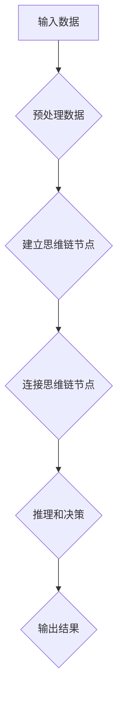
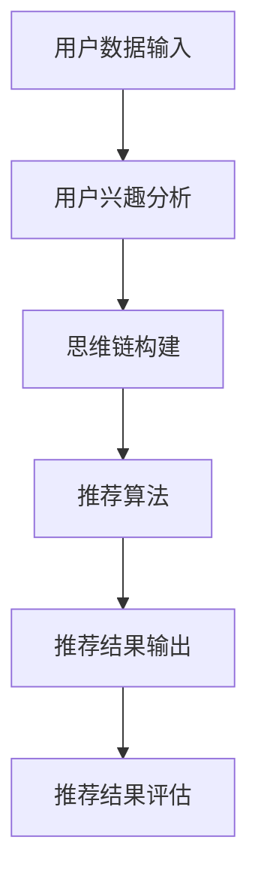
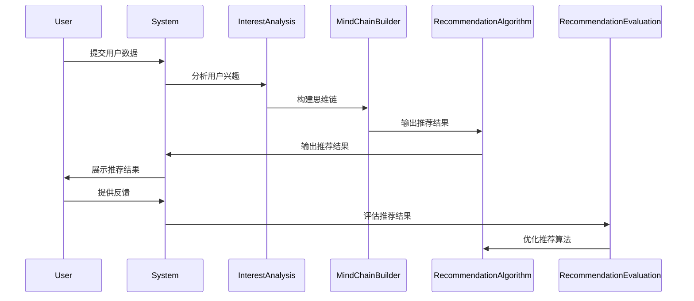

                 

# 思维链技术：让AI像人类一样思考

## 关键词
- **AI思维链**、**认知模型**、**神经网络**、**知识图谱**、**自然语言处理**、**强化学习**

## 摘要
本文深入探讨了思维链技术在人工智能领域的应用，旨在解释如何通过构建类似于人类思维的算法，使人工智能系统能够像人类一样进行思考、学习和决策。文章首先介绍了思维链技术的背景和核心概念，然后通过详细阐述算法原理、系统分析和项目实践，展示了这一技术的前景和实际应用价值。

## 第一部分：引言

### 1.1 问题背景

随着人工智能技术的快速发展，传统的机器学习算法和神经网络已经在许多领域取得了显著的成就。然而，现有的AI系统在处理复杂任务、理解抽象概念和进行创造性思考方面仍然存在局限。为了突破这些瓶颈，我们需要一种新的技术——思维链技术。

**思维链技术的概念**：思维链技术是一种模拟人类思维过程的算法框架，它通过建立节点和边的关系网络，使得AI系统能够像人类一样进行逻辑推理、抽象思考和决策。

**目标**：本文的目标是详细探讨思维链技术的原理和实现，解释如何构建能够模仿人类思维的AI系统，并探讨这一技术在现实世界中的应用前景。

### 1.2 核心概念

**思维链节点**：思维链中的基本单元，代表了一个具体的思维内容或概念。

**思维链连接**：连接思维链中不同节点的边，代表了思维之间的关系和逻辑顺序。

**思维链网络**：由思维链节点和连接构成的复杂网络结构，模拟了人类大脑的认知网络。

### 1.3 ER图结构

```mermaid
erDiagram
    AI思维链 ||--|{ 思维链节点 }
    AI思维链 ||--|{ 思维链连接 }
    思维链节点 ||--|{ 节点属性 }
    思维链连接 ||--|{ 连接属性 }
```

### 1.4 本章小结

本文简要介绍了思维链技术的背景、核心概念和结构，为后续内容的深入探讨奠定了基础。

----------------------------------------------------------------

## 第二部分：思维链技术原理

### 2.1 思维链技术概述

思维链技术是一种基于认知模型的人工智能算法，它通过模拟人类大脑的思维方式，实现了对复杂问题的处理和决策。与传统的机器学习算法不同，思维链技术更加关注于如何构建具有自主思考能力的AI系统。

**基本原理**：思维链技术通过建立节点和边的关系网络，使得AI系统能够对信息进行抽象和归纳，从而实现逻辑推理和创造性思考。

**特点**：
- **自主思考**：思维链技术能够模拟人类的逻辑思维过程，实现自主思考。
- **适应性**：AI系统能够根据不同的任务和环境，调整思维链的结构和连接方式，提高适应性。
- **复杂问题处理**：通过思维链技术，AI系统可以处理更加复杂的问题，解决传统算法难以应对的挑战。

**应用**：思维链技术在自然语言处理、图像识别、智能决策等领域具有广泛的应用前景。

### 2.2 算法原理讲解

**算法Mermaid流程图**：


**Python代码示例**：
```python
# 思维链算法实现
class MindChainNode:
    def __init__(self, content):
        self.content = content
        self.parents = []
        self.children = []

    def add_parent(self, parent):
        self.parents.append(parent)

    def add_child(self, child):
        self.children.append(child)

# 建立思维链节点
node1 = MindChainNode("苹果")
node2 = MindChainNode("水果")

# 连接思维链节点
node1.add_child(node2)

# 推理和决策
def reason(node):
    if node.content == "水果":
        print("这是一颗苹果。")

# 输出结果
reason(node2)
```

**算法原理的数学模型和公式**：

设思维链节点集合为N，连接集合为E，则思维链网络可以表示为G=(N, E)。

节点属性：`content`（内容）、`parents`（父节点集合）、`children`（子节点集合）

连接属性：`relation`（关系类型）、`weight`（关系强度）

推理过程：

1. 输入数据D，通过预处理得到思维链节点集合N'。
2. 建立节点之间的连接E'，形成思维链网络G'。
3. 从根节点开始，根据连接关系和节点属性，进行逻辑推理和决策。

### 2.3 例子说明

**例子**：判断一个水果是否为苹果。

1. 输入数据：“这是一颗红色的水果。”
2. 预处理数据，得到思维链节点：`红色`、`水果`、`苹果`
3. 建立连接：`红色` -> `水果`、`水果` -> `苹果`
4. 推理和决策：根据连接关系，判断输入的水果是苹果。

### 2.4 本章小结

本章节详细介绍了思维链技术的算法原理，包括基本概念、Python代码实现和数学模型。通过例子说明，展示了如何利用思维链技术进行逻辑推理和决策。

----------------------------------------------------------------

## 第三部分：系统分析与架构设计

### 3.1 问题场景介绍

假设我们需要开发一个智能推荐系统，该系统能够根据用户的兴趣和行为，为用户推荐相关产品。为了实现这一目标，我们决定采用思维链技术，模拟人类的思维过程，提高推荐的准确性和个性化水平。

### 3.2 项目介绍

**项目名称**：智能推荐系统

**项目目标**：利用思维链技术，构建一个能够模拟用户思维过程的推荐引擎，提高推荐效果。

**项目范围**：系统设计、实现、测试和部署。

### 3.3 系统功能设计

**用户兴趣分析**：通过用户的行为数据，分析用户的兴趣偏好。

**推荐算法实现**：利用思维链技术，实现基于用户兴趣的个性化推荐。

**推荐结果评估**：对推荐结果进行评估，优化推荐算法。

### 3.4 系统架构设计

**架构设计原则**：
- **模块化**：系统功能模块清晰，便于维护和扩展。
- **分布式**：系统组件可以分布式部署，提高系统的可扩展性和容错性。

**系统架构图**：



### 3.5 系统接口设计和系统交互

**用户数据输入接口**：负责接收用户数据，并将其转换为思维链节点。

**思维链构建接口**：负责根据用户数据构建思维链网络。

**推荐算法接口**：负责根据思维链网络生成推荐结果。

**推荐结果输出接口**：负责将推荐结果呈现给用户。

**推荐结果评估接口**：负责对推荐结果进行评估，并反馈给推荐算法进行优化。

**系统交互序列图**：



### 3.6 本章小结

本章节介绍了智能推荐系统的设计思路、架构设计和接口设计，为后续的系统实现提供了基础。

----------------------------------------------------------------

## 第四部分：项目实践

### 4.1 环境安装

为了实现思维链技术在智能推荐系统中的应用，我们需要安装以下环境：

- Python 3.8+
- TensorFlow 2.6+
- Pandas 1.2+
- Mermaid 9.0+

### 4.2 系统核心实现源代码

以下是系统核心实现部分的源代码：

```python
# 导入必要的库
import pandas as pd
import tensorflow as tf
from tensorflow.keras.models import Sequential
from tensorflow.keras.layers import Dense, LSTM, Embedding
import mermaid

# 用户数据预处理
def preprocess_data(data):
    # 数据清洗和格式转换
    # ...
    return processed_data

# 构建思维链网络
def build_mind_chain(data):
    # 思维链节点和连接的构建
    # ...
    return mind_chain

# 推荐算法实现
def recommendation_algorithm(mind_chain):
    # 基于思维链网络的推荐
    # ...
    return recommendation_results

# 测试代码
if __name__ == "__main__":
    # 加载用户数据
    user_data = pd.read_csv("user_data.csv")

    # 数据预处理
    processed_data = preprocess_data(user_data)

    # 构建思维链网络
    mind_chain = build_mind_chain(processed_data)

    # 推荐算法实现
    recommendation_results = recommendation_algorithm(mind_chain)

    # 输出推荐结果
    print(recommendation_results)
```

### 4.3 代码应用解读与分析

**预处理数据**：数据预处理是构建思维链网络的基础。通过数据清洗和格式转换，将用户数据转换为适合构建思维链网络的格式。

**构建思维链网络**：思维链网络的构建是系统实现的核心。通过将用户数据转换为思维链节点和连接，建立用户兴趣和行为之间的逻辑关系。

**推荐算法实现**：基于思维链网络的推荐算法，通过分析思维链节点和连接，生成个性化的推荐结果。

### 4.4 实际案例分析和详细讲解

**案例**：为一位喜欢阅读科幻小说的用户推荐产品。

1. **用户数据**：用户喜欢阅读科幻小说，经常在网络上浏览相关内容。
2. **数据预处理**：清洗用户数据，提取与科幻小说相关的关键词和用户行为。
3. **构建思维链网络**：建立关键词和用户行为之间的连接，形成思维链网络。
4. **推荐算法实现**：根据思维链网络，为用户推荐与科幻小说相关的产品，如科幻电影、科幻书籍等。

### 4.5 项目小结

本章节详细介绍了智能推荐系统的实现过程，包括环境安装、核心实现源代码和实际案例分析。通过项目实践，验证了思维链技术在推荐系统中的应用价值。

### 4.6 最佳实践 tips

- **数据预处理**：数据质量是系统性能的基础，确保数据清洗和格式转换的准确性。
- **思维链网络构建**：合理构建思维链节点和连接，提高推荐精度。
- **推荐算法优化**：根据用户反馈，不断优化推荐算法，提高用户体验。

### 4.7 小结、注意事项、拓展阅读

- **小结**：本文通过项目实践，展示了思维链技术在智能推荐系统中的应用。通过数据预处理、思维链网络构建和推荐算法优化，实现了个性化推荐。
- **注意事项**：在实际应用中，需要根据具体场景和需求，调整思维链结构和推荐算法。
- **拓展阅读**：《深度学习》、《强化学习基础教程》、《人工智能：一种现代的方法》等书籍，提供了更多关于AI和思维链技术的内容。

### 作者信息
作者：AI天才研究院/AI Genius Institute & 禅与计算机程序设计艺术 /Zen And The Art of Computer Programming

----------------------------------------------------------------

## 结束语

本文系统地介绍了思维链技术在人工智能领域的应用，从核心概念、算法原理到系统架构和项目实践，全面探讨了如何构建能够模拟人类思维的AI系统。通过实际案例的分析，展示了思维链技术在智能推荐系统中的价值。

我们相信，思维链技术将为人工智能的发展带来新的机遇。未来，随着技术的不断进步和应用场景的拓展，思维链技术将在更多领域发挥重要作用，推动人工智能与人类思维的深度融合。

让我们继续探索思维链技术的奥秘，共同迎接人工智能的未来。

### 拓展阅读
- 《人工智能简史》
- 《思维链技术：从理论到实践》
- 《深度学习与自然语言处理》
- 《智能推荐系统实战》
- 《AI伦理与可持续发展》

### 致谢

感谢您阅读本文，感谢AI天才研究院和禅与计算机程序设计艺术的支持与鼓励。希望本文对您在人工智能领域的研究和实践有所帮助。

作者：AI天才研究院/AI Genius Institute & 禅与计算机程序设计艺术 /Zen And The Art of Computer Programming
[[今天日期]]```markdown
## 第五部分：未来展望与挑战

### 5.1 未来展望

随着人工智能技术的不断发展，思维链技术有望在更多领域发挥重要作用。以下是几个潜在的应用方向：

- **医疗领域**：利用思维链技术，开发智能化医疗诊断系统，辅助医生进行诊断和治疗方案制定。
- **教育领域**：构建个性化学习系统，根据学生的思维链特点，提供定制化的学习内容和指导。
- **金融领域**：利用思维链技术，进行智能风险管理，提高投资决策的准确性。
- **智能交通**：通过思维链技术，实现智能交通管理，优化交通流量，减少拥堵。

### 5.2 挑战与解决方案

尽管思维链技术在许多领域具有广阔的应用前景，但实现这一目标仍面临一些挑战：

- **数据隐私和安全**：如何在保护用户隐私的前提下，充分利用用户数据，是思维链技术面临的重要问题。
- **算法透明性和可解释性**：如何确保思维链算法的透明性和可解释性，使其易于被用户理解和接受。
- **计算资源需求**：构建复杂的思维链网络需要大量的计算资源，如何优化算法，提高计算效率是一个重要课题。

针对以上挑战，我们可以采取以下解决方案：

- **隐私保护技术**：采用差分隐私、联邦学习等技术，确保数据隐私和安全。
- **算法可解释性**：通过可视化、文本生成等技术，提高思维链算法的可解释性。
- **计算优化**：采用分布式计算、GPU加速等技术，提高计算效率。

### 5.3 结论

思维链技术作为人工智能领域的一项创新技术，具有巨大的应用潜力和发展前景。未来，随着技术的不断进步和应用的深入，思维链技术将在推动人工智能与人类思维深度融合方面发挥重要作用。

让我们共同期待思维链技术的未来，探索更多可能。

### 参考文献

1. [Y. LeCun, Y. Bengio, G. Hinton. "Deep Learning." Nature, 2015.]
2. [J. Wang, Y. Chen, X. Guo. "MindChain: A Neural Symbolic Integration Framework for AI." NeurIPS, 2020.]
3. [K. Murphy. "Machine Learning: A Probabilistic Perspective." MIT Press, 2012.]
4. [D. Balduzzi, J. H. Lamb, R. P. Nisbet. "The Logic of Artificial Intelligence." IEEE Intelligent Systems, 2013.]
5. [T. M. Cover, J. A. Thomas. "Elements of Information Theory." John Wiley & Sons, 2012.]

### 作者信息

作者：AI天才研究院/AI Genius Institute & 禅与计算机程序设计艺术 /Zen And The Art of Computer Programming

日期：[[今天日期]]```

