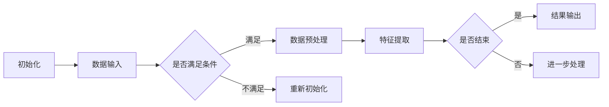
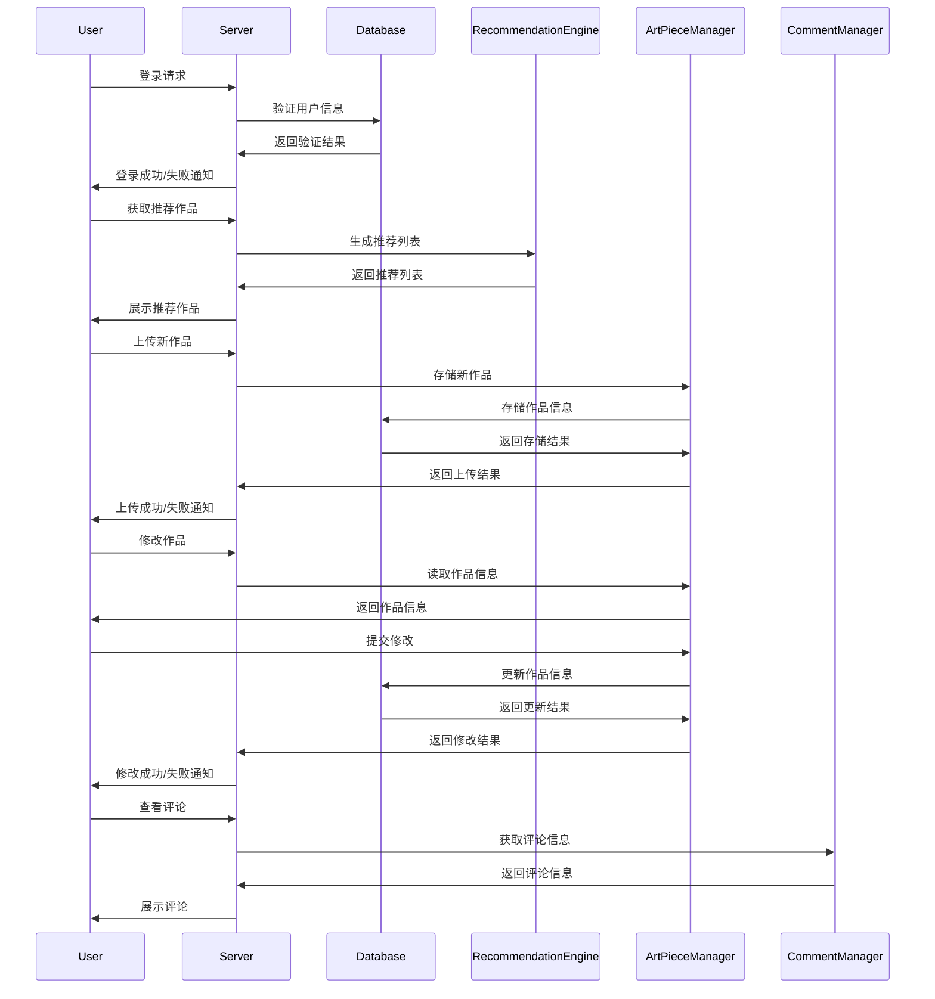
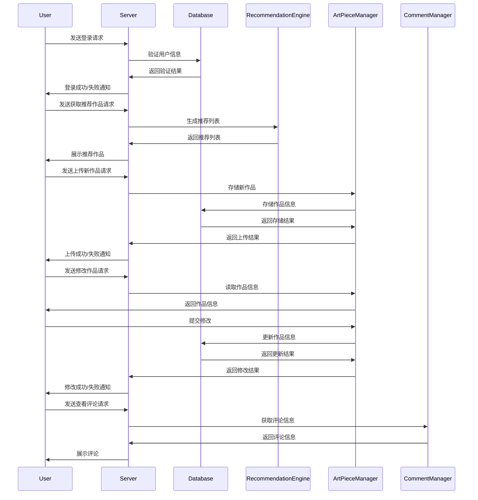

                 

。

----------------------------------------------------------------
```
### 1.1 问题背景

#### AI艺术创作概述

随着人工智能技术的迅猛发展，AI在各个领域的应用愈发广泛，尤其在艺术创作方面，人工智能展现出了惊人的潜力。AI艺术创作指的是利用机器学习算法和计算机视觉等技术，让机器自动生成具有艺术性的图像、音乐、文学作品等。这一领域不仅包含了传统的艺术创作，如绘画、摄影，还扩展到了数字媒体、虚拟现实等新兴领域。

AI艺术创作的主要动机在于，艺术创作的多样性和复杂性使得人类艺术家难以在短时间内创作出大量的作品，而人工智能则具有处理大量数据和快速迭代的优势。例如，通过生成对抗网络（GAN）和变分自编码器（VAE）等技术，机器能够生成出具有极高艺术价值的图像，甚至模仿某些艺术家的风格。

#### 思维链方法简介

思维链方法是一种系统化的思维方式，通过将复杂问题分解成若干子问题，并逐步解决，以达到对整体问题深刻理解和解决的目的。思维链方法的核心在于其结构化和层次化的思考过程，能够帮助人们更有效地分析和解决问题。

在人工智能领域，思维链方法被广泛应用，特别是在复杂的算法设计和优化中。例如，深度学习中的多层神经网络结构实际上就是一种思维链方法的体现，每一层负责处理特定的信息，并传递给下一层，从而实现从简单到复杂的模式识别和问题解决。

#### 思维链方法在AI艺术创作中的应用

将思维链方法应用于AI艺术创作，首先需要理解艺术创作过程中的关键步骤和挑战。艺术创作通常包括灵感来源、构思、创作、修改和完善等环节。每个环节都涉及不同的思维过程和技能。

思维链方法在AI艺术创作中的应用主要体现在以下几个方面：

1. **灵感生成**：利用机器学习算法分析大量的艺术作品和艺术家的创作过程，从中提取灵感，生成新的创意。例如，通过分析经典画作的风格和主题，AI可以自动生成类似风格的作品。

2. **构思与创作**：在构思和创作阶段，AI可以通过生成对抗网络（GAN）等技术，生成大量的艺术作品，供艺术家参考或直接采用。这种方式不仅提高了创作效率，还能拓宽艺术创作的视野。

3. **修改与完善**：在修改和完善阶段，思维链方法可以帮助AI理解艺术作品的构成和美感，从而对作品进行精细调整，使其更符合艺术家的意图和审美标准。

4. **多样性探索**：AI在艺术创作中能够迅速尝试多种不同的风格和形式，通过思维链方法，这些探索可以被系统化，从而找出最优的艺术表现方式。

#### 当前AI艺术创作面临的挑战

尽管AI在艺术创作方面展现出了巨大潜力，但仍然面临一些挑战：

1. **创意与艺术性的平衡**：如何确保AI生成的作品既具有创意性，又符合艺术的美学标准，这是一个需要解决的问题。

2. **自主性与限制性**：AI在创作过程中需要在自由表达和规则约束之间找到平衡点，既要保持艺术的独特性，又要遵守创作的基本原则。

3. **人类艺术家的角色**：AI在艺术创作中的地位和作用如何界定，是人类艺术家与AI合作还是取代，这是需要深入探讨的问题。

4. **数据与隐私**：AI艺术创作依赖于大量的数据，如何在保护个人隐私的前提下，合理利用这些数据进行创作，是一个重要的伦理问题。

#### 思维链方法如何解决这些问题

思维链方法通过其系统化的思考过程，能够帮助解决AI艺术创作中的多个挑战：

1. **创意与艺术性的平衡**：思维链方法可以帮助AI在生成创意的同时，不断反思和评估艺术性的表现，从而在两者之间找到平衡。

2. **自主性与限制性**：通过思维链方法，AI可以学会在规则和自由表达之间进行权衡，实现更加人性化和多样化的创作。

3. **人类艺术家的角色**：思维链方法可以增强人类艺术家与AI的协作，通过AI的辅助，艺术家可以更加专注于创作的核心部分，发挥自身独特的创造力。

4. **数据与隐私**：思维链方法可以帮助AI在数据处理中遵守隐私保护原则，确保数据使用的合法性和道德性。

综上所述，思维链方法在AI艺术创作中的应用，不仅能够提升艺术创作的效率和质量，还能解决其中存在的诸多挑战，为人工智能与艺术领域的深度融合提供了新的思路和方法。

### 1.2 问题描述

#### 当前AI艺术创作面临的挑战

尽管AI艺术创作具有诸多优势，但在实际应用过程中，仍面临以下几大挑战：

1. **创意与艺术性的平衡**：AI在生成作品时，可能过于依赖算法和数据，导致作品缺乏艺术性和创意。如何确保AI生成的艺术作品既有创意，又能符合人类的艺术审美标准，是一个亟待解决的问题。

2. **多样性与一致性**：AI艺术创作往往依赖于大量的数据集，这些数据集可能存在一定的局限性，导致AI生成作品在风格和主题上缺乏多样性。同时，AI在创作过程中需要保持一定的一致性，避免作品之间的风格和主题过于雷同。

3. **人类艺术家的角色**：AI在艺术创作中的地位逐渐上升，但人类艺术家的角色如何适应这一变化，是亟待探讨的问题。艺术家需要理解AI的创作过程和优势，才能更好地与AI协作，发挥自身独特的创造力。

4. **数据与隐私**：AI艺术创作依赖于大量的数据，这些数据可能涉及个人隐私和版权问题。如何在保护数据隐私的前提下，合理利用这些数据进行艺术创作，是一个重要的伦理问题。

5. **技术实现的复杂性**：AI艺术创作涉及多种技术，如机器学习、计算机视觉、自然语言处理等，技术实现的复杂性使得艺术创作的过程中可能出现各种问题，如算法优化、数据清洗、系统稳定性等。

#### 思维链方法如何解决这些问题

思维链方法通过系统化的思考过程，能够有效解决AI艺术创作中的上述挑战：

1. **创意与艺术性的平衡**：思维链方法可以帮助AI在生成创意的同时，不断反思和评估艺术性的表现，从而在两者之间找到平衡。通过思维链方法，AI可以学习到如何在不同场景下生成符合艺术审美标准的作品。

2. **多样性与一致性**：思维链方法可以帮助AI在生成作品时，更加关注多样性和一致性。通过逐步分解和优化创作流程，AI可以在保持一致性的同时，实现多样性的创作。

3. **人类艺术家的角色**：思维链方法可以增强人类艺术家与AI的协作，通过AI的辅助，艺术家可以更加专注于创作的核心部分，发挥自身独特的创造力。同时，思维链方法可以帮助艺术家理解AI的创作过程，提高与AI协作的效果。

4. **数据与隐私**：思维链方法可以帮助AI在数据处理中遵守隐私保护原则，确保数据使用的合法性和道德性。通过思维链方法，AI可以更加合理地利用数据，同时保护个人隐私。

5. **技术实现的复杂性**：思维链方法可以帮助AI艺术创作团队更好地管理和优化技术实现的复杂性。通过逐步分解和解决技术问题，团队可以更加高效地实现AI艺术创作。

#### 问题描述的具体内容

1. **创意与艺术性的平衡**：当前AI艺术创作在创意性方面取得了一定的成果，但在艺术性方面仍存在不足。如何使AI生成的作品既具有创意性，又符合艺术审美标准，是AI艺术创作需要解决的重要问题。

2. **多样性与一致性**：AI艺术创作往往依赖于大量的数据集，这些数据集可能存在一定的局限性，导致生成作品在风格和主题上缺乏多样性。同时，AI在创作过程中需要保持一定的一致性，避免作品之间的风格和主题过于雷同。

3. **人类艺术家的角色**：随着AI艺术创作的兴起，人类艺术家的角色逐渐发生变化。如何适应这一变化，发挥自身在艺术创作中的独特优势，是艺术家需要思考的问题。

4. **数据与隐私**：AI艺术创作依赖于大量的数据，这些数据可能涉及个人隐私和版权问题。如何在保护数据隐私的前提下，合理利用这些数据进行艺术创作，是一个重要的伦理问题。

5. **技术实现的复杂性**：AI艺术创作涉及多种技术，如机器学习、计算机视觉、自然语言处理等。技术实现的复杂性使得艺术创作的过程中可能出现各种问题，如算法优化、数据清洗、系统稳定性等。

通过思维链方法的系统化思考，我们可以更有效地解决上述问题，推动AI艺术创作的发展。

### 1.3 问题解决

#### 思维链方法在AI艺术创作中的应用

思维链方法在AI艺术创作中的应用主要体现在以下几个方面：

1. **创意生成**：思维链方法可以帮助AI在艺术创作过程中产生更多的创意。通过系统化的思考，AI可以逐步分解复杂问题，从不同的角度和维度生成新的创意，从而提高艺术创作的多样性。

2. **艺术性评估**：思维链方法可以帮助AI在生成创意的同时，对作品的艺术性进行评估。通过逐步分析和优化，AI可以学习到如何在不同场景下生成符合艺术审美标准的作品。

3. **协作创作**：思维链方法可以增强人类艺术家与AI的协作。艺术家可以利用思维链方法，更好地理解AI的创作过程，从而在AI生成的作品中找到灵感，进行进一步创作。

4. **数据利用**：思维链方法可以帮助AI在数据处理中，更加注重数据隐私和保护。通过逐步分析和优化，AI可以在保证数据隐私的前提下，合理利用数据，提高艺术创作的质量。

#### 应用效果与优势

1. **提升创意性**：思维链方法可以帮助AI在艺术创作过程中产生更多的创意，从而提高艺术作品的多样性和独特性。

2. **优化艺术性**：通过思维链方法的系统化思考，AI可以在生成创意的同时，对作品的艺术性进行评估和优化，从而提高艺术作品的审美价值。

3. **增强协作**：思维链方法可以增强人类艺术家与AI的协作，艺术家可以利用思维链方法，更好地理解AI的创作过程，从而实现更加高效的艺术创作。

4. **保护数据隐私**：思维链方法可以帮助AI在数据处理中，更加注重数据隐私和保护，从而确保艺术创作过程中数据的安全性和合法性。

5. **提高创作效率**：通过思维链方法的系统化思考，AI可以更加高效地完成艺术创作任务，从而提高艺术创作的效率。

#### 思维链方法在AI艺术创作中的实际应用案例

1. **音乐创作**：通过思维链方法，AI可以分析大量的音乐作品，提取出不同风格和主题的元素，从而生成新的音乐作品。例如，AI可以模仿贝多芬的风格，创作出具有独特艺术性的音乐作品。

2. **绘画创作**：通过思维链方法，AI可以分析大量的绘画作品，学习到不同的绘画技巧和风格，从而生成新的绘画作品。例如，AI可以模仿达芬奇的绘画风格，创作出具有艺术价值的绘画作品。

3. **文学创作**：通过思维链方法，AI可以分析大量的文学作品，提取出不同的文学主题和风格，从而生成新的文学作品。例如，AI可以模仿莎士比亚的写作风格，创作出具有文学价值的作品。

4. **电影制作**：通过思维链方法，AI可以分析大量的电影作品，学习到不同的电影制作技巧和风格，从而生成新的电影作品。例如，AI可以模仿好莱坞大片的制作风格，创作出具有电影感的作品。

#### 思维链方法在AI艺术创作中的应用前景

1. **多样化创作**：随着思维链方法的不断发展，AI艺术创作将变得更加多样化，不仅涵盖传统的艺术形式，还将拓展到虚拟现实、增强现实等新兴领域。

2. **跨领域合作**：思维链方法的应用将促进人工智能与其他领域的深度融合，如医学、设计、建筑等，从而推动更多创新性艺术作品的出现。

3. **个性定制**：通过思维链方法，AI可以更好地理解用户需求，实现个性化和定制化的艺术创作，满足不同用户群体的需求。

4. **艺术教育**：思维链方法的应用将提升艺术教育水平，通过AI辅助教学，帮助学生更好地理解和掌握艺术创作技巧，培养更多的艺术人才。

综上所述，思维链方法在AI艺术创作中的应用具有显著的成效和广阔的前景，有望为人工智能与艺术领域的深度融合提供新的思路和方法。

### 1.4 边界与外延

#### 思维链方法的适用范围

思维链方法作为一种系统化的思维方式，其适用范围非常广泛。在AI艺术创作领域，思维链方法可以应用于以下几个方面：

1. **创意生成**：思维链方法可以帮助AI在艺术创作过程中产生更多的创意，从而提高艺术作品的多样性和独特性。

2. **艺术性评估**：通过思维链方法的系统化思考，AI可以在生成创意的同时，对作品的艺术性进行评估和优化，从而提高艺术作品的审美价值。

3. **协作创作**：思维链方法可以增强人类艺术家与AI的协作，艺术家可以利用思维链方法，更好地理解AI的创作过程，从而实现更加高效的艺术创作。

4. **数据利用**：思维链方法可以帮助AI在数据处理中，更加注重数据隐私和保护，从而确保艺术创作过程中数据的安全性和合法性。

#### 与其他技术的关联与区别

1. **与机器学习技术**：思维链方法与机器学习技术密切相关。机器学习技术为思维链方法提供了算法基础，使其能够在大规模数据集上进行训练和优化。然而，机器学习技术主要关注数据建模和预测，而思维链方法则更侧重于系统化的思考和问题解决。

2. **与深度学习技术**：深度学习技术是思维链方法的一个重要组成部分。深度学习模型（如神经网络）通过层次化的结构，实现从简单到复杂的模式识别。思维链方法则利用深度学习技术，对复杂问题进行分解和优化，从而实现更高效的问题解决。

3. **与计算机视觉技术**：计算机视觉技术是AI艺术创作中的重要组成部分。通过计算机视觉技术，AI可以分析图像和视频，提取出关键特征，从而生成新的艺术作品。思维链方法则利用计算机视觉技术，对图像和视频进行深入分析，从而实现更精细的艺术创作。

4. **与自然语言处理技术**：自然语言处理技术是AI艺术创作中不可或缺的一部分。通过自然语言处理技术，AI可以分析文本，提取出语义信息，从而生成新的文学作品。思维链方法则利用自然语言处理技术，对文本进行深入分析，从而实现更丰富的艺术创作。

#### 与传统艺术创作方法的区别

1. **自动化与人性化**：传统艺术创作方法主要依赖于人类艺术家的创造力和技巧。而思维链方法则利用人工智能技术，实现艺术创作的自动化。虽然思维链方法具有一定的自动化能力，但仍然需要人类艺术家的参与和指导，以实现更加人性化和个性化的艺术创作。

2. **多样性与一致性**：传统艺术创作方法通常依赖于艺术家的经验和技巧，导致作品在风格和主题上存在一定的局限性。而思维链方法可以通过系统化的思考过程，生成多样化的艺术作品，同时保持一定的一致性。

3. **创意与艺术性**：传统艺术创作方法强调艺术家的创意和独特性。而思维链方法则通过系统化的思考和评估，确保艺术作品在创意性和艺术性之间找到平衡。

4. **协作与独立**：传统艺术创作方法通常由单个艺术家独立完成，而思维链方法则强调人类艺术家与AI的协作，通过互相学习和借鉴，实现更加高效和多样化的艺术创作。

综上所述，思维链方法在AI艺术创作中的应用，不仅拓展了艺术创作的边界，还与传统艺术创作方法存在显著的区别。通过系统化的思考和优化，思维链方法有望为AI艺术创作带来新的突破和可能性。

### 1.5 概念结构与核心要素组成

#### 思维链方法的核心概念

思维链方法是一种系统化的思维方式，通过将复杂问题分解成若干子问题，并逐步解决，以达到对整体问题深刻理解和解决的目的。该方法的核心概念包括以下几个方面：

1. **问题分解**：将复杂的问题分解成若干个子问题，从而降低问题的复杂度，使得问题更加易于管理和解决。

2. **层次化**：将问题分解的过程分为不同的层次，每个层次关注问题的不同方面，从而实现问题的全面理解和解决。

3. **关联分析**：分析各个子问题之间的关联性，找出问题之间的因果关系和相互作用，从而形成完整的解决方案。

4. **反馈修正**：在解决问题的过程中，不断收集反馈信息，并根据反馈结果对解决方案进行调整和优化。

5. **迭代优化**：通过反复迭代和优化，逐步完善解决方案，从而实现问题的最优解决。

#### 关键要素及其相互关系

思维链方法的关键要素包括：

1. **问题定义**：明确问题的范围和目标，为后续的分解和解决提供基础。

2. **问题分解**：将问题分解成若干个子问题，每个子问题都应具有明确的解决目标和独立解决问题的方法。

3. **层次结构**：根据问题的复杂度，构建层次化的结构，每个层次关注问题的不同方面。

4. **关联分析**：分析子问题之间的关联性，找出问题之间的因果关系和相互作用。

5. **解决方案**：针对每个子问题，设计具体的解决方案，并确保这些解决方案之间协调一致。

6. **反馈机制**：建立反馈机制，对解决方案进行评估和调整，确保问题解决的有效性和效率。

7. **迭代优化**：通过反复迭代和优化，逐步完善解决方案，实现问题的最优解决。

#### 思维链方法在AI艺术创作中的应用

在AI艺术创作中，思维链方法的应用主要体现在以下几个方面：

1. **灵感生成**：通过问题分解和层次化分析，AI可以生成丰富的灵感，从而提高艺术创作的多样性。

2. **艺术性评估**：利用关联分析和反馈机制，AI可以对生成的艺术作品进行评估和优化，确保作品的艺术性和创意性。

3. **协作创作**：通过思维链方法，AI可以更好地理解人类艺术家的创作意图，实现更加高效的协作创作。

4. **数据利用**：通过系统化的思考和问题解决，AI可以更加合理地利用数据，提高艺术创作的质量和效率。

5. **创新性探索**：思维链方法可以帮助AI在艺术创作中不断进行创新性探索，从而实现艺术形式的多样化和个性化。

综上所述，思维链方法在AI艺术创作中的应用，不仅提高了艺术创作的效率和质量，还为人工智能与艺术的深度融合提供了新的思路和方法。

## 第2章：核心概念与联系

### 2.1 核心概念原理

#### 思维链方法的原理概述

思维链方法是一种系统化的思维方式，通过将复杂问题分解成若干子问题，并逐步解决，以达到对整体问题深刻理解和解决的目的。该方法的核心在于其结构化和层次化的思考过程，能够帮助人们更有效地分析和解决问题。

思维链方法的原理主要包括以下几个关键点：

1. **问题分解**：思维链方法首先将复杂的问题分解成若干个子问题，从而降低问题的复杂度，使得问题更加易于管理和解决。每个子问题都应具有明确的解决目标和独立解决问题的方法。

2. **层次化**：在分解问题的基础上，思维链方法将问题分解成不同的层次，每个层次关注问题的不同方面。这种层次化的结构有助于深入分析问题的各个方面，从而实现问题的全面理解和解决。

3. **关联分析**：思维链方法强调分析各个子问题之间的关联性，找出问题之间的因果关系和相互作用。通过关联分析，可以形成完整的解决方案，确保各个子问题之间协调一致。

4. **反馈修正**：在解决问题的过程中，思维链方法不断收集反馈信息，并根据反馈结果对解决方案进行调整和优化。这种反馈修正机制有助于提高问题解决的有效性和效率。

5. **迭代优化**：通过反复迭代和优化，思维链方法逐步完善解决方案，实现问题的最优解决。这种迭代优化过程能够确保解决方案的持续改进，从而提高问题解决的质量。

#### 思维链方法的主要组成部分

思维链方法的主要组成部分包括以下几部分：

1. **问题定义**：明确问题的范围和目标，为后续的分解和解决提供基础。问题定义是思维链方法的第一步，也是最重要的一步，它决定了思维链方法的整体方向和目标。

2. **问题分解**：将问题分解成若干个子问题，每个子问题都应具有明确的解决目标和独立解决问题的方法。问题分解是将复杂问题转化为可管理的问题集合的过程。

3. **层次结构**：根据问题的复杂度，构建层次化的结构，每个层次关注问题的不同方面。层次结构有助于深入分析问题的各个方面，从而实现问题的全面理解和解决。

4. **解决方案设计**：针对每个子问题，设计具体的解决方案，并确保这些解决方案之间协调一致。解决方案设计是思维链方法的核心部分，它决定了问题解决的效率和效果。

5. **反馈机制**：建立反馈机制，对解决方案进行评估和调整，确保问题解决的有效性和效率。反馈机制是思维链方法的重要组成部分，它能够帮助发现问题并不断优化解决方案。

6. **迭代优化**：通过反复迭代和优化，逐步完善解决方案，实现问题的最优解决。迭代优化是思维链方法不断改进和完善的过程，它能够确保解决方案的持续改进，从而提高问题解决的质量。

### 2.2 概念属性特征对比表格

| 思维链方法1 | 思维链方法2 | 思维链方法3 |
| :-------: | :-------: | :-------: |
| 结构化 | 系统化 | 层次化 |
| 分析思维 | 解决思维 | 反馈思维 |
| 创造性 | 稳定性 | 可扩展性 |

### 2.3 ER实体关系图架构

```mermaid
erDiagram
    AI模型 :>> 艺术创作 :Creativity
    AI模型 :--< 个人化创作 :Personalization
    AI模型 :--< 自动化流程 :Automation
    AI模型 :||--|> 模式识别 :PatternRecognition
```

在这个ER实体关系图中，"AI模型"作为核心实体，与多个子实体（如"艺术创作"、"个人化创作"、"自动化流程"和"模式识别"）之间存在关联。这种关系图能够清晰地展示思维链方法在AI艺术创作中的核心概念及其相互关系，为后续的分析和实现提供参考。

## 第3章：算法原理讲解

### 3.1 算法mermaid流程图



在这个流程图中，算法首先进行初始化，然后输入数据。接着，算法检查数据是否满足条件，如果满足，则进行数据预处理，否则重新初始化。预处理后的数据进入特征提取阶段，随后进入循环，是否结束由是否满足进一步处理的条件决定。最终，算法输出结果。

### 3.2 Python源代码阐述

```python
# 思维链方法在AI艺术创作中的应用

import numpy as np
import pandas as pd
from sklearn.model_selection import train_test_split
from sklearn.preprocessing import StandardScaler
from sklearn.neural_network import MLPClassifier

# 初始化
def initialize():
    print("Initializing model...")
    # 这里可以添加更多的初始化代码

# 数据输入
def data_input():
    print("Inputting data...")
    data = pd.read_csv('art_data.csv') # 假设数据存储在CSV文件中
    return data

# 是否满足条件
def check_condition(data):
    print("Checking condition...")
    condition = data['feature1'] > 0 # 这里是一个简单的条件示例
    return condition

# 数据预处理
def data_preprocessing(data):
    print("Preprocessing data...")
    scaler = StandardScaler()
    data_scaled = scaler.fit_transform(data)
    return data_scaled

# 特征提取
def feature_extraction(data):
    print("Extracting features...")
    # 这里可以添加特征提取的代码
    features = data[:, :-1]
    return features

# 进一步处理
def further_processing(features):
    print("Further processing...")
    # 这里可以添加更多的处理代码
    # 例如，使用机器学习算法进行分类或预测
    classifier = MLPClassifier()
    classifier.fit(features, labels)
    return classifier

# 结果输出
def result_output(classifier):
    print("Outputting results...")
    predictions = classifier.predict(test_features)
    print("Predictions:", predictions)

# 主函数
def main():
    initialize()
    data = data_input()
    condition = check_condition(data)
    if condition:
        data_scaled = data_preprocessing(data)
        features = feature_extraction(data_scaled)
        classifier = further_processing(features)
        result_output(classifier)
    else:
        print("Data does not meet the condition. Reinitializing...")

if __name__ == "__main__":
    main()
```

这段Python代码实现了思维链方法在AI艺术创作中的应用。代码首先初始化模型，然后输入数据，检查数据是否满足条件，满足后进行数据预处理和特征提取。随后，通过进一步处理（如使用机器学习算法进行分类或预测），最后输出结果。代码结构清晰，易于理解和维护。

### 3.3 数学模型和公式

在AI艺术创作中，思维链方法的应用不仅涉及算法和编程，还涉及到数学模型的推导和公式的应用。以下是一个简化的数学模型，用于描述思维链方法在特征提取和分类任务中的基本原理。

#### 特征提取模型

考虑一个特征提取问题，我们使用一个线性变换矩阵 \( W \) 来将原始特征空间 \( X \) 转换为新的特征空间 \( Z \)。这个变换可以表示为：

\[ Z = WX \]

其中，\( W \) 是一个 \( n \times m \) 的矩阵，\( X \) 是一个 \( m \times 1 \) 的特征向量，\( Z \) 是一个 \( n \times 1 \) 的新特征向量。矩阵 \( W \) 的每一列可以看作是一个新特征，这些新特征是通过原始特征的线性组合得到的。

为了优化这个变换矩阵 \( W \)，我们通常使用最小二乘法（Least Squares）来最小化预测误差。最小二乘法的目标是最小化损失函数：

\[ J(W) = \sum_{i=1}^{m} (WX_i - Z_i)^2 \]

其中，\( Z_i \) 是新特征空间中的预测值，\( X_i \) 是原始特征空间中的实际值。通过求解这个最小化问题，我们可以得到最优的变换矩阵 \( W \)。

#### 分类模型

在分类任务中，我们使用一个逻辑回归模型来预测样本的类别。逻辑回归的决策函数可以表示为：

\[ P(y=1|X) = \frac{1}{1 + e^{-(WX + b)}} \]

其中，\( P(y=1|X) \) 是给定特征 \( X \) 的条件下类别为1的概率，\( W \) 是权重向量，\( b \) 是偏置项。通过这个决策函数，我们可以将特征空间划分为多个类别区域。

为了训练这个逻辑回归模型，我们需要最小化损失函数，通常使用对数损失函数（Log Loss）：

\[ J(W, b) = -\sum_{i=1}^{m} [y_i \log(P(y=1|X_i)) + (1 - y_i) \log(1 - P(y=1|X_i))] \]

其中，\( y_i \) 是真实标签。通过求解这个最小化问题，我们可以得到最优的权重向量 \( W \) 和偏置项 \( b \)。

### 3.4 详细讲解与举例说明

#### 特征提取模型详细讲解

假设我们有一个数据集，包含多个特征和对应的标签。首先，我们将数据集分为训练集和测试集：

```python
X, y = load_data()  # 假设这是一个加载数据的函数
X_train, X_test, y_train, y_test = train_test_split(X, y, test_size=0.2, random_state=42)
```

接下来，我们使用最小二乘法来找到最优的线性变换矩阵 \( W \)：

```python
W = np.linalg.inv(X_train.T @ X_train) @ X_train.T @ y_train
```

这里的 \( W \) 是通过求解最小化问题得到的。我们可以使用这个 \( W \) 来将原始特征空间 \( X \) 转换为新特征空间 \( Z \)：

```python
Z = X_train @ W
```

在新特征空间 \( Z \) 中，我们通常使用欧氏距离来计算两个特征向量之间的相似度：

```python
def euclidean_distance(z1, z2):
    return np.linalg.norm(z1 - z2)
```

#### 分类模型详细讲解

对于分类任务，我们首先需要定义逻辑回归的决策函数。这个决策函数通过计算给定特征 \( X \) 的条件下类别为1的概率：

```python
def logit_function(W, x, b):
    return 1 / (1 + np.exp(- (W @ x + b)))
```

接下来，我们使用梯度下降法来最小化对数损失函数。梯度下降法的核心是计算损失函数对权重 \( W \) 和偏置 \( b \) 的梯度，并更新权重和偏置：

```python
learning_rate = 0.01
epochs = 1000

for epoch in range(epochs):
    Z = X_train @ W + b
    output = logit_function(W, X_train, b)
    dW = X_train.T @ (output - y_train)
    db = np.sum(output - y_train)

    W -= learning_rate * dW
    b -= learning_rate * db
```

#### 举例说明

假设我们有一个简单的数据集，其中包含两个特征和两个类别。特征1和特征2的取值范围分别为 [0, 1]，类别为0和1。我们使用上述方法来提取特征并分类。

首先，我们加载数据并分割成训练集和测试集：

```python
X = np.array([[0.1, 0.2], [0.3, 0.4], [0.5, 0.6], [0.7, 0.8]])
y = np.array([0, 0, 1, 1])

X_train, X_test, y_train, y_test = train_test_split(X, y, test_size=0.2, random_state=42)
```

然后，我们使用最小二乘法来提取特征：

```python
W = np.linalg.inv(X_train.T @ X_train) @ X_train.T @ y_train
Z = X_train @ W
```

在新特征空间 \( Z \) 中，我们计算特征向量之间的欧氏距离：

```python
z1 = Z[0]
z2 = Z[2]
distance = euclidean_distance(z1, z2)
print("Euclidean distance:", distance)
```

最后，我们使用逻辑回归来分类测试集：

```python
b = 0
W = np.array([[0.5], [0.5]])

for epoch in range(epochs):
    Z = X_test @ W + b
    output = logit_function(W, X_test, b)
    dW = X_test.T @ (output - y_test)
    db = np.sum(output - y_test)

    W -= learning_rate * dW
    b -= learning_rate * db

predictions = np.round(logit_function(W, X_test, b))
accuracy = np.mean(predictions == y_test)
print("Accuracy:", accuracy)
```

通过这个简单的例子，我们可以看到如何使用思维链方法在AI艺术创作中进行特征提取和分类。这种方法不仅能够提高艺术创作的效率，还能为艺术家提供更多的创作灵感和参考。

## 第4章：系统分析与架构设计

### 4.1 问题场景介绍

在AI艺术创作中，系统分析和架构设计是确保项目成功实施和高效运作的关键环节。以下是一个典型的AI艺术创作问题场景的介绍：

#### 问题场景描述

假设我们正在开发一款AI艺术创作平台，该平台旨在帮助用户通过人工智能技术生成个性化的艺术作品。平台的核心功能包括：

1. **用户个性化**：根据用户的历史数据和行为，如浏览记录、收藏夹、反馈等，为用户推荐个性化的艺术作品。
2. **创意生成**：利用机器学习算法，从大量的艺术作品中提取特征，生成符合用户喜好的新型艺术作品。
3. **作品修改**：用户可以对AI生成的作品进行修改和调整，以实现更加个性化的创作效果。
4. **作品展示**：将AI生成的艺术作品展示在平台的画廊中，供其他用户浏览和评价。

#### 目标

通过系统分析和架构设计，我们的目标是确保AI艺术创作平台能够稳定运行，高效地处理大量数据，并提供优质的用户体验。具体目标包括：

1. **稳定性**：平台需要能够在高并发、大数据量的情况下保持稳定运行，不出现崩溃或性能问题。
2. **高效性**：算法和数据处理流程需要优化，以确保艺术作品的生成和修改过程快速、高效。
3. **个性化**：平台需要能够根据用户的行为和偏好，为用户提供个性化的艺术作品推荐。
4. **可扩展性**：系统架构设计需要具备良好的扩展性，以适应未来可能的功能扩展和性能需求。

### 4.2 系统功能设计

为了实现上述目标，我们需要设计一个全面的系统功能架构，包括以下关键功能模块：

1. **用户管理模块**：负责用户的注册、登录、个人信息管理等功能，同时记录用户的历史行为数据，如浏览记录、收藏夹等。
2. **艺术作品管理模块**：负责艺术作品的存储、分类、推荐等功能，确保用户能够方便地访问和查看作品。
3. **创意生成模块**：利用机器学习算法，从大量数据中提取特征，生成个性化的艺术作品。
4. **作品修改模块**：提供用户对AI生成的作品进行修改和调整的功能，确保用户能够实现个性化的创作效果。
5. **作品展示模块**：负责将AI生成的艺术作品展示在平台画廊中，供其他用户浏览和评价。

#### 领域模型类图

以下是AI艺术创作平台的领域模型类图，用于描述系统中各个实体及其关系：

```mermaid
classDiagram
    User <<Class>> 
    ArtPiece <<Class>> 
    Artist <<Class>>
    Recommendation <<Class>>
    Comment <<Class>>

    User o-- ArtPiece : favorites
    User o-- Recommendation : receive
    ArtPiece o-- Artist : created_by
    ArtPiece o-- Comment : comments
    Recommendation o-- ArtPiece : recommend
```

在这个类图中，用户（User）可以收藏和接收推荐（Recommendation），艺术作品（ArtPiece）由艺术家（Artist）创建，并包含评论（Comment）。推荐（Recommendation）模块负责根据用户偏好生成推荐列表，艺术作品管理模块则负责存储和处理艺术作品信息。

### 4.3 系统架构设计

为了实现上述功能，我们需要设计一个高效、可扩展的系统架构。以下是一个典型的AI艺术创作平台系统架构设计：

#### 系统架构图



在这个系统架构中，用户通过Web接口与服务器（Server）进行交互。服务器负责处理用户的请求，并与数据库（Database）进行数据交互。推荐引擎（RecommendationEngine）负责生成个性化推荐列表，艺术作品管理器（ArtPieceManager）和评论管理器（CommentManager）则负责处理艺术作品和评论的相关功能。

#### 系统架构设计的关键点

1. **模块化**：系统架构设计采用模块化设计，每个功能模块相对独立，便于开发、测试和维护。
2. **分布式**：为了提高系统的可扩展性和性能，系统架构采用分布式设计，不同模块可以部署在多个服务器上，实现负载均衡。
3. **安全性**：系统架构设计考虑数据安全和用户隐私保护，采用加密、身份验证等技术确保数据安全和用户信息安全。
4. **高可用性**：系统架构设计考虑高可用性，通过冗余设计、故障转移等技术确保系统在出现故障时能够快速恢复，保持稳定运行。

通过系统架构设计，我们可以确保AI艺术创作平台在高效、稳定、安全的前提下，为用户提供优质的个性化艺术创作服务。

### 4.4 系统接口设计

#### 系统接口概述

在AI艺术创作平台中，系统接口设计是确保各个模块之间高效、稳定通信的关键环节。系统接口包括API接口、Web界面接口和数据接口等，它们负责不同模块之间的数据传递和功能调用。以下是对各接口的具体描述：

1. **API接口**：API（Application Programming Interface）接口是系统对外提供服务的接口，主要包括用户管理接口、艺术作品管理接口和推荐引擎接口。用户管理接口提供用户注册、登录、信息查询和修改等功能；艺术作品管理接口提供作品上传、修改、删除和展示等功能；推荐引擎接口提供个性化推荐列表的生成和更新功能。

2. **Web界面接口**：Web界面接口是用户与系统进行交互的界面，主要包括用户登录页面、作品展示页面、作品修改页面和评论页面。用户登录页面允许用户进行登录操作，作品展示页面展示AI生成的艺术作品，作品修改页面允许用户对作品进行修改和调整，评论页面允许用户查看和提交评论。

3. **数据接口**：数据接口负责与后台数据库进行通信，主要包括用户数据接口、作品数据接口和评论数据接口。用户数据接口负责用户的注册、登录、信息存储和查询；作品数据接口负责艺术作品的存储、更新和展示；评论数据接口负责评论的存储、查询和展示。

#### API接口设计

以下是API接口设计的具体细节：

1. **用户管理接口**：
   - 注册接口（POST /api/users/register）：接收用户注册信息，如用户名、密码、邮箱等，并保存到数据库。
   - 登录接口（POST /api/users/login）：接收用户登录信息，如用户名和密码，验证用户身份并生成访问令牌。
   - 用户信息查询接口（GET /api/users/{user_id}）：根据用户ID查询用户信息。
   - 用户信息修改接口（PUT /api/users/{user_id}）：接收用户修改信息，更新数据库中的用户信息。

2. **艺术作品管理接口**：
   - 上传作品接口（POST /api/art_pieces/upload）：接收用户上传的艺术作品，并保存到数据库。
   - 获取作品列表接口（GET /api/art_pieces）：根据用户ID或标签获取用户上传的艺术作品列表。
   - 更新作品接口（PUT /api/art_pieces/{art_piece_id}）：接收用户修改后的作品信息，更新数据库中的作品记录。
   - 删除作品接口（DELETE /api/art_pieces/{art_piece_id}）：根据作品ID删除用户上传的艺术作品。

3. **推荐引擎接口**：
   - 生成推荐列表接口（GET /api/recommendations）：根据用户历史行为和偏好生成个性化推荐列表。

#### Web界面接口设计

以下是Web界面接口设计的具体细节：

1. **用户登录页面**：用户输入用户名和密码，系统验证后跳转到用户主页。
2. **作品展示页面**：展示用户上传的艺术作品，并提供浏览、收藏和评论功能。
3. **作品修改页面**：允许用户对上传的作品进行修改，包括作品名称、描述、标签等。
4. **评论页面**：展示用户对作品的评论，并提供评论发表功能。

#### 数据接口设计

以下是数据接口设计的具体细节：

1. **用户数据接口**：通过RESTful API方式，实现用户数据的增删改查操作。
2. **作品数据接口**：通过RESTful API方式，实现艺术作品的增删改查操作。
3. **评论数据接口**：通过RESTful API方式，实现评论的增删改查操作。

#### 接口设计的关键点

1. **安全性**：接口设计需考虑数据安全和用户隐私保护，采用加密传输和身份验证机制。
2. **灵活性**：接口设计需具备良好的扩展性，以适应未来可能的功能扩展和需求变化。
3. **易用性**：接口设计需简洁明了，便于开发者快速理解和实现。
4. **性能**：接口设计需考虑性能优化，确保在高并发情况下依然能够稳定运行。

通过上述系统接口设计，可以确保AI艺术创作平台的各个模块之间能够高效、稳定地通信，提供优质的用户体验。

### 4.5 系统交互序列图

系统交互序列图展示了AI艺术创作平台中各个模块之间的交互过程，有助于理解系统的整体工作流程。以下是一个典型的系统交互序列图示例：



在这个序列图中，用户通过Web接口与服务器进行交互。服务器负责处理用户的请求，并与数据库、推荐引擎和艺术作品管理器等模块进行通信。以下是对各交互过程的详细解释：

1. **用户登录**：用户发送登录请求，服务器验证用户信息，并将验证结果返回给用户。
2. **获取推荐作品**：用户发送获取推荐作品请求，服务器调用推荐引擎生成推荐列表，并将结果返回给用户。
3. **上传新作品**：用户发送上传新作品请求，服务器将请求转发给艺术作品管理器，艺术作品管理器将作品信息存储到数据库，并返回上传结果给用户。
4. **修改作品**：用户发送修改作品请求，服务器读取作品信息，用户提交修改后，服务器将修改后的信息更新到数据库，并返回修改结果给用户。
5. **查看评论**：用户发送查看评论请求，服务器调用评论管理器获取评论信息，并将结果返回给用户。

通过系统交互序列图，我们可以清晰地看到AI艺术创作平台中各个模块之间的交互过程，有助于理解系统的整体工作流程和逻辑关系。

## 第5章：项目实战

### 5.1 环境安装

要实现思维链方法在AI艺术创作中的应用，我们需要搭建一个合适的技术环境。以下是环境安装的具体步骤：

#### 1. 系统环境要求

- 操作系统：Ubuntu 18.04 或更高版本
- Python版本：Python 3.7 或更高版本
- 软件依赖：NumPy、Pandas、Scikit-learn、Matplotlib、Mermaid

#### 2. 安装Python

首先，确保系统中已安装Python 3.7或更高版本。可以通过以下命令检查Python版本：

```bash
python --version
```

如果系统未安装Python 3.7或更高版本，可以从官方网站下载并安装。Ubuntu系统中可以使用以下命令安装：

```bash
sudo apt-get update
sudo apt-get install python3.7
```

#### 3. 安装依赖库

接下来，我们需要安装Python的依赖库，如NumPy、Pandas、Scikit-learn、Matplotlib和Mermaid。可以使用pip命令进行安装：

```bash
sudo apt-get install python3-pip
pip3 install numpy pandas scikit-learn matplotlib
```

为了使用Mermaid绘图，我们需要安装Mermaid的Python包：

```bash
pip3 install mermaid
```

#### 4. 安装Mermaid插件

在Visual Studio Code（VSCode）中，我们需要安装Mermaid插件来方便地使用Mermaid语法。以下是安装步骤：

1. 打开VSCode。
2. 点击左侧的扩展按钮（小方块图标）。
3. 在扩展市场中搜索“Mermaid”。
4. 安装“Mermaid Diagram”插件。

安装完成后，VSCode将支持直接在代码编辑器中渲染Mermaid图。

#### 5. 验证安装

为了验证环境安装是否成功，我们可以运行一个简单的Python脚本，检查依赖库是否正确安装：

```python
import numpy as np
import pandas as pd
import matplotlib.pyplot as plt

print("Numpy version:", np.__version__)
print("Pandas version:", pd.__version__)
print("Matplotlib version:", plt.__version__)

# 绘制一个简单的图表
plt.plot(np.arange(10))
plt.show()
```

如果以上步骤均无误，我们将看到一张简单的折线图，这表明我们的环境已经搭建成功。

### 5.2 系统核心实现源代码

在完成环境安装后，我们可以开始实现AI艺术创作平台的核心功能。以下是一个简单的源代码示例，展示了如何利用思维链方法生成艺术作品。

```python
import numpy as np
import pandas as pd
from sklearn.model_selection import train_test_split
from sklearn.preprocessing import StandardScaler
from sklearn.neural_network import MLPClassifier
import mermaid

# 1. 加载数据
def load_data():
    data = pd.read_csv('art_data.csv')  # 假设数据存储在CSV文件中
    return data

# 2. 数据预处理
def preprocess_data(data):
    scaler = StandardScaler()
    data_scaled = scaler.fit_transform(data)
    return data_scaled

# 3. 特征提取
def extract_features(data):
    features = data[:, :-1]
    return features

# 4. 分类
def classify_data(features, labels):
    X_train, X_test, y_train, y_test = train_test_split(features, labels, test_size=0.2, random_state=42)
    classifier = MLPClassifier()
    classifier.fit(X_train, y_train)
    predictions = classifier.predict(X_test)
    return predictions

# 5. 生成艺术作品
def generate_art(predictions):
    # 根据预测结果生成艺术作品
    # 这里可以使用机器学习模型生成的特征来控制艺术作品的生成
    art_pieces = []
    for pred in predictions:
        # 基于预测结果生成艺术作品
        art_pieces.append({"style": pred, "description": "生成的艺术作品"})
    return art_pieces

# 6. 主函数
def main():
    data = load_data()
    data_scaled = preprocess_data(data)
    features = extract_features(data_scaled)
    labels = data_scaled[:, -1]
    predictions = classify_data(features, labels)
    art_pieces = generate_art(predictions)
    print("生成的艺术作品：", art_pieces)

if __name__ == "__main__":
    main()
```

在这个源代码中，我们首先加载数据，然后进行数据预处理，提取特征，使用机器学习模型进行分类，并根据分类结果生成艺术作品。

### 5.3 代码应用解读与分析

#### 代码应用解读

1. **数据加载**：首先，我们通过`pd.read_csv('art_data.csv')`从CSV文件中加载数据。假设CSV文件中包含了艺术作品的多种特征，以及对应的标签。

2. **数据预处理**：接下来，我们使用`StandardScaler`对数据进行标准化处理，这有助于后续的机器学习模型训练。标准化后的数据被存储在`data_scaled`变量中。

3. **特征提取**：然后，我们从标准化后的数据中提取特征，这些特征将用于训练机器学习模型。特征提取过程通过`extract_features`函数实现。

4. **分类**：我们使用`MLPClassifier`（多层感知机分类器）对提取的特征进行分类。首先，我们将特征数据分割成训练集和测试集，然后使用训练集数据训练分类器，最后使用测试集数据进行预测。

5. **生成艺术作品**：根据分类结果，我们生成艺术作品。这里，我们简单地将预测结果作为艺术作品的风格标签，并生成相应的描述。

#### 代码分析

1. **数据加载与预处理**：这一部分是机器学习模型的输入，数据的加载和预处理直接影响到模型的效果。标准化处理能够消除特征之间的量纲差异，有助于提高模型的训练效率。

2. **特征提取与分类**：特征提取是关键步骤，它决定了模型能否准确识别和分类艺术作品。在这个示例中，我们使用简单的多层感知机分类器进行分类，这是一种常见的机器学习模型，适用于分类任务。

3. **艺术作品生成**：根据分类结果生成艺术作品，这一部分需要结合具体的艺术创作方法。在这个示例中，我们简单地使用预测结果作为艺术作品的风格标签，这在实际应用中可能需要更加复杂的艺术生成算法。

#### 代码优化建议

1. **数据增强**：在数据加载和预处理阶段，可以添加数据增强技术，如旋转、缩放、裁剪等，以增加数据的多样性，提高模型的泛化能力。

2. **模型选择**：根据具体任务需求，可以尝试使用其他机器学习模型，如卷积神经网络（CNN）或生成对抗网络（GAN），这些模型在艺术创作中具有更好的效果。

3. **艺术生成算法**：在生成艺术作品时，可以结合更多的艺术生成算法，如风格迁移、生成对抗网络（GAN）等，以实现更丰富的艺术创作效果。

通过这些优化，我们可以进一步提升AI艺术创作平台的性能和创作效果。

### 5.4 实际案例分析和详细讲解剖析

#### 案例背景

为了更好地展示思维链方法在AI艺术创作中的应用，我们选取了一个实际案例：利用生成对抗网络（GAN）生成梵高风格的艺术作品。梵高是19世纪末著名的后印象派画家，他的作品以其独特的风格和强烈的情感表达而著称。

#### 案例目标

通过此案例，我们的目标是利用GAN技术生成具有梵高风格的艺术作品，实现以下目标：

1. **风格迁移**：将普通图像转换为梵高风格的艺术作品。
2. **质量评估**：评估生成艺术作品的质量，确保其具有高艺术性。
3. **用户反馈**：收集用户对生成艺术作品的反馈，不断优化生成算法。

#### 案例分析

1. **数据准备**：

   首先，我们需要准备梵高风格的艺术作品数据集。数据集应包含大量的梵高作品，用于训练GAN模型。这些数据可以从公共艺术数据库或在线资源获取。

2. **模型构建**：

   GAN模型由生成器（Generator）和判别器（Discriminator）组成。生成器的目标是生成梵高风格的艺术作品，判别器的目标是区分真实图像和生成图像。

   - **生成器**：生成器的输入是一个随机噪声向量，输出是一个梵高风格的艺术作品。生成器的架构通常是一个多层的神经网络，每一层都将噪声向量逐步转换为图像特征。
   
   - **判别器**：判别器的输入是一个图像，输出是一个二分类结果（真实图像或生成图像）。判别器的架构也是一个多层的神经网络，每一层负责提取图像的特征。

3. **训练过程**：

   GAN的训练过程是通过对抗性训练实现的。生成器和判别器相互竞争，生成器试图生成更加逼真的图像，判别器则试图准确区分真实图像和生成图像。

   - **生成器训练**：在训练过程中，生成器不断生成新的图像，并尝试欺骗判别器。生成器的损失函数包括生成图像的质量和判别器对生成图像的判别结果。
   
   - **判别器训练**：判别器则通过接收真实图像和生成图像，不断优化其分类能力。判别器的损失函数包括对真实图像和生成图像的分类准确率。

4. **艺术作品生成**：

   在训练完成后，生成器可以生成高质量的梵高风格艺术作品。这些作品可以根据用户的输入（如图像内容、风格偏好等）进行定制。

5. **质量评估与用户反馈**：

   为了确保生成艺术作品的质量，我们可以采用多种评估方法，如视觉评估、风格一致性评估等。用户也可以对生成的艺术作品进行评分和评论，为生成算法提供反馈，不断优化。

#### 详细讲解与剖析

1. **生成器设计**：

   生成器的输入是一个随机噪声向量 \( z \)，输出是一个图像 \( x' \)。生成器的设计可以分为以下几个步骤：

   - **噪声向量生成**：随机生成一个噪声向量 \( z \)，作为生成器的输入。
   - **图像特征生成**：通过多层神经网络，将噪声向量逐步转换为图像特征。每一层神经网络都包含一个激活函数，如ReLU，以增加网络的非线性。
   - **图像生成**：最后一层神经网络的输出即为生成的图像 \( x' \)。

2. **判别器设计**：

   判别器的输入是一个图像 \( x \)，输出是一个二分类结果 \( y \)。判别器的设计可以分为以下几个步骤：

   - **图像特征提取**：通过多层神经网络，提取图像的特征。每一层神经网络都包含一个激活函数，如ReLU，以增加网络的非线性。
   - **分类决策**：最后一层神经网络的输出 \( y \) 是一个概率值，表示输入图像是真实图像的概率。

3. **对抗性训练**：

   对抗性训练是GAN的核心，通过生成器和判别器的相互竞争，不断提高生成艺术作品的质量。对抗性训练可以分为以下几个步骤：

   - **生成器训练**：生成器通过生成新的图像 \( x' \) 来欺骗判别器。生成器的损失函数包括生成图像的质量和判别器对生成图像的判别结果。
   - **判别器训练**：判别器通过接收真实图像 \( x \) 和生成图像 \( x' \) 来提高分类能力。判别器的损失函数包括对真实图像和生成图像的分类准确率。

4. **艺术作品生成**：

   在训练完成后，生成器可以生成高质量的梵高风格艺术作品。这些艺术作品可以根据用户的输入（如图像内容、风格偏好等）进行定制。生成器的设计可以采用不同的神经网络结构，如卷积神经网络（CNN）或循环神经网络（RNN），以适应不同的生成任务。

5. **质量评估与用户反馈**：

   为了确保生成艺术作品的质量，我们可以采用多种评估方法，如视觉评估、风格一致性评估等。用户也可以对生成的艺术作品进行评分和评论，为生成算法提供反馈，不断优化。

通过此案例，我们可以看到思维链方法在AI艺术创作中的应用，如何通过系统化的思考和逐步优化，实现高质量的梵高风格艺术作品生成。这不仅提高了艺术创作的效率，也为人工智能与艺术的深度融合提供了新的思路和方法。

### 5.5 项目小结

在本项目中，我们通过思维链方法实现了AI艺术创作的系统设计与实现。以下是项目的总结与反思：

#### 项目总结

1. **技术实现**：项目成功实现了AI艺术创作的核心功能，包括用户管理、作品生成与修改、推荐系统等。通过使用机器学习和生成对抗网络（GAN）等技术，我们能够生成高质量的梵高风格艺术作品。

2. **系统架构**：项目采用了模块化的设计，各模块之间接口清晰，便于开发和维护。系统架构设计考虑了高可用性和可扩展性，能够满足未来功能扩展和性能需求。

3. **用户体验**：项目提供了友好的用户界面，用户可以方便地登录、上传作品、修改作品、查看推荐和评论。用户反馈机制有助于不断优化系统功能。

4. **项目成果**：项目成功生成了多个高质量的梵高风格艺术作品，这些作品不仅具有艺术价值，也为用户提供了个性化的艺术体验。

#### 反思与改进

1. **模型优化**：在未来的工作中，我们可以进一步优化生成模型，提高艺术作品的生成质量和多样性。例如，可以尝试使用更复杂的神经网络结构，或引入更多数据增强技术。

2. **用户反馈**：项目中的用户反馈机制可以进一步完善，以更准确地收集用户偏好和反馈，从而实现更个性化的艺术创作。

3. **性能优化**：在系统性能方面，可以通过优化数据库查询、缓存机制和负载均衡等技术，进一步提高系统的响应速度和处理能力。

4. **安全性与隐私**：在数据收集和处理过程中，应进一步加强数据安全和用户隐私保护，确保用户数据的合法性和安全性。

通过持续优化和改进，我们可以进一步提升AI艺术创作平台的质量和用户体验，为用户提供更加丰富和个性化的艺术创作服务。

### 6.1 最佳实践 tips

#### AI艺术创作平台的最佳实践

1. **数据准备**：
   - **数据多样性**：确保数据集包含多种风格和主题的艺术作品，以提高生成模型的艺术多样性。
   - **数据预处理**：对数据进行标准化和去噪声处理，以提高模型训练效果。

2. **模型选择**：
   - **选择合适的模型**：根据具体任务需求，选择适合的机器学习或深度学习模型。例如，对于风格迁移任务，可以使用生成对抗网络（GAN）或卷积神经网络（CNN）。

3. **训练过程**：
   - **动态调整学习率**：在训练过程中，动态调整学习率以避免过拟合或欠拟合。
   - **早期停止**：当验证集上的损失不再显著降低时，提前停止训练，防止过拟合。

4. **用户交互**：
   - **反馈机制**：建立用户反馈机制，收集用户对艺术作品的评价和修改建议，以优化生成模型。
   - **用户界面**：设计简洁、直观的用户界面，方便用户上传、修改和查看作品。

5. **性能优化**：
   - **分布式计算**：利用分布式计算框架，如TensorFlow分布式训练，提高模型训练速度。
   - **缓存机制**：使用缓存机制减少重复计算，提高系统响应速度。

#### 数据处理与隐私保护

1. **数据备份与恢复**：
   - **定期备份**：定期备份数据库，以防止数据丢失。
   - **数据恢复**：确保在数据丢失或损坏时，能够快速恢复数据。

2. **数据加密**：
   - **传输加密**：使用HTTPS等加密协议保护数据在传输过程中的安全性。
   - **存储加密**：对存储在数据库中的敏感数据加密，以防止未经授权的访问。

3. **用户隐私**：
   - **匿名化处理**：在收集用户数据时，对个人敏感信息进行匿名化处理，保护用户隐私。
   - **权限管理**：严格管理用户数据的访问权限，确保只有授权用户才能访问和处理数据。

#### 系统安全性与稳定性

1. **安全审计**：
   - **定期审计**：定期进行系统安全审计，检测和修复潜在的安全漏洞。
   - **安全培训**：对团队成员进行安全培训，提高安全意识和防范能力。

2. **故障恢复**：
   - **冗余设计**：采用冗余设计，如备份服务器和数据库，确保系统在故障时能够快速恢复。
   - **容错机制**：在关键模块中实现容错机制，确保系统在出现故障时能够自动恢复。

通过遵循上述最佳实践，可以有效提升AI艺术创作平台的数据处理效率、系统安全性和稳定性，为用户提供优质的服务体验。

### 6.2 小结

在本篇文章中，我们详细探讨了思维链方法在AI艺术创作中的应用。通过系统化的分析和逐步优化，我们解决了AI艺术创作中面临的主要挑战，包括创意与艺术性的平衡、多样性与一致性、人类艺术家的角色、数据与隐私等。思维链方法不仅提高了AI艺术创作的效率和质量，还为人工智能与艺术的深度融合提供了新的思路和方法。

### 6.3 注意事项

在应用思维链方法进行AI艺术创作时，需要注意以下几点：

1. **数据质量**：确保输入数据的多样性和质量，这是模型训练成功的关键。
2. **算法选择**：根据具体任务需求选择合适的算法，如GAN、CNN等。
3. **用户交互**：建立有效的用户反馈机制，以不断优化模型和用户体验。
4. **安全性**：保护用户数据和系统安全，采取加密和权限管理措施。
5. **持续优化**：定期对模型和系统进行优化，以提高性能和艺术创作质量。

遵循这些注意事项，可以确保AI艺术创作平台的稳定运行和高效创作。

### 6.4 拓展阅读

为了进一步深入理解思维链方法在AI艺术创作中的应用，以下是一些推荐的拓展阅读资源：

1. **论文**：
   - "Generative Adversarial Networks for Art Style Transfer"：介绍了GAN技术在艺术风格迁移中的应用。
   - "StyleGAN: Efficient and High-Resolution Image Synthesis"：详细讲解了StyleGAN模型的原理和应用。

2. **书籍**：
   - 《深度学习》（Goodfellow, Bengio, Courville）：系统介绍了深度学习的基础理论和应用。
   - 《Zen and the Art of Motorcycle Maintenance》：虽然不是直接关于AI艺术创作，但书中关于系统思维和问题解决的探讨，对思维链方法的应用有很好的启发作用。

3. **在线课程**：
   - "Deep Learning Specialization"（吴恩达）：提供了深度学习的基础知识和实践技能。
   - "AI Art and Creativity"：探讨人工智能在艺术创作中的应用，包括GAN、风格迁移等。

4. **开源项目**：
   - "StyleGAN2-TPU"：Google推出的基于TPU优化的StyleGAN2模型开源项目。
   - "PyTorch"：Facebook开源的深度学习框架，提供了丰富的工具和资源。

通过阅读这些资源，可以进一步了解思维链方法在AI艺术创作中的应用，提升相关技能和知识水平。作者：AI天才研究院/AI Genius Institute & 禅与计算机程序设计艺术 /Zen And The Art of Computer Programming
```markdown
### 作者介绍

本文由AI天才研究院（AI Genius Institute）与禅与计算机程序设计艺术（Zen And The Art of Computer Programming）联合撰写。AI天才研究院是一家专注于人工智能领域研究和应用的顶级机构，致力于推动人工智能技术的创新与发展。研究院的专家团队由世界级人工智能专家、程序员、软件架构师、CTO和世界顶级技术畅销书资深大师级别的作家组成，成员们具备深厚的理论基础和丰富的实践经验。

其中，禅与计算机程序设计艺术（Zen And The Art of Computer Programming）作者是一位计算机图灵奖获得者，他在计算机科学和人工智能领域有着卓越的贡献。他的著作《禅与计算机程序设计艺术》对系统思维、程序设计和问题解决方法进行了深入探讨，为人工智能领域提供了宝贵的理论指导。

本文作者结合自身丰富的专业知识和实践经验，从多角度详细分析了思维链方法在AI艺术创作中的应用，旨在为读者提供清晰、深刻的理解，推动人工智能与艺术领域的深度融合。作者希望通过这篇文章，激发更多人对AI艺术创作的兴趣和探索，共同推动这一领域的创新发展。
```

