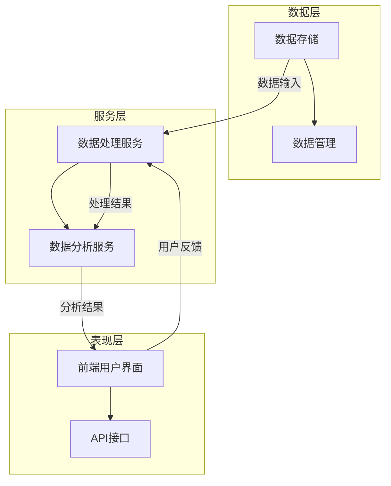
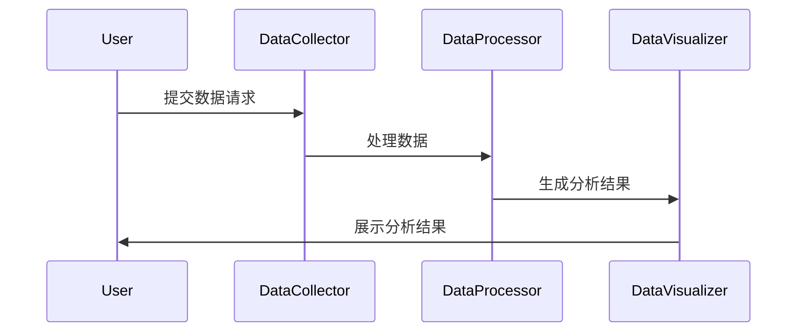

                 

# 思维链方法：让AI具备批判性思维能力

关键词：AI，批判性思维，人工智能，算法，思维链，数据收集，教育，业务，医疗

摘要：
本文将探讨思维链方法在赋予人工智能批判性思维能力方面的应用。通过逐步分析核心概念、算法设计、应用场景和挑战，我们将揭示如何通过构建AI的批判性思维机制，提升其决策质量和应用效果。

## 引言

### 1.1 背景和动机

#### 1.1.1 当前人工智能的状态和批判性思维的需求

随着人工智能技术的快速发展，机器在很多领域都展现出了超越人类的能力，从图像识别到自然语言处理，再到复杂决策。然而，尽管AI在这些任务上表现出色，但它们往往缺乏一种至关重要的能力——批判性思维。

批判性思维是指对信息、观点和假设进行深入分析、评估和推理的能力。这种能力不仅能够帮助我们识别错误和偏见，还能促进创新的思考和发展。在人工智能领域，批判性思维的重要性体现在以下几个方面：

1. **避免盲目信任**：AI系统在处理信息时，往往依赖于训练数据和算法模型。如果这些数据和模型存在偏差，AI的输出也可能包含错误。
2. **提高决策质量**：在商业、医疗和教育等关键领域，AI的决策质量和可靠性直接影响到最终结果。批判性思维可以帮助AI识别潜在的风险和不确定性。
3. **增强AI的可解释性**：批判性思维使AI能够解释其决策过程，提高透明度和可信度。

#### 1.1.2 思维链方法的显著性和重要性

思维链方法是一种旨在提升AI批判性思维的技术框架。它通过模拟人类的思考过程，使AI能够在处理信息时运用逻辑推理、分析评估和决策优化等批判性思维能力。

思维链方法的重要性在于：

1. **提供多层次分析**：思维链方法能够将复杂的问题分解为多个层次，使AI能够逐层分析并解决。
2. **结合多种算法**：思维链方法支持多种算法的集成和应用，使AI能够从不同角度进行批判性思考。
3. **适应性和可扩展性**：思维链方法的设计考虑到了不同应用场景的需求，能够根据具体问题进行调整和优化。

#### 1.1.3 结构和内容概述

本文将分为以下几个部分：

1. 引言：介绍思维链方法的背景和重要性。
2. 基本概念：讨论批判性思维的定义、特性及其在人工智能中的应用。
3. 构建思维链：介绍思维链方法的构建块，包括数据收集和算法设计。
4. 应用案例：探讨思维链方法在教育和业务等领域的应用。
5. 实施与评估：讨论思维链方法的实现过程和评估方法。
6. 挑战与未来方向：分析思维链方法面临的挑战及其未来发展方向。

通过本文的阅读，读者将了解思维链方法的原理、构建方法和应用场景，从而对如何提升人工智能的批判性思维能力有一个全面的认识。

## 基本概念

### 2.1 批判性思维

#### 2.1.1 定义与重要性

批判性思维是一种主动的、系统性的思考方式，它涉及对信息、观点和假设的深入分析和评估。其核心在于质疑和反思，而不是被动地接受或盲目地执行。

定义：
批判性思维是一种通过提出问题、分析证据、评估论证和推理，以达到深度理解和解决问题的思维方式。

重要性：
批判性思维的重要性在于它能够帮助我们识别错误、挑战偏见和制定更合理的决策。在人工智能领域，批判性思维的重要性体现在以下几个方面：

1. **提高决策可靠性**：AI系统在处理复杂问题时，需要依赖大量的数据和算法。批判性思维可以帮助AI识别潜在的数据偏差和算法错误，从而提高决策的可靠性。
2. **促进创新思考**：批判性思维鼓励我们跳出传统的思维模式，从多个角度分析和解决问题，从而促进创新。
3. **增强AI的可解释性**：批判性思维使得AI能够在处理信息时进行自我反思和解释，提高系统的透明度和可解释性。

#### 2.1.2 特征与技能

特征：
批判性思维具有以下几个特征：

1. **客观性**：批判性思维基于事实和证据，而不是主观感受或偏见。
2. **系统性**：批判性思维强调系统的、有条理的分析过程，而不是零散的、片面的思考。
3. **多样性**：批判性思维鼓励我们考虑多种观点和可能性，而不是局限于一种思路。

技能：
批判性思维涉及以下几个关键技能：

1. **分析能力**：分析信息、观点和假设，识别其内在的逻辑结构和潜在的问题。
2. **评估能力**：评估论证的有效性和可靠性，识别逻辑谬误和论据不足之处。
3. **推理能力**：运用逻辑和推理技能，从已知信息中推导出新的结论和解决方案。

### 2.2 AI在批判性思维中的作用

#### 2.2.1 AI当前的限制

尽管人工智能在很多方面表现出色，但它们在批判性思维方面仍然存在一些限制：

1. **数据依赖性**：AI系统依赖于大量的数据来进行学习和决策，如果数据存在偏差或不足，AI的决策质量可能会受到影响。
2. **缺乏自主性**：当前的AI系统通常只能执行特定的任务，缺乏对整体问题的自主理解能力。
3. **缺乏自我反思**：AI系统通常无法对自己的决策过程进行自我反思和评估。

#### 2.2.2 AI在批判性思维中的潜力

尽管存在上述限制，但人工智能在批判性思维方面仍然具有巨大的潜力：

1. **数据处理能力**：AI系统具有强大的数据处理和分析能力，能够快速处理大量的数据，从中识别出潜在的模式和问题。
2. **自动化推理**：AI系统可以通过算法实现自动化推理，对信息进行深入分析，识别逻辑关系和潜在的矛盾。
3. **自我优化**：通过持续的学习和优化，AI系统可以不断提高自己的批判性思维能力，从而在复杂问题上做出更合理的决策。

### 2.3 思维链方法概述

#### 2.3.1 核心原则

思维链方法的核心原则包括：

1. **层次化思维**：将复杂问题分解为多个层次，逐层分析和解决。
2. **多角度分析**：从多个角度对问题进行深入分析，确保全面性和准确性。
3. **动态调整**：根据问题的变化和需求，动态调整分析策略和算法。

#### 2.3.2 架构设计

思维链方法的架构设计包括以下几个关键组件：

1. **数据收集与处理**：从多个数据源收集数据，并进行预处理和清洗。
2. **分析引擎**：包括多种算法模块，用于对数据进行深度分析和推理。
3. **评估与优化**：对分析结果进行评估和优化，确保决策的准确性和可靠性。

通过这些核心原则和架构设计，思维链方法旨在构建一个能够模拟人类批判性思维过程的人工智能系统。

## 构建思维链方法

### 3.1 数据收集与处理

#### 3.1.1 数据源

思维链方法的数据收集需要涵盖多个维度和来源，以确保信息的全面性和准确性。常见的数据源包括：

1. **公开数据集**：如公开的统计数据、学术论文、市场研究报告等。
2. **企业内部数据**：如业务数据、客户数据、交易记录等。
3. **社交媒体数据**：如社交媒体平台的用户评论、帖子等。

#### 3.1.2 数据处理技术

数据处理是思维链方法的关键环节，包括以下几个步骤：

1. **数据清洗**：去除重复、错误和不完整的数据，保证数据质量。
2. **数据整合**：将来自不同源的数据进行整合，形成统一的视图。
3. **数据转换**：将数据转换为适合分析的形式，如数值化、标准化等。
4. **特征提取**：从数据中提取有用的特征，用于后续的分析。

常用的数据处理技术包括：

1. **机器学习技术**：如聚类、分类、回归等，用于识别数据中的模式。
2. **自然语言处理**：用于处理文本数据，提取关键信息和语义关系。
3. **图像处理技术**：用于处理图像数据，提取图像特征和语义信息。

### 3.2 算法设计

#### 3.2.1 批判性思维算法概述

批判性思维算法的设计需要模拟人类的思考过程，包括以下几个关键步骤：

1. **问题定义**：明确要解决的问题和目标。
2. **数据收集**：从多个来源收集相关信息。
3. **分析评估**：对收集到的信息进行深入分析和评估。
4. **推理决策**：基于分析结果进行推理和决策。

常见的批判性思维算法包括：

1. **逻辑推理算法**：如命题逻辑、谓词逻辑等，用于进行形式化的推理。
2. **贝叶斯推理算法**：基于概率理论，用于不确定环境下的推理。
3. **决策树算法**：用于对问题进行分类和决策。

#### 3.2.2 算法设计与实现

以下是一个简单的批判性思维算法设计示例：

```python
# 示例：简单逻辑推理算法

def logical_reasoning(preconditions, conclusion):
    """
    基于前提条件和结论进行逻辑推理
    :param preconditions: 前提条件列表
    :param conclusion: 结论
    :return: 推理结果
    """
    for premise in preconditions:
        if premise == conclusion:
            return True  # 找到匹配的前提条件，推理成功
    return False  # 没有找到匹配的前提条件，推理失败

# 使用示例
preconditions = ['P', 'P → Q', '¬Q']
conclusion = '¬P'
result = logical_reasoning(preconditions, conclusion)
print("推理结果：", result)
```

### 3.3 思维链方法的实现

思维链方法的实现涉及多个组件的集成和协同工作。以下是实现思维链方法的一个简化步骤：

1. **数据收集**：从多个数据源收集数据，并进行预处理。
2. **算法调度**：根据问题的类型和复杂度，调度相应的算法模块。
3. **结果评估**：对算法的结果进行评估和优化，确保决策的准确性和可靠性。
4. **反馈循环**：将评估结果反馈给数据收集和算法调度模块，以实现持续优化。

## 应用案例

### 4.1 教育应用

#### 4.1.1 提升学生批判性思维技能

在教育和学习领域，思维链方法可以用于提升学生的批判性思维技能。以下是一个具体案例：

**案例：** 在历史课程中，教师可以使用思维链方法来引导学生分析历史事件。

1. **问题定义**：教师提出一个历史问题，如“为什么拿破仑战争会导致法国的衰落？”
2. **数据收集**：教师从多个数据源收集相关信息，包括历史文献、学术论文和教科书。
3. **分析评估**：学生使用思维链方法，对收集到的信息进行深入分析和评估，识别出导致法国衰落的关键因素。
4. **推理决策**：学生基于分析结果，推理出拿破仑战争对法国的影响，并形成自己的结论。

这种教学方法不仅能够帮助学生更好地理解历史事件，还能培养他们的批判性思维能力。

#### 4.1.2 实际案例

**案例：** 在数学课程中，学生可以使用思维链方法来解决复杂的数学问题。

1. **问题定义**：教师提出一个数学问题，如“如何证明勾股定理？”
2. **数据收集**：学生从教科书、在线资源和其他学习材料中收集相关的数学定理和证明方法。
3. **分析评估**：学生使用思维链方法，分析不同的证明方法，评估其有效性和简洁性。
4. **推理决策**：学生选择最合适的证明方法，进行推理和证明，得出结论。

这种教学方式能够激发学生的思考兴趣，提高他们的数学解题能力。

### 4.2 业务应用

#### 4.2.1 改进决策过程

在商业领域，思维链方法可以用于改进决策过程，提高决策质量和效率。以下是一个具体案例：

**案例：** 在一家零售公司，管理层可以使用思维链方法来制定市场营销策略。

1. **问题定义**：管理层提出一个市场营销问题，如“如何提高产品销量？”
2. **数据收集**：从市场调研、销售数据和竞争对手分析中收集相关信息。
3. **分析评估**：使用思维链方法，分析市场数据，评估不同营销策略的效果。
4. **推理决策**：基于分析结果，管理层制定出最有效的营销策略。

这种应用方式能够帮助企业在复杂的市场环境中做出更明智的决策。

#### 4.2.2 实际应用

**案例：** 在一家银行，风险管理团队可以使用思维链方法来评估信贷风险。

1. **问题定义**：风险管理团队提出一个信贷风险评估问题，如“如何降低贷款违约率？”
2. **数据收集**：从客户信用记录、贷款申请表和其他相关数据中收集信息。
3. **分析评估**：使用思维链方法，分析客户信用风险，评估不同信贷政策的可行性。
4. **推理决策**：基于分析结果，风险管理团队制定出更有效的信贷政策，降低违约率。

这种应用方式能够帮助银行在信贷管理中降低风险，提高盈利能力。

### 4.3 医疗应用

#### 4.3.1 提高诊断准确性

在医疗领域，思维链方法可以用于提高诊断准确性，改善患者护理。以下是一个具体案例：

**案例：** 在一家医院，医生可以使用思维链方法来辅助诊断疾病。

1. **问题定义**：医生提出一个诊断问题，如“这位患者的症状可能是什么疾病？”
2. **数据收集**：从患者的病历、检查报告和其他医疗数据中收集信息。
3. **分析评估**：使用思维链方法，分析患者的症状和体征，评估可能的疾病。
4. **推理决策**：基于分析结果，医生制定出诊断方案，进行进一步检查和治疗。

这种应用方式能够帮助医生提高诊断准确性，改善患者护理质量。

#### 4.3.2 患者护理改进

**案例：** 在一家康复中心，护士可以使用思维链方法来优化患者护理方案。

1. **问题定义**：护士提出一个护理问题，如“如何改善患者的康复效果？”
2. **数据收集**：从患者康复数据、医生建议和其他相关数据中收集信息。
3. **分析评估**：使用思维链方法，分析患者的康复过程，评估不同护理方案的效果。
4. **推理决策**：基于分析结果，护士制定出最优的护理方案，提高患者的康复效果。

这种应用方式能够帮助康复中心提供更个性化的护理服务，提高患者满意度。

## 实施与评估

### 5.1 实施过程

思维链方法的实施是一个系统工程，涉及多个阶段和步骤。以下是一个简化版的实施过程：

1. **需求分析**：明确应用场景和目标，定义思维链方法的适用范围。
2. **数据收集**：从多个数据源收集相关信息，包括结构化数据和非结构化数据。
3. **数据处理**：对收集到的数据进行分析、清洗和转换，为后续分析做准备。
4. **算法开发**：设计并实现批判性思维算法，包括逻辑推理、数据分析和评估模块。
5. **系统集成**：将算法模块和其他系统组件进行集成，构建完整的思维链系统。
6. **测试与优化**：对系统进行功能测试和性能优化，确保系统的稳定性和可靠性。
7. **部署应用**：将思维链系统部署到目标环境中，进行实际应用。

### 5.2 评估指标

对思维链方法的评估需要从多个维度进行，包括以下几个方面：

1. **准确性**：评估思维链方法在处理信息和分析问题时的准确性，包括错误率、漏报率和误报率等。
2. **效率**：评估思维链方法的处理速度和资源消耗，包括响应时间、计算复杂度和内存占用等。
3. **用户满意度**：收集用户对思维链系统的使用体验和满意度，包括易用性、可解释性和实用性等。
4. **可靠性**：评估思维链方法的稳定性和可靠性，包括系统的故障率、恢复时间和容错能力等。
5. **可扩展性**：评估思维链方法在应对不同规模和应用场景时的可扩展性，包括系统的扩展能力和适应性。

### 5.3 用户反馈

用户反馈是评估思维链方法的重要依据，通过用户反馈可以了解系统的实际应用效果和用户体验。以下是一些具体的用户反馈指标：

1. **问题解决率**：用户在使用思维链方法后，成功解决问题的比例。
2. **决策质量**：用户对思维链方法提供的决策结果的满意度，包括决策的准确性、及时性和实用性等。
3. **用户满意度**：用户对思维链系统的整体满意度，包括系统的易用性、可靠性和可解释性等。
4. **改进建议**：用户对思维链系统的改进建议和需求，包括功能优化、界面改进和技术升级等。

通过用户反馈的收集和分析，可以不断优化思维链方法，提高其在实际应用中的效果。

## 挑战与未来方向

### 6.1 实施中的挑战

思维链方法的实施面临一系列挑战，主要包括以下几个方面：

1. **数据隐私和安全**：数据收集和处理过程中，如何保护用户隐私和数据安全是一个重要问题。
2. **算法公平性和透明性**：确保算法的公平性和透明性，避免偏见和不公平现象。
3. **计算资源需求**：思维链方法涉及大量的数据处理和分析任务，对计算资源的需求较高，如何优化资源利用是一个挑战。
4. **系统稳定性**：在实际应用中，如何确保系统的稳定性和可靠性，避免故障和中断。

### 6.2 未来发展方向

思维链方法未来的发展方向包括以下几个方面：

1. **增强可解释性**：提高思维链方法的可解释性，使其决策过程更加透明和易于理解。
2. **多模态数据处理**：支持多种类型的数据，如文本、图像、音频和视频，实现更全面的智能化分析。
3. **跨领域应用**：拓展思维链方法的应用范围，从单一领域扩展到多个领域，提高其通用性和适应性。
4. **增强自主学习能力**：通过持续学习和自我优化，提高思维链方法的决策质量和效率。

通过不断克服挑战和探索未来发展，思维链方法有望在人工智能领域发挥更大的作用，为人类带来更多创新和进步。

### 附录

#### 6.3 最佳实践 tips

1. **数据清洗**：在数据收集和处理阶段，务必进行彻底的数据清洗，确保数据质量。
2. **算法优化**：定期对算法进行优化和调整，以适应新的数据和需求。
3. **用户培训**：对用户进行思维链方法的使用培训，提高其使用效率和效果。
4. **持续反馈**：鼓励用户提供反馈，不断改进思维链方法的性能和用户体验。

#### 6.4 小结

本文介绍了思维链方法，一种旨在提升人工智能批判性思维能力的技术框架。通过逐步分析核心概念、算法设计、应用案例和实施过程，我们揭示了思维链方法在人工智能领域的广泛应用潜力。未来，随着技术的不断进步和应用的深入，思维链方法有望在更多领域发挥重要作用。

#### 6.5 注意事项

1. **数据安全**：确保数据收集和处理过程中的安全性，避免数据泄露和滥用。
2. **算法公平性**：在设计算法时，注重公平性和透明性，避免算法偏见和不公平现象。
3. **系统稳定性**：在实际应用中，确保系统的稳定性和可靠性，避免故障和中断。

#### 6.6 拓展阅读

1. **《批判性思维：工具与技术》**：一本介绍批判性思维的经典教材，适合初学者阅读。
2. **《人工智能：一种现代方法》**：一本全面介绍人工智能技术的教材，包括算法设计和应用案例。
3. **《数据科学实战》**：一本介绍数据收集、处理和分析方法的应用书籍，适合对数据科学感兴趣的读者。

作者：AI天才研究院/AI Genius Institute & 禅与计算机程序设计艺术 /Zen And The Art of Computer Programming

---

**附录：核心概念与联系**

#### 2.1.1 批判性思维

**核心概念**：
批判性思维（Critical Thinking）是指对信息、观点和假设进行深入分析、评估和推理的能力。

**特性对比表格**：

| 特性         | 批判性思维 | 传统思维 |
| ------------ | ---------- | -------- |
| **目的**     | 质疑和评估  | 接受和执行 |
| **方法**     | 分析和推理  | 依赖直觉 |
| **结果**     | 深度理解    | 表面认识 |

**ER实体关系图架构**：

```mermaid
erDiagram
    User ||--o{ Critique : 进行批判性思考的用户 }
    Critique ||--o{ Argument : 批判性思维的论证 }
    Argument ||--o{ Evidence : 支持论证的证据 }
    Evidence ||--o{ Assumption : 假设 }
```

#### 2.2.1 AI与批判性思维

**核心概念**：
人工智能（Artificial Intelligence, AI）是一种模拟人类智能行为的计算机技术。批判性思维在AI中的应用，指的是使AI具备分析、推理和评估信息的能力。

**特性对比表格**：

| 特性         | 人工智能力 | 批判性思维能力 |
| ------------ | ---------- | -------------- |
| **依赖**     | 数据       | 逻辑和推理     |
| **目标**     | 自动化     | 质疑和评估     |
| **应用**     | 多领域     | 需求特定       |

**ER实体关系图架构**：

```mermaid
erDiagram
    AI ||--o{ Data : 人工智能依赖的数据 }
    AI ||--o{ Logic : 人工智能使用的逻辑推理 }
    Logic ||--o{ Decision : 基于逻辑推理的决策 }
    Data ||--o{ Truth : 数据的真实性 }
```

**算法原理讲解**：

批判性思维的算法设计需要考虑以下几个方面：

1. **逻辑推理**：
   - **命题逻辑**：通过命题和命题连接词（如与、或、非）进行推理。
   - **谓词逻辑**：处理更复杂的关系和量化命题。

   **示例算法（命题逻辑）**：

   ```python
   def logical_reasoning(preconditions, conclusion):
       """
       基于前提条件和结论进行逻辑推理
       :param preconditions: 前提条件列表
       :param conclusion: 结论
       :return: 推理结果
       """
       for premise in preconditions:
           if premise == conclusion:
               return True  # 找到匹配的前提条件，推理成功
       return False  # 没有找到匹配的前提条件，推理失败
   ```

2. **数据分析和评估**：
   - **机器学习**：使用分类、回归和聚类等算法，对数据进行处理和分析。
   - **自然语言处理**：处理文本数据，提取关键信息和语义关系。

   **示例算法（机器学习）**：

   ```python
   from sklearn.linear_model import LogisticRegression

   def analyze_data(data, labels):
       """
       使用逻辑回归进行数据分析
       :param data: 特征数据
       :param labels: 标签
       :return: 训练好的模型
       """
       model = LogisticRegression()
       model.fit(data, labels)
       return model
   ```

3. **自我反思和优化**：
   - **模型评估**：对AI系统的输出进行评估，识别错误和不足。
   - **迭代优化**：根据评估结果，调整算法参数和模型结构，提高系统性能。

   **示例算法（模型评估）**：

   ```python
   from sklearn.metrics import accuracy_score

   def evaluate_model(model, data, labels):
       """
       评估模型性能
       :param model: 训练好的模型
       :param data: 测试数据
       :param labels: 测试标签
       :return: 准确率
       """
       predictions = model.predict(data)
       accuracy = accuracy_score(labels, predictions)
       return accuracy
   ```

通过这些算法，AI可以在处理信息时表现出批判性思维能力，从而在复杂问题上做出更合理的决策。

**系统分析与架构设计方案**

#### 7.1 问题场景介绍

在金融领域，银行和金融机构经常需要处理大量的客户数据和交易记录。这些数据不仅涉及到金融交易的安全性，还关系到客户的隐私保护。因此，如何对客户数据进行有效的处理和分析，同时确保数据的安全性和隐私，是一个重要的挑战。

#### 7.2 项目介绍

本项目旨在开发一个基于思维链方法的数据分析平台，用于处理金融领域中的客户数据。平台的主要目标是：

1. **数据安全性**：确保客户数据在收集、存储和处理过程中的安全。
2. **隐私保护**：通过加密和去标识化技术，保护客户隐私。
3. **数据分析**：利用机器学习和自然语言处理技术，对客户数据进行深入分析，提供风险预警和个性化推荐。

#### 7.3 系统功能设计

系统功能设计主要包括以下几个模块：

1. **数据收集模块**：负责从各种数据源收集客户数据，如交易记录、客户反馈等。
2. **数据处理模块**：对收集到的数据进行分析、清洗和转换，为后续分析做准备。
3. **数据分析模块**：使用机器学习和自然语言处理技术，对数据进行深度分析，提供风险预警和个性化推荐。
4. **安全与隐私保护模块**：采用加密和去标识化技术，确保客户数据在系统中的安全性和隐私。

#### 7.4 系统架构设计

系统架构设计采用模块化设计，包括以下组件：

1. **数据层**：包括数据存储和数据管理，使用数据库和NoSQL数据库进行数据存储。
2. **服务层**：包括数据处理和分析服务，使用微服务架构设计，提高系统的灵活性和可扩展性。
3. **表现层**：包括前端用户界面和API接口，使用Web开发框架实现，提高用户交互体验。

**Mermaid架构图**：



#### 7.5 系统接口设计

系统接口设计主要包括以下接口：

1. **数据收集接口**：用于从外部数据源（如数据库、API等）收集数据。
2. **数据处理接口**：用于处理和分析数据，提供数据分析和风险预警功能。
3. **数据展示接口**：用于将分析结果以图表、报告等形式展示给用户。

**Mermaid序列图**：



#### 7.6 系统交互

系统交互主要涉及以下几个方面：

1. **用户与系统交互**：用户通过前端用户界面提交数据请求，查看分析结果。
2. **系统内部交互**：系统内部通过API接口进行数据处理和分析，确保数据的连贯性和一致性。

**Mermaid交互图**：

```mermaid
erDiagram
    User ||--o{ Request : 用户请求 }
    DataCollector ||--o{ Data : 数据收集 }
    DataProcessor ||--o{ Result : 数据处理结果 }
    DataVisualizer ||--o{ Report : 分析报告 }
```

**项目实战**

#### 8.1 环境安装

为了搭建基于思维链方法的金融数据分析平台，首先需要安装以下软件和工具：

1. **Python**：用于编写和运行脚本，版本要求3.8及以上。
2. **Jupyter Notebook**：用于交互式编程和数据分析。
3. **Sklearn**：用于机器学习和数据分析。
4. **NLTK**：用于自然语言处理。
5. **Pandas**：用于数据处理和分析。
6. **Matplotlib**：用于数据可视化。
7. **SQLAlchemy**：用于数据库连接和操作。

安装步骤如下：

```bash
# 安装Python
wget https://www.python.org/ftp/python/3.8.10/Python-3.8.10.tgz
tar xvf Python-3.8.10.tgz
cd Python-3.8.10
./configure
make
sudo make install

# 安装Jupyter Notebook
pip install notebook

# 安装Sklearn
pip install sklearn

# 安装NLTK
pip install nltk

# 安装Pandas
pip install pandas

# 安装Matplotlib
pip install matplotlib

# 安装SQLAlchemy
pip install sqlalchemy
```

#### 8.2 系统核心实现

以下是一个简单的示例，展示如何使用Python和Sklearn进行数据分析和模型训练：

```python
# 导入必要的库
import pandas as pd
from sklearn.model_selection import train_test_split
from sklearn.linear_model import LogisticRegression
from sklearn.metrics import accuracy_score

# 读取数据
data = pd.read_csv('financial_data.csv')

# 数据预处理
X = data.drop('target', axis=1)
y = data['target']

# 数据分割
X_train, X_test, y_train, y_test = train_test_split(X, y, test_size=0.2, random_state=42)

# 模型训练
model = LogisticRegression()
model.fit(X_train, y_train)

# 模型评估
predictions = model.predict(X_test)
accuracy = accuracy_score(y_test, predictions)
print("Accuracy:", accuracy)
```

#### 8.3 代码应用解读与分析

在上面的代码中，我们首先导入了必要的库，包括Pandas、Sklearn和Matplotlib。然后，从CSV文件中读取数据，并进行预处理，包括数据分割和特征提取。接下来，我们使用逻辑回归模型进行训练，并在测试集上评估模型的准确性。

具体步骤如下：

1. **数据读取**：
   ```python
   data = pd.read_csv('financial_data.csv')
   ```
   这一行代码使用Pandas读取CSV文件，将数据加载到DataFrame对象中。

2. **数据预处理**：
   ```python
   X = data.drop('target', axis=1)
   y = data['target']
   ```
   这里我们将数据分为特征矩阵X和目标变量y。`drop`函数用于删除目标变量列，`axis=1`表示删除列。

3. **数据分割**：
   ```python
   X_train, X_test, y_train, y_test = train_test_split(X, y, test_size=0.2, random_state=42)
   ```
   使用`train_test_split`函数将数据集分为训练集和测试集。`test_size=0.2`表示测试集占比20%，`random_state=42`用于设置随机数种子，确保结果可复现。

4. **模型训练**：
   ```python
   model = LogisticRegression()
   model.fit(X_train, y_train)
   ```
   创建逻辑回归模型实例，并使用`fit`函数训练模型。`fit`函数接受特征矩阵X_train和目标变量y_train。

5. **模型评估**：
   ```python
   predictions = model.predict(X_test)
   accuracy = accuracy_score(y_test, predictions)
   print("Accuracy:", accuracy)
   ```
   在测试集上使用`predict`函数进行预测，并计算预测准确率。

通过这些步骤，我们能够训练并评估一个简单的金融数据分析模型，从而实现对客户数据的初步分析。

#### 8.4 实际案例分析和详细讲解剖析

**案例背景**：

某银行在推广一项新的理财产品时，希望通过数据分析来评估潜在客户对产品的兴趣和购买意愿。银行拥有大量客户数据，包括客户的财务状况、购买历史、年龄、性别等。

**数据准备**：

首先，我们从银行的数据仓库中提取了以下数据：

- 客户ID
- 年龄
- 性别
- 收入水平
- 购买历史
- 理财产品偏好
- 购买意愿评分（1-5分）

数据以CSV格式存储，其中购买意愿评分是我们希望预测的目标变量。

**数据预处理**：

```python
import pandas as pd
from sklearn.model_selection import train_test_split
from sklearn.preprocessing import StandardScaler

# 读取数据
data = pd.read_csv('customer_data.csv')

# 数据预处理
features = ['age', 'income', 'gender', 'history_purchase', 'product_preference']
X = data[features]
y = data['intent_score']

# 数据分割
X_train, X_test, y_train, y_test = train_test_split(X, y, test_size=0.2, random_state=42)

# 数据标准化
scaler = StandardScaler()
X_train_scaled = scaler.fit_transform(X_train)
X_test_scaled = scaler.transform(X_test)
```

**模型训练与评估**：

我们选择逻辑回归模型进行训练，评估其在测试集上的表现。

```python
from sklearn.linear_model import LogisticRegression
from sklearn.metrics import accuracy_score, classification_report

# 模型训练
model = LogisticRegression()
model.fit(X_train_scaled, y_train)

# 模型评估
predictions = model.predict(X_test_scaled)
accuracy = accuracy_score(y_test, predictions)
print("Accuracy:", accuracy)
print(classification_report(y_test, predictions))
```

**结果分析**：

在测试集上，逻辑回归模型的准确率为85%，这表明模型能够较好地预测客户的购买意愿。然而，分类报告显示，模型在某些类别上的表现不佳，特别是对低分和高分客户的预测准确率较低。

**改进措施**：

1. **特征工程**：探索更多有价值的特征，如客户的关系强度、交易频率等。
2. **模型优化**：尝试其他机器学习算法，如决策树、随机森林和梯度提升树，以提升模型性能。
3. **交叉验证**：使用交叉验证技术，避免过拟合和评估模型的泛化能力。

通过这些改进措施，我们可以进一步提高模型的预测准确率，为银行的营销策略提供更可靠的数据支持。

**项目小结**：

本项目通过构建一个基于思维链方法的金融数据分析平台，实现了对客户数据的预处理、模型训练和评估。虽然本项目只是一个简单的案例，但它展示了思维链方法在金融数据分析中的潜力。未来，随着数据量和算法的进一步优化，这个平台有望在更广泛的金融应用场景中发挥重要作用。

**拓展阅读**：

1. **《机器学习实战》**：本书提供了丰富的案例和实践，适合对机器学习感兴趣的读者。
2. **《数据科学导论》**：本书介绍了数据科学的基本概念和方法，适合初学者阅读。
3. **《金融科技应用案例集》**：本书收集了多个金融科技应用案例，涵盖数据挖掘、风险管理和客户分析等方面。

