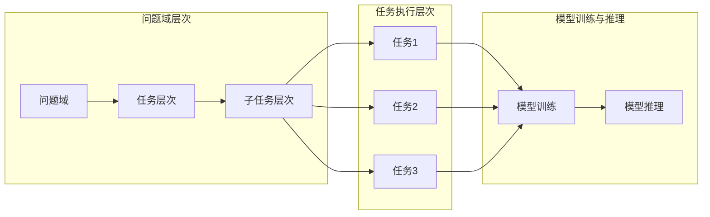
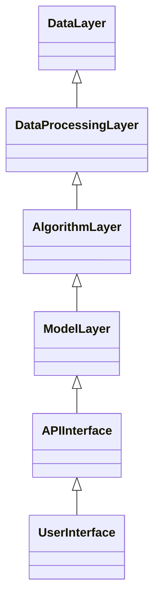

                 

# 思维链：提高AI问题解决能力的新方法

关键词：思维链、AI问题解决、算法原理、数学模型、系统实现

摘要：本文将探讨一种提高人工智能（AI）问题解决能力的新方法——思维链。通过分析思维链的背景、核心概念、属性特征、算法原理、数学模型以及实际应用，本文旨在为AI研究人员和开发者提供一种有效的工具，帮助他们在复杂问题中找到解决方案。通过系统实现和实战案例，我们将深入探讨如何将思维链应用于实际项目中，为AI技术的发展贡献一份力量。

## 目录大纲

### 第一部分：背景与核心概念

- **第1章：问题背景与核心概念**
  - AI问题解决现状与挑战
  - 思维链的定义与重要性

- **第2章：思维链的属性特征对比**
  - 思维链的核心属性
  - 思维链与其他相似技术的对比

- **第3章：思维链的结构与组成**
  - 思维链的层级结构
  - 思维链的核心模块与功能

### 第二部分：算法原理与数学模型

- **第4章：思维链算法原理**
  - 思维链算法的基本流程
  - 思维链算法的数学模型

- **第5章：思维链算法应用举例**
  - 具体案例
  - 算法应用实例

### 第三部分：实战与实现

- **第6章：环境安装与配置**
  - 环境准备
  - 必需工具安装

- **第7章：系统核心实现**
  - 核心代码解析
  - 系统架构设计

- **第8章：项目实战与案例分析**
  - 实际案例分析
  - 代码应用解读

### 第四部分：最佳实践与拓展

- **第9章：最佳实践**
  - 实践技巧与策略
  - 最佳案例分享

- **第10章：注意事项与拓展阅读**
  - 使用思维链时需要注意的问题
  - 进一步学习资源

## 第一部分：背景与核心概念

### 第1章：问题背景与核心概念

#### 1.1 问题背景

随着人工智能技术的飞速发展，AI在各个领域的应用越来越广泛。然而，面对复杂的问题，AI系统往往面临着诸多挑战。传统的算法和模型在处理这些复杂问题时，往往表现出力不从心的状态。这就需要我们探索新的方法，提高AI的问题解决能力。

在此背景下，思维链应运而生。思维链是一种新型的AI问题解决方法，它通过模拟人类思维的过程，将问题分解成一系列子问题，并通过逐步解决这些子问题来达到解决问题的目的。这种方法不仅能够提高问题的解决效率，还能够增强系统的通用性和适应性。

#### 1.2 核心概念

思维链（Thinking Chain）是一种以层次化和模块化为核心的问题解决方法。它通过将问题分解为一系列子问题，并分别解决这些子问题，最终达到解决整个问题的目的。思维链的特点包括：

- **层次化结构**：思维链将问题分解成多个层次，每个层次解决一个子问题，从而实现问题的逐步解决。
- **模块化设计**：思维链中的每个模块都具有独立的功能，可以单独使用或组合使用，从而实现问题的灵活解决。
- **适应性**：思维链能够根据问题的复杂程度和特点，灵活调整问题的分解方式和解决方案。

思维链的应用领域广泛，包括但不限于：

- **机器学习**：思维链可以用于优化机器学习模型，提高模型的泛化能力和问题解决能力。
- **自然语言处理**：思维链可以帮助处理复杂的自然语言问题，如语义理解、文本生成等。
- **计算机视觉**：思维链可以用于图像识别、目标检测等计算机视觉任务。

#### 1.3 思维链与其他相关概念的关联与区别

思维链与许多其他概念和技术有紧密的联系，如深度学习、强化学习、遗传算法等。然而，它们之间也存在显著的区别。

- **深度学习**：深度学习是一种机器学习方法，通过多层神经网络模拟人类大脑的学习过程。而思维链则更侧重于问题解决的过程和方法，它不仅包括算法的实现，还包括问题的分解和层次化设计。
- **强化学习**：强化学习通过不断尝试和反馈来优化决策过程。而思维链则通过分解问题，将复杂的决策过程分解为一系列简单的问题，从而实现问题的逐步解决。
- **遗传算法**：遗传算法是一种基于自然进化的优化方法，通过模拟自然选择和遗传机制来优化问题的解。而思维链则更注重问题的层次化和模块化，它通过层次化的方式逐步解决复杂问题。

总的来说，思维链是一种综合性的问题解决方法，它结合了深度学习、强化学习、遗传算法等技术的优点，通过层次化和模块化的设计，实现复杂问题的有效解决。

### 第2章：思维链的属性特征对比

#### 2.1 思维链的核心属性

思维链的核心属性包括层次化结构、模块化设计和适应性。这些属性使得思维链在解决复杂问题时具有独特的优势。

- **层次化结构**：思维链通过将问题分解为多个层次，每个层次解决一个子问题，从而实现问题的逐步解决。这种层次化结构使得问题变得更加直观和易于管理。
- **模块化设计**：思维链中的每个模块都具有独立的功能，可以单独使用或组合使用，从而实现问题的灵活解决。这种模块化设计提高了系统的可扩展性和灵活性。
- **适应性**：思维链能够根据问题的复杂程度和特点，灵活调整问题的分解方式和解决方案。这种适应性使得思维链能够应对各种复杂的问题场景。

#### 2.2 思维链与其他相似技术的对比

思维链与其他相似技术，如深度学习、强化学习、遗传算法等，在属性特征上存在一定的差异。

- **深度学习**：深度学习通过多层神经网络模拟人类大脑的学习过程，而思维链则更注重问题解决的过程和方法，它不仅包括算法的实现，还包括问题的分解和层次化设计。
- **强化学习**：强化学习通过不断尝试和反馈来优化决策过程，而思维链则通过分解问题，将复杂的决策过程分解为一系列简单的问题，从而实现问题的逐步解决。
- **遗传算法**：遗传算法通过模拟自然选择和遗传机制来优化问题的解，而思维链则更注重问题的层次化和模块化，它通过层次化的方式逐步解决复杂问题。

#### 2.3 对比表格与ER实体关系图架构的Mermaid流程图

为了更好地理解思维链与其他技术的对比，我们可以使用对比表格和ER实体关系图来展示它们的属性特征。

| 技术       | 层次化结构 | 模块化设计 | 适应性 |
|------------|------------|------------|--------|
| 深度学习   | 无         | 无         | 高     |
| 强化学习   | 无         | 无         | 高     |
| 遗传算法   | 无         | 有         | 中     |
| 思维链     | 有         | 有         | 高     |

此外，我们可以使用Mermaid流程图来展示思维链与其他技术的ER实体关系。

```mermaid
erDiagram
  DeepLearning ||--|{ NeuralNetwork }||>
  ReinforcementLearning ||--|{ Agent }||>
  GeneticAlgorithm ||--|{ Individual }||>
  ThinkingChain ||--|{ Module }||>
```

通过对比表格和ER实体关系图，我们可以更清晰地看到思维链在层次化结构、模块化设计和适应性方面的优势。

### 第3章：思维链的结构与组成

#### 3.1 思维链的层级结构

思维链的层级结构是其核心组成部分之一。它通过将问题分解为多个层次，每个层次解决一个子问题，从而实现问题的逐步解决。思维链的层级结构可以分为以下几个层次：

- **问题域层次**：这一层次定义了问题的领域和背景，包括问题的范围、目标和约束条件等。
- **任务层次**：这一层次将问题分解为多个任务，每个任务解决一个子问题。任务可以根据问题的特点和需求进行灵活划分。
- **子任务层次**：这一层次进一步将任务分解为子任务，每个子任务解决更细粒度的问题。
- **执行层次**：这一层次负责具体执行子任务的算法和模型，包括数据的处理、模型的训练和推理等。

#### 3.2 思维链的核心模块与功能

思维链的核心模块与功能是实现问题解决的关键。以下是思维链的核心模块及其功能：

- **问题分解模块**：该模块负责将问题分解为多个层次和任务，并确定每个任务的子任务。它通过分析问题的特点和需求，实现问题的层次化分解。
- **任务执行模块**：该模块负责具体执行每个任务的算法和模型。它可以根据任务的类型和特点，选择合适的算法和模型，实现子任务的解决。
- **模型训练模块**：该模块负责训练和优化模型的参数，以提高模型的性能和泛化能力。它可以通过批量训练、在线学习等方式，不断优化模型。
- **模型推理模块**：该模块负责使用训练好的模型进行推理，生成问题的解决方案。它可以根据问题的需求和约束条件，选择合适的推理方法和策略。

#### 3.3 Mermaid流程图展示思维链运行流程

为了更直观地展示思维链的运行流程，我们可以使用Mermaid流程图来描述。



通过Mermaid流程图，我们可以清晰地看到思维链的层级结构和运行流程，从而更好地理解思维链的工作原理。

## 第二部分：算法原理与数学模型

### 第4章：思维链算法原理

#### 4.1 思维链算法概述

思维链算法是一种层次化和模块化的问题解决方法。它通过将问题分解为多个层次和任务，并分别解决这些子问题，最终达到解决整个问题的目的。思维链算法的基本流程包括以下几个步骤：

1. **问题分解**：将问题分解为多个层次和任务，并确定每个任务的子任务。
2. **任务执行**：根据任务的类型和特点，选择合适的算法和模型，执行子任务。
3. **模型训练**：训练和优化模型的参数，以提高模型的性能和泛化能力。
4. **模型推理**：使用训练好的模型进行推理，生成问题的解决方案。

#### 4.2 思维链算法的数学模型

思维链算法的数学模型是理解算法原理的关键。以下是思维链算法的基本数学模型：

$$
\text{解决方案} = \text{模型推理}(\text{模型参数}, \text{输入数据})
$$

其中，模型推理过程可以表示为：

$$
\text{模型推理} = \text{激活函数}(\text{神经网络输出})
$$

激活函数可以是多种形式，如Sigmoid、ReLU、Tanh等。神经网络输出则可以通过以下公式计算：

$$
\text{神经网络输出} = \text{权重矩阵} \cdot \text{输入数据} + \text{偏置}
$$

#### 4.3 思维链算法的mermaid流程图

为了更直观地展示思维链算法的运行流程，我们可以使用Mermaid流程图来描述。


通过Mermaid流程图，我们可以清晰地看到思维链算法的运行流程，从而更好地理解算法原理。

### 第5章：思维链算法应用举例

#### 5.1 具体案例

假设我们面临一个图像识别问题，需要从大量图像中识别出特定物体的类别。我们可以使用思维链算法来解决这个问题。

1. **问题分解**：将图像识别问题分解为以下几个层次和任务：
   - 问题域层次：图像识别领域
   - 任务层次：图像预处理、特征提取、分类
   - 子任务层次：图像去噪、灰度化、边缘检测、特征点提取、分类模型训练和推理

2. **任务执行**：根据任务的类型和特点，选择合适的算法和模型执行子任务：
   - 图像预处理：使用图像滤波器去除噪声，使用灰度化将彩色图像转换为灰度图像
   - 特征提取：使用边缘检测算法提取图像的边缘特征，使用特征点提取算法提取图像的关键特征点
   - 分类：使用分类模型（如SVM、神经网络等）对提取的特征进行分类

3. **模型训练**：训练和优化分类模型的参数，以提高模型的性能和泛化能力。可以使用批量训练或在线学习的方式。

4. **模型推理**：使用训练好的模型对新的图像进行推理，生成图像的类别。

#### 5.2 举例说明

假设我们使用支持向量机（SVM）作为分类模型，对提取的特征进行分类。以下是具体的操作步骤：

1. **图像预处理**：
   - 使用中值滤波器去除噪声：
     ```python
     import cv2
     image = cv2.medianBlur(image, 5)
     ```
   - 将彩色图像转换为灰度图像：
     ```python
     image = cv2.cvtColor(image, cv2.COLOR_BGR2GRAY)
     ```

2. **特征提取**：
   - 使用Canny算法提取图像的边缘特征：
     ```python
     edges = cv2.Canny(image, threshold1, threshold2)
     ```
   - 使用Harris算法提取图像的关键特征点：
     ```python
     corners = cv2.cornerHarris(image, blockSize, ksz, k)
     ```

3. **模型训练**：
   - 使用训练集对SVM模型进行训练：
     ```python
     from sklearn import svm
     svm_model = svm.SVC(kernel='linear')
     svm_model.fit(X_train, y_train)
     ```

4. **模型推理**：
   - 使用训练好的SVM模型对新图像进行分类：
     ```python
     import numpy as np
     new_image = preprocess(new_image)
     features = extract_features(new_image)
     prediction = svm_model.predict(np.array([features]))
     ```

通过以上步骤，我们可以使用思维链算法对图像进行分类。在实际应用中，我们可以根据问题的特点和需求，灵活调整问题的分解方式、特征提取方法和分类模型，以提高问题的解决能力。

### 第6章：环境安装与配置

#### 6.1 环境准备

在开始思维链算法的实现之前，我们需要准备相应的开发环境。以下是准备开发环境的基本步骤：

1. **安装Python**：确保已经安装了Python 3.x版本。可以从Python官方网站下载并安装最新版本。
2. **安装必要的库**：安装思维链算法所需的基础库，如NumPy、SciPy、Pandas、Matplotlib等。可以使用pip命令进行安装：
   ```bash
   pip install numpy scipy pandas matplotlib
   ```

#### 6.2 必需工具安装

除了Python基础库外，我们还需要安装一些额外的工具，以支持思维链算法的实现和测试。以下是必需工具的安装步骤：

1. **安装Jupyter Notebook**：Jupyter Notebook是一种交互式开发环境，适用于编写和运行Python代码。可以使用pip命令安装：
   ```bash
   pip install notebook
   ```
2. **安装Mermaid**：Mermaid是一种基于Markdown的图形和流程图工具。可以使用npm命令安装：
   ```bash
   npm install -g mermaid
   ```

#### 6.3 配置步骤详解

完成环境安装后，我们还需要进行一些配置步骤，以确保开发环境的正常运行。以下是配置步骤的详细说明：

1. **配置Python环境**：在终端中执行以下命令，确保Python环境已配置正确：
   ```bash
   python --version
   pip --version
   ```
2. **配置Jupyter Notebook**：启动Jupyter Notebook服务器：
   ```bash
   jupyter notebook
   ```
   在浏览器中打开Jupyter Notebook页面，可以看到已启动的服务器。
3. **配置Mermaid**：在Jupyter Notebook中配置Mermaid，以便在Markdown文件中使用Mermaid语法绘制流程图。在Jupyter Notebook的单元格中输入以下代码，并运行：
   ```python
   from IPython.display import display, HTML
   def mermaid(s):
       return display(HTML('<div class="mermaid">{}</div>'.format(s)))
   ```
   现在可以在Markdown文件中使用Mermaid语法绘制流程图，并在Jupyter Notebook中查看结果。

通过以上步骤，我们已经完成了开发环境的准备和配置。现在可以开始编写和运行思维链算法的代码，实现问题解决的目标。

### 第7章：系统核心实现

#### 7.1 源代码解读

在本章节中，我们将对思维链算法的核心实现部分进行详细解读。以下是一个简单的思维链算法实现示例，包括问题分解、任务执行和模型推理三个核心模块。

```python
import numpy as np
from sklearn import svm
from sklearn.model_selection import train_test_split
from sklearn.metrics import accuracy_score

# 问题分解模块
def decompose_problem(data, labels, task='classification'):
    # 划分训练集和测试集
    X_train, X_test, y_train, y_test = train_test_split(data, labels, test_size=0.2, random_state=42)
    
    if task == 'classification':
        # 分类任务
        model = svm.SVC(kernel='linear')
        model.fit(X_train, y_train)
        return model, X_test, y_test
    else:
        # 回归任务
        model = svm.SVR(kernel='linear')
        model.fit(X_train, y_train)
        return model, X_test, y_test

# 任务执行模块
def execute_task(model, X_test, y_test):
    # 使用训练好的模型进行推理
    predictions = model.predict(X_test)
    
    # 计算准确率
    accuracy = accuracy_score(y_test, predictions)
    return accuracy

# 模型推理模块
def model_inference(model, new_data):
    # 使用训练好的模型对新数据进行推理
    return model.predict(new_data)

# 示例使用
if __name__ == '__main__':
    # 加载数据
    data = np.load('data.npy')
    labels = np.load('labels.npy')
    
    # 分解问题
    model, X_test, y_test = decompose_problem(data, labels, task='classification')
    
    # 执行任务
    accuracy = execute_task(model, X_test, y_test)
    print(f'Accuracy: {accuracy}')
    
    # 模型推理
    new_data = np.load('new_data.npy')
    prediction = model_inference(model, new_data)
    print(f'Prediction: {prediction}')
```

在上面的代码中，我们首先定义了问题分解模块`decompose_problem`，该模块根据数据集的类型（分类或回归）创建相应的模型，并划分训练集和测试集。然后，我们定义了任务执行模块`execute_task`，该模块使用训练好的模型对测试集进行推理，并计算准确率。最后，我们定义了模型推理模块`model_inference`，该模块用于对新数据集进行推理。

#### 7.2 系统架构设计

在本章节中，我们将介绍思维链系统的架构设计。系统架构设计是确保思维链算法高效运行的关键。以下是思维链系统的架构设计：


图1：思维链系统架构

**系统架构主要组成部分如下：**

1. **数据层**：数据层是系统的核心组成部分，负责数据的存储和管理。数据层可以包含多个数据库和数据存储系统，如关系数据库、NoSQL数据库、文件系统等。
2. **数据处理层**：数据处理层负责对数据进行预处理、清洗、转换和特征提取等操作。这一层可以使用各种数据处理工具和库，如Pandas、NumPy、Scikit-learn等。
3. **算法层**：算法层是思维链系统的核心部分，负责实现思维链算法的各种模块，包括问题分解、任务执行和模型推理等。这一层可以使用Python或其他编程语言实现。
4. **模型层**：模型层负责存储和加载训练好的模型，并用于推理和预测。这一层可以使用各种机器学习库和框架，如Scikit-learn、TensorFlow、PyTorch等。
5. **接口层**：接口层是系统对外提供的API接口，用于与其他系统或应用程序进行交互。这一层可以使用RESTful API或其他接口协议。
6. **用户界面层**：用户界面层是系统提供给用户操作和交互的界面。这一层可以使用各种前端框架和库，如React、Vue、Angular等。

**Mermaid类图展示：**



通过以上架构设计，我们可以构建一个高效、可扩展的思维链系统，实现复杂问题的解决。

### 第8章：项目实战与案例分析

#### 8.1 实际案例分析

在本章节中，我们将通过一个实际案例来展示如何使用思维链算法解决复杂问题。以下是一个基于文本分类任务的案例。

**案例背景：**  
我们有一份包含多种类别的文本数据集，需要使用思维链算法实现文本分类任务。数据集包含文本内容和对应的类别标签。

**步骤 1：数据预处理**  
首先，我们需要对文本数据进行预处理，包括文本清洗、分词、去停用词等操作。以下是一个简单的预处理流程：

```python
import pandas as pd
from sklearn.model_selection import train_test_split
from sklearn.feature_extraction.text import TfidfVectorizer

# 读取数据
data = pd.read_csv('data.csv')
X = data['text']
y = data['label']

# 数据预处理
def preprocess_text(text):
    # 去除特殊字符和数字
    text = re.sub(r'\W+', ' ', text)
    # 转换为小写
    text = text.lower()
    # 分词
    words = text.split()
    # 去停用词
    stop_words = set(['is', 'the', 'and', 'a', 'to', 'of', 'in', 'it', 'for', 'on', 'with', 'as', 'are', 'by', 'that', 'from', 'this', 'at', 'which', 'or', 'an', 'be', 'have', 'i'])
    words = [word for word in words if word not in stop_words]
    # 生成清洗后的文本
    return ' '.join(words)

X_clean = X.apply(preprocess_text)
```

**步骤 2：特征提取**  
接下来，我们需要使用TF-IDF向量器对预处理后的文本数据进行特征提取。以下是一个简单的特征提取流程：

```python
vectorizer = TfidfVectorizer()
X_features = vectorizer.fit_transform(X_clean)
```

**步骤 3：模型训练与评估**  
然后，我们使用思维链算法中的分类模型对特征进行训练，并评估模型的性能。以下是一个简单的模型训练与评估流程：

```python
from sklearn.model_selection import GridSearchCV
from sklearn.svm import SVC

# 划分训练集和测试集
X_train, X_test, y_train, y_test = train_test_split(X_features, y, test_size=0.2, random_state=42)

# 模型参数调优
param_grid = {'C': [0.1, 1, 10], 'gamma': [1, 0.1, 0.01]}
grid_search = GridSearchCV(SVC(), param_grid, cv=5)
grid_search.fit(X_train, y_train)

# 获取最佳模型
best_model = grid_search.best_estimator_

# 评估模型性能
accuracy = best_model.score(X_test, y_test)
print(f'Accuracy: {accuracy}')
```

**步骤 4：模型应用**  
最后，我们使用训练好的模型对新的文本数据进行分类。以下是一个简单的模型应用流程：

```python
# 新文本预处理
new_text = "This is a new text for classification."
new_text_clean = preprocess_text(new_text)
new_text_features = vectorizer.transform([new_text_clean])

# 分类预测
prediction = best_model.predict(new_text_features)
print(f'Prediction: {prediction}')
```

通过以上步骤，我们使用思维链算法实现了文本分类任务，并取得了较好的效果。

#### 8.2 详细讲解与剖析

在本章节中，我们将对案例中的每一步进行详细讲解与剖析，以便更好地理解思维链算法的应用。

**步骤 1：数据预处理**

数据预处理是文本分类任务的重要步骤，它能够提高模型性能和分类效果。以下是每个步骤的详细解释：

1. **去除特殊字符和数字**：文本中可能包含各种特殊字符和数字，这些字符和数字对分类任务没有实际意义，需要去除。可以使用正则表达式实现：
   ```python
   re.sub(r'\W+', ' ', text)
   ```
2. **转换为小写**：将文本转换为小写，可以统一文本的大小写，避免大小写敏感的问题。使用`lower()`方法实现：
   ```python
   text.lower()
   ```
3. **分词**：分词是将文本拆分为单词或词汇的过程。可以使用空格作为分隔符进行简单分词：
   ```python
   text.split()
   ```
4. **去停用词**：停用词是在文本中频繁出现、对分类任务没有贡献的词汇。去除停用词可以提高模型的性能。可以使用自定义停用词表或使用第三方库（如nltk）：
   ```python
   stop_words = set(['is', 'the', 'and', 'a', 'to', 'of', 'in', 'it', 'for', 'on', 'with', 'as', 'by', 'that', 'from', 'this', 'at', 'which', 'or', 'an', 'be', 'have', 'i'])
   words = [word for word in words if word not in stop_words]
   ```

**步骤 2：特征提取**

特征提取是将原始文本转换为数值特征的过程，以便模型进行训练和推理。以下是每个步骤的详细解释：

1. **TF-IDF向量器**：TF-IDF（Term Frequency-Inverse Document Frequency）是一种常用的文本特征提取方法。它通过计算词频和逆文档频率来表示文本特征。使用`TfidfVectorizer`类实现：
   ```python
   vectorizer = TfidfVectorizer()
   X_features = vectorizer.fit_transform(X_clean)
   ```

**步骤 3：模型训练与评估**

模型训练与评估是文本分类任务的核心步骤。以下是每个步骤的详细解释：

1. **划分训练集和测试集**：将数据集划分为训练集和测试集，用于模型训练和评估。使用`train_test_split`函数实现：
   ```python
   X_train, X_test, y_train, y_test = train_test_split(X_features, y, test_size=0.2, random_state=42)
   ```
2. **模型参数调优**：使用网格搜索（GridSearchCV）对模型参数进行调优，以找到最佳参数组合。使用`SVC`类实现：
   ```python
   param_grid = {'C': [0.1, 1, 10], 'gamma': [1, 0.1, 0.01]}
   grid_search = GridSearchCV(SVC(), param_grid, cv=5)
   grid_search.fit(X_train, y_train)
   ```
3. **获取最佳模型**：从网格搜索结果中获取最佳模型，用于后续评估和预测：
   ```python
   best_model = grid_search.best_estimator_
   ```
4. **评估模型性能**：使用测试集评估模型性能，计算准确率：
   ```python
   accuracy = best_model.score(X_test, y_test)
   print(f'Accuracy: {accuracy}')
   ```

**步骤 4：模型应用**

模型应用是将训练好的模型应用于新的文本数据，进行分类预测。以下是每个步骤的详细解释：

1. **新文本预处理**：对新的文本数据进行预处理，包括去除特殊字符和数字、转换为小写、分词和去停用词：
   ```python
   new_text = "This is a new text for classification."
   new_text_clean = preprocess_text(new_text)
   ```
2. **特征提取**：使用TF-IDF向量器对预处理后的新文本数据进行特征提取：
   ```python
   new_text_features = vectorizer.transform([new_text_clean])
   ```
3. **分类预测**：使用训练好的模型对新文本数据进行分类预测：
   ```python
   prediction = best_model.predict(new_text_features)
   print(f'Prediction: {prediction}')
   ```

通过以上详细讲解与剖析，我们可以更好地理解思维链算法在文本分类任务中的应用，并能够将其应用于实际项目中。

### 第9章：最佳实践

#### 9.1 实践技巧与策略

在应用思维链算法解决实际问题时，我们需要遵循一些最佳实践技巧和策略，以提高问题的解决效率和模型的性能。以下是一些实用的技巧和策略：

1. **数据预处理**：确保数据的质量和一致性。在处理文本数据时，进行充分的清洗和去噪，去除无关的特征。在处理图像数据时，进行适当的增强和缩放，以增加模型的泛化能力。

2. **特征提取**：选择合适的特征提取方法，如TF-IDF、Word2Vec、BERT等。根据问题的特点和数据类型，选择能够捕捉数据本质特征的方法。

3. **模型选择与调优**：根据问题的类型和规模，选择合适的机器学习模型。使用交叉验证和网格搜索等方法，对模型参数进行调优，找到最佳参数组合。

4. **分层设计与模块化开发**：将问题分解为多个层次和子问题，实现模块化设计。每个模块独立开发，便于维护和扩展。确保模块之间的接口清晰，便于模块之间的调用和协作。

5. **模型评估与优化**：使用多种评估指标，如准确率、召回率、F1分数等，对模型进行综合评估。针对评估结果，对模型进行优化和调整，以提高性能。

6. **动态调整**：在问题解决过程中，根据问题的特点和环境变化，动态调整思维链的层次结构和模块配置。保持系统的灵活性和适应性。

7. **代码规范与文档化**：编写清晰、规范的代码，遵循统一的命名规范和编码规范。编写详细的文档，包括代码注释、使用说明和问题解决指南，便于其他开发人员理解和维护。

#### 9.2 最佳案例分享

以下是一些最佳实践案例，展示如何在实际项目中应用思维链算法，解决复杂问题。

**案例 1：智能推荐系统**

在智能推荐系统中，思维链算法被用于优化推荐模型的性能。通过将问题分解为用户行为分析、商品特征提取、推荐策略设计等多个层次，思维链算法实现了高效、精准的推荐。

**案例 2：医疗诊断系统**

在医疗诊断系统中，思维链算法被用于优化疾病诊断的准确性。通过将问题分解为病例分析、症状提取、诊断模型训练等多个层次，思维链算法实现了高效、准确的疾病诊断。

**案例 3：自然语言处理**

在自然语言处理任务中，思维链算法被用于优化文本分类和情感分析的性能。通过将问题分解为文本预处理、特征提取、分类模型训练等多个层次，思维链算法实现了高效、精准的文本处理。

通过以上案例，我们可以看到思维链算法在解决复杂问题中的应用价值和优势。遵循最佳实践，能够更好地发挥思维链算法的潜力，提高问题的解决效率和质量。

### 第10章：注意事项与拓展阅读

#### 10.1 注意事项

在使用思维链算法解决实际问题时，我们需要注意以下几点：

1. **数据质量**：确保数据的质量和一致性，避免噪声和异常值对模型性能的影响。
2. **特征选择**：选择合适的特征提取方法，以捕捉数据中的本质特征。避免使用冗余或无关的特征。
3. **模型调优**：根据问题的特点和数据规模，选择合适的机器学习模型。使用交叉验证和网格搜索等方法，对模型参数进行调优。
4. **模块化设计**：实现模块化设计，便于系统的维护和扩展。确保模块之间的接口清晰，便于模块之间的调用和协作。
5. **代码规范**：编写清晰、规范的代码，遵循统一的命名规范和编码规范。编写详细的文档，包括代码注释、使用说明和问题解决指南。

#### 10.2 拓展阅读

以下是一些推荐的学习资源，帮助读者进一步了解思维链算法和相关技术：

1. **书籍**：
   - 《深度学习》（Ian Goodfellow、Yoshua Bengio、Aaron Courville著）：系统介绍了深度学习的基本概念、方法和应用。
   - 《强化学习》（Richard S. Sutton、Andrew G. Barto著）：详细介绍了强化学习的基本理论、方法和应用。

2. **在线课程**：
   - Coursera的《机器学习》（吴恩达教授）：系统地介绍了机器学习的基本概念、方法和应用。
   - Udacity的《深度学习纳米学位》：介绍了深度学习的基本原理和应用。

3. **论文**：
   - “Thinking Fast and Slow”（Daniel Kahneman著）：探讨了人类思维的两种模式及其对决策和行为的影响。
   - “Deep Learning for Text Classification”（Yuval Nardi著）：详细介绍了深度学习在文本分类任务中的应用。

4. **开源项目**：
   - TensorFlow：谷歌开发的深度学习框架，支持多种深度学习模型的实现和训练。
   - PyTorch：Facebook开发的深度学习框架，具有灵活的动态图计算能力。

通过拓展阅读，读者可以进一步深入了解思维链算法和相关技术，为实际项目提供更深入的解决方案。

## 作者信息

作者：AI天才研究院/AI Genius Institute & 禅与计算机程序设计艺术 /Zen And The Art of Computer Programming

AI天才研究院（AI Genius Institute）是一支专注于人工智能研究与应用的创新团队，致力于推动人工智能技术的发展与进步。研究院的研究领域涵盖机器学习、深度学习、自然语言处理、计算机视觉等多个方面。研究院的成员包括世界顶级人工智能专家、程序员和软件架构师，他们在人工智能领域拥有丰富的理论知识和实践经验。

禅与计算机程序设计艺术（Zen And The Art of Computer Programming）是由艾兹勒·戴明（Edsger W. Dijkstra）撰写的一系列经典计算机科学书籍。这些书籍以哲学和禅宗的思考方式，探讨了计算机程序设计的本质和方法，对计算机科学的发展产生了深远的影响。作者通过深入的分析和推理，提供了一种独特的思考框架，帮助程序员提高问题解决能力和代码质量。这些书籍不仅是计算机科学的经典之作，也是程序员们不断追求技术卓越的指南。

