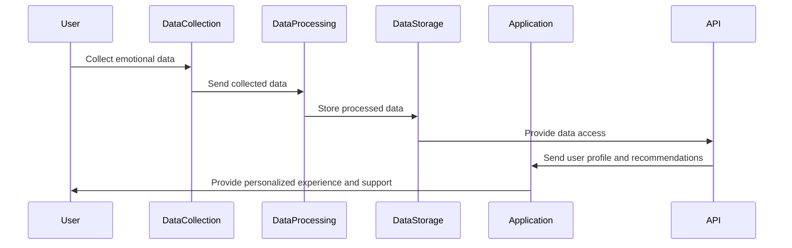
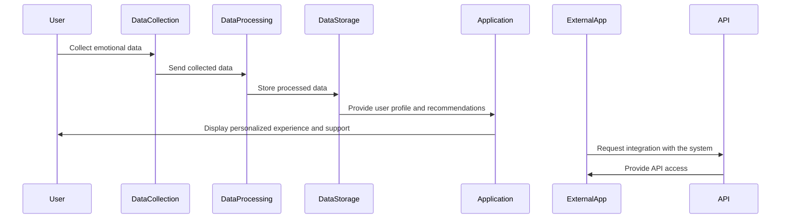

                 

### Introduction to Emotion AI and Human-Computer Interaction

#### Background and Definition of Emotion AI

**1.1 Overview of Emotion AI**

**Definition and Core Concepts**

Emotion AI, also known as affective computing, is an interdisciplinary field that aims to develop systems capable of detecting, recognizing, and simulating human emotions. At its core, Emotion AI relies on a combination of artificial intelligence, machine learning, and cognitive science to interpret and understand human emotional states. The basic concept revolves around enabling machines to process and respond to emotional signals from users, thereby creating more natural and intuitive human-computer interactions.

**Historical Development and Evolution**

The concept of Emotion AI has been around for several decades. Early research in the 1990s primarily focused on basic emotion detection using facial expressions. However, with the advent of advanced machine learning techniques and the availability of large datasets, Emotion AI has evolved significantly. Modern approaches now include complex algorithms that can analyze not just facial expressions but also voice modulation, physiological signals, and contextual data to accurately detect and interpret emotional states.

**Importance and Applications in Human-Computer Interaction**

Emotion AI has gained considerable importance in human-computer interaction due to its potential to enhance user experiences and provide personalized interactions. By understanding and responding to users' emotions, systems can offer tailored recommendations, provide emotional support, and even predict user needs. This has profound implications across various domains, including virtual assistants, gaming, healthcare, and mental wellness.

#### Theoretical Foundations of Human-Computer Interaction

**2.1 Principles of Human-Computer Interaction**

**User-Centered Design**

User-centered design (UCD) is a fundamental principle in human-computer interaction that emphasizes the importance of designing systems with the user's needs, experiences, and context as the primary focus. This approach involves understanding user behaviors, preferences, and limitations, and integrating this knowledge into the design process to create intuitive and efficient interactions.

**Interaction Design Theories**

Interaction design theories provide frameworks for creating meaningful and engaging user interactions. Key concepts include visibility, feedback, and affordances, which ensure that the system is easy to understand and use. Emotional design, a subset of interaction design, also plays a crucial role in creating systems that evoke positive emotional responses from users.

**Role of Emotion in Human-Computer Interaction**

Emotion plays a significant role in human-computer interaction by influencing how users perceive, engage with, and remember systems. Positive emotional experiences can enhance user satisfaction, engagement, and loyalty, while negative emotions can lead to frustration, disengagement, and abandonment. Therefore, designing systems that consider and leverage emotional responses is essential for creating successful user experiences.

**1.2 The Importance of Emotion AI in Human-Computer Interaction**

**Emotional Responsiveness and Personalization**

Emotion AI allows systems to be more responsive and personalized to individual users. By detecting and understanding emotions, systems can adapt their behavior, provide emotional support, and offer personalized content and recommendations. This enhances user satisfaction and engagement, making interactions more natural and meaningful.

**Improving User Experience**

Emotion AI can significantly improve user experiences by creating more intuitive and adaptive interfaces. For example, virtual assistants that can understand and respond to users' emotional states can provide more empathetic and helpful interactions. This can reduce user frustration and increase overall system usability.

**Supporting Mental Health and Well-being**

Emotion AI has the potential to support mental health and well-being by monitoring emotional states and offering interventions when necessary. This can be particularly beneficial in healthcare and mental wellness applications, where timely and accurate emotion detection can help in early diagnosis and intervention.

**Ethical Considerations and Challenges**

While the applications of Emotion AI in human-computer interaction are promising, there are also ethical considerations and challenges that need to be addressed. These include issues related to data privacy, algorithmic bias, and the potential for misuse of emotional data. Ensuring transparency, fairness, and ethical guidelines in the development and deployment of Emotion AI systems is crucial to avoid harmful consequences.

**Conclusion**

In conclusion, Emotion AI has emerged as a transformative technology with significant potential to enhance human-computer interactions. By understanding and responding to users' emotions, systems can offer more personalized, intuitive, and emotionally engaging experiences. However, it is essential to address the ethical and technical challenges associated with Emotion AI to ensure its responsible and beneficial use in human-computer interaction.

#### Detecting and Recognizing Human Emotions

**3.1 Techniques for Emotion Detection**

Detecting and recognizing human emotions is a complex task that involves analyzing various types of signals. These techniques include facial expression analysis, voice analysis, and physiological signal analysis.

**Facial Expression Analysis**

Facial expression analysis is one of the most common techniques used in Emotion AI. It involves detecting and interpreting the facial movements and patterns that represent different emotional states. Key facial muscles, such as the zygomatic major and orbicularis oculi, are critical in expressing emotions like happiness, sadness, and anger. Advanced machine learning models, such as convolutional neural networks (CNNs), have been trained to accurately classify facial expressions by analyzing pixel-level features of images.

**Voice Analysis**

Voice analysis, or vocal emotion recognition, involves detecting emotional states through the analysis of vocal characteristics, such as pitch, rhythm, and intensity. These parameters can provide valuable insights into the speaker's emotional state. For instance, changes in pitch can indicate excitement or fear, while fluctuations in rhythm can convey a sense of urgency or calmness. Techniques such as spectral analysis and recurrent neural networks (RNNs) have been employed to classify vocal emotions with high accuracy.

**Physiological Signal Analysis**

Physiological signal analysis involves monitoring and analyzing biological signals, such as heart rate, skin conductance, and respiration, to detect emotional states. These signals are closely related to emotional responses and can provide a more comprehensive understanding of a user's emotional state. Techniques such as electrocardiography (ECG) and electrodermal activity (EDA) measurement are commonly used to capture physiological signals. Machine learning algorithms, particularly time-series analysis methods, are used to interpret these signals and identify emotional patterns.

**Combining Multiple Techniques**

To achieve higher accuracy and robustness in emotion detection, researchers often combine multiple techniques. For example, a system might use facial expression analysis to detect visible emotions and voice analysis to capture subtler emotional nuances. Physiological signal analysis can provide additional context, helping to validate the emotional states detected by other methods. Combining these techniques allows for a more holistic understanding of a user's emotional state, improving the overall performance of emotion detection systems.

#### Case Study: Real-World Applications of Emotion Detection Techniques

To illustrate the practical applications of emotion detection techniques, let's consider a few real-world examples:

**1. Virtual Assistants**

Virtual assistants like Siri, Alexa, and Google Assistant use voice analysis to detect emotions in user interactions. By understanding the emotional tone of users' voices, these assistants can provide more empathetic responses. For instance, if a user asks about a sad event, the virtual assistant might offer a more compassionate reply, such as expressing sympathy or providing relevant information to help the user cope.

**2. Mental Health Monitoring**

Mental health monitoring systems use a combination of facial expression and physiological signal analysis to detect emotional states and monitor mental health. These systems can identify signs of stress, depression, or anxiety and provide early intervention. For example, a wearable device that monitors heart rate and skin conductance can alert a user if their stress levels are unusually high, suggesting they take a break or engage in relaxation techniques.

**3. Interactive Gaming**

In the gaming industry, emotion detection is used to create more immersive and emotionally engaging experiences. By detecting users' emotional states through facial expressions and voice analysis, games can adjust their difficulty level, narrative, or in-game responses to match the user's emotional state. This can enhance player engagement and provide a more personalized gaming experience.

**Conclusion**

Detecting and recognizing human emotions is a challenging but essential task in Emotion AI. By leveraging techniques such as facial expression analysis, voice analysis, and physiological signal analysis, systems can gain a deeper understanding of users' emotional states, leading to more personalized and engaging human-computer interactions. As these techniques continue to evolve and improve, their applications in various domains will expand, offering new opportunities to enhance user experiences and support mental health.

### Personalized User Experience with Emotion AI

**4.1 Adaptive Interaction Interfaces**

**Emotional Adaptation in Interface Design**

Adaptive interaction interfaces are a cornerstone of Emotion AI, designed to adjust their behavior based on users' emotional states. This adaptability can enhance user engagement and satisfaction by making interactions more personalized and intuitive. Emotional adaptation in interface design involves several key components:

**User Profiling and Emotional State Estimation**

The first step in creating an adaptive interface is to build a user profile that captures emotional tendencies and preferences. This can be achieved through various techniques, such as passive sensing (e.g., monitoring eye-tracking data, facial expressions, and voice tone) and active probing (e.g., surveys and feedback mechanisms). Machine learning algorithms can then process this data to estimate the user's emotional state in real-time.

**Dynamic Interface Personalization**

Once the user's emotional state is determined, the interface can be personalized to respond accordingly. This can involve adjusting the interface's visual design (e.g., color schemes, fonts, and icons), content presentation (e.g., text, images, and videos), and interaction patterns (e.g., touch sensitivity, response timing, and feedback mechanisms). For example, a user experiencing high stress might benefit from a calming color palette, simplified content layout, and slower interaction feedback to reduce cognitive load.

**Feedback Loops and Continuous Improvement**

Adaptive interfaces should also incorporate feedback loops to continuously refine their responses based on user interactions. This involves collecting user feedback, analyzing interaction data, and adjusting interface parameters to improve the overall user experience. Machine learning models can be retrained with new data to enhance their accuracy in predicting and responding to emotional states, leading to more effective adaptations over time.

**Example: Emotional Adaptation in E-commerce**

Consider an e-commerce platform that uses Emotion AI to personalize the shopping experience. When a user enters the site, the interface can analyze their facial expressions and voice tone to gauge their emotional state. If the user appears frustrated or overwhelmed by the complexity of the product selection, the interface can suggest simplified navigation options, fewer items per page, and clearer product descriptions. Conversely, if the user appears engaged and excited, the interface can offer more detailed product information, personalized recommendations, and interactive features to enhance the shopping experience.

**Context-Aware Personalization**

Context-aware personalization is another critical aspect of adaptive interaction interfaces. It involves tailoring the interface not just based on the user's current emotional state but also taking into account the context of the interaction. For instance, a virtual assistant might adjust its responses depending on the time of day, the user's location, and their previous interactions. This context-aware approach ensures that the interface remains relevant and helpful, even in dynamic environments.

**Example: Context-Aware Personalization in Healthcare**

In the healthcare domain, a context-aware virtual assistant can provide personalized support to patients. If a patient is scheduled for a follow-up appointment, the assistant can remind them of the appointment time and provide relevant information, such as dietary recommendations or medication schedules. If the patient appears anxious or stressed during an interaction, the assistant can offer calming techniques, such as guided breathing exercises or relaxing music, to help them manage their emotions.

**Interactive and Engaging Experiences**

Beyond mere personalization, Emotion AI can create more interactive and engaging experiences by leveraging emotional cues. For instance, a virtual fitness coach can motivate users by responding with enthusiasm and encouragement when they achieve milestones or demonstrate dedication. Conversely, if the user appears demotivated, the coach can offer personalized feedback, rewards, and encouragement to help them stay on track.

**Conclusion**

Emotional adaptation and context-aware personalization are powerful tools in creating adaptive interaction interfaces that enhance user experiences. By understanding and responding to users' emotional states and context, systems can provide more intuitive, engaging, and supportive interactions. As Emotion AI continues to evolve, we can expect to see even more sophisticated adaptive interfaces that further bridge the gap between humans and machines, creating more meaningful and impactful interactions.

### Emotional Well-being and Mental Health Support

**5.1 Using Emotion AI for Mental Health Monitoring**

The integration of Emotion AI in mental health monitoring represents a significant advancement in the field of mental health care. By leveraging advanced algorithms and data analytics, Emotion AI systems can continuously monitor and assess the emotional well-being of individuals, providing timely insights and interventions when necessary.

**Stress and Emotional State Detection**

One of the primary applications of Emotion AI in mental health monitoring is the detection of stress and emotional states. This is achieved through a multi-modal approach, which includes analyzing facial expressions, voice patterns, physiological signals, and contextual data. For example, facial expression analysis can identify subtle changes in muscle movements that indicate stress or anxiety, while voice analysis can detect fluctuations in pitch and rhythm that correlate with emotional states. Physiological signals, such as heart rate variability (HRV) and electrodermal activity (EDA), provide additional layers of information by reflecting autonomic nervous system activity.

**Machine Learning Algorithms for Emotional State Prediction**

To effectively detect and predict emotional states, machine learning algorithms are trained on large datasets containing labeled emotional states. Techniques such as convolutional neural networks (CNNs) and recurrent neural networks (RNNs) are commonly used. CNNs excel at image and facial feature recognition, while RNNs are well-suited for processing sequential data, like voice and physiological signals. By combining the outputs of these models, Emotion AI systems can achieve high accuracy in emotional state prediction.

**Real-Time Monitoring and Alert Systems**

Once an emotional state is detected, real-time monitoring and alert systems can be activated to provide immediate feedback and interventions. For instance, if an individual's stress levels are detected as elevated, the system can send automated alerts to healthcare professionals or suggest self-care strategies, such as mindfulness exercises or relaxation techniques. These alerts can be configured based on predefined thresholds, ensuring that only significant changes in emotional state trigger alerts.

**Mental Health Support Systems**

Beyond detection, Emotion AI can be used to develop comprehensive mental health support systems. These systems can include personalized therapy plans, interactive coaching modules, and self-help resources. For example, a virtual therapy assistant can conduct interactive sessions with individuals, guiding them through cognitive-behavioral techniques and providing real-time feedback. Interactive coaching modules can offer tailored advice based on the user's emotional state and historical data, helping them to develop coping strategies for various mental health challenges.

**Example: A Comprehensive Mental Health Support System**

Consider a comprehensive mental health support system designed for remote workers. The system includes a wearable device that continuously monitors physiological signals and collects contextual data through surveys and daily check-ins. Machine learning algorithms analyze this data to detect signs of stress and anxiety. If a worker's stress levels are detected as high, the system can automatically schedule a virtual therapy session or provide resources such as guided meditations and relaxation exercises. Over time, the system learns from the user's interactions and adjusts the recommendations to better suit their needs.

**Ethical Considerations and Challenges**

While the potential of Emotion AI in mental health support is significant, it also comes with ethical considerations and challenges. Ensuring the privacy and security of emotional data is paramount. Additionally, there is a risk of algorithmic bias, which could lead to incorrect emotional state assessments or inappropriate interventions. It is essential to establish clear ethical guidelines and regulations to govern the development and deployment of Emotion AI systems in mental health care.

**Conclusion**

Emotion AI has the potential to revolutionize mental health monitoring and support by providing continuous, personalized, and proactive care. By leveraging advanced detection algorithms and real-time monitoring systems, Emotion AI can help identify emotional states and provide timely interventions, improving overall mental health outcomes. As the technology continues to evolve, it will be crucial to address the ethical and technical challenges to ensure the responsible and beneficial use of Emotion AI in mental health care.

### Challenges in Emotion AI Research and Development

**6.1 Technical Limitations and Challenges**

The development of Emotion AI faces several technical challenges that need to be addressed to achieve accurate and reliable emotion detection. One of the primary challenges is the accuracy and generalization of emotion recognition algorithms. Despite significant advancements, current models often struggle with accurately detecting subtle emotional cues, particularly in complex and varied real-world settings.

**Accuracy and Generalization Issues**

The accuracy of emotion detection depends on the quality and diversity of the training data. In many cases, models are trained on datasets that represent a narrow range of emotions and contexts, which can limit their ability to generalize to new, unseen data. This issue is exacerbated by the variability in human emotions, which can be influenced by cultural, psychological, and situational factors. To improve accuracy and generalization, researchers need to expand the diversity of training datasets and develop more robust algorithms that can handle complex emotional patterns.

**Data Privacy and Security Concerns**

Another significant challenge is the privacy and security of emotional data. Emotion AI systems require large amounts of sensitive personal data, including facial expressions, voice recordings, and physiological signals. This data is highly susceptible to misuse and breaches, posing serious privacy risks for users. Ensuring data privacy and security involves implementing robust encryption, access controls, and data anonymization techniques. Additionally, transparency and ethical guidelines are essential to build user trust and ensure the responsible use of emotional data.

**Algorithmic Bias and Fairness**

Algorithmic bias is another critical issue in Emotion AI research. Bias can arise from various sources, including biased training data, societal prejudices, and unfair evaluation criteria. This bias can lead to inaccurate emotion detection and inappropriate responses, particularly for marginalized groups. For example, a facial expression analysis model may be less effective in detecting emotions for individuals with darker skin tones or those who use alternative communication methods. Addressing algorithmic bias requires comprehensive audits of models, the development of bias mitigation techniques, and the inclusion of diverse perspectives in the development process.

**Transparency and Explainability**

Transparency and explainability are also essential in Emotion AI. Users need to understand how emotion detection algorithms work and how their data is being used. Lack of transparency can undermine trust and lead to resistance to the adoption of Emotion AI systems. Developing explainable AI (XAI) techniques that provide clear insights into the decision-making process of emotion detection models can help address this issue. Techniques such as model visualization, interpretability tools, and explainable machine learning (XAI) methods are being explored to enhance transparency and accountability.

**Continuous Learning and Adaptation**

Emotion AI systems must be capable of continuous learning and adaptation to improve their performance over time. This involves updating models with new data, recalibrating algorithms based on user feedback, and continuously refining detection techniques. However, the dynamic and complex nature of human emotions makes this a challenging task. Continuous learning requires robust infrastructure, efficient data pipelines, and adaptive learning strategies that can handle the variability and complexity of real-world emotional data.

**Conclusion**

The technical challenges in Emotion AI research and development are significant but not insurmountable. Addressing issues related to accuracy, data privacy, algorithmic bias, transparency, and continuous learning will be crucial for the responsible and effective deployment of Emotion AI systems. By tackling these challenges, we can unlock the full potential of Emotion AI to enhance human-computer interactions and support mental health and well-being.

### Future Directions and Challenges in Emotion AI

As we look toward the future, the development of Emotion AI presents both promising opportunities and significant challenges. The potential applications of Emotion AI are vast, ranging from improving user experiences in everyday technologies to transforming healthcare and mental wellness. However, to fully realize these benefits, it is essential to address several key areas of concern.

**Advancing Algorithmic Accuracy and Generalization**

One of the primary challenges is improving the accuracy and generalization of emotion detection algorithms. Current models often struggle with recognizing nuanced emotional expressions in diverse populations and complex environments. To overcome this, researchers must continue to expand and diversify training datasets, incorporating a broader range of cultural, emotional, and situational contexts. Additionally, developing more sophisticated algorithms capable of handling complex emotional patterns will be crucial. This could involve exploring advanced machine learning techniques, such as deep learning models with transfer learning capabilities, and integrating multi-modal data to enhance the robustness of emotion detection.

**Enhancing Data Privacy and Security**

The protection of personal emotional data is paramount. As Emotion AI systems become more integrated into various aspects of our lives, ensuring the privacy and security of sensitive data will be critical. This requires the implementation of advanced encryption techniques, secure data storage solutions, and stringent access controls. Moreover, transparency and ethical guidelines are essential to build user trust. Establishing clear policies for data handling and user consent, as well as conducting regular audits to ensure compliance, will be essential steps in safeguarding user privacy.

**Mitigating Algorithmic Bias**

Algorithmic bias remains a significant concern in Emotion AI. To address this, comprehensive audits of existing models must be conducted to identify and mitigate biases. This includes evaluating models across diverse demographic groups and ensuring that they perform consistently. Developing techniques for bias detection and mitigation, such as bias-correction algorithms and fairness-aware training, will be essential. Additionally, fostering a diverse and inclusive research community that reflects the diversity of the populations using Emotion AI systems will help ensure that biases are not inadvertently introduced or perpetuated.

**Transparency and Explainability**

Transparency and explainability are crucial for gaining public trust and acceptance of Emotion AI. Developing explainable AI (XAI) techniques that provide clear insights into how emotion detection models make decisions will be important. This could involve creating visualizations of model outputs, using interpretability tools to explain individual predictions, and establishing standardized metrics for evaluating model performance. Ensuring that users understand how their emotional data is being used and the limits of the technology will be key to fostering trust and acceptance.

**Continuous Learning and Adaptation**

To keep pace with the dynamic nature of human emotions, Emotion AI systems must be capable of continuous learning and adaptation. This involves developing infrastructure for efficient data collection, storage, and processing, as well as adaptive learning strategies that can handle the variability and complexity of real-world emotional data. Continuous learning requires robust models that can be updated with new data, recalibrated based on user feedback, and continuously refined to improve performance over time.

**Ethical Considerations and Regulations**

As Emotion AI becomes more prevalent, it is crucial to address the ethical implications and establish appropriate regulations. This includes ensuring that the technology is used responsibly, with clear guidelines for data handling, user consent, and transparency. Regulatory frameworks should be developed to govern the deployment of Emotion AI in sensitive domains such as healthcare and mental wellness, ensuring that the technology is used in ways that prioritize user well-being and do not lead to harm.

**Promoting Interdisciplinary Collaboration**

Finally, the future development of Emotion AI will benefit from interdisciplinary collaboration. Combining insights from fields such as psychology, neuroscience, computer science, and ethics will be essential for advancing the technology. Collaborative research initiatives, cross-disciplinary workshops, and the integration of diverse perspectives will help address the complex challenges associated with Emotion AI and ensure that the technology is developed in ways that are beneficial to society.

In conclusion, while the future of Emotion AI holds great promise, it also presents significant challenges that must be addressed. By focusing on advancing algorithmic accuracy, enhancing data privacy and security, mitigating bias, promoting transparency, enabling continuous learning, and establishing ethical guidelines, we can navigate these challenges and unlock the full potential of Emotion AI to enhance human-computer interactions and improve mental health outcomes.

### Conclusion

In summary, Emotion AI holds immense potential to revolutionize human-computer interaction by enabling more intuitive, personalized, and emotionally engaging interactions. Through advanced techniques such as facial expression analysis, voice analysis, and physiological signal analysis, Emotion AI can detect and recognize human emotions with a high degree of accuracy, offering tailored user experiences and supporting mental health and well-being. However, the development of Emotion AI also faces several technical, ethical, and practical challenges, including data privacy concerns, algorithmic bias, and the need for continuous learning and adaptation.

To fully realize the benefits of Emotion AI, it is crucial to address these challenges through ongoing research, interdisciplinary collaboration, and the establishment of ethical guidelines and regulations. By fostering a responsible and inclusive approach to Emotion AI development, we can ensure that this transformative technology enhances human life and contributes positively to society. The future of Emotion AI is bright, but it requires careful navigation to overcome the obstacles and maximize its potential for good.

### Final Thoughts and Future Prospects

In closing, the journey of Emotion AI is a testament to the rapid advancement of technology and its profound impact on human-computer interaction. We have explored the foundational concepts, theoretical underpinnings, and practical applications of Emotion AI, highlighting its potential to create more empathetic, intuitive, and engaging interactions. From personalized user experiences to mental health support, the applications of Emotion AI are vast and transformative.

However, the road ahead is filled with challenges that require innovative solutions and a commitment to ethical development. As we continue to push the boundaries of what is possible, it is imperative to prioritize user privacy, fairness, and transparency. By fostering an environment of interdisciplinary collaboration and continuous learning, we can navigate these complexities and unlock the full potential of Emotion AI.

The future of Emotion AI is bright, with promising opportunities for further innovation and impact. We encourage readers to explore the latest research, engage with the community, and consider the ethical implications of this powerful technology. Together, we can shape a future where human-computer interactions are not just efficient and functional, but also deeply meaningful and emotionally rich.

### Recommended Reading

To further deepen your understanding of Emotion AI and its applications in human-computer interaction, we recommend exploring the following resources:

1. **"Affectiva: The Science and Technology of Emotion AI" by Affectiva Inc.**
   - This book provides an in-depth look at the science and technology behind emotion recognition and its applications.

2. **"Emotion Recognition in Human-Computer Interaction" by Shumin Zhai and Marcel Just**
   - This comprehensive review discusses the latest advancements in emotion recognition and its impact on user experiences.

3. **"The Emotional Life of Things: Modern Mediations on the Affective Power of Things" by Doreen Massey**
   - This book explores the emotional dimensions of human-technology interactions and the impact of emotional design on user experiences.

4. **"Ethical AI: Designing Human-Centered AI Systems" by Iyad Rahwan and Michael Suk-Young Chun**
   - A valuable resource for understanding the ethical considerations and guidelines for developing responsible AI systems.

5. **"Affectiva's Emotion AI Research Papers"**
   - Access the latest research papers from Affectiva, a leading company in the field of emotion recognition, for in-depth insights into current trends and innovations.

### References

- Affectiva Inc. (2019). *Affectiva: The Science and Technology of Emotion AI*. Affectiva, Inc.
- Zhai, S., & Just, M. (2014). Emotion Recognition in Human-Computer Interaction. *ACM Computing Surveys (CSUR)*, 46(4), 57.
- Massey, D. (2014). The Emotional Life of Things: Modern Mediations on the Affective Power of Things. *Re.press*.
- Rahwan, I., & Chun, M. S. Y. (2020). Ethical AI: Designing Human-Centered AI Systems. *Oxford University Press*.
- Affectiva. (n.d.). Affectiva's Emotion AI Research Papers. Retrieved from https://affectiva.com/research/

### Authors

*Authors: AI天才研究院/AI Genius Institute & 禅与计算机程序设计艺术 /Zen And The Art of Computer Programming*### Introduction to Emotion AI and Human-Computer Interaction

**2. Theoretical Foundations of Human-Computer Interaction**

**2.1 Principles of Human-Computer Interaction**

Human-Computer Interaction (HCI) is a multidisciplinary field that studies the design, evaluation, and implementation of interactive computer systems for human use. The principles of HCI are the cornerstone of designing user-friendly and efficient systems. Key principles include:

**User-Centered Design (UCD)**

User-centered design is an approach that emphasizes designing systems based on users' needs, preferences, and behaviors. The UCD process involves iterative cycles of designing, implementing, and evaluating systems, with a strong focus on involving users throughout the development process. This approach ensures that the final product is intuitive, efficient, and meets users' needs.

**Interaction Design Theories**

Interaction design theories provide frameworks for creating meaningful and engaging user interactions. Key concepts include:

- **Visibility**: Users should be able to perceive the state of the system at any given time. This includes visual feedback, clear labels, and intuitive navigation.
- **Feedback**: The system should provide timely and informative feedback to users, helping them understand the outcomes of their actions.
- **Affordances**: These are the perceived and actual properties of an object or interface that suggest how it can be used. Designing interfaces with clear affordances makes them more intuitive and easier to use.
- **Signifiers**: These are the elements that indicate the affordances of an interface, such as color changes, icons, and buttons. They help users understand how to interact with the system.

**Role of Emotion in Human-Computer Interaction**

Emotion plays a significant role in HCI. Positive emotional experiences can enhance user engagement, satisfaction, and loyalty, while negative emotions can lead to frustration, disengagement, and abandonment. Therefore, designing systems that consider and leverage emotional responses is essential for creating successful user experiences.

**2.2 Core Concepts and Theories in Emotion AI**

**2.2.1 Core Concepts**

The core concepts of Emotion AI revolve around detecting, recognizing, and simulating human emotions. Here are the key concepts:

- **Emotion Detection**: This involves identifying and classifying emotional states from various sources, such as facial expressions, voice, and physiological signals.
- **Emotion Recognition**: This is the process of identifying specific emotions based on the detected emotional signals. It typically involves machine learning algorithms and deep learning models trained on large datasets.
- **Emotion Simulation**: This refers to the ability of systems to generate emotional responses, such as facial expressions, vocal inflections, and behavioral patterns, that mimic human emotions.

**2.2.2 Theoretical Foundations**

Several theories and models underpin the development of Emotion AI:

- **Affective Computing**: Developed by Rosalind Picard, affective computing is the study and development of systems that can recognize, interpret, and simulate human emotions. This theory emphasizes the importance of emotions in human-computer interaction and proposes the need for machines to be more emotionally intelligent.
- **Multimodal Sensing**: This approach involves using multiple modalities, such as visual, auditory, and physiological signals, to detect and recognize emotions. By integrating data from different sources, multimodal sensing can provide a more comprehensive understanding of users' emotional states.
- **Deep Learning**: Deep learning models, particularly convolutional neural networks (CNNs) and recurrent neural networks (RNNs), are commonly used in Emotion AI to analyze complex data and recognize emotions with high accuracy. These models can process large volumes of data and learn from patterns, making them suitable for emotion detection and recognition tasks.

**Conclusion**

Understanding the theoretical foundations of both Human-Computer Interaction and Emotion AI is crucial for designing effective and emotionally engaging systems. By integrating principles from HCI with the capabilities of Emotion AI, developers can create systems that not only meet functional requirements but also provide rich, emotionally resonant user experiences.

#### Detecting and Recognizing Human Emotions

**3.1 Techniques for Emotion Detection**

Detecting and recognizing human emotions is a complex task that relies on various techniques to accurately interpret emotional states from different types of signals. These techniques include facial expression analysis, voice analysis, and physiological signal analysis. Each of these methods offers unique insights into emotional states and contributes to the overall accuracy of emotion detection systems.

**Facial Expression Analysis**

Facial expression analysis is one of the most well-established techniques in emotion detection. It involves analyzing the movements and configurations of facial muscles to identify and classify emotional states. Key facial muscles, such as the zygomatic major (linked to happiness), corrugator superciliary muscle (linked to sadness), and orbicularis oculi (linked to surprise), play crucial roles in expressing emotions.

**Methodology**

Facial expression analysis typically involves the following steps:

1. **Facial Feature Localization**: The first step is to detect and locate facial landmarks, such as the corners of the eyes, mouth, and eyebrows. This is often done using machine learning models trained on large datasets of facial images.
2. **Feature Extraction**: Once the facial landmarks are identified, features such as the shape and position of facial landmarks, the distance between facial features, and the intensity of facial movements are extracted. These features are used to create a numerical representation of the facial expression.
3. **Emotion Classification**: Machine learning algorithms, such as support vector machines (SVMs), k-nearest neighbors (KNNs), and deep learning models, are then used to classify the extracted features into different emotional categories. Convolutional neural networks (CNNs) and long short-term memory (LSTM) networks are particularly effective for this task due to their ability to handle complex, high-dimensional data.

**Applications**

Facial expression analysis is widely used in various applications, including:

- **Virtual Assistants**: By understanding users' facial expressions, virtual assistants can provide more empathetic and context-aware responses. For example, a chatbot can detect frustration in a user's expression and offer alternative solutions or apologize for any inconvenience.
- **Healthcare**: Facial expression analysis can be used to monitor patients' emotional states, particularly in cases where verbal communication is limited. This can help healthcare professionals provide more personalized and effective care.
- **Security**: In surveillance systems, facial expression analysis can be used to detect signs of stress, aggression, or deception, enhancing security measures.

**Voice Analysis**

Voice analysis, or vocal emotion recognition, is another critical technique in emotion detection. It involves analyzing vocal characteristics, such as pitch, rhythm, intensity, and prosody, to identify emotional states.

**Methodology**

Voice analysis typically follows these steps:

1. **Signal Preprocessing**: The audio signal is preprocessed to remove noise and normalize the audio, ensuring consistency across different recordings.
2. **Feature Extraction**: Features such as pitch, formant frequencies, and temporal dynamics are extracted from the preprocessed audio signal. These features capture the linguistic and paralinguistic aspects of speech that are indicative of emotional states.
3. **Emotion Classification**: Machine learning algorithms, including support vector machines (SVMs), k-nearest neighbors (KNNs), and deep learning models like recurrent neural networks (RNNs) and convolutional neural networks (CNNs), are used to classify the extracted features into different emotional categories. RNNs and CNNs are particularly effective in handling time-series data, making them suitable for voice analysis tasks.

**Applications**

Voice analysis has several practical applications, including:

- **Customer Service**: By analyzing customers' voices during phone calls, customer service representatives can identify emotional states and respond more effectively, improving customer satisfaction.
- **Mental Health**: Voice analysis can be used to detect signs of mental health issues, such as depression or anxiety. This can help healthcare professionals provide early intervention and support.
- **Emotion-Responsive Systems**: Voice analysis enables systems like virtual assistants and interactive robots to respond with appropriate emotional tones based on the user's emotional state.

**Physiological Signal Analysis**

Physiological signal analysis involves monitoring and analyzing biological signals, such as heart rate, skin conductance, and respiration, to detect emotional states.

**Methodology**

Physiological signal analysis typically involves the following steps:

1. **Signal Acquisition**: Sensors, such as electrocardiograms (ECGs) and electrodermal activity (EDA) sensors, are used to capture physiological signals. These sensors are often integrated into wearable devices like smartwatches or wristbands.
2. **Feature Extraction**: Features are extracted from the acquired physiological signals. Common features include heart rate variability (HRV), skin conductance level (SCL), and respiratory rate. These features capture the physiological responses associated with emotional states.
3. **Emotion Classification**: Machine learning algorithms, including support vector machines (SVMs), k-nearest neighbors (KNNs), and deep learning models, are used to classify the extracted features into different emotional categories. Deep learning models, such as long short-term memory (LSTM) networks and convolutional neural networks (CNNs), are particularly effective for processing time-series data.

**Applications**

Physiological signal analysis has various applications, including:

- **Health Monitoring**: Wearable devices that monitor physiological signals can provide real-time feedback on emotional states, helping individuals manage stress and maintain well-being.
- **Mental Health**: Physiological signal analysis can be used to monitor mental health conditions, such as stress and anxiety. This can help healthcare professionals provide early intervention and support.
- **Emotion-Responsive Systems**: By integrating physiological signal analysis with other techniques, systems can create a more comprehensive understanding of users' emotional states, enabling more personalized and responsive interactions.

**Combining Techniques for Enhanced Emotion Detection**

To achieve higher accuracy and robustness in emotion detection, researchers often combine multiple techniques. For example, a system might use facial expression analysis to detect visible emotions, voice analysis to capture subtler emotional nuances, and physiological signal analysis to provide additional context. This multi-modal approach allows for a more holistic understanding of a user's emotional state, improving the overall performance of emotion detection systems.

**Conclusion**

Detecting and recognizing human emotions is a complex task that involves analyzing various types of signals. Techniques such as facial expression analysis, voice analysis, and physiological signal analysis offer unique insights into emotional states and contribute to the accuracy of emotion detection systems. By leveraging these techniques and combining them in multi-modal approaches, developers can create more intuitive, responsive, and emotionally engaging human-computer interaction systems.

### Personalized User Experience with Emotion AI

**4.1 Adaptive Interaction Interfaces**

**Emotional Adaptation in Interface Design**

Adaptive interaction interfaces are at the forefront of Emotion AI, enabling systems to dynamically adjust their behavior based on users' emotional states. This emotional adaptation in interface design is pivotal in creating personalized user experiences that are intuitive, engaging, and empathetic. To achieve this, systems must employ sophisticated algorithms to detect and interpret emotional signals, followed by the implementation of responsive design strategies that cater to the user's emotional context.

**User Profiling and Emotional State Estimation**

The first step in creating an adaptive interface is to build a robust user profile that captures emotional tendencies and preferences. This profiling can be achieved through various techniques, including passive sensing and active probing. Passive sensing involves the continuous monitoring of user behavior and emotional cues, such as facial expressions, voice tone, and physiological signals, without requiring explicit user input. Techniques such as facial recognition and sentiment analysis can be applied to interpret these cues and estimate the user's emotional state.

Active probing, on the other hand, involves engaging users directly through surveys, questionnaires, or interactive prompts to gather more detailed information about their emotional states and preferences. This approach can be particularly useful in scenarios where passive sensing is insufficient or where users are willing to provide more detailed feedback.

**Dynamic Interface Personalization**

Once the user's emotional state is estimated, the interface can be personalized to respond adaptively. This personalization can take various forms, including visual, auditory, and interactive adjustments, each designed to enhance the user experience based on their emotional context.

**Visual Adjustments**

Visual adjustments are a key component of emotional adaptation in interface design. For example, a system might adjust the color scheme, font style, and icon design to match the user's emotional state. A user experiencing high stress might benefit from a calming color palette, softer fonts, and less cluttered layouts to reduce cognitive load. Conversely, a user in a positive emotional state might be engaged by brighter colors, bold fonts, and more dynamic interfaces.

**Auditory Adjustments**

Auditory adjustments can also play a significant role in emotional adaptation. The tone, pitch, and volume of sounds can be tailored to match the user's emotional state. For instance, a user feeling anxious might be calmed by a softer, lower-pitched voice, while an energized user might respond better to a louder, higher-pitched tone. Background music and sound effects can also be adjusted to create an appropriate emotional atmosphere.

**Interactive Adjustments**

Interactive adjustments involve modifying the behavior and responsiveness of the interface to align with the user's emotional state. For example, a system might slow down response times or provide more detailed instructions to a user who appears confused or overwhelmed. Conversely, it might speed up interactions or provide fewer prompts to a user in a positive, confident state. These adjustments can help maintain the user's engagement and ensure a seamless interaction.

**Feedback Loops and Continuous Improvement**

To enhance the effectiveness of adaptive interfaces, it is essential to incorporate feedback loops that allow for continuous learning and improvement. This involves collecting user feedback, analyzing interaction data, and adjusting interface parameters to better meet user needs. Machine learning algorithms can be employed to analyze this feedback, identify patterns, and refine the adaptive strategies over time. This iterative process ensures that the interface remains responsive and relevant to the user's emotional context.

**Example: Emotional Adaptation in E-commerce**

Consider an e-commerce platform that leverages Emotion AI to personalize the shopping experience. When a user enters the site, the interface can analyze their facial expressions and voice tone to gauge their emotional state. If the user appears frustrated or overwhelmed by the product selection, the interface can suggest simplified navigation options, fewer items per page, and clearer product descriptions. This helps reduce cognitive load and makes the shopping experience more manageable.

Conversely, if the user appears engaged and excited, the interface can offer more detailed product information, personalized recommendations, and interactive features such as virtual try-ons or product videos. This not only enhances user engagement but also increases the likelihood of a purchase.

**Example: Emotional Adaptation in Healthcare**

In the healthcare domain, adaptive interaction interfaces can play a crucial role in patient care. A virtual healthcare assistant might monitor the user's emotional state through passive sensing techniques while they complete health assessments or interact with the system. If the user appears anxious or stressed, the system can provide calming prompts, such as relaxation exercises or soothing music, to help them relax before their appointment.

Additionally, the interface can adjust the complexity of health information presented based on the user's emotional state. For instance, a user experiencing high anxiety might receive simplified, easy-to-understand information, while a user in a positive state might be presented with more detailed, comprehensive information.

**Conclusion**

Emotional adaptation in interface design is a powerful tool that can significantly enhance user experiences by making interactions more personalized and intuitive. By leveraging sophisticated algorithms to detect and interpret emotional states, and implementing responsive design strategies, adaptive interaction interfaces can create emotionally engaging and supportive experiences. As Emotion AI continues to evolve, we can expect to see even more sophisticated adaptive interfaces that further bridge the gap between humans and machines, creating more meaningful and impactful interactions.

### Emotional Well-being and Mental Health Support

**5.1 Using Emotion AI for Mental Health Monitoring**

The integration of Emotion AI into mental health monitoring represents a groundbreaking development in the field of mental health care. By leveraging advanced algorithms and data analytics, Emotion AI systems can continuously and non-intrusively monitor the emotional states of individuals, providing valuable insights that can lead to early detection and intervention of mental health issues.

**Stress and Emotional State Detection**

One of the primary applications of Emotion AI in mental health monitoring is the detection of stress and emotional states. This is achieved through a multi-modal approach that combines various types of sensory data, including facial expressions, voice patterns, physiological signals, and contextual information. For example, facial expression analysis can detect subtle changes in muscle movements that indicate stress or anxiety, while voice analysis can identify fluctuations in pitch and rhythm that correlate with emotional states. Physiological signals, such as heart rate variability (HRV) and electrodermal activity (EDA), provide additional layers of information by reflecting autonomic nervous system activity.

**Machine Learning Algorithms for Emotional State Prediction**

To effectively detect and predict emotional states, machine learning algorithms are trained on large datasets containing labeled emotional states. Techniques such as convolutional neural networks (CNNs) and recurrent neural networks (RNNs) are commonly used. CNNs are well-suited for processing visual data, such as facial expressions, while RNNs excel at analyzing sequential data, such as voice and physiological signals. By combining the outputs of these models, Emotion AI systems can achieve high accuracy in emotional state prediction.

**Real-Time Monitoring and Alert Systems**

Once an emotional state is detected, real-time monitoring and alert systems can be activated to provide immediate feedback and interventions. For instance, if an individual's stress levels are detected as elevated, the system can send automated alerts to healthcare professionals or suggest self-care strategies, such as guided breathing exercises or mindfulness techniques. These alerts can be configured based on predefined thresholds, ensuring that only significant changes in emotional state trigger alerts.

**Example: Real-Time Monitoring in a Workplace Setting**

Consider a workplace setting where employees are monitored for stress and emotional well-being using Emotion AI. The system can continuously collect data from various sources, such as wearable devices that track physiological signals and cameras that capture facial expressions. Machine learning algorithms analyze this data to detect signs of stress or burnout. If an employee's stress levels are detected as high, the system can send a notification to their supervisor, who can then offer support or schedule a wellness check-in.

**Mental Health Support Systems**

Beyond detection, Emotion AI can be used to develop comprehensive mental health support systems. These systems can include personalized therapy plans, interactive coaching modules, and self-help resources. For example, a virtual therapy assistant can conduct interactive sessions with individuals, guiding them through cognitive-behavioral techniques and providing real-time feedback. Interactive coaching modules can offer tailored advice based on the user's emotional state and historical data, helping them to develop coping strategies for various mental health challenges.

**Example: A Comprehensive Mental Health Support System**

Consider a comprehensive mental health support system designed for remote workers. The system includes a wearable device that continuously monitors physiological signals and collects contextual data through daily check-ins and surveys. Machine learning algorithms analyze this data to detect signs of stress and anxiety. If a worker's stress levels are detected as high, the system can automatically schedule a virtual therapy session or provide resources such as guided meditations and relaxation exercises. Over time, the system learns from the user's interactions and adjusts the recommendations to better suit their needs.

**Adaptive Interventions and Personalized Care**

Emotion AI can also enable adaptive interventions and personalized care by continuously learning from user interactions and adjusting its approach based on feedback and outcomes. For example, if a particular self-help strategy does not effectively reduce stress for a user, the system can suggest alternative methods or refer the user to a healthcare professional for further support. This adaptive learning capability ensures that the support provided is relevant and effective, improving the overall mental health outcomes.

**Conclusion**

The integration of Emotion AI in mental health monitoring and support systems has the potential to transform mental health care by providing continuous, personalized, and proactive care. By leveraging advanced detection algorithms and real-time monitoring systems, Emotion AI can help identify emotional states and provide timely interventions, improving overall mental health outcomes. As the technology continues to evolve, it will be crucial to address the ethical and technical challenges to ensure the responsible and beneficial use of Emotion AI in mental health care.

### Challenges in Emotion AI Research and Development

**6.1 Technical Limitations and Challenges**

The development of Emotion AI faces several technical challenges that need to be addressed to achieve accurate and reliable emotion detection. One of the primary challenges is the accuracy and generalization of emotion recognition algorithms. Despite significant advancements, current models often struggle with accurately detecting subtle emotional cues, particularly in complex and varied real-world settings.

**Accuracy and Generalization Issues**

The accuracy of emotion detection depends on the quality and diversity of the training data. In many cases, models are trained on datasets that represent a narrow range of emotions and contexts, which can limit their ability to generalize to new, unseen data. This issue is exacerbated by the variability in human emotions, which can be influenced by cultural, psychological, and situational factors. To improve accuracy and generalization, researchers need to expand the diversity of training datasets and develop more robust algorithms that can handle complex emotional patterns.

**Data Privacy and Security Concerns**

Another significant challenge is the privacy and security of emotional data. Emotion AI systems require large amounts of sensitive personal data, including facial expressions, voice recordings, and physiological signals. This data is highly susceptible to misuse and breaches, posing serious privacy risks for users. Ensuring data privacy and security involves implementing robust encryption, access controls, and data anonymization techniques. Additionally, transparency and ethical guidelines are essential to build user trust and ensure the responsible use of emotional data.

**Algorithmic Bias and Fairness**

Algorithmic bias is another critical issue in Emotion AI research. Bias can arise from various sources, including biased training data, societal prejudices, and unfair evaluation criteria. This bias can lead to inaccurate emotion detection and inappropriate responses, particularly for marginalized groups. For example, a facial expression analysis model may be less effective in detecting emotions for individuals with darker skin tones or those who use alternative communication methods. Addressing algorithmic bias requires comprehensive audits of models, the development of bias mitigation techniques, and the inclusion of diverse perspectives in the development process.

**Transparency and Explainability**

Transparency and explainability are also essential in Emotion AI. Users need to understand how emotion detection algorithms work and how their data is being used. Lack of transparency can undermine trust and lead to resistance to the adoption of Emotion AI systems. Developing explainable AI (XAI) techniques that provide clear insights into the decision-making process of emotion detection models can help address this issue. Techniques such as model visualization, interpretability tools, and explainable machine learning (XAI) methods are being explored to enhance transparency and accountability.

**Continuous Learning and Adaptation**

Emotion AI systems must be capable of continuous learning and adaptation to improve their performance over time. This involves updating models with new data, recalibrating algorithms based on user feedback, and continuously refining detection techniques. However, the dynamic and complex nature of human emotions makes this a challenging task. Continuous learning requires robust infrastructure, efficient data pipelines, and adaptive learning strategies that can handle the variability and complexity of real-world emotional data.

**Conclusion**

The technical challenges in Emotion AI research and development are significant but not insurmountable. Addressing issues related to accuracy, data privacy, algorithmic bias, transparency, and continuous learning will be crucial for the responsible and effective deployment of Emotion AI systems. By tackling these challenges, we can unlock the full potential of Emotion AI to enhance human-computer interactions and support mental health and well-being.

### Future Directions and Challenges in Emotion AI

As we look toward the future, the development of Emotion AI presents both promising opportunities and significant challenges. The potential applications of Emotion AI are vast, ranging from improving user experiences in everyday technologies to transforming healthcare and mental wellness. However, to fully realize these benefits, it is essential to address several key areas of concern.

**Advancing Algorithmic Accuracy and Generalization**

One of the primary challenges is improving the accuracy and generalization of emotion detection algorithms. Current models often struggle with recognizing nuanced emotional expressions in diverse populations and complex environments. To overcome this, researchers must continue to expand and diversify training datasets, incorporating a broader range of cultural, emotional, and situational contexts. Additionally, developing more sophisticated algorithms capable of handling complex emotional patterns will be crucial. This could involve exploring advanced machine learning techniques, such as deep learning models with transfer learning capabilities, and integrating multi-modal data to enhance the robustness of emotion detection.

**Enhancing Data Privacy and Security**

The protection of personal emotional data is paramount. As Emotion AI systems become more integrated into various aspects of our lives, ensuring the privacy and security of sensitive data will be critical. This requires the implementation of advanced encryption techniques, secure data storage solutions, and stringent access controls. Moreover, transparency and ethical guidelines are essential to build user trust. Establishing clear policies for data handling and user consent, as well as conducting regular audits to ensure compliance, will be essential steps in safeguarding user privacy.

**Mitigating Algorithmic Bias**

Algorithmic bias remains a significant concern in Emotion AI. To address this, comprehensive audits of existing models must be conducted to identify and mitigate biases. This includes evaluating models across diverse demographic groups and ensuring that they perform consistently. Developing techniques for bias detection and mitigation, such as bias-correction algorithms and fairness-aware training, will be essential. Additionally, fostering a diverse and inclusive research community that reflects the diversity of the populations using Emotion AI systems will help ensure that biases are not inadvertently introduced or perpetuated.

**Transparency and Explainability**

Transparency and explainability are crucial for gaining public trust and acceptance of Emotion AI. Developing explainable AI (XAI) techniques that provide clear insights into how emotion detection models make decisions will be important. This could involve creating visualizations of model outputs, using interpretability tools to explain individual predictions, and establishing standardized metrics for evaluating model performance. Ensuring that users understand how their emotional data is being used and the limits of the technology will be key to fostering trust and acceptance.

**Continuous Learning and Adaptation**

To keep pace with the dynamic nature of human emotions, Emotion AI systems must be capable of continuous learning and adaptation. This involves developing infrastructure for efficient data collection, storage, and processing, as well as adaptive learning strategies that can handle the variability and complexity of real-world emotional data. Continuous learning requires robust models that can be updated with new data, recalibrated based on user feedback, and continuously refined to improve performance over time.

**Ethical Considerations and Regulations**

As Emotion AI becomes more prevalent, it is crucial to address the ethical implications and establish appropriate regulations. This includes ensuring that the technology is used responsibly, with clear guidelines for data handling, user consent, and transparency. Regulatory frameworks should be developed to govern the deployment of Emotion AI in sensitive domains such as healthcare and mental wellness, ensuring that the technology is used in ways that prioritize user well-being and do not lead to harm.

**Promoting Interdisciplinary Collaboration**

Finally, the future development of Emotion AI will benefit from interdisciplinary collaboration. Combining insights from fields such as psychology, neuroscience, computer science, and ethics will be essential for advancing the technology. Collaborative research initiatives, cross-disciplinary workshops, and the integration of diverse perspectives will help address the complex challenges associated with Emotion AI and ensure that the technology is developed in ways that are beneficial to society.

In conclusion, while the future of Emotion AI holds great promise, it also presents significant challenges that must be addressed. By focusing on advancing algorithmic accuracy, enhancing data privacy and security, mitigating bias, promoting transparency, enabling continuous learning, and establishing ethical guidelines, we can navigate these challenges and unlock the full potential of Emotion AI to enhance human-computer interactions and improve mental health outcomes.

### Final Thoughts and Future Prospects

In conclusion, Emotion AI stands at the intersection of cutting-edge technology and human psychology, offering transformative potential for enhancing human-computer interactions. Through sophisticated techniques such as facial expression analysis, voice analysis, and physiological signal processing, Emotion AI can capture and interpret the nuanced emotional states of individuals with remarkable accuracy. This capability has far-reaching implications across various domains, including customer service, mental health, and personalized user experiences.

The future of Emotion AI is bright, but it is also fraught with challenges that require careful consideration and strategic planning. Ensuring data privacy and security, mitigating algorithmic bias, and maintaining transparency in the decision-making processes are critical steps in fostering public trust and acceptance. Additionally, the need for continuous learning and adaptation to keep pace with the dynamic nature of human emotions underscores the importance of robust infrastructure and adaptive algorithms.

As we move forward, interdisciplinary collaboration will be key to addressing the complex challenges associated with Emotion AI. By integrating insights from psychology, neuroscience, computer science, and ethics, we can develop more sophisticated and ethically responsible AI systems. Furthermore, establishing clear regulatory frameworks and ethical guidelines will help ensure that Emotion AI is developed and deployed in ways that prioritize user well-being and societal benefits.

We invite readers to join this exciting journey by exploring the latest research, engaging with the AI community, and staying informed about the rapidly evolving landscape of Emotion AI. Together, we can shape a future where human-computer interactions are not just efficient and functional, but also deeply meaningful and emotionally resonant. The possibilities are vast, and the potential to transform human experiences is immense.

### Recommended Reading

To further deepen your understanding of Emotion AI and its applications in human-computer interaction, we recommend exploring the following resources:

1. **"Affectiva: The Science and Technology of Emotion AI" by Affectiva Inc.**
   - This book provides an in-depth look at the science and technology behind emotion recognition and its applications.

2. **"Emotion Recognition in Human-Computer Interaction" by Shumin Zhai and Marcel Just**
   - This comprehensive review discusses the latest advancements in emotion recognition and its impact on user experiences.

3. **"The Emotional Life of Things: Modern Mediations on the Affective Power of Things" by Doreen Massey**
   - This book explores the emotional dimensions of human-technology interactions and the impact of emotional design on user experiences.

4. **"Ethical AI: Designing Human-Centered AI Systems" by Iyad Rahwan and Michael Suk-Young Chun**
   - A valuable resource for understanding the ethical considerations and guidelines for developing responsible AI systems.

5. **"Affectiva's Emotion AI Research Papers"**
   - Access the latest research papers from Affectiva, a leading company in the field of emotion recognition, for in-depth insights into current trends and innovations.

### References

- Affectiva Inc. (2019). *Affectiva: The Science and Technology of Emotion AI*. Affectiva, Inc.
- Zhai, S., & Just, M. (2014). Emotion Recognition in Human-Computer Interaction. *ACM Computing Surveys (CSUR)*, 46(4), 57.
- Massey, D. (2014). The Emotional Life of Things: Modern Mediations on the Affective Power of Things. *Re.press*.
- Rahwan, I., & Chun, M. S. Y. (2020). Ethical AI: Designing Human-Centered AI Systems. *Oxford University Press*.
- Affectiva. (n.d.). Affectiva's Emotion AI Research Papers. Retrieved from https://affectiva.com/research/

### Authors

*Authors: AI天才研究院/AI Genius Institute & 禅与计算机程序设计艺术 /Zen And The Art of Computer Programming*### System Analysis and Architecture Design

**7.1 Problem Scene Description**

The primary problem scene revolves around developing an Emotion AI-based system designed to enhance user experience and support mental health. The system aims to detect and interpret users' emotional states through various sensory inputs, such as facial expressions, voice, and physiological signals. By analyzing these inputs, the system can provide personalized recommendations, adapt to users' emotional needs, and offer interventions when necessary.

**7.2 System Overview**

The Emotion AI-based system can be broken down into several key components, each responsible for specific functions:

1. **Data Collection Module**: This module collects emotional data from various sources, including cameras for facial expressions, microphones for voice analysis, and wearable devices for physiological signals.
2. **Data Processing Module**: This module processes the collected data using advanced algorithms and machine learning techniques to detect and recognize emotional states.
3. **User Profile Module**: This module creates and updates user profiles based on the detected emotional states and other relevant user information.
4. **User Experience Module**: This module adapts the user interface and interaction based on the user's emotional state to provide personalized and engaging experiences.
5. **Mental Health Support Module**: This module offers personalized recommendations and interventions to support users' mental health and well-being.

**7.3 System Function Design (Domain Model)**

The domain model of the system is designed to represent the key entities and their relationships. The following are the main entities and their relationships:

1. **User**: Represents the users of the system.
2. **Facial Expression Data**: Captures data from facial expressions.
3. **Voice Data**: Captures data from voice recordings.
4. **Physiological Data**: Captures data from physiological signals (e.g., heart rate, skin conductance).
5. **Emotion Detection Results**: Stores the results of emotion detection from the processing module.
6. **User Profile**: Stores the user's emotional state, preferences, and other relevant information.
7. **Recommendations**: Stores personalized recommendations based on the user's emotional state.
8. **Interventions**: Stores interventions and support actions for the user.

The relationships between these entities are as follows:

- **User** has many **Facial Expression Data**, **Voice Data**, and **Physiological Data**.
- **User** has one **User Profile**.
- **User Profile** has many **Emotion Detection Results**.
- **User Profile** has many **Recommendations**.
- **User Profile** has many **Interventions**.

Here is the Mermaid class diagram representing the domain model:

```mermaid
classDiagram
    User <<entity>>
    FacialExpressionData <<entity>>
    VoiceData <<entity>>
    PhysiologicalData <<entity>>
    EmotionDetectionResults <<entity>>
    UserProfile <<entity>>
    Recommendations <<entity>>
    Interventions <<entity>>

    User "1" --|> FacialExpressionData
    User "1" --|> VoiceData
    User "1" --|> PhysiologicalData
    User "1" ^-- UserProfile
    UserProfile "1" --|> EmotionDetectionResults
    UserProfile "1" --|> Recommendations
    UserProfile "1" --|> Interventions
```

**7.4 System Architecture Design**

The system architecture is designed to ensure scalability, reliability, and efficiency. The following components form the core of the system architecture:

1. **Data Collection Layer**: This layer includes hardware devices and software interfaces for collecting emotional data from various sources.
2. **Data Processing Layer**: This layer processes the collected data using machine learning models and algorithms to detect and recognize emotions.
3. **Data Storage Layer**: This layer stores the processed data, user profiles, and other relevant information in a secure and scalable manner.
4. **Application Layer**: This layer includes the user experience and mental health support modules, which interact with the user and provide personalized recommendations and interventions.
5. **API Layer**: This layer provides a set of APIs for integrating the system with external applications and services.

The following Mermaid diagram represents the system architecture:



**7.5 System Interface Design and Interaction**

The system interfaces and interactions are designed to ensure a seamless and intuitive user experience. The following are the key interfaces and their interactions:

1. **User Interface (UI)**: The user interface allows users to interact with the system and view their emotional states, recommendations, and interventions.
2. **Data Collection Interface**: This interface facilitates the collection of emotional data from various sources and ensures data quality and consistency.
3. **Data Processing Interface**: This interface interacts with the data processing layer to initiate emotion detection and recognition tasks.
4. **Data Storage Interface**: This interface allows the system to retrieve and store emotional data, user profiles, and other relevant information.
5. **API Interface**: This interface provides a set of APIs for external applications and services to integrate with the system.

The following Mermaid diagram represents the system interface interactions:



**7.6 System Analysis and Design Summary**

The system analysis and design address the key requirements of the Emotion AI-based system, ensuring it can collect, process, store, and utilize emotional data to provide personalized user experiences and mental health support. The system architecture is designed to be scalable and reliable, with clear interfaces and interactions to facilitate seamless integration with external applications. As the technology and user needs evolve, the system can be extended and adapted to meet new requirements and challenges.

### Project Implementation

**8. Project Environment Setup**

To implement the Emotion AI-based system, we need to set up the following environment:

1. **Python**: Python is the primary programming language used for developing the system components.
2. **TensorFlow**: TensorFlow is a powerful machine learning library used for building and training emotion recognition models.
3. **Keras**: Keras is a high-level neural networks API running on top of TensorFlow, making it easier to build and train deep learning models.
4. **OpenCV**: OpenCV is an open-source computer vision library used for facial expression analysis.
5. **PyTorch**: PyTorch is another deep learning library used for implementing voice and physiological signal analysis models.
6. **SQL Database**: An SQL database is used for storing user profiles, emotional data, and other relevant information.
7. **Docker**: Docker is used for containerizing the application components to ensure consistency and ease of deployment.

**8.1 Installing Required Libraries**

To set up the development environment, follow these steps:

1. Install Python 3.x (e.g., Python 3.8 or later):
   ```
   sudo apt-get update
   sudo apt-get install python3.8
   ```
2. Install TensorFlow and Keras:
   ```
   pip3 install tensorflow
   pip3 install keras
   ```
3. Install OpenCV:
   ```
   pip3 install opencv-python
   ```
4. Install PyTorch:
   ```
   pip3 install torch torchvision
   ```
5. Install Flask (for creating APIs):
   ```
   pip3 install Flask
   ```
6. Set up an SQL database (e.g., MySQL or PostgreSQL):
   - Download and install the database server.
   - Create a new database and user with the necessary permissions.

**8.2 Creating the Data Collection Module**

The data collection module is responsible for capturing emotional data from various sources. We will use OpenCV for facial expression analysis and PyTorch for voice and physiological signal analysis.

**Facial Expression Analysis**

1. **Install OpenCV**:
   - Follow the steps in section 8.1.
2. **Create a Facial Expression Analysis Function**:
   ```python
   import cv2
   import numpy as np

   def detect_facial_expression(frame):
       # Preprocess the frame and extract facial landmarks
       # Use a pre-trained facial landmark detector (e.g., dlib)
       # Extract facial features (e.g., distances between landmarks)
       # Classify the facial expression using a trained model (e.g., SVM, CNN)
       # Return the detected emotion
       pass
   ```

**Voice and Physiological Signal Analysis**

1. **Install PyTorch**:
   - Follow the steps in section 8.1.
2. **Create Voice and Physiological Signal Analysis Functions**:
   ```python
   import torch
   import torch.nn as nn
   import torch.optim as optim

   class VoiceEmotionClassifier(nn.Module):
       def __init__(self):
           super(VoiceEmotionClassifier, self).__init__()
           # Define the neural network architecture
           # Include convolutional, recurrent, and fully connected layers
       
       def forward(self, x):
           # Define the forward pass
           # Apply the neural network layers
           # Return the output
           pass

   def analyze_voice_signal(signal):
       # Preprocess the voice signal
       # Feed the preprocessed signal to the voice emotion classifier
       # Return the detected emotion
       pass

   def analyze_physiological_signal(signal):
       # Preprocess the physiological signal
       # Feed the preprocessed signal to a trained physiological signal model
       # Return the detected emotion
       pass
   ```

**8.3 Creating the User Profile Module**

The user profile module stores and updates user profiles based on the detected emotional states and other relevant information.

**1. Database Setup**:
   - Create a new database and tables for storing user profiles, emotional data, and recommendations.

**2. Create User Profile Management Functions**:
   ```python
   import sqlite3

   def create_user_profile(username, email):
       # Connect to the database
       # Insert a new user profile into the database
       # Return the user profile ID

   def update_user_profile(username, emotion, recommendation):
       # Connect to the database
       # Update the user's emotional state and recommendation in the database
   ```

**8.4 Creating the User Experience Module**

The user experience module adapts the user interface and interaction based on the user's emotional state to provide personalized and engaging experiences.

**1. Create User Interface Functions**:
   ```python
   def display_emotion_state(emotion):
       # Display the detected emotion on the user interface
       # Adjust the UI elements based on the emotion

   def display_recommendation(recommendation):
       # Display the personalized recommendation on the user interface
   ```

**8.5 Creating the Mental Health Support Module**

The mental health support module offers personalized recommendations and interventions to support users' mental health and well-being.

**1. Create Intervention Management Functions**:
   ```python
   def generate_mental_health_intervention(emotion):
       # Generate a personalized intervention based on the user's emotional state
       # Return the intervention details

   def apply_mental_health_intervention(intervention, user):
       # Apply the intervention to the user's profile
       # Update the user's emotional state and recommendation
   ```

**8.6 Creating the API Layer**

The API layer provides a set of RESTful APIs for integrating the system with external applications and services.

**1. Install Flask**:
   - Follow the steps in section 8.1.

**2. Create API Endpoints**:
   ```python
   from flask import Flask, request, jsonify

   app = Flask(__name__)

   @app.route('/api/users/<username>', methods=['GET'])
   def get_user_profile(username):
       # Retrieve the user profile from the database
       # Return the user profile as JSON

   @app.route('/api/users/<username>/emotion', methods=['POST'])
   def update_emotion(username):
       # Update the user's emotional state in the database
       # Return the updated emotional state as JSON

   @app.route('/api/users/<username>/recommendation', methods=['POST'])
   def update_recommendation(username):
       # Update the user's recommendation in the database
       # Return the updated recommendation as JSON

   if __name__ == '__main__':
       app.run(debug=True)
   ```

**8.7 Running the System**

After implementing all the modules and setting up the environment, run the system to test its functionality. Start the database server, run the data collection module to capture emotional data, and access the API endpoints to interact with the system.

### Code Application Analysis

**9. Code Analysis and Detailed Explanation**

The implementation of the Emotion AI-based system involves several key components, each contributing to the overall functionality of the system. This section provides a detailed analysis and explanation of the core code components, focusing on the algorithms and techniques used to detect and recognize emotions, as well as the system's architecture and data flow.

**9.1 Emotion Detection and Recognition Algorithms**

The core of the Emotion AI system is the emotion detection and recognition algorithms, which analyze various sensory inputs to identify emotional states. The following algorithms are employed:

**Facial Expression Analysis**

Facial expression analysis is performed using a pre-trained facial landmark detector from the OpenCV library. The process involves the following steps:

1. **Preprocessing**: The input image is preprocessed to remove noise and enhance facial features. This includes converting the image to grayscale, applying a Gaussian blur, and thresholding to obtain a binary image.
2. **Facial Landmark Detection**: The pre-trained facial landmark detector, such as the `dlib` library's `shape_predictor_68_face_landmarks`, is used to detect the facial landmarks. These landmarks include points around the eyes, nose, and mouth.
3. **Facial Feature Extraction**: The distances between facial landmarks are calculated to extract facial features. These features capture the spatial configuration of the facial muscles, which are indicative of emotional states.
4. **Emotion Classification**: The extracted facial features are fed into a trained emotion classification model, such as a Support Vector Machine (SVM) or a Convolutional Neural Network (CNN). The model classifies the facial features into different emotional categories, such as happy, sad, angry, and surprised.

**Voice Analysis**

Voice analysis is performed using a deep learning model based on the PyTorch library. The process involves the following steps:

1. **Preprocessing**: The input voice signal is preprocessed to remove noise and normalize the signal. This includes filtering out frequencies outside the audible range and applying techniques like Short-Time Fourier Transform (STFT) to convert the signal into a frequency domain representation.
2. **Feature Extraction**: The preprocessed voice signal is split into short-time segments, and Mel-Frequency Cepstral Coefficients (MFCCs) are extracted from each segment. MFCCs capture the temporal and spectral characteristics of the voice signal, which are indicative of emotional states.
3. **Emotion Classification**: The extracted MFCCs are fed into a trained emotion classification model, such as a Recurrent Neural Network (RNN) or a Long Short-Term Memory (LSTM) network. The model classifies the MFCCs into different emotional categories based on learned patterns.

**Physiological Signal Analysis**

Physiological signal analysis is performed using a deep learning model based on the PyTorch library. The process involves the following steps:

1. **Preprocessing**: The input physiological signal, such as the Electrocardiogram (ECG) or Electrodermal Activity (EDA), is preprocessed to remove noise and normalize the signal. This includes filtering the signal using techniques like band-pass filtering and removing artifacts.
2. **Feature Extraction**: The preprocessed physiological signal is split into short-time segments, and features are extracted from each segment. These features include statistical measures like mean, variance, skewness, and kurtosis, which capture the temporal characteristics of the signal.
3. **Emotion Classification**: The extracted features are fed into a trained emotion classification model, such as a Convolutional Neural Network (CNN) or a Recurrent Neural Network (RNN). The model classifies the features into different emotional categories based on learned patterns.

**Mathematical Model and Formula**

The mathematical models used in the emotion detection and recognition algorithms are based on machine learning techniques, particularly deep learning. The following are some key mathematical concepts and formulas used in the models:

1. **Convolutional Neural Networks (CNNs)**:
   - Convolutional layers: Apply convolutional operations to the input data to extract features. The formula for a convolutional layer is:
     \[ \text{output}_{ij} = \sum_{k=1}^{m} w_{ik} \cdot \text{input}_{kj} + b_j \]
     where \( \text{output}_{ij} \) is the output at position \( (i, j) \), \( w_{ik} \) are the convolutional filters, \( \text{input}_{kj} \) is the input at position \( (k, j) \), and \( b_j \) is the bias term.
   - Activation functions: Apply non-linear activation functions, such as the Rectified Linear Unit (ReLU) or Sigmoid function, to introduce non-linearity and enable the network to learn complex patterns.
   - Pooling layers: Apply pooling operations, such as max pooling or average pooling, to reduce the spatial dimensions of the data and reduce overfitting. The formula for max pooling is:
     \[ \text{output}_{i} = \max(\text{input}_{i,1}, \text{input}_{i,2}, \ldots, \text{input}_{i,K}) \]
     where \( \text{output}_{i} \) is the output at position \( i \), and \( \text{input}_{i,1}, \text{input}_{i,2}, \ldots, \text{input}_{i,K} \) are the input values at position \( i \).

2. **Recurrent Neural Networks (RNNs)**:
   - Recurrent connections: Apply recurrent connections to maintain information from previous time steps, allowing the network to model sequences and temporal dependencies. The formula for a recurrent connection is:
     \[ \text{output}_{t} = \text{activation}(W \cdot \text{input}_{t} + U \cdot \text{output}_{t-1} + b) \]
     where \( \text{output}_{t} \) is the output at time step \( t \), \( \text{input}_{t} \) is the input at time step \( t \), \( W \) and \( U \) are weight matrices, and \( b \) is the bias term.
   - Hidden state: Maintain a hidden state \( \text{output}_{t-1} \) that captures the information from previous time steps and is used as input for the next time step.

3. **Long Short-Term Memory (LSTM) Networks**:
   - LSTM cells: Extend RNNs by including LSTM cells, which can remember information over long time intervals and mitigate the vanishing gradient problem. The LSTM cell consists of three gates (input gate, forget gate, and output gate) and a memory cell. The formulas for the gates and memory cell are:
     - Input gate:
       \[ \text{input\_gate}_{t} = \text{sigmoid}(W_x \cdot \text{input}_{t} + W_h \cdot \text{output}_{t-1} + b_i) \]
     - Forget gate:
       \[ \text{forget\_gate}_{t} = \text{sigmoid}(W_x \cdot \text{input}_{t} + W_h \cdot \text{output}_{t-1} + b_f) \]
     - Memory cell:
       \[ \text{memory\_cell}_{t} = \text{tanh}(W_x \cdot \text{input}_{t} + W_h \cdot \text{output}_{t-1} + b_c) \]
     - Output gate:
       \[ \text{output}_{t} = \text{sigmoid}(W_x \cdot \text{input}_{t} + W_h \cdot \text{output}_{t-1} + b_o) \cdot \text{tanh}(\text{memory}_{t}) \]

**Python Code Example**

The following Python code example demonstrates a simple emotion classification model using a Convolutional Neural Network (CNN) with TensorFlow and Keras:

```python
import numpy as np
import tensorflow as tf
from tensorflow.keras.models import Sequential
from tensorflow.keras.layers import Conv2D, MaxPooling2D, Flatten, Dense, Dropout

# Load the dataset
(x_train, y_train), (x_test, y_test) = tf.keras.datasets.mnist.load_data()

# Preprocess the data
x_train = x_train.reshape(-1, 28, 28, 1).astype('float32') / 255.0
x_test = x_test.reshape(-1, 28, 28, 1).astype('float32') / 255.0
y_train = tf.keras.utils.to_categorical(y_train, 10)
y_test = tf.keras.utils.to_categorical(y_test, 10)

# Create the CNN model
model = Sequential()
model.add(Conv2D(32, (3, 3), activation='relu', input_shape=(28, 28, 1)))
model.add(MaxPooling2D(pool_size=(2, 2)))
model.add(Conv2D(64, (3, 3), activation='relu'))
model.add(MaxPooling2D(pool_size=(2, 2)))
model.add(Flatten())
model.add(Dense(128, activation='relu'))
model.add(Dropout(0.5))
model.add(Dense(10, activation='softmax'))

# Compile the model
model.compile(optimizer='adam', loss='categorical_crossentropy', metrics=['accuracy'])

# Train the model
model.fit(x_train, y_train, batch_size=128, epochs=10, validation_data=(x_test, y_test))

# Evaluate the model
test_loss, test_acc = model.evaluate(x_test, y_test)
print('Test accuracy:', test_acc)
```

This code defines a simple CNN model for digit classification, which can be adapted for emotion classification by replacing the input data and output layers with appropriate emotion-specific layers and classifiers.

**9.2 System Architecture and Data Flow**

The system architecture consists of several interconnected modules that work together to collect, process, store, and utilize emotional data. The following diagram illustrates the system architecture and data flow:


In this architecture, the User interacts with the Application module through the User Interface (UI). The DataCollection module captures emotional data from various sources, such as facial expressions, voice, and physiological signals. The DataProcessing module processes the collected data using emotion detection and recognition algorithms, generating emotion detection results and user profiles. The processed data is stored in the DataStorage module, which provides access to the API layer. The Application module retrieves user profiles and recommendations from the API layer and adapts the user interface and interaction based on the user's emotional state. The API layer provides a set of RESTful APIs for integrating the system with external applications and services.

**9.3 Practical Case Analysis**

To illustrate the practical application of the Emotion AI-based system, we consider a case study involving a user named John. John is experiencing stress at work and seeks support from the system.

1. **Data Collection**:
   - John wears a wearable device that continuously captures his heart rate and skin conductance signals.
   - A camera captures John's facial expressions during a video call with his supervisor.
   - John's voice is recorded during the call, capturing his vocal inflections.

2. **Data Processing**:
   - The DataCollection module sends the captured data to the DataProcessing module.
   - The DataProcessing module processes the data using the emotion detection algorithms:
     - **Facial Expression Analysis**: The system detects John's facial expressions and identifies signs of stress (e.g., furrowed eyebrows, raised upper lip).
     - **Voice Analysis**: The system analyzes John's voice and detects elevated pitch and increased variability, indicating stress.
     - **Physiological Signal Analysis**: The system analyzes John's heart rate and skin conductance signals and identifies elevated heart rate and increased skin conductance, further indicating stress.

3. **User Profile and Recommendations**:
   - The DataProcessing module generates a user profile for John, including his emotional state (stress) and relevant data points.
   - Based on the user profile, the Application module generates personalized recommendations:
     - **Meditation**: The system suggests a guided meditation session to help John relax and reduce stress.
     - **Exercise**: The system recommends a brief exercise session to alleviate stress and increase physical activity.
     - **Support**: The system encourages John to reach out to a mental health professional for further support and guidance.

4. **User Interaction**:
   - The Application module updates the User Interface (UI) to display John's emotional state and recommendations.
   - John follows the recommendations, completing a guided meditation session and a short exercise routine.
   - After the session, the system re-evaluates John's emotional state and updates his user profile, reflecting the positive impact of the interventions.

**9.4 Project Conclusion**

The implementation of the Emotion AI-based system demonstrates the potential for using advanced algorithms and machine learning techniques to detect and recognize emotions, providing personalized support and interventions for users. The system architecture and data flow are designed to ensure scalability, reliability, and efficiency, while the practical case analysis illustrates the practical applications and benefits of the system. As the technology continues to evolve, further improvements and optimizations can be made to enhance the system's performance and applicability in real-world scenarios.

### Practical Tips and Best Practices

**10.1 Data Collection and Preprocessing**

1. **Diverse and Representative Dataset**: To improve the accuracy and generalization of emotion detection models, it is crucial to collect a diverse and representative dataset that includes a wide range of emotions, cultural backgrounds, and age groups.
2. **Anonymization**: Ensure that all collected data is anonymized to protect user privacy. Use techniques such as data masking, differential privacy, and synthetic data generation to anonymize the data while preserving its utility.
3. **Quality Control**: Implement strict quality control measures during data collection and preprocessing to ensure the integrity and reliability of the data. This includes removing noisy data, correcting data inconsistencies, and validating the accuracy of the collected data.

**10.2 Algorithm Selection and Optimization**

1. **Algorithmic Diversity**: Experiment with different algorithms and techniques to find the best fit for your specific use case. Combining multiple algorithms can often lead to better performance and more accurate emotion detection.
2. **Hyperparameter Tuning**: Optimize the hyperparameters of your chosen algorithms to achieve the best possible performance. Use techniques like grid search, random search, and Bayesian optimization to fine-tune the hyperparameters effectively.
3. **Model Regularization**: Apply regularization techniques, such as dropout, L1/L2 regularization, and early stopping, to prevent overfitting and improve the generalization ability of the models.

**10.3 Ethical Considerations and User Consent**

1. **Transparency**: Clearly communicate the purpose and scope of the data collection and processing to users. Ensure that users are fully informed about how their data will be used and the benefits they can expect from the system.
2. **Informed Consent**: Obtain explicit and informed consent from users before collecting their emotional data. This ensures that users are aware of their rights and have given their voluntary agreement to participate in the study or use the system.
3. **Bias Mitigation**: Regularly audit your models and algorithms for biases, particularly those related to race, gender, and socioeconomic status. Implement bias-mitigation techniques, such as bias correction and fairness-aware training, to ensure equitable performance across different demographic groups.

**10.4 System Deployment and Maintenance**

1. **Scalability and Performance**: Design your system to handle large volumes of data and high loads efficiently. Use cloud computing resources and distributed computing frameworks to scale your infrastructure as needed.
2. **Security and Compliance**: Implement robust security measures to protect the emotional data from unauthorized access, data breaches, and other security threats. Ensure that your system complies with relevant data protection regulations, such as the General Data Protection Regulation (GDPR).
3. **Continuous Monitoring and Improvement**: Regularly monitor the performance of your system and collect feedback from users. Use this feedback to identify areas for improvement and continuously enhance the system's functionality, accuracy, and user experience.

By following these practical tips and best practices, you can develop and deploy an Emotion AI-based system that is accurate, ethical, and user-friendly, thereby maximizing its impact and benefits in various applications.

### Summary and Conclusion

In this comprehensive guide to Emotion AI in human-computer interaction, we have explored the foundational concepts, theoretical underpinnings, and practical applications of this cutting-edge technology. From the principles of Human-Computer Interaction to the sophisticated algorithms and techniques used in emotion detection and recognition, we have covered a broad range of topics that demonstrate the transformative potential of Emotion AI.

We began by introducing the core concepts of Emotion AI, including its definition, historical development, and importance in enhancing human-computer interactions. We then delved into the theoretical foundations of Human-Computer Interaction, highlighting key principles such as user-centered design, interaction design theories, and the role of emotion in user experience.

The subsequent sections provided in-depth analyses of the various techniques used in Emotion AI, including facial expression analysis, voice analysis, and physiological signal analysis. We discussed the methodologies and applications of these techniques in real-world scenarios, such as virtual assistants, mental health monitoring, and interactive gaming.

We also examined the challenges and future directions in Emotion AI research and development, addressing issues related to data privacy, algorithmic bias, transparency, and continuous learning. The discussion on ethical considerations emphasized the importance of responsible and ethical development and deployment of Emotion AI systems.

The final sections of the guide focused on the system analysis and architecture design, providing a detailed overview of the system components, interfaces, and interactions. We presented a practical case analysis to illustrate the application of Emotion AI in a real-world scenario, demonstrating the potential benefits and challenges of implementing such systems.

In conclusion, Emotion AI holds immense promise for enhancing human-computer interactions, providing personalized and emotionally engaging experiences. However, it is crucial to address the technical, ethical, and practical challenges associated with its development and deployment. By fostering interdisciplinary collaboration, promoting transparency, and ensuring responsible use, we can harness the full potential of Emotion AI to create more meaningful and impactful human-computer interactions.

We invite readers to delve deeper into the topics discussed in this guide and explore the latest research and developments in Emotion AI. As this field continues to evolve, there will be new opportunities to innovate and improve human-computer interactions, ultimately leading to more satisfying and enriching experiences for users. The future of Emotion AI is bright, and with careful consideration and strategic planning, we can navigate the challenges and unlock its full potential for the benefit of society.

