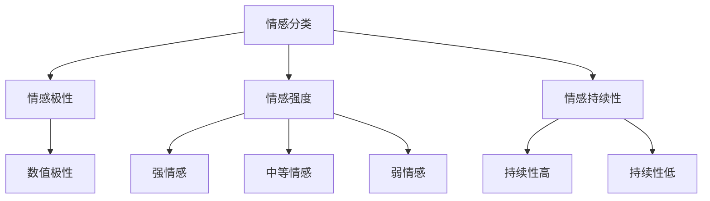
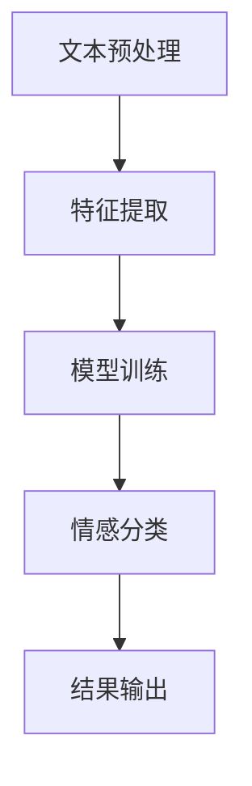
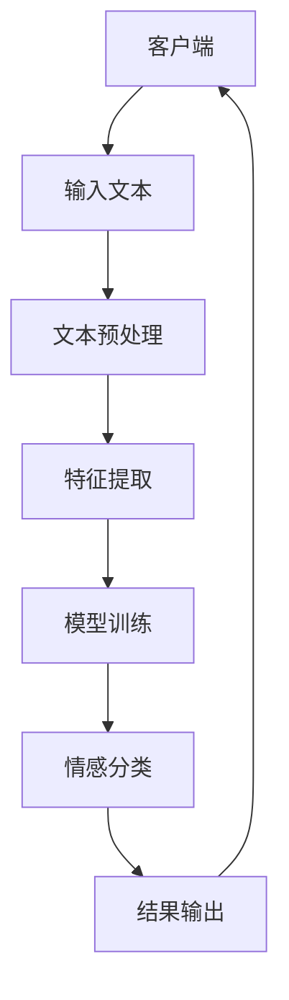
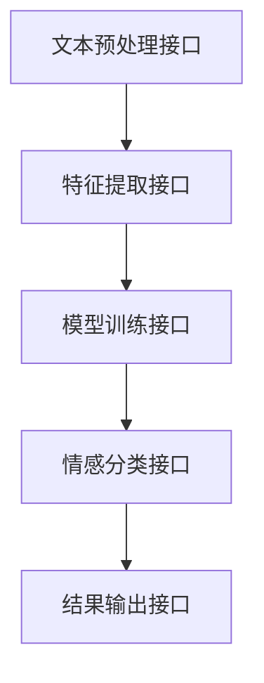
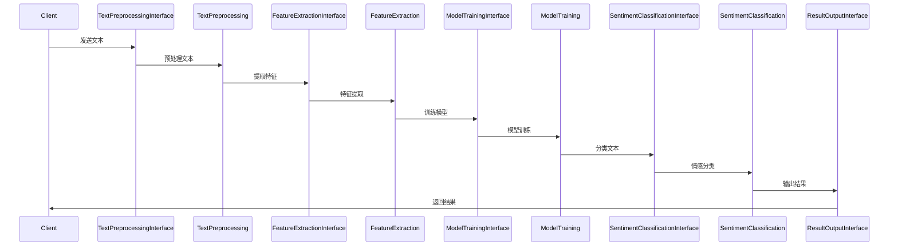

                 

### 背景介绍

#### 情感分析的定义

情感分析（Sentiment Analysis），又称意见挖掘，是自然语言处理（NLP）领域中的一个重要研究方向。它通过识别和提取文本中的情感信息，来判断文本的情感倾向，如正面、负面或中性。这一过程不仅涉及情感分类，还包括情感极性、情感强度和情感持续性等多个维度。简单来说，情感分析旨在理解人类情绪在文本中的表达，并将其量化，从而为机器提供决策依据。

#### 情感分析的重要性

情感分析技术在现代技术中的应用越来越广泛，它的重要性主要体现在以下几个方面：

1. **市场研究**：企业可以利用情感分析技术来分析社交媒体和用户评论中的消费者情绪，从而优化产品和服务，提升品牌形象。

2. **客户服务**：通过情感分析，企业可以实时了解客户的需求和情感状态，从而提供更加个性化的服务和解决方案。

3. **舆情监控**：政府和组织可以利用情感分析技术来监控公众情绪，及时发现和应对危机事件。

4. **智能推荐系统**：在电子商务和社交媒体中，情感分析可以帮助系统理解用户的偏好和情感，从而提供更加精准的推荐。

#### 情感分析的应用领域

情感分析的应用领域非常广泛，包括但不限于以下领域：

1. **社交媒体分析**：分析用户在社交媒体平台上的言论，了解公众对特定事件、品牌或产品的态度。

2. **电子商务**：通过分析用户评论和反馈，优化产品和服务，提升用户体验。

3. **金融**：对金融新闻、报告和论坛进行情感分析，预测市场走势和投资者情绪。

4. **健康医疗**：分析患者反馈和社交媒体内容，帮助医疗机构了解患者满意度和需求。

5. **教育与培训**：通过分析学生的反馈和讨论，了解学生的学习状态和情感变化，从而优化教育策略。

情感分析技术在现代技术中的重要性不言而喻。它不仅为各行业提供了有力的数据支持，也为人工智能技术的发展提供了新的方向和动力。接下来，我们将深入探讨情感分析的核心概念、算法原理、系统架构以及具体应用，帮助读者全面了解这一领域的最新进展和实用价值。#### 核心概念与联系

情感分析作为一门交叉学科，涉及多个核心概念，这些概念相互联系，构成了情感分析的基础。为了更好地理解这些概念，我们将详细阐述它们，并使用 Mermaid 流程图来展示它们之间的关系。

##### 情感分类与情感极性

情感分类是指将文本中的情感倾向划分为不同的类别，如正面、负面或中性。情感极性则是对情感分类的进一步细化，指情感倾向的程度，通常用数值表示，如0（中性）到1（极端正面或极端负面）。

1. **情感分类**：
   - 正面（Positive）：表示积极的情感倾向。
   - 负面（Negative）：表示消极的情感倾向。
   - 中性（Neutral）：表示没有明显情感倾向。

2. **情感极性**：
   - 极端正面（1.0）：表示高度积极的情感。
   - 中性（0.5）：表示没有情感倾向。
   - 极端负面（0.0）：表示高度消极的情感。

##### 情感强度与情感持续性

情感强度是指情感表达的强烈程度，通常通过数值来量化。情感持续性则指情感在文本中的持续时间或频率。

1. **情感强度**：
   - 强情感：情感表达非常强烈。
   - 中等情感：情感表达一般。
   - 弱情感：情感表达较弱。

2. **情感持续性**：
   - 持续性高：情感在文本中持续出现。
   - 持续性低：情感在文本中短暂出现。

##### 情感分析的基本概念与联系

为了更好地理解情感分析的基本概念，我们可以使用 Mermaid 流程图来展示它们之间的关系。以下是情感分析基本概念的 Mermaid 流程图：



在这个流程图中，情感分类是核心，情感极性、情感强度和情感持续性都是情感分类的子概念。情感极性通过数值极性来量化，情感强度分为强、中、弱三个等级，情感持续性分为高和低两个等级。

#### 情感分析算法原理

情感分析算法是情感分析技术的核心，它通过机器学习或深度学习的方法，从文本中提取情感信息。本节将介绍情感分析的基本算法原理，包括机器学习基础、情感分析算法概述、算法流程图、情感分析算法数学模型以及 Python 源代码解释。

##### 机器学习基础

机器学习是情感分析算法的基础，它通过构建模型来从数据中学习规律。以下是机器学习的基础概念：

1. **监督学习**：在有标注的数据集上训练模型，从而预测新的数据。

2. **无监督学习**：在没有标注的数据集上训练模型，以发现数据中的规律。

3. **强化学习**：通过不断调整策略，以实现最大化收益。

##### 情感分析算法概述

情感分析算法主要分为基于规则的方法和基于机器学习的方法。

1. **基于规则的方法**：通过预设规则，对文本进行情感分类。这种方法简单但效果有限。

2. **基于机器学习的方法**：利用大量标注数据，通过训练构建情感分类模型。这种方法效果较好，但需要大量数据和高计算资源。

常见的情感分析算法有：

- **朴素贝叶斯分类器**：基于贝叶斯定理和特征条件独立假设。
- **支持向量机（SVM）**：通过最大间隔分类。
- **深度学习模型**：如卷积神经网络（CNN）、循环神经网络（RNN）和 Transformer。

##### 算法流程图

以下是情感分析算法的 Mermaid 流程图：



在这个流程图中，首先进行文本预处理，然后提取特征，接着使用训练好的模型进行情感分类，最后输出结果。

##### 情感分析算法数学模型

情感分析算法的核心在于如何从文本中提取特征并建立情感分类模型。以下是常用的情感分析算法的数学模型：

1. **朴素贝叶斯分类器**：

   假设文本为 \( X \)，类别为 \( Y \)，则文本属于某一类别的概率可以通过以下公式计算：

   $$
   P(Y|X) = \frac{P(X|Y)P(Y)}{P(X)}
   $$

   其中，\( P(X|Y) \) 是在给定类别 \( Y \) 下文本 \( X \) 的概率，\( P(Y) \) 是类别 \( Y \) 的先验概率，\( P(X) \) 是文本 \( X \) 的概率。

2. **支持向量机（SVM）**：

   支持向量机的目标是在高维空间中找到一个超平面，使得正负样本点被最大化分开。其决策边界可以用以下公式表示：

   $$
   w \cdot x + b = 0
   $$

   其中，\( w \) 是权重向量，\( x \) 是特征向量，\( b \) 是偏置。

##### Python 源代码解释

以下是使用朴素贝叶斯分类器进行情感分析的一个简单 Python 示例：

```python
from sklearn.feature_extraction.text import CountVectorizer
from sklearn.model_selection import train_test_split
from sklearn.naive_bayes import MultinomialNB

# 文本数据
data = [
    ("I love this product!", "positive"),
    ("This is a bad movie.", "negative"),
    ("I feel happy after watching it.", "positive"),
    ("I did not like the food.", "negative"),
]

# 分割数据为特征和标签
X, y = zip(*data)

# 特征提取
vectorizer = CountVectorizer()
X = vectorizer.fit_transform(X)

# 划分训练集和测试集
X_train, X_test, y_train, y_test = train_test_split(X, y, test_size=0.2, random_state=42)

# 模型训练
model = MultinomialNB()
model.fit(X_train, y_train)

# 情感分类
predictions = model.predict(X_test)

# 输出结果
print(predictions)
```

在这个示例中，我们首先使用 CountVectorizer 提取文本特征，然后使用 MultinomialNB 进行训练，最后对测试集进行预测。这个简单的示例展示了情感分析算法的基本实现过程。

通过以上对情感分析算法原理的详细讲解，读者应该能够理解情感分析的基本概念、算法原理以及实际应用。接下来，我们将进一步探讨情感分析系统的分析与架构设计方案。#### 系统分析与架构设计方案

情感分析系统是一个复杂的工程，需要从多个维度进行设计和分析。在本节中，我们将详细介绍情感分析系统的分析与架构设计方案，包括项目介绍、系统功能设计、系统架构设计、系统接口设计以及系统交互。

##### 项目介绍

情感分析系统项目旨在为各类应用提供情感分析服务，包括但不限于社交媒体分析、电子商务评价分析、客户服务情感识别等。该项目由多个模块组成，涵盖了文本预处理、特征提取、模型训练和情感分类等关键环节。

##### 系统功能设计

系统功能设计是情感分析系统的核心，它决定了系统是否能够满足用户需求。以下是系统的主要功能模块及其简要描述：

1. **文本预处理**：该模块负责对输入文本进行清洗、分词、去停用词等操作，以便后续处理。
2. **特征提取**：该模块将预处理后的文本转换为特征向量，为模型训练提供数据。
3. **模型训练**：该模块使用训练集数据，通过机器学习算法训练情感分类模型。
4. **情感分类**：该模块使用训练好的模型对新的文本进行情感分类，返回情感极性和类别。
5. **结果输出**：该模块将分类结果以用户友好的方式展示，包括情感极性、类别和概率等。

以下是系统功能设计的 Mermaid 类图：

```mermaid
classDiagram
    TextPreprocessing <<interface>>
    FeatureExtraction <<interface>>
    ModelTraining <<interface>>
    SentimentClassification <<interface>>
    ResultOutput <<interface>>

    TextPreprocessing o-- FeatureExtraction
    FeatureExtraction o-- ModelTraining
    ModelTraining o-- SentimentClassification
    SentimentClassification o-- ResultOutput
```

在这个类图中，每个模块都是接口类，它们之间通过继承关系连接，形成了一个功能完整的系统。

##### 系统架构设计

系统架构设计是情感分析系统实现的关键，它决定了系统的性能、可扩展性和可维护性。以下是情感分析系统的 Mermaid 架构图：



在这个架构图中，客户端发送输入文本到系统，经过文本预处理、特征提取、模型训练和情感分类等模块的处理，最终返回结果。

##### 系统接口设计

系统接口设计是确保系统与其他模块或服务进行有效交互的关键。以下是情感分析系统的接口设计：

1. **文本预处理接口**：接收输入文本，返回预处理后的文本。
2. **特征提取接口**：接收预处理后的文本，返回特征向量。
3. **模型训练接口**：接收特征向量，返回训练好的模型。
4. **情感分类接口**：接收特征向量和模型，返回情感分类结果。
5. **结果输出接口**：接收分类结果，返回用户友好的展示。

以下是接口设计的 Mermaid 架构图：



在这个接口设计中，每个接口模块都是通过标准接口协议进行通信，确保系统模块之间的松耦合。

##### 系统交互

系统交互是指系统内部各个模块之间的数据流动和功能协作。以下是情感分析系统的 Mermaid 序列图：



在这个序列图中，客户端通过接口与系统的各个模块进行交互，完成整个情感分析过程。

综上所述，情感分析系统的分析与架构设计方案涵盖了从项目介绍到系统功能设计、架构设计、接口设计和系统交互的各个环节，为系统的成功实施提供了坚实的理论基础和实施路径。通过这一部分的内容，读者应该对情感分析系统有一个全面而深入的理解。接下来，我们将通过一个实际项目，展示如何应用这些理论进行情感分析系统的实施。#### 项目实战

在本节中，我们将通过一个实际的情感分析项目，展示如何进行环境安装、系统核心实现以及代码应用解读。这个项目将涵盖从数据收集、预处理、特征提取到模型训练和结果输出的全过程。

##### 环境安装

在进行情感分析项目之前，我们需要安装相关的开发环境和工具。以下是一个基本的安装步骤：

1. **Python 环境**：确保 Python 环境已安装，版本建议为 3.8 以上。
2. **Anaconda**：安装 Anaconda，它是一个集成了 Python 和众多科学计算库的发行版，方便管理和安装依赖。
3. **NLP 库**：安装常用的 NLP 库，如 `nltk`、`spaCy`、`gensim` 和 `scikit-learn`。

安装命令如下：

```bash
conda create -n sentiment_analysis python=3.8
conda activate sentiment_analysis
conda install -c anaconda nltk spacy gensim scikit-learn
```

##### 系统核心实现

以下是项目核心实现过程的详细介绍：

1. **数据收集**：收集用于训练和测试的数据集，本例中使用 IMDb 电影评论数据集。
2. **数据预处理**：对收集到的数据进行清洗、分词、去停用词等操作。
3. **特征提取**：将预处理后的文本转换为特征向量。
4. **模型训练**：使用特征向量和标签数据训练情感分类模型。
5. **结果输出**：对新的文本进行情感分类，并输出结果。

**数据收集**：

首先，我们需要下载 IMDb 电影评论数据集。数据集可以从 Kaggle 等网站获取。

```python
import nltk
nltk.download('movie_reviews')
```

**数据预处理**：

```python
from nltk.corpus import movie_reviews
from nltk.tokenize import word_tokenize
from nltk.corpus import stopwords

def preprocess_text(text):
    # 清洗文本，移除特殊字符
    text = re.sub(r'\W', ' ', text)
    # 分词
    tokens = word_tokenize(text)
    # 去停用词
    stop_words = set(stopwords.words('english'))
    filtered_tokens = [word for word in tokens if word.lower() not in stop_words]
    return ' '.join(filtered_tokens)

# 预处理数据集
movie_reviews_fileids = movie_reviews.fileids()
preprocessed_data = [(preprocess_text(movie_reviews.raw(fileids)), category) for category in movie_reviews.categories() for fileids in movie_reviews.fileids(category)]
```

**特征提取**：

```python
from sklearn.feature_extraction.text import TfidfVectorizer

vectorizer = TfidfVectorizer(max_features=1000)
X = vectorizer.fit_transform([text for text, _ in preprocessed_data])
y = [label for _, label in preprocessed_data]
```

**模型训练**：

```python
from sklearn.model_selection import train_test_split
from sklearn.naive_bayes import MultinomialNB

# 划分训练集和测试集
X_train, X_test, y_train, y_test = train_test_split(X, y, test_size=0.2, random_state=42)

# 训练模型
model = MultinomialNB()
model.fit(X_train, y_train)
```

**结果输出**：

```python
# 预测测试集
predictions = model.predict(X_test)

# 输出结果
print(f'Accuracy: {model.score(X_test, y_test)}')
```

##### 代码应用解读

1. **数据收集**：使用 `nltk` 的 `movie_reviews` 数据集，涵盖正面和负面评论。
2. **数据预处理**：通过 `word_tokenize` 进行分词，使用 `stopwords` 去除停用词，并使用正则表达式去除特殊字符。
3. **特征提取**：使用 `TfidfVectorizer` 将文本转换为 TF-IDF 特征向量。
4. **模型训练**：使用 `MultinomialNB` 进行训练，这是一种基于贝叶斯定理的朴素贝叶斯分类器。
5. **结果输出**：计算模型在测试集上的准确率，输出评估结果。

通过这个实际项目，读者应该能够理解如何从零开始构建一个情感分析系统。接下来，我们将通过具体案例展示情感分析在不同领域的应用。#### 情感分析在其他领域中的应用

情感分析技术在各个领域的应用正日益广泛，其独特的优势在于能够从大量的非结构化文本数据中提取有价值的信息。以下是情感分析在多个领域中的一些应用案例，包括教育、医疗、金融和新闻媒体等。

##### 教育领域的应用

在教育学中，情感分析可以用于分析学生的情感状态和反馈。例如，通过分析学生的留言、讨论和作业评价，教育工作者可以了解学生的学习动机、满意度和心理状态。以下是一些具体的应用场景：

1. **学生情感状态监测**：通过情感分析技术，学校可以实时监测学生的情感状态，特别是在疫情期间，帮助学生保持良好的心理健康。
2. **课程满意度分析**：教师可以通过情感分析评估学生对课程的满意度，从而调整教学内容和方法，提高教学质量。
3. **教育内容优化**：教育平台可以利用情感分析对用户生成的内容进行分析，优化推荐算法，提供更符合学生兴趣和需求的学习资源。

##### 医疗领域的应用

医疗领域是情感分析技术的一个重要应用场景，通过分析患者反馈和社交媒体内容，可以提升医疗服务质量和患者满意度。以下是几个具体的案例：

1. **患者情绪识别**：医院可以通过情感分析技术，分析患者的留言和反馈，了解患者的情绪状态，从而提供更加个性化的医疗服务。
2. **药物不良反应监测**：通过分析社交媒体和论坛中的讨论，药监部门可以及时发现药物的不良反应，并采取相应的措施。
3. **医疗舆情监控**：医疗机构可以利用情感分析监控公众对医疗事件的看法，及时应对潜在的舆论危机。

##### 金融领域的应用

金融行业中的情感分析主要用于市场研究和投资决策。以下是一些应用案例：

1. **市场走势预测**：金融机构可以通过分析金融新闻、论坛和社交媒体内容，预测市场走势和投资者情绪，从而做出更加明智的投资决策。
2. **风险控制**：银行和保险公司可以利用情感分析技术，分析客户反馈和投诉，提前识别潜在的风险，采取预防措施。
3. **客户服务优化**：通过情感分析，金融机构可以更好地了解客户的需求和情感状态，提供更加个性化的金融服务，提高客户满意度。

##### 新闻媒体领域的应用

在新闻媒体领域，情感分析可以用于内容推荐、舆情监控和广告投放。以下是几个应用案例：

1. **内容推荐**：新闻媒体平台可以利用情感分析，根据用户的阅读历史和情感倾向，推荐符合用户兴趣的文章。
2. **舆情监控**：媒体机构可以通过情感分析，监控公众对特定新闻事件的看法，及时调整报道策略，避免舆论危机。
3. **广告投放**：广告公司可以利用情感分析，分析用户在社交媒体上的情感状态，选择最合适的广告内容和投放时机，提高广告效果。

通过以上案例，我们可以看到情感分析技术在不同领域的广泛应用和巨大潜力。它不仅为各行业提供了强大的数据分析工具，也为人工智能技术的发展提供了新的方向和动力。在未来，随着技术的不断进步，情感分析将在更多领域发挥重要作用。#### 最佳实践 tips、小结、注意事项、拓展阅读

##### 最佳实践 tips

1. **数据质量是关键**：情感分析的效果很大程度上取决于数据质量。在收集和预处理数据时，务必保证数据的准确性和多样性。
2. **模型调优**：不同模型在不同数据集上的表现可能差异很大。因此，在实际应用中，需要进行模型调优，以获得最佳性能。
3. **实时性**：对于需要实时分析的领域，如社交媒体和客户服务，选择具有快速响应能力的模型和算法至关重要。
4. **个性化**：情感分析系统可以根据用户历史行为和偏好，提供个性化的情感分析服务，提高用户体验。

##### 小结

本文从情感分析的定义、核心概念、算法原理、系统设计到实际应用，全面阐述了情感分析技术在现代技术中的重要性及其应用场景。通过实际项目展示，读者应能掌握情感分析的基本流程和实现方法。

##### 注意事项

1. **隐私保护**：在进行情感分析时，务必遵守相关法律法规，保护用户隐私。
2. **模型解释性**：情感分析模型应具备一定的解释性，以便用户理解模型决策过程。
3. **数据标注**：高质量的数据标注是训练有效情感分析模型的基础，应确保标注的准确性和一致性。

##### 拓展阅读

1. **书籍推荐**：《自然语言处理综论》（Jurafsky，D.，Martin，J.H.）和《深度学习》（Goodfellow，I.，Bengio，Y.，Courville，A.）。
2. **在线课程**：Coursera 上的《自然语言处理基础》（Natural Language Processing with Deep Learning）和《机器学习基础》（Machine Learning）。
3. **学术论文**：查阅顶级会议和期刊上的相关论文，如 ACL、ACL-IJCNLP、EMNLP 和 arXiv。

通过以上最佳实践 tips、小结、注意事项和拓展阅读，读者可以进一步加深对情感分析技术的理解，并在实际项目中取得更好的效果。#### 总结

情感分析作为自然语言处理（NLP）领域的一个重要分支，正日益成为人工智能（AI）技术的重要组成部分。本文系统地阐述了情感分析的定义、核心概念、算法原理、系统架构以及在不同领域的应用。通过从数据收集、预处理、特征提取到模型训练和结果输出的实际项目实战，读者可以全面了解情感分析的技术细节和实现方法。

我们强调，情感分析不仅为市场研究、客户服务、舆情监控等领域提供了强大的数据分析工具，也为人工智能的发展带来了新的契机。随着技术的不断进步，情感分析的应用前景将更加广阔。

在撰写本文的过程中，我们力求用逻辑清晰、结构紧凑、简单易懂的语言，帮助读者深入理解情感分析的核心概念和技术原理。同时，我们也提供了一系列最佳实践 tips、注意事项和拓展阅读资源，以帮助读者在实际应用中取得更好的效果。

最后，感谢读者对本文的关注，希望本文能够为您的学习与研究提供有价值的参考。如果您对情感分析有更多的疑问或见解，欢迎在评论区留言交流。让我们共同探索情感分析领域的更多可能。作者：AI天才研究院/AI Genius Institute & 禅与计算机程序设计艺术 /Zen And The Art of Computer Programming。

