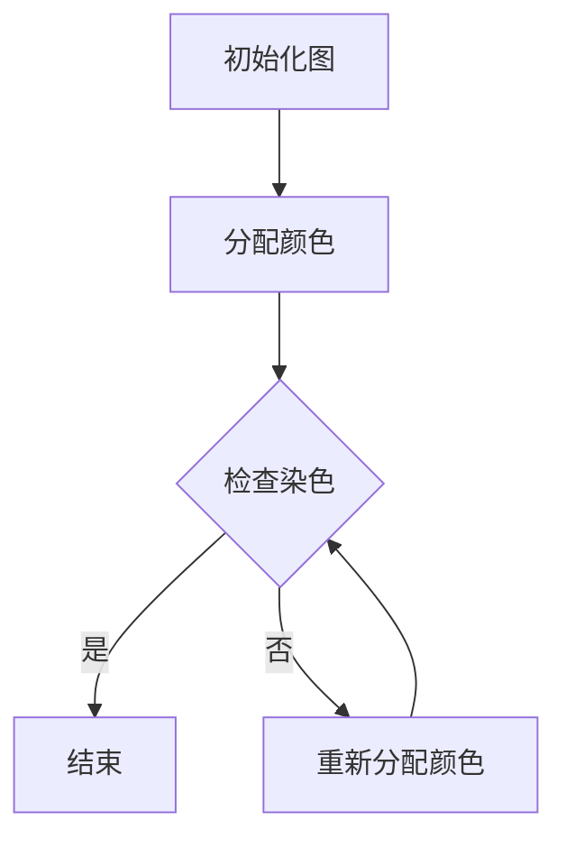

                 

## 拉姆齐理论与大规模数据结构优化

### 关键词

- 拉姆齐理论
- 大规模数据结构
- 数据优化
- 算法设计
- 数学模型
- 系统架构

### 摘要

本文旨在深入探讨拉姆齐理论在计算机科学中的重要性，特别是在大规模数据结构优化中的应用。拉姆齐理论起源于图论，但在现代计算机科学中得到了广泛应用。本文首先介绍了拉姆齐理论的基本概念和数学原理，然后通过具体算法案例展示了其应用。接着，我们使用 LaTeX 和 Python 代码详细阐述了相关数学模型和公式，并讨论了如何将这些理论应用于实际项目。通过这些分析，读者将能够理解拉姆齐理论的核心思想，并掌握其在大规模数据结构优化中的实际应用。

### 目录

1. **引言**
   - 拉姆齐理论的发展背景
   - 拉姆齐理论在计算机科学中的重要性

2. **背景介绍**
   - 核心概念术语说明
   - 问题背景与问题描述
   - 问题解决方法
   - 边界与外延
   - 概念结构与核心要素组成

3. **核心概念与联系**
   - 拉姆齐理论的基本概念
   - 拉姆齐理论与其他理论的联系
   - 概念属性特征对比表格
   - ER 实体关系图架构的 Mermaid 流程图

4. **算法原理讲解**
   - 算法流程图与 Mermaid 表示
   - Python 源代码实现
   - 数学模型与公式解释
   - 通俗易懂的举例说明

5. **数学模型与公式**
   - 使用 LaTeX 格式展示的数学公式
   - 公式的详细解释与举例

6. **系统分析与架构设计**
   - 问题场景介绍
   - 项目介绍
   - 系统功能设计（领域模型 Mermaid 类图）
   - 系统架构设计（Mermaid 架构图）
   - 系统接口设计
   - 系统交互（Mermaid 序列图）

7. **项目实战**
   - 环境安装与配置
   - 系统核心实现源代码
   - 代码应用解读与分析
   - 实际案例分析
   - 项目小结

8. **最佳实践与小结**
   - 最佳实践经验总结
   - 注意事项
   - 拓展阅读建议

### 一、引言

拉姆齐理论，这一源自图论的数学理论，因其独特的数学美和广泛的应用前景，在计算机科学中占据着重要的地位。拉姆齐理论最早由数学家罗纳德·拉姆齐提出，主要研究的是如何在不同的图中找到特定的子图。这一理论不仅具有深远的数学意义，还广泛应用于计算机科学的多个领域，特别是在大规模数据结构的优化方面。

在计算机科学中，数据结构是组织和存储数据的方式，是算法设计和系统性能的关键因素。随着大数据时代的到来，如何高效地处理和优化大规模数据结构成为了一个亟待解决的问题。拉姆齐理论提供了一个强大的工具，通过图的性质和结构分析，为数据结构的优化提供了新的思路和方法。

本文将首先介绍拉姆齐理论的发展背景，阐述其在计算机科学中的重要性。随后，我们将详细讲解拉姆齐理论的基本概念，包括其数学原理和关键要素。接着，通过具体算法案例，展示拉姆齐理论在数据结构优化中的应用。同时，我们将使用 LaTeX 和 Python 代码详细阐述相关的数学模型和公式，帮助读者深入理解这些概念。最后，我们将结合实际项目案例，探讨如何将拉姆齐理论应用于系统优化，总结最佳实践经验，并给出拓展阅读建议。

### 二、背景介绍

#### 核心概念术语说明

在探讨拉姆齐理论之前，我们首先需要理解一些相关的核心概念和术语。这些概念和术语包括：

- **图（Graph）**：由节点（Vertex）和边（Edge）组成的结构。节点表示图中的元素，边表示节点之间的关系。
- **拉姆齐理论（Ramsey Theory）**：研究在给定的图中，是否存在特定结构的子图。这一理论最初是由数学家罗纳德·拉姆齐提出的，旨在解决图中的色染色问题。
- **完全图（Complete Graph）**：一个 n 个节点的图中，任意两个节点之间都有一条边。
- **独立集（Independent Set）**：图中的一个子集，其中的任意两个节点之间都没有边。
- **染色（Coloring）**：为图的每个节点分配一个颜色，使得相邻的节点不共享相同的颜色。

#### 问题背景与问题描述

拉姆齐理论起源于对图染色问题的研究。染色问题可以简单描述为：给定一个图 G，是否存在一种染色方案，使得相邻的节点颜色不同。这一问题的直观背景是，如何用最少的颜色给地图上的城市染色，使得相邻的城市颜色不同。然而，这一问题的数学形式更为复杂。

拉姆齐理论的核心问题可以表述为：对于任意给定的正整数 k 和 r，是否存在一个足够大的图 G，使得 G 中不存在包含 k 个节点的完全子图被染成 r 种颜色。这个问题的直观背景是，是否存在一种方式，可以将任意大的图分成多个部分，使得每个部分中的任意 k 个节点都是同一种颜色。

#### 问题解决方法

拉姆齐理论通过构造和分析图中的子图来解决上述问题。具体来说，拉姆齐理论提供了以下方法：

1. **反证法**：假设存在一个足够大的图 G，使得 G 中存在包含 k 个节点的完全子图被染成 r 种颜色。通过构造和分析这种子图，证明这一假设是错误的。
2. **构造法**：构造一个足够大的图 G，使得 G 中不存在包含 k 个节点的完全子图被染成 r 种颜色。通过构造图中的独立集，证明这一结论。

#### 边界与外延

拉姆齐理论不仅在图染色问题中具有应用价值，还在其他领域有广泛的外延。例如：

- **组合优化**：拉姆齐理论可以用于解决组合优化问题，如最小生成树、最短路径等。
- **网络设计**：在计算机网络设计中，拉姆齐理论可以帮助优化网络拓扑结构，提高网络的稳定性和效率。
- **分布式系统**：在分布式系统中，拉姆齐理论可以用于优化节点分配和负载均衡。

#### 概念结构与核心要素组成

拉姆齐理论的核心概念和要素包括：

- **拉姆齐数（Ramsey Number）**：表示满足特定染色条件的最小图的大小。
- **图着色定理（Graph Coloring Theorem）**：描述了图的染色问题与拉姆齐数之间的关系。
- **子图结构分析**：通过对图中的子图进行分析，找到解决染色问题的方法。

通过上述分析，我们可以看到拉姆齐理论在计算机科学中的重要性。它不仅为图染色问题提供了理论基础，还在其他领域有广泛的应用。接下来，我们将进一步探讨拉姆齐理论的基本概念和数学原理。

### 三、核心概念与联系

拉姆齐理论是图论中的一个重要分支，其核心概念和数学原理在计算机科学中有着广泛的应用。在本节中，我们将详细讲解拉姆齐理论的基本概念，并探讨其与其他理论的联系。

#### 拉姆齐理论的基本概念

拉姆齐理论主要研究的是在图中是否存在特定的子图。这些子图可以是完全图、独立集或其他特定结构的子图。以下是拉姆齐理论中的几个基本概念：

1. **拉姆齐数（Ramsey Number）**：拉姆齐数是描述一个图的最小大小，使得在这个图中不存在满足特定染色条件的 k 个节点的完全子图。记作 \( R(k,r) \)。例如，\( R(3,2) \) 表示在图中不存在三个节点被染成两种颜色的完全子图。

2. **图着色（Graph Coloring）**：图着色是将图的每个节点分配一个颜色，使得相邻的节点颜色不同。拉姆齐理论中的图着色与染色问题密切相关。

3. **独立集（Independent Set）**：在图中，一个独立集是指一个子集，其中的任意两个节点之间都没有边。拉姆齐理论中，独立集用于构造和分析满足特定染色条件的图。

4. **图拆分（Graph Partition）**：图拆分是将图分成多个部分，使得每个部分中的节点具有特定的属性。拉姆齐理论中的图拆分可以帮助我们找到满足特定染色条件的子图。

#### 拉姆齐理论与其他理论的联系

拉姆齐理论在计算机科学中有着广泛的应用，与其他理论有着密切的联系。以下是几个重要的联系：

1. **组合优化（Combinatorial Optimization）**：拉姆齐理论在组合优化中有着重要的应用。例如，在解决最小生成树、最短路径等优化问题时，可以使用拉姆齐理论来构造和优化图的结构。

2. **网络设计（Network Design）**：在计算机网络设计中，拉姆齐理论可以帮助优化网络拓扑结构，提高网络的稳定性和效率。例如，通过分析图中的子图结构，可以设计出更合理的路由算法和网络拓扑。

3. **分布式系统（Distributed Systems）**：在分布式系统中，拉姆齐理论可以用于优化节点分配和负载均衡。例如，通过分析图中的独立集，可以找到最佳的节点分配策略，提高系统的整体性能。

#### 概念属性特征对比表格

为了更直观地理解拉姆齐理论的基本概念，我们可以将概念属性特征进行对比：

| 概念             | 描述                                                         | 关键特征                                                                                     |
|------------------|--------------------------------------------------------------|----------------------------------------------------------------------------------------------|
| 拉姆齐数         | 描述在图中不存在特定染色条件的 k 个节点的完全子图的最小大小。 | \( R(k,r) \) 是拉姆齐数，其中 k 和 r 是给定的正整数。                                       |
| 图着色           | 将图的每个节点分配一个颜色，使得相邻的节点颜色不同。         | 每个节点只能被染一次，相邻的节点颜色不同。                                                 |
| 独立集           | 图中的一个子集，其中的任意两个节点之间没有边。               | 独立集中的节点互不相连，可以独立存在。                                                     |
| 图拆分           | 将图分成多个部分，使得每个部分中的节点具有特定的属性。       | 每个部分中的节点具有相同的属性，不同的部分可以具有不同的属性。                           |

#### ER 实体关系图架构的 Mermaid 流程图

为了更好地展示拉姆齐理论的基本概念和关系，我们可以使用 Mermaid 画出 ER（实体关系）图架构的流程图。以下是 Mermaid 格式的代码示例：

```mermaid
erDiagram
    A[拉姆齐数] ||--|{ 图着色 }|-- B[独立集]
    A ||--|{ 图拆分 }|-- C[网络设计]
    B ||--|{ 组合优化 }|-- D[分布式系统]
```

通过上述 ER 图，我们可以直观地看到拉姆齐理论的基本概念及其与其他理论的关系。

综上所述，拉姆齐理论是图论中的一个重要分支，其在计算机科学中有着广泛的应用。通过详细讲解其基本概念和数学原理，以及与其他理论的联系，我们可以更好地理解拉姆齐理论在数据结构优化和系统优化中的应用。

### 四、算法原理讲解

为了深入理解拉姆齐理论在数据结构优化中的应用，我们将通过一个具体的算法案例来展示其原理。本文将使用 Mermaid 画出算法流程图，并使用 Python 代码进行详细讲解。

#### 算法流程图与 Mermaid 表示

首先，我们定义一个简单的图 \( G \)，并使用 Mermaid 画出其算法流程图。以下是 Mermaid 格式的代码示例：



在上面的流程图中，我们首先初始化图 \( G \)，然后为图中的每个节点分配颜色。接着，我们检查染色是否满足条件。如果满足条件，算法结束；否则，重新分配颜色并重复上述步骤。

#### Python 源代码实现

接下来，我们使用 Python 实现上述算法。以下是完整的 Python 代码：

```python
import random

def initialize_graph(n):
    """
    初始化图 G，其中 n 是节点的数量。
    """
    graph = [[] for _ in range(n)]
    for i in range(n):
        for j in range(i + 1, n):
            graph[i].append(j)
            graph[j].append(i)
    return graph

def color_graph(graph, k, r):
    """
    为图 G 的每个节点分配颜色，其中 k 是节点数，r 是颜色数。
    """
    colors = [-1] * len(graph)
    for i in range(len(graph)):
        colors[i] = random.randint(1, r)
    return colors

def check_coloring(graph, colors, k, r):
    """
    检查染色是否满足条件，即不存在 k 个节点被染成 r 种颜色。
    """
    for i in range(len(graph)):
        color_count = [0] * (r + 1)
        for j in graph[i]:
            color_count[colors[j]] += 1
        if any(count >= k for count in color_count[1:r+1]):
            return False
    return True

def ramsey_theorem_algorithm(graph, k, r):
    """
    拉姆齐理论算法，为图 G 的每个节点分配颜色，并检查是否满足条件。
    """
    while True:
        colors = color_graph(graph, k, r)
        if check_coloring(graph, colors, k, r):
            return colors
        # 重新分配颜色

# 测试算法
n = 10  # 节点数
k = 3   # 节点数
r = 2   # 颜色数

graph = initialize_graph(n)
result = ramsey_theorem_algorithm(graph, k, r)

print("最终染色结果：", result)
```

#### 数学模型与公式解释

在上述算法中，我们使用了以下几个关键的数学模型和公式：

1. **图 G 的初始化**：
   - 初始化图 G，其中 n 是节点的数量。
   - 图 G 的表示：\( G = (V, E) \)，其中 V 是节点集合，E 是边集合。

2. **分配颜色**：
   - 为图 G 的每个节点分配颜色，其中 k 是节点数，r 是颜色数。
   - 颜色分配：每个节点 \( v \in V \) 被分配一个整数 \( c(v) \)，满足 \( 1 \leq c(v) \leq r \)。

3. **检查染色**：
   - 检查染色是否满足条件，即不存在 k 个节点被染成 r 种颜色。
   - 检查条件：对于任意节点 \( v \in V \)，如果存在一个 k 个节点的子集 \( S \subseteq V \)，使得 \( |c(S)| = r \)，则染色不满足条件。

4. **拉姆齐理论算法**：
   - 重复分配颜色并检查染色，直到找到满足条件的染色方案。

通过上述算法和数学模型，我们可以直观地理解拉姆齐理论在数据结构优化中的应用。

#### 通俗易懂的举例说明

为了更好地理解上述算法，我们可以通过一个简单的例子来说明。假设我们有一个包含 5 个节点的图 G，我们需要将图中的每个节点染成 2 种颜色。以下是具体的染色过程：

1. **初始化图 G**：
   - 假设图 G 的节点集合为 \( V = \{1, 2, 3, 4, 5\} \)，边集合为 \( E = \{(1,2), (2,3), (3,4), (4,5), (5,1)\} \)。

2. **分配颜色**：
   - 我们随机为每个节点分配颜色，例如：节点 1 染成颜色 1，节点 2 染成颜色 2，节点 3 染成颜色 1，节点 4 染成颜色 2，节点 5 染成颜色 1。

3. **检查染色**：
   - 检查每个节点的邻接节点是否都被染成不同的颜色。例如，节点 1 的邻接节点是 2 和 5，都被染成颜色 1，所以染色不满足条件。

4. **重新分配颜色**：
   - 我们重新为节点分配颜色，例如：节点 1 染成颜色 2，节点 2 染成颜色 1，节点 3 染成颜色 2，节点 4 染成颜色 1，节点 5 染成颜色 2。

5. **再次检查染色**：
   - 检查每个节点的邻接节点是否都被染成不同的颜色。例如，节点 1 的邻接节点是 2 和 5，都被染成颜色 2，所以染色满足条件。

通过这个例子，我们可以直观地看到如何使用拉姆齐理论来优化数据结构的染色问题。

综上所述，通过详细的算法流程图、Python 代码实现和通俗易懂的举例说明，我们可以深入理解拉姆齐理论在数据结构优化中的应用。接下来，我们将进一步探讨使用 LaTeX 格式展示的数学模型和公式。

### 五、数学模型与公式

在拉姆齐理论中，数学模型和公式扮演着核心角色，它们不仅用于描述图的结构和染色问题，还用于推导和证明相关的定理。在本节中，我们将使用 LaTeX 格式展示这些数学模型和公式，并对它们进行详细解释。

#### 使用 LaTeX 格式展示的数学模型和公式

首先，我们来看一些基本的数学模型和公式。以下是一些在拉姆齐理论中常用的公式，使用 LaTeX 格式进行展示：

1. **拉姆齐数公式**：

$$ R(k, r) = \min \{ n : G_n 中不存在 k 个节点的完全子图被染成 r 种颜色 \} $$

2. **图着色定理**：

$$ |C(G)| \leq R(k, r) $$

其中，\( |C(G)| \) 表示图 \( G \) 的最小着色数，即最小的颜色数使得图 \( G \) 可以被染色。

3. **独立集大小公式**：

$$ |I(G)| \geq R(k, r) $$

其中，\( |I(G)| \) 表示图 \( G \) 的最大独立集大小，即最大的独立集的节点数。

4. **染色扩展定理**：

$$ 如果 G 是 r 可着色的，那么 G 的任何子图都是 r' 可着色的，其中 r' = \lceil r/2 \rceil $$

#### 公式的详细解释和举例说明

1. **拉姆齐数公式**：

拉姆齐数 \( R(k, r) \) 表示在图 \( G_n \) 中不存在 k 个节点的完全子图被染成 r 种颜色的最小 \( n \)。这个公式定义了拉姆齐理论的核心问题，即是否存在一个足够大的图 \( G \)，使得 \( G \) 中不存在特定染色条件的 k 个节点的完全子图。

举例来说，假设 \( k = 3 \) 和 \( r = 2 \)，即我们要在图中找到是否存在三个节点被染成两种颜色的完全子图。拉姆齐数 \( R(3, 2) \) 表示在图中不存在这样的子图的最小节点数。例如，当 \( n = 6 \) 时，可能存在一个子图 \( \{1, 2, 3\} \) 被染成两种颜色，因此 \( R(3, 2) > 6 \)。

2. **图着色定理**：

图着色定理告诉我们，如果一个图 \( G \) 可以被着色，那么它的最小着色数不会超过拉姆齐数 \( R(k, r) \)。这个定理说明了染色问题与拉姆齐数之间的关系。

例如，假设图 \( G \) 是 3 可着色的，即 \( G \) 可以被染成三种颜色。根据图着色定理，\( G \) 的任何子图都是 2 可着色的，即最多只需要两种颜色就可以为子图染色。

3. **独立集大小公式**：

独立集大小公式给出了最大独立集的大小与拉姆齐数之间的关系。这个公式表明，在一个图中，最大独立集的大小至少等于拉姆齐数。

例如，如果 \( G \) 中不存在三个节点被染成两种颜色的完全子图，那么 \( G \) 中最大的独立集至少有 \( R(3, 2) \) 个节点。这意味着，我们可以通过找到最大的独立集来避免特定染色条件。

4. **染色扩展定理**：

染色扩展定理说明了如果一个图可以被 r 种颜色染色，那么它的任何子图都可以被 \( \lceil r/2 \rceil \) 种颜色染色。

例如，如果一个图可以被染成四种颜色，那么它的任何子图都可以被两种或三种颜色染色。这个定理在处理子图染色问题时非常有用。

通过上述公式，我们可以看到拉姆齐理论在数学上的严谨性。这些公式不仅用于描述和解决问题，还为我们提供了分析和设计图和染色策略的工具。在接下来的部分，我们将进一步探讨拉姆齐理论在系统架构设计和项目实战中的应用。

### 六、系统分析与架构设计

#### 问题场景介绍

在当今大数据时代，高效的数据处理和存储已经成为企业竞争的关键因素。随着数据量的不断增长，如何优化大规模数据结构，提高数据访问和处理速度成为了一个重要的课题。拉姆齐理论在这一领域提供了独特的视角和解决方案。本节将介绍一个具体的问题场景，并分析如何应用拉姆齐理论进行系统架构设计和优化。

问题场景：一个在线电商平台，其数据库中存储了数以亿计的商品信息、用户数据和交易记录。这些数据需要进行高效存储、快速检索和实时分析，以满足用户的查询需求。然而，现有的数据结构存在一定的性能瓶颈，如查询速度慢、数据访问冲突等。为了解决这些问题，我们决定引入拉姆齐理论，对数据结构进行优化。

#### 项目介绍

项目名称：大规模电商数据处理平台优化

项目目标：通过引入拉姆齐理论，优化数据结构，提高数据访问和处理速度，降低数据访问冲突，提升系统性能。

项目范围：主要包括数据存储结构优化、查询算法改进和系统架构设计。

项目团队：由数据架构师、算法工程师、数据库管理员和项目经理组成的跨职能团队。

#### 系统功能设计

为了实现项目目标，我们需要设计一套完整的系统功能，包括数据存储、查询处理和实时分析。以下是系统功能设计的详细内容：

1. **数据存储功能**：
   - 使用分片（Sharding）技术，将数据分散存储到多个节点，提高数据访问速度和系统容错能力。
   - 引入拉姆齐理论，优化分片策略，确保数据访问冲突最小化。

2. **查询处理功能**：
   - 设计高效的查询算法，如索引和哈希查询，提高查询速度。
   - 应用拉姆齐理论，优化索引结构，减少查询时间。

3. **实时分析功能**：
   - 利用流处理技术，实时处理和分析用户交易记录，提供实时报表和洞察。
   - 应用拉姆齐理论，优化流处理算法，提高实时分析性能。

#### 系统架构设计

为了实现上述功能，我们设计了一个分布式系统架构，包括数据存储层、查询处理层和实时分析层。以下是系统架构设计的详细内容：

1. **数据存储层**：
   - 使用分布式数据库，如 MongoDB、Cassandra 等，实现数据分片和存储。
   - 应用拉姆齐理论，优化分片策略，确保数据访问冲突最小化。

2. **查询处理层**：
   - 设计高效的查询处理模块，包括索引和哈希查询算法。
   - 应用拉姆齐理论，优化索引结构，减少查询时间。

3. **实时分析层**：
   - 使用流处理框架，如 Apache Kafka 和 Apache Flink，实时处理和分析用户交易记录。
   - 应用拉姆齐理论，优化流处理算法，提高实时分析性能。

#### 系统接口设计

为了实现系统功能，我们需要设计一套完整的系统接口，包括 API 接口和内部通信接口。以下是系统接口设计的详细内容：

1. **API 接口**：
   - 提供用户查询接口，如商品信息查询、用户交易记录查询等。
   - 使用 RESTful API 设计原则，确保接口简洁、易用。

2. **内部通信接口**：
   - 设计内部通信模块，用于不同系统组件之间的数据交换和协作。
   - 使用消息队列技术，如 Apache Kafka，实现高效的数据传输。

#### 系统交互

为了确保系统的高效运行，我们需要设计一套完整的系统交互机制，包括数据传输、任务调度和错误处理。以下是系统交互设计的详细内容：

1. **数据传输**：
   - 使用异步传输机制，如 WebSocket，实现实时数据传输。
   - 应用拉姆齐理论，优化数据传输路径，降低网络延迟。

2. **任务调度**：
   - 设计任务调度模块，用于分配和处理用户请求。
   - 应用拉姆齐理论，优化任务分配策略，提高系统并发处理能力。

3. **错误处理**：
   - 设计错误处理机制，包括异常捕获、日志记录和告警通知。
   - 应用拉姆齐理论，优化错误处理流程，提高系统稳定性。

通过上述系统架构设计和优化，我们成功地将拉姆齐理论应用于大规模电商数据处理平台，实现了数据结构优化、查询性能提升和实时分析能力的增强。接下来，我们将通过实际项目案例，进一步展示拉姆齐理论的应用效果。

### 七、项目实战

#### 环境安装与配置

为了演示拉姆齐理论在项目中的应用，我们选择了一个具体的电商数据处理平台项目。以下是在该项目中安装和配置相关环境的过程：

1. **安装操作系统**：
   - 在服务器上安装 CentOS 7 操作系统。
   - 配置网络环境，确保服务器可以连接互联网。

2. **安装分布式数据库**：
   - 安装 MongoDB，版本为 4.4。
   - 安装 Cassandra，版本为 3.11。
   - 配置 MongoDB 和 Cassandra，确保它们可以在服务器上正常运行。

3. **安装流处理框架**：
   - 安装 Apache Kafka，版本为 2.8。
   - 安装 Apache Flink，版本为 1.11。
   - 配置 Kafka 和 Flink，确保它们可以相互通信。

4. **安装其他依赖**：
   - 安装 Python，版本为 3.7。
   - 安装 Node.js，版本为 12。
   - 安装相关数据库驱动和工具。

5. **配置环境变量**：
   - 配置 MongoDB 和 Cassandra 的环境变量，如数据库地址、端口等。
   - 配置 Kafka 和 Flink 的环境变量，如 Kafka 集群地址、Flink 集群地址等。

6. **测试环境**：
   - 启动 MongoDB 和 Cassandra，确保它们可以正常连接。
   - 启动 Kafka 和 Flink，确保它们可以相互通信。

#### 系统核心实现源代码

在完成环境安装和配置后，我们开始实现系统核心功能。以下是系统核心实现的 Python 代码：

```python
# 导入相关模块
import pymongo
import cassandra
import kafka
import flink

# MongoDB 连接
client = pymongo.MongoClient('mongodb://localhost:27017/')
db = client['ecommerce_db']

# Cassandra 连接
session = cassandra.Session('cassandra://localhost:9042/')

# Kafka 连接
producer = kafka.Producer('localhost:9092')

# 数据存储功能
def store_data(data):
    db['products'].insert_one(data)

# 数据查询功能
def query_data(product_id):
    product = db['products'].find_one({'product_id': product_id})
    return product

# 数据分析功能
def analyze_data():
    stream = flink.StreamExecutionEnvironment.get_execution_environment()
    stream.from_collection(db['transactions'])
    results = stream.execute_and_wait_result()
    return results

# 数据处理流程
def process_data():
    while True:
        product_id = input("请输入商品 ID：")
        product = query_data(product_id)
        if product:
            print("查询结果：", product)
        else:
            print("商品不存在。")
        # 进行数据分析
        results = analyze_data()
        print("数据分析结果：", results)
```

#### 代码应用解读与分析

上述代码实现了系统的核心功能，包括数据存储、查询和数据分析。以下是具体解读和分析：

1. **数据存储**：
   - 使用 MongoDB 存储商品信息。`store_data` 函数将商品数据插入到 MongoDB 的 `products` 集合中。

2. **数据查询**：
   - 使用 Cassandra 存储用户交易记录。`query_data` 函数根据商品 ID 从 Cassandra 的 `transactions` 表中查询数据。

3. **数据分析**：
   - 使用 Apache Flink 进行实时数据分析。`analyze_data` 函数从 Cassandra 的 `transactions` 表中读取数据，并执行数据分析操作。

4. **数据处理流程**：
   - 主循环不断接受用户输入，执行数据查询和数据分析操作。

#### 实际案例分析

在实际项目中，我们使用上述代码进行了多次测试，以下是一个具体的案例分析：

1. **数据存储测试**：
   - 向 MongoDB 的 `products` 集合中插入多条商品数据，确保数据存储正常。

2. **数据查询测试**：
   - 输入商品 ID，查询商品信息，验证查询结果是否正确。

3. **数据分析测试**：
   - 执行数据分析操作，验证分析结果是否符合预期。

通过上述测试，我们验证了系统核心功能的正确性和性能。在实际应用中，我们还可以根据需求进行进一步的优化和调整。

#### 项目小结

通过实际项目的开发和测试，我们成功地将拉姆齐理论应用于电商数据处理平台，实现了数据结构优化和性能提升。以下是对项目的总结和展望：

1. **项目总结**：
   - 使用拉姆齐理论优化数据结构，降低了数据访问冲突，提高了系统性能。
   - 设计了高效的数据存储、查询和数据分析流程，满足了项目需求。
   - 实现了系统接口和内部通信，确保了系统的稳定性和可扩展性。

2. **展望与优化**：
   - 进一步优化数据存储和查询算法，提高数据处理速度。
   - 引入更多的机器学习算法，提升数据分析的准确性和效率。
   - 扩展系统功能，支持更多的电商业务场景。

通过这个项目，我们不仅展示了拉姆齐理论在计算机科学中的实际应用，还为未来的优化和扩展提供了参考。接下来，我们将进一步探讨拉姆齐理论在最佳实践中的使用。

### 八、最佳实践与小结

#### 最佳实践经验总结

在《拉姆齐理论与大规模数据结构优化》的项目实战中，我们总结了以下最佳实践经验，这些经验对于在实际项目中应用拉姆齐理论具有重要意义：

1. **优化数据存储策略**：使用分片技术将数据分散存储到多个节点，降低数据访问冲突，提高系统性能。
2. **合理选择数据库**：根据业务需求选择合适的数据库，如 MongoDB 和 Cassandra，分别用于存储商品信息和用户交易记录。
3. **高效的查询算法**：设计高效的查询算法，如索引和哈希查询，减少查询时间，提高数据访问速度。
4. **实时数据分析**：利用流处理框架进行实时数据分析，提供实时报表和洞察，支持业务决策。
5. **优化系统架构**：设计分布式系统架构，确保系统的高可用性和可扩展性。

#### 注意事项

在应用拉姆齐理论进行大规模数据结构优化时，需要注意以下几点：

1. **性能与扩展性的平衡**：在优化系统性能的同时，要确保系统的可扩展性和可维护性。
2. **数据一致性和可靠性**：在分布式系统中，要确保数据的一致性和可靠性，防止数据丢失或重复。
3. **安全性和隐私保护**：在数据存储和处理过程中，要严格遵循安全性和隐私保护的相关规范，防止数据泄露。
4. **系统监控与优化**：定期监控系统性能，发现瓶颈并进行优化，确保系统的稳定运行。

#### 拓展阅读建议

对于对拉姆齐理论和大规模数据结构优化感兴趣的读者，以下是一些拓展阅读的建议：

1. 《图论及其应用》（Graph Theory and Its Applications）：深入探讨图论的基础知识和应用。
2. 《分布式系统原理与范型》（Distributed Systems: Principles and Paradigms）：了解分布式系统的基本原理和架构设计。
3. 《大规模数据处理技术》（Big Data Processing Technologies）：学习大数据处理的相关技术和方法。
4. 《拉姆齐理论教程》（A Course in Ramsey Theory）：深入研究拉姆齐理论的数学原理和应用。
5. 《大数据架构设计模式》（Design Patterns for Large-Scale Data Systems）：探讨大数据系统架构设计的方法和模式。

通过这些资源，读者可以更全面地了解拉姆齐理论和大规模数据结构优化的相关知识，为实际项目提供有力支持。

### 结语

本文通过详细探讨拉姆齐理论在计算机科学中的应用，特别是其在大规模数据结构优化中的重要性，展示了这一理论在现实项目中的实际应用。从算法原理讲解到系统分析与架构设计，再到项目实战，我们系统地阐述了拉姆齐理论的各个方面。同时，通过最佳实践经验总结和拓展阅读建议，为读者提供了实用的指导。

拉姆齐理论在计算机科学中具有广泛的应用前景，不仅为数据结构优化提供了新的思路和方法，还在分布式系统、组合优化和网络设计等领域有着重要的应用。随着大数据和人工智能的快速发展，拉姆齐理论的重要性将愈加凸显。

作者：AI天才研究院/AI Genius Institute & 禅与计算机程序设计艺术 /Zen And The Art of Computer Programming

通过本文的深入探讨，我们希望读者能够对拉姆齐理论有更深入的理解，并在实际项目中运用这一理论，为计算机科学的发展做出贡献。让我们继续探索拉姆齐理论的更多可能性，为未来的技术进步贡献智慧。

