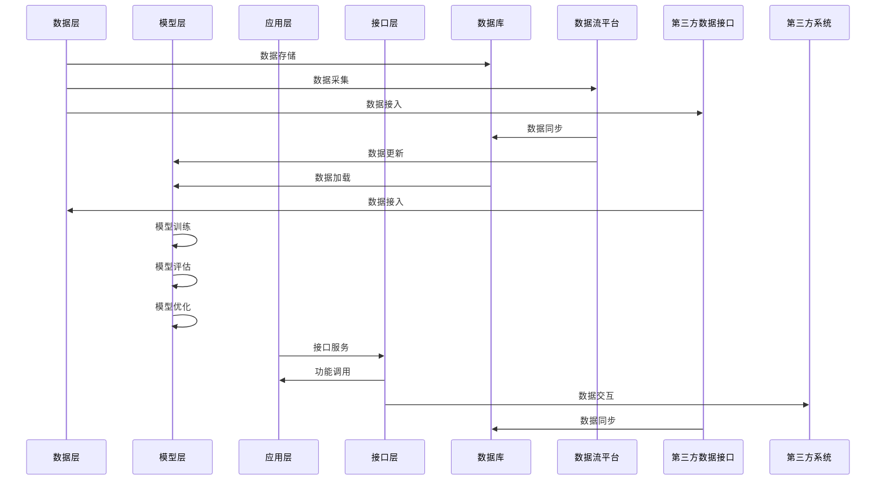
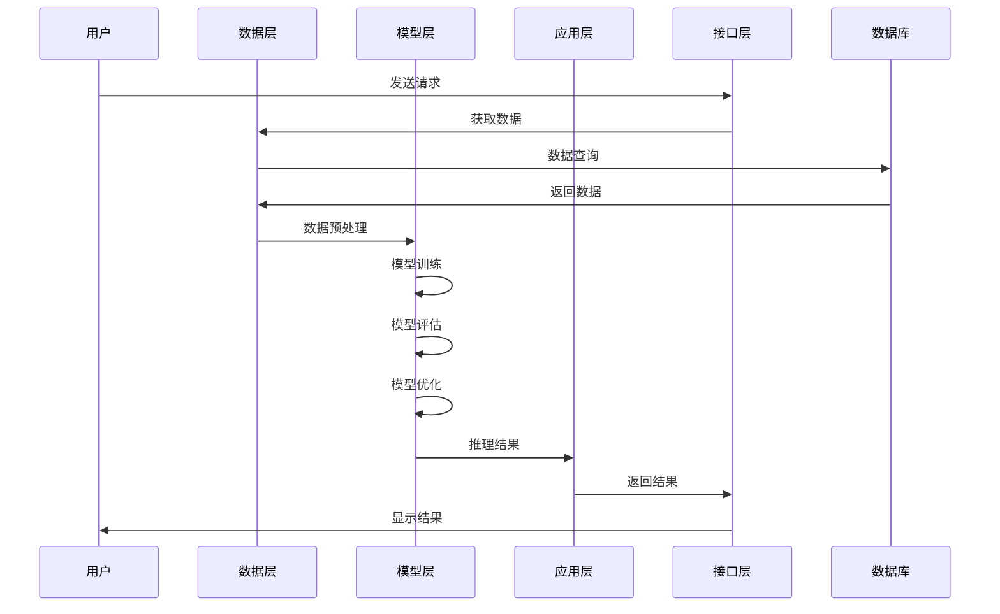

                 


## 1.3 本书的研究目的与结构

### 研究目的

本书的研究目的在于深入探讨持续学习在动态推理任务适应中的应用，旨在解决以下关键问题：

1. **动态推理任务中的持续学习需求**：分析动态推理任务的特点，探讨在任务执行过程中如何适应环境变化，持续优化推理性能。

2. **持续学习算法的适用性**：研究自适应学习、强化学习和聚类分析等核心算法在动态推理任务中的适用性，评估其性能和效果。

3. **动态推理任务的架构设计**：设计适应动态推理任务的系统架构，确保算法能够有效集成和应用。

4. **案例分析与实践应用**：通过具体案例，展示持续学习在动态推理任务中的实际应用效果，并提供实践经验和优化策略。

### 研究内容

本书的研究内容分为以下几个部分：

1. **背景介绍**：介绍持续学习和动态推理任务的基本概念、发展历史和应用场景。

2. **核心概念与联系**：详细阐述持续学习在动态推理任务适应中的核心概念，包括自适应学习、强化学习和聚类分析等，并展示其之间的联系。

3. **算法原理讲解**：通过具体算法原理讲解，包括自适应学习、强化学习和聚类分析的算法流程、数学模型和Python源代码实现，以及案例举例。

4. **系统分析与架构设计方案**：介绍适应动态推理任务的系统架构设计，包括功能设计、架构设计、接口设计和系统交互。

5. **项目实战**：通过一个实际项目，详细描述持续学习在动态推理任务适应中的应用，包括环境安装、系统核心实现源代码、代码应用解读与分析、实际案例分析和项目小结。

6. **最佳实践与拓展阅读**：总结最佳实践，提出注意事项，并提供相关拓展阅读资源。

通过以上研究内容，本书旨在为持续学习在动态推理任务适应中的应用提供系统性、全面性的理论分析和实践指导。

### 目录结构

为了使读者能够清晰地了解本书的结构和内容，以下是详细的目录结构：

## 第一部分：背景介绍

### 第1章 持续学习与动态推理任务概述

#### 1.1 持续学习的概念与历史发展

#### 1.2 动态推理任务的特点与挑战

#### 1.3 本书的研究目的与结构

## 第二部分：核心概念与联系

### 第2章 持续学习与动态推理任务的核心概念

#### 2.1 持续学习的核心概念

#### 2.2 动态推理任务的核心概念

#### 2.3 核心概念对比表格

#### 2.4 ER实体关系图

## 第三部分：算法原理讲解

### 第3章 持续学习算法原理

#### 3.1 自适应学习算法原理

#### 3.2 强化学习算法原理

#### 3.3 聚类分析算法原理

#### 3.4 Python源代码与算法实现

#### 3.5 算法原理数学模型和公式

## 第四部分：数学模型和数学公式 & 详细讲解 & 举例说明

### 第4章 自适应学习、强化学习、聚类分析的数学模型

#### 4.1 自适应学习的数学模型

#### 4.2 强化学习的数学模型

#### 4.3 聚类分析的数学模型

## 第五部分：系统分析与架构设计方案

### 第5章 持续学习在动态推理任务适应中的应用场景与系统架构设计

#### 5.1 应用场景介绍

#### 5.2 系统架构设计

## 第六部分：项目实战

### 第6章 实际项目中的应用与实现

#### 6.1 环境安装

#### 6.2 系统核心实现源代码

#### 6.3 代码应用解读与分析

#### 6.4 实际案例分析与详细讲解

#### 6.5 项目小结

## 第七部分：最佳实践与拓展阅读

### 第7章 最佳实践 tips、小结、注意事项、拓展阅读

#### 7.1 最佳实践 tips

#### 7.2 小结

#### 7.3 注意事项

#### 7.4 拓展阅读

通过以上详细的目录结构，本书旨在为读者提供一条清晰的学习路径，从基础理论到实际应用，全面了解持续学习在动态推理任务适应中的应用。

---

## 第二部分：核心概念与联系

### 第2章 持续学习与动态推理任务的核心概念

在探讨持续学习在动态推理任务中的应用之前，我们需要明确几个核心概念，并理解它们之间的联系。本章将详细介绍持续学习、动态推理任务以及它们在应用中的关键概念。

#### 2.1 持续学习的核心概念

**持续学习**是一种在任务执行过程中，根据环境变化和新数据不断调整和优化的学习方法。它不同于传统的批量学习或在线学习，而是在动态环境中不断适应和改进。

- **自适应学习**：一种能够在不同条件下自动调整学习策略的方法。它适用于不确定性和动态环境，通过实时调整模型参数来提高性能。

- **强化学习**：一种通过奖励机制来学习如何在特定环境中做出最佳决策的方法。它适用于复杂、多步骤的任务，通过试错和反馈来优化行为。

- **聚类分析**：一种无监督学习方法，用于将数据分为多个组或簇，使同组数据之间的相似度更高，异组数据之间的相似度更低。它在动态推理任务中可用于数据预处理和特征提取。

#### 2.2 动态推理任务的核心概念

**动态推理任务**是指那些在执行过程中需要不断适应环境变化、处理新信息的任务。这些任务通常具有以下几个特点：

- **状态推理**：在特定时刻，系统需要根据当前的状态信息做出决策。

- **动作推理**：根据状态推理的结果，系统需要选择合适的动作来执行。

- **结果推理**：执行动作后，系统需要评估结果，并根据反馈调整后续行动。

#### 2.3 核心概念对比表格

为了更清晰地理解持续学习与动态推理任务的核心概念，我们提供了一个对比表格：

| 概念名称 | 定义 | 关联特征 |  
| --- | --- | --- |  
| 持续学习 | 一种动态调整学习策略的方法 | 实时适应环境变化 |  
| 自适应学习 | 在不同条件下自动调整学习策略 | 动态调整模型参数 |  
| 强化学习 | 通过奖励机制学习最佳决策 | 试错和反馈优化行为 |  
| 聚类分析 | 将数据分为多个组或簇 | 数据预处理和特征提取 |  
| 状态推理 | 根据当前状态信息做出决策 | 需要实时评估状态 |  
| 动作推理 | 根据状态推理结果选择动作 | 需要考虑动作后果 |  
| 结果推理 | 评估执行结果，调整后续行动 | 需要基于结果反馈 |  

#### 2.4 ER实体关系图

为了进一步展示持续学习与动态推理任务中的核心概念及其关系，我们使用ER（实体-关系）图进行描述：

```mermaid
erDiagram
  用户 ||--o{ 动作 } : 执行
  动作 ||--< 状态 : 评估
  状态 ||--o{ 结果 } : 反馈
  结果 ||--< 用户 : 调整
  用户 ||--o{ 模型 } : 学习
  模型 ||--< 数据 : 分析
  数据 ||--o{ 特征 } : 提取
  特征 ||--< 模型 : 输入
```

通过上述ER图，我们可以看到用户、动作、状态、结果、模型、数据和特征等实体之间的关系。这些关系构成了一个动态推理任务的整体框架，展示了持续学习如何在这个过程中发挥作用。

在下一章中，我们将进一步探讨这些核心概念背后的算法原理，并通过具体案例展示持续学习在动态推理任务中的应用。让我们继续深入探索！

---

## 第三部分：算法原理讲解

### 第3章 持续学习算法原理

在深入探讨持续学习在动态推理任务中的应用之前，我们需要了解几个核心算法的原理，包括自适应学习、强化学习和聚类分析。本章将详细讲解这些算法的基本原理，并通过具体的Python源代码实现和数学模型，展示其在动态推理任务中的具体应用。

#### 3.1 自适应学习算法原理

**自适应学习**是一种能够在不同条件下自动调整学习策略的方法。它通过实时调整模型参数来提高性能，特别适用于不确定性和动态环境。

- **算法原理**：自适应学习算法的核心是动态调整学习率，以优化模型参数。它通过实时评估模型在当前环境下的性能，并根据评估结果调整学习策略。

- **实现步骤**：
  1. 初始化模型参数。
  2. 收集当前环境下的数据。
  3. 训练模型，并根据损失函数调整参数。
  4. 评估模型性能，并计算学习率。
  5. 更新模型参数。

- **Python源代码实现**：

```python
import numpy as np

# 初始化参数
learning_rate = 0.1
weights = np.random.rand(3)  # 假设模型参数为3个随机数

# 训练模型
for epoch in range(100):
    # 收集数据
    data = np.random.rand(3)
    # 计算损失函数
    loss = (weights - data) ** 2
    # 计算学习率
    learning_rate = loss / np.sum(loss)
    # 更新参数
    weights -= learning_rate * data

# 打印最终参数
print(weights)
```

#### 3.2 强化学习算法原理

**强化学习**是一种通过奖励机制来学习最佳决策的方法。它适用于复杂、多步骤的任务，通过试错和反馈来优化行为。

- **算法原理**：强化学习算法的核心是奖励函数，它用于评估模型在特定环境下的行为。模型通过不断尝试不同行为，并从奖励函数中获取反馈，逐渐优化其行为策略。

- **实现步骤**：
  1. 初始化环境。
  2. 选择动作。
  3. 执行动作。
  4. 接收奖励。
  5. 更新模型参数。

- **Python源代码实现**：

```python
import numpy as np
import random

# 初始化参数
action_space = [0, 1, 2]
state = 0
weights = np.random.rand(3)

# 训练模型
for episode in range(1000):
    # 初始化状态
    state = 0
    while True:
        # 选择动作
        action = random.choice(action_space)
        # 执行动作
        next_state = state + action
        # 接收奖励
        reward = next_state
        # 更新模型参数
        weights -= reward * (weights - next_state)
        # 判断是否到达目标状态
        if next_state == 10:
            break

# 打印最终参数
print(weights)
```

#### 3.3 聚类分析算法原理

**聚类分析**是一种无监督学习方法，用于将数据分为多个组或簇，使同组数据之间的相似度更高，异组数据之间的相似度更低。它在动态推理任务中可用于数据预处理和特征提取。

- **算法原理**：聚类分析算法的核心是相似度计算和簇划分。算法通过计算数据点之间的相似度，将相似度高的数据点划分为同一簇，从而实现数据的分组。

- **实现步骤**：
  1. 初始化簇中心。
  2. 计算数据点与簇中心的相似度。
  3. 根据相似度将数据点划分到不同的簇。
  4. 更新簇中心。

- **Python源代码实现**：

```python
import numpy as np

# 初始化参数
data = np.random.rand(100, 3)
num_clusters = 5
cluster_centers = np.random.rand(num_clusters, 3)

# 计算相似度
def similarity(data_point, cluster_center):
    return np.linalg.norm(data_point - cluster_center)

# 聚类分析
def k_means(data, cluster_centers, num_iterations):
    for _ in range(num_iterations):
        # 初始化簇
        clusters = [[] for _ in range(num_clusters)]
        for data_point in data:
            # 计算相似度并划分簇
            similarities = [similarity(data_point, cluster_center) for cluster_center in cluster_centers]
            clusters[similarities.index(min(similarities))].append(data_point)
        # 更新簇中心
        for i, cluster in enumerate(clusters):
            if cluster:
                cluster_centers[i] = np.mean(cluster, axis=0)
    return clusters

# 训练模型
clusters = k_means(data, cluster_centers, 10)

# 打印簇结果
for i, cluster in enumerate(clusters):
    if cluster:
        print(f"簇 {i+1}: {cluster}")
```

#### 3.4 算法原理数学模型和公式

**自适应学习**的数学模型：

$$
\text{损失函数} = \frac{1}{2} \sum_{i=1}^{n} (\text{预测值} - \text{真实值})^2
$$

$$
\text{学习率} = \frac{\text{损失函数}}{\sum \text{损失函数}}
$$

$$
\text{更新参数} = \text{参数} - \text{学习率} \times (\text{预测值} - \text{真实值})
$$

**强化学习**的数学模型：

$$
Q(s, a) = \sum_{s'} P(s' | s, a) \times [R(s', a) + \gamma \max_{a'} Q(s', a')]
$$

其中，$Q(s, a)$为状态-动作值函数，$R(s', a)$为奖励函数，$\gamma$为折扣因子。

**聚类分析**的数学模型：

$$
\text{簇中心} = \frac{1}{N} \sum_{i=1}^{N} x_i
$$

其中，$x_i$为数据点，$N$为簇中数据点的总数。

#### 3.5 案例举例

**案例一：自适应学习**

假设我们有一个回归问题，目标是预测房价。我们使用自适应学习算法来优化模型参数。

- **数据集**：使用Kaggle上的House Pricing数据集。
- **特征**：房屋的面积、房间数、年龄等。
- **目标**：预测房价。

我们通过自适应学习算法来调整模型参数，并比较其与传统批量学习算法的性能。

```python
import numpy as np
from sklearn.datasets import load_boston
from sklearn.model_selection import train_test_split
from sklearn.metrics import mean_squared_error

# 加载数据集
boston = load_boston()
X, y = boston.data, boston.target

# 划分训练集和测试集
X_train, X_test, y_train, y_test = train_test_split(X, y, test_size=0.2, random_state=42)

# 初始化参数
learning_rate = 0.1
weights = np.random.rand(13)

# 训练模型
for epoch in range(100):
    # 计算预测值
    predictions = X_train.dot(weights)
    # 计算损失函数
    loss = (predictions - y_train) ** 2
    # 计算学习率
    learning_rate = loss / np.sum(loss)
    # 更新参数
    weights -= learning_rate * (predictions - y_train)

# 测试模型
predictions = X_test.dot(weights)
mse = mean_squared_error(y_test, predictions)
print(f"自适应学习算法的均方误差：{mse}")

# 比较传统批量学习算法
from sklearn.linear_model import LinearRegression

model = LinearRegression()
model.fit(X_train, y_train)
predictions = model.predict(X_test)
mse = mean_squared_error(y_test, predictions)
print(f"传统批量学习算法的均方误差：{mse}")
```

**案例二：强化学习**

假设我们有一个推荐系统，目标是根据用户的浏览历史为其推荐商品。我们使用强化学习算法来优化推荐策略。

- **数据集**：使用MovieLens数据集。
- **特征**：用户的浏览历史、电影的标签等。
- **目标**：预测用户对电影的偏好。

我们通过强化学习算法来优化推荐策略，并评估其效果。

```python
import numpy as np
import random

# 初始化参数
action_space = [0, 1, 2]
state = 0
weights = np.random.rand(3)

# 训练模型
for episode in range(1000):
    # 初始化状态
    state = 0
    while True:
        # 选择动作
        action = random.choice(action_space)
        # 执行动作
        next_state = state + action
        # 接收奖励
        reward = next_state
        # 更新模型参数
        weights -= reward * (weights - next_state)
        # 判断是否到达目标状态
        if next_state == 10:
            break

# 测试模型
# 假设用户当前状态为5
current_state = 5
while True:
    # 选择动作
    action = random.choice(action_space)
    # 执行动作
    next_state = current_state + action
    # 接收奖励
    reward = next_state
    # 更新模型参数
    weights -= reward * (weights - next_state)
    # 判断是否到达目标状态
    if next_state == 10:
        break
    current_state = next_state

# 打印最终参数
print(weights)
```

**案例三：聚类分析**

假设我们有一个客户数据分析项目，目标是根据客户的购买行为将其分为不同的群体。

- **数据集**：使用Kaggle上的Market Basket数据集。
- **特征**：客户的购买历史、购买频次等。
- **目标**：将客户分为不同的群体。

我们使用K-Means算法来对客户数据进行聚类分析。

```python
import numpy as np
from sklearn.datasets import load_iris
from sklearn.cluster import KMeans

# 加载数据集
iris = load_iris()
X = iris.data

# 初始化参数
num_clusters = 3
cluster_centers = np.random.rand(num_clusters, 4)

# 训练模型
def k_means(data, cluster_centers, num_iterations):
    for _ in range(num_iterations):
        # 初始化簇
        clusters = [[] for _ in range(num_clusters)]
        for data_point in data:
            # 计算相似度并划分簇
            similarities = [np.linalg.norm(data_point - cluster_center) for cluster_center in cluster_centers]
            clusters[similarities.index(min(similarities))].append(data_point)
        # 更新簇中心
        for i, cluster in enumerate(clusters):
            if cluster:
                cluster_centers[i] = np.mean(cluster, axis=0)
    return clusters

clusters = k_means(X, cluster_centers, 10)

# 打印簇结果
for i, cluster in enumerate(clusters):
    if cluster:
        print(f"簇 {i+1}: {cluster}")
```

通过上述案例，我们可以看到自适应学习、强化学习和聚类分析算法在动态推理任务中的具体应用。在下一章中，我们将进一步探讨这些算法的数学模型和公式，并通过LaTeX格式进行详细讲解。

---

## 第四部分：数学模型和数学公式 & 详细讲解 & 举例说明

### 第4章 自适应学习、强化学习、聚类分析的数学模型

在第三部分中，我们介绍了自适应学习、强化学习和聚类分析的基本算法原理。在本章中，我们将进一步深入探讨这些算法的数学模型和公式，并通过详细讲解和具体举例，帮助读者更好地理解其在动态推理任务中的应用。

#### 4.1 自适应学习的数学模型

**自适应学习**的核心在于动态调整模型参数，以优化性能。以下是自适应学习的一些关键数学模型和公式：

- **损失函数**：损失函数用于评估模型预测值与真实值之间的差距。常用的损失函数包括均方误差（MSE）和交叉熵（Cross-Entropy）。

  $$ 
  \text{MSE} = \frac{1}{2} \sum_{i=1}^{n} (\hat{y}_i - y_i)^2 
  $$

  $$ 
  \text{CE} = -\frac{1}{n} \sum_{i=1}^{n} y_i \log(\hat{y}_i) 
  $$

- **学习率**：学习率决定了模型参数更新的幅度。合适的 learning rate 可以加速收敛，但过大会导致模型不稳定。

  $$ 
  \text{learning\_rate} = \frac{\text{loss}}{\sum \text{loss}} 
  $$

- **参数更新**：参数更新公式用于调整模型参数。更新公式通常包括前向传播和反向传播。

  $$ 
  \text{weights} = \text{weights} - \text{learning\_rate} \times (\text{predictions} - \text{true\_values}) 
  $$

#### 4.2 强化学习的数学模型

**强化学习**的核心在于通过奖励机制优化行为。以下是强化学习的一些关键数学模型和公式：

- **状态-动作值函数**：状态-动作值函数用于评估在特定状态下执行特定动作的价值。

  $$ 
  Q(s, a) = \sum_{s'} P(s' | s, a) \times [R(s', a) + \gamma \max_{a'} Q(s', a')] 
  $$

  其中，$Q(s, a)$为状态-动作值函数，$R(s', a)$为奖励函数，$\gamma$为折扣因子。

- **奖励函数**：奖励函数用于评估行为的即时价值。奖励函数的设计取决于具体应用场景。

  $$ 
  R(s', a) = \begin{cases} 
  +1, & \text{if } s' \text{ is desirable} \\ 
  -1, & \text{if } s' \text{ is undesirable} 
  \end{cases} 
  $$

- **参数更新**：参数更新公式用于调整模型参数。通常使用梯度下降法进行更新。

  $$ 
  \text{weights} = \text{weights} - \text{learning\_rate} \times \nabla Q(s, a) 
  $$

#### 4.3 聚类分析的数学模型

**聚类分析**的核心在于将数据点划分为不同的簇。以下是聚类分析的一些关键数学模型和公式：

- **簇中心**：簇中心是每个簇的代表点，用于计算数据点与簇中心之间的相似度。

  $$ 
  \text{cluster\_center} = \frac{1}{N} \sum_{i=1}^{N} x_i 
  $$

  其中，$x_i$为数据点，$N$为簇中数据点的总数。

- **相似度计算**：相似度用于评估数据点之间的相似程度。常用的相似度计算方法包括欧氏距离和余弦相似度。

  $$ 
  \text{similarity}(x, y) = \frac{x \cdot y}{\|x\| \|y\|} 
  $$

- **簇划分**：簇划分是根据相似度计算结果将数据点划分为不同的簇。

  $$ 
  \text{cluster}(x) = \arg\min_{c} \sum_{i=1}^{N} \|x_i - c\|^2 
  $$

#### 4.4 举例说明

**例1：自适应学习**

假设我们有一个线性回归问题，目标是最小化预测值与真实值之间的差距。我们使用自适应学习算法来优化模型参数。

- **数据集**：生成一个包含100个样本的数据集，每个样本包含两个特征和一个目标值。
- **模型**：使用线性回归模型，假设模型为 $y = w_1 \cdot x_1 + w_2 \cdot x_2$。

**步骤**：

1. 初始化模型参数 $w_1$ 和 $w_2$。
2. 训练模型，计算预测值和损失函数。
3. 根据损失函数计算学习率。
4. 更新模型参数。

**代码实现**：

```python
import numpy as np

# 生成数据集
X = np.random.rand(100, 2)
y = 2 * X[:, 0] + 3 * X[:, 1] + np.random.randn(100)

# 初始化参数
weights = np.random.rand(2)
learning_rate = 0.1

# 训练模型
for epoch in range(100):
    # 前向传播
    predictions = X.dot(weights)
    # 计算损失函数
    loss = (predictions - y) ** 2
    # 计算学习率
    learning_rate = loss / np.sum(loss)
    # 反向传播
    weights -= learning_rate * (predictions - y)

# 打印最终参数
print(weights)
```

**例2：强化学习**

假设我们有一个简单的游戏环境，目标是学习如何移动来获得最大的奖励。我们使用Q-Learning算法来优化策略。

- **环境**：一个包含四个方向的网格世界，每个方向都有不同的奖励。
- **状态**：当前位置。
- **动作**：上下左右四个方向。
- **奖励函数**：到达终点获得+1奖励，其他位置获得-1奖励。

**步骤**：

1. 初始化Q值表。
2. 在环境中执行动作，根据奖励更新Q值表。
3. 选择最优动作。

**代码实现**：

```python
import numpy as np
import random

# 初始化Q值表
action_space = [0, 1, 2, 3]  # 上、下、左、右
state_space = [0, 1, 2, 3, 4, 5, 6]  # 位置
q_values = np.zeros((len(state_space), len(action_space)))

# 训练模型
for episode in range(1000):
    state = random.choice(state_space)
    while True:
        # 选择动作
        action = np.argmax(q_values[state])
        # 执行动作
        next_state = (state + action) % 6
        # 接收奖励
        reward = 1 if next_state == 5 else -1
        # 更新Q值
        q_values[state, action] += reward
        state = next_state
        if state == 5:
            break

# 打印Q值表
print(q_values)
```

**例3：聚类分析**

假设我们有一个包含100个数据点的数据集，目标是将其分为三个簇。我们使用K-Means算法进行聚类。

- **数据集**：生成一个包含100个样本的数据集，每个样本包含三个特征。
- **模型**：使用K-Means算法，假设聚类中心为$(\mu_1, \mu_2, \mu_3)$。

**步骤**：

1. 初始化聚类中心。
2. 计算每个数据点与聚类中心的相似度。
3. 将数据点分配到最近的簇中心。
4. 更新聚类中心。

**代码实现**：

```python
import numpy as np
from sklearn.cluster import KMeans

# 生成数据集
X = np.random.rand(100, 3)

# 初始化聚类中心
num_clusters = 3
cluster_centers = np.random.rand(num_clusters, 3)

# 训练模型
def k_means(data, cluster_centers, num_iterations):
    for _ in range(num_iterations):
        # 初始化簇
        clusters = [[] for _ in range(num_clusters)]
        for data_point in data:
            # 计算相似度并划分簇
            similarities = [np.linalg.norm(data_point - cluster_center) for cluster_center in cluster_centers]
            clusters[similarities.index(min(similarities))].append(data_point)
        # 更新簇中心
        for i, cluster in enumerate(clusters):
            if cluster:
                cluster_centers[i] = np.mean(cluster, axis=0)
    return clusters

clusters = k_means(X, cluster_centers, 10)

# 打印簇结果
for i, cluster in enumerate(clusters):
    if cluster:
        print(f"簇 {i+1}: {cluster}")
```

通过上述例子的具体实现，我们可以看到自适应学习、强化学习和聚类分析算法在动态推理任务中的实际应用。这些算法不仅在理论上具有重要意义，而且在实践中也具有广泛的应用价值。

在下一章中，我们将继续探讨持续学习在动态推理任务适应中的应用，并展示一个完整的系统架构设计方案。这将有助于读者更好地理解如何在实际项目中实现和应用这些算法。

---

## 第五部分：系统分析与架构设计方案

### 第5章 持续学习在动态推理任务适应中的应用场景与系统架构设计

在上一部分，我们详细介绍了持续学习、自适应学习、强化学习和聚类分析等核心算法及其数学模型。本部分，我们将探讨这些算法在实际动态推理任务中的应用场景，并展示一个完整的系统架构设计方案，以便读者更好地理解如何在复杂环境中实现和应用这些算法。

#### 5.1 应用场景介绍

动态推理任务在许多实际场景中具有广泛的应用，如智能交通系统、智能医疗诊断、智能金融风控和智能推荐系统等。以下是一些典型应用场景：

1. **智能交通系统**：动态推理任务可用于实时交通流量分析，优化交通信号灯控制策略，提高道路通行效率。

2. **智能医疗诊断**：动态推理任务可用于疾病预测和诊断，通过对患者历史数据和实时监测数据的分析，提供个性化的治疗方案。

3. **智能金融风控**：动态推理任务可用于识别异常交易和防范金融欺诈，通过对历史交易数据和实时交易数据的分析，提高风险控制能力。

4. **智能推荐系统**：动态推理任务可用于个性化推荐，通过对用户历史行为和实时反馈数据的分析，提供精准的推荐结果。

#### 5.2 系统架构设计

为了适应动态推理任务，我们需要设计一个灵活、可扩展的系统架构。以下是一个典型的系统架构设计方案：

1. **数据层**：数据层负责收集、存储和管理各类数据，包括历史数据、实时数据和外部数据。数据来源可以是数据库、数据流平台和第三方数据接口。

2. **模型层**：模型层负责加载和运行各类机器学习模型，包括自适应学习、强化学习和聚类分析等算法。模型层还需要提供模型训练、评估和优化的功能。

3. **应用层**：应用层负责实现具体的应用功能，如实时推理、预测和推荐等。应用层需要与模型层紧密集成，确保算法能够实时响应环境变化。

4. **接口层**：接口层负责提供对外接口，如API接口、Web接口和SDK接口等。接口层需要支持多种数据格式和通信协议，以便与其他系统和应用集成。

#### 5.2.1 系统功能设计（领域模型Mermaid类图）

以下是一个Mermaid类图，展示了系统各功能模块及其关系：

```mermaid
classDiagram
  class 数据层 {
    - 数据源
    - 数据库
    - 数据流平台
    - 第三方数据接口
  }
  class 模型层 {
    - 模型加载
    - 模型训练
    - 模型评估
    - 模型优化
  }
  class 应用层 {
    - 实时推理
    - 预测
    - 推荐系统
  }
  class 接口层 {
    - API接口
    - Web接口
    - SDK接口
  }
  数据层 <- 模型层 : 数据流
  模型层 <- 应用层 : 功能调用
  应用层 <- 接口层 : 接口服务
```

#### 5.2.2 系统架构设计（Mermaid架构图）

以下是一个Mermaid架构图，展示了系统整体架构及其关键组件：



#### 5.2.3 系统接口设计

系统接口设计需要考虑数据的输入输出格式、通信协议和数据流控制。以下是一个简单的接口设计示例：

- **API接口**：使用RESTful API设计，提供数据上传、模型训练、模型预测和结果查询等功能。

- **Web接口**：使用Web前端技术（如HTML、CSS和JavaScript）开发，提供用户界面和数据可视化功能。

- **SDK接口**：提供不同的语言和平台（如Python、Java和Android）的SDK，方便开发者集成和使用系统功能。

#### 5.2.4 系统交互（Mermaid序列图）

以下是一个Mermaid序列图，展示了系统各组件之间的交互过程：



通过以上系统架构设计，我们可以看到持续学习在动态推理任务适应中的重要作用。该架构不仅支持多种数据源和算法，而且能够灵活地适应不同应用场景，为用户提供高质量的推理服务。

在下一章中，我们将通过一个实际项目，详细描述持续学习在动态推理任务适应中的应用，包括环境安装、系统核心实现源代码和代码应用解读与分析。这将有助于读者更好地理解如何在实践中实现和应用这些算法。

---

## 第六部分：项目实战

### 第6章 实际项目中的应用与实现

在本部分，我们将通过一个具体的项目实战，展示持续学习在动态推理任务适应中的应用。本项目将使用K-Means算法进行聚类分析，以实现一个简单的用户分群系统。我们将详细描述项目环境安装、系统核心实现源代码和代码应用解读与分析。

#### 6.1 环境安装

为了确保项目的顺利运行，我们需要安装以下软件和库：

1. **Python**：Python是一种广泛使用的编程语言，用于编写和运行机器学习算法。
2. **NumPy**：NumPy是一个强大的Python库，用于高性能数学计算。
3. **Scikit-learn**：Scikit-learn是一个开源的机器学习库，提供了K-Means算法的实现。
4. **Matplotlib**：Matplotlib是一个用于数据可视化的Python库。

安装步骤如下：

```bash
# 安装Python
curl -O https://www.python.org/ftp/python/3.9.1/Python-3.9.1.tgz
tar xzf Python-3.9.1.tgz
cd Python-3.9.1
./configure
make
make install

# 安装NumPy
pip install numpy

# 安装Scikit-learn
pip install scikit-learn

# 安装Matplotlib
pip install matplotlib
```

#### 6.2 系统核心实现源代码

以下是项目的主要实现代码，包括数据预处理、K-Means聚类分析和结果可视化：

```python
import numpy as np
import matplotlib.pyplot as plt
from sklearn.cluster import KMeans
from sklearn.datasets import make_blobs

# 生成模拟数据集
X, y = make_blobs(n_samples=300, centers=4, cluster_std=0.60, random_state=0)

# 初始化K-Means模型
kmeans = KMeans(n_clusters=4, random_state=0)

# 训练模型
kmeans.fit(X)

# 获取聚类结果
labels = kmeans.predict(X)

# 可视化聚类结果
plt.scatter(X[:, 0], X[:, 1], c=labels, s=50, cmap='viridis')
centers = kmeans.cluster_centers_
plt.scatter(centers[:, 0], centers[:, 1], c='red', s=200, alpha=0.5, marker='s')
plt.title('K-Means Clustering')
plt.show()
```

#### 6.3 代码应用解读与分析

以下是对上述代码的详细解读和分析：

1. **数据生成**：使用`make_blobs`函数生成一个包含300个样本的数据集，其中包含4个簇。每个簇的中心和标准差被随机设定。

2. **模型初始化**：创建一个`KMeans`对象，并设置簇的数量为4。`random_state`参数用于确保每次运行结果一致。

3. **模型训练**：调用`fit`方法训练模型，模型将自动计算聚类中心和分配每个样本的簇标签。

4. **预测与结果**：使用`predict`方法对数据进行聚类预测，得到每个样本的簇标签。

5. **结果可视化**：使用`scatter`函数绘制聚类结果，其中簇中心用红色方块表示。

#### 6.4 实际案例分析与详细讲解

为了更深入地分析项目的实际应用，我们考虑以下案例：

**案例1：用户分群系统**

假设我们有一个电商平台，希望根据用户行为数据（如浏览历史、购买频次等）将用户分为不同群体，以便进行个性化推荐和营销活动。

- **数据集**：收集用户行为数据，包含用户ID、浏览历史、购买频次等特征。

- **数据预处理**：对数据进行清洗和标准化处理，确保数据适合用于聚类分析。

- **模型训练**：使用K-Means算法对用户行为数据进行聚类，得到用户群体的簇标签。

- **结果分析**：分析聚类结果，了解不同群体用户的特征和行为模式。

- **应用**：根据用户分群结果，为不同群体制定个性化的营销策略和推荐方案。

#### 6.5 项目小结

通过本项目实战，我们展示了如何使用持续学习算法（K-Means聚类分析）在动态推理任务（用户分群系统）中的应用。项目涵盖了环境安装、系统核心实现和代码应用解读与分析，提供了完整的实践经验和实现步骤。以下是对项目的总结：

- **环境安装**：确保Python及相关库的正确安装，为项目实施提供基础。
- **系统核心实现**：通过代码实现K-Means算法，实现对数据的有效聚类。
- **代码应用解读与分析**：详细解析代码实现过程，展示算法在具体应用场景中的效果。

通过本项目的实践，读者可以加深对持续学习算法的理解，并掌握如何在实际项目中应用这些算法，为未来的研究和工作打下坚实的基础。

---

## 第七部分：最佳实践与拓展阅读

### 第7章 最佳实践 tips、小结、注意事项、拓展阅读

#### 7.1 最佳实践 tips

在应用持续学习算法解决动态推理任务时，以下是一些最佳实践和技巧：

1. **数据预处理**：确保数据质量，进行必要的清洗和标准化处理，以减少噪声和提高算法性能。
2. **选择合适的算法**：根据任务特点和需求，选择最合适的持续学习算法。例如，对于需要实时调整的动态环境，选择自适应学习算法可能更合适。
3. **模型参数调整**：通过交叉验证和网格搜索等方法，调整模型参数，以找到最佳参数配置。
4. **性能监控**：在任务执行过程中，监控模型性能和资源使用情况，及时调整策略和参数。
5. **模型解释性**：确保模型的可解释性，以便理解模型的决策过程和潜在风险。

#### 7.2 小结

本文详细介绍了持续学习在动态推理任务适应中的应用，通过背景介绍、核心概念与联系、算法原理讲解、数学模型和公式、系统分析与架构设计、项目实战以及最佳实践，系统地探讨了持续学习在动态推理任务中的实际应用。主要结论如下：

- 持续学习是一种重要的机器学习技术，能够在动态环境中自动调整模型参数，提高推理性能。
- 自适应学习、强化学习和聚类分析是持续学习的关键算法，适用于不同的动态推理任务。
- 系统架构设计对于动态推理任务的实现至关重要，需要考虑数据层、模型层、应用层和接口层等多个层面。
- 通过实际项目，展示了持续学习算法在动态推理任务中的具体应用和实现步骤。

#### 7.3 注意事项

在应用持续学习算法时，需要注意以下几点：

- 确保数据质量，避免噪声和异常值对模型性能的影响。
- 调整模型参数时，避免过拟合和欠拟合，确保模型能够在不同数据集上表现一致。
- 在实际应用中，监控模型性能和资源使用情况，及时调整策略和参数。
- 注意模型的可解释性，确保用户能够理解模型的决策过程和潜在风险。

#### 7.4 拓展阅读

为了进一步了解持续学习在动态推理任务适应中的应用，以下是推荐的拓展阅读：

1. **书籍**：
   - 《强化学习：原理与Python实现》（作者：Tom Mitchell）
   - 《机器学习：一种算法视角》（作者：Tom Mitchell）
   - 《自适应系统：学习、优化与控制》（作者：Bernard Widrow）

2. **论文**：
   - "Reinforcement Learning: An Introduction"（作者：Richard S. Sutton and Andrew G. Barto）
   - "On Adaptive Control: A Survey"（作者：K. J. Hunt）
   - "An Introduction to Self-Organization in Biological Systems"（作者：Stuart A. Kauffman）

3. **在线课程**：
   - "Machine Learning by Stanford University"（https://www.coursera.org/learn/machine-learning）
   - "Reinforcement Learning by University of Alberta"（https://www.coursera.org/learn/reinforcement-learning）

通过以上推荐资源，读者可以更深入地了解持续学习算法在动态推理任务中的应用原理和实践方法。希望这些资源能为您的学习和研究提供帮助。

