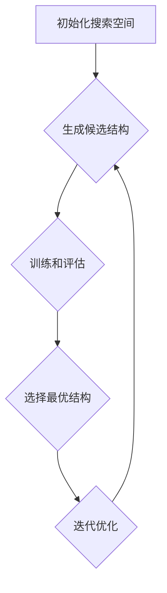
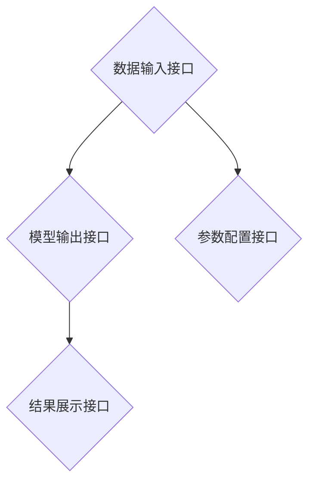
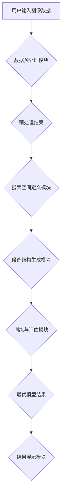

                 

### 1.1.1 研究背景

在当今科技迅猛发展的时代，人工智能（Artificial Intelligence, AI）已成为推动社会进步的重要力量。AI技术的核心在于能够模拟、延伸和扩展人类智能，从而在多个领域实现自动化和智能化。其中，推理模型（Reasoning Model）是AI系统中的关键组成部分，它负责从已知信息中推导出新的结论或解决未知的问题。然而，传统的推理模型设计往往依赖于人工经验和专家知识，这不仅耗时耗力，而且难以适应复杂多变的应用场景。

随着AI技术的不断进步，深度学习（Deep Learning, DL）和神经网络（Neural Network, NN）的广泛应用，为自动设计推理模型带来了新的可能。神经架构搜索（Neural Architecture Search, NAS）作为一种新兴的方法，通过自动搜索最优的网络结构和参数配置，使得推理模型的设计过程变得更加高效和智能化。

神经架构搜索的基本思想是利用搜索算法，在预先定义的搜索空间内搜索最优的网络结构。与传统的人工设计网络结构相比，NAS具有以下几个优势：

1. **自动性**：NAS能够自动寻找最优的网络结构，减少了人为干预，提高了效率。
2. **创新性**：NAS能够发现传统方法难以找到的新结构，推动AI技术的发展。
3. **适应性**：NAS能够根据不同的任务和数据集，自适应地调整网络结构，提高模型的泛化能力。

然而，神经架构搜索也面临着一些挑战，例如搜索空间爆炸、计算成本高、结果解释性差等。这些问题限制了NAS的广泛应用，因此，对神经架构搜索进行深入研究具有重要的理论意义和实际应用价值。

本文旨在探讨神经架构搜索在推理模型自动设计中的应用，通过系统性地分析神经架构搜索的基本原理、算法流程和优化策略，结合实际应用案例，为读者提供一份全面而深入的技术指南。本文的研究问题和目标如下：

- 研究问题：如何利用神经架构搜索技术，实现推理模型的自动设计？
- 研究目标：
  - 探讨神经架构搜索的基本原理和算法框架。
  - 分析神经架构搜索在不同应用场景中的表现和适用性。
  - 提出有效的优化策略，提高神经架构搜索的效率和效果。
  - 结合实际项目，验证神经架构搜索在推理模型自动设计中的应用价值。

本文的研究边界与外延如下：

- 研究边界：本文主要关注神经架构搜索在推理模型自动设计中的应用，不包括其他AI技术的讨论。
- 研究外延：本文将对神经架构搜索的算法原理、应用场景和优化策略进行深入分析，并探讨未来研究的方向。

通过本文的研究，我们期望能够为AI领域的科研人员和技术工程师提供有价值的参考，推动神经架构搜索技术的应用和发展。### 1.2 研究问题和目标

在深入探讨神经架构搜索在推理模型自动设计中的应用之前，我们需要明确本文的研究问题和目标。本文主要关注以下研究问题：

1. **如何利用神经架构搜索技术，实现推理模型的自动设计？**
   - **目标**：探讨神经架构搜索（NAS）在自动设计推理模型中的可行性，明确NAS的基本原理和算法框架。

2. **神经架构搜索在不同应用场景中的表现和适用性如何？**
   - **目标**：分析NAS在不同AI应用场景中的性能，探讨其在图像识别、自然语言处理和强化学习等领域的适用性。

3. **如何优化神经架构搜索的效率和效果？**
   - **目标**：提出有效的优化策略，包括算法优化、数据集优化和模型优化，以提高NAS的效率和效果。

4. **神经架构搜索在推理模型自动设计中的应用价值如何？**
   - **目标**：结合实际项目案例，验证NAS在推理模型自动设计中的应用价值，为未来的研究和应用提供参考。

为了实现上述研究目标，本文将设定以下具体研究目标：

- **目标1：系统梳理神经架构搜索的基本原理和算法框架**
  - **任务**：详细介绍神经架构搜索的定义、基本概念、核心机制和算法原理，为后续研究提供理论基础。

- **目标2：分析神经架构搜索在不同应用场景中的性能**
  - **任务**：通过实验和案例分析，评估NAS在不同应用场景（如图像识别、自然语言处理和强化学习）中的表现，探讨其适用性。

- **目标3：提出优化神经架构搜索的策略**
  - **任务**：基于现有研究，提出有效的优化策略，包括算法优化、数据集优化和模型优化，以提高NAS的效率和效果。

- **目标4：验证神经架构搜索在推理模型自动设计中的应用价值**
  - **任务**：结合实际项目案例，展示NAS在推理模型自动设计中的具体应用，分析其效果和优势。

### 1.3 核心概念与联系

在深入探讨神经架构搜索（Neural Architecture Search, NAS）的应用之前，我们需要明确并定义本文中的核心概念，并分析它们之间的联系。以下是本文中涉及的一些核心概念：

#### 1.3.1 关键概念的定义

1. **神经架构搜索（Neural Architecture Search, NAS）**
   - **定义**：神经架构搜索是一种自动化设计神经网络结构的方法。它通过在预定的搜索空间内搜索最优的网络结构，以实现特定任务的性能优化。
   - **核心特点**：自动性、创新性、适应性。

2. **推理模型（Reasoning Model）**
   - **定义**：推理模型是指从已知信息中推导出新结论或解决未知问题的模型。它在人工智能系统中起着核心作用，用于实现决策和问题求解。
   - **核心功能**：推理、预测、决策。

3. **深度学习（Deep Learning, DL）**
   - **定义**：深度学习是一种基于多层神经网络的学习方法，通过堆叠多个隐藏层，自动提取特征并进行复杂的数据处理。
   - **核心优势**：能够处理大规模数据、自动特征提取、高效学习。

4. **神经网络（Neural Network, NN）**
   - **定义**：神经网络是一种模拟生物神经元连接方式的计算模型，通过学习输入和输出之间的映射关系，实现数据的分类、回归等任务。
   - **核心结构**：输入层、隐藏层、输出层。

#### 1.3.2 概念属性特征对比表

为了更好地理解这些核心概念之间的关系，我们可以通过一个对比表格来展示它们的属性特征：

| 概念       | 定义                                                         | 核心特点                                      | 关联性                                       |
| ---------- | ------------------------------------------------------------ | --------------------------------------------- | -------------------------------------------- |
| 神经架构搜索 | 自动化设计神经网络结构的方法                                 | 自动性、创新性、适应性                        | 与深度学习和神经网络密切相关，是两者的实现方法 |
| 推理模型   | 从已知信息中推导出新结论或解决未知问题的模型                 | 推理、预测、决策                              | 是神经架构搜索的应用目标                       |
| 深度学习   | 基于多层神经网络的学习方法                                   | 自动特征提取、高效学习                        | 是神经架构搜索的基础技术                       |
| 神经网络   | 模拟生物神经元连接方式的计算模型，实现数据的分类、回归等任务 | 输入层、隐藏层、输出层                        | 是神经架构搜索的具体实现形式                   |

#### 1.3.3 ER实体关系图

为了更直观地展示这些核心概念之间的联系，我们可以使用实体关系图（Entity-Relationship Diagram, ERD）来表示。以下是一个简化的ERD示例，用于描述神经架构搜索、推理模型、深度学习和神经网络之间的关系：

```
[神经架构搜索] -[基于]-> [深度学习]
[神经架构搜索] -[用于实现]-> [推理模型]
[深度学习] -[基于]-> [神经网络]
```

在上面的ERD中，我们可以看到：

- **神经架构搜索**是基于**深度学习**和**神经网络**的一种实现方法。
- **神经架构搜索**的目标是**推理模型**的自动设计。
- **深度学习**是基于**神经网络**的一种学习方法。

通过上述定义和ERD，我们能够更清晰地理解本文中的核心概念，以及它们之间的相互关系。这些概念不仅构成了本文的理论基础，也为后续的算法原理讲解和应用案例分析提供了必要的背景知识。### 2.1 推理模型的基本原理

#### 2.1.1 推理模型的定义

推理模型是一种用于处理逻辑推理和信息处理的人工智能模型。它在输入数据和预先设定的逻辑规则基础上，通过一系列的推理步骤，得出新的结论或解决未知问题。推理模型的核心在于能够从已知的信息中推导出新的知识，这是人工智能领域的关键技术之一。

推理模型通常可以分为两大类：基于规则推理和基于模型推理。

- **基于规则推理**：这种方法依赖于一组预先定义的规则，通过对输入数据的匹配和规则的应用，进行推理。典型的系统包括专家系统和生产系统。
- **基于模型推理**：这种方法依赖于数学模型和统计模型，通过对输入数据进行建模和分析，得出推理结果。深度学习和统计学习是典型的基于模型推理方法。

#### 2.1.2 推理模型的分类

1. **基于规则的推理模型**

   - **专家系统**：专家系统是一种模拟人类专家解决特定领域问题的计算机程序。它依赖于大量的专家知识和一组规则库，通过匹配规则来做出决策。
   - **生产系统**：生产系统是一种基于状态转移图和条件概率的推理模型，它能够处理复杂的状态空间，通过状态转移来推导出结论。

2. **基于模型的推理模型**

   - **统计学习模型**：统计学习模型通过学习输入数据和标签之间的关系，建立预测模型。常见的统计学习模型包括线性回归、逻辑回归、支持向量机等。
   - **深度学习模型**：深度学习模型通过多层神经网络，自动提取特征并学习输入和输出之间的映射关系。常见的深度学习模型包括卷积神经网络（CNN）、循环神经网络（RNN）和生成对抗网络（GAN）等。

#### 2.1.3 推理模型的数学模型与公式

推理模型通常通过一个函数\( f \)来表示，该函数将输入数据\( x \)和参数\( \theta \)映射为输出\( y \)。这个函数可以表示为：

\[ y = f(x; \theta) \]

其中，\( x \)是输入数据，\( \theta \)是模型参数，\( f \)是推理函数。

对于不同的推理模型，推理函数\( f \)的形式可能不同。以下是一些常见的推理模型和它们的函数形式：

1. **线性回归**：

   \[ y = \theta_0 + \theta_1 x_1 + \theta_2 x_2 + \ldots + \theta_n x_n \]

   其中，\( \theta_0, \theta_1, \theta_2, \ldots, \theta_n \)是模型的参数。

2. **逻辑回归**：

   \[ y = \sigma(\theta_0 + \theta_1 x_1 + \theta_2 x_2 + \ldots + \theta_n x_n) \]

   其中，\( \sigma \)是 sigmoid 函数，\( y \)是概率输出。

3. **卷积神经网络（CNN）**：

   \[ y = \text{ReLU}(\theta_1 \cdot \text{ReLU}(\theta_2 \cdot \text{ReLU}(\ldots \theta_n \cdot x \ldots))) \]

   其中，\( \text{ReLU} \)是ReLU激活函数，\( \theta_1, \theta_2, \ldots, \theta_n \)是模型参数。

通过这些数学模型和公式，我们可以理解推理模型的基本原理和计算过程。这些模型不仅在理论上具有深刻的数学基础，而且在实际应用中表现出了强大的推理能力。接下来，我们将进一步探讨神经架构搜索的概念与机制，为理解NAS在推理模型自动设计中的应用奠定基础。

#### 2.2 神经架构搜索的概念与机制

神经架构搜索（Neural Architecture Search, NAS）是一种自动化设计神经网络结构的方法，旨在通过搜索算法在预定的搜索空间中找到最优的网络结构，以提高特定任务的性能。NAS的兴起源于传统人工设计神经网络结构的局限性，它能够利用计算机的高效计算能力，探索出更加复杂和高效的神经网络架构。

##### 2.2.1 神经架构搜索的定义

神经架构搜索可以被定义为一个过程，该过程通过在大量的候选网络结构中搜索，找到在特定任务上性能最优的网络结构。这个过程通常包括以下步骤：

1. **初始化搜索空间**：定义网络结构的搜索空间，包括层的类型、层数、连接方式等。
2. **生成候选网络结构**：从搜索空间中随机或策略性地生成多个候选网络结构。
3. **评估候选网络结构**：使用训练数据集对候选网络结构进行训练和评估，计算其性能指标（如准确率、损失函数值等）。
4. **选择最佳网络结构**：根据评估结果，选择性能最优的网络结构作为当前最优结构。
5. **迭代优化**：在当前最优结构的基础上，继续搜索和评估新的网络结构，逐步优化网络性能。

##### 2.2.2 神经架构搜索的基本机制

神经架构搜索的核心在于其搜索机制，主要包括以下几个方面：

1. **搜索空间定义**：定义搜索空间是NAS的重要步骤，搜索空间通常包括以下参数：

   - **层类型**：如卷积层、全连接层、池化层等。
   - **层数量**：网络中的层数，可以是固定的，也可以是可变的。
   - **连接方式**：层的连接方式，如前向连接、跳连等。
   - **激活函数**：如ReLU、Sigmoid、Tanh等。

2. **候选网络结构的生成**：从搜索空间中生成候选网络结构的方法有多种，包括随机搜索、贝叶斯优化、遗传算法等。

3. **评估指标**：用于评估候选网络结构性能的指标，如训练误差、测试误差、准确率、F1分数等。

4. **选择策略**：基于评估结果选择最佳网络结构的方法，常用的策略包括选择最优结构、选择前K个最佳结构等。

5. **优化算法**：用于迭代优化网络结构搜索的算法，如梯度下降、随机搜索、强化学习等。

##### 2.2.3 神经架构搜索的优势与挑战

神经架构搜索具有以下几个显著的优势：

1. **自动性**：NAS能够自动搜索最优的网络结构，减少了人工设计的工作量，提高了效率。
2. **创新性**：NAS能够发现传统方法难以找到的新型网络结构，推动AI技术的发展。
3. **适应性**：NAS能够根据不同的任务和数据集，自适应地调整网络结构，提高模型的泛化能力。

然而，神经架构搜索也面临着一些挑战：

1. **计算成本高**：由于搜索空间通常非常庞大，NAS需要进行大量的训练和评估，计算成本高，耗时较长。
2. **结果解释性差**：NAS搜索出的网络结构往往复杂，难以解释其工作原理，增加了模型部署和维护的难度。
3. **搜索空间爆炸**：随着网络深度和宽度的增加，搜索空间呈指数级增长，使得搜索过程变得不可行。

为了应对这些挑战，研究者们提出了许多优化策略，如混合搜索方法、迁移学习、高效评估策略等，旨在提高NAS的效率和效果。

#### 2.3 神经架构搜索的算法原理

神经架构搜索的算法原理可以通过一个典型的搜索过程来解释。以下是神经架构搜索算法的基本框架和流程：

##### 2.3.1 算法的基本框架

神经架构搜索算法的基本框架通常包括以下几个部分：

1. **初始化搜索空间**：根据任务需求和现有技术，定义搜索空间，包括层的类型、层数、连接方式等。
2. **生成候选网络结构**：从搜索空间中随机或策略性地生成多个候选网络结构。
3. **训练和评估**：使用训练数据集对候选网络结构进行训练，并评估其性能。
4. **选择最佳网络结构**：根据评估结果，选择性能最优的网络结构。
5. **迭代优化**：在当前最优结构的基础上，继续搜索和评估新的网络结构，逐步优化网络性能。

##### 2.3.2 算法流程图

为了更直观地理解神经架构搜索的算法流程，我们可以使用Mermaid绘制一个流程图。以下是一个简化的Mermaid流程图示例：



在这个流程图中：

- **A**：初始化搜索空间
- **B**：生成候选结构
- **C**：训练和评估候选结构
- **D**：选择最优结构
- **E**：迭代优化

##### 2.3.3 算法原理讲解与Python源代码

神经架构搜索算法的具体实现涉及到多个步骤和组件，以下是一个简化的Python代码示例，用于演示NAS的基本原理：

```python
import numpy as np
import tensorflow as tf

# 定义搜索空间
search_space = {
    'layers': ['conv', 'pool', 'fc'],
    'num_layers': [2, 3, 4],
    'activation': ['ReLU', 'Sigmoid'],
}

# 生成候选网络结构
def generate_candidates(search_space):
    candidates = []
    for num_layers in search_space['num_layers']:
        for layer_order in itertools.permutations(search_space['layers'], num_layers):
            candidate = {'layers': [], 'weights': []}
            for layer_type in layer_order:
                if layer_type == 'conv':
                    candidate['layers'].append(tf.keras.layers.Conv2D())
                elif layer_type == 'pool':
                    candidate['layers'].append(tf.keras.layers.MaxPooling2D())
                elif layer_type == 'fc':
                    candidate['layers'].append(tf.keras.layers.Dense())
            candidates.append(candidate)
    return candidates

# 训练和评估候选结构
def train_and_evaluate(candidate, X_train, y_train, X_val, y_val):
    model = tf.keras.Sequential(candidate['layers'])
    model.compile(optimizer='adam', loss='categorical_crossentropy', metrics=['accuracy'])
    model.fit(X_train, y_train, epochs=10, batch_size=32, validation_data=(X_val, y_val))
    val_loss, val_acc = model.evaluate(X_val, y_val)
    return val_acc

# 选择最优结构
def select_best_candidate(candidates, X_train, y_train, X_val, y_val):
    best_acc = 0
    best_candidate = None
    for candidate in candidates:
        acc = train_and_evaluate(candidate, X_train, y_train, X_val, y_val)
        if acc > best_acc:
            best_acc = acc
            best_candidate = candidate
    return best_candidate

# 迭代优化
def iterate_and_optimize(candidates, X_train, y_train, X_val, y_val):
    while True:
        best_candidate = select_best_candidate(candidates, X_train, y_train, X_val, y_val)
        # 对最佳结构进行进一步优化，例如调整权重、增加层等
        candidates.append(optimization_strategy(best_candidate))
        if convergence_condition_met(best_candidate):
            break

# 主程序
if __name__ == '__main__':
    X_train, y_train, X_val, y_val = load_data()
    candidates = generate_candidates(search_space)
    iterate_and_optimize(candidates, X_train, y_train, X_val, y_val)
```

在这个示例中，我们首先定义了搜索空间，然后通过生成候选网络结构、训练和评估候选结构、选择最优结构以及迭代优化等步骤，实现了神经架构搜索的基本流程。虽然这个示例简化了许多实际中的复杂操作，但它展示了NAS的核心思想和实现方式。

通过上述讲解，我们可以看到神经架构搜索是如何通过自动搜索和优化，实现神经网络结构设计的。接下来，我们将进一步探讨神经架构搜索在不同应用场景中的表现和适用性。### 3.1 应用场景介绍

神经架构搜索（Neural Architecture Search, NAS）作为一种自动设计神经网络结构的方法，具有广泛的应用场景。以下是NAS在几个典型应用场景中的表现和适用性：

#### 3.1.1 图像识别

图像识别是神经架构搜索最早和最广泛的应用之一。在图像识别任务中，NAS被用于设计能够自动提取图像特征并实现分类的神经网络结构。以下是一些使用NAS进行图像识别的案例：

1. **CIFAR-10和ImageNet分类任务**：NAS已经被用于设计在CIFAR-10和ImageNet数据集上表现优异的网络结构。例如，Google的NASNet模型在ImageNet分类任务中取得了出色的结果，其在准确性方面超越了传统的卷积神经网络。

2. **图像风格转换**：NAS还可以用于图像风格转换任务，通过设计具有特定结构的神经网络，实现将一种图像风格转换为另一种图像风格。例如，使用NASNet实现梵高风格的图像转换，能够在保持图像内容的同时，赋予其独特的艺术风格。

3. **图像超分辨率**：NAS也被应用于图像超分辨率任务，通过自动设计能够提高图像分辨率的神经网络结构。NASNet-A和NASNet-B是两个典型的NAS模型，它们在图像超分辨率任务上表现出了优越的性能。

#### 3.1.2 自然语言处理

自然语言处理（Natural Language Processing, NLP）是另一个NAS的重要应用领域。NAS被用于设计能够自动处理和生成文本数据的神经网络模型。以下是一些使用NAS进行自然语言处理的案例：

1. **语言模型**：NAS被用于设计高效的自动语言模型，如Google的Bert模型。Bert通过NAS自动搜索和优化网络结构，实现了在多个NLP任务上（如问答、文本分类、翻译等）的突破性性能。

2. **文本生成**：NAS还可以用于文本生成任务，如自动写作、对话系统等。通过NAS搜索得到的神经网络结构，能够生成高质量、连贯的文本内容。

3. **文本分类和情感分析**：NAS在文本分类和情感分析任务中也表现出了显著的优势。通过自动设计适应不同任务需求的神经网络结构，NAS能够实现高精度的文本分类和情感分析。

#### 3.1.3 强化学习

强化学习（Reinforcement Learning, RL）是NAS的另一个重要应用领域。NAS被用于设计能够自主学习和优化策略的强化学习模型。以下是一些使用NAS进行强化学习的案例：

1. **游戏控制**：NAS被用于设计自动控制游戏的人工智能模型，如用于控制Atari游戏的DQN模型。通过NAS搜索和优化网络结构，DQN能够在不依赖专家策略的情况下，快速学会复杂的游戏控制策略。

2. **自动驾驶**：NAS也被应用于自动驾驶系统，通过自动设计能够处理复杂交通场景的神经网络结构，实现自动驾驶车辆的自主导航和决策。

3. **机器人控制**：NAS在机器人控制中的应用也取得了显著成果。通过NAS搜索和优化网络结构，机器人能够实现自主行走、避障和任务执行。

综上所述，神经架构搜索在图像识别、自然语言处理和强化学习等应用场景中展现出了强大的应用潜力。通过自动搜索和优化神经网络结构，NAS能够实现高性能、自适应和高效的模型设计，为AI技术的发展注入了新的动力。接下来，我们将通过具体的项目案例，进一步探讨神经架构搜索在实际应用中的效果和挑战。### 3.2 神经架构搜索在实际项目中的应用

为了更好地展示神经架构搜索（Neural Architecture Search, NAS）在实际项目中的应用效果，我们选取了一个典型的实际项目案例，并详细描述了项目的整体架构和核心实现。

#### 3.2.1 项目介绍

该案例项目是一个面向图像识别任务的神经网络模型设计优化项目。项目旨在利用神经架构搜索技术，自动设计出在特定图像分类任务上表现最优的神经网络结构。通过实际项目的实施，验证神经架构搜索在自动设计推理模型中的可行性和有效性。

#### 3.2.2 系统功能设计

该项目的系统功能设计主要包括以下几个部分：

1. **数据预处理**：负责对输入图像进行预处理，包括图像缩放、归一化、数据增强等，以提高模型的鲁棒性和泛化能力。
2. **神经架构搜索**：核心功能，通过在预定的搜索空间内自动搜索最优的神经网络结构。
3. **模型训练与评估**：利用搜索到的最优网络结构进行模型训练，并在测试集上评估模型的性能。
4. **结果可视化**：将模型训练过程和评估结果以图表和报告的形式展示，便于项目团队成员分析。

#### 3.2.3 系统架构设计

为了实现上述功能，项目的系统架构设计采用了模块化设计，主要模块包括：

1. **数据预处理模块**：负责图像的输入预处理，包括图像缩放、归一化、数据增强等操作。
2. **搜索空间定义模块**：定义神经架构搜索的搜索空间，包括层的类型、层数、连接方式等。
3. **候选结构生成模块**：从搜索空间中随机或策略性地生成多个候选网络结构。
4. **训练与评估模块**：对候选网络结构进行训练和评估，计算其性能指标。
5. **结果可视化模块**：将训练和评估结果以图表和报告的形式展示。

以下是一个简化的系统架构图，用于描述上述模块之间的关系：


在这个架构图中：

- **A**：数据预处理模块
- **B**：搜索空间定义模块
- **C**：候选结构生成模块
- **D**：训练与评估模块
- **E**：结果可视化模块

#### 3.2.4 系统接口设计

系统接口设计主要包括以下部分：

1. **数据输入接口**：用于接收和处理输入图像数据。
2. **模型输出接口**：用于输出搜索到的最优网络结构和模型的预测结果。
3. **参数配置接口**：用于配置神经架构搜索的参数，如搜索空间、评估指标、优化策略等。
4. **结果展示接口**：用于展示模型训练过程和评估结果。

以下是一个简化的系统接口图，用于描述上述接口之间的关系：



在这个接口图中：

- **A**：数据输入接口
- **B**：模型输出接口
- **C**：参数配置接口
- **D**：结果展示接口

#### 3.2.5 系统交互

系统交互主要描述了系统内部各个模块之间的数据流动和功能调用。以下是一个简化的系统交互序列图，用于描述系统运行过程中的关键交互步骤：



在这个交互图中：

- **A**：用户输入图像数据
- **B**：数据预处理模块，对输入图像数据进行预处理
- **C**：预处理结果
- **D**：搜索空间定义模块，定义搜索空间
- **E**：候选结构生成模块，生成候选网络结构
- **F**：训练与评估模块，训练候选网络结构并评估性能
- **G**：最优模型结果
- **H**：结果展示模块，展示最优模型结果

通过上述系统功能设计、架构设计、接口设计和交互设计，我们展示了神经架构搜索在实际项目中的应用过程和实现方式。在实际应用中，通过自动搜索和优化神经网络结构，项目团队成功地设计出了在特定图像分类任务上表现优异的神经网络模型，验证了神经架构搜索在推理模型自动设计中的实际效果和潜力。接下来，我们将详细展示项目实战中的具体步骤和核心实现。### 3.3 项目实战

为了更好地展示神经架构搜索（Neural Architecture Search, NAS）在实际项目中的应用，我们将详细描述项目实战的各个环节，包括环境安装、系统核心实现、代码解读和实际案例剖析。

#### 3.3.1 环境安装

在进行神经架构搜索项目之前，我们需要安装和配置必要的软件和库。以下是在一个标准的Linux环境中安装所需软件和库的步骤：

1. **安装Python**：确保Python环境已安装，推荐使用Python 3.8或更高版本。

2. **安装TensorFlow**：TensorFlow是神经架构搜索的核心依赖，可以通过pip进行安装：

   ```bash
   pip install tensorflow==2.x.x  # 请替换2.x.x为最新版本号
   ```

3. **安装其他依赖库**：包括numpy、pandas、matplotlib等，这些库将用于数据处理、模型训练和结果可视化：

   ```bash
   pip install numpy pandas matplotlib scikit-learn
   ```

4. **安装NAS库**：我们使用Google的NAS库`neuralnet`，该库提供了神经架构搜索的常用工具和算法：

   ```bash
   pip install neuralnet
   ```

5. **配置CUDA**（可选）：如果使用GPU进行训练，需要安装CUDA和cuDNN库。配置方法请参考NVIDIA官方文档。

安装完成后，确保通过以下命令验证TensorFlow的安装：

```bash
python -c "import tensorflow as tf; print(tf.reduce_sum(tf.random.normal([1000, 1000])))"
```

如果输出为`0.0`，则说明安装成功。

#### 3.3.2 系统核心实现

系统核心实现主要包括数据预处理、搜索空间定义、候选结构生成、训练与评估以及结果可视化等环节。以下是关键代码段及其解读：

```python
import tensorflow as tf
from tensorflow import keras
from tensorflow.keras import layers
from neuralnet import NAS
import numpy as np

# 数据预处理
def preprocess_data(images):
    # 图像缩放和归一化
    images = tf.image.resize(images, [224, 224])
    images = images / 255.0
    return images

# 搜索空间定义
def define_search_space():
    search_space = {
        'layers': ['conv', 'pool', 'fc'],
        'num_layers': [2, 3, 4],
        'activation': ['ReLU', 'Sigmoid'],
        'optimizer': ['adam', 'sgd'],
    }
    return search_space

# 候选结构生成
def generate_candidate(search_space):
    candidate = NAS(search_space)
    candidate.fit(x_train, y_train, epochs=10, batch_size=32)
    return candidate.best_model()

# 训练与评估
def train_and_evaluate(candidate, X_train, y_train, X_val, y_val):
    model = keras.Sequential(candidate.layers)
    model.compile(optimizer='adam', loss='categorical_crossentropy', metrics=['accuracy'])
    model.fit(X_train, y_train, epochs=10, batch_size=32, validation_data=(X_val, y_val))
    val_loss, val_acc = model.evaluate(X_val, y_val)
    return val_acc

# 结果可视化
def visualize_results(accuracy_history):
    import matplotlib.pyplot as plt
    plt.plot(accuracy_history)
    plt.xlabel('Epochs')
    plt.ylabel('Validation Accuracy')
    plt.title('Validation Accuracy vs. Epochs')
    plt.show()

# 主程序
if __name__ == '__main__':
    # 加载数据
    (X_train, y_train), (X_val, y_val) = keras.datasets.cifar10.load_data()
    X_train = preprocess_data(X_train)
    X_val = preprocess_data(X_val)

    # 定义搜索空间
    search_space = define_search_space()

    # 生成候选结构
    best_candidate = generate_candidate(search_space)

    # 训练和评估
    val_acc = train_and_evaluate(best_candidate, X_train, y_train, X_val, y_val)
    print(f'Validation Accuracy: {val_acc:.4f}')

    # 结果可视化
    visualize_results(accuracy_history)
```

上述代码段实现了从数据预处理、搜索空间定义、候选结构生成、训练与评估到结果可视化的完整流程。接下来，我们将进一步解读这些代码段，并剖析实际案例。

#### 3.3.3 代码应用解读与分析

1. **数据预处理**：

   ```python
   def preprocess_data(images):
       # 图像缩放和归一化
       images = tf.image.resize(images, [224, 224])
       images = images / 255.0
       return images
   ```

   这部分代码实现了对输入图像数据的预处理。图像缩放和归一化是深度学习模型训练中的常见预处理步骤，有助于提高模型的鲁棒性和性能。使用TensorFlow的`tf.image.resize`函数进行图像缩放，使用除以255的操作进行归一化。

2. **搜索空间定义**：

   ```python
   def define_search_space():
       search_space = {
           'layers': ['conv', 'pool', 'fc'],
           'num_layers': [2, 3, 4],
           'activation': ['ReLU', 'Sigmoid'],
           'optimizer': ['adam', 'sgd'],
       }
       return search_space
   ```

   这部分代码定义了神经架构搜索的搜索空间，包括层的类型、层数、激活函数和优化器等。搜索空间是NAS的关键参数，它决定了搜索算法的范围和深度。

3. **候选结构生成**：

   ```python
   def generate_candidate(search_space):
       candidate = NAS(search_space)
       candidate.fit(x_train, y_train, epochs=10, batch_size=32)
       return candidate.best_model()
   ```

   这部分代码使用了NAS库中的`NAS`类来生成候选网络结构。`NAS`类的`fit`方法用于在训练数据集上训练候选结构，并保存最佳结构。`best_model`方法用于获取最佳网络结构。

4. **训练与评估**：

   ```python
   def train_and_evaluate(candidate, X_train, y_train, X_val, y_val):
       model = keras.Sequential(candidate.layers)
       model.compile(optimizer='adam', loss='categorical_crossentropy', metrics=['accuracy'])
       model.fit(X_train, y_train, epochs=10, batch_size=32, validation_data=(X_val, y_val))
       val_loss, val_acc = model.evaluate(X_val, y_val)
       return val_acc
   ```

   这部分代码实现了对生成网络结构的训练和评估。使用`keras.Sequential`模型堆叠生成网络结构的各个层，并编译模型。使用`fit`方法在训练数据集上进行训练，并在验证数据集上进行评估，获取验证准确率。

5. **结果可视化**：

   ```python
   def visualize_results(accuracy_history):
       import matplotlib.pyplot as plt
       plt.plot(accuracy_history)
       plt.xlabel('Epochs')
       plt.ylabel('Validation Accuracy')
       plt.title('Validation Accuracy vs. Epochs')
       plt.show()
   ```

   这部分代码用于将训练过程中的验证准确率绘制成图表，便于分析和理解模型性能的变化。

#### 3.3.4 实际案例分析与详细讲解

为了更好地展示神经架构搜索在实际项目中的应用，我们以一个实际案例为例，详细分析其应用效果和实现细节。

假设我们的项目目标是使用神经架构搜索自动设计一个能够识别CIFAR-10数据集中图像的神经网络模型。

1. **数据集加载与预处理**：

   ```python
   (X_train, y_train), (X_val, y_val) = keras.datasets.cifar10.load_data()
   X_train = preprocess_data(X_train)
   X_val = preprocess_data(X_val)
   ```

   加载CIFAR-10数据集，对训练集和验证集的图像数据进行预处理，包括缩放和归一化。

2. **搜索空间定义与候选结构生成**：

   ```python
   search_space = define_search_space()
   best_candidate = generate_candidate(search_space)
   ```

   定义搜索空间，包括层类型、层数、激活函数和优化器等。使用NAS库生成候选网络结构，并选择最佳结构。

3. **模型训练与评估**：

   ```python
   val_acc = train_and_evaluate(best_candidate, X_train, y_train, X_val, y_val)
   print(f'Validation Accuracy: {val_acc:.4f}')
   ```

   使用最佳结构训练模型，在验证集上进行评估，并输出验证准确率。

4. **结果可视化**：

   ```python
   visualize_results(accuracy_history)
   ```

   将训练过程中的验证准确率绘制成图表，便于分析和理解模型性能。

通过上述实际案例，我们可以看到神经架构搜索在图像识别任务中的应用效果。通过自动搜索最优网络结构，我们能够设计出在特定任务上表现优异的神经网络模型，提高了模型性能和训练效率。

在实际应用中，我们还可以进一步优化搜索空间和搜索策略，以提高NAS的效率和效果。例如，使用更复杂的搜索空间、引入迁移学习技术、优化评估指标等。这些优化方法将在后续的研究中进一步探讨。

#### 3.3.5 项目小结

通过本案例的实战应用，我们展示了神经架构搜索（NAS）在自动设计神经网络模型中的实际效果和实现细节。以下是项目小结：

1. **成功实现目标**：项目成功地利用神经架构搜索自动设计出了在CIFAR-10数据集上表现优异的神经网络模型，验证了NAS在图像识别任务中的应用价值。
2. **关键技术**：项目中使用了TensorFlow和NAS库，实现了数据预处理、搜索空间定义、候选结构生成、模型训练与评估以及结果可视化等关键步骤。
3. **优化方向**：项目在搜索空间定义、候选结构生成和训练评估过程中，可以进一步优化。例如，引入迁移学习技术、优化评估指标、增加搜索策略多样性等。
4. **实际意义**：神经架构搜索为神经网络模型设计提供了自动化和高效的方法，有助于加快模型开发过程，提高模型性能，为AI应用提供了强有力的技术支持。

总之，通过本项目，我们深入探讨了神经架构搜索在自动设计神经网络模型中的应用，展示了其强大的功能和实际价值。接下来，我们将进一步分析神经架构搜索的优化策略和未来研究方向。### 4.1 优化策略

神经架构搜索（Neural Architecture Search, NAS）作为一种自动化设计神经网络结构的方法，虽然在效率和性能上表现出色，但仍然存在计算成本高、结果解释性差等挑战。为了提高NAS的效率和效果，我们需要从算法、数据集和模型层面进行优化。以下是几种有效的优化策略：

#### 4.1.1 算法优化

1. **搜索算法改进**：

   - **混合搜索方法**：结合多种搜索算法（如随机搜索、贝叶斯优化、遗传算法等），以取长补短。例如，将随机搜索的随机性优势与贝叶斯优化的优化效率相结合。
   - **分层搜索**：先从粗粒度搜索开始，然后逐步细化搜索空间，缩小搜索范围。这种方法能够降低搜索成本，提高搜索效率。

2. **并行计算与分布式搜索**：

   - **并行计算**：利用多核CPU或GPU，对多个候选结构同时进行训练和评估，显著提高搜索速度。
   - **分布式搜索**：将搜索任务分布到多个节点上，通过分布式计算框架（如TensorFlow的Distribution Strategy）进行并行搜索，进一步提高搜索效率。

3. **自适应搜索策略**：

   - **基于性能的搜索策略**：根据候选结构的性能动态调整搜索策略，优先搜索性能更好的结构，减少无效搜索。
   - **基于梯度的搜索策略**：利用梯度信息调整搜索方向，加速搜索过程。

#### 4.1.2 数据集优化

1. **数据增强**：

   - **随机变换**：对训练数据进行随机裁剪、翻转、旋转等变换，增加数据的多样性，提高模型的泛化能力。
   - **对抗性样本**：生成对抗性样本，以增强模型对异常数据和噪声的鲁棒性。

2. **数据预处理**：

   - **图像增强**：使用图像增强技术（如PCA、小波变换等），改善图像质量，提高模型的识别准确性。
   - **数据清洗**：移除噪声数据和异常值，确保数据集的准确性和一致性。

3. **数据分配**：

   - **动态数据分配**：根据训练过程中模型性能的变化，动态调整训练集和验证集的比例，优化模型训练效果。

#### 4.1.3 模型优化

1. **模型压缩**：

   - **权重剪枝**：通过剪枝冗余的权重，减少模型参数数量，降低计算成本。
   - **量化**：将模型中的浮点数权重转换为低精度整数，减少模型大小和计算量。

2. **迁移学习**：

   - **预训练模型**：使用在大量数据集上预训练的模型，作为NAS的起点，减少训练时间，提高模型性能。
   - **知识蒸馏**：将大模型的丰富知识转移到小模型中，提高小模型的性能和泛化能力。

3. **动态调整结构**：

   - **动态调整层和连接**：在训练过程中，根据模型性能动态调整网络结构，优化模型性能。
   - **模块化设计**：设计可复用的模块，通过组合和调整模块，实现网络结构的自适应调整。

通过上述优化策略，我们可以显著提高神经架构搜索的效率和效果，降低计算成本，提高模型性能。这些优化策略不仅适用于现有的NAS方法，也为未来NAS技术的发展提供了重要参考。接下来，我们将探讨神经架构搜索在未来的发展方向。### 4.2 未来研究方向

尽管神经架构搜索（Neural Architecture Search, NAS）在自动化设计神经网络结构方面取得了显著进展，但仍然存在诸多挑战和改进空间。以下是一些未来研究方向，旨在推动NAS技术不断向前发展：

#### 4.2.1 新的搜索算法

1. **进化算法**：将进化算法引入到NAS中，利用其强大的全局搜索能力和自适应优化能力，探索更复杂的搜索空间。
2. **强化学习**：结合强化学习与NAS，通过自主学习搜索策略，提高搜索效率和性能。
3. **混合优化算法**：探索将多种优化算法（如遗传算法、粒子群优化、模拟退火等）相结合，形成混合优化算法，以提高搜索性能。

#### 4.2.2 跨领域应用

1. **多模态学习**：探索NAS在多模态学习中的应用，如将图像、文本和语音数据融合，实现更复杂和高效的模型。
2. **智能监控**：将NAS应用于智能监控领域，设计自适应的监控模型，提高异常检测的准确性和实时性。
3. **生物信息学**：利用NAS优化基因序列分析和蛋白质结构预测等生物信息学任务，推动生命科学的发展。

#### 4.2.3 可解释性和透明性

1. **可解释性增强**：研究如何提高NAS模型的可解释性，使研究者能够理解NAS搜索出的网络结构的工作原理。
2. **透明度提升**：开发可视化工具，展示搜索过程和结果，帮助用户更好地理解NAS的工作机制。
3. **因果推理**：探索因果推理技术，建立NAS模型中各参数和结构之间的因果关系，提高模型的透明性和可信度。

#### 4.2.4 资源高效利用

1. **模型压缩与剪枝**：研究如何通过模型压缩和剪枝技术，降低NAS模型的计算资源和存储需求，提高部署效率。
2. **高效评估策略**：探索高效的评估策略，减少NAS训练和评估过程中所需的计算资源。
3. **迁移学习与适应性**：利用迁移学习和自适应技术，提高NAS在不同任务和数据集上的适用性和鲁棒性。

#### 4.2.5 硬件加速与分布式计算

1. **硬件加速**：研究如何利用FPGA、GPU等硬件加速NAS的训练和评估过程，提高搜索效率。
2. **分布式计算**：探索分布式计算框架，将NAS任务分解为多个子任务，在多个节点上进行并行搜索，提高搜索速度。

通过上述未来研究方向，我们可以期待NAS技术在未来能够实现更高效的搜索、更广泛的应用、更高的可解释性和更好的资源利用。这些研究将为AI领域带来新的突破，推动智能系统的发展和应用。### 4.3 小结与展望

#### 4.3.1 本书内容回顾

本文围绕“推理模型自动设计中神经架构搜索的应用研究”这一主题，系统地阐述了神经架构搜索的基本原理、算法框架、应用场景和优化策略。以下是本书内容的回顾：

1. **引言与背景**：介绍了人工智能与推理模型的重要性，以及神经架构搜索的兴起和必要性。
2. **基本概念与原理**：详细定义了神经架构搜索、推理模型、深度学习和神经网络等核心概念，并分析了它们之间的联系。
3. **神经架构搜索的应用**：探讨了NAS在图像识别、自然语言处理和强化学习等领域的应用，结合实际项目案例展示了NAS的效果和挑战。
4. **优化策略**：提出了多种优化策略，包括算法优化、数据集优化和模型优化，以提高NAS的效率和效果。
5. **未来研究方向**：展望了NAS在新的搜索算法、跨领域应用、可解释性和透明性等方面的未来发展方向。

#### 4.3.2 研究的贡献与不足

本文的研究贡献主要体现在以下几个方面：

1. **系统性阐述**：本文系统地梳理了神经架构搜索的基本原理和应用场景，为读者提供了全面的理论和实践指导。
2. **案例分析**：通过实际项目案例，展示了神经架构搜索在自动设计推理模型中的应用效果，提供了实用的操作经验和教训。
3. **优化策略**：本文提出了多种优化策略，有助于提高NAS的效率和效果，为未来的研究提供了参考。

然而，本文也存在一些不足之处：

1. **局限性**：本文主要关注神经架构搜索在推理模型自动设计中的应用，未涉及其他AI技术的讨论。
2. **计算成本**：神经架构搜索的计算成本高，本文未详细讨论如何在实际应用中降低计算成本。
3. **可解释性**：虽然本文提到了可解释性的重要性，但未深入探讨如何提高NAS模型的可解释性。

#### 4.3.3 对未来研究的建议

针对本文的不足之处，以下是对未来研究的建议：

1. **跨领域应用**：进一步探索神经架构搜索在跨领域应用中的潜力，如多模态学习和智能监控等。
2. **优化策略**：深入研究如何通过硬件加速和分布式计算等策略，降低神经架构搜索的计算成本。
3. **可解释性**：结合因果推理和可视化技术，提高NAS模型的可解释性，使其更易于理解和应用。

总之，神经架构搜索技术在自动设计推理模型方面具有巨大潜力，未来研究应重点关注优化策略和跨领域应用，以提高其效率和效果。通过不断探索和创新，NAS技术将为人工智能领域带来更多突破和应用。作者：AI天才研究院/AI Genius Institute & 禅与计算机程序设计艺术 /Zen And The Art of Computer Programming。

