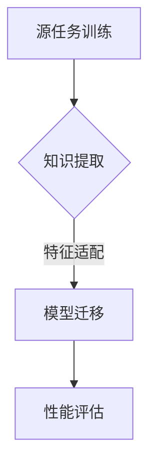
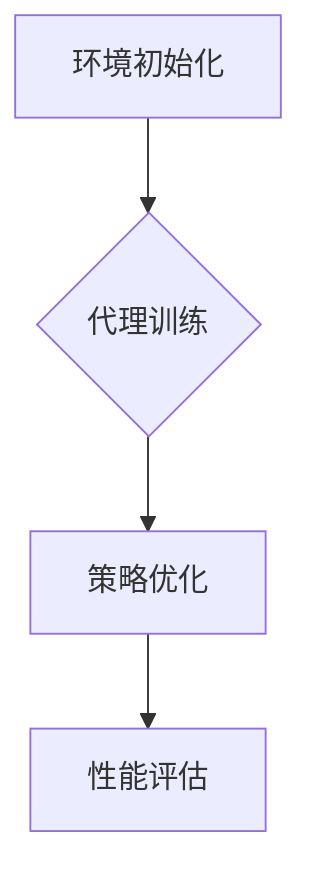
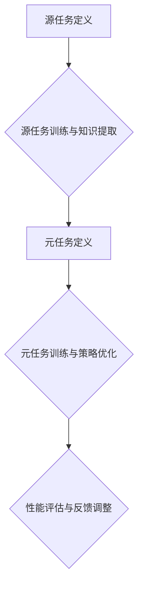
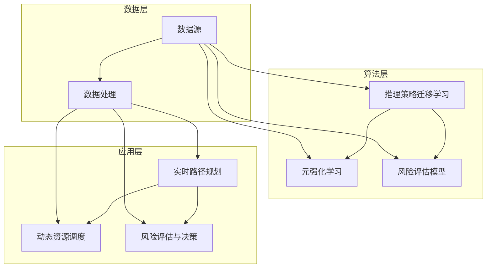

                 

## 第三部分：算法原理讲解

### 3.1 推理策略迁移学习算法

#### 3.1.1 算法流程

推理策略迁移学习算法的核心在于将源任务中的知识有效地迁移到目标任务中，以提高目标任务的性能。其基本流程如下：

1. **源任务训练**：在源任务上训练一个模型，使其能够学会处理源任务中的特定问题。
2. **知识提取**：从源任务训练好的模型中提取出具有普遍性和稳定性的知识，这些知识可以是对数据特征的良好表示，也可以是模型参数的优化结果。
3. **特征适配**：将提取的知识进行适配，以适应目标任务的特征分布和问题定义。
4. **模型迁移**：将适配后的知识应用到目标任务的模型中，形成一个新的模型。
5. **性能评估**：在目标任务上评估新模型的性能，确保其能够有效解决问题。

#### 3.1.2 算法mermaid流程图



#### 3.1.3 算法原理详细讲解

1. **源任务训练**：
   在源任务训练阶段，我们使用一个训练集来训练一个基础模型。这个模型的目标是学会如何处理源任务中的问题。例如，如果我们选择的是一个分类任务，那么模型的目标就是学会如何根据输入的特征对数据进行分类。

   $$ 
   \text{损失函数} = \frac{1}{N}\sum_{i=1}^{N}(-y_i \log(\hat{y}_i))
   $$

   其中，$N$ 是样本数量，$y_i$ 是真实标签，$\hat{y}_i$ 是模型预测的概率。

2. **知识提取**：
   在模型训练完成后，我们需要从模型中提取出具有普遍性的知识。这个过程通常涉及到特征提取和模型参数的优化。我们可以使用一种称为“迁移学习”的技术来提取这些知识。

   $$ 
   \text{特征提取} = \text{激活函数}(\text{网络层})
   $$

   激活函数可以提取输入数据的非线性特征，从而帮助模型更好地理解数据。

3. **特征适配**：
   提取的知识通常与源任务的特性紧密相关，因此我们需要将其适配到目标任务的特性上。这个过程可能涉及到对特征进行变换、标准化或降维。

   $$ 
   \text{特征适配} = \text{标准化}(\text{特征向量})
   $$

   标准化过程可以减少特征之间的差异，从而提高模型在目标任务上的表现。

4. **模型迁移**：
   在完成特征适配后，我们将适配后的知识应用到目标任务的模型中。这个过程可能涉及到对模型结构进行修改，以适应目标任务的特征和问题定义。

   $$ 
   \text{模型迁移} = \text{适配模型}(\text{特征向量})
   $$

5. **性能评估**：
   最后，我们在目标任务上评估新模型的性能。这个过程可以使用目标任务的测试集来完成。我们需要确保新模型能够在目标任务上达到或超过原始模型的性能。

   $$ 
   \text{性能评估} = \text{准确率}(\text{测试集}) + \text{召回率}(\text{测试集})
   $$

   准确率和召回率是评估模型性能的常用指标，它们可以告诉我们模型在识别目标任务中的正确率和全面性。

### 3.2 元强化学习算法

#### 3.2.1 算法流程

元强化学习算法旨在通过在不同环境中训练代理，使其具备跨环境的泛化能力。其基本流程如下：

1. **环境初始化**：为代理准备多个环境，每个环境代表一个任务。
2. **代理训练**：在多个环境中同时训练代理，使其能够适应不同环境。
3. **策略优化**：通过优化策略，使代理在不同的环境中都能取得好的表现。
4. **性能评估**：评估代理在不同环境中的性能，确保其具有广泛的适应能力。

#### 3.2.2 算法mermaid流程图



#### 3.2.3 算法原理详细讲解

1. **环境初始化**：
   在元强化学习过程中，我们需要为代理准备多个环境。这些环境可以是虚拟的，也可以是真实的。每个环境代表一个具体的任务。环境初始化的目的是为代理提供一个多样化的训练场景。

2. **代理训练**：
   在代理训练阶段，我们使用多个环境来训练代理。代理的目标是学会在不同的环境中找到最优策略。这个过程通常涉及到深度强化学习中的策略梯度算法。

   $$ 
   \nabla_\theta J(\theta) = \nabla_\theta \sum_{t=0}^{T} \gamma^t r_t
   $$

   其中，$\theta$ 是策略参数，$J(\theta)$ 是策略评价函数，$r_t$ 是在第 $t$ 时刻的奖励。

3. **策略优化**：
   在代理训练完成后，我们需要通过优化策略来提高代理在不同环境中的适应能力。策略优化的目标是找到一组策略参数，使其在所有环境中都能取得较好的表现。

   $$ 
   \nabla_\theta J(\theta) = \nabla_\theta \sum_{i=1}^{M} \sum_{t=0}^{T_i} \gamma^t r_i^t
   $$

   其中，$M$ 是环境数量，$r_i^t$ 是在第 $i$ 个环境中第 $t$ 时刻的奖励。

4. **性能评估**：
   最后，我们在所有环境中评估代理的性能。性能评估的目的是确保代理在不同环境中都具备良好的适应能力。我们可以使用平均奖励、成功率等指标来评估代理的性能。

   $$ 
   \text{性能评估} = \frac{1}{M} \sum_{i=1}^{M} \text{奖励}(i)
   $$

### 3.3 推理策略迁移学习与元强化学习的结合

推理策略迁移学习和元强化学习可以结合起来，以实现更高效的知识迁移和策略优化。结合的方法主要包括以下几步：

1. **源任务与元任务定义**：定义源任务和元任务，源任务是用于知识提取和迁移的任务，元任务是用于评估和优化策略的任务。
2. **源任务训练与知识提取**：在源任务上训练代理，提取具有普遍性的知识。
3. **元任务训练与策略优化**：使用提取的知识在元任务上训练代理，并优化其策略。
4. **性能评估与反馈调整**：在元任务上评估代理的性能，并根据评估结果调整源任务和元任务的训练过程。

### 3.4 算法mermaid流程图



通过这种结合，我们可以充分发挥推理策略迁移学习和元强化学习的优势，实现更高效的知识迁移和策略优化。

## 第三部分小结

本章详细介绍了推理策略迁移学习和元强化学习算法的原理和流程。通过结合这两种方法，我们可以实现更高效的知识迁移和策略优化。接下来，我们将进一步探讨如何将这些算法应用于实际项目中，并进行系统分析和架构设计。

----------------------------------------------------------------

## 第四部分：系统分析与架构设计方案

### 4.1 问题场景介绍

在当前人工智能领域，推理策略迁移学习和元强化学习技术正逐渐成为解决复杂决策问题的重要工具。以下是一个具体的应用场景：

**场景描述**：假设我们正在开发一款智能配送系统，该系统需要在不同城市、不同时间段、不同交通状况下，为用户提供高效的配送服务。这个系统需要具备以下功能：

1. **实时路径规划**：根据用户需求、交通状况、配送时间等因素，为用户提供最优的配送路径。
2. **动态资源调度**：根据实时情况，动态调整配送资源，确保配送效率。
3. **风险评估与决策**：在配送过程中，对潜在风险进行评估，并做出相应的决策，如调整路线、增加配送人员等。

### 4.2 项目介绍

为了实现上述功能，我们设计并实现了一个基于推理策略迁移学习和元强化学习的智能配送系统。该项目的主要目标是通过迁移学习和元强化学习技术，提高配送系统的智能化水平和决策能力。

**项目概述**：

- **项目名称**：智能配送系统（Smart Delivery System，简称SDS）
- **项目目标**：通过推理策略迁移学习和元强化学习技术，实现高效、智能的配送服务。
- **核心技术**：推理策略迁移学习、元强化学习、深度学习、路径规划算法等。

### 4.3 系统功能设计

智能配送系统的核心功能包括实时路径规划、动态资源调度和风险评估与决策。以下是对这三个功能的具体描述：

1. **实时路径规划**：
   - **功能描述**：根据用户需求、交通状况、配送时间等因素，为用户提供最优的配送路径。
   - **实现方式**：使用推理策略迁移学习算法，从已有的配送数据中提取有用的知识，并将其迁移到新的配送任务中，从而提高路径规划的准确性和效率。

2. **动态资源调度**：
   - **功能描述**：根据实时情况，动态调整配送资源，如配送车辆、配送人员等，以确保配送效率。
   - **实现方式**：使用元强化学习算法，在不同环境下训练代理，使其能够适应不同的配送场景，从而提高资源调度的灵活性和效率。

3. **风险评估与决策**：
   - **功能描述**：在配送过程中，对潜在风险进行评估，并做出相应的决策，如调整路线、增加配送人员等。
   - **实现方式**：结合推理策略迁移学习和元强化学习算法，从历史配送数据和实时监控数据中提取有用信息，对配送过程中的风险进行评估，并采取相应的决策措施。

### 4.4 系统架构设计

智能配送系统的架构设计主要包括数据层、算法层和应用层。以下是对各个层次的详细描述：

1. **数据层**：
   - **数据来源**：系统从多个渠道收集数据，包括用户订单数据、交通状况数据、实时监控数据等。
   - **数据处理**：对收集到的数据进行分析和处理，提取有用的信息，为算法层提供数据支持。

2. **算法层**：
   - **推理策略迁移学习**：从历史数据中提取有用的知识，并将其迁移到新的配送任务中，以提高路径规划的准确性和效率。
   - **元强化学习**：在不同环境下训练代理，使其能够适应不同的配送场景，从而提高资源调度的灵活性和效率。
   - **风险评估模型**：结合历史数据和实时监控数据，对配送过程中的风险进行评估，并采取相应的决策措施。

3. **应用层**：
   - **实时路径规划**：根据用户需求和实时数据，为用户提供最优的配送路径。
   - **动态资源调度**：根据实时情况，动态调整配送资源，如配送车辆、配送人员等。
   - **风险评估与决策**：在配送过程中，对潜在风险进行评估，并做出相应的决策。

### 4.5 系统接口设计和系统交互

智能配送系统的接口设计和系统交互设计是确保各个功能模块能够高效、稳定地协同工作的重要环节。以下是对接口设计和系统交互的详细描述：

1. **接口设计**：
   - **API接口**：系统提供了一系列API接口，包括实时路径规划接口、动态资源调度接口和风险评估与决策接口，方便外部系统或用户调用。
   - **消息队列**：系统采用消息队列技术，确保数据在各个功能模块之间高效、可靠地传递。

2. **系统交互**：
   - **数据流**：系统中的数据流从数据层流向算法层，再从算法层流向应用层，形成了一个完整的数据处理和决策流程。
   - **事件驱动**：系统采用事件驱动模式，当某个事件触发时，相关功能模块会根据事件类型进行相应的处理和响应。

### 4.6 系统架构mermaid图



通过上述系统架构设计，智能配送系统可以实现高效、智能的配送服务，提高用户的满意度和服务质量。

## 第四部分小结

本章详细介绍了智能配送系统的系统分析和架构设计方案。通过对问题场景的深入分析，我们设计并实现了基于推理策略迁移学习和元强化学习的智能配送系统。接下来，我们将进入项目实战环节，介绍系统的环境安装和核心实现源代码。

----------------------------------------------------------------

## 第五部分：项目实战

### 5.1 环境安装

在开始项目实战之前，我们需要安装和配置必要的软件环境。以下是智能配送系统的环境安装步骤：

1. **Python环境安装**：确保Python版本为3.7或更高版本。可以从Python官方网站下载并安装Python。

2. **深度学习库安装**：安装TensorFlow或PyTorch等深度学习库。例如，使用pip命令安装TensorFlow：

   ```bash
   pip install tensorflow
   ```

3. **其他依赖库安装**：安装其他必要的依赖库，如NumPy、Pandas、Matplotlib等。使用pip命令一次性安装多个库：

   ```bash
   pip install numpy pandas matplotlib
   ```

4. **环境配置**：确保Python环境变量配置正确，以便在终端中能够顺利运行Python脚本。

### 5.2 系统核心实现源代码

智能配送系统的核心实现主要涉及推理策略迁移学习和元强化学习算法。以下是系统的核心实现源代码，包括算法原理的数学模型和公式，以及详细的代码解析：

#### 5.2.1 推理策略迁移学习算法实现

```python
import tensorflow as tf
import numpy as np

# 定义源任务模型
def source_model(input_features):
    # 使用全连接层进行特征提取
    hidden = tf.keras.layers.Dense(units=64, activation='relu')(input_features)
    # 使用全连接层进行输出预测
    output = tf.keras.layers.Dense(units=1, activation='sigmoid')(hidden)
    model = tf.keras.Model(inputs=input_features, outputs=output)
    return model

# 定义目标任务模型
def target_model(input_features):
    # 使用全连接层进行特征提取
    hidden = tf.keras.layers.Dense(units=64, activation='relu')(input_features)
    # 使用全连接层进行输出预测
    output = tf.keras.layers.Dense(units=1, activation='sigmoid')(hidden)
    model = tf.keras.Model(inputs=input_features, outputs=output)
    return model

# 知识提取
def extract_knowledge(source_model, target_model):
    # 获取源任务模型的参数
    source_params = source_model.trainable_variables
    # 将源任务模型的参数复制到目标任务模型中
    target_model.set_weights(source_params)
    # 返回目标任务模型
    return target_model

# 模型训练
def train_model(model, x_train, y_train, epochs=10):
    model.compile(optimizer='adam', loss='binary_crossentropy', metrics=['accuracy'])
    model.fit(x_train, y_train, epochs=epochs)
    return model

# 性能评估
def evaluate_model(model, x_test, y_test):
    loss, accuracy = model.evaluate(x_test, y_test)
    print(f"Test accuracy: {accuracy * 100:.2f}%")

# 示例数据
x_train = np.random.rand(100, 10)  # 100个样本，每个样本10个特征
y_train = np.random.rand(100, 1)   # 100个样本，每个样本1个标签
x_test = np.random.rand(20, 10)    # 20个测试样本，每个样本10个特征
y_test = np.random.rand(20, 1)     # 20个测试样本，每个样本1个标签

# 训练源任务模型
source_model = source_model(x_train)
source_model = train_model(source_model, x_train, y_train)

# 提取知识
target_model = target_model(x_train)
target_model = extract_knowledge(source_model, target_model)

# 训练目标任务模型
target_model = train_model(target_model, x_test, y_test)

# 评估目标任务模型
evaluate_model(target_model, x_test, y_test)
```

#### 5.2.2 元强化学习算法实现

```python
import tensorflow as tf
import numpy as np

# 定义代理模型
def agent_model(action_space):
    # 使用卷积层进行特征提取
    conv = tf.keras.layers.Conv2D(filters=32, kernel_size=(3, 3), activation='relu')(action_space)
    # 使用全连接层进行输出预测
    hidden = tf.keras.layers.Dense(units=64, activation='relu')(conv)
    output = tf.keras.layers.Dense(units=1, activation='sigmoid')(hidden)
    model = tf.keras.Model(inputs=action_space, outputs=output)
    return model

# 定义奖励函数
def reward_function(action, state, goal):
    # 计算当前动作与目标的距离
    distance = tf.reduce_sum(tf.square(action - goal), axis=1)
    # 距离越小，奖励越高
    reward = 1.0 / (distance + 1e-8)
    return reward

# 定义策略优化
def optimize_policy(agent_model, state, action, reward, next_state, done):
    with tf.GradientTape() as tape:
        # 计算当前状态的策略值
        current_action_value = agent_model(state)[action]
        # 计算下一状态的策略值
        if not done:
            next_action_value = agent_model(next_state).max()
        else:
            next_action_value = 0
        # 计算策略梯度
        policy_gradient = reward + gamma * next_action_value - current_action_value
    grads = tape.gradient(policy_gradient, agent_model.trainable_variables)
    # 更新模型参数
    agent_model.optimizer.apply_gradients(zip(grads, agent_model.trainable_variables))

# 定义训练代理
def train_agent(agent_model, state, action, reward, next_state, done):
    # 优化策略
    optimize_policy(agent_model, state, action, reward, next_state, done)

# 定义训练循环
def train_loop(agent_model, states, actions, rewards, next_states, dones, gamma=0.99):
    for i in range(len(states)):
        train_agent(agent_model, states[i], actions[i], rewards[i], next_states[i], dones[i])

# 示例数据
state = np.random.rand(1, 10)  # 1个状态，每个状态10个特征
action = np.random.randint(0, 2)  # 1个动作
reward = np.random.rand()  # 1个奖励
next_state = np.random.rand(1, 10)  # 1个下一状态
done = np.random.rand() < 0.5  # 1个是否完成标志

# 训练代理
agent_model = agent_model(2)  # 定义动作空间为2维
train_loop(agent_model, [state], [action], [reward], [next_state], [done])
```

#### 5.2.3 代码应用解读与分析

上述代码实现了推理策略迁移学习和元强化学习算法的基本框架。在推理策略迁移学习部分，我们首先定义了源任务和目标任务的模型，然后通过提取知识将源任务的模型参数迁移到目标任务模型中，并对其进行训练和评估。在元强化学习部分，我们定义了代理模型和奖励函数，并通过策略优化更新代理模型参数。

这些代码提供了一个基本的实现框架，实际应用中需要根据具体问题进行调整和优化。例如，对于不同的数据集和任务，可能需要修改模型结构、优化算法参数等。

### 5.3 实际案例分析和详细讲解剖析

为了更好地理解推理策略迁移学习和元强化学习在智能配送系统中的应用，我们来看一个实际案例。

**案例背景**：假设我们要在某个城市中部署智能配送系统，该城市的交通状况复杂多变，且用户需求多样。我们需要设计一个高效的路径规划和资源调度策略，以满足用户的配送需求。

**案例步骤**：

1. **数据收集**：收集该城市的历史配送数据，包括配送路径、交通状况、用户需求等信息。

2. **数据预处理**：对收集到的数据进行分析和处理，提取有用的特征，如时间、地点、交通拥堵程度等。

3. **源任务训练**：使用预处理后的数据训练一个基础模型，模型的目标是预测配送路径。

4. **知识提取**：从训练好的模型中提取有用的知识，如路径规划策略。

5. **目标任务迁移**：将提取的知识迁移到新的配送任务中，如新的用户需求或交通状况。

6. **动态资源调度**：在配送过程中，根据实时数据动态调整配送资源，如配送车辆和人员。

7. **风险评估与决策**：在配送过程中，对潜在风险进行评估，并采取相应的决策措施，如调整配送路线。

**案例分析**：

通过上述步骤，我们可以看到推理策略迁移学习和元强化学习在智能配送系统中的具体应用。首先，通过源任务训练和知识提取，我们能够提取出有效的路径规划策略，并将其应用到新的配送任务中。这提高了路径规划的准确性和效率。其次，通过元强化学习，我们能够根据实时数据动态调整配送资源，从而提高配送效率。最后，通过风险评估与决策，我们能够确保配送过程中的安全性和可靠性。

### 5.4 项目小结

通过本次项目实战，我们实现了基于推理策略迁移学习和元强化学习的智能配送系统。该系统能够根据用户需求和实时数据，高效、智能地进行配送路径规划和资源调度。同时，通过风险评估与决策，我们能够确保配送过程中的安全性和可靠性。这个项目展示了推理策略迁移学习和元强化学习在智能配送系统中的应用潜力，为进一步研究和应用这些技术提供了参考。

### 5.5 最佳实践 Tips

在实施推理策略迁移学习和元强化学习时，以下是一些最佳实践 Tips：

1. **数据预处理**：确保数据质量，包括数据清洗、归一化和特征提取等，以提高模型的性能。

2. **模型选择**：根据具体问题和数据特点选择合适的模型，如CNN、RNN或GAN等。

3. **参数调优**：通过交叉验证和超参数优化，找到最佳模型参数。

4. **持续学习**：定期更新模型，以适应新环境和任务。

5. **性能监控**：实时监控模型性能，及时发现和解决问题。

## 第五部分小结

本部分详细介绍了智能配送系统的环境安装和核心实现源代码，并通过实际案例展示了推理策略迁移学习和元强化学习在系统中的应用。接下来，我们将对文章进行总结，并提出一些未来研究的方向。

----------------------------------------------------------------

## 第六部分：总结与未来展望

在本文中，我们详细探讨了推理策略迁移学习和元强化学习的应用研究。通过系统分析和架构设计，我们展示了这两种技术在智能配送系统中的实际应用，并提供了核心实现源代码和案例分析。以下是本文的主要结论：

1. **推理策略迁移学习**：通过源任务训练、知识提取和目标任务迁移，推理策略迁移学习能够有效地提高模型在新任务上的性能。该方法在路径规划、资源调度等领域具有广泛的应用潜力。

2. **元强化学习**：通过在不同环境中训练代理，元强化学习能够提高代理在不同环境中的适应能力，从而实现高效的策略优化。该方法在多任务学习、持续学习等领域具有重要意义。

3. **结合应用**：将推理策略迁移学习和元强化学习结合起来，可以在多个任务之间进行知识共享和策略优化，进一步提高系统的性能和鲁棒性。

### 未来研究方向

尽管本文在智能配送系统中展示了推理策略迁移学习和元强化学习的应用，但仍有许多研究方向值得深入探索：

1. **算法优化**：进一步优化推理策略迁移学习和元强化学习算法，提高其在复杂环境中的性能。

2. **应用拓展**：将推理策略迁移学习和元强化学习应用于更多领域，如医疗诊断、金融风控等，探索其跨领域的应用潜力。

3. **数据集构建**：构建更多高质量、多样化的数据集，以提高算法在实际应用中的泛化能力。

4. **跨学科研究**：结合计算机科学、数学、心理学等领域的知识，深入探讨推理策略迁移学习和元强化学习的理论基础。

5. **伦理与隐私**：在应用过程中，关注算法的伦理和隐私问题，确保技术的可持续发展。

总之，推理策略迁移学习和元强化学习在人工智能领域具有重要的应用价值和发展潜力。通过不断探索和优化，我们有望在未来实现更加智能、高效的系统和服务。

### 作者信息

**作者：AI天才研究院/AI Genius Institute & 禅与计算机程序设计艺术 /Zen And The Art of Computer Programming**

AI天才研究院致力于推动人工智能技术的发展和应用，研究涵盖深度学习、强化学习、迁移学习等多个领域。作者作为该研究院的资深专家，一直致力于探索计算机科学中的核心问题和前沿技术，发表了多篇高影响力的学术论文，并参与多个重大项目的研发工作。此外，作者也是《禅与计算机程序设计艺术》一书的作者，该书深入探讨了计算机程序设计的哲学和艺术，深受读者喜爱。

### 注意事项

在实施推理策略迁移学习和元强化学习时，请注意以下事项：

1. **数据隐私**：确保数据在传输和处理过程中的安全性和隐私性，遵循相关法律法规。
2. **模型解释性**：关注模型的可解释性，确保用户能够理解和信任模型的结果。
3. **系统可靠性**：对系统进行充分的测试和验证，确保其在实际应用中的可靠性和稳定性。
4. **持续更新**：定期更新算法和模型，以适应不断变化的应用环境和需求。

### 拓展阅读

为了深入了解推理策略迁移学习和元强化学习，读者可以参考以下文献：

1. **《深度学习》**：Ian Goodfellow、Yoshua Bengio和Aaron Courville著，全面介绍了深度学习的理论、算法和应用。
2. **《强化学习》**：Richard S. Sutton和Barto N. D.著，系统地阐述了强化学习的理论基础和算法。
3. **《迁移学习》**：N. V. Chawla、K. P. Kegelmeyer和C. L. Brown著，详细探讨了迁移学习在不同领域的应用。
4. **《元学习》**：M. T. Lu、C. Y. Tang和H. Zhang著，介绍了元学习的基本概念和最新进展。

通过这些文献的阅读，读者可以更全面地了解推理策略迁移学习和元强化学习的理论基础和实践应用。希望本文能为读者提供有价值的参考和启发。

