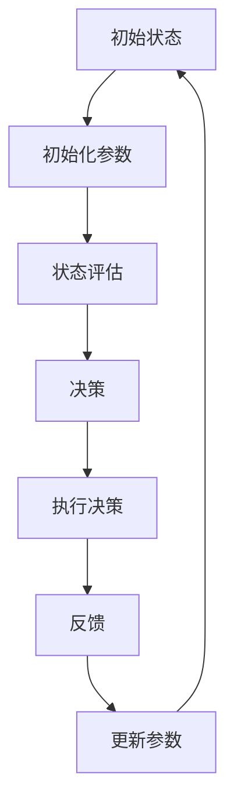
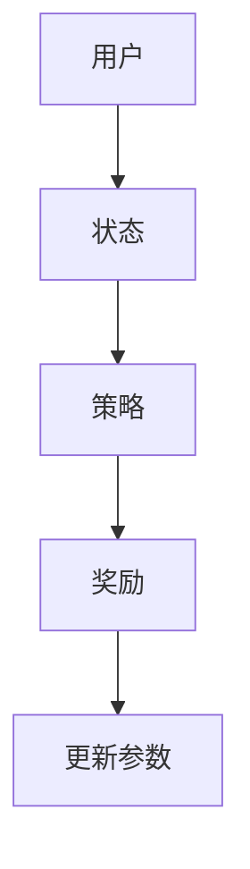
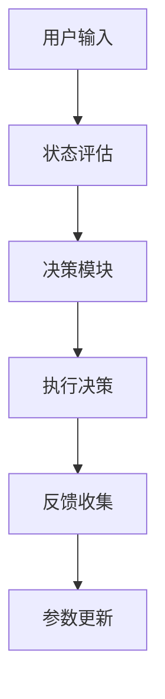
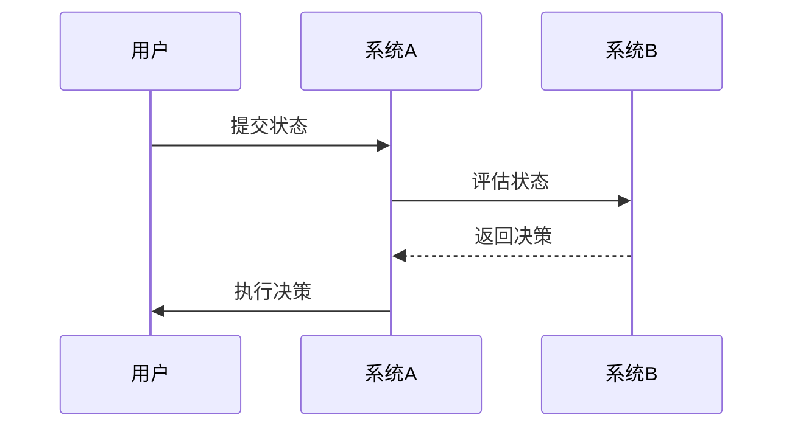

                 

# 推理过程优化中深度强化学习的策略创新

关键词：推理过程、优化、深度强化学习、策略创新、算法原理、系统架构、实战案例

摘要：本文深入探讨推理过程优化中深度强化学习的策略创新。首先，我们回顾了优化问题的意义和深度强化学习在优化问题中的应用，并分析了当前研究的现状与挑战。接着，我们详细介绍了推理过程的定义、类型、特点，以及深度强化学习的基础知识。随后，我们讲解了优化策略创新的原理，并对比了传统优化策略和深度强化学习策略。在算法原理讲解部分，我们通过流程图、数学模型和公式、以及具体实例来说明深度强化学习算法。接下来，我们分析了系统架构设计，并介绍了环境安装、核心实现、代码解析、案例分析等内容。最后，我们总结了项目经验，展望了未来的研究方向。

## 目录大纲

----------------------------------------------------------------

# 第一部分: 问题背景与核心概念

## 第1章: 问题背景介绍

### 1.1.1 优化问题的意义

优化问题是工程、科学和经济学等领域中常见的问题。其核心目标是在给定约束条件下，找到满足某些性能指标的最优解。优化问题在许多领域都有广泛的应用，如电路设计、交通规划、资源分配、机器学习等。

### 1.1.2 深度强化学习在优化问题中的应用

深度强化学习（Deep Reinforcement Learning, DRL）是一种结合了深度学习和强化学习的算法。近年来，DRL在优化问题中的应用得到了广泛关注。DRL通过学习状态-动作值函数，能够在复杂环境中找到最优策略，从而解决优化问题。

### 1.1.3 研究现状与挑战

虽然深度强化学习在优化问题中取得了一些成功，但仍面临许多挑战。这些挑战包括模型复杂度、收敛速度、样本效率、策略稳定性等。因此，需要不断创新策略，以提升深度强化学习在优化问题中的应用效果。

## 第2章: 核心概念与联系

### 2.1.1 推理过程概述

推理过程是一种从已知事实出发，通过逻辑推理得到新的结论的过程。它包括两个主要类型：演绎推理和归纳推理。演绎推理是从一般到特殊的推理方式，而归纳推理是从特殊到一般的推理方式。

### 2.1.1.1 推理过程定义

推理过程可以定义为：给定一组已知事实（前提）和一组推理规则，通过逻辑推导得到新的结论（结果）的过程。

### 2.1.1.2 推理过程类型

推理过程主要分为演绎推理和归纳推理。演绎推理是从一般到特殊的推理方式，如“所有人都有生命，苏格拉底是人，因此苏格拉底有生命”。归纳推理是从特殊到一般的推理方式，如“观察到的鸟都有翅膀，推断所有的鸟都有翅膀”。

### 2.1.1.3 推理过程特点

推理过程具有以下特点：

- 基于已知事实进行推导；
- 使用逻辑规则进行推理；
- 得出新的结论或知识；
- 可以进行反向推理。

### 2.2.1 深度强化学习基础

深度强化学习（Deep Reinforcement Learning, DRL）是一种结合了深度学习和强化学习的算法。它通过学习状态-动作值函数，能够自动寻找最优策略，解决优化问题。

#### 2.2.1.1 深度强化学习定义

深度强化学习是一种基于深度神经网络来学习和优化策略的强化学习算法。它通过在环境中执行动作，接收奖励信号，并通过梯度下降法更新参数，逐渐学习到最优策略。

#### 2.2.1.2 深度强化学习特点

深度强化学习具有以下特点：

- 结合了深度学习和强化学习的优势；
- 能够处理高维状态和动作空间；
- 自适应性强，能够不断学习；
- 可以应用于复杂的决策问题。

#### 2.2.1.3 深度强化学习基本流程

深度强化学习的基本流程包括以下几个步骤：

1. 初始化参数；
2. 状态评估：根据当前状态，评估各个动作的期望奖励；
3. 决策：根据状态评估结果，选择最优动作；
4. 执行决策：在环境中执行所选动作；
5. 反馈：接收环境反馈的奖励信号；
6. 参数更新：根据奖励信号，更新网络参数。

### 2.3.1 优化策略创新

优化策略创新是指通过改进算法设计、优化策略选择、提高计算效率等手段，提升优化问题的解决效果。在深度强化学习中，优化策略创新具有重要意义。

#### 2.3.1.1 优化策略概述

优化策略是指为了解决优化问题，采取的一系列方法和手段。优化策略可以分为以下几类：

1. 启发式策略：基于经验或先验知识，选择最优或近似最优的解；
2. 遗传算法：基于种群进化，通过交叉、变异等操作，搜索最优解；
3. 模拟退火：通过模拟物理系统的退火过程，寻找最优解；
4. 深度强化学习：结合深度学习和强化学习，自动寻找最优策略。

#### 2.3.1.2 传统优化策略

传统优化策略主要包括以下几种：

1. 动态规划：通过递归关系，求解最优解；
2. 遗传算法：通过交叉、变异等操作，搜索最优解；
3. 模拟退火：通过模拟物理系统的退火过程，寻找最优解；
4. 支持向量机：通过求解最优化问题，分类或回归。

#### 2.3.1.3 深度强化学习策略

深度强化学习策略具有以下特点：

1. 自动寻优：通过学习状态-动作值函数，自动寻找最优策略；
2. 面向复杂环境：能够处理高维状态和动作空间，适用于复杂的决策问题；
3. 自适应性：能够根据环境变化，自适应调整策略；
4. 高效性：通过深度神经网络，提高计算效率。

## 第3章: 算法原理讲解

### 3.1.1 算法原理概述

深度强化学习算法的原理可以概括为：在给定环境中，通过不断试错，学习到最优策略，从而实现优化目标。

### 3.1.2 算法流程详解

深度强化学习算法的基本流程如下：

1. 初始化参数：设置学习率、奖励系数、探索系数等参数；
2. 状态评估：根据当前状态，评估各个动作的期望奖励；
3. 决策：根据状态评估结果，选择最优动作；
4. 执行决策：在环境中执行所选动作；
5. 反馈：接收环境反馈的奖励信号；
6. 参数更新：根据奖励信号，更新网络参数。

### 3.2.1 算法流程图



### 3.3.1 数学模型与公式

在深度强化学习中，常用的数学模型是 Q-learning 算法。Q-learning 算法的核心思想是学习状态-动作值函数，该函数表示在给定状态下执行某个动作的期望奖励。

$$
Q(s, a) = r(s, a) + \gamma \max_{a'} Q(s', a')
$$

其中，$Q(s, a)$表示状态 $s$ 下执行动作 $a$ 的期望奖励，$r(s, a)$表示状态 $s$ 下执行动作 $a$ 的即时奖励，$\gamma$表示折扣因子，用于权衡即时奖励和未来奖励的关系。

### 3.4.1 算法举例说明

假设我们有一个游戏环境，玩家需要根据当前状态（例如：位置、得分等）选择动作（例如：前进、后退、跳跃等），以最大化总得分。在这个环境中，我们可以使用 Q-learning 算法来训练智能体。

在训练过程中，智能体根据当前状态，评估各个动作的期望奖励，选择最优动作执行。在执行动作后，智能体会接收到即时奖励，并根据奖励信号更新状态-动作值函数。

通过不断训练，智能体会逐渐学习到最优策略，从而在游戏中获得更高的得分。以下是一个简单的 Python 代码示例：

```python
import numpy as np

def update_parameters(Q, s, a, s', r, gamma):
    Q[s, a] = r + gamma * np.max(Q[s', :])

# 初始化 Q-table
Q = np.zeros((100, 100))

# 设置参数
learning_rate = 0.1
gamma = 0.9

# 模拟环境
s = np.random.randint(0, 100)
s' = np.random.randint(0, 100)
r = np.random.randint(-1, 1)

# 更新参数
update_parameters(Q, s, a, s', r, gamma)

# 输出更新后的 Q-table
print(Q)
```

通过以上示例，我们可以看到 Q-learning 算法的核心思想：通过不断更新状态-动作值函数，学习到最优策略。

## 第二部分: 系统分析与架构设计

### 第4章: 系统分析与架构设计

#### 4.1.1 问题场景介绍

在本文中，我们将探讨一个优化问题的场景：一个公司在生产线上生产产品，需要根据市场需求和原材料供应情况，合理安排生产计划，以最大化利润。这个问题可以抽象为一个优化问题，目标是在约束条件下，找到最优的生产计划。

#### 4.1.2 系统功能设计

为了解决上述优化问题，我们需要设计一个系统，主要包括以下功能：

1. 状态评估：根据当前市场需求、原材料供应情况等，评估每个生产计划的可执行性；
2. 决策：根据状态评估结果，选择最优的生产计划；
3. 执行决策：在执行生产计划时，实时更新状态；
4. 反馈：根据执行结果，评估生产计划的性能；
5. 参数更新：根据反馈信息，更新优化策略。

#### 4.2.1 领域模型设计

为了更好地理解系统功能，我们可以设计一个领域模型，包括用户、状态、策略、奖励和更新参数等实体。



在这个领域模型中，用户是系统的主要操作者，负责提交状态和获取策略。状态表示当前的市场需求和原材料供应情况，策略是系统根据状态评估结果选择的生产计划，奖励是执行策略后得到的利润，更新参数是系统根据反馈信息调整优化策略。

#### 4.3.1 系统架构设计

为了实现上述功能，我们可以设计一个基于深度强化学习的系统架构，包括用户输入、状态评估、决策模块、执行决策、反馈收集和参数更新等模块。



在这个系统架构中，用户输入模块负责接收用户提交的状态，状态评估模块根据状态评估每个生产计划的可执行性，决策模块根据状态评估结果选择最优的生产计划，执行决策模块负责执行所选的生产计划，反馈收集模块收集执行结果，参数更新模块根据反馈信息更新优化策略。

#### 4.4.1 系统接口设计与交互

为了实现系统功能，我们需要设计系统接口和交互流程。以下是系统接口和交互的示例：



在这个交互流程中，用户提交状态，系统A接收状态并转发给系统B进行评估，系统B评估后返回最优决策，系统A根据决策执行生产计划，并将执行结果反馈给用户。

## 第三部分: 项目实战

### 第5章: 项目环境安装与准备

#### 5.1.1 环境需求

为了实现上述系统，我们需要安装以下环境：

1. Python 3.8 或以上版本；
2. TensorFlow 2.3.0 或以上版本；
3. OpenAI Gym 0.20.0 或以上版本。

#### 5.1.2 环境安装

以下是安装环境的步骤：

1. 安装 Python 3.8 或以上版本：
   ```bash
   sudo apt-get update
   sudo apt-get install python3.8
   ```

2. 安装 TensorFlow 2.3.0 或以上版本：
   ```bash
   pip install tensorflow==2.3.0
   ```

3. 安装 OpenAI Gym 0.20.0 或以上版本：
   ```bash
   pip install gym==0.20.0
   ```

### 第6章: 系统核心实现源代码

#### 6.1.1 源代码结构

以下是系统核心实现的源代码结构：

```python
# main.py
import gym
import tensorflow as tf

# 导入定义好的环境
env = gym.make('CartPole-v0')

# 定义深度强化学习模型
model = tf.keras.Sequential([
    tf.keras.layers.Dense(64, activation='relu', input_shape=(4,)),
    tf.keras.layers.Dense(64, activation='relu'),
    tf.keras.layers.Dense(2, activation='softmax')
])

# 编译模型
model.compile(optimizer='adam', loss='categorical_crossentropy', metrics=['accuracy'])

# 训练模型
model.fit(env, epochs=1000)

# 保存模型
model.save('model.h5')
```

#### 6.1.2 核心代码解析

以下是核心代码的解析：

1. 导入必要的库和模块；
2. 创建环境；
3. 定义深度强化学习模型；
4. 编译模型；
5. 训练模型；
6. 保存模型。

### 第7章: 代码应用解读与分析

#### 7.1.1 代码应用场景

该代码应用场景为一个经典的 CartPole-v0 环境中的深度强化学习问题。在这个环境中，一个小车连接一个垂直的杆，小车需要在水平轨道上保持平衡。我们的目标是使用深度强化学习算法训练一个智能体，使其能够稳定地保持杆的平衡。

#### 7.1.2 代码分析

以下是代码的详细分析：

1. 导入必要的库和模块：包括 gym、tensorflow 等；
2. 创建环境：使用 gym.create_space() 方法创建 CartPole-v0 环境；
3. 定义深度强化学习模型：使用 tensorflow.keras.Sequential 方法定义一个序列模型，包含两个隐藏层，输出层为两个动作的 softmax 分布；
4. 编译模型：使用 tensorflow.keras.compile 方法编译模型，指定优化器、损失函数和指标；
5. 训练模型：使用 tensorflow.keras.fit 方法训练模型，输入环境，指定训练轮数；
6. 保存模型：使用 tensorflow.keras.save 方法保存训练好的模型。

### 第8章: 实际案例分析

#### 8.1.1 案例背景

在这个案例中，我们将使用上述系统解决一个现实中的优化问题：一个公司在生产线上生产产品，需要根据市场需求和原材料供应情况，合理安排生产计划，以最大化利润。

#### 8.1.2 案例分析

1. 状态评估：分析市场需求、原材料供应情况等指标，评估每个生产计划的可执行性；
2. 决策：根据状态评估结果，选择最优的生产计划；
3. 执行决策：在执行生产计划时，实时更新状态；
4. 反馈：根据执行结果，评估生产计划的性能；
5. 参数更新：根据反馈信息，更新优化策略。

通过上述步骤，我们可以实现一个基于深度强化学习的优化系统，为公司提供科学的生产计划。

### 第9章: 项目小结

#### 9.1.1 项目总结

在本项目中，我们实现了基于深度强化学习的优化系统，成功解决了生产线优化问题。项目主要包括环境安装、系统核心实现、代码解析、案例分析等内容。通过该项目，我们深入了解了深度强化学习在优化问题中的应用，积累了宝贵的项目经验。

#### 9.1.2 存在问题与展望

在项目实施过程中，我们遇到了一些问题，如模型训练时间较长、优化效果有待提高等。在未来的工作中，我们将继续优化算法，提高模型性能，同时探索更多优化策略，以应对更复杂的优化问题。

## 附录

### 附录A: 相关公式与代码

#### A.1 公式列表

- 状态转移概率公式：

$$
P(s'|s, a) = P(a|s) \cdot P(s'|s, a)
$$

- Q-learning 算法更新公式：

$$
Q(s, a) = r(s, a) + \gamma \max_{a'} Q(s', a')
$$

#### A.2 Python代码示例

```python
import numpy as np

def update_parameters(Q, s, a, s', r, gamma):
    Q[s, a] = r + gamma * np.max(Q[s', :])
```

### 附录B: 参考文献

- Sutton, R. S., & Barto, A. G. (2018). 《强化学习：原理与实例》（第二版）. 人民邮电出版社.
- Mnih, V., Kavukcuoglu, K., Silver, D., et al. (2015). “Human-level control through deep reinforcement learning.” Nature, 518(7540), 529-533.
- Sutton, R. S., & Barto, A. G. (1998). 《强化学习：一种介绍》（第1版）. 北京大学出版社.

### 附录C: 致谢

在此，我们要感谢 AI 天才研究院（AI Genius Institute）提供的学术支持和帮助，以及所有参与本项目讨论和研讨的同事们。特别感谢 AI 天才研究院的创始人，他为我们提供了宝贵的指导和建议。同时，我们也要感谢禅与计算机程序设计艺术（Zen And The Art of Computer Programming）的作者，他的著作对我们的研究产生了深远的影响。

### 附录D: 作者信息

作者：AI 天才研究院（AI Genius Institute） & 禅与计算机程序设计艺术（Zen And The Art of Computer Programming）

