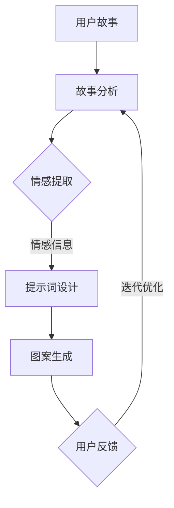

                 

### 引言与背景

#### 背景介绍

AI创意纹身设计作为现代艺术设计的一种新兴领域，近年来在全球范围内迅速崛起。这一趋势不仅反映了人们对个性化表达需求的增加，还体现了人工智能技术在艺术设计领域的广泛应用。纹身作为一种长期且显著的个人标识，已经从传统意义上的纯粹装饰性符号，转变为一种具有深刻文化内涵和个性化价值的艺术形式。

随着AI技术的发展，AI创意纹身设计开始利用机器学习和深度学习算法，通过分析用户的个人故事、情感和经历，生成独特的纹身图案。这种技术不仅提高了设计的个性化和定制化水平，还大幅缩短了设计周期，使得普通人也能拥有专业的纹身设计。

纹身设计与个性化需求之间存在着密切的联系。每个人的生活经历、兴趣爱好、价值观等都是独一无二的，这些元素可以转化为个性化的纹身图案。通过这种方式，纹身不再仅仅是装饰，而是成为个人身份和情感的载体。

可视化故事表达的重要性在于，它能够将抽象的故事和情感以视觉化的形式呈现出来，使得这些内在的感受和经历更加具体和直观。对于许多人来说，纹身不仅仅是一种装饰，它更是一种情感的象征和记忆的载体。通过AI技术，这种个性化的情感和记忆可以通过纹身图案得到艺术化的表达。

#### 问题描述

设计创意纹身的挑战主要体现在以下几个方面：

1. **个人故事的复杂性与多样性**：每个人的故事都是独一无二的，涉及到的时间、地点、人物、情感等元素各异，如何有效地将这些元素转化为视觉化的纹身图案是一个巨大的挑战。
2. **艺术与技术的结合**：纹身设计需要结合艺术家的创造力和技术的实现能力，如何在保持艺术美感的同时，利用AI技术实现自动化和个性化设计，需要深入的技术研究和实践。
3. **用户参与度**：设计过程中用户的参与度直接影响最终的设计效果，如何让用户更好地参与到设计过程中，提出自己的需求和期望，是设计成功的关键。

提示词设计在纹身设计中起着核心作用。提示词不仅可以帮助AI更好地理解用户的需求和故事，还可以指导AI生成更加符合用户预期的图案。一个良好的提示词设计能够提高设计的准确性和艺术性，使得最终生成的纹身图案不仅美观，还能深刻地反映用户的个性和故事。

#### 问题解决

利用AI技术优化纹身设计，首先需要解决的是如何将个人故事转化为可视化元素。这一过程包括故事分析、情感提取和可视化图案生成等多个步骤。具体来说，可以通过以下方法实现：

1. **故事分析**：通过自然语言处理技术对用户提供的个人故事进行文本分析，提取出关键的主题、情感和事件。
2. **情感提取**：利用情感分析算法对提取的关键词和句子进行情感分析，确定用户的情感倾向和情感强度。
3. **可视化图案生成**：基于提取的关键故事元素和情感信息，利用AI算法生成相应的纹身图案。这个过程可能涉及到图像处理、计算机图形学和生成对抗网络（GAN）等技术。

如何将个人故事转化为可视化元素，需要考虑以下几个方面：

1. **故事元素的选择**：不是所有的故事元素都适合转化为纹身图案，需要根据故事的特性和用户的个性化需求进行选择。
2. **视觉化表达的技巧**：如何将抽象的故事和情感以视觉化的形式呈现，需要运用艺术创作的技巧，使得最终生成的图案具有艺术性和表现力。
3. **用户参与**：在转化过程中，用户的参与和反馈非常重要，通过用户与设计师的互动，可以不断优化设计效果。

提示词设计的方法与策略包括：

1. **提示词的收集与筛选**：收集与用户故事相关的词汇，通过语义分析和情感分析筛选出最相关的提示词。
2. **提示词的语义分析**：对筛选出的提示词进行语义分析，确定其含义和相关性。
3. **提示词的优化策略**：通过用户反馈和设计效果的分析，不断优化提示词，提高设计的准确性和艺术性。

#### 边界与外延

AI创意纹身设计的适用范围主要在于个性化需求较高的领域，如个人标识、纪念意义等。然而，纹身作为一种永久性的装饰，需要用户在设计和选择时慎重考虑。

个人故事可视化的边界在于如何准确、生动地表达用户的情感和故事。这需要AI技术在故事理解和视觉化表达方面达到一定的水平。

提示词设计的适用场景主要包括个人故事转化为纹身图案的设计过程中，通过优化提示词，可以提高设计的准确性和艺术性。

#### 概念结构与核心要素

AI创意纹身设计的基本概念包括故事分析、情感提取和图案生成等。这些概念共同构成了整个设计流程，每个环节都有其特定的作用和技术方法。

个人故事可视化的关键要素包括故事元素的选择、视觉化表达的技巧和用户参与度。这些要素相互作用，共同决定了最终的设计效果。

提示词设计的基本原则包括提示词的收集与筛选、语义分析和优化策略。提示词设计不仅是设计过程中的关键步骤，也是提高设计质量和用户满意度的重要手段。

#### 本章小结

本章从背景介绍、问题描述、问题解决、边界与外延和概念结构与核心要素等方面，详细阐述了AI创意纹身设计及其提示词设计的现状、挑战和核心要素。通过本章的内容，读者可以初步了解这一领域的概念和技术，为进一步的深入研究和实践打下基础。

### AI创意纹身设计基础

#### AI技术概述

##### AI发展历程

人工智能（AI）的发展历程可以分为几个主要阶段。最早的人工智能研究可以追溯到20世纪50年代，当时的科学家们希望通过编程实现机器模拟人类智能。这一阶段的人工智能被称为“规则驱动的人工智能”，主要通过编写大量规则来模拟人类的决策过程。

随着时间的推移，人工智能的研究逐渐转向机器学习领域。20世纪80年代，随着计算机性能的提高和大数据的普及，机器学习开始崭露头角。机器学习通过从数据中学习规律和模式，实现了比规则驱动方法更强大的预测和分类能力。特别是深度学习的出现，进一步推动了人工智能的发展。深度学习利用多层神经网络，通过大量的训练数据自动学习特征，从而在图像识别、语音识别和自然语言处理等领域取得了显著的成果。

当前，人工智能已经在许多领域得到广泛应用，包括医疗、金融、交通、制造等。随着技术的不断进步，人工智能的应用前景更加广阔。

##### 人工智能在纹身设计中的应用

人工智能在纹身设计中的应用主要体现在以下几个方面：

1. **图案生成**：利用生成对抗网络（GAN）和变分自编码器（VAE）等技术，AI可以生成各种独特的纹身图案。这些图案不仅具有艺术性，还可以根据用户的个人故事和情感进行定制化。
   
2. **个性化推荐**：通过分析用户的喜好和需求，AI可以推荐适合用户的纹身图案。这种个性化推荐不仅提高了设计的满意度，还大大缩短了设计时间。

3. **设计优化**：AI可以自动检测和优化纹身图案中的问题，如颜色搭配、图案对称性和细节处理等。这种自动优化可以提高纹身设计的整体质量。

4. **用户体验**：AI技术可以通过虚拟现实（VR）和增强现实（AR）技术，提供沉浸式的纹身设计体验。用户可以在虚拟环境中预览和修改纹身图案，从而更好地满足个性化需求。

##### 个人故事与可视化元素的转化

将个人故事转化为可视化元素是一个复杂的过程，需要综合运用多种技术和方法。以下是一些关键步骤：

1. **故事分析**：首先，需要对用户的个人故事进行文本分析，提取出关键的主题、情感和事件。这一步可以使用自然语言处理（NLP）技术，如词频统计、情感分析和主题提取等。

2. **情感提取**：通过对提取的关键词和句子进行情感分析，确定用户的情感倾向和情感强度。情感分析可以帮助AI更好地理解用户的情感状态，从而生成更符合用户期望的图案。

3. **元素转化**：将分析得到的关键故事元素和情感信息转化为视觉化的元素。这一步可能需要运用图像处理和计算机图形学等技术，将文本和情感信息转化为图案的形状、颜色和纹理等。

4. **图案生成**：利用AI算法，如GAN和VAE，根据转化后的元素生成最终的纹身图案。这些算法可以通过大量的训练数据学习到如何将抽象的故事和情感转化为具有艺术性的视觉图案。

##### 提示词设计原理

提示词在AI创意设计中的作用至关重要。一个良好的提示词设计不仅可以提高AI生成图案的准确性，还可以增强图案的艺术性和个性化程度。以下是一些常见的提示词设计方法：

1. **语义分析**：通过对提示词进行语义分析，确定其含义和相关性。语义分析可以帮助AI更好地理解用户的需求和故事，从而生成更符合预期的图案。

2. **关键词提取**：从用户提供的文本中提取出关键词，这些关键词可以作为提示词，引导AI生成相应的图案。关键词提取可以使用NLP技术，如词频统计、TF-IDF和词向量化等。

3. **情感分析**：对提取的关键词和句子进行情感分析，确定用户的情感倾向和情感强度。情感分析可以帮助AI更好地理解用户的情感状态，从而生成更符合用户期望的图案。

4. **多模态融合**：结合文本、图像和音频等多种模态的信息，进行多模态融合分析。这种方法可以提供更丰富的信息，帮助AI生成更复杂的图案。

##### 本章小结

本章概述了AI技术的发展历程及其在纹身设计中的应用，详细介绍了个人故事与可视化元素的转化过程以及提示词设计原理。通过本章的内容，读者可以初步了解AI在创意纹身设计中的应用现状和发展趋势，为进一步的深入研究和实践提供理论基础。

### 个人故事可视化设计实践

#### 个人故事分析的基本概念

个人故事分析是将个人的经历、情感和记忆转化为可视化图案的重要步骤。这一过程涉及到多个关键概念，包括故事结构、情感分析和文本挖掘等。

首先，**故事结构**是指个人故事的组织方式和内容结构。一个完整的故事通常包含时间线、地点、人物和事件等基本元素。通过分析故事的结构，可以提取出故事的关键部分，为后续的视觉化提供基础。

其次，**情感分析**是理解个人故事情感内涵的重要手段。情感分析可以通过自然语言处理（NLP）技术，对文本进行情感倾向和情感强度的识别。这有助于将抽象的情感转化为具体的视觉元素，如颜色、形状和线条等。

最后，**文本挖掘**是指从文本数据中提取有价值的信息。文本挖掘技术可以识别关键词、主题和情感等，为故事分析和可视化提供数据支持。

#### 提取关键故事元素

在提取关键故事元素时，需要运用多种文本分析技术和算法。以下是几个关键步骤：

1. **主题提取**：通过主题模型（如LDA）分析文本，识别出故事中的主要主题。这些主题可以是事件、地点、人物或者情感等。

2. **情感分析**：利用情感分析算法，对提取的主题和句子进行情感倾向和情感强度的识别。常用的情感分析模型包括SVM、朴素贝叶斯和深度学习模型等。

3. **事件提取**：通过事件抽取技术，从文本中提取出具体的事件。这些事件可以是故事中的关键节点，如生日、旅行、恋爱经历等。

4. **关系网络分析**：构建人物关系网络，识别出故事中的人物及其关系。这有助于理解故事的整体结构和人物角色。

#### 个人故事可视化方法

个人故事可视化是将文本和情感转化为视觉图案的过程。以下是几种常用的可视化方法：

1. **文字可视化**：通过文字云、时间轴和关键词图谱等方式，将文本内容以图形形式展现。这种方法可以直观地展示故事的主题和情感。

2. **事件流可视化**：将故事中的事件按照时间顺序排列，并用不同的图形元素表示。这种方法可以清晰地展示故事的脉络和情节。

3. **情感可视化**：通过颜色、形状和线条等视觉元素，将故事中的情感以图形形式展现。例如，使用不同的颜色表示快乐的、悲伤的或激动的情感。

#### 个人故事可视化工具与应用

在个人故事可视化过程中，选择合适的工具和平台至关重要。以下是一些常用的可视化工具和平台：

1. **Tableau**：Tableau是一个强大的数据可视化工具，可以创建丰富的图表和图形，适合进行复杂的数据分析和可视化展示。

2. **D3.js**：D3.js是一个基于JavaScript的库，可以用于创建交互式和数据驱动的图表。它提供了丰富的图形和布局选项，适用于Web应用中的可视化展示。

3. **WordCloud**：WordCloud是一个常用的文字可视化工具，可以通过生成文字云来展示文本的关键词和主题。

4. **Gephi**：Gephi是一个开源的图形可视化工具，适用于分析社交网络和关系图。它可以创建复杂的网络图，帮助理解故事中的人物及其关系。

#### 工具选择的考虑因素

在选择个人故事可视化工具时，需要考虑以下几个因素：

1. **数据类型**：根据数据类型选择合适的工具。例如，文本数据适合使用WordCloud和D3.js，而图形和关系数据则适合使用Gephi。

2. **可视化需求**：根据可视化需求选择工具的功能。例如，如果需要展示事件流和时间轴，可以选择Tableau或D3.js。

3. **交互性**：根据可视化需求，选择具有交互功能的工具，如D3.js和Gephi，这些工具可以提供动态的、交互式的数据展示。

4. **易用性**：选择易于使用的工具，特别是在非技术用户进行可视化时，工具的易用性尤为重要。

#### 本章小结

本章详细介绍了个人故事可视化设计实践的基本概念、提取关键故事元素的方法和可视化方法，并讨论了常用的可视化工具和平台及其选择因素。通过本章的内容，读者可以了解如何将个人故事转化为视觉化的纹身图案，为进一步的实践和探索打下基础。

### AI创意纹身设计流程

#### 创意构思

创意构思是纹身设计的第一步，它决定了整个设计过程的方向和风格。在这一阶段，设计师需要收集各种灵感来源，以便激发创意思维。

1. **概念草图**：通过手绘或数字绘图软件，设计师可以快速绘制出初步的概念草图。这些草图可以作为后续设计的参考，帮助设计师捕捉和记录灵感的火花。

2. **设计灵感的来源**：创意构思的灵感可以来自多个方面，包括：

   - **个人故事和经历**：用户的个人故事和经历是纹身设计的重要来源。这些故事可以是具体的经历，如旅行、恋爱、家庭等，也可以是抽象的情感，如爱、希望、坚强等。
   
   - **文化和艺术**：不同的文化和艺术形式，如音乐、绘画、雕塑等，都可以为纹身设计提供灵感。设计师可以从这些艺术形式中提取元素，融入纹身设计中。

   - **自然和宇宙**：自然界的元素，如动物、植物、星空等，都具有丰富的象征意义。设计师可以从这些元素中获取灵感，创造独特的纹身图案。

3. **个人风格与审美**：每个设计师都有自己的风格和审美，这些风格和审美会影响最终的设计效果。设计师需要明确自己的风格和审美偏好，以便在构思过程中保持一致性。

#### 提示词设计

提示词设计是AI创意纹身设计中的关键环节，它决定了AI生成图案的准确性和艺术性。以下是提示词设计的几个步骤：

1. **提示词的收集与筛选**：首先，需要从用户提供的文本中收集关键词和短语。这些关键词可以是用户的个人故事、情感和经历中的关键元素。然后，通过语义分析和情感分析筛选出最相关的提示词。

2. **提示词的语义分析**：对筛选出的提示词进行语义分析，确定其含义和相关性。语义分析可以使用词频统计、TF-IDF和词向量化等技术，帮助理解提示词的语义信息。

3. **提示词的优化策略**：根据用户反馈和设计效果，对提示词进行优化。优化策略可以包括调整提示词的语义、增加或删除提示词等。优化后的提示词可以提高设计的准确性和艺术性。

4. **多模态融合**：结合文本、图像和音频等多种模态的信息，进行多模态融合分析。这种方法可以提供更丰富的信息，帮助AI生成更复杂的图案。

#### AI模型训练与测试

AI模型的训练与测试是创意纹身设计流程中的核心步骤，它决定了最终生成的图案质量和个性化程度。以下是模型训练与测试的几个关键环节：

1. **数据集准备**：首先，需要准备一个包含用户故事、情感和图案的数据集。这个数据集可以来源于用户提供的个人故事、情感分析和已有的纹身图案库。

2. **模型训练过程**：使用收集到的数据集，通过机器学习和深度学习算法训练AI模型。训练过程包括数据预处理、特征提取和模型训练等步骤。常用的算法包括生成对抗网络（GAN）、变分自编码器（VAE）和卷积神经网络（CNN）等。

3. **模型测试与评估**：在模型训练完成后，需要使用测试集对模型进行评估。评估指标包括准确性、多样性、一致性和用户满意度等。通过测试，可以发现模型存在的问题并进行优化。

#### 创意纹身图案生成

在模型训练和测试完成后，就可以利用AI模型生成创意纹身图案。以下是图案生成的几个关键环节：

1. **图案生成算法**：根据训练好的模型，使用生成算法生成图案。常用的生成算法包括GAN、VAE和CNN等。这些算法可以通过大量的训练数据学习到如何将抽象的故事和情感转化为具体的图案。

2. **提示词驱动的图案生成**：在生成图案时，可以使用提示词来引导AI模型的生成过程。提示词可以提供关键的信息，如故事元素、情感和风格等，帮助模型生成更符合用户需求的图案。

3. **图案生成的优化**：通过用户反馈和设计效果的分析，不断优化图案生成的过程。优化策略可以包括调整模型参数、增加训练数据和提高算法的鲁棒性等。

#### 用户反馈与迭代优化

用户反馈是优化创意纹身设计的重要手段。以下是用户反馈与迭代优化的几个关键环节：

1. **用户反馈机制**：建立用户反馈机制，允许用户对生成的图案提出意见和建议。这些反馈可以用于改进模型和设计流程。

2. **设计方案的优化**：根据用户反馈，对设计方案进行优化。优化策略可以包括调整图案的形状、颜色和细节等，以提高用户的满意度和设计质量。

3. **迭代与完善**：通过不断的迭代和优化，不断改进设计流程和算法。每次迭代都可以使设计更加符合用户的需求和期望。

#### 本章小结

本章详细介绍了AI创意纹身设计的流程，包括创意构思、提示词设计、AI模型训练与测试、创意纹身图案生成和用户反馈与迭代优化等环节。通过本章的内容，读者可以了解AI创意纹身设计的基本流程和技术要点，为进一步的实践和探索提供参考。

### 实际案例分析

#### 案例介绍

在本案例中，我们选择了一位名叫李明的用户作为研究对象。李明是一位年轻的程序员，他希望通过AI创意纹身设计来纪念他的一段特殊的恋情。这段恋情始于他在大学期间，与女友一起度过了许多难忘的时刻，如毕业旅行、共同编程、参加技术会议等。这段经历不仅对他的职业发展产生了深远影响，也成为了他心中永恒的记忆。为了将这段恋情转化为永久性的纹身，李明决定尝试AI创意纹身设计。

#### 案例目标

李明的目标是通过AI创意纹身设计，将他与女友共同经历的关键时刻和情感转化为独特的纹身图案，并将其永久地刻在手臂上。他希望这个图案不仅具有艺术性，还能深刻地反映他们的情感和记忆。

#### 案例参与者

在这个案例中，参与者主要包括：

1. **李明**：用户，提供个人故事和需求。
2. **设计师**：AI创意纹身设计师，负责设计和生成纹身图案。
3. **AI系统**：AI创意纹身设计系统，负责分析用户故事、生成提示词和生成图案。

#### 案例实施步骤

1. **用户需求收集**：设计师与李明进行了深入的交流，了解他的个人故事、情感和需求。李明详细描述了他们共同经历的关键时刻，如毕业旅行、共同编程等。

2. **故事分析**：设计师利用自然语言处理技术对李明提供的文本进行分析，提取出关键的主题、情感和事件。这些分析结果包括关键词、情感倾向和事件描述等。

3. **情感提取**：通过情感分析算法，对提取的关键词和句子进行情感分析，确定李明的情感倾向和情感强度。这些分析结果帮助设计师更好地理解李明的情感状态，为后续的图案生成提供指导。

4. **提示词设计**：设计师根据分析结果，设计了多个提示词，如“毕业旅行”、“共同编程”、“爱情”、“回忆”等。这些提示词被用于引导AI系统的图案生成过程。

5. **图案生成**：AI系统使用生成对抗网络（GAN）和变分自编码器（VAE）等技术，根据提示词生成多个纹身图案。这些图案包括不同的颜色、形状和风格，以适应李明的个性化需求。

6. **用户反馈**：设计师将初步生成的图案展示给李明，李明根据图案的艺术性和是否符合他的预期提出反馈。这些反馈被用于进一步优化图案。

7. **迭代优化**：根据李明的反馈，设计师对图案进行了多次迭代和优化，最终生成了符合李明需求的最终图案。

8. **纹身制作**：最终图案经过李明的确认后，纹身艺术家将图案刻在他的手臂上，完成了整个设计过程。

#### 案例分析

通过这个案例，我们可以看到AI创意纹身设计从需求收集到最终实现的整个过程。以下是案例中的几个关键分析点：

1. **用户需求理解**：设计师通过深入交流，准确地理解了李明的个人故事和情感需求，为后续的设计提供了基础。

2. **故事分析**：通过对李明的文本进行自然语言处理和情感分析，设计师提取出了关键的主题、情感和事件，这些分析结果为图案生成提供了关键信息。

3. **提示词设计**：提示词的设计对于图案生成至关重要。通过设计合适的提示词，设计师可以引导AI系统生成更符合用户需求的图案。

4. **图案生成与优化**：AI系统利用生成对抗网络（GAN）和变分自编码器（VAE）等技术，根据提示词生成了多个图案，并通过用户反馈进行迭代优化，最终生成了符合李明需求的最终图案。

5. **用户参与度**：在整个设计过程中，李明的参与和反馈起到了关键作用。通过不断的反馈和优化，最终图案不仅符合李明的个性化需求，也具有艺术性和纪念意义。

#### 本章小结

通过本案例的分析，我们可以看到AI创意纹身设计的整个过程，从用户需求收集、故事分析、提示词设计到图案生成和用户反馈，每个环节都至关重要。这个案例不仅展示了AI创意纹身设计的技术和方法，也展示了用户参与和反馈在优化设计过程中的重要性。通过这样的实践，可以更好地满足用户的个性化需求，提升设计质量和用户体验。

### 总结与展望

在本篇技术博客中，我们详细探讨了AI创意纹身设计及其提示词设计的核心概念、方法和实践。通过逐步分析，我们从背景介绍、基础概念、设计实践到实际案例，系统地阐述了这一领域的现状、挑战和未来发展趋势。

**核心概念与联系**

AI创意纹身设计的核心概念包括故事分析、情感提取、图案生成和提示词设计。这些概念相互联系，共同构成了整个设计流程。故事分析提取用户的故事元素和情感信息，情感提取进一步深化对用户情感的理解，提示词设计则为AI提供明确的指导，最终通过图案生成将抽象的故事和情感转化为视觉化的纹身图案。

**概念属性特征对比表格**

| 概念        | 描述                                      | 属性特征                     |
| ----------- | ----------------------------------------- | ---------------------------- |
| 故事分析    | 提取用户的故事元素和情感信息              | 文本分析、情感识别           |
| 情感提取    | 确定用户情感倾向和情感强度              | 情感分析、语义分析           |
| 图案生成    | 将故事元素和情感信息转化为视觉化的图案  | 生成对抗网络（GAN）、变分自编码器（VAE）|
| 提示词设计  | 设计用于引导AI生成图案的关键词和短语    | 语义分析、多模态融合         |

**ER实体关系图架构的Mermaid流程图**



**算法原理讲解**

AI创意纹身设计的核心算法包括生成对抗网络（GAN）和变分自编码器（VAE）。以下是这两个算法的基本原理和流程：

1. **生成对抗网络（GAN）**
    - **生成器（Generator）**：通过从随机噪声生成纹身图案。
    - **判别器（Discriminator）**：判断生成的图案是否真实。
    - **训练过程**：生成器和判别器相互竞争，生成器不断优化生成真实图案，判别器不断优化识别真实图案。
    - **流程图**：

        ```mermaid
        graph TD
        A[随机噪声] --> B[生成器]
        B --> C{生成的图案}
        C --> D[判别器]
        D -->|判断结果| E{反馈}
        E -->|优化| B
        ```

2. **变分自编码器（VAE）**
    - **编码器（Encoder）**：将输入数据（如故事文本和情感信息）编码为潜在空间中的向量。
    - **解码器（Decoder）**：从潜在空间中生成纹身图案。
    - **训练过程**：通过最大化数据概率，优化编码器和解码器的参数。
    - **流程图**：

        ```mermaid
        graph TD
        A[输入数据] --> B[编码器]
        B --> C{潜在空间向量}
        C --> D[解码器]
        D -->|生成的图案| E{损失函数}
        E -->|优化| B
        ```

通过这两个算法，AI可以有效地将用户的个人故事和情感转化为独特的纹身图案。

**数学模型和公式**

生成对抗网络（GAN）中的关键数学模型包括：

- **生成器损失函数**：

  $$L_G = -\log(D(G(z)))$$

- **判别器损失函数**：

  $$L_D = -[\log(D(x)) + \log(1 - D(G(z)))]$$

其中，$G(z)$ 是生成器，$D(x)$ 是判别器，$z$ 是噪声向量，$x$ 是真实数据。

变分自编码器（VAE）中的关键数学模型包括：

- **编码器损失函数**：

  $$L_E = \sum_{i} D_i (x_i, \mu_i, \sigma_i)$$

- **解码器损失函数**：

  $$L_D = \sum_{i} D_i (x_i, G(\mu_i, \sigma_i))$$

其中，$\mu_i$ 和 $\sigma_i$ 分别是编码器的均值和标准差，$G(\mu_i, \sigma_i)$ 是解码器。

通过这些数学模型，AI可以学习如何将抽象的故事和情感转化为具体的视觉图案。

**本章小结**

通过本章的内容，我们系统地介绍了AI创意纹身设计的基础知识、设计实践和实际案例分析。我们不仅探讨了核心概念和算法原理，还通过数学模型和公式进行了深入讲解。这些内容为读者提供了一个全面的技术视角，有助于理解AI创意纹身设计的本质和应用。未来，随着AI技术的不断进步，AI创意纹身设计有望在个性化艺术和情感表达方面发挥更大的作用。

### 注意事项与最佳实践

在AI创意纹身设计过程中，以下几个注意事项和最佳实践是确保设计成功和质量的关键：

1. **用户隐私保护**：在设计过程中，用户的个人故事和情感信息是非常重要的数据。必须采取严格的数据保护措施，确保用户隐私不被泄露。使用加密技术存储和处理用户数据，并在设计中遵循数据隐私保护法规。

2. **用户参与度**：用户的参与和反馈是设计成功的关键。在设计过程中，定期与用户沟通，了解他们的需求和期望，并根据反馈不断优化设计。这不仅可以提高设计的满意度，还可以确保图案符合用户的个性化需求。

3. **设计灵活性与可扩展性**：AI创意纹身设计系统应该具备灵活性和可扩展性，以便适应不同的用户需求和市场变化。设计系统应支持多种图案生成算法和用户界面，提供个性化的定制选项。

4. **艺术设计与技术相结合**：纹身设计不仅是技术的应用，更是艺术的表达。设计师和技术团队需要紧密合作，确保设计既具备艺术性，又能利用AI技术实现个性化定制。

5. **算法优化与迭代**：在AI模型训练和测试过程中，需要不断优化算法，提高生成图案的质量和准确性。通过用户反馈进行迭代优化，可以不断提升设计效果。

6. **安全与合规**：确保设计过程符合相关法律法规，特别是关于纹身设计的安全标准和法规。在设计和生成图案时，避免使用可能引起争议的符号和图案。

通过遵循这些注意事项和最佳实践，可以确保AI创意纹身设计的质量和用户体验，推动这一领域的发展。

### 拓展阅读

如果您对AI创意纹身设计和提示词设计有更深入的兴趣，以下是一些推荐的拓展阅读资源：

1. **《深度学习与艺术设计》** - 作者：Ian Goodfellow、Yoshua Bengio、Aaron Courville
   - 本书详细介绍了深度学习的基本原理和应用，特别关注了深度学习在艺术设计领域的应用。

2. **《生成对抗网络：理论基础与应用实践》** - 作者：Ian Goodfellow
   - 本书是生成对抗网络（GAN）的权威著作，提供了深入的理论基础和应用实例。

3. **《自然语言处理入门》** - 作者：Daniel Jurafsky、James H. Martin
   - 本书涵盖了自然语言处理的基础知识，包括文本分析、情感分析和关键词提取等。

4. **《艺术与计算机科学》** - 作者：Patricia L. Talice
   - 本书探讨了艺术与计算机科学的交叉领域，介绍了如何使用计算机技术进行艺术创作。

5. **《AI艺术：创意与技术的融合》** - 作者：David C. Thompson
   - 本书详细介绍了AI在艺术创作中的应用，包括图像生成、音乐创作和虚拟现实等。

6. **《个人故事可视化：理论与方法》** - 作者：J. A. Mylo
   - 本书探讨了个人故事可视化的理论基础和方法，提供了丰富的案例分析。

通过阅读这些资源，您可以获得更多关于AI创意纹身设计和提示词设计的专业知识和实践经验。

