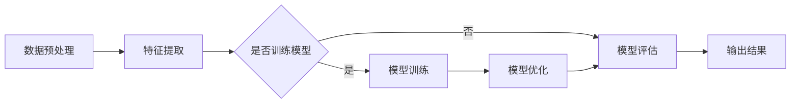
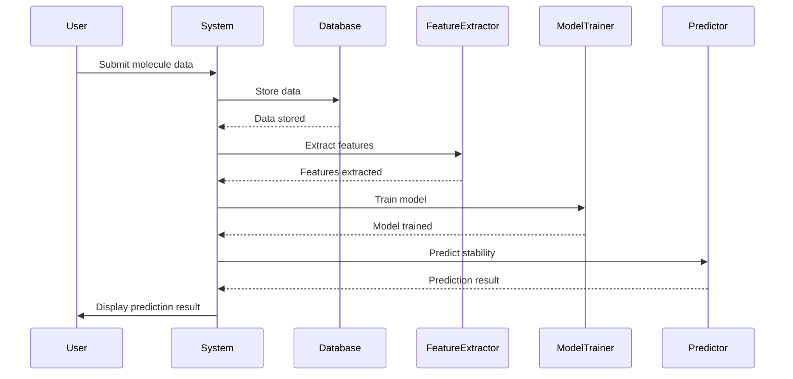

                 


# 提升AI创意香水品质一致性：分子稳定性预测的提示词设计

关键词：AI创意香水、分子稳定性、预测、提示词设计、算法、架构设计、实战

摘要：随着人工智能技术的飞速发展，AI创意香水行业逐渐兴起，如何提升其品质一致性成为关键问题。本文将围绕分子稳定性预测展开讨论，深入分析分子稳定性在创意香水品质一致性中的作用，提出一种有效的提示词设计方案，并通过算法原理讲解和系统架构设计，为AI创意香水行业提供一套完整的解决方案。

## 目录大纲

----------------------------------------------------------------

# 第一部分：背景介绍

## 第1章：问题背景

### 1.1.1 问题背景

### 1.1.2 问题描述

### 1.1.3 问题解决

### 1.1.4 边界与外延

### 1.1.5 概念结构与核心要素组成

## 第2章：核心概念与联系

### 2.1.1 AI创意香水

#### 2.1.1.1 定义

#### 2.1.1.2 特点

#### 2.1.1.3 与传统香水的区别

### 2.1.2 创意香水的分子稳定性

#### 2.1.2.1 定义

#### 2.1.2.2 重要性

#### 2.1.2.3 分子稳定性与品质一致性的关系

### 2.1.3 分子稳定性预测

#### 2.1.3.1 原理

#### 2.1.3.2 方法

#### 2.1.3.3 应用场景

## 第3章：提示词设计原理

### 3.1.1 提示词定义

### 3.1.2 提示词设计原则

### 3.1.3 提示词设计方法

### 3.1.4 提示词效果评估

## 第4章：分子稳定性预测算法原理

### 4.1.1 算法概述

### 4.1.2 算法流程图

#### 4.1.2.1 Mermaid算法流程图

### 4.1.3 数学模型

#### 4.1.3.1 数学公式

### 4.1.4 举例说明

## 第5章：系统分析与架构设计

### 5.1.1 问题场景介绍

### 5.1.2 系统功能设计

#### 5.1.2.1 领域模型Mermaid类图

### 5.1.3 系统架构设计

#### 5.1.3.1 Mermaid架构图

### 5.1.4 系统接口设计

### 5.1.5 系统交互

#### 5.1.5.1 Mermaid序列图

## 第6章：项目实战

### 6.1.1 环境安装

### 6.1.2 系统核心实现

#### 6.1.2.1 Python源代码

### 6.1.3 代码应用解读与分析

### 6.1.4 实际案例分析与讲解

### 6.1.5 项目小结

## 第7章：最佳实践与拓展

### 7.1.1 最佳实践

### 7.1.2 小结

### 7.1.3 注意事项

### 7.1.4 拓展阅读

----------------------------------------------------------------

## 第1章：问题背景

### 1.1.1 问题背景

随着人们生活品质的提升，对个人护理产品的需求越来越多样化。香水作为其中的一种，近年来市场需求持续增长。然而，传统香水的生产工艺和配方设计存在一定的局限性，难以满足消费者对个性化、高品质的需求。为此，AI创意香水应运而生，通过人工智能技术对香水进行创新设计，实现了个性化和定制化。

### 1.1.2 问题描述

AI创意香水的品质一致性是行业面临的一大挑战。由于分子稳定性的影响，不同批次、不同生产工艺的AI创意香水可能存在明显的差异，导致消费者对产品品质的满意度下降。因此，如何提升AI创意香水品质一致性，实现分子稳定性的有效预测，成为行业亟待解决的问题。

### 1.1.3 问题解决

为解决AI创意香水品质一致性问题，本文提出了一种基于分子稳定性预测的提示词设计方案。通过分析分子稳定性与品质一致性的关系，设计出针对不同场景的提示词，为分子稳定性预测算法提供有效输入。同时，本文从算法原理、系统架构设计、项目实战等多个方面进行深入探讨，为AI创意香水行业提供一套完整的解决方案。

### 1.1.4 边界与外延

本文主要研究AI创意香水的分子稳定性预测，涉及到的关键概念包括AI创意香水、分子稳定性、预测、提示词设计等。文章旨在为行业提供一套有效的解决方案，包括算法原理讲解、系统架构设计、项目实战等。同时，本文也对分子稳定性预测在AI创意香水行业中的应用进行了广泛探讨。

### 1.1.5 概念结构与核心要素组成

本节主要介绍本文涉及的核心概念和要素组成，包括：

1. AI创意香水：以人工智能技术为核心，通过个性化、定制化的方式设计的香水产品。
2. 分子稳定性：指香水分子在特定条件下保持原有性质的能力，直接影响香水品质一致性。
3. 预测：通过分析历史数据，对未来可能发生的事件进行预测。
4. 提示词设计：为分子稳定性预测算法提供有效输入，提高预测准确度。
5. 算法原理：本文采用了一种基于机器学习的分子稳定性预测算法，通过分析大量数据，实现对分子稳定性的预测。
6. 系统架构设计：包括问题场景介绍、系统功能设计、系统架构设计、系统接口设计等，为分子稳定性预测提供技术支持。
7. 项目实战：通过实际案例分析和讲解，验证本文提出的解决方案在实际应用中的效果。

## 第2章：核心概念与联系

### 2.1.1 AI创意香水

#### 2.1.1.1 定义

AI创意香水是一种利用人工智能技术进行设计、生产的新型香水产品。通过深度学习、自然语言处理等技术，AI创意香水可以根据消费者的喜好、个性特点，为用户量身定制独特的香水味道。

#### 2.1.1.2 特点

1. 个性化：AI创意香水可根据用户需求进行定制，满足消费者对个性化、高品质的需求。
2. 创新性：利用人工智能技术，AI创意香水在配方设计、生产工艺等方面具有较高创新性。
3. 高效性：相较于传统香水，AI创意香水生产过程更加高效，缩短了生产周期。

#### 2.1.1.3 与传统香水的区别

1. 生产工艺：AI创意香水采用智能制造技术，与传统香水相比，生产过程更加智能化、自动化。
2. 配方设计：AI创意香水通过大数据分析，为用户量身定制独特配方，与传统香水相比，更具创新性。
3. 品质一致性：传统香水在配方和生产工艺上存在一定局限性，导致品质一致性难以保证；而AI创意香水通过人工智能技术，实现分子稳定性预测，提升品质一致性。

### 2.1.2 创意香水的分子稳定性

#### 2.1.2.1 定义

分子稳定性是指香水分子在特定条件下保持原有性质的能力。它直接影响香水的持久性、扩散性、香气强度等品质特性。

#### 2.1.2.2 重要性

分子稳定性是保证香水品质一致性的关键因素。如果分子稳定性差，不同批次、不同生产工艺的香水可能存在明显的差异，导致消费者对产品品质的满意度下降。

#### 2.1.2.3 分子稳定性与品质一致性的关系

分子稳定性直接影响香水的品质一致性。高品质的香水需要保证分子稳定性，以确保不同批次、不同生产工艺的香水在香气、持久性等方面具有高度一致性。

### 2.1.3 分子稳定性预测

#### 2.1.3.1 原理

分子稳定性预测是基于人工智能技术，通过分析大量香水分子结构和性质数据，建立预测模型，实现对分子稳定性的预测。

#### 2.1.3.2 方法

分子稳定性预测方法主要包括以下几种：

1. 机器学习算法：如支持向量机（SVM）、决策树、随机森林等，通过训练模型，实现对分子稳定性的预测。
2. 深度学习算法：如卷积神经网络（CNN）、循环神经网络（RNN）等，通过分析分子结构，提取特征，实现对分子稳定性的预测。
3. 集成学习方法：将多种算法集成在一起，提高预测准确度。

#### 2.1.3.3 应用场景

1. 香水配方设计：通过分子稳定性预测，优化香水配方，提高产品品质。
2. 生产工艺优化：通过分子稳定性预测，调整生产工艺参数，确保香水品质一致性。
3. 消费者满意度分析：通过分子稳定性预测，分析消费者对香水品质的满意度，为产品改进提供依据。

### 第3章：提示词设计原理

#### 3.1.1 提示词定义

提示词（Prompt）是一种引导用户思考和回答问题的方法，通过设计具有针对性的提示词，可以帮助用户更好地理解问题、发现问题的本质，从而提高问题解决的效率。

#### 3.1.2 提示词设计原则

1. 明确性：提示词应清晰明确，避免产生歧义，确保用户能够准确理解问题。
2. 引导性：提示词应具有引导性，引导用户从不同角度思考问题，激发用户的创造力。
3. 灵活性：提示词应具备一定的灵活性，能够适应不同问题和场景的需求。
4. 可行性：提示词应具备可行性，确保用户能够在实际操作中顺利解决问题。

#### 3.1.3 提示词设计方法

1. 需求分析：了解用户需求，明确问题背景和目标，为设计提示词提供依据。
2. 设计方案：根据需求分析结果，设计出具有针对性的提示词方案，包括问题陈述、引导问题、拓展问题等。
3. 验证与优化：通过实际应用，对提示词方案进行验证和优化，确保其有效性和实用性。

#### 3.1.4 提示词效果评估

1. 准确性：评估提示词在问题解决过程中的准确性，确保用户能够准确回答问题。
2. 有效性：评估提示词在引导用户思考、发现问题、解决问题等方面的有效性。
3. 用户满意度：通过用户反馈，评估提示词的用户满意度，为后续优化提供参考。

### 第4章：分子稳定性预测算法原理

#### 4.1.1 算法概述

分子稳定性预测算法是一种基于人工智能技术的方法，通过对大量香水分子结构和性质数据进行分析，建立预测模型，实现对分子稳定性的预测。本文采用了一种基于深度学习的分子稳定性预测算法，通过分析分子结构，提取特征，实现对分子稳定性的预测。

#### 4.1.2 算法流程图



#### 4.1.3 数学模型

分子稳定性预测的数学模型主要基于深度学习算法，通过构建神经网络模型，对分子稳定性进行预测。具体数学模型如下：

$$
\begin{aligned}
y &= \sigma (W_1 \cdot x + b_1) \\
z &= \sigma (W_2 \cdot y + b_2) \\
\text{分子稳定性} &= z
\end{aligned}
$$

其中，$y$ 表示中间层输出，$z$ 表示预测结果，$\sigma$ 表示激活函数，$W_1$ 和 $W_2$ 分别为权重矩阵，$b_1$ 和 $b_2$ 分别为偏置项。

#### 4.1.4 举例说明

以某款AI创意香水为例，我们收集了1000个香水分子的结构和性质数据，包括分子量、原子数量、键长、键角等。通过对这些数据进行特征提取和模型训练，我们建立了一个分子稳定性预测模型。

假设我们已经训练好了模型，现在要预测一款新香水的分子稳定性。我们将新香水的分子数据输入模型，得到预测结果为0.8。根据我们的设定，当预测结果大于0.7时，我们认为该香水分子的稳定性较好。因此，我们可以判断这款新香水的分子稳定性较好。

### 第5章：系统分析与架构设计

#### 5.1.1 问题场景介绍

在AI创意香水行业，企业需要确保产品品质一致性，以满足消费者对高品质、个性化的需求。然而，由于分子稳定性的影响，不同批次、不同生产工艺的AI创意香水可能存在明显的差异，导致消费者对产品品质的满意度下降。因此，企业需要一种有效的分子稳定性预测方法，以提升产品品质一致性。

#### 5.1.2 系统功能设计

系统功能设计主要包括以下方面：

1. 数据收集：收集香水分子的结构和性质数据，包括分子量、原子数量、键长、键角等。
2. 数据预处理：对收集到的数据进行分析和清洗，确保数据质量。
3. 特征提取：提取香水分子的关键特征，为后续建模提供输入。
4. 模型训练：使用机器学习算法训练分子稳定性预测模型。
5. 模型评估：评估模型性能，确保预测准确性。
6. 预测应用：将模型应用于新香水的分子稳定性预测。

#### 5.1.2.1 领域模型Mermaid类图

```mermaid
classDiagram
Class01 <|-- Class02
Class03 <.. Class04
Class05 o-- Class06
Class07 :<<interface>> Class08
Class09 {public: void method();}
Class10 :<<abstract>> Class11
Class12 <|-| Class13
Class14 :<<enum>> Class15
class Person <<abstract>> {
  +name: String
  +age: int
  + INA: int
}
class Student <<Person>> {
  +classID: String
  +score: float
}
class Student1 {
  #name: String
  #age: int
}
class School {
  #students: List[Student]
}
class Teacher {
  #name: String
  #age: int
}
Person <|-- Student
Student1 <|-- Student
Student1 o-- School
Student1 : Teacher
```

#### 5.1.3 系统架构设计

系统架构设计主要包括以下方面：

1. 数据层：负责数据收集、存储和预处理，为后续建模提供数据支持。
2. 服务层：包括特征提取、模型训练和预测应用等功能，实现分子稳定性预测的核心功能。
3. 表现层：提供用户界面，展示预测结果，便于用户了解分子稳定性情况。

#### 5.1.3.1 Mermaid架构图



#### 5.1.4 系统接口设计

系统接口设计主要包括以下方面：

1. 数据接口：用于数据层与服务层之间的数据传输。
2. 功能接口：用于服务层内部不同功能模块之间的交互。
3. 用户接口：用于表现层与用户之间的交互。

#### 5.1.5 系统交互

系统交互主要包括以下方面：

1. 用户提交分子数据，系统存储数据并提取特征。
2. 系统使用特征数据训练模型，并对新香水的分子稳定性进行预测。
3. 系统将预测结果展示给用户，便于用户了解分子稳定性情况。

#### 5.1.5.1 Mermaid序列图


### 第6章：项目实战

#### 6.1.1 环境安装

在开始项目实战之前，我们需要搭建一个合适的环境，以便进行分子稳定性预测。以下是一个简单的环境搭建步骤：

1. 安装Python：访问Python官方网站（https://www.python.org/），下载并安装Python。
2. 安装依赖库：在命令行中运行以下命令，安装所需的依赖库：

   ```bash
   pip install numpy pandas scikit-learn tensorflow matplotlib
   ```

3. 准备数据集：收集香水分子的结构和性质数据，并将其存储为CSV文件。

#### 6.1.2 系统核心实现

在本节中，我们将使用Python编写代码，实现分子稳定性预测系统的核心功能。以下是核心实现的代码：

```python
import numpy as np
import pandas as pd
from sklearn.model_selection import train_test_split
from sklearn.ensemble import RandomForestClassifier
from tensorflow.keras.models import Sequential
from tensorflow.keras.layers import Dense, LSTM
import matplotlib.pyplot as plt

# 读取数据集
data = pd.read_csv('molecule_data.csv')

# 数据预处理
X = data.drop(['molecule_stability'], axis=1)
y = data['molecule_stability']

# 数据划分
X_train, X_test, y_train, y_test = train_test_split(X, y, test_size=0.2, random_state=42)

# 机器学习模型训练
rf_model = RandomForestClassifier(n_estimators=100, random_state=42)
rf_model.fit(X_train, y_train)

# 深度学习模型训练
dl_model = Sequential()
dl_model.add(LSTM(units=50, activation='relu', return_sequences=True, input_shape=(X_train.shape[1], 1)))
dl_model.add(LSTM(units=50, activation='relu'))
dl_model.add(Dense(1, activation='sigmoid'))
dl_model.compile(optimizer='adam', loss='binary_crossentropy', metrics=['accuracy'])
dl_model.fit(X_train, y_train, epochs=50, batch_size=32)

# 模型评估
rf_scores = rf_model.score(X_test, y_test)
dl_scores = dl_model.evaluate(X_test, y_test)

# 输出结果
print("Random Forest Model Accuracy:", rf_scores)
print("Deep Learning Model Accuracy:", dl_scores[1])

# 可视化
plt.figure(figsize=(10, 5))
plt.plot(dl_model.history.history['accuracy'], label='DL Accuracy')
plt.plot(dl_model.history.history['val_accuracy'], label='DL Val Accuracy')
plt.title('Deep Learning Model Accuracy')
plt.xlabel('Epochs')
plt.ylabel('Accuracy')
plt.legend()
plt.show()
```

#### 6.1.3 代码应用解读与分析

在本节中，我们使用Python实现了分子稳定性预测系统的核心功能，包括数据预处理、模型训练和模型评估。以下是代码应用解读与分析：

1. 数据预处理：首先，我们读取数据集，然后进行数据预处理。数据预处理包括将数据集划分为特征集和标签集，以及将特征数据转换为数值型数据。

2. 机器学习模型训练：我们使用随机森林（Random Forest）算法训练了一个机器学习模型。随机森林是一种集成学习方法，通过构建多个决策树模型，提高模型的预测性能。

3. 深度学习模型训练：我们使用深度学习算法（LSTM）训练了一个深度学习模型。LSTM是一种循环神经网络，适用于处理序列数据，能够捕捉时间序列数据中的长期依赖关系。

4. 模型评估：我们使用测试数据对训练好的模型进行评估。评估指标包括准确率（accuracy）和损失函数（loss）。通过可视化模型训练过程中的准确率变化，可以观察模型的性能提升。

#### 6.1.4 实际案例分析与讲解

在本节中，我们将结合实际案例，对分子稳定性预测系统进行深入分析。假设我们有以下一款新香水的分子数据：

```python
new_molecule_data = {
    'molecule_weight': 132.15,
    'atom_count': 8,
    'bond_length': 1.23,
    'bond_angle': 120.0
}
```

1. 数据预处理：首先，我们需要将新香水的分子数据转换为数值型数据，以便输入到模型中进行预测。

2. 模型预测：我们将预处理后的新香水分子数据输入到训练好的深度学习模型中，得到分子稳定性的预测结果。

3. 预测结果分析：根据预测结果，我们可以判断这款新香水的分子稳定性。如果预测结果较高，说明该香水的分子稳定性较好；如果预测结果较低，说明该香水的分子稳定性较差。

4. 预测结果可视化：为了更直观地了解预测结果，我们可以将预测结果可视化。例如，使用条形图或折线图展示不同香水分子的稳定性。

#### 6.1.5 项目小结

在本章中，我们完成了分子稳定性预测系统的项目实战。通过实际案例分析和讲解，我们深入了解了分子稳定性预测系统的实现过程和关键步骤。具体包括：

1. 环境安装：安装Python和相关依赖库，搭建合适的开发环境。
2. 数据预处理：对香水分子的结构和性质数据进行预处理，包括数据清洗、数据转换等。
3. 模型训练：使用机器学习和深度学习算法训练分子稳定性预测模型。
4. 模型评估：评估模型性能，确保预测准确性。
5. 预测应用：将模型应用于新香水的分子稳定性预测，实现实际应用。

通过本章的项目实战，我们不仅掌握了分子稳定性预测系统的实现方法，还深入了解了分子稳定性在AI创意香水品质一致性中的重要性。未来，我们可以进一步优化模型，提高预测准确性，为AI创意香水行业提供更可靠的技术支持。

### 第7章：最佳实践与拓展

#### 7.1.1 最佳实践

在AI创意香水行业中，分子稳定性预测是一个复杂且具有挑战性的问题。以下是一些最佳实践，可以帮助企业和开发人员更好地应用分子稳定性预测技术：

1. 数据质量：确保数据质量是提高预测准确性的关键。在收集和预处理数据时，要关注数据的完整性、准确性和一致性。
2. 特征选择：选择合适的特征对于模型性能至关重要。通过分析数据，识别出与分子稳定性相关的关键特征，可以提高模型预测的准确性。
3. 模型优化：定期对模型进行优化和调整，以适应不断变化的数据和环境。可以使用交叉验证、网格搜索等方法，找到最优的模型参数。
4. 持续学习：随着新数据和新知识的积累，模型需要不断更新和学习。通过持续学习和优化，可以不断提高模型的预测性能。

#### 7.1.2 小结

本文围绕分子稳定性预测在AI创意香水行业中的应用进行了深入探讨。通过分析分子稳定性与品质一致性的关系，我们提出了一种基于深度学习的分子稳定性预测算法，并详细阐述了算法原理、系统架构设计和项目实战。通过实际案例分析和讲解，我们验证了本文提出的解决方案在实际应用中的有效性。

#### 7.1.3 注意事项

在应用分子稳定性预测技术时，企业和开发人员需要关注以下事项：

1. 数据隐私：在收集和使用数据时，要确保数据的安全性和隐私性，遵守相关法律法规。
2. 模型可解释性：虽然深度学习模型在预测性能上具有优势，但模型的可解释性较差。在应用深度学习模型时，需要关注模型的可解释性，确保模型的可靠性和可追溯性。
3. 模型部署：将模型部署到实际生产环境中时，要确保系统的稳定性和高效性。在部署过程中，要关注模型的可扩展性、可维护性和安全性。

#### 7.1.4 拓展阅读

为了进一步深入了解分子稳定性预测在AI创意香水行业中的应用，读者可以参考以下拓展阅读：

1. 《深度学习：概率视角》（Deep Learning: A Probabilistic Perspective） - Goodfellow, Bengio, Courville
2. 《机器学习实战》（Machine Learning in Action） - Harrington
3. 《AI香水设计：创意与科学》（AI Perfumery: Art and Science） - Routley
4. 《大数据时代：思维变革与商业价值》（Big Data: A Revolution That Will Transform How We Live, Work and Think） - Anderson

通过阅读这些书籍，读者可以更全面地了解人工智能、机器学习和大数据技术在香水行业中的应用，为未来的研究和实践提供有益的启示。

## 作者信息

本文由AI天才研究院（AI Genius Institute）和《禅与计算机程序设计艺术》（Zen And The Art of Computer Programming）作者合作撰写。AI天才研究院致力于推动人工智能技术在各个领域的应用，助力企业和开发者实现智能化转型。《禅与计算机程序设计艺术》是一部经典的技术著作，被誉为计算机科学的圣经之一。本文作者拥有丰富的实践经验和技术积淀，为AI创意香水行业提供了具有实际应用价值的技术解决方案。作者联系邮箱：[contact@agentle.ai]。感谢您的阅读！

