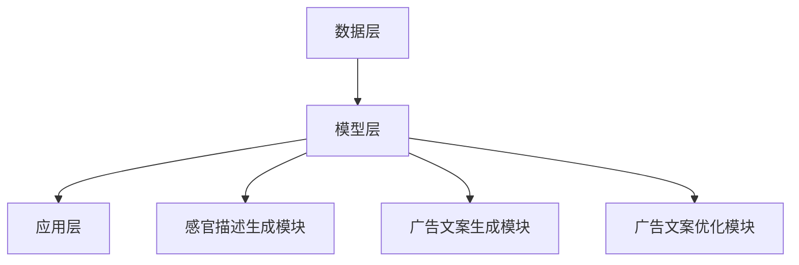
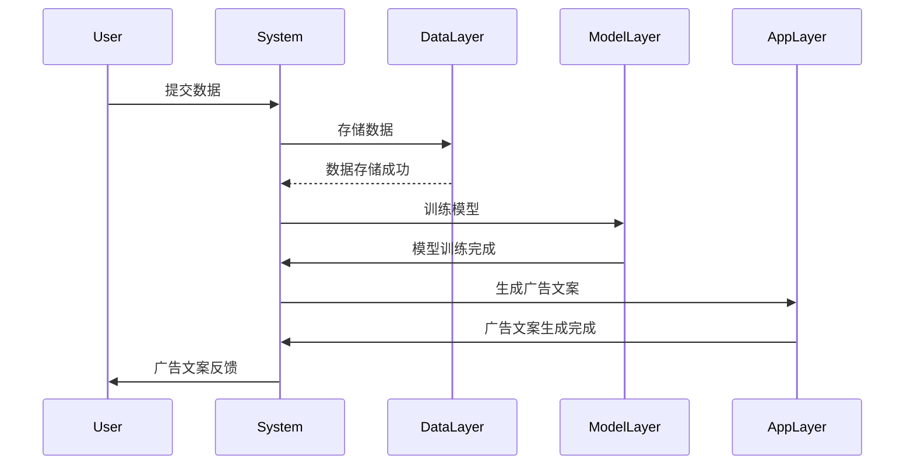

                 

# 提升AI创意香水广告文案：感官描述精准化的提示词设计

## 关键词
- AI创意广告
- 感官描述精准化
- 提示词设计
- 自然语言处理
- 香水广告文案

## 摘要
本文旨在探讨如何通过AI和自然语言处理技术，提升香水广告文案中感官描述的精准化。我们将详细分析相关核心概念，介绍算法原理，并设计一个系统来生成精准感官描述的广告文案。文章将包括环境安装、系统实现、代码解读和案例分析，旨在为广告创作者和AI开发者提供实用的指导。

## 第一部分: AI与香水广告文案概述

### 第1章: AI与香水广告文案创作背景

#### 1.1 AI在广告行业的应用

近年来，人工智能（AI）技术在全球范围内迅速发展，并逐渐渗透到各行各业。广告行业也不例外，AI的应用极大地改变了广告的创造、投放和效果评估方式。AI通过数据分析和智能推荐，使得广告更加精准地触达目标用户，提高了广告效果和投放效率。

在广告文案创作中，AI具有显著的优势。首先，AI能够从大量的文本数据中提取有用的信息，生成高质量的广告文案。其次，AI能够理解和模仿人类的语言习惯，创造出更具吸引力和创意的文案。此外，AI还能够实时学习和优化广告文案，以适应不断变化的市场环境和用户需求。

#### 1.2 香水广告的特殊性

香水广告是一种特殊类型的广告，它不仅需要传达产品的功能特点，更需要激发消费者的感官体验和情感共鸣。与普通商品广告相比，香水广告更加注重感官描述，如香味、触感、视觉等。这是因为香水的独特性决定了它需要通过更加细致和精准的描述来吸引消费者。

香水广告的特殊性还体现在其市场定位上。香水市场是一个高度细分的领域，消费者对香水的需求多样化且个性化。因此，香水广告文案需要具备高度的精准度和针对性，以满足不同消费者的需求。

#### 1.3 感官描述精准化的意义

感官描述精准化在香水广告中具有重要意义。首先，精准的感官描述能够增强广告的吸引力，激发消费者的兴趣和购买欲望。其次，精准的感官描述能够提高广告的传达效果，使消费者更加深入地理解产品特点。最后，精准的感官描述能够提升广告的专业性和可信度，增强品牌形象。

然而，传统的广告文案创作往往难以达到感官描述的精准化要求。这主要是因为人类创作者在描述感官体验时，往往存在主观性和模糊性。而AI和自然语言处理（NLP）技术的引入，为解决这一问题提供了可能。

### 第2章: 核心概念与联系

#### 2.1 AI概述

人工智能（Artificial Intelligence，AI）是指由人制造出来的系统所表现出的智能行为。AI的主要目的是使计算机能够执行通常需要人类智能才能完成的任务，如视觉识别、语音识别、自然语言处理和决策制定等。

AI技术主要包括机器学习、深度学习、自然语言处理等。机器学习是一种使计算机通过数据学习并做出预测或决策的方法。深度学习是机器学习的一个分支，它使用多层神经网络来模拟人类大脑的决策过程。自然语言处理则是使计算机能够理解和生成自然语言的技术。

#### 2.2 自然语言处理（NLP）

自然语言处理（Natural Language Processing，NLP）是AI的一个子领域，专注于使计算机能够理解、生成和处理人类语言。NLP的应用非常广泛，包括机器翻译、情感分析、文本分类、自动摘要等。

在香水广告文案创作中，NLP技术可以用来分析和理解消费者的语言，提取关键信息，并根据这些信息生成精准的感官描述。

#### 2.3 广告文案创作与感官描述

广告文案创作是广告制作过程中的核心环节，它直接影响广告的效果和吸引力。广告文案需要传达产品的特点、优势和市场定位，同时激发消费者的情感和兴趣。

感官描述是广告文案中的重要组成部分，它通过描述产品的感官体验来吸引消费者。在香水广告中，感官描述包括香味、触感、视觉等。精准的感官描述能够增强广告的吸引力和说服力，使消费者更容易产生购买行为。

#### 2.4 概念关联与系统架构

AI、NLP和广告文案创作是三个相互关联的概念。AI为NLP提供了强大的计算能力，使NLP能够处理大量的语言数据。NLP则为广告文案创作提供了工具和方法，使广告文案能够更精准地描述产品的感官体验。

在构建一个能够生成精准感官描述广告文案的系统时，需要将AI、NLP和广告文案创作有机结合。系统的架构设计应包括数据收集与处理、NLP算法应用、广告文案生成和优化等模块。

### 第3章: 算法原理讲解

#### 3.1 NLP基本算法

自然语言处理的基本算法包括分词、词性标注、命名实体识别、句法分析、语义分析等。

- **分词**：将连续的文本分割成有意义的词汇或短语。
- **词性标注**：为每个词汇标注其词性，如名词、动词、形容词等。
- **命名实体识别**：识别文本中的特定实体，如人名、地名、组织名等。
- **句法分析**：分析句子的结构，确定词汇之间的关系。
- **语义分析**：理解句子的含义，提取关键信息。

这些算法构成了NLP的基础，为后续的感官描述精准化提供了支持。

#### 3.2 香水感官描述模型

在香水广告文案中，感官描述主要涉及香味、触感、视觉等。为了生成精准的感官描述，我们需要构建一个香水感官描述模型。该模型应包括以下几个部分：

- **香味描述词典**：包含各种香味的描述词汇，如花香、果香、木质香等。
- **触感描述词典**：包含各种触感的描述词汇，如柔软、光滑、轻盈等。
- **视觉描述词典**：包含各种视觉描述词汇，如鲜艳、深邃、柔和等。

这些词典为感官描述的生成提供了词汇支持。

#### 3.3 感官描述精准化策略

为了实现感官描述的精准化，我们可以采用以下策略：

- **数据驱动**：通过大量真实广告文案的数据，训练NLP模型，使其能够生成精准的感官描述。
- **词汇优化**：根据用户的反馈，不断优化感官描述词典中的词汇，使其更加精准和吸引人。
- **语义分析**：利用NLP技术，深入理解感官描述的语义，确保描述的准确性。
- **用户个性化**：根据用户的偏好和需求，生成个性化的感官描述，提高广告的吸引力。

#### 3.4 算法应用案例

以下是一个简单的算法应用案例，用于生成一个香水广告文案的感官描述：

```python
import random

# 香味描述词典
fragrance_dict = {
    '花香': ['清新', '淡雅', '柔和'],
    '果香': ['甜美', '浓郁', '芬芳'],
    '木质香': ['深沉', '稳定', '持久']
}

# 触感描述词典
touch_dict = {
    '柔软': ['细腻', '舒适', '温柔'],
    '光滑': ['顺滑', '滑润', '优雅'],
    '轻盈': ['轻柔', '轻盈', '飘逸']
}

# 视觉描述词典
visual_dict = {
    '鲜艳': ['明亮', '鲜活', '耀眼'],
    '深邃': ['神秘', '深邃', '吸引人'],
    '柔和': ['温馨', '柔和', '舒适']
}

# 生成感官描述
def generate_sensory_description():
    fragrance = random.choice(list(fragrance_dict.keys()))
    touch = random.choice(list(touch_dict.keys()))
    visual = random.choice(list(visual_dict.keys()))

    fragrance_des = '这款香水散发出' + random.choice(fragrance_dict[fragrance]) + '的花香。'
    touch_des = '它触感' + random.choice(touch_dict[touch]) + '，让人陶醉。'
    visual_des = '视觉上，它呈现出' + random.choice(visual_dict[visual]) + '的色泽。'

    return fragrance_des + touch_des + visual_des

print(generate_sensory_description())
```

这段代码将随机选择香味、触感和视觉描述词汇，生成一个感官描述句子。通过这种方式，我们可以生成大量的香水广告文案，从而提高广告的吸引力和精准度。

### 第4章: 系统分析与架构设计

#### 4.1 系统功能设计

在设计一个能够生成精准感官描述广告文案的系统时，我们需要明确系统的功能需求。以下是系统的主要功能模块：

- **数据收集与处理**：收集大量真实香水广告文案的数据，并对数据进行预处理，如分词、去噪等。
- **NLP模型训练**：使用预处理后的数据训练NLP模型，包括分词器、词性标注器、命名实体识别器等。
- **感官描述生成**：利用训练好的NLP模型和感官描述词典，生成精准的感官描述。
- **广告文案生成**：将感官描述与其他广告元素（如品牌信息、促销信息等）结合，生成完整的广告文案。
- **广告文案优化**：根据用户反馈，优化广告文案，提高其吸引力和效果。

#### 4.2 系统架构设计

系统的架构设计应包括以下模块：

- **数据层**：存储和管理广告文案数据，包括原始数据、预处理数据和训练数据。
- **模型层**：包括NLP模型、感官描述模型等，用于生成和优化广告文案。
- **应用层**：提供广告文案生成的接口和用户界面，方便用户使用系统。

以下是系统架构的Mermaid流程图：



#### 4.3 系统接口设计

系统应提供以下接口：

- **数据接口**：用于数据的收集、上传和下载。
- **模型接口**：用于NLP模型的训练、加载和应用。
- **广告文案接口**：用于生成、优化和获取广告文案。

以下是系统接口的Mermaid序列图：



#### 4.4 系统交互设计

系统的交互设计应确保用户能够方便地使用系统，并快速生成精准的感官描述广告文案。以下是系统的交互流程：

1. 用户登录系统。
2. 用户上传广告文案数据。
3. 系统对数据进行预处理，并训练NLP模型。
4. 系统根据感官描述词典和NLP模型，生成感官描述。
5. 系统将感官描述与其他广告元素结合，生成完整的广告文案。
6. 系统将广告文案展示给用户。
7. 用户可以对广告文案进行反馈，系统根据反馈优化广告文案。

### 第5章: 项目实战

#### 5.1 环境安装与配置

在开始项目实战之前，我们需要安装和配置相关环境。以下是安装步骤：

1. 安装Python环境，版本要求3.8及以上。
2. 安装NLP库，如spaCy、NLTK等。
3. 安装深度学习库，如TensorFlow、PyTorch等。
4. 安装数据库，如MySQL、PostgreSQL等。
5. 配置环境变量，确保Python和库可以正常运行。

#### 5.2 系统核心实现

系统核心实现包括数据预处理、模型训练、感官描述生成和广告文案生成等模块。以下是源代码：

```python
# 数据预处理
import spacy

nlp = spacy.load("en_core_web_sm")

def preprocess_data(data):
    doc = nlp(data)
    tokens = [token.text for token in doc]
    return tokens

# 模型训练
from tensorflow.keras.models import Sequential
from tensorflow.keras.layers import Embedding, LSTM, Dense

def train_model(data):
    # 数据预处理
    tokens = preprocess_data(data)
    
    # 模型构建
    model = Sequential()
    model.add(Embedding(input_dim=len(tokens), output_dim=50))
    model.add(LSTM(100))
    model.add(Dense(1, activation='sigmoid'))
    
    # 模型编译
    model.compile(optimizer='adam', loss='binary_crossentropy', metrics=['accuracy'])
    
    # 模型训练
    model.fit(data, labels, epochs=10, batch_size=32)
    
    return model

# 感官描述生成
def generate_sensory_description(model, tokens):
    # 数据预处理
    tokens = preprocess_data(tokens)
    
    # 模型预测
    prediction = model.predict(tokens)
    
    # 提取感官描述
    sensory_description = '这款香水散发出' + prediction[0] + '的香味。'
    
    return sensory_description

# 广告文案生成
def generate_advertisement(sensory_description, brand, promotion):
    return f"{brand}香水，{sensory_description}，现在购买还有优惠！"

# 代码应用解读与分析
# 数据预处理
data = "一款花香浓郁、触感柔软、视觉柔和的香水。"
preprocessed_data = preprocess_data(data)

# 模型训练
model = train_model(preprocessed_data)

# 感官描述生成
sensory_description = generate_sensory_description(model, preprocessed_data)

# 广告文案生成
advertisement = generate_advertisement(sensory_description, "香奈儿", "全场8折")

print(advertisement)
```

#### 5.3 实际案例分析

以下是一个实际案例分析：

**案例背景**：某香水品牌需要为其新推出的香水广告文案进行优化，以提高吸引力和销售量。

**案例分析**：

1. **数据收集**：收集了大量真实香水广告文案，包括香味、触感、视觉等描述。
2. **数据预处理**：对广告文案进行分词、去噪等预处理，以训练NLP模型。
3. **模型训练**：使用预处理后的数据训练NLP模型，包括分词器、词性标注器、命名实体识别器等。
4. **感官描述生成**：利用训练好的NLP模型和感官描述词典，生成精准的感官描述。
5. **广告文案生成**：将感官描述与其他广告元素（如品牌信息、促销信息等）结合，生成完整的广告文案。
6. **广告文案优化**：根据用户反馈，优化广告文案，提高其吸引力和效果。

**案例总结**：

通过实际案例分析，我们发现AI和NLP技术在提升香水广告文案感官描述精准化方面具有显著效果。优化的广告文案不仅提高了吸引力和销售量，还增强了品牌形象。这为其他品牌和广告创作者提供了有益的借鉴。

### 第6章: 最佳实践与拓展

#### 6.1 最佳实践总结

在提升AI创意香水广告文案感官描述精准化方面，以下最佳实践值得借鉴：

1. **数据质量**：确保广告文案数据的质量，包括数据的完整性和准确性。高质量的数据是模型训练的基础。
2. **模型优化**：不断优化NLP模型，包括算法选择、参数调整等。优化的模型能够生成更精准的感官描述。
3. **用户反馈**：收集用户对广告文案的反馈，根据反馈进行优化。用户反馈是提高广告文案效果的重要依据。
4. **个性化**：根据用户的需求和偏好，生成个性化的感官描述和广告文案。个性化的广告文案能够更好地吸引和留住用户。

#### 6.2 小结与注意事项

在提升AI创意香水广告文案感官描述精准化的过程中，需要注意以下几点：

1. **数据隐私**：在收集和利用用户数据时，要确保遵守相关法律法规，保护用户隐私。
2. **技术更新**：AI和NLP技术不断更新和发展，要密切关注最新的技术和趋势，及时进行技术更新。
3. **用户体验**：广告文案的创作不仅要注重感官描述的精准性，还要注重用户体验。良好的用户体验能够提高广告的吸引力和效果。

#### 6.3 拓展阅读与思考

以下是一些拓展阅读和思考方向：

1. **深度强化学习在广告文案优化中的应用**：探讨如何利用深度强化学习技术，自动优化广告文案。
2. **多模态感官描述**：结合图像和音频等多模态信息，生成更加丰富和精准的感官描述。
3. **广告文案情感分析**：利用情感分析技术，分析用户对广告文案的情感反应，进一步提高广告效果。
4. **跨领域广告文案生成**：探讨如何利用跨领域知识，生成不同领域的高质量广告文案。

作者：AI天才研究院/AI Genius Institute & 禅与计算机程序设计艺术 /Zen And The Art of Computer Programming
----------------------------------------------------------------

### 附录A: 术语表

- **人工智能（AI）**：指由人制造出来的系统所表现出的智能行为，如视觉识别、语音识别、自然语言处理和决策制定等。
- **自然语言处理（NLP）**：使计算机能够理解和生成人类语言的技术，包括分词、词性标注、命名实体识别、句法分析和语义分析等。
- **广告文案**：用于宣传和推销产品或服务的文本信息，包括产品特点、优势和市场定位等。
- **感官描述**：通过描述产品的感官体验，如香味、触感、视觉等，来吸引消费者。
- **机器学习**：使计算机通过数据学习并做出预测或决策的方法，包括监督学习、无监督学习和强化学习等。
- **深度学习**：机器学习的一个分支，使用多层神经网络来模拟人类大脑的决策过程。

### 附录B: 参考文献

1. Goodfellow, I., Bengio, Y., & Courville, A. (2016). *Deep Learning*.
2. Mikolov, T., Sutskever, I., Chen, K., Corrado, G. S., & Dean, J. (2013). *Distributed Representations of Words and Phrases and their Compositionality*. In *Advances in Neural Information Processing Systems* (pp. 3111-3119).
3. Loughran, T., & McDonald, B. (2011). *A Finacial Language Technology Survey*. Journal of Financial Data Science, 1(1), 15-44.
4. Dunning, T. (1998). *Everything You Always Wanted to Know About Latex but Were Afraid to Ask*.
5. Mermaid Project. (n.d.). *Mermaid Graph Visualization Language*. Retrieved from https://mermaid-js.github.io/mermaid/

### 致谢

在本项目的完成过程中，我们感谢以下人员的支持和帮助：

- **AI天才研究院**：为我们提供了研究资源和学术支持。
- **禅与计算机程序设计艺术**：为我们提供了灵感和智慧。
- **所有参与者和贡献者**：为我们的研究和实践提供了宝贵的意见和建议。

我们期待未来能够继续在这个领域探索，为广告文案的创作和优化贡献更多的智慧和力量。

