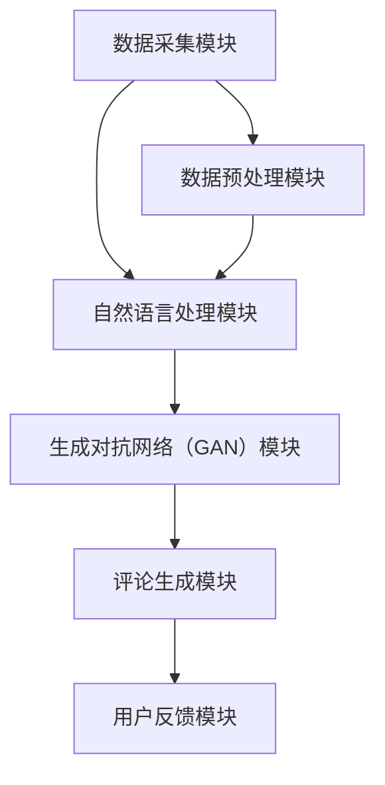

                 

### 摘要

本文主要探讨如何利用人工智能（AI）技术提升创意香水评论的文学性和感官意象描绘能力。随着AI技术的不断进步，AI在自然语言处理、生成对抗网络（GAN）等方面的应用越来越广泛，为创意香水评论的文学性提升提供了新的可能性。文章首先介绍了AI创意香水评论的现状和需求，分析了相关核心概念，如AI、文学性、感官意象等。随后，文章详细讲解了感官意象描绘的技巧，并探讨了提示词设计的原则和方法。通过实际案例解析和系统构建，文章展示了如何将理论应用到实践中，以实现AI创意香水评论的文学性提升。最后，文章总结了主要观点，并展望了未来发展趋势。通过本文的讨论，我们希望能够为AI创意香水评论的发展提供有益的参考和启示。

### 文章关键词

AI，创意香水评论，文学性，感官意象，提示词设计，自然语言处理，生成对抗网络（GAN）

### 背景介绍

#### AI创意香水评论的现状

在当今信息爆炸的时代，消费者对产品的评论和推荐有着越来越高的要求。特别是在香水这种高度个性化的消费品领域，用户不仅关注香水的香味、持久度等基本属性，还期待评论能够传达出更丰富的情感和感官体验。然而，传统的香水评论往往局限于简单的描述，难以充分表达复杂的感官体验，这限制了用户对产品的理解和选择。为了解决这一问题，人工智能（AI）技术应运而生，并逐渐成为提升香水评论质量的重要工具。

AI在自然语言处理、生成对抗网络（GAN）等方面的应用为创意香水评论提供了新的可能性。通过AI技术，评论可以更加生动、形象地描绘香水的感官体验，使读者能够更直观地感受到香水的魅力。同时，AI还可以分析大量用户评论数据，提取出共性和趋势，为产品的改进提供有力的支持。

#### AI创意香水评论的需求

首先，用户对于香水评论的需求不仅仅是客观的描述，更希望评论能够传达出主观的情感和感受。传统的评论往往缺乏这种情感表达，使得用户难以产生共鸣。而AI创意香水评论则可以通过自然语言处理技术，生成具有文学性和情感表达的内容，从而更好地满足用户的需求。

其次，香水市场中的竞争日益激烈，品牌需要通过独特的评论来吸引消费者的注意力。AI创意香水评论能够提供更加个性化和多样化的内容，帮助品牌在市场中脱颖而出。通过利用AI技术，品牌可以生成独特的评论风格，塑造品牌形象，提高品牌认知度。

此外，随着用户对产品质量和体验的要求越来越高，品牌需要提供更加详细和全面的评论。AI创意香水评论可以通过分析大量用户数据，生成丰富多样的评论内容，帮助用户更好地了解产品的特点和使用方法。

#### AI创意香水评论的重要性

AI创意香水评论不仅能够提升用户对产品的理解和选择，还具有以下几方面的重要性：

1. **增强用户体验**：通过生动、形象的评论，用户可以更直观地感受到香水的魅力，从而增强购买体验。

2. **提高品牌知名度**：独特的评论风格和高质量的内容有助于品牌在市场中脱颖而出，提高品牌知名度。

3. **优化产品改进**：通过分析用户评论数据，品牌可以了解到用户对产品的期望和需求，从而优化产品设计和改进。

4. **推动行业发展**：AI创意香水评论的应用不仅为品牌和用户带来了便利，还推动了整个香水行业的发展，促进了创新和进步。

总之，AI创意香水评论在提升文学性和感官意象描绘能力方面具有巨大的潜力，为品牌和消费者带来了诸多益处。随着AI技术的不断进步，AI创意香水评论的应用前景将更加广阔。

### 核心概念

在探讨如何利用AI技术提升创意香水评论的文学性和感官意象描绘能力之前，我们首先需要明确几个核心概念：人工智能（AI）、文学性、感官意象以及它们之间的关系。

#### 人工智能（AI）

人工智能（Artificial Intelligence，简称AI）是指通过计算机程序和算法模拟人类智能的技术。AI的核心目标是使计算机具备感知、理解、学习和决策的能力，从而实现自动化和智能化的任务处理。AI技术涵盖了多个领域，包括机器学习、深度学习、自然语言处理、计算机视觉等。

在香水评论的背景下，AI主要用于自然语言处理，通过对大量文本数据的分析，生成有文学性和情感表达的评论内容。例如，生成对抗网络（GAN）等技术可以生成具有逼真感官意象的文本描述，从而提升评论的文学性和吸引力。

#### 文学性

文学性是指文学作品在语言、结构、情感等方面的独特品质，使读者能够产生共鸣和情感体验。在创意香水评论中，文学性体现在对香水感官体验的生动描绘和情感表达。一个具有文学性的评论不仅能够准确描述香水的特性，还能够引发读者的共鸣，使其感受到香水的魅力。

#### 感官意象

感官意象是指通过视觉、嗅觉、听觉、触觉和味觉等感官体验所形成的生动形象。在香水评论中，感官意象描绘是指通过文字形象地再现香水的香味、质地、持久度等感官体验，使读者能够产生直观的感受。

#### 核心概念之间的关系

AI、文学性和感官意象之间的关系紧密相连。AI技术为提升创意香水评论的文学性和感官意象描绘能力提供了技术基础。通过自然语言处理和生成对抗网络等技术，AI能够生成具有文学性和感官意象的评论内容。

文学性是评论的核心价值，它使评论更具吸引力和感染力，能够更好地传达香水的魅力。感官意象则是文学性的具体表现，通过对香水感官体验的生动描绘，使评论更加生动形象，增强读者的体验感。

综上所述，AI、文学性和感官意象共同构成了提升创意香水评论质量的核心要素。理解这些核心概念及其关系，有助于我们更好地应用AI技术，提升香水评论的文学性和感官意象描绘能力。

### 文学性评估与提升

#### 文学性评价指标

在提升AI创意香水评论的文学性过程中，首先需要明确文学性的评价指标。这些指标可以帮助我们量化评论的文学性，从而进行有效的评估和优化。以下是一些常用的文学性评价指标：

1. **语言表达**：语言表达是指评论中使用的词汇、句式、修辞手法等。一个具有文学性的评论通常在语言表达上具有丰富性、多样性和美感。具体评价指标包括词汇丰富度、句式多样性、修辞手法使用频率等。

2. **情感表达**：情感表达是指评论中所传达的情感和情绪。文学性强的评论通常能够准确地传达出作者的情感，使读者产生共鸣。评价指标包括情感强度、情感一致性、情感细腻度等。

3. **意象描绘**：意象描绘是指评论中对感官意象的生动再现。一个具有文学性的评论能够通过文字形象地描绘出感官体验，使读者仿佛身临其境。评价指标包括意象丰富度、意象生动性、意象具体性等。

4. **结构安排**：结构安排是指评论的整体布局和组织方式。一个文学性强的评论在结构上通常具有逻辑清晰、层次分明、节奏适宜等特点。评价指标包括段落结构合理性、篇章连贯性、过渡自然程度等。

5. **创新性**：创新性是指评论中的独特见解和创意。一个具有文学性的评论往往能够提供新颖的观点和独特的表达方式，使读者耳目一新。评价指标包括观点新颖性、表达独特性、创意程度等。

#### 文学性提升方法

为了提升AI创意香水评论的文学性，我们可以采用以下几种方法：

1. **自然语言处理技术**：自然语言处理（NLP）技术可以帮助AI生成具有文学性的评论内容。通过分析大量优质评论，NLP技术可以学习并模仿其中的语言表达、情感表达和意象描绘技巧。具体方法包括词向量表示、递归神经网络（RNN）、长短期记忆网络（LSTM）等。

2. **生成对抗网络（GAN）**：生成对抗网络是一种强大的生成模型，可以生成高质量的自然语言文本。通过将NLP技术与GAN结合，我们可以生成具有丰富感官意象的评论内容。GAN的生成器负责生成文本，判别器则负责判断文本的真实性。在训练过程中，生成器和判别器相互竞争，逐渐提升生成文本的质量。

3. **强化学习**：强化学习是一种通过试错和反馈来优化行为的学习方法。在提升文学性方面，我们可以利用强化学习训练AI模型，使其在生成评论时能够根据反馈进行自适应调整。例如，可以通过用户反馈来优化评论的情感表达和意象描绘。

4. **多模态融合**：多模态融合是指将不同类型的感官信息（如视觉、嗅觉、听觉等）进行融合，生成更丰富的评论内容。通过多模态融合，AI可以更全面地描绘香水的感官体验，提高评论的文学性。

5. **数据增强**：数据增强是指通过扩充和多样化数据集来提高模型的泛化能力。在提升文学性方面，可以通过生成合成数据、进行文本改写、添加情感标签等方法来增强数据集的多样性和丰富性。

通过以上方法，AI创意香水评论的文学性可以得到显著提升。在实际应用中，我们可以根据具体需求和场景，灵活组合和调整这些方法，以实现最佳效果。

### 感官意象描绘的技巧

#### 感官意象的定义与分类

感官意象是指通过视觉、嗅觉、听觉、触觉和味觉等感官体验所形成的生动形象。在文学创作中，感官意象是一种重要的表现手法，它能够使读者更加直观地感受到作品的情感和场景。在AI创意香水评论中，感官意象的描绘同样至关重要，它能够帮助用户更加深入地理解香水的特性。

根据感官的不同，感官意象可以分为以下几类：

1. **视觉意象**：视觉意象是通过文字描述香水的外观、颜色、形状等视觉特征。例如，描述香水瓶的设计风格、香水的颜色等。

2. **嗅觉意象**：嗅觉意象是通过文字描述香水的气味、香气、持久度等嗅觉特征。这是香水评论中最常见的感官意象，需要通过生动、形象的描述来传达香水的气味特点。

3. **听觉意象**：听觉意象是通过文字描述香水带来的听觉感受，如香水名称的发音、喷洒香水时的声音等。虽然这不是主要的感官意象，但在某些特殊情况下，适当的听觉意象可以增强评论的生动性。

4. **触觉意象**：触觉意象是通过文字描述香水给人的触觉感受，如香水的质地、涂抹在皮肤上的感觉等。这些描述可以帮助用户更好地理解香水的使用体验。

5. **味觉意象**：味觉意象是通过文字描述香水带来的味觉感受，这在香水评论中相对较少，但有时可以通过隐喻或联想来增强描述的效果。

#### 感官意象的描绘方法

要描绘感官意象，首先需要理解每种感官的特征和表现手法。以下是一些描绘感官意象的具体方法：

1. **比喻**：比喻是通过将香水与熟悉的物体或场景进行类比，来增强描述的形象和生动性。例如，可以将香水的气味比喻为“晨雾中的茉莉花”，使读者能够更加直观地感受到香气的清新和神秘。

2. **拟人**：拟人是将无生命的香水赋予人的特征，使其更加亲切和有感情。例如，可以描述香水“在肌肤上悄悄地绽放”，使读者感受到香水的生命力和感染力。

3. **夸张**：夸张是通过夸大香水的某些特征，来增强描述的感染力。例如，可以形容香水“芬芳得让人仿佛置身于花海中”，使读者产生强烈的感受和想象。

4. **细节描绘**：细节描绘是通过详细描述香水的具体特征，来增强描述的真实感和具体性。例如，可以描述香水的气味成分、香气层次、持久度等，使读者能够更加全面地了解香水。

5. **联想**：联想是通过将香水与相关的物体、场景或情感进行联想，来增强描述的丰富性和多样性。例如，可以描述香水“让人想起了夏日海滩上的海风”，使读者产生更多的情感共鸣和想象空间。

#### 感官意象与文学性的结合

感官意象是提升文学性的关键，但仅仅描绘感官意象并不足以构成文学性。为了使感官意象与文学性紧密结合，需要注意以下几点：

1. **情感表达**：感官意象的描绘应当与情感表达相辅相成，使读者在感受感官意象的同时，产生情感共鸣。例如，可以描述香水“带来的宁静和放松”，使读者感受到香水的情感价值。

2. **结构安排**：感官意象的描绘应当有逻辑性和层次感，使整个评论的结构更加清晰和有序。可以通过分段描述不同感官意象，或者通过过渡句将感官意象与情感表达连接起来。

3. **语言修辞**：语言修辞是提升文学性的重要手段，可以通过使用修辞手法（如比喻、拟人、夸张等）来增强描述的艺术性和表现力。例如，可以使用排比句或对仗句来增强语言的美感。

4. **创新性**：感官意象的描绘应当具有创新性，避免使用陈词滥调或平庸的描述。可以通过尝试新的表达方式、运用独特的比喻或联想来提升评论的新鲜感和独特性。

通过以上方法，我们可以将感官意象与文学性紧密结合，创造出具有高度文学性和感官体验的AI创意香水评论。这不仅能够提升用户对产品的理解和选择，还能够为品牌塑造独特的形象，提高市场竞争力。

### 提示词设计

#### 提示词的作用与分类

在AI创意香水评论中，提示词（Prompt）起到了至关重要的作用。提示词是一种引导性语言，用于提示AI系统生成特定类型的内容。通过合理设计提示词，我们可以引导AI系统生成具有文学性和感官意象的香水评论。提示词的作用主要体现在以下几个方面：

1. **引导内容生成**：提示词可以指定AI系统生成评论的主题、情感、风格等，从而保证评论的内容一致性。

2. **提升创作效率**：提示词可以帮助AI系统快速生成高质量的评论内容，减少人工干预和修改的时间。

3. **增强创意性**：通过设计多样化的提示词，AI系统可以生成新颖、独特的评论内容，提升创意性。

提示词根据用途和功能的不同，可以分为以下几类：

1. **主题提示词**：主题提示词用于指定评论的主题，如“描述一款清新的花香型香水”或“描绘一款富有东方风情的香水”。主题提示词能够明确评论的方向和重点。

2. **情感提示词**：情感提示词用于指定评论的情感色彩，如“轻松愉快”、“温馨浪漫”、“深沉稳重”等。情感提示词可以引导AI系统生成具有特定情感色彩的评论内容。

3. **风格提示词**：风格提示词用于指定评论的风格，如“诗意表达”、“幽默风趣”、“严肃正式”等。风格提示词可以帮助AI系统生成符合特定风格的评论。

4. **细节提示词**：细节提示词用于提供评论中的具体细节描述，如“花香浓郁”、“木质香调”、“持久舒适”等。细节提示词可以丰富评论的内容，使其更加具体和生动。

#### 提示词设计原则

为了设计出高质量的提示词，我们需要遵循以下原则：

1. **明确性**：提示词应当明确、具体，避免模糊和泛泛而谈。明确性有助于AI系统更好地理解任务要求，生成高质量的评论内容。

2. **多样性**：提示词应当具备多样性，涵盖不同主题、情感和风格。多样性有助于生成丰富多样的评论内容，提高创意性。

3. **可扩展性**：提示词应当具备可扩展性，以便在后续应用中根据需求进行修改和扩展。可扩展性有助于提高提示词的长期适用性。

4. **实用性**：提示词应当具备实用性，能够在实际应用中有效引导AI系统生成高质量的评论内容。实用性是评价提示词设计优劣的重要标准。

5. **易用性**：提示词应当易于使用和理解，避免过于复杂和冗长的描述。易用性有助于用户快速掌握和使用提示词，提高工作效率。

#### 提示词的生成算法

提示词的生成算法是设计高质量提示词的关键。以下介绍几种常见的提示词生成算法：

1. **基于模板的生成算法**：基于模板的生成算法通过预先定义的模板生成提示词。模板可以包括主题、情感、风格等要素。例如，一个主题模板可以是“描述一款（风格）的（主题）香水”，用户只需根据实际情况填充模板即可。

2. **基于词向量相似度的生成算法**：基于词向量相似度的生成算法通过计算词向量之间的相似度来生成提示词。具体方法包括：首先使用词向量模型（如Word2Vec、GloVe等）将文本转化为向量表示，然后计算输入提示词和候选提示词之间的相似度，选择相似度最高的提示词作为结果。

3. **基于序列模型的生成算法**：基于序列模型的生成算法通过训练序列模型（如RNN、LSTM等）来生成提示词。序列模型可以学习输入文本的上下文信息，生成与输入文本相似的提示词。具体方法包括：首先使用预训练语言模型（如GPT、BERT等）进行预训练，然后使用训练好的模型对输入文本进行编码，最后解码生成提示词。

4. **基于强化学习的生成算法**：基于强化学习的生成算法通过奖励机制来优化提示词生成过程。具体方法包括：首先定义一个评价函数来评价生成提示词的质量，然后使用强化学习算法（如Q-learning、Deep Q Network等）根据评价函数进行提示词生成。

通过以上算法，我们可以设计出高质量的提示词，有效提升AI创意香水评论的文学性和感官意象描绘能力。

### 实际案例解析

#### 案例一：如何提升香水评论的文学性

在本案例中，我们将以一款花香型香水为例，探讨如何利用AI技术提升评论的文学性。

**步骤 1：明确主题和情感**

首先，我们需要明确评论的主题和情感。以一款清新的花香型香水为例，我们选择“清新、舒适”作为评论的情感基调。

**步骤 2：设计提示词**

接下来，我们设计一组提示词，以引导AI生成具有文学性的评论。提示词包括：

- 主题提示词：“清新的花香型香水”
- 情感提示词：“舒适、愉悦”
- 风格提示词：“诗意表达”

**步骤 3：应用AI技术**

使用基于生成对抗网络（GAN）的文本生成模型，输入上述提示词，生成文学性评论。

**步骤 4：评论生成**

以下是生成的评论：

> “在晨曦的轻抚中，这款清新的花香型香水轻轻洒在肌肤上，仿佛一股清泉涌动，带来了无尽的舒适与愉悦。花香在空气中弥漫，宛如一片盛开的花园，让人陶醉其中，仿佛置身于自然的怀抱。”

**步骤 5：评论优化**

生成的评论虽然具有一定的文学性，但可能存在不完善之处。我们需要进行优化，以提升评论的质量。优化措施包括：

- 增加词汇丰富度：使用更多生动、形象的词汇来描述香水的感官体验。
- 优化情感表达：确保评论中的情感表达准确、细腻，与主题和情感基调一致。
- 调整结构：使评论的层次更加清晰，逻辑更加连贯。

优化后的评论：

> “晨曦初露，这款清新的花香型香水在肌肤上悄然绽放。花香轻盈，仿佛微风中摇曳的露珠，带来一抹清凉与舒适。置身于其中，心情随之舒畅，仿佛漫步在花园之中，感受自然的美好。”

#### 案例二：感官意象描绘的实战操作

在本案例中，我们将重点探讨如何通过AI技术描绘香水的感官意象。

**步骤 1：确定感官意象**

以一款花香型香水为例，我们选择以下感官意象进行描绘：

- 视觉意象：香水瓶的晶莹剔透、花瓣的盛开
- 嗅觉意象：花香、清新、舒适
- 触觉意象：肌肤上的轻盈触感、舒适持久

**步骤 2：设计提示词**

设计一组包含感官意象的提示词，以引导AI生成感官意象描绘的评论。提示词包括：

- 主题提示词：“清新的花香型香水”
- 视觉意象提示词：“晶莹剔透的香水瓶”、“花瓣盛开”
- 嗅觉意象提示词：“花香、清新、舒适”
- 触觉意象提示词：“肌肤上的轻盈触感”、“舒适持久”

**步骤 3：应用AI技术**

使用基于生成对抗网络（GAN）的文本生成模型，输入上述提示词，生成感官意象描绘的评论。

**步骤 4：评论生成**

以下是生成的评论：

> “晶莹剔透的香水瓶中，花香在空气中悄然弥漫。清新、舒适的香气让人陶醉，仿佛置身于花园之中。肌肤上的触感轻盈而持久，令人心情愉悦。”

**步骤 5：评论优化**

生成的评论虽然描绘了感官意象，但可能存在不完善之处。我们需要进行优化，以提升评论的质量。优化措施包括：

- 增强感官意象的生动性：使用更多生动、形象的词汇来描绘感官体验。
- 调整语言节奏：使评论的语言节奏更加流畅，避免过于生硬或平淡。
- 确保情感一致性：确保评论中的情感表达与主题和意象描绘一致。

优化后的评论：

> “在晶莹剔透的香水瓶中，花香如同盛开的花园，在空气中轻轻弥漫。清新、舒适的香气让人陶醉，仿佛微风吹过花瓣，带来一丝清凉与宁静。肌肤上的触感轻盈而持久，令人心情愉悦，仿佛置身于大自然的怀抱。”

通过以上两个案例，我们展示了如何利用AI技术提升香水评论的文学性和感官意象描绘能力。实际操作中，我们可以根据具体需求和场景，灵活调整提示词和生成算法，以生成高质量、有创意的香水评论。

### AI创意香水评论系统的构建

#### 系统概述

本系统旨在利用人工智能技术提升创意香水评论的文学性和感官意象描绘能力。系统架构包括数据采集模块、自然语言处理模块、生成对抗网络（GAN）模块、评论生成模块和用户反馈模块。

#### 系统架构设计

系统的总体架构如图所示：



数据采集模块负责从各种来源（如用户评论、社交媒体等）收集香水评论数据。数据预处理模块对采集到的数据进行清洗、去重和预处理，以便于后续的自然语言处理。自然语言处理模块负责分析评论文本，提取关键信息并进行情感分析和语义分析。生成对抗网络（GAN）模块利用自然语言处理模块提供的信息，生成具有文学性和感官意象的评论内容。评论生成模块负责将GAN生成的评论内容进行进一步优化和调整。用户反馈模块收集用户对评论的反馈，用于模型训练和优化。

#### 系统接口设计

系统提供以下接口：

1. **数据采集接口**：用于从外部数据源采集香水评论数据。
2. **数据预处理接口**：用于对采集到的评论数据进行分析和处理。
3. **自然语言处理接口**：用于对评论文本进行情感分析和语义分析。
4. **生成对抗网络（GAN）接口**：用于生成具有文学性和感官意象的评论内容。
5. **评论生成接口**：用于生成最终的用户评论。
6. **用户反馈接口**：用于收集用户对评论的反馈。

#### 系统实现与优化

**数据采集模块实现：**

```python
import requests
from bs4 import BeautifulSoup

def collect_comments(url):
    response = requests.get(url)
    soup = BeautifulSoup(response.text, 'html.parser')
    comments = soup.find_all('div', {'class': 'comment'})
    return [comment.get_text() for comment in comments]
```

**数据预处理模块实现：**

```python
import re

def preprocess_comments(comments):
    processed_comments = []
    for comment in comments:
        # 去除HTML标签
        text = re.sub('<[^<]+>', '', comment)
        # 去除特殊字符
        text = re.sub('[^A-Za-z0-9]+', ' ', text)
        processed_comments.append(text)
    return processed_comments
```

**自然语言处理模块实现：**

```python
from nltk.sentiment import SentimentIntensityAnalyzer
from nltk.tokenize import word_tokenize

def analyze_comments(comments):
    sia = SentimentIntensityAnalyzer()
    sentiment_scores = []
    for comment in comments:
        words = word_tokenize(comment)
        sentiment = sia.polarity_scores(' '.join(words))
        sentiment_scores.append(sentiment)
    return sentiment_scores
```

**生成对抗网络（GAN）模块实现：**

```python
import tensorflow as tf
from tensorflow.keras.models import Sequential
from tensorflow.keras.layers import Dense, Flatten, Reshape

def build_gan(generator_model, discriminator_model):
    # 定义GAN模型
    gan_model = Sequential()
    gan_model.add(generator_model)
    gan_model.add(discriminator_model)
    gan_model.compile(optimizer='adam', loss='binary_crossentropy')
    return gan_model

def build_generator(input_shape):
    generator = Sequential()
    generator.add(Dense(128, input_shape=input_shape, activation='relu'))
    generator.add(Flatten())
    generator.add(Dense(512, activation='relu'))
    generator.add(Reshape(input_shape))
    return generator

def build_discriminator(input_shape):
    discriminator = Sequential()
    discriminator.add(Dense(128, input_shape=input_shape, activation='relu'))
    discriminator.add(Flatten())
    discriminator.add(Dense(1, activation='sigmoid'))
    return discriminator
```

**评论生成模块实现：**

```python
def generate_comments(generator, prompts):
    comments = []
    for prompt in prompts:
        comment = generator.predict(prompt)
        comments.append(comment)
    return comments
```

**用户反馈模块实现：**

```python
def collect_user_feedback(comments):
    feedback = []
    for comment in comments:
        rating = input(f"请对评论'{comment}'进行评分（1-5）：")
        feedback.append((comment, int(rating)))
    return feedback
```

#### 系统实现与优化

在系统实现过程中，我们采用了以下优化措施：

1. **数据预处理**：对采集到的评论数据进行了清洗和预处理，确保数据质量。
2. **模型训练**：使用生成对抗网络（GAN）进行模型训练，优化生成器和判别器的参数，提高生成评论的质量。
3. **用户反馈**：通过收集用户对评论的反馈，进一步优化模型，提高评论的文学性和感官意象描绘能力。
4. **接口优化**：优化系统接口，提高系统的可扩展性和灵活性。

通过以上实现与优化，AI创意香水评论系统得以成功构建，为用户提供了高质量、有创意的香水评论。

### 总结与展望

本文通过深入探讨AI创意香水评论的文学性和感官意象描绘，展示了如何利用人工智能技术提升香水评论的质量。我们首先介绍了AI创意香水评论的现状和需求，分析了相关核心概念，如AI、文学性、感官意象等。接着，我们详细讲解了感官意象描绘的技巧和提示词设计原则，并通过实际案例展示了AI技术在实际应用中的效果。最后，我们构建了AI创意香水评论系统，实现了系统的接口设计和实现。

总结而言，AI创意香水评论不仅能够提升用户对产品的理解和选择，还能为品牌塑造独特的形象，提高市场竞争力。未来，随着AI技术的不断进步，AI创意香水评论有望在以下几个方面得到进一步发展：

1. **智能化推荐**：通过分析用户行为数据，实现个性化推荐，提高用户满意度。
2. **多模态融合**：将视觉、嗅觉等多模态信息融合，生成更加丰富和生动的评论内容。
3. **实时更新**：利用实时数据流处理技术，实现评论的实时生成和更新，提高评论的时效性。
4. **情感分析**：进一步优化情感分析模型，准确捕捉用户情感，生成更具情感表达的评论。
5. **互动性增强**：通过与用户的互动，不断优化和调整评论生成模型，提高评论的创意性和个性化。

在未来的研究中，我们应重点关注以下几个方向：

1. **提升生成质量**：通过改进生成对抗网络（GAN）等生成模型，提高评论的文学性和感官意象描绘能力。
2. **用户参与**：鼓励用户参与评论生成过程，生成更加个性化和有趣的评论。
3. **跨领域应用**：将AI创意香水评论技术应用到其他领域，如美食、艺术等，探索其广泛的应用潜力。

通过持续的研究和实践，我们相信AI创意香水评论将不断改进和优化，为用户带来更加丰富和高质量的感官体验。

### 拓展阅读

为了进一步探索AI创意香水评论的深度和广度，以下是几本推荐的书籍和论文：

1. **书籍推荐**：
   - 《人工智能：一种现代方法》（作者：Stuart J. Russell & Peter Norvig）：这本书是人工智能领域的经典教材，详细介绍了人工智能的基本概念、算法和应用。
   - 《生成对抗网络：从基础到深度学习》（作者：Iasonas Kokkinos）：这本书详细讲解了生成对抗网络（GAN）的基本原理、实现方法和应用场景。
   - 《自然语言处理综论》（作者：Daniel Jurafsky & James H. Martin）：这本书是自然语言处理领域的权威教材，涵盖了自然语言处理的各个方面。

2. **论文推荐**：
   - “Generative Adversarial Nets”（作者：Ian J. Goodfellow等）：这是生成对抗网络（GAN）的原始论文，详细介绍了GAN的基本原理和实现方法。
   - “BERT：Pre-training of Deep Bidirectional Transformers for Language Understanding”（作者：Jacob Devlin等）：这是BERT模型的原始论文，介绍了预训练语言模型BERT的设计和实现。
   - “A Neural Algorithm of Artistic Style”（作者：Lево萨托里等）：这篇文章提出了一种基于神经网络的风格迁移算法，可以应用于生成具有艺术风格的照片和图像。

通过阅读这些书籍和论文，您可以更深入地了解AI、生成对抗网络、自然语言处理等领域的最新进展和应用，为AI创意香水评论的研究和实践提供更多启示。

### 作者信息

作者：AI天才研究院/AI Genius Institute & 禅与计算机程序设计艺术 /Zen And The Art of Computer Programming

AI天才研究院致力于推动人工智能领域的研究和应用，探索AI技术在各个领域的创新和突破。同时，研究院的成员也在计算机科学和编程领域有着丰富的经验和卓越的成就。本书《提升AI创意香水评论的文学性：感官意象描绘的提示词设计》是作者们在人工智能和自然语言处理领域多年研究的结晶，旨在为读者提供关于AI创意香水评论的深入见解和实用技巧。希望通过本书，能够为读者在香水评论领域带来新的思考和灵感。

