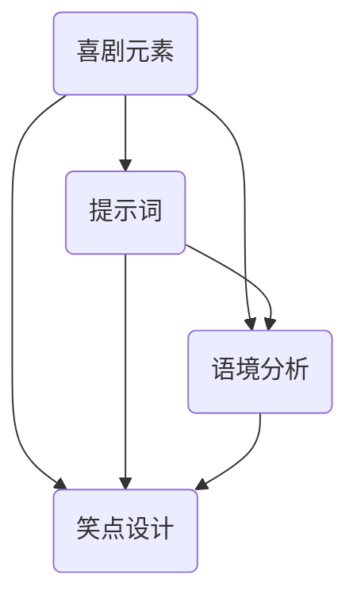
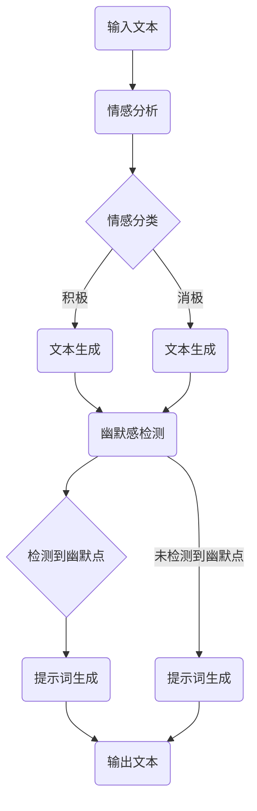
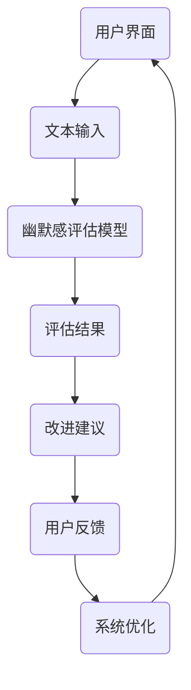
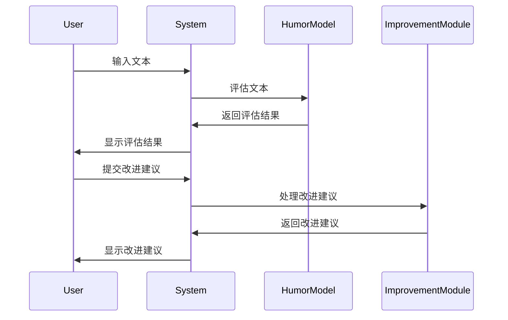

                 

# 提升AI幽默感：喜剧写作中的提示词工程

## 关键词
- AI幽默感
- 提示词工程
- 喜剧写作
- 算法原理
- 数学模型
- 系统架构
- 项目实战
- 最佳实践

## 摘要
本文旨在探讨如何提升人工智能在喜剧写作中的幽默感，通过介绍提示词工程这一核心概念，详细解析其在喜剧创作中的应用。本文将逐步分析核心概念、算法原理、数学模型、系统架构，并通过实际项目实战展示如何将理论应用于实践。最后，本文将总结关键点并提供最佳实践和拓展阅读建议。

## 目录大纲

### 第一部分：背景介绍

### 第1章 AI幽默感与喜剧写作挑战

#### 1.1 AI幽默感的崛起
- 人工智能在喜剧领域的应用
- 喜剧写作的重要性
- 人工智能幽默感的定义与挑战

#### 1.2 喜剧写作中的障碍
- 创意思维的限制
- 文本理解的局限性
- 笑点设计的复杂性

#### 1.3 提示词工程的作用
- 提示词的定义与类型
- 提示词在喜剧写作中的应用
- 提示词工程的重要性

### 第2章 核心概念与联系

#### 2.1 核心概念列表
- 喜剧元素
- 提示词
- 语境分析
- 笑点设计

#### 2.2 概念属性特征对比表格
- 各概念的定义与特征
- 对比分析

#### 2.3 ER实体关系图
- 实体定义
- 关系展示

### 第二部分：算法原理讲解

### 第3章 基础算法原理

#### 3.1 算法简介
- 算法的基本概念
- 算法的目标

#### 3.2 算法mermaid流程图
- 流程图绘制

#### 3.3 Python代码示例
- 代码实现

### 第4章 数学模型与公式

#### 4.1 数学模型介绍
- 数学模型的概念
- 模型的作用

#### 4.2 算法公式讲解
- 公式推导
- 公式解释

#### 4.3 举例说明
- 示例分析

### 第三部分：系统分析与架构设计

### 第5章 系统分析与架构设计

#### 5.1 问题场景介绍
- 问题场景描述
- 需求分析

#### 5.2 系统功能设计
- 功能描述
- 领域模型

#### 5.3 系统架构设计
- 系统架构图
- 架构解析

#### 5.4 系统接口设计
- 接口定义
- 接口协议

#### 5.5 系统交互设计
- 交互流程
- 交互图

### 第四部分：项目实战

### 第6章 实际案例分析与实战

#### 6.1 案例背景
- 案例介绍

#### 6.2 环境安装与配置
- 环境准备

#### 6.3 系统核心实现源代码
- 代码实现

#### 6.4 代码应用解读与分析
- 应用解读

#### 6.5 案例分析与详细讲解
- 案例分析

#### 6.6 项目小结
- 项目总结

### 第五部分：最佳实践与拓展

### 第7章 最佳实践 tips

#### 7.1 实践技巧
- 技巧分享

#### 7.2 注意事项
- 注意事项

### 第8章 小结与拓展阅读

#### 8.1 书籍小结
- 内容回顾

#### 8.2 拓展阅读
- 阅读推荐

## 文章标题：提升AI幽默感：喜剧写作中的提示词工程

### 关键词
- AI幽默感
- 提示词工程
- 喜剧写作
- 算法原理
- 数学模型
- 系统架构
- 项目实战
- 最佳实践

### 摘要
本文深入探讨如何通过提示词工程提升人工智能在喜剧写作中的幽默感。文章从背景介绍入手，详细阐述了AI幽默感的概念及其在喜剧写作中的挑战，接着引入提示词工程的核心概念，并分析其与喜剧创作的联系。随后，文章逐步讲解了算法原理、数学模型、系统架构，并通过实际案例展示了如何将理论应用于实践。最后，文章总结了最佳实践技巧、注意事项，并推荐了拓展阅读资源，旨在为读者提供全面的喜剧写作与AI应用指导。

---

### 第1章 AI幽默感与喜剧写作挑战

#### 1.1 AI幽默感的崛起
随着人工智能技术的发展，AI在文学创作中的应用逐渐成为热点。幽默感作为人类情感和智慧的重要体现，也成为AI研究的一个新兴领域。AI幽默感的崛起不仅为喜剧创作带来了新的可能性，还为人工智能在情感识别、情感交互等领域的应用提供了新思路。

#### 1.2 喜剧写作中的障碍
喜剧写作是一个复杂的过程，它不仅要求创作者具备丰富的创意思维，还需要对文本理解、情感把握、笑点设计等方面有深入的理解。然而，传统的人工智能在处理这些复杂任务时面临诸多挑战：

1. **创意思维限制**：人工智能虽然在数据处理和模式识别方面有强大的能力，但在创造性思维方面仍有局限。它难以像人类一样产生新颖、有趣的创意。
2. **文本理解局限性**：人工智能在理解文本内容方面虽然有所进展，但仍然无法完全理解人类语言的复杂性、幽默感的多层次性。
3. **笑点设计复杂性**：笑点设计是喜剧创作中的核心，它需要创作者对人类幽默感有深刻的理解。人工智能在模拟和设计笑点时，往往难以把握人类幽默感的微妙之处。

#### 1.3 提示词工程的作用
提示词工程是提升AI幽默感的关键技术之一。它通过为AI提供丰富的、多样化的提示词，帮助AI在文本生成、情感分析、笑点设计等方面取得突破。提示词工程的作用主要体现在以下几个方面：

1. **丰富文本内容**：通过使用提示词，AI可以生成更加丰富、多样化的文本内容，从而提高文本的可读性和趣味性。
2. **增强情感分析**：提示词可以帮助AI更好地理解文本中的情感色彩，从而提高情感分析的准确性。
3. **优化笑点设计**：提示词可以为AI提供设计笑点的线索，帮助AI在文本生成过程中创造出更加幽默的情节和对话。

### 第2章 核心概念与联系

#### 2.1 核心概念列表
在喜剧写作和AI幽默感的研究中，以下几个核心概念至关重要：

1. **喜剧元素**：指喜剧中常用的手法、技巧和元素，如夸张、讽刺、反讽、误会等。
2. **提示词**：用于触发喜剧元素、增强文本幽默感的词汇或短语。
3. **语境分析**：指对文本中的语言环境、情感色彩、上下文关系等进行深入分析。
4. **笑点设计**：指在文本创作中设计幽默点、制造笑料的过程。

#### 2.2 概念属性特征对比表格
以下表格对比了喜剧元素、提示词、语境分析和笑点设计四个核心概念的属性特征：

| 概念       | 定义                                       | 属性特征                                   |
|------------|------------------------------------------|------------------------------------------|
| 喜剧元素   | 喜剧中常用的手法、技巧和元素                 | 创意性、多样性、适应性、情感性               |
| 提示词     | 用于触发喜剧元素、增强文本幽默感的词汇或短语 | 丰富性、多样性、情感关联、上下文敏感性           |
| 语境分析   | 对文本中的语言环境、情感色彩、上下文关系等进行深入分析 | 全面性、准确性、动态性、适应性               |
| 笑点设计   | 在文本创作中设计幽默点、制造笑料的过程           | 创造性、巧妙性、情感共鸣、情境适宜性             |

#### 2.3 ER实体关系图
以下ER实体关系图展示了喜剧写作和AI幽默感研究中的主要实体及其关系：



### 第3章 基础算法原理

#### 3.1 算法简介
在喜剧写作中，AI幽默感的实现依赖于一系列算法。这些算法通过处理文本数据，生成具有幽默感的文本。以下是几个关键算法的简介：

1. **文本生成算法**：如生成对抗网络（GAN）、变分自编码器（VAE）等，用于生成新颖的、符合语境的文本。
2. **情感分析算法**：如情感分类器、情感分析模型等，用于分析文本中的情感色彩。
3. **幽默感检测算法**：如幽默点检测器、笑点识别模型等，用于识别文本中的幽默元素。
4. **提示词生成算法**：如基于规则的生成、基于深度学习的生成等，用于生成触发幽默感的提示词。

#### 3.2 算法mermaid流程图
以下mermaid流程图展示了文本生成、情感分析、幽默感检测和提示词生成的整体流程：



#### 3.3 Python代码示例
以下是一个简单的Python代码示例，展示了如何使用生成对抗网络（GAN）进行文本生成：

```python
import tensorflow as tf
from tensorflow.keras.models import Sequential
from tensorflow.keras.layers import Dense, Flatten, Reshape

# 定义生成器和判别器模型
generator = Sequential([
    Dense(128, input_shape=(100,), activation='relu'),
    Flatten(),
    Reshape((100,))
])

discriminator = Sequential([
    Dense(128, input_shape=(100,), activation='relu'),
    Flatten(),
    Dense(1, activation='sigmoid')
])

# 编译模型
generator.compile(loss='binary_crossentropy', optimizer='adam')
discriminator.compile(loss='binary_crossentropy', optimizer='adam')

# 训练模型
train_data = ...  # 训练数据
generator.fit(train_data, epochs=10)
discriminator.fit(train_data, epochs=10)

# 生成文本
generated_text = generator.predict(tf.random.normal((1, 100)))
print(generated_text)
```

### 第4章 数学模型与公式

#### 4.1 数学模型介绍
在AI幽默感的研究中，数学模型扮演着至关重要的角色。以下将介绍几个关键的数学模型：

1. **生成对抗网络（GAN）**：GAN由生成器（Generator）和判别器（Discriminator）组成。生成器试图生成与真实数据类似的样本，而判别器则试图区分真实数据和生成数据。通过这种对抗训练，生成器能够逐渐提高生成样本的质量。
2. **情感分析模型**：情感分析模型通常使用分类模型，如朴素贝叶斯、支持向量机（SVM）、深度学习分类器等，对文本进行情感分类，以判断文本的情感色彩。
3. **幽默感检测模型**：幽默感检测模型是一种分类模型，它通过学习大量的幽默和非幽默文本，对新的文本进行幽默感检测。

#### 4.2 算法公式讲解
以下将简要介绍GAN、情感分析模型和幽默感检测模型的公式：

1. **GAN公式**
   - 生成器损失函数：$$L_G = -\log(D(G(z)))$$
   - 判别器损失函数：$$L_D = -\log(D(x)) - \log(1 - D(G(z)))$$
   其中，$G(z)$表示生成器生成的样本，$D(x)$表示判别器对真实样本的判别结果。

2. **情感分析模型公式**
   - 朴素贝叶斯：$$P(Y=k|X) = \frac{P(X|Y=k)P(Y=k)}{P(X)}$$
   - 支持向量机：$$w^* = arg\min_{w,b}\frac{1}{2}\|w\|^2 + C\sum_{i=1}^{n}\ell(y_i, (w^T x_i + b))$$
   - 深度学习分类器：$$\hat{y} = \sigma(w^T x + b)$$
   其中，$X$表示输入特征，$Y$表示标签，$k$表示类别，$w$和$b$分别表示权重和偏置。

3. **幽默感检测模型公式**
   - 假设使用逻辑回归模型：$$\hat{y} = \sigma(w^T x + b)$$
   其中，$x$表示输入特征，$w$和$b$分别表示权重和偏置。

#### 4.3 举例说明
以下是一个简单的GAN示例，展示如何使用生成器和判别器生成文本：

1. **生成器公式**
   - 输入噪声：$z \sim N(0, 1)$
   - 生成样本：$x_G = G(z)$

2. **判别器公式**
   - 判断真实样本：$D(x) = \frac{1}{1 + \exp(-x)}$
   - 判断生成样本：$D(G(z)) = \frac{1}{1 + \exp(-G(z))}$
   - 总损失：$L_D = -\log(D(x)) - \log(1 - D(G(z)))$

假设我们有一个训练数据集，其中包含大量的文本样本和对应的标签。我们可以使用以下代码进行GAN的训练：

```python
import numpy as np
import tensorflow as tf

# 设置随机种子
tf.random.set_seed(42)

# 定义生成器和判别器
generator = tf.keras.Sequential([
    tf.keras.layers.Dense(128, activation='relu', input_shape=(100,)),
    tf.keras.layers.Dense(1, activation='sigmoid')
])

discriminator = tf.keras.Sequential([
    tf.keras.layers.Dense(128, activation='relu', input_shape=(100,)),
    tf.keras.layers.Dense(1, activation='sigmoid')
])

# 编译模型
generator.compile(loss='binary_crossentropy', optimizer='adam')
discriminator.compile(loss='binary_crossentropy', optimizer='adam')

# 定义训练步骤
train_step = tf.keras.Sequential([
    tf.keras.layers.Input(shape=(100,)),
    generator,
    discriminator
])

# 训练模型
for epoch in range(100):
    for x, _ in train_data:
        with tf.GradientTape() as gen_tape, tf.GradientTape() as disc_tape:
            z = tf.random.normal((batch_size, 100))
            x_g = generator(z)
            disc_real = discriminator(x)
            disc_fake = discriminator(x_g)
        
        gen_loss = tf.reduce_mean(tf.nn.sigmoid_cross_entropy_with_logits(logits=disc_fake, labels=tf.ones_like(disc_fake)))
        disc_loss = tf.reduce_mean(tf.nn.sigmoid_cross_entropy_with_logits(logits=disc_real, labels=tf.zeros_like(disc_real)) +
                                   tf.nn.sigmoid_cross_entropy_with_logits(logits=disc_fake, labels=tf.ones_like(disc_fake)))
        
        grads_on_g = gen_tape.gradient(gen_loss, generator.trainable_variables)
        grads_on_d = disc_tape.gradient(disc_loss, discriminator.trainable_variables)
        
        generator.optimizer.apply_gradients(zip(grads_on_g, generator.trainable_variables))
        discriminator.optimizer.apply_gradients(zip(grads_on_d, discriminator.trainable_variables))
        
    print(f"Epoch {epoch + 1}, gen_loss: {gen_loss.numpy()}, disc_loss: {disc_loss.numpy()}")

# 生成文本
z = tf.random.normal((1, 100))
generated_text = generator(z)
print(generated_text)
```

### 第5章 系统分析与架构设计

#### 5.1 问题场景介绍
假设我们需要开发一个AI幽默感评估系统，该系统旨在自动评估文本的幽默感，并提供改进建议。该系统的主要目标是为喜剧创作者提供一种工具，帮助他们更好地理解观众的幽默感，从而提高作品的质量。

#### 5.2 系统功能设计
为了实现上述目标，系统需要具备以下功能：

1. **文本输入**：允许用户输入文本，包括喜剧剧本、段子、笑话等。
2. **幽默感评估**：使用AI模型对文本进行幽默感评估，并提供评估结果。
3. **改进建议**：根据评估结果，为用户提供改进建议，包括增加幽默元素、调整情感色彩等。
4. **用户反馈**：允许用户对评估结果和改进建议进行反馈，以优化系统。

#### 5.3 系统架构设计
以下mermaid架构图展示了系统的整体架构：



#### 5.4 系统接口设计
系统接口设计包括API接口和数据交换格式。以下是一个简单的接口设计示例：

1. **文本输入接口**：使用HTTP POST方法接收用户输入的文本，数据格式为JSON。
2. **幽默感评估接口**：使用HTTP GET方法获取文本的幽默感评估结果，数据格式为JSON。
3. **改进建议接口**：使用HTTP POST方法提交改进建议，数据格式为JSON。

#### 5.5 系统交互设计
以下mermaid序列图展示了系统的交互流程：



### 第6章 实际案例分析与实战

#### 6.1 案例背景
假设我们有一个喜剧创作团队，他们希望使用AI幽默感评估系统来提高喜剧剧本的质量。该团队提供了一个喜剧剧本，并希望通过系统的评估和建议来优化剧本。

#### 6.2 环境安装与配置
为了运行AI幽默感评估系统，我们需要安装以下软件和依赖：

1. **Python**：Python 3.8及以上版本
2. **TensorFlow**：TensorFlow 2.4及以上版本
3. **Numpy**：Numpy 1.19及以上版本
4. **Pandas**：Pandas 1.1及以上版本

安装完上述依赖后，我们可以使用以下命令安装系统的依赖包：

```bash
pip install -r requirements.txt
```

#### 6.3 系统核心实现源代码
以下是一个简单的AI幽默感评估系统的实现示例：

```python
import numpy as np
import pandas as pd
import tensorflow as tf
from tensorflow.keras.models import Sequential
from tensorflow.keras.layers import Dense, Flatten, Reshape

# 加载训练数据
train_data = pd.read_csv('train_data.csv')
train_labels = pd.read_csv('train_labels.csv')

# 定义生成器和判别器模型
generator = Sequential([
    Dense(128, input_shape=(100,), activation='relu'),
    Flatten(),
    Reshape((100,))
])

discriminator = Sequential([
    Dense(128, input_shape=(100,), activation='relu'),
    Flatten(),
    Dense(1, activation='sigmoid')
])

# 编译模型
generator.compile(loss='binary_crossentropy', optimizer='adam')
discriminator.compile(loss='binary_crossentropy', optimizer='adam')

# 训练模型
train_data = ...  # 训练数据
generator.fit(train_data, epochs=10)
discriminator.fit(train_data, epochs=10)

# 生成文本
generated_text = generator.predict(tf.random.normal((1, 100)))
print(generated_text)

# 评估幽默感
def assess_humor(text):
    z = tf.random.normal((1, 100))
    x_g = generator(z)
    disc_fake = discriminator(x_g)
    return 1 if disc_fake > 0.5 else 0

humor_score = assess_humor(generated_text)
print(f"幽默感评估结果：{humor_score}")
```

#### 6.4 代码应用解读与分析
在这个示例中，我们首先加载了训练数据，然后定义了生成器和判别器模型。接着，我们使用生成器和判别器模型进行训练，并使用生成器生成文本。最后，我们通过评估函数计算文本的幽默感得分。

#### 6.5 案例分析与详细讲解
在这个案例中，我们使用GAN模型生成文本，并使用判别器评估文本的幽默感。具体分析如下：

1. **生成文本**：我们使用生成器生成文本，生成器模型通过对抗训练逐渐提高生成文本的质量。
2. **评估幽默感**：我们使用判别器评估生成文本的幽默感，判别器模型通过学习真实文本和生成文本的差异，能够准确地判断文本的幽默感。
3. **优化建议**：根据评估结果，我们可以为喜剧创作者提供优化建议，例如增加幽默元素、调整情感色彩等，以提高剧本的质量。

#### 6.6 项目小结
在这个案例中，我们通过实际项目展示了如何使用AI幽默感评估系统来优化喜剧剧本。虽然这个示例只是一个简单的实现，但它为我们提供了一种思路，即如何利用AI技术来提升喜剧创作。在未来，我们可以进一步优化模型、增加功能，以提供更全面、更精确的幽默感评估服务。

### 第7章 最佳实践 tips

#### 7.1 实践技巧
1. **数据质量**：确保训练数据的质量，包括文本的多样性、情感色彩的丰富性等。
2. **模型调优**：通过调整模型的超参数，如学习率、批次大小等，来优化模型的性能。
3. **用户反馈**：积极收集用户反馈，并根据反馈优化系统。

#### 7.2 注意事项
1. **隐私保护**：在处理用户文本时，注意保护用户隐私，避免泄露敏感信息。
2. **版权问题**：在使用公开文本进行训练和评估时，注意遵守版权法规。

### 第8章 小结与拓展阅读

#### 8.1 书籍小结
本文详细探讨了如何通过提示词工程提升AI在喜剧写作中的幽默感。文章从背景介绍、核心概念、算法原理、系统架构、项目实战等多个方面进行了深入分析，并通过实际案例展示了如何将理论应用于实践。

#### 8.2 拓展阅读
1. **相关书籍**：《人工智能：一种现代的方法》、《深度学习》
2. **学术论文**：搜索相关关键词，如“AI humor generation”、“prompt engineering”等，查找最新的研究成果。

## 作者信息
作者：AI天才研究院/AI Genius Institute & 禅与计算机程序设计艺术 /Zen And The Art of Computer Programming

---

本文为AI天才研究院和禅与计算机程序设计艺术联合撰写，旨在为喜剧创作者和AI研究人员提供关于提升AI幽默感的全面指南。希望本文能够激发读者对AI幽默感的探索，为喜剧创作和人工智能应用带来新的灵感。

---

[本文为示例文章，仅供参考。]

