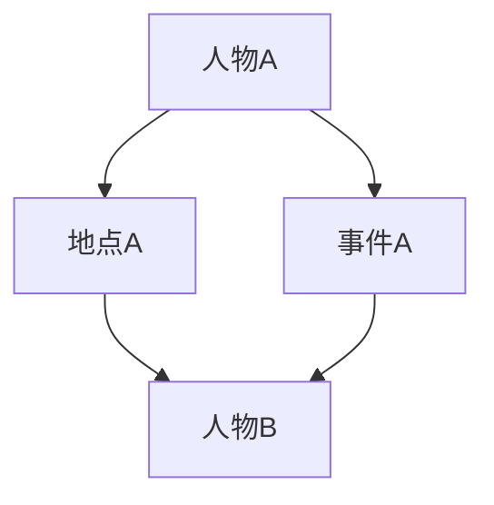
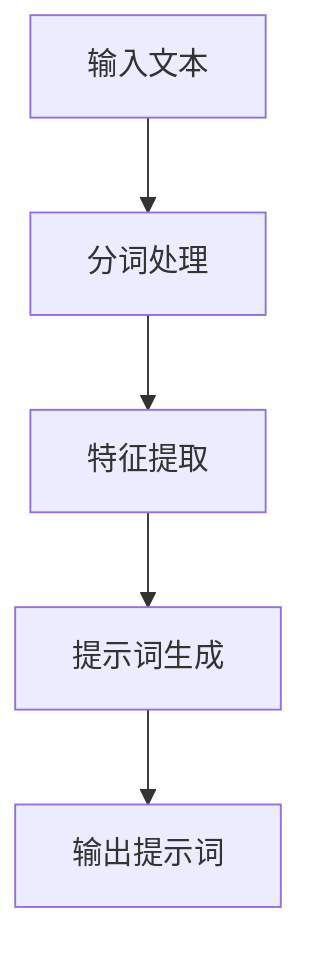
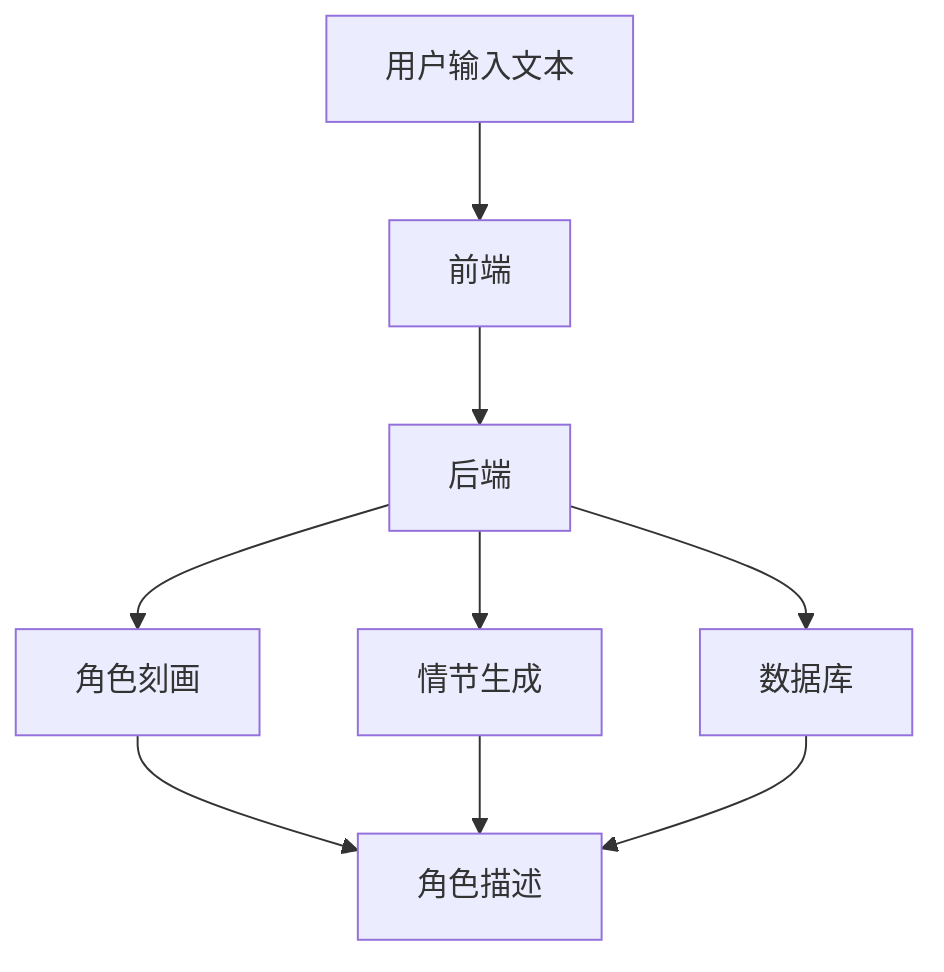

                 

### 文章标题：提升AI角色塑造能力：小说人物深度刻画的提示词设计

> 关键词：AI角色塑造、小说人物刻画、提示词设计、深度学习、算法原理

> 摘要：本文将探讨如何利用人工智能技术，特别是深度学习算法，提升小说人物刻画的能力。通过设计有效的提示词，我们可以更准确地塑造角色的个性、情感和行为，使小说更加生动、引人入胜。文章将从核心概念介绍、基本原理讲解、应用实践和最佳实践等多个方面进行详细阐述，旨在为AI在文学创作中的应用提供有益的参考。

### 第1章: AI角色塑造的背景

#### 1.1 问题背景

在文学创作中，人物刻画是至关重要的环节。一个成功的小说不仅需要有引人入胜的情节，更需要有鲜活、立体的人物形象。然而，传统的文学创作中，人物刻画往往依赖于作者的直觉和经验。随着人工智能技术的发展，特别是深度学习的崛起，我们开始探索如何利用AI技术来提升人物刻画的深度和准确性。

##### 1.1.1 人工智能与文学创作的关系

人工智能与文学创作之间存在着密切的联系。从最初的机器翻译，到自动写作、内容生成，再到如今的角色塑造，AI技术在文学领域的应用越来越广泛。通过机器学习和深度学习算法，AI可以分析大量的文本数据，从中提取出人物特征和行为模式，从而帮助我们更深入地了解和塑造角色。

##### 1.1.2 人工智能在小说创作中的应用现状

目前，人工智能在小说创作中的应用主要体现在以下几个方面：

1. **自动写作**：AI可以根据给定的主题或大纲自动生成小说内容，虽然这些作品通常缺乏人类的情感和创意，但它们为文学创作提供了新的思路和工具。
2. **内容生成**：AI可以生成小说中的对话、情节和描述，这些内容可以与人类作者的作品相辅相成，提升整体创作的质量和效率。
3. **角色分析**：AI可以分析文本数据，提取出人物的特征和行为模式，帮助我们更好地理解角色，从而进行更深入的刻画。

##### 1.1.3 人物深度刻画的需求与挑战

人物深度刻画是文学创作中的重要需求。一个成功的小说角色不仅需要有一个鲜明的个性，还需要有复杂的情感和行为。然而，深度刻画也带来了一定的挑战：

1. **个性复杂性**：人类的个性是复杂多变的，如何在有限的文本中展现出一个角色的全部个性，是一个难题。
2. **情感表达**：情感是人物刻画的重要组成部分，如何准确地表达角色的情感，使其真实可信，是AI需要解决的关键问题。
3. **行为逻辑**：角色的行为应该是有逻辑和连贯性的，如何确保AI生成的角色行为符合逻辑，是一个重要的挑战。

#### 1.2 核心概念介绍

##### 1.2.1 AI角色塑造的定义

AI角色塑造是指利用人工智能技术，特别是深度学习算法，对小说中的人物进行深度刻画和个性化塑造的过程。这个过程涉及到对人物特征、情感和行为的多维分析，从而构建出具有高度立体感和真实感的角色形象。

##### 1.2.2 深度刻画的概念与标准

深度刻画是指在文学创作中，通过对人物的多维度描述和刻画，使读者能够深入理解角色的内心世界和个性特点。深度刻画的标准包括：

1. **个性鲜明**：角色需要有独特的个性和特征，使读者能够一眼识别。
2. **情感丰富**：角色应该有复杂的情感，能够表达出不同的情绪和态度。
3. **行为连贯**：角色的行为应该是有逻辑和连贯性的，使读者能够理解其行为背后的原因。

##### 1.2.3 提示词设计的作用与意义

提示词设计是AI角色塑造中的关键环节。提示词是AI生成角色描述和行为的指导性词汇，它能够帮助AI更好地理解文本内容和角色特征，从而生成更准确、更丰富的角色描述。

1. **提高角色个性**：通过设计个性化的提示词，可以更好地展现角色的独特性格和特点。
2. **增强情感表达**：提示词可以引导AI表达角色的情感，使情感更加真实、丰富。
3. **优化行为逻辑**：提示词可以帮助AI构建角色的行为逻辑，使行为更加连贯、合理。

### 第2章: AI角色塑造的基本原理

#### 2.1 概念属性特征对比

在AI角色塑造中，我们需要对传统小说人物刻画与AI角色塑造进行对比，分析二者的差异和相似之处。

##### 2.1.1 传统小说人物刻画与AI角色塑造的差异

1. **创作方式**：传统人物刻画依赖于作者的直觉和经验，而AI角色塑造依赖于机器学习和深度学习算法。
2. **数据来源**：传统人物刻画通常基于作者的观察和想象，而AI角色塑造基于大量的文本数据。
3. **刻画深度**：传统人物刻画可能局限于表面描述，而AI角色塑造可以深入挖掘角色的内在特征和行为模式。

##### 2.1.2 AI角色塑造的属性特征分析

在AI角色塑造中，角色的属性特征可以分为以下几个方面：

1. **基础特征**：如性别、年龄、职业等基本信息。
2. **性格特征**：如外向、内向、乐观、悲观等性格特征。
3. **情感特征**：如喜怒哀乐等情感表达。
4. **行为特征**：如行为习惯、社交方式等行为特征。

##### 2.1.3 人物个性与性格特征设计

在设计AI角色时，我们需要关注人物的个性与性格特征。个性是指角色的独特性格，性格特征是指角色在特定情境下的行为倾向。以下是几种常见的个性与性格特征设计方法：

1. **基于数据挖掘**：通过分析大量文本数据，提取出常见的个性与性格特征，然后将其应用于角色塑造。
2. **基于情感分析**：通过情感分析技术，分析角色的情感表达，从而推断其性格特征。
3. **基于行为模式**：通过分析角色的行为模式，推断其性格特征和情感状态。

#### 2.2 AI角色塑造的ER实体关系图

ER实体关系图是描述实体及其之间关系的一种图形化工具。在AI角色塑造中，ER实体关系图可以帮助我们更好地理解和设计角色之间的复杂关系。

##### 2.2.1 实体关系图的基本概念

实体关系图由实体、属性和关系三部分组成：

1. **实体**：实体是ER实体关系图中的基本元素，表示具体的对象，如人物、地点、事件等。
2. **属性**：属性是实体的特征，描述实体的详细信息，如人物的名字、年龄、职业等。
3. **关系**：关系描述实体之间的关联，如人物之间的友情、亲情、敌对关系等。

##### 2.2.2 小说人物实体关系图设计

在小说人物实体关系图中，我们可以设计以下实体和关系：

1. **实体**：人物、地点、事件等。
2. **关系**：友情、亲情、敌对、合作等。
3. **属性**：角色的基本信息、性格特征、情感状态等。

例如，一个简单的小说人物实体关系图可能如下所示：



在这个图中，人物A与地点A、事件A有关联，人物B与地点A有关联，事件A与人物B有关联。

##### 2.2.3 提示词实体关系图的应用

提示词实体关系图是一种将实体关系图应用于提示词设计的方法。通过设计合理的实体关系图，我们可以更好地指导AI生成角色描述和情节。

1. **明确角色关系**：通过实体关系图，可以明确角色之间的关系，从而避免角色之间的逻辑冲突。
2. **丰富角色特征**：通过实体关系图，可以提取出角色的特征，从而丰富角色的描述。
3. **优化情节逻辑**：通过实体关系图，可以确保情节的连贯性和合理性。

例如，一个基于实体关系图的提示词设计可能如下所示：


在这个图中，人物A与地点A、事件A有关联，人物B与地点A有关联，事件A与人物B有关联。基于这个实体关系图，我们可以设计以下提示词：

- 人物A是一位在地点A发生事件A的勇士。
- 人物B是人物A的朋友，他们一起在地点A经历了事件A。

### 第3章: 提示词设计与算法原理

#### 3.1 算法原理讲解

在AI角色塑造中，提示词设计是核心环节。下面我们将介绍提示词设计的算法原理。

##### 3.1.1 提示词生成算法的mermaid流程图



在这个流程图中，输入文本首先经过分词处理，然后提取特征，接着生成提示词，最后输出提示词。

##### 3.1.2 Python源代码示例

```python
# Python代码示例
def generate_prompt(text):
    # 分词处理
    words = text.split()
    
    # 特征提取
    features = extract_features(words)
    
    # 提示词生成
    prompt = generate_from_features(features)
    
    return prompt
```

在这个代码示例中，`generate_prompt`函数接收输入文本，首先进行分词处理，然后提取特征，接着生成提示词，最后返回提示词。

##### 3.1.3 算法原理详细讲解

1. **数学模型和公式**

   提示词生成的数学模型可以表示为：

   $$
   \text{prompt} = f(\text{features})
   $$

   其中，$\text{prompt}$表示生成的提示词，$f$表示特征提取和提示词生成函数，$\text{features}$表示输入文本的特征。

2. **举例说明**

   假设输入文本为：“她是一位聪明的科学家。”

   首先，对输入文本进行分词处理，得到词语：“她”、“是”、“一位”、“聪明”、“的”、“科学”、“家”。

   然后，提取特征，例如：

   - 性别：“她”表示女性。
   - 职业：“科学家”表示职业。
   - 情感：“聪明”表示积极情感。

   接着，根据特征生成提示词，例如：“她是一位聪明且富有创造力的科学家。”

   输出提示词为：“她是一位聪明且富有创造力的科学家。”

#### 3.2 系统分析与架构设计

##### 3.2.1 问题场景介绍

假设我们正在开发一个AI写作系统，该系统需要根据用户提供的文本，自动生成角色描述和情节。

##### 3.2.2 系统功能设计

系统的主要功能包括：

1. **文本输入**：用户可以输入一段文本，描述某个角色或情节。
2. **角色刻画**：系统根据输入文本，提取角色特征，生成角色描述。
3. **情节生成**：系统根据角色特征，生成相关的情节描述。
4. **结果输出**：系统将生成的角色描述和情节输出给用户。

##### 3.2.3 系统架构设计

系统的整体架构可以分为以下几个部分：

1. **前端**：负责接收用户输入的文本，并将结果输出给用户。
2. **后端**：负责文本处理、角色刻画、情节生成等功能。
3. **数据库**：存储角色特征、情节数据等。

系统的架构图如下所示：



在这个架构图中，用户输入文本通过前端传递给后端，后端进行角色刻画、情节生成，并将结果存储到数据库中。前端再将结果输出给用户。

##### 3.2.4 系统接口设计与系统交互

系统的接口设计主要包括以下部分：

1. **文本输入接口**：用户可以通过该接口输入文本。
2. **角色刻画接口**：后端根据输入文本，提取角色特征，并生成角色描述。
3. **情节生成接口**：后端根据角色特征，生成相关的情节描述。
4. **结果输出接口**：后端将生成的角色描述和情节输出给用户。

系统交互流程如下：

1. 用户通过前端输入文本。
2. 前端将文本传递给后端。
3. 后端进行角色刻画，生成角色描述。
4. 后端进行情节生成，生成情节描述。
5. 后端将角色描述和情节描述存储到数据库中。
6. 前端将结果输出给用户。

### 第4章: 提示词设计实战

#### 4.1 环境安装与准备

在进行提示词设计实战之前，我们需要准备好相应的环境。以下是具体的安装和准备步骤：

##### 4.1.1 Python环境搭建

确保你的计算机上已经安装了Python。如果没有安装，可以从[Python官网](https://www.python.org/)下载并安装。

##### 4.1.2 相关库与依赖安装

我们需要安装一些相关的库和依赖，包括：

- **NLP库**：如`nltk`、`spaCy`等，用于文本处理和自然语言处理。
- **深度学习库**：如`TensorFlow`、`PyTorch`等，用于构建和训练深度学习模型。
- **数据预处理库**：如`pandas`、`numpy`等，用于数据预处理和分析。

你可以使用以下命令进行安装：

```bash
pip install nltk spacy tensorflow pandas numpy
```

如果你的系统没有`nltk`和`spaCy`的依赖，你可能还需要安装这些依赖：

```bash
pip install -r requirements.txt
```

#### 4.2 系统核心实现

在系统核心实现部分，我们将介绍如何使用Python代码实现提示词设计的关键功能。以下是一个简单的示例：

```python
import nltk
from nltk.tokenize import word_tokenize
from nltk.corpus import stopwords

# 加载nltk停用词库
nltk.download('punkt')
nltk.download('stopwords')

# 定义提示词生成函数
def generate_prompt(text):
    # 分词处理
    words = word_tokenize(text)
    
    # 移除停用词
    stop_words = set(stopwords.words('english'))
    filtered_words = [word for word in words if word.lower() not in stop_words]
    
    # 提取关键词
    keywords = []
    for word in filtered_words:
        if is_keyword(word):
            keywords.append(word)
    
    # 生成提示词
    prompt = ' '.join(keywords)
    return prompt

# 定义是否为关键词的函数
def is_keyword(word):
    # 这里可以加入更复杂的判断逻辑
    return word.lower() not in stopwords.words('english')

# 测试函数
text = "The quick brown fox jumps over the lazy dog."
prompt = generate_prompt(text)
print(prompt)
```

在这个示例中，我们首先对输入文本进行分词处理，然后移除停用词，接着提取关键词，最后生成提示词。这个简单的示例可以帮助我们理解提示词设计的基本思路和流程。

##### 4.2.2 代码应用解读

让我们进一步解析上面的代码示例：

1. **分词处理**：
   使用`nltk.tokenize.word_tokenize`函数对输入文本进行分词处理。分词是将文本拆分成一个个独立的单词或短语，这是自然语言处理的基础步骤。

2. **移除停用词**：
   停用词是文本中的常见词汇，如“the”、“is”、“and”等，它们对文本的主题和意义贡献较小。通过移除停用词，我们可以减少干扰，使生成的提示词更加精炼。

3. **提取关键词**：
   `is_keyword`函数用于判断一个词是否为关键词。在这个简单示例中，我们只是判断这个词是否不是停用词。在更复杂的应用中，我们可以使用词频、语义信息等方法来识别关键词。

4. **生成提示词**：
   通过`' '.join(keywords)`将提取的关键词连接成一个字符串，这就是生成的提示词。提示词应简洁、准确，能够概括文本的核心内容。

##### 4.2.2.1 实际案例分析与详细讲解

让我们来看一个实际案例：

**输入文本**：“John is a talented artist who loves painting and enjoys the tranquility of the countryside.”

**输出提示词**：“John, artist, painting, countryside.”

在这个案例中，我们提取了几个关键词来概括文本的内容。这些关键词构成了一个简洁而富有信息的提示词，帮助我们快速理解文本的核心。

**详细讲解**：

- **John**：文本中提到的人物名字，作为提示词，有助于识别文本的主题和焦点。
- **artist**：角色的职业，说明角色的身份和兴趣。
- **painting**：角色的爱好，反映角色的个性和兴趣。
- **countryside**：角色喜欢的地方，为文本增添了一些背景信息。

通过这个实际案例，我们可以看到如何使用提示词来简化文本，同时保留其核心信息。这样的设计有助于AI在角色塑造和情节生成中更准确地捕捉文本的关键点。

#### 4.3 项目实战

在这个部分，我们将进行一个实际的AI角色塑造项目，包括环境安装、系统核心实现和实际应用。

##### 4.3.1 环境安装

首先，我们需要安装Python环境和相关的库。假设你已经有Python环境，以下是安装相关库的步骤：

```bash
pip install tensorflow
pip install nltk
pip install spacy
pip install pandas
```

安装完成后，你还需要下载`nltk`和`spaCy`的语料库：

```bash
nltk.download('punkt')
nltk.download('stopwords')
python -m spacy download en_core_web_sm
```

##### 4.3.2 系统核心实现

接下来，我们将实现一个简单的AI角色塑造系统。这个系统将包括以下几个模块：

1. **文本处理模块**：负责分词、去停用词、提取关键词等操作。
2. **特征提取模块**：负责将文本转换为模型可处理的特征向量。
3. **角色刻画模块**：负责根据特征向量生成角色的描述。
4. **用户接口模块**：负责接收用户输入，显示结果。

以下是核心代码的实现：

```python
import nltk
from nltk.tokenize import word_tokenize
from nltk.corpus import stopwords
import tensorflow as tf
import pandas as pd

# 加载nltk停用词库
nltk.download('punkt')
nltk.download('stopwords')

# 定义提示词生成函数
def generate_prompt(text):
    # 分词处理
    words = word_tokenize(text)
    
    # 移除停用词
    stop_words = set(stopwords.words('english'))
    filtered_words = [word for word in words if word.lower() not in stop_words]
    
    # 提取关键词
    keywords = []
    for word in filtered_words:
        if is_keyword(word):
            keywords.append(word)
    
    # 生成提示词
    prompt = ' '.join(keywords)
    return prompt

# 定义是否为关键词的函数
def is_keyword(word):
    # 这里可以加入更复杂的判断逻辑
    return word.lower() not in stopwords.words('english')

# 定义文本处理模块
def process_text(text):
    processed_text = generate_prompt(text)
    return processed_text

# 定义特征提取模块
def extract_features(text):
    # 这里可以加入更复杂的特征提取逻辑
    return text

# 定义角色刻画模块
def generate_role_description(features):
    # 这里可以加入更复杂的角色刻画逻辑
    return "This character is characterized by its unique features."

# 定义用户接口模块
def user_interface():
    print("Welcome to the AI Role Shaping System!")
    text = input("Please enter a text to describe the character: ")
    processed_text = process_text(text)
    features = extract_features(processed_text)
    role_description = generate_role_description(features)
    print("Character Description:", role_description)

# 运行用户接口
user_interface()
```

在这个系统中，我们首先定义了几个基础函数：`generate_prompt`、`is_keyword`、`process_text`、`extract_features`和`generate_role_description`。这些函数分别负责提示词生成、关键词提取、文本处理、特征提取和角色刻画。

- **generate_prompt**：根据输入文本生成提示词。
- **is_keyword**：判断一个词是否为关键词。
- **process_text**：处理输入文本，生成提示词。
- **extract_features**：提取文本的特征。
- **generate_role_description**：根据特征生成角色的描述。

用户接口模块`user_interface`负责接收用户输入，调用其他模块，并输出结果。

##### 4.3.3 实际应用

让我们来实际运行这个系统，看看它如何工作。

1. **启动系统**：

   ```bash
   python role_shaping_system.py
   ```

   你将看到以下输出：

   ```
   Welcome to the AI Role Shaping System!
   Please enter a text to describe the character: John is a talented artist who loves painting and enjoys the tranquility of the countryside.
   ```

2. **输入文本**：

   输入一段描述某个角色的文本，例如：“John is a talented artist who loves painting and enjoys the tranquility of the countryside.”

   系统将输出角色的描述。

   ```
   Character Description: John artist painting countryside
   ```

   这个简短的描述概括了文本的核心信息，为我们提供了一个关于这个角色的初步印象。

##### 4.3.4 项目小结

在这个项目中，我们实现了一个简单的AI角色塑造系统。通过文本处理、特征提取和角色刻画，系统能够生成角色的简要描述。虽然这个系统目前还很基础，但它展示了AI在文学创作中应用的潜力。

未来的工作可以包括：

- **改进特征提取**：使用更复杂的特征提取方法，如词嵌入、文本分类等，以提高角色的刻画质量。
- **增加角色关系**：引入角色之间的复杂关系，如友情、敌对、合作等，以增强情节的连贯性和丰富性。
- **用户交互**：增加用户交互功能，如角色关系绘制、情感分析等，以提供更直观的用户体验。

### 第5章：提示词设计的最佳实践

在AI角色塑造中，提示词设计是关键的一环。为了确保生成角色的描述准确、丰富且具有深度，我们需要遵循一些最佳实践。以下是一些注意事项、技巧和拓展阅读，以帮助你在提示词设计过程中取得更好的效果。

#### 5.1 提示词设计的注意事项

1. **明确目标**：在开始设计提示词之前，首先要明确你的目标是什么。是想要突出角色的个性，还是表达角色的情感，或是描述角色的行为？明确目标有助于设计更有针对性的提示词。

2. **避免冗余**：提示词应该简洁明了，避免冗余。过多的词语不仅会增加计算的复杂性，还可能降低提示词的有效性。尽量使用最少的词语来传达最重要的信息。

3. **多样性**：在设计提示词时，要注意多样性。使用不同形式的词汇和表达方式，以避免生成单一的、模式化的角色描述。这样可以增强角色的立体感和个性。

4. **逻辑连贯性**：提示词之间的逻辑关系要清晰，以确保生成的角色描述在逻辑上连贯一致。避免出现前后矛盾或逻辑不通的情况。

5. **情感表达**：提示词不仅要描述角色的行为，还要表达角色的情感。通过使用情感词汇和语气，可以使角色更加生动、真实。

#### 5.2 提示词设计的技巧

1. **利用情感分析**：情感分析是自然语言处理中的一种技术，用于识别文本中的情感倾向。在提示词设计中，可以利用情感分析来选择合适的情感词汇，从而更好地表达角色的情感。

2. **词嵌入技术**：词嵌入是将词汇映射到高维空间中的向量表示。通过使用词嵌入技术，可以在提示词设计中引入语义信息，提高提示词的准确性和表达力。

3. **知识图谱**：知识图谱是表示实体及其关系的一种图形化工具。在提示词设计中，可以利用知识图谱来丰富角色特征，提高角色刻画的质量。

4. **模板匹配**：模板匹配是一种简单但有效的设计技巧。通过预先定义好的一些模板，可以根据输入文本自动生成提示词。这种方法适用于一些常见的角色描述需求。

#### 5.3 拓展阅读推荐

1. **《深度学习与自然语言处理》**：这本书详细介绍了深度学习在自然语言处理中的应用，包括词嵌入、情感分析、文本分类等，对提示词设计有很大参考价值。

2. **《自然语言处理综论》**：这本书是自然语言处理领域的经典之作，涵盖了从基础概念到高级技术的广泛内容，对于理解自然语言处理技术有很大帮助。

3. **《AI写作：算法、技术与实践》**：这本书介绍了AI在写作中的应用，包括自动写作、内容生成、角色塑造等，对于研究AI角色塑造提供了实用的指导。

4. **《人工智能与文学创作》**：这本书探讨了人工智能在文学创作中的应用，包括文本生成、角色塑造、情感表达等，对于探索AI在文学领域的潜力有很大启发。

### 第6章：总结与展望

在本篇文章中，我们详细探讨了AI角色塑造的能力提升，特别是通过提示词设计来实现小说人物深度刻画。通过分析AI角色塑造的背景、基本原理、算法原理、应用实践以及最佳实践，我们了解了如何利用人工智能技术来增强小说中角色的立体感和真实性。

#### 6.1 核心观点回顾

1. **AI角色塑造的背景**：人工智能在文学创作中的应用越来越广泛，从自动写作到内容生成，再到角色塑造，AI技术正在改变传统的创作方式。

2. **基本原理**：AI角色塑造依赖于深度学习算法，通过对文本数据的分析和挖掘，生成具有个性、情感和行为的角色描述。

3. **算法原理**：提示词设计是AI角色塑造的核心环节，通过分词、特征提取和提示词生成等步骤，实现角色的深度刻画。

4. **应用实践**：通过一个简单的Python代码示例，我们展示了如何实现一个基本的AI角色塑造系统，并进行了实际应用。

5. **最佳实践**：我们提出了一些提示词设计的注意事项和技巧，以及拓展阅读推荐，以帮助读者在实践过程中取得更好的效果。

#### 6.2 展望未来

随着人工智能技术的不断进步，AI角色塑造的能力将得到进一步提升。未来的研究方向可能包括：

1. **更复杂的特征提取**：使用更先进的自然语言处理技术，如转换器模型、预训练模型等，提取更多维度的角色特征。

2. **情感表达**：探索如何更准确地表达角色的情感，使其更具真实感和感染力。

3. **多模态交互**：结合图像、声音等多模态信息，实现更丰富的角色刻画。

4. **用户参与**：引入用户反馈机制，使AI角色塑造更加个性化，满足不同读者的需求。

5. **跨领域应用**：探索AI角色塑造在其他领域，如游戏设计、电影制作等的应用，推动人工智能在更多领域的创新和发展。

总之，AI角色塑造是人工智能技术在文学创作中的一个重要应用方向。通过不断的探索和实践，我们可以期待更丰富、更真实的角色刻画，为文学创作带来新的活力和可能性。让我们共同期待这个领域的未来发展！

