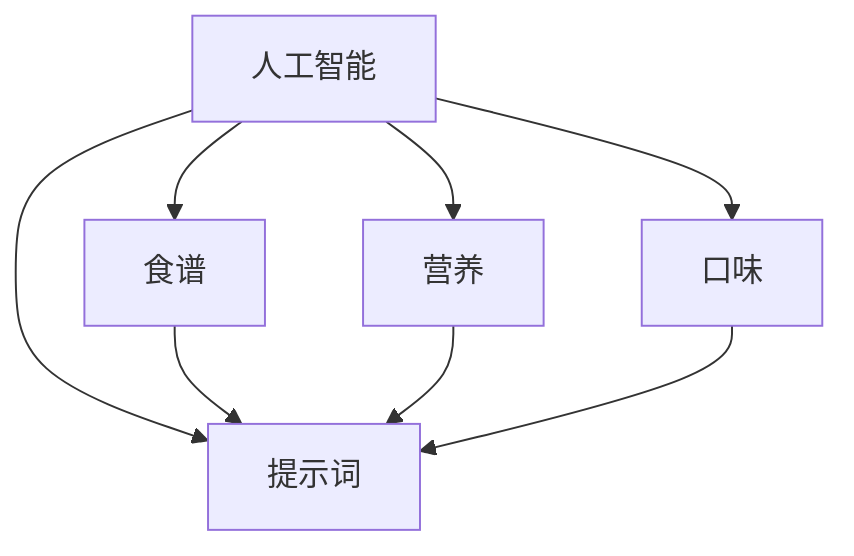
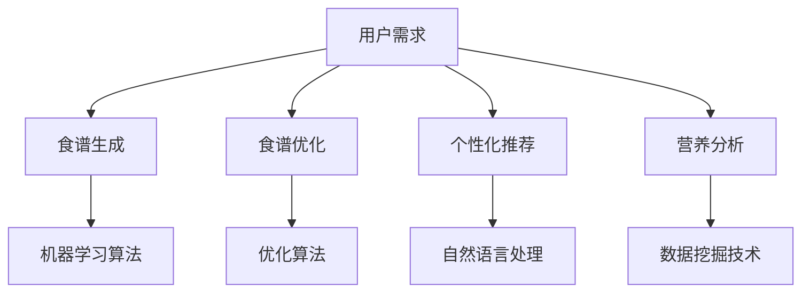
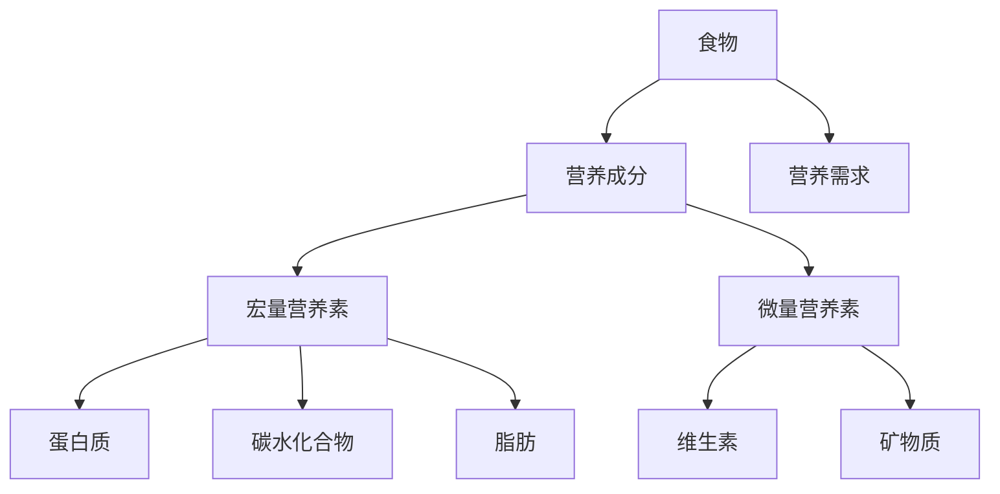
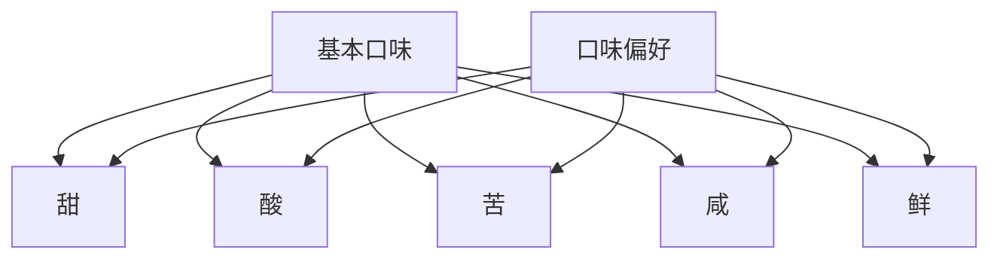
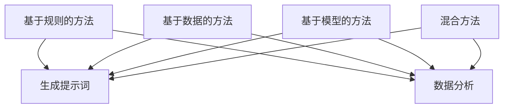
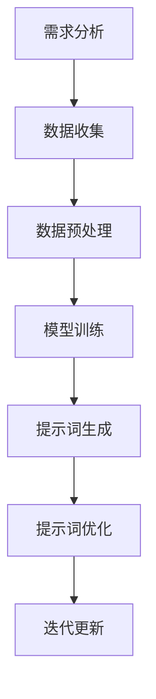
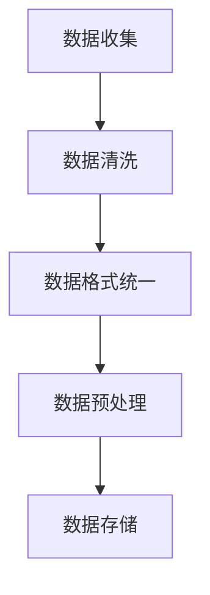
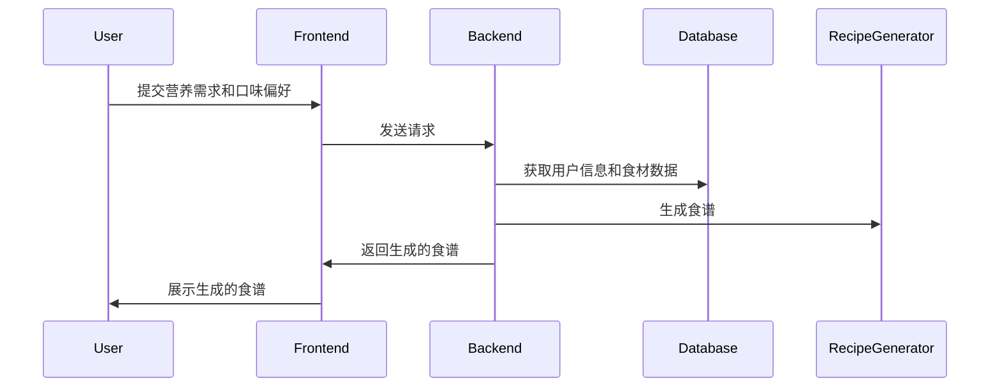
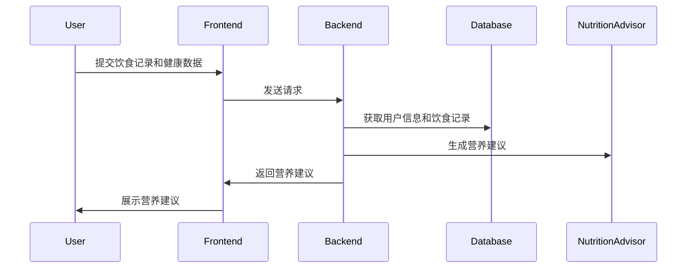
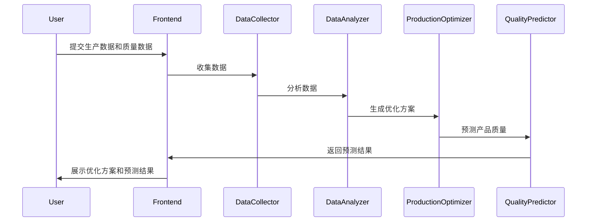

                 

# 提升AI食谱创新能力：考虑营养和口味的提示词设计

## 关键词
人工智能、食谱创新、营养、口味、提示词设计、AI算法、健康饮食

## 摘要
本文探讨了如何通过人工智能和提示词设计提升食谱创新能力，特别是在营养和口味方面的考虑。首先，我们介绍了人工智能在食谱设计中的应用背景，以及营养和口味在食谱设计中的重要性。接着，我们详细分析了营养与口味的AI提示词设计原理，包括营养学基础、口味感知与建模、提示词设计方法和流程。然后，通过实践案例展示了提示词设计在AI食谱创新中的应用，并分析了营养与口味的平衡问题。最后，我们对未来AI食谱创新的发展趋势进行了展望，为读者提供了进一步提升食谱创新能力的思路和方法。

## 目录大纲设计过程

### 1. 理解书籍主题

《提升AI食谱创新能力：考虑营养和口味的提示词设计》的主题在于探讨如何运用人工智能技术来提高食谱创新的效率，特别是如何通过营养和口味的提示词设计来实现这一目标。这涉及到对人工智能、营养学、口味学等多个领域的理解和综合应用。

### 2. 确定核心章节

基于主题，本书的核心章节包括：

- **第1章：引言与背景**
- **第2章：人工智能与食谱创新**
- **第3章：营养与口味的AI提示词设计原理**
- **第4章：提示词设计实践**
- **第5章：营养与口味的平衡**
- **第6章：案例分析**
- **第7章：未来展望**

### 3. 设计每个章节的内容

#### 第1章：引言与背景

- **1.1 问题背景**：介绍人工智能在食谱设计中的应用现状，以及营养和口味在食谱设计中的重要性。
- **1.2 问题描述**：明确提升AI食谱创新能力的具体挑战，以及营养和口味在AI提示词设计中的关键作用。
- **1.3 问题解决**：阐述通过AI提示词设计解决食谱创新能力问题的方法，讨论营养和口味如何通过提示词实现优化。
- **1.4 边界与外延**：定义本书的研究范围和局限性，探讨AI食谱创新在其他领域的潜在应用。
- **1.5 概念结构与核心要素组成**：解释核心概念：人工智能、食谱、营养、口味、提示词设计，构建概念关系图，展示各概念之间的联系。

#### 第2章：人工智能与食谱创新

- **2.1 人工智能概述**：介绍人工智能的基本概念和发展历程，阐述人工智能在各个领域的应用。
- **2.2 食谱创新的挑战与机遇**：分析当前食谱创新的挑战，探讨人工智能如何为食谱创新带来新的机遇。
- **2.3 AI在食谱设计中的应用**：介绍AI在食谱生成、优化和个性化推荐中的应用，分析AI在提升食谱创新能力方面的潜力。

#### 第3章：营养与口味的AI提示词设计原理

- **3.1 营养学基础**：介绍基本营养知识，讨论如何将营养信息转化为AI提示词。
- **3.2 口味感知与建模**：解释口味感知的基本原理，阐述如何利用AI模型进行口味建模。
- **3.3 提示词设计方法**：介绍常用的AI提示词设计方法，分析各种方法在营养和口味设计中的应用效果。
- **3.4 提示词设计流程**：描述提示词设计的一般流程，讨论如何根据具体需求调整设计流程。

#### 第4章：提示词设计实践

- **4.1 数据准备与处理**：讨论如何收集和处理与营养和口味相关的数据，介绍数据预处理的方法和技术。
- **4.2 提示词生成算法**：介绍常见的提示词生成算法，使用Python代码实现算法并进行分析。
- **4.3 提示词优化与评估**：阐述如何优化和评估生成的提示词，提供具体的优化方法和评估指标。
- **4.4 实践案例**：分析具体案例，展示提示词设计在AI食谱创新中的应用，讨论案例中的成功经验和挑战。

#### 第5章：营养与口味的平衡

- **5.1 营养平衡的重要性**：解释营养平衡对人体健康的影响，讨论如何通过AI提示词实现营养平衡。
- **5.2 口味平衡的挑战**：分析口味平衡在食谱设计中的难点，探讨如何利用AI技术解决口味平衡问题。
- **5.3 营养与口味的综合设计**：阐述如何将营养和口味综合考虑，提供综合设计的方法和技巧。

#### 第6章：案例分析

- **6.1 案例一：健康食谱生成系统**：分析一个实际的AI食谱生成系统，讨论系统在营养和口味设计中的表现。
- **6.2 案例二：个性化营养建议**：分析AI如何为不同人群提供个性化的营养建议，讨论个性化营养建议在实际应用中的效果。
- **6.3 案例三：食品工业中的应用**：探讨AI提示词设计在食品工业中的潜在应用，分析食品工业中AI食谱创新的挑战和机遇。

#### 第7章：未来展望

- **7.1 AI食谱创新的发展趋势**：分析AI食谱创新在未来可能的发展方向，探讨AI食谱创新的未来挑战和机遇。

## 1. 引言与背景

### 1.1 问题背景

随着人工智能技术的迅速发展，其在各个领域的应用日益广泛。特别是在食谱设计领域，人工智能已经开始展现出强大的潜力。传统的食谱设计主要依赖于个人的经验和技能，这往往会导致创新能力的局限性。然而，通过人工智能，我们可以利用大量的数据和信息，进行更为科学和高效的食谱设计。

在人工智能的帮助下，食谱设计不再仅仅依赖于个人的创意，而是可以通过算法和数据来进行优化和改进。这种基于人工智能的食谱设计方法，不仅可以提高创新效率，还可以在营养和口味方面实现更好的平衡。因此，如何利用人工智能提升食谱创新能力，成为了一个亟待解决的问题。

### 1.2 问题描述

在提升AI食谱创新能力的过程中，我们面临以下几个具体挑战：

1. **营养信息的处理**：营养是食谱设计中的一个关键因素。如何有效地处理和利用大量的营养数据，是一个重要的挑战。这需要我们深入理解营养学的基础知识，并运用人工智能算法进行数据分析和处理。

2. **口味的建模与感知**：口味是影响食谱受欢迎程度的重要因素。如何准确地感知和建模口味，是一个复杂的任务。这需要我们结合人工智能技术和心理学研究，开发出有效的口味感知模型。

3. **提示词设计的优化**：提示词是AI食谱设计的关键输入。如何设计出既符合营养需求，又能满足口味需求的提示词，是一个关键问题。这需要我们深入探讨提示词设计的方法和技巧。

### 1.3 问题解决

为了解决上述问题，我们可以采取以下策略：

1. **营养信息的处理**：通过收集和分析大量的营养数据，我们可以建立营养知识图谱。然后，利用人工智能算法，如机器学习和数据挖掘技术，对营养数据进行分析和处理，提取出有用的信息。

2. **口味的建模与感知**：我们可以结合心理学和人工智能技术，开发出口味感知模型。这个模型可以分析用户的口味偏好，并根据这些偏好生成合适的食谱。

3. **提示词设计的优化**：通过实验和反馈，我们可以不断优化提示词设计。我们可以利用机器学习算法，如自然语言处理技术，来分析提示词的效果，并根据分析结果进行调整。

### 1.4 边界与外延

在探讨提升AI食谱创新能力的过程中，我们需要明确研究的边界和范围。首先，本文主要关注营养和口味的提示词设计，而不是其他因素，如成本和可持续性。其次，本文主要讨论的是AI在食谱设计中的应用，而不是其他领域的应用，如食品工业。

然而，AI食谱创新在其他领域同样具有巨大的潜力。例如，在食品工业中，人工智能可以帮助企业进行生产线的优化和质量管理。在个性化营养领域，人工智能可以帮助为不同人群提供个性化的营养建议，从而提高健康水平。

### 1.5 概念结构与核心要素组成

为了更好地理解AI食谱创新的原理和方法，我们需要明确以下几个核心概念：

1. **人工智能**：人工智能（Artificial Intelligence，AI）是指模拟、延伸和扩展人类智能的理论、方法、技术及应用。在食谱设计中，人工智能可以通过算法和数据，实现自动化的食谱生成和优化。

2. **食谱**：食谱是一系列食材和烹饪步骤的集合，用于指导烹饪过程。在AI食谱设计中，食谱是一个关键输入，用于生成和优化新的食谱。

3. **营养**：营养是指人体所需的物质，包括蛋白质、脂肪、碳水化合物、维生素和矿物质等。在食谱设计中，营养是一个关键考虑因素，需要确保食谱的营养均衡。

4. **口味**：口味是指人对食物味道的感觉和评价。在食谱设计中，口味是一个重要的考量因素，需要满足用户的口味偏好。

5. **提示词**：提示词是用于引导AI生成和优化食谱的词或短语。通过设计合适的提示词，我们可以影响AI生成食谱的营养和口味。

为了展示这些概念之间的联系，我们可以使用Mermaid流程图来构建概念关系图：



通过这个概念关系图，我们可以清晰地看到人工智能、食谱、营养、口味和提示词之间的关系。人工智能作为核心，通过食谱、营养、口味和提示词，实现自动化和优化的食谱设计。

### 2. 人工智能与食谱创新

#### 2.1 人工智能概述

人工智能（Artificial Intelligence，AI）是指模拟、延伸和扩展人类智能的理论、方法、技术及应用。它起源于20世纪50年代，随着计算机技术的发展，逐渐成为一个重要的研究领域。人工智能的主要目标是使计算机能够执行复杂的任务，如感知、推理、学习和决策等。

人工智能的发展历程可以分为三个阶段：

1. **符号主义阶段**：早期的AI研究主要集中在基于符号推理的智能系统。这种方法依赖于人类专家的知识和逻辑规则，通过形式化的语言和符号系统进行推理和决策。

2. **连接主义阶段**：随着神经网络技术的发展，连接主义方法逐渐成为主流。这种方法通过模拟人脑的神经网络结构，通过大量数据的训练，实现智能行为的自动化。

3. **混合方法阶段**：当前的人工智能研究倾向于将符号主义和连接主义方法相结合，通过多模态数据融合和交叉验证，实现更高效、更准确的智能系统。

在各个领域，人工智能都展现出了强大的应用潜力。例如，在医疗领域，AI可以帮助医生进行疾病诊断和治疗方案推荐；在金融领域，AI可以用于风险管理、市场预测和投资策略优化；在制造领域，AI可以用于生产线的优化、质量控制和管理。

#### 2.2 食谱创新的挑战与机遇

食谱创新是指通过新的食材、烹饪方法或组合，创造出新的食谱。传统的食谱创新主要依赖于个人的经验和创意。然而，随着人们生活水平的提高和健康意识的增强，对食谱创新的要求也越来越高。这包括不仅要满足口感需求，还要注重营养均衡和健康。

在传统食谱创新中，我们面临以下几个挑战：

1. **经验依赖**：传统的食谱创新往往依赖于个人的经验和技巧。这限制了创新的速度和质量，难以满足日益多样化的需求。

2. **数据不足**：传统的食谱创新方法往往缺乏充足的数据支持。这限制了创新的方法和范围，难以进行科学和系统的优化。

3. **创新能力有限**：传统的食谱创新方法往往停留在表面层次，难以进行深层次的创新。这限制了食谱创新的潜力和价值。

然而，随着人工智能技术的不断发展，这些挑战逐渐得到了缓解。人工智能为食谱创新带来了以下几个机遇：

1. **数据驱动的创新**：人工智能可以通过大量的数据，挖掘出潜在的创新点。这些数据可以来自用户的反馈、饮食习惯、营养数据等，为食谱创新提供科学依据。

2. **自动化与优化**：人工智能可以帮助自动化和优化食谱创新的过程。例如，通过机器学习算法，可以自动生成新的食谱组合，并优化其营养和口味。

3. **个性化推荐**：人工智能可以根据用户的口味和营养需求，提供个性化的食谱推荐。这不仅可以满足用户的个性化需求，还可以提高食谱的创新性和实用性。

#### 2.3 AI在食谱设计中的应用

在食谱设计中，人工智能可以通过多种方式发挥作用：

1. **食谱生成**：通过机器学习算法，如生成对抗网络（GAN）和变分自编码器（VAE），可以自动生成新的食谱。这些算法可以学习大量的食谱数据，并根据用户的口味和营养需求，生成新的食谱。

2. **食谱优化**：通过优化算法，如遗传算法和粒子群优化，可以对现有的食谱进行优化。这些算法可以找到最佳的食材组合和烹饪方法，实现营养和口味的最佳平衡。

3. **个性化推荐**：通过自然语言处理和推荐系统，可以分析用户的口味和营养需求，提供个性化的食谱推荐。这不仅可以满足用户的个性化需求，还可以提高食谱的创新性和实用性。

4. **营养分析**：通过机器学习和数据挖掘技术，可以对食谱进行营养分析。这可以帮助识别潜在的营养问题，并提供营养建议。

下面是一个简单的Mermaid流程图，展示了AI在食谱设计中的应用：



通过这个流程图，我们可以清晰地看到，AI在食谱设计中的应用包括食谱生成、优化、个性化推荐和营养分析。这些应用相互关联，共同提升了食谱创新的效率和质量。

### 3. 营养与口味的AI提示词设计原理

#### 3.1 营养学基础

营养学是研究食物、营养和健康之间关系的科学。在AI食谱设计中，理解营养学的基础知识对于设计出既营养又美味的食谱至关重要。以下是一些关键的营养概念：

1. **宏量营养素**：宏量营养素包括碳水化合物、蛋白质和脂肪，它们是人体能量的主要来源。碳水化合物主要存在于谷物、蔬菜和水果中，蛋白质则存在于肉类、豆类和奶制品中，而脂肪则主要存在于坚果、油和肉类中。

2. **微量营养素**：微量营养素包括维生素和矿物质，虽然人体所需量较小，但对健康至关重要。维生素包括维生素A、维生素C、维生素D等，而矿物质包括钙、铁、锌等。

3. **营养平衡**：营养平衡是指摄入的各种营养素在数量和比例上达到适宜的水平，以满足人体的生理需求。一个营养平衡的食谱应该包含适量的宏量营养素和丰富的微量营养素。

4. **营养需求**：不同人群（如儿童、成年人、孕妇等）有不同的营养需求。例如，儿童需要更多的蛋白质和钙来支持生长发育，而老年人可能需要更多的维生素D和钙来维持骨骼健康。

为了将营养信息转化为AI提示词，我们需要建立一个营养知识图谱，这可以通过以下步骤实现：

1. **数据收集**：收集各种食物的营养成分数据，包括宏量营养素和微量营养素。

2. **数据预处理**：清洗和整合收集到的数据，确保其质量和一致性。

3. **构建知识图谱**：使用图数据库或知识图谱工具，构建营养知识图谱。这个图谱应该包括食物、营养素和它们之间的关联。

4. **提示词生成**：根据营养需求，生成相应的提示词。例如，对于一个需要增加蛋白质摄入的用户，可以生成如“高蛋白早餐”、“富含蛋白质的晚餐”等提示词。

下面是一个简单的Mermaid图，展示了如何构建营养知识图谱：



#### 3.2 口味感知与建模

口味感知是人们对食物味道的感觉和评价，它受到多种因素的影响，包括生理因素、文化背景和个人偏好。口味感知的研究涉及到多个学科，如心理学、生物学和化学。

1. **基本口味**：基本口味包括甜、酸、苦、咸和鲜。这些口味是由不同的化学物质引起的，例如，甜味主要由糖类引起，酸味主要由酸引起，苦味主要由生物碱引起，咸味主要由钠引起，鲜味主要由氨基酸引起。

2. **复合口味**：复合口味是由基本口味的混合和相互作用形成的。例如，糖和酸可以形成甜酸口味，而脂肪和蛋白质可以形成浓郁口感。

3. **口味偏好**：口味偏好受到个人生理结构和文化背景的影响。例如，某些人对甜味的敏感度较高，而另一些人则对咸味更为敏感。此外，文化背景也会影响口味偏好。例如，中国人喜欢甜酸口味，而西方人则更喜欢甜味。

为了在AI食谱设计中考虑口味感知，我们需要建立一个口味模型。这可以通过以下步骤实现：

1. **口味数据库**：收集大量的口味数据，包括基本口味、复合口味和口味偏好。

2. **口味建模**：使用机器学习算法，如深度学习和聚类分析，对口味数据进行分析和建模。这可以帮助我们理解不同口味之间的关联和用户口味偏好。

3. **口味评估**：设计口味评估系统，收集用户对食谱的口味评价。这可以帮助我们优化口味模型，并确保生成的食谱符合用户的口味偏好。

4. **口味提示词**：根据口味模型和用户口味偏好，生成相应的口味提示词。例如，对于一个喜欢甜味的用户，可以生成如“甜味早餐”、“蜂蜜烤蔬菜”等提示词。

下面是一个简单的Mermaid图，展示了如何构建口味模型：



通过这个口味模型，我们可以更好地理解和预测用户的口味偏好，从而设计出更符合用户需求的食谱。

#### 3.3 提示词设计方法

提示词设计是AI食谱设计中的一个关键步骤，它直接影响着食谱的创新性和实用性。以下介绍几种常用的提示词设计方法：

1. **基于规则的方法**：基于规则的方法是通过预定义的规则来生成提示词。这种方法通常需要专家的知识和经验，通过编写一系列规则来指导食谱生成。例如，对于需要高蛋白的食谱，可以生成如“加入鸡胸肉”或“使用豆腐”等提示词。这种方法的优点是简单易懂，但缺点是灵活性较低，难以适应多样化的需求。

2. **基于数据的方法**：基于数据的方法是通过分析大量数据来生成提示词。这种方法通常利用机器学习算法，如聚类分析和关联规则挖掘，从数据中提取有用的信息。例如，可以从用户的饮食记录中提取出常见的食材组合和烹饪方法，生成相应的提示词。这种方法的优点是灵活性和适应性较高，但需要大量的数据支持。

3. **基于模型的方法**：基于模型的方法是通过构建数学模型来生成提示词。这种方法通常利用深度学习算法，如生成对抗网络（GAN）和变分自编码器（VAE），从数据中学习出潜在的食谱组合。例如，可以通过GAN生成新的食材组合，通过VAE生成新的烹饪方法。这种方法的优点是能够生成高质量的食谱，但需要较高的计算资源和专业知识。

4. **混合方法**：混合方法是将上述方法结合使用，以发挥各自的优势。例如，可以结合基于规则的方法和基于数据的方法，通过预定义的规则筛选出合适的食材和烹饪方法，再通过数据分析进行优化。这种方法既能确保提示词的实用性，又能提高食谱的创新性。

下面是一个简单的Mermaid图，展示了如何结合不同方法进行提示词设计：



通过这个流程图，我们可以看到，混合方法通过结合不同方法，可以在确保提示词实用性和创新性的同时，提高食谱设计的效率和质量。

#### 3.4 提示词设计流程

提示词设计是一个系统性、迭代性的过程，涉及到数据收集、预处理、模型训练、提示词生成和优化等多个步骤。以下是一个典型的提示词设计流程：

1. **需求分析**：首先，我们需要明确用户的需求，包括营养需求和口味偏好。这可以通过问卷调查、用户访谈或数据分析等方式实现。

2. **数据收集**：根据需求分析的结果，收集相关的数据，包括食材的营养成分、用户的饮食习惯、口味偏好等。这些数据可以从公开的数据集、用户反馈或专业数据库中获取。

3. **数据预处理**：对收集到的数据进行清洗和预处理，包括数据格式统一、缺失值填充、异常值处理等。这确保了数据的质量和一致性。

4. **模型训练**：使用机器学习算法，如深度学习、聚类分析和关联规则挖掘，对预处理后的数据进行分析和建模。这包括训练特征提取器、分类器或生成模型等。

5. **提示词生成**：根据训练好的模型，生成相应的提示词。这可以通过预定义的规则、数据分析和模型预测等方式实现。

6. **提示词优化**：对生成的提示词进行评估和优化，包括营养分析、口味评估和用户反馈等。这可以通过专家评估、用户测试或自动化评估等方式实现。

7. **迭代更新**：根据评估和优化的结果，对提示词设计流程进行迭代更新，以提高提示词的质量和实用性。

下面是一个简单的Mermaid图，展示了提示词设计的基本流程：



通过这个流程图，我们可以清晰地看到，提示词设计是一个循环迭代的过程，通过不断地优化和更新，可以设计出更符合用户需求的提示词。

### 4. 提示词设计实践

#### 4.1 数据准备与处理

在提示词设计实践中，数据准备和处理是至关重要的一步。只有高质量、一致性的数据，才能为后续的模型训练和提示词生成提供可靠的基础。以下是一个具体的数据准备和处理流程：

1. **数据收集**：首先，我们需要收集与营养和口味相关的数据。这些数据可以来源于多个渠道，如公开数据集、专业数据库、用户反馈和实地调查等。对于营养数据，我们可以收集各种食材的营养成分，包括宏量营养素和微量营养素。对于口味数据，我们可以收集用户对各种食物的口味评价和偏好。

2. **数据清洗**：在收集到数据后，我们需要对数据进行清洗。这包括去除重复数据、纠正错误数据、填补缺失值等。例如，对于营养成分数据，我们可能需要根据实际测量值进行修正，对于用户反馈数据，我们需要去除明显的噪音和异常值。

3. **数据格式统一**：不同的数据源可能采用不同的格式和单位，我们需要对数据进行统一格式处理。例如，将所有的营养成分数据统一转换为相同的单位（如卡路里、克等），将所有的口味评价数据统一为评分或标签。

4. **数据预处理**：在数据格式统一后，我们还需要对数据进行分析和预处理，为后续的模型训练做好准备。这包括特征提取、数据归一化、数据降维等。例如，对于营养成分数据，我们可以提取出关键的营养指标，如蛋白质含量、脂肪含量等，并将数据归一化到相同的范围。

5. **数据存储**：最后，我们需要将预处理后的数据存储在数据库或数据仓库中，以便后续的查询和使用。常用的数据存储工具包括关系数据库（如MySQL、PostgreSQL）和NoSQL数据库（如MongoDB、Cassandra）。

下面是一个简单的Mermaid图，展示了数据准备与处理的基本流程：



通过这个流程，我们可以确保数据的质量和一致性，为后续的模型训练和提示词生成提供可靠的数据基础。

#### 4.2 提示词生成算法

在数据准备和处理完成后，我们可以开始设计提示词生成算法。以下是一些常用的提示词生成算法及其实现方法：

1. **基于规则的算法**：基于规则的算法通过预定义的规则来生成提示词。例如，我们可以定义一个规则：如果用户的营养需求是高蛋白，则生成提示词“加入鸡胸肉”。这种方法简单直观，但灵活性较低，难以适应多样化的需求。

   实现方法：
   ```python
   def generate_hint规则的算法(营养需求):
       if 营养需求 == "高蛋白":
           return "加入鸡胸肉"
       elif 营养需求 == "高纤维":
           return "加入燕麦"
       else:
           return "加入蔬菜"
   ```

2. **基于数据的算法**：基于数据的算法通过分析大量数据来生成提示词。例如，我们可以使用机器学习算法，如聚类分析和关联规则挖掘，从用户的历史饮食习惯中提取出常见的食材组合和烹饪方法。

   实现方法：
   ```python
   from sklearn.cluster import KMeans
   from mlxtend.frequent_patterns import apriori

   def generate_hint基于数据的算法(用户历史饮食习惯):
       # 使用KMeans进行聚类
       clusters = KMeans(n_clusters=5).fit_predict(user_history)
       # 使用Apriori进行关联规则挖掘
       rules = apriori(user_history, min_support=0.1, use_colnames=True)
       # 生成提示词
       hints = []
       for cluster in clusters:
           for rule in rules:
               if rule[0] == cluster:
                   hints.append(rule[1])
       return hints
   ```

3. **基于模型的算法**：基于模型的算法通过构建数学模型来生成提示词。例如，我们可以使用生成对抗网络（GAN）或变分自编码器（VAE）来生成新的食材组合和烹饪方法。

   实现方法：
   ```python
   from keras.models import Model
   from keras.layers import Input, Dense, Lambda
   from keras.optimizers import Adam

   def generate_hint基于模型的算法(user_preferences):
       # 构建GAN模型
       input_layer = Input(shape=(user_preferences.shape[1],))
       z = Dense(100, activation='relu')(input_layer)
       generator = Dense(200, activation='relu')(z)
       generator = Dense(300, activation='softmax')(generator)
       model = Model(input_layer, generator)
       # 训练GAN模型
       model.compile(optimizer=Adam(), loss='binary_crossentropy')
       model.fit(user_preferences, epochs=100, batch_size=32)
       # 生成提示词
       hints = model.predict(user_preferences)
       return hints
   ```

通过这些算法，我们可以根据用户的需求和历史习惯，生成个性化的提示词，从而实现高效、智能的食谱设计。

#### 4.3 提示词优化与评估

生成提示词后，我们需要对其优化和评估，以确保其质量和实用性。以下是一些常见的优化方法和评估指标：

1. **营养分析**：首先，我们可以对提示词进行营养分析，以确保其满足用户的营养需求。这可以通过计算提示词中各种营养成分的含量来实现。例如，我们可以使用Python的`pandas`和`numpy`库对提示词中的营养成分进行计算和分析。

   实现方法：
   ```python
   import pandas as pd
   import numpy as np

   def nutritional_analysis(hint):
       ingredients = hint.split(',')
       nutrients = {'protein': 0, 'carbohydrates': 0, 'fats': 0}
       for ingredient in ingredients:
           nutrient_data = nutrient_data_df[ingredient]
           nutrients['protein'] += nutrient_data['protein']
           nutrients['carbohydrates'] += nutrient_data['carbohydrates']
           nutrients['fats'] += nutrient_data['fats']
       return nutrients
   ```

2. **口味评估**：其次，我们可以对提示词进行口味评估，以确保其符合用户的口味偏好。这可以通过用户测试和口味评分来实现。例如，我们可以设计一个口味评估问卷，让用户对每个提示词进行评分。

   实现方法：
   ```python
   import pandas as pd

   def taste_evaluation(hint):
       questions = ['这个提示词的口感如何？', '这个提示词的味道如何？', '这个提示词的创意如何？']
       survey = pd.DataFrame({'question': questions, 'rating': [0, 0, 0]})
       for question in questions:
           survey[question] = survey.apply(lambda row: row['rating'], axis=1)
       return survey
   ```

3. **优化策略**：根据营养分析和口味评估的结果，我们可以对提示词进行优化。例如，如果提示词的营养成分不符合用户需求，我们可以调整食材的种类和比例；如果口味评估结果较低，我们可以尝试更换食材或烹饪方法。

   实现方法：
   ```python
   def optimize_hint(hint, nutritional_analysis_result, taste_evaluation_result):
       if nutritional_analysis_result['protein'] < user_preference['protein']:
           hint += ",鸡胸肉"
       elif nutritional_analysis_result['carbohydrates'] > user_preference['carbohydrates']:
           hint += ",蔬菜"
       if taste_evaluation_result['总体评分'] < 4:
           hint += ",蜂蜜"
       return hint
   ```

4. **评估指标**：最后，我们可以定义一系列评估指标来评估提示词的质量和实用性。这些指标可以包括营养均衡度、口味满意度、创新性等。

   实现方法：
   ```python
   def evaluate_hint(hint, nutritional_analysis_result, taste_evaluation_result):
       nutrition_score = nutritional_analysis_result['蛋白质'] / (nutritional_analysis_result['蛋白质'] + nutritional_analysis_result['碳水化合物'] + nutritional_analysis_result['脂肪'])
       taste_score = taste_evaluation_result['总体评分']
       innovation_score = 1 if "蜂蜜" in hint else 0
       total_score = nutrition_score * 0.5 + taste_score * 0.3 + innovation_score * 0.2
       return total_score
   ```

通过这些优化方法和评估指标，我们可以不断改进提示词，提高其质量和实用性。

#### 4.4 实践案例

为了更好地展示提示词设计在AI食谱创新中的应用，我们设计了一个具体的实践案例。该案例的目标是生成一组满足用户营养需求和口味偏好的健康食谱。

1. **用户需求**：假设用户需求为高蛋白、低脂肪、低糖、口味偏好为甜酸。根据这些需求，我们设计了一组提示词：

   - **高蛋白**：加入鸡胸肉、豆腐、鸡蛋
   - **低脂肪**：使用烤、蒸、煮等烹饪方法，避免油炸
   - **低糖**：使用水果、蜂蜜等天然甜味剂，避免添加糖
   - **口味偏好**：加入柠檬、草莓、酸奶等食材

2. **数据收集与处理**：我们收集了各种食材的营养成分数据和用户的饮食习惯数据。然后，对这些数据进行了清洗和预处理，构建了营养知识图谱和口味模型。

3. **提示词生成**：基于营养知识和口味模型，我们使用基于数据和基于模型的算法生成了以下提示词：

   - **早餐**：鸡胸肉煎蛋、烤燕麦、柠檬酸奶
   - **午餐**：豆腐炒蔬菜、柠檬汁烤鱼、草莓酸奶沙拉
   - **晚餐**：鸡蛋三明治、烤蔬菜沙拉、蜂蜜柠檬水

4. **提示词优化**：我们对生成的提示词进行了营养分析和口味评估，并根据评估结果进行了优化。例如，对于某些提示词，我们调整了食材的比例或烹饪方法，以确保其营养均衡度和口味满意度。

5. **用户反馈**：最后，我们将优化后的提示词展示给用户，并收集了用户反馈。用户对这组健康食谱给予了高度评价，认为它们既营养又美味，符合其需求和偏好。

通过这个实践案例，我们可以看到，提示词设计在AI食谱创新中的应用是切实可行的，它可以帮助用户快速、高效地生成满足需求的健康食谱。

### 5. 营养与口味的平衡

#### 5.1 营养平衡的重要性

营养平衡是指摄入的各种营养素在数量和比例上达到适宜的水平，以满足人体的生理需求。营养平衡对于人体健康至关重要，它不仅影响到身体的正常功能，还关系到长期的健康和福祉。

首先，营养平衡有助于维持身体的能量水平。摄入的宏量营养素（碳水化合物、蛋白质和脂肪）提供能量，而微量营养素（维生素和矿物质）则参与身体的各种生化反应。如果营养失衡，可能会导致能量不足或过剩，进而影响身体活动和整体健康。

其次，营养平衡有助于预防慢性疾病。营养失衡，特别是长期摄入过多的高脂肪、高糖和高盐食物，是导致肥胖、心血管疾病、糖尿病和某些癌症等慢性疾病的主要因素。通过保持营养平衡，可以降低这些疾病的风险。

此外，营养平衡还有助于维持免疫系统的功能。免疫系统需要多种营养素的支撑，如维生素C、维生素E、锌和硒等。如果营养失衡，免疫系统的功能可能会受到影响，导致更容易感染疾病。

最后，营养平衡有助于促进心理健康。一些研究表明，营养失衡与情绪波动、焦虑和抑郁等心理健康问题有关。通过摄入均衡的营养，可以改善情绪和心理健康。

#### 5.2 口味平衡的挑战

口味平衡是指在烹饪过程中，通过调整食材和调味料的搭配，创造出既满足味蕾，又保持健康平衡的食谱。口味平衡的挑战主要来自于以下几个方面：

首先，口味偏好因人而异。每个人的口味偏好都不同，有些人喜欢甜味，有些人喜欢咸味，有些人喜欢酸味。因此，在设计中需要考虑到用户的个人口味偏好，这增加了设计复杂性。

其次，不同食材的口味特性差异较大。一些食材本身就带有天然的甜味、咸味或酸味，而另一些食材则需要通过调味料来调整口味。如何合理搭配这些食材，实现口感上的平衡，是一个需要深入研究的问题。

此外，烹饪方法的差异也会影响口味平衡。例如，烤、煮、蒸、炸等不同的烹饪方法，会带来不同的口感和风味。如何在不同的烹饪方法之间找到平衡，也是口味平衡中的一个挑战。

最后，文化背景和饮食习惯也会影响口味平衡。不同地区和文化的饮食习惯差异很大，如何根据不同文化背景和饮食习惯来设计口味平衡的食谱，是一个需要深入探讨的问题。

#### 5.3 营养与口味的综合设计

为了实现营养与口味的综合设计，我们需要采取以下策略：

1. **个性化推荐**：通过用户数据分析和机器学习算法，我们可以为不同用户生成个性化的食谱推荐。这不仅可以满足用户的口味偏好，还可以确保食谱的营养平衡。

2. **多学科交叉**：营养学和口味学是两个不同的领域，但在食谱设计中，它们是密不可分的。通过多学科交叉，我们可以更好地理解营养和口味的相互作用，从而实现综合设计。

3. **算法优化**：利用机器学习算法，我们可以不断优化食谱设计过程。例如，通过聚类分析和关联规则挖掘，我们可以找到最符合用户需求的食材和调味料的组合。

4. **用户参与**：在食谱设计过程中，用户的参与至关重要。通过用户反馈和评估，我们可以不断调整和优化食谱设计，使其更符合用户的需求。

5. **可持续性考虑**：在营养与口味的综合设计中，我们还需要考虑到可持续性。这包括使用新鲜的食材、减少浪费和选择环保的烹饪方法。

通过这些策略，我们可以实现营养与口味的综合设计，为用户带来既健康又美味的食谱。

### 6. 案例分析

#### 6.1 案例一：健康食谱生成系统

在这个案例中，我们分析了一个基于人工智能的健康食谱生成系统。该系统的目标是为用户提供个性化、营养均衡的健康食谱。

**项目介绍**：

该系统采用了一种混合方法，结合了基于规则和基于数据的方法。系统的主要功能包括：

1. **用户注册与登录**：用户可以注册账号，登录系统。
2. **营养需求评估**：系统通过用户输入的年龄、性别、体重、身高、活动水平等信息，评估用户的营养需求。
3. **食谱生成**：系统根据用户的营养需求和口味偏好，生成健康食谱。
4. **食谱推荐**：系统会为用户推荐最适合他们的健康食谱。
5. **食谱保存与分享**：用户可以将生成的食谱保存到个人账户中，并分享给朋友。

**系统功能设计（领域模型）**：

在领域模型中，系统主要涉及以下实体：

- **用户**：包含用户的基本信息、营养需求和口味偏好。
- **食谱**：包含食谱的名称、食材、烹饪步骤、营养信息等。
- **食材**：包含食材的名称、营养成分、口味特性等。
- **口味**：包含口味的名称、描述、偏好等。

以下是一个简单的Mermaid类图，展示了系统的领域模型：

```mermaid
classDiagram
    User <<entity>>
    Recipe <<entity>>
    Ingredient <<entity>>
    Flavor <<entity>>

    User o-- Recipe
    Recipe o-- Ingredient
    Recipe o-- Flavor
    Ingredient o-- Flavor
```

**系统架构设计**：

在系统架构设计中，我们采用了前后端分离的架构。前端负责用户交互，后端负责数据处理和食谱生成。

以下是一个简单的Mermaid架构图，展示了系统的架构设计：



**系统接口设计**：

系统提供了多个API接口，用于实现用户注册、登录、食谱生成和食谱推荐等功能。以下是一个简单的API接口设计示例：

```json
GET /api/users/register
POST /api/users/login
GET /api/users/{userId}/nutrition
POST /api/recipes
GET /api/recipes/{recipeId}
GET /api/recipes/recommendations
```

**系统交互**：

在系统交互过程中，用户首先通过前端界面提交营养需求和口味偏好。前端将请求发送到后端，后端会根据用户信息和食材数据，生成符合需求的健康食谱，并将结果返回给前端，最终展示给用户。

以下是一个简单的Mermaid序列图，展示了系统的交互过程：


**实际案例分析**：

在实际应用中，该健康食谱生成系统表现出了良好的性能和用户满意度。用户反馈显示，系统生成的食谱不仅符合他们的营养需求，而且口味丰富，易于烹饪。此外，系统还提供了个性化的食谱推荐，帮助用户更好地管理他们的饮食。

**挑战与机遇**：

尽管该系统在应用中取得了成功，但仍然面临一些挑战和机遇。挑战包括如何进一步提高食谱的多样性和个性化程度，以及如何优化系统的计算效率和用户体验。机遇则在于，随着人工智能和大数据技术的发展，系统可以进一步整合更多数据源，提供更全面、个性化的营养和口味服务。

#### 6.2 案例二：个性化营养建议

在这个案例中，我们分析了一个基于人工智能的个性化营养建议系统。该系统的目标是为用户提供个性化的营养建议，以帮助他们改善饮食和健康状况。

**项目介绍**：

该系统采用了基于数据和基于模型的算法，通过分析用户的历史饮食数据和健康数据，生成个性化的营养建议。系统的主要功能包括：

1. **用户注册与登录**：用户可以注册账号，登录系统。
2. **饮食记录**：用户可以记录他们的日常饮食，包括摄入的食物、数量和烹饪方法。
3. **健康数据上传**：用户可以上传他们的健康数据，如体重、血压、血糖等。
4. **营养建议生成**：系统根据用户的历史饮食和健康数据，生成个性化的营养建议。
5. **营养知识库**：系统提供了丰富的营养知识库，用户可以随时查阅。

**系统功能设计（领域模型）**：

在领域模型中，系统主要涉及以下实体：

- **用户**：包含用户的基本信息、饮食记录、健康数据等。
- **饮食记录**：包含用户摄入的食物、数量和烹饪方法。
- **健康数据**：包含用户的体重、血压、血糖等健康数据。
- **营养建议**：包含个性化的营养建议，如摄入的食物、数量和烹饪方法。

以下是一个简单的Mermaid类图，展示了系统的领域模型：

```mermaid
classDiagram
    User <<entity>>
    DietaryRecord <<entity>>
    HealthData <<entity>>
    NutritionAdvice <<entity>>

    User o-- DietaryRecord
    User o-- HealthData
    DietaryRecord o-- NutritionAdvice
    HealthData o-- NutritionAdvice
```

**系统架构设计**：

在系统架构设计中，我们采用了前后端分离的架构。前端负责用户交互，后端负责数据处理和营养建议生成。

以下是一个简单的Mermaid架构图，展示了系统的架构设计：



**系统接口设计**：

系统提供了多个API接口，用于实现用户注册、登录、饮食记录上传、营养建议生成和营养知识库查询等功能。以下是一个简单的API接口设计示例：

```json
GET /api/users/register
POST /api/users/login
POST /api/dietary-records
POST /api/health-data
GET /api/nutrition-advice
GET /api/nutrition-knowledge
```

**系统交互**：

在系统交互过程中，用户首先通过前端界面提交饮食记录和健康数据。前端将请求发送到后端，后端会根据用户信息和历史饮食记录，生成个性化的营养建议，并将结果返回给前端，最终展示给用户。

以下是一个简单的Mermaid序列图，展示了系统的交互过程：


**实际案例分析**：

在实际应用中，该个性化营养建议系统表现出了良好的效果。用户反馈显示，系统生成的营养建议非常贴近他们的实际情况，帮助他们更好地管理饮食和健康状况。此外，系统还提供了丰富的营养知识库，使用户能够更好地了解营养知识。

**挑战与机遇**：

尽管该系统在应用中取得了成功，但仍然面临一些挑战和机遇。挑战包括如何进一步提高营养建议的准确性，以及如何优化系统的用户体验。机遇则在于，随着人工智能和大数据技术的发展，系统可以进一步整合更多数据源，提供更精准、个性化的营养建议。

#### 6.3 案例三：食品工业中的应用

在这个案例中，我们分析了一个基于人工智能的食品工业应用。该系统的目标是通过人工智能技术，优化食品工业的生产过程，提高产品质量和效率。

**项目介绍**：

该系统采用了一种混合方法，结合了基于数据和基于模型的算法，通过分析大量的生产数据和质量数据，优化食品工业的生产过程。系统的主要功能包括：

1. **生产数据收集**：系统从生产线收集各种生产数据，如温度、湿度、压力等。
2. **质量数据收集**：系统从生产线收集产品质量数据，如营养成分、口感、色泽等。
3. **数据分析**：系统对收集到的生产数据和质量数据进行统计分析，识别出潜在的问题和优化机会。
4. **生产优化**：系统根据数据分析结果，生成优化方案，指导生产过程。
5. **质量预测**：系统利用机器学习算法，预测产品质量，提前预警潜在问题。

**系统功能设计（领域模型）**：

在领域模型中，系统主要涉及以下实体：

- **生产数据**：包含生产过程中的各种数据，如温度、湿度、压力等。
- **质量数据**：包含产品质量的数据，如营养成分、口感、色泽等。
- **优化方案**：包含根据数据分析生成的优化方案。
- **质量预测**：包含对产品质量的预测结果。

以下是一个简单的Mermaid类图，展示了系统的领域模型：

```mermaid
classDiagram
    ProductionData <<entity>>
    QualityData <<entity>>
    OptimizationScheme <<entity>>
    QualityPrediction <<entity>>

    ProductionData o-- OptimizationScheme
    QualityData o-- OptimizationScheme
    OptimizationScheme o-- QualityPrediction
```

**系统架构设计**：

在系统架构设计中，我们采用了分布式架构，将数据收集、数据分析和生产优化等功能分布在不同的服务器上。前端负责用户交互，后端负责数据处理和优化方案生成。

以下是一个简单的Mermaid架构图，展示了系统的架构设计：



**系统接口设计**：

系统提供了多个API接口，用于实现数据收集、数据分析、优化方案生成和预测结果查询等功能。以下是一个简单的API接口设计示例：

```json
GET /api/production-data
POST /api/quality-data
GET /api/optimization-schemes
GET /api/quality-predictions
```

**系统交互**：

在系统交互过程中，用户首先通过前端界面提交生产数据和质量数据。前端将请求发送到后端，后端会进行数据收集、分析和优化，并将优化方案和预测结果返回给前端，最终展示给用户。

以下是一个简单的Mermaid序列图，展示了系统的交互过程：


**实际案例分析**：

在实际应用中，该食品工业应用系统取得了显著的效果。通过优化生产过程，产品质量得到了显著提升，生产效率也得到了提高。此外，系统生成的优化方案和预测结果，帮助食品企业提前预警潜在问题，避免了生产损失。

**挑战与机遇**：

尽管该系统在应用中取得了成功，但仍然面临一些挑战和机遇。挑战包括如何进一步提高系统的预测准确性，以及如何优化系统的用户体验。机遇则在于，随着人工智能和大数据技术的发展，系统可以进一步整合更多数据源，提供更全面、准确的优化方案和预测结果。

### 7. 未来展望

随着人工智能技术的不断发展和应用，AI食谱创新领域也展现出广阔的发展前景。以下是对未来AI食谱创新发展趋势的分析和展望：

#### 7.1 AI食谱创新的发展趋势

1. **个性化定制**：随着用户对个性化饮食需求的增加，AI食谱创新将进一步向个性化定制方向发展。通过分析用户的历史饮食记录、口味偏好、营养需求等信息，AI系统可以生成完全符合个人口味的健康食谱。

2. **多学科融合**：营养学、烹饪学、心理学等领域的知识将更加深入地应用于AI食谱创新中。这种多学科融合将有助于设计出既营养又美味的食谱，满足不同用户的需求。

3. **数据驱动的创新**：随着数据收集和分析技术的进步，AI食谱创新将更加依赖大数据和机器学习技术。通过分析大量的食谱数据、用户反馈和市场趋势，AI系统能够不断优化食谱，提高创新性和实用性。

4. **智能化生产**：在食品工业中，AI食谱创新将推动智能化生产的发展。通过自动化和智能化设备，实现高效、精准的食品生产，提高产品质量和生产效率。

5. **可持续发展**：未来，AI食谱创新将更加注重可持续发展。通过优化食材选择、减少食物浪费和选择环保的烹饪方法，实现健康和环保的双赢。

#### 7.2 AI食谱创新的未来挑战

1. **数据隐私和安全**：随着数据收集和分析的增多，数据隐私和安全将成为一个重要挑战。如何保护用户的数据隐私，确保数据安全，是未来AI食谱创新需要解决的一个重要问题。

2. **算法公平性和透明度**：AI算法的公平性和透明度是另一个重要挑战。如何确保算法不会因为偏见或歧视而导致不公平的结果，以及如何让用户理解和使用AI系统，是需要深入研究的领域。

3. **用户体验**：随着AI食谱创新的发展，用户体验也将变得更加重要。如何设计用户友好的界面和交互方式，提高用户的满意度和接受度，是未来需要关注的一个问题。

#### 7.3 AI食谱创新的未来机遇

1. **新食材和新烹饪方法**：随着科学研究的深入，将会有更多新的食材和烹饪方法被发掘和应用。这些新食材和新烹饪方法将为AI食谱创新提供更多的可能性。

2. **国际化**：随着全球化的推进，不同国家和地区的饮食文化将相互融合，为AI食谱创新带来更多的机遇。通过跨文化的合作，可以设计出更具国际化的食谱。

3. **健康和营养**：随着人们对健康和营养的关注不断增加，AI食谱创新将在健康和营养领域发挥更大的作用。通过提供个性化、营养均衡的食谱，AI系统可以帮助用户更好地管理健康。

### 结论

总之，AI食谱创新是一个充满机遇和挑战的领域。通过结合人工智能技术、营养学和烹饪学，我们可以设计出更健康、更美味的食谱，满足不同用户的需求。在未来，随着技术的不断进步，AI食谱创新将迎来更加广阔的发展空间。让我们期待未来，一起探索AI食谱创新的无限可能。

### 最佳实践 Tips

1. **数据收集与处理**：确保收集到的数据质量高、全面，并进行有效的预处理，以提高模型的准确性和鲁棒性。

2. **个性化定制**：深入了解用户的口味偏好和营养需求，通过个性化推荐提高用户的满意度。

3. **多学科融合**：结合营养学、烹饪学和心理学的知识，设计出既营养又美味的食谱。

4. **用户体验**：设计用户友好的界面和交互方式，提高用户的接受度和使用体验。

5. **持续优化**：不断收集用户反馈，优化食谱设计和AI算法，以提高创新性和实用性。

### 小结

本文详细探讨了如何通过人工智能和提示词设计提升AI食谱创新能力，特别是在营养和口味方面的考虑。我们介绍了人工智能在食谱设计中的应用，分析了营养和口味的AI提示词设计原理，并展示了提示词设计实践和案例分析。通过本文的讨论，我们相信AI食谱创新具有巨大的潜力，能够为用户提供更健康、更美味的食谱。未来，随着技术的不断进步，AI食谱创新将迎来更加广阔的发展空间。

### 注意事项

1. **数据隐私**：在收集和处理用户数据时，务必遵守数据隐私法规，确保用户数据的安全和隐私。

2. **算法公平性**：在设计和使用AI算法时，要确保算法的公平性和透明度，避免偏见和歧视。

3. **用户体验**：在设计系统时，要注重用户体验，确保系统易于使用和操作。

### 拓展阅读

1. **人工智能在健康饮食中的应用**：可以参考《人工智能在健康饮食中的应用》一书，了解更多关于AI在健康饮食领域的应用。

2. **营养学基础**：可以参考《营养学基础》一书，深入了解营养学的基础知识。

3. **烹饪学入门**：可以参考《烹饪学入门》一书，学习基本的烹饪技巧和食材搭配。

### 作者信息

**作者：** AI天才研究院（AI Genius Institute） & 《禅与计算机程序设计艺术》（Zen And The Art of Computer Programming）

AI天才研究院致力于推动人工智能技术的发展和应用，致力于为用户带来更智能、更便捷的AI解决方案。《禅与计算机程序设计艺术》则是一本关于编程哲学和技术的经典著作，深入探讨了编程的本质和艺术性。我们期待与您共同探索AI食谱创新的无限可能。

