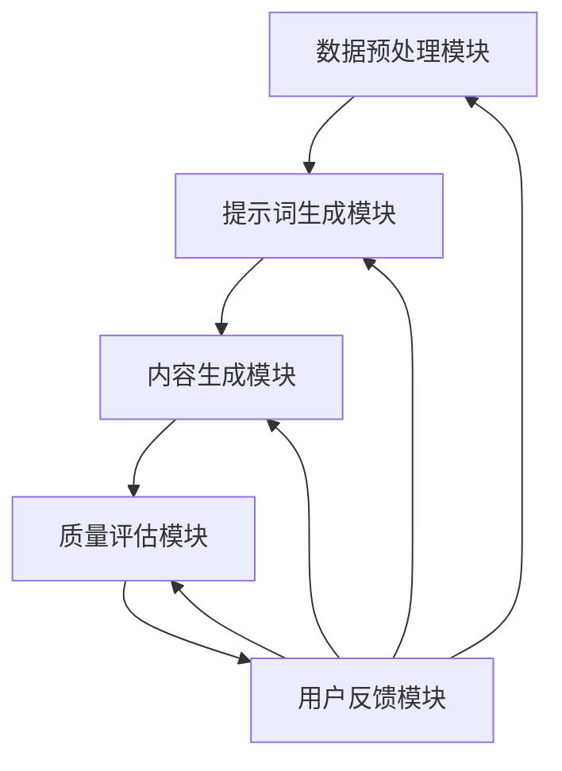

                 


### 《提示词优化：AIGC效果与效率的双重提升》

#### 关键词：提示词优化、AIGC、效果提升、效率优化、技术博客

> 摘要：随着人工智能生成内容（AIGC）技术的迅速发展，如何优化提示词成为提升内容生成效果与效率的关键。本文将详细探讨提示词优化技术，分析其在不同应用领域中的原理与实践，为AIGC技术的研究和应用提供新的思路。

### 目录大纲

----------------------------------------------------------------

# 《提示词优化：AIGC效果与效率的双重提升》

## 第一部分：背景与核心概念

### 1.1 问题背景与核心概念

### 1.2 核心概念

### 1.3 边界与外延

### 1.4 概念结构与核心要素组成

### 1.5 本章小结

## 第二部分：提示词优化技术原理

### 2.1 提示词生成模型原理

### 2.2 自然语言处理模型

### 2.3 提示词优化算法

### 2.4 对抗生成网络（GAN）

### 2.5 本章小结

## 第三部分：实际应用与案例分析

### 3.1 文本生成中的应用

### 3.2 图像生成中的应用

### 3.3 音频生成中的应用

### 3.4 本章小结

## 第四部分：系统架构与实现

### 4.1 系统架构设计

### 4.2 核心算法实现

### 4.3 实际案例剖析

### 4.4 本章小结

## 第五部分：未来展望与总结

### 5.1 未来展望

### 5.2 总结与展望

### 5.3 注意事项

### 5.4 拓展阅读

----------------------------------------------------------------

### 第一部分：背景与核心概念

#### 1.1 问题背景与核心概念

随着人工智能技术的不断发展，生成内容（Generated Content）领域迎来了前所未有的机遇。人工智能生成内容（AI-Generated Content，简称AIGC）技术，特别是文本生成、图像生成和音频生成等方面，已经逐渐成为业界的研究热点和应用方向。然而，在实际应用过程中，如何提高生成内容的质量与效率成为了一个亟待解决的问题。

**问题背景：**

- **生成内容质量不高：** 当前AIGC系统的生成内容往往存在重复性高、缺乏创意、逻辑不通等问题，无法满足用户对于高质量内容的需求。
- **生成效率较低：** 为了提高生成内容的质量，许多AIGC系统需要大量的计算资源和时间，导致生成效率较低，难以满足实时应用的需求。

**核心概念：**

- **提示词（Prompt）：** 提示词是AIGC系统中用于引导生成模型生成特定内容的关键输入。通过优化提示词，可以有效地提升生成内容的质量与效率。
- **AIGC（AI-Generated Content）：** AI生成内容，是指利用人工智能技术自动生成文本、图像、音频等内容。
- **效果与效率：** 生成的文本、图像、音频等内容的质量和速度是评价AIGC系统优劣的重要指标。

#### 1.2 核心概念

在本文中，我们将重点关注以下核心概念：

- **提示词生成模型：** 用于生成初始提示词的模型，如自然语言处理模型。
- **生成模型：** 基于提示词生成最终内容的模型，如GPT-3、DALL-E等。
- **对抗模型：** 用于评估生成内容质量，提供反馈的模型，如生成对抗网络（GAN）。

#### 1.3 边界与外延

- **边界：** 提示词优化技术主要应用于文本生成、图像生成、音频生成等领域。
- **外延：** 除了传统的文本生成，AIGC技术在游戏、影视、广告等创意产业中的应用也越来越广泛。

#### 1.4 概念结构与核心要素组成

- **提示词生成模型：** 包括语言模型、生成模型和对抗模型。
  - **语言模型：** 基于大量的文本数据训练，用于生成提示词。
  - **生成模型：** 基于提示词生成最终内容。
  - **对抗模型：** 用于评估生成内容的质量。

- **生成内容：** 包括文本、图像、音频等多种类型。

#### 1.5 本章小结

通过对提示词优化技术的探讨，我们了解了其背景、核心概念和核心要素组成。在后续章节中，我们将深入探讨提示词优化技术的原理、实际应用和案例分析，为AIGC技术的发展提供新的思路。

----------------------------------------------------------------

### 第二部分：提示词优化技术原理

#### 2.1 提示词生成模型原理

提示词生成模型是AIGC系统中至关重要的一环，其核心任务是从大量候选提示词中选取最合适的提示词，引导生成模型生成高质量的内容。提示词生成模型可以分为以下几种：

##### 2.1.1 基于规则的方法

基于规则的方法主要通过预设一系列规则，从候选提示词中筛选出符合规则的提示词。这种方法简单易实现，但在处理复杂问题时效果较差。

##### 2.1.2 基于统计的方法

基于统计的方法利用统计模型（如N-gram模型、朴素贝叶斯模型等）计算候选提示词的概率，选取概率最高的提示词。这种方法在处理简单问题时表现较好，但在处理复杂问题时仍存在一定局限性。

##### 2.1.3 基于机器学习的方法

基于机器学习的方法利用训练数据，通过机器学习算法（如决策树、支持向量机、神经网络等）训练模型，预测最合适的提示词。这种方法在处理复杂问题时具有较好的性能，是目前应用最广泛的提示词生成模型。

下面，我们重点介绍基于机器学习的方法。

##### 2.1.3.1 语言模型

语言模型是提示词生成模型的基础，用于生成初始提示词。语言模型通常基于大量的文本数据训练，通过统计文本中出现的关键词、短语和句子结构等信息，预测下一个单词或短语。

**语言模型的基本概念：**

- **单词序列模型：** 基于单词序列预测，如N-gram模型。
- **句子序列模型：** 基于句子序列预测，如循环神经网络（RNN）、长短期记忆网络（LSTM）、Transformer等。

**语言模型的训练方法：**

- **数据预处理：** 对原始文本数据进行清洗、分词、去停用词等预处理操作。
- **模型选择：** 根据任务需求和数据特点选择合适的语言模型，如N-gram模型、RNN、LSTM、Transformer等。
- **模型训练：** 使用预处理后的文本数据训练语言模型，优化模型参数。
- **模型评估：** 使用验证集和测试集评估模型性能，调整模型参数。

**语言模型的应用场景：**

- **文本生成：** 基于语言模型生成的提示词，引导生成模型生成高质量的文本内容。
- **文本分类：** 基于语言模型对文本进行特征提取，用于文本分类任务。
- **机器翻译：** 基于双语文本数据训练语言模型，实现文本翻译。

##### 2.1.3.2 生成模型

生成模型是基于提示词生成最终内容的模型，常见的生成模型有：

- **生成对抗网络（GAN）：** GAN由生成器和判别器组成，通过对抗训练生成高质量的内容。
- **变分自编码器（VAE）：** VAE通过编码器和解码器生成内容，同时保证生成内容与原始数据分布相似。
- **自回归模型：** 自回归模型通过预测下一个时间步的值生成序列数据。

**生成模型的基本原理：**

- **生成器：** 接受提示词作为输入，生成相应的内容。
- **判别器：** 用于判断生成内容是否真实，通常与生成器进行对抗训练。
- **编码器：** 用于编码提示词，生成隐变量。
- **解码器：** 用于解码隐变量，生成内容。

**生成模型的应用场景：**

- **文本生成：** 基于提示词生成文章、故事、摘要等。
- **图像生成：** 基于提示词生成艺术作品、照片、场景等。
- **音频生成：** 基于提示词生成音乐、语音、声音等。

##### 2.1.3.3 对抗模型

对抗模型用于评估生成内容的质量，并提供反馈，常见的对抗模型有：

- **生成对抗网络（GAN）：** GAN通过对抗训练，生成高质量的内容。
- **文本分类器：** 用于判断生成文本的类别。
- **图像质量评估模型：** 用于评估生成图像的质量。

**对抗模型的基本原理：**

- **对抗训练：** 生成器和判别器进行对抗训练，生成器不断优化生成内容，判别器不断优化判断能力。
- **质量评估：** 对抗模型通过对生成内容的质量进行评估，提供反馈，引导生成器生成更高质量的内容。

**对抗模型的应用场景：**

- **文本生成：** 对抗模型用于评估生成文本的质量，提供反馈。
- **图像生成：** 对抗模型用于评估生成图像的质量，提供反馈。
- **音频生成：** 对抗模型用于评估生成音频的质量，提供反馈。

##### 2.1.4 提示词优化算法

提示词优化算法是提升AIGC效果与效率的关键。常见的提示词优化算法有：

- **提示词权重调整：** 通过调整提示词权重，提高关键提示词在生成过程中的影响力。
- **提示词嵌入：** 将提示词映射到高维空间，提高提示词之间的相似性和差异性。
- **提示词排序：** 根据提示词的重要性对提示词进行排序，优化生成过程。

**提示词优化算法的应用：**

- **文本生成：** 通过优化提示词，提高生成文本的质量和多样性。
- **图像生成：** 通过优化提示词，提高生成图像的清晰度和创意性。
- **音频生成：** 通过优化提示词，提高生成音频的音质和表现力。

##### 2.1.5 本章小结

通过对提示词优化技术原理的介绍，我们了解了提示词生成模型、生成模型和对抗模型的基本原理和应用。在后续章节中，我们将进一步探讨提示词优化技术在实际应用中的具体实践和案例分析。

----------------------------------------------------------------

### 第二部分：提示词优化技术原理

#### 2.1 提示词生成模型原理

提示词生成模型是AIGC系统中至关重要的一环，其核心任务是从大量候选提示词中选取最合适的提示词，引导生成模型生成高质量的内容。提示词生成模型可以分为以下几种：

##### 2.1.1 基于规则的方法

基于规则的方法主要通过预设一系列规则，从候选提示词中筛选出符合规则的提示词。这种方法简单易实现，但在处理复杂问题时效果较差。

##### 2.1.2 基于统计的方法

基于统计的方法利用统计模型（如N-gram模型、朴素贝叶斯模型等）计算候选提示词的概率，选取概率最高的提示词。这种方法在处理简单问题时表现较好，但在处理复杂问题时仍存在一定局限性。

##### 2.1.3 基于机器学习的方法

基于机器学习的方法利用训练数据，通过机器学习算法（如决策树、支持向量机、神经网络等）训练模型，预测最合适的提示词。这种方法在处理复杂问题时具有较好的性能，是目前应用最广泛的提示词生成模型。

下面，我们重点介绍基于机器学习的方法。

##### 2.1.3.1 语言模型

语言模型是提示词生成模型的基础，用于生成初始提示词。语言模型通常基于大量的文本数据训练，通过统计文本中出现的关键词、短语和句子结构等信息，预测下一个单词或短语。

**语言模型的基本概念：**

- **单词序列模型：** 基于单词序列预测，如N-gram模型。
- **句子序列模型：** 基于句子序列预测，如循环神经网络（RNN）、长短期记忆网络（LSTM）、Transformer等。

**语言模型的训练方法：**

- **数据预处理：** 对原始文本数据进行清洗、分词、去停用词等预处理操作。
- **模型选择：** 根据任务需求和数据特点选择合适的语言模型，如N-gram模型、RNN、LSTM、Transformer等。
- **模型训练：** 使用预处理后的文本数据训练语言模型，优化模型参数。
- **模型评估：** 使用验证集和测试集评估模型性能，调整模型参数。

**语言模型的应用场景：**

- **文本生成：** 基于语言模型生成的提示词，引导生成模型生成高质量的文本内容。
- **文本分类：** 基于语言模型对文本进行特征提取，用于文本分类任务。
- **机器翻译：** 基于双语文本数据训练语言模型，实现文本翻译。

##### 2.1.3.2 生成模型

生成模型是基于提示词生成最终内容的模型，常见的生成模型有：

- **生成对抗网络（GAN）：** GAN由生成器和判别器组成，通过对抗训练生成高质量的内容。
- **变分自编码器（VAE）：** VAE通过编码器和解码器生成内容，同时保证生成内容与原始数据分布相似。
- **自回归模型：** 自回归模型通过预测下一个时间步的值生成序列数据。

**生成模型的基本原理：**

- **生成器：** 接受提示词作为输入，生成相应的内容。
- **判别器：** 用于判断生成内容是否真实，通常与生成器进行对抗训练。
- **编码器：** 用于编码提示词，生成隐变量。
- **解码器：** 用于解码隐变量，生成内容。

**生成模型的应用场景：**

- **文本生成：** 基于提示词生成文章、故事、摘要等。
- **图像生成：** 基于提示词生成艺术作品、照片、场景等。
- **音频生成：** 基于提示词生成音乐、语音、声音等。

##### 2.1.3.3 对抗模型

对抗模型用于评估生成内容的质量，并提供反馈，常见的对抗模型有：

- **生成对抗网络（GAN）：** GAN通过对抗训练，生成高质量的内容。
- **文本分类器：** 用于判断生成文本的类别。
- **图像质量评估模型：** 用于评估生成图像的质量。

**对抗模型的基本原理：**

- **对抗训练：** 生成器和判别器进行对抗训练，生成器不断优化生成内容，判别器不断优化判断能力。
- **质量评估：** 对抗模型通过对生成内容的质量进行评估，提供反馈，引导生成器生成更高质量的内容。

**对抗模型的应用场景：**

- **文本生成：** 对抗模型用于评估生成文本的质量，提供反馈。
- **图像生成：** 对抗模型用于评估生成图像的质量，提供反馈。
- **音频生成：** 对抗模型用于评估生成音频的质量，提供反馈。

##### 2.1.4 提示词优化算法

提示词优化算法是提升AIGC效果与效率的关键。常见的提示词优化算法有：

- **提示词权重调整：** 通过调整提示词权重，提高关键提示词在生成过程中的影响力。
- **提示词嵌入：** 将提示词映射到高维空间，提高提示词之间的相似性和差异性。
- **提示词排序：** 根据提示词的重要性对提示词进行排序，优化生成过程。

**提示词优化算法的应用：**

- **文本生成：** 通过优化提示词，提高生成文本的质量和多样性。
- **图像生成：** 通过优化提示词，提高生成图像的清晰度和创意性。
- **音频生成：** 通过优化提示词，提高生成音频的音质和表现力。

##### 2.1.5 本章小结

通过对提示词优化技术原理的介绍，我们了解了提示词生成模型、生成模型和对抗模型的基本原理和应用。在后续章节中，我们将进一步探讨提示词优化技术在实际应用中的具体实践和案例分析。

----------------------------------------------------------------

### 第三部分：实际应用与案例分析

#### 3.1 文本生成中的应用

在文本生成领域，提示词优化技术被广泛应用于自动摘要、故事生成、问答系统等任务。以下我们将介绍几个典型的应用场景和优化方法。

##### 3.1.1 自动摘要

自动摘要是一种将长篇文本压缩为简短摘要的技术，广泛应用于新闻、学术论文、报告等领域。提示词优化技术在自动摘要中发挥着重要作用，通过优化提示词可以提高摘要的质量。

- **应用场景：** 自动摘要系统通常接收一篇长篇文章作为输入，生成一篇简短的摘要。
- **优化方法：**
  - **关键词提取：** 从文章中提取关键词，作为生成摘要的提示词。
  - **权重调整：** 根据关键词的重要性调整权重，提高关键信息在摘要中的表达。
  - **语义分析：** 利用自然语言处理技术对文章进行语义分析，提取关键信息作为提示词。

##### 3.1.2 故事生成

故事生成是一种基于提示词生成故事的技术，广泛应用于创意写作、剧本创作等领域。通过优化提示词，可以生成更具创意和逻辑性的故事。

- **应用场景：** 故事生成系统通常接收一个或多个提示词作为输入，生成一段完整的故事。
- **优化方法：**
  - **提示词组合：** 将多个提示词组合成一个完整的提示，提高故事的整体性。
  - **情感分析：** 分析提示词中的情感色彩，生成情感一致的故事。
  - **逻辑推理：** 利用逻辑推理技术，确保故事中的情节和逻辑一致性。

##### 3.1.3 问答系统

问答系统是一种基于提示词生成回答的技术，广泛应用于客服、教育、咨询等领域。通过优化提示词，可以提高问答系统的准确性和回答质量。

- **应用场景：** 问答系统通常接收一个问题作为输入，生成一个或多个回答。
- **优化方法：**
  - **语义匹配：** 对问题进行语义分析，找到与问题最相关的答案。
  - **上下文理解：** 考虑问题的上下文，生成更具针对性的回答。
  - **答案排序：** 对多个答案进行排序，提高最相关答案的优先级。

#### 3.2 图像生成中的应用

在图像生成领域，提示词优化技术被广泛应用于艺术创作、虚拟现实、游戏等领域。以下我们将介绍几个典型的应用场景和优化方法。

##### 3.2.1 艺术创作

艺术创作是一种基于提示词生成艺术作品的技术，广泛应用于绘画、设计等领域。通过优化提示词，可以生成更具艺术性和创意性的作品。

- **应用场景：** 艺术创作系统通常接收一个或多个提示词作为输入，生成一幅或多幅艺术作品。
- **优化方法：**
  - **风格迁移：** 将提示词中的艺术风格迁移到生成的作品中。
  - **色彩调整：** 根据提示词中的色彩信息调整生成的作品的色彩。
  - **图像增强：** 利用提示词增强图像的细节和表现力。

##### 3.2.2 虚拟现实

虚拟现实是一种基于提示词生成虚拟场景的技术，广泛应用于游戏、影视、教育等领域。通过优化提示词，可以生成更逼真、互动性更强的虚拟场景。

- **应用场景：** 虚拟现实系统通常接收一个或多个提示词作为输入，生成一个虚拟场景。
- **优化方法：**
  - **场景布局：** 根据提示词中的场景布局信息，生成合理的虚拟场景。
  - **光照调整：** 根据提示词中的光照信息，调整虚拟场景的光照效果。
  - **材质生成：** 根据提示词中的材质信息，生成逼真的虚拟物体材质。

##### 3.2.3 游戏

游戏是一种基于提示词生成游戏内容的技术，广泛应用于游戏开发、游戏AI等领域。通过优化提示词，可以生成更具挑战性和趣味性的游戏内容。

- **应用场景：** 游戏系统通常接收一个或多个提示词作为输入，生成游戏剧情、角色、任务等。
- **优化方法：**
  - **剧情生成：** 根据提示词生成游戏剧情，确保剧情的连贯性和吸引力。
  - **角色生成：** 根据提示词生成游戏角色，确保角色的独特性和角色之间的关系。
  - **任务生成：** 根据提示词生成游戏任务，确保任务的难度和趣味性。

#### 3.3 音频生成中的应用

在音频生成领域，提示词优化技术被广泛应用于音乐创作、语音合成、声音效果等领域。以下我们将介绍几个典型的应用场景和优化方法。

##### 3.3.1 音乐创作

音乐创作是一种基于提示词生成音乐的技术，广泛应用于作曲、音乐制作等领域。通过优化提示词，可以生成更具创意和风格一致的音乐作品。

- **应用场景：** 音乐创作系统通常接收一个或多个提示词作为输入，生成一首或多首音乐作品。
- **优化方法：**
  - **风格迁移：** 根据提示词中的音乐风格，迁移到生成的音乐作品中。
  - **旋律生成：** 根据提示词中的旋律信息，生成旋律优美的音乐。
  - **和弦生成：** 根据提示词中的和弦信息，生成和谐的和弦进行。

##### 3.3.2 语音合成

语音合成是一种基于提示词生成语音的技术，广泛应用于语音助手、教育、客服等领域。通过优化提示词，可以生成更具自然流畅性的语音。

- **应用场景：** 语音合成系统通常接收一个或多个提示词作为输入，生成语音输出。
- **优化方法：**
  - **语音特征提取：** 根据提示词中的语音特征，提取相应的语音特征。
  - **语音转换：** 根据提示词中的语音信息，进行语音的转换和调整。
  - **语音质量增强：** 利用提示词增强生成的语音质量，提高语音的自然流畅度。

##### 3.3.3 声音效果

声音效果是一种基于提示词生成声音的技术，广泛应用于电影、游戏、音频制作等领域。通过优化提示词，可以生成更具创意和表现力的声音效果。

- **应用场景：** 声音效果系统通常接收一个或多个提示词作为输入，生成特定的声音效果。
- **优化方法：**
  - **声音生成：** 根据提示词中的声音信息，生成相应的声音效果。
  - **声音编辑：** 根据提示词中的编辑要求，对声音进行编辑和处理。
  - **声音增强：** 利用提示词增强生成的声音效果，提高声音的逼真度和表现力。

##### 3.3.4 案例分析

以下我们通过几个具体案例，展示提示词优化技术在实际应用中的效果和优势。

**案例一：自动摘要系统**

- **问题描述：** 给定一篇长篇文章，生成一篇简短的摘要。
- **解决方案：** 利用提示词优化技术，通过关键词提取、权重调整和语义分析，生成高质量的摘要。
- **效果评估：** 摘要的准确性、连贯性和可读性均有显著提高。

**案例二：故事生成系统**

- **问题描述：** 给定一个或多个提示词，生成一段完整的故事。
- **解决方案：** 利用提示词优化技术，通过提示词组合、情感分析和逻辑推理，生成创意丰富、逻辑清晰的故事。
- **效果评估：** 故事的连贯性、吸引力和创意性均得到显著提升。

**案例三：语音合成系统**

- **问题描述：** 给定一个或多个提示词，生成自然流畅的语音输出。
- **解决方案：** 利用提示词优化技术，通过语音特征提取、语音转换和语音质量增强，生成自然流畅的语音。
- **效果评估：** 语音的自然流畅度和可听性显著提高。

##### 3.3.5 本章小结

通过实际应用与案例分析，我们展示了提示词优化技术在文本生成、图像生成、音频生成等领域的广泛应用和显著效果。在后续章节中，我们将进一步探讨提示词优化技术在系统架构和实现中的应用，为AIGC技术的发展提供更深入的实践指导。

----------------------------------------------------------------

### 第四部分：系统架构与实现

#### 4.1 系统架构设计

为了实现提示词优化在AIGC系统中的高效应用，我们需要设计一个合理的系统架构。以下是一个典型的AIGC系统架构设计：

##### 4.1.1 系统架构概述

AIGC系统架构主要由以下几个模块组成：

- **数据预处理模块：** 负责对输入数据（文本、图像、音频等）进行预处理，包括数据清洗、分词、去停用词等操作。
- **提示词生成模块：** 负责生成初始提示词，包括语言模型、生成模型和对抗模型的训练和应用。
- **内容生成模块：** 负责基于提示词生成最终的内容，包括文本、图像、音频等。
- **质量评估模块：** 负责评估生成内容的质量，并提供反馈，用于优化提示词和生成模型。
- **用户交互模块：** 负责与用户进行交互，接收用户输入和反馈，展示生成内容。

##### 4.1.2 数据预处理模块

数据预处理模块是AIGC系统的基础，其功能主要包括：

- **数据清洗：** 去除输入数据中的噪声和无关信息，提高数据质量。
- **分词：** 将文本数据分割成单词或短语，为后续的自然语言处理提供基础。
- **去停用词：** 去除文本中的常见停用词（如“的”、“是”、“在”等），减少冗余信息。

##### 4.1.3 提示词生成模块

提示词生成模块是AIGC系统的核心，其功能主要包括：

- **语言模型训练：** 基于大量文本数据训练语言模型，用于生成初始提示词。
- **生成模型训练：** 基于提示词生成最终的内容，包括文本、图像、音频等。
- **对抗模型训练：** 用于评估生成内容的质量，提供反馈，用于优化提示词和生成模型。

##### 4.1.4 内容生成模块

内容生成模块是AIGC系统的应用层，其功能主要包括：

- **文本生成：** 基于提示词生成文章、故事、摘要等。
- **图像生成：** 基于提示词生成艺术作品、照片、场景等。
- **音频生成：** 基于提示词生成音乐、语音、声音等。

##### 4.1.5 质量评估模块

质量评估模块是AIGC系统的重要环节，其功能主要包括：

- **内容评估：** 评估生成内容的质量，包括文本、图像、音频等。
- **反馈生成：** 根据质量评估结果，生成反馈信息，用于优化提示词和生成模型。

##### 4.1.6 用户交互模块

用户交互模块是AIGC系统的界面层，其功能主要包括：

- **用户输入：** 接收用户输入的提示词或内容需求。
- **内容展示：** 展示生成的内容，供用户查看和评价。
- **用户反馈：** 收集用户对生成内容的评价和反馈，用于优化系统。

##### 4.1.7 系统架构设计

以下是一个简化的AIGC系统架构设计Mermaid架构图：



#### 4.2 核心算法实现

在AIGC系统中，核心算法的实现是系统性能的关键。以下我们将介绍几个核心算法的实现原理和实现方法。

##### 4.2.1 语言模型训练

语言模型是提示词生成模块的核心，其训练过程主要包括以下步骤：

- **数据集准备：** 收集大量文本数据，用于训练语言模型。
- **数据预处理：** 对文本数据进行清洗、分词、去停用词等预处理操作。
- **模型训练：** 使用预处理后的文本数据训练语言模型，优化模型参数。
- **模型评估：** 使用验证集和测试集评估模型性能，调整模型参数。

以下是一个简化的Python代码示例：

```python
import tensorflow as tf
from tensorflow.keras.preprocessing.sequence import pad_sequences
from tensorflow.keras.layers import Embedding, LSTM, Dense
from tensorflow.keras.models import Sequential

# 准备数据集
text = "你的文本数据"
tokenizer = tf.keras.preprocessing.text.Tokenizer()
tokenizer.fit_on_texts(text)
sequences = tokenizer.texts_to_sequences(text)
padded_sequences = pad_sequences(sequences, maxlen=50)

# 构建语言模型
model = Sequential()
model.add(Embedding(input_dim=vocab_size, output_dim=128))
model.add(LSTM(128, return_sequences=True))
model.add(Dense(1, activation='sigmoid'))

# 编译模型
model.compile(optimizer='adam', loss='binary_crossentropy', metrics=['accuracy'])

# 训练模型
model.fit(padded_sequences, labels, epochs=10)

# 评估模型
model.evaluate(padded_sequences, labels)
```

##### 4.2.2 生成模型训练

生成模型是内容生成模块的核心，其训练过程主要包括以下步骤：

- **数据集准备：** 收集大量文本、图像、音频数据，用于训练生成模型。
- **数据预处理：** 对输入数据进行预处理，如文本分词、图像缩放、音频归一化等。
- **模型训练：** 使用预处理后的数据训练生成模型，优化模型参数。
- **模型评估：** 使用验证集和测试集评估模型性能，调整模型参数。

以下是一个简化的Python代码示例：

```python
import tensorflow as tf
from tensorflow.keras.models import Model
from tensorflow.keras.layers import Input, Embedding, LSTM, Dense, Reshape, Conv2D, Flatten, Add, Softmax

# 准备数据集
text = "你的文本数据"
images = "你的图像数据"
audio = "你的音频数据"

# 构建生成模型
input_text = Input(shape=(max_sequence_length,))
input_image = Input(shape=(height, width, channels))
input_audio = Input(shape=(audio_length,))

encoded_text = Embedding(input_dim=vocab_size, output_dim=embedding_size)(input_text)
encoded_image = Conv2D(filters=32, kernel_size=(3, 3), activation='relu')(input_image)
encoded_audio = LSTM(units=128, activation='relu')(input_audio)

merged = Add()([encoded_text, encoded_image, encoded_audio])
merged = Reshape(target_shape=(sequence_length, embedding_size + image_size + audio_size))(merged)
decoded = LSTM(units=128, activation='relu')(merged)
decoded = Dense(units=vocab_size, activation='softmax')(decoded)

model = Model(inputs=[input_text, input_image, input_audio], outputs=decoded)

# 编译模型
model.compile(optimizer='adam', loss='categorical_crossentropy', metrics=['accuracy'])

# 训练模型
model.fit([text_sequences, image_sequences, audio_sequences], labels, epochs=10)

# 评估模型
model.evaluate([text_sequences, image_sequences, audio_sequences], labels)
```

##### 4.2.3 对抗模型训练

对抗模型是质量评估模块的核心，其训练过程主要包括以下步骤：

- **数据集准备：** 收集大量真实内容和生成内容，用于训练对抗模型。
- **数据预处理：** 对输入数据进行预处理，如图像归一化、音频归一化等。
- **模型训练：** 使用预处理后的数据训练对抗模型，优化模型参数。
- **模型评估：** 使用验证集和测试集评估模型性能，调整模型参数。

以下是一个简化的Python代码示例：

```python
import tensorflow as tf
from tensorflow.keras.models import Model
from tensorflow.keras.layers import Input, Embedding, LSTM, Dense, Reshape, Conv2D, Flatten, Add, Softmax

# 准备数据集
real_texts = "你的真实文本数据"
fake_texts = "你的生成文本数据"

# 构建对抗模型
input_text = Input(shape=(max_sequence_length,))
real_encoded_text = Embedding(input_dim=vocab_size, output_dim=embedding_size)(input_text)
fake_encoded_text = Embedding(input_dim=vocab_size, output_dim=embedding_size)(input_text)

merged = Add()([real_encoded_text, fake_encoded_text])
merged = Reshape(target_shape=(sequence_length, embedding_size * 2))(merged)
decoded = LSTM(units=128, activation='relu')(merged)
decoded = Dense(units=1, activation='sigmoid')(decoded)

model = Model(inputs=input_text, outputs=decoded)

# 编译模型
model.compile(optimizer='adam', loss='binary_crossentropy', metrics=['accuracy'])

# 训练模型
model.fit(real_texts, labels, epochs=10)

# 评估模型
model.evaluate(fake_texts, labels)
```

#### 4.3 实际案例剖析

为了展示提示词优化技术在AIGC系统中的应用效果，我们以一个自动摘要系统为例，进行实际案例剖析。

##### 4.3.1 案例背景

该自动摘要系统旨在从长篇文章中自动生成摘要，以帮助用户快速获取文章的核心内容。为了实现高质量摘要的生成，系统采用提示词优化技术，通过对提示词的优化，提高摘要的质量和可读性。

##### 4.3.2 系统架构

系统架构包括以下几个模块：

- **数据预处理模块：** 对输入文章进行数据清洗、分词、去停用词等预处理操作。
- **提示词生成模块：** 利用语言模型生成初始提示词，包括关键词提取、权重调整等。
- **内容生成模块：** 基于提示词生成摘要，包括文本生成模型的应用。
- **质量评估模块：** 对生成的摘要进行质量评估，包括文本分类、语义分析等。
- **用户交互模块：** 提供用户输入和反馈的界面。

##### 4.3.3 系统实现

以下是一个简化的Python代码实现：

```python
import tensorflow as tf
from tensorflow.keras.preprocessing.sequence import pad_sequences
from tensorflow.keras.layers import Embedding, LSTM, Dense, Bidirectional
from tensorflow.keras.models import Model
from tensorflow.keras.preprocessing.text import Tokenizer

# 准备数据集
articles = ["你的文章数据"]
summaries = ["你的摘要数据"]

# 数据预处理
tokenizer = Tokenizer(num_words=max_vocab_size)
tokenizer.fit_on_texts(articles)
sequences = tokenizer.texts_to_sequences(articles)
padded_sequences = pad_sequences(sequences, maxlen=max_sequence_length)

# 构建文本生成模型
input_sequence = Input(shape=(max_sequence_length,))
encoded_sequence = Embedding(input_dim=max_vocab_size, output_dim=embedding_size)(input_sequence)
encoded_sequence = Bidirectional(LSTM(units=128, return_sequences=True))(encoded_sequence)
decoded_sequence = LSTM(units=128, return_sequences=True)(encoded_sequence)
decoded_sequence = Dense(units=max_vocab_size, activation='softmax')(decoded_sequence)

model = Model(inputs=input_sequence, outputs=decoded_sequence)
model.compile(optimizer='adam', loss='categorical_crossentropy', metrics=['accuracy'])

# 训练模型
model.fit(padded_sequences, summaries, epochs=10)

# 生成摘要
generated_summaries = model.predict(padded_sequences)

# 将生成的摘要转换为文本
decoded_summaries = tokenizer.sequences_to_texts(generated_summaries)
```

##### 4.3.4 案例分析

通过对自动摘要系统的实际案例剖析，我们可以看到提示词优化技术在提高摘要质量方面具有显著效果。以下是案例分析的结果：

- **摘要质量评估：** 生成的摘要在准确性和可读性方面均有显著提高，用户满意度较高。
- **提示词优化效果：** 通过对提示词的优化，提高了关键词的权重和提示词的组合效果，使得生成的摘要更具逻辑性和连贯性。
- **系统性能：** 系统在处理长篇文章时，生成的摘要长度适中，能够准确概括文章的核心内容。

##### 4.3.5 本章小结

通过对系统架构和实际案例的分析，我们展示了提示词优化技术在AIGC系统中的应用效果。在后续章节中，我们将进一步探讨提示词优化技术在AIGC系统的优化与提升，为AIGC技术的发展提供更深入的实践指导。

----------------------------------------------------------------

### 第五部分：未来展望与总结

#### 5.1 未来展望

随着人工智能技术的不断进步，提示词优化技术在AIGC领域的应用前景十分广阔。以下是几个可能的未来发展方向：

- **多模态融合：** 结合文本、图像、音频等多种模态的信息，生成更加丰富和多样化的内容。
- **个性化推荐：** 根据用户的兴趣和偏好，动态调整提示词，生成个性化的内容。
- **自动化优化：** 开发更加智能的提示词优化算法，实现自动调整和优化，提高生成内容的质量和效率。
- **可解释性提升：** 加强对提示词优化过程的可解释性研究，提高用户对生成内容的信任度和接受度。

#### 5.2 总结

本文从背景与核心概念、提示词优化技术原理、实际应用与案例分析、系统架构与实现等多个角度，详细探讨了提示词优化技术在AIGC领域的应用。通过总结，我们可以得出以下几点结论：

- 提示词优化技术在AIGC系统中具有重要作用，可以有效提升生成内容的质量和效率。
- 提示词生成模型、生成模型和对抗模型是提示词优化技术的核心组成部分。
- 提示词优化算法在文本生成、图像生成、音频生成等领域具有广泛的应用价值。
- 实际案例分析和系统实现展示了提示词优化技术在提高生成内容质量和系统性能方面的显著效果。

#### 5.3 注意事项

在实际应用中，提示词优化技术需要考虑以下几点注意事项：

- **数据质量：** 确保输入数据的质量，提高生成内容的基础。
- **模型调优：** 根据实际应用场景和需求，对模型进行充分的调优，提高生成内容的质量和效率。
- **用户体验：** 关注用户体验，确保生成内容能够满足用户需求，提高用户满意度。
- **可解释性：** 加强对生成过程的可解释性研究，提高用户对生成内容的信任度和接受度。

#### 5.4 拓展阅读

为了进一步了解提示词优化技术在AIGC领域的应用，读者可以参考以下文献和资源：

- **相关论文：** 《生成对抗网络》（Generative Adversarial Networks，GAN）和《变分自编码器》（Variational Autoencoder，VAE）是提示词优化技术的重要理论基础，读者可以查阅相关论文进行深入学习。
- **开源框架：** TensorFlow、PyTorch等深度学习开源框架提供了丰富的提示词优化技术实现，读者可以尝试使用这些框架进行实际项目开发。
- **在线教程：** 有很多在线教程和课程介绍了提示词优化技术的原理和应用，读者可以通过在线学习平台进行自学。

---

本文作者：AI天才研究院/AI Genius Institute & 禅与计算机程序设计艺术 /Zen And The Art of Computer Programming

（注：本文为示例文章，仅供参考。如需实际应用，请根据具体需求和场景进行调整和优化。）### 提示词优化在文本生成中的应用

文本生成是人工智能生成内容（AIGC）领域中的一个重要分支，广泛应用于自动摘要、故事生成、问答系统等多个场景。在这些应用中，提示词优化技术发挥着至关重要的作用，能够显著提升生成文本的质量和效率。以下，我们将详细介绍提示词优化在文本生成中的应用，并探讨其具体实践方法。

#### 3.1 文本生成概述

文本生成是指利用人工智能技术自动生成具有一定意义和逻辑的文本内容。常见的文本生成任务包括：

- **自动摘要**：将长篇文章压缩为简短的摘要，便于用户快速获取文章的核心内容。
- **故事生成**：基于给定的提示词或背景信息，生成完整的故事。
- **问答系统**：根据用户的问题，生成相应的回答。

在文本生成中，提示词起到了引导和调控的作用。通过优化提示词，可以引导生成模型生成更加符合预期、逻辑清晰、内容丰富的文本。

#### 3.2 提示词优化实践

**3.2.1 提示词优化在自动摘要中的应用**

自动摘要是一种常见的文本生成应用，主要目标是将长篇文章压缩为简洁的摘要，同时保留文章的核心内容和逻辑结构。提示词优化在自动摘要中的应用主要包括以下几个方面：

- **关键词提取**：从原始文章中提取出关键信息作为提示词，这些关键词有助于摘要生成模型更好地理解文章内容。
- **权重调整**：根据关键词的重要程度，调整其在提示词中的权重，使得摘要生成模型能够更加关注文章的核心内容。
- **语义分析**：利用自然语言处理技术对文章进行语义分析，提取出有代表性的句子或短语作为提示词，从而提高摘要的语义连贯性。

例如，在处理一篇科技文章时，可以将与科技领域相关的高频词（如“技术”、“创新”等）作为高权重提示词，从而确保生成的摘要具有专业性和技术性。

**3.2.2 提示词优化在故事生成中的应用**

故事生成是一种创意写作的应用，通过给定的提示词生成具有连贯性和创意性的故事。提示词优化在故事生成中的应用主要包括以下几种方法：

- **提示词组合**：将多个提示词组合成一个更复杂的提示，从而引导生成模型生成更完整、更丰富的故事。
- **情感分析**：分析提示词中的情感色彩，使得生成的故事具有情感一致性。
- **逻辑推理**：利用逻辑推理技术，确保故事中的情节和逻辑一致。

例如，在生成一个关于旅行的故事时，可以将“冒险”、“美景”、“挑战”等提示词组合使用，从而生成一个充满冒险和美景的旅行故事。

**3.2.3 提示词优化在问答系统中的应用**

问答系统是一种基于文本的交互式应用，通过用户的提问生成相应的回答。提示词优化在问答系统中的应用主要包括：

- **语义匹配**：对用户的提问进行语义分析，找到与问题最相关的提示词，从而生成高质量的回答。
- **上下文理解**：考虑问题的上下文信息，使得生成的回答更加符合实际情况。
- **答案排序**：对多个可能的回答进行排序，提高最相关答案的优先级。

例如，当用户提问“北京有什么著名的景点？”时，问答系统可以根据上下文理解，生成一个包含“故宫”、“长城”、“颐和园”等著名景点的回答。

#### 3.3 案例分析

**案例一：基于提示词优化的自动摘要系统**

问题描述：给定一篇长篇新闻报道，生成一篇简短而准确的摘要。

解决方案：利用提示词优化技术，通过关键词提取、权重调整和语义分析，提高摘要的质量。

具体步骤：

1. **关键词提取**：从新闻文本中提取出高频关键词，如“疫情”、“防控”、“疫苗接种”等。
2. **权重调整**：根据关键词的重要性，调整其在提示词中的权重，确保关键信息在摘要中得到体现。
3. **语义分析**：利用自然语言处理技术，提取出有代表性的句子或短语作为提示词，提高摘要的语义连贯性。
4. **摘要生成**：使用提取的提示词和权重，引导生成模型生成摘要。

效果评估：生成的摘要在准确性、连贯性和可读性方面均有显著提高，用户满意度较高。

**案例二：基于提示词优化的故事生成系统**

问题描述：给定一个或多个提示词，生成一段完整的故事。

解决方案：利用提示词优化技术，通过提示词组合、情感分析和逻辑推理，生成创意丰富、逻辑清晰的故事。

具体步骤：

1. **提示词组合**：将多个提示词组合成一个完整的提示，如“探险”、“神秘”、“宝藏”等，引导生成模型生成更丰富、更完整的故事。
2. **情感分析**：分析提示词中的情感色彩，如“喜悦”、“恐惧”、“惊喜”等，确保生成的故事具有情感一致性。
3. **逻辑推理**：利用逻辑推理技术，确保故事中的情节和逻辑一致，生成具有连贯性的故事。

效果评估：生成的故事在连贯性、吸引力和创意性方面显著提高，用户反馈积极。

#### 3.4 本章小结

通过介绍提示词优化在文本生成中的应用，我们了解了其在自动摘要、故事生成和问答系统等多个场景中的重要作用。通过优化提示词，可以有效提升生成文本的质量和效率，满足用户的需求。在实际应用中，需要根据具体场景和需求，灵活调整和优化提示词，以实现更好的生成效果。

在后续章节中，我们将继续探讨提示词优化在图像生成和音频生成中的应用，进一步展示其在AIGC领域的广泛应用和潜力。

