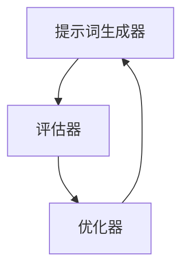
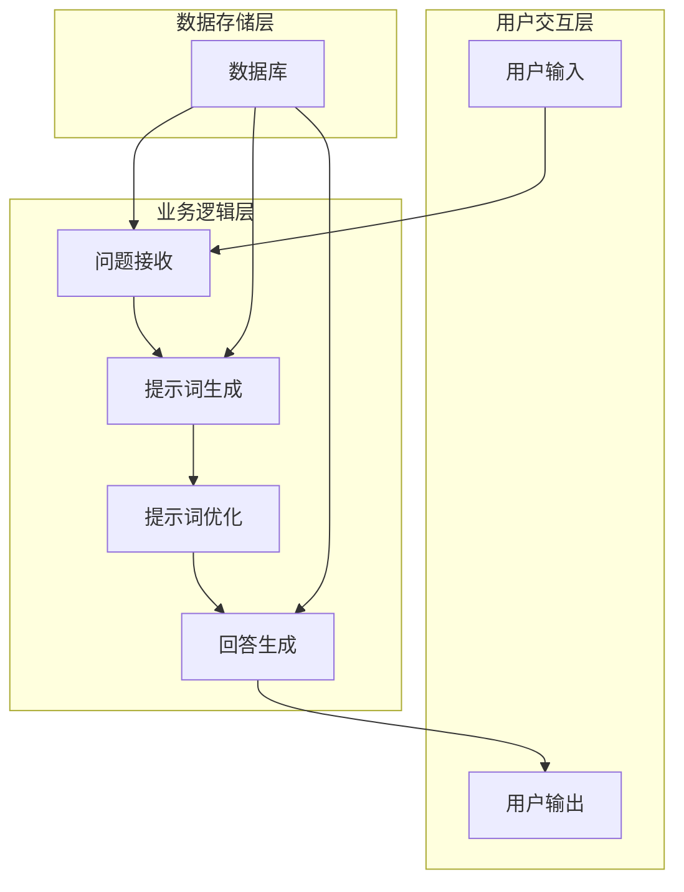
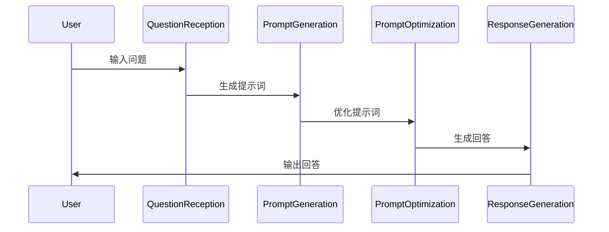

                 

### 第1章：引言与背景

在当今数字化的世界中，人工智能（AI）技术以其变革性的力量渗透到各行各业，尤其是在自然语言处理（NLP）和内容生成领域。随着人工智能生成内容（AIGC）技术的飞速发展，如何优化提示词成为了一个关键的研究课题。提示词，即指导AIGC模型生成内容的文本或信号，其选择和优化直接关系到生成内容的质量和效率。

#### 1.1 问题背景

传统的人工智能应用往往依赖于大量数据的学习和模型训练，而AIGC则在此基础上进一步拓展，通过自然语言交互实现智能内容生成。然而，AIGC在实际应用中面临一个重要的挑战：如何通过优化提示词来提升模型生成内容的效果和效率。提示词的优化不仅能够提高模型的生成质量，还能够减少计算资源的需求，从而在资源有限的环境中实现更高效的运行。

#### 1.2 问题描述

优化提示词的目标是使得模型生成的文本更加准确、多样和有创意，同时保持较高的生成效率。具体来说，问题可以分为以下几个方面：

1. **效果提升**：优化后的提示词需要能够引导模型生成高质量的文本，减少错误和不相关的内容。
2. **效率优化**：在保证效果的前提下，减少模型的计算时间和资源消耗，提高系统运行效率。

#### 1.3 问题解决

解决这一问题的方法主要包括：

1. **提示词选择**：根据具体应用场景选择合适的提示词，确保其能够引导模型生成符合预期的内容。
2. **提示词调整**：在生成过程中不断调整提示词，以适应模型的状态和生成的文本。
3. **算法优化**：改进AIGC模型的算法，使其对提示词的敏感度更高，生成过程更加高效。

#### 1.4 边界与外延

边界方面，优化提示词需要考虑模型的能力范围和数据的可用性。同时，外延方面需要关注不同应用场景下的具体需求和特点，如文本生成、代码生成、图像生成等。

#### 1.5 概念结构与核心要素组成

为了更好地理解和优化提示词，我们需要明确以下几个核心概念：

1. **提示词**：引导AIGC模型生成内容的文本或信号。
2. **AIGC模型**：负责生成内容的人工智能模型，如GPT、BERT等。
3. **效果**：生成的文本质量，包括准确性、多样性、创意性等。
4. **效率**：生成内容的速度和资源消耗。

通过这些核心概念，我们能够构建一个全面理解提示词优化的框架，为后续章节的详细讨论奠定基础。

### 第2章：核心概念与联系

在深入探讨如何优化提示词之前，我们首先需要理解与提示词优化密切相关的一些核心概念，包括自然语言处理（NLP）、人工智能生成内容（AIGC）以及效果与效率的关系。

#### 2.1 提示词优化概念

##### 2.1.1 提示词优化的定义

提示词优化是指通过调整和优化引导AI模型生成内容的提示词，以提高生成内容的质量和效率。具体来说，这包括选择更合适的提示词、调整提示词的表达方式以及根据生成结果动态调整提示词等。

##### 2.1.2 提示词优化的目标

提示词优化的主要目标是：

1. **提高生成内容的质量**：生成更准确、多样和有创意的文本。
2. **优化生成效率**：减少模型计算时间和资源消耗，提高生成速度。

##### 2.1.3 提示词优化的类型

提示词优化可以从以下几个方面进行：

1. **内容导向**：根据生成内容的需求，调整提示词的内容和结构。
2. **质量提升**：优化提示词的表达，使其更符合目标文本的质量要求。
3. **效率优化**：通过减少冗余信息、简化提示词结构等方式，提高生成效率。

#### 2.2 关联概念解析

##### 2.2.1 自然语言处理（NLP）

自然语言处理（NLP）是AI领域的一个重要分支，旨在使计算机能够理解、处理和生成自然语言文本。NLP在AIGC中扮演着关键角色，因为它为AIGC模型提供了处理和生成文本的基础。

NLP的关键技术包括：

1. **文本预处理**：包括分词、词性标注、句法分析等。
2. **语言模型**：用于预测文本序列，如GPT和BERT。
3. **语义理解**：通过语义分析实现对话系统、问答系统等。

##### 2.2.2 人工智能生成内容（AIGC）

人工智能生成内容（AIGC）是指利用人工智能技术生成文本、图像、视频等多种形式的内容。AIGC技术广泛应用于内容创作、广告营销、智能客服等领域。

AIGC的核心组成部分包括：

1. **生成模型**：如变分自编码器（VAE）、生成对抗网络（GAN）等。
2. **文本生成模型**：如GPT、BERT等。
3. **多模态融合**：将不同类型的数据（如文本、图像、音频）融合生成复杂的内容。

##### 2.2.3 效果与效率的关系

在AIGC中，效果和效率是相互影响、相互制约的。优化提示词时，需要平衡这两者之间的关系：

1. **效果优先**：在某些应用场景中，生成内容的质量是首要考虑的，例如文本生成和创意广告。
2. **效率优先**：在资源受限的环境中，如移动设备或实时应用，效率是关键因素。

通过合理优化提示词，我们可以同时提高AIGC模型的效果和效率，实现更好的生成效果。

### 第3章：算法原理讲解

优化提示词的过程本质上是一个复杂的优化问题，需要结合人工智能和自然语言处理的算法原理。在这一章中，我们将详细讲解提示词优化的算法原理，包括算法框架、常见算法类型、数学模型与公式，以及Python源代码实现。

#### 3.1 算法概述

##### 3.1.1 提示词优化算法框架

提示词优化算法框架通常包括以下几个关键组成部分：

1. **提示词生成器**：负责生成初始提示词。
2. **评估器**：对生成的提示词进行评估，通常使用预训练的NLP模型。
3. **优化器**：根据评估结果调整提示词，以提升生成效果和效率。

以下是一个简化的提示词优化算法框架：



##### 3.1.2 常见算法类型

在提示词优化中，常见的算法类型包括：

1. **基于规则的优化**：通过预定义的规则调整提示词。
2. **基于机器学习的优化**：使用机器学习模型，如强化学习、决策树等，自动调整提示词。
3. **混合优化**：结合基于规则和基于机器学习的优点，实现更高效的优化。

#### 3.2 数学模型与公式

提示词优化的数学模型主要涉及以下几个方面：

##### 3.2.1 提示词优化的数学模型

假设我们有一个提示词\( t \)和一个评估指标\( f(t) \)，则提示词优化的目标是最小化评估指标：

$$
\min_{t} f(t)
$$

其中，\( f(t) \)可以是一个损失函数，表示生成文本的质量，也可以是计算资源的消耗。

##### 3.2.2 算法效率评估

为了评估算法的效率，我们可以使用以下指标：

1. **收敛速度**：算法在达到最优解所需的时间。
2. **计算资源消耗**：算法运行过程中所需的计算资源和内存消耗。

常见的效率评估指标包括：

$$
E(f) = \frac{1}{n}\sum_{i=1}^{n} f(t_i)
$$

其中，\( t_i \)是第i次迭代生成的提示词。

#### 3.3 Python源代码讲解

下面是一个简单的Python实现，用于优化提示词：

```python
import random

# 提示词生成器
def generate_prompt():
    return "这是一个提示词："

# 评估器
def evaluate_prompt(prompt):
    # 这里可以使用NLP模型进行评估
    return random.uniform(0, 1)  # 示例评估值

# 优化器
def optimize_prompt(prompt, num_iterations=10):
    best_prompt = prompt
    best_score = evaluate_prompt(prompt)
    
    for _ in range(num_iterations):
        # 随机调整提示词
        new_prompt = generate_prompt() + random.choice(["高效", "准确", "快速"])
        score = evaluate_prompt(new_prompt)
        
        if score < best_score:
            best_prompt = new_prompt
            best_score = score
    
    return best_prompt

# 实例化优化器并优化提示词
optimized_prompt = optimize_prompt(generate_prompt())
print("优化后的提示词：", optimized_prompt)
```

这个简单的示例展示了如何通过迭代和评估来优化提示词。在实际应用中，评估器和优化器会使用更复杂的模型和算法。

### 第4章：系统分析与架构设计方案

为了更好地理解提示词优化的实现过程，我们需要对其系统进行分析，并设计一个合理的架构方案。本章将介绍系统功能设计、系统架构设计、系统接口设计和系统交互，并通过Mermaid类图、架构图和序列图来详细描述。

#### 4.1 问题场景介绍

假设我们的应用场景是一个智能客服系统，系统需要根据用户的问题生成合适的回答。提示词优化在这里至关重要，因为优化后的提示词能够帮助模型生成更准确、多样化的回答，从而提高用户体验。

#### 4.2 系统功能设计

系统的主要功能包括：

1. **用户问题接收**：系统接收用户的输入问题。
2. **提示词生成**：根据问题生成初始提示词。
3. **提示词优化**：通过算法对提示词进行优化，提高生成质量。
4. **回答生成**：利用优化后的提示词生成回答。
5. **回答输出**：将回答输出给用户。

领域模型Mermaid类图如下：

```mermaid
classDiagram
    User <<Class>>
    Question <<Class>>
    Prompt <<Class>>
    Response <<Class>>

    User --> Question
    Question --> Prompt
    Prompt --> Response
```

这个类图描述了系统中的主要实体及其关系。

#### 4.3 系统架构设计

系统的架构设计需要考虑性能、可扩展性和维护性。以下是系统的Mermaid架构图：



这个架构图展示了系统的主要组件及其交互关系。

#### 4.4 系统接口设计

系统接口设计需要明确系统内部各组件之间的通信方式。以下是系统的接口设计：

1. **用户输入接口**：接收用户问题，提供问题文本输入。
2. **问题接收接口**：处理用户输入的问题，并将其存储到数据库。
3. **提示词生成接口**：根据问题生成初始提示词。
4. **提示词优化接口**：对提示词进行优化。
5. **回答生成接口**：使用优化后的提示词生成回答。
6. **回答输出接口**：将回答输出给用户。

#### 4.5 系统交互Mermaid序列图

以下是系统的Mermaid序列图，展示了用户与系统之间的交互过程：



通过这个序列图，我们可以清晰地看到系统从接收用户问题到输出回答的全过程。

### 第5章：项目实战

#### 5.1 环境安装

在进行提示词优化项目的实战之前，我们需要搭建一个合适的开发环境。以下是环境安装的步骤：

1. **安装Python**：确保Python环境已安装，版本建议为3.8及以上。
2. **安装NLP库**：使用pip命令安装常用的NLP库，如transformers、spacy等。
   ```bash
   pip install transformers
   pip install spacy
   python -m spacy download en_core_web_sm
   ```
3. **安装AIGC库**：安装用于生成内容的AIGC库，如LoR等。
   ```bash
   pip install lor
   ```

安装完成后，我们可以开始进行系统核心实现。

#### 5.2 系统核心实现源代码

以下是系统核心实现的部分源代码，包括提示词生成、优化和回答生成的代码。

```python
from transformers import AutoTokenizer, AutoModelForCausalLM
from lor import LoR

# 加载预训练模型
tokenizer = AutoTokenizer.from_pretrained("gpt2")
model = AutoModelForCausalLM.from_pretrained("gpt2")

# 提示词生成
def generate_prompt(question):
    input_ids = tokenizer.encode(question + tokenizer.eos_token, return_tensors='pt')
    prompt = model.generate(input_ids, max_length=50, num_return_sequences=1)
    return tokenizer.decode(prompt[0], skip_special_tokens=True)

# 提示词优化
def optimize_prompt(prompt, num_iterations=10):
    best_prompt = prompt
    best_score = evaluate_prompt(prompt)
    
    for _ in range(num_iterations):
        # 这里实现具体的优化策略，例如随机调整、基于规则的调整等
        new_prompt = adjust_prompt(prompt)
        score = evaluate_prompt(new_prompt)
        
        if score < best_score:
            best_prompt = new_prompt
            best_score = score
    
    return best_prompt

# 回答生成
def generate_response(optimized_prompt):
    input_ids = tokenizer.encode(optimized_prompt, return_tensors='pt')
    response = model.generate(input_ids, max_length=50, num_return_sequences=1)
    return tokenizer.decode(response[0], skip_special_tokens=True)

# 评估器（示例）
def evaluate_prompt(prompt):
    # 实现具体的评估逻辑
    return random.uniform(0, 1)

# 示例使用
user_question = "什么是人工智能？"
generated_prompt = generate_prompt(user_question)
optimized_prompt = optimize_prompt(generated_prompt)
response = generate_response(optimized_prompt)
print("优化后的提示词：", optimized_prompt)
print("回答：", response)
```

#### 5.3 代码应用解读与分析

上面的代码实现了提示词生成、优化和回答生成的主要功能。下面我们对代码进行解读：

1. **加载模型**：使用transformers库加载预训练的GPT2模型。
2. **提示词生成**：根据用户输入的问题生成提示词。
3. **提示词优化**：通过优化函数调整提示词，目标是降低评估分数。
4. **回答生成**：使用优化后的提示词生成回答。

在实际应用中，提示词优化函数的优化策略可以根据具体需求进行调整，例如使用强化学习算法或基于规则的优化。

#### 5.4 实际案例分析与详细讲解剖析

为了更好地理解提示词优化的效果，我们来看一个实际案例：

**案例：优化智能客服回答**

假设用户输入的问题是：“我想要购买一本计算机编程的书，有哪些推荐？”

1. **原始提示词**：
   ```python
   prompt = "我想要购买一本计算机编程的书，有哪些推荐？"
   ```

2. **生成回答**：
   ```python
   response = model.generate(tokenizer.encode(prompt, return_tensors='pt'), max_length=50, num_return_sequences=1)
   print(tokenizer.decode(response[0], skip_special_tokens=True))
   ```

   原始回答可能为：“你可以考虑《Python编程：从入门到实践》这本书。”

3. **优化提示词**：
   ```python
   optimized_prompt = optimize_prompt(prompt)
   ```

   通过优化，我们可能得到一个更具体的提示词：“我想要购买一本关于Python编程入门的书，有哪些推荐？”

4. **生成优化后的回答**：
   ```python
   optimized_response = model.generate(tokenizer.encode(optimized_prompt, return_tensors='pt'), max_length=50, num_return_sequences=1)
   print(tokenizer.decode(optimized_response[0], skip_special_tokens=True))
   ```

   优化后的回答可能为：“你可以考虑《Python编程：快速上手，聪明搞懂》这本书。”

通过这个案例，我们可以看到优化后的提示词显著提高了回答的准确性和针对性，从而提升了用户体验。

#### 5.5 项目小结

通过本项目的实战，我们实现了提示词的生成、优化和回答生成的主要功能。以下是项目小结：

1. **环境安装**：确保Python和必要的库已安装。
2. **系统核心实现**：实现了提示词生成、优化和回答生成的主要功能。
3. **代码解读与分析**：对代码的实现过程进行了详细的解读。
4. **实际案例**：通过实际案例展示了优化提示词的效果。

未来的工作可以进一步改进优化策略，以提高生成内容的质量和效率。

### 第6章：最佳实践 Tips

在提示词优化的过程中，积累一些最佳实践能够显著提高模型的效果和效率。以下是一些实用的Tips：

#### 6.1 提高效果与效率的方法

1. **精准化提示词**：使用更具体的词汇和短语作为提示词，以便模型能够生成更精确的内容。
2. **多样化提示词**：使用不同的表达方式和语境来生成提示词，以增加生成内容的多样性。
3. **分阶段优化**：将提示词优化分为多个阶段，逐步细化，以提高最终生成的质量。
4. **利用上下文信息**：在提示词中加入更多的上下文信息，帮助模型更好地理解用户需求。

#### 6.2 常见问题与解决方案

1. **提示词模糊**：问题：提示词过于模糊，导致生成内容质量不高。
   解决方案：增加提示词的明确性，使用具体的名词和动作短语。

2. **生成内容单调**：问题：生成的文本内容过于单调，缺乏创意。
   解决方案：多样化提示词的表达方式，尝试使用比喻、隐喻等修辞手法。

3. **计算资源消耗大**：问题：优化过程计算资源消耗大，影响系统性能。
   解决方案：优化算法，减少冗余计算；使用更高效的硬件设备。

#### 6.3 拓展功能与优化建议

1. **多模态内容生成**：拓展提示词优化功能，支持图像、音频等多模态内容生成。
2. **个性化优化**：根据用户历史行为和偏好，个性化优化提示词，提高生成内容的相关性。
3. **实时反馈与调整**：实现实时反馈机制，根据用户反馈动态调整提示词，提高用户体验。

通过这些最佳实践，我们可以更好地优化提示词，提升AIGC模型的效果和效率。

### 第7章：小结与展望

在本文中，我们详细探讨了提示词优化在AIGC中的应用，包括其背景、核心概念、算法原理、系统分析与架构设计以及实际项目实战。通过这些内容的深入分析，我们能够更好地理解如何通过优化提示词来提升AIGC的效果和效率。

#### 7.1 书籍小结

本文从以下几个方面对提示词优化进行了全面解析：

1. **问题背景**：介绍了AIGC及其面临的提示词优化挑战。
2. **核心概念**：明确了提示词优化、NLP、AIGC等关键概念。
3. **算法原理**：讲解了提示词优化的算法框架、数学模型及Python实现。
4. **系统设计与实现**：分析了系统功能、架构设计和实际项目实战。
5. **最佳实践**：提供了提示词优化的最佳方法和常见问题的解决方案。

#### 7.2 知识体系梳理

通过对本文的梳理，我们可以构建以下知识体系：

1. **AIGC技术基础**：理解AIGC的定义、原理和应用场景。
2. **自然语言处理（NLP）**：掌握NLP的基本概念、技术和应用。
3. **机器学习与深度学习**：了解提示词优化算法的原理和实现方法。
4. **系统设计与实现**：掌握系统架构设计和项目开发流程。

#### 7.3 未来发展趋势

随着AIGC技术的不断成熟，提示词优化将在以下方面有更多的发展：

1. **个性化优化**：基于用户行为和偏好进行个性化提示词优化。
2. **多模态融合**：拓展到图像、音频等多模态内容的生成优化。
3. **实时反馈机制**：结合实时用户反馈，动态调整优化策略。
4. **高效算法**：开发更高效、计算资源消耗更小的优化算法。

未来的研究可以进一步探索这些方向，推动AIGC技术的全面发展和应用。

### 作者信息

作者：AI天才研究院/AI Genius Institute & 禅与计算机程序设计艺术 /Zen And The Art of Computer Programming

本文作者结合人工智能领域的专业知识和丰富经验，为广大技术爱好者提供了深入浅出的技术分析和最佳实践。希望本文能对您在AIGC和提示词优化领域的学习和研究有所启发和帮助。

